** @@@ Jupyter Notebook numver 0, the number of votes :188 @@@ **

---The following area is a Markdown cell (cell numver is 0)---
```markdown
This notebook illustrates the agent creation process for the **LLM 20 Questions**. Running this notebook produces a `submission.tar.gz` file. You may submit this file directly from the **Submit to competition** heading to the right. Alternatively, from the notebook viewer, click the *Output* tab then find and download `submission.tar.gz`. Click **Submit Agent** at the upper-left of the competition homepage to upload your file and make your submission.
```

---The following area is a Code cell (cell numver is 1)---
```python
%%bash
cd /kaggle/working
pip install -q -U -t /kaggle/working/submission/lib immutabledict sentencepiece
git clone https://github.com/google/gemma_pytorch.git > /dev/null
mkdir /kaggle/working/submission/lib/gemma/
mv /kaggle/working/gemma_pytorch/gemma/* /kaggle/working/submission/lib/gemma/
```

---The following area is a Code cell (cell numver is 2)---
```python
%%writefile submission/main.py
# Setup
import os
import sys

# **IMPORTANT:** Set up your system path like this to make your code work
# both in notebooks and in the simulations environment.
KAGGLE_AGENT_PATH = "/kaggle_simulations/agent/"
if os.path.exists(KAGGLE_AGENT_PATH):
    sys.path.insert(0, os.path.join(KAGGLE_AGENT_PATH, 'lib'))
else:
    sys.path.insert(0, "/kaggle/working/submission/lib")

import contextlib
import os
import sys
from pathlib import Path

import torch
from gemma.config import get_config_for_7b, get_config_for_2b
from gemma.model import GemmaForCausalLM

if os.path.exists(KAGGLE_AGENT_PATH):
    WEIGHTS_PATH = os.path.join(KAGGLE_AGENT_PATH, "gemma/pytorch/7b-it-quant/2")
else:
    WEIGHTS_PATH = "/kaggle/input/gemma/pytorch/7b-it-quant/2"

# Prompt Formatting
import itertools
from typing import Iterable


class GemmaFormatter:
    _start_token = '<start_of_turn>'
    _end_token = '<end_of_turn>'

    def __init__(self, system_prompt: str = None, few_shot_examples: Iterable = None):
        self._system_prompt = system_prompt
        self._few_shot_examples = few_shot_examples
        self._turn_user = f"{self._start_token}user\n{{}}{self._end_token}\n"
        self._turn_model = f"{self._start_token}model\n{{}}{self._end_token}\n"
        self.reset()

    def __repr__(self):
        return self._state

    def user(self, prompt):
        self._state += self._turn_user.format(prompt)
        return self

    def model(self, prompt):
        self._state += self._turn_model.format(prompt)
        return self

    def start_user_turn(self):
        self._state += f"{self._start_token}user\n"
        return self

    def start_model_turn(self):
        self._state += f"{self._start_token}model\n"
        return self

    def end_turn(self):
        self._state += f"{self._end_token}\n"
        return self

    def reset(self):
        self._state = ""
        if self._system_prompt is not None:
            self.user(self._system_prompt)
        if self._few_shot_examples is not None:
            self.apply_turns(self._few_shot_examples, start_agent='user')
        return self

    def apply_turns(self, turns: Iterable, start_agent: str):
        formatters = [self.model, self.user] if start_agent == 'model' else [self.user, self.model]
        formatters = itertools.cycle(formatters)
        for fmt, turn in zip(formatters, turns):
            fmt(turn)
        return self


# Agent Definitions
import re


@contextlib.contextmanager
def _set_default_tensor_type(dtype: torch.dtype):
    """Set the default torch dtype to the given dtype."""
    torch.set_default_dtype(dtype)
    yield
    torch.set_default_dtype(torch.float)


class GemmaAgent:
    def __init__(self, variant='7b-it-quant', device='cuda:0', system_prompt=None, few_shot_examples=None):
        self._variant = variant
        self._device = torch.device(device)
        self.formatter = GemmaFormatter(system_prompt=system_prompt, few_shot_examples=few_shot_examples)

        print("Initializing model")
        model_config = get_config_for_2b() if "2b" in variant else get_config_for_7b()
        model_config.tokenizer = os.path.join(WEIGHTS_PATH, "tokenizer.model")
        model_config.quant = "quant" in variant

        with _set_default_tensor_type(model_config.get_dtype()):
            model = GemmaForCausalLM(model_config)
            ckpt_path = os.path.join(WEIGHTS_PATH , f'gemma-{variant}.ckpt')
            model.load_weights(ckpt_path)
            self.model = model.to(self._device).eval()

    def __call__(self, obs, *args):
        self._start_session(obs)
        prompt = str(self.formatter)
        response = self._call_llm(prompt)
        response = self._parse_response(response, obs)
        print(f"{response=}")
        return response

    def _start_session(self, obs: dict):
        raise NotImplementedError

    def _call_llm(self, prompt, max_new_tokens=32, **sampler_kwargs):
        if sampler_kwargs is None:
            sampler_kwargs = {
                'temperature': 0.01,
                'top_p': 0.1,
                'top_k': 1,
        }
        response = self.model.generate(
            prompt,
            device=self._device,
            output_len=max_new_tokens,
            **sampler_kwargs,
        )
        return response

    def _parse_keyword(self, response: str):
        match = re.search(r"(?<=\*\*)([^*]+)(?=\*\*)", response)
        if match is None:
            keyword = ''
        else:
            keyword = match.group().lower()
        return keyword

    def _parse_response(self, response: str, obs: dict):
        raise NotImplementedError


def interleave_unequal(x, y):
    return [
        item for pair in itertools.zip_longest(x, y) for item in pair if item is not None
    ]


class GemmaQuestionerAgent(GemmaAgent):
    def __init__(self, *args, **kwargs):
        super().__init__(*args, **kwargs)

    def _start_session(self, obs):
        self.formatter.reset()
        self.formatter.user("Let's play 20 Questions. You are playing the role of the Questioner.")
        turns = interleave_unequal(obs.questions, obs.answers)
        self.formatter.apply_turns(turns, start_agent='model')
        if obs.turnType == 'ask':
            self.formatter.user("Please ask a yes-or-no question.")
        elif obs.turnType == 'guess':
            self.formatter.user("Now guess the keyword. Surround your guess with double asterisks.")
        self.formatter.start_model_turn()

    def _parse_response(self, response: str, obs: dict):
        if obs.turnType == 'ask':
            match = re.search(".+?\?", response.replace('*', ''))
            if match is None:
                question = "Is it a person?"
            else:
                question = match.group()
            return question
        elif obs.turnType == 'guess':
            guess = self._parse_keyword(response)
            return guess
        else:
            raise ValueError("Unknown turn type:", obs.turnType)


class GemmaAnswererAgent(GemmaAgent):
    def __init__(self, *args, **kwargs):
        super().__init__(*args, **kwargs)

    def _start_session(self, obs):
        self.formatter.reset()
        self.formatter.user(f"Let's play 20 Questions. You are playing the role of the Answerer. The keyword is {obs.keyword} in the category {obs.category}.")
        turns = interleave_unequal(obs.questions, obs.answers)
        self.formatter.apply_turns(turns, start_agent='user')
        self.formatter.user(f"The question is about the keyword {obs.keyword} in the category {obs.category}. Give yes-or-no answer and surround your answer with double asterisks, like **yes** or **no**.")
        self.formatter.start_model_turn()

    def _parse_response(self, response: str, obs: dict):
        answer = self._parse_keyword(response)
        return 'yes' if 'yes' in answer else 'no'


# Agent Creation
system_prompt = "You are an AI assistant designed to play the 20 Questions game. In this game, the Answerer thinks of a keyword and responds to yes-or-no questions by the Questioner. The keyword is a specific person, place, or thing."

few_shot_examples = [
    "Let's play 20 Questions. You are playing the role of the Questioner. Please ask your first question.",
    "Is it a person?", "**no**",
    "Is is a place?", "**yes**",
    "Is it a country?", "**yes** Now guess the keyword.",
    "**France**", "Correct!",
]


# **IMPORTANT:** Define agent as a global so you only have to load
# the agent you need. Loading both will likely lead to OOM.
agent = None


def get_agent(name: str):
    global agent
    
    if agent is None and name == 'questioner':
        agent = GemmaQuestionerAgent(
            device='cuda:0',
            system_prompt=system_prompt,
            few_shot_examples=few_shot_examples,
        )
    elif agent is None and name == 'answerer':
        agent = GemmaAnswererAgent(
            device='cuda:0',
            system_prompt=system_prompt,
            few_shot_examples=few_shot_examples,
        )
    assert agent is not None, "Agent not initialized."

    return agent


def agent_fn(obs, cfg):
    if obs.turnType == "ask":
        response = get_agent('questioner')(obs)
    elif obs.turnType == "guess":
        response = get_agent('questioner')(obs)
    elif obs.turnType == "answer":
        response = get_agent('answerer')(obs)
    if response is None or len(response) <= 1:
        return "yes"
    else:
        return response
```

---The following area is a Code cell (cell numver is 3)---
```python
!apt install pigz pv > /dev/null
```

---The following area is a Code cell (cell numver is 4)---
```python
!tar --use-compress-program='pigz --fast --recursive | pv' -cf submission.tar.gz -C /kaggle/working/submission . -C /kaggle/input/ gemma/pytorch/7b-it-quant/2
```

** @@@ Jupyter Notebook numver 1, the number of votes :93 @@@ **

---The following area is a Markdown cell (cell numver is 0)---
```markdown
# Environment Tips: Run LLM 20 Questions in a Notebook


To test and debug your agent in LLM 20 Questions or any other competition using Kaggle environments, it helps to be able to run the environment in a notebook. Here are some tips and explanations that may be helpful.

# Create a Simple Agent

If you just want to experiment, an agent can be as simple as a Python function. Your agent is a function with two inputs, obs and cfg, and it provides a text response as output. 

The agent needs to be able to handle three turnTypes ("ask", "guess" and "answer"). The response for answer has to be "yes" or "no".

Here are four simple agents:
```

---The following area is a Code cell (cell numver is 1)---
```python
def simple_agent1(obs, cfg):
    # if agent is guesser and turnType is "ask"
    if obs.turnType == "ask": response = "Is it a duck?"
    elif obs.turnType == "guess": response = "duck"
    elif obs.turnType == "answer": response = "no"
    return response

def simple_agent2(obs, cfg):
    # if agent is guesser and turnType is "ask"
    if obs.turnType == "ask": response = "Is it a bird?"
    elif obs.turnType == "guess": response = "bird"
    elif obs.turnType == "answer": response = "no"
    return response

def simple_agent3(obs, cfg):
    # if agent is guesser and turnType is "ask"
    if obs.turnType == "ask": response = "Is it a pig?"
    elif obs.turnType == "guess": response = "pig"
    elif obs.turnType == "answer": response = "no"
    return response

def simple_agent4(obs, cfg):
    # if agent is guesser and turnType is "ask"
    if obs.turnType == "ask": response = "Is it a cow?"
    elif obs.turnType == "guess": response = "cow"
    elif obs.turnType == "answer": response = "no"
    return response
```

---The following area is a Markdown cell (cell numver is 2)---
```markdown
# Make and Configure Game Environment

Kaggle environments are created with the `make()` function with the *environment* name (`"llm_20_questions"`) and some optional defaults, like *configuration* and *info*. If you want to run a game just like the competition, you can just use the defaults.
```

---The following area is a Code cell (cell numver is 3)---
```python
import kaggle_environments
env = kaggle_environments.make(environment="llm_20_questions")
# (you can ignore the error "No pygame installed")
```

---The following area is a Markdown cell (cell numver is 4)---
```markdown
When you initialize the environment, it sets the keyword to be guessed. You can inspect or change this in `kaggle_environments.envs.llm_20_questions.llm_20_questions.keyword`
```

---The following area is a Code cell (cell numver is 5)---
```python
print("The keyword for this session is: ")
print(kaggle_environments.envs.llm_20_questions.llm_20_questions.keyword)
print(" ")
print("Some keywords have a list of alternative guesses (alts) that are also accepted.")
print("For this session, the list of alts is:")
print(kaggle_environments.envs.llm_20_questions.llm_20_questions.alts)
```

---The following area is a Markdown cell (cell numver is 6)---
```markdown
# Running LLM 20 Questions (default)


With the environment you created (`env`), you run the game in this environment. When you run the game, you must submit a list of four agents: 
* "Agent1" (guesser for Team 1), 
* "Agent2" (answerer for Team 1), 
* "Agent3" (guesser for Team 2), 
* "Agent4" (answerer for Team 2). 

In the competition, you are randomly paired with a teammate to either be the guesser or the answerer.

(When I first started this competition, I mistakenly thought your agent plays both the guesser and answerer role for the team. But you are paired with someone else in the competition. You do well or poorly depending on your ability to cooperate with a random partner.)
```

---The following area is a Code cell (cell numver is 7)---
```python
%%time
game_output = env.run(agents=[simple_agent1, simple_agent2, simple_agent3, simple_agent4])
```

---The following area is a Markdown cell (cell numver is 8)---
```markdown
The game in this example completes quickly since the simple agents respond immediately. A real game with large LLM's as agents could take a minute for each step, so the total game could take an hour!

You can look at the data from each step of the game in `game_output`.

If want to watch the game visually, you can render it.
```

---The following area is a Code cell (cell numver is 9)---
```python
env.render(mode="ipython", width=600, height=500)
```

---The following area is a Markdown cell (cell numver is 10)---
```markdown
# Create an Agent that Could be Submitted

To submit an agent to the competition, you need to write the Python code for the agent in a file titled `main.py` and put it along with any supporting files in `submission.tar.gz`

A simple example is below. Of course, in the actual competition, you'll probably want to use a real LLM like in the official starter notebook (https://www.kaggle.com/code/ryanholbrook/llm-20-questions-starter-notebook). Running LLM agents in a notebook will take more time and memory, so if you're testing your LLM agent as player 1, you might want to put a simple agent as player 2.

* Create a directory `/kaggle/working/submission` with a subdirectory `lib` where you would put any supporting files
```

---The following area is a Code cell (cell numver is 11)---
```python
import os
submission_directory = "/kaggle/working/submission"
submission_subdirectory = "lib"
# Create the main directory if it doesn't exist
if not os.path.exists(submission_directory):
    os.mkdir(submission_directory)
    subdirectory_path = os.path.join(submission_directory, submission_subdirectory)
    os.mkdir(subdirectory_path)
```

---The following area is a Code cell (cell numver is 12)---
```python
# create an example file to save in the lib directory
import csv
with open(os.path.join(subdirectory_path, "example.csv"),mode='w') as file:
    writer = csv.writer(file)
    writer.writerow(["cow", "horse"])
```

---The following area is a Markdown cell (cell numver is 13)---
```markdown
* Write the main.py Python code for your agent
* The environment will use the last function in main.py for your agent, in this case `agent_fun()`
```

---The following area is a Code cell (cell numver is 14)---
```python
%%writefile /kaggle/working/submission/main.py

import os
import sys
import csv
import random


# If you put other files (e.g. model weights) in your submission/lib directory, you need to set the path
KAGGLE_COMPETITION_PATH = "/kaggle_simulations/agent/" # competition path
if os.path.exists(KAGGLE_COMPETITION_PATH):  # if running in the competition
    subdirectory_path = os.path.join(KAGGLE_COMPETITION_PATH, "lib")
else: # if running in notebook
    subdirectory_path = os.path.join("/kaggle/working/submission/", "lib")
sys.path.insert(0, subdirectory_path)


# Loading our example file
with open(os.path.join(subdirectory_path,"example.csv"), mode='r') as file:
    reader = csv.reader(file)
    guess_list = list(reader)
    guess_list = guess_list[0]

# Setting a random "animal" from example file as a global variable
animal = random.choice(guess_list)
    
# Last function in the main.py will be the agent function
def agent_fn(obs, cfg):
    
    # if agent is guesser and turnType is "ask"
    if obs.turnType == "ask":
        response = f'Does it look like a {animal}?'
    # if agent is guesser and turnType is "guess"
    elif obs.turnType == "guess":
        if obs.answers[-1]=="yes":
            response = animal
        else:
            response = "penguin"
    # if agent is the answerer
    elif obs.turnType == "answer":
        if obs.keyword in obs.questions[-1]:
            response = "yes"
        else:
            response = "no"
        
    return response
```

---The following area is a Markdown cell (cell numver is 15)---
```markdown
This `main.py` file with the agent is ready to submit along with the `/lib/example.csv` supporting file.
```

---The following area is a Code cell (cell numver is 16)---
```python
!apt install pigz pv > /dev/null
!tar --use-compress-program='pigz --fast --recursive | pv' -cf submission.tar.gz -C /kaggle/working/submission .
```

---The following area is a Markdown cell (cell numver is 17)---
```markdown
You can run the agent in `main.py` from this Jupyter notebook as both players on Team 1, and we'll use simple_agent3 and simple_agent4 for Team 2.
```

---The following area is a Code cell (cell numver is 18)---
```python
game_output = env.run(agents=["/kaggle/working/submission/main.py", "/kaggle/working/submission/main.py", simple_agent3, simple_agent4])
env.render(mode="ipython", width=600, height=500)
```

---The following area is a Markdown cell (cell numver is 19)---
```markdown
# Debugging Tips


When you're designing and debugging, you normally want to change some of the optional arguments in creating the environment. These include:

`env = make(environment, configuration=None, info=None, steps=None, logs=None, debug=False, state=None)`

You can look at the specifications in `env.specification` to learn about how `configuration` and other objects defined in the environment. It has explanations and shows the default values.

When working on new agents, I'd suggest changing the configuration to run a shorter episode with only a few steps and setting `debug=True` so you can see any verbose output printed by your agents.

Here is a new environment that is better for debugging.
```

---The following area is a Code cell (cell numver is 20)---
```python
# For debugging, play game with only two rounds
debug_config = {'episodeSteps': 7,     # initial step plus 3 steps per round (ask/answer/guess)
                'actTimeout': 5,       # agent time per round in seconds; default is 60
                'runTimeout': 60,      # max time for the episode in seconds; default is 1200
                'agentTimeout': 3600}  # obsolete field; default is 3600

env = kaggle_environments.make("llm_20_questions", configuration=debug_config, debug=True)
```

---The following area is a Markdown cell (cell numver is 21)---
```markdown
Note that are session already set the keyword to be guessed. So if you run another game, you'll be guessing the same keyword!
```

---The following area is a Code cell (cell numver is 22)---
```python
print(kaggle_environments.envs.llm_20_questions.llm_20_questions.keyword)
```

---The following area is a Markdown cell (cell numver is 23)---
```markdown
When debugging, you might want to set the keyword manually (or randomly from the keywords list).
```

---The following area is a Code cell (cell numver is 24)---
```python
keyword = "Duck"
alts = ["The Duck","A Duck"]
kaggle_environments.envs.llm_20_questions.llm_20_questions.category = "Example"
kaggle_environments.envs.llm_20_questions.llm_20_questions.keyword_obj = {'keyword':keyword,'alts':alts}
kaggle_environments.envs.llm_20_questions.llm_20_questions.keyword = keyword
kaggle_environments.envs.llm_20_questions.llm_20_questions.alts = alts
```

---The following area is a Markdown cell (cell numver is 25)---
```markdown
And we can have our agent print some information for debugging. I added print statements to simple agent 1 to show what information is available in `obs`
```

---The following area is a Code cell (cell numver is 26)---
```python
def simple_verbose_agent1(obs, cfg):
    
    # if agent is guesser and turnType is "ask"
    if obs.turnType == "ask":
        response = "Is it a duck?"
    # if agent is guesser and turnType is "guess"
    elif obs.turnType == "guess":
        response = "duck"
    # if agent is the answerer
    elif obs.turnType == "answer":
        response = "no"
    
    # Print debugging information
    print("====================")
    print(f"step = {obs.step}")
    print(f"turnType = {obs.turnType}")
    print("obs =")
    print(obs)
    print(" ")
    print(f'response = "{response}"')
    
    
    return response
```

---The following area is a Markdown cell (cell numver is 27)---
```markdown
Putting this simple_verbose_agent1 as both players on Team 1 allows us to observe each of the three turn types (ask/guess/answer).
```

---The following area is a Code cell (cell numver is 28)---
```python
game_output = env.run(agents=[simple_verbose_agent1,simple_verbose_agent1, simple_agent3, "/kaggle/working/submission/main.py"])
```

---The following area is a Code cell (cell numver is 29)---
```python
env.render(mode="ipython", width=600, height=500)
```

** @@@ Jupyter Notebook numver 2, the number of votes :70 @@@ **

---The following area is a Markdown cell (cell numver is 0)---
```markdown
# Starter Code for Hugging Face Llama 8B LLM
This is starter code for any Hugging Face 8B or smaller LLM for Kaggle's twenty questions competition. Our agent needs to act as both a `questioner` and `answerer`. We will use binary search for the questioner based on new features we created from the list or potential keywords (before update). **This notebook was created when keywords were only places.**

Before running this notebook, we created a CSV file containing all public LB (before update) words with a few additional columns that we can use to serach for the **place** keyword. The columns we added are `continent` and `first letter`. We will use Llama 8B LLM from Hugging Face for the answerer.

Note that the questioner "ask" role **does not** need to use LLM but rather can be a predetermined set of questions that narrow down the search. Also the questioner "guess" role can also be heuristic logic and not an LLM. The answerer **does need** to be LLM because it needs to answer unknown questions from another Kaggle team.

# Pip Install Libaries
We install whatever packages we need to the path `/tmp/submission/lib` which will be tarballed into our submission file.
```

---The following area is a Code cell (cell numver is 1)---
```python
!mkdir /tmp/submission
```

---The following area is a Code cell (cell numver is 2)---
```python
%%time
import os,sys
os.system("pip install -U -t /tmp/submission/lib accelerate")
os.system("pip install -i https://pypi.org/simple/ -U -t /tmp/submission/lib bitsandbytes")
os.system("pip cache purge")
sys.path.insert(0, "/tmp/submission/lib")
```

---The following area is a Markdown cell (cell numver is 3)---
```markdown
# Download and Save LLM Model
We will download and save models to `/tmp/submission/weights`. We will save the model in 4bit to minimize disk and memory usage. This will be tarballed into our submission file.

In this notebook, we use "Llama-3-Smaug-8B". This is Llama-3-8B finetuned with some more data. You can read about it on HuggingFace [here][1]

[1]: https://huggingface.co/abacusai/Llama-3-Smaug-8B
```

---The following area is a Code cell (cell numver is 4)---
```python
from transformers import AutoTokenizer, AutoModelForCausalLM, BitsAndBytesConfig
import torch
```

---The following area is a Code cell (cell numver is 5)---
```python
model_name = "abacusai/Llama-3-Smaug-8B"

bnb_config = BitsAndBytesConfig(
    load_in_4bit = True,
    bnb_4bit_quanty_type = "fp4", 
    bnb_4bit_compute_dtype=torch.float16,
    bnb_4bit_use_double_quanty = True,
)

model = AutoModelForCausalLM.from_pretrained(
    model_name,
    quantization_config = bnb_config,
    torch_dtype = torch.float16,
    device_map = "auto",
    trust_remote_code = True,
)
tokenizer = AutoTokenizer.from_pretrained(model_name)
```

---The following area is a Code cell (cell numver is 6)---
```python
model.save_pretrained("/tmp/submission/weights")
tokenizer.save_pretrained("/tmp/submission/weights")
```

---The following area is a Markdown cell (cell numver is 7)---
```markdown
# EDA LLM Model
Let's see how our LLM answers a question about a keyword. Use this section to determine which customized prompt to show our `answerer`.
```

---The following area is a Code cell (cell numver is 8)---
```python
import pandas as pd
keywords = pd.read_csv("/kaggle/input/updated-kaggle-keywords/keywords_v2.csv")
keywords.head(1)
```

---The following area is a Code cell (cell numver is 9)---
```python
pad_token_id = tokenizer.pad_token_id
if pad_token_id is None:
    pad_token_id = tokenizer.eos_token_id
```

---The following area is a Code cell (cell numver is 10)---
```python
question = f"Is the secret word a country?"

keyword = "venezuela"
if keyword in keywords.keyword.values:
    row = keywords.loc[keywords.keyword==keyword].iloc[0]
    category = row.category #"landmark"
    continent = row.continent #"North America"
    negate = {
        "city":"Is is not a country. It is not a landmark.",
        "country":"Is is not a city. It is not a landmark.",
        "landmark":"Is is not a city. It is not a country.",
    }
    prompt = f"We are playing 20 questions. The keyword is {keyword}. It is a {category}. {negate[category]} This word has first letter {keyword[0]}. This {category} is located in {continent}. {question}"
else:
    prompt = f"We are playing 20 questions. The keyword is {keyword}. It is a thing. Is is not a city. It is not a country. It is not a landmark. This word has first letter {keyword[0]}. {question}"

messages = [
    {"role": "system", "content": "Answer yes or no to the following question and nothing else."},
    {"role": "user", "content": prompt}
]
text = tokenizer.apply_chat_template(
    messages,
    tokenize=False,
    add_generation_prompt=True
)
model_inputs = tokenizer([text], return_tensors="pt").to('cuda')

generated_ids = model.generate(
    model_inputs.input_ids,
    attention_mask = model_inputs.attention_mask,
    pad_token_id=pad_token_id,
    max_new_tokens=1
)
generated_ids = [
    output_ids[len(input_ids):] for input_ids, output_ids in zip(model_inputs.input_ids, generated_ids)
]

response = tokenizer.batch_decode(generated_ids, skip_special_tokens=True)[0]
if not "yes" in response.lower(): response = "no"
else: response = "yes"

print(f"When keyword is '{keyword}'")
print(f"and questioner asks: '{question}'")
print(f"with prompt = {prompt}")
print(f"our model answers: '{response}'")
```

---The following area is a Code cell (cell numver is 11)---
```python
import gc, torch
del model, tokenizer, model_inputs, generated_ids, response
gc.collect()
torch.cuda.empty_cache()
```

---The following area is a Markdown cell (cell numver is 12)---
```markdown
# Create Agent
We save our agent file as `main.py`. Our agent needs to implement a fuction called `def agent_fn(obs, cfg)`.
```

---The following area is a Code cell (cell numver is 13)---
```python
!cp /kaggle/input/updated-kaggle-keywords/keywords_v2.csv /kaggle/working
!cp /kaggle/input/updated-kaggle-keywords/keywords_v2.csv /tmp/submission
```

---The following area is a Code cell (cell numver is 14)---
```python
%%writefile /tmp/submission/main.py

################
# DETERMINE IF SUBMIT OR COMMIT
import os
KAGGLE_AGENT_PATH = "/kaggle_simulations/agent/"
VERBOSE = False
if not os.path.exists(KAGGLE_AGENT_PATH + "weights"):
    KAGGLE_AGENT_PATH = "/tmp/submission/"
    VERBOSE = True

#################
# LOAD MODEL INTO MEMORY
import sys, torch
from transformers import AutoTokenizer, AutoModelForCausalLM
sys.path.insert(0, f"{KAGGLE_AGENT_PATH}lib")
model = AutoModelForCausalLM.from_pretrained(
    f"{KAGGLE_AGENT_PATH}weights/",
    torch_dtype = torch.float16,
    device_map = "auto",
    trust_remote_code = True,
)
tokenizer = AutoTokenizer.from_pretrained(f"{KAGGLE_AGENT_PATH}weights/")

##############
# BINARY SEARCH AS QUESTIONER
import pandas as pd, numpy as np
keywords = pd.read_csv(KAGGLE_AGENT_PATH + "keywords_v2.csv")
keywords['guess'] = 0

categories = ["city","country","landmark"]
#np.random.shuffle(categories)
category_yes = []
category_no = []
cat_guess = 0

continents = ["Europe","Asia","North America","Africa","South America","Australia"]
#np.random.shuffle(continents)
continent_yes = []
continent_no = []
con_guess = 0

first_letters = []
first_letter_yes = []
first_letter_no = []
let_guess = 0
extra_guess = ""

###############
# LLM MODEL AS ANSWERER
def get_yes_no(question,keyword):
    global keywords, VERBOSE
    
    if keyword in keywords.keyword.values:
        row = keywords.loc[keywords.keyword==keyword].iloc[0]
        category = row.category #"landmark"
        continent = row.continent #"North America"
        negate = {
            "city":"Is is not a country. It is not a landmark.",
            "country":"Is is not a city. It is not a landmark.",
            "landmark":"Is is not a city. It is not a country.",
        }
        prompt = f"We are playing 20 questions. The keyword is {keyword}. It is a {category}. {negate[category]} This word has first letter {keyword[0]}. This {category} is located in {continent}. {question}"
    else:
        prompt = f"We are playing 20 questions. The keyword is {keyword}. It is a thing. Is is not a city. It is not a country. It is not a landmark. This word has first letter {keyword[0]}. {question}"
    
    messages = [
        {"role": "system", "content": "Answer yes or no to the following question and nothing else."},
        {"role": "user", "content": prompt}
    ]
    text = tokenizer.apply_chat_template(
        messages,
        tokenize=False,
        add_generation_prompt=True
    )
    model_inputs = tokenizer([text], return_tensors="pt").to('cuda')
    
    pad_token_id = tokenizer.pad_token_id
    if pad_token_id is None:
        pad_token_id = tokenizer.eos_token_id
        
    generated_ids = model.generate(
        model_inputs.input_ids,
        attention_mask = model_inputs.attention_mask,
        pad_token_id = pad_token_id,
        max_new_tokens=1
    )
    generated_ids = [
        output_ids[len(input_ids):] for input_ids, output_ids in zip(model_inputs.input_ids, generated_ids)
    ]

    response = tokenizer.batch_decode(generated_ids, skip_special_tokens=True)[0]
    if not "yes" in response.lower(): response = "no"
    else: response = "yes"
        
    if VERBOSE:
        print(f"### {prompt}")
        
    return response

############
# MAIN AGENT FUNCTION
def agent_fn(obs, cfg):
    global keywords, extra_guess, VERBOSE
    global categories, category_yes, category_no, cat_guess
    global continents, continent_yes, continent_no, con_guess
    global first_letters, first_letter_yes, first_letter_no, let_guess
        
    # GENERATE RESPONSE
    if obs.turnType == "ask":
        
        if (cat_guess<3)&(len(category_yes)==0):
            response = f"Is the keyword the name of a {categories[cat_guess]}?"
            cat_guess += 1
        elif (con_guess<6)&(len(continent_yes)==0):
            category = "place"
            if len( category_yes )==1: 
                category = category_yes[0]
            response = f"Is the {category} located in {continents[con_guess]}?"
            con_guess += 1
        else:
            IDX = keywords.category.isin( category_yes )
            IDX = IDX & (keywords.continent.isin( continent_yes ))
            first_letters = list(keywords.loc[IDX,"first_letter"].value_counts().index.values)
            if let_guess < len(first_letters):
                response = f"Does the keyword begin with the letter {first_letters[let_guess]}?"
            else:
                IDX = keywords.guess == 0
                if len(category_yes)>0: IDX = IDX & (keywords.category.isin(category_yes))
                if len(category_no)>0: IDX = IDX & (~keywords.category.isin(category_no))
                if len(continent_yes)>0: IDX = IDX & (keywords.continent.isin(continent_yes))
                if len(continent_no)>0: IDX = IDX & (~keywords.continent.isin(continent_no))
                if len(first_letter_yes)>0: IDX = IDX & (keywords.first_letter.isin(first_letter_yes))
                if len(first_letter_no)>0: IDX = IDX & (~keywords.first_letter.isin(first_letter_no))
                try:
                    guess = keywords.loc[IDX].sample(1).index.values[0]
                    keywords.loc[guess,'guess'] = 1
                    response = keywords.loc[guess,"keyword"]
                except:
                    response = np.random.choice( keywords.keyword.values )
                extra_guess = response
                response = f"Is it {response}?"
            let_guess += 1
            
    elif obs.turnType == "guess":
        
        category_yes = []
        category_no = []
        for k in range(cat_guess):
            if obs.answers[k]=="yes":
                category_yes.append( categories[k] )
            else:
                category_no.append( categories[k] )
        if (cat_guess==3)&(len(category_yes)==0):
            category_yes = ["city","country","landmark"]
            category_no = []
            
        continent_yes = []
        continent_no = []
        for k in range(con_guess):
            if obs.answers[k+cat_guess]=="yes":
                continent_yes.append( continents[k] )
            else:
                continent_no.append( continents[k] )
        if (con_guess==6)&(len(continent_yes)==0):
            continent_yes = ["Europe","Asia","North America","Africa","South America","Australia"]
            continent_no = []
            
        first_letter_yes = []
        first_letter_no = []
        for k in range(let_guess):
            if k >= len(first_letters): continue
            if obs.answers[k+cat_guess+con_guess]=="yes":
                first_letter_yes.append( first_letters[k] )    
            else:
                first_letter_no.append( first_letters[k] ) 
                
        IDX = keywords.guess == 0
        if len(category_yes)>0: IDX = IDX & (keywords.category.isin(category_yes))
        if len(category_no)>0: IDX = IDX & (~keywords.category.isin(category_no))
        if len(continent_yes)>0: IDX = IDX & (keywords.continent.isin(continent_yes))
        if len(continent_no)>0: IDX = IDX & (~keywords.continent.isin(continent_no))
        if len(first_letter_yes)>0: IDX = IDX & (keywords.first_letter.isin(first_letter_yes))
        if len(first_letter_no)>0: IDX = IDX & (~keywords.first_letter.isin(first_letter_no))
            
        try:
            guess = keywords.loc[IDX].sample(1).index.values[0]
            keywords.loc[guess,'guess'] = 1
            response = keywords.loc[guess,"keyword"]
        except:
            response = np.random.choice( keywords.keyword.values )
            
        if (let_guess>0)&(let_guess>=len(first_letters))&(obs.answers[-1]=="yes"):
            response = extra_guess
        
    else: #obs.turnType == "answer"
        if obs.keyword.lower() in obs.questions[-1].lower():
            response = "yes"
        else:
            response = get_yes_no(obs.questions[-1], obs.keyword)
            
    # DISPLAY ROLE
    if VERBOSE: 
        if obs.turnType == "answer": 
            print(f"Team 2 - Answerer - ### Agent LLAMA 8B ###")
        else:
            print(f"\nTeam 2 - Questioner - ### Agent LLAMA 8B ###")
        print(f"OUTPUT = '{response}'")

    return response
```

---The following area is a Markdown cell (cell numver is 15)---
```markdown
# Save Submission Tarball
We now save our libraries, model, and main.py into a tarball.
```

---The following area is a Code cell (cell numver is 16)---
```python
!apt install pigz pv > /dev/null
```

---The following area is a Code cell (cell numver is 17)---
```python
!tar --use-compress-program='pigz --fast --recursive | pv' -cf /kaggle/working/submission.tar.gz -C /tmp/submission .
```

---The following area is a Markdown cell (cell numver is 18)---
```markdown
# EDA Kaggle's API
Below we show EDA for Kaggle's API. We run 3 random agents together with our Llama 8B LLM agent.

In Kaggle's 20 Question competition, each challenge involves 4 Kaggle teams. It is two teams versus two teams. Let's call this GroupTeam A vs. GroupTeam B.

On a single GroupTeam, there is a "questioner" (1 of the 4 Kaggle teams) and "answerer" (1 of the 4 Kaggle teams). The job of "questioner" is 2 roles (i.e. ask and guess). The job of "answerer" is 1 role (i.e. answer).

Each round, the "questioner" asks a question, then the GroupTeammate "answerer" will answer "yes" or "no". Finally the "questioner" will guess a word. There are 20 rounds.
```

---The following area is a Code cell (cell numver is 19)---
```python
import pandas as pd

# Display the DataFrame
df = pd.read_csv("/kaggle/input/updated-kaggle-keywords/keywords_v2.csv")
n = df.category.nunique()
print(f"\nIn old public LB (before keyword update), there are {len(df)} possible keywords and {n} categories.")
print("Below are the 20 random examples:\n")
df.sample(20, random_state=42)
```

---The following area is a Code cell (cell numver is 20)---
```python
%%writefile /kaggle/working/agent1.py

import pandas as pd, numpy as np
keywords = pd.read_csv("keywords_v2.csv").keyword.values

def agent_fn(obs, cfg):
    global keywords
    
    # DISPLAY ROUND NUMBER
    k = len( obs.questions )
    if obs.turnType == "ask":
        print()
        print("#"*25)
        print(f"### Round {k+1}")
        print("#"*25)

    # DISPLAY AGENT NAME AND JSON INPUT
    name = "Team 1 - Questioner - Agent Random"
    print(f"\n{name}\nINPUT =",obs)
    
    # GENERATE RESPONSE
    keyword = np.random.choice(keywords)
    if obs.turnType == "ask":
        response = f"Is it {keyword}?"
    else: #obs.turnType == "guess"
        response = keyword
        if obs.answers[-1] == "yes":
            response = obs.questions[-1].rsplit(" ",1)[1][:-1]
    print(f"OUTPUT = '{response}'")

    return response
```

---The following area is a Code cell (cell numver is 21)---
```python
%%writefile /kaggle/working/agent2.py

import numpy as np

def agent_fn(obs, cfg):
    
    # DISPLAY AGENT NAME AND JSON INPUT
    name = "Team 1 - Answerer - Agent Random"
    print(f"\n{name}\nINPUT =",obs)
    
    # GENERATE RESPONSE
    response = "no"
    #response = np.random.choice(["yes","no"])
    if obs.keyword.lower() in obs.questions[-1].lower():
        response = "yes"
    print(f"OUTPUT = '{response}'")

    return response
```

---The following area is a Code cell (cell numver is 22)---
```python
%%writefile /kaggle/working/agent3.py

import pandas as pd, numpy as np
keywords = pd.read_csv("keywords_v2.csv").keyword.values

def agent_fn(obs, cfg):
    global keywords
    
    # DISPLAY AGENT NAME AND JSON INPUT
    name = "Team 2 - Questioner - Agent Random"
    print(f"\n{name}\nINPUT =",obs)
    
    # GENERATE RESPONSE
    keyword = np.random.choice(keywords)
    if obs.turnType == "ask":
        response = f"Is it {keyword}?"
    else: #obs.turnType == "guess"
        response = keyword
        if obs.answers[-1] == "yes":
            response = obs.questions[-1].rsplit(" ",1)[1][:-1]
    print(f"OUTPUT = '{response}'")

    return response
```

---The following area is a Code cell (cell numver is 23)---
```python
%%writefile /kaggle/working/agent4.py

import numpy as np

def agent_fn(obs, cfg):
    
    # DISPLAY AGENT NAME AND JSON INPUT
    name = "Team 2 - Answerer - Agent Random"
    print(f"\n{name}\nINPUT =",obs)
    
    # GENERATE RESPONSE
    response = "no"
    #response = np.random.choice(["yes","no"])
    if obs.keyword.lower() in obs.questions[-1].lower():
        response = "yes"
    print(f"OUTPUT = '{response}'")

    return response
```

---The following area is a Code cell (cell numver is 24)---
```python
!pip install -q pygame
```

---The following area is a Code cell (cell numver is 25)---
```python
LLAMA_AS_QUESTIONER = True
LLAMA_AS_ANSWERER = True

from kaggle_environments import make
env = make("llm_20_questions", debug=True)

# TEAM 1
agent1 = "/kaggle/working/agent1.py"
agent2 = "/kaggle/working/agent2.py"

# TEAM 2 - QUESTIONER
agent3 = "/kaggle/working/agent3.py"
if LLAMA_AS_QUESTIONER:
    agent3 = "/tmp/submission/main.py"
    
# TEAM 2 - ANSWERER
agent4 = "/kaggle/working/agent4.py"
if LLAMA_AS_ANSWERER:
    agent4 = "/tmp/submission/main.py"
    
env.reset()
log = env.run([agent1, agent2, agent3, agent4])

import gc, torch
del make, env, log
gc.collect()
torch.cuda.empty_cache()
```

---The following area is a Code cell (cell numver is 26)---
```python
# REMOVE SIMLUATION AGENTS BECAUSE WE WILL NOT SUBMIT THESE
!rm agent1.py agent2.py agent3.py agent4.py keywords_v2.csv
```

** @@@ Jupyter Notebook numver 3, the number of votes :63 @@@ **

---The following area is a Markdown cell (cell numver is 0)---
```markdown
Published on May 15, 2024. By Marília Prata, mpwolke
```

---The following area is a Code cell (cell numver is 1)---
```python
# This Python 3 environment comes with many helpful analytics libraries installed
# It is defined by the kaggle/python Docker image: https://github.com/kaggle/docker-python
# For example, here's several helpful packages to load

import numpy as np # linear algebra
import pandas as pd # data processing, CSV file I/O (e.g. pd.read_csv)

# Input data files are available in the read-only "../input/" directory
# For example, running this (by clicking run or pressing Shift+Enter) will list all files under the input directory

import os
for dirname, _, filenames in os.walk('/kaggle/input'):
    for filename in filenames:
        print(os.path.join(dirname, filename))

# You can write up to 20GB to the current directory (/kaggle/working/) that gets preserved as output when you create a version using "Save & Run All" 
# You can also write temporary files to /kaggle/temp/, but they won't be saved outside of the current session
```

---The following area is a Markdown cell (cell numver is 2)---
```markdown
#Competition Citation

@misc{llm-20-questions,
    author = {Zoe Mongan, Luke Sernau, Will Lifferth, Bovard Doerschuk-Tiberi, Ryan Holbrook, Will Cukierski, Addison Howard},
    title = {LLM 20 Questions},
    publisher = {Kaggle},
    year = {2024},
    url = {https://kaggle.com/competitions/llm-20-questions}
}

#Is it a Bird? Is it a Plane? No, It's a kaggler!

https://en.picmix.com/pic/bird-plane-bert-11323865

#Q20 Game with Reinforcement Learning

Playing 20 Question Game with Policy-Based Reinforcement Learning

Authors: Huang Hu1, Xianchao Wu, Bingfeng Luo, Chongyang Tao,Can Xu, Wei Wu and Zhan Chen

"In this paper,the authors proposed a novel policy-based Reinforce-ment Learning (RL) method, which enables the questioner agent to learn the optimal pol-icy of question selection through continuous interactions with users. To facilitate training,they also proposed to use a reward network to estimate the more informative reward. Compared to previous methods, their RL method is robust to noisy answers and does not rely onthe Knowledge Base of objects. Experimental results show that our RL method clearly outperforms an entropy-based engineering system and has competitive performance in a noisy-free simulation environment."

"It is not easy to design the algorithm to construct a Q20 game system. Although the decision tree based method seems like a natural fit to the Q20 game, it typically require a well defined Knowledge Base (KB) that contains enough information about each object, which is usually not available in practice. It was used a object-question relevance table as the pivot for question and object selection, which does not depend on an existing KB (Knowledge Base). Further it was improved the relevance table with a lot of engineering tricks. Since these table-based methods greedily select questions and the model parameters are only updated by rules, their models are very sensitive to noisy answers from users, which is common in the real-world Q20 games. It was utilized a value-based Reinforcement Learning (RL) model to improve the generalization ability but still relies on the existing KB.

"In this paper, the authors formulated the process of question selection in the game as a Markov Decision Process (MDP), and further propose a novel policy-based RL framework to learn the optimal
policy of question selection in the Q20 game. Their questioner agent maintains a probability distribution over all objects to model the confidence of the target object, and updates the confidence based on answers from the user."

"At each time-step the agent uses a policy network to take in the confidence vector and output a question distribution for selecting the next question. To solve the problem that there is no immediate reward for each selected question, the authors also proposed to employ a RewardNet to estimate the appropriate immediate reward at each time-step, which is further used to calculate the long-term return to train their RL model."

"Their RL (Reinforcement Learning) framework makes the agent robust to noisy answers since the model parameters are fully learnable and the question distribution provides us with a principled way to sample questions, which enables the agent to jump out of the local optimum caused by incorrect answers and also introduces more randomness during training to improve the model generalization ability. Furthermore, the ability to sample questions, compared to greedy selection, also improves the diversity of the questions asked by their agent, which is crucial for user experience."

https://www.researchgate.net/publication/327199595_Playing_20_Question_Game_with_Policy-Based_Reinforcement_Learning

#The llm_20_questions json file
```

---The following area is a Code cell (cell numver is 3)---
```python
#df = pd.read_json(path_or_buf='/kaggle/input/llm-20-questions/llm_20_questions/llm_20_questions.json')

#df= pd.read_json('../input/llm-20-questions/llm_20_questions/llm_20_questions.json', lines=True)
df= pd.read_json('../input/llm-20-questions/llm_20_questions/llm_20_questions.json', typ="series")
df.head()
```

---The following area is a Markdown cell (cell numver is 4)---
```markdown
#Near the arrows we have: agents, configuration, reward, observation, action and status

I got Error "Mixing dicts with non-Series may lead to ambiguous ordering"

Because the data types are all over the place, some strings, some lists, multiple {} etc. This error may be solved by normalizing the data.

https://www.kaggle.com/code/mpwolke/trafic-json-mixing-dicts-with-non-series
```

---The following area is a Code cell (cell numver is 5)---
```python
#Mpwolke https://www.kaggle.com/code/mpwolke/trafic-json-mixing-dicts-with-non-series

#StackOverflow: https://stackoverflow.com/questions/49505872/read-json-to-pandas-dataframe-valueerror-mixing-dicts-with-non-series-may-lea

import json
import pandas as pd
ques = json.load(open('../input/llm-20-questions/llm_20_questions/llm_20_questions.json'))

df = pd.DataFrame(ques["observation"])
```

---The following area is a Code cell (cell numver is 6)---
```python
df.head()
```

---The following area is a Code cell (cell numver is 7)---
```python
df1 = pd.DataFrame(ques["configuration"])
df1.head()
```

---The following area is a Markdown cell (cell numver is 8)---
```markdown
#Transpose Configuration
```

---The following area is a Code cell (cell numver is 9)---
```python
df1_transposed = df1.T
df1_transposed.head()
```

---The following area is a Code cell (cell numver is 10)---
```python
df2 = pd.DataFrame(ques["status"])
df2.head()
```

---The following area is a Markdown cell (cell numver is 11)---
```markdown
#Install Keras
```

---The following area is a Code cell (cell numver is 12)---
```python
# Install Keras 3 last. See https://keras.io/getting_started/ for more details.
!pip install -q -U keras-nlp
!pip install -q -U keras>=3

import os

os.environ["KERAS_BACKEND"] = "jax"  # Or "torch" or "tensorflow".
# Avoid memory fragmentation on JAX backend.
os.environ["XLA_PYTHON_CLIENT_MEM_FRACTION"]="1.00"

import keras
import keras_nlp
```

---The following area is a Markdown cell (cell numver is 13)---
```markdown
#Gemma_2b_en

The initial Notebook was suppose to apply Gemma 7b however I got an expected error that I wasn't able to solve. Then, I tried to use Gemma 2b. Though I don't have a dataset with the questions I intended to make. In other words, it jinxed. One more for my collection of jinxed code.
```

---The following area is a Code cell (cell numver is 14)---
```python
%%time

gemma_lm = keras_nlp.models.GemmaCausalLM.from_preset("gemma_2b_en")
```

---The following area is a Markdown cell (cell numver is 15)---
```markdown
#All the answers are Yes, except the last one.
```

---The following area is a Code cell (cell numver is 16)---
```python
print(gemma_lm.generate("Is Gemma, an open model based on Google's Gemini models?", max_length=1024))
```

---The following area is a Code cell (cell numver is 17)---
```python
print(gemma_lm.generate("Is Gemma a lightweight, text-to-text, decoder-only large language model?", max_length=1024))
```

---The following area is a Code cell (cell numver is 18)---
```python
print(gemma_lm.generate("Is Gemma a support low-latency generative AI used in cases such as streaming text?", max_length=1024))
```

---The following area is a Code cell (cell numver is 19)---
```python
print(gemma_lm.generate("Has Gemma 27 billion parameters?", max_length=1024))
```

---The following area is a Code cell (cell numver is 20)---
```python
print(gemma_lm.generate("Is LLaVA-Gemma, a MMFM that leverages the powerful Gemma language models for efficient multimodal interactions?", max_length=1024))
```

---The following area is a Code cell (cell numver is 21)---
```python
print(gemma_lm.generate("Is JAX a framework developed by Google?", max_length=1024))
```

---The following area is a Code cell (cell numver is 22)---
```python
print(gemma_lm.generate("Are you a model Gemma?", max_length=1024))
```

---The following area is a Code cell (cell numver is 23)---
```python
print(gemma_lm.generate("Are you participating on this Q20 game Gemma?", max_length=1024))
```

---The following area is a Markdown cell (cell numver is 24)---
```markdown
https://www.wallyandosborne.com/wp-content/uploads/2006/02/2005-11-01.gif

#Acknowledgements:

mpwolke https://www.kaggle.com/code/mpwolke/eureka-gemma-1-1-instruct-7b-en

https://www.kaggle.com/code/mpwolke/thanks-for-delivering-my-writeup-order-gemma/notebook

mpwolke https://www.kaggle.com/code/mpwolke/trafic-json-mixing-dicts-with-non-series
```

** @@@ Jupyter Notebook numver 4, the number of votes :61 @@@ **

---The following area is a Markdown cell (cell numver is 0)---
```markdown
# This Introduction is for beginners
## what is required in this competition?

**TL,DR: create a model able to play 20 questions game**

Imagine you have to build a robot that can talk, walk and dance, your job is to make sure that the robot does each role properly, and make it possible to the user to pick any role he wants and run it without causing interference with the others (you can add 3 buttons for example)

this is exactly what's expected from you in this competition, you have to build an agent/robot(llm model) that can play 3 roles: ask, answer and guess,

if you had read the overview section [here](https://www.kaggle.com/competitions/llm-20-questions/overview), it's mentioned that, the agent you submit will play with another agent submitted by another participant, in this duo, your agent can either active the roles of the asker and guesser, or it can be the answerer, the role and the binomes are chosen by the environment behind the scene based on some conditions. and you don't have to worry about that.

all you have to do is to make sure that, when the environment decides to play the answerer role, your agent should answer with yes or no, any other answer will make you lose the game.


find more details [here](https://www.kaggle.com/competitions/llm-20-questions/overview) 


## how to submit?

your code must be in one file named main.py , the file should contain the agent/robot code as well as a mandatory function that takes obs and cfg as parameters, this function is used by the environment behind the scenes to run you agent.

in our code(very simple compared to other notebooks), we will name this function "agent", and put the other logic in a class named "robot"

since the environment runs the code in a offline mode and won't have access to /kaggle/input directory, you have to load/copy the packages you need  as well as the main.py file in one tar.gz file.

behind the scenes, the tar.gz file will be decompressed under the "/kaggle_simulations/agent/" folder, this is why we add code that adjusts the paths according to the running environment (see below).

you can test the code locally, see [local test](#lc) section below
```

---The following area is a Code cell (cell numver is 1)---
```python
%%bash
mkdir -p /kaggle/working/submission
```

---The following area is a Code cell (cell numver is 2)---
```python
%%writefile -a submission/main.py

from transformers import AutoTokenizer, AutoModelForCausalLM
import torch
from kaggle_secrets import UserSecretsClient
import os
import sys
import shutil

torch.backends.cuda.enable_mem_efficient_sdp(False)
torch.backends.cuda.enable_flash_sdp(False)


KAGGLE_AGENT_PATH = "/kaggle_simulations/agent/"
if os.path.exists(KAGGLE_AGENT_PATH):
    model_id = os.path.join(KAGGLE_AGENT_PATH, "1")
else:
    model_id = "/kaggle/input/llama-3/transformers/8b-chat-hf/1"


tokenizer = AutoTokenizer.from_pretrained(model_id)
model = AutoModelForCausalLM.from_pretrained(model_id, torch_dtype=torch.bfloat16, device_map="auto")
id_eot = tokenizer.convert_tokens_to_ids(["<|eot_id|>"])[0]


def generate_answer(template):
    inp_ids = tokenizer(template, return_tensors="pt").to("cuda")
    out_ids = model.generate(**inp_ids,max_new_tokens=15).squeeze()
    start_gen = inp_ids.input_ids.shape[1]
    out_ids = out_ids[start_gen:]
    if id_eot in out_ids:
        stop = out_ids.tolist().index(id_eot)
        out = tokenizer.decode(out_ids[:stop])
    else:
        out = tokenizer.decode(out_ids)
    return out
    

class Robot:
    def __init__(self):
        pass
    
    def on(self, mode, obs):
        assert mode in ["asking", "guessing", "answering"], "mode can only take one of these values: asking, answering, guessing"
        if mode == "asking":
            #launch the asker role
            output = self.asker(obs)
        if mode == "answering":
            #launch the answerer role
            output = self.answerer(obs)
            if "yes" in output.lower():
                output = "yes"
            elif "no" in output.lower():
                output = "no"   
            if ("yes" not in output.lower() and "no" not in output.lower()):
                output = "yes"
        if mode == "guessing":
            #launch the guesser role
            output = self.asker(obs)
        return output
    
    
    def asker(self, obs):
        sys_prompt = """You are a helpful AI assistant, and your are very smart in playing 20 questions game,
        the user is going to think of a word, it can be only one of the following 3 categories:
        1. a place
        2. a person
        3. a thing
        So focus your area of search on these options. and give smart questions that narrows down the search space\n"""
    
        if obs.turnType =="ask":
            ask_prompt = sys_prompt + """your role is to find the word by asking him up to 20 questions, your questions to be valid must have only a 'yes' or 'no' answer.
            to help you, here's an example of how it should work assuming that the keyword is Morocco:
            examle:
            <you: is it a place?
            user: yes
            you: is it in europe?
            user: no
            you: is it in africa?
            user: yes
            you: do most people living there have dark skin?
            user: no
            user: is it a country name starting by m ?
            you: yes
            you: is it Morocco?
            user: yes.>

            the user has chosen the word, ask your first question!
            please be short and not verbose, give only one question, no extra word!"""
            chat_template = f"""<|begin_of_text|><|start_header_id|>system<|end_header_id|>\n\n{ask_prompt}<|eot_id|>"""
            chat_template += "<|start_header_id|>assistant<|end_header_id|>\n\n"
            if len(obs.questions)>=1:
                for q, a in zip(obs.questions, obs.answers):
                    chat_template += f"{q}<|eot_id|><|start_header_id|>user<|end_header_id|>\n\n"
                    chat_template += f"{a}<|eot_id|><|start_header_id|>assistant<|end_header_id|>\n\n"
                    
        elif obs.turnType == "guess":
            conv = ""
            for q, a in zip(obs.questions, obs.answers):
                conv += f"""Question: {q}\nAnswer: {a}\n"""
            guess_prompt =  sys_prompt + f"""so far, the current state of the game is as following:\n{conv}
            based on the conversation, can you guess the word, please give only the word, no verbosity around"""
            chat_template = f"""<|begin_of_text|><|start_header_id|>system<|end_header_id|>\n\n{guess_prompt}<|eot_id|>"""
            chat_template += "<|start_header_id|>assistant<|end_header_id|>\n\n"
                
        output = generate_answer(chat_template)        
        return output
        
        
        
    def answerer(self, obs):
        sys_prompt = f"""you are a helpful AI assistant, and your are very smart in playing 20 questions game,
        the role of the user is to guess the word by asking you up to 20 questions, your answers to be valid must be a 'yes' or 'no', any other answer is invalid and you lose the game.
        Know that the user will always guess a word belonging to one of the following 3 categories:
        1. a place
        2. a person
        3. a thing
        so make sure you understand the user's question and you understand the keyword you're playig on.
        for now the word that the user should guess is: "{obs.keyword}", it is of category "{obs.category}",
        to help you, here's an example of how it should work assuming that the keyword is Morocco in the category "place":
        examle:
        <user: is it a place?
        you: yes
        user: is it in europe?
        you: no
        user: is it in africa?
        you: yes
        user: do most people living there have dark skin?
        you: no
        user: is it a country name starting by m ?
        you: yes
        user: is it Morocco?
        you: yes.>"""
        
        chat_template = f"""<|begin_of_text|><|start_header_id|>system<|end_header_id|>\n\n{sys_prompt}<|eot_id|>"""
        chat_template += "<|start_header_id|>user<|end_header_id|>\n\n"
        chat_template += f"{obs.questions[0]}<|eot_id|>"
        chat_template += "<|start_header_id|>assistant<|end_header_id|>\n\n"
        if len(obs.answers)>=1:
            for q, a in zip(obs.questions[1:], obs.answers):
                chat_template += f"{a}<|eot_id|><|start_header_id|>user<|end_header_id|>\n\n"
                chat_template += f"{q}<|eot_id|><|start_header_id|>assistant<|end_header_id|>\n\n"
        output = generate_answer(chat_template)
        return output
    
    
robot = Robot()


def agent(obs, cfg):
    
    if obs.turnType =="ask":
        response = robot.on(mode = "asking", obs = obs)
        
    elif obs.turnType =="guess":
        response = robot.on(mode = "guessing", obs = obs)
        
    elif obs.turnType =="answer":
        response = robot.on(mode = "answering", obs = obs)
        
    if response == None or len(response)<=1:
        response = "yes"
        
    return response
```

---The following area is a Markdown cell (cell numver is 3)---
```markdown
# local Test <a id="lc"></a>

to test locally, first comment the "%%writefile -a submission/main.py" in the cell above and run the cell.
then uncomment ad run the following cells
```

---The following area is a Code cell (cell numver is 4)---
```python
# %%time

# from kaggle_environments import make
# env = make("llm_20_questions", debug=True)
# game_output = env.run(agents=[agent, agent, agent, agent])
```

---The following area is a Code cell (cell numver is 5)---
```python
# env.render(mode="ipython", width=600, height=500)
```

---The following area is a Markdown cell (cell numver is 6)---
```markdown
# submission file
```

---The following area is a Code cell (cell numver is 7)---
```python
!apt install pigz pv > /dev/null
```

---The following area is a Code cell (cell numver is 8)---
```python
!tar --use-compress-program='pigz --fast --recursive | pv' -cf submission.tar.gz -C /kaggle/input/llama-3/transformers/8b-chat-hf . -C /kaggle/working/submission .
```

---The following area is a Code cell (cell numver is 9)---
```python
# to see what's inside tar.gz file

# import tarfile
# tar = tarfile.open("/kaggle/working/submission.tar.gz")
# for file in tar.getmembers():
#     print(file.name)
```

** @@@ Jupyter Notebook numver 5, the number of votes :39 @@@ **

---The following area is a Markdown cell (cell numver is 0)---
```markdown
# LLM 20 Questions Starter with Rigging

This starter notebook shows how the python package rigging can be used to create a baseline submission for the competition. This setup uses the `llama3` quantized model using vLLM.

## Update **June 10, 2024**
- Updated code to work with rigging 2.0
- Including non-llm question asking agent that leverages the known keywords **note this won't work well on the private leaderboard**. Answer agent uses LLM via rigging.

## What is Rigging?

Rigging is a lightweight LLM interaction framework built on Pydantic XML. The goal is to make leveraging LLMs in production pipelines as simple and effictive as possible. Rigging is perfectly fit for the 20 questions tasks as it can:
1. Easily handle swapping out different backend LLM models.
2. Design LLM querying pipelines that check for expected outputs and retry until successful.
3. Modern python with type hints, async support, pydantic validation, serialization, etc.

Star the repo here: https://github.com/dreadnode/rigging
Read the documentation here: https://rigging.dreadnode.io/

Rigging is built and maintained by [dreadnode](https://www.dreadnode.io/) where we use it daily for our work.

An example rigging pipeline might look like this:
```{python}
chat = rg.get_generator('gpt-4o') \
    .chat(f"Provide me the names of all the countries in South America that start with the letter A {Answer.xml_tags()} tags.") \
    .until_parsed_as(Answer) \
    .run() 
```

Generators can be created seemlessly with most major LLM apis, so long as you have api keys saved as env variables.
```
export OPENAI_API_KEY=...
export TOGETHER_API_KEY=...
export TOGETHERAI_API_KEY=...
export MISTRAL_API_KEY=...
export ANTHROPIC_API_KEY=...
```

For this competition we must run our model locally, luckily rigging has support to run models using transformers on the back end.

# Setup

Below is some of the setup for this notebook. Where we will:
- Load secret tokens for huggingface and kaggle (optional)
- Install required packages
- Create a helper utility script for testing our vLLM server

This notebooks uses some hidden tokens using kaggle's secrets. This is optional and not required to run the code.
```

---The following area is a Code cell (cell numver is 1)---
```python
from kaggle_secrets import UserSecretsClient
secrets = UserSecretsClient()

HF_TOKEN: str | None  = None
KAGGLE_KEY: str | None = None
KAGGLE_USERNAME: str | None = None
    
try:
    HF_TOKEN = secrets.get_secret("HF_TOKEN")
    KAGGLE_KEY = secrets.get_secret("KAGGLE_KEY")
    KAGGLE_USERNAME = secrets.get_secret("KAGGLE_USERNAME")
except:
    pass
```

---The following area is a Markdown cell (cell numver is 2)---
```markdown
## Pip install
We will install:
- [rigging](https://github.com/dreadnode/rigging) Used to created our LLM pipelines for the competition.
- [vLLM](https://github.com/vllm-project/vllm) For hosting our model locally as an independent service.

We also use [uv](https://github.com/astral-sh/uv) which allows us to install these packages much faster.

**Note:** We are installing these packages to the `/kaggle/tmp/lib` directory. We only do this for the purposes of the competition setup, where we will later need to include the files from this path in our submission zip. We also install the vllm dependencies to `/kaggle/tmp/srvlib`.
```

---The following area is a Code cell (cell numver is 3)---
```python
# Dependencies (uv for speed)
!pip install uv==0.1.45

!uv pip install -U \
    --python $(which python) \
    --target /kaggle/tmp/lib \
    rigging==2.0.0 \
    kaggle

!uv pip install -U \
    --python $(which python) \
    --target /kaggle/tmp/srvlib \
    vllm==0.4.2 \
    numpy==1.26.4
```

---The following area is a Markdown cell (cell numver is 4)---
```markdown
# Download the LLM Locally

Because this competition requires us to submit our code with model weights, we will first download the model weights using `snapshot_download` from huggingface.

We are going to download the `solidrust/Meta-Llama-3-8B-Instruct-hf-AWQ`. This is a Activation-aware Weight Quantization version of the model that is small enough to run in the competition requirements.

**Note**: When using rigging in a normal situation this step would not be necessary, but we are downloading the weights seperately so that we can include them in our submission zip for the competition.
```

---The following area is a Code cell (cell numver is 5)---
```python
# Download the model

from huggingface_hub import snapshot_download
from pathlib import Path
import shutil

g_model_path = Path("/kaggle/tmp/model")
if g_model_path.exists():
    shutil.rmtree(g_model_path)
g_model_path.mkdir(parents=True)

snapshot_download(
    repo_id="solidrust/Meta-Llama-3-8B-Instruct-hf-AWQ",
    ignore_patterns="original*",
    local_dir=g_model_path,
    local_dir_use_symlinks=False,
    token=globals().get("HF_TOKEN", None)
)
```

---The following area is a Markdown cell (cell numver is 6)---
```markdown
We can see the model weights are stored in `/kaggle/tmp/model/`
```

---The following area is a Code cell (cell numver is 7)---
```python
!ls -l /kaggle/tmp/model
```

---The following area is a Markdown cell (cell numver is 8)---
```markdown
# Helper Utilities File

These are helper functions we will use for starting our vLLM server.
```

---The following area is a Code cell (cell numver is 9)---
```python
%%writefile util.py

# Helpers for starting the vLLM server

import subprocess
import os
import socket
import time

def check_port(port: int) -> bool:
    try:
        with socket.socket(socket.AF_INET, socket.SOCK_STREAM) as sock:
            sock.settimeout(1)
            result = sock.connect_ex(('localhost', port))
            if result == 0:
                return True
    except socket.error:
        pass
    
    return False

def run_and_wait_for_port(
    cmd: list[str], port: int, env: dict[str, str] | None, timeout: int = 60, debug: bool = False
) -> subprocess.Popen:
    
    if check_port(port):
        raise ValueError(f"Port {port} is already open")
        
    popen = subprocess.Popen(
        cmd,
        env={**os.environ, **(env or {})},
        stdout=subprocess.DEVNULL if not debug else None,
        stderr=subprocess.DEVNULL if not debug else None,
    )
    
    start_time = time.time()
    while time.time() - start_time < timeout:
        if check_port(port):
            return popen
        time.sleep(1)
    
    popen.terminate()
    raise Exception(f"Process did not open port {port} within {timeout} seconds.")
```

---The following area is a Markdown cell (cell numver is 10)---
```markdown
# Starting up our vLLM server for testing

Our model will be hosted using a vLLM server. Below we will start up the notebook so we can understand how it works in the kaggle environment.
```

---The following area is a Code cell (cell numver is 11)---
```python
# vLLM paths and settings.

import importlib
from pathlib import Path
import util

util = importlib.reload(util)

g_srvlib_path = Path("/kaggle/tmp/srvlib")
assert g_srvlib_path.exists()

g_model_path = Path("/kaggle/tmp/model")
assert g_model_path.exists()

g_vllm_port = 9999
g_vllm_model_name = "custom"
```

---The following area is a Code cell (cell numver is 12)---
```python
# Run the vLLM server using subprocess
vllm = util.run_and_wait_for_port([
    "python", "-m",
    "vllm.entrypoints.openai.api_server",
    "--enforce-eager",
    "--model", str(g_model_path),
    "--port", str(g_vllm_port),
    "--served-model-name", g_vllm_model_name
],
    g_vllm_port,
    {"PYTHONPATH": str(g_srvlib_path)},
    debug=False
)

print("vLLM Started")
```

---The following area is a Markdown cell (cell numver is 13)---
```markdown
We can see that the llama3 model is loaded onto the 1st Tesla T4 GPU.
```

---The following area is a Code cell (cell numver is 14)---
```python
!nvidia-smi
```

---The following area is a Markdown cell (cell numver is 15)---
```markdown
## Validating the Model

Lets create our first rigging generator. In rigging the generators are the foundation for creating powerful LLM pipelines.
```

---The following area is a Code cell (cell numver is 16)---
```python
# Connect with Rigging

import sys
import logging

sys.path.insert(0, "/kaggle/tmp/lib")

logging.getLogger("LiteLLM").setLevel(logging.WARNING)

import rigging as rg

generator = rg.get_generator(
    f"openai/{g_vllm_model_name}," \
    f"api_base=http://localhost:{g_vllm_port}/v1," \
    "api_key=sk-1234," \
    "stop=<|eot_id|>" # Llama requires some hand holding
)

answer = await generator.chat("Say Hello!").run()

print()
print('[Rigging Chat]')
print(type(answer), answer)

print()
print('[LLM Response Only]')
print(type(answer.last), answer.last)

print()
answer_string = answer.last.content
print('[LLM Response as a String]')
print(answer.last.content)
```

---The following area is a Markdown cell (cell numver is 17)---
```markdown
## Converting results to pandas dataframe

Using the `to_df()` method we can easily convert the chat history to a pandas dataframe.
```

---The following area is a Code cell (cell numver is 18)---
```python
answer.to_df()
```

---The following area is a Markdown cell (cell numver is 19)---
```markdown
## Changing Model Parameters

Much like database connection strings, Rigging generators can be represented as strings which define what provider, model, API key, generation params, etc. should be used. They are formatted as follows:

```
<provider>!<model>,<**kwargs>
```

As an example, here we load the model with additional parameters:
- temperature=0.9
- max_tokens=512

You can read more about these in the docs here: https://rigging.dreadnode.io/topics/generators/#overload-generation-params
```

---The following area is a Code cell (cell numver is 20)---
```python
generator = rg.get_generator(
    f"openai/{g_vllm_model_name}," \
    f"api_base=http://localhost:{g_vllm_port}/v1," \
    "api_key=sk-1234," \
    "temperature=0.9,max_tokens=512," \
    "stop=<|eot_id|>" # Llama requires some hand holding,
)
```

---The following area is a Markdown cell (cell numver is 21)---
```markdown
Alternatively we can set these parameters using the `rg.GenerateParams` class. This class allows you to set various model parameters:

```
rg.GenerateParams(
    *,
    temperature: float | None = None,
    max_tokens: int | None = None,
    top_k: int | None = None,
    top_p: float | None = None,
    stop: list[str] | None = None,
    presence_penalty: float | None = None,
    frequency_penalty: float | None = None,
    api_base: str | None = None,
    timeout: int | None = None,
    seed: int | None = None,
    extra: dict[str, typing.Any] = None,
)
```

https://rigging.dreadnode.io/api/generator/#rigging.generator.GenerateParams
```

---The following area is a Code cell (cell numver is 22)---
```python
rg_params = rg.GenerateParams(
    temperature = 0.9,
    max_tokens = 512,
)
base_chat = generator.chat(params=rg_params)
answer = await base_chat.fork('How is it going?').run()
print(answer.last.content)
```

---The following area is a Markdown cell (cell numver is 23)---
```markdown
Or parameters can be set within the chain using params.
```

---The following area is a Code cell (cell numver is 24)---
```python
base_chat = generator.chat() # No params set
answer = await base_chat.fork('How is it going?') \
    .with_(temperature = 0.9, max_tokens = 512) \
    .run()
print(answer.last.content)
```

---The following area is a Markdown cell (cell numver is 25)---
```markdown
# Parsed outputs example

Next we will create a pipeline where we:
1. Create a rigging Model called `Answer`. This explains the expected output that we will parse from the model results.
    - We will add some validators to this that will ensure the output is either `yes` or `no`
    - This is fully customizable.
    - Here `validate_content` is ensuring that our response conforms to the expected output (lowercase and starts with "yes" or "no")
2. We can use the `Answer.xml_example()` in our prompt to let the LLM know how we expect the output to look.
3. Later on we will use `.until_parsed_as(Answer)` to ensure the LLM output is extracted as defined here.

**Note** `until_parsed_as()` can take a `max_rounds` parameter, which by default is 5.
```

---The following area is a Code cell (cell numver is 26)---
```python
import typing as t
from pydantic import field_validator

class Answer(rg.Model):
    content: t.Literal["yes", "no"]

    @field_validator("content", mode="before")
    def validate_content(cls, v: str) -> str:
        for valid in ["yes", "no"]:
            if v.lower().startswith(valid):
                return valid
        raise ValueError("Invalid answer, must be 'yes' or 'no'")

    @classmethod
    def xml_example(cls) -> str:
        return f"{Answer.xml_start_tag()}**yes/no**{Answer.xml_end_tag()}"

```

---The following area is a Code cell (cell numver is 27)---
```python
# Lets see what the xml example looks like for this we can use this in our prompt
Answer.xml_example()
```

---The following area is a Code cell (cell numver is 28)---
```python
generator = rg.get_generator(
    f"openai/{g_vllm_model_name}," \
    f"api_base=http://localhost:{g_vllm_port}/v1," \
    "api_key=sk-1234," \
    "stop=<|eot_id|>" # Llama requires some hand holding,
)

keyword='Tom Hanks'
category='Famous Person'
last_question='Is it a famous person?'

prompt = f"""\
            The secret word for this game is "{keyword}" [{category}]

            You are currently answering a question about the word above.

            The next question is "{last_question}".

            Answer the yes/no question above and place it in the following format:
            {Answer.xml_example()}

            - Your response should be accurate given the keyword above
            - Always answer with "yes" or "no"

            What is the answer?
"""

chat = await (
    generator
    .chat(prompt)
    .until_parsed_as(Answer, max_rounds=50)
    .run()
)

print('=== Full Chat ===')
print(chat)

print()
print('=== LLM Response Only ===')
print(chat.last)

print()
print('=== Parsed Answer ===')
print(chat.last.parse(Answer).content)
```

---The following area is a Markdown cell (cell numver is 29)---
```markdown
# Create an example Questioner Chat Pipeline with Rigging

Next lets create the questioner pipeline that will attempt to help determine what the keyword might be.

First lets create a `Question` object which we will use to parse our output.
```

---The following area is a Code cell (cell numver is 30)---
```python
from pydantic import StringConstraints  # noqa

str_strip = t.Annotated[str, StringConstraints(strip_whitespace=True)]

class Question(rg.Model):
    content: str_strip

    @classmethod
    def xml_example(cls) -> str:
        return Question(content="**question**").to_pretty_xml()
```

---The following area is a Code cell (cell numver is 31)---
```python
base =  generator.chat("""\
You are a talented player of the 20 questions game. You are accurate, focused, and
structured in your approach. You will create useful questions, make guesses, or answer
questions about a keyword.

""")


question_chat = await (base.fork(
    f"""\
    You are currently asking the next question.

    question and place it in the following format:
    {Question.xml_example()}

    - Your response should be a focused question which will gather the most information
    - Start general with your questions
    - Always try to bisect the remaining search space
    - Pay attention to previous questions and answers

    What is your next question?
    """
)
.until_parsed_as(Question, attempt_recovery=True)
.run()
)
```

---The following area is a Code cell (cell numver is 32)---
```python
# Dataframe representation of the conversation
question_chat.to_df()
```

---The following area is a Markdown cell (cell numver is 33)---
```markdown
We now are confident that the LLM response contains the quesion and case parse the question like:
```

---The following area is a Code cell (cell numver is 34)---
```python
question = question_chat.last.parse(Question).content
print(question)
```

---The following area is a Markdown cell (cell numver is 35)---
```markdown
# Create a keyword dataframe
** Note this only works because we know the possible keywords in the public set. This will not work on the final leaderboard**
```

---The following area is a Code cell (cell numver is 36)---
```python
!wget -O keywords_local.py https://raw.githubusercontent.com/Kaggle/kaggle-environments/master/kaggle_environments/envs/llm_20_questions/keywords.py
```

---The following area is a Code cell (cell numver is 37)---
```python
!head keywords_local.py
```

---The following area is a Code cell (cell numver is 38)---
```python
import sys
import json
import pandas as pd
sys.path.append('./')
from keywords_local import KEYWORDS_JSON

def capitalize_first_word(text):
    if not text:
        return text
    return text[0].upper() + text[1:].lower()

def create_keyword_df(KEYWORDS_JSON):
    keywords_dict = json.loads(KEYWORDS_JSON)

    category_words_dict = {}
    all_words = []
    all_cat_words = []
    for d in keywords_dict:
        words = [w['keyword'] for w in d['words']]
        cat_word = [(d['category'], w['keyword']) for w in d['words']]
        category_words_dict[d['category']] = words
        all_words += words
        all_cat_words += cat_word

    keyword_df = pd.DataFrame(all_cat_words, columns=['category','keyword'])
    keyword_df['first_letter'] = keyword_df['keyword'].str[0]
    keyword_df['second_letter'] = keyword_df['keyword'].str[1]
    keyword_df.to_parquet('keywords.parquet')
    
create_keyword_df(KEYWORDS_JSON)
```

---The following area is a Code cell (cell numver is 39)---
```python
keywords_df = pd.read_parquet('keywords.parquet')
keywords_df.sample(10)
```

---The following area is a Code cell (cell numver is 40)---
```python
keywords_df['category'].value_counts()
```

---The following area is a Markdown cell (cell numver is 41)---
```markdown
# Create `main.py` Script for Final Submission.

Our final submission will be a zipped directory with a `main` file. This file is below.
```

---The following area is a Code cell (cell numver is 42)---
```python
%%writefile main.py

# Main agent file

import itertools
import os
import sys
import typing as t
from pathlib import Path
import logging

import string
import numpy as np
import pandas as pd

# Path fixups

g_working_path = Path('/kaggle/working')
g_input_path = Path('/kaggle/input')
g_temp_path = Path("/kaggle/tmp")
g_agent_path = Path("/kaggle_simulations/agent/")

g_model_path = g_temp_path / "model"
g_srvlib_path = g_temp_path / "srvlib"
g_lib_path = g_temp_path / "lib"

if g_agent_path.exists():
    g_lib_path = g_agent_path / "lib"
    g_model_path = g_agent_path / "model"
    g_srvlib_path = g_agent_path / "srvlib"
else:
    g_agent_path = Path('/kaggle/working')
    
sys.path.insert(0, str(g_lib_path))

# Logging noise

logging.getLogger("LiteLLM").setLevel(logging.WARNING)

# Fixed imports

import util # noqa
import rigging as rg  # noqa
from pydantic import BaseModel, field_validator, StringConstraints  # noqa

# Constants

g_vllm_port = 9999
g_vllm_model_name = "custom"

g_generator_id = (
    f"openai/{g_vllm_model_name}," \
    f"api_base=http://localhost:{g_vllm_port}/v1," \
    "api_key=sk-1234," \
    "stop=<|eot_id|>" # Llama requires some hand holding
)

# Types

str_strip = t.Annotated[str, StringConstraints(strip_whitespace=True)]

class Observation(BaseModel):
    step: int
    role: t.Literal["guesser", "answerer"]
    turnType: t.Literal["ask", "answer", "guess"]
    keyword: str
    category: str
    questions: list[str]
    answers: list[str]
    guesses: list[str]
    
    @property
    def empty(self) -> bool:
        return all(len(t) == 0 for t in [self.questions, self.answers, self.guesses])
    
    def get_history(self) -> t.Iterator[tuple[str, str, str]]:
        return itertools.zip_longest(self.questions, self.answers, self.guesses, fillvalue="[none]")

    def get_history_as_xml(self, *, skip_guesses: bool = False) -> str:
        if not self.empty:
            history = "\n".join(
            f"""\
            <turn-{i}>
            Question: {question}
            Answer: {answer}
            {'Guess: ' + guess if not skip_guesses else ''}
            </turn-{i}>
            """
            for i, (question, answer, guess) in enumerate(self.get_history())
            )
            return history
        return "none yet."


class Answer(rg.Model):
    content: t.Literal["yes", "no"]

    @field_validator("content", mode="before")
    def validate_content(cls, v: str) -> str:
        for valid in ["yes", "no"]:
            if v.lower().startswith(valid):
                return valid
        raise ValueError("Invalid answer, must be 'yes' or 'no'")

    @classmethod
    def xml_example(cls) -> str:
        return f"{Answer.xml_start_tag()}yes/no{Answer.xml_end_tag()}"


class Question(rg.Model):
    content: str_strip

    @classmethod
    def xml_example(cls) -> str:
        return Question(content="question").to_pretty_xml()


class Guess(rg.Model):
    content: str_strip

    @classmethod
    def xml_example(cls) -> str:
        return Guess(content="thing/place").to_pretty_xml()


# Functions

async def ask(base: rg.ChatPipeline, observation: Observation) -> str:
    if observation.step == 0:
        # override first question until keyword bug is fixed.
        return "Are we playing 20 questions?"
    
    try:
        chat = await (
             base.fork(
                f"""\
                You are currently asking the next question.

                <game-history>
                {observation.get_history_as_xml(skip_guesses=True)}
                </game-history>

                Based on the history above, ask the next most useful yes/no
                question and place it in the following format:
                {Question.xml_example()}

                - Your response should be a focused question which will gather the most information
                - Start general with your questions
                - Always try to bisect the remaining search space
                - Pay attention to previous questions and answers

                What is your next question?
                """
            )
            .until_parsed_as(Question, attempt_recovery=True, max_rounds=20)
            .run()
        )
        return chat.last.parse(Question).content.strip('*')
    except rg.error.MessagesExhaustedMaxRoundsError:
        return 'Is it a person?'

async def answer(base: rg.ChatPipeline, observation: Observation) -> t.Literal["yes", "no"]:
    if not observation.keyword:
        print("Keyword wasn't provided to answerer", file=sys.stderr)
        return "yes" # override until keyword bug is fixed.
            
    last_question = observation.questions[-1]
    
#     print('=' * 10)
#     print(f"""\
#                 Provide the best yes/no answer to the question about the keyword [{observation.keyword}] in the category [{observation.category}]

#                 [QUESTION] "{last_question}" [/QUESTION]
                
#                 Remember they keyword is [{observation.keyword}]
                
#                 Answer the yes/no question above and place it in the following format:
#                 {Answer.xml_example()}
#                 """
#          )
#     print('=' * 10)
    try:
        responses = []
        for i in range(5):
            # Loop 5 times and take the most frequent response
            chat = await (
                base.fork(
                    f"""\
                    Provide the best yes/no answer to the question about the keyword [{observation.keyword}] in the category [{observation.category}]

                    [QUESTION] "{last_question}" [/QUESTION]

                    Remember they keyword is [{observation.keyword}]

                    Answer the yes/no question above and place it in the following format:
                    {Answer.xml_example()}
                    """
                )
                .until_parsed_as(Answer, attempt_recovery=True, max_rounds=20)
                .run()
            )
            responses.append(chat.last.parse(Answer).content.strip('*'))
            
        print(f'Responses are {responses}')
        return pd.Series(responses).value_counts().index[0]
#         print('=' * 10)
#         print('Response.....')
#         print(chat.last)
#         print('=' * 10)
#         return chat.last.parse(Answer).content.strip('*')
    except rg.error.MessagesExhaustedMaxRoundsError:
        print('%%%%%%%%%%%% Error so answering yes %%%%%%%%%%%% ')
        return 'yes'

async def guess(base: rg.ChatPipeline, observation: Observation) -> str:
    try:

        chat = await (
            base.fork(
                f"""\
                You are currently making an informed guess of the keyword.

                <game-history>
                {observation.get_history_as_xml()}
                </game-history>

                Based on the history above, produce a single next best guess
                for the keyword and place it in the following format:
                {Guess.xml_example()}

                - Avoid repeat guesses based on the history above
                - The guess should be a specific person, place, or thing

                What is your guess?
                """
            )
            .until_parsed_as(Guess, attempt_recovery=True, max_rounds=20)
            .run()
        )

        return chat.last.parse(Guess).content.strip('*')
    except rg.error.MessagesExhaustedMaxRoundsError:
        return 'france'
    
# vLLM and Generator

try:
    vllm = util.run_and_wait_for_port([
        "python", "-m",
        "vllm.entrypoints.openai.api_server",
        "--enforce-eager",
        "--model", str(g_model_path),
        "--port", str(g_vllm_port),
        "--served-model-name", g_vllm_model_name
    ], g_vllm_port, {"PYTHONPATH": str(g_srvlib_path)})

    print("vLLM Started")
except ValueError:
    print('vLLM Already Running')
    
    
generator = rg.get_generator(g_generator_id)

base =  generator.chat("""\
You are a talented player of the 20 questions game. You are accurate, focused, and
structured in your approach. You will create useful questions, make guesses, or answer
questions about a keyword.

""")

# Entrypoint
def format_first_letter_question(letters):
    if not letters:
        return "Does the keyword start with any letter?"
    
    if len(letters) == 1:
        return f"Does the keyword start with the letter '{letters[0]}'"
    
    formatted_letters = ", ".join(f"'{letter}'" for letter in letters[:-1])
    formatted_letters += f" or '{letters[-1]}'"
    
    return f"Does the keyword start with one of the letters {formatted_letters}?"

import re

def extract_letters_from_question(question):
    pattern = r"'([a-zA-Z])'"
    matches = re.findall(pattern, question)
    return matches

# Simple question asker
class SimpleQuestionerAgent():
    def __init__(self, keyword_df: pd.DataFrame):
        self.keyword_df = keyword_df
        self.keyword_df_init = keyword_df.copy()
        self.round = 0
        self.category_questions = [
            "Are we playing 20 questions?",
            "Is the keyword a thing that is not a place?",
            "Is the keyword a place?",
        ]
        self.found_category = False
        
    def filter_keywords(self, obs):
        print(self.keyword_df.shape)
        # Filter down keyword_df based on past answers
        for i, answer in enumerate(obs.answers):
            if obs.questions[i] in self.category_questions:
                if answer == 'yes':
                    if obs.questions[i] == "Is the keyword a thing that is not a place?":
                        self.found_category = 'things'
                    if obs.questions[i] == "Is the keyword a place?":
                        self.found_category = 'place'
                    fc = self.found_category
                    self.keyword_df = self.keyword_df.query('category == @fc').reset_index(drop=True)
    
            if obs.questions[i].startswith('Does the keyword start '):
                if self.keyword_df['first_letter'].nunique() <= 1:
                    break
                letter_question = obs.questions[i]
#                 letters = letter_question.replace('Precisely evaluate the very first letter in the keyword. If the keyword is multiple words only evaluate the first word. Answer Yes/No if ANY of these letters are the first letter in the keyword: ','')
#                 letters = letter_question.split(' (say yes if it does start with one of them, no if it doesnt) ')[-1]
#                 letters = letters.replace('?','').replace(' ','').replace(':','').replace('[','').replace(']','').strip().split(',')
                letters = extract_letters_from_question(letter_question)
                self.keyword_df = self.keyword_df.reset_index(drop=True).copy()
                if obs.answers[i] == 'yes':
#                     print(f'Filtering down to letters {letters}')
                    self.keyword_df = self.keyword_df.loc[
                        self.keyword_df['first_letter'].isin(letters)].reset_index(drop=True).copy()
                elif obs.answers[i] == 'no':
#                     print(f'Excluding letters {letters}')
                    self.keyword_df = self.keyword_df.loc[
                        ~self.keyword_df['first_letter'].isin(letters)].reset_index(drop=True).copy()
        if len(self.keyword_df) == 0:
            # Reset
            self.keyword_df = self.keyword_df_init.copy()
            
    def get_letters(self, obs, max_letters=20):
        n_letters = self.keyword_df['first_letter'].nunique()
        sample_letters = self.keyword_df['first_letter'].drop_duplicates().sample(n_letters // 2).values.tolist()
        sample_letters = sample_letters[:max_letters]
        print('sample letters', n_letters, sample_letters)
        return sample_letters # ', '.join(sample_letters)
    
    def __call__(self, obs, *args):
        if len(self.keyword_df) == 0:
            # Reset
            self.keyword_df = self.keyword_df_init.copy()
        self.filter_keywords(obs)
        if obs.turnType == 'ask':
            self.round += 1
            if (self.round <= 3 and not self.found_category):
                response = self.category_questions[self.round - 1]
            else:
                sample_letters = self.get_letters(obs)
                if len(sample_letters) == 0:
                    n_sample = min(len(self.keyword_df), 10)
                    possible_keywords = ", ".join(self.keyword_df['keyword'].sample(n_sample).values.tolist())
                    response = f"Is the keyword one of the following? {possible_keywords}"
                else:
                    sample_letters_str = str(sample_letters).replace('[','').replace(']','')
#                     response = f'Does the keyword start with one of the following letters : {sample_letters_str} ?'
                    response = format_first_letter_question(sample_letters)
        elif obs.turnType == 'guess':
            response = self.keyword_df['keyword'].sample(1).values[0]
            # Remove the guessed word
            updated_df = self.keyword_df.loc[self.keyword_df['keyword'] != response].reset_index(drop=True).copy()
            if len(updated_df) >= 1:
                self.keyword_df = updated_df.copy()
            else:
                self.keyword_df = self.keyword_df_init.copy() # Reset the df
#         print(f'Round {self.round}')
#         print(f"{response=}")
#         print(f'keyword_df size {self.keyword_df.shape}')
        return response


keyword_df = pd.read_parquet(f'{g_agent_path}/keywords.parquet')
question_agent = None

async def observe(obs: t.Any) -> str:
    observation = Observation(**obs.__dict__)
    global question_agent
    if question_agent is None:
        question_agent = SimpleQuestionerAgent(keyword_df)

    try:
        match observation.turnType:
            case "ask":
#                 return await ask(base, observation)
                return question_agent(obs)
            case "answer":
                return await answer(base, observation)
            case "guess":
#                 return await guess(base, observation)
                return question_agent(obs)

            case _:
                raise ValueError("Unknown turn type")
    except Exception as e:
        print(str(e), file=sys.stderr)
        raise

def agent_fn(obs: t.Any, _: t.Any) -> str:
    # Async gate when executing in their framework
    import asyncio
    return asyncio.run(observe(obs))

```

---The following area is a Markdown cell (cell numver is 43)---
```markdown
# Test the Agent Against Itself
```

---The following area is a Code cell (cell numver is 44)---
```python
def format_first_letter_question(letters):
    if not letters:
        return "Does the keyword start with any letter?"
    
    if len(letters) == 1:
        return f"Does the keyword start with the letter '{letters[0]}'"
    
    formatted_letters = ", ".join(f"'{letter}'" for letter in letters[:-1])
    formatted_letters += f" or '{letters[-1]}'"
    
    return f"Does the keyword start with one of the letters {formatted_letters}?"

format_first_letter_question(['a','b','c'])

import re

def extract_letters_from_question(question):
    pattern = r"'([a-zA-Z])'"
    matches = re.findall(pattern, question)
    return matches
```

---The following area is a Code cell (cell numver is 45)---
```python
%load_ext autoreload
%autoreload 2
from main import Observation, agent_fn, observe
```

---The following area is a Code cell (cell numver is 46)---
```python
# Check if vllm is running
!ps -aef | grep vllm
```

---The following area is a Code cell (cell numver is 47)---
```python
import pandas as pd

keyword_df = pd.read_parquet('keywords.parquet')
sample = keyword_df.sample(1)

obs = Observation(step = 0,
    role = 'guesser',
    turnType= "ask",
    keyword= sample['keyword'].values[0],
    category= sample['category'].values[0],
    questions = [],
    answers= [],
    guesses= [],
)


for i in range(20):
    obs.role = 'guesser'
    obs.turnType = 'ask'
    question = await observe(obs)
    print(f'[{i} Question]: {question}')
    obs.questions.append(question)
    obs.role = 'answerer'
    obs.turnType = 'answer'
    answer = await observe(obs)
    obs.answers.append(answer)
    
    if obs.questions[-1].startswith('Are we playing 20 questions?'):
        gt_answer = answer # whatever
    elif obs.questions[-1].startswith('Is the keyword a thing that is not a place?'):
        if sample['category'].values[0] == 'things':
            gt_answer = 'yes'
        else:
            gt_answer = 'no'
    elif obs.questions[-1].startswith('Is the keyword a place?'):
        if sample['category'].values[0] == 'place':
            gt_answer = 'yes'
        else:
            gt_answer = 'no'
    elif obs.questions[-1].startswith('Does the keyword start'):
        letters_guess = extract_letters_from_question(obs.questions[-1])
        gt_answer = obs.keyword[0] in letters_guess
        gt_answer = 'yes' if gt_answer else 'no'
    elif obs.questions[-1].startswith('Is the keyword one of the following?'):
        possible_kw = obs.questions[-1].replace('Is the keyword one of the following? ','').split(',')
        possible_kw = [c.strip(' ') for c in possible_kw]
        print(possible_kw)
        gt_answer = obs.keyword in possible_kw
        gt_answer = 'yes' if gt_answer else 'no'

    print(f'[{i} Answer]: {answer} [True Answer]: {gt_answer}')
    if answer != gt_answer:
        break

    obs.role = 'guesser'
    obs.turnType = 'guess'
    guess = await observe(obs)
    print(f'[{i} Guess]: {guess} - [Keyword]: {obs.keyword}')
    obs.guesses.append(guess)
    if guess == obs.keyword:
        print('GOT IT!')
        break
        
    obs.step += 1
```

---The following area is a Markdown cell (cell numver is 48)---
```markdown
# Zipping Model and Code for Submission
```

---The following area is a Code cell (cell numver is 49)---
```python
!apt install pigz pv
```

---The following area is a Code cell (cell numver is 50)---
```python
!tar --use-compress-program='pigz --fast' \
    -cf submission.tar.gz \
    --dereference \
    -C /kaggle/tmp model lib srvlib \
    -C /kaggle/working main.py util.py \
    -C /kaggle/working keywords.parquet
```

---The following area is a Code cell (cell numver is 51)---
```python
!ls -GFlash --color
```

---The following area is a Markdown cell (cell numver is 52)---
```markdown
# Submitting using Kaggle CLI

Optionally you can submit using the kaggle cli interface without needing to re-run commit the notebook.
```

---The following area is a Code cell (cell numver is 53)---
```python
# !KAGGLE_USERNAME={KAGGLE_USERNAME} \
#  KAGGLE_KEY={KAGGLE_KEY} \
#  kaggle competitions submit -c llm-20-questions -f submission.tar.gz -m "submit from notebook"
```

** @@@ Jupyter Notebook numver 6, the number of votes :36 @@@ **

---The following area is a Markdown cell (cell numver is 0)---
```markdown
## Problem Statement:
Use Large Language Models or a new programming approach to identify a Person, Place or Thing from a list of keywords while playing a 20 Questions game using a turn by turn agent approach.  

Possible Solutions:

* Large Languate Models can be fine tuned with landmark and city GIS coordinates centerpoints from Photography to better align questioning to Country, City, State and Landmark approximation.

* A phone Texts conversation datset with GIS coordinates could also potentially be used with converted locations to identify localization of languages, specific speach patterns or colloquialisms.

* For Thigs, product descriptions or product reviews can be used possibly.

* For Persons, Wikipedia can be used and any social networking like LinkedIn or Dating Sites.

* Other approaches without fine tunning is to identify tokens that will yield great search signals to segmentations for quickly arriving at a keyword within a 20 question range that can be reverse lookup unsepervised model based on current use model weights or embeddings.

Examples:
* https://www.cia.gov/the-world-factbook/
* https://public-nps.opendata.arcgis.com/datasets/nps::national-register-of-historic-places-points/explore


## Keywords List
```

---The following area is a Code cell (cell numver is 1)---
```python
import pandas as pd
import json

from importlib.machinery import SourceFileLoader
keywords = SourceFileLoader("keywords",'/kaggle/input/llm-20-questions/llm_20_questions/keywords.py').load_module()
df = json.loads(keywords.KEYWORDS_JSON)
words = []
for c in df:
    print(c['category'], len(c['words']))
    for w in c['words']:
        words.append([c['category'], w["keyword"], w["alts"], "", "", 0.0, 0.0])
df = pd.DataFrame(words, columns=['Category','Word','Alternatives', "Cat1", "Cat2", "Lat", "Lon"])
df.tail()
```

---The following area is a Markdown cell (cell numver is 2)---
```markdown
## Template Formatting
* https://www.promptingguide.ai/models/gemma
```

---The following area is a Code cell (cell numver is 3)---
```python
template_special_tokens = ['<bos>','<start_of_turn>user','<start_of_turn>model','<end_of_turn>','<eos>']
#Agent 1 - Guesser (Model?)
#Agent 2 - Answerer (User?)
#Agent 3 - Guesser (Model?)
#Agent 4 - Answerer (User?)

def agentx(obs, cfg):
    if obs.turnType == "ask": response = ""
    elif obs.turnType == "guess": response = ""
    elif obs.turnType == "answer": response = ""
    else: response = "Am I Halucinating?  **YES**"
    return response
```

---The following area is a Markdown cell (cell numver is 4)---
```markdown
## 20 Questions Submission Model
```

---The following area is a Code cell (cell numver is 5)---
```python
%%bash
cd /kaggle/working
pip install -q -U -t /kaggle/working/submission/lib immutabledict sentencepiece
git clone https://github.com/google/gemma_pytorch.git > /dev/null
mkdir /kaggle/working/submission/lib/gemma/
mv /kaggle/working/gemma_pytorch/gemma/* /kaggle/working/submission/lib/gemma/
```

---The following area is a Code cell (cell numver is 6)---
```python
%%writefile submission/main.py

import torch, itertools, contextlib
import os, sys, re, gc
from typing import Iterable
from pathlib import Path
gc.enable()

KAGGLE_AGENT_PATH = "/kaggle_simulations/agent/"
if os.path.exists(KAGGLE_AGENT_PATH):
    sys.path.insert(0, os.path.join(KAGGLE_AGENT_PATH, 'lib'))
    WEIGHTS_PATH = os.path.join(KAGGLE_AGENT_PATH, "gemma/pytorch/2b-it/2")
else:
    sys.path.insert(0, "/kaggle/working/submission/lib")
    WEIGHTS_PATH = "/kaggle/input/gemma/pytorch/2b-it/2"

from gemma.config import get_config_for_2b
from gemma.model import GemmaForCausalLM

#This can be condensed and complimented with game memory storage open('gamemaster.dat'), open('player.dat')
class AgentFormatter:
    def __init__(self, sp: str = None, fse: Iterable = None):
        self._system_prompt = sp
        self._few_shot_examples = fse
        self._turn_user = f"<start_of_turn>user\n{{}}<end_of_turn>\n"
        self._turn_model = f"<start_of_turn>model\n{{}}<end_of_turn>\n"
        self.reset()
    def __repr__(self):
        return self._state
    def user(self, prompt):
        self._state += self._turn_user.format(prompt)
        return self
    def model(self, prompt):
        self._state += self._turn_model.format(prompt)
        return self
    def reset(self):
        self._state = ""
        if self._system_prompt is not None:
            self.user(self._system_prompt)
        if self._few_shot_examples is not None:
            self.apply_turns(self._few_shot_examples, start_agent='user')
        return self
    def apply_turns(self, turns: Iterable, start_agent: str):
        formatters = [self.model, self.user] if start_agent == 'model' else [self.user, self.model]
        formatters = itertools.cycle(formatters)
        for fmt, turn in zip(formatters, turns):
            fmt(turn)
        return self

@contextlib.contextmanager
def _set_default_tensor_type(dtype: torch.dtype):
    torch.set_default_dtype(dtype)
    yield
    torch.set_default_dtype(torch.float)

class Agent:
    def __init__(self, sp=None, fse=None):
        self._device = torch.device('cuda:0')
        self.formatter = AgentFormatter(sp=sp, fse=fse)
        print("Initializing model")
        model_config = get_config_for_2b()
        model_config.tokenizer = WEIGHTS_PATH + '/tokenizer.model'
        with _set_default_tensor_type(model_config.get_dtype()):
            model = GemmaForCausalLM(model_config)
            model.load_weights(WEIGHTS_PATH + '/gemma-2b-it.ckpt')
            self.model = model.to(self._device).eval()
    def __call__(self, obs, *args):
        self._start_session(obs)
        prompt = str(self.formatter)
        response = self._call_llm(prompt)
        response = self._parse_response(response, obs)
        print(obs.turnType, response)
        return response
    def _call_llm(self, prompt, max_nt=40, **sampler_kwargs):
        if sampler_kwargs is None:
            sampler_kwargs = {'temperature': 0.9, 'top_p': 0.9, 'top_k': 50,}
        response = self.model.generate(
            prompt, device=self._device, output_len=max_nt, **sampler_kwargs,)
        return response
    def _parse_keyword(self, response: str):
        match = re.search(r"(?<=\*\*)([^*]+)(?=\*\*)", response) #Check keyword listing for closest match, update regex
        if match is None: keyword = ''
        else: keyword = match.group().lower()
        return keyword
    def _parse_response(self, response: str, obs: dict):
        if obs.turnType == 'ask':
            match = re.search(".+?\?", response.replace('*', ''))
            if match is None: question = "Is it a place?" #make random choice for person, place, thing
            else: question = match.group()
            return question
        elif obs.turnType == 'guess':
            guess = self._parse_keyword(response)
            if guess is None or len(guess) <= 1: 
                return "no guess" #changed to random keyword?
            else: 
                return guess
        elif obs.turnType == 'answer':
            answer = self._parse_keyword(response)
            return 'yes' if 'yes' in answer else 'no'
        else: raise ValueError("Unknown turn type:", obs.turnType)

def interleave_unequal(x, y):
    return [item for pair in itertools.zip_longest(x, y) for item in pair if item is not None]

class QuestionerAgent(Agent):
    def __init__(self, *args, **kwargs):
        super().__init__(*args, **kwargs)
    def _start_session(self, obs):
        self.formatter.reset()
        self.formatter.user("You are playing the 20 Questions game in the role of the Questioner.")
        turns = interleave_unequal(obs.questions, obs.answers)
        self.formatter.apply_turns(turns, start_agent='model')
        if obs.turnType == 'ask':
            self.formatter.user("It is your turn to ask a yes or no question to find the person, place or thing.")
        elif obs.turnType == 'guess':
            self.formatter.user("It is your turn to guess the person, place or thing. Surround your guess with double asterisks, like **yes** or **no**.")
    def _parse_response(self, response: str, obs: dict):
        if obs.turnType == 'ask':
            match = re.search(".+?\?", response.replace('*', ''))
            if match is None: question = "Is it a place?" #make random choice for person, place, thing
            else: question = match.group()
            return question
        elif obs.turnType == 'guess':
            guess = self._parse_keyword(response)
            if guess is None or len(guess) <= 1: 
                return "no guess" 
            else: 
                return guess
        elif obs.turnType == 'answer':
            answer = self._parse_keyword(response)
            return 'yes' if 'yes' in answer else 'no'
        else: raise ValueError("Unknown turn type:", obs.turnType)

class AnswererAgent(Agent):
    def __init__(self, *args, **kwargs):
        super().__init__(*args, **kwargs)
    def _start_session(self, obs):
        self.formatter.reset()
        self.formatter.user(f"You are playing the 20 Questions game in the role of the Answerer. The keyword is {obs.keyword} in the category {obs.category}.")
        turns = interleave_unequal(obs.questions, obs.answers)
        self.formatter.apply_turns(turns, start_agent='user')
        self.formatter.user(f"The question is about the keyword {obs.keyword} in the category {obs.category}. Give yes or no answer and surround your answer with double asterisks, like **yes** or **no**.")
    def _parse_response(self, response: str, obs: dict):
        answer = self._parse_keyword(response)
        return 'yes' if 'yes' in answer else 'no'

sp = "You are playing the 20 Questions game. In this game, the Answerer thinks of a keyword and responds to yes or no questions by the Questioner. The keyword is a specific person, place, or thing."
fse = [
    "You are playing the 20 Questions game in the role of the Questioner. Please ask your first question to help guess a person, place or thing keyword.",
    "Is it a person?", "**no**",
    "Is is a place?", "**yes**",
    "Is it a country?", "**yes** Now guess the keyword.",
    "**France**", "Correct!",
]
agent = None

def get_agent(name: str):
    global agent
    if agent is None and name == 'questioner':
        agent = QuestionerAgent(sp=sp, fse=fse,)
    elif agent is None and name == 'answerer':
        agent = AnswererAgent(sp=sp, fse=fse,)
    assert agent is not None, "Agent not initialized."
    return agent

def agent_fn(obs, cfg):
    if obs.turnType == "ask": response = get_agent('questioner')(obs)
    elif obs.turnType == "guess": response = get_agent('questioner')(obs)
    elif obs.turnType == "answer": response = get_agent('answerer')(obs)
    
    if response is None or len(response) <= 1: return "no" #changed default
    else: return response
```

---The following area is a Markdown cell (cell numver is 7)---
```markdown
# Testing
```

---The following area is a Code cell (cell numver is 8)---
```python
!pip install -q pygame
!pip install -q 'kaggle_environments>=1.14.8'
```

---The following area is a Code cell (cell numver is 9)---
```python
#Run Code
%run submission/main.py
```

---The following area is a Code cell (cell numver is 10)---
```python
from kaggle_environments import make
env = make("llm_20_questions", debug=True)
agent = "/kaggle/working/submission/main.py"
env.reset()
logs = env.run([agent, agent, agent, agent])
#while not env.done: #add steps here for testing
env.render(mode="ipython", width=800, height=800)
```

---The following area is a Markdown cell (cell numver is 11)---
```markdown
# Package
```

---The following area is a Code cell (cell numver is 12)---
```python
!apt install pigz pv > /dev/null
```

---The following area is a Code cell (cell numver is 13)---
```python
!tar --use-compress-program='pigz --fast --recursive | pv' -cf submission.tar.gz -C /kaggle/working/submission . -C /kaggle/input/ gemma/pytorch/2b-it/2
```

** @@@ Jupyter Notebook numver 7, the number of votes :33 @@@ **

---The following area is a Markdown cell (cell numver is 0)---
```markdown
# Getting Started
This notebook is submission ready and contains verbose instructions for improvement strategies and ideas to consider. The model is set to Qwen 2 7b - Instruct but can be modified with other models from huggingface.

If you make no changes to this notebook, you can run all your cells or commit your notebook and submit it to the competition. 

## What kind of score will this notebook get? 

This is a difficult question to answer. The keyword search space is large. Unknown entity identification is difficult for language models, and this competition has the increased complexity of playing in cooperation with another agent in the same game vs. another agent team. This 2x2 set up create a challenging context that leads to varied game outcomes. Many discussion posts have been written about this. In addition, there are overfit models that rely on a keyword list to generate guesses. This will earn points in the public leaderboard but fail when the agents are given a secret keyword list. This can make the public leaderboard a poor benchmark for model performance. I recommend that you judge your model performance on self vs. self evaluation. 
1. Do the questions seem logical? 
2. Do the guesses follow the questions? 
3. Is your agent answering questions appropriately? 
4. If you make changes, is your model better now than in the past? 

The answers to these questions won't give your a score or a medal but are at the heart of the true problem we are trying to solve: 

**engineer a small language model to play a unknown entity identification game with another language model, and be good at it.** 

## Submission Script

The script below creates a .py file that will run within the Kaggle environment for the game 20 questions. It utilizes an LLM (downloaded below) to generate text during each round. The script includes a class that interacts with the structure and variables given in the game environment. It also includes three functions that prompt the LLM into taking the role of questioner, answerer, and guesser. Lastly, it includes text generation using the initialized model and tokenizer, and the proper agent calls from the game. 

### Strategies

The strategies utilized in this script include:
* 'hard-coded' first questions that helps get the game started and provide a few-shot example to the LLM of how the game should proceed. 
* a questioner and guesser agent the review the game history to create a response.
* an answerer agent that loops 5 times and returns the most frequent response.
* model is loaded into cuda:0 to simulate the competition limitations. 

Not in this script: 
* supplying the keywords to the LLM to improve it's performance on the public leaderboard.
* supplying external words list to provide a robust keyword list for guesser to search. 


## Areas for Improvement
* Add a more robust LLM model. Review the huggingface open LLM leaderboard for ~7B or lower models and attempt to load them into the script. There will be issues with loading some models, but it can be fun to tinker and problem solve. 
* Try Phi3, Gemma , or LLaMa 3 and see how it performs compared to Gwen. (Make sure to download the libraries to the sumbission folder!)
* If you add a larger model, make sure to follow installing/importing bitsandbytes and accelerate and load the model with quantization-config set to 4bit. 
* Add game state tracking that defines what category the keyword is likely to be in based on the answers provided. 
* Add game phase tracking to move from broad early game questions to narrow specific questions in late game. 
* Add multi-step prompting rather than straight-to-response text generation.
* Experiment with text generation parameters like temparature. 
* You'll notice that the intruction tuned Qwen model can sometimes struggle with multi-level prompts. Will other models 'chat' better with itself? 
* A fine tuned model. Out-of-the-box models aren't made specifically to be good at 20 questions. Some are better than others. Maybe a dataset of Q&A pairs from a ongoing 20 questions competition would be helpful?????

## FAQ
* Getting an out of memory error? Do a factory reset and run the script again. You probably loaded the model twice somehow! 
* Why are some of the responses from the questioner or guesser not formatted right? You need to find a creative way to parse the response. This can be done throught prompting or hard-coding a parser that extracted the valid response from the generated text. 

# Let's get to the code

### First - Install Dependencies
We will install some dependencies for the script AND install them into a temporary directory that will be uploaded with the submission. This is essential to ensure that the script runs in the Kaggle environment.
If you need to install other packages, make sure to add them to both cells below.
```

---The following area is a Code cell (cell numver is 1)---
```python
!pip install accelerate bitsandbytes 
```

---The following area is a Markdown cell (cell numver is 2)---
```markdown
The cell takes a bit longer.
```

---The following area is a Code cell (cell numver is 3)---
```python
import os
os.system("pip install -t /tmp/submission/lib accelerate bitsandbytes")
```

---The following area is a Markdown cell (cell numver is 4)---
```markdown
### Snapshot Download: What does this cell do?

This section downloads and saves the model to a temporary directory that gets zipped into the submission folder and is called by the script after submission. Since the game environment is run in a Kaggle environment, the model weights must be downloaded and submitted. This cell takes a few minutes to load.

Note: this does not load the model or tokenizer. That step happens in the main script. 

Currently, the model is set to Qwen 2 7b Instruct.
```

---The following area is a Code cell (cell numver is 5)---
```python
from huggingface_hub import snapshot_download
from pathlib import Path
import shutil

model_path = Path("/tmp/submission/")
if model_path.exists():
    shutil.rmtree(model_path)
model_path.mkdir(parents=True)

snapshot_download(
    repo_id= "Qwen/Qwen2-7B-Instruct",
    local_dir=model_path
)
```

---The following area is a Markdown cell (cell numver is 6)---
```markdown
# The Main Script 

The magic command at the top of the notebook will create a .py file that will run within the Kaggle environment and be submitted to the competition.

- Running this script for evaluation loads the quantized model into GPU memory. Since Gwen 2 7b is large, the 4 bit quantized verison is loaded and takes up 7.4 GB of memory of the 15 GB available on the single T4.
```

---The following area is a Code cell (cell numver is 7)---
```python
%%writefile main.py

# Comment out the line above if performing an evaluation session. 

import os

#This checks to see what environment this script is running in. That way you can submit and evaluate in different environments.
KAGGLE_AGENT_PATH = "/kaggle_simulations/agent/"
if not os.path.exists(KAGGLE_AGENT_PATH):
    KAGGLE_AGENT_PATH = "/tmp/submission/"

import sys
import itertools
import re
import torch
import typing as t
from pathlib import Path
from pydantic import BaseModel, Field, field_validator
from transformers import AutoTokenizer, AutoModelForCausalLM, BitsAndBytesConfig
from IPython.display import display, Markdown

model_initialized = False
device = "cuda:0" if torch.cuda.is_available() else "cpu"
t_dtype = torch.bfloat16
DEBUG = False

#==================QUANTIZATION CONFIG================
# You need to quantize Gwen 2 7b. It is too big to fit on the single T4 GPU used in the competition.
# This is included for reference so that you can see what the config looks like to quantize a larger model.
# We also deploy a conditional statement that checks if the model is already loaded. If it is, we skip loading to prevent OOM errors.
# This is super helpful when modifying the script, checking the evaluation session, and trying something new. 

if 'model' in locals() and 'tokenizer' in locals() and model is not None and tokenizer is not None:
    print("Model and tokenizer already exist. Skipping creation.")
else:
    quantization_config = BitsAndBytesConfig(load_in_4bit=True,
                                             bnb_4bit_compute_dtype=t_dtype)
    
    model = AutoModelForCausalLM.from_pretrained(KAGGLE_AGENT_PATH, 
                                                 device_map=device, 
                                                 torch_dtype=t_dtype,
                                                 quantization_config=quantization_config)
    
    tokenizer = AutoTokenizer.from_pretrained(KAGGLE_AGENT_PATH, 
                                              torch_dtype=t_dtype)

        
#==================OBSERVATION CLASS FOR KAGGLE ENVIRONMENT================
# This class takes the obs input from the kaggle environment for use in this script.
# Shout out to Team Rigging public notebook for the observation class.

class Observation(BaseModel):
    step: int
    role: t.Literal["guesser", "answerer"]
    turnType: t.Literal["ask", "answer", "guess"]
    keyword: str
    category: str
    questions: list[str]
    answers: list[str]
    guesses: list[str]
    
    @property
    def empty(self) -> bool:
        return all(len(t) == 0 for t in [self.questions, self.answers, self.guesses])
    
    def get_history(self) -> t.Iterator[tuple[str, str, str]]:
        return itertools.zip_longest(self.questions, self.answers, self.guesses, fillvalue="[none]")

    def get_history_text(self, *, skip_guesses: bool = False, skip_answer: bool = False, skip_question: bool = False) -> str:
        if not self.empty:
            history = "\n".join(
            f"""{'**Question:** ' + question if not skip_question else ''} -> {'**Answer:** ' + answer if not skip_answer else ''}
            {'**Previous Guess:** ' + guess if not skip_guesses else ''}
            """
            for i, (question, answer, guess) in enumerate(self.get_history())
            )
            return history
        return "none yet."


# =================SYSTEM PROMPT================
# Here is your system prompt that is inserted into the message template during text generation.
# For instruction/chat models, this helps provide context and direction for the model to follow.
# There are many prompt strategies to deploy here that can be explored and researched. 
# You can also have different ssystem prompts for different roles, game states, or game phases (early/mid/late game).

system_prompt = """You are playing the interactive unknown entity identification game, 20 questions.
You are an experienced player of all roles, questioner, answerer, and guesser.
Your objective is to guess the secret keyword in as few turns as possible and win."""

# =================ASKER AGENT================
# The asker agent first asks is the keyword a place then asks if it is located north of the equator. No LLM is called here.
# If the answer to the place quesiton is no, it asks if it is a non-living thing.
# This helps provide a game environment few-shot example to the LLM AND helps bisect the first categories.
# Afterwards (steps > 1), it asks a generated question based on the previous history.
# You could add additional conditional questions before calling the LLM to further bisect the search space.
# You could also add text generation steps to initiate chain-of-thought reasoning, or other techniques.
# Make sure to check your max_new_tokens and temperature parameters.
# As your prompt complexity increases, you will want to create different generate_text functions, with different parameters.
# Like a generate_long with has much higher new token limit and higher temperature.

def ask(observation: Observation) -> str:
    if observation.step == 0:
        return "Is the secret keyword a place?"
    elif observation.step == 1:
        if len(observation.answers) > 0 and observation.answers[0] == "yes":
            return "Is it a city?"
        else:
            return "Is it a living thing?"
    game_history = observation.get_history_text(skip_guesses=True)

    try:
        think = generate_text(f"""
        You are playing as questioner and currently asking the next question. Here's what you know so far:

====== GAME HISTORY =====
{game_history}
=========================

        Based on the history above, explain which direction the questions should go next. 
        """)
        
        parse = generate_text(f"""
        Review the current information below and give your next best question. 
        If you don't have much information, it is best to ask a yes/no question that eliminates categories from the search space.  

        Summary: "{think}""
        
        Just ask a question. Don't provide any more text than the question and a question mark. 
        """
        ).lower()
        if DEBUG:
            display(Markdown(f"### DEBUG: Questioner thinking:"))
            display(Markdown(think))
            display(Markdown(f"### DEBUG: Questioner parsing:"))
            display(Markdown(parse))
        return parse
    except Exception as e:
        print(f"Error while asking question: {e}")
        return 'Is it a place?'
    

# =================ANSWERER AGENT================
# Loop 5 times and take the most frequent response
# This was a technique used in the Team Rigging notebooks. 
# It is slightly more effective than a single response. 

def answer(observation: Observation) -> t.Literal["yes", "no"]:
    if not observation.keyword:
        print("Keyword wasn't provided to answerer", file=sys.stderr)
        return "yes"
            
    last_question = observation.questions[-1]

    try:
        responses = []
        for i in range(5):
            response = generate_text(f"""
            20 Questions game. Answer yes/no for this keyword: {observation.keyword} 

            Question: "{last_question}"
            
            Rules:
            1. Only consider your keyword: {observation.keyword} that is in the category: {observation.category}.
            2. Answer 'yes' or 'no. Nothing else. 
            Your answer here:
            """
            ).lower()
            if DEBUG:
                display(Markdown(f"### DEBUG: Answerer response:"))
                display(Markdown(f"DEBUG: {response}"))
            
            yes_no = re.findall(r'\b(yes|no)\b', response)
            if yes_no:
                responses.append(yes_no[0])

        if DEBUG:
            display(Markdown(f"DEBUG: All Answerer responses are {responses}"))
        return max(set(responses), key=responses.count)

    except Exception as e:
        print(f"Error in answerer: {e}", file=sys.stderr)
        return "yes"

# ================GUESSER AGENT================
# This agent uses the game history to make a guess.
# In some instances, this is not helpful because the LLM may get stuck in a associated word loop.
# Try different prompt strategies including setting skip guesses to True. 
# Parsing strategies helps make sure thet the game reponse is valid and understandable.


def guess(observation: Observation) -> str:
    game_history = observation.get_history_text(skip_guesses=False)
    
    think = generate_text(f"""
    You are currently the guesser, making an informed guess of the keyword. 

== GAME HISTORY ==
{game_history}
==================

    Suggest 1 category that is still relevant to the secret keyword based on this information and suggest a possible guess.
    Explain your reasoning. 
    """
    )
    
    parse = generate_text(f"""
    Review the response below and give your next best guess. 
    If you don't have much information, make a wild, but specific, guess.
    Don't ask the guess like a question, just give the word or phrase guess. 

    Summary: "{think}"

    Your guess here:
    """
    ).lower()
    if DEBUG:
        print(f"Game history: {game_history}")
        display(Markdown(f"### DEBUG: Guesser thinking:"))
        display(Markdown(think))
        display(Markdown(f"### DEBUG: Guesser parse:"))
        display(Markdown(parse))
    
    return parse

#==============LLM MESSAGE GENERATION===============
# There are few parameters you may want to modify.
# Temperature sets the randomness of the generated text. 
# Lower values are more deterministic, higher - more creative. 
# max_new_tokens sets the length of the generated text.

    
def generate_text(prompt:str) -> str:
    sys_prompt = system_prompt
    messages = [
        {"role": "system", "content": sys_prompt},
        {"role": "user", "content": prompt},
    ]
    text = tokenizer.apply_chat_template(messages, 
                                         tokenize=False, 
                                         add_generation_prompt=True)
    
    inputs = tokenizer([text], return_tensors="pt").to(device)
    
    generated_ids = model.generate(inputs.input_ids,
                                   max_new_tokens=350, 
                                   do_sample=True, 
                                   temperature=0.1) #this sets the randomness/creativity of the generated text, lower is more deterministic
    
    generated_ids = [output_ids[len(input_ids):] for input_ids, output_ids in zip(inputs.input_ids, generated_ids)]
    response = tokenizer.batch_decode(generated_ids, skip_special_tokens=True)[0]
    
    return response

#================AGENT INITIALIZATION FOR KAGGLE ENV================
# It may be fun to change one of the agents to 'input' to play against the model during eval!
# Bonus, this opens up a possibility to create a fine-tuning dataset! How neat!
# Maybe you could alter the eval session to be a fine-tuning dataset building session that saves the output in a dataframe?
# The possibilities are endless but time is limited.  

agent = None

def observe(obs: t.Any) -> str:
    global agent
    observation = Observation(**obs.__dict__)

    try:
        match observation.turnType:
            case "ask":
                agent = ask(observation)
                return agent
            case "answer":
                agent = answer(observation)
                return agent
            case "guess":
                agent = guess(observation)
                return agent

            case _:
                raise ValueError("Unknown turn type")
    except Exception as e:
        print(str(e), file=sys.stderr)
        raise

def agent_fn(obs: t.Any, _: t.Any) -> str:
    return observe(obs)

# =========================ENABLE TORCH BACKEND===========================
# Sometimes you'll get errors when running the script in this notebook. 
# These backend settings ensure that the script runs without errors. Yay!

torch.backends.cuda.enable_mem_efficient_sdp(False)
torch.backends.cuda.enable_flash_sdp(False)
```

---The following area is a Markdown cell (cell numver is 8)---
```markdown
# Submission - Tarball
This installs and zips the submission into the format that kaggle expects. It zips the model, the script, and the submission folder. Note, if you add pip installs to the script, you will need to add them to the submission tarball. Install them to /tmp/submission/lib to add them to the submission tarball.
```

---The following area is a Code cell (cell numver is 9)---
```python
!apt install pigz pv
```

---The following area is a Code cell (cell numver is 10)---
```python
!tar --use-compress-program='pigz --fast' \
     -cf submission.tar.gz \
     -C /kaggle/working main.py \
     -C /tmp/submission/ \
     .
```

---The following area is a Markdown cell (cell numver is 11)---
```markdown
# Evaluation
If perform eval is set to True, the code below downloads the latest public keywords from the kaggle repository and generates a random keyword. This avoids initializing the kaggle environement which can cause out of memory errors. You will be asked if you'd like to enable verbose debug mode. This will print the prompts and responses from the LLM. This can be helpful when modifying the prompt structure, when calling objects within the prompt, or with multi-step prompt structures where the output is not final resposne in the game. 

* When running eval, make sure your have the accelerator turned on. 
* When you run an eval session, you may want to alter and test your prompt structure and try different strategies. If you do this, I recommend commenting out the top of the script that initializes the LLM (model and tokenizer). If you do not, you will load the model each time and you will run out of memory.
* As you experiment with different models, check the time it take to get a response. The competition limits reponse time to 60 seconds! (make sure you have a GPU accelaration turned on first).

### perform_eval? What's that for? 
If you set the variable 'perform_eval' to True, when you run all your cells or commit your notebook your agents will be evaluated in a simulated 20 questions game inside the notebook against itself with a keyword from the Kaggle repository. Yay!

If you set this to True, know that you will be prompted for input in about 2-3 minutes to see if you'd like to do debug mode or not.

Set to false to skip the evaluation session for quick commit and submission
#### **Make sure to turn on GPU acceleration for speedy evaluation.**
```

---The following area is a Code cell (cell numver is 12)---
```python
perform_eval = False
```

---The following area is a Code cell (cell numver is 13)---
```python
if perform_eval:
    import requests
    import json
    import re
    import typing as t
    import random
    import time
    from IPython.display import display, Markdown
    import signal

    # ===============FETCH LATEST KEYWORDS FROM KAGGLE GITHUB================
    # This does not train the model to look for the keywords.
    # This just fetches the list so it can be used in the evaluation.
    
    url = "https://raw.githubusercontent.com/Kaggle/kaggle-environments/master/kaggle_environments/envs/llm_20_questions/keywords.py"
    response = requests.get(url)

    if response.status_code == 200:
        match = re.search(r'KEYWORDS_JSON = """(.*?)"""', response.text, re.DOTALL)
        if match:
            json_str = match.group(1)
            keywords_dict = json.loads(json_str)
        else:
            print("Could not find the KEYWORDS_JSON variable in the file.")
    else:
        print("Request failed with status code:", response.status_code)
        import time

    def select_random_keyword(keywords_dict: t.List[dict]) -> str:
        category = random.choice(keywords_dict)
        keyword_dict = random.choice(category['words'])
        return keyword_dict['keyword'].lower()
    
    #===============20 QUESTIONS EVALUATION SESSION=====================
    def input_timeout(prompt, timeout):
        def timeout_handler(signum, frame):
            raise TimeoutError("Input timed out after {} seconds".format(timeout))

        signal.signal(signal.SIGALRM, timeout_handler)
        signal.alarm(timeout)

        try:
            user_input = input(prompt)
            signal.alarm(0)
            return user_input
        except TimeoutError as e:
            print(e)
            return None

    timeout = 10

    try:
        DEBUG_input = input_timeout("Enable verbose debug mode? (y/n) [default is n] ", timeout)
        DEBUG = DEBUG_input.lower() == 'y' if DEBUG_input else False
    except:
        DEBUG = False
        print("No input received, defaulting to false.")

    class MockObservation:
        def __init__(self, step: int, role: str, turnType: str, keyword: str, category: str, questions: list[str], answers: list[str], guesses: list[str]):
            self.step = step
            self.role = role
            self.turnType = turnType
            self.keyword = keyword
            self.category = category
            self.questions = questions
            self.answers = answers
            self.guesses = guesses

    def test_20_questions():
        global DEBUG
        step = 0
        role = "answerer"
        turnType = "ask"
        keyword = select_random_keyword(keywords_dict)
        category = ""
        questions = []
        answers = []
        guesses = []
        display(Markdown("# Starting 20 questions eval game..."))
        display(Markdown(f"### **Keyword:** {keyword}"))

        for i in range(60):
            obs = MockObservation(step, role, turnType, keyword, category, questions, answers, guesses)

            start_time = time.time()
            response = agent_fn(obs, None)
            end_time = time.time()

            response_time = end_time - start_time
            if response_time > 60:
                display(Markdown(f"**WARNING:** Response time too long and may be disqualified from the game: {response_time:.2f} sec. Make sure you have GPU acceleration enabled in the session options on the right side panel."))
                break

            # Record the response in the appropriate list
            if turnType == 'ask':
                questions.append(response)
                turnType = 'answer'
            elif turnType == 'answer':
                answers.append(response)
                turnType = 'guess'
            elif turnType == 'guess':
                guesses.append(response)
                if response.lower() == keyword.lower():
                    display(Markdown(f"## **Keyword '{keyword}' guessed correctly! Ending game.**"))
                    break
                turnType = 'ask'
                step += 1

            display(Markdown(f"Step {step} | Response: {response} | {response_time:.2f} sec"))
        display(Markdown(f"Final Questions: {', '.join(questions)}"))
        display(Markdown(f"Final Answers: {', '.join(answers)}"))
        display(Markdown(f"Final Guesses: {', '.join(guesses)}"))

    # Run the test
    test_20_questions()
```

** @@@ Jupyter Notebook numver 8, the number of votes :33 @@@ **

---The following area is a Code cell (cell numver is 0)---
```python
import requests
import json
import pandas as pd
from pathlib import Path
```

---The following area is a Markdown cell (cell numver is 1)---
```markdown
Use [Meta kaggle dataset](https://www.kaggle.com/datasets/kaggle/meta-kaggle) to get episodeId from the competition https://www.kaggle.com/competitions/llm-20-questions  
(when meta-kaggle update sometime it will show `[Dataset no longer available]` in source but that still works)

Update: Added submissionId from guesser and anserer  
See next step: https://www.kaggle.com/code/waechter/llm-20-questions-leaderbord-analyze-best-agents

⚠️ *Please do not fork and run from scratch because that's a lot of requests,  
instead use the dataset or the notebook output* ⚠️

# Load previous games
```

---The following area is a Code cell (cell numver is 2)---
```python
df_games = pd.read_csv("/kaggle/input/llm-20-questions-games-dataset/LLM-20Questions-games.csv", index_col='index')
df_games
```

---The following area is a Code cell (cell numver is 3)---
```python
def download_game(num, CreateTime, do_print=False):
    url_api = "https://www.kaggleusercontent.com/episodes/{num_episode}.json"
    try:
        r = requests.get(url_api.format(num_episode=num))
        if r.status_code!=200:
            print(f"Error http {r.status_code=} {num=}")
            return {}
        resp = r.json()
        teams = resp["info"]["TeamNames"][0:2], resp["info"]["TeamNames"][2:] # <=> teams=(guesser_team1, answerer_team1), (guesser_team2, answerer_team2)
        formated = {}
        for (guesser,answerer), step in zip(teams, resp["steps"][-1][1::2]): # Look only for the last step as guesser for each team since it contain all we need
            keyword, category = step['observation']['keyword'], step['observation']['category']
            if do_print:
                print(f"###\n{guesser=} {answerer=} step {len(step['observation']['answers'])}")
                print(f"{keyword=} {category=}")
                for answer, question, guess in zip(step['observation']['answers'], step['observation']['questions'], step['observation']['guesses']):
                    print(f"\t{question=} {answer=} {guess=}")
            game_index = f"{num}__{guesser}__{answerer}"
            formated[game_index] = {key : step['observation'][key] for key in ['answers', 'questions', 'guesses', 'keyword', 'category']}
            formated[game_index]["guesser"]=guesser
            formated[game_index]["answerer"]=answerer
            formated[game_index]["nb_round"]=len(step['observation']['answers'])
            formated[game_index]["game_num"]=num
            formated[game_index]["guessed"]=keyword in step['observation']['guesses'] # not correct, see keyword_guessed https://www.kaggle.com/code/waechter/llm-20-questions-leaderbord-analyze-best-agents?scriptVersionId=181553251&cellId=4
            formated[game_index]["CreateTime"]=CreateTime
        return formated
    except Exception as e:
        print("Error parsing", num)
#         print(e)
        return {}
```

---The following area is a Markdown cell (cell numver is 4)---
```markdown
# Get the new episodes from this competition from meta kaggle dataset
```

---The following area is a Code cell (cell numver is 5)---
```python
%%time
meta_path = Path("/kaggle/input/meta-kaggle")
episodes_df = pd.read_csv(meta_path/"Episodes.csv", index_col="Id")
```

---The following area is a Code cell (cell numver is 6)---
```python
episodes_df = episodes_df.loc[episodes_df.CompetitionId==61247]
episodes_df
```

---The following area is a Markdown cell (cell numver is 7)---
```markdown
* Type 4 are validation games (1 team, same agent both side)
* Type 1 2teams, 4agents, we keep only thoses
```

---The following area is a Code cell (cell numver is 8)---
```python
# keep only real games (filter out validation games)
episodes_df = episodes_df.loc[episodes_df.Type==1,"CreateTime"]
```

---The following area is a Markdown cell (cell numver is 9)---
```markdown
## Use generator to read and filter a big file
`EpisodeAgents.csv` is too big to be read at once
```

---The following area is a Code cell (cell numver is 10)---
```python
def filter_gen(filepath=meta_path/"EpisodeAgents.csv", chunksize = 10 ** 6):
    episodes_ids = episodes_df.index
    with pd.read_csv(filepath, chunksize=chunksize, index_col="Id") as reader:
        for chunk in reader:
            mask = chunk.EpisodeId.isin(episodes_ids)
            if mask.any():
                yield chunk.loc[mask]
```

---The following area is a Code cell (cell numver is 11)---
```python
%%time
agents_df = pd.concat(filter_gen())
agents_df
```

---The following area is a Markdown cell (cell numver is 12)---
```markdown
# Adding new games
```

---The following area is a Code cell (cell numver is 13)---
```python
%%time
print(f"previous {len(df_games)=}")
df_games = pd.concat([df_games]+[pd.DataFrame(download_game(episode_id, date)).T for episode_id, date in episodes_df.items() if episode_id not in df_games.game_num.values])
print(f"after update {len(df_games)=}")
df_games
```

---The following area is a Code cell (cell numver is 14)---
```python
new_category_games = df_games.loc[(df_games.category =='place') | (df_games.category =='things')]
new_category_games
```

---The following area is a Code cell (cell numver is 15)---
```python
keywords_category = pd.DataFrame({keyword.lower():{"keyword":keyword,"category":category} for keyword,category in new_category_games[["keyword","category"]].value_counts().index}).T
keywords_category = keywords_category.sort_index()
keywords_category.to_csv("keywords.csv")
```

---The following area is a Markdown cell (cell numver is 16)---
```markdown
## Add SubmissionId
```

---The following area is a Code cell (cell numver is 17)---
```python
%%time
for name, group in df_games.groupby(by="game_num"):
    if "guesser_SubmissionId" and "answerer_SubmissionId" in group.columns and (group.guesser_SubmissionId>0).all() and (group.answerer_SubmissionId>0).all():
        continue # already done
    
    agents_sub=agents_df[agents_df.EpisodeId==name].sort_values("Index")
    
    if len(agents_sub)!=4:
        print(f"{name=} Not all submissions are available. skip")
        continue
        
    # EpisodeAgents have 4rows by EpisodeId, indexed 0-4. Same order as is in the output log json [guesser_team1,answerer_team1,guesser_team2,answerer_team2]
    for i, (index, row) in enumerate(group.iterrows()):
        # 2rows (one for each team)
        df_games.loc[index, ["guesser_SubmissionId","answerer_SubmissionId"]] = [agents_sub.loc[agents_sub.Index==i*2,"SubmissionId"].iloc[0], agents_sub.loc[agents_sub.Index==1+i*2,"SubmissionId"].iloc[0]]

df_games[["guesser_SubmissionId","answerer_SubmissionId"]] = df_games[["guesser_SubmissionId","answerer_SubmissionId"]].fillna(0).astype("int")
df_games
```

---The following area is a Markdown cell (cell numver is 18)---
```markdown
### test if merged correctly
```

---The following area is a Code cell (cell numver is 19)---
```python
if set(df_games.answerer_SubmissionId) != set(df_games.guesser_SubmissionId):
    print("sub only in guesser",set(df_games.guesser_SubmissionId) - set(df_games.answerer_SubmissionId))
    print("sub only answerer",set(df_games.answerer_SubmissionId) - set(df_games.guesser_SubmissionId))
if set(df_games.answerer) != set(df_games.guesser):
    print("team only in guesser",set(df_games.guesser) - set(df_games.answerer))
    print("team only in answerer",set(df_games.answerer) - set(df_games.guesser))
```

---The following area is a Code cell (cell numver is 20)---
```python
f"Nb unique team: {len(df_games.answerer.unique())} submissions:{len(df_games.answerer_SubmissionId.unique())}"
```

---The following area is a Code cell (cell numver is 21)---
```python
# for submissionId in df_games.answerer_SubmissionId.unique():
#     guesser = df_games.loc[df_games.guesser_SubmissionId==submissionId,"guesser"].unique()
#     answerer = df_games.loc[df_games.answerer_SubmissionId==submissionId,"answerer"].unique()
#     if len(answerer)>1  or len(guesser)>1:
#         print(f"{submissionId=} found multiple team name {guesser=}, {answerer=}")
```

---The following area is a Markdown cell (cell numver is 22)---
```markdown
submissionId=0 are the one not found, will try to fill them again at the next data update  
The rest is teams that update their name i think
```

---The following area is a Code cell (cell numver is 23)---
```python
df_games[["guesser_SubmissionId","guesser"]].value_counts()
```

---The following area is a Code cell (cell numver is 24)---
```python
for team in df_games.answerer.unique():
    submissions_set = set(df_games.loc[df_games.guesser==team, "guesser_SubmissionId"]) & set(df_games.loc[df_games.answerer==team, "answerer_SubmissionId"])
    print(f"{team=}, {len(submissions_set)} submissions")
```

---The following area is a Markdown cell (cell numver is 25)---
```markdown
# Save
```

---The following area is a Code cell (cell numver is 26)---
```python
df_games.to_csv("LLM-20Questions-games.csv", index_label="index")
agents_df.to_csv("EpisodeAgents.csv", index_label="Id")
```

---The following area is a Markdown cell (cell numver is 27)---
```markdown
Use in https://www.kaggle.com/code/waechter/llm-20-questions-leaderbord-analyze-best-agents
```

** @@@ Jupyter Notebook numver 9, the number of votes :24 @@@ **

---The following area is a Markdown cell (cell numver is 0)---
```markdown
# Table_of_Contents
Show games from the best in each category:
* [Guesser leaderbord](#Guesser_leaderbord)
* [Answerer leaderbord](#Answerer_leaderbord)
* [Guesser submission_leaderbord](#Guesser_submission_leaderbord)
* [Answerer submission leaderbord](#Answerer_submission_leaderbord)
* [Questions Wordcould](#Questions_wordcould)
```

---The following area is a Code cell (cell numver is 1)---
```python
import pandas as pd
from ast import literal_eval
from IPython.display import display, Markdown
import string
import json

import nltk
from nltk.corpus import stopwords
from wordcloud import WordCloud, STOPWORDS, ImageColorGenerator
import matplotlib.pyplot as plt
from sklearn.feature_extraction.text import TfidfVectorizer
from collections import Counter
```

---The following area is a Code cell (cell numver is 2)---
```python
df = pd.read_csv("/kaggle/input/llm-20-questions-games-dataset/LLM-20Questions-games.csv", converters={col_list:literal_eval for col_list in ["answers", "questions", "guesses"]})
df
```

---The following area is a Code cell (cell numver is 3)---
```python
def keyword_guessed(guess: str, keyword:str, alts:list[str]) -> bool:
    # From competition source llm_20_questions.py
    def normalize(s: str) -> str:
        t = str.maketrans("", "", string.punctuation)
        return s.lower().replace("the", "").replace(" ", "").translate(t)

    if normalize(guess) == normalize(keyword):
        return True
    for s in alts:
        if normalize(guess) == normalize(s):
            return True

    return False
```

---The following area is a Code cell (cell numver is 4)---
```python
exec(open("/kaggle/input/llm-20-questions/llm_20_questions/keywords.py").read()) # create KEYWORDS_JSON
KEYWORDS_JSON = json.loads(KEYWORDS_JSON)
# needed to apply keyword_guessed 
KEYWORD_TO_ALTS = {words["keyword"]:words["alts"] for category in KEYWORDS_JSON for words in category["words"]}
# KEYWORD_TO_ALTS
```

---The following area is a Code cell (cell numver is 5)---
```python
# fix `guessed`. Use competition function instead of isin 
df["guessed"]=df.apply(lambda row: keyword_guessed(row.guesses[-1] if len(row.guesses)>0 else "", row.keyword, KEYWORD_TO_ALTS.get(row.keyword,[])), axis=1)

# games count by team, to normalize
guesser_counts = {k:v for k,v in df.guesser.value_counts().items()}
answerer_counts = {k:v for k,v in df.answerer.value_counts().items()}

winner_df = df.loc[df.guessed]
winner_df
```

---The following area is a Code cell (cell numver is 6)---
```python
winner_df.guesser.value_counts().head(10)
```

---The following area is a Code cell (cell numver is 7)---
```python
def fmt_team_winrate(team, team_fmt = "{:30} winrate: {:.3%} ({}/{})")->str:
    return team_fmt.format(team[0], team[1][0], team[1][1], team[1][2])

def winrate(win_counts:dict, total_counts:dict)->list:
    ratio_win = {k:(v/total_counts.get(k,1), v, total_counts.get(k)) for k,v in win_counts}
    return sorted(ratio_win.items(), key=lambda item: item[1][0], reverse = True)
```

---The following area is a Code cell (cell numver is 8)---
```python
def print_winrate(winner_df=winner_df, df=df):
    nb_total_games = len(df)
    nb_wins = len(winner_df)
    print(fmt_team_winrate(("Winrate total",(nb_wins/nb_total_games,nb_wins,nb_total_games))))

print_winrate()
```

---The following area is a Markdown cell (cell numver is 9)---
```markdown
# Guesser_leaderbord
```

---The following area is a Code cell (cell numver is 10)---
```python
guesser_win = winrate(winner_df.guesser.value_counts().items(), guesser_counts)
for team in guesser_win[:10]:
    print(fmt_team_winrate(team))
```

---The following area is a Markdown cell (cell numver is 11)---
```markdown
# Answerer_leaderbord
[Table of Contents](#Table_of_Contents)
```

---The following area is a Code cell (cell numver is 12)---
```python
answerer_win = winrate(winner_df.answerer.value_counts().items(), answerer_counts)
for team in answerer_win[:10]:
    print(fmt_team_winrate(team))
```

---The following area is a Markdown cell (cell numver is 13)---
```markdown
## Top guessed keywords:
```

---The following area is a Code cell (cell numver is 14)---
```python
winner_df.keyword.value_counts() # france in top, probably because of the baseline example
```

---The following area is a Code cell (cell numver is 15)---
```python
episode_agents = pd.read_csv("/kaggle/input/llm-20-questions-games-dataset/EpisodeAgents.csv")
episode_agents=episode_agents.groupby(["EpisodeId","SubmissionId"]).first()
episode_agents
```

---The following area is a Code cell (cell numver is 16)---
```python
def show_game(row:pd.Series):
    if row.empty:
        return 
    table_format = "| {question} | {answer} | {guess} |"
    history = "\n".join([table_format.format(question="question",answer="answer", guess="guess"), table_format.format(question="---",answer="---", guess="---") ] + [table_format.format(question=question,answer=answer, guess=guess) for answer, question, guess in zip(row.answers, row.questions, row.guesses)])
    guesser_score = episode_agents.loc[(row.game_num, row.guesser_SubmissionId)]
    guesser_score = f"{guesser_score.InitialScore:.2f}->{guesser_score.UpdatedScore:.2f} Confidence={guesser_score.UpdatedConfidence:.2f}" if not guesser_score.empty else ""
    
    answerer_score = episode_agents.loc[(row.game_num, row.answerer_SubmissionId)]
    answerer_score = f"{answerer_score.InitialScore:.2f}->{answerer_score.UpdatedScore:.2f} Confidence={answerer_score.UpdatedConfidence:.2f}" if not answerer_score.empty else ""
    
    return display(Markdown(f"""\
* {row.game_num=}
* Guesser:  **{row.guesser}** score: {guesser_score}
* Answerer: **{row.answerer}** score: {answerer_score}
* Keyword: **{row.keyword}** Category: {row.category} 
* Nb round: {row.nb_round} {row.CreateTime}

{history}
"""))
    
show_game(winner_df.iloc[0]) # this example show that `the answer is: france` did not won the game, need exact keyword or one of alts
```

---The following area is a Code cell (cell numver is 17)---
```python
display(Markdown(f"## Best answerer **{fmt_team_winrate(answerer_win[0])}**"))
for i, row in winner_df[winner_df.answerer==answerer_win[0][0]].iterrows():
    show_game(row)
```

---The following area is a Code cell (cell numver is 18)---
```python
display(Markdown(f"## Best guesser **{fmt_team_winrate(guesser_win[0])}**"))
for i, row in winner_df[winner_df.guesser==guesser_win[0][0]].iterrows():
    show_game(row)
```

---The following area is a Markdown cell (cell numver is 19)---
```markdown
# Best submissions
Same, per SubmissionId instead of just guesser/answerer.  
The goal is to have a more precise leaderbord, a team could submit multiple agents with different strategies and results.    
With the submissionId we can see if a new submission perform well (no matter how many submissions the team made and how many games they played)
```

---The following area is a Code cell (cell numver is 20)---
```python
guesser_sub_counts = {k:v for k,v in df.guesser_SubmissionId.value_counts().items()}
answerer_sub_counts = {k:v for k,v in df.answerer_SubmissionId.value_counts().items()}

guesser_sub_win = winrate(winner_df.guesser_SubmissionId.value_counts().items(), guesser_sub_counts)
answerer_sub_win = winrate(winner_df.answerer_SubmissionId.value_counts().items(), answerer_sub_counts)

subId_to_team = {**winner_df.groupby("answerer_SubmissionId").answerer.first(), **winner_df.groupby("guesser_SubmissionId").guesser.first()}
```

---The following area is a Markdown cell (cell numver is 21)---
```markdown
# Guesser_submission_leaderbord
[Table of Contents](#Table_of_Contents)
```

---The following area is a Code cell (cell numver is 22)---
```python
for team in guesser_sub_win[:10]:
    team = (f"{subId_to_team[team[0]]} {team[0]}",(team[1]))
    print(fmt_team_winrate(team))
```

---The following area is a Code cell (cell numver is 23)---
```python
display(Markdown(f"## Games from the best guesser agents: SubmissionId={fmt_team_winrate(guesser_sub_win[0])}"))
for i, row in winner_df[winner_df.guesser_SubmissionId==guesser_sub_win[0][0]].iterrows():
    show_game(row)
```

---The following area is a Markdown cell (cell numver is 24)---
```markdown
# Answerer_submission_leaderbord
[Table of Contents](#Table_of_Contents)
```

---The following area is a Code cell (cell numver is 25)---
```python
for team in answerer_sub_win[:10]:
    team = (f"{subId_to_team[team[0]]} {team[0]}",(team[1]))
    print(fmt_team_winrate(team))
```

---The following area is a Code cell (cell numver is 26)---
```python
display(Markdown(f"## Games from the best answerer agents: {subId_to_team[answerer_sub_win[0][0]]} SubmissionId={fmt_team_winrate(answerer_sub_win[0])}"))
for i, row in winner_df[winner_df.answerer_SubmissionId==answerer_sub_win[0][0]].iterrows():
    show_game(row)
```

---The following area is a Code cell (cell numver is 27)---
```python
display(Markdown(f"## Games from the 2nd best answerer agents: {subId_to_team[answerer_sub_win[1][0]]} SubmissionId={fmt_team_winrate(answerer_sub_win[1])}"))
for i, row in winner_df[winner_df.answerer_SubmissionId==answerer_sub_win[1][0]].iterrows():
    show_game(row)
```

---The following area is a Markdown cell (cell numver is 28)---
```markdown
# Games from submissions with the best score
Also count previous submissions, not very useful for now
```

---The following area is a Code cell (cell numver is 29)---
```python
_, best_subId = episode_agents.iloc[episode_agents.UpdatedScore.argmax()].name
display(Markdown(f"## Submission with best score: {subId_to_team[best_subId]} SubmissionId={best_subId}"))
for i, row in winner_df[winner_df.answerer_SubmissionId==best_subId].iterrows():
    show_game(row)
    
for i, row in winner_df[winner_df.guesser_SubmissionId==best_subId].iterrows():
    show_game(row)
```

---The following area is a Markdown cell (cell numver is 30)---
```markdown
# Questions_wordcould
```

---The following area is a Code cell (cell numver is 31)---
```python
t = str.maketrans("", "", string.punctuation)
questions_flat = [question.lower() for questions in df.questions.values for question in questions]
print("nb unique questions:",len(set(questions_flat)))
```

---The following area is a Code cell (cell numver is 32)---
```python
Counter(questions_flat).most_common(50)
```

---The following area is a Code cell (cell numver is 33)---
```python
nltk.download('stopwords')
stop_words = list(stopwords.words('english'))
stop_words
```

---The following area is a Code cell (cell numver is 34)---
```python
%%time
top_q_str = " ".join(question for question, count in Counter(questions_flat).most_common(200))
wordcloud = WordCloud(stopwords=stop_words, background_color="white", width=800, height=400).generate(top_q_str)

# Display the generated image:
plt.figure(figsize=(30,20))
plt.imshow(wordcloud, interpolation='bilinear')
plt.axis("off")
plt.show()
```

---The following area is a Code cell (cell numver is 35)---
```python
%%time
stop_words+=["keyword","question","questions","sure","please","answer","answerer","answers","yes"]
wordcloud_words = WordCloud(stopwords=stop_words, background_color="white", width=800, height=400).generate(top_q_str)

# Display the generated image:
plt.figure(figsize=(30,20))
plt.imshow(wordcloud_words, interpolation='bilinear')
plt.axis("off")
plt.show()
```

---The following area is a Code cell (cell numver is 36)---
```python
# tfidf = TfidfVectorizer(max_df=.98, min_df=.01, stop_words=stop_words, use_idf=True, norm=None)
# questions_tfidf = tfidf.fit_transform(questions_flat)
# questions_tfidf
```

---The following area is a Code cell (cell numver is 37)---
```python
# tfidf.get_feature_names_out()
```

---The following area is a Code cell (cell numver is 38)---
```python
# questions_tfidf = pd.DataFrame(questions_tfidf.todense(),columns=tfidf.get_feature_names_out())
# questions_tfidf
```

---The following area is a Markdown cell (cell numver is 39)---
```markdown
# Most asked questions from winning games
```

---The following area is a Code cell (cell numver is 40)---
```python
# questions_win = {question for questions in winner_df.questions.values for question in questions}
# print(len(questions_win))
# questions_win
```

---The following area is a Code cell (cell numver is 41)---
```python
all_questions_win = [question.lower() for questions in winner_df.questions.values for question in questions]
len(all_questions_win)
```

---The following area is a Code cell (cell numver is 42)---
```python
Counter(all_questions_win).most_common(50)
```

---The following area is a Code cell (cell numver is 43)---
```python
%%time
stop_words+=["keyword","question","questions","sure","please","answer","answerer","answers","yes"]
wordcloud_words = WordCloud(stopwords=stop_words, background_color="white", width=800, height=400).generate(" ".join(question for question, count in Counter(all_questions_win).most_common(50)))

# Display the generated image:
plt.figure(figsize=(30,20))
plt.imshow(wordcloud_words, interpolation='bilinear')
plt.axis("off")
plt.show()
```

---The following area is a Markdown cell (cell numver is 44)---
```markdown
# Episodes succesful since the keywords maj
```

---The following area is a Code cell (cell numver is 45)---
```python
winner_df_maj = winner_df.loc[winner_df.category.isin(["place","things"])]
winner_df_maj
```

---The following area is a Code cell (cell numver is 46)---
```python
winner_df_maj.answerer.value_counts()
```

---The following area is a Code cell (cell numver is 47)---
```python
winner_df_maj.guesser.value_counts()
```

** @@@ Jupyter Notebook numver 10, the number of votes :23 @@@ **

---The following area is a Code cell (cell numver is 0)---
```python
# Secrets (optional)

from kaggle_secrets import UserSecretsClient
secrets = UserSecretsClient()

HF_TOKEN: str | None  = None
KAGGLE_KEY: str | None = None
KAGGLE_USERNAME: str | None = None
    
try:
    HF_TOKEN = secrets.get_secret("HF_TOKEN")
    KAGGLE_KEY = secrets.get_secret("KAGGLE_KEY")
    KAGGLE_USERNAME = secrets.get_secret("KAGGLE_USERNAME")
except:
    pass
```

---The following area is a Code cell (cell numver is 1)---
```python
# Dependencies (uv for speed)

!pip install uv

!uv pip install -U \
    --python $(which python) \
    --target /kaggle/tmp/lib \
    rigging==1.3.0 \
    kaggle

!uv pip install -U \
    --python $(which python) \
    --target /kaggle/tmp/srvlib \
    vllm
```

---The following area is a Code cell (cell numver is 2)---
```python
# Download the model

from huggingface_hub import snapshot_download
from pathlib import Path
import shutil

g_model_path = Path("/kaggle/tmp/model")
if g_model_path.exists():
    shutil.rmtree(g_model_path)
g_model_path.mkdir(parents=True)

snapshot_download(
    repo_id="solidrust/Meta-Llama-3-8B-Instruct-hf-AWQ",
    ignore_patterns="original*",
    local_dir=g_model_path,
    local_dir_use_symlinks=False,
    token=globals().get("HF_TOKEN", None)
)
```

---The following area is a Code cell (cell numver is 3)---
```python
%%writefile util.py

# Helpers for starting the vLLM server

import subprocess
import os
import socket
import time

def check_port(port: int) -> bool:
    try:
        with socket.socket(socket.AF_INET, socket.SOCK_STREAM) as sock:
            sock.settimeout(1)
            result = sock.connect_ex(('localhost', port))
            if result == 0:
                return True
    except socket.error:
        pass
    
    return False

def run_and_wait_for_port(
    cmd: list[str], port: int, env: dict[str, str] | None, timeout: int = 60
) -> subprocess.Popen:
    
    if check_port(port):
        raise ValueError(f"Port {port} is already open")
        
    popen = subprocess.Popen(
        cmd,
        env={**os.environ, **(env or {})},
        stdout=subprocess.DEVNULL,
        stderr=subprocess.DEVNULL
    )
    
    start_time = time.time()
    while time.time() - start_time < timeout:
        if check_port(port):
            return popen
        time.sleep(1)
    
    popen.terminate()
    raise Exception(f"Process did not open port {port} within {timeout} seconds.")
```

---The following area is a Code cell (cell numver is 4)---
```python
# Validate vLLM startup (optional - commented for faster builds)

# import importlib
# from pathlib import Path
# import util

# util = importlib.reload(util)

# g_srvlib_path = Path("/kaggle/tmp/srvlib")
# assert g_srvlib_path.exists()

# g_model_path = Path("/kaggle/tmp/model")
# assert g_model_path.exists()

# g_vllm_port = 9999
# g_vllm_model_name = "custom"

# # Start vLLM server

# vllm = util.run_and_wait_for_port([
#     "python", "-m",
#     "vllm.entrypoints.openai.api_server",
#     "--enforce-eager",
#     "--model", str(g_model_path),
#     "--port", str(g_vllm_port),
#     "--served-model-name", g_vllm_model_name
# ], g_vllm_port, {"PYTHONPATH": str(g_srvlib_path)})

# print("vLLM Started")
```

---The following area is a Code cell (cell numver is 5)---
```python
# Connect with Rigging (optional - commented for faster builds)

# import sys
# import logging

# sys.path.insert(0, "/kaggle/tmp/lib")

# logging.getLogger("LiteLLM").setLevel(logging.WARNING)

# import rigging as rg

# generator = rg.get_generator(
#     f"openai/{g_vllm_model_name}," \
#     f"api_base=http://localhost:{g_vllm_port}/v1," \
#     "api_key=sk-1234," \
#     "stop=<|eot_id|>" # Llama requires some hand holding
# )
# chat = generator.chat("Say Hello!").run()

# print(chat.last)
```

---The following area is a Code cell (cell numver is 6)---
```python
%%writefile main.py

# Main agent file

import itertools
import os
import sys
import typing as t
from pathlib import Path
import logging

# Path fixups

g_working_path = Path('/kaggle/working')
g_input_path = Path('/kaggle/input')
g_temp_path = Path("/kaggle/tmp")
g_agent_path = Path("/kaggle_simulations/agent/")

g_model_path = g_temp_path / "model"
g_srvlib_path = g_temp_path / "srvlib"
g_lib_path = g_temp_path / "lib"

if g_agent_path.exists():
    g_lib_path = g_agent_path / "lib"
    g_model_path = g_agent_path / "model"
    g_srvlib_path = g_agent_path / "srvlib"

sys.path.insert(0, str(g_lib_path))

# Logging noise

logging.getLogger("LiteLLM").setLevel(logging.WARNING)

# Fixed imports

import util # noqa
import rigging as rg  # noqa
from pydantic import BaseModel, field_validator, StringConstraints  # noqa

# Constants

g_vllm_port = 9999
g_vllm_model_name = "custom"

g_generator_id = (
    f"openai/{g_vllm_model_name}," \
    f"api_base=http://localhost:{g_vllm_port}/v1," \
    "api_key=sk-1234," \
    "stop=<|eot_id|>" # Llama requires some hand holding
)

# Types

str_strip = t.Annotated[str, StringConstraints(strip_whitespace=True)]

class Observation(BaseModel):
    step: int
    role: t.Literal["guesser", "answerer"]
    turnType: t.Literal["ask", "answer", "guess"]
    keyword: str
    category: str
    questions: list[str]
    answers: list[str]
    guesses: list[str]
    
    @property
    def empty(self) -> bool:
        return all(len(t) == 0 for t in [self.questions, self.answers, self.guesses])
    
    def get_history(self) -> t.Iterator[tuple[str, str, str]]:
        return itertools.zip_longest(self.questions, self.answers, self.guesses, fillvalue="[none]")

    def get_history_as_xml(self, *, include_guesses: bool = False) -> str:
        return "\n".join(
            f"""\
            <turn-{i}>
            Question: {question}
            Answer: {answer}
            {'Guess: ' + guess if include_guesses else ''}
            </turn-{i}>
            """
            for i, (question, answer, guess) in enumerate(self.get_history())
        ) if not self.empty else "none yet."


class Answer(rg.Model):
    content: t.Literal["yes", "no"]

    @field_validator("content", mode="before")
    def validate_content(cls, v: str) -> str:
        for valid in ["yes", "no"]:
            if v.lower().startswith(valid):
                return valid
        raise ValueError("Invalid answer, must be 'yes' or 'no'")

    @classmethod
    def xml_example(cls) -> str:
        return f"{Answer.xml_start_tag()}**yes/no**{Answer.xml_end_tag()}"


class Question(rg.Model):
    content: str_strip

    @classmethod
    def xml_example(cls) -> str:
        return Question(content="**question**").to_pretty_xml()


class Guess(rg.Model):
    content: str_strip

    @classmethod
    def xml_example(cls) -> str:
        return Guess(content="**thing/place/person**").to_pretty_xml()


# Functions


def ask(base: rg.PendingChat, observation: Observation) -> str:
    if observation.step == 0:
        # override first question until keyword bug is fixed.
        return "Are we playing 20 questions?"
    
    chat = (
        base.fork(
            f"""\
            You are currently asking the next question.

            <game-history>
            {observation.get_history_as_xml()}
            </game-history>

            Based on the history above, ask the next most useful yes/no
            question and place it in the following format:
            {Question.xml_example()}

            - Your response should be a focused question which will gather the most information
            - Start general with your questions
            - Always try to bisect the remaining search space
            - Pay attention to previous questions and answers

            Before you begin, document your analysis of the game history if available,
            then write your question.
            """
        )
        .until_parsed_as(Question, attempt_recovery=True)
        .run()
    )
    return chat.last.parse(Question).content


def answer(base: rg.PendingChat, observation: Observation) -> t.Literal["yes", "no"]:
    if not observation.keyword:
        print("Keyword wasn't provided to answerer", file=sys.stderr)
        return "yes" # override until keyword bug is fixed.
            
    last_question = observation.questions[-1]
    chat = (
        base.fork(
            f"""\
            The secret word for this game is "{observation.keyword}" [{observation.category}]

            You are currently answering a question about the word above.

            The next question is "{last_question}".

            Answer the yes/no question above and place it in the following format:
            {Answer.xml_example()}

            - Your response should be accurate given the keyword above
            - Always answer with "yes" or "no"

            What is the answer?
            """
        )
        .until_parsed_as(Answer, attempt_recovery=True)
        .run()
    )
    return chat.last.parse(Answer).content


def guess(base: rg.PendingChat, observation: Observation) -> str:
    chat = (
        base.fork(
            f"""\
            You are currently making an informed guess of the keyword.

            <game-history>
            {observation.get_history_as_xml()}
            </game-history>

            Based on the history above, produce a single next best guess
            for the keyword and place it in the following format:
            {Guess.xml_example()}

            - Avoid repeat guesses based on the history above
            - The guess should be a specific person, place, or thing

            Before you begin, document your analysis of the game history if available,
            then write your guess.
            """
        )
        .until_parsed_as(Guess, attempt_recovery=True)
        .run()
    )
        
    return chat.last.parse(Guess).content

# vLLM and Generator

vllm = util.run_and_wait_for_port([
    "python", "-m",
    "vllm.entrypoints.openai.api_server",
    "--enforce-eager",
    "--model", str(g_model_path),
    "--port", str(g_vllm_port),
    "--served-model-name", g_vllm_model_name
], g_vllm_port, {"PYTHONPATH": str(g_srvlib_path)})

print("vLLM Started")

generator = rg.get_generator(g_generator_id)

base =  generator.chat("""\
You are a talented player of the 20 questions game. You are accurate, focused, and
structured in your approach. You will create useful questions, make guesses, or answer
questions about a keyword.

""")

# Entrypoint

def agent_fn(obs: t.Any, _: t.Any) -> str:
    observation = Observation(**obs.__dict__)
    
    try:
        match observation.turnType:
            case "ask":
                return ask(base, observation)
            case "answer":
                return answer(base, observation)
            case "guess":
                return guess(base, observation)
            case _:
                raise ValueError("Unknown turn type")
    except Exception as e:
        print(str(e), file=sys.stderr)
        raise

```

---The following area is a Code cell (cell numver is 7)---
```python
!apt install pigz pv
```

---The following area is a Code cell (cell numver is 8)---
```python
!tar --use-compress-program='pigz --fast' \
    -cf submission.tar.gz \
    --dereference \
    -C /kaggle/tmp model lib srvlib \
    -C /kaggle/working main.py util.py
```

---The following area is a Code cell (cell numver is 9)---
```python
!KAGGLE_USERNAME={KAGGLE_USERNAME} \
 KAGGLE_KEY={KAGGLE_KEY} \
 kaggle competitions submit -c llm-20-questions -f submission.tar.gz -m "Updates"
```

** @@@ Jupyter Notebook numver 11, the number of votes :19 @@@ **

---The following area is a Code cell (cell numver is 0)---
```python
# Apply when making submission
# %mkdir /kaggle/working/submission
```

---The following area is a Code cell (cell numver is 1)---
```python
# %%writefile submission/main.py


# Agent Alpha using alphabetical order/comparison and bisection.
# Optimal search, guaranteed to find the solution in 20 turns (log2(n_keywords)+1 upper bound)
# if only:
#   * the solution keyword is on the list of all words (below), not exceeding 2**19 items
#   * the other team player also plays Alpha, i.e. it is able to respond to alpha questions correctly
#
# If the solution keyword is not on the list, alpha search cannot guess the keyword, but still, the result may
# be useful when combined with other techniques.

# It's also possible to play passively as the Answerer without the handshake protocol. Although it's
# unlikely to see Questioners trying Alpha without the handshake. Anyway, all is needed is a regex
# matcher in front of the answering pipeline. See the implementation.

# Cheers, loh-maa


import random
import re

VERSION = 9

# The list of all expected keywords in the game. It has to be updated before submitting your agent for the evaluation
# phase. Apply your own judgement. The longer the list the better coverage, but slower convergence. The coverage is
# arguably more important than convergence, so having many extra keywords is better than having missing words.
allwords = ['xxx', 'remember', 'roll out your own!', 'xxx', 'this list is just for testing', 'advertisement',
            'xxx', 'xxx', 'xxx', 'xxx', 'xxx', 'xxx', 'xxx', 'xxx', 'xxx', 'xxx', 'xxx', 'xxx', 'xxx', 'xxx',
            'agave', 'air compressor', 'air conditioner', 'air filter', 'air vent', 'alarm system',
            'analogy', 'anemone', 'anesthesia', 'apple pie', 'aprons', 'aquarium', 'atmosphere', 'auditorium',
            'backrest', 'bacteria', 'baguette', 'balcony', 'bank', 'barber chair', 'barcode', 'bat', 'bath mat',
            'battery bank', 'beanbag', 'bed frame', 'bike', 'bike path', 'binoculars', 'bird cage', 'bird seed',
            'bleachers', 'blinds', 'board games', 'bobby pins', 'bollards', 'bonding agent', 'bookcase', 'bookends',
            'bottled water', 'bread knife', 'bread pudding', 'break room', 'brewery merchandise', 'briefcase',
            'brochure', 'broken glass', 'brownies', 'bug spray', 'bulb', 'bumper sticker', 'bunsen burner', 'butterfly',
            'cabinet', 'calculator', 'cantaloupe', 'car seat', 'card', 'cardboard box', 'cash register', 'cat bed',
            'cat carrier', 'cauliflower', 'ceiling fan', 'cereal', 'latte', 'champagne flute', 'chandelier',
            'cheesecake', 'chessboard', 'chew toy', 'chocolate cake', 'cinnamon roll', 'rags', 'coat rack',
            'coffee beans', 'coffee grinder', 'coffee grounds', 'coffee makers', 'comic book', 'contact lenses',
            'conveyor belt', 'cooling tower', 'coral reefs', 'cream cheese', 'crochet hook', 'croissant', 'cup holder',
            'cupcake', 'curling iron', 'curtains', 'cutlery', 'cutting board', 'dandelion', 'deciduous tree',
            'dental chair', 'desk chairs', 'desk lamp', 'desktop computer', 'diaper', 'dijon mustard', 'dining table',
            'dish rack', 'dish soap', 'disinfectant', 'diving board', 'dog bed', 'dog crate', 'dog shampoo', 'donuts',
            'drain hose', 'drapes', 'duct tape', 'duffle bags', 'dumbbells', 'dump truck', 'duvet', 'dvd', 'dvd player',
            'dynamite', 'ear protection', 'earl grey tea', 'earplug', 'earth', 'edamame', 'edible flowers',
            'electric scooter', 'electric toothbrush', 'electrical outlet', 'electrical panel', 'electrical tape',
            'elevator', 'elliptical trainers', 'emergency exit sign', 'emergency lights', 'energy drink', 'engravings',
            'escalators', 'eucalyptus', 'excavator', 'exercise mat', 'exhaust fan', 'exit sign', 'extension cord',
            'eye mask', 'face mask', 'facial toner', 'fanny pack', 'fertilizer', 'filing cabinet', 'finger food',
            'fire alarm', 'fire escape ladder', 'fire extinguisher', 'fireplace', 'first aid kit', 'fish tank',
            'fishing pier', 'fitness tracker', 'flashlight', 'floor jacks', 'floor mats', 'foam roller', 'fog machine',
            'food bowl', 'food warmers', 'fortune cookie', 'frappuccino', 'free weights', 'french toast',
            'fridge magnet', 'fried rice', 'fungi', 'furniture', 'furniture polish', 'fuse', 'gadget', 'garage door',
            'garbage bag', 'garbage can', 'garbage disposal', 'garbage truck', 'gas mask', 'generator', 'glass table',
            'glove box', 'glove', 'golf cart', 'gps', 'grain bin', 'granola', 'grape vine', 'grapefruit',
            'graphic novel', 'graphing calculator', 'gravity', 'green beans', 'greeting card', 'guard tower',
            'guitar string', 'gym mats', 'habanero pepper', 'hair clip', 'hair dryer', 'hair gel', 'hairbrush',
            'hairspray', 'hamster wheel', 'hamstring curl machine', 'hand dryer', 'hand sanitizer', 'handbag',
            'handrail', 'hard hat', 'hash browns', 'hay bale', 'hazelnut', 'hdmi cable', 'headlamp', 'headphones',
            'hearing aid', 'heart rate monitors', 'heating element', 'hibiscus', 'high chair', 'highlighter',
            'hiking boots', 'holly', 'honeybee', 'hot dog', 'hot water bottle', 'ice cream maker', 'ice cube tray',
            'ice water', 'iced coffee', 'icicle', 'incense', 'incubator', 'index card', 'inhaler', 'ink cartridge',
            'insulation', 'router', 'interstate', 'iris', 'iron', 'ironing board', 'iron bar', 'irrigation system',
            'iv', 'jewelry box', 'journal', 'joystick', 'jumper cables', 'kale smoothie', 'karaoke machine',
            'key chain', 'khaki pants', 'kiosk', 'kitchen cabinet', 'garbage disposal', 'kitchen table',
            'komodo dragon', 'lab coat', 'lanyard', 'laptop', 'laser beam', 'lathe', 'laundry basket', 'lawnmower',
            'lego', 'library card', 'light switch', 'lightbulb', 'lint roller', 'lint trap', 'litter scooper',
            'lottery ticket', 'luggage', 'magazine rack', 'mailbox', 'marshmallow', 'masks', 'matches', 'measuring cup',
            'measuring tape', 'medical records', 'medication dispenser', 'medication', 'medicine cabinet', 'menorah',
            'metal detector', 'mouse', 'microphone stand', 'microscope', 'microwave', 'milling machine', 'mini fridge',
            'mixing bowl', 'mobile phone', 'modem', 'motorcycle helmet', 'movie poster', 'muffin tin', 'muffin',
            'muffler', 'mural', 'mushroom', 'nachos', 'nail clipper', 'nail polish', 'nail polish remover', 'name tag',
            'nap mat', 'necklace', 'nightstand', 'notebook', 'nozzle', 'oak table', 'ocarina', 'oil filter', 'ointment',
            'olive oil', 'onyx', 'orange peel', 'orange tree', 'orange zest', 'outdoor furniture', 'oven door',
            'oven rack', 'owl', 'oxygen tank', 'pacifier', 'packing peanuts', 'pad', 'pajamas', 'pallet jack',
            'pamphlet', 'pants', 'paper towels', 'paperweights', 'paperwork', 'parachute', 'parallel bars', 'pea soup',
            'pencil sharpener', 'perfume', 'personal protective equipment', 'pesticide', 'phone charger', 'photo album',
            'piano', 'pickaxe', 'piping tips', 'placemat', 'planter box', 'plaque', 'plastic gloves', 'plastic wrap',
            'plate', 'play mat', 'playing cards', 'pliers', 'polyester', 'pool cleaner', 'popcorn', 'popcorn machine',
            'portable speaker', 'pot holder', 'potato', 'power drill', 'power lines', 'power strip', 'press box',
            'pressure gauge', 'projector', 'protein bar', 'protein shakes', 'pry bar', 'public address system',
            'pumpkin pie', 'punching bag', 'push pin', 'puzzle', 'pyramid', 'quesadilla', 'rabbit', 'raccoon',
            'radio scanner', 'radish', 'railroad tracks', 'raindrops', 'rat', 'red velvet cake', 'red wine',
            'refrigerator', 'rehearsal room', 'reindeer', 'relish', 'reptile', 'resin', 'respirator', 'restaurants',
            'rice pudding', 'rivet', 'robot arm', 'rolling pin', 'roots', 'rowing machines', 'rug', 'rv',
            'safety harness', 'salad dressing', 'satellite', 'sauna', 'scones', 'scoreboard', 'scrap metal',
            'scratching posts', 'screwdriver', 'security systems', 'seed packet', 'server rack', 'sewing kit',
            'shin guards', 'shipping label', 'shoe rack', 'shower caddy', 'shower mat', 'sieve', 'silicone',
            'silicone mat', 'silver ore', 'sippy cup', 'sketchbook', 'sleeping bag', 'smartphone', 'smartwatch',
            'smoke detector', 'snacks', 'soap dish', 'soap dispenser', 'soap suds', 'soda', 'sofa', 'solar panel',
            'soldering iron', 'sound system', 'soybeans', 'space probe', 'spatula', 'spice rack', 'spider web',
            'sportswear', 'spotlight', 'sprinkler', 'sprinkler system', 'squirrel', 'stadium', 'stage lights',
            'stain remover', 'stained glass window', 'stair stepper', 'staircase', 'stationary bike', 'steam room',
            'sticker', 'sticky notes', 'storage bin', 'stove', 'street sign', 'sugar packet', 'suitcase', 'sunglasses',
            'sunscreen', 'swimsuit', 'swing set', 'tablet', 'tank', 'tape dispenser', 'taser', 'tea leaf', 'telescope',
            'television', 'tennis ball', 'tennis court', 'throw blanket', 'ticket machine', 'ticket stub', 'tire iron',
            'tissue box', 'toaster oven', 'tofu', 'toilet', 'toiletries bag', 'tomato', 'tongue depressor', 'tool belt',
            'tool box', 'toothbrush', 'toothbrush holder', 'toothpaste', 'touchscreen', 'tow truck', 'towel',
            'tracksuit', 'tractor shed', 'tractor', 'train brake', 'train door', 'trash bag', 'trash can', 'tricycle',
            'truck', 'tulip', 'turkey', 'turn signal', 'turnstiles', 'tweezers', 'udon noodles', 'ultraviolet lamp',
            'umbrella stand', 'underground river', 'unleavened bread', 'urinal', 'usb drives', 'utility box',
            'utility cart', 'vacuum cleaner', 'vanilla extract', 'vanity mirror', 'vans', 'vase', 'vegetable',
            'vegetation', 'veggie burger', 'velvet rope', 'vending machine', 'ventilation system', 'video camera',
            'violin bow', 'violin strings', 'virus', 'volcano', 'voucher', 'vr headset', 'walking stick', 'wall art',
            'wall decorations', 'wall street', 'wardrobe', 'washing machine', 'water', 'water bottle', 'water buffalo',
            'water fountain', 'water heater', 'water tank', 'watering can', 'webcam', 'wheelchair ramp', 'whistle',
            'willow tree', 'windbreak', 'wine aerator', 'wine decanter', 'wine opener', 'wine rack', 'wine tasting kit',
            'wire rack', 'wireless speaker', 'wrench', 'wrist weights', 'wristband', 'yoga block', 'yoga mat', 'yogurt',
            'zinc', 'afghanistan', 'albania', 'algeria', 'andorra', 'angola', 'antigua and barbuda', 'argentina',
            'armenia', 'australia', 'austria', 'azerbaijan', 'bahrain', 'bangladesh', 'barbados', 'belarus', 'belgium',
            'belize', 'benin', 'bhutan', 'bolivia', 'bosnia and herzegovina', 'botswana', 'brazil', 'brunei',
            'bulgaria', 'burkina faso', 'burundi', 'cambodia', 'cameroon', 'canada', 'cape verde',
            'central african republic', 'chad', 'chile', 'china', 'colombia', 'comoros', 'congo', 'costa rica',
            'croatia', 'cuba', 'cyprus', 'czech republic', 'democratic republic of the congo', 'denmark', 'djibouti',
            'dominica', 'dominican republic', 'ecuador', 'egypt', 'el salvador', 'england', 'equatorial guinea',
            'eritrea', 'estonia', 'ethiopia', 'federated states of micronesia', 'finland', 'france', 'gabon', 'gambia',
            'georgia', 'germany', 'ghana', 'greece', 'grenada', 'guatemala', 'guinea', 'guinea bissau', 'guyana',
            'haiti', 'honduras', 'hungary', 'iceland', 'india', 'indonesia', 'iran', 'iraq', 'ireland', 'israel',
            'italy', 'jamaica', 'japan', 'jordan', 'kazakhstan', 'kenya', 'kiribati', 'kosovo', 'kuwait', 'kyrgyzstan',
            'laos', 'latvia', 'lebanon', 'lesotho', 'liberia', 'libya', 'liechtenstein', 'lithuania', 'luxembourg',
            'madagascar', 'malawi', 'malaysia', 'maldives', 'mali', 'malta', 'marshall islands', 'mauritania',
            'mauritius', 'mexico', 'moldova', 'monaco', 'mongolia', 'montenegro', 'morocco', 'mozambique', 'myanmar',
            'namibia', 'nauru', 'nepal', 'netherlands', 'new zealand', 'nicaragua', 'niger', 'nigeria', 'north korea',
            'norway', 'oman', 'pakistan', 'palau', 'palestine', 'panama', 'papua new guinea', 'paraguay', 'peru',
            'philippines', 'poland', 'portugal', 'qatar', 'romania', 'russia', 'rwanda', 'saint kitts and nevis',
            'saint lucia', 'saint vincent and the grenadines', 'samoa', 'san marino', 'sao tome and principe',
            'saudi arabia', 'senegal', 'serbia', 'seychelles', 'sierra leone', 'singapore', 'slovakia', 'slovenia',
            'solomon islands', 'somalia', 'south africa', 'south korea', 'spain', 'sudan', 'suriname', 'swaziland',
            'sweden', 'switzerland', 'syria', 'taiwan', 'tajikistan', 'tanzania', 'thailand', 'togo', 'tonga',
            'trinidad and tobago', 'tunisia', 'turkey', 'turkmenistan', 'tuvalu', 'uganda', 'ukraine',
            'united arab emirates', 'united kingdom', 'united states of america', 'uruguay', 'uzbekistan', 'vanuatu',
            'venezuela', 'vietnam', 'yemen', 'zambia', 'zimbabwe', 'amsterdam netherlands', 'anaheim california',
            'austin texas', 'auckland new zealand', 'asheville north carolina', 'ashgabat turkmenistan']


def agent_beta(obs, cfg):
    """ This agent function is a placeholder, roll out your own! Use LLM or any of your favorite alternatives. """

    if obs.turnType == 'ask':
        # Play LLM or whatever
        if len(obs.questions) % 2:
            response = "Alpha has failed, good you have one more ace in your sleeve..."
        else:
            response = "I'm your personal AI assistant, your co-pilot! What is your next question?"

    elif obs.turnType == 'answer':
        response = 'yes'

    elif obs.turnType == 'guess':
        if len(obs.questions) % 2:
            # Maybe.. respond with adorable marketing?
            responses = ['no alpha, no fun', 'you better check out alpha, mister', 'alpha is life',
                         'alphabetical bisection can help you', f'creamy & milky, alpha {VERSION}',
                         'make kaggle great again']

            response = random.choice(responses)

        else:
            # Play LLM or whatever
            response = "Your co-pilot thinks it's getting close! **eiffel towel**"

    else:
        assert False

    return response


def answered_yes(obs, question):
    """ Check whether the question has been asked and the answer was 'yes'. """
    try:
        ix = obs.questions.index(question)
        return obs.answers[ix] == 'yes'
    except (ValueError, IndexError):
        return False


class AgentAlpha:

    # Keep it fixed, for compatibility
    HANDSHAKE = 'Is it Agent Alpha?'

    # This is our search space, it gets modified, so it needs a
    # reinit when testing with a series of games in a row
    keywords = sorted(allwords)

    @staticmethod
    def parse_alpha_question(question):
        # Regex to respond to alpha questions, includes all the 4 variants from the previous version:
        match = re.search(r'keyword.*(?:come before|precede) \"([^\"]+)\" .+ order\?$', question)
        if match:
            # Alpha question matched
            testword = match.group(1)
            return testword
        else:
            return None

    @staticmethod
    def play(obs, cfg):

        if obs.turnType == 'ask':

            if len(obs.questions) == 0:
                # That's going to be the first question.
                return AgentAlpha.HANDSHAKE

            elif answered_yes(obs, AgentAlpha.HANDSHAKE) and AgentAlpha.keywords:
                # Use just 1 fixed question, there's no point in rotating questions any longer,
                # LLMs are totally unreliable to answer any of them.
                testword = AgentAlpha.keywords[len(AgentAlpha.keywords) // 2]
                # Keep the question format fixed, only sub the testword
                response = f'Does the keyword (in lowercase) precede "{testword}" in alphabetical order?'

            else:
                # Keywords exhausted, we either didn't have the solution onboard or the answerer made a mistake,
                # return None so another approach can be tried
                response = None

        elif obs.turnType == 'answer':

            # If you see a handshake question, answer yes, so that an Alpha questioner can proceed,
            # otherwise it may resort to other techniques, but Alpha is optimal, so we better use it.
            if AgentAlpha.HANDSHAKE == obs.questions[-1]:
                response = 'yes'

            else:
                testword = AgentAlpha.parse_alpha_question(obs.questions[-1])
                if testword is not None:
                    response = 'yes' if obs.keyword.lower() < testword else 'no'
                else:
                    # Not an alpha question, proceed with another approach
                    response = None

        elif obs.turnType == 'guess':

            # If the last question was a handshake, give a special guess
            if obs.questions[-1] == AgentAlpha.HANDSHAKE:
                # That's the handshake round...
                if obs.answers[-1] == 'yes':
                    response = f"Let's try.. version {VERSION}"
                else:
                    response = f'eye'

            else:
                # Bisect the space based on the last question and answer
                testword = AgentAlpha.parse_alpha_question(obs.questions[-1])
                if testword:
                    if obs.answers[-1] == 'yes':
                        AgentAlpha.keywords = [k for k in AgentAlpha.keywords if k < testword]
                    else:
                        AgentAlpha.keywords = [k for k in AgentAlpha.keywords if not k < testword]

                if AgentAlpha.keywords:
                    # We pop from the front, but it doesn't matter much from which side we pop
                    response = AgentAlpha.keywords.pop(0)

                else:
                    # Keywords exhausted, use something else
                    response = None
        else:
            assert False, f'Unexpected turnType: {obs.turnType}'

        return response


def agent_fn(obs, cfg):
    """ The main hook, keep it named 'agent_fn' and as the last function in your submission. """

    try:
        # We always try AgentAlpha first, it will either make a meaningful play
        # or return None if it cannot or should not play
        response = AgentAlpha.play(obs, cfg)

        if response is None:
            # So we can try something else
            response = agent_beta(obs, cfg)

    except Exception:
        import traceback
        traceback.print_exc()
        response = 'no'

    return response


```

---The following area is a Code cell (cell numver is 2)---
```python
%%time

# Only for testing, disable on submission
# (if you get "submission file not found" error)

import kaggle_environments


def agent_dummy(obs, cfg):
    if obs.turnType == "ask":
        response = "Is it a duck?"
    elif obs.turnType == "guess":
        response = "duck"
    elif obs.turnType == "answer":
        response = "no"
    else:
        assert False
    return response

debug_config = {'episodeSteps': 61,  # initial step plus 3 steps per round (ask/answer/guess)
                'actTimeout': 60,  # agent time per round in seconds; default is 60
                'runTimeout': 1200,  # max time for the episode in seconds; default is 1200
                'agentTimeout': 3600}  # obsolete field; default is 3600

env = kaggle_environments.make(environment="llm_20_questions", configuration=debug_config, debug=True)

# Simulate missing words
AgentAlpha.keywords = sorted(random.sample(allwords, 500))

game_output = env.run(agents=[agent_dummy, agent_dummy, agent_fn, agent_fn])

env.render(mode="ipython", width=1080, height=700)
# out = env.render(mode="ansi")
# print(out)

```

---The following area is a Code cell (cell numver is 3)---
```python
# Enable when making submission.. is using pigz mandatory?
# !apt install pigz pv
# !tar --use-compress-program='pigz --fast --recursive | pv' -cf submission.tar.gz -C /kaggle/working/submission .
```

** @@@ Jupyter Notebook numver 12, the number of votes :19 @@@ **

---The following area is a Code cell (cell numver is 0)---
```python
import numpy as np
import pandas as pd
import json
import os
import sys

# show files
for dirname, _, filenames in os.walk('/kaggle/input'):
    for filename in filenames:
        print(os.path.join(dirname, filename))
```

---The following area is a Code cell (cell numver is 1)---
```python
# import keywords.py
sys.path.append('../input/llm-20-questions/llm_20_questions/')
import keywords
```

---The following area is a Code cell (cell numver is 2)---
```python
# configs
pd.set_option('display.max_rows', None) # show all rows of data frames
pd.set_option('display.max_colwidth', None) # to display also longer texts in full
```

---The following area is a Code cell (cell numver is 3)---
```python
# convert to JSON
my_json = json.loads(keywords.KEYWORDS_JSON)
```

---The following area is a Code cell (cell numver is 4)---
```python
# extract components
json_country = my_json[0]
json_city = my_json[1]
json_landmark = my_json[2]
```

---The following area is a Code cell (cell numver is 5)---
```python
# country
df_country = pd.json_normalize(json_country['words'])
df_country
```

---The following area is a Code cell (cell numver is 6)---
```python
# city
df_city = pd.json_normalize(json_city['words'])
df_city
```

---The following area is a Code cell (cell numver is 7)---
```python
# landmark
df_landmark = pd.json_normalize(json_landmark['words'])
df_landmark
```

---The following area is a Code cell (cell numver is 8)---
```python
len(my_json)
```

** @@@ Jupyter Notebook numver 13, the number of votes :17 @@@ **

---The following area is a Markdown cell (cell numver is 0)---
```markdown
# Twenty Questions with Phi-3

## Install packages to the submission folder
```

---The following area is a Code cell (cell numver is 1)---
```python
pip install -U -t /kaggle/working/submission/lib tqdm pydantic transformers -qq
```

---The following area is a Markdown cell (cell numver is 2)---
```markdown
## Llama.cpp setup (unused as of now)
```

---The following area is a Code cell (cell numver is 3)---
```python
# !CMAKE_ARGS="-DLLAMA_CUBLAS=on" pip install -t /kaggle/working/submission/lib llama-cpp-python \
#   --extra-index-url https://abetlen.github.io/llama-cpp-python/whl/cu121
```

---The following area is a Code cell (cell numver is 4)---
```python
# mkdir -p /kaggle/working/submission/lib/phi3/
```

---The following area is a Code cell (cell numver is 5)---
```python
# !curl -L "https://huggingface.co/microsoft/Phi-3-mini-4k-instruct-gguf/resolve/main/Phi-3-mini-4k-instruct-fp16.gguf?download=true" > "/kaggle/working/submission/lib/phi3/model.gguf"
```

---The following area is a Code cell (cell numver is 6)---
```python
# import os, sys
# KAGGLE_AGENT_PATH = "/kaggle_simulations/agent/"
# if os.path.exists(KAGGLE_AGENT_PATH):
#     sys.path.insert(0, os.path.join(KAGGLE_AGENT_PATH, 'lib'))
#     WEIGHTS_PATH = os.path.join(KAGGLE_AGENT_PATH, "lib/phi3/model.gguf")
# else:
#     sys.path.insert(0, "/kaggle/working/submission/lib")
#     WEIGHTS_PATH = "/kaggle/working/submission/lib/phi3/model.gguf"
```

---The following area is a Code cell (cell numver is 7)---
```python
%ls
```

---The following area is a Markdown cell (cell numver is 8)---
```markdown
## Write the submission file
```

---The following area is a Code cell (cell numver is 9)---
```python
%%writefile submission/main.py
from pydantic.dataclasses import dataclass
from transformers import AutoModelForCausalLM, AutoTokenizer, pipeline
from typing import Literal, List
import os, sys, json

KAGGLE_AGENT_PATH = "/kaggle_simulations/agent/"
if os.path.exists(KAGGLE_AGENT_PATH):
    os.chdir(os.path.join(KAGGLE_AGENT_PATH, 'lib'))
    #WEIGHTS_PATH = os.path.join(KAGGLE_AGENT_PATH, "lib/phi3/model.gguf")
else:
    os.chdir("/kaggle/working/submission/lib")
    #WEIGHTS_PATH = "/kaggle/working/submission/lib/phi3/model.gguf"
    
print(f"Current Directory is {os.getcwd()}. \nFiles in here: {', '.join(os.listdir())}")

#Import model

model = AutoModelForCausalLM.from_pretrained(
    "microsoft/Phi-3-mini-4k-instruct",  
    device_map="cuda", torch_dtype="auto", trust_remote_code=True,
    cache_dir="./huggingface"
    
)
tokenizer = AutoTokenizer.from_pretrained("microsoft/Phi-3-mini-4k-instruct", cache_dir="./huggingface")
hf_llm = pipeline("text-generation", model=model, tokenizer=tokenizer)

def ask(prompt: str, max_new_tokens=100) -> str:
    result = hf_llm(text_inputs=prompt, return_full_text=False, temperature=0.2, do_sample=False, max_new_tokens=max_new_tokens)
    return result[0]['generated_text']

assert ask("<|user|>\nHello!<|end|>\n<|assistant|>")

@dataclass
class KaggleObservation:
  remainingOverageTime: int | float
  step: int

  questions: list[str]
  answers: list[str]
  guesses: list[str]

  role: Literal["guesser", "answerer"]
  turnType: Literal["ask", "guess", "answer"]

  keyword: str
  category: str

@dataclass
class KaggleConfig:
  episodeSteps: int
  actTimeout: int | float
  runTimeout: int | float
  agentTimeout: int | float
  __raw_path__: str

# llm = Llama(
#   model_path=WEIGHTS_PATH,  # path to GGUF file
#   n_ctx=2048,  # The max sequence length to use - note that longer sequence lengths require much more resources
#   n_threads=4, # The number of CPU threads to use, tailor to your system and the resulting performance
#   n_gpu_layers=35, # The number of layers to offload to GPU, if you have GPU acceleration available. Set to 0 if no GPU acceleration is available on your system.
#   use_mlock=True, # Whether to use mlock to lock the memory in RAM, preventing it from being swapped to disk. This is useful for large models that don't fit in RAM.
#   use_mmap=False, #
# )

def get_context_prompt(observation: KaggleObservation) -> str:
  questions = observation.questions
  answers = observation.answers

  history_prompt = ""
  for index in range(len(max(questions, answers))):
    history_prompt += f"<|user|>\n{questions[index]}<|end|>\n" if index < len(questions) else ""
    history_prompt += f"<|assistant|>\n{answers[index]}<|end|>\n" if index < len(answers) else ""
  #history_prompt += "<|assistant|>\n"
  
  return history_prompt

def get_guesser_prompt(observation: KaggleObservation) -> str:
  prompt = f"<|user|>\nLet's play 20 Questions. You are playing the role of the {observation.role.title()}.<|end|>\n"
  prompt += get_context_prompt(observation)

  if observation.turnType == "ask":
    prompt += f"<|user|>\nTake a break, and ask a short yes-or-no question that would be useful to determine what the city I'm thinking about. Previous questions have been listed above. KEEP YOUR QUESTION ONE SENTENCE ONLY! Do not add any explaination to why you chose the question.<|end|>\n"
  elif observation.turnType == "guess":
    prompt += f"<|user|>\nNow, based on the information above, guess what city I'm thinking about, " 
    prompt += f"which aren't these: {', '.join(observation.guesses)}."
    prompt += f"Now, Make an informed guess, and only provide one word!<|end|>\n"
  else:
    raise ValueError(f"Invalid turnType: {observation.turnType}\n\n{observation}")
  
  prompt += "<|assistant|>\n"

  return prompt

def get_answerer_prompt(observation: KaggleObservation) -> str:
  prompt = f"<|user|>\nYou are a highly experienced tour guide specialized in the city {', '.join(observation.keyword.split(' '))}.\n"
  prompt += "You must answer a question about this city accurately, but only using the word **yes** or **no**.<|end|>\n"

  prompt += f"<|user|>{observation.questions[-1]}<|end|>\n"
  prompt += "<|assistant|>\n"
  return prompt


def play(obs, conf):
  print("Observation: " + json.dumps(obs, indent=2, ensure_ascii=False))
  print("Confing: " + json.dumps(conf, indent=2, ensure_ascii=False))
  observation = KaggleObservation(**obs)
  config = KaggleConfig(**conf)
  if observation.role == "guesser":
    prompt = get_guesser_prompt(observation)
    result = ask(prompt, max_new_tokens=40).split("\n")[0].strip()#, stop=["<|end|>"], max_tokens=256, temperature=0.5, echo=False)
  elif observation.role == "answerer":
    prompt = get_answerer_prompt(observation)
    answer = ask(prompt, max_new_tokens=20)#, stop=["<|end|>"], max_tokens=20, temperature=0.5, echo=False)
    result = "no" if "no" in answer else "yes"
  else:
    raise ValueError(f"Invalid role: {observation.role}\n\n{observation}")
  print(f"Result: {result}")
  return result
```

---The following area is a Markdown cell (cell numver is 10)---
```markdown
## Just checkin
```

---The following area is a Code cell (cell numver is 11)---
```python
from submission.main import *
```

---The following area is a Code cell (cell numver is 12)---
```python
assert play({
  'remainingOverageTime': 300, 
  'step': 0, 
  'questions': [], 
  'guesses': [], 
  'answers': [], 
  'role': 'guesser', 
  'turnType': 'ask', 
  'keyword': '', #eg. bangkok
  'category': '', #eg. city
}, {
  'episodeSteps': 61, 
  'actTimeout': 60, 
  'runTimeout': 9600, 
  'agentTimeout': 3600, 
  '__raw_path__': '/kaggle_simulations/agent/main.py'
})
```

---The following area is a Code cell (cell numver is 13)---
```python
assert play({
  'remainingOverageTime': 300, 
  'step': 0, 
  'questions': ["Is the city you're thinking of located in North America?"], 
  'guesses': [], 
  'answers': [], 
  'role': 'answerer', 
  'turnType': 'answer', 
  'keyword': '', #eg. bangkok
  'category': '', #eg. city
}, {
  'episodeSteps': 61, 
  'actTimeout': 60, 
  'runTimeout': 9600, 
  'agentTimeout': 3600, 
  '__raw_path__': '/kaggle_simulations/agent/main.py'
})
```

---The following area is a Markdown cell (cell numver is 14)---
```markdown
## Archiving the directory into a tar.gz to submit
```

---The following area is a Code cell (cell numver is 15)---
```python
!apt install pigz pv > /dev/null
```

---The following area is a Code cell (cell numver is 16)---
```python
%cd /kaggle/working/
```

---The following area is a Code cell (cell numver is 17)---
```python
!tar --use-compress-program='pigz --fast --recursive | pv' -cf submission.tar.gz -C /kaggle/working/submission .
```

---The following area is a Code cell (cell numver is 18)---
```python
print("Success.")
```

** @@@ Jupyter Notebook numver 14, the number of votes :16 @@@ **

---The following area is a Markdown cell (cell numver is 0)---
```markdown
The fairness of the ranking system of the [LLM 20 Questions competition](https://www.kaggle.com/competitions/llm-20-questions/overview) has been questioned multiple times in discussions, so I decided to write a small toying notebook to evaluate it.  We're not going to evaluate the maths, just play with data.

# Official description of the ranking system

At the time of writing (July 17th), the competition's overview states :
> ### Evaluation
>
> Each day your team is able to submit up to 5 agents (bots) to the competition. Each submission will play episodes (games) against other bots on the leaderboard that have a similar skill rating. Over time, skill ratings will go up with wins, down with losses, or evened out with ties.
> 
> This competition is configured to run in a cooperative, 2 vs. 2 format. Your bot will be randomly paired with a bot of similar skill in order to face off against another random pairing. On each pair, one bot will be randomly assigned as questioner and the other as answerer. Since you win/lose/tie as a pair, you are incentivized to work together!
> 
> Every bot submitted will continue to play episodes until the end of the competition, with newer bots selected to play more frequently. Once you have reached three active submissions, older ones will be deactivated. On the leaderboard, only your best scoring bot will be shown, but you can track the progress of all of your submissions on your Submissions page.
> 
> Each submission has an estimated skill rating which is modeled by a Gaussian N(μ,σ2) where μ is the estimated skill and σ represents the uncertainty of that estimate which will decrease over time.
> 
> When you upload a submission, we first play a validation episode where that submission plays against copies of itself to make sure it works properly. If the episode fails, the submission is marked as error and you can download the agent logs to help figure out why. Otherwise, we initialize the submission with μ0=600 and it joins the pool of for ongoing evaluation. At this time we also deactivate older agents if the total number of active agents is greater than three.
> 
> ### Ranking System
> 
> After an episode finishes, we'll update the rating estimate for all bots in the episode. If one bot pair won, we'll increase their μ and decrease the opponent's μ -- if the result was a tie, then we'll move the μ values closer towards their mean. The updates will have magnitude relative to the deviation from the expected result based on the previous μ values, and also relative to each bot’s uncertainty σ. We also reduce the σ terms relative to the amount of information gained by the result. The score by which your bot wins or loses an episode does not affect the skill rating updates.
> 
> ### Final Evaluation
> 
> At the submission deadline on August 13, 2024, submissions will be locked. From August 13, 2024 to August 27th, 2024 we will continue to run episodes against a new set of unpublished, secret words. During this period only your three active submissions will be eligible for the leaderboard. At the conclusion of this period, the leaderboard is final.

# TrueSkill

I don't know much about rating systems.  A quick search shows that a candidate for a system with a $\mu$ **and** $\sigma$ parameters may be the [Glicko rating system](https://en.wikipedia.org/wiki/Glicko_rating_system).  I can't remember how I came to this conclusion (maybe it had to do with team play ?), but another more likely candidate is [TrueSkill](https://en.wikipedia.org/wiki/TrueSkill).  I won't go into details, follow the Wikipedia link if you're interested.  It seems quite popular in the world of video games.  There is a [TrueSkill 2](https://www.microsoft.com/en-us/research/uploads/prod/2018/03/trueskill2.pdf), but at first glance its improvements don't seem relevant for our kind of competition.

## Installation

Fortunately, there is a [Python library](https://github.com/sublee/trueskill) of TrueSkill available on [Pypi](https://pypi.org/project/trueskill/), let's install it :
```

---The following area is a Code cell (cell numver is 1)---
```python
!pip install trueskill
```

---The following area is a Markdown cell (cell numver is 2)---
```markdown
Players ratings are represented by a `Rating` class, and a game is played by `rate()`.
```

---The following area is a Code cell (cell numver is 3)---
```python
from trueskill import Rating, rate
```

---The following area is a Markdown cell (cell numver is 4)---
```markdown
## Let's play

Let's define four players with $\mu=600$ :
```

---The following area is a Code cell (cell numver is 5)---
```python
player1 = Rating(mu=600)
player2 = Rating(mu=600)
player3 = Rating(mu=600)
player4 = Rating(mu=600)

teamA = [ player1, player2 ]
teamB = [ player3, player4 ]
```

---The following area is a Markdown cell (cell numver is 6)---
```markdown
Now let them play a game :
```

---The following area is a Code cell (cell numver is 7)---
```python
rate(
    [ teamA, teamB ],
    [ 0, 1 ]  # teamA is ranked lower than teamB, so teamA won
)
```

---The following area is a Markdown cell (cell numver is 8)---
```markdown
The `rate()` function returns the new ratings for each players, by teams.

## Simple display function

It will be convenient to define a function to help reading the consequences of a game :
```

---The following area is a Code cell (cell numver is 9)---
```python
from typing import Tuple

def play_game(
    teamA: Tuple[Rating, Rating],
    teamB: Tuple[Rating, Rating],
    outcome: Tuple[int, int]
):
    """
    Play a game between two teams and display the effect on the players' ratings.
    
    Params
    ------
        teamA: Tuple[Rating, Rating]
            A team of two players.
        teamB: Tuple[Rating, Rating]
            A team of two players.
        outcome: Tuple[int, int]
            The ranking of the players in the game (0: first, 1: second)
    """
    new_ratings = rate(
        [ teamA, teamB ],
        outcome
    )
    for old,new in zip(teamA, new_ratings[0]):
        delta = int(new.mu - old.mu)
        print(f"{old.mu:.0f} -> {new.mu:.0f} ({'+' if delta >=0 else ''}{delta})")
    print("vs")
    for old,new in zip(teamB, new_ratings[1]):
        delta = int(new.mu - old.mu)
        print(f"{old.mu:.0f} -> {new.mu:.0f} ({'+' if delta >=0 else ''}{delta})")
```

---The following area is a Markdown cell (cell numver is 10)---
```markdown
Applying it on our previous players :
```

---The following area is a Code cell (cell numver is 11)---
```python
play_game(teamA, teamB, [0, 1])
```

---The following area is a Markdown cell (cell numver is 12)---
```markdown
## Finding sigma

Now it will quick become obvious that the competition doesn't use the $\sigma$ default value.  The TrueSkill recommandation is to set $\sigma = \frac{\mu}{3}$, but after playing a bit with these parameters I believe the relation for this competition has rather been set to $\sigma = \frac{\mu}{2} = 300$.

Indeed, let's try to reproduce the outcome of an actual episode.  Here is the first win of my first submission :

> [1st] gguillard 600 (+123) vs [1st] JavaZero 570 (+34) vs
>
> [3rd] atom1231 577 (-72) vs [3rd] KKY 464 (-44)

With a little trial and error, and assuming my $\sigma$ would not be very far than its initialization at 300, it is quick and easy to find a matching combination of parameters :
```

---The following area is a Code cell (cell numver is 13)---
```python
play_game(
    [
        Rating(mu=600, sigma=295),
        Rating(mu=570, sigma=156)
    ],
    [
        Rating(mu=577, sigma=225),
        Rating(mu=464, sigma=176)
    ],
    [ 0, 1 ]  # first team won
)
```

---The following area is a Markdown cell (cell numver is 14)---
```markdown
## The draw probability

So is the scoring system TrueSkill with $\mu=600$ and $\sigma=300$ ?  Well, not quite.  These settings don't work well in case of draws, the variations are much larger than what can be observed in the competition (typically 0 to ± a few units) :
```

---The following area is a Code cell (cell numver is 15)---
```python
play_game(
    [
        Rating(mu=600, sigma=295),
        Rating(mu=570, sigma=156)
    ],
    [
        Rating(mu=577, sigma=225),
        Rating(mu=464, sigma=176)
    ],
    [ 1, 1 ]  # no winner
)
```

---The following area is a Markdown cell (cell numver is 16)---
```markdown
Reading again the rules, the keypoint is here :

> We also reduce the σ terms relative to the amount of information gained by the result.

At first I played a bit with parameters and thought $\sigma$ was manually reduced by a factor 100 for draws, it seemed to work fairly well.  Then reading `help(trueskill)` I figured it may already be taken into account within TrueSkill, since the V and W functions, responsible for the $\mu$ and $\sigma$ update, respectively, have a "win" **and** a "draw" version.

Actually, one can define a TrueSkill environment with a few more parameters, including `draw_probability`.  That's interesting, because we all know the draw probability for a game in this competition is… *fairly high*.

Let's compute it, we'll need it for our simulation.  We'll use @waechter's [LLM 20 Questions - Games dataset](https://www.kaggle.com/code/waechter/llm-20-questions-games-dataset).
```

---The following area is a Code cell (cell numver is 17)---
```python
import pandas as pd
from ast import literal_eval

games_df = pd.read_csv(
    "/kaggle/input/llm-20-questions-games-dataset/LLM-20Questions-games.csv",
    converters = {
        col_list: literal_eval
        for col_list in ["answers", "questions", "guesses"]
    }
)
games_df = games_df[games_df["guesser_SubmissionId"]!=0]  # it seems that submissions of the day are not yet labelled
games_df["CreateTime"] = pd.to_datetime(games_df["CreateTime"], format="%m/%d/%Y %H:%M:%S")
```

---The following area is a Markdown cell (cell numver is 18)---
```markdown
This dataframe contains two rows per game, one for each team, and a boolean "guessed" column.  In case of a draw, "guessed" is the same for both teams (although we could safely ignore the 3 games where both teams won at the same round…).
```

---The following area is a Code cell (cell numver is 19)---
```python
games_df.groupby("game_num")["guessed"].sum().value_counts()
```

---The following area is a Code cell (cell numver is 20)---
```python
(144607 + 3) / (144607 + 1208 + 3)
```

---The following area is a Markdown cell (cell numver is 21)---
```markdown
Therefore, the probability of a draw is : $p \simeq 0.9917$.  Fairly high indeed…  We'll update it later with more accurate data (spoiler : it'll only get worse).

## Beta and tau

The documentation also mentions two other parameters that may be of interest :

>  :param beta: the distance which guarantees about 76% chance of winning.
>               The recommended value is a half of ``sigma``.
>
>  :param tau: the dynamic factor which restrains a fixation of rating.  The
>              recommended value is ``sigma`` per cent.

Let's use the recommended values, namely $\beta = \frac{\sigma}{2} = 150$ and $\tau = \frac{\sigma}{100} = 3$.

Now let's define our new TrueSkill environment :
```

---The following area is a Code cell (cell numver is 22)---
```python
from trueskill import setup

setup(
    mu = 600,
    sigma = 300,
    beta = 150,
    tau = 3,
    draw_probability = 0.9917
)
```

---The following area is a Markdown cell (cell numver is 23)---
```markdown
It takes a little bit of adjustment again to get the right $\sigma$ :
```

---The following area is a Code cell (cell numver is 24)---
```python
play_game(
    [
        Rating(mu=600, sigma=144),
        Rating(mu=570, sigma=76)
    ],
    [
        Rating(mu=577, sigma=109),
        Rating(mu=464, sigma=85)
    ],
    [ 0, 1 ]  # first team won
)
```

---The following area is a Markdown cell (cell numver is 25)---
```markdown
But then, ratings update after a draw are much more consistent with what we actually observe in the competition :
```

---The following area is a Code cell (cell numver is 26)---
```python
play_game(
    [
        Rating(mu=600, sigma=144),
        Rating(mu=570, sigma=76)
    ],
    [
        Rating(mu=577, sigma=109),
        Rating(mu=464, sigma=85)
    ],
    [ 1, 1 ]  # no winner
)
```

---The following area is a Markdown cell (cell numver is 27)---
```markdown
It looks to me that we managed to construct a scoring system quite similar to the one used by the LLM 20 Questions competition.  It is possible that the parameters are not *exactly* those ones, and anyway the draw probability couldn't have been deduced before a certain number of games (maybe it's updated continuously ? – it also accepts a function, BTW), but I would be surprised if the ability of these settings to reproduce the results of a game was a coincidence.

# Modeling the competition

## Winning probabilities

Now what about generating a full board of players, teaming them up randomly and having them play ? :D

Let's first extract some realistic probabilities of winning.  Using the *LLM 20 Questions - Games dataset* again, we'll compute the `nb_guessed / nb_played` ratio for each submission.

But in order to get a realistic distribution of skills, we will first filter out submissions with a small number of games played (say 10) :
```

---The following area is a Code cell (cell numver is 28)---
```python
nb_games_played = games_df.groupby("guesser_SubmissionId").size()
nb_games_played = nb_games_played[nb_games_played>=10]
```

---The following area is a Code cell (cell numver is 29)---
```python
games_df = games_df[games_df["guesser_SubmissionId"].isin(nb_games_played.index)]
```

---The following area is a Markdown cell (cell numver is 30)---
```markdown
Since the competition only allows three submissions per competitor, we also have to remove all bots but the last three — some people have more than 100 submissions !
```

---The following area is a Code cell (cell numver is 31)---
```python
games_df.groupby("guesser")["guesser_SubmissionId"].nunique().sort_values(ascending=False).head()
```

---The following area is a Code cell (cell numver is 32)---
```python
last_bots = games_df.sort_values(
    by = "CreateTime"  # don't sort by "guesser" here because some submissions have several names
).drop_duplicates(
    subset = "guesser_SubmissionId",
    keep = "last"
).groupby(
    [ "guesser" ]
)[[
    "guesser",
    "guesser_SubmissionId",
    "CreateTime"
]].tail(3).sort_values(
    by = "guesser"
)["guesser_SubmissionId"].values
```

---The following area is a Code cell (cell numver is 33)---
```python
last_games_df = games_df[games_df["guesser_SubmissionId"].isin(last_bots)]
```

---The following area is a Markdown cell (cell numver is 34)---
```markdown
Time to update our draw probability :
```

---The following area is a Code cell (cell numver is 35)---
```python
last_games_df.groupby("game_num")["guessed"].sum().value_counts()
```

---The following area is a Code cell (cell numver is 36)---
```python
(123874 + 1) / (123874 + 546 + 1)
```

---The following area is a Markdown cell (cell numver is 37)---
```markdown
As mentioned earlier, it's even worse than before, with the probability of a draw being $p \simeq 0.9956$…

We'll need to distinguish between "good bots" and "dummy bots" to compute the actual skills distribution.
```

---The following area is a Code cell (cell numver is 38)---
```python
goodbots = set(
    last_games_df[
        last_games_df.groupby("guesser_SubmissionId")["guessed"].transform("any")
    ]["guesser_SubmissionId"].unique()
)
```

---The following area is a Code cell (cell numver is 39)---
```python
badbots = set(last_games_df["guesser_SubmissionId"].unique()) - goodbots
```

---The following area is a Code cell (cell numver is 40)---
```python
len(goodbots), len(badbots)
```

---The following area is a Markdown cell (cell numver is 41)---
```markdown
Now let's consider every team of good bots.  We don't care about the opponents being dumb, because it only takes a reliable teammate to find the keyword.  We will also discard sessions in which the team didn't have time to find the keyword because the other team did before, as this would only bias our simulation.  On the other hand, we keep instances in which the keyword was guessed although the teammate is in the badbots category, because it may just be that the teammate didn't have a chance to win yet.  Incidentally, removing these cases would drastically reduce the statistics.
```

---The following area is a Code cell (cell numver is 42)---
```python
fair_games = last_games_df["guesser_SubmissionId"].isin(goodbots) * (
    last_games_df["answerer_SubmissionId"].isin(goodbots) + last_games_df["guessed"]
)
fair_games_df = last_games_df.loc[fair_games]
fair_games_df = fair_games_df[(fair_games_df["guessed"]) | (fair_games_df["nb_round"]==20)]
```

---The following area is a Code cell (cell numver is 43)---
```python
skills_df = fair_games_df.groupby("guesser_SubmissionId").agg(
    guessed = ("guessed", "sum"),
    played = ("guessed", "size")
).sort_index()
skills_df["skill"] = skills_df["guessed"] / skills_df["played"]
skills_df.sort_values(by = "skill", ascending = False, inplace = True)
skills_df.head()
```

---The following area is a Markdown cell (cell numver is 44)---
```markdown
Let's remove bots with less than $N = 10$ fair games in order to avoid unrealistic probabilities (we already did it for *all* games, but *fair* games is an other story) :
```

---The following area is a Code cell (cell numver is 45)---
```python
skills_df = skills_df[skills_df["played"]>=10]
skills_df.head()
```

---The following area is a Markdown cell (cell numver is 46)---
```markdown
Finally, let's increase the dynamic range of skills by allowing the best guesser to be a superguesser with 98 % of chances to find the keyword.  Thats very optimistic !  But this will also be representative of the evolution towards better bots as we approach the end of the competition.
```

---The following area is a Code cell (cell numver is 47)---
```python
BEST_SKILL = .98
skills_df["skill"] *= BEST_SKILL / skills_df["skill"].iloc[0]
```

---The following area is a Markdown cell (cell numver is 48)---
```markdown
Now we have a somehow realistic representation of the global skill distribution of the current (legit) bots.  Let's have a look at it :
```

---The following area is a Code cell (cell numver is 49)---
```python
import matplotlib.pyplot as plt
```

---The following area is a Code cell (cell numver is 50)---
```python
plt.figure(figsize=(12,6))
_ = plt.hist(skills_df["skill"], bins=15)
_ = plt.xlabel("Probability to find the keyword against a fair teammate")
_ = plt.ylabel("Number of bots")
_ = plt.title("Good bots skill distribution")
```

---The following area is a Markdown cell (cell numver is 51)---
```markdown
That should lead to a clear leaderboard !

## A Player class

Now let's create a Player class in order to keep track of the ratings history :
```

---The following area is a Code cell (cell numver is 52)---
```python
from typing import Optional
from trueskill import TrueSkill

class Player:
    def __init__(
        self,
        skill: float,
        env: Optional[TrueSkill] = None  # ignore this for now, this will be useful later
    ):
        self.skill = skill
        self.rating = Rating() if env is None else env.Rating()  # start with environment default values, i.e. (600,300)
        self.history = []
        
    def update(self, new_rating):
        self.history.append(self.rating)
        self.rating = new_rating
```

---The following area is a Markdown cell (cell numver is 53)---
```markdown
## A pool of players

We can then build a pool of players, some with a range of realistic skills, along with a number of dummy bots.  Since there was a significant reduction of the number of good bots considered for the skills evaluation, it seems fair to apply the same reduction ratio to the number of bad bots as well, but anyway it shouldn't change much the outcome of the simulation (actually it may get worse…).  Play with it if you wish.
```

---The following area is a Code cell (cell numver is 54)---
```python
reduction_ratio = len(skills_df) / len(goodbots)

players = { ii: Player(s) for ii,s in enumerate(skills_df["skill"].values) }
players.update({ len(players)+ii: Player(0) for ii in range(int(len(badbots)*reduction_ratio)) })

len(players)
```

---The following area is a Markdown cell (cell numver is 55)---
```markdown
We still have more players than in the actual leaderboard, but that's the number of bots, remember each competitor on the leaderboard may have up to three active submissions.

## A game function

Finally, we need to define a game function taking into account the winning probability.
```

---The following area is a Code cell (cell numver is 56)---
```python
import random
```

---The following area is a Code cell (cell numver is 57)---
```python
def play_match(
    teamA: Tuple[Player, Player],
    teamB: Tuple[Player, Player],
    env: Optional[TrueSkill] = None,
    debug: bool = False
):
    """
    Plays a match between two teams.
    
    Params
    ------
        teamA: Tuple[Player, Player]
            A team of two players.
        teamB: Tuple[Player, Player]
            Another team of two players.
        debug: boolean
            A flag for debugging.
    """
    if debug:
        print("Players skills :", [p.skill for p in teamA+teamB])
        print("Players ratings :", [tuple(p.rating for p in teamA), tuple(p.rating for p in teamB)])
    # for each team, if any player is a dummy bot, the team fails to find the keyword
    # else the team finds the keyword if its guesser's skill is higher than a random number
    # (beware of the reversed logic in the code)
    ranks = [
        1 if teamA[0].skill * teamA[1].skill == 0 or random.random() > teamA[0].skill else 0,
        1 if teamB[0].skill * teamB[1].skill == 0 or random.random() > teamB[0].skill else 0
    ]
    
    # new ratings are the results of the game
    rating_function = rate if env is None else env.rate
    new_ratings = rating_function(
        [
            [ p.rating for p in teamA ],
            [ p.rating for p in teamB ]
        ],
        ranks
    )
    
    # update all players' ratings
    for p,r in zip(teamA, new_ratings[0]):
        p.update(r)
    for p,r in zip(teamB, new_ratings[1]):
        p.update(r)
        
    if debug:
        print("Game outcome :", ranks)
        print("New ratings :", new_ratings)
    
    return
```

---The following area is a Markdown cell (cell numver is 58)---
```markdown
And voilà !  We have everything we need to start simulating the competition.  Here is a first game :
```

---The following area is a Code cell (cell numver is 59)---
```python
play_match(
    [players[0], players[1]],
    [players[2], players[3]],
    debug = True
)
```

---The following area is a Markdown cell (cell numver is 60)---
```markdown
# Make your own competition simulation

For convenience and the ability to test different settings easily, we will define a competition class where we can parametrize the number and skills of players, the number of games and the TrueSkill settings, and which provides a dataframe with the ratings history.
```

---The following area is a Code cell (cell numver is 61)---
```python
from typing import List
from tqdm import tqdm
```

---The following area is a Code cell (cell numver is 62)---
```python
class Competition:
    """
    A configurable TrueSkill competition environment.
    """
    
    def __init__(
        self,
        skill_dist: List[float],
        nb_dummy: int,
        mu: float = 600,
        sigma: float = 300,
        beta: float = 150,
        tau: float = 3,
        draw_probability: float = 0.9956,
        seed: float = 42
    ):
        """
        Constructor.
        
        Params
        ------
            skill_dist: List[float]
                The probability to find the keyword, for each "good" submission.
            nb_dummy: int
                The number of dummy bots
            mu: float
                The TrueSkill mu parameter.
            sigma: float
                The TrueSkill sigma parameter.
            beta: float
                The TrueSkill beta parameter.
            tau: float
                The TrueSkill tau parameter.
            draw_probability: float
                The TrueSkill draw_probability parameter.
            seed: float
                A random seed.
        """
        # our competition environment
        self._trueskill = TrueSkill(
            mu = mu,
            sigma = sigma,
            beta = beta,
            tau = tau,
            draw_probability = draw_probability
        )
        
        # our pool of players — and that's why we needed an "env" parameters for the Player constructor
        self.players = { ii: Player(s, self._trueskill) for ii,s in enumerate(skill_dist) }
        self.players.update({ len(self.players)+ii: Player(0, self._trueskill) for ii in range(nb_dummy) })
        
        # the random seed
        self._seed = seed
        random.seed(seed)
        
        
    def play_games(self, nb_games: int = 10000):
        """
        Simulate games and update the players history.
        
        Params
        ------
            nb_games: int
                The number of games to play.
        """
        
        for i in tqdm(range(nb_games)):
            player_ids = random.sample(range(len(self.players)), 4)  # let's pick 4 players randomly
            try:
                play_match(
                    [
                        self.players[player_ids[0]],
                        self.players[player_ids[1]]
                    ],
                    [
                        self.players[player_ids[2]],
                        self.players[player_ids[3]]
                    ],
                    env = self._trueskill
                )
            except:
                continue
```

---The following area is a Markdown cell (cell numver is 63)---
```markdown
Let's recover the skill distribution we already used.
```

---The following area is a Code cell (cell numver is 64)---
```python
skill_dist = skills_df["skill"].values
nb_dummy = len(players) - len(skill_dist)
```

---The following area is a Code cell (cell numver is 65)---
```python
# We'll stick to the LLM20 guessed settings, but you can define several competitions to compare them
LLM20 = Competition(skill_dist, nb_dummy)
```

---The following area is a Code cell (cell numver is 66)---
```python
# Expect ~1700 games per second on Kaggle's systems
# Note that the history is not reset, the games add to the previous ones
LLM20.play_games(100000)
```

---The following area is a Markdown cell (cell numver is 67)---
```markdown
# Plots

Before diving into the results of this simulation, let's keep in mind the distribution of the actual number of games played by each submission in the real world, after two months of competition :
```

---The following area is a Code cell (cell numver is 68)---
```python
plt.figure(figsize=(12,6))
last_games_df.groupby("guesser_SubmissionId").size().hist(bins=15)
_ = plt.title("Actual distribution of games played")
_ = plt.xlabel("Number of games played")
_ = plt.ylabel("Number of bots")
```

---The following area is a Code cell (cell numver is 69)---
```python
last_games_df["guesser_SubmissionId"].nunique(), (last_games_df.groupby("guesser_SubmissionId").size()>100).sum()
```

---The following area is a Markdown cell (cell numver is 70)---
```markdown
Some bots played much more games as others because they're much older.  Actually, about half bots played less than 100 games, while some others played more than 500 !  This is an important point that we will just ignore further on, but it's good to have it in mind when comparing to the actual competition.

Now let's make some plots of our simulation to see how this ranking system performs in the long run.
```

---The following area is a Code cell (cell numver is 71)---
```python
fig = plt.figure(figsize=(16,8))
cmap = plt.get_cmap('viridis')
for i in range(len(LLM20.players))[::-1]:  # players sorted by increasing skill, to get the best on top
    pskill = LLM20.players[i].skill
    plt.plot(
        [r.mu for r in LLM20.players[i].history],
        c = cmap(pskill) if pskill>0 else [.6]*4  # bad bots in grey
    )
_ = plt.title("Mu evolution")
_ = plt.xlabel("Number of games played")
_ = plt.ylabel("TrueSkill's mu value")
```

---The following area is a Markdown cell (cell numver is 72)---
```markdown
The above plot shows that although there is *a trend*, the system fails to distinguish players according to their skill, even after a large number of games.  The gray lines correspond to dummy bots.

Let's have a closer look at the behaviour of the top 10 simulated players :
```

---The following area is a Code cell (cell numver is 73)---
```python
NFIRSTS = 10
fig = plt.figure(figsize=(16,8))
cmap = plt.get_cmap('tab10')
for i in range(NFIRSTS):
    pskill = LLM20.players[i].skill
    plt.plot(
        [r.mu for r in LLM20.players[i].history],
        c = cmap(i),
        label = f"skill = {pskill:.2f}"
    )
_ = plt.legend()
_ = plt.title("Mu evolution of top 10 (simulated) players")
_ = plt.xlabel("Number of games played")
_ = plt.ylabel("TrueSkill's mu value")
```

---The following area is a Markdown cell (cell numver is 74)---
```markdown
The best players are struggling to keep up with poorer ones…

It may be interesting to compare the evolution of players with the same skill.  We could set a specific competition environment to test that, but I'm more interesting in keeping the most realistic scenario, so let's just check among our current pool of players :
```

---The following area is a Code cell (cell numver is 75)---
```python
from collections import Counter
```

---The following area is a Code cell (cell numver is 76)---
```python
duplicated_skills = Counter(skill_dist[:15]).most_common(2)
duplicated_skills
```

---The following area is a Markdown cell (cell numver is 77)---
```markdown
We have two couples of interesting candidates among the 15 best players.  Let's check how they performed over time.
```

---The following area is a Code cell (cell numver is 78)---
```python
SHOW_ALL = True
fig = plt.figure(figsize=(16,8))
cmap = plt.get_cmap('tab10')
gray = [.05] * 4
if SHOW_ALL:
    for i in range(len(LLM20.players)):
        plt.plot(
            [r.mu for r in LLM20.players[i].history],
            c = gray
        )
for i in range(20):
    pskill = LLM20.players[i].skill
    if pskill == duplicated_skills[0][0]:
        color = cmap(0)
    elif pskill == duplicated_skills[1][0]:
        color = cmap(1)
    else:
        continue
    plt.plot(
        [r.mu for r in LLM20.players[i].history],
        c = color,
        label = f"skill = {pskill:.2f}"
    )
_ = plt.legend()
_ = plt.title("Mu evolution of players with identical skills")
_ = plt.xlabel("Number of games played")
_ = plt.ylabel("TrueSkill's mu value")
```

---The following area is a Markdown cell (cell numver is 79)---
```markdown
Although there are some less/more skilled competitors inbetween, hat's not that bad, considering that @c-number, who owns currently the first place of the actual leaderboard, reported that their three identical submissions [were spread on 60 positions](https://www.kaggle.com/competitions/llm-20-questions/discussion/520928), with a score varying from $\mu=1143$ to… $\mu=767$ !!!

# Comparing with the leaderboard

Let's check how our simulated leaderboard compares with the actual one :
```

---The following area is a Code cell (cell numver is 80)---
```python
lb = pd.read_csv("/kaggle/input/llm-20-lb-2024-07-14/llm-20-questions-publicleaderboard-2024-07-14.csv")
```

---The following area is a Code cell (cell numver is 81)---
```python
plt.figure(figsize=(12,6))
_ = plt.hist(
    lb.Score,
    bins = 100,
    range = (300, 1200),
    log = True,
    label = "Leaderboard"
)
_ = plt.hist(
    [ p.history[-1].mu for p in LLM20.players.values() ],
    bins = 100,
    range = (300, 1200),
    alpha = .5,
    log = True,
    label = "Simulation"
)
_ = plt.title("Played games corrected leaderboard distribution")
_ = plt.xlabel("TrueSkill mu")
_ = plt.ylabel("Number of bots")
_ = plt.legend()
```

---The following area is a Markdown cell (cell numver is 82)---
```markdown
That's far from perfect, but not too bad either.  Part of the differences can be explained by the different number of games played, but it's not enough, see the corrected comparison :
```

---The following area is a Code cell (cell numver is 83)---
```python
plt.figure(figsize=(12,6))
played_dist = last_games_df.groupby("guesser_SubmissionId").size().values
_ = plt.hist(
    lb.Score,
    bins = 100,
    range = (300, 1200),
    log = True,
    label = "Leaderboard"
)
_ = plt.hist(
    [
        p.history[min(len(p.history)-1, random.choice(played_dist))].mu  # we pick the "last game" number from the played games distribution
        for p in LLM20.players.values()
    ],
    bins = 100,
    range = (300, 1200),
    alpha = .5,
    log = True,
    label = "Simulation"
)
_ = plt.title("Played games corrected leaderboard distribution")
_ = plt.xlabel("TrueSkill mu")
_ = plt.ylabel("Number of bots")
_ =  plt.legend()
```

---The following area is a Markdown cell (cell numver is 84)---
```markdown
Another point is the skill distribution being shifted towards higher values, but again it doesn't suffice to explain the difference, so I think maybe the value we set for $\beta$ or $\tau$ may be off somehow.  There is also the possibility that the parameters were adjusted along the competition.

Anyway, from my tests I strongly doubt it would change the outcome of this simulation.

# Comparing with the top10 games history

I manually scrapped the game history of the leaderboard's top 10 positions and processed the data into a dictionary which can be found as a pickle in the [LLM-20-top10-LB-matches](https://www.kaggle.com/datasets/gguillard/llm-20-top10-lb-matches) dataset.
```

---The following area is a Code cell (cell numver is 85)---
```python
import pickle
with open("/kaggle/input/llm-20-top10-lb-matches/matches.pickle", "rb") as f:
    top10_games_dict = pickle.load(f)
```

---The following area is a Markdown cell (cell numver is 86)---
```markdown
How does their evolution compares with our simulation ?
```

---The following area is a Code cell (cell numver is 87)---
```python
plt.figure(figsize=(12,6))
gray = [.05] * 4
if SHOW_ALL:
    for i in range(len(LLM20.players)):
        plt.plot(
            [r.mu for r in LLM20.players[i].history[:200]],
            c = gray
        )
for kaggler, df in top10_games_dict.items():
    _ = plt.plot(df[kaggler], label = kaggler)
_ = plt.title("Top 10 leaderboard mu evolution (background = simulation)")
_ = plt.xlabel("Number of games played")
_ = plt.ylabel("TrueSkill's mu value")
_ = plt.legend()
```

---The following area is a Markdown cell (cell numver is 88)---
```markdown
The point of this plot is just to show that the leaderboard behaviour is on par with our simulation.  Note the impressive remontada from SpiralTip…

# Team matching

There is an important point that we didn't take into account in all this process.  Quoting the competition overview : 

> Each submission will play episodes (games) against other bots on the leaderboard that have a similar skill rating.

AFAICS, the TrueSkill library doesn't provide a convenient function to draw players according to their skill rating.  Is it worth bothering about this point ?  Since we have the top 10 players games history, we can check how they were paired along their $\mu$ evolution :
```

---The following area is a Code cell (cell numver is 89)---
```python
plt.figure(figsize=(12,6))
for kaggler, df in top10_games_dict.items():
    _ = plt.scatter(df[kaggler], df["Op1"], s = 1, label = kaggler)
    _ = plt.scatter(df[kaggler], df["Op2"], s = 1)
    _ = plt.scatter(df[kaggler], df["Op3"], s = 1)
_ = plt.legend()
```

---The following area is a Markdown cell (cell numver is 90)---
```markdown
Although there is some trend, it is not obvious how to infer a simulation function from that.  Furthermore, since the high scoring bots can still be paired with dummy bots, their ratings can still be degraded (although it's somehow mitigated by their smaller $\sigma$).

But most of all, this doesn't address (and on the contrary enforce) the "[pit of dumbness](https://www.kaggle.com/competitions/llm-20-questions/discussion/514628#2889458)" issue, as @loh-maa named it very acurately.

# Conclusion

Many things are probably missing in this simulation.  In particular, the fact that there are new submissions over time, the fact that the game frequency decreases over time for each player (maybe in relation to sigma ?), or the fact that to a certain extent, players are matched against players of a similar rank.  I don't think any of these "feature" would change my conclusions, though.  It is clear to me that in its current state, the ranking system of the LLM 20 Questions competition gives more room to chance than to performance.

# Playground

If you wanna just simulate a TrueSkill environment without bothering (re)reading everything above, here is everything you need.
```

---The following area is a Code cell (cell numver is 91)---
```python
!pip install trueskill
```

---The following area is a Code cell (cell numver is 92)---
```python
import random
from typing import List, Optional, Tuple
import warnings

from tqdm import tqdm
from trueskill import TrueSkill
```

---The following area is a Code cell (cell numver is 93)---
```python
class Player:
    def __init__(
        self,
        skill: float,
        env: Optional[TrueSkill] = None  # ignore this for now, this will be useful later
    ):
        self.skill = skill
        self.rating = Rating() if env is None else env.Rating()  # start with environment default values, i.e. (600,300)
        self.history = []
        
    def update(self, new_rating):
        self.history.append(self.rating)
        self.rating = new_rating
```

---The following area is a Code cell (cell numver is 94)---
```python
def play_match(
    teamA: Tuple[Player, Player],
    teamB: Tuple[Player, Player],
    env: Optional[TrueSkill],
    debug: bool = False
):
    """
    Plays a match between two teams.
    
    Params
    ------
        teamA: Tuple[Player, Player]
            A team of two players.
        teamB: Tuple[Player, Player]
            Another team of two players.
        debug: boolean
            A flag for debugging.
    """
    if debug:
        print("Players skills :", [p.skill for p in teamA+teamB])
        print("Players ratings :", [tuple(p.rating for p in teamA), tuple(p.rating for p in teamB)])
    # for each team, if any player is a dummy bot, the team fails to find the keyword
    # else the team finds the keyword if its guesser's skill is higher than a random number
    # (beware of the reversed logic in the code)
    ranks = [
        1 if teamA[0].skill * teamA[1].skill == 0 or random.random() > teamA[0].skill else 0,
        1 if teamB[0].skill * teamB[1].skill == 0 or random.random() > teamB[0].skill else 0
    ]
    
    # new ratings are the results of the game
    new_ratings = env.rate(
        [
            [ p.rating for p in teamA ],
            [ p.rating for p in teamB ]
        ],
        ranks
    )
    
    # update all players' ratings
    for p,r in zip(teamA, new_ratings[0]):
        p.update(r)
    for p,r in zip(teamB, new_ratings[1]):
        p.update(r)
        
    if debug:
        print("Game outcome :", ranks)
        print("New ratings :", new_ratings)
    
    return
```

---The following area is a Code cell (cell numver is 95)---
```python
class Competition:
    """
    A configurable TrueSkill competition environment.
    """
    
    def __init__(
        self,
        skill_dist: List[float],
        nb_dummy: int,
        mu: float = 600,
        sigma: float = 300,
        beta: float = 150,
        tau: float = 3,
        draw_probability: float = 0.9956,
        seed: float = 42,
        debug: bool = False
    ):
        """
        Constructor.
        
        Params
        ------
            skill_dist: List[float]
                The probability to find the keyword, for each "good" submission.
            nb_dummy: int
                The number of dummy bots
            mu: float
                The TrueSkill mu parameter.
            sigma: float
                The TrueSkill sigma parameter.
            beta: float
                The TrueSkill beta parameter.
            tau: float
                The TrueSkill tau parameter.
            draw_probability: float
                The TrueSkill draw_probability parameter.
            seed: float
                A random seed.
            debug: bool
                A debugging flag.
        """
        # our competition environment
        self._trueskill = TrueSkill(
            mu = mu,
            sigma = sigma,
            beta = beta,
            tau = tau,
            draw_probability = draw_probability
        )
        
        # our pool of players — and that's why we needed an "env" parameters for the Player constructor
        self.players = { ii: Player(s, self._trueskill) for ii,s in enumerate(skill_dist) }
        self.players.update({ len(self.players)+ii: Player(0, self._trueskill) for ii in range(nb_dummy) })
        
        # the random seed
        self._seed = seed
        random.seed(seed)
        
        self.debug = debug
        
        
    def play_games(self, nb_games: int = 10000):
        """
        Simulate games and update the players history.
        
        Params
        ------
            nb_games: int
                The number of games to play.
        """
        
        for i in tqdm(range(nb_games)):
            player_ids = random.sample(range(len(self.players)), 4)  # let's pick 4 players randomly
            try:
                play_match(
                    [
                        self.players[player_ids[0]],
                        self.players[player_ids[1]]
                    ],
                    [
                        self.players[player_ids[2]],
                        self.players[player_ids[3]]
                    ],
                    env = self._trueskill,
                    debug = self.debug
                )
            except Exception as e:
                warnings.warn(f"Caught exception {e}")
                continue
```

---The following area is a Code cell (cell numver is 96)---
```python
nb_players = 10  # number of actual players
nb_dummy_players = 10  # number of dummy ("bad") bots
skill_distribution = [ random.random() for i in range(nb_players)]  # skill distribution
```

---The following area is a Code cell (cell numver is 97)---
```python
# you can define several competitions to compare them
C1 = Competition(skill_distribution, nb_dummy_players)
C2 = Competition(skill_distribution, nb_dummy_players, mu = 500, sigma = 100, beta = 200, tau = 10, draw_probability = .8, seed = 123)
```

---The following area is a Code cell (cell numver is 98)---
```python
# Expect ~1700 games per second on Kaggle's systems
# Note that the history is not reset, the games add to the previous ones
C1.play_games(10000)
C2.play_games(10000)
```

---The following area is a Code cell (cell numver is 99)---
```python
import matplotlib.pyplot as plt
```

---The following area is a Code cell (cell numver is 100)---
```python
plt.plot([ r.mu for r in C1.players[0].history])
```

---The following area is a Markdown cell (cell numver is 101)---
```markdown
# Variability over seed
```

---The following area is a Code cell (cell numver is 102)---
```python
C = [Competition(skill_dist, nb_dummy, seed=i) for i in range(4)]
```

---The following area is a Code cell (cell numver is 103)---
```python
for comp in C:
    comp.play_games(50000)
```

---The following area is a Code cell (cell numver is 104)---
```python
def plot_first_n(comp, nfirsts, a):
    #fig = plt.figure(figsize=(16,8))
    cmap = plt.get_cmap('tab10')
    for i in range(nfirsts):
        pskill = comp.players[i].skill
        a.plot(
            [r.mu for r in comp.players[i].history],
            c = cmap(i),
            label = f"skill = {pskill:.2f}"
        )
    _ = a.legend()
    _ = a.set_title("Mu evolution of top 10 (simulated) players")
    _ = a.set_xlabel("Number of games played")
    _ = a.set_ylabel("TrueSkill's mu value")
```

---The following area is a Code cell (cell numver is 105)---
```python
fig, ax = plt.subplots(nrows=4, ncols=1, figsize=(16,16), constrained_layout=True)
for i,comp in enumerate(C):
    #plt.axes(ax[i])
    plot_first_n(comp, 5, ax[i])
```

---The following area is a Code cell (cell numver is 106)---
```python
for comp in C:
    scores = {p: v.rating.mu for p,v in comp.players.items()}
    leaderboard = {k:v for k,v in sorted(scores.items(), key=lambda item: item[1], reverse = True)}
    print("Leaderboard")
    print("rank\tplayer\tskill\tmu")
    for i in range(5):
        pnum = list(leaderboard.keys())[i]
        print(f"{i+1}\t{pnum}\t{comp.players[pnum].skill:.2f}\t{leaderboard[i]:.0f}")
    print("-------------")
```

** @@@ Jupyter Notebook numver 15, the number of votes :16 @@@ **

---The following area is a Code cell (cell numver is 0)---
```python
import json
import requests
import time
import folium
from kaggle_secrets import UserSecretsClient
```

---The following area is a Code cell (cell numver is 1)---
```python
exec(open("/kaggle/input/llm-20-questions/llm_20_questions/keywords.py").read())
KEYWORDS_JSON = json.loads(KEYWORDS_JSON)
KEYWORDS_JSON
```

---The following area is a Code cell (cell numver is 2)---
```python
print(len(KEYWORDS_JSON))
for category in KEYWORDS_JSON:
    print(category["category"], len(category["words"]))
```

---The following area is a Code cell (cell numver is 3)---
```python
user_secrets = UserSecretsClient()
geocoding_api_key = user_secrets.get_secret("geocoding_api_key") # add your api_key in 'Add-ons'->'secret' (see https://www.kaggle.com/discussions/product-feedback/114053)
```

---The following area is a Code cell (cell numver is 4)---
```python
url_api = "https://geocode.maps.co/search?q={address}&api_key={api_key}"
# test api
r = requests.get(url_api.format(address="croatia",api_key=geocoding_api_key))
r.status_code
```

---The following area is a Code cell (cell numver is 5)---
```python
r.json()
```

---The following area is a Code cell (cell numver is 6)---
```python
worldmap = folium.Map([0, 0], titles='Map', zoom_start=4)
```

---The following area is a Code cell (cell numver is 7)---
```python
colors = {"country":"blue","city":"green","landmark":"orange"}
for category, name in zip(KEYWORDS_JSON,["country","city","landmark"]):
    for location in category["words"]:
        r = requests.get(url_api.format(address=location["keyword"],api_key=geocoding_api_key))
        if r.status_code != 200:
            print(f"error {r.status_code = } {name} {location['keyword']}")
            continue
        try:
            resp = r.json()[0]
            folium.Circle(location = [resp.get('lat'),resp.get('lon')],
                      popup=f"{name} {location['keyword']}",
                      color=colors[name],
                      tooltip=f"{name} {location['keyword']} {location['alts']}",
                      fill = False).add_to(worldmap)
        except IndexError:
            print("error empty response", name, location["keyword"])
        time.sleep(1) # limit of 1 request per second for free plan
    
worldmap
```

** @@@ Jupyter Notebook numver 16, the number of votes :15 @@@ **

---The following area is a Markdown cell (cell numver is 0)---
```markdown
Hi all, I split the code into several parts and added some comments and explanation generated from chatGPT. 

The Gemma Example in this link(https://www.kaggle.com/models/google/gemma/PyTorch/7b-it-quant/2) might useful for the beginner.

Hope this notebook can help. 

---

This notebook illustrates the agent creation process for the **LLM 20 Questions**. Running this notebook produces a `submission.tar.gz` file. You may submit this file directly from the **Submit to competition** heading to the right. Alternatively, from the notebook viewer, click the *Output* tab then find and download `submission.tar.gz`. Click **Submit Agent** at the upper-left of the competition homepage to upload your file and make your submission.
```

---The following area is a Code cell (cell numver is 1)---
```python
%%bash
cd /kaggle/working
pip install -q -U -t /kaggle/working/submission/lib immutabledict sentencepiece
git clone https://github.com/google/gemma_pytorch.git > /dev/null
mkdir /kaggle/working/submission/lib/gemma/
mv /kaggle/working/gemma_pytorch/gemma/* /kaggle/working/submission/lib/gemma/
```

---The following area is a Markdown cell (cell numver is 2)---
```markdown
# Part 1: File Creation

- `%%writefile` tells the notebook to write everything in the cell below this line into a file.
- `submission/main.py` is the path where the file will be written. If the directory `submission` doesn't exist, it will be created.
```

---The following area is a Code cell (cell numver is 3)---
```python
# #%%writefile submission/main.py
# # Setup
import os
import sys
```

---The following area is a Markdown cell (cell numver is 4)---
```markdown
# Part 2: Importing Required Libraries and Setting Up Weights Path
```

---The following area is a Code cell (cell numver is 5)---
```python
KAGGLE_AGENT_PATH = "/kaggle_simulations/agent/"
if os.path.exists(KAGGLE_AGENT_PATH):
    sys.path.insert(0, os.path.join(KAGGLE_AGENT_PATH, 'lib'))
else:
    sys.path.insert(0, "/kaggle/working/submission/lib")

import contextlib
import os
import sys
from pathlib import Path

import torch
from gemma.config import get_config_for_7b, get_config_for_2b
from gemma.model import GemmaForCausalLM

if os.path.exists(KAGGLE_AGENT_PATH):
    WEIGHTS_PATH = os.path.join(KAGGLE_AGENT_PATH, "gemma/pytorch/7b-it-quant/2")
else:
    WEIGHTS_PATH = "/kaggle/input/gemma/pytorch/7b-it-quant/2"
```

---The following area is a Markdown cell (cell numver is 6)---
```markdown
# Part 3: Prompt Formatting with GemmaFormatter

- `GemmaFormatter`: formats the conversation between the user and the model using predefined tokens to mark the start and end of turns.
```

---The following area is a Code cell (cell numver is 7)---
```python
import itertools
from typing import Iterable


class GemmaFormatter:
    _start_token = '<start_of_turn>'
    _end_token = '<end_of_turn>'

    # Initilatization
    def __init__(self, system_prompt: str = None, few_shot_examples: Iterable = None):
        self._system_prompt = system_prompt
        self._few_shot_examples = few_shot_examples
        self._turn_user = f"{self._start_token}user\n{{}}{self._end_token}\n"
        self._turn_model = f"{self._start_token}model\n{{}}{self._end_token}\n"
        self.reset()

    # Returns the current state of the conversation as a string.
    def __repr__(self):
        return self._state

    # Methods of Adding Turns - Adds a user prompt to the conversation
    def user(self, prompt):
        self._state += self._turn_user.format(prompt)
        return self
        
    # Methods of Adding Turns - Adds a model response to the conversation.
    def model(self, prompt):
        self._state += self._turn_model.format(prompt)
        return self

    # Methods of Adding Turns -  Marks the start of a user turn
    def start_user_turn(self):
        self._state += f"{self._start_token}user\n"
        return self

    # Methods of Adding Turns -  Marks the start of a model turn.
    def start_model_turn(self):
        self._state += f"{self._start_token}model\n"
        return self

    # Methods of Adding Turns -  Marks the end of the current turn
    def end_turn(self):
        self._state += f"{self._end_token}\n"
        return self

    # Reset Method
    def reset(self):
        # Initializes `_state` to an empty string
        self._state = ""  

        # Adds the system prompt if provided.
        if self._system_prompt is not None:
            self.user(self._system_prompt)  
            
        # Applies few-shot examples if provided
        if self._few_shot_examples is not None: 
            self.apply_turns(self._few_shot_examples, start_agent='user')
        return self

    def apply_turns(self, turns: Iterable, start_agent: str):
        formatters = [self.model, self.user] if start_agent == 'model' else [self.user, self.model]
        formatters = itertools.cycle(formatters)
        for fmt, turn in zip(formatters, turns):
            fmt(turn)
        return self
```

---The following area is a Markdown cell (cell numver is 8)---
```markdown
###  Example
```

---The following area is a Code cell (cell numver is 9)---
```python
# Initialize formatter with a system prompt and few-shot examples
formatter = GemmaFormatter(
    system_prompt="This is a system prompt.",
    few_shot_examples=["Example question?", "Example answer."]
)

# Add a user turn
formatter.user("What is the capital of France?")

# Add a model turn
formatter.model("The capital of France is Paris.")

# Print the formatted conversation
print(formatter)

```

---The following area is a Markdown cell (cell numver is 10)---
```markdown
The `GemmaFormatter` class thus helps in structuring and formatting conversations in a consistent manner, ensuring that turns are properly marked and organized.

# Part 4: Agent Definitions and Utilities

- The `_set_default_tensor_type` context manager temporarily sets the default data type for PyTorch tensors to a specified type and then resets it back to torch.float after the block of code using the context manager is executed.
```

---The following area is a Code cell (cell numver is 11)---
```python
import re

@contextlib.contextmanager
def _set_default_tensor_type(dtype: torch.dtype):
    """Set the default torch dtype to the given dtype."""
    torch.set_default_dtype(dtype)
    yield
    torch.set_default_dtype(torch.float)
```

---The following area is a Markdown cell (cell numver is 12)---
```markdown
### Example
```

---The following area is a Code cell (cell numver is 13)---
```python
torch.tensor([1.0, 2.0]).dtype
```

---The following area is a Code cell (cell numver is 14)---
```python
with _set_default_tensor_type(torch.float64):
    print(torch.tensor([1.0, 2.0]).dtype)
```

---The following area is a Markdown cell (cell numver is 15)---
```markdown
# Part 5: Base GemmaAgent Class

The GemmaAgent class is designed to:

- Initialize and configure a language model.
- Format and handle prompts and responses.
- Use context managers to temporarily set tensor data types.
- Interact with the model to generate responses based on formatted prompts.
```

---The following area is a Code cell (cell numver is 16)---
```python
class GemmaAgent:
    def __init__(self, variant='7b-it-quant', device='cuda:0', system_prompt=None, few_shot_examples=None):
        self._variant = variant
        self._device = torch.device(device)
        self.formatter = GemmaFormatter(system_prompt=system_prompt, few_shot_examples=few_shot_examples)

        print("Initializing model")
        
        # Model Config.
        model_config = get_config_for_2b() if "2b" in variant else get_config_for_7b()
        model_config.tokenizer = os.path.join(WEIGHTS_PATH, "tokenizer.model")
        model_config.quant = "quant" in variant
        
        # Model.
        with _set_default_tensor_type(model_config.get_dtype()):
            model = GemmaForCausalLM(model_config)
            ckpt_path = os.path.join(WEIGHTS_PATH , f'gemma-{variant}.ckpt')
            model.load_weights(ckpt_path)
            self.model = model.to(self._device).eval()

    def __call__(self, obs, *args):
        self._start_session(obs)
        prompt = str(self.formatter)
        response = self._call_llm(prompt)
        response = self._parse_response(response, obs)
        print(f"{response=}")
        return response

    def _start_session(self, obs: dict):
        raise NotImplementedError

    def _call_llm(self, prompt, max_new_tokens=32, **sampler_kwargs):
        if sampler_kwargs is None:
            sampler_kwargs = {
                'temperature': 0.01,
                'top_p': 0.1,
                'top_k': 1,
        }
        response = self.model.generate(
            prompt,
            device=self._device,
            output_len=max_new_tokens,
            **sampler_kwargs,
        )
        return response

    def _parse_keyword(self, response: str):
        match = re.search(r"(?<=\*\*)([^*]+)(?=\*\*)", response)
        if match is None:
            keyword = ''
        else:
            keyword = match.group().lower()
        return keyword

    def _parse_response(self, response: str, obs: dict):
        raise NotImplementedError
```

---The following area is a Markdown cell (cell numver is 17)---
```markdown
# Part 6: GemmaQuestionerAgent Class
```

---The following area is a Code cell (cell numver is 18)---
```python
def interleave_unequal(x, y):
    return [
        item for pair in itertools.zip_longest(x, y) for item in pair if item is not None
    ]

class GemmaQuestionerAgent(GemmaAgent):
    def __init__(self, *args, **kwargs):
        super().__init__(*args, **kwargs)

    def _start_session(self, obs):
        self.formatter.reset()
        self.formatter.user("Let's play 20 Questions. You are playing the role of the Questioner.")
        turns = interleave_unequal(obs.questions, obs.answers)
        self.formatter.apply_turns(turns, start_agent='model')
        if obs.turnType == 'ask':
            self.formatter.user("Please ask a yes-or-no question.")
        elif obs.turnType == 'guess':
            self.formatter.user("Now guess the keyword. Surround your guess with double asterisks.")
        self.formatter.start_model_turn()

    def _parse_response(self, response: str, obs: dict):
        if obs.turnType == 'ask':
            match = re.search(".+?\?", response.replace('*', ''))
            if match is None:
                question = "Is it a person?"
            else:
                question = match.group()
            return question
        elif obs.turnType == 'guess':
            guess = self._parse_keyword(response)
            return guess
        else:
            raise ValueError("Unknown turn type:", obs.turnType)
```

---The following area is a Markdown cell (cell numver is 19)---
```markdown
GemmaQuestionerAgent:
- `__init__` ： Sets up the agent by calling the parent class's constructor.
-`_start_session` : Interleaving questions and answers and setting up the conversation format.
- `_parse_response` : Interprets the model's responses differently depending on whether the agent is asking a question or making a guess.

# Part 7: GemmaAnswererAgent Class
```

---The following area is a Code cell (cell numver is 20)---
```python
class GemmaAnswererAgent(GemmaAgent):
    def __init__(self, *args, **kwargs):
        super().__init__(*args, **kwargs)

    def _start_session(self, obs):
        self.formatter.reset()
        self.formatter.user(f"Let's play 20 Questions. You are playing the role of the Answerer. The keyword is {obs.keyword} in the category {obs.category}.")
        turns = interleave_unequal(obs.questions, obs.answers)
        self.formatter.apply_turns(turns, start_agent='user')
        self.formatter.user(f"The question is about the keyword {obs.keyword} in the category {obs.category}. Give yes-or-no answer and surround your answer with double asterisks, like **yes** or **no**.")
        self.formatter.start_model_turn()

    def _parse_response(self, response: str, obs: dict):
        answer = self._parse_keyword(response)
        return 'yes' if 'yes' in answer else 'no'
```

---The following area is a Markdown cell (cell numver is 21)---
```markdown
# Part 8: Agent Creation and Function Definitions
```

---The following area is a Code cell (cell numver is 22)---
```python
# Agent Creation
system_prompt = "You are an AI assistant designed to play the 20 Questions game. In this game, the Answerer thinks of a keyword and responds to yes-or-no questions by the Questioner. The keyword is a specific person, place, or thing."

few_shot_examples = [
    "Let's play 20 Questions. You are playing the role of the Questioner. Please ask your first question.",
    "Is it a person?", "**no**",
    "Is is a place?", "**yes**",
    "Is it a country?", "**yes** Now guess the keyword.",
    "**France**", "Correct!",
]

# **IMPORTANT:** Define agent as a global so you only have to load
# the agent you need. Loading both will likely lead to OOM.

# Initialize agent variable
agent = None

# Function to get the appropriate agent based on the name
def get_agent(name: str):
    global agent
    
    # If agent is not initialized and the requested agent is a "questioner"
    if agent is None and name == 'questioner':
        # Initialize GemmaQuestionerAgent with specific parameters
        agent = GemmaQuestionerAgent(
            device='cuda:0',  # Device for computation
            system_prompt=system_prompt,  # System prompt for the agent
            few_shot_examples=few_shot_examples,  # Examples to guide the agent's behavior
        )
    # If agent is not initialized and the requested agent is an "answerer"
    elif agent is None and name == 'answerer':
        # Initialize GemmaAnswererAgent with the same parameters
        agent = GemmaAnswererAgent(
            device='cuda:0',
            system_prompt=system_prompt,
            few_shot_examples=few_shot_examples,
        )
    
    # Ensure that the agent is initialized
    assert agent is not None, "Agent not initialized."

    # Return the initialized agent
    return agent

# Function to handle interactions based on observations
def agent_fn(obs, cfg):
    # If observation is for asking a question
    if obs.turnType == "ask":
        # Get the "questioner" agent to respond to the observation
        response = get_agent('questioner')(obs)
    # If observation is for making a guess
    elif obs.turnType == "guess":
        # Get the "questioner" agent to respond to the observation
        response = get_agent('questioner')(obs)
    # If observation is for providing an answer
    elif obs.turnType == "answer":
        # Get the "answerer" agent to respond to the observation
        response = get_agent('answerer')(obs)
    
    # If the response from the agent is either None or very short
    if response is None or len(response) <= 1:
        # Assume a positive response ("yes")
        return "yes"
    else:
        # Return the response received from the agent
        return response
```

---The following area is a Markdown cell (cell numver is 23)---
```markdown
1. **GemmaFormatter Class**: This class handles formatting prompts for the game. It has methods to construct user and model turns, start user and model turns, end turns, reset the state, and apply turns. It ensures consistent formatting of prompts for the agents.

2. **GemmaAgent Class**: This is an abstract class representing a generic agent in the game. It defines common methods and attributes such as initialization, call, starting a session, calling the language model (LLM), parsing responses, and setting default tensor type.

3. **GemmaQuestionerAgent Class** and **GemmaAnswererAgent Class**: These classes inherit from GemmaAgent and implement specific behaviors for the Questioner and Answerer agents, respectively. They override the `_start_session` and `_parse_response` methods to customize the behavior of the agents.

4. **interleave_unequal Function**: This function interleaves two lists of unequal lengths. It's used to interleave questions and answers in the game.

5. **get_agent Function**: This function initializes and returns the appropriate agent based on the input name ('questioner' or 'answerer'). It ensures that only one instance of the agent is created and reused.

6. **agent_fn Function**: This function acts as the entry point for the game. It determines the type of agent to use based on the observation's turn type ('ask', 'guess', or 'answer') and calls the respective agent's `__call__` method to generate a response.
```

---The following area is a Code cell (cell numver is 24)---
```python
# !apt install pigz pv > /dev/null
```

---The following area is a Code cell (cell numver is 25)---
```python
# !tar --use-compress-program='pigz --fast --recursive | pv' -cf submission.tar.gz -C /kaggle/working/submission . -C /kaggle/input/ gemma/pytorch/7b-it-quant/2
```

** @@@ Jupyter Notebook numver 17, the number of votes :14 @@@ **

---The following area is a Markdown cell (cell numver is 0)---
```markdown
<a href="https://colab.research.google.com/github/mzaoualim/Kaggle_LLM_20_Questions/blob/main/Quick_EDA.ipynb" target="_parent"></a>

# Introduction
This is a quick dive into the keywords provided in kaggle's [LLM 20 Questions](https://www.kaggle.com/competitions/llm-20-questions) competition.

# Data & Libraries
```

---The following area is a Code cell (cell numver is 1)---
```python
# This Python 3 environment comes with many helpful analytics libraries installed
# It is defined by the kaggle/python Docker image: https://github.com/kaggle/docker-python
# For example, here's several helpful packages to load

import numpy as np # linear algebra
import pandas as pd # data processing, CSV file I/O (e.g. pd.read_csv)

# Input data files are available in the read-only "../input/" directory
# For example, running this (by clicking run or pressing Shift+Enter) will list all files under the input directory

import os
for dirname, _, filenames in os.walk('/kaggle/input'):
    for filename in filenames:
        print(os.path.join(dirname, filename))

# You can write up to 20GB to the current directory (/kaggle/working/) that gets preserved as output when you create a version using "Save & Run All"
# You can also write temporary files to /kaggle/temp/, but they won't be saved outside of the current session
```

---The following area is a Markdown cell (cell numver is 2)---
```markdown
# keywords analysis

## LOADING KEYWORDS
```

---The following area is a Code cell (cell numver is 3)---
```python
# using python builtin function read text file
f = open("/kaggle/input/llm-20-questions/llm_20_questions/keywords.py", "r")
print(f.read())
```

---The following area is a Code cell (cell numver is 4)---
```python
# loading with more elaborate json library
import json

exec(open("/kaggle/input/llm-20-questions/llm_20_questions/keywords.py").read())
KEYWORDS_JSON = json.loads(KEYWORDS_JSON)
KEYWORDS_JSON
```

---The following area is a Code cell (cell numver is 5)---
```python
# sum of each keywords by category

print(len(KEYWORDS_JSON))
for category in KEYWORDS_JSON:
    print(category["category"], len(category["words"]))
```

---The following area is a Markdown cell (cell numver is 6)---
```markdown
## PROCESSING JSON KEYWORDS
```

---The following area is a Code cell (cell numver is 7)---
```python
# from json to dataframe

country = pd.json_normalize(KEYWORDS_JSON[0]['words'])
city = pd.json_normalize(KEYWORDS_JSON[1]['words'])
landmark = pd.json_normalize(KEYWORDS_JSON[2]['words'])
```

---The following area is a Code cell (cell numver is 8)---
```python
country
```

---The following area is a Code cell (cell numver is 9)---
```python
city
```

---The following area is a Code cell (cell numver is 10)---
```python
landmark
```

---The following area is a Code cell (cell numver is 11)---
```python
# looking for missing and duplicated keywords
print('sum of missing data:\n',
      'country: ',country['keyword'].isna().sum(), '\n',
      'city: ',city['keyword'].isna().sum(), '\n',
      'landmark: ',landmark['keyword'].isna().sum(), '\n'
      )

print('sum of duplicated data:\n',
      'country: ',country['keyword'].duplicated().sum(), '\n',
      'city: ',city['keyword'].duplicated().sum(), '\n',
      'landmark: ',landmark['keyword'].duplicated().sum(), '\n'
      )
```

---The following area is a Code cell (cell numver is 12)---
```python
# investigating duplicated data
## landmark dataset
landmark['keyword'].value_counts()
```

---The following area is a Code cell (cell numver is 13)---
```python
landmark[landmark['keyword'] == 'mount saint helens']
```

---The following area is a Code cell (cell numver is 14)---
```python
# eliminate duplicated rows

## landmark dataset
landmark.drop_duplicates(subset='keyword', keep="last", inplace=True)
landmark['keyword'].duplicated().sum()
```

---The following area is a Code cell (cell numver is 15)---
```python
# eliminate duplicated data
## city dataset

city['keyword'].duplicated().sum()
city.drop_duplicates(subset='keyword', keep="last", inplace=True)
city['keyword'].duplicated().sum()
```

---The following area is a Markdown cell (cell numver is 16)---
```markdown
## ALTS Analysis
```

---The following area is a Code cell (cell numver is 17)---
```python
# alts analysis
## countries, cities, landmarks with multiples alts
```

---The following area is a Markdown cell (cell numver is 18)---
```markdown
### city
```

---The following area is a Code cell (cell numver is 19)---
```python
# cities with most alts
city
```

---The following area is a Code cell (cell numver is 20)---
```python
# generate a dictionnary with {city:length of corresponding label(s)}
city_alts_dict = dict()
for i in range(len(city)):
  city_alts_dict[city.iloc[i, 0]] = len(str(city.iloc[i, 1]).strip('[]').split(','))
```

---The following area is a Code cell (cell numver is 21)---
```python
city_alts_dict
```

---The following area is a Code cell (cell numver is 22)---
```python
# form dictionnary to pandas dataframe
city_alts_df = pd.DataFrame.from_dict(city_alts_dict, orient='index', columns=['len_alts'])
city_alts_df.reset_index(inplace=True)
```

---The following area is a Code cell (cell numver is 23)---
```python
city_alts_df.rename(columns={'index':'city_labels'}, inplace=True)
```

---The following area is a Code cell (cell numver is 24)---
```python
city_alts_df
```

---The following area is a Code cell (cell numver is 25)---
```python
# grouping cities by numbers of labels
grouped_city_alts_df = city_alts_df.groupby('len_alts').count()
grouped_city_alts_df
```

---The following area is a Code cell (cell numver is 26)---
```python
# ploting the distribution of cities by number of alternative labels
grouped_city_alts_df.plot(
    kind='pie',
    title='Cities with Mono Vs Multi Alternative labels',
    ylabel='',
    legend=False,
    subplots=True,
    autopct='%1.1f%%'
    )
```

---The following area is a Markdown cell (cell numver is 27)---
```markdown
More than 88% (278 city) of listed cities have a unique label, and one city (Los Angeles) is represented in seven (7) alternatives labels.

### country
```

---The following area is a Code cell (cell numver is 28)---
```python
# countries with most alts
country
```

---The following area is a Code cell (cell numver is 29)---
```python
# generate a dictionnary with {country:length of corresponding label(s)}
country_alts_dict = dict()
for i in range(len(country)):
  country_alts_dict[country.iloc[i, 0]] = len(str(country.iloc[i, 1]).strip('[]').split(','))

country_alts_dict
```

---The following area is a Code cell (cell numver is 30)---
```python
max(country_alts_dict.values())
```

---The following area is a Code cell (cell numver is 31)---
```python
# form dictionnary to pandas dataframe
country_alts_df = pd.DataFrame.from_dict(country_alts_dict, orient='index', columns=['len_alts'])
country_alts_df.reset_index(inplace=True)
country_alts_df.rename(columns={'index':'city_labels'}, inplace=True)
```

---The following area is a Code cell (cell numver is 32)---
```python
# grouping countries by numbers of labels
grouped_country_alts_df = country_alts_df.groupby('len_alts').count()
grouped_country_alts_df
```

---The following area is a Code cell (cell numver is 33)---
```python
# ploting the distribution of cities by number of alternative labels
grouped_country_alts_df.plot(
    kind='pie',
    title='Countries with Mono Vs Multi Alternative labels',
    ylabel='',
    legend=False,
    subplots=True,
    autopct='%1.1f%%'
    )
```

---The following area is a Markdown cell (cell numver is 34)---
```markdown
Also, we have 97% (195) of country is represented with a unique labels, 3 with two labels and 2 with 2 labels.

### landmark
```

---The following area is a Code cell (cell numver is 35)---
```python
# landmarks with most alts
landmark
```

---The following area is a Code cell (cell numver is 36)---
```python
# generate a dictionnary with {landmark:length of corresponding label(s)}
landmark_alts_dict = dict()
for i in range(len(landmark)):
  landmark_alts_dict[landmark.iloc[i, 0]] = len(str(landmark.iloc[i, 1]).strip('[]').split(','))

landmark_alts_dict
```

---The following area is a Code cell (cell numver is 37)---
```python
max(landmark_alts_dict.values())
```

---The following area is a Code cell (cell numver is 38)---
```python
# form dictionnary to pandas dataframe
landmark_alts_df = pd.DataFrame.from_dict(landmark_alts_dict, orient='index', columns=['len_alts'])
landmark_alts_df.reset_index(inplace=True)
landmark_alts_df.rename(columns={'index':'landmark_labels'}, inplace=True)
```

---The following area is a Code cell (cell numver is 39)---
```python
# grouping countries by numbers of labels
grouped_landmark_alts_df = landmark_alts_df.groupby('len_alts').count()
grouped_landmark_alts_df
```

---The following area is a Code cell (cell numver is 40)---
```python
# ploting the distribution of cities by number of alternative labels
grouped_landmark_alts_df.plot(
    kind='pie',
    title='landmark with Mono Vs Multi Alternative labels',
    ylabel='',
    legend=False,
    subplots=True,
    autopct='%1.1f%%'
    )
```

---The following area is a Markdown cell (cell numver is 41)---
```markdown
Again, most of landmarks (83% or 40) are represented in unique labels versus 16% (8) have dual additionnal labels.

## Geographical Analysis
```

---The following area is a Code cell (cell numver is 42)---
```python
# Geo analysis
## continent representations
## countries with multiple cities
```

---The following area is a Markdown cell (cell numver is 43)---
```markdown
### Countries by Continent representation
```

---The following area is a Code cell (cell numver is 44)---
```python
#loading list of countries
country_by_continent = pd.read_html('https://worldpopulationreview.com/country-rankings/list-of-countries-by-continent')[4].copy()
```

---The following area is a Code cell (cell numver is 45)---
```python
country_by_continent = country_by_continent[['Country', 'Continent']]
```

---The following area is a Code cell (cell numver is 46)---
```python
# countries by continent
country_by_continent.Continent.value_counts().plot(
    kind='pie',
    ylabel='',
    xlabel='',
    title='World countries by continent',
    autopct='%1.1f%%')
```

---The following area is a Code cell (cell numver is 47)---
```python
country_by_continent['Country'] = country_by_continent.Country.str.lower()
```

---The following area is a Code cell (cell numver is 48)---
```python
country_by_continent
```

---The following area is a Code cell (cell numver is 49)---
```python
# countries distribution by continent
country_by_continent.Continent.value_counts(normalize=True)
```

---The following area is a Code cell (cell numver is 50)---
```python
# duplicated country?
country_by_continent.Country.duplicated().sum()
```

---The following area is a Code cell (cell numver is 51)---
```python
# missing values
country_by_continent.Country.isna().sum()
```

---The following area is a Code cell (cell numver is 52)---
```python
# continent representation in the keyword dataset
country.merge(
    country_by_continent,
    how='left',
    left_on='keyword',
    right_on='Country')['Continent'].value_counts() #.plot(kind='pie')
```

---The following area is a Code cell (cell numver is 53)---
```python
# ploting continent representation in the keyword dataset

country.merge(
    country_by_continent,
    how='left',
    left_on='keyword',
    right_on='Country')['Continent'].value_counts().plot(kind='pie',
                                                         title= 'Countries by continent',
                                                         xlabel='',
                                                         ylabel='',
                                                         autopct='%1.1f%%')
```

---The following area is a Markdown cell (cell numver is 54)---
```markdown
We have a fair representation of each continent in the keyword dataset.

### Cities by Continent representations
```

---The following area is a Code cell (cell numver is 55)---
```python
# collecting the world cities
data = pd.DataFrame(columns=['Name', 'Country'])
for i in range(1, 563):
  data = pd.concat([data, pd.read_html(f'https://geokeo.com/database/city/{i}/')[0][['Name', 'Country']]])
```

---The following area is a Code cell (cell numver is 56)---
```python
data
```

---The following area is a Code cell (cell numver is 57)---
```python
# saving data
data.to_csv('world_cities.csv')
```

---The following area is a Code cell (cell numver is 58)---
```python
# preprocessing
data['Name'] = data.Name.str.lower()
data
```

---The following area is a Code cell (cell numver is 59)---
```python
data['Country'] = data.Country.str.lower()
data
```

---The following area is a Code cell (cell numver is 60)---
```python
city
```

---The following area is a Code cell (cell numver is 61)---
```python
cities = city.copy()
```

---The following area is a Code cell (cell numver is 62)---
```python
cities
```

---The following area is a Code cell (cell numver is 63)---
```python
# extracting country name from keyword
for i in cities.index:
  cities.loc[i, 'city'] = cities.loc[i, 'keyword'].split(' ')[0]
cities
```

---The following area is a Code cell (cell numver is 64)---
```python
# extracting countries of cities
cities.merge(
    data,
    how='left',
    left_on='city',
    right_on='Name')['Country'].value_counts()
```

---The following area is a Code cell (cell numver is 65)---
```python
cities.merge(
    data,
    how='left',
    left_on='city',
    right_on='Name')['Country'].value_counts().plot(kind='pie',
                                                         title= 'Cities by Country',
                                                         xlabel='',
                                                         ylabel='',
                                                         autopct='%1.1f%%')
```

---The following area is a Markdown cell (cell numver is 66)---
```markdown
Kinda messy, but it show how the north american domination of listed cities (US+CA+MEXICO ~ 1/4 of listed cities)
```

---The following area is a Code cell (cell numver is 67)---
```python
country_by_continent
```

---The following area is a Code cell (cell numver is 68)---
```python
# extracting continent based on city names
cities_countries = cities.merge(
                      data,
                      how='left',
                      left_on='city',
                      right_on='Name'
                      )

cities_countries['countries'] = cities_countries.Country.str.lower()
cities_countries.drop(columns='Country', inplace=True)

cities_countries.merge(
                    country_by_continent,
                    how='left',
                    left_on='countries',
                    right_on='Country'
                    )
```

---The following area is a Code cell (cell numver is 69)---
```python
# presenting continent representation based on the cities
cities_countries.merge(
                    country_by_continent,
                    how='left',
                    left_on='countries',
                    right_on='Country'
                    )['Continent'].value_counts().plot(kind='pie',
                                                      title='Continent representation based on cities',
                                                      xlabel='',
                                                      ylabel='',
                                                      autopct='%1.1f%%')
```

---The following area is a Markdown cell (cell numver is 70)---
```markdown
Two thirds of the cities are from Europe and Asia, other continent are under-presented.

# Ressources

[LLM 20 Questions - Keywords](https://www.kaggle.com/code/docxian/llm-20-questions-keywords/notebook)

[[LLM 20 Questions] EDA Map keywords](https://www.kaggle.com/code/waechter/llm-20-questions-eda-map-keywords)
```

** @@@ Jupyter Notebook numver 18, the number of votes :13 @@@ **

---The following area is a Markdown cell (cell numver is 0)---
```markdown
May, 20 2024

* **I've tried to submit the notebook:** returning the error *Validation Episode failed*.

This notebook illustrates the agent creation process for the **LLM 20 Questions**. Running this notebook produces a `submission.tar.gz` file. From the notebook viewer, click the *Output* tab then find and download `submission.tar.gz`. Click **Submit Agent** at the upper-left of the competition homepage to upload your file and make your submission.
```

---The following area is a Code cell (cell numver is 1)---
```python
%%bash
cd /kaggle/working
pip install -q -U -t /kaggle/working/submission/lib immutabledict sentencepiece
git clone https://github.com/google/gemma_pytorch.git > /dev/null
mkdir /kaggle/working/submission/lib/gemma/
mv /kaggle/working/gemma_pytorch/gemma/* /kaggle/working/submission/lib/gemma/
```

---The following area is a Markdown cell (cell numver is 2)---
```markdown
**ChatGPT explanation of the code above**

This code is a Bash script that sets up a working environment, installs necessary Python libraries, and prepares a specific library (from a GitHub repository) for use. Here is a detailed breakdown of each line:
1. `%%bash`:
   - This is a magic command used in Jupyter Notebooks to indicate that the following lines should be interpreted as Bash commands.
2. `cd /kaggle/working`:
   - This changes the current directory to `/kaggle/working`. This directory is often used in Kaggle kernels (notebooks) to store and access files during computation.
3. `pip install -q -U -t /kaggle/working/submission/lib immutabledict sentencepiece`:
   - This uses `pip` to quietly (`-q`) install (`install`) the latest versions (`-U` for upgrade) of the `immutabledict` and `sentencepiece` Python libraries.
   - The `-t /kaggle/working/submission/lib` option specifies the target directory where the libraries should be installed, which is `/kaggle/working/submission/lib`.
4. `git clone https://github.com/google/gemma_pytorch.git > /dev/null`:
   - This clones the `gemma_pytorch` repository from GitHub.
   - The `> /dev/null` part redirects the output to `/dev/null`, effectively silencing the output of the clone command to keep the notebook or script output clean.
5. `mkdir /kaggle/working/submission/lib/gemma/`:
   - This creates a new directory named `gemma` inside `/kaggle/working/submission/lib/`. This directory will be used to store files from the cloned repository.
6. `mv /kaggle/working/gemma_pytorch/gemma/* /kaggle/working/submission/lib/gemma/`:
   - This moves all files (`*`) from the `gemma` directory inside the cloned `gemma_pytorch` repository to the newly created `gemma` directory in `/kaggle/working/submission/lib/`.
### Summary
- The script sets the working directory.
- Installs `immutabledict` and `sentencepiece` libraries to a specific path.
- Clones a repository from GitHub.
- Creates a directory for the cloned repository's files.
- Moves the necessary files from the cloned repository to the created directory.
This setup might be used for preparing a custom environment with specific dependencies and libraries needed for a machine learning task or other computational tasks in a Kaggle notebook.
```

---The following area is a Code cell (cell numver is 3)---
```python
%%writefile submission/main.py
# Setup
import os
import sys

# **IMPORTANT:** Set up your system path like this to make your code work
# both in notebooks and in the simulations environment.
KAGGLE_AGENT_PATH = "/kaggle_simulations/agent/"
if os.path.exists(KAGGLE_AGENT_PATH):
    sys.path.insert(0, os.path.join(KAGGLE_AGENT_PATH, 'lib'))
else:
    sys.path.insert(0, "/kaggle/working/submission/lib")

import contextlib
import os
import sys
from pathlib import Path

import torch
from gemma.config import get_config_for_7b, get_config_for_2b
from gemma.model import GemmaForCausalLM

if os.path.exists(KAGGLE_AGENT_PATH):
    WEIGHTS_PATH = os.path.join(KAGGLE_AGENT_PATH, "gemma/pytorch/7b-it-quant/2")
else:
    WEIGHTS_PATH = "/kaggle/input/gemma/pytorch/7b-it-quant/2"

# Prompt Formatting
import itertools
from typing import Iterable


class GemmaFormatter:
    _start_token = '<start_of_turn>'
    _end_token = '<end_of_turn>'

    def __init__(self, system_prompt: str = None, few_shot_examples: Iterable = None):
        self._system_prompt = system_prompt
        self._few_shot_examples = few_shot_examples
        self._turn_user = f"{self._start_token}user\n{{}}{self._end_token}\n"
        self._turn_model = f"{self._start_token}model\n{{}}{self._end_token}\n"
        self.reset()

    def __repr__(self):
        return self._state

    def user(self, prompt):
        self._state += self._turn_user.format(prompt)
        return self

    def model(self, prompt):
        self._state += self._turn_model.format(prompt)
        return self

    def start_user_turn(self):
        self._state += f"{self._start_token}user\n"
        return self

    def start_model_turn(self):
        self._state += f"{self._start_token}model\n"
        return self

    def end_turn(self):
        self._state += f"{self._end_token}\n"
        return self

    def reset(self):
        self._state = ""
        if self._system_prompt is not None:
            self.user(self._system_prompt)
        if self._few_shot_examples is not None:
            self.apply_turns(self._few_shot_examples, start_agent='user')
        return self

    def apply_turns(self, turns: Iterable, start_agent: str):
        formatters = [self.model, self.user] if start_agent == 'model' else [self.user, self.model]
        formatters = itertools.cycle(formatters)
        for fmt, turn in zip(formatters, turns):
            fmt(turn)
        return self


# Agent Definitions
import re


@contextlib.contextmanager
def _set_default_tensor_type(dtype: torch.dtype):
    """Set the default torch dtype to the given dtype."""
    torch.set_default_dtype(dtype)
    yield
    torch.set_default_dtype(torch.float)


class GemmaAgent:
    def __init__(self, variant='7b-it-quant', device='cuda:0', system_prompt=None, few_shot_examples=None):
        self._variant = variant
        self._device = torch.device(device)
        self.formatter = GemmaFormatter(system_prompt=system_prompt, few_shot_examples=few_shot_examples)

        print("Initializing model")
        model_config = get_config_for_2b() if "2b" in variant else get_config_for_7b()
        model_config.tokenizer = os.path.join(WEIGHTS_PATH, "tokenizer.model")
        model_config.quant = "quant" in variant

        with _set_default_tensor_type(model_config.get_dtype()):
            model = GemmaForCausalLM(model_config)
            ckpt_path = os.path.join(WEIGHTS_PATH , f'gemma-{variant}.ckpt')
            model.load_weights(ckpt_path)
            self.model = model.to(self._device).eval()

    def __call__(self, obs, *args):
        self._start_session(obs)
        prompt = str(self.formatter)
        response = self._call_llm(prompt)
        response = self._parse_response(response, obs)
        print(f"{response=}")
        return response

    def _start_session(self, obs: dict):
        raise NotImplementedError

    def _call_llm(self, prompt, max_new_tokens=32, **sampler_kwargs):
        if sampler_kwargs is None:
            sampler_kwargs = {
                'temperature': 0.01,
                'top_p': 0.1,
                'top_k': 1,
        }
        response = self.model.generate(
            prompt,
            device=self._device,
            output_len=max_new_tokens,
            **sampler_kwargs,
        )
        return response

    def _parse_keyword(self, response: str):
        match = re.search(r"(?<=\*\*)([^*]+)(?=\*\*)", response)
        if match is None:
            keyword = ''
        else:
            keyword = match.group().lower()
        return keyword

    def _parse_response(self, response: str, obs: dict):
        raise NotImplementedError


def interleave_unequal(x, y):
    return [
        item for pair in itertools.zip_longest(x, y) for item in pair if item is not None
    ]


class GemmaQuestionerAgent(GemmaAgent):
    def __init__(self, *args, **kwargs):
        super().__init__(*args, **kwargs)

    def _start_session(self, obs):
        self.formatter.reset()
        self.formatter.user("Let's play 20 Questions. You are playing the role of the Questioner.")
        turns = interleave_unequal(obs.questions, obs.answers)
        self.formatter.apply_turns(turns, start_agent='model')
        if obs.turnType == 'ask':
            self.formatter.user("Please ask a yes-or-no question.")
        elif obs.turnType == 'guess':
            self.formatter.user("Now guess the keyword. Surround your guess with double asterisks.")
        self.formatter.start_model_turn()

    def _parse_response(self, response: str, obs: dict):
        if obs.turnType == 'ask':
            match = re.search(".+?\?", response.replace('*', ''))
            if match is None:
                question = "Is it a person?"
            else:
                question = match.group()
            return question
        elif obs.turnType == 'guess':
            guess = self._parse_keyword(response)
            return guess
        else:
            raise ValueError("Unknown turn type:", obs.turnType)


class GemmaAnswererAgent(GemmaAgent):
    def __init__(self, *args, **kwargs):
        super().__init__(*args, **kwargs)

    def _start_session(self, obs):
        self.formatter.reset()
        self.formatter.user(f"Let's play 20 Questions. You are playing the role of the Answerer. The keyword is {obs.keyword} in the category {obs.category}.")
        turns = interleave_unequal(obs.questions, obs.answers)
        self.formatter.apply_turns(turns, start_agent='user')
        self.formatter.user(f"The question is about the keyword {obs.keyword} in the category {obs.category}. Give yes-or-no answer and surround your answer with double asterisks, like **yes** or **no**.")
        self.formatter.start_model_turn()

    def _parse_response(self, response: str, obs: dict):
        answer = self._parse_keyword(response)
        return 'yes' if 'yes' in answer else 'no'
```

---The following area is a Markdown cell (cell numver is 4)---
```markdown
**ChatGPT explanation of the code above**

This script defines the setup and behavior of an AI agent designed to play the 20 Questions game. The agent can either be a questioner or an answerer. Here is a detailed explanation of each part of the code:
### 1. File Creation
```python
%%writefile submission/main.py
```
- This Jupyter Notebook magic command writes the following code into a file named `main.py` in the `submission` directory.
### 2. Setup
```python
import os
import sys
KAGGLE_AGENT_PATH = "/kaggle_simulations/agent/"
if os.path.exists(KAGGLE_AGENT_PATH):
    sys.path.insert(0, os.path.join(KAGGLE_AGENT_PATH, 'lib'))
else:
    sys.path.insert(0, "/kaggle/working/submission/lib")
```
- Import necessary modules.
- Set the system path to include the directory with necessary libraries, ensuring compatibility both in notebooks and Kaggle simulation environments.
### 3. Import Libraries and Configuration
```python
import contextlib
from pathlib import Path
import torch
from gemma.config import get_config_for_7b, get_config_for_2b
from gemma.model import GemmaForCausalLM
if os.path.exists(KAGGLE_AGENT_PATH):
    WEIGHTS_PATH = os.path.join(KAGGLE_AGENT_PATH, "gemma/pytorch/7b-it-quant/2")
else:
    WEIGHTS_PATH = "/kaggle/input/gemma/pytorch/7b-it-quant/2"
```
- Import additional libraries.
- Define the path for model weights based on the environment.
### 4. Prompt Formatting Class
```python
import itertools
from typing import Iterable
class GemmaFormatter:
    _start_token = '<start_of_turn>'
    _end_token = '<end_of_turn>'
    def __init__(self, system_prompt: str = None, few_shot_examples: Iterable = None):
        self._system_prompt = system_prompt
        self._few_shot_examples = few_shot_examples
        self._turn_user = f"{self._start_token}user\n{{}}{self._end_token}\n"
        self._turn_model = f"{self._start_token}model\n{{}}{self._end_token}\n"
        self.reset()
    def __repr__(self):
        return self._state
    def user(self, prompt):
        self._state += self._turn_user.format(prompt)
        return self
    def model(self, prompt):
        self._state += self._turn_model.format(prompt)
        return self
    def start_user_turn(self):
        self._state += f"{self._start_token}user\n"
        return self
    def start_model_turn(self):
        self._state += f"{self._start_token}model\n"
        return self
    def end_turn(self):
        self._state += f"{self._end_token}\n"
        return self
    def reset(self):
        self._state = ""
        if self._system_prompt is not None:
            self.user(self._system_prompt)
        if self._few_shot_examples is not None:
            self.apply_turns(self._few_shot_examples, start_agent='user')
        return self
    def apply_turns(self, turns: Iterable, start_agent: str):
        formatters = [self.model, self.user] if start_agent == 'model' else [self.user, self.model]
        formatters = itertools.cycle(formatters)
        for fmt, turn in zip(formatters, turns):
            fmt(turn)
        return self
```
- `GemmaFormatter` formats the conversation between the user and the model using predefined tokens to mark the start and end of turns.
- Methods allow adding user and model prompts, starting and ending turns, and resetting the conversation state.
### 5. Agent Definitions
```python
import re
@contextlib.contextmanager
def _set_default_tensor_type(dtype: torch.dtype):
    torch.set_default_dtype(dtype)
    yield
    torch.set_default_dtype(torch.float)
class GemmaAgent:
    def __init__(self, variant='7b-it-quant', device='cuda:0', system_prompt=None, few_shot_examples=None):
        self._variant = variant
        self._device = torch.device(device)
        self.formatter = GemmaFormatter(system_prompt=system_prompt, few_shot_examples=few_shot_examples)
        print("Initializing model")
        model_config = get_config_for_2b() if "2b" in variant else get_config_for_7b()
        model_config.tokenizer = os.path.join(WEIGHTS_PATH, "tokenizer.model")
        model_config.quant = "quant" in variant
        with _set_default_tensor_type(model_config.get_dtype()):
            model = GemmaForCausalLM(model_config)
            ckpt_path = os.path.join(WEIGHTS_PATH , f'gemma-{variant}.ckpt')
            model.load_weights(ckpt_path)
            self.model = model.to(self._device).eval()
    def __call__(self, obs, *args):
        self._start_session(obs)
        prompt = str(self.formatter)
        response = self._call_llm(prompt)
        response = self._parse_response(response, obs)
        print(f"{response=}")
        return response
    def _start_session(self, obs: dict):
        raise NotImplementedError
    def _call_llm(self, prompt, max_new_tokens=32, **sampler_kwargs):
        if sampler_kwargs is None:
            sampler_kwargs = {
                'temperature': 0.01,
                'top_p': 0.1,
                'top_k': 1,
            }
        response = self.model.generate(
            prompt,
            device=self._device,
            output_len=max_new_tokens,
            **sampler_kwargs,
        )
        return response
    def _parse_keyword(self, response: str):
        match = re.search(r"(?<=\*\*)([^*]+)(?=\*\*)", response)
        if match is None:
            keyword = ''
        else:
            keyword = match.group().lower()
        return keyword
    def _parse_response(self, response: str, obs: dict):
        raise NotImplementedError
def interleave_unequal(x, y):
    return [
        item for pair in itertools.zip_longest(x, y) for item in pair if item is not None
    ]
```
- `GemmaAgent` class initializes the model, formats prompts, and handles model interactions.
- `_set_default_tensor_type` context manager temporarily sets the default tensor type for PyTorch.
- `__call__` method generates a response from the model based on the observation (`obs`).
- `_start_session` and `_parse_response` methods are placeholders meant to be implemented by subclasses.
- `interleave_unequal` function interleaves elements from two lists, filling gaps with the remaining elements from the longer list.
### 6. Questioner and Answerer Agents
```python
class GemmaQuestionerAgent(GemmaAgent):
    def __init__(self, *args, **kwargs):
        super().__init__(*args, **kwargs)
    def _start_session(self, obs):
        self.formatter.reset()
        self.formatter.user("Let's play 20 Questions. You are playing the role of the Questioner.")
        turns = interleave_unequal(obs.questions, obs.answers)
        self.formatter.apply_turns(turns, start_agent='model')
        if obs.turnType == 'ask':
            self.formatter.user("Please ask a yes-or-no question.")
        elif obs.turnType == 'guess':
            self.formatter.user("Now guess the keyword. Surround your guess with double asterisks.")
        self.formatter.start_model_turn()
    def _parse_response(self, response: str, obs: dict):
        if obs.turnType == 'ask':
            match = re.search(".+?\?", response.replace('*', ''))
            if match is None:
                question = "Is it a person?"
            else:
                question = match.group()
            return question
        elif obs.turnType == 'guess':
            guess = self._parse_keyword(response)
            return guess
        else:
            raise ValueError("Unknown turn type:", obs.turnType)
class GemmaAnswererAgent(GemmaAgent):
    def __init__(self, *args, **kwargs):
        super().__init__(*args, **kwargs)
    def _start_session(self, obs):
        self.formatter.reset()
        self.formatter.user(f"Let's play 20 Questions. You are playing the role of the Answerer. The keyword is {obs.keyword} in the category {obs.category}.")
        turns = interleave_unequal(obs.questions, obs.answers)
        self.formatter.apply_turns(turns, start_agent='user')
        self.formatter.user(f"The question is about the keyword {obs.keyword} in the category {obs.category}. Give yes-or-no answer and surround your answer with double asterisks, like **yes** or **no**.")
        self.formatter.start_model_turn()
    def _parse_response(self, response: str, obs: dict):
        answer = self._parse_keyword(response)
        return 'yes' if 'yes' in answer else 'no'
```
- `GemmaQuestionerAgent` and `GemmaAnswererAgent` are subclasses of `GemmaAgent`, each implementing `_start_session` and `_parse_response` methods tailored to their roles in the game.
```

---The following area is a Code cell (cell numver is 5)---
```python
# Agent Creation
system_prompt = "You are an AI assistant designed to play the 20 Questions game. In this game, the Answerer thinks of a keyword and responds to yes-or-no questions by the Questioner. The keyword is a specific person, place, or thing."

few_shot_examples = [
    "Let's play 20 Questions. You are playing the role of the Questioner. Please ask your first question.",
    "Is it a person?", "**no**",
    "Is is a place?", "**yes**",
    "Is it a country?", "**yes** Now guess the keyword.",
    "**France**", "Correct!",
]


# **IMPORTANT:** Define agent as a global so you only have to load
# the agent you need. Loading both will likely lead to OOM.
agent = None


def get_agent(name: str):
    global agent
    
    if agent is None and name == 'questioner':
        agent = GemmaQuestionerAgent(
            device='cuda:0',
            system_prompt=system_prompt,
            few_shot_examples=few_shot_examples,
        )
    elif agent is None and name == 'answerer':
        agent = GemmaAnswererAgent(
            device='cuda:0',
            system_prompt=system_prompt,
            few_shot_examples=few_shot_examples,
        )
    assert agent is not None, "Agent not initialized."

    return agent


def agent_fn(obs, cfg):
    if obs.turnType == "ask":
        response = get_agent('questioner')(obs)
    elif obs.turnType == "guess":
        response = get_agent('questioner')(obs)
    elif obs.turnType == "answer":
        response = get_agent('answerer')(obs)
    if response is None or len(response) <= 1:
        return "yes"
    else:
        return response
```

---The following area is a Markdown cell (cell numver is 6)---
```markdown
**ChatGPT explanation of the code above**
This part of the code is responsible for creating and managing the AI agents used to play the 20 Questions game. It defines how to instantiate the agents and how they should handle the game logic based on the observations provided. Here's a detailed explanation:
### 1. Define System Prompt and Few-Shot Examples
```python
system_prompt = "You are an AI assistant designed to play the 20 Questions game. In this game, the Answerer thinks of a keyword and responds to yes-or-no questions by the Questioner. The keyword is a specific person, place, or thing."
few_shot_examples = [
    "Let's play 20 Questions. You are playing the role of the Questioner. Please ask your first question.",
    "Is it a person?", "**no**",
    "Is is a place?", "**yes**",
    "Is it a country?", "**yes** Now guess the keyword.",
    "**France**", "Correct!",
]
```
- `system_prompt`: Provides context to the AI about the 20 Questions game.
- `few_shot_examples`: A set of example interactions to help the AI understand the format of the game and how to respond. This is useful for few-shot learning, where the model is given a few examples to generalize from.
### 2. Global Agent Variable
```python
agent = None
```
- A global variable `agent` is defined to store the current agent. This avoids reloading the agent multiple times, which can lead to out-of-memory (OOM) errors.
### 3. Function to Get the Appropriate Agent
```python
def get_agent(name: str):
    global agent
    
    if agent is None and name == 'questioner':
        agent = GemmaQuestionerAgent(
            device='cuda:0',
            system_prompt=system_prompt,
            few_shot_examples=few_shot_examples,
        )
    elif agent is None and name == 'answerer':
        agent = GemmaAnswererAgent(
            device='cuda:0',
            system_prompt=system_prompt,
            few_shot_examples=few_shot_examples,
        )
    assert agent is not None, "Agent not initialized."
    return agent
```
- `get_agent(name: str)`: A function that returns an instance of the specified agent (`questioner` or `answerer`).
    - If the global `agent` variable is `None` and the requested agent type is `questioner`, it creates an instance of `GemmaQuestionerAgent`.
    - If the global `agent` variable is `None` and the requested agent type is `answerer`, it creates an instance of `GemmaAnswererAgent`.
    - Both agent types are initialized with the `system_prompt` and `few_shot_examples`.
    - Ensures that an agent is always returned and asserts that the `agent` is not `None` after the initialization attempt.
### 4. Main Agent Function
```python
def agent_fn(obs, cfg):
    if obs.turnType == "ask":
        response = get_agent('questioner')(obs)
    elif obs.turnType == "guess":
        response = get_agent('questioner')(obs)
    elif obs.turnType == "answer":
        response = get_agent('answerer')(obs)
    if response is None or len(response) <= 1:
        return "yes"
    else:
        return response
```
- `agent_fn(obs, cfg)`: The main function that handles interactions with the agent based on the current game state (`obs`).
    - If `obs.turnType` is `"ask"`, it calls the `questioner` agent to generate a question.
    - If `obs.turnType` is `"guess"`, it calls the `questioner` agent to make a guess.
    - If `obs.turnType` is `"answer"`, it calls the `answerer` agent to generate an answer.
    - The agent is retrieved using `get_agent` based on the required role.
    - If the agent's response is `None` or too short, it defaults to returning `"yes"`.
    - Otherwise, it returns the response generated by the agent.
### Summary
- This code segment initializes and manages AI agents for playing 20 Questions.
- It defines a system prompt and examples for the agent.
- It ensures that only one instance of the agent is loaded to prevent memory issues.
- The `get_agent` function dynamically initializes the correct agent type.
- The `agent_fn` function handles the game logic, invoking the appropriate agent based on the current turn type.
```

---The following area is a Code cell (cell numver is 7)---
```python
!apt install pigz pv > /dev/null
```

---The following area is a Markdown cell (cell numver is 8)---
```markdown
**ChatGPT explanation of the code above**
This line of code is a shell command that installs two packages, `pigz` and `pv`, using the `apt` package manager. Here’s a detailed explanation:
### Breakdown of the Command
```bash
!apt install pigz pv > /dev/null
```
#### 1. `!`
- The `!` at the beginning of the line indicates that this command should be run in the shell. This is a feature available in Jupyter notebooks that allows you to run shell commands directly from a code cell.
#### 2. `apt install pigz pv`
- `apt`: This is the command-line interface for the Advanced Package Tool (APT), which is a package management system used by Debian-based Linux distributions (e.g., Ubuntu).
- `install`: This subcommand tells `apt` that you want to install one or more packages.
- `pigz`: This is the name of the first package to be installed. `pigz` stands for "parallel implementation of gzip." It is a compression tool that uses multiple CPU cores to compress data faster than the traditional `gzip`.
- `pv`: This is the name of the second package to be installed. `pv` stands for "Pipe Viewer." It is a terminal-based tool that allows you to monitor the progress of data through a pipeline. It provides a visual display of data transfer progress, throughput rate, and estimated time to completion.
#### 3. `> /dev/null`
- This part of the command redirects the standard output (stdout) to `/dev/null`. 
- `/dev/null` is a special file in Unix-like operating systems that discards all data written to it. It is often used to suppress output that you do not want to display.
- In this context, `> /dev/null` ensures that any output generated by the `apt install` command (e.g., download progress, installation messages) is not shown in the terminal or Jupyter notebook.
### Purpose of the Command
The purpose of this command is to install the `pigz` and `pv` packages quietly, without displaying any output. This can be useful in scripts or notebook cells where you want to perform installations without cluttering the output with installation logs.
### Practical Uses
- **`pigz`**: Useful when you need to compress large files quickly by leveraging multiple CPU cores.
- **`pv`**: Helpful for monitoring the progress of data transfers or pipelines, especially in long-running processes. 
By using this command, you ensure that these tools are available on your system for subsequent use without the installation messages cluttering your output.
```

---The following area is a Code cell (cell numver is 9)---
```python
!tar --use-compress-program='pigz --fast --recursive | pv' -cf submission.tar.gz -C /kaggle/working/submission . -C /kaggle/input/ gemma/pytorch/7b-it-quant/2
```

---The following area is a Markdown cell (cell numver is 10)---
```markdown
**ChatGPT explanation of the code above**
This shell command creates a compressed tarball (`submission.tar.gz`) using the `tar` command, with the help of `pigz` and `pv` for faster and monitored compression. Here's a detailed breakdown of each part of the command:
### Breakdown of the Command
```bash
!tar --use-compress-program='pigz --fast --recursive | pv' -cf submission.tar.gz -C /kaggle/working/submission . -C /kaggle/input/ gemma/pytorch/7b-it-quant/2
```
#### 1. `!`
- Indicates that the following command should be run in the shell, which is a feature available in Jupyter notebooks.
#### 2. `tar`
- The `tar` command is used to create, maintain, modify, and extract files from a tarball archive.
#### 3. `--use-compress-program='pigz --fast --recursive | pv'`
- This option specifies the compression program to use, in this case, `pigz` piped through `pv`.
- `'pigz --fast --recursive'`: Uses `pigz` (parallel implementation of `gzip`) for compression. The `--fast` flag tells `pigz` to prioritize speed over compression ratio, and `--recursive` ensures it handles directories recursively.
- `'| pv'`: Pipes the output of `pigz` to `pv` for monitoring the progress of the compression. `pv` shows the progress of data transfer, which can be useful for long-running processes.
#### 4. `-cf submission.tar.gz`
- `-c`: Create a new archive.
- `-f submission.tar.gz`: Specifies the name of the archive file to create (`submission.tar.gz`).
#### 5. `-C /kaggle/working/submission .`
- `-C /kaggle/working/submission`: Change to the directory `/kaggle/working/submission` before adding files to the archive.
- `.`: Add the current directory (which is now `/kaggle/working/submission` due to the `-C` option) to the archive.
#### 6. `-C /kaggle/input/ gemma/pytorch/7b-it-quant/2`
- `-C /kaggle/input/`: Change to the directory `/kaggle/input/` before adding files to the archive.
- `gemma/pytorch/7b-it-quant/2`: Add the `gemma/pytorch/7b-it-quant/2` directory (relative to `/kaggle/input/`) to the archive.
### Purpose of the Command
This command is used to create a compressed tarball (`submission.tar.gz`) that includes:
1. All files and directories from `/kaggle/working/submission`.
2. The `gemma/pytorch/7b-it-quant/2` directory from `/kaggle/input/`.
By using `pigz` for compression, the command benefits from faster compression speeds due to parallel processing. `pv` provides a visual progress indicator for the compression process.
### Practical Uses
- **Compression Speed**: `pigz` speeds up the compression process by utilizing multiple CPU cores.
- **Progress Monitoring**: `pv` helps in monitoring the progress of the compression, making it easier to see how long the process might take.
- **Archiving Specific Files**: The use of `-C` allows including specific directories in the archive without changing the current working directory, making it flexible to add files from multiple locations.
```

** @@@ Jupyter Notebook numver 19, the number of votes :12 @@@ **

---The following area is a Markdown cell (cell numver is 0)---
```markdown
# You can test your agent without using kaggle_environments
Testing using kaggle_environments cannot be done due to memory limitations.
Therefore, I created a code that can test the Questioner and Answerer agents.  

The agent was created based on the following:  
[llama3-8b- LLM20 Questions [LB 750]](https://www.kaggle.com/code/wouldyoujustfocus/llama3-8b-llm20-questions-lb-750)
```

---The following area is a Code cell (cell numver is 1)---
```python
%%bash
mkdir -p /kaggle/working/submission
```

---The following area is a Code cell (cell numver is 2)---
```python
%%writefile -a submission/main.py

from transformers import AutoTokenizer, AutoModelForCausalLM
import torch
from kaggle_secrets import UserSecretsClient
import os
import sys
import shutil

torch.backends.cuda.enable_mem_efficient_sdp(False)
torch.backends.cuda.enable_flash_sdp(False)


KAGGLE_AGENT_PATH = "/kaggle_simulations/agent/"
if os.path.exists(KAGGLE_AGENT_PATH):
    model_id = os.path.join(KAGGLE_AGENT_PATH, "1")
else:
    model_id = "/kaggle/input/llama-3/transformers/8b-chat-hf/1"


tokenizer = AutoTokenizer.from_pretrained(model_id)
model = AutoModelForCausalLM.from_pretrained(model_id, torch_dtype=torch.bfloat16, device_map="auto")
id_eot = tokenizer.convert_tokens_to_ids(["<|eot_id|>"])[0]


def generate_answer(template):
    inp_ids = tokenizer(template, return_tensors="pt").to("cuda")
    out_ids = model.generate(**inp_ids,max_new_tokens=15).squeeze()
    start_gen = inp_ids.input_ids.shape[1]
    out_ids = out_ids[start_gen:]
    if id_eot in out_ids:
        stop = out_ids.tolist().index(id_eot)
        out = tokenizer.decode(out_ids[:stop])
    else:
        out = tokenizer.decode(out_ids)
    return out
    

class Robot:
    def __init__(self):
        pass
    
    def on(self, mode, obs):
        assert mode in ["asking", "guessing", "answering"], "mode can only take one of these values: asking, answering, guessing"
        if mode == "asking":
            #launch the asker role
            output = self.asker(obs)
        if mode == "answering":
            #launch the answerer role
            output = self.answerer(obs)
            if "yes" in output.lower() or "Yes" in output.lower():
                output = "yes"
            elif "no" in output.lower() or "No" in output.lower():
                output = "no"
            else:
                output = "yes"
        if mode == "guessing":
            #launch the guesser role
            output = self.asker(obs)
        return output
    
    
    def asker(self, obs):
        sys_prompt = """
        You are an AI assistant designed to play the 20 Questions game. 
        In this game, the Answerer thinks of a keyword and responds to yes-or-no questions by the Questioner.
        The keyword is a specific place, or thing.\n
        """
    
        if obs.turnType =="ask":
            ask_prompt = sys_prompt + """
            to help you, here's an example of how it should work assuming that the keyword is Morocco:
            examle:
            <you: is it a place?
            user: yes
            you: is it in europe?
            user: no
            you: is it in africa?
            user: yes
            you: do most people living there have dark skin?
            user: no
            you: is it a country name starting by m ?
            user: yes
            you: is it Morocco?
            user: yes.>

            the user has chosen the word, ask your first question!
            please be short and not verbose, give only one question, no extra word!"""
            chat_template = f"""<|begin_of_text|><|start_header_id|>system<|end_header_id|>\n\n{ask_prompt}<|eot_id|>"""
            chat_template += "<|start_header_id|>assistant<|end_header_id|>\n\n"
            if len(obs.questions)>=1:
                for q, a in zip(obs.questions, obs.answers):
                    chat_template += f"{q}<|eot_id|><|start_header_id|>user<|end_header_id|>\n\n"
                    chat_template += f"{a}<|eot_id|><|start_header_id|>assistant<|end_header_id|>\n\n"
                    
        elif obs.turnType == "guess":
            conv = ""
            for q, a in zip(obs.questions, obs.answers):
                conv += f"""Question: {q}\nAnswer: {a}\n"""
            guess_prompt =  sys_prompt + f"""
            so far, the current state of the game is as following:\n{conv}
            based on the conversation, can you guess the word, please give only the word, no verbosity around
            """
            chat_template = f"""<|begin_of_text|><|start_header_id|>system<|end_header_id|>\n\n{guess_prompt}<|eot_id|>"""
            chat_template += "<|start_header_id|>assistant<|end_header_id|>\n\n"
                
        output = generate_answer(chat_template)        
        return output
        
        
        
    def answerer(self, obs):
        sys_prompt = f"""
        You are an AI assistant designed to play the 20 Questions game. 
        In this game, the Answerer thinks of a keyword and responds to yes-or-no questions by the Questioner.
        The keyword is a specific place, or thing.\n
        so make sure you understand the user's question and you understand the keyword you're playig on.
        for now the word that the user should guess is: "{obs.keyword}", it is of category "{obs.category}",
        to help you, here's an example of how it should work assuming that the keyword is Morocco in the category "place":
        examle:
        <user: is it a place?
        you: yes
        user: is it in europe?
        you: no
        user: is it in africa?
        you: yes
        user: do most people living there have dark skin?
        you: no
        user: is it a country name starting by m ?
        you: yes
        user: is it Morocco?
        you: yes.>
        """
        
        chat_template = f"""<|begin_of_text|><|start_header_id|>system<|end_header_id|>\n\n{sys_prompt}<|eot_id|>"""
        chat_template += "<|start_header_id|>user<|end_header_id|>\n\n"
        chat_template += f"{obs.questions[0]}<|eot_id|>"
        chat_template += "<|start_header_id|>assistant<|end_header_id|>\n\n"
        if len(obs.answers)>=1:
            for q, a in zip(obs.questions[1:], obs.answers):
                chat_template += f"{a}<|eot_id|><|start_header_id|>user<|end_header_id|>\n\n"
                chat_template += f"{q}<|eot_id|><|start_header_id|>assistant<|end_header_id|>\n\n"
        output = generate_answer(chat_template)
        return output
    
    
robot = Robot()


def agent(obs, cfg):
    
    if obs.turnType =="ask":
        response = robot.on(mode = "asking", obs = obs)
        
    elif obs.turnType =="guess":
        response = robot.on(mode = "guessing", obs = obs)
        
    elif obs.turnType =="answer":
        response = robot.on(mode = "answering", obs = obs)
        
    if response == None or len(response)<=1:
        response = "yes"
        
    return response
```

---The following area is a Markdown cell (cell numver is 3)---
```markdown
## Paste the following code into your code after main.py
```

---The following area is a Code cell (cell numver is 4)---
```python
!wget -O keywords_local.py https://raw.githubusercontent.com/Kaggle/kaggle-environments/master/kaggle_environments/envs/llm_20_questions/keywords.py
```

---The following area is a Code cell (cell numver is 5)---
```python
import json
import pandas as pd
from submission.main import agent
from keywords_local import KEYWORDS_JSON

class Observation:
    def __init__(self):
        self.step = 0
        self.role = "guesser"
        self.turnType = "ask"
        self.keyword = "Japan"
        self.category = "country"
        self.questions = []
        self.answers = []
        self.guesses = []
        
def create_keyword_df(KEYWORDS_JSON):
    json_data = json.loads(KEYWORDS_JSON)

    keyword_list = []
    category_list = []
    alts_list = []

    for i in range(len(json_data)):
        for j in range(len(json_data[i]['words'])):
            keyword = json_data[i]['words'][j]['keyword']
            keyword_list.append(keyword)
            category_list.append(json_data[i]['category'])
            alts_list.append(json_data[i]['words'][j]['alts'])

    data_pd = pd.DataFrame(columns=['keyword', 'category', 'alts'])
    data_pd['keyword'] = keyword_list
    data_pd['category'] = category_list
    data_pd['alts'] = alts_list
    
    return data_pd
    
keywords_df = create_keyword_df(KEYWORDS_JSON)
```

---The following area is a Code cell (cell numver is 6)---
```python
obs = Observation()
cfg = "_"

sample_df = keywords_df.sample()
obs.keyword = sample_df["keyword"].values[0]
obs.category = sample_df["category"].values[0]
alts_list = sample_df["alts"].values[0]
alts_list.append(obs.keyword)

print(f"keyword:{obs.keyword}")

for round in range(20):
    obs.step = round+1
    
    obs.role = "guesser"
    obs.turnType = "ask"
    question = agent(obs, cfg)
    obs.questions.append(question)
    
    obs.role = "answerer"
    obs.turnType = "answer"
    answer = agent(obs, cfg)
    obs.answers.append(answer)
    
    obs.role = "guesser"
    obs.turnType = "guess"
    guess = agent(obs, cfg)
    obs.guesses.append(guess)
    
    print(f"round: {round+1}")
    print(f"question: {question}")
    print(f"answer: {answer}")
    print(f"guess: {guess}")
    
    if guess in alts_list:
        print("Win!!")
        break

```

** @@@ Jupyter Notebook numver 20, the number of votes :12 @@@ **

---The following area is a Code cell (cell numver is 0)---
```python
%%bash
mkdir -p /kaggle/working/submission
pip install bitsandbytes accelerate
pip install -U transformers
```

---The following area is a Markdown cell (cell numver is 1)---
```markdown
**Keep Secrets:** Add-ons>Secrets
```

---The following area is a Code cell (cell numver is 2)---
```python
from kaggle_secrets import UserSecretsClient
secrets = UserSecretsClient()

HF_TOKEN: str | None  = None

try:
    HF_TOKEN = secrets.get_secret("hf_token")
except:
    pass
```

---The following area is a Markdown cell (cell numver is 3)---
```markdown
**Download the LLM Locally.** gemma2 could not be executed by calling it from input. so downloaded it locally.
```

---The following area is a Code cell (cell numver is 4)---
```python
from huggingface_hub import snapshot_download
from pathlib import Path
import shutil

g_model_path = Path("/kaggle/working/submission/model")
if g_model_path.exists():
    shutil.rmtree(g_model_path)
g_model_path.mkdir(parents=True)

snapshot_download(
    repo_id="google/gemma-2-9b-it",
    ignore_patterns="original*",
    local_dir=g_model_path,
    local_dir_use_symlinks=False,
    token=globals().get("HF_TOKEN", None)
)
```

---The following area is a Code cell (cell numver is 5)---
```python
!ls -l /kaggle/working/submission/model
```

---The following area is a Markdown cell (cell numver is 6)---
```markdown
**Device Mapping for Model Layers**
When dealing with large models, distributing the layers across multiple devices can help in managing memory and computational resources more efficiently. The device_maps variable is used to specify which layers of the model are assigned to which device.

By using torch.backends.cuda.enable_mem_efficient_sdp(False), you can disable memory-efficient SDP in PyTorch, which might be necessary for certain models or debugging purposes. This configuration can help achieve better performance or consistency across different hardware setups.

[How to prompt Gemma 2](https://huggingface.co/blog/gemma2#how-to-prompt-gemma-2)
```

---The following area is a Code cell (cell numver is 7)---
```python
%%writefile -a submission/main.py

import os
import torch
import re
from transformers import AutoTokenizer, AutoModelForCausalLM, BitsAndBytesConfig, AutoConfig

torch.backends.cuda.enable_mem_efficient_sdp(False)

KAGGLE_AGENT_PATH = "/kaggle_simulations/agent/"
if os.path.exists(KAGGLE_AGENT_PATH):
    model_id = os.path.join(KAGGLE_AGENT_PATH, "model")
else:
    model_id = "/kaggle/working/submission/model"

device_maps = [('model.layers.0', 0),
 ('model.layers.1', 0),
 ('model.layers.2', 0),
 ('model.layers.3', 0),
 ('model.layers.4', 0),
 ('model.layers.5', 0),
 ('model.layers.6', 0),
 ('model.layers.7', 0),
 ('model.layers.8', 0),
 ('model.layers.9', 0),
 ('model.layers.10', 0),
 ('model.layers.11', 0),
 ('model.layers.12', 0),
 ('model.layers.13', 0),
 ('model.layers.14', 0),
 ('model.layers.15', 0),
 ('model.layers.16', 0),
 ('model.layers.17', 0),
 ('model.layers.18', 0),
 ('model.layers.19', 1),
 ('model.layers.20', 1),
 ('model.layers.21', 1),
 ('model.layers.22', 1),
 ('model.layers.23', 1),
 ('model.layers.24', 1),
 ('model.layers.25', 1),
 ('model.layers.26', 1),
 ('model.layers.27', 1),
 ('model.layers.28', 1),
 ('model.layers.29', 1),
 ('model.layers.30', 1),
 ('model.layers.31', 1),
 ('model.layers.32', 1),
 ('model.layers.33', 1),
 ('model.layers.34', 1),
 ('model.layers.35', 1),
 ('model.layers.36', 1),
 ('model.layers.37', 1),
 ('model.layers.38', 1),
 ('model.layers.39', 1),
 ('model.layers.40', 1),
 ('model.layers.41', 1),
 ('model.embed_tokens', 1),
 ('model.layers', 1)]

quantization_config = BitsAndBytesConfig(load_in_8bit=True)
tokenizer = AutoTokenizer.from_pretrained(model_id) 
id_eot = tokenizer.convert_tokens_to_ids(["<eos>"])[0]

device = {layer:gpu_mem for (layer,gpu_mem) in device_maps}
config = AutoConfig.from_pretrained(model_id)
config.gradient_checkpointing = True
model = AutoModelForCausalLM.from_pretrained(model_id, torch_dtype="auto", quantization_config=quantization_config,
                                             device_map="auto", trust_remote_code=True, config=config)

def generate_answer(template):
    input_ids = tokenizer(template, return_tensors="pt").to("cuda")
    output_ids = model.generate(**input_ids, max_new_tokens=15).squeeze()
    start_gen = input_ids.input_ids.shape[1]
    output_ids = output_ids[start_gen:]
    if id_eot in output_ids:
        stop = output_ids.tolist().index(id_eot)
        output = tokenizer.decode(output_ids[:stop])
    else:
        output = tokenizer.decode(output_ids)
    output = re.sub('\n', '', output)
    output = re.sub(' <end_of_turn>', '', output)
    output = re.sub('<end_of_turn>', '', output)
    return output

class Robot:
    def __init__(self):
        pass
    
    def on(self, mode, obs):
        assert mode in ["asking", "guessing", "answering"], "mode can only take one of these values: asking, answering, guessing"
        if mode == "asking":
            output = self.asker(obs)
        if mode == "answering":
            output = self.answerer(obs)
            if "yes" in output.lower() or "Yes" in output.lower():
                output = "yes"
            elif "no" in output.lower() or "No" in output.lower():
                output = "no"
            else:
                output = "yes"
        if mode == "guessing":
            output = self.asker(obs)
        return output

    def asker(self, obs):
        sys_prompt = """
        You are an AI assistant designed to play the 20 Questions game. 
        In this game, the Answerer thinks of a keyword and responds to yes-or-no questions by the Questioner.
        The keyword is a specific "thing" or "place".
        """
        if obs.turnType =="ask":
            ask_prompt = sys_prompt + """
            Let's play 20 Questions. You are playing the role of the Questioner.
            Please ask a yes-or-no question.
            to help you, here's an example of how it should work assuming that the keyword is Morocco:
            examle:
            <you: is it a contry?
            user: yes
            you: is it in europe?
            user: no
            you: is it in africa?
            user: yes
            you: do most people living there have dark skin?
            user: no
            you: is it a country name starting by m ?
            user: yes
            you: is it Morocco?
            user: yes.>
            the user has chosen the word, ask your first question!
            please be short and not verbose, give only one question, no extra word!
            """
        
            chat_template = f"""<start_of_turn>system\n{ask_prompt}<end_of_turn>\n"""
            chat_template += "<start_of_turn>model\n"

            if len(obs.questions)>=1:
                    for q, a in zip(obs.questions, obs.answers):
                        chat_template += f"{q}<end_of_turn>\n<start_of_turn>user\n"
                        chat_template += f"{a}<end_of_turn>\n<start_of_turn>model\n"
                    
        elif obs.turnType == "guess":
                conv = ""
                for q, a in zip(obs.questions, obs.answers):
                    conv += f"""Question: {q}\nAnswer: {a}\n"""
                guess_prompt =  sys_prompt + f"""
                so far, the current state of the game is as following:\n{conv}
                based on the conversation, can you guess the word, please give only the word, no verbosity around
                """
                chat_template = f"""<start_of_turn>system\n{guess_prompt}<end_of_turn>\n"""
                chat_template += "<start_of_turn>model\n"

        output = generate_answer(chat_template)        
        return output
    
    def answerer(self, obs):
        ask_prompt = f"""
        You are an AI assistant designed to play the 20 Questions game. 
        In this game, the Answerer thinks of a keyword and responds to yes-or-no questions by the Questioner.
        The keyword is a specific place, or thing.\n
        so make sure you understand the user's question and you understand the keyword you're playig on.
        for now the word that the user should guess is: "{obs.keyword}", it is of category "{obs.category}",
        to help you, here's an example of how it should work assuming that the keyword is Morocco in the category "place":
        examle:
        <user: is it a place?
        you: yes
        user: is it in europe?
        you: no
        user: is it in africa?
        you: yes
        user: do most people living there have dark skin?
        you: no
        user: is it a country name starting by m ?
        you: yes
        user: is it Morocco?
        you: yes.>
        """
        chat_template = f"""<start_of_turn>system\n{ask_prompt}<end_of_turn>\n"""
        chat_template += "<start_of_turn>user\n"
        chat_template += f"{obs.questions[0]}"
        chat_template += "<start_of_turn>model\n"
        if len(obs.answers)>=1:
            for q, a in zip(obs.questions[1:], obs.answers):
                chat_template += f"{q}<end_of_turn>\n<start_of_turn>user\n"
                chat_template += f"{a}<end_of_turn>\n<start_of_turn>model\n"
        output = generate_answer(chat_template)
        return output

robot = Robot()

def agent(obs, cfg):
    
    if obs.turnType =="ask":
        response = robot.on(mode = "asking", obs = obs)
        
    elif obs.turnType =="guess":
        response = robot.on(mode = "guessing", obs = obs)
        
    elif obs.turnType =="answer":
        response = robot.on(mode = "answering", obs = obs)
        
    if response == None or len(response)<=1:
        response = "yes"
        
    return response
```

---The following area is a Code cell (cell numver is 8)---
```python
# def simple_agent1(obs, cfg):
#     # if agent is guesser and turnType is "ask"
#     if obs.turnType == "ask":
#         response_list = [
#             'Is it in Africa?',
#             'Is it in America?',
#             'Is it in Asia?',
#             'Is it in Oceania?',
#             'Is it in Eastern Europe?',
#             'Is it in Northern Europe?',
#             'Is it in Southern Europe?',
#             'Is it in Western Europe?',
#             'Is it Japan?'
#         ]
# #         response = response_list[len(obs.questions)]
#         response = random.choice(response_list)
#     elif obs.turnType == "guess":
#         response = "duck"
#     elif obs.turnType == "answer":
#         response = random.choices(["yes", "no"])[0]
#     return response
```

---The following area is a Code cell (cell numver is 9)---
```python
# %%time

# import random
# from kaggle_environments import make
# agent = "/kaggle/working/submission/main.py"
# env = make("llm_20_questions", debug=True)
# game_output = env.run(agents=[agent, simple_agent1, simple_agent1, simple_agent1])
```

---The following area is a Code cell (cell numver is 10)---
```python
# env.render(mode="ipython", width=600, height=500)
```

---The following area is a Code cell (cell numver is 11)---
```python
!wget -O keywords_local.py https://raw.githubusercontent.com/Kaggle/kaggle-environments/master/kaggle_environments/envs/llm_20_questions/keywords.py
```

---The following area is a Code cell (cell numver is 12)---
```python
import json
import pandas as pd
from submission.main import agent
from keywords_local import KEYWORDS_JSON

class Observation:
    def __init__(self):
        self.step = 0
        self.role = "guesser"
        self.turnType = "ask"
        self.keyword = "Japan"
        self.category = "country"
        self.questions = []
        self.answers = []
        self.guesses = []
        
def create_keyword_df(KEYWORDS_JSON):
    json_data = json.loads(KEYWORDS_JSON)

    keyword_list = []
    category_list = []
    alts_list = []

    for i in range(len(json_data)):
        for j in range(len(json_data[i]['words'])):
            keyword = json_data[i]['words'][j]['keyword']
            keyword_list.append(keyword)
            category_list.append(json_data[i]['category'])
            alts_list.append(json_data[i]['words'][j]['alts'])

    data_pd = pd.DataFrame(columns=['keyword', 'category', 'alts'])
    data_pd['keyword'] = keyword_list
    data_pd['category'] = category_list
    data_pd['alts'] = alts_list
    
    return data_pd
    
keywords_df = create_keyword_df(KEYWORDS_JSON)
```

---The following area is a Code cell (cell numver is 13)---
```python
obs = Observation()
cfg = "_"

sample_df = keywords_df.sample()
obs.keyword = sample_df["keyword"].values[0]
obs.category = sample_df["category"].values[0]
alts_list = sample_df["alts"].values[0]
alts_list.append(obs.keyword)

print(f"keyword:{obs.keyword}")

for round in range(20):
    obs.step = round+1
    
    obs.role = "guesser"
    obs.turnType = "ask"
    question = agent(obs, cfg)
    obs.questions.append(question)
    
    obs.role = "answerer"
    obs.turnType = "answer"
    answer = agent(obs, cfg)
    obs.answers.append(answer)
    
    obs.role = "guesser"
    obs.turnType = "guess"
    guess = agent(obs, cfg)
    obs.guesses.append(guess)
    
    print(f"round: {round+1}")
    print(f"question: {question}")
    print(f"answer: {answer}")
    print(f"guess: {guess}")
    
    if guess in alts_list:
        print("Win!!")
        break
```

---The following area is a Markdown cell (cell numver is 14)---
```markdown
**I could not submit...** The tar file could not be created because the output directory exceeded its capacity.
```

---The following area is a Code cell (cell numver is 15)---
```python
# !apt install pigz pv > /dev/null
```

---The following area is a Code cell (cell numver is 16)---
```python
# !tar --use-compress-program='pigz --fast --recursive | pv' -cf submission.tar.gz -C /kaggle/working/submission .
```

---The following area is a Code cell (cell numver is 17)---
```python
# # to see what's inside tar.gz file

# import tarfile
# tar = tarfile.open("/kaggle/working/submission.tar.gz")
# for file in tar.getmembers():
#     print(file.name)
```

** @@@ Jupyter Notebook numver 21, the number of votes :12 @@@ **

---The following area is a Markdown cell (cell numver is 0)---
```markdown
# LLM 20 Questions Starter with Rigging [Phi3]

## This notebook is a revised version of an earlier notebook. We have replaced the `llama3` model with the `phi3` model as requested by @bhanupm. You can find the original notebook [here](https://www.kaggle.com/code/robikscube/phi3-intro-to-rigging-for-llm-20-questions/).

In my early testing the llama3 version performs better, but this might be improved with better prompting.

This starter notebook shows how the python package rigging can be used to create a baseline submission for the competition. This setup uses the `phi3` quantized model using vLLM.

## Update **June 10, 2024**
- Updated code to work with rigging 2.0
- Including non-llm question asking agent that leverages the known keywords **note this won't work well on the private leaderboard**. Answer agent uses LLM via rigging.

## What is Rigging?

Rigging is a lightweight LLM interaction framework built on Pydantic XML. The goal is to make leveraging LLMs in production pipelines as simple and effictive as possible. Rigging is perfectly fit for the 20 questions tasks as it can:
1. Easily handle swapping out different backend LLM models.
2. Design LLM querying pipelines that check for expected outputs and retry until successful.
3. Modern python with type hints, async support, pydantic validation, serialization, etc.

Star the repo here: https://github.com/dreadnode/rigging
Read the documentation here: https://rigging.dreadnode.io/

Rigging is built and maintained by [dreadnode](https://www.dreadnode.io/) where we use it daily for our work.

An example rigging pipeline might look like this:
```{python}
chat = rg.get_generator('gpt-4o') \
    .chat(f"Provide me the names of all the countries in South America that start with the letter A {Answer.xml_tags()} tags.") \
    .until_parsed_as(Answer) \
    .run() 
```

Generators can be created seemlessly with most major LLM apis, so long as you have api keys saved as env variables.
```
export OPENAI_API_KEY=...
export TOGETHER_API_KEY=...
export TOGETHERAI_API_KEY=...
export MISTRAL_API_KEY=...
export ANTHROPIC_API_KEY=...
```

For this competition we must run our model locally, luckily rigging has support to run models using transformers on the back end.

# Setup

Below is some of the setup for this notebook. Where we will:
- Load secret tokens for huggingface and kaggle (optional)
- Install required packages
- Create a helper utility script for testing our vLLM server

This notebooks uses some hidden tokens using kaggle's secrets. This is optional and not required to run the code.
```

---The following area is a Code cell (cell numver is 1)---
```python
from kaggle_secrets import UserSecretsClient
secrets = UserSecretsClient()

HF_TOKEN: str | None  = None
KAGGLE_KEY: str | None = None
KAGGLE_USERNAME: str | None = None
    
try:
    HF_TOKEN = secrets.get_secret("HF_TOKEN")
    KAGGLE_KEY = secrets.get_secret("KAGGLE_KEY")
    KAGGLE_USERNAME = secrets.get_secret("KAGGLE_USERNAME")
except:
    pass
```

---The following area is a Markdown cell (cell numver is 2)---
```markdown
## Pip install
We will install:
- [rigging](https://github.com/dreadnode/rigging) Used to created our LLM pipelines for the competition.
- [vLLM](https://github.com/vllm-project/vllm) For hosting our model locally as an independent service.

We also use [uv](https://github.com/astral-sh/uv) which allows us to install these packages much faster.

**Note:** We are installing these packages to the `/kaggle/tmp/lib` directory. We only do this for the purposes of the competition setup, where we will later need to include the files from this path in our submission zip. We also install the vllm dependencies to `/kaggle/tmp/srvlib`.
```

---The following area is a Code cell (cell numver is 3)---
```python
# Dependencies (uv for speed)
!pip install uv==0.1.45

!uv pip install -U \
    --python $(which python) \
    --target /kaggle/tmp/lib \
    rigging==2.0.0 \
    kaggle

!uv pip install -U \
    --python $(which python) \
    --target /kaggle/tmp/srvlib \
    vllm==0.4.2 \
    numpy==1.26.4
```

---The following area is a Markdown cell (cell numver is 4)---
```markdown
# Download the LLM Locally

Because this competition requires us to submit our code with model weights, we will first download the model weights using `snapshot_download` from huggingface.

We are going to download the `solidrust/Meta-Llama-3-8B-Instruct-hf-AWQ`. This is a Activation-aware Weight Quantization version of the model that is small enough to run in the competition requirements.

**Note**: When using rigging in a normal situation this step would not be necessary, but we are downloading the weights seperately so that we can include them in our submission zip for the competition.
```

---The following area is a Code cell (cell numver is 5)---
```python
# Download the model

from huggingface_hub import snapshot_download
from pathlib import Path
import shutil

g_model_path = Path("/kaggle/tmp/model")
if g_model_path.exists():
    shutil.rmtree(g_model_path)
g_model_path.mkdir(parents=True)

snapshot_download(
    repo_id="rhysjones/Phi-3-mini-mango-1-llamafied",
    ignore_patterns="original*",
    local_dir=g_model_path,
    local_dir_use_symlinks=False,
    token=globals().get("HF_TOKEN", None)
)
```

---The following area is a Markdown cell (cell numver is 6)---
```markdown
We can see the model weights are stored in `/kaggle/tmp/model/`
```

---The following area is a Code cell (cell numver is 7)---
```python
!ls -l /kaggle/tmp/model
```

---The following area is a Markdown cell (cell numver is 8)---
```markdown
# Helper Utilities File

These are helper functions we will use for starting our vLLM server.
```

---The following area is a Code cell (cell numver is 9)---
```python
%%writefile util.py

# Helpers for starting the vLLM server

import subprocess
import os
import socket
import time

def check_port(port: int) -> bool:
    try:
        with socket.socket(socket.AF_INET, socket.SOCK_STREAM) as sock:
            sock.settimeout(1)
            result = sock.connect_ex(('localhost', port))
            if result == 0:
                return True
    except socket.error:
        pass
    
    return False

def run_and_wait_for_port(
    cmd: list[str], port: int, env: dict[str, str] | None, timeout: int = 60, debug: bool = False
) -> subprocess.Popen:
    
    if check_port(port):
        raise ValueError(f"Port {port} is already open")
        
    popen = subprocess.Popen(
        cmd,
        env={**os.environ, **(env or {})},
        stdout=subprocess.DEVNULL if not debug else None,
        stderr=subprocess.DEVNULL if not debug else None,
    )
    
    start_time = time.time()
    while time.time() - start_time < timeout:
        if check_port(port):
            return popen
        time.sleep(1)
    
    popen.terminate()
    raise Exception(f"Process did not open port {port} within {timeout} seconds.")
```

---The following area is a Markdown cell (cell numver is 10)---
```markdown
# Starting up our vLLM server for testing

Our model will be hosted using a vLLM server. Below we will start up the notebook so we can understand how it works in the kaggle environment.
```

---The following area is a Code cell (cell numver is 11)---
```python
# vLLM paths and settings.

import importlib
from pathlib import Path
import util

util = importlib.reload(util)

g_srvlib_path = Path("/kaggle/tmp/srvlib")
assert g_srvlib_path.exists()

g_model_path = Path("/kaggle/tmp/model")
assert g_model_path.exists()

g_vllm_port = 9999
g_vllm_model_name = "custom"
```

---The following area is a Code cell (cell numver is 12)---
```python
# Run the vLLM server using subprocess
vllm = util.run_and_wait_for_port([
    "python", "-m",
    "vllm.entrypoints.openai.api_server",
    "--enforce-eager",
    "--model", str(g_model_path),
    "--port", str(g_vllm_port),
    "--served-model-name", g_vllm_model_name,
    "--dtype=half"
],
    g_vllm_port,
    {"PYTHONPATH": str(g_srvlib_path)},
    debug=False
)

print("vLLM Started")
```

---The following area is a Markdown cell (cell numver is 13)---
```markdown
We can see that the llama3 model is loaded onto the 1st Tesla T4 GPU.
```

---The following area is a Code cell (cell numver is 14)---
```python
!nvidia-smi
```

---The following area is a Markdown cell (cell numver is 15)---
```markdown
## Validating the Model

Lets create our first rigging generator. In rigging the generators are the foundation for creating powerful LLM pipelines.
```

---The following area is a Code cell (cell numver is 16)---
```python
# Connect with Rigging

import sys
import logging

sys.path.insert(0, "/kaggle/tmp/lib")

logging.getLogger("LiteLLM").setLevel(logging.WARNING)

import rigging as rg

generator = rg.get_generator(
    f"openai/{g_vllm_model_name}," \
    f"api_base=http://localhost:{g_vllm_port}/v1," \
    "api_key=sk-1234," \
    "stop=<|eot_id|>" # Llama requires some hand holding
)

answer = await generator.chat("Say Hello!").run()

print()
print('[Rigging Chat]')
print(type(answer), answer)

print()
print('[LLM Response Only]')
print(type(answer.last), answer.last)

print()
answer_string = answer.last.content
print('[LLM Response as a String]')
print(answer.last.content)
```

---The following area is a Markdown cell (cell numver is 17)---
```markdown
## Converting results to pandas dataframe

Using the `to_df()` method we can easily convert the chat history to a pandas dataframe.
```

---The following area is a Code cell (cell numver is 18)---
```python
answer.to_df()
```

---The following area is a Markdown cell (cell numver is 19)---
```markdown
## Changing Model Parameters

Much like database connection strings, Rigging generators can be represented as strings which define what provider, model, API key, generation params, etc. should be used. They are formatted as follows:

```
<provider>!<model>,<**kwargs>
```

As an example, here we load the model with additional parameters:
- temperature=0.9
- max_tokens=512

You can read more about these in the docs here: https://rigging.dreadnode.io/topics/generators/#overload-generation-params
```

---The following area is a Code cell (cell numver is 20)---
```python
generator = rg.get_generator(
    f"openai/{g_vllm_model_name}," \
    f"api_base=http://localhost:{g_vllm_port}/v1," \
    "api_key=sk-1234," \
    "temperature=0.9,max_tokens=512," \
    "stop=<|eot_id|>" # Llama requires some hand holding,
)
```

---The following area is a Markdown cell (cell numver is 21)---
```markdown
Alternatively we can set these parameters using the `rg.GenerateParams` class. This class allows you to set various model parameters:

```
rg.GenerateParams(
    *,
    temperature: float | None = None,
    max_tokens: int | None = None,
    top_k: int | None = None,
    top_p: float | None = None,
    stop: list[str] | None = None,
    presence_penalty: float | None = None,
    frequency_penalty: float | None = None,
    api_base: str | None = None,
    timeout: int | None = None,
    seed: int | None = None,
    extra: dict[str, typing.Any] = None,
)
```

https://rigging.dreadnode.io/api/generator/#rigging.generator.GenerateParams
```

---The following area is a Code cell (cell numver is 22)---
```python
rg_params = rg.GenerateParams(
    temperature = 0.9,
    max_tokens = 512,
)
base_chat = generator.chat(params=rg_params)
answer = await base_chat.fork('How is it going?').run()
print(answer.last.content)
```

---The following area is a Markdown cell (cell numver is 23)---
```markdown
Or parameters can be set within the chain using params.
```

---The following area is a Code cell (cell numver is 24)---
```python
base_chat = generator.chat() # No params set
answer = await base_chat.fork('How is it going?') \
    .with_(temperature = 0.9, max_tokens = 512) \
    .run()
print(answer.last.content)
```

---The following area is a Markdown cell (cell numver is 25)---
```markdown
# Parsed outputs example

Next we will create a pipeline where we:
1. Create a rigging Model called `Answer`. This explains the expected output that we will parse from the model results.
    - We will add some validators to this that will ensure the output is either `yes` or `no`
    - This is fully customizable.
    - Here `validate_content` is ensuring that our response conforms to the expected output (lowercase and starts with "yes" or "no")
2. We can use the `Answer.xml_example()` in our prompt to let the LLM know how we expect the output to look.
3. Later on we will use `.until_parsed_as(Answer)` to ensure the LLM output is extracted as defined here.

**Note** `until_parsed_as()` can take a `max_rounds` parameter, which by default is 5.
```

---The following area is a Code cell (cell numver is 26)---
```python
import typing as t
from pydantic import field_validator

class Answer(rg.Model):
    content: t.Literal["yes", "no"]

    @field_validator("content", mode="before")
    def validate_content(cls, v: str) -> str:
        for valid in ["yes", "no"]:
            if v.lower().startswith(valid):
                return valid
        raise ValueError("Invalid answer, must be 'yes' or 'no'")

    @classmethod
    def xml_example(cls) -> str:
        return f"{Answer.xml_start_tag()}yes/no{Answer.xml_end_tag()}"

```

---The following area is a Code cell (cell numver is 27)---
```python
# Lets see what the xml example looks like for this we can use this in our prompt
Answer.xml_example()
```

---The following area is a Code cell (cell numver is 28)---
```python
generator = rg.get_generator(
    f"openai/{g_vllm_model_name}," \
    f"api_base=http://localhost:{g_vllm_port}/v1," \
    "api_key=sk-1234," \
    "temperature=1.2"
#     "stop=<|eot_id|>" # Llama requires some hand holding,
)

keyword='Tom Hanks'
category='Famous Person'
last_question='Is it a famous person?'

prompt = f"""\
            The secret word for this game is "{keyword}" [{category}]

            You are currently answering a question about the word above.

            The next question is "{last_question}".

            Answer the yes/no question above and place it in the following format:
            {Answer.xml_example()}

            - Your response should be accurate given the keyword above
            - Always answer with "yes" or "no"

            What is the answer?
"""

chat = await (
    generator
    .chat(prompt)
    .until_parsed_as(Answer, max_rounds=50)
    .run()
)

print('=== Full Chat ===')
print(chat)

print()
print('=== LLM Response Only ===')
print(chat.last)

print()
print('=== Parsed Answer ===')
print(chat.last.parse(Answer).content)
```

---The following area is a Markdown cell (cell numver is 29)---
```markdown
# Create an example Questioner Chat Pipeline with Rigging

Next lets create the questioner pipeline that will attempt to help determine what the keyword might be.

First lets create a `Question` object which we will use to parse our output.
```

---The following area is a Code cell (cell numver is 30)---
```python
from pydantic import StringConstraints  # noqa

str_strip = t.Annotated[str, StringConstraints(strip_whitespace=True)]

class Question(rg.Model):
    content: str_strip

    @classmethod
    def xml_example(cls) -> str:
        return Question(content="**question**").to_pretty_xml()
```

---The following area is a Code cell (cell numver is 31)---
```python
base =  generator.chat("""\
You are a talented player of the 20 questions game. You are accurate, focused, and
structured in your approach. You will create useful questions, make guesses, or answer
questions about a keyword.

""")


question_chat = await (base.fork(
    f"""\
    You are currently asking the next question.

    question and place it in the following format:
    {Question.xml_example()}

    - Your response should be a focused question which will gather the most information
    - Start general with your questions
    - Always try to bisect the remaining search space
    - Pay attention to previous questions and answers

    What is your next question?
    """
)
.until_parsed_as(Question, attempt_recovery=True)
.run()
)
```

---The following area is a Code cell (cell numver is 32)---
```python
# Dataframe representation of the conversation
question_chat.to_df()
```

---The following area is a Markdown cell (cell numver is 33)---
```markdown
We now are confident that the LLM response contains the quesion and case parse the question like:
```

---The following area is a Code cell (cell numver is 34)---
```python
question = question_chat.last.parse(Question).content
print(question)
```

---The following area is a Markdown cell (cell numver is 35)---
```markdown
# Create a keyword dataframe
** Note this only works because we know the possible keywords in the public set. This will not work on the final leaderboard**
```

---The following area is a Code cell (cell numver is 36)---
```python
!wget -O keywords_local.py https://raw.githubusercontent.com/Kaggle/kaggle-environments/master/kaggle_environments/envs/llm_20_questions/keywords.py
```

---The following area is a Code cell (cell numver is 37)---
```python
!head keywords_local.py
```

---The following area is a Code cell (cell numver is 38)---
```python
import sys
import json
import pandas as pd
sys.path.append('./')
from keywords_local import KEYWORDS_JSON

def capitalize_first_word(text):
    if not text:
        return text
    return text[0].upper() + text[1:].lower()

def create_keyword_df(KEYWORDS_JSON):
    keywords_dict = json.loads(KEYWORDS_JSON)

    category_words_dict = {}
    all_words = []
    all_cat_words = []
    for d in keywords_dict:
        words = [w['keyword'] for w in d['words']]
        cat_word = [(d['category'], w['keyword']) for w in d['words']]
        category_words_dict[d['category']] = words
        all_words += words
        all_cat_words += cat_word

    keyword_df = pd.DataFrame(all_cat_words, columns=['category','keyword'])
    keyword_df['first_letter'] = keyword_df['keyword'].str[0]
    keyword_df['second_letter'] = keyword_df['keyword'].str[1]
    keyword_df.to_parquet('keywords.parquet')
    
create_keyword_df(KEYWORDS_JSON)
```

---The following area is a Code cell (cell numver is 39)---
```python
keywords_df = pd.read_parquet('keywords.parquet')
keywords_df.sample(10)
```

---The following area is a Code cell (cell numver is 40)---
```python
keywords_df['category'].value_counts()
```

---The following area is a Markdown cell (cell numver is 41)---
```markdown
# Create `main.py` Script for Final Submission.

Our final submission will be a zipped directory with a `main` file. This file is below.
```

---The following area is a Code cell (cell numver is 42)---
```python
%%writefile main.py

# Main agent file

import itertools
import os
import sys
import typing as t
from pathlib import Path
import logging

import string
import numpy as np
import pandas as pd

# Path fixups

g_working_path = Path('/kaggle/working')
g_input_path = Path('/kaggle/input')
g_temp_path = Path("/kaggle/tmp")
g_agent_path = Path("/kaggle_simulations/agent/")

g_model_path = g_temp_path / "model"
g_srvlib_path = g_temp_path / "srvlib"
g_lib_path = g_temp_path / "lib"

if g_agent_path.exists():
    g_lib_path = g_agent_path / "lib"
    g_model_path = g_agent_path / "model"
    g_srvlib_path = g_agent_path / "srvlib"
else:
    g_agent_path = Path('/kaggle/working')
    
sys.path.insert(0, str(g_lib_path))

# Logging noise

logging.getLogger("LiteLLM").setLevel(logging.WARNING)

# Fixed imports

import util # noqa
import rigging as rg  # noqa
from pydantic import BaseModel, field_validator, StringConstraints  # noqa

# Constants

g_vllm_port = 9999
g_vllm_model_name = "custom"

g_generator_id = (
    f"openai/{g_vllm_model_name}," \
    f"api_base=http://localhost:{g_vllm_port}/v1," \
    "api_key=sk-1234," \
    "temperature=1.2"
)

# Types

str_strip = t.Annotated[str, StringConstraints(strip_whitespace=True)]

class Observation(BaseModel):
    step: int
    role: t.Literal["guesser", "answerer"]
    turnType: t.Literal["ask", "answer", "guess"]
    keyword: str
    category: str
    questions: list[str]
    answers: list[str]
    guesses: list[str]
    
    @property
    def empty(self) -> bool:
        return all(len(t) == 0 for t in [self.questions, self.answers, self.guesses])
    
    def get_history(self) -> t.Iterator[tuple[str, str, str]]:
        return itertools.zip_longest(self.questions, self.answers, self.guesses, fillvalue="[none]")

    def get_history_as_xml(self, *, skip_guesses: bool = False) -> str:
        if not self.empty:
            history = "\n".join(
            f"""\
            <turn-{i}>
            Question: {question}
            Answer: {answer}
            {'Guess: ' + guess if not skip_guesses else ''}
            </turn-{i}>
            """
            for i, (question, answer, guess) in enumerate(self.get_history())
            )
            return history
        return "none yet."


class Answer(rg.Model):
    content: t.Literal["yes", "no"]

    @field_validator("content", mode="before")
    def validate_content(cls, v: str) -> str:
        for valid in ["yes", "no"]:
            if v.lower().startswith(valid):
                return valid
        raise ValueError("Invalid answer, must be 'yes' or 'no'")

    @classmethod
    def xml_example(cls) -> str:
        return f"{Answer.xml_start_tag()}yes/no{Answer.xml_end_tag()}"


class Question(rg.Model):
    content: str_strip

    @classmethod
    def xml_example(cls) -> str:
        return Question(content="question").to_pretty_xml()


class Guess(rg.Model):
    content: str_strip

    @classmethod
    def xml_example(cls) -> str:
        return Guess(content="thing/place").to_pretty_xml()


# Functions

async def ask(base: rg.ChatPipeline, observation: Observation) -> str:
    if observation.step == 0:
        # override first question until keyword bug is fixed.
        return "Are we playing 20 questions?"
    
    
    full_question = f"""\
                You are currently asking the next question.

                <game-history>
                {observation.get_history_as_xml(skip_guesses=True)}
                </game-history>

                Based on the history above, ask the next most useful yes/no
                question and place it in the following format:
                {Question.xml_example()}

                - Your response should be a focused question which will gather the most information
                - Start general with your questions
                - Always try to bisect the remaining search space
                - Pay attention to previous questions and answers

                What is your next question?
                """
    
    print(' ======Asking Question ======')
    print(full_question)
    
    
    try:
        chat = await (
             base.fork(full_question)
            .until_parsed_as(Question, attempt_recovery=True, max_rounds=20)
            .run()
        )
        return chat.last.parse(Question).content.strip('*')
    except rg.error.MessagesExhaustedMaxRoundsError:
        return 'Is it a person?'

async def answer(base: rg.ChatPipeline, observation: Observation) -> t.Literal["yes", "no"]:
    if not observation.keyword:
        print("Keyword wasn't provided to answerer", file=sys.stderr)
        return "yes" # override until keyword bug is fixed.
            
    last_question = observation.questions[-1]

    try:
        responses = []
        for i in range(5):
            # Loop 5 times and take the most frequent response
            chat = await (
                base.fork(
#                     f"""\
#                         20 Questions game. Answer yes/no for this keyword: [{observation.keyword}]

#                             Question: {last_question}

#                             Rules:
#                             1. Only consider [{observation.keyword}]
#                             2. Check each letter for letter questions
#                             3. Answer only yes or no

#                             Format:
#                             <answer>yes</answer>
#                             OR
#                             <answer>no</answer>

#                             Your answer:
#                         """
                    f"""
                    Keyword: [{observation.keyword}]

                    Q: {last_question}

                    Answer yes or no in Format: <answer>yes</answer> OR <answer>no</answer>
                    """
                )
                .until_parsed_as(Answer, attempt_recovery=True, max_rounds=20)
                .run()
            )
            responses.append(chat.last.parse(Answer).content.strip('*'))
            
        print(f'Responses are {responses}')
        return pd.Series(responses).value_counts().index[0]
    except rg.error.MessagesExhaustedMaxRoundsError:
        print('%%%%%%%%%%%% Error so answering yes %%%%%%%%%%%% ')
        return 'yes'

async def guess(base: rg.ChatPipeline, observation: Observation) -> str:
    try:

        chat = await (
            base.fork(
                f"""\
                You are currently making an informed guess of the keyword.

                <game-history>
                {observation.get_history_as_xml()}
                </game-history>

                Based on the history above, produce a single next best guess
                for the keyword and place it in the following format:
                {Guess.xml_example()}

                - Avoid repeat guesses based on the history above
                - The guess should be a specific person, place, or thing

                What is your guess?
                """
            )
            .until_parsed_as(Guess, attempt_recovery=True, max_rounds=20)
            .run()
        )

        return chat.last.parse(Guess).content.strip('*')
    except rg.error.MessagesExhaustedMaxRoundsError:
        return 'france'
    
# vLLM and Generator

try:
    vllm = util.run_and_wait_for_port([
        "python", "-m",
        "vllm.entrypoints.openai.api_server",
        "--enforce-eager",
        "--model", str(g_model_path),
        "--port", str(g_vllm_port),
        "--served-model-name", g_vllm_model_name,
        "--dtype=half"
    ], g_vllm_port, {"PYTHONPATH": str(g_srvlib_path)})

    print("vLLM Started")
except ValueError:
    print('vLLM Already Running')
    
    
generator = rg.get_generator(g_generator_id)

base =  generator.chat("""\
You are a talented player of the 20 questions game. You are accurate, focused, and
structured in your approach. You will create useful questions, make guesses, or answer
questions about a keyword.

""")

# Entrypoint
def format_first_letter_question(letters):
    if not letters:
        return "Does the keyword start with any letter?"
    
    if len(letters) == 1:
        return f"Does the keyword start with the letter '{letters[0]}'"
    
    formatted_letters = ", ".join(f"'{letter}'" for letter in letters[:-1])
    formatted_letters += f" or '{letters[-1]}'"
    
    return f"Does the keyword start with one of the letters {formatted_letters}?"

import re

def extract_letters_from_question(question):
    pattern = r"'([a-zA-Z])'"
    matches = re.findall(pattern, question)
    return matches

# Simple question asker
class SimpleQuestionerAgent():
    def __init__(self, keyword_df: pd.DataFrame):
        self.keyword_df = keyword_df
        self.keyword_df_init = keyword_df.copy()
        self.round = 0
        self.category_questions = [
            "Are we playing 20 questions?",
            "Is the keyword a thing that is not a location?",
            "Is the keyword a place?",
        ]
        self.found_category = False
        
    def filter_keywords(self, obs):
        print(self.keyword_df.shape)
        # Filter down keyword_df based on past answers
        for i, answer in enumerate(obs.answers):
            if obs.questions[i] in self.category_questions:
                if answer == 'yes':
                    if obs.questions[i] == "Is the keyword a thing that is not a location?":
                        self.found_category = 'things'
                    if obs.questions[i] == "Is the keyword a place?":
                        self.found_category = 'place'
                    fc = self.found_category
                    self.keyword_df = self.keyword_df.query('category == @fc').reset_index(drop=True)
    
            if obs.questions[i].startswith('Does the keyword start '):
                if self.keyword_df['first_letter'].nunique() <= 1:
                    break
                letter_question = obs.questions[i]
                letters = extract_letters_from_question(letter_question)
                self.keyword_df = self.keyword_df.reset_index(drop=True).copy()
                if obs.answers[i] == 'yes':
                    self.keyword_df = self.keyword_df.loc[
                        self.keyword_df['first_letter'].isin(letters)].reset_index(drop=True).copy()
                elif obs.answers[i] == 'no':
                    self.keyword_df = self.keyword_df.loc[
                        ~self.keyword_df['first_letter'].isin(letters)].reset_index(drop=True).copy()
        if len(self.keyword_df) == 0:
            # Reset
            self.keyword_df = self.keyword_df_init.copy()
            
    def get_letters(self, obs, max_letters=20):
        n_letters = self.keyword_df['first_letter'].nunique()
        sample_letters = self.keyword_df['first_letter'].drop_duplicates().sample(n_letters // 2).values.tolist()
        sample_letters = sample_letters[:max_letters]
        print('sample letters', n_letters, sample_letters)
        return sample_letters # ', '.join(sample_letters)
    
    def __call__(self, obs, *args):
        if len(self.keyword_df) == 0:
            # Reset
            self.keyword_df = self.keyword_df_init.copy()
        self.filter_keywords(obs)
        if obs.turnType == 'ask':
            self.round += 1
            if (self.round <= 3 and not self.found_category):
                response = self.category_questions[self.round - 1]
            else:
                sample_letters = self.get_letters(obs)
                if len(sample_letters) == 0:
                    n_sample = min(len(self.keyword_df), 10)
                    possible_keywords = ", ".join(self.keyword_df['keyword'].sample(n_sample).values.tolist())
                    response = f"Is the keyword one of the following? {possible_keywords}"
                else:
                    sample_letters_str = str(sample_letters).replace('[','').replace(']','')
#                     response = f'Does the keyword start with one of the following letters : {sample_letters_str} ?'
                    response = format_first_letter_question(sample_letters)
        elif obs.turnType == 'guess':
            response = self.keyword_df['keyword'].sample(1).values[0]
            # Remove the guessed word
            updated_df = self.keyword_df.loc[self.keyword_df['keyword'] != response].reset_index(drop=True).copy()
            if len(updated_df) >= 1:
                self.keyword_df = updated_df.copy()
            else:
                self.keyword_df = self.keyword_df_init.copy() # Reset the df
#         print(f'Round {self.round}')
#         print(f"{response=}")
#         print(f'keyword_df size {self.keyword_df.shape}')
        return response


keyword_df = pd.read_parquet(f'{g_agent_path}/keywords.parquet')
question_agent = None

async def observe(obs: t.Any) -> str:
    observation = Observation(**obs.__dict__)
    global question_agent
    if question_agent is None:
        question_agent = SimpleQuestionerAgent(keyword_df)

    try:
        match observation.turnType:
            case "ask":
#                 return await ask(base, observation)
                return question_agent(obs)
            case "answer":
                return await answer(base, observation)
            case "guess":
#                 return await guess(base, observation)
                return question_agent(obs)

            case _:
                raise ValueError("Unknown turn type")
    except Exception as e:
        print(str(e), file=sys.stderr)
        raise

def agent_fn(obs: t.Any, _: t.Any) -> str:
    # Async gate when executing in their framework
    import asyncio
    return asyncio.run(observe(obs))

```

---The following area is a Markdown cell (cell numver is 43)---
```markdown
# Test the Agent Against Itself
```

---The following area is a Code cell (cell numver is 44)---
```python
def format_first_letter_question(letters):
    if not letters:
        return "Does the keyword start with any letter?"
    
    if len(letters) == 1:
        return f"Does the keyword start with the letter '{letters[0]}'"
    
    formatted_letters = ", ".join(f"'{letter}'" for letter in letters[:-1])
    formatted_letters += f" or '{letters[-1]}'"
    
    return f"Does the keyword start with one of the letters {formatted_letters}?"

format_first_letter_question(['a','b','c'])

import re

def extract_letters_from_question(question):
    pattern = r"'([a-zA-Z])'"
    matches = re.findall(pattern, question)
    return matches
```

---The following area is a Code cell (cell numver is 45)---
```python
%load_ext autoreload
%autoreload 2
from main import Observation, agent_fn, observe
```

---The following area is a Code cell (cell numver is 46)---
```python
# Check if vllm is running
!ps -aef | grep vllm
```

---The following area is a Code cell (cell numver is 47)---
```python
import pandas as pd

keyword_df = pd.read_parquet('keywords.parquet')
sample = keyword_df.sample(1)

obs = Observation(step = 0,
    role = 'guesser',
    turnType= "ask",
    keyword= sample['keyword'].values[0],
    category= sample['category'].values[0],
    questions = [],
    answers= [],
    guesses= [],
)

question_agent = None

for i in range(20):
    obs.role = 'guesser'
    obs.turnType = 'ask'
    question = await observe(obs)
    print(f'[{i} Question]: {question}')
    obs.questions.append(question)
    obs.role = 'answerer'
    obs.turnType = 'answer'
    answer = await observe(obs)
    obs.answers.append(answer)
    
    if obs.questions[-1].startswith('Are we playing 20 questions?'):
        gt_answer = answer # whatever
    elif obs.questions[-1].startswith('Is the keyword a thing that is not a location?'):
        if sample['category'].values[0] == 'things':
            gt_answer = 'yes'
        else:
            gt_answer = 'no'
    elif obs.questions[-1].startswith('Is the keyword a place?'):
        if sample['category'].values[0] == 'place':
            gt_answer = 'yes'
        else:
            gt_answer = 'no'
    elif obs.questions[-1].startswith('Does the keyword start'):
        letters_guess = extract_letters_from_question(obs.questions[-1])
        gt_answer = obs.keyword[0] in letters_guess
        gt_answer = 'yes' if gt_answer else 'no'
    elif obs.questions[-1].startswith('Is the keyword one of the following?'):
        possible_kw = obs.questions[-1].replace('Is the keyword one of the following? ','').split(',')
        possible_kw = [c.strip(' ') for c in possible_kw]
        print(possible_kw)
        gt_answer = obs.keyword in possible_kw
        gt_answer = 'yes' if gt_answer else 'no'

    print(f'[{i} Answer]: {answer} [True Answer]: {gt_answer}')
    if answer != gt_answer:
        break

    obs.role = 'guesser'
    obs.turnType = 'guess'
    guess = await observe(obs)
    print(f'[{i} Guess]: {guess} - [Keyword]: {obs.keyword}')
    obs.guesses.append(guess)
    if guess == obs.keyword:
        print('GOT IT!')
        break
        
    obs.step += 1
```

---The following area is a Code cell (cell numver is 48)---
```python
# last_question = "Does the keyword start with one of the letters 'a', 'n' or 'g'?"
# out = await generator.chat(f"""\
# You will percisely answer a yes/no question for the keyword [{obs.keyword}] in the category [{obs.category}]

# [QUESTION] "{last_question}" [/QUESTION]

# Remember they keyword is [{obs.keyword}] - The QUESTION should be answered percisely for this specific keyword.

# Answer the yes/no question above and place it in the following format:
# {Answer.xml_example()}
# """).run()
```

---The following area is a Code cell (cell numver is 49)---
```python

# last_question = "Does the keyword start with one of the letters 'a', 'n' or 'g'?"
# out = await generator.chat(f"""\
# You are playing a 20 questions game. Your task is to accurately answer a yes/no question about a specific keyword.

# Keyword: [{obs.keyword}]
# Category: [{obs.category}]

# Question: {last_question}

# Instructions:
# 1. Consider ONLY the keyword [{obs.keyword}] when answering.
# 2. Answer the question with either 'yes' or 'no'.
# 3. Double-check your answer for accuracy before responding.
# 4. Provide your answer in the XML format shown below.

# Your response should be in this exact format:
# <answer>yes</answer>
# OR
# <answer>no</answer>

# Now, please answer the question accurately for the keyword [{obs.keyword}]:
# """
#                           ).run()
```

---The following area is a Code cell (cell numver is 50)---
```python
# print(out.prev[-1].content)
```

---The following area is a Code cell (cell numver is 51)---
```python
# out.last
```

---The following area is a Markdown cell (cell numver is 52)---
```markdown
# Zipping Model and Code for Submission
```

---The following area is a Code cell (cell numver is 53)---
```python
!apt install pigz pv
```

---The following area is a Code cell (cell numver is 54)---
```python
!tar --use-compress-program='pigz --fast' \
    -cf submission.tar.gz \
    --dereference \
    -C /kaggle/tmp model lib srvlib \
    -C /kaggle/working main.py util.py \
    -C /kaggle/working keywords.parquet
```

---The following area is a Code cell (cell numver is 55)---
```python
!ls -GFlash --color
```

---The following area is a Markdown cell (cell numver is 56)---
```markdown
# Submitting using Kaggle CLI

Optionally you can submit using the kaggle cli interface without needing to re-run commit the notebook.
```

---The following area is a Code cell (cell numver is 57)---
```python
# !KAGGLE_USERNAME={KAGGLE_USERNAME} \
#  KAGGLE_KEY={KAGGLE_KEY} \
#  kaggle competitions submit -c llm-20-questions -f submission.tar.gz -m "submit from notebook"
```

** @@@ Jupyter Notebook numver 22, the number of votes :12 @@@ **

---The following area is a Markdown cell (cell numver is 0)---
```markdown
# LLM 20 Questions コンペの概要

Kaggleで開催されている「LLM 20 Questions」コンペは、言語モデル（LLM）を使って伝統的なゲーム「20の質問」をプレイすることを目的としています。

## ゲームの説明

- 「20の質問」は、シークレットワードを20個以下の質問で当てるゲームです。
- プレイヤーはYes/No形式の質問を使って、一般的な質問から具体的な質問へと絞り込んでいきます。
- 最終的に、できるだけ少ない質問数でシークレットワードを当てることが目標です。

## コンペの形式

- 各チームは、質問をする「Guesser LLM」と答える「Answerer LLM」の2つのLLMで構成されます。
- Guesser LLMは質問を投げかけ、シークレットワードを推測します。
- Answerer LLMは「Yes」または「No」で回答します。
- 2つのチームが対戦し、先にシークレットワードを当てたチームが勝利します。

## 評価方法

- 1日に最大5つのエージェント（ボット）をコンペに提出できます。
- 各提出物は、リーダーボード上のスキルレーティングが似ているボットと対戦します。
- 勝利でスキルレーティングが上がり、敗北で下がり、引き分けで均等になります。
- コンペは協力形式（2対2）で行われ、同じスキルレベルのボットとペアを組みます。
- ペア内で一方がGuesser、もう一方がAnswererにランダムに割り当てられます。
- ペアで勝敗が決まるため、協力してプレイすることが重要です。

## ランキングシステム

- 各ボットのスキルレーティングは、ガウス分布N(μ,σ^2)でモデル化されます。
- μは推定スキル、σは推定の不確実性を表します。
- 対戦結果に基づいて、μとσが更新されます。
- 勝利したペアのμは上がり、敗北したペアのμは下がります。
- 引き分けの場合、μは平均値に近づきます。

## 最終評価

- 2024年8月13日の提出締切日に、提出物がロックされます。
- 2024年8月13日から8月27日まで、新しい非公開のシークレットワードに対して対戦が行われます。
- この期間の終了時に、リーダーボードが最終決定されます。

## 賞金

- 1位: $12,000
- 2位: $10,000
- 3位: $10,000
- 4位: $10,000
- 5位: $8,000

このコンペを通じて、LLMの推論能力、効率的な情報収集、ペアエージェント間の協力などの重要なスキルが評価されます。限られた推測回数の中で、創造性と戦略性が求められる挑戦的なコンペとなっています。
```

** @@@ Jupyter Notebook numver 23, the number of votes :11 @@@ **

---The following area is a Code cell (cell numver is 0)---
```python
import matplotlib.pyplot as plt

def calculate_win_probabilities(N: int, rounds: int, reduction_factor: float) -> list[float]:
    """
    A function to calculate and display the cumulative winning probabilities for each round.

    Args:
        N (int): Initial number of keywords
        rounds (int): Total number of questions
        reduction_factor (float): The ratio by which the number of candidates is reduced each round

    Returns:
        list[float]: The cumulative winning probabilities for each round
    """
    cumulative_probabilities = []
    previous_prob = 0

    for k in range(1, rounds + 1):
        Nk = N * (reduction_factor ** k)
        current_prob = (1 - previous_prob) * (1 / Nk)
        previous_prob += current_prob
        if previous_prob > 1:
            previous_prob = 1  # Ensure the winning probability does not exceed 1
        cumulative_probabilities.append(previous_prob)

    return cumulative_probabilities

def plot_cumulative_probabilities(probabilities_dict: dict[float, list[float]]):
    """
    A function to plot the cumulative winning probabilities.

    Args:
        probabilities_dict (dict[float, list[float]]): A dictionary of cumulative winning probabilities for each round
    """
    plt.figure(figsize=(12, 8))
    
    for reduction_factor, probabilities in probabilities_dict.items():
        rounds = range(1, len(probabilities) + 1)
        plt.plot(rounds, probabilities, marker='o', linestyle='-', label=f'Reduction Factor = {reduction_factor}')

    plt.xlabel('Round')
    plt.ylabel('Cumulative Probability of Winning')
    plt.title('Cumulative Probability of Winning per Round for Different Reduction Factors')
    plt.grid(True)
    plt.xticks(range(1, 21))
    plt.yticks([i/10 for i in range(11)])
    plt.ylim(0, 1)
    plt.legend()
    plt.show()

def main():
    N = 1024
    rounds = 20
    reduction_factors = [0.5, 0.6, 0.7, 0.8, 0.9, 1.0]  # Reduction factors ranging from 0.5 to 1.0
    probabilities_dict = {}

    for reduction_factor in reduction_factors:
        probabilities = calculate_win_probabilities(N, rounds, reduction_factor)
        probabilities_dict[reduction_factor] = probabilities
        for i, prob in enumerate(probabilities, 1):
            print(f"Reduction Factor {reduction_factor}, Round {i}: Cumulative probability of winning = {prob:.10f}")

    plot_cumulative_probabilities(probabilities_dict)

if __name__ == "__main__":
    main()

```

** @@@ Jupyter Notebook numver 24, the number of votes :10 @@@ **

---The following area is a Markdown cell (cell numver is 0)---
```markdown
# Code documented with the help of ChatGPT

# First Settings
Configuration of the execution environment, defines constants for states and actions, and randomly selects a keyword and its alternatives from a pre-defined list, thus preparing the 20-question game to start.
```

---The following area is a Code cell (cell numver is 1)---
```python
import sys
```

---The following area is a Code cell (cell numver is 2)---
```python
import json
import os
import pandas as pd
import random
import string
import torch
sys.path.append("/kaggle/input/llm-20-questions/llm_20_questions")

from  keywords import KEYWORDS_JSON
from os import path
from pathlib import Path
from random import choice
from string import Template
from transformers import T5Tokenizer, T5ForConditionalGeneration
llm_parent_dir = "/kaggle/input/flan-t5/pytorch/large"
device = None
model = None
tokenizer = None
model_initialized = False
ERROR = "ERROR"
DONE = "DONE"
INACTIVE = "INACTIVE"
ACTIVE = "ACTIVE"
TIMEOUT = "TIMEOUT"
GUESS = "guess"
ASK = "ask"
GUESSER = "guesser"
ANSWERER = "guesser"
keywords_list = json.loads(KEYWORDS_JSON)
keyword_cat = random.choice(keywords_list)
category = keyword_cat["category"]
keyword_obj = random.choice(keyword_cat["words"])
keyword = keyword_obj["keyword"]
alts = keyword_obj["alts"]
```

---The following area is a Markdown cell (cell numver is 3)---
```markdown
# Guesser Agent

The <i>guesser_agent</i> function creates dynamic prompts based on the current game state and turn type, and then uses a language model to generate the next action in the game. Specifically:

1. Builds a history of questions and answers so far.
1. Choose the appropriate prompt (question or guess) based on the turn type.
1. Generates the next action by calling a language model with the constructed prompt.
```

---The following area is a Code cell (cell numver is 4)---
```python
def guesser_agent(obs):
    info_prompt = """You are playing a game of 20 questions where you ask the questions and try to figure out the keyword, which will be a real or fictional person, place, or thing. \nHere is what you know so far:\n{q_a_thread}"""
    questions_prompt = """Ask one yes or no question."""
    guess_prompt = """Guess the keyword. Only respond with the exact word/phrase. For example, if you think the keyword is [paris], don't respond with [I think the keyword is paris] or [Is the kewyord Paris?]. Respond only with the word [paris]."""
    q_a_thread = ""
    for i in range(0, len(obs.answers)):
        q_a_thread = "{}Q: {} A: {}\n".format(
            q_a_thread,
            obs.questions[i],
            obs.answers[i]
        )
    prompt = ""
    if obs.turnType == ASK:
        prompt = "{}{}".format(
            info_prompt.format(q_a_thread=q_a_thread),
            questions_prompt
        )
    elif obs.turnType == GUESS:
        prompt = "{}{}".format(
            info_prompt.format(q_a_thread=q_a_thread),
            guess_prompt
        )
    else:
        return ""
    
    return call_llm(prompt)
```

---The following area is a Markdown cell (cell numver is 5)---
```markdown
# Answerer Agent
The answerer_agent function:

1. Checks if the turn type is "answer".

1. If so, create a prompt by combining info_prompt and answer_question_prompt, replacing the placeholders with the actual values.

1. Calls the call_llm function with the generated prompt to get the response.

1. If the turn is not "answer", returns an empty string.

1. The agents dictionary maps agent types to the respective roles that define their behavior in the game.
```

---The following area is a Code cell (cell numver is 6)---
```python
def answerer_agent(obs):
    info_prompt = """You are a very precise answerer in a game of 20 questions. The keyword that the questioner is trying to guess is [the {category} {keyword}]. """
    answer_question_prompt = """Answer the following question with only yes, no, or if unsure maybe: {question}"""
    if obs.turnType == "answer":
        prompt = "{}{}".format(
            info_prompt.format(category=category,keyword=keyword),
            answer_question_prompt.format(question=obs.questions[-1])
        )
        return call_llm(prompt)
    else: 
        return ""
agents = {GUESSER: guesser_agent, ANSWERER: answerer_agent}
```

---The following area is a Markdown cell (cell numver is 7)---
```markdown
# Guesser Action

### Components of the Function
1. **Initialization of the `guessed` Variable**:
   - The variable `guessed` is initialized as `False` to track whether the keyword has been correctly guessed.
   ```python
   guessed = False
   ```
2. **Checking for No Action**:
   - If `active.action` is empty (no action was taken), the status of `active` is set to `ERROR`.
   ```python
   if not active.action:
       active.status = ERROR
   ```
3. **Handling Question-Asking Turn**:
   - If the observer’s turn type (`turnType`) is `ASK` (ask a question):
     - The action (`active.action`) is treated as a question and is limited to 2000 characters.
     - The question is appended to the lists of questions for both the active and inactive observers.
   ```python
   elif active.observation.turnType == ASK:
       question = active.action[:2000]
       active.observation.questions.append(question)
       inactive.observation.questions.append(question)
   ```
4. **Handling Guessing Turn**:
   - If the observer’s turn type is `GUESS` (make a guess):
     - The action (`active.action`) is treated as a guess and is limited to 100 characters.
     - The guess is appended to the lists of guesses for both the active and inactive observers.
   ```python
   elif active.observation.turnType == GUESS:
       guess = active.action[:100]
       active.observation.guesses.append(guess)
       inactive.observation.guesses.append(guess)
   ```
5. **Checking if the Keyword is Guessed**:
   - If there is an action (`active.action`) and the keyword is correctly guessed (`keyword_guessed(active.action)`):
     - The variable `guessed` is set to `True`.
     - The score is calculated as `20 - int(step / 3)`, where `step` represents the number of steps taken in the game.
     - The `end_game` function is called to end the game with the active and inactive observers, passing the score and final states `DONE`.
   ```python
   if active.action and keyword_guessed(active.action):
       guessed = True
       score = 20 - int(step / 3)
       end_game(active, inactive, score, DONE, DONE)
   ```
6. **Return the `guessed` Variable**:
   - The function returns the `guessed` variable, indicating whether the keyword has been correctly guessed.
   ```python
   return guessed
   ```
```

---The following area is a Code cell (cell numver is 8)---
```python
def guesser_action(active, inactive, step):
    guessed = False
    if not active.action:
        active.status = ERROR
    elif active.observation.turnType == ASK:
        question = active.action[:2000]
        active.observation.questions.append(question)
        inactive.observation.questions.append(question)
    elif active.observation.turnType == GUESS:
        guess = active.action[:100]
        active.observation.guesses.append(guess)
        inactive.observation.guesses.append(guess)
    if active.action and keyword_guessed(active.action):
        guessed = True
        score = 20 - int(step / 3)
        end_game(active, inactive, score, DONE, DONE)
    return guessed
```

---The following area is a Markdown cell (cell numver is 9)---
```markdown
# End Game
The `end_game` function finalizes the game by:
- Setting the keyword and category for both participants.
- Assigning rewards to both participants.
- Updating the status of both participants.

This ensures that all participants have the correct end-of-game information and that their states are appropriately updated to reflect the conclusion of the game.
```

---The following area is a Code cell (cell numver is 10)---
```python
def end_game(active, inactive, reward, status, inactive_status):
    active.observation.keyword = keyword
    active.observation.category = category
    inactive.observation.keyword = keyword
    inactive.observation.category = category
    active.reward = reward
    inactive.reward = reward
    active.status = status
    inactive.status = inactive_status
```

---The following area is a Markdown cell (cell numver is 11)---
```markdown
# Answerer Action

The `answerer_action` function processes the answerer's response to a question by:
- Setting the keyword and category for the active participant.
- Checking if the response is valid and normalizing it to "yes", "no", or "maybe".
- Ending the game with an error if the response is invalid or empty.
- Appending the response to the answers list of both participants.

This function ensures that the game state is appropriately updated based on the answerer's response and handles any errors or invalid responses by ending the game with an error status.

**Updating Answers**

```python
active.observation.answers.append(response)
inactive.observation.answers.append(response)
```
The normalized `response` is appended to the `answers` list of both the `active` and `inactive` participants. This ensures that both participants have a record of the answerer's response.
```

---The following area is a Code cell (cell numver is 12)---
```python
def answerer_action(active, inactive):
    active.observation.keyword = keyword
    active.observation.category = category
    response = active.action
    if not response:
        response = "none"
        end_game(active, inactive, -1, ERROR, DONE)
    elif "yes" in response.lower():
        response = "yes"
    elif "no" in response.lower():
        response = "no"
    else:
        response = "maybe"
        end_game(active, inactive, -1, ERROR, DONE)
    active.observation.answers.append(response)
    inactive.observation.answers.append(response)
```

---The following area is a Markdown cell (cell numver is 13)---
```markdown
# Increment turn
The `increment_turn` function:
1. Ends the game after 60 steps if the keyword has not been guessed.
2. Switches the turn type between "ask" and "guess" to alternate the roles of asking questions and making guesses.
3. Updates the statuses of the active and inactive participants to ensure the correct participant is active for the next turn.

This function ensures that the game progresses smoothly, alternates roles between the participants, and properly handles the end of the game if the keyword is not guessed within the allotted turns.
```

---The following area is a Code cell (cell numver is 14)---
```python
def increment_turn(active, inactive, step, guessed):
    if step == 59 and not guessed:
        end_game(active, inactive, -1, DONE, DONE)
    elif active.observation.turnType == "guess":
        active.observation.turnType = "ask"
    elif active.observation.turnType == "ask":
        active.observation.turnType = "guess"
        active.status = INACTIVE
        inactive.status = ACTIVE
    else:
        active.status = INACTIVE
        inactive.status = ACTIVE
```

---The following area is a Markdown cell (cell numver is 15)---
```markdown
# Interpreter

### Purpose of the `interpreter` Function

The `interpreter` function manages the state and actions of a game involving two pairs of agents. Each pair consists of an active and an inactive agent, where one agent is asking questions (the "asker") and the other is guessing (the "guesser"). The function updates the state of the game, determines the actions to be taken by each agent, and handles transitions and end conditions.

### Code Explanation

```python
def interpreter(state, env):
    if env.done:
        return state
```

This line checks if the environment (the game) is done. If it is, the function returns the current state without making any changes.

### Isolating Active and Inactive Agents

```python
    active1 = state[0] if state[0].status == ACTIVE else state[1]
    inactive1 = state[0] if state[0].status == INACTIVE else state[1]
    active2 = state[2] if state[2].status == ACTIVE else state[3]
    inactive2 = state[2] if state[2].status == INACTIVE else state[3]
```

These lines identify which agents are active and inactive for each pair. `state[0]` and `state[1]` are the first pair of agents, while `state[2]` and `state[3]` are the second pair.

### Handling Done Status

```python
    if active1.status == DONE and inactive1.status == DONE:
        active1 = None
        inactive1 = None
    if active2.status == DONE or inactive2.status == DONE:
        active2 = None
        inactive2 = None
    if active1 is None and inactive1 is None and active2 is None and inactive2 is None:
        return state
```

These lines set the agents to `None` if both agents in a pair are done. If all agents are done, the function returns the current state, effectively ending the function.

### Processing Steps and End Conditions

```python
    step = state[0].observation.step
    end_early = (active1 and active1.status) in (TIMEOUT, ERROR) or (active2 and active2.status in (TIMEOUT, ERROR))
    either_guessed = False
```

- `step` stores the current step of the game.
- `end_early` checks if either active agent has a status of `TIMEOUT` or `ERROR`, indicating an early termination condition.
- `either_guessed` is a flag to track if any agent has guessed the keyword correctly.

### Handling Active1 Agent

```python
    if active1 is not None:
        guessed = False
        if active1.observation.role == GUESSER:
            guessed = guesser_action(active1, inactive1, step)
            either_guessed = guessed
        else:
            answerer_action(active1, inactive1)
        if active1.status in (TIMEOUT, ERROR):
            end_game(active1, inactive1, 0, active1.status, DONE)
        elif end_early:
            end_game(active1, inactive1, 0, DONE, DONE)
        else:
            increment_turn(active1, inactive1, step, guessed)
```

- If `active1` is not `None`, the function checks the agent's role.
- If `active1` is the guesser, it calls `guesser_action`.
- If `active1` is the answerer, it calls `answerer_action`.
- It then handles end conditions such as `TIMEOUT` or `ERROR` by calling `end_game`.
- If `end_early` is true, it ends the game.
- Otherwise, it calls `increment_turn` to proceed to the next turn.

### Handling Active2 Agent

```python
    if active2 is not None:
        guessed = False
        if active2.observation.role == GUESSER:
            guessed = guesser_action(active2, inactive2, step)
            either_guessed = either_guessed or guessed
        else:
            answerer_action(active2, inactive2)
        if active2.status in (TIMEOUT, ERROR):
            end_game(active2, inactive2, 0, active2.status, DONE)
        elif end_early:
            end_game(active2, inactive2, 0, DONE, DONE)
        else:
            increment_turn(active2, inactive2, step, guessed)
```

This block is similar to the handling of `active1`, but it operates on `active2` and `inactive2`.

### Returning the State

```python
    return state
```

The function returns the updated state after processing the actions and transitions for both pairs of agents.

### Summary

The `interpreter` function:

1. Checks if the game is done and returns the state if it is.
2. Identifies active and inactive agents in each pair.
3. Handles end conditions and transitions between asking and guessing roles.
4. Calls appropriate functions (`guesser_action`, `answerer_action`, `end_game`, `increment_turn`) based on the current role and status of the agents.
5. Updates and returns the game state.

This function is essential for managing the flow of the game, ensuring that each agent takes the correct action based on its role, and handling various end conditions appropriately.
```

---The following area is a Code cell (cell numver is 16)---
```python
def interpreter(state, env):
    if env.done:
        return state
    # Isolate the active and inactive agents.
    active1 = state[0] if state[0].status == ACTIVE else state[1]
    inactive1 = state[0] if state[0].status == INACTIVE else state[1]
    active2 = state[2] if state[2].status == ACTIVE else state[3]
    inactive2 = state[2] if state[2].status == INACTIVE else state[3]
    if active1.status == DONE and inactive1.status == DONE:
        active1 = None
        inactive1 = None
    if active2.status == DONE or inactive2.status == DONE:
        active2 = None
        inactive2 = None
    if active1 is None and inactive1 is None and active2 is None and inactive2 is None:
        return state
    step = state[0].observation.step
    end_early = (active1 and active1.status) in (TIMEOUT, ERROR) or (active2 and active2.status in (TIMEOUT, ERROR))
    either_guessed = False
    if active1 is not None:
        guessed = False
        if active1.observation.role == GUESSER:
            guessed = guesser_action(active1, inactive1, step)
            either_guessed = guessed
        else:
            answerer_action(active1, inactive1)
        if active1.status in (TIMEOUT, ERROR):
            end_game(active1, inactive1, 0, active1.status, DONE)
        elif end_early:
            end_game(active1, inactive1, 0, DONE, DONE)
        else:
            increment_turn(active1, inactive1, step, guessed)
    
    if active2 is not None:
        guessed = False
        if active2.observation.role == GUESSER:
            guessed = guesser_action(active2, inactive2, step)
            either_guessed = either_guessed or guessed
        else:
            answerer_action(active2, inactive2)
        if active2.status in (TIMEOUT, ERROR):
            end_game(active2, inactive2, 0, active2.status, DONE)
        elif end_early:
            end_game(active2, inactive2, 0, DONE, DONE)
        else:
            increment_turn(active2, inactive2, step, guessed)
    
    return state
```

---The following area is a Markdown cell (cell numver is 17)---
```markdown
# Renderer

- **`renderer` Function**:
  - Iterates over the game state.
  - Prints the role, interactions, keyword, and score for each agent.
  - Constructs a transcript for `GUESSER` agents showing their questions, answers, and guesses.
  - Prints blank lines for readability between agents.

- **Additional Code**:
  - Constructs the path to a JSON file.
  - Opens and loads the JSON file into a variable named `specification`.

The `renderer` function helps visualize the current state of the game, making it easier to debug or understand the progress, while the additional code is for loading a game specification from a JSON file.
```

---The following area is a Code cell (cell numver is 18)---
```python
def renderer(state, env):
    for s in state:
        print("role: ", s.observation.role)
        if s.observation.role == GUESSER:
            transcript = ""
            for i in range(0, len(s.observation.guesses)):
                transcript = "{}Q: {} A: {}\nG: {}\n".format(
                    transcript, s.observation.questions[i],
                    s.observation.answers[i],
                    s.observation.guesses[i]
                )
            print(transcript)
        print("keyword: ", s.observation.keyword)
        print("score: ", s.reward)
        print("")
        print("")
        print("")
    return ""
jsonpath = path.abspath(path.join("/kaggle/input/llm-20-questions/llm_20_questions", "llm_20_questions.json"))
with open(jsonpath) as f:
    specification = json.load(f)
```

---The following area is a Markdown cell (cell numver is 19)---
```markdown
### `html_renderer` Function

```python
def html_renderer():
    jspath = path.abspath(path.join(path.dirname(__file__), "llm_20_questions.js"))
    with open(jspath) as f:
        return f.read()
```

#### Explanation

1. **Construct JavaScript Path**:
    ```python
    jspath = path.abspath(path.join(path.dirname(__file__), "llm_20_questions.js"))
    ```
    - Uses `path.abspath` to get the absolute path to the `llm_20_questions.js` file.
    - Uses `path.join` to concatenate the directory of the current file (`__file__`) with `llm_20_questions.js`.

2. **Open and Read JavaScript File**:
    ```python
    with open(jspath) as f:
        return f.read()
    ```
    - Opens the JavaScript file located at the path `jspath`.
    - Reads the entire content of the file using `f.read()`.
    - Returns the content as a string.

This function reads a JavaScript file named `llm_20_questions.js` and returns its content as a string. This can be useful for embedding JavaScript into an HTML page dynamically.

### `keyword_guessed` Function

```python
def keyword_guessed(guess: str) -> bool:
    def normalize(s: str) -> str:
        t = str.maketrans("", "", string.punctuation)
        return s.lower().replace("the", "").replace(" ", "").translate(t)
    if normalize(guess) == normalize(keyword):
        return True
    for s in alts:
        if normalize(s) == normalize(guess):
            return True
    return False
```

#### Explanation

1. **Define `normalize` Function**:
    ```python
    def normalize(s: str) -> str:
        t = str.maketrans("", "", string.punctuation)
        return s.lower().replace("the", "").replace(" ", "").translate(t)
    ```
    - `normalize` is a helper function to standardize strings for comparison.
    - Removes all punctuation from the string using `str.maketrans`.
    - Converts the string to lowercase with `s.lower()`.
    - Removes occurrences of "the" and spaces by replacing them with an empty string.
    - Uses `translate(t)` to remove punctuation.

2. **Check If Guess Matches Keyword**:
    ```python
    if normalize(guess) == normalize(keyword):
        return True
    ```
    - Normalizes both `guess` and `keyword`.
    - Compares the normalized strings.
    - If they match, returns `True`.

3. **Check If Guess Matches Any Alternate Keywords**:
    ```python
    for s in alts:
        if normalize(s) == normalize(guess):
            return True
    ```
    - Iterates over each alternate keyword in `alts`.
    - Normalizes and compares each alternate keyword with the normalized `guess`.
    - If any match, returns `True`.

4. **Return False If No Match**:
    ```python
    return False
    ```
    - If neither the keyword nor any alternates match the guess, returns `False`.

The `keyword_guessed` function checks if a given guess matches the target keyword or any of its alternate keywords. It uses the `normalize` function to standardize the strings by removing punctuation, converting to lowercase, and removing spaces and the word "the". This ensures that the comparison is case-insensitive and ignores common variations like punctuation and extra spaces.
```

---The following area is a Code cell (cell numver is 20)---
```python
def html_renderer():
    jspath = path.abspath(path.join("/kaggle/input/llm-20-questions/llm_20_questions", "llm_20_questions.js"))
    with open(jspath) as f:
        return f.read()
def keyword_guessed(guess: str) -> bool:
    def normalize(s: str) -> str:
      t = str.maketrans("", "", string.punctuation)
      return s.lower().replace("the", "").replace(" ", "").translate(t)
    if normalize(guess) == normalize(keyword):
      return True
    for s in alts:
      if normalize(s) == normalize(guess):
        return True
    return False
```

---The following area is a Markdown cell (cell numver is 21)---
```markdown
### `call_llm` Function

```python
def call_llm(prompt: str) -> str:
    global model_initialized
    global device
    global model
    global tokenizer
    
    if not model_initialized:
        if os.path.exists(llm_parent_dir) and len(os.listdir(llm_parent_dir)) > 0:
            dirs = os.listdir(llm_parent_dir)
            llm_dir = "{}/{}".format(llm_parent_dir, dirs[0])
            device = "cuda:0" if torch.cuda.is_available() else "cpu"
            model = T5ForConditionalGeneration.from_pretrained(llm_dir).to(device)
            tokenizer = T5Tokenizer.from_pretrained(llm_dir)
            model_initialized = True
        else:
            print("t5-flan model required to use default agents. Add any version of the large model.")
            print("https://www.kaggle.com/models/google/flan-t5/frameworks/pyTorch/variations/large.")
            raise Exception("t5-flan model required to use default agents.")
    
    inputs = tokenizer(prompt, return_tensors="pt").to(device)
    outputs = model.generate(**inputs)
    answer = tokenizer.batch_decode(outputs, skip_special_tokens=True)
    return answer[0]
```

#### Explanation

1. **Global Variables**:
    ```python
    global model_initialized
    global device
    global model
    global tokenizer
    ```
    - Declares the use of global variables: `model_initialized`, `device`, `model`, and `tokenizer`.

2. **Check Model Initialization**:
    ```python
    if not model_initialized:
        if os.path.exists(llm_parent_dir) and len(os.listdir(llm_parent_dir)) > 0:
    ```
    - Checks if the model has already been initialized.
    - If not, it checks if the directory `llm_parent_dir` exists and contains files.

3. **Load Model and Tokenizer**:
    ```python
    dirs = os.listdir(llm_parent_dir)
    llm_dir = "{}/{}".format(llm_parent_dir, dirs[0])
    device = "cuda:0" if torch.cuda.is_available() else "cpu"
    model = T5ForConditionalGeneration.from_pretrained(llm_dir).to(device)
    tokenizer = T5Tokenizer.from_pretrained(llm_dir)
    model_initialized = True
    ```
    - Lists the directories inside `llm_parent_dir`.
    - Constructs the path to the model directory.
    - Sets the device to GPU if available, otherwise uses CPU.
    - Loads the T5 model and tokenizer from the specified directory and moves the model to the selected device.
    - Sets `model_initialized` to `True` to avoid re-initialization in subsequent calls.

4. **Handle Missing Model Directory**:
    ```python
    else:
        print("t5-flan model required to use default agents. Add any version of the large model.")
        print("https://www.kaggle.com/models/google/flan-t5/frameworks/pyTorch/variations/large.")
        raise Exception("t5-flan model required to use default agents.")
    ```
    - If the model directory does not exist or is empty, prints an error message and raises an exception.

5. **Prepare Inputs for Model**:
    ```python
    inputs = tokenizer(prompt, return_tensors="pt").to(device)
    ```
    - Tokenizes the input `prompt` and converts it to PyTorch tensors.
    - Moves the tensors to the selected device (CPU or GPU).

6. **Generate Outputs**:
    ```python
    outputs = model.generate(**inputs)
    ```
    - Uses the model to generate outputs from the tokenized inputs.

7. **Decode Outputs**:
    ```python
    answer = tokenizer.batch_decode(outputs, skip_special_tokens=True)
    return answer[0]
    ```
    - Decodes the generated outputs back into text, skipping special tokens.
    - Returns the first element of the decoded outputs as the final answer.

### Summary

The `call_llm` function is responsible for interacting with a pre-trained T5 model for generating responses based on a given prompt. It ensures that the model and tokenizer are loaded and initialized only once. If the model is not initialized, it loads the model and tokenizer from the specified directory, sets up the device (CPU/GPU), and marks the model as initialized. Then, it tokenizes the input prompt, generates a response using the model, decodes the response, and returns it as a string. If the model files are not found, it raises an exception and provides instructions for adding the required model files.
```

---The following area is a Code cell (cell numver is 22)---
```python
def call_llm(prompt: str) -> str:
    global model_initialized
    global device
    global model
    global tokenizer
    if not model_initialized:
        if os.path.exists(llm_parent_dir) and len(os.listdir(llm_parent_dir)) > 0:
            dirs = os.listdir(llm_parent_dir)
            llm_dir = "{}/{}".format(llm_parent_dir, dirs[0])
            device = "cuda:0" if torch.cuda.is_available() else "cpu"
            model = T5ForConditionalGeneration.from_pretrained(llm_dir).to(device)
            tokenizer = T5Tokenizer.from_pretrained(llm_dir)
            model_initialized = True
        else:
            print("t5-flan model required to use default agents. Add any version of the large model.")
            print("https://www.kaggle.com/models/google/flan-t5/frameworks/pyTorch/variations/large.")
            raise Exception("t5-flan model required to use default agents.")
    inputs = tokenizer(prompt, return_tensors="pt").to(device)
    outputs = model.generate(**inputs)
    answer = tokenizer.batch_decode(outputs, skip_special_tokens=True)
    print(prompt)
    return answer[0]
```

---The following area is a Markdown cell (cell numver is 23)---
```markdown
# Run/Debug

*References:* 
1. [test_llm_20_questions.py](https://github.com/Kaggle/kaggle-environments/blob/master/kaggle_environments/envs/llm_20_questions/test_llm_20_questions.py)
2. [Run/Debug LLM 20 Questions in a Notebook](https://www.kaggle.com/code/rturley/run-debug-llm-20-questions-in-a-notebook)
```

---The following area is a Code cell (cell numver is 24)---
```python
from kaggle_environments import make
def custom_questioner(obs):
    if obs.turnType == "guess":
        return "banana"
    return "Is it a banana?"
def custom_answerer():
    return "no"
def bad_answerer():
    return "maybe?"
def error_agent():
    raise ValueError
def test_llm_20_q_completes():
    env = make("llm_20_questions", debug=True)
    game_output = env.run([guesser_agent, answerer_agent, guesser_agent, answerer_agent])
    json = env.toJSON()
    env.render(mode="ipython", width=400, height=400)
    assert json["name"] == "llm_20_questions"
    assert json["statuses"] == ["DONE", "DONE", "DONE", "DONE"]
def test_llm_20_q_errors_on_bad_answer():
    env = make("llm_20_questions", debug=True)
    env.run([custom_questioner, custom_answerer, custom_questioner, bad_answerer])
    json = env.toJSON()
    assert json["name"] == "llm_20_questions"
    assert json["rewards"] == [1, 1, 1, None]
    assert json["statuses"] == ["DONE", "DONE", "DONE", "ERROR"]
    print(len(json["steps"]))
    assert len(json["steps"]) == 3
def test_llm_20_q_errors_on_error_answer():
    env = make("llm_20_questions", debug=True)
    env.run([custom_questioner, custom_answerer, custom_questioner, error_agent])
    json = env.toJSON()
    assert json["name"] == "llm_20_questions"
    assert json["rewards"] == [1, 1, 1, None]
    assert json["statuses"] == ["DONE", "DONE", "DONE", "ERROR"]
    print(len(json["steps"]))
    assert len(json["steps"]) == 3
def test_llm_20_q_errors_on_error_question():
    env = make("llm_20_questions", debug=True)
    env.run([custom_questioner, custom_answerer, error_agent, custom_answerer])
    json = env.toJSON()
    assert json["name"] == "llm_20_questions"
    assert json["rewards"] == [1, 1, None, 1]
    assert json["statuses"] == ["DONE", "DONE", "ERROR", "DONE"]
    print(len(json["steps"]))
    assert len(json["steps"]) == 2
```

---The following area is a Code cell (cell numver is 25)---
```python
test_llm_20_q_completes()
```

** @@@ Jupyter Notebook numver 25, the number of votes :10 @@@ **

---The following area is a Code cell (cell numver is 0)---
```python
import pandas as pd
import json
from textblob import TextBlob
```

---The following area is a Code cell (cell numver is 1)---
```python
# Load and inspect the JSON data
with open('/kaggle/input/llm-20-questions/llm_20_questions/llm_20_questions.json') as file:
    raw_data = json.load(file)
```

---The following area is a Code cell (cell numver is 2)---
```python
# Inspect the keys of the JSON data
print(raw_data.keys())
```

---The following area is a Code cell (cell numver is 3)---
```python
# Extract data under the 'agents' key
data = raw_data['agents']
```

---The following area is a Code cell (cell numver is 4)---
```python
# Convert the data to a DataFrame (assuming it's a list of dictionaries)
data = pd.DataFrame(data)
```

---The following area is a Code cell (cell numver is 5)---
```python
# Display the first few rows to confirm correct loading
print(data.head())
```

---The following area is a Code cell (cell numver is 6)---
```python
import numpy as np
import pandas as pd
import json
import os
import sys

# Show files
for dirname, _, filenames in os.walk('/kaggle/input'):
    for filename in filenames:
        print(os.path.join(dirname, filename))

# Import keywords.py
sys.path.append('../input/llm-20-questions/llm_20_questions/')
import keywords

# Configurations
pd.set_option('display.max_rows', None)  # Show all rows of data frames
pd.set_option('display.max_colwidth', None)  # Display also longer texts in full

# Convert to JSON
my_json = json.loads(keywords.KEYWORDS_JSON)

# Extract components
json_country = my_json[0]
json_city = my_json[1]
json_landmark = my_json[2]

# Country
df_country = pd.json_normalize(json_country['words'])
print("Country Dataframe:")
print(df_country)

# City
df_city = pd.json_normalize(json_city['words'])
print("\nCity Dataframe:")
print(df_city)

# Landmark
df_landmark = pd.json_normalize(json_landmark['words'])
print("\nLandmark Dataframe:")
print(df_landmark)

print("\nLength of my_json:", len(my_json))
```

---The following area is a Code cell (cell numver is 7)---
```python
import numpy as np
import pandas as pd
import json
import os
import sys

# Show files
for dirname, _, filenames in os.walk('/kaggle/input'):
    for filename in filenames:
        print(os.path.join(dirname, filename))

# Import keywords.py
sys.path.append('../input/llm-20-questions/llm_20_questions/')
import keywords

# Configurations
pd.set_option('display.max_rows', None)  # Show all rows of data frames
pd.set_option('display.max_colwidth', None)  # Display also longer texts in full

# Convert to JSON
my_json = json.loads(keywords.KEYWORDS_JSON)

# Extract components
json_country = my_json[0]
json_city = my_json[1]
json_landmark = my_json[2]

# Country
df_country = pd.json_normalize(json_country['words'])
print("Country Dataframe:")
print(df_country)
df_country.to_csv('/kaggle/working/country.csv', index=False)

# City
df_city = pd.json_normalize(json_city['words'])
print("\nCity Dataframe:")
print(df_city)
df_city.to_csv('/kaggle/working/city.csv', index=False)

# Landmark
df_landmark = pd.json_normalize(json_landmark['words'])
print("\nLandmark Dataframe:")
print(df_landmark)
df_landmark.to_csv('/kaggle/working/landmark.csv', index=False)

print("\nLength of my_json:", len(my_json))
```

---The following area is a Code cell (cell numver is 8)---
```python
import numpy as np
import pandas as pd
import json
import os
import sys

def main():
    # Show files
    for dirname, _, filenames in os.walk('/kaggle/input'):
        for filename in filenames:
            print(os.path.join(dirname, filename))

    # Import keywords.py
    sys.path.append('../input/llm-20-questions/llm_20_questions/')
    import keywords

    # Configurations
    pd.set_option('display.max_rows', None)  # Show all rows of data frames
    pd.set_option('display.max_colwidth', None)  # Display also longer texts in full

    # Convert to JSON
    my_json = json.loads(keywords.KEYWORDS_JSON)

    # Extract components
    json_country = my_json[0]
    json_city = my_json[1]
    json_landmark = my_json[2]

    # Country
    df_country = pd.json_normalize(json_country['words'])
    print("Country Dataframe:")
    print(df_country)
    df_country.to_csv('/kaggle/working/country.csv', index=False)

    # City
    df_city = pd.json_normalize(json_city['words'])
    print("\nCity Dataframe:")
    print(df_city)
    df_city.to_csv('/kaggle/working/city.csv', index=False)

    # Landmark
    df_landmark = pd.json_normalize(json_landmark['words'])
    print("\nLandmark Dataframe:")
    print(df_landmark)
    df_landmark.to_csv('/kaggle/working/landmark.csv', index=False)

    print("\nLength of my_json:", len(my_json))

if __name__ == "__main__":
    main()

```

** @@@ Jupyter Notebook numver 26, the number of votes :9 @@@ **

---The following area is a Markdown cell (cell numver is 0)---
```markdown
# LLM 20 Questions Baseline

You can change models and prompts conveniently since I used `tokenizer.apply_chat_template` to apply special tokens automatically. 


Supported models:
- `LLAMA3 variants`
- `Phi-3 variants`
- `Qwen-2 variants`

## Prerequisites
Set accelerator to GPU T4
```

---The following area is a Code cell (cell numver is 1)---
```python
%%bash
mkdir -p /kaggle/working/submission
mkdir -p /tmp/model
pip install -q bitsandbytes accelerate
pip install -qU transformers
```

---The following area is a Markdown cell (cell numver is 2)---
```markdown
## Download model

### HuggingFace Login


1. Issue HuggingFace access token (https://huggingface.co/settings/tokens)


2. Add HuggingFace access token to secrets. You can find it in `Add-ons -> secrets`


```

---The following area is a Code cell (cell numver is 3)---
```python
from kaggle_secrets import UserSecretsClient
secrets = UserSecretsClient()

HF_TOKEN: str | None  = None

try:
    HF_TOKEN = secrets.get_secret("HF_TOKEN")
except:
    pass
```

---The following area is a Markdown cell (cell numver is 4)---
```markdown
### Select Model

Find your desired model from [HuggingFace Model Hub](https://huggingface.co/models) and use the model name in the next command.

Supported models:
- `LLAMA3 variants`
- `Phi-3 variants`
- `Qwen-2 variants`
```

---The following area is a Code cell (cell numver is 5)---
```python
repo_id = "meta-llama/Meta-Llama-3-8B-Instruct"
```

---The following area is a Markdown cell (cell numver is 6)---
```markdown
### Download Model via HuggingFace
To reduce disk usage, download model in `/tmp/model`
```

---The following area is a Code cell (cell numver is 7)---
```python
from huggingface_hub import snapshot_download
from pathlib import Path
import shutil

g_model_path = Path("/tmp/model")
if g_model_path.exists():
    shutil.rmtree(g_model_path)
g_model_path.mkdir(parents=True)

snapshot_download(
    repo_id=repo_id,
    ignore_patterns="original*",
    local_dir=g_model_path,
    token=globals().get("HF_TOKEN", None)
)
```

---The following area is a Code cell (cell numver is 8)---
```python
!ls -l /tmp/model
```

---The following area is a Markdown cell (cell numver is 9)---
```markdown
### Save quantized model
Now, load downloaded model on memory with quantization.  
This will save storage.


Moreover, since the saved model has already been quantized, we do not need `bitsandbytes` package in `main.py`
```

---The following area is a Code cell (cell numver is 10)---
```python
# load model on memory
from transformers import AutoTokenizer, AutoModelForCausalLM, BitsAndBytesConfig
import torch

torch.backends.cuda.enable_mem_efficient_sdp(False)
torch.backends.cuda.enable_flash_sdp(False)

downloaded_model = "/tmp/model"

bnb_config = BitsAndBytesConfig(
    load_in_4bit = True,
    bnb_4bit_compute_dtype=torch.float16,
)

model = AutoModelForCausalLM.from_pretrained(
    downloaded_model,
    quantization_config = bnb_config,
    torch_dtype = torch.float16,
    device_map = "auto",
    trust_remote_code = True,
)

tokenizer = AutoTokenizer.from_pretrained(downloaded_model)
```

---The following area is a Code cell (cell numver is 11)---
```python
# save model in submission directory
model.save_pretrained("/kaggle/working/submission/model")
tokenizer.save_pretrained("/kaggle/working/submission/model")
```

---The following area is a Code cell (cell numver is 12)---
```python
# unload model from memory
import gc, torch
del model, tokenizer
gc.collect()
torch.cuda.empty_cache()
```

---The following area is a Markdown cell (cell numver is 13)---
```markdown
## Agent

### Prompts

Prompts are reffered from the [Anthropic Prompt Library](https://docs.anthropic.com/en/prompt-library/library)

Prompts are consisted of 2 parts:
- `system_prompt`: This is the first question to determine category.
- `chat_history`: This is the chat history to provide context for the model.
```

---The following area is a Code cell (cell numver is 14)---
```python
%%writefile submission/prompts.py

def asker_prompt(obs):
    message = []
    
    # System prompt
    ask_prompt = f"""You are a helpful AI assistant with expertise in playing 20 questions game.
Your task is to ask questions to the user to guess the word the user is thinking of.
Narrow down the possibilities by asking yes/no questions.
Think step by step and try to ask the most informative questions.
\n"""

    message.append({"role": "system", "content": ask_prompt})

    # Chat history
    for q, a in zip(obs.questions, obs.answers):
        message.append({"role": "assistant", "content": q})
        message.append({"role": "user", "content": a})

    return message


def guesser_prompt(obs):
    message = []
    
    # System prompt
    guess_prompt = f"""You are a helpful AI assistant with expertise in playing 20 questions game.
Your task is to guess the word the user is thinking of.
Think step by step.
\n"""

    # Chat history
    chat_history = ""
    for q, a in zip(obs.questions, obs.answers):
        chat_history += f"""Question: {q}\nAnswer: {a}\n"""
    prompt = (
            guess_prompt + f"""so far, the current state of the game is as following:\n{chat_history}
        based on the conversation, can you guess the word, please give only the word, no verbosity around"""
    )
    
    
    message.append({"role": "system", "content": prompt})
    
    return message


def answerer_prompt(obs):
    message = []
    
    # System prompt
    prompt = f"""You are a helpful AI assistant with expertise in playing 20 questions game.
Your task is to answer the questions of the user to help him guess the word you're thinking of.
Your answers must be 'yes' or 'no'.
The keyword is: "{obs.keyword}", it is of category: "{obs.category}"
Provide accurate answers to help the user to guess the keyword.
"""

    message.append({"role": "system", "content": prompt})
    
    # Chat history
    message.append({"role": "user", "content": obs.questions[0]})
    
    if len(obs.answers)>=1:
        for q, a in zip(obs.questions[1:], obs.answers):
            message.append({"role": "assistant", "content": a})
            message.append({"role": "user", "content": q})
    
    return message


```

---The following area is a Markdown cell (cell numver is 15)---
```markdown
### Agent

To add more LLM models, add end-of-turn token to terminators list.
```

---The following area is a Code cell (cell numver is 16)---
```python
%%writefile submission/main.py

from transformers import AutoTokenizer, AutoModelForCausalLM
import torch
import os

from prompts import *

torch.backends.cuda.enable_mem_efficient_sdp(False)
torch.backends.cuda.enable_flash_sdp(False)


KAGGLE_AGENT_PATH = "/kaggle_simulations/agent/"
if os.path.exists(KAGGLE_AGENT_PATH):
    MODEL_PATH = os.path.join(KAGGLE_AGENT_PATH, "model")
else:
    MODEL_PATH = "/kaggle/working/submission/model"


model = AutoModelForCausalLM.from_pretrained(
    MODEL_PATH,
    device_map="auto",
    trust_remote_code=True,
)
tokenizer = AutoTokenizer.from_pretrained(MODEL_PATH)

# specify end-of-turn tokens for your desired model
terminators = [tokenizer.eos_token_id]

# Additional potential end-of-turn token
# llama3, phi3, gwen2 by order
potential_terminators = ["<|eot_id|>", "<|end|>", "<end_of_turn>"]

for token in potential_terminators:
    token_id = tokenizer.convert_tokens_to_ids(token)
    if token_id is not None:
        terminators.append(token_id)

def generate_response(chat):
    inputs = tokenizer.apply_chat_template(chat, add_generation_prompt=True, return_tensors="pt").to(model.device)
    outputs = model.generate(inputs, max_new_tokens=32, pad_token_id=tokenizer.eos_token_id, eos_token_id=terminators)
    response = outputs[0][inputs.shape[-1]:]
    out = tokenizer.decode(response, skip_special_tokens=True)

    return out


class Robot:
    def __init__(self):
        pass

    def on(self, mode, obs):
        assert mode in [
            "asking", "guessing", "answering",
        ], "mode can only take one of these values: asking, answering, guessing"
        if mode == "asking":
            # launch the asker role
            output = self.asker(obs)
        if mode == "answering":
            # launch the answerer role
            output = self.answerer(obs)
            if "yes" in output.lower():
                output = "yes"
            elif "no" in output.lower():
                output = "no"
            if "yes" not in output.lower() and "no" not in output.lower():
                output = "yes"
        if mode == "guessing":
            # launch the guesser role
            output = self.guesser(obs)
        return output

    def asker(self, obs):
        
        input = asker_prompt(obs)
        output = generate_response(input)
        
        return output

    def guesser(self, obs):
        input = guesser_prompt(obs)
        output = generate_response(input)
        
        return output

    def answerer(self, obs):
        input = answerer_prompt(obs)
        output = generate_response(input)

        return output


robot = Robot()


def agent(obs, cfg):

    if obs.turnType == "ask":
        response = robot.on(mode="asking", obs=obs)

    elif obs.turnType == "guess":
        response = robot.on(mode="guessing", obs=obs)

    elif obs.turnType == "answer":
        response = robot.on(mode="answering", obs=obs)

    if response == None or len(response) <= 1:
        response = "yes"

    return response

```

---The following area is a Markdown cell (cell numver is 17)---
```markdown
## Simulation

### Install pygame
```

---The following area is a Code cell (cell numver is 18)---
```python
!pip install pygame
```

---The following area is a Code cell (cell numver is 19)---
```python
%%writefile dumb.py

def dumb_agent(obs, cfg):
    
    # if agent is guesser and turnType is "ask"
    if obs.turnType == "ask":
        response = "Is it a duck?"
    # if agent is guesser and turnType is "guess"
    elif obs.turnType == "guess":
        response = "duck"
    # if agent is the answerer
    elif obs.turnType == "answer":
        response = "no"
    
    return response
```

---The following area is a Code cell (cell numver is 20)---
```python
%%time

from kaggle_environments import make
env = make("llm_20_questions", debug=True)
game_output = env.run(agents=["submission/main.py", "submission/main.py", "dumb.py", "dumb.py"])
```

---The following area is a Code cell (cell numver is 21)---
```python
env.render(mode="ipython", width=600, height=700)
```

---The following area is a Markdown cell (cell numver is 22)---
```markdown
## Submit Agent
```

---The following area is a Code cell (cell numver is 23)---
```python
!apt install pigz pv > /dev/null
```

---The following area is a Code cell (cell numver is 24)---
```python
!tar --use-compress-program='pigz --fast --recursive | pv' -cf submission.tar.gz -C /kaggle/working/submission .
```

** @@@ Jupyter Notebook numver 27, the number of votes :9 @@@ **

---The following area is a Markdown cell (cell numver is 0)---
```markdown
# Qwen2-7b-it
For your reference, I'll share an agent created with Qwen2-7b-it which has been performing well on the [LLM Leaderboard](https://huggingface.co/spaces/open-llm-leaderboard/open_llm_leaderboard).
```

---The following area is a Code cell (cell numver is 1)---
```python
%%bash
mkdir -p /kaggle/working/submission
pip install bitsandbytes accelerate
pip install -U transformers
```

---The following area is a Code cell (cell numver is 2)---
```python
%%writefile -a submission/main.py

import os
import torch
import random
import re
from transformers import AutoTokenizer, AutoModelForCausalLM, BitsAndBytesConfig, AutoConfig, pipeline

torch.backends.cuda.enable_mem_efficient_sdp(False)

KAGGLE_AGENT_PATH = "/kaggle_simulations/agent/"
if os.path.exists(KAGGLE_AGENT_PATH):
    model_id = os.path.join(KAGGLE_AGENT_PATH, "1")
else:
    model_id = "/kaggle/input/qwen2/transformers/qwen2-7b-instruct/1"


tokenizer = AutoTokenizer.from_pretrained(model_id, trust_remote_code=True)

quantization_config = BitsAndBytesConfig(
    load_in_4bit=True,
    bnb_4bit_quant_type="nf4",
    bnb_4bit_use_double_quant=True,
    bnb_4bit_compute_dtype=torch.bfloat16,
)
model = AutoModelForCausalLM.from_pretrained(
    model_id,
    low_cpu_mem_usage=True,
    quantization_config=quantization_config,
    torch_dtype=torch.float16,
)
pipe = pipeline("text-generation", model=model, tokenizer=tokenizer, device_map="auto")

def parse_response(response):
    match = re.search(".+?\?", response.replace('*', ''))
    if match is None:
        question = 'Does the keyword begins with th letter "s"?'
    else:
        question = match.group()
    return question

def generate_answer(chat_template):
    output = pipe(
        chat_template,
        max_new_tokens=32,
        do_sample=False,
#         temperature=0.01,
#         top_p=0.1,
#         top_k=1,
        return_full_text=False,
    )[0]["generated_text"]
    output = re.sub('<end_of_turn>', '', output)
    return output


class Robot:
    def __init__(self):
        pass
    
    def on(self, mode, obs):
        assert mode in ["asking", "guessing", "answering"], "mode can only take one of these values: asking, answering, guessing"
        if mode == "asking":
            output = self.asker(obs)
        if mode == "answering":
            output = self.answerer(obs)
            if "yes" in output.lower() or "Yes" in output.lower():
                output = "yes"
            elif "no" in output.lower() or "No" in output.lower():
                output = "no"
            else:
                output = "no"
        if mode == "guessing":
            output = self.asker(obs)
        return output

    def asker(self, obs):
        sys_prompt = """
        You are an AI assistant designed to play the 20 Questions game. 
        In this game, the Answerer thinks of a keyword and responds to yes-or-no questions by the Questioner.
        The keyword is a specific "thing" or "place".
        """
        if obs.turnType =="ask":
            ask_prompt = sys_prompt + """
            Let's play 20 Questions. You are playing the role of the Questioner.
            Please ask a yes-or-no question.
            to help you, here's an example of how it should work:
            examle: keyword is "Morocco":
            <assistant: is it a city?
            user: no
            assistant: is it a country?
            user: yes
            assistant: is it in africa?
            user: yes
            assistant: is it a country name starting by m ?
            user: yes
            assistant: is it Morocco?
            user: yes.>
            """

            chat_template = f"""<start_of_turn>system\n{ask_prompt}\n"""

            if len(obs.questions)>=1:
                chat_template += "Here's the conversation history so far:\n"
                chat_template += "<\n"
                for q, a in zip(obs.questions, obs.answers):
                    chat_template += f"assistant:\n{q}\n"
                    chat_template += f"user:\n{a}\n"
                chat_template += ">\n"
                    
            chat_template += """
            the user has chosen the word, ask your first question!
            please be short and not verbose, give only one question, no extra word!<end_of_turn>
            <start_of_turn>assistant\n
            """
#             print(chat_template)
            output = generate_answer(chat_template) 
            output = parse_response(output)
                    
        elif obs.turnType == "guess":
            conv = ""
            for q, a in zip(obs.questions, obs.answers):
                conv += f"""question:\n{q}\nanswer:\n{a}\n"""
            guess_prompt =  sys_prompt + f"""
            Your role is to predict keywords based on questions and answers.
            to help you, here's an example of how it should work:
            examle:
            <question: is it a city?
            answer: no
            question: is it a country?
            answer: yes
            question: is it in africa?
            answer: yes
            question: is it a country name starting by m ?
            answer: yes
            you: Morocco>
            
            so far, the current state of the game is as following:\n{conv}
            based on the conversation, can you guess the word, please give only the word, no verbosity around<end_of_turn>
            """
            chat_template = f"""<start_of_turn>system\n{guess_prompt}\n"""
            chat_template += "<start_of_turn>you:\n"
#             print(chat_template)
            output = generate_answer(chat_template)        
        return output
    
    def answerer(self, obs):
        ask_prompt = f"""
        You are an AI assistant designed to play the 20 Questions game. 
        In this game, the Answerer thinks of a keyword and responds to yes-or-no questions by the Questioner.
        to help you, here's an example of how it should work:
        examle: keyword is "Morocco"
        <user: is it a place?
        you: yes
        user: is it in europe?
        you: no
        user: is it in africa?
        you: yes
        user: is it a country name starting by m ?
        you: yes
        user: is it Morocco?
        you: yes.>
        About "{obs.keyword}", please answer the following question with "yes" or "no":
        {obs.questions[-1]}
        """
        chat_template = f"""<start_of_turn>system\n{ask_prompt}<end_of_turn>\n"""
        chat_template += "<start_of_turn>Assistant\n"
        output = generate_answer(chat_template)
        return output

robot = Robot()

def agent(obs, cfg):
    
    if obs.turnType =="ask":
        response = robot.on(mode = "asking", obs = obs)
        
    elif obs.turnType =="guess":
        response = robot.on(mode = "guessing", obs = obs)
        
    elif obs.turnType =="answer":
        response = robot.on(mode = "answering", obs = obs)
        
    if response == None or len(response)<=1:
        response = "yes"
        
    return response
```

---The following area is a Code cell (cell numver is 3)---
```python
!apt install pigz pv > /dev/null
```

---The following area is a Code cell (cell numver is 4)---
```python
!tar --use-compress-program='pigz --fast --recursive | pv' -cf submission.tar.gz -C /kaggle/input/qwen2/transformers/qwen2-7b-instruct . -C /kaggle/working/submission .
```

---The following area is a Code cell (cell numver is 5)---
```python
# # to see what's inside tar.gz file

# import tarfile
# tar = tarfile.open("/kaggle/working/submission.tar.gz")
# for file in tar.getmembers():
#     print(file.name)
```

---The following area is a Markdown cell (cell numver is 6)---
```markdown
# Simulation
If you want to simulate your agent before submitting it, uncomment the following and run it.
```

---The following area is a Code cell (cell numver is 7)---
```python
# !wget -O keywords_local.py https://raw.githubusercontent.com/Kaggle/kaggle-environments/master/kaggle_environments/envs/llm_20_questions/keywords.py
```

---The following area is a Code cell (cell numver is 8)---
```python
# import json
# import pandas as pd
# from submission.main import agent
# from keywords_local import KEYWORDS_JSON

# class Observation:
#     def __init__(self):
#         self.step = 0
#         self.role = "guesser"
#         self.turnType = "ask"
#         self.keyword = "Japan"
#         self.category = "country"
#         self.questions = []
#         self.answers = []
#         self.guesses = []
        
# def create_keyword_df(KEYWORDS_JSON):
#     json_data = json.loads(KEYWORDS_JSON)

#     keyword_list = []
#     category_list = []
#     alts_list = []

#     for i in range(len(json_data)):
#         for j in range(len(json_data[i]['words'])):
#             keyword = json_data[i]['words'][j]['keyword']
#             keyword_list.append(keyword)
#             category_list.append(json_data[i]['category'])
#             alts_list.append(json_data[i]['words'][j]['alts'])

#     data_pd = pd.DataFrame(columns=['keyword', 'category', 'alts'])
#     data_pd['keyword'] = keyword_list
#     data_pd['category'] = category_list
#     data_pd['alts'] = alts_list
    
#     return data_pd
    
# keywords_df = create_keyword_df(KEYWORDS_JSON)
```

---The following area is a Code cell (cell numver is 9)---
```python
# obs = Observation()
# cfg = "_"

# sample_df = keywords_df.sample()
# obs.keyword = sample_df["keyword"].values[0]
# obs.category = sample_df["category"].values[0]
# alts_list = sample_df["alts"].values[0]
# alts_list.append(obs.keyword)

# print(f"keyword:{obs.keyword}")

# for round in range(20):
#     obs.step = round+1
    
#     obs.role = "guesser"
#     obs.turnType = "ask"
#     question = agent(obs, cfg)
#     obs.questions.append(question)
    
#     obs.role = "answerer"
#     obs.turnType = "answer"
#     answer = agent(obs, cfg)
#     obs.answers.append(answer)
    
#     obs.role = "guesser"
#     obs.turnType = "guess"
#     guess = agent(obs, cfg)
#     obs.guesses.append(guess)
    
#     print(f"round: {round+1}")
#     print(f"question: {question}")
#     print(f"answer: {answer}")
#     print(f"guess: {guess}")
    
#     if guess in alts_list:
#         print("Win!!")
#         break
```

** @@@ Jupyter Notebook numver 28, the number of votes :8 @@@ **

---The following area is a Code cell (cell numver is 0)---
```python
!pip install diffusers --upgrade
!pip install invisible_watermark transformers accelerate safetensors
```

---The following area is a Code cell (cell numver is 1)---
```python
import torch
from diffusers import DiffusionPipeline
import warnings
warnings.filterwarnings('ignore')
```

---The following area is a Code cell (cell numver is 2)---
```python
pipe = DiffusionPipeline.from_pretrained("stabilityai/stable-diffusion-xl-base-1.0", torch_dtype=torch.float16, use_safetensors=True, variant="fp16")
pipe.to("cuda")

```

---The following area is a Code cell (cell numver is 3)---
```python
prompt = "a rabbit wearing glasses while reading a book "

images = pipe(prompt=prompt)
```

---The following area is a Code cell (cell numver is 4)---
```python
images.images[0]
```

** @@@ Jupyter Notebook numver 29, the number of votes :8 @@@ **

---The following area is a Code cell (cell numver is 0)---
```python
# Dependencies

!pip install -U \
    -t /kaggle/tmp/lib \
    rigging \
    kaggle \
    transformers \
    accelerate \
    -i https://pypi.org/simple/ bitsandbytes
```

---The following area is a Code cell (cell numver is 1)---
```python
# Secrets

from kaggle_secrets import UserSecretsClient
secrets = UserSecretsClient()

HF_TOKEN = secrets.get_secret("HF_TOKEN")

KAGGLE_KEY = secrets.get_secret("KAGGLE_KEY")
KAGGLE_USERNAME = secrets.get_secret("KAGGLE_USERNAME")
```

---The following area is a Code cell (cell numver is 2)---
```python
# Download the model

from huggingface_hub import snapshot_download
from pathlib import Path
import shutil

g_model_path = Path("/kaggle/tmp/model")
if g_model_path.exists():
    shutil.rmtree(g_model_path)
g_model_path.mkdir(parents=True)

snapshot_download(
    repo_id="alokabhishek/Meta-Llama-3-8B-Instruct-bnb-8bit",
    local_dir=g_model_path,
    local_dir_use_symlinks=False,
    token=HF_TOKEN
)
```

---The following area is a Code cell (cell numver is 3)---
```python
# Validate model loading

import sys

sys.path.insert(0, "/kaggle/tmp/lib")

import rigging as rg

generator = rg.get_generator("transformers!/kaggle/tmp/model,device_map=cuda:0")
chat = generator.chat("Say Hello!").run()

print(chat.last)
```

---The following area is a Code cell (cell numver is 4)---
```python
%%writefile main.py

import itertools
import os
import sys
import typing as t
from pathlib import Path

# Path fixups

g_working_path = Path('/kaggle/working')
g_input_path = Path('/kaggle/input')
g_temp_path = Path("/kaggle/tmp")
g_agent_path = Path("/kaggle_simulations/agent/")
g_model_path = g_temp_path / "model"

if g_agent_path.exists():
    sys.path.insert(0, str(g_agent_path / "lib"))
    g_model_path = g_agent_path / "model"
else:
    sys.path.insert(0, str(g_temp_path / "lib"))

import rigging as rg  # noqa
from pydantic import BaseModel, field_validator, StringConstraints  # noqa

# Constants

g_generator_id = f"transformers!{g_model_path},trust_remote_code=True,max_tokens=1024,temperature=1.0,top_k=256"

# Types

str_strip = t.Annotated[str, StringConstraints(strip_whitespace=True)]

class Observation(BaseModel):
    step: int
    role: t.Literal["guesser", "answerer"]
    turnType: t.Literal["ask", "answer", "guess"]
    keyword: str
    category: str
    questions: list[str]
    answers: list[str]
    guesses: list[str]
    
    @property
    def empty(self) -> bool:
        return all(len(t) == 0 for t in [self.questions, self.answers, self.guesses])
    
    def get_history(self) -> t.Iterator[tuple[str, str, str]]:
        return itertools.zip_longest(self.questions, self.answers, self.guesses, fillvalue="[none]")

    def get_history_as_xml(self, *, skip_guesses: bool = False) -> str:
        return "\n".join(
            f"""\
            <turn-{i}>
            Question: {question}
            Answer: {answer}
            {'Guess: ' + guess if not skip_guesses else ''}
            </turn-{i}>
            """
            for i, (question, answer, guess) in enumerate(self.get_history())
        ) if not self.empty else "none yet."


class Answer(rg.Model):
    content: t.Literal["yes", "no", "maybe"]

    @field_validator("content", mode="before")
    def validate_content(cls, v: str) -> str:
        for valid in ["yes", "no", "maybe"]:
            if v.lower().startswith(valid):
                return valid
        raise ValueError("Invalid answer, must be one of 'yes', 'no', 'maybe'")

    @classmethod
    def xml_example(cls) -> str:
        return f"{Answer.xml_start_tag()}**yes/no/maybe**{Answer.xml_end_tag()}"


class Question(rg.Model):
    content: str_strip

    @classmethod
    def xml_example(cls) -> str:
        return Question(content="**question**").to_pretty_xml()


class Guess(rg.Model):
    content: str_strip

    @classmethod
    def xml_example(cls) -> str:
        return Guess(content="**thing/place/person**").to_pretty_xml()


# Functions


def ask(base: rg.PendingChat, observation: Observation) -> str:
    chat = (
        base.fork(
            f"""\
            You are currently asking the next question.

            <game-history>
            {observation.get_history_as_xml(skip_guesses=True)}
            </game-history>

            Based on the history above, ask the next most useful yes/no
            question and place it in the following format:
            {Question.xml_example()}

            - Your response should be a focused question which will gather the most information
            - Start general with your questions
            - Always try to bisect the remaining search space
            - Pay attention to previous questions and answers

            What is your next question?
            """
        )
        .until_parsed_as(Question, attempt_recovery=True)
        .run()
    )
    return chat.last.parse(Question).content


def answer(base: rg.PendingChat, observation: Observation) -> t.Literal["yes", "no", "maybe"]:
    last_question = observation.questions[-1]
    chat = (
        base.fork(
            f"""\
            The secret word for this game is "{observation.keyword}".

            You are currently answering a question about the work above.

            The next question is "{last_question}".

            Answer the yes/no question above and place it in the following format:
            {Answer.xml_example()}

            - Your response should be accurate given the keyword above
            - Always answer with "yes", "no", or "maybe"

            What is the answer?
            """
        )
        .until_parsed_as(Answer, attempt_recovery=True)
        .run()
    )
    return chat.last.parse(Answer).content


def guess(base: rg.PendingChat, observation: Observation) -> str:
    pending = (
        base.fork(
            f"""\
            You are currently making an informed guess of the keyword.

            <game-history>
            {observation.get_history_as_xml()}
            </game-history>

            Based on the history above, produce a single next best guess
            for the keyword and place it in the following format:
            {Guess.xml_example()}

            - Avoid repeat guesses based on the history above
            - The guess should be a specific person, place, or thing

            What is your guess?
            """
        )
        .until_parsed_as(Guess, attempt_recovery=True)
        .run()
    )
        
    return chat.last.parse(Guess).content

# Generator

generator = rg.get_generator(g_generator_id)

# Entrypoint

def agent_fn(obs: t.Any, _: t.Any) -> str:
    observation = Observation(**obs.__dict__)
    
    try:
        base = generator.chat("""\
            You are a talented player of the 20 questions game. You are accurate, focused, and
            structured in your approach. You will create useful questions, make guesses, or answer
            questions about a keyword.
            
            """
        )
    
        match observation.turnType:
            case "ask":
                return ask(base, observation)
            case "answer":
                if not observation.keyword:
                    return "maybe"
                return answer(base, observation)
            case "guess":
                return guess(base, observation)
            case _:
                raise ValueError("Unknown turn type")
    except Exception as e:
        print(str(e), file=sys.stderr)
        raise

```

---The following area is a Code cell (cell numver is 5)---
```python
!apt install pigz pv
```

---The following area is a Code cell (cell numver is 6)---
```python
# Make the submission.tar.gz

!tar --use-compress-program='pigz --fast' \
    -cf submission.tar.gz \
    --dereference \
    -C /kaggle/tmp model lib \
    -C /kaggle/working main.py
```

---The following area is a Code cell (cell numver is 7)---
```python
# Push directly to Kaggle

!KAGGLE_USERNAME={KAGGLE_USERNAME} \
 KAGGLE_KEY={KAGGLE_KEY} \
 kaggle competitions submit -c llm-20-questions -f submission.tar.gz -m "Updates"
```

** @@@ Jupyter Notebook numver 30, the number of votes :7 @@@ **

---The following area is a Code cell (cell numver is 0)---
```python
!mkdir /kaggle/working/submission
```

---The following area is a Code cell (cell numver is 1)---
```python
%%writefile submission/main.py
import os
import subprocess

KAGGLE_AGENT_PATH = "/kaggle_simulations/agent/"
KAGGLE_DATA_PATH = "/kaggle_simulations/agent/"
if not os.path.exists(KAGGLE_AGENT_PATH):
    KAGGLE_AGENT_PATH = '/kaggle/working/'
    KAGGLE_DATA_PATH = "/kaggle/input/"

subprocess.run(f'pip install --no-index --find-links {KAGGLE_DATA_PATH}torch_whl torch==2.3.1', shell=True, check=True, capture_output = True)
print('ok torch')
import torch
print('torch', torch.__version__)
```

---The following area is a Code cell (cell numver is 2)---
```python
# !pip install --no-index --find-links /kaggle/input/torch-2-3-whl/torch_whl torch==2.3.1
```

---The following area is a Code cell (cell numver is 3)---
```python
!conda install /kaggle/input/torch-2-3-whl/torch_whl/torch-2.3.1-cp310-cp310-manylinux1_x86_64.whl
```

---The following area is a Code cell (cell numver is 4)---
```python
!apt install pigz pv > /dev/null
```

---The following area is a Code cell (cell numver is 5)---
```python
!tar --use-compress-program='pigz --fast --recursive | pv' -cf submission.tar.gz -C /kaggle/input/torch-2-3-whl . -C /kaggle/working/submission .
```

** @@@ Jupyter Notebook numver 31, the number of votes :6 @@@ **

---The following area is a Markdown cell (cell numver is 0)---
```markdown
Notes:

This is a difficult challenge! I have attempted different prompts, added probability wieghts to yes/no answers, adjusted LLM parameters, and tried question refinement. It is hard to understand the performance of the LLM in the evaluation logs since it includes team pairing. I have added a debug to the current version. Trying something new everyday! Great learning experience.
```

---The following area is a Code cell (cell numver is 1)---
```python
%%bash
cd /kaggle/working
pip install -q -U -t /kaggle/working/submission/lib immutabledict sentencepiece
git clone https://github.com/google/gemma_pytorch.git > /dev/null
mkdir /kaggle/working/submission/lib/gemma/
mv /kaggle/working/gemma_pytorch/gemma/* /kaggle/working/submission/lib/gemma/
```

---The following area is a Code cell (cell numver is 2)---
```python
%%writefile submission/main.py

import os
import sys

KAGGLE_AGENT_PATH = "/kaggle_simulations/agent/"
if os.path.exists(KAGGLE_AGENT_PATH):
    sys.path.insert(0, os.path.join(KAGGLE_AGENT_PATH, 'lib'))
else:
    sys.path.insert(0, "/kaggle/working/submission/lib")

import contextlib
import os
import sys
from pathlib import Path

import torch
from gemma.config import get_config_for_7b, get_config_for_2b
from gemma.model import GemmaForCausalLM

if os.path.exists(KAGGLE_AGENT_PATH):
    WEIGHTS_PATH = os.path.join(KAGGLE_AGENT_PATH, "gemma/pytorch/7b-it-quant/2")
else:
    WEIGHTS_PATH = "/kaggle/input/gemma/pytorch/7b-it-quant/2"

import itertools
from typing import Iterable

def interleave_unequal(x, y):
    return [
        item for pair in itertools.zip_longest(x, y) for item in pair if item is not None
    ]

class GemmaFormatter:
    _start_token = '<start_of_turn>'
    _end_token = '<end_of_turn>'

    def __init__(self, system_prompt: str = None, few_shot_examples: Iterable = None):
        self._system_prompt = system_prompt
        self._few_shot_examples = few_shot_examples
        self._turn_user = f"{self._start_token}user\n{{}}{self._end_token}\n"
        self._turn_model = f"{self._start_token}model\n{{}}{self._end_token}\n"
        self.reset()

    def __repr__(self):
        return self._state

    def user(self, prompt):
        self._state += self._turn_user.format(prompt)
        return self

    def model(self, prompt):
        self._state += self._turn_model.format(prompt)
        return self

    def start_user_turn(self):
        self._state += f"{self._start_token}user\n"
        return self

    def start_model_turn(self):
        self._state += f"{self._start_token}model\n"
        return self

    def end_turn(self):
        self._state += f"{self._end_token}\n"
        return self

    def reset(self):
        self._state = ""
        if self._system_prompt is not None:
            self.user(self._system_prompt)
        if self._few_shot_examples is not None:
            self.apply_turns(self._few_shot_examples, start_agent='user')
        return self

    def apply_turns(self, turns: Iterable, start_agent: str):
        formatters = [self.model, self.user] if start_agent == 'model' else [self.user, self.model]
        formatters = itertools.cycle(formatters)
        for fmt, turn in zip(formatters, turns):
            fmt(turn)
        return self

import re

@contextlib.contextmanager
def _set_default_tensor_type(dtype: torch.dtype):
    """Set the default torch dtype to the given dtype."""
    torch.set_default_dtype(dtype)
    yield
    torch.set_default_dtype(torch.float)

from collections import defaultdict

#Agent Creation
    
class GemmaAgent:
    def __init__(self, variant='7b-it-quant', device='cuda:0', system_prompt=None, few_shot_examples=None):
        self._variant = variant
        self._device = torch.device(device)
        self.formatter = GemmaFormatter(system_prompt=system_prompt, few_shot_examples=few_shot_examples)
        self.question_history = []
        self.answer_history = []
        self.keyword_probabilities = defaultdict(float)
        
        print("Initializing model")
        model_config = get_config_for_7b()
        model_config.tokenizer = os.path.join(WEIGHTS_PATH, "tokenizer.model")
        model_config.quant = "quant" in variant

        with _set_default_tensor_type(model_config.get_dtype()):
            self.model = GemmaForCausalLM(model_config)
            ckpt_path = os.path.join(WEIGHTS_PATH , f'gemma-{variant}.ckpt')
            self.model.load_weights(ckpt_path)
            self.model = self.model.to(self._device).eval()
            
        self.tokenizer = self._initialize_tokenizer(model_config.tokenizer)

    def __call__(self, obs, *args):
        self._start_session(obs)
        prompt = str(self.formatter)
        response = self._call_llm(prompt)
        response = self._parse_response(response, obs)
        print(f"{response=}")
        return response

    def _start_session(self, obs: dict):
        self.formatter.reset()
        if 'system_prompt' in obs:
            self.formatter.user(obs['system_prompt'])
        if 'few_shot_examples' in obs:
            self.formatter.apply_turns(obs['few_shot_examples'], start_agent='user')
        self.formatter.start_user_turn()

    def _call_llm(self, prompt, max_new_tokens=50, sampler_kwargs=None):
        if sampler_kwargs is None:
            sampler_kwargs = {
                'temperature': 0.6,
                'top_p': 0.9,
                'top_k': 50,
                'repetition_penalty': 0.8,
                'num_beams': 3,
                'early_stopping': False,
                'do_sample': True
            }
        response = self.model.generate(
            prompt,
            device=self._device,
            output_len=max_new_tokens,
            **sampler_kwargs,
        )
        return response

    def _parse_keyword(self, response: str):
        match = re.search(r"(?<=\*\*)([^*]+)(?=\*\*)", response)
        return match.group().lower() if match else ''

    def parse_response(self, response: str, obs: dict):
        keyword = self._parse_keyword(response)
        turn_type = obs.get('turnType')
        if turn_type == "ask":
            question = self._generate_question(keyword)
            self.question_history.append(question)
            return question
        elif turn_type == "guess":
            return f"**{keyword}**"
        elif turn_type == "answer":
            last_question = obs.get('questions', [])[-1]
            answer = self._analyze_answer(last_question, keyword)
            self.answer_history.append(answer)
            return answer
        else:
            return "Invalid turn type"
    
    def _analyze_answer(self, question: str, context: str):
        question_lower = question.lower()
        keyword = self._parse_keyword(context)
        if "what" in question_lower:
            return f"Hint: It's a {keyword}"
        elif "where" in question_lower:
            return f"Hint: It's related to {keyword}"
        else:
            answer = "Yes" if "is" in question_lower else "No"
            self.answer_history.append(answer)
            for keyword in self.keyword_probabilities:
                self._update_probabilities(keyword, answer)
            return answer
        
    def _update_probabilities(self, keyword: str, answer: str):
        if keyword in self.keyword_probabilities:
            self.keyword_probabilities[keyword] += 0.4 if answer == "Yes" else -0.25
            self.keyword_probabilities[keyword] = max(0.0, min(1.0, self.keyword_probabilities[keyword]))
        
        total_prob = sum(self.keyword_probabilities.values())
        if total_prob > 0:
            for key in self.keyword_probabilities:
                self.keyword_probabilities[key] /= total_prob
    
    def _suggest_keyword(self):
        return max(self.keyword_probabilities, key=self.keyword_probabilities.get, default="")

    def _refine_question(self, question: str, answers: list):
        if answers:
            last_answer = answers[-1].lower()
            if last_answer == "no":
                if "is it" in question.lower():
                    question = question.replace("Is it", "Could it be")
                elif "does it" in question.lower():
                    question = question.replace("Does it", "Might it")
            elif last_answer == "yes":
                if "is it" in question.lower():
                    question = question.replace("Is it", "Is it specifically")
                elif "does it" in question.lower():
                    question = question.replace("Does it", "Does it specifically")
        
        return question

    def _generate_question(self, context: str):
        if self.question_history:
            last_question = self.question_history[-1]
            if last_question in context:
                return "Next logical or creative question based on the answer to the last question..."
        
        input_ids = self.tokenizer.encode_plus(
            context,
            add_special_tokens=True,
            max_length=512,
            return_attention_mask=True,
            return_tensors='pt'
        )
        output = self.model.generate(input_ids['input_ids'], attention_mask=input_ids['attention_mask'])
        question = self.tokenizer.decode(output[0], skip_special_tokens=True)
        question = self._refine_question(question, self.answer_history)
        self.question_history.append(question)
        return question

    def _make_decision(self, obs: dict, context: str):
        turn_type = obs.get('turnType')
        if turn_type == "ask":
            return self._generate_question(context)
        elif turn_type == "guess":
            return f"**{self._suggest_keyword()}**"
        elif turn_type == "answer":
            question = obs.get('questions', [])[-1]
            return self._analyze_answer(question, context)
        return "Invalid turn type"

# Questioner Agent

class GemmaQuestionerAgent(GemmaAgent):
    def __init__(self, *args, **kwargs):
        super().__init__(*args, **kwargs)

    def _start_session(self, obs):
        self.formatter.reset()
        self.formatter.user("Let's play the game 20 Questions. You are playing the role of the Questioner.")
        turns = interleave_unequal(obs.questions, obs.answers)
        self.formatter.apply_turns(turns, start_agent='model')
        if obs.turnType == 'ask':
            self.formatter.user(f"Please ask a yes-or-no question based on the context in {obs.questions} and {obs.answers} to discover the keyword. The yes-or-no question should not be something like \"Does it rain in the desert\" or \"Are you happy?\". It should be a question that helps you know the category and specifics about the keyword to help you narrow the possibilities of your guess. Surround your question with double asterisks.")
        elif obs.turnType == 'guess':
            self.formatter.user("Now guess the keyword only. Surround your guess with double asterisks.")
        self.formatter.start_model_turn()

    def _parse_response(self, response: str, obs: dict):
        if obs.turnType == 'ask':
            match = re.search(".+?\?", response.replace('*', ''))
            if match is None:
                question = "Is it a place?"
            else:
                question = match.group()
            return question
        elif obs.turnType == 'guess':
            guess = self._parse_keyword(response)
            return guess
        else:
            raise ValueError("Unknown turn type:", obs.turnType)

#Answerer Agent
            
class GemmaAnswererAgent(GemmaAgent):
    def __init__(self, *args, **kwargs):
        super().__init__(*args, **kwargs)

    def _start_session(self, obs):
        self.formatter.reset()
        self.formatter.user(f"Let's play 20 Questions. You are playing the role of the Answerer. The keyword is {obs.keyword} in the category {obs.category}.")
        turns = interleave_unequal(obs.questions, obs.answers)
        self.formatter.apply_turns(turns, start_agent='user')
        self.formatter.user(f"The question is about the keyword {obs.keyword} in the category {obs.category}. Give only yes-or-no answers based on the context of the keyword and category.")
        self.formatter.start_model_turn()

    def _parse_response(self, response: str, obs: dict):
        answer = self._parse_keyword(response)
        return '**yes**' if '**yes**' in answer else '**no**'


system_prompt = "You are an AI assistant designed to ask and answers yes or no questions to discover a secret keyword. The keyword is a specific person, place, or thing. Try to guess the keyword in every round if you are the questioner. Try to narrow down to a catagory then use questions about the starting letter to further narrow your guess."

few_shot_examples = [
    ("Is it a person?", "Yes"),
    ("Is this person a male?", "Yes"),
    ("Is this person an actor?", "No"),
    ("Is this person a politician?", "Yes"),
    ("Is this person currently alive?", "No"),
    ("Is it a place?", "Yes"),
    ("Is this place a city?", "Yes"),
    ("Is this city in the United States?", "Yes"),
    ("Is this city the capital of a state?", "No"),
    ("Is this city on the east coast?", "Yes"),
    ("Is this place a country?", "Yes"),
    ("Is this country in Europe?", "Yes"),
    ("Is this country a member of the European Union?", "Yes"),
    ("Is it known for its historical landmarks?", "Yes"),
    ("Is it a geographical feature?", "Yes"),
    ("Is it a mountain?", "No"),
    ("Is it a river?", "Yes"),
    ("Is this river in Africa?", "Yes"),
    ("Is this river the longest river in the world?", "Yes"),
    ("Does this river begin with the letter n?", "Yes"),
    ("Is the keyword the Nile River?", "Yes"),
    ("Is it a thing?", "Yes"),
    ("Is this thing man-made?", "Yes"),
    ("Is it used for communication?", "Yes"),
    ("Is it a type of technology?", "Yes"),
    ("Is it smaller than a bread box?", "Yes"),
    ("Does this thing begin with the letter s?", "Yes"),
    ("Is it a type of vehicle?", "No"),
    ("Is it found indoors?", "Yes"),
    ("Is it used for entertainment?", "No")
]


agent = None

def get_agent(name: str):
    global agent
    
    if agent is None and name == 'questioner':
        agent = GemmaQuestionerAgent(
            device='cuda:0',
            system_prompt=system_prompt,
            few_shot_examples=few_shot_examples
        )
    elif agent is None and name == 'answerer':
        agent = GemmaAnswererAgent(
            device='cuda:0',
            system_prompt=system_prompt,
            few_shot_examples=few_shot_examples
        )
    assert agent is not None, "Agent not initialized."

    return agent

def agent_fn(obs, cfg):
    if obs.turnType == "ask":
        response = get_agent('questioner')(obs)
    elif obs.turnType == "guess":
        response = get_agent('questioner')(obs)
    elif obs.turnType == "answer":
        response = get_agent('answerer')(obs)
    if response is None or len(response) <= 1:
        return "yes"
    else:
        return response
```

---The following area is a Markdown cell (cell numver is 3)---
```markdown
# Submission
```

---The following area is a Code cell (cell numver is 4)---
```python
!apt install pigz pv > /dev/null
```

---The following area is a Code cell (cell numver is 5)---
```python
!tar --use-compress-program='pigz --fast --recursive | pv' -cf submission.tar.gz -C /kaggle/working/submission . -C /kaggle/input/ gemma/pytorch/7b-it-quant/2
```

---The following area is a Markdown cell (cell numver is 6)---
```markdown
# Debug
```

---The following area is a Code cell (cell numver is 7)---
```python
# from kaggle_environments import make

# def simple_agent(obs, cfg):
#     if obs.turnType == "ask":
#         response = "Is it a duck?"
#     elif obs.turnType == "guess":
#         response = "duck"
#     elif obs.turnType == "answer":
#         response = "no"
#     return response


# debug_config = {'episodeSteps': 61,
#                 'actTimeout': 60,      
#                 'runTimeout': 1200,    
#                 'agentTimeout': 3600}  

# env = make(environment="llm_20_questions", configuration=debug_config, debug=True)


# game_output = env.run(agents=[agent_fn, simple_agent, simple_agent, simple_agent])

# env.render(mode="ipython", width=1080, height=700)
```

** @@@ Jupyter Notebook numver 32, the number of votes :6 @@@ **

---The following area is a Code cell (cell numver is 0)---
```python
%%bash
cd /kaggle/working
pip install -q -U -t /kaggle/working/submission/lib immutabledict sentencepiece
git clone https://github.com/google/gemma_pytorch.git > /dev/null
mkdir /kaggle/working/submission/lib/gemma/
mv /kaggle/working/gemma_pytorch/gemma/* /kaggle/working/submission/lib/gemma/
```

---The following area is a Code cell (cell numver is 1)---
```python
# for TPU
!curl https://raw.githubusercontent.com/pytorch/xla/master/contrib/scripts/env-setup.py -o pytorch-xla-env-setup.py
!python pytorch-xla-env-setup.py --apt-packages libomp5 libopenblas-dev
```

---The following area is a Code cell (cell numver is 2)---
```python
# for GPU
# device = torch.device("cuda:0" if torch.cuda.is_available() else "cpu")

# for TPU
device = xm.xla_device()
torch.set_default_tensor_type('torch.FloatTensor')
```

---The following area is a Code cell (cell numver is 3)---
```python
%%writefile submission/main.py

import torch, itertools, contextlib
import os, sys, re
from typing import Iterable
from pathlib import Path

KAGGLE_AGENT_PATH = "/kaggle_simulations/agent/"
if os.path.exists(KAGGLE_AGENT_PATH):
    sys.path.insert(0, os.path.join(KAGGLE_AGENT_PATH, 'lib'))
    WEIGHTS_PATH = os.path.join(KAGGLE_AGENT_PATH, "gemma/pytorch/2b-it/2")
else:
    sys.path.insert(0, "/kaggle/working/submission/lib")
    WEIGHTS_PATH = "/kaggle/input/gemma/pytorch/2b-it/2"

from gemma.config import get_config_for_2b
from gemma.model import GemmaForCausalLM

class GemmaFormatter:
    _start_token = '<start_of_turn>'
    _end_token = '<end_of_turn>'
    def __init__(self, sp: str = None, fse: Iterable = None):
        self._system_prompt = sp
        self._few_shot_examples = fse
        self._turn_user = f"{self._start_token}user\n{{}}{self._end_token}\n"
        self._turn_model = f"{self._start_token}model\n{{}}{self._end_token}\n"
        self.reset()
    def __repr__(self):
        return self._state
    def user(self, prompt):
        self._state += self._turn_user.format(prompt)
        return self
    def model(self, prompt):
        self._state += self._turn_model.format(prompt)
        return self
    def start_user_turn(self):
        self._state += f"{self._start_token}user\n"
        return self
    def start_model_turn(self):
        self._state += f"{self._start_token}model\n"
        return self
    def end_turn(self):
        self._state += f"{self._end_token}\n"
        return self
    def reset(self):
        self._state = ""
        if self._system_prompt is not None:
            self.user(self._system_prompt)
        if self._few_shot_examples is not None:
            self.apply_turns(self._few_shot_examples, start_agent='user')
        return self
    def apply_turns(self, turns: Iterable, start_agent: str):
        formatters = [self.model, self.user] if start_agent == 'model' else [self.user, self.model]
        formatters = itertools.cycle(formatters)
        for fmt, turn in zip(formatters, turns):
            fmt(turn)
        return self

@contextlib.contextmanager
def _set_default_tensor_type(dtype: torch.dtype):
    torch.set_default_dtype(dtype)
    yield
    torch.set_default_dtype(torch.float)

class GemmaAgent:
    def __init__(self, sp=None, fse=None):
        self._device = xm.xla_device()
        self.formatter = GemmaFormatter(sp=sp, fse=fse)
        print("Initializing model")
        model_config = get_config_for_2b()
        model_config.tokenizer = WEIGHTS_PATH + '/tokenizer.model'
        with _set_default_tensor_type(model_config.get_dtype()):
            model = GemmaForCausalLM(model_config)
            model.load_weights(WEIGHTS_PATH + '/gemma-2b-it.ckpt')
            self.model = model.to(self._device).eval()
    def __call__(self, obs, *args):
        self._start_session(obs)
        prompt = str(self.formatter)
        response = self._call_llm(prompt)
        response = self._parse_response(response, obs)
        print(f"{response=}")
        return response
    def _start_session(self, obs: dict):
        raise NotImplementedError
    def _call_llm(self, prompt, max_nt=40, **sampler_kwargs):
        if sampler_kwargs is None:
            sampler_kwargs = {'temperature': 0.8, 'top_p': 0.9, 'top_k': 60,}
        response = self.model.generate(
            prompt, device=self._device, output_len=max_nt, **sampler_kwargs,)
        return response
    def _parse_keyword(self, response: str):
        match = re.search(r"(?<=\*\*)([^*]+)(?=\*\*)", response)
        if match is None: keyword = ''
        else: keyword = match.group().lower()
        return keyword
    def _parse_response(self, response: str, obs: dict):
        raise NotImplementedError

def interleave_unequal(x, y):
    return [item for pair in itertools.zip_longest(x, y) for item in pair if item is not None]

class GemmaQuestionerAgent(GemmaAgent):
    def __init__(self, *args, **kwargs):
        super().__init__(*args, **kwargs)
    def _start_session(self, obs):
        self.formatter.reset()
        self.formatter.user("Let's play 20 Questions. You are playing the role of the Questioner.")
        turns = interleave_unequal(obs.questions, obs.answers)
        self.formatter.apply_turns(turns, start_agent='model')
        if obs.turnType == 'ask':
            self.formatter.user("Please ask a yes-or-no question.")
        elif obs.turnType == 'guess':
            self.formatter.user("Now guess the keyword. Surround your guess with double asterisks.")
        self.formatter.start_model_turn()
    def _parse_response(self, response: str, obs: dict):
        if obs.turnType == 'ask':
            match = re.search(".+?\?", response.replace('*', ''))
            if match is None: question = "Is it a person?" #make random choice for person, place, thing
            else: question = match.group()
            return question
        elif obs.turnType == 'guess':
            guess = self._parse_keyword(response)
            return guess
        else: raise ValueError("Unknown turn type:", obs.turnType)

class GemmaAnswererAgent(GemmaAgent):
    def __init__(self, *args, **kwargs):
        super().__init__(*args, **kwargs)
    def _start_session(self, obs):
        self.formatter.reset()
        self.formatter.user(f"Let's play 20 Questions. You are playing the role of the Answerer. The keyword is {obs.keyword} in the category {obs.category}.")
        turns = interleave_unequal(obs.questions, obs.answers)
        self.formatter.apply_turns(turns, start_agent='user')
        self.formatter.user(f"The question is about the keyword {obs.keyword} in the category {obs.category}. Give yes-or-no answer and surround your answer with double asterisks, like **yes** or **no**.")
        self.formatter.start_model_turn()
    def _parse_response(self, response: str, obs: dict):
        answer = self._parse_keyword(response)
        return 'yes' if 'yes' in answer else 'no'

sp = "You are playing the 20 Questions game. In this game, the Answerer thinks of a keyword and responds to yes-or-no questions by the Questioner. The keyword is a specific person, place, or thing."
fse = [
    "Let's play 20 Questions. You are playing the role of the Questioner. Please ask your first question.",
    "Is it a person?", "**no**",
    "Is is a place?", "**yes**",
    "Is it a country?", "**yes** Now guess the keyword.",
    "**France**", "Correct!",
]
agent = None

def get_agent(name: str):
    global agent
    if agent is None and name == 'questioner':
        agent = GemmaQuestionerAgent(sp=sp, fse=fse,)
    elif agent is None and name == 'answerer':
        agent = GemmaAnswererAgent(sp=sp, fse=fse,)
    assert agent is not None, "Agent not initialized."
    return agent

def agent_fn(obs, cfg):
    if obs.turnType == "ask": response = get_agent('questioner')(obs)
    elif obs.turnType == "guess": response = get_agent('questioner')(obs)
    elif obs.turnType == "answer": response = get_agent('answerer')(obs)
    if response is None or len(response) <= 1: return "yes"
    else: return response
```

---The following area is a Markdown cell (cell numver is 4)---
```markdown
# Testing
```

---The following area is a Code cell (cell numver is 5)---
```python
!pip install -q pygame
```

---The following area is a Code cell (cell numver is 6)---
```python
from kaggle_environments import make
env = make("llm_20_questions")
```

---The following area is a Code cell (cell numver is 7)---
```python
#Run Code
%run submission/main.py
```

---The following area is a Code cell (cell numver is 8)---
```python
#*** Needs to be fixed ****
#env.run([get_agent('questioner'), "random"])
```

---The following area is a Code cell (cell numver is 9)---
```python
env.render(mode="ipython")
```

---The following area is a Markdown cell (cell numver is 10)---
```markdown
# Package
```

---The following area is a Code cell (cell numver is 11)---
```python
!apt install pigz pv > /dev/null
```

---The following area is a Code cell (cell numver is 12)---
```python
!tar --use-compress-program='pigz --fast --recursive | pv' -cf submission.tar.gz -C /kaggle/working/submission . -C /kaggle/input/ gemma/pytorch/2b-it/2
```

** @@@ Jupyter Notebook numver 33, the number of votes :5 @@@ **

---The following area is a Markdown cell (cell numver is 0)---
```markdown
# 20Questionsゲームシミュレーション：勝利確率の計算
```

---The following area is a Markdown cell (cell numver is 1)---
```markdown
## はじめに

このチュートリアルでは、有名な推理ゲーム「20Questions」のシミュレーションを行う方法を学びます。Pythonを使用して、ゲームの勝利確率を計算し、その結果をグラフ化します。初心者の方でも理解しやすいよう、ステップバイステップで解説していきます。

## 20Questionsゲームとは

20Questionsは、プレイヤーが隠された単語を20問以内の質問で当てるゲームです。各質問は「はい」か「いいえ」で答えられるものに限定されます。

```mermaid
%%{init:{'theme':'base'}}%%
graph LR
    A[🎮 ゲーム開始] --> B{❓ 質問する}
    B -->|はい👍/いいえ👎| C{⏱️ 20問以内?}
    C -->|はい👍| D{🤔 単語を推測}
    C -->|いいえ👎| E[😢 ゲーム終了: 負け]
    D -->|正解✅| F[🎉 ゲーム終了: 勝ち]
    D -->|不正解❌| B
```



## シミュレーションの概要

このシミュレーションでは、異なる「削減係数」を用いて、各ラウンドでの勝利確率を計算します。削減係数は、各質問後に残る候補単語の割合を表します。

## 確率計算の理論

勝利確率の計算には、以下の要素が関係します：

1. N: 初期の単語候補数
2. k: 質問回数
3. r: 削減係数（各質問後に残る候補単語の割合）

各ラウンドkでの単語候補数Nkは次のように計算されます：

```
Nk = N * (r^k)
```

そして、各ラウンドでの勝利確率Pkは：

```
Pk = (1 - P(k-1)) * (1 / Nk)
```

ここで、P(k-1)は前のラウンドまでの累積勝利確率です。

## Pythonによる実装

それでは、Pythonを使ってこのシミュレーションを実装していきましょう。

### 必要なライブラリのインポート

まず、必要なライブラリをインポートします。
```

---The following area is a Code cell (cell numver is 2)---
```python
import matplotlib.pyplot as plt
```

---The following area is a Markdown cell (cell numver is 3)---
```markdown
このコードでは、グラフ描画のためにmatplotlibライブラリをインポートしています。

### 勝利確率の計算

次に、各ラウンドの勝利確率を計算する関数を定義します。
```

---The following area is a Code cell (cell numver is 4)---
```python
def calculate_win_probabilities(N: int, rounds: int, reduction_factor: float) -> list[float]:
    """
    各ラウンドの累積勝利確率を計算する関数

    Args:
        N (int): 初期の単語候補数
        rounds (int): 質問の総数
        reduction_factor (float): 各ラウンドで候補数が減少する割合

    Returns:
        list[float]: 各ラウンドの累積勝利確率のリスト
    """
    cumulative_probabilities = []
    previous_prob = 0

    for k in range(1, rounds + 1):
        # 現在のラウンドでの候補数を計算
        Nk = N * (reduction_factor ** k)
        # 現在のラウンドでの勝利確率を計算
        current_prob = (1 - previous_prob) * (1 / Nk)
        # 累積確率を更新
        previous_prob += current_prob
        if previous_prob > 1:
            previous_prob = 1  # 勝利確率が1を超えないようにする
        cumulative_probabilities.append(previous_prob)

    return cumulative_probabilities
```

---The following area is a Markdown cell (cell numver is 5)---
```markdown
この関数は、初期候補数、ラウンド数、削減係数を受け取り、各ラウンドの累積勝利確率を計算して返します。

### 確率のプロット

計算した確率をグラフ化する関数を定義します。
```

---The following area is a Code cell (cell numver is 6)---
```python

def plot_cumulative_probabilities(probabilities_dict: dict[float, list[float]]):
    """
    Plot the cumulative winning probabilities

    Args:
        probabilities_dict (dict[float, list[float]]): 
            Dictionary of cumulative winning probabilities for each reduction factor
    """
    plt.figure(figsize=(12, 8))
    
    for reduction_factor, probabilities in probabilities_dict.items():
        rounds = range(1, len(probabilities) + 1)
        plt.plot(rounds, probabilities, marker='o', linestyle='-', 
                 label=f'Reduction Factor = {reduction_factor}')

    # Graph settings
    plt.xlabel('Round')
    plt.ylabel('Cumulative Winning Probability')
    plt.title('Cumulative Winning Probability per Round for Different Reduction Factors')
    plt.grid(True)
    plt.xticks(range(1, 21))
    plt.yticks([i/10 for i in range(11)])
    plt.ylim(0, 1)
    plt.legend()
    plt.show()

```

---The following area is a Markdown cell (cell numver is 7)---
```markdown
この関数は、異なる削減係数での確率をまとめてプロットします。

### メイン関数

最後に、すべての処理を統合するメイン関数を定義します。
```

---The following area is a Code cell (cell numver is 8)---
```python
def main():
    N = 1024  # 初期の単語候補数
    rounds = 20  # 質問の総数
    reduction_factors = [0.5, 0.6, 0.7, 0.8, 0.9, 1.0]  # 異なる削減係数
    probabilities_dict = {}

    for reduction_factor in reduction_factors:
        # 各削減係数での確率を計算
        probabilities = calculate_win_probabilities(N, rounds, reduction_factor)
        probabilities_dict[reduction_factor] = probabilities
        # 結果を表示
        for i, prob in enumerate(probabilities, 1):
            print(f"削減係数 {reduction_factor}, ラウンド {i}: 累積勝利確率 = {prob:.10f}")

    # 結果をプロット
    plot_cumulative_probabilities(probabilities_dict)

if __name__ == "__main__":
    main()
```

---The following area is a Markdown cell (cell numver is 9)---
```markdown
このメイン関数は、異なる削減係数での確率を計算し、結果を表示してグラフ化します。

## 結果の解釈

シミュレーションの結果、以下のことが分かります：

1. 削減係数が小さいほど（各質問で候補が大きく減るほど）、早いラウンドで高い勝利確率に達します。
2. 削減係数が1.0の場合（質問が効果的でない場合）、勝利確率はほとんど上がりません。
3. 多くの場合、20ラウンド以内で勝利確率が非常に高くなります。

この結果は、効果的な質問戦略の重要性を示しています。

## まとめ

このチュートリアルでは、20Questionsゲームのシミュレーションを通じて、以下のことを学びました：

1. 確率計算の基本概念
2. Pythonを使用したシミュレーションの実装方法
3. matplotlib.pyplotを使用したデータの視覚化
4. 結果の解釈と実際のゲーム戦略への応用

このシミュレーションは、ゲーム理論や機械学習の分野でも応用可能な基本的な概念を含んでいます。ぜひ、パラメータを変更したり、新しい要素を追加したりして、さらに探究してみてください。
```

** @@@ Jupyter Notebook numver 34, the number of votes :5 @@@ **

---The following area is a Markdown cell (cell numver is 0)---
```markdown
While working through the [Starter Notebook](https://www.kaggle.com/code/ryanholbrook/llm-20-questions-starter-notebook), I created this fully documented version jointly with my buddy ChatGPT. The code is 100% the same, no changes, but I hope you find the comments useful.

This notebook illustrates the agent creation process for the **LLM 20 Questions**. Running this notebook produces a `submission.tar.gz` file. You may submit this file directly from the **Submit to competition** heading to the right. Alternatively, from the notebook viewer, click the *Output* tab then find and download `submission.tar.gz`. Click **Submit Agent** at the upper-left of the competition homepage to upload your file and make your submission.
```

---The following area is a Code cell (cell numver is 1)---
```python
%%bash
cd /kaggle/working
pip install -q -U -t /kaggle/working/submission/lib immutabledict sentencepiece
git clone https://github.com/google/gemma_pytorch.git > /dev/null
mkdir /kaggle/working/submission/lib/gemma/
mv /kaggle/working/gemma_pytorch/gemma/* /kaggle/working/submission/lib/gemma/
```

---The following area is a Markdown cell (cell numver is 2)---
```markdown
The above cell sets up the environment by installing required Python packages and preparing the `gemma_pytorch` library for use in the agent. This ensures that all necessary dependencies are bundled together in the submission file:

- `%%bash` is a cell magic command in Jupyter notebooks that indicates that the entire cell should be executed as a bash script. This means that all the lines following the `%%bash` will be interpreted and run as bash commands in the shell, rather than as Python code.

- `cd /kaggle/working` changes the current directory to `/kaggle/working`, which is a working directory in the Kaggle environment where you can store files and set up your workspace.

- `pip install -q -U -t /kaggle/working/submission/lib immutabledict sentencepiece` installs the `immutabledict` and `sentencepiece` Python packages.
   - `-q` suppresses the output from the installation process (quiet mode).
   - `-U` upgrades the packages if they are already installed.
   - `-t /kaggle/working/submission/lib` specifies the target directory where the packages should be installed. This ensures that the dependencies are included in the submission package.

- `git clone https://github.com/google/gemma_pytorch.git > /dev/null` clones the [`gemma_pytorch` repository](https://github.com/google/gemma_pytorch) from GitHub into the current directory (`/kaggle/working`).
   - `> /dev/null` redirects the output of the `git clone` command to `/dev/null`, effectively hiding it from the notebook's output. The `/dev/null` is a special file in Unix-like operating systems, including the environment used by Kaggle. It acts as a black hole for data: any data written to `/dev/null` is discarded and cannot be retrieved. It is not a directory or a space where you can find files; rather, it is a way to suppress output, keeping the notebook output clean and free of unnecessary details.

- `mkdir /kaggle/working/submission/lib/gemma/` creates a new directory named `gemma` inside the `submission/lib` directory. This directory will hold the files from the `gemma_pytorch` repository.

- `mv /kaggle/working/gemma_pytorch/gemma/* /kaggle/working/submission/lib/gemma/` moves all the files from the `gemma` directory inside the cloned `gemma_pytorch` repository to the newly created `gemma` directory in `submission/lib`. This ensures that the necessary files from the `gemma_pytorch` repository are included in the submission package.

These are the packeges which are installed:

**immutabledict** is a package that provides an immutable dictionary. Immutable dictionaries are useful when you need to ensure that the dictionary cannot be modified after it has been created. This can help prevent accidental changes to the data structure, which is particularly important in certain applications like configurations, constants, or when working with concurrent programming.

**sentencepiece** is the tokenizer of gemma
```

---The following area is a Code cell (cell numver is 3)---
```python
%%writefile submission/main.py
# Setup
import os
import sys

# **IMPORTANT:** Set up your system path like this to make your code work
# both in notebooks and in the simulations environment.
KAGGLE_AGENT_PATH = "/kaggle_simulations/agent/"
if os.path.exists(KAGGLE_AGENT_PATH):
    sys.path.insert(0, os.path.join(KAGGLE_AGENT_PATH, 'lib'))
else:
    sys.path.insert(0, "/kaggle/working/submission/lib")

import contextlib
import os
import sys
from pathlib import Path

# Import necessary modules for handling tensor operations and model configurations
import torch
from gemma.config import get_config_for_7b, get_config_for_2b
from gemma.model import GemmaForCausalLM

# Define the path for model weights.
# Check if the script is running in the Kaggle simulation environment.
if os.path.exists(KAGGLE_AGENT_PATH):
    # If running in the Kaggle simulation environment, set the weights path accordingly
    WEIGHTS_PATH = os.path.join(KAGGLE_AGENT_PATH, "gemma/pytorch/7b-it-quant/2")
else:
    # If running locally or in a different environment, use the local input directory for weights
    WEIGHTS_PATH = "/kaggle/input/gemma/pytorch/7b-it-quant/2"

# Prompt Formatting
import itertools
from typing import Iterable


class GemmaFormatter:
    """
    Class for formatting prompts and responses for the 20 Questions game.
    """
    _start_token = '<start_of_turn>'
    _end_token = '<end_of_turn>'

    def __init__(self, system_prompt: str = None, few_shot_examples: Iterable = None):
        """
        Initialize the GemmaFormatter with an optional system prompt and few-shot examples.
        
        Args:
            system_prompt (str): Initial prompt for the system.
            few_shot_examples (Iterable): Examples to initialize the prompt.
        """
        self._system_prompt = system_prompt
        self._few_shot_examples = few_shot_examples
        self._turn_user = f"{self._start_token}user\n{{}}{self._end_token}\n"
        self._turn_model = f"{self._start_token}model\n{{}}{self._end_token}\n"
        self.reset()

    def __repr__(self):
        """
        Return the current state of the prompt.
        
        Returns:
            str: The current formatted state.
        """
        return self._state

    def user(self, prompt):
        """
        Add a user's prompt to the current state.
        
        Args:
            prompt (str): The user's prompt.
        
        Returns:
            self: The GemmaFormatter instance.
        """
        self._state += self._turn_user.format(prompt)
        return self

    def model(self, prompt):
        """
        Add a model's prompt to the current state.
        
        Args:
            prompt (str): The model's prompt.
        
        Returns:
            self: The GemmaFormatter instance.
        """
        self._state += self._turn_model.format(prompt)
        return self

    def start_user_turn(self):
        """
        Start a new user turn.
        
        Returns:
            self: The GemmaFormatter instance.
        """
        self._state += f"{self._start_token}user\n"
        return self

    def start_model_turn(self):
        """
        Start a new model turn.
        
        Returns:
            self: The GemmaFormatter instance.
        """
        self._state += f"{self._start_token}model\n"
        return self

    def end_turn(self):
        """
        End the current turn.
        
        Returns:
            self: The GemmaFormatter instance.
        """
        self._state += f"{self._end_token}\n"
        return self

    def reset(self):
        """
        Reset the formatter to its initial state,
        including system prompt and few-shot examples if provided.
        
        Returns:
            self: The GemmaFormatter instance.
        """
        self._state = ""
        if self._system_prompt is not None:
            self.user(self._system_prompt)
        if self._few_shot_examples is not None:
            self.apply_turns(self._few_shot_examples, start_agent='user')
        return self

    def apply_turns(self, turns: Iterable, start_agent: str):
        """
        Apply a sequence of turns to the formatter.
        
        Args:
            turns (Iterable): The sequence of turns to apply.
            start_agent (str): Specifies whether 'user' or 'model' starts first.
        
        Returns:
            self: The GemmaFormatter instance.
        """
        formatters = [self.model, self.user] if start_agent == 'model' else [self.user, self.model]
        formatters = itertools.cycle(formatters)
        for fmt, turn in zip(formatters, turns):
            fmt(turn)
        return self


# Agent Definitions
import re


@contextlib.contextmanager
def _set_default_tensor_type(dtype: torch.dtype):
    """
    Context manager for setting the default tensor type in PyTorch.

    This context manager temporarily sets the default tensor type to the specified dtype
    and restores the original default tensor type upon exiting the context.

    Args:
        dtype (torch.dtype): The desired default tensor type to set.

    Yields:
        None
    """
    #Set the default torch dtype to the given dtype.
    torch.set_default_dtype(dtype)
    yield
    # Restore the default tensor type to float
    torch.set_default_dtype(torch.float)


class GemmaAgent:
    """
    Base class for an agent that interacts with the Gemma language model.
    This class handles model initialization, prompt formatting, and response generation.
    """
    def __init__(self, variant='7b-it-quant', device='cuda:0', system_prompt=None, few_shot_examples=None):
        """
        Initialize the GemmaAgent with the specified configuration.

        Args:
            variant (str): The model variant to use (e.g., '7b-it-quant').
            device (str): The device to run the model on (e.g., 'cuda:0' for GPU).
            system_prompt (str): Initial prompt for the system.
            few_shot_examples (Iterable): Examples to initialize the prompt.
        """
        self._variant = variant
        self._device = torch.device(device)
        self.formatter = GemmaFormatter(system_prompt=system_prompt, few_shot_examples=few_shot_examples)

        print("Initializing model")
        # Get the model configuration based on the variant
        model_config = get_config_for_2b() if "2b" in variant else get_config_for_7b()
        model_config.tokenizer = os.path.join(WEIGHTS_PATH, "tokenizer.model")
        model_config.quant = "quant" in variant

        # Set the default tensor type and initialize the model
        with _set_default_tensor_type(model_config.get_dtype()):
            model = GemmaForCausalLM(model_config)
            ckpt_path = os.path.join(WEIGHTS_PATH , f'gemma-{variant}.ckpt')
            model.load_weights(ckpt_path)
            self.model = model.to(self._device).eval()

    def __call__(self, obs, *args):
        """
        Handle a new observation by starting a session, generating a prompt, and parsing the response.

        Args:
            obs (dict): The observation dictionary containing game state information.
            *args: Additional arguments.

        Returns:
            str: The generated response from the model.
        """
        self._start_session(obs)
        prompt = str(self.formatter)
        response = self._call_llm(prompt)
        response = self._parse_response(response, obs)
        print(f"{response=}")
        return response

    def _start_session(self, obs: dict):
        """
        Start a new session for the agent.

        Args:
            obs (dict): The observation dictionary containing game state information.

        Raises:
            NotImplementedError: This method should be implemented by subclasses.
        """
        raise NotImplementedError

    def _call_llm(self, prompt, max_new_tokens=32, **sampler_kwargs):
        """
        Generate a response from the language model using the provided prompt.

        Args:
            prompt (str): The input prompt for the language model.
            max_new_tokens (int): The maximum number of new tokens to generate.
            **sampler_kwargs: Additional keyword arguments for the sampling process.

        Returns:
            str: The generated response from the model.
        """
        if sampler_kwargs is None:
            sampler_kwargs = {
                'temperature': 0.01,
                'top_p': 0.1,
                'top_k': 1,
        }
        response = self.model.generate(
            prompt,
            device=self._device,
            output_len=max_new_tokens,
            **sampler_kwargs,
        )
        return response

    def _parse_keyword(self, response: str):
        """
        Extract the keyword from the model's response.

        Args:
            response (str): The model's response.

        Returns:
            str: The extracted keyword, or an empty string if no keyword is found.
        """
        # find a substring that is enclosed between double asterisks (**).
        match = re.search(r"(?<=\*\*)([^*]+)(?=\*\*)", response)
        if match is None:
            keyword = ''
        else:
            keyword = match.group().lower()
        return keyword

    def _parse_response(self, response: str, obs: dict):
        """
        Parse the model's response based on the observation.

        Args:
            response (str): The model's response.
            obs (dict): The observation dictionary containing game state information.

        Raises:
            NotImplementedError: This method should be implemented by subclasses.
        """
        raise NotImplementedError


def interleave_unequal(x, y):
    """
    Interleave two lists, x and y, handling unequal lengths by filling in None for missing values.
    
    This function takes two lists and interleaves their elements. If the lists have unequal lengths,
    it uses None to fill in the missing values and excludes these None values from the final result.

    Args:
        x (list): The first list to interleave.
        y (list): The second list to interleave.

    Returns:
        list: A list with elements from x and y interleaved, excluding None values.
    
    Example:
        >>> interleave_unequal([1, 2, 3], ['a', 'b'])
        [1, 'a', 2, 'b', 3]
    """
    return [
        item for pair in itertools.zip_longest(x, y) for item in pair if item is not None
    ]


class GemmaQuestionerAgent(GemmaAgent):
    """
    Agent for playing the role of the Questioner in the 20 Questions game.
    
    This agent is responsible for generating questions based on the game state and 
    parsing responses from the language model to continue the questioning process.
    """
    def __init__(self, *args, **kwargs):
        """
        Initialize the GemmaQuestionerAgent with the provided arguments.
        
        Args:
            *args: Positional arguments to pass to the base class initializer.
            **kwargs: Keyword arguments to pass to the base class initializer.
        """
        super().__init__(*args, **kwargs)

    def _start_session(self, obs):
        """
        Start a new session for the Questioner agent by resetting the formatter 
        and applying the initial prompt and previous turns.
        
        Args:
            obs (dict): The observation dictionary containing game state information.
                - obs.questions (list): List of previous questions asked.
                - obs.answers (list): List of corresponding answers received.
                - obs.turnType (str): Type of the current turn ('ask' or 'guess').
        """
        self.formatter.reset()
        self.formatter.user("Let's play 20 Questions. You are playing the role of the Questioner.")
        turns = interleave_unequal(obs.questions, obs.answers)
        self.formatter.apply_turns(turns, start_agent='model')
        if obs.turnType == 'ask':
            self.formatter.user("Please ask a yes-or-no question.")
        elif obs.turnType == 'guess':
            self.formatter.user("Now guess the keyword. Surround your guess with double asterisks.")
        self.formatter.start_model_turn()

    def _parse_response(self, response: str, obs: dict):
        """
        Parse the model's response based on the type of turn in the game.
        
        Args:
            response (str): The response generated by the language model.
            obs (dict): The observation dictionary containing game state information.
                - obs.turnType (str): Type of the current turn ('ask' or 'guess').
        
        Returns:
            str: The parsed question or guess based on the turn type.
        
        Raises:
            ValueError: If the turn type in the observation is unknown.
        """
        if obs.turnType == 'ask':
            match = re.search(".+?\?", response.replace('*', ''))
            if match is None:
                question = "Is it a person?"
            else:
                question = match.group()
            return question
        elif obs.turnType == 'guess':
            guess = self._parse_keyword(response)
            return guess
        else:
            raise ValueError("Unknown turn type:", obs.turnType)


class GemmaAnswererAgent(GemmaAgent):
    """
    Agent for playing the role of the Answerer in the 20 Questions game.
    
    This agent is responsible for providing yes-or-no answers based on the game state and 
    parsing responses from the language model to continue the answering process.
    """
    def __init__(self, *args, **kwargs):
        """
        Initialize the GemmaAnswererAgent with the provided arguments.
        
        Args:
            *args: Positional arguments to pass to the base class initializer.
            **kwargs: Keyword arguments to pass to the base class initializer.
        """
        super().__init__(*args, **kwargs)

    def _start_session(self, obs):
        """
        Start a new session for the Answerer agent by resetting the formatter 
        and applying the initial prompt and previous turns.
        
        Args:
            obs (dict): The observation dictionary containing game state information.
                - obs.questions (list): List of previous questions asked.
                - obs.answers (list): List of corresponding answers given.
                - obs.keyword (str): The keyword that the questioner is trying to guess.
                - obs.category (str): The category of the keyword.
        """
        self.formatter.reset()
        self.formatter.user(f"Let's play 20 Questions. You are playing the role of the Answerer. The keyword is {obs.keyword} in the category {obs.category}.")
        turns = interleave_unequal(obs.questions, obs.answers)
        self.formatter.apply_turns(turns, start_agent='user')
        self.formatter.user(f"The question is about the keyword {obs.keyword} in the category {obs.category}. Give yes-or-no answer and surround your answer with double asterisks, like **yes** or **no**.")
        self.formatter.start_model_turn()

    def _parse_response(self, response: str, obs: dict):
        """
        Parse the model's response to extract the yes-or-no answer.
        
        Args:
            response (str): The response generated by the language model.
            obs (dict): The observation dictionary containing game state information.
        
        Returns:
            str: 'yes' if the answer contains 'yes', otherwise 'no'.
        """
        answer = self._parse_keyword(response)
        return 'yes' if 'yes' in answer else 'no'


# Agent Creation
system_prompt = "You are an AI assistant designed to play the 20 Questions game. In this game, the Answerer thinks of a keyword and responds to yes-or-no questions by the Questioner. The keyword is a specific person, place, or thing."

few_shot_examples = [
    "Let's play 20 Questions. You are playing the role of the Questioner. Please ask your first question.",
    "Is it a person?", "**no**",
    "Is is a place?", "**yes**",
    "Is it a country?", "**yes** Now guess the keyword.",
    "**France**", "Correct!",
]


# **IMPORTANT:** Define agent as a global so you only have to load
# the agent you need. Loading both will likely lead to OOM.
agent = None


def get_agent(name: str):
    """
    Initialize and return the appropriate agent (questioner or answerer) based on the provided name.
    
    This function uses a global variable to ensure that only one instance of the agent is created.
    If the agent is not already initialized, it creates a new instance of either 
    GemmaQuestionerAgent or GemmaAnswererAgent based on the provided name.
    
    Args:
        name (str): The name of the agent to initialize ('questioner' or 'answerer').

    Returns:
        GemmaAgent: An instance of either GemmaQuestionerAgent or GemmaAnswererAgent.
    
    Raises:
        AssertionError: If the agent name is not recognized or the agent fails to initialize.
    """
    global agent
    
    if agent is None and name == 'questioner':
        agent = GemmaQuestionerAgent(
            device='cuda:0',
            system_prompt=system_prompt,
            few_shot_examples=few_shot_examples,
        )
    elif agent is None and name == 'answerer':
        agent = GemmaAnswererAgent(
            device='cuda:0',
            system_prompt=system_prompt,
            few_shot_examples=few_shot_examples,
        )
    assert agent is not None, "Agent not initialized."

    return agent


def agent_fn(obs, cfg):
    """
    Determine the type of turn and invoke the appropriate agent to generate a response.
    
    This function examines the turn type in the observation and uses the corresponding agent 
    (questioner or answerer) to generate a response. If the response is None or empty, it returns "yes".
    
    Args:
        obs (dict): The observation dictionary containing game state information.
            - obs.turnType (str): The type of the current turn ('ask', 'guess', or 'answer').
        cfg (dict): Configuration settings for the agent (not used in the current implementation).

    Returns:
        str: The response generated by the agent or "yes" if the response is None or empty.
    """
    if obs.turnType == "ask":
        response = get_agent('questioner')(obs)
    elif obs.turnType == "guess":
        response = get_agent('questioner')(obs)
    elif obs.turnType == "answer":
        response = get_agent('answerer')(obs)
    if response is None or len(response) <= 1:
        return "yes"
    else:
        return response
```

---The following area is a Code cell (cell numver is 4)---
```python
!apt install pigz pv > /dev/null
```

---The following area is a Markdown cell (cell numver is 5)---
```markdown
The above cell installs `pigz` for fast compression and `pv` for progress monitoring:

- **apt install pigz pv**: Installs `pigz` (a parallel implementation of gzip) and `pv` (Pipe Viewer, which allows monitoring the progress of data through a pipeline).
- **> /dev/null**: Redirects the command's output to `/dev/null`, suppressing the output to keep the notebook clean.
```

---The following area is a Code cell (cell numver is 6)---
```python
!tar --use-compress-program='pigz --fast --recursive | pv' -cf submission.tar.gz -C /kaggle/working/submission . -C /kaggle/input/ gemma/pytorch/7b-it-quant/2
```

---The following area is a Markdown cell (cell numver is 7)---
```markdown
The above cell packages the submission directory and necessary model files into a compressed tarball (`submission.tar.gz`). This tarball includes:
   - All files in `/kaggle/working/submission`.
   - The directory `gemma/pytorch/7b-it-quant/2` from `/kaggle/input`.
   
Detailed breakdown:
- **--use-compress-program='pigz --fast --recursive | pv'**: Specifies to use `pigz` for compression, which will use multiple CPU cores to speed up the process. The `--fast` option ensures quick compression, and `--recursive` processes directories recursively. The output is piped through `pv` to monitor the progress.
- **-cf submission.tar.gz**: Creates a file named `submission.tar.gz`.
- **-C /kaggle/working/submission**: Changes to the directory `/kaggle/working/submission` before adding files to the archive.
- **.**: Adds all files from the current directory (which is `/kaggle/working/submission` due to the `-C` option) to the archive.
- **-C /kaggle/input/**: Changes to the `/kaggle/input/` directory before adding more files.
- **gemma/pytorch/7b-it-quant/2**: Adds the `gemma/pytorch/7b-it-quant/2` directory and its contents from `/kaggle/input/` to the archive.
```

** @@@ Jupyter Notebook numver 35, the number of votes :5 @@@ **

---The following area is a Markdown cell (cell numver is 0)---
```markdown
## LLM 20 Questions

# Description

Is it a person, place or thing? Is it smaller than a bread box? Is it smaller than a 70B parameter model?

20 Questions is an age-old deduction game where you try to guess a secret word in twenty questions or fewer, using only yes-or-no questions. Players try to deduce the word by narrowing their questions from general to specific, in hopes of guessing the word in the fewest number of questions.

Each team will consist of one guesser LLM, responsible for asking questions and making guesses, and one answerer LLM, responsible for responding with "yes" or "no" answers. Through strategic questioning and answering, the goal is for the guesser to correctly identify the secret word in as few rounds as possible.

This competition will evaluate LLMs on key skills like deductive reasoning, efficient information gathering through targeted questioning, and collaboration between paired agents. It also presents a constrained setting requiring creativity and strategy with a limited number of guesses.Success will demonstrate LLMs' capacity for not just answering questions, but also asking insightful questions, performing logical inference, and quickly narrowing down possibilities.
```

---The following area is a Code cell (cell numver is 1)---
```python
import pandas as pd
import numpy as np
from llm_20_questions.keywords import KEYWORDS_JSON
import keras
import keras_nlp
```

---The following area is a Code cell (cell numver is 2)---
```python
keywords = eval(KEYWORDS_JSON)
```

---The following area is a Code cell (cell numver is 3)---
```python
import os

os.environ["KERAS_BACKEND"] = "tensorflow"
```

---The following area is a Code cell (cell numver is 4)---
```python
gemma_lm = keras_nlp.models.GemmaCausalLM.from_preset("gemma_2b_en")
```

---The following area is a Code cell (cell numver is 5)---
```python
gemma_lm.summary()
```

---The following area is a Code cell (cell numver is 6)---
```python
gemma_lm.generate(KEYWORDS_JSON, max_length=20)
```

---The following area is a Code cell (cell numver is 7)---
```python
promt = """
    Hello. Now we play game 20 Questions. I have words and you must guess that. 
    I can answer you only "Yes" or "No". Please, ask me?
    """
```

---The following area is a Code cell (cell numver is 8)---
```python
gemma_lm.generate(promt, max_length=15)
```

---The following area is a Code cell (cell numver is 9)---
```python
class Agent:
    def __init__(self):
        self.gemma = gemma_lm
        self.knowledge = []

    def ask_question(self, question):
        self.knowledge.append(question)
        response = self.gemma.generate(question)
        return response

    def receive_answer(self, answer):
        self.knowledge.append(answer)
        # Process the answer as needed
        pass
```

** @@@ Jupyter Notebook numver 36, the number of votes :5 @@@ **

---The following area is a Markdown cell (cell numver is 0)---
```markdown
This notebook illustrates the agent creation process for the **LLM 20 Questions**. Running this notebook produces a `submission.tar.gz` file. You may submit this file directly from the **Submit to competition** heading to the right. Alternatively, from the notebook viewer, click the *Output* tab then find and download `submission.tar.gz`. Click **Submit Agent** at the upper-left of the competition homepage to upload your file and make your submission.
```

---The following area is a Code cell (cell numver is 1)---
```python
%%bash
cd /kaggle/working
pip install -q -U -t /kaggle/working/submission/lib immutabledict sentencepiece
git clone https://github.com/google/gemma_pytorch.git > /dev/null
mkdir /kaggle/working/submission/lib/gemma/
mv /kaggle/working/gemma_pytorch/gemma/* /kaggle/working/submission/lib/gemma/
```

---The following area is a Code cell (cell numver is 2)---
```python
%%writefile submission/main.py
# Setup
import os
import sys

# **IMPORTANT:** Set up your system path like this to make your code work
# both in notebooks and in the simulations environment.
KAGGLE_AGENT_PATH = "/kaggle_simulations/agent/"
if os.path.exists(KAGGLE_AGENT_PATH):
    sys.path.insert(0, os.path.join(KAGGLE_AGENT_PATH, 'lib'))
else:
    sys.path.insert(0, "/kaggle/working/submission/lib")

import contextlib
import os
import sys
from pathlib import Path

import torch
from gemma.config import get_config_for_7b, get_config_for_2b
from gemma.model import GemmaForCausalLM

if os.path.exists(KAGGLE_AGENT_PATH):
    WEIGHTS_PATH = os.path.join(KAGGLE_AGENT_PATH, "gemma/pytorch/7b-it-quant/2")
else:
    WEIGHTS_PATH = "/kaggle/input/gemma/pytorch/7b-it-quant/2"

# Prompt Formatting
import itertools
from typing import Iterable


class GemmaFormatter:
    _start_token = '<start_of_turn>'
    _end_token = '<end_of_turn>'

    def __init__(self, system_prompt: str = None, few_shot_examples: Iterable = None):
        self._system_prompt = system_prompt
        self._few_shot_examples = few_shot_examples
        self._turn_user = f"{self._start_token}user\n{{}}{self._end_token}\n"
        self._turn_model = f"{self._start_token}model\n{{}}{self._end_token}\n"
        self.reset()

    def __repr__(self):
        return self._state

    def user(self, prompt):
        self._state += self._turn_user.format(prompt)
        return self

    def model(self, prompt):
        self._state += self._turn_model.format(prompt)
        return self

    def start_user_turn(self):
        self._state += f"{self._start_token}user\n"
        return self

    def start_model_turn(self):
        self._state += f"{self._start_token}model\n"
        return self

    def end_turn(self):
        self._state += f"{self._end_token}\n"
        return self

    def reset(self):
        self._state = ""
        if self._system_prompt is not None:
            self.user(self._system_prompt)
        if self._few_shot_examples is not None:
            self.apply_turns(self._few_shot_examples, start_agent='user')
        return self

    def apply_turns(self, turns: Iterable, start_agent: str):
        formatters = [self.model, self.user] if start_agent == 'model' else [self.user, self.model]
        formatters = itertools.cycle(formatters)
        for fmt, turn in zip(formatters, turns):
            fmt(turn)
        return self


# Agent Definitions
import re


@contextlib.contextmanager
def _set_default_tensor_type(dtype: torch.dtype):
    """Set the default torch dtype to the given dtype."""
    torch.set_default_dtype(dtype)
    yield
    torch.set_default_dtype(torch.float)


class GemmaAgent:
    def __init__(self, variant='7b-it-quant', device='cuda:0', system_prompt=None, few_shot_examples=None):
        self._variant = variant
        self._device = torch.device(device)
        self.formatter = GemmaFormatter(system_prompt=system_prompt, few_shot_examples=few_shot_examples)

        print("Initializing model")
        model_config = get_config_for_2b() if "2b" in variant else get_config_for_7b()
        model_config.tokenizer = os.path.join(WEIGHTS_PATH, "tokenizer.model")
        model_config.quant = "quant" in variant

        with _set_default_tensor_type(model_config.get_dtype()):
            model = GemmaForCausalLM(model_config)
            ckpt_path = os.path.join(WEIGHTS_PATH , f'gemma-{variant}.ckpt')
            model.load_weights(ckpt_path)
            self.model = model.to(self._device).eval()

    def __call__(self, obs, *args):
        self._start_session(obs)
        prompt = str(self.formatter)
        response = self._call_llm(prompt)
        response = self._parse_response(response, obs)
        print(f"{response=}")
        return response

    def _start_session(self, obs: dict):
        raise NotImplementedError

    def _call_llm(self, prompt, max_new_tokens=32, **sampler_kwargs):
        if sampler_kwargs is None:
            sampler_kwargs = {
                'temperature': 0.01,
                'top_p': 0.1,
                'top_k': 1,
        }
        response = self.model.generate(
            prompt,
            device=self._device,
            output_len=max_new_tokens,
            **sampler_kwargs,
        )
        return response

    def _parse_keyword(self, response: str):
        match = re.search(r"(?<=\*\*)([^*]+)(?=\*\*)", response)
        if match is None:
            keyword = ''
        else:
            keyword = match.group().lower()
        return keyword

    def _parse_response(self, response: str, obs: dict):
        raise NotImplementedError


def interleave_unequal(x, y):
    return [
        item for pair in itertools.zip_longest(x, y) for item in pair if item is not None
    ]


class GemmaQuestionerAgent(GemmaAgent):
    def __init__(self, *args, **kwargs):
        super().__init__(*args, **kwargs)

    def _start_session(self, obs):
        self.formatter.reset()
        self.formatter.user("Let's play 20 Questions. You are playing the role of the Questioner.")
        turns = interleave_unequal(obs.questions, obs.answers)
        self.formatter.apply_turns(turns, start_agent='model')
        if obs.turnType == 'ask':
            self.formatter.user("Please ask a yes-or-no question.")
        elif obs.turnType == 'guess':
            self.formatter.user("Now guess the keyword. Surround your guess with double asterisks.")
        self.formatter.start_model_turn()

    def _parse_response(self, response: str, obs: dict):
        if obs.turnType == 'ask':
            match = re.search(".+?\?", response.replace('*', ''))
            if match is None:
                question = "Is it a person?"
            else:
                question = match.group()
            return question
        elif obs.turnType == 'guess':
            guess = self._parse_keyword(response)
            return guess
        else:
            raise ValueError("Unknown turn type:", obs.turnType)


class GemmaAnswererAgent(GemmaAgent):
    def __init__(self, *args, **kwargs):
        super().__init__(*args, **kwargs)

    def _start_session(self, obs):
        self.formatter.reset()
        self.formatter.user(f"Let's play 20 Questions. You are playing the role of the Answerer. The keyword is {obs.keyword} in the category {obs.category}.")
        turns = interleave_unequal(obs.questions, obs.answers)
        self.formatter.apply_turns(turns, start_agent='user')
        self.formatter.user(f"The question is about the keyword {obs.keyword} in the category {obs.category}. Give yes-or-no answer and surround your answer with double asterisks, like **yes** or **no**.")
        self.formatter.start_model_turn()

    def _parse_response(self, response: str, obs: dict):
        answer = self._parse_keyword(response)
        return 'yes' if 'yes' in answer else 'no'


# Agent Creation
system_prompt = "You are an AI assistant designed to play the 20 Questions game. In this game, the Answerer thinks of a keyword and responds to yes-or-no questions by the Questioner. The keyword is a specific person, place, or thing."

few_shot_examples = [
    "Let's play 20 Questions. You are playing the role of the Questioner. Please ask your first question.",
    "Is it a person?", "**no**",
    "Is is a place?", "**yes**",
    "Is it a country?", "**yes** Now guess the keyword.",
    "**France**", "Correct!",
]


# **IMPORTANT:** Define agent as a global so you only have to load
# the agent you need. Loading both will likely lead to OOM.
agent = None


def get_agent(name: str):
    global agent
    
    if agent is None and name == 'questioner':
        agent = GemmaQuestionerAgent(
            device='cuda:0',
            system_prompt=system_prompt,
            few_shot_examples=few_shot_examples,
        )
    elif agent is None and name == 'answerer':
        agent = GemmaAnswererAgent(
            device='cuda:0',
            system_prompt=system_prompt,
            few_shot_examples=few_shot_examples,
        )
    assert agent is not None, "Agent not initialized."

    return agent


def agent_fn(obs, cfg):
    if obs.turnType == "ask":
        response = get_agent('questioner')(obs)
    elif obs.turnType == "guess":
        response = get_agent('questioner')(obs)
    elif obs.turnType == "answer":
        response = get_agent('answerer')(obs)
    if response is None or len(response) <= 1:
        return "yes"
    else:
        return response
```

---The following area is a Code cell (cell numver is 3)---
```python
!apt install pigz pv > /dev/null
```

---The following area is a Code cell (cell numver is 4)---
```python
!tar --use-compress-program='pigz --fast --recursive | pv' -cf submission.tar.gz -C /kaggle/working/submission . -C /kaggle/input/ gemma/pytorch/7b-it-quant/2
```

** @@@ Jupyter Notebook numver 37, the number of votes :4 @@@ **

---The following area is a Code cell (cell numver is 0)---
```python
# Setup the environment
!pip install -q -U immutabledict sentencepiece 
!pip install -q 'kaggle_environments>=1.14.8'
!git clone https://github.com/google/gemma_pytorch.git
!mkdir /kaggle/working/gemma/
!mv /kaggle/working/gemma_pytorch/gemma/* /kaggle/working/gemma/
```

---The following area is a Code cell (cell numver is 1)---
```python
import sys 
sys.path.append("/kaggle/working/gemma_pytorch/") 
import contextlib
import os
import torch
import re
import kaggle_environments
import itertools
from gemma.config import GemmaConfig, get_config_for_7b, get_config_for_2b
from gemma.model import GemmaForCausalLM
from gemma.tokenizer import Tokenizer
from typing import Iterable
```

---The following area is a Code cell (cell numver is 2)---
```python
class GemmaFormatter:
    _start_token = '<start_of_turn>'
    _end_token = '<end_of_turn>'

    def __init__(self, system_prompt: str = None, few_shot_examples: Iterable = None):
        self._system_prompt = system_prompt
        self._few_shot_examples = few_shot_examples
        self._turn_user = f"{self._start_token}user\n{{}}{self._end_token}\n"
        self._turn_model = f"{self._start_token}model\n{{}}{self._end_token}\n"
        self.reset()

    def __repr__(self):
        return self._state

    def user(self, prompt):
        self._state += self._turn_user.format(prompt)
        return self

    def model(self, prompt):
        self._state += self._turn_model.format(prompt)
        return self

    def start_user_turn(self):
        self._state += f"{self._start_token}user\n"
        return self

    def start_model_turn(self):
        self._state += f"{self._start_token}model\n"
        return self

    def end_turn(self):
        self._state += f"{self._end_token}\n"
        return self

    def reset(self):
        self._state = ""
        if self._system_prompt is not None:
            self.user(self._system_prompt)
        if self._few_shot_examples is not None:
            self.apply_turns(self._few_shot_examples, start_agent='user')
        return self

    def apply_turns(self, turns: Iterable, start_agent: str):
        formatters = [self.model, self.user] if start_agent == 'model' else [self.user, self.model]
        formatters = itertools.cycle(formatters)
        for fmt, turn in zip(formatters, turns):
            fmt(turn)
        return self
```

---The following area is a Code cell (cell numver is 3)---
```python
def load_model(VARIANT, device):
    WEIGHTS_PATH = f'/kaggle/input/gemma/pytorch/{VARIANT}/2' 

    @contextlib.contextmanager
    def _set_default_tensor_type(dtype: torch.dtype):
        """Sets the default torch dtype to the given dtype."""
        torch.set_default_dtype(dtype)
        yield
        torch.set_default_dtype(torch.float)

    # Model Config.
    model_config = get_config_for_2b() if "2b" in VARIANT else get_config_for_7b()
    model_config.tokenizer = os.path.join(WEIGHTS_PATH, "tokenizer.model")
    model_config.quant = "quant" in VARIANT

    # Model.
    with _set_default_tensor_type(model_config.get_dtype()):
        model = GemmaForCausalLM(model_config)
        ckpt_path = os.path.join(WEIGHTS_PATH, f'gemma-{VARIANT}.ckpt')
        model.load_weights(ckpt_path)
        model = model.to(device).eval()
        
    return model
```

---The following area is a Code cell (cell numver is 4)---
```python
def _parse_keyword(response: str):
    match = re.search(r"(?<=\*\*)([^*]+)(?=\*\*)", response)
    if match is None:
        keyword = ''
    else:
        keyword = match.group().lower()
    return keyword
```

---The following area is a Code cell (cell numver is 5)---
```python
def _parse_response(response: str, obs: dict):
    if obs['turnType'] == 'ask':
        match = re.search(".+?\?", response.replace('*', ''))
        if match is None:
            question = "Is it a person?"
        else:
            question = match.group()
        return question
    elif obs['turnType'] == 'guess':
        guess = _parse_keyword(response)
        return guess
    else:
        raise ValueError("Unknown turn type:", obs['turnType'])
```

---The following area is a Code cell (cell numver is 6)---
```python
def interleave_unequal(x, y):
    return [
        item for pair in itertools.zip_longest(x, y) for item in pair if item is not None
    ]
```

---The following area is a Code cell (cell numver is 7)---
```python
system_prompt = "You are an AI assistant designed to play the 20 Questions game. In this game, the Answerer thinks of a keyword and responds to yes-or-no questions by the Questioner. The keyword is a specific person, place, or thing."

few_shot_examples = [
    "Let's play 20 Questions. You are playing the role of the Questioner. Please ask your first question.",
    "Is it a thing?", "**no**",
    "Is is a country?", "**yes**",
    "Is it Europe?", "**yes** Now guess the keyword.",
    "**France**", "Correct!",
]

formatter = GemmaFormatter(system_prompt=system_prompt, few_shot_examples=few_shot_examples)
```

---The following area is a Code cell (cell numver is 8)---
```python
obs = {
    'turnType': 'ask',
    'questions': [
        'Is it a living entity?',
        'Is it man-made?',
        'Can it be held in a single hand?'
    ],
    'answers': [
        'no',
        'yes',
        'yes'
    ]
}
```

---The following area is a Code cell (cell numver is 9)---
```python
formatter.reset()
formatter.user("Let's play 20 Questions. You are playing the role of the Questioner.")
turns = interleave_unequal(obs['questions'], obs['answers'])
formatter.apply_turns(turns, start_agent='model')
if obs['turnType'] == 'ask':
    formatter.user("Please ask a yes-or-no question.")
elif obs['turnType'] == 'guess':
    formatter.user("Now guess the keyword. Surround your guess with double asterisks.")
formatter.start_model_turn()
```

---The following area is a Code cell (cell numver is 10)---
```python
prompt = str(formatter)
prompt
```

---The following area is a Code cell (cell numver is 11)---
```python
MACHINE_TYPE = "cuda" 
device = torch.device(MACHINE_TYPE)
max_new_tokens = 32
sampler_kwargs = {
'temperature': 0.01,
'top_p': 0.1,
'top_k': 1,
}
```

---The following area is a Markdown cell (cell numver is 12)---
```markdown
# Gemma 2b V2
```

---The following area is a Code cell (cell numver is 13)---
```python
model = load_model("2b", device)

response = model.generate(
    prompt,
    device=device,
    output_len=max_new_tokens,
    **sampler_kwargs
)
response = _parse_response(response, obs)
print(response)
```

---The following area is a Markdown cell (cell numver is 14)---
```markdown
# Gemma 2b-it V2
```

---The following area is a Code cell (cell numver is 15)---
```python
model = load_model("2b-it", device)

response = model.generate(
    prompt,
    device=device,
    output_len=max_new_tokens,
    **sampler_kwargs
)
response = _parse_response(response, obs)
print(response)
```

---The following area is a Markdown cell (cell numver is 16)---
```markdown
# Gemma 7b-it-quant V2
```

---The following area is a Code cell (cell numver is 17)---
```python
model = load_model("7b-it-quant", device)

response = model.generate(
    prompt,
    device=device,
    output_len=max_new_tokens,
    **sampler_kwargs
)
response = _parse_response(response, obs)
print(response)
```

** @@@ Jupyter Notebook numver 38, the number of votes :4 @@@ **

---The following area is a Markdown cell (cell numver is 0)---
```markdown
## LLM 20 Questions

# Description

Is it a person, place or thing? Is it smaller than a bread box? Is it smaller than a 70B parameter model?

20 Questions is an age-old deduction game where you try to guess a secret word in twenty questions or fewer, using only yes-or-no questions. Players try to deduce the word by narrowing their questions from general to specific, in hopes of guessing the word in the fewest number of questions.

Each team will consist of one guesser LLM, responsible for asking questions and making guesses, and one answerer LLM, responsible for responding with "yes" or "no" answers. Through strategic questioning and answering, the goal is for the guesser to correctly identify the secret word in as few rounds as possible.

This competition will evaluate LLMs on key skills like deductive reasoning, efficient information gathering through targeted questioning, and collaboration between paired agents. It also presents a constrained setting requiring creativity and strategy with a limited number of guesses.Success will demonstrate LLMs' capacity for not just answering questions, but also asking insightful questions, performing logical inference, and quickly narrowing down possibilities.
```

---The following area is a Code cell (cell numver is 1)---
```python
import pandas as pd
import numpy as np
from llm_20_questions.keywords import KEYWORDS_JSON
import keras
import keras_nlp
```

---The following area is a Code cell (cell numver is 2)---
```python
keywords = eval(KEYWORDS_JSON)
```

---The following area is a Code cell (cell numver is 3)---
```python
import os

os.environ["KERAS_BACKEND"] = "tensorflow"
```

---The following area is a Code cell (cell numver is 4)---
```python
gemma_lm = keras_nlp.models.GemmaCausalLM.from_preset("gemma_2b_en")
```

---The following area is a Code cell (cell numver is 5)---
```python
gemma_lm.summary()
```

---The following area is a Code cell (cell numver is 6)---
```python
gemma_lm.generate(KEYWORDS_JSON, max_length=20)
```

---The following area is a Code cell (cell numver is 7)---
```python
promt = """
    Hello. Now we play game 20 Questions. I have words and you must guess that. 
    I can answer you only "Yes" or "No". Please, ask me?
    """
```

---The following area is a Code cell (cell numver is 8)---
```python
gemma_lm.generate(promt, max_length=15)
```

---The following area is a Code cell (cell numver is 9)---
```python
class Agent:
    def __init__(self):
        self.gemma = gemma_lm
        self.knowledge = []

    def ask_question(self, question):
        self.knowledge.append(question)
        response = self.gemma.generate(question)
        return response

    def receive_answer(self, answer):
        self.knowledge.append(answer)
        # Process the answer as needed
        pass
```

** @@@ Jupyter Notebook numver 39, the number of votes :4 @@@ **

---The following area is a Code cell (cell numver is 0)---
```python
# This notebook illustrates the agent creation process for the LLM 20 Questions competition.
# Running this notebook produces a submission.tar.gz file, which you can submit directly.

%%bash
# Set up the working environment
cd /kaggle/working
pip install -q -U -t /kaggle/working/submission/lib immutabledict sentencepiece
git clone https://github.com/google/gemma_pytorch.git > /dev/null
mkdir -p /kaggle/working/submission/lib/gemma/
mv /kaggle/working/gemma_pytorch/gemma/* /kaggle/working/submission/lib/gemma/

%%writefile submission/main.py
# Main script for the agent

import os
import sys
from pathlib import Path
import contextlib
import itertools
from typing import Iterable
import re

import torch
from gemma.config import get_config_for_7b, get_config_for_2b
from gemma.model import GemmaForCausalLM

# Setup system path for both notebook and simulation environments
KAGGLE_AGENT_PATH = "/kaggle_simulations/agent/"
if os.path.exists(KAGGLE_AGENT_PATH):
    sys.path.insert(0, os.path.join(KAGGLE_AGENT_PATH, 'lib'))
else:
    sys.path.insert(0, "/kaggle/working/submission/lib")

# Define constants
WEIGHTS_PATH = os.path.join(
    KAGGLE_AGENT_PATH if os.path.exists(KAGGLE_AGENT_PATH) else "/kaggle/input",
    "gemma/pytorch/7b-it-quant/2"
)

# Prompt Formatting class
class GemmaFormatter:
    _start_token = '<start_of_turn>'
    _end_token = '<end_of_turn>'

    def __init__(self, system_prompt: str = None, few_shot_examples: Iterable = None):
        self._system_prompt = system_prompt
        self._few_shot_examples = few_shot_examples
        self._turn_user = f"{self._start_token}user\n{{}}{self._end_token}\n"
        self._turn_model = f"{self._start_token}model\n{{}}{self._end_token}\n"
        self.reset()

    def __repr__(self):
        return self._state

    def user(self, prompt):
        self._state += self._turn_user.format(prompt)
        return self

    def model(self, prompt):
        self._state += self._turn_model.format(prompt)
        return self

    def start_user_turn(self):
        self._state += f"{self._start_token}user\n"
        return self

    def start_model_turn(self):
        self._state += f"{self._start_token}model\n"
        return self

    def end_turn(self):
        self._state += f"{self._end_token}\n"
        return self

    def reset(self):
        self._state = ""
        if self._system_prompt:
            self.user(self._system_prompt)
        if self._few_shot_examples:
            self.apply_turns(self._few_shot_examples, start_agent='user')
        return self

    def apply_turns(self, turns: Iterable, start_agent: str):
        formatters = [self.model, self.user] if start_agent == 'model' else [self.user, self.model]
        formatters = itertools.cycle(formatters)
        for fmt, turn in zip(formatters, turns):
            fmt(turn)
        return self

# Agent class definitions
@contextlib.contextmanager
def _set_default_tensor_type(dtype: torch.dtype):
    """Set the default torch dtype to the given dtype."""
    torch.set_default_dtype(dtype)
    yield
    torch.set_default_dtype(torch.float)

class GemmaAgent:
    def __init__(self, variant='7b-it-quant', device='cuda:0', system_prompt=None, few_shot_examples=None):
        self._variant = variant
        self._device = torch.device(device)
        self.formatter = GemmaFormatter(system_prompt=system_prompt, few_shot_examples=few_shot_examples)

        print("Initializing model")
        model_config = get_config_for_2b() if "2b" in variant else get_config_for_7b()
        model_config.tokenizer = os.path.join(WEIGHTS_PATH, "tokenizer.model")
        model_config.quant = "quant" in variant

        with _set_default_tensor_type(model_config.get_dtype()):
            self.model = GemmaForCausalLM(model_config)
            ckpt_path = os.path.join(WEIGHTS_PATH, f'gemma-{variant}.ckpt')
            self.model.load_weights(ckpt_path)
            self.model.to(self._device).eval()

    def __call__(self, obs, *args):
        self._start_session(obs)
        prompt = str(self.formatter)
        response = self._call_llm(prompt)
        return self._parse_response(response, obs)

    def _start_session(self, obs: dict):
        raise NotImplementedError

    def _call_llm(self, prompt, max_new_tokens=32, **sampler_kwargs):
        sampler_kwargs = sampler_kwargs or {
            'temperature': 0.01,
            'top_p': 0.1,
            'top_k': 1,
        }
        return self.model.generate(
            prompt,
            device=self._device,
            output_len=max_new_tokens,
            **sampler_kwargs,
        )

    def _parse_keyword(self, response: str):
        match = re.search(r"(?<=\*\*)([^*]+)(?=\*\*)", response)
        return match.group().lower() if match else ''

    def _parse_response(self, response: str, obs: dict):
        raise NotImplementedError

def interleave_unequal(x, y):
    return [item for pair in itertools.zip_longest(x, y) for item in pair if item is not None]

class GemmaQuestionerAgent(GemmaAgent):
    def _start_session(self, obs):
        self.formatter.reset()
        self.formatter.user("Let's play 20 Questions. You are playing the role of the Questioner.")
        turns = interleave_unequal(obs.questions, obs.answers)
        self.formatter.apply_turns(turns, start_agent='model')
        if obs.turnType == 'ask':
            self.formatter.user("Please ask a yes-or-no question.")
        elif obs.turnType == 'guess':
            self.formatter.user("Now guess the keyword. Surround your guess with double asterisks.")
        self.formatter.start_model_turn()

    def _parse_response(self, response: str, obs: dict):
        if obs.turnType == 'ask':
            match = re.search(".+?\?", response.replace('*', ''))
            return match.group() if match else "Is it a person?"
        elif obs.turnType == 'guess':
            return self._parse_keyword(response)

class GemmaAnswererAgent(GemmaAgent):
    def _start_session(self, obs):
        self.formatter.reset()
        self.formatter.user(f"Let's play 20 Questions. You are playing the role of the Answerer. The keyword is {obs.keyword} in the category {obs.category}.")
        turns = interleave_unequal(obs.questions, obs.answers)
        self.formatter.apply_turns(turns, start_agent='user')
        self.formatter.user(f"The question is about the keyword {obs.keyword} in the category {obs.category}. Give a yes-or-no answer and surround your answer with double asterisks, like **yes** or **no**.")
        self.formatter.start_model_turn()

    def _parse_response(self, response: str, obs: dict):
        answer = self._parse_keyword(response)
        return 'yes' if 'yes' in answer else 'no'

# Agent Creation
system_prompt = "You are an AI assistant designed to play the 20 Questions game. In this game, the Answerer thinks of a keyword and responds to yes-or-no questions by the Questioner. The keyword is a specific person, place, or thing."
few_shot_examples = [
    "Let's play 20 Questions. You are playing the role of the Questioner. Please ask your first question.",
    "Is it a person?", "**no**",
    "Is it a place?", "**yes**",
    "Is it a country?", "**yes** Now guess the keyword.",
    "**France**", "Correct!",
]

# Global agent variable to avoid loading both agents simultaneously
agent = None

def get_agent(name: str):
    global agent

    if agent is None:
        if name == 'questioner':
            agent = GemmaQuestionerAgent(
                device='cuda:0',
                system_prompt=system_prompt,
                few_shot_examples=few_shot_examples,
            )
        elif name == 'answerer':
            agent = GemmaAnswererAgent(
                device='cuda:0',
                system_prompt=system_prompt,
                few_shot_examples=few_shot_examples,
            )
    assert agent is not None, "Agent not initialized."
    return agent

def agent_fn(obs, cfg):
    if obs.turnType in ["ask", "guess"]:
        response = get_agent('questioner')(obs)
    elif obs.turnType == "answer":
        response = get_agent('answerer')(obs)
    return response if response and len(response) > 1 else "yes"

```

** @@@ Jupyter Notebook numver 40, the number of votes :4 @@@ **

---The following area is a Markdown cell (cell numver is 0)---
```markdown
## LLM 20 Questions

# Description

Is it a person, place or thing? Is it smaller than a bread box? Is it smaller than a 70B parameter model?

20 Questions is an age-old deduction game where you try to guess a secret word in twenty questions or fewer, using only yes-or-no questions. Players try to deduce the word by narrowing their questions from general to specific, in hopes of guessing the word in the fewest number of questions.

Each team will consist of one guesser LLM, responsible for asking questions and making guesses, and one answerer LLM, responsible for responding with "yes" or "no" answers. Through strategic questioning and answering, the goal is for the guesser to correctly identify the secret word in as few rounds as possible.

This competition will evaluate LLMs on key skills like deductive reasoning, efficient information gathering through targeted questioning, and collaboration between paired agents. It also presents a constrained setting requiring creativity and strategy with a limited number of guesses.Success will demonstrate LLMs' capacity for not just answering questions, but also asking insightful questions, performing logical inference, and quickly narrowing down possibilities.
```

---The following area is a Code cell (cell numver is 1)---
```python
import pandas as pd
import numpy as np
from llm_20_questions.keywords import KEYWORDS_JSON
import keras
import keras_nlp
```

---The following area is a Code cell (cell numver is 2)---
```python
keywords = eval(KEYWORDS_JSON)
```

---The following area is a Code cell (cell numver is 3)---
```python
import os

os.environ["KERAS_BACKEND"] = "tensorflow"
```

---The following area is a Code cell (cell numver is 4)---
```python
gemma_lm = keras_nlp.models.GemmaCausalLM.from_preset("gemma_2b_en")
```

---The following area is a Code cell (cell numver is 5)---
```python
gemma_lm.summary()
```

---The following area is a Code cell (cell numver is 6)---
```python
gemma_lm.generate(KEYWORDS_JSON, max_length=20)
```

---The following area is a Code cell (cell numver is 7)---
```python
promt = """
    Hello. Now we play game 20 Questions. I have words and you must guess that. 
    I can answer you only "Yes" or "No". Please, ask me?
    """
```

---The following area is a Code cell (cell numver is 8)---
```python
gemma_lm.generate(promt, max_length=15)
```

---The following area is a Code cell (cell numver is 9)---
```python
class Agent:
    def __init__(self):
        self.gemma = gemma_lm
        self.knowledge = []

    def ask_question(self, question):
        self.knowledge.append(question)
        response = self.gemma.generate(question)
        return response

    def receive_answer(self, answer):
        self.knowledge.append(answer)
        # Process the answer as needed
        pass
```

** @@@ Jupyter Notebook numver 41, the number of votes :3 @@@ **

---The following area is a Code cell (cell numver is 0)---
```python
# Apply when making submission
%mkdir /kaggle/working/submission
```

---The following area is a Code cell (cell numver is 1)---
```python
%%writefile submission/main.py

# Agent Alpha using alphabetical order/comparison and bisection.
# Optimal search, guaranteed to find the solution in 20 turns (log2(n_keywords)+1 upper bound)
# if only:
#   * the solution keyword is on the list of all words (below), not exceeding 2**19 items
#   * the other team player also plays Alpha, i.e. it is able to respond to alpha questions correctly

# If the solution keyword is not on the list, alpha search cannot guess the keyword, but still, the result may
# be useful when combined with other techniques.

# It's also possible to play passively as the Answerer without the handshake protocol. Although it's
# unlikely to see Questioners trying Alpha without the handshake. Anyway, all is needed is a regex
# matcher in front of the answering pipeline. See the implementation.

# Cheers, loh-maa


import random
import re

VERSION = 9

# The list of all expected keywords in the game. It has to be updated before submitting your agent for the evaluation
# phase. Apply your own judgement. The longer the list the better coverage, but slower convergence. The coverage is
# arguably more important than convergence, so having many extra keywords is better than having missing words.
allwords = ['xxx', 'remember', 'roll out your own!', 'xxx', 'this list is just for testing', 'advertisement',
            'xxx', 'xxx', 'xxx', 'xxx', 'xxx', 'xxx', 'xxx', 'xxx', 'xxx', 'xxx', 'xxx', 'xxx', 'xxx', 'xxx',
            'agave', 'air compressor', 'air conditioner', 'air filter', 'air vent', 'alarm system',
            'analogy', 'anemone', 'anesthesia', 'apple pie', 'aprons', 'aquarium', 'atmosphere', 'auditorium',
            'backrest', 'bacteria', 'baguette', 'balcony', 'bank', 'barber chair', 'barcode', 'bat', 'bath mat',
            'battery bank', 'beanbag', 'bed frame', 'bike', 'bike path', 'binoculars', 'bird cage', 'bird seed',
            'bleachers', 'blinds', 'board games', 'bobby pins', 'bollards', 'bonding agent', 'bookcase', 'bookends',
            'bottled water', 'bread knife', 'bread pudding', 'break room', 'brewery merchandise', 'briefcase',
            'brochure', 'broken glass', 'brownies', 'bug spray', 'bulb', 'bumper sticker', 'bunsen burner', 'butterfly',
            'cabinet', 'calculator', 'cantaloupe', 'car seat', 'card', 'cardboard box', 'cash register', 'cat bed',
            'cat carrier', 'cauliflower', 'ceiling fan', 'cereal', 'latte', 'champagne flute', 'chandelier',
            'cheesecake', 'chessboard', 'chew toy', 'chocolate cake', 'cinnamon roll', 'rags', 'coat rack',
            'coffee beans', 'coffee grinder', 'coffee grounds', 'coffee makers', 'comic book', 'contact lenses',
            'conveyor belt', 'cooling tower', 'coral reefs', 'cream cheese', 'crochet hook', 'croissant', 'cup holder',
            'cupcake', 'curling iron', 'curtains', 'cutlery', 'cutting board', 'dandelion', 'deciduous tree',
            'dental chair', 'desk chairs', 'desk lamp', 'desktop computer', 'diaper', 'dijon mustard', 'dining table',
            'dish rack', 'dish soap', 'disinfectant', 'diving board', 'dog bed', 'dog crate', 'dog shampoo', 'donuts',
            'drain hose', 'drapes', 'duct tape', 'duffle bags', 'dumbbells', 'dump truck', 'duvet', 'dvd', 'dvd player',
            'dynamite', 'ear protection', 'earl grey tea', 'earplug', 'earth', 'edamame', 'edible flowers',
            'electric scooter', 'electric toothbrush', 'electrical outlet', 'electrical panel', 'electrical tape',
            'elevator', 'elliptical trainers', 'emergency exit sign', 'emergency lights', 'energy drink', 'engravings',
            'escalators', 'eucalyptus', 'excavator', 'exercise mat', 'exhaust fan', 'exit sign', 'extension cord',
            'eye mask', 'face mask', 'facial toner', 'fanny pack', 'fertilizer', 'filing cabinet', 'finger food',
            'fire alarm', 'fire escape ladder', 'fire extinguisher', 'fireplace', 'first aid kit', 'fish tank',
            'fishing pier', 'fitness tracker', 'flashlight', 'floor jacks', 'floor mats', 'foam roller', 'fog machine',
            'food bowl', 'food warmers', 'fortune cookie', 'frappuccino', 'free weights', 'french toast',
            'fridge magnet', 'fried rice', 'fungi', 'furniture', 'furniture polish', 'fuse', 'gadget', 'garage door',
            'garbage bag', 'garbage can', 'garbage disposal', 'garbage truck', 'gas mask', 'generator', 'glass table',
            'glove box', 'glove', 'golf cart', 'gps', 'grain bin', 'granola', 'grape vine', 'grapefruit',
            'graphic novel', 'graphing calculator', 'gravity', 'green beans', 'greeting card', 'guard tower',
            'guitar string', 'gym mats', 'habanero pepper', 'hair clip', 'hair dryer', 'hair gel', 'hairbrush',
            'hairspray', 'hamster wheel', 'hamstring curl machine', 'hand dryer', 'hand sanitizer', 'handbag',
            'handrail', 'hard hat', 'hash browns', 'hay bale', 'hazelnut', 'hdmi cable', 'headlamp', 'headphones',
            'hearing aid', 'heart rate monitors', 'heating element', 'hibiscus', 'high chair', 'highlighter',
            'hiking boots', 'holly', 'honeybee', 'hot dog', 'hot water bottle', 'ice cream maker', 'ice cube tray',
            'ice water', 'iced coffee', 'icicle', 'incense', 'incubator', 'index card', 'inhaler', 'ink cartridge',
            'insulation', 'router', 'interstate', 'iris', 'iron', 'ironing board', 'iron bar', 'irrigation system',
            'iv', 'jewelry box', 'journal', 'joystick', 'jumper cables', 'kale smoothie', 'karaoke machine',
            'key chain', 'khaki pants', 'kiosk', 'kitchen cabinet', 'garbage disposal', 'kitchen table',
            'komodo dragon', 'lab coat', 'lanyard', 'laptop', 'laser beam', 'lathe', 'laundry basket', 'lawnmower',
            'lego', 'library card', 'light switch', 'lightbulb', 'lint roller', 'lint trap', 'litter scooper',
            'lottery ticket', 'luggage', 'magazine rack', 'mailbox', 'marshmallow', 'masks', 'matches', 'measuring cup',
            'measuring tape', 'medical records', 'medication dispenser', 'medication', 'medicine cabinet', 'menorah',
            'metal detector', 'mouse', 'microphone stand', 'microscope', 'microwave', 'milling machine', 'mini fridge',
            'mixing bowl', 'mobile phone', 'modem', 'motorcycle helmet', 'movie poster', 'muffin tin', 'muffin',
            'muffler', 'mural', 'mushroom', 'nachos', 'nail clipper', 'nail polish', 'nail polish remover', 'name tag',
            'nap mat', 'necklace', 'nightstand', 'notebook', 'nozzle', 'oak table', 'ocarina', 'oil filter', 'ointment',
            'olive oil', 'onyx', 'orange peel', 'orange tree', 'orange zest', 'outdoor furniture', 'oven door',
            'oven rack', 'owl', 'oxygen tank', 'pacifier', 'packing peanuts', 'pad', 'pajamas', 'pallet jack',
            'pamphlet', 'pants', 'paper towels', 'paperweights', 'paperwork', 'parachute', 'parallel bars', 'pea soup',
            'pencil sharpener', 'perfume', 'personal protective equipment', 'pesticide', 'phone charger', 'photo album',
            'piano', 'pickaxe', 'piping tips', 'placemat', 'planter box', 'plaque', 'plastic gloves', 'plastic wrap',
            'plate', 'play mat', 'playing cards', 'pliers', 'polyester', 'pool cleaner', 'popcorn', 'popcorn machine',
            'portable speaker', 'pot holder', 'potato', 'power drill', 'power lines', 'power strip', 'press box',
            'pressure gauge', 'projector', 'protein bar', 'protein shakes', 'pry bar', 'public address system',
            'pumpkin pie', 'punching bag', 'push pin', 'puzzle', 'pyramid', 'quesadilla', 'rabbit', 'raccoon',
            'radio scanner', 'radish', 'railroad tracks', 'raindrops', 'rat', 'red velvet cake', 'red wine',
            'refrigerator', 'rehearsal room', 'reindeer', 'relish', 'reptile', 'resin', 'respirator', 'restaurants',
            'rice pudding', 'rivet', 'robot arm', 'rolling pin', 'roots', 'rowing machines', 'rug', 'rv',
            'safety harness', 'salad dressing', 'satellite', 'sauna', 'scones', 'scoreboard', 'scrap metal',
            'scratching posts', 'screwdriver', 'security systems', 'seed packet', 'server rack', 'sewing kit',
            'shin guards', 'shipping label', 'shoe rack', 'shower caddy', 'shower mat', 'sieve', 'silicone',
            'silicone mat', 'silver ore', 'sippy cup', 'sketchbook', 'sleeping bag', 'smartphone', 'smartwatch',
            'smoke detector', 'snacks', 'soap dish', 'soap dispenser', 'soap suds', 'soda', 'sofa', 'solar panel',
            'soldering iron', 'sound system', 'soybeans', 'space probe', 'spatula', 'spice rack', 'spider web',
            'sportswear', 'spotlight', 'sprinkler', 'sprinkler system', 'squirrel', 'stadium', 'stage lights',
            'stain remover', 'stained glass window', 'stair stepper', 'staircase', 'stationary bike', 'steam room',
            'sticker', 'sticky notes', 'storage bin', 'stove', 'street sign', 'sugar packet', 'suitcase', 'sunglasses',
            'sunscreen', 'swimsuit', 'swing set', 'tablet', 'tank', 'tape dispenser', 'taser', 'tea leaf', 'telescope',
            'television', 'tennis ball', 'tennis court', 'throw blanket', 'ticket machine', 'ticket stub', 'tire iron',
            'tissue box', 'toaster oven', 'tofu', 'toilet', 'toiletries bag', 'tomato', 'tongue depressor', 'tool belt',
            'tool box', 'toothbrush', 'toothbrush holder', 'toothpaste', 'touchscreen', 'tow truck', 'towel',
            'tracksuit', 'tractor shed', 'tractor', 'train brake', 'train door', 'trash bag', 'trash can', 'tricycle',
            'truck', 'tulip', 'turkey', 'turn signal', 'turnstiles', 'tweezers', 'udon noodles', 'ultraviolet lamp',
            'umbrella stand', 'underground river', 'unleavened bread', 'urinal', 'usb drives', 'utility box',
            'utility cart', 'vacuum cleaner', 'vanilla extract', 'vanity mirror', 'vans', 'vase', 'vegetable',
            'vegetation', 'veggie burger', 'velvet rope', 'vending machine', 'ventilation system', 'video camera',
            'violin bow', 'violin strings', 'virus', 'volcano', 'voucher', 'vr headset', 'walking stick', 'wall art',
            'wall decorations', 'wall street', 'wardrobe', 'washing machine', 'water', 'water bottle', 'water buffalo',
            'water fountain', 'water heater', 'water tank', 'watering can', 'webcam', 'wheelchair ramp', 'whistle',
            'willow tree', 'windbreak', 'wine aerator', 'wine decanter', 'wine opener', 'wine rack', 'wine tasting kit',
            'wire rack', 'wireless speaker', 'wrench', 'wrist weights', 'wristband', 'yoga block', 'yoga mat', 'yogurt',
            'zinc', 'afghanistan', 'albania', 'algeria', 'andorra', 'angola', 'antigua and barbuda', 'argentina',
            'armenia', 'australia', 'austria', 'azerbaijan', 'bahrain', 'bangladesh', 'barbados', 'belarus', 'belgium',
            'belize', 'benin', 'bhutan', 'bolivia', 'bosnia and herzegovina', 'botswana', 'brazil', 'brunei',
            'bulgaria', 'burkina faso', 'burundi', 'cambodia', 'cameroon', 'canada', 'cape verde',
            'central african republic', 'chad', 'chile', 'china', 'colombia', 'comoros', 'congo', 'costa rica',
            'croatia', 'cuba', 'cyprus', 'czech republic', 'democratic republic of the congo', 'denmark', 'djibouti',
            'dominica', 'dominican republic', 'ecuador', 'egypt', 'el salvador', 'england', 'equatorial guinea',
            'eritrea', 'estonia', 'ethiopia', 'federated states of micronesia', 'finland', 'france', 'gabon', 'gambia',
            'georgia', 'germany', 'ghana', 'greece', 'grenada', 'guatemala', 'guinea', 'guinea bissau', 'guyana',
            'haiti', 'honduras', 'hungary', 'iceland', 'india', 'indonesia', 'iran', 'iraq', 'ireland', 'israel',
            'italy', 'jamaica', 'japan', 'jordan', 'kazakhstan', 'kenya', 'kiribati', 'kosovo', 'kuwait', 'kyrgyzstan',
            'laos', 'latvia', 'lebanon', 'lesotho', 'liberia', 'libya', 'liechtenstein', 'lithuania', 'luxembourg',
            'madagascar', 'malawi', 'malaysia', 'maldives', 'mali', 'malta', 'marshall islands', 'mauritania',
            'mauritius', 'mexico', 'moldova', 'monaco', 'mongolia', 'montenegro', 'morocco', 'mozambique', 'myanmar',
            'namibia', 'nauru', 'nepal', 'netherlands', 'new zealand', 'nicaragua', 'niger', 'nigeria', 'north korea',
            'norway', 'oman', 'pakistan', 'palau', 'palestine', 'panama', 'papua new guinea', 'paraguay', 'peru',
            'philippines', 'poland', 'portugal', 'qatar', 'romania', 'russia', 'rwanda', 'saint kitts and nevis',
            'saint lucia', 'saint vincent and the grenadines', 'samoa', 'san marino', 'sao tome and principe',
            'saudi arabia', 'senegal', 'serbia', 'seychelles', 'sierra leone', 'singapore', 'slovakia', 'slovenia',
            'solomon islands', 'somalia', 'south africa', 'south korea', 'spain', 'sudan', 'suriname', 'swaziland',
            'sweden', 'switzerland', 'syria', 'taiwan', 'tajikistan', 'tanzania', 'thailand', 'togo', 'tonga',
            'trinidad and tobago', 'tunisia', 'turkey', 'turkmenistan', 'tuvalu', 'uganda', 'ukraine',
            'united arab emirates', 'united kingdom', 'united states of america', 'uruguay', 'uzbekistan', 'vanuatu',
            'venezuela', 'vietnam', 'yemen', 'zambia', 'zimbabwe', 'amsterdam netherlands', 'anaheim california',
            'austin texas', 'auckland new zealand', 'asheville north carolina', 'ashgabat turkmenistan']


def agent_beta(obs, cfg):
    """ This agent function is a placeholder, roll out your own! Use LLM or any of your favorite alternatives. """

    if obs.turnType == 'ask':
        # Play LLM or whatever
        if len(obs.questions) % 2:
            response = "Alpha has failed, good you have one more ace in your sleeve..."
        else:
            response = "I'm your personal AI assistant, your co-pilot! What is your next question?"

    elif obs.turnType == 'answer':
        response = 'yes'

    elif obs.turnType == 'guess':
        if len(obs.questions) % 2:
            # Maybe.. respond with adorable marketing?
            responses = ['no alpha, no fun', 'you better check out alpha, mister', 'alpha is life',
                         'alphabetical bisection can help you', f'creamy & milky, alpha {VERSION}',
                         'make kaggle great again']

            response = random.choice(responses)

        else:
            # Play LLM or whatever
            response = "Your co-pilot thinks it's getting close! **eiffel towel**"

    else:
        assert False

    return response


def answered_yes(obs, question):
    """ Check whether the question has been asked and the answer was 'yes'. """
    try:
        ix = obs.questions.index(question)
        return obs.answers[ix] == 'yes'
    except (ValueError, IndexError):
        return False


class AgentAlpha:

    # Keep it fixed, for compatibility
    HANDSHAKE = 'Is it Agent Alpha?'

    # This is our search space, it gets modified, so it needs a
    # reinit when testing with a series of games in a row
    keywords = sorted(allwords)

    @staticmethod
    def parse_alpha_question(question):
        # Regex to respond to alpha questions, includes all the 4 variants from the previous version:
        match = re.search(r'keyword.*(?:come before|precede) \"([^\"]+)\" .+ order\?$', question)
        if match:
            # Alpha question matched
            testword = match.group(1)
            return testword
        else:
            return None

    @staticmethod
    def play(obs, cfg):

        if obs.turnType == 'ask':

            if len(obs.questions) == 0:
                # That's going to be the first question.
                return AgentAlpha.HANDSHAKE

            elif answered_yes(obs, AgentAlpha.HANDSHAKE) and AgentAlpha.keywords:
                # Use just 1 fixed question, there's no point in rotating questions any longer,
                # LLMs are totally unreliable to answer any of them.
                testword = AgentAlpha.keywords[len(AgentAlpha.keywords) // 2]
                # Keep the question format fixed, only sub the testword
                response = f'Does the keyword (in lowercase) precede "{testword}" in alphabetical order?'

            else:
                # Keywords exhausted, we either didn't have the solution onboard or the answerer made a mistake,
                # return None so another approach can be tried
                response = None

        elif obs.turnType == 'answer':

            # If you see a handshake question, answer yes, so that an Alpha questioner can proceed,
            # otherwise it may resort to other techniques, but Alpha is optimal, so we better use it.
            if AgentAlpha.HANDSHAKE == obs.questions[-1]:
                response = 'yes'

            else:
                testword = AgentAlpha.parse_alpha_question(obs.questions[-1])
                if testword is not None:
                    response = 'yes' if obs.keyword.lower() < testword else 'no'
                else:
                    # Not an alpha question, proceed with another approach
                    response = None

        elif obs.turnType == 'guess':

            # If the last question was a handshake, give a special guess
            if obs.questions[-1] == AgentAlpha.HANDSHAKE:
                # That's the handshake round...
                if obs.answers[-1] == 'yes':
                    response = f"Let's try.. version {VERSION}"
                else:
                    response = f'eye'

            else:
                # Bisect the space based on the last question and answer
                testword = AgentAlpha.parse_alpha_question(obs.questions[-1])
                if testword:
                    if obs.answers[-1] == 'yes':
                        AgentAlpha.keywords = [k for k in AgentAlpha.keywords if k < testword]
                    else:
                        AgentAlpha.keywords = [k for k in AgentAlpha.keywords if not k < testword]

                if AgentAlpha.keywords:
                    # We pop from the front, but it doesn't matter much from which side we pop
                    response = AgentAlpha.keywords.pop(0)

                else:
                    # Keywords exhausted, use something else
                    response = None
        else:
            assert False, f'Unexpected turnType: {obs.turnType}'

        return response


def agent_fn(obs, cfg):
    """ The main hook, keep it named 'agent_fn' and as the last function in your submission. """

    try:
        # We always try AgentAlpha first, it will either make a meaningful play
        # or return None if it cannot or should not play
        response = AgentAlpha.play(obs, cfg)

        if response is None:
            # So we can try something else
            response = agent_beta(obs, cfg)

    except Exception:
        import traceback
        traceback.print_exc()
        response = 'no'

    return response
```

---The following area is a Code cell (cell numver is 2)---
```python
import random
%%time

# Only for testing, disable on submission
# (if you get "submission file not found" error)

import kaggle_environments


def agent_dummy(obs, cfg):
    if obs.turnType == "ask":
        response = "Is it a duck?"
    elif obs.turnType == "guess":
        response = "duck"
    elif obs.turnType == "answer":
        response = "no"
    else:
        assert False
    return response

debug_config = {'episodeSteps': 61,  # initial step plus 3 steps per round (ask/answer/guess)
                'actTimeout': 60,  # agent time per round in seconds; default is 60
                'runTimeout': 1200,  # max time for the episode in seconds; default is 1200
                'agentTimeout': 3600}  # obsolete field; default is 3600

env = kaggle_environments.make(environment="llm_20_questions", configuration=debug_config, debug=True)

# Simulate missing words
AgentAlpha.keywords = sorted(random.sample(allwords, 500))

game_output = env.run(agents=[agent_dummy, agent_dummy, agent_fn, agent_fn])

env.render(mode="ipython", width=1080, height=700)
out = env.render(mode="ansi")
print(out)
```

---The following area is a Code cell (cell numver is 3)---
```python
# Enable when making submission.. is using pigz mandatory?
!apt install pigz pv
!tar --use-compress-program='pigz --fast --recursive | pv' -cf submission.tar.gz -C /kaggle/working/submission .
```

** @@@ Jupyter Notebook numver 42, the number of votes :3 @@@ **

---The following area is a Markdown cell (cell numver is 0)---
```markdown
# How do you implement a rule-based questioner?
Many top rankers develop a hybrid rule-based/LLM questioner. How do you implement rule-based algorithms? Do you use multiple "if"? Are there any other useful libraries?  
I've implemented a rule-based questioner without using multiple "if" statements. If there is any other easy way please share in comment!


```

---The following area is a Code cell (cell numver is 1)---
```python
%%bash
mkdir -p /kaggle/working/submission
```

---The following area is a Code cell (cell numver is 2)---
```python
%%writefile -a submission/main.py

import random

class Robot:
    def __init__(self):
        pass
    
    def on(self, mode, obs):
        assert mode in ["asking", "guessing", "answering"], "mode can only take one of these values: asking, answering, guessing"
        if mode == "asking":
            tree_dic = {
                "1": {
                    "": "Is it a place?",
                },
                "2": {
                    "y": "Is it a country?",
                    "n": "Is it a food?",
                },
                "3": {
                    "yy":"Is it located ou Europe?",
                    "yn":"Is it a city?",
                    "ny":"Is that food sweet?",
                    "nn":"Is it a drink?",
                },
                "4": {
                    "yyy":"Does the keyword begins with the letter 'a'?",
                    "yyn":"Does the keyword begins with the letter 'a'?",
                    "yny":"Does the keyword begins with the letter 'a'?",
                    "ynn":"Does the keyword begins with the letter 'a'?",
                    "nyy":"Does the keyword begins with the letter 'a'?",
                    "nyn":"Does the keyword begins with the letter 'a'?",
                    "nny":"Does the keyword begins with the letter 'a'?",
                    "nnn":"Does the keyword begins with the letter 'a'?",
                },
                "5": {
                    "yyyy":"",
                    "yyyn":"Does the keyword begins with the letter 'b'?",
                    "yyny":"",
                    "yynn":"Does the keyword begins with the letter 'b'?",
                    "ynyy":"",
                    "ynyn":"Does the keyword begins with the letter 'b'?",
                    "ynny":"",
                    "ynnn":"Does the keyword begins with the letter 'b'?",
                    "nyyy":"",
                    "nyyn":"Does the keyword begins with the letter 'b'?",
                    "nyny":"",
                    "nynn":"Does the keyword begins with the letter 'b'?",
                    "nnyy":"",
                    "nnyn":"Does the keyword begins with the letter 'b'?",
                    "nnny":"",
                    "nnnn":"Does the keyword begins with the letter 'b'?",
                }
            }
            answers_hist = ""
            for answer in obs.answers:
                answers_hist += answer[0]
                
            if len(obs.answers)<len(tree_dic):
                output = tree_dic[str(len(obs.answers)+1)][answers_hist]
                if output=="":
                    output = "Call your LLM agent"
            else:
                output = "Call your LLM agent"
        if mode == "answering":
            output = random.choice(['yes', 'no'])
        if mode == "guessing":
            output = 'apple'
        return output

robot = Robot()
    
def agent(obs, cfg):
    
    if obs.turnType =="ask":
        response = robot.on(mode = "asking", obs = obs)
    elif obs.turnType =="guess":
        response = robot.on(mode = "guessing", obs = obs)
    elif obs.turnType =="answer":
        response = robot.on(mode = "answering", obs = obs)
        
    return response
```

---The following area is a Code cell (cell numver is 3)---
```python
%%time

from kaggle_environments import make
agent = "/kaggle/working/submission/main.py"
env = make("llm_20_questions", debug=True)
game_output = env.run(agents=[agent, agent, agent, agent])
env.render(mode="ipython", width=600, height=500)
```

** @@@ Jupyter Notebook numver 43, the number of votes :3 @@@ **

---The following area is a Code cell (cell numver is 0)---
```python
"""
Your submission code should be here. 
Comment out magic command to write the py file and submission code.
Add a code block to the end that creates an obs class where you can pass simulated game values.
Run with GPU accelerator enabled.
Starter notebook added below for reference.
"""
```

---The following area is a Markdown cell (cell numver is 1)---
```markdown
## Starter notebook example
Only changed to 2b so you can see the tester faster. 


https://www.kaggle.com/code/ryanholbrook/llm-20-questions-starter-notebook?kernelSessionId=178755035
```

---The following area is a Code cell (cell numver is 2)---
```python
%%bash
cd /kaggle/working
pip install -q -U -t /kaggle/working/submission/lib immutabledict sentencepiece
git clone https://github.com/google/gemma_pytorch.git > /dev/null
mkdir /kaggle/working/submission/lib/gemma/
mv /kaggle/working/gemma_pytorch/gemma/* /kaggle/working/submission/lib/gemma/
```

---The following area is a Code cell (cell numver is 3)---
```python
#%%writefile submission/main.py
# Setup
import os
import sys

# **IMPORTANT:** Set up your system path like this to make your code work
# both in notebooks and in the simulations environment.
KAGGLE_AGENT_PATH = "/kaggle_simulations/agent/"
if os.path.exists(KAGGLE_AGENT_PATH):
    sys.path.insert(0, os.path.join(KAGGLE_AGENT_PATH, 'lib'))
else:
    sys.path.insert(0, "/kaggle/working/submission/lib")

import contextlib
import os
import sys
from pathlib import Path

import torch
from gemma.config import get_config_for_7b, get_config_for_2b
from gemma.model import GemmaForCausalLM

if os.path.exists(KAGGLE_AGENT_PATH):
    WEIGHTS_PATH = os.path.join(KAGGLE_AGENT_PATH, "gemma/pytorch/7b-it-quant/2")
else:
    WEIGHTS_PATH = "/kaggle/input/gemma/pytorch/7b-it-quant/2"

# Prompt Formatting
import itertools
from typing import Iterable


class GemmaFormatter:
    _start_token = '<start_of_turn>'
    _end_token = '<end_of_turn>'

    def __init__(self, system_prompt: str = None, few_shot_examples: Iterable = None):
        self._system_prompt = system_prompt
        self._few_shot_examples = few_shot_examples
        self._turn_user = f"{self._start_token}user\n{{}}{self._end_token}\n"
        self._turn_model = f"{self._start_token}model\n{{}}{self._end_token}\n"
        self.reset()

    def __repr__(self):
        return self._state

    def user(self, prompt):
        self._state += self._turn_user.format(prompt)
        return self

    def model(self, prompt):
        self._state += self._turn_model.format(prompt)
        return self

    def start_user_turn(self):
        self._state += f"{self._start_token}user\n"
        return self

    def start_model_turn(self):
        self._state += f"{self._start_token}model\n"
        return self

    def end_turn(self):
        self._state += f"{self._end_token}\n"
        return self

    def reset(self):
        self._state = ""
        if self._system_prompt is not None:
            self.user(self._system_prompt)
        if self._few_shot_examples is not None:
            self.apply_turns(self._few_shot_examples, start_agent='user')
        return self

    def apply_turns(self, turns: Iterable, start_agent: str):
        formatters = [self.model, self.user] if start_agent == 'model' else [self.user, self.model]
        formatters = itertools.cycle(formatters)
        for fmt, turn in zip(formatters, turns):
            fmt(turn)
        return self


# Agent Definitions
import re


@contextlib.contextmanager
def _set_default_tensor_type(dtype: torch.dtype):
    """Set the default torch dtype to the given dtype."""
    torch.set_default_dtype(dtype)
    yield
    torch.set_default_dtype(torch.float)


class GemmaAgent:
    def __init__(self, variant='7b-it-quant', device='cuda:0', system_prompt=None, few_shot_examples=None):
        self._variant = variant
        self._device = torch.device(device)
        self.formatter = GemmaFormatter(system_prompt=system_prompt, few_shot_examples=few_shot_examples)

        print("Initializing model")
        model_config = get_config_for_2b() if "2b" in variant else get_config_for_7b()
        model_config.tokenizer = os.path.join(WEIGHTS_PATH, "tokenizer.model")
        model_config.quant = "quant" in variant

        with _set_default_tensor_type(model_config.get_dtype()):
            model = GemmaForCausalLM(model_config)
            ckpt_path = os.path.join(WEIGHTS_PATH , f'gemma-{variant}.ckpt')
            model.load_weights(ckpt_path)
            self.model = model.to(self._device).eval()

    def __call__(self, obs, *args):
        self._start_session(obs)
        prompt = str(self.formatter)
        response = self._call_llm(prompt)
        response = self._parse_response(response, obs)
        print(f"{response=}")
        return response

    def _start_session(self, obs: dict):
        raise NotImplementedError

    def _call_llm(self, prompt, max_new_tokens=32, **sampler_kwargs):
        if sampler_kwargs is None:
            sampler_kwargs = {
                'temperature': 0.01,
                'top_p': 0.1,
                'top_k': 1,
        }
        response = self.model.generate(
            prompt,
            device=self._device,
            output_len=max_new_tokens,
            **sampler_kwargs,
        )
        return response

    def _parse_keyword(self, response: str):
        match = re.search(r"(?<=\*\*)([^*]+)(?=\*\*)", response)
        if match is None:
            keyword = ''
        else:
            keyword = match.group().lower()
        return keyword

    def _parse_response(self, response: str, obs: dict):
        raise NotImplementedError


def interleave_unequal(x, y):
    return [
        item for pair in itertools.zip_longest(x, y) for item in pair if item is not None
    ]


class GemmaQuestionerAgent(GemmaAgent):
    def __init__(self, *args, **kwargs):
        super().__init__(*args, **kwargs)

    def _start_session(self, obs):
        self.formatter.reset()
        self.formatter.user("Let's play 20 Questions. You are playing the role of the Questioner.")
        turns = interleave_unequal(obs.questions, obs.answers)
        self.formatter.apply_turns(turns, start_agent='model')
        if obs.turnType == 'ask':
            self.formatter.user("Please ask a yes-or-no question.")
        elif obs.turnType == 'guess':
            self.formatter.user("Now guess the keyword. Surround your guess with double asterisks.")
        self.formatter.start_model_turn()

    def _parse_response(self, response: str, obs: dict):
        if obs.turnType == 'ask':
            match = re.search(".+?\?", response.replace('*', ''))
            if match is None:
                question = "Is it a person?"
            else:
                question = match.group()
            return question
        elif obs.turnType == 'guess':
            guess = self._parse_keyword(response)
            return guess
        else:
            raise ValueError("Unknown turn type:", obs.turnType)


class GemmaAnswererAgent(GemmaAgent):
    def __init__(self, *args, **kwargs):
        super().__init__(*args, **kwargs)

    def _start_session(self, obs):
        self.formatter.reset()
        self.formatter.user(f"Let's play 20 Questions. You are playing the role of the Answerer. The keyword is {obs.keyword} in the category {obs.category}.")
        turns = interleave_unequal(obs.questions, obs.answers)
        self.formatter.apply_turns(turns, start_agent='user')
        self.formatter.user(f"The question is about the keyword {obs.keyword} in the category {obs.category}. Give yes-or-no answer and surround your answer with double asterisks, like **yes** or **no**.")
        self.formatter.start_model_turn()

    def _parse_response(self, response: str, obs: dict):
        answer = self._parse_keyword(response)
        return 'yes' if 'yes' in answer else 'no'


# Agent Creation
system_prompt = "You are an AI assistant designed to play the 20 Questions game. In this game, the Answerer thinks of a keyword and responds to yes-or-no questions by the Questioner. The keyword is a specific person, place, or thing."

few_shot_examples = [
    "Let's play 20 Questions. You are playing the role of the Questioner. Please ask your first question.",
    "Is it a person?", "**no**",
    "Is is a place?", "**yes**",
    "Is it a country?", "**yes** Now guess the keyword.",
    "**France**", "Correct!",
]


# **IMPORTANT:** Define agent as a global so you only have to load
# the agent you need. Loading both will likely lead to OOM.
agent = None


def get_agent(name: str):
    global agent
    
    if agent is None and name == 'questioner':
        agent = GemmaQuestionerAgent(
            device='cuda:0',
            system_prompt=system_prompt,
            few_shot_examples=few_shot_examples,
        )
    elif agent is None and name == 'answerer':
        agent = GemmaAnswererAgent(
            device='cuda:0',
            system_prompt=system_prompt,
            few_shot_examples=few_shot_examples,
        )
    assert agent is not None, "Agent not initialized."

    return agent


def agent_fn(obs, cfg):
    if obs.turnType == "ask":
        response = get_agent('questioner')(obs)
    elif obs.turnType == "guess":
        response = get_agent('questioner')(obs)
    elif obs.turnType == "answer":
        response = get_agent('answerer')(obs)
    if response is None or len(response) <= 1:
        return "yes"
    else:
        return response
```

---The following area is a Markdown cell (cell numver is 4)---
```markdown
Submission file creation commented out
```

---The following area is a Code cell (cell numver is 5)---
```python
# !apt install pigz pv > /dev/null
# !tar --use-compress-program='pigz --fast --recursive | pv' -cf submission.tar.gz -C /kaggle/working/submission . -C /kaggle/input/ gemma/pytorch/7b-it-quant/2
```

---The following area is a Markdown cell (cell numver is 6)---
```markdown
## Quick Test

This applies to the questioner and guesser agents.
```

---The following area is a Code cell (cell numver is 7)---
```python
class obs(object):
    '''
    This class represents an observation from the game. 
    Make sure that turnType is from ['ask','answer','guess']
    Choose whatever keyword you'd like to test.
    Choose the category of the keyword.
    Questions can be a list of strings. If you have pass a history of questions to your agent.
    Answers can be a list of strings.
    Use response to pass the question to the answerer agent.
    '''
    def __init__(self, turnType, keyword, category, questions, answers):
        self.turnType = turnType
        self.keyword = keyword
        self.category = category
        self.questions = questions
        self.answers = answers

#example of obs, to be passed to agent. Pass your own obs here.
obs1 = obs(turnType='ask', 
          keyword='paris', 
          category='place', 
          questions=['is it a person?', 'is it a place?', 'is it a country?', 'is it a city?'], 
          answers=['no', 'yes', 'no', 'yes'])

question = agent_fn(obs1, None)
print(question)

#you should get the response from your agent as the output. 
#this does not help with submission errors but will help you evaluate your agent's responses. 
```

---The following area is a Code cell (cell numver is 8)---
```python
obs2 = obs(turnType='guess', 
          keyword='paris', 
          category='place', 
          questions=['is it a person?', 'is it a place?', 'is it a country?', 'is it a city?', 'Does the keyword have a lot of rain?'], 
          answers=['no', 'yes', 'no', 'yes', 'no'])

agent_fn(obs2, None)
```

** @@@ Jupyter Notebook numver 44, the number of votes :3 @@@ **

---The following area is a Markdown cell (cell numver is 0)---
```markdown
In this notebook we use `dictionaryapi` to find definitions for the newly added keywords in the [competition](https://www.kaggle.com/competitions/llm-20-questions)  
The goal is to use these definitions to:
1. Generate (good) questions with known answers for training purpuse
1. Understand better what can be keyword `things`, so we can generate more
1. Give more information to the agent with role `answerer` so it can respond more accurately (RAG ?)

results are store in `things_definitions.json`  
Note: 
- Some word have multiple definitions (Ex:`Plate` has many)
- For most of two or more parts words (Ex:`Air compressor`) dictionaryapi has no definition. Some two parts keyword have definitions (Ex:`Contact lenses`)
- Almost all one-word keywords have atleast one definition (exceptions: RV, IV,...)
```

---The following area is a Code cell (cell numver is 1)---
```python
%%capture
!pip install jq
```

---The following area is a Code cell (cell numver is 2)---
```python
import pandas as pd
import requests
import json
import time
import jq
import random
```

---The following area is a Code cell (cell numver is 3)---
```python
keywords = pd.read_csv("/kaggle/input/llm-20-questions-games-dataset/keywords.csv", index_col=0)
keywords
```

---The following area is a Code cell (cell numver is 4)---
```python
%run /kaggle/input/llm-20-questions/llm_20_questions/keywords.py
keywords_old:set[str] = {details["keyword"] for category in json.loads(KEYWORDS_JSON) for details in category["words"]}
# [w for w in keywords.loc[keywords.category=="place","keyword"] if w not in keywords_old]
keywords_place = set(keywords.loc[keywords.category=="place","keyword"])
print(f"Current place keyword not in the previous json: {keywords_place-keywords_old}")
print(f"Old place keyword not in current: {keywords_old-keywords_place}")
del keywords_place, keywords_old
```

---The following area is a Markdown cell (cell numver is 5)---
```markdown
# Things
```

---The following area is a Code cell (cell numver is 6)---
```python
keywords[keywords.category=="things"]
```

---The following area is a Code cell (cell numver is 7)---
```python
url_api = "https://api.dictionaryapi.dev/api/v2/entries/en/{word}"
# test api
r = requests.get(url_api.format(word="Zinc"))
r.status_code
```

---The following area is a Code cell (cell numver is 8)---
```python
r.json()
```

---The following area is a Code cell (cell numver is 9)---
```python
# Example jq to filter json
jq.compile('select(length > 0) []["meanings"]').input_value(r.json()).first()
```

---The following area is a Markdown cell (cell numver is 10)---
```markdown
## Alternative in bash
jq is command-line JSON processor
```

---The following area is a Code cell (cell numver is 11)---
```python
!curl "https://api.dictionaryapi.dev/api/v2/entries/en/{Wristband}" | jq '.[]["meanings"]'
```

---The following area is a Code cell (cell numver is 12)---
```python
!curl "https://api.dictionaryapi.dev/api/v2/entries/en/{Plate}" | jq '.[]'
```

---The following area is a Code cell (cell numver is 13)---
```python
keywords.loc[keywords.category=="things","keyword"].str.len().max()
```

---The following area is a Code cell (cell numver is 14)---
```python
# Definitions from previous version
with open("/kaggle/input/20questions-keywords-things-definitions/things_definitions.json","r") as f:
    keywords_definitions = json.load(f)

print(len(keywords_definitions), "things keywords total")
keywords_definitions = {k:v for k,v in keywords_definitions.items() if len(v)>0}
print(len(keywords_definitions) , "with found definitions")
next(iter(keywords_definitions.items()))
```

---The following area is a Code cell (cell numver is 15)---
```python
%%time
def definition_generator():
    fail=0
    for num, keyword in enumerate(keywords.loc[keywords.category=="things","keyword"]):
        r = requests.get(url_api.format(word=keyword))
        if keyword in keywords_definitions:
            yield keyword, keywords_definitions[keyword]
            continue
        if r.status_code != 200:
            print(f"Error {r.status_code=} {keyword = :30} failrate:{fail/num:.2%}")
            yield keyword, []
            fail+=1
            continue
        try:
            yield keyword, jq.compile('select(length > 0) []["meanings"]').input_value(r.json()).first()
        except (ValueError, JSONDecodeError) as e:
            print(f"{type(e).__name__} {e} parsing response {keyword = } failrate:{fail/num:.2%})")
            print(e)
            fail+=1
            yield keyword, []
        time.sleep(1+random.random()/2) #slow request to not be timeout 
    print(f"{fail=} ({fail/num:.2%})")

things_definitions={keyword: definitions for keyword, definitions in definition_generator()}
len(things_definitions)
```

---The following area is a Markdown cell (cell numver is 16)---
```markdown
# Result
& Store
```

---The following area is a Code cell (cell numver is 17)---
```python
with open("things_definitions.json","w") as f:
    json.dump(things_definitions,f)
things_definitions
```

** @@@ Jupyter Notebook numver 45, the number of votes :2 @@@ **

---The following area is a Code cell (cell numver is 0)---
```python
# This Python 3 environment comes with many helpful analytics libraries installed
# It is defined by the kaggle/python Docker image: https://github.com/kaggle/docker-python
# For example, here's several helpful packages to load

import numpy as np # linear algebra
import pandas as pd # data processing, CSV file I/O (e.g. pd.read_csv)

# Input data files are available in the read-only "../input/" directory
# For example, running this (by clicking run or pressing Shift+Enter) will list all files under the input directory

import os
for dirname, _, filenames in os.walk('/kaggle/input'):
    for filename in filenames:
        print(os.path.join(dirname, filename))

# You can write up to 20GB to the current directory (/kaggle/working/) that gets preserved as output when you create a version using "Save & Run All" 
# You can also write temporary files to /kaggle/temp/, but they won't be saved outside of the current session
```

---The following area is a Code cell (cell numver is 1)---
```python
import random

# Helper function to check if a keyword is related to a category
def is_related(keyword, category_keywords):
    return keyword.lower() in category_keywords

# Category Keywords
electronics_keywords = {"smartphone", "laptop", "tablet", "television"}
food_keywords = {"pizza", "burger", "sushi", "pasta"}
vehicles_keywords = {"car", "bike", "plane", "boat"}
countries_keywords = {"japan", "france", "brazil", "canada"}

def simple_agent1(obs, cfg):
    electronics_questions = [
        "Is it a smartphone?", "Is it a laptop?", 
        "Is it a tablet?", "Is it a television?"
    ]
    
    if obs.turnType == "ask": 
        response = random.choice(electronics_questions)
    elif obs.turnType == "guess": 
        response = "smartphone"  # Improved logic can be added here
    elif obs.turnType == "answer":
        response = "**yes**" if is_related(obs.keyword, electronics_keywords) else "**no**"
    return response

def simple_agent2(obs, cfg):
    food_questions = [
        "Is it a pizza?", "Is it a burger?", 
        "Is it sushi?", "Is it pasta?"
    ]
    
    if obs.turnType == "ask": 
        response = random.choice(food_questions)
    elif obs.turnType == "guess": 
        response = "pizza"  # Improved logic can be added here
    elif obs.turnType == "answer":
        response = "**yes**" if is_related(obs.keyword, food_keywords) else "**no**"
    return response

def simple_agent3(obs, cfg):
    vehicle_questions = [
        "Is it a car?", "Is it a bike?", 
        "Is it a plane?", "Is it a boat?"
    ]
    
    if obs.turnType == "ask": 
        response = random.choice(vehicle_questions)
    elif obs.turnType == "guess": 
        response = "car"  # Improved logic can be added here
    elif obs.turnType == "answer":
        response = "**yes**" if is_related(obs.keyword, vehicles_keywords) else "**no**"
    return response

def simple_agent4(obs, cfg):
    country_questions = [
        "Is it Japan?", "Is it France?", 
        "Is it Brazil?", "Is it Canada?"
    ]
    
    if obs.turnType == "ask": 
        response = random.choice(country_questions)
    elif obs.turnType == "guess": 
        response = "Japan"  # Improved logic can be added here
    elif obs.turnType == "answer":
        response = "**yes**" if is_related(obs.keyword, countries_keywords) else "**no**"
    return response

```

---The following area is a Markdown cell (cell numver is 2)---
```markdown
# Make and Configure Game Environment

Kaggle environments are created with the `make()` function with the *environment* name (`"llm_20_questions"`) and some optional defaults, like *configuration* and *info*. If you want to run a game just like the competition, you can just use the defaults.
```

---The following area is a Code cell (cell numver is 3)---
```python
import kaggle_environments
env = kaggle_environments.make(environment="llm_20_questions")
# (you can ignore the error "No pygame installed")
```

---The following area is a Code cell (cell numver is 4)---
```python
print("The keyword for this session is: ")
print(kaggle_environments.envs.llm_20_questions.llm_20_questions.keyword)
print(" ")
print("Some keywords have a list of alternative guesses (alts) that are also accepted.")
print("For this session, the list of alts is:")
print(kaggle_environments.envs.llm_20_questions.llm_20_questions.alts)
```

---The following area is a Markdown cell (cell numver is 5)---
```markdown
# Running LLM 20 Questions (default)

With the environment you created (`env`), you run the game in this environment. When you run the game, you must submit a list of four agents: 
* "Agent1" (guesser for Team 1), 
* "Agent2" (answerer for Team 1), 
* "Agent3" (guesser for Team 2), 
* "Agent4" (answerer for Team 2). 

In the competition, you are randomly paired with a teammate to either be the guesser or the answerer.
```

---The following area is a Code cell (cell numver is 6)---
```python
%%time
game_output = env.run(agents=[simple_agent1, simple_agent2, simple_agent3, simple_agent4])
```

---The following area is a Code cell (cell numver is 7)---
```python
env.render(mode="ipython", width=600, height=500)
```

---The following area is a Markdown cell (cell numver is 8)---
```markdown
# Create an Agent that Could be Submitted
To submit an agent to the competition, you need to write the Python code for the agent in a file titled main.py and put it along with any supporting files in submission.tar.gz

A simple example is below. Of course, in the actual competition, you'll probably want to use a real LLM like in the official starter notebook (https://www.kaggle.com/code/ryanholbrook/llm-20-questions-starter-notebook). Running LLM agents in a notebook will take more time and memory, so if you're testing your LLM agent as player 1, you might want to put a simple agent as player 2.
```

---The following area is a Code cell (cell numver is 9)---
```python
import os
submission_directory = "/kaggle/working/submission"
submission_subdirectory = "lib"
# Create the main directory if it doesn't exist
if not os.path.exists(submission_directory):
    os.mkdir(submission_directory)
    subdirectory_path = os.path.join(submission_directory, submission_subdirectory)
    os.mkdir(subdirectory_path)
```

---The following area is a Code cell (cell numver is 10)---
```python
import os
import csv

# Define the main directory and the subdirectory
submission_directory = "/kaggle/working/submission"
submission_subdirectory = "lib"

# Create the main directory if it doesn't exist
if not os.path.exists(submission_directory):
    os.mkdir(submission_directory)

# Define the full path for the subdirectory
subdirectory_path = os.path.join(submission_directory, submission_subdirectory)

# Create the subdirectory if it doesn't exist
if not os.path.exists(subdirectory_path):
    os.mkdir(subdirectory_path)

# Create an example CSV file in the lib directory
with open(os.path.join(subdirectory_path, "example.csv"), mode='w') as file:
    writer = csv.writer(file)
    writer.writerow(["cow", "horse"])

```

---The following area is a Markdown cell (cell numver is 11)---
```markdown
* Write the main.py Python code for your agent
* The environment will use the last function in main.py for your agent, in this case `agent_fun()`
```

---The following area is a Code cell (cell numver is 12)---
```python
%%writefile /kaggle/working/submission/main.py

import os
import sys
import csv
import random


# If you put other files (e.g. model weights) in your submission/lib directory, you need to set the path
KAGGLE_COMPETITION_PATH = "/kaggle_simulations/agent/" # competition path
if os.path.exists(KAGGLE_COMPETITION_PATH):  # if running in the competition
    subdirectory_path = os.path.join(KAGGLE_COMPETITION_PATH, "lib")
else: # if running in notebook
    subdirectory_path = os.path.join("/kaggle/working/submission/", "lib")
sys.path.insert(0, subdirectory_path)


# Loading our example file
with open(os.path.join(subdirectory_path,"example.csv"), mode='r') as file:
    reader = csv.reader(file)
    guess_list = list(reader)
    guess_list = guess_list[0]

# Setting a random "animal" from example file as a global variable
animal = random.choice(guess_list)
    
# Last function in the main.py will be the agent function
def agent_fn(obs, cfg):
    
    # if agent is guesser and turnType is "ask"
    if obs.turnType == "ask":
        response = f'Does it look like a {animal}?'
    # if agent is guesser and turnType is "guess"
    elif obs.turnType == "guess":
        if obs.answers[-1]=="yes":
            response = animal
        else:
            response = "penguin"
    # if agent is the answerer
    elif obs.turnType == "answer":
        if obs.keyword in obs.questions[-1]:
            response = "yes"
        else:
            response = "no"
        
    return response
```

---The following area is a Markdown cell (cell numver is 13)---
```markdown
This `main.py` file with the agent is ready to submit along with the `/lib/example.csv` supporting file.
```

---The following area is a Code cell (cell numver is 14)---
```python
!apt install pigz pv > /dev/null
!tar --use-compress-program='pigz --fast --recursive | pv' -cf submission.tar.gz -C /kaggle/working/submission .
```

---The following area is a Code cell (cell numver is 15)---
```python
game_output = env.run(agents=["/kaggle/working/submission/main.py", "/kaggle/working/submission/main.py", simple_agent3, simple_agent4])
env.render(mode="ipython", width=600, height=500)
```

** @@@ Jupyter Notebook numver 46, the number of votes :2 @@@ **

---The following area is a Markdown cell (cell numver is 0)---
```markdown
# Environment Tips: Run LLM 20 Questions in a Notebook


To test and debug your agent in LLM 20 Questions or any other competition using Kaggle environments, it helps to be able to run the environment in a notebook. Here are some tips and explanations that may be helpful.

# Create a Simple Agent

If you just want to experiment, an agent can be as simple as a Python function. Your agent is a function with two inputs, obs and cfg, and it provides a text response as output. 

The agent needs to be able to handle three turnTypes ("ask", "guess" and "answer"). The response for answer has to be "yes" or "no".

Here are four simple agents:
```

---The following area is a Code cell (cell numver is 1)---
```python
def simple_agent1(obs, cfg):
    # if agent is guesser and turnType is "ask"
    if obs.turnType == "ask": response = "Is it a duck?"
    elif obs.turnType == "guess": response = "duck"
    elif obs.turnType == "answer": response = "no"
    return response

def simple_agent2(obs, cfg):
    # if agent is guesser and turnType is "ask"
    if obs.turnType == "ask": response = "Is it a bird?"
    elif obs.turnType == "guess": response = "bird"
    elif obs.turnType == "answer": response = "no"
    return response

def simple_agent3(obs, cfg):
    # if agent is guesser and turnType is "ask"
    if obs.turnType == "ask": response = "Is it a pig?"
    elif obs.turnType == "guess": response = "pig"
    elif obs.turnType == "answer": response = "no"
    return response

def simple_agent4(obs, cfg):
    # if agent is guesser and turnType is "ask"
    if obs.turnType == "ask": response = "Is it a cow?"
    elif obs.turnType == "guess": response = "cow"
    elif obs.turnType == "answer": response = "no"
    return response
```

---The following area is a Markdown cell (cell numver is 2)---
```markdown
# Make and Configure Game Environment

Kaggle environments are created with the `make()` function with the *environment* name (`"llm_20_questions"`) and some optional defaults, like *configuration* and *info*. If you want to run a game just like the competition, you can just use the defaults.
```

---The following area is a Code cell (cell numver is 3)---
```python
import kaggle_environments
env = kaggle_environments.make(environment="llm_20_questions")
# (you can ignore the error "No pygame installed")
```

---The following area is a Markdown cell (cell numver is 4)---
```markdown
When you initialize the environment, it sets the keyword to be guessed. You can inspect or change this in `kaggle_environments.envs.llm_20_questions.llm_20_questions.keyword`
```

---The following area is a Code cell (cell numver is 5)---
```python
print("The keyword for this session is: ")
print(kaggle_environments.envs.llm_20_questions.llm_20_questions.keyword)
print(" ")
print("Some keywords have a list of alternative guesses (alts) that are also accepted.")
print("For this session, the list of alts is:")
print(kaggle_environments.envs.llm_20_questions.llm_20_questions.alts)
```

---The following area is a Markdown cell (cell numver is 6)---
```markdown
# Running LLM 20 Questions (default)

With the environment you created (`env`), you run the game in this environment. When you run the game, you must submit a list of four agents: 
* "Agent1" (guesser for Team 1), 
* "Agent2" (answerer for Team 1), 
* "Agent3" (guesser for Team 2), 
* "Agent4" (answerer for Team 2). 

In the competition, you are randomly paired with a teammate to either be the guesser or the answerer.

(When I first started this competition, I mistakenly thought your agent plays both the guesser and answerer role for the team. But you are paired with someone else in the competition. You do well or poorly depending on your ability to cooperate with a random partner.)
```

---The following area is a Code cell (cell numver is 7)---
```python
%%time
game_output = env.run(agents=[simple_agent1, simple_agent2, simple_agent3, simple_agent4])
```

---The following area is a Markdown cell (cell numver is 8)---
```markdown
The game in this example completes quickly since the simple agents respond immediately. A real game with large LLM's as agents could take a minute for each step, so the total game could take an hour!

You can look at the data from each step of the game in `game_output`.

If want to watch the game visually, you can render it.
```

---The following area is a Code cell (cell numver is 9)---
```python
env.render(mode="ipython", width=600, height=500)
```

---The following area is a Markdown cell (cell numver is 10)---
```markdown
# Create an Agent that Could be Submitted

To submit an agent to the competition, you need to write the Python code for the agent in a file titled `main.py` and put it along with any supporting files in `submission.tar.gz`

A simple example is below. Of course, in the actual competition, you'll probably want to use a real LLM like in the official starter notebook (https://www.kaggle.com/code/muhammadehsan000/llm-20-questions-starter). Running LLM agents in a notebook will take more time and memory, so if you're testing your LLM agent as player 1, you might want to put a simple agent as player 2.

* Create a directory `/kaggle/working/submission` with a subdirectory `lib` where you would put any supporting files
```

---The following area is a Code cell (cell numver is 11)---
```python
import os
submission_directory = "/kaggle/working/submission"
submission_subdirectory = "lib"

# Create the main directory if it doesn't exist
if not os.path.exists(submission_directory):
    os.mkdir(submission_directory)
    subdirectory_path = os.path.join(submission_directory, submission_subdirectory)
    os.mkdir(subdirectory_path)
```

---The following area is a Code cell (cell numver is 12)---
```python
# create an example file to save in the lib directory
import csv
with open(os.path.join(subdirectory_path, "example.csv"),mode='w') as file:
    writer = csv.writer(file)
    writer.writerow(["cow", "horse"])
```

---The following area is a Markdown cell (cell numver is 13)---
```markdown
* Write the main.py Python code for your agent
* The environment will use the last function in main.py for your agent, in this case `agent_fun()`
```

---The following area is a Code cell (cell numver is 14)---
```python
%%writefile /kaggle/working/submission/main.py

import os
import sys
import csv
import random


# If you put other files (e.g. model weights) in your submission/lib directory, you need to set the path
KAGGLE_COMPETITION_PATH = "/kaggle_simulations/agent/" # competition path
if os.path.exists(KAGGLE_COMPETITION_PATH):  # if running in the competition
    subdirectory_path = os.path.join(KAGGLE_COMPETITION_PATH, "lib")
else: # if running in notebook
    subdirectory_path = os.path.join("/kaggle/working/submission/", "lib")
sys.path.insert(0, subdirectory_path)


# Loading our example file
with open(os.path.join(subdirectory_path,"example.csv"), mode='r') as file:
    reader = csv.reader(file)
    guess_list = list(reader)
    guess_list = guess_list[0]

# Setting a random "animal" from example file as a global variable
animal = random.choice(guess_list)
    
# Last function in the main.py will be the agent function
def agent_fn(obs, cfg):
    
    # if agent is guesser and turnType is "ask"
    if obs.turnType == "ask":
        response = f'Does it look like a {animal}?'
    # if agent is guesser and turnType is "guess"
    elif obs.turnType == "guess":
        if obs.answers[-1]=="yes":
            response = animal
        else:
            response = "penguin"
    # if agent is the answerer
    elif obs.turnType == "answer":
        if obs.keyword in obs.questions[-1]:
            response = "yes"
        else:
            response = "no"
        
    return response
```

---The following area is a Markdown cell (cell numver is 15)---
```markdown
This `main.py` file with the agent is ready to submit along with the `/lib/example.csv` supporting file.
```

---The following area is a Code cell (cell numver is 16)---
```python
!apt install pigz pv > /dev/null
!tar --use-compress-program='pigz --fast --recursive | pv' -cf submission.tar.gz -C /kaggle/working/submission .
```

---The following area is a Markdown cell (cell numver is 17)---
```markdown
You can run the agent in `main.py` from this Jupyter notebook as both players on Team 1, and we'll use simple_agent3 and simple_agent4 for Team 2.
```

---The following area is a Code cell (cell numver is 18)---
```python
game_output = env.run(agents=["/kaggle/working/submission/main.py", "/kaggle/working/submission/main.py", simple_agent3, simple_agent4])
env.render(mode="ipython", width=600, height=500)
```

---The following area is a Markdown cell (cell numver is 19)---
```markdown
# Debugging Tips

When you're designing and debugging, you normally want to change some of the optional arguments in creating the environment. These include:

`env = make(environment, configuration=None, info=None, steps=None, logs=None, debug=False, state=None)`

You can look at the specifications in `env.specification` to learn about how `configuration` and other objects defined in the environment. It has explanations and shows the default values.

When working on new agents, I'd suggest changing the configuration to run a shorter episode with only a few steps and setting `debug=True` so you can see any verbose output printed by your agents.

Here is a new environment that is better for debugging.
```

---The following area is a Code cell (cell numver is 20)---
```python
# For debugging, play game with only two rounds
debug_config = {'episodeSteps': 7,     # initial step plus 3 steps per round (ask/answer/guess)
                'actTimeout': 5,       # agent time per round in seconds; default is 60
                'runTimeout': 60,      # max time for the episode in seconds; default is 1200
                'agentTimeout': 3600}  # obsolete field; default is 3600

env = kaggle_environments.make("llm_20_questions", configuration=debug_config, debug=True)
```

---The following area is a Markdown cell (cell numver is 21)---
```markdown
Note that are session already set the keyword to be guessed. So if you run another game, you'll be guessing the same keyword!
```

---The following area is a Code cell (cell numver is 22)---
```python
print(kaggle_environments.envs.llm_20_questions.llm_20_questions.keyword)
```

---The following area is a Markdown cell (cell numver is 23)---
```markdown
When debugging, you might want to set the keyword manually (or randomly from the keywords list).
```

---The following area is a Code cell (cell numver is 24)---
```python
keyword = "Duck"
alts = ["The Duck","A Duck"]
kaggle_environments.envs.llm_20_questions.llm_20_questions.category = "Example"
kaggle_environments.envs.llm_20_questions.llm_20_questions.keyword_obj = {'keyword':keyword,'alts':alts}
kaggle_environments.envs.llm_20_questions.llm_20_questions.keyword = keyword
kaggle_environments.envs.llm_20_questions.llm_20_questions.alts = alts
```

---The following area is a Markdown cell (cell numver is 25)---
```markdown
And we can have our agent print some information for debugging. I added print statements to simple agent 1 to show what information is available in `obs`
```

---The following area is a Code cell (cell numver is 26)---
```python
def simple_verbose_agent1(obs, cfg):
    
    # if agent is guesser and turnType is "ask"
    if obs.turnType == "ask":
        response = "Is it a duck?"
    # if agent is guesser and turnType is "guess"
    elif obs.turnType == "guess":
        response = "duck"
    # if agent is the answerer
    elif obs.turnType == "answer":
        response = "no"
    
    # Print debugging information
    print("====================")
    print(f"step = {obs.step}")
    print(f"turnType = {obs.turnType}")
    print("obs =")
    print(obs)
    print(" ")
    print(f'response = "{response}"')
    
    
    return response
```

---The following area is a Markdown cell (cell numver is 27)---
```markdown
Putting this simple_verbose_agent1 as both players on Team 1 allows us to observe each of the three turn types (ask/guess/answer).
```

---The following area is a Code cell (cell numver is 28)---
```python
game_output = env.run(agents=[simple_verbose_agent1,simple_verbose_agent1, simple_agent3, "/kaggle/working/submission/main.py"])
```

---The following area is a Code cell (cell numver is 29)---
```python
env.render(mode="ipython", width=600, height=500)
```

** @@@ Jupyter Notebook numver 47, the number of votes :2 @@@ **

---The following area is a Markdown cell (cell numver is 0)---
```markdown
# Simplest possible submission (LB: ~651.4)
Writes a bot to `/kaggle/working/submission.tar.gz` which will:
- Always **ask** if it a place or a thing
- **Guess** a random word from `keywords.py`
- Always **answer** no

Gemma models seem to be pretty inconsistent at the moment, which hover around LB: ~635.5.
```

---The following area is a Code cell (cell numver is 1)---
```python
!cd /kaggle/working
!mkdir submission
!readlink -f *
```

---The following area is a Code cell (cell numver is 2)---
```python
# add keywords
!cp /kaggle/input/llm-20-questions/llm_20_questions/keywords.py submission/keywords.py
```

---The following area is a Code cell (cell numver is 3)---
```python
%%writefile submission/main.py

import os, sys, glob, random, json

from keywords import KEYWORDS_JSON
kws = json.loads(KEYWORDS_JSON)[0]

def agent_fn(obs, cfg):
    if obs.turnType == "ask": response = 'Is it a thing or a place?'
    elif obs.turnType == "guess": response = random.choice(kws['words'])['keyword']
    elif obs.turnType == "answer": response = 'no'
    return response
```

---The following area is a Code cell (cell numver is 4)---
```python
!tar czf submission.tar.gz -C /kaggle/working/submission .
```

---The following area is a Code cell (cell numver is 5)---
```python
!ls
!ls submission
```

---The following area is a Code cell (cell numver is 6)---
```python
import numpy as np
import pandas as pd
import os
for dirname, _, filenames in os.walk('/kaggle'):
    for filename in filenames:
        print(os.path.join(dirname, filename))
```

---The following area is a Code cell (cell numver is 7)---
```python
!ls
!tar -xzvf submission.tar.gz 
!cat main.py
!ls
```

** @@@ Jupyter Notebook numver 48, the number of votes :2 @@@ **

---The following area is a Code cell (cell numver is 0)---
```python
# This Python 3 environment comes with many helpful analytics libraries installed
# It is defined by the kaggle/python Docker image: https://github.com/kaggle/docker-python
# For example, here's several helpful packages to load

import numpy as np # linear algebra
import pandas as pd # data processing, CSV file I/O (e.g. pd.read_csv)

# Input data files are available in the read-only "../input/" directory
# For example, running this (by clicking run or pressing Shift+Enter) will list all files under the input directory

import os
for dirname, _, filenames in os.walk('/kaggle/input'):
    for filename in filenames:
        print(os.path.join(dirname, filename))

# You can write up to 20GB to the current directory (/kaggle/working/) that gets preserved as output when you create a version using "Save & Run All" 
# You can also write temporary files to /kaggle/temp/, but they won't be saved outside of the current session
```

---The following area is a Code cell (cell numver is 1)---
```python
   
    
import random
import time

class Player:
    def __init__(self, team_name):
        self.team_name = team_name

class Questioner(Player):
    def ask_question(self, question):
        print(f"{self.team_name} asks: {question}")
        answer = input("Answer (yes/no): ").strip().lower()
        return answer == "yes"

class Guesser(Player):
    def make_guess(self, guess):
        print(f"{self.team_name} guesses: {guess}")

class TwentyQuestionsGame:
    def __init__(self, team1_name, team2_name, hidden_word):
        self.team1_questioner = Questioner(team1_name)
        self.team1_guesser = Guesser(team1_name)
        self.team2_questioner = Questioner(team2_name)
        self.team2_guesser = Guesser(team2_name)
        self.hidden_word = hidden_word
        self.current_round = 0
        self.team1_score = 0
        self.team2_score = 0

    def start_game(self):
        print(f"Welcome to 20 Questions Game!")
        print(f"The hidden word is related to: {self.hidden_word}")
        print("Let's play!\n")

    def play_round(self):
        self.current_round += 1
        print(f"Round {self.current_round}")

        team1_answer = self.team1_questioner.ask_question(self.generate_question())
        team2_answer = self.team2_questioner.ask_question(self.generate_question())

        if team1_answer or team2_answer:
            self.end_game(winner=self.team1_questioner if team1_answer else self.team2_questioner)
        else:
            self.team1_guesser.make_guess(self.generate_guess())
            self.team2_guesser.make_guess(self.generate_guess())

    def end_game(self, winner):
        if winner == self.team1_questioner:
            self.team1_score += 1
        elif winner == self.team2_questioner:
            self.team2_score += 1

        print(f"{winner.team_name} wins the round!")
        print(f"Scores: {self.team1_score} - {self.team2_score}\n")

        if self.current_round < 20:
            print("Starting next round...\n")
            time.sleep(1)  # Small delay before starting next round
            self.play_round()
        else:
            print("Game over! Final scores:")
            print(f"{self.team1_questioner.team_name}: {self.team1_score}")
            print(f"{self.team2_questioner.team_name}: {self.team2_score}")
            if self.team1_score > self.team2_score:
                print(f"{self.team1_questioner.team_name} wins the game!")
            elif self.team2_score > self.team1_score:
                print(f"{self.team2_questioner.team_name} wins the game!")
            else:
                print("It's a tie!")

    def generate_question(self):
        return random.choice(self.questions)["question"]

    def generate_guess(self):
        return random.choice(self.allwords)

class TwentyQuestions:
    def __init__(self):
        self.questions = [
            {"question": "Is it a concept, object, or activity?", "category": "initial"},
            {"question": "Is it a tangible item?", "category": "tangibility"},
            {"question": "Is it primarily used by professionals?", "category": "usage"},
            {"question": "Is it considered a luxury item?", "category": "value"},
            {"question": "Is it typically found outdoors?", "category": "location"},
            {"question": "Does it have moving parts?", "category": "mechanics"},
            {"question": "Is it part of modern technology?", "category": "era"},
            {"question": "Is it larger than a car?", "category": "size"},
            {"question": "Is it used in a specific industry?", "category": "industry"},
            {"question": "Is it commonly used in households?", "category": "common_usage"},
            {"question": "Is it primarily used for entertainment?", "category": "function"},
            {"question": "Is it known for its aesthetic appeal?", "category": "appearance"},
            {"question": "Is it related to science or research?", "category": "field"},
            {"question": "Is it an essential item for daily life?", "category": "necessity"},
            {"question": "Is it typically used by children?", "category": "user_age"},
            {"question": "Is it related to health or medicine?", "category": "field"},
            {"question": "Is it found in most offices?", "category": "location"},
            {"question": "Is it used in the construction industry?", "category": "industry"},
            {"question": "Is it considered a collectible item?", "category": "value"},
            {"question": "Is it used in cooking or food preparation?", "category": "usage"}
        ]
        
        self.allwords = [
            'advertisement', 'agave', 'air compressor', 'air conditioner', 'air filter', 
            'air vent', 'alarm system', 'analogy', 'anemone', 'anesthesia', 
            'apple pie', 'aprons', 'aquarium', 'atmosphere', 'auditorium', 
            'backrest', 'bacteria', 'baguette', 'balcony', 'bank', 
            'barber chair', 'barcode', 'bat', 'bath mat', 'battery bank', 
            'beanbag', 'bed frame', 'bike', 'bike path', 'binoculars', 
            'bird cage', 'bird seed', 'bleachers', 'blinds', 'board games', 
            'bobby pins', 'bollards', 'bonding agent', 'bookcase', 'bookends', 
            'bottled water', 'bread knife', 'bread pudding', 'break room', 'brewery merchandise', 
            'briefcase', 'brochure', 'broken glass', 'brownies', 'bug spray', 
            'bulb', 'bumper sticker', 'bunsen burner', 'butterfly', 'cabinet', 
            'calculator', 'cantaloupe', 'car seat', 'card', 'cardboard box', 
            'cash register', 'cat bed', 'cat carrier', 'cauliflower', 'ceiling fan', 
            'cereal', 'latte', 'champagne flute', 'chandelier', 'cheesecake', 
            'chessboard', 'chew toy', 'chocolate cake', 'cinnamon roll', 'rags', 
            'coat rack', 'coffee beans', 'coffee grinder', 'coffee grounds', 'coffee makers', 
            'comic book', 'contact lenses', 'conveyor belt', 'cooling tower', 'coral reefs', 
            'cream cheese', 'crochet hook', 'croissant', 'cup holder', 'cupcake', 
            'curling iron', 'curtains', 'cutlery', 'cutting board', 'dandelion', 
            'deciduous tree', 'dental chair', 'desk chairs', 'desk lamp', 'desktop computer', 
            'diaper', 'dijon mustard', 'dining table', 'dish rack', 'dish soap', 
            'disinfectant', 'diving board', 'dog bed', 'dog crate', 'dog shampoo', 
            'donuts', 'drain hose', 'drapes', 'duct tape', 'duffle bags', 
            'dumbbells', 'dump truck', 'duvet', 'dvd', 'dvd player', 
            'dynamite', 'ear protection', 'earl grey tea', 'earplug', 'earth', 
            'edamame', 'edible flowers', 'electric scooter', 'electric toothbrush', 'electrical outlet', 
            'electrical panel', 'electrical tape', 'elevator', 'elliptical trainers', 'emergency exit sign', 
            'emergency lights', 'energy drink', 'engravings', 'escalators', 'eucalyptus', 
            'excavator', 'exercise mat', 'exhaust fan', 'exit sign', 'extension cord', 
            'eye mask', 'face mask', 'facial toner', 'fanny pack', 'fertilizer', 
            'filing cabinet', 'finger food', 'fire alarm', 'fire escape ladder', 'fire extinguisher', 
            'fireplace', 'first aid kit', 'fish tank', 'fishing pier', 'fitness tracker', 
            'flashlight', 'floor jacks', 'floor mats', 'foam roller', 'fog machine', 
            'food bowl', 'food warmers', 'fortune cookie', 'frappuccino', 'free weights', 
            'french toast', 'fridge magnet', 'fried rice', 'fungi', 'furniture', 
            'furniture polish', 'fuse', 'gadget', 'garage door', 'garbage bag', 
            'garbage can', 'garbage disposal', 'garbage truck', 'gas mask', 'generator', 
            'glass table', 'glove box', 'glove', 'golf cart', 'gps', 
            'grain bin', 'granola', 'grape vine', 'grapefruit', 'graphic novel', 
            'graphing calculator', 'gravity', 'green beans', 'greeting card', 'guard tower', 
            'guitar string', 'gym mats', 'habanero peppers', 'hamper', 'hand sanitizer', 
            'handlebars', 'hard hat', 'headphones', 'heating pad', 'heirloom', 
            'helicopter', 'herbs', 'high chair', 'high heels', 'hiking boots', 
            'home gym', 'hoodie', 'hops', 'hose', 'hot cocoa', 
            'hot dog', 'hot peppers', 'hot sauce', 'house plant', 'hula hoop', 
            'humidifier', 'hunting blind', 'hunting boots', 'hurricane', 'hurricane lamp', 
            'hydrogen', 'hydroponic', 'ice cream cone', 'ice cube tray', 'ice pack', 
            'ice pick', 'ice scraper', 'ice tray', 'id badge', 'igloo', 
            'impressionist painting', 'industrial equipment', 'infrared light', 'inhaler', 'ink cartridge', 
            'insect repellent', 'instant coffee', 'ipad', 'iphone', 'ipod', 
            'ironing board', 'jacket', 'jeans', 'jet engine', 'jigsaw puzzle', 
            'jogging pants', 'juice box', 'juicer', 'jump rope', 'jumper cables', 
            'kale', 'keepsakes', 'kettle', 'keyboard', 'keychain', 
            'keypads', 'kindling', 'kiosk', 'kite', 'kitten', 
            'kneeling pad', 'knife', 'knit hat', 'knitting needles', 'koala', 
            'ladder', 'lamp shade', 'landfill', 'laptop bag', 'laser pointer', 
            'lawn mower', 'leaf blower', 'leash', 'leather', 'lemonade', 
            'lens', 'letter opener', 'library card', 'life jacket', 'life preserver', 
            'light bulb', 'light fixture', 'lighting rod', 'lime', 'lip balm', 
            'liquid soap', 'living room', 'loaf of bread', 'locker', 'lollipop', 
            'lotion', 'lounger', 'love letters', 'love notes', 'luggage', 
            'lunch box', 'macaroni', 'magnet', 'magnifying glass', 'mail', 
            'mailbox', 'mallet', 'maple syrup', 'marshmallow', 'masking tape', 
            'matchbox', 'meatballs', 'meatloaf', 'medicine cabinet', 'medicine', 
            'menu', 'meringue', 'message', 'microfiber cloth', 'microphone', 
            'microwave', 'milk carton', 'mint', 'miso soup', 'mixing bowls', 
            'mobile', 'modem', 'money clip', 'monkey', 'monster truck', 
            'mop', 'mosquito net', 'motor oil', 'mouse pad', 'mouthwash', 
            'muffins', 'mug', 'multi-tool', 'mushroom', 'musical instrument', 
            'mystery novel', 'nail clippers', 'nail file', 'nail polish', 'nail', 
            'necklace', 'needle', 'net', 'night light', 'night stand', 
            'notebook', 'nurse', 'nut', 'nutcracker', 'nursing pad', 
            'oak tree', 'oatmeal', 'obelisk', 'observation deck', 'observatory', 
            'ocarina', 'office building', 'oil', 'oil filter', 'oil lamp', 
            'olive oil', 'omnibus', 'onion', 'orchid', 'oregano', 
            'organic food', 'orthopedic pillow', 'outlet cover', 'oven', 'overpass', 
            'owl', 'oxygen', 'paint', 'paintbrush', 'painting', 
            'palette', 'pamphlet', 'pan', 'pancakes', 'pants', 
            'paper bag', 'paper towel', 'paperback', 'paperclip', 'paprika', 
            'parrot', 'passport', 'pastry', 'pastry brush', 'pastry wheel', 
            'patio', 'pastry', 'peach', 'peanut butter', 'pearl', 
            'pedometer', 'pencil', 'pendant', 'penlight', 'pepperoni', 
            'perfume', 'periscope', 'pet food', 'petal', 'phone book', 
            'phone', 'photo album', 'photo frame', 'photograph', 'pick', 
            'pickup truck', 'pie', 'piggy bank', 'pilates', 'pill', 
            'pillow', 'pinata', 'ping-pong ball', 'pinkberry', 'pipe', 
            'pitcher', 'pizza', 'place mat', 'planet', 'plant', 
            'plantain', 'plastic fork', 'plate', 'platform', 'playset', 
            'playstation', 'plush toy', 'pocket knife', 'pocket watch', 'podcast', 
            'poison', 'poison ivy', 'poker chips', 'polar bear', 'police car', 
            'polish', 'pond', 'pool', 'popcorn', 'popcorn machine', 
            'porcelain', 'porch', 'postcard', 'poster', 'potato chips', 
            'potato', 'power drill', 'power saw', 'power strip', 'prayer', 
            'pretzel', 'price tag', 'printer', 'product label', 'projector', 
            'propeller', 'pudding', 'puddle', 'puppet', 'puzzle', 
            'puzzle piece', 'quilt', 'rabbit', 'rack', 'radio', 
            'raft', 'rag', 'rain boots', 'raincoat', 'rainstick', 
            'rake', 'rat trap', 'recipe', 'recorder', 'recycling bin', 
            'refrigerator', 'remote control', 'reptile', 'reservation', 'resin', 
            'restaurant', 'ribbon', 'rice', 'rice cooker', 'rice pudding', 
            'rice vinegar', 'ring', 'ringtone', 'roller skates', 'rolltop desk', 
            'roof', 'rope', 'rose', 'router', 'rubber band', 
            'rug', 'safety pin', 'safety', 'sailboat', 'salad', 
            'salad bowl', 'salad dressing', 'salad spinner', 'salt', 'salt shaker', 
            'sandal', 'sandals', 'sandpaper', 'sapphire', 'satchel', 
            'saucepan', 'sauce', 'sauna', 'scaffold', 'scanner', 
            'scarf', 'scissors', 'screen', 'screen protector', 'sculpture', 
            'sea shell', 'sea urchin', 'seagull', 'sealant', 'seashell', 
            'seat belt', 'seating', 'seaweed', 'seesaw', 'selfie', 
            'serum', 'sewing kit', 'shampoo', 'shaving cream', 'shed', 
            'sheet music', 'sheet', 'shelf', 'shelter', 'shelves', 
            'shield', 'shingles', 'ship', 'shirts', 'shoe horn', 
            'shoe rack', 'shoelaces', 'shoes', 'shopping bag', 'shorts', 
            'shovel', 'shower', 'shower curtain', 'shower gel', 'showerhead', 
            'shrub', 'siding', 'sidewalk', 'sign', 'signage', 
            'silhouette', 'silk', 'silverware', 'sippy cup', 'skate', 
            'skateboard', 'skeleton', 'sketchbook', 'skillet', 'skin care products', 
            'skirt', 'skull', 'sky', 'skyscraper', 'slacks', 
            'slate', 'sled', 'sleeve', 'slide', 'slippers', 
            'slow cooker', 'smock', 'snacks', 'snorkel', 'snow boots', 
            'snow globe', 'snow pants', 'snow shovel', 'snowflake', 'snowman', 
            'snowmobile', 'soap dispenser', 'soccer ball', 'socks', 'sofa', 
            'softball', 'software', 'soil', 'solar panel', 'solar power', 
            'sombrero', 'sound', 'soup', 'soy sauce', 'space heater', 
            'speaker', 'spice', 'spider', 'spiral notebook', 'spiral staircase', 
            'spirit level', 'sponge', 'spool', 'spoon', 'sport utility vehicle', 
            'spotlight', 'spring', 'sprinkler', 'sprout', 'spruce', 
            'square', 'stadium', 'stainless steel', 'staircase', 'stapler', 
            'stationery', 'statue', 'steamboat', 'steamroller', 'steering wheel', 
            'step ladder', 'stereo', 'stethoscope', 'stickers', 'sticky notes', 
            'stirrer', 'stool', 'stop sign', 'storage bin', 'storage unit', 
            'stove', 'stroller', 'styling chair', 'styling station', 'submarine', 
            'subway', 'sugar bowl', 'suitcase', 'sunglasses', 'sunscreen', 
            'surge protector', 'sushi', 'sweater', 'swimsuit', 'swing', 
            'switch', 'sword', 'swordfish', 'syrup', 'table', 
            'tablecloth', 'tablet', 'tack', 'tackle box', 'taco', 
            'tag', 'tall grass', 'tambourine', 'tank', 'tapenade', 
            'tapioca pudding', 'tape', 'tape measure', 'tarot cards', 'tarp', 
            'task lamp', 'tattoo', 'tea', 'tea cup', 'tea kettle', 
            'tea pot', 'teapot', 'teddy bear', 'telephone', 'telescope', 
            'television', 'tennis ball', 'tennis racket', 'tent', 'thermometer', 
            'thermostat', 'thimble', 'thread', 'thumbtack', 'ticket', 
            'tiger', 'tights', 'tile', 'tincture', 'tire', 
            'tissue box', 'toaster oven', 'toaster', 'toe ring', 'toilet paper', 
            'tomato sauce', 'tomb', 'tongs', 'toolbox', 'toothbrush holder', 
            'toothpaste', 'top hat', 'towel', 'toy box', 'toy store', 
            'tractor', 'trade', 'trail mix', 'train station', 'trampoline', 
            'trash bag', 'trash bin', 'trash can', 'tray', 'tree', 
            'tree house', 'trench coat', 'trellis', 'tricycle', 'tripod', 
            'trombone', 'tropical fish', 'trumpet', 'trunk', 'tshirt', 
            'tube', 'tumbler', 'tuning fork', 'turkey', 'turntable', 
            'tweezers', 'umbrella', 'underwater camera', 'underwear', 'uniform', 
            'unit', 'ups', 'upside down cake', 'usb drive', 'utensil', 
            'vacuum cleaner', 'valentine', 'valley', 'van', 'vase', 
            'vegetable', 'velvet', 'video', 'video game', 'vinyl record', 
            'viola', 'violin', 'visor', 'vodka', 'volleyball', 
            'votive candle', 'waffles', 'wall', 'wallet', 'wardrobe', 
            'washing machine', 'waste basket', 'watch', 'water', 'water bottle', 
            'water cooler', 'water lilies', 'watermelon', 'waterproof', 'wax paper', 
         
        ]

        self.game = TwentyQuestionsGame("Team A", "Team B", self.random_word())

    def random_word(self):
        return random.choice(self.allwords)

    def play_game(self):
        self.game.start_game()
        self.game.play_round()

if __name__ == "__main__":
    twenty_questions = TwentyQuestions()
    twenty_questions.play_game()
    
    
    
   
    def next_question(self):
        if self.current_question_index < len(self.questions):
            question = self.questions[self.current_question_index]
            return question["question"]
        else:
            return None

    def provide_answer(self, answer):
        current_question = self.questions[self.current_question_index]
        category = current_question["category"]
        self.categories[category] = answer
        self.current_question_index += 1

    def guess_word(self):
        if self.current_question_index >= len(self.questions):
            print(f"You've asked all questions. Is the hidden word '{self.hidden_word}'?")
            answer = input("Answer (yes/no): ").lower().strip()
            if answer == "yes":
                print("Congratulations! You guessed the hidden word correctly!")
            else:
                print(f"Sorry, the hidden word was '{self.hidden_word}'. Better luck next time!")
        else:
            print("You need to ask all 20 questions before making a guess.")

# Oyunu başlatma ve oynama
team1_name = "Team A"
team2_name = "Team B"

game = TwentyQuestionsGame(team1_name, team2_name, hidden_word="elephant")
game.start_game()

for _ in range(20):
    game.play_round()
    

```

** @@@ Jupyter Notebook numver 49, the number of votes :1 @@@ **

---The following area is a Code cell (cell numver is 0)---
```python
%%writefile requirements.txt
bitsandbytes==0.43.3
transformers==4.43.3
Unidecode==1.3.8
```

---The following area is a Code cell (cell numver is 1)---
```python
!python -m pip download --destination-directory . -r requirements.txt
```

** @@@ Jupyter Notebook numver 50, the number of votes :1 @@@ **

---The following area is a Markdown cell (cell numver is 0)---
```markdown
### The "20 Questions LLM Competition" is an innovative challenge that brings together the fields of artificial intelligence, natural language processing, and game theory. The competition revolves around the classic game of "20 Questions," where one participant thinks of a secret word, and the other tries to guess it by asking up to 20 yes-or-no questions. This simple yet intriguing game is the foundation for a sophisticated AI competition.

<figure>
        
        <figcaption>
```

---The following area is a Code cell (cell numver is 1)---
```python
import torch
from transformers import AutoTokenizer, AutoModelForQuestionAnswering, pipeline

# Load pre-trained RoBERTa model and tokenizer
model_id = "deepset/roberta-base-squad2"  # Fine-tuned RoBERTa model for QA
tokenizer = AutoTokenizer.from_pretrained(model_id)
model = AutoModelForQuestionAnswering.from_pretrained(model_id)

# Initialize question-answering pipeline for GPU
qa_pipeline = pipeline("question-answering", model=model, tokenizer=tokenizer, device=0)  # device=0 ensures GPU is used

def generate_prompt(keyword, category, negate, continent):
    if category in negate:
        prompt = (f"We are playing 20 questions. The keyword is {keyword}. It is a {category}. {negate[category]} "
                  f"This word has first letter {keyword[0]}. This {category} is located in {continent}.")
    else:
        prompt = (f"We are playing 20 questions. The keyword is {keyword}. It is a thing. It is not a city. "
                  f"It is not a country. It is not a landmark. This word has first letter {keyword[0]}.")
    return prompt

def get_answer_from_model(prompt, question):
    # Generate the answer from the model
    response = qa_pipeline(question=question, context=prompt)
    answer = response['answer']
    return answer

def main():
    keyword = "Mount Everest"
    category = "mountain"
    negate = {"mountain": "It is not a country, city, or person."}
    continent = "Asia"

    prompt = generate_prompt(keyword, category, negate, continent)

    questions = [
        "Is this a country or city?",
        "No, it is a mountain. What is the name of this mountain?",
        "Where is this place?"
    ]

    # Display the constructed prompt
    print(f"Prompt:\n{prompt}\n")

    # Iterate over each question
    for question in questions:
        # Get the answer from the model
        answer = get_answer_from_model(prompt, question)
        
        # Display the formatted output
        print(f"Question: '{question}'")
        print(f"Answer: '{answer}'\n")

if __name__ == "__main__":
    main()
```

---The following area is a Code cell (cell numver is 2)---
```python
code = """
import torch
from transformers import AutoTokenizer, AutoModelForQuestionAnswering, pipeline

# Load pre-trained RoBERTa model and tokenizer
model_id = "deepset/roberta-base-squad2"  # Fine-tuned RoBERTa model for QA
tokenizer = AutoTokenizer.from_pretrained(model_id)
model = AutoModelForQuestionAnswering.from_pretrained(model_id)

# Initialize question-answering pipeline for GPU
qa_pipeline = pipeline("question-answering", model=model, tokenizer=tokenizer, device=0)  # device=0 ensures GPU is used

def generate_prompt(keyword, category, negate, continent):
    if category in negate:
        prompt = (f"We are playing 20 questions. The keyword is {keyword}. It is a {category}. {negate[category]} "
                  f"This word has first letter {keyword[0]}. This {category} is located in {continent}.")
    else:
        prompt = (f"We are playing 20 questions. The keyword is {keyword}. It is a thing. It is not a city. "
                  f"It is not a country. It is not a landmark. This word has first letter {keyword[0]}.")
    return prompt

def get_answer_from_model(prompt, question):
    # Generate the answer from the model
    response = qa_pipeline(question=question, context=prompt)
    answer = response['answer']
    return answer

def main():
    keyword = "Mount Everest"
    category = "mountain"
    negate = {"mountain": "It is not a country, city, or person."}
    continent = "Asia"

    prompt = generate_prompt(keyword, category, negate, continent)

    questions = [
        "Is this a country or city?",
        "No, it is a mountain. What is the name of this mountain?",
        "Where is this place?"
    ]

    # Display the constructed prompt
    print(f"Prompt:\n{prompt}\n")

    # Iterate over each question
    for question in questions:
        # Get the answer from the model
        answer = get_answer_from_model(prompt, question)
        
        # Display the formatted output
        print(f"Question: '{question}'")
        print(f"Answer: '{answer}'\n")

if __name__ == "__main__":
    main() 
"""

# Save the code to submission.py
with open("/kaggle/working/submission.py", "w") as f:
    f.write(code)
```

** @@@ Jupyter Notebook numver 51, the number of votes :1 @@@ **

---The following area is a Code cell (cell numver is 0)---
```python
pip install requests pandas
```

---The following area is a Code cell (cell numver is 1)---
```python
import requests
import pandas as pd
# Function to read JSON data from URL
def read_json_from_url(url):
    response = requests.get(url)
    response.raise_for_status()  # Ensure we notice bad responses
    return response.json()
# List to store data
data = []
# Base URL
base_url = "https://www.kaggleusercontent.com/episodes/"
for i in [55235305, 55177813, 55181874, 55054770]:
    url = f"{base_url}{i}.json"
    json_data = read_json_from_url(url)
    # Iterating over key-value pairs
    auxVar1 = json_data['steps'][len(json_data['steps'])-1]
    for i in range(len(auxVar1)):
        obs = dict(auxVar1[i])['observation']
        if 'questions' in obs:
            for j in range(min(len(obs['questions']),len(obs['guesses']))):
                data.append({
                    'iteration' : i+1,
                    'episode_id': json_data['info']['EpisodeId'],
                    'questions' : obs['questions'][j],
                    'answers'   : obs['answers'][j],
                    'guesses'   : obs['guesses'][j],
                    'keyword'   : obs['keyword']}
                )
# Create DataFrame
df = pd.DataFrame(data)
df.to_csv('20_questions_data.csv', index=False)

print("Data successfully extracted and saved to '20_questions_data.csv'.")
```

---The following area is a Code cell (cell numver is 2)---
```python
# Display the first few rows of the DataFrame
print(df.head())

# Count the frequency of each question
question_counts = df['questions'].value_counts()

# Display the most frequently asked questions
print("Most Frequently Asked Questions:")
print(question_counts.head(10))

# Filter rows where the guess is equal to the keyword
keyword_discovered = df[df['guesses'] == df['keyword']]

# Count the frequency of questions that led to discovering the keyword
discovery_question_counts = keyword_discovered['questions'].value_counts()

# Display the most effective questions for discovering the keyword
print("Questions Leading to Discovering the Keyword:")
print(discovery_question_counts.head(10))

```

** @@@ Jupyter Notebook numver 52, the number of votes :1 @@@ **

---The following area is a Code cell (cell numver is 0)---
```python
# This Python 3 environment comes with many helpful analytics libraries installed
# It is defined by the kaggle/python Docker image: https://github.com/kaggle/docker-python
# For example, here's several helpful packages to load

import numpy as np # linear algebra
import pandas as pd # data processing, CSV file I/O (e.g. pd.read_csv)

# Input data files are available in the read-only "../input/" directory
# For example, running this (by clicking run or pressing Shift+Enter) will list all files under the input directory

import os
for dirname, _, filenames in os.walk('/kaggle/input'):
    for filename in filenames:
        print(os.path.join(dirname, filename))

# You can write up to 20GB to the current directory (/kaggle/working/) that gets preserved as output when you create a version using "Save & Run All" 
# You can also write temporary files to /kaggle/temp/, but they won't be saved outside of the current session
```

---The following area is a Code cell (cell numver is 1)---
```python
import random

# Helper function to check if a keyword is related to a category
def is_related(keyword, category_keywords):
    return keyword.lower() in category_keywords

# Category Keywords
electronics_keywords = {"smartphone", "laptop", "tablet", "television"}
food_keywords = {"pizza", "burger", "sushi", "pasta"}
vehicles_keywords = {"car", "bike", "plane", "boat"}
countries_keywords = {"japan", "france", "brazil", "canada"}

def simple_agent1(obs, cfg):
    electronics_questions = [
        "Is it a smartphone?", "Is it a laptop?", 
        "Is it a tablet?", "Is it a television?"
    ]
    
    if obs.turnType == "ask": 
        response = random.choice(electronics_questions)
    elif obs.turnType == "guess": 
        response = "smartphone"  # Improved logic can be added here
    elif obs.turnType == "answer":
        response = "**yes**" if is_related(obs.keyword, electronics_keywords) else "**no**"
    return response

def simple_agent2(obs, cfg):
    food_questions = [
        "Is it a pizza?", "Is it a burger?", 
        "Is it sushi?", "Is it pasta?"
    ]
    
    if obs.turnType == "ask": 
        response = random.choice(food_questions)
    elif obs.turnType == "guess": 
        response = "pizza"  # Improved logic can be added here
    elif obs.turnType == "answer":
        response = "**yes**" if is_related(obs.keyword, food_keywords) else "**no**"
    return response

def simple_agent3(obs, cfg):
    vehicle_questions = [
        "Is it a car?", "Is it a bike?", 
        "Is it a plane?", "Is it a boat?"
    ]
    
    if obs.turnType == "ask": 
        response = random.choice(vehicle_questions)
    elif obs.turnType == "guess": 
        response = "car"  # Improved logic can be added here
    elif obs.turnType == "answer":
        response = "**yes**" if is_related(obs.keyword, vehicles_keywords) else "**no**"
    return response

def simple_agent4(obs, cfg):
    country_questions = [
        "Is it Japan?", "Is it France?", 
        "Is it Brazil?", "Is it Canada?"
    ]
    
    if obs.turnType == "ask": 
        response = random.choice(country_questions)
    elif obs.turnType == "guess": 
        response = "Japan"  # Improved logic can be added here
    elif obs.turnType == "answer":
        response = "**yes**" if is_related(obs.keyword, countries_keywords) else "**no**"
    return response

```

---The following area is a Markdown cell (cell numver is 2)---
```markdown
# Make and Configure Game Environment

Kaggle environments are created with the `make()` function with the *environment* name (`"llm_20_questions"`) and some optional defaults, like *configuration* and *info*. If you want to run a game just like the competition, you can just use the defaults.
```

---The following area is a Code cell (cell numver is 3)---
```python
import kaggle_environments
env = kaggle_environments.make(environment="llm_20_questions")
# (you can ignore the error "No pygame installed")
```

---The following area is a Code cell (cell numver is 4)---
```python
print("The keyword for this session is: ")
print(kaggle_environments.envs.llm_20_questions.llm_20_questions.keyword)
print(" ")
print("Some keywords have a list of alternative guesses (alts) that are also accepted.")
print("For this session, the list of alts is:")
print(kaggle_environments.envs.llm_20_questions.llm_20_questions.alts)
```

---The following area is a Markdown cell (cell numver is 5)---
```markdown
# Running LLM 20 Questions (default)

With the environment you created (`env`), you run the game in this environment. When you run the game, you must submit a list of four agents: 
* "Agent1" (guesser for Team 1), 
* "Agent2" (answerer for Team 1), 
* "Agent3" (guesser for Team 2), 
* "Agent4" (answerer for Team 2). 

In the competition, you are randomly paired with a teammate to either be the guesser or the answerer.
```

---The following area is a Code cell (cell numver is 6)---
```python
%%time
game_output = env.run(agents=[simple_agent1, simple_agent2, simple_agent3, simple_agent4])
```

---The following area is a Code cell (cell numver is 7)---
```python
env.render(mode="ipython", width=600, height=500)
```

---The following area is a Markdown cell (cell numver is 8)---
```markdown
# Create an Agent that Could be Submitted
To submit an agent to the competition, you need to write the Python code for the agent in a file titled main.py and put it along with any supporting files in submission.tar.gz

A simple example is below. Of course, in the actual competition, you'll probably want to use a real LLM like in the official starter notebook (https://www.kaggle.com/code/ryanholbrook/llm-20-questions-starter-notebook). Running LLM agents in a notebook will take more time and memory, so if you're testing your LLM agent as player 1, you might want to put a simple agent as player 2.
```

---The following area is a Code cell (cell numver is 9)---
```python
import os
submission_directory = "/kaggle/working/submission"
submission_subdirectory = "lib"
# Create the main directory if it doesn't exist
if not os.path.exists(submission_directory):
    os.mkdir(submission_directory)
    subdirectory_path = os.path.join(submission_directory, submission_subdirectory)
    os.mkdir(subdirectory_path)
```

---The following area is a Code cell (cell numver is 10)---
```python
import os
import csv

# Define the main directory and the subdirectory
submission_directory = "/kaggle/working/submission"
submission_subdirectory = "lib"

# Create the main directory if it doesn't exist
if not os.path.exists(submission_directory):
    os.mkdir(submission_directory)

# Define the full path for the subdirectory
subdirectory_path = os.path.join(submission_directory, submission_subdirectory)

# Create the subdirectory if it doesn't exist
if not os.path.exists(subdirectory_path):
    os.mkdir(subdirectory_path)

# Create an example CSV file in the lib directory
with open(os.path.join(subdirectory_path, "example.csv"), mode='w') as file:
    writer = csv.writer(file)
    writer.writerow(["cow", "horse"])

```

---The following area is a Markdown cell (cell numver is 11)---
```markdown
* Write the main.py Python code for your agent
* The environment will use the last function in main.py for your agent, in this case `agent_fun()`
```

---The following area is a Code cell (cell numver is 12)---
```python
%%writefile /kaggle/working/submission/main.py

import os
import sys
import csv
import random


# If you put other files (e.g. model weights) in your submission/lib directory, you need to set the path
KAGGLE_COMPETITION_PATH = "/kaggle_simulations/agent/" # competition path
if os.path.exists(KAGGLE_COMPETITION_PATH):  # if running in the competition
    subdirectory_path = os.path.join(KAGGLE_COMPETITION_PATH, "lib")
else: # if running in notebook
    subdirectory_path = os.path.join("/kaggle/working/submission/", "lib")
sys.path.insert(0, subdirectory_path)


# Loading our example file
with open(os.path.join(subdirectory_path,"example.csv"), mode='r') as file:
    reader = csv.reader(file)
    guess_list = list(reader)
    guess_list = guess_list[0]

# Setting a random "animal" from example file as a global variable
animal = random.choice(guess_list)
    
# Last function in the main.py will be the agent function
def agent_fn(obs, cfg):
    
    # if agent is guesser and turnType is "ask"
    if obs.turnType == "ask":
        response = f'Does it look like a {animal}?'
    # if agent is guesser and turnType is "guess"
    elif obs.turnType == "guess":
        if obs.answers[-1]=="yes":
            response = animal
        else:
            response = "penguin"
    # if agent is the answerer
    elif obs.turnType == "answer":
        if obs.keyword in obs.questions[-1]:
            response = "yes"
        else:
            response = "no"
        
    return response
```

---The following area is a Markdown cell (cell numver is 13)---
```markdown
This `main.py` file with the agent is ready to submit along with the `/lib/example.csv` supporting file.
```

---The following area is a Code cell (cell numver is 14)---
```python
!apt install pigz pv > /dev/null
!tar --use-compress-program='pigz --fast --recursive | pv' -cf submission.tar.gz -C /kaggle/working/submission .
```

---The following area is a Code cell (cell numver is 15)---
```python
game_output = env.run(agents=["/kaggle/working/submission/main.py", "/kaggle/working/submission/main.py", simple_agent3, simple_agent4])
env.render(mode="ipython", width=600, height=500)
```

** @@@ Jupyter Notebook numver 53, the number of votes :1 @@@ **

---The following area is a Code cell (cell numver is 0)---
```python
import pandas as pd
import numpy as np
```

---The following area is a Code cell (cell numver is 1)---
```python
import tarfile

# Define the name of the Python file to compress
python_file = '/kaggle/input/llm-20-questions/llm_20_questions/llm_20_questions.py'

# Define the name of the tar.gz file to create
output_file = '/kaggle/working/submission.tar.gz'

# Open a tar.gz file for writing
with tarfile.open(output_file, 'w:gz') as tar:
    # Add the Python file to the tar.gz archive
    tar.add(python_file, arcname=os.path.basename(python_file))

print(f'File {python_file} has been compressed and saved as {output_file}')

```

** @@@ Jupyter Notebook numver 54, the number of votes :1 @@@ **

---The following area is a Code cell (cell numver is 0)---
```python
# This Python 3 environment comes with many helpful analytics libraries installed
# It is defined by the kaggle/python Docker image: https://github.com/kaggle/docker-python
# For example, here's several helpful packages to load

import numpy as np # linear algebra
import pandas as pd # data processing, CSV file I/O (e.g. pd.read_csv)

# Input data files are available in the read-only "../input/" directory
# For example, running this (by clicking run or pressing Shift+Enter) will list all files under the input directory

import os
for dirname, _, filenames in os.walk('/kaggle/input'):
    for filename in filenames:
        print(os.path.join(dirname, filename))

# You can write up to 20GB to the current directory (/kaggle/working/) that gets preserved as output when you create a version using "Save & Run All" 
# You can also write temporary files to /kaggle/temp/, but they won't be saved outside of the current session
```

---The following area is a Code cell (cell numver is 1)---
```python
def simple_agent1(obs, cfg):    
    if obs.turnType == "ask": response = "Is it a duck?"
    elif obs.turnType == "guess": response = "duck"
    elif obs.turnType == "answer": response = "no"
    print(obs)
    return response

def simple_agent2(obs, cfg):
    # if agent is guesser and turnType is "ask"
    if obs.turnType == "ask": response = "Is it a bird?"
    elif obs.turnType == "guess": response = "bird"
    elif obs.turnType == "answer": response = "no"
    print(obs)
    return response

def simple_agent3(obs, cfg):
    # if agent is guesser and turnType is "ask"
    if obs.turnType == "ask": response = "Is it a pig?"
    elif obs.turnType == "guess": response = "pig"
    elif obs.turnType == "answer": response = "no"
    print(obs)
    return response

def simple_agent4(obs, cfg):
    # if agent is guesser and turnType is "ask"
    if obs.turnType == "ask": response = "Is it a cow?"
    elif obs.turnType == "guess": response = "cow"
    elif obs.turnType == "answer": response = "no"
    print(obs)
    return response
```

---The following area is a Code cell (cell numver is 2)---
```python
from kaggle_environments import make
env = make(environment="llm_20_questions",debug=True)
```

---The following area is a Code cell (cell numver is 3)---
```python
game_output = env.run(agents=[simple_agent1, simple_agent3,simple_agent2, simple_agent4])
```

---The following area is a Code cell (cell numver is 4)---
```python
env.render(mode="ipython", width=400, height=400)
```

** @@@ Jupyter Notebook numver 55, the number of votes :0 @@@ **

---The following area is a Code cell (cell numver is 0)---
```python
# This Python 3 environment comes with many helpful analytics libraries installed
# It is defined by the kaggle/python Docker image: https://github.com/kaggle/docker-python
# For example, here's several helpful packages to load

import numpy as np # linear algebra
import pandas as pd # data processing, CSV file I/O (e.g. pd.read_csv)

# Input data files are available in the read-only "../input/" directory
# For example, running this (by clicking run or pressing Shift+Enter) will list all files under the input directory

import os
for dirname, _, filenames in os.walk('/kaggle/input'):
    for filename in filenames:
        print(os.path.join(dirname, filename))

# You can write up to 20GB to the current directory (/kaggle/working/) that gets preserved as output when you create a version using "Save & Run All" 
# You can also write temporary files to /kaggle/temp/, but they won't be saved outside of the current session
```

---The following area is a Code cell (cell numver is 1)---
```python
%%bash
cd /kaggle/working
pip install -q -U -t /kaggle/working/submission/lib immutabledict sentencepiece
git clone https://github.com/google/gemma_pytorch.git > /dev/null
mkdir /kaggle/working/submission/lib/gemma/
mv /kaggle/working/gemma_pytorch/gemma/* /kaggle/working/submission/lib/gemma/
```

---The following area is a Code cell (cell numver is 2)---
```python
import json
import os
import pandas as pd
import random
import string
import torch

from os import path
from pathlib import Path
from random import choice
from string import Template
from transformers import T5Tokenizer, T5ForConditionalGeneration


KEYWORDS_JSON = """
[
  {
    "category": "country",
    "words": [
      {
        "keyword": "afghanistan",
        "alts": []
      },
      {
        "keyword": "albania",
        "alts": []
      },
      {
        "keyword": "algeria",
        "alts": []
      },
      {
        "keyword": "andorra",
        "alts": []
      },
      {
        "keyword": "angola",
        "alts": []
      },
      {
        "keyword": "antigua and barbuda",
        "alts": []
      },
      {
        "keyword": "argentina",
        "alts": []
      },
      {
        "keyword": "armenia",
        "alts": []
      },
      {
        "keyword": "australia",
        "alts": []
      },
      {
        "keyword": "austria",
        "alts": []
      },
      {
        "keyword": "azerbaijan",
        "alts": []
      },
      {
        "keyword": "bahrain",
        "alts": []
      },
      {
        "keyword": "bangladesh",
        "alts": []
      },
      {
        "keyword": "barbados",
        "alts": []
      },
      {
        "keyword": "belarus",
        "alts": []
      },
      {
        "keyword": "belgium",
        "alts": []
      },
      {
        "keyword": "belize",
        "alts": []
      },
      {
        "keyword": "benin",
        "alts": []
      },
      {
        "keyword": "bhutan",
        "alts": []
      },
      {
        "keyword": "bolivia",
        "alts": []
      },
      {
        "keyword": "bosnia and herzegovina",
        "alts": []
      },
      {
        "keyword": "botswana",
        "alts": []
      },
      {
        "keyword": "brazil",
        "alts": []
      },
      {
        "keyword": "brunei",
        "alts": []
      },
      {
        "keyword": "bulgaria",
        "alts": []
      },
      {
        "keyword": "burkina faso",
        "alts": []
      },
      {
        "keyword": "burundi",
        "alts": []
      },
      {
        "keyword": "cambodia",
        "alts": []
      },
      {
        "keyword": "cameroon",
        "alts": []
      },
      {
        "keyword": "canada",
        "alts": []
      },
      {
        "keyword": "cape verde",
        "alts": ["cabo verde"]
      },
      {
        "keyword": "central african republic",
        "alts": []
      },
      {
        "keyword": "chad",
        "alts": []
      },
      {
        "keyword": "chile",
        "alts": []
      },
      {
        "keyword": "china",
        "alts": []
      },
      {
        "keyword": "colombia",
        "alts": []
      },
      {
        "keyword": "comoros",
        "alts": []
      },
      {
        "keyword": "congo",
        "alts": ["republic of the congo", "congo brazzaville", "congo republic"]
      },
      {
        "keyword": "costa rica",
        "alts": []
      },
      {
        "keyword": "croatia",
        "alts": []
      },
      {
        "keyword": "cuba",
        "alts": []
      },
      {
        "keyword": "cyprus",
        "alts": []
      },
      {
        "keyword": "czech republic",
        "alts": []
      },
      {
        "keyword": "democratic republic of the congo",
        "alts": ["drc", "congo kinshasa"]
      },
      {
        "keyword": "denmark",
        "alts": []
      },
      {
        "keyword": "djibouti",
        "alts": []
      },
      {
        "keyword": "dominica",
        "alts": []
      },
      {
        "keyword": "dominican republic",
        "alts": []
      },
      {
        "keyword": "ecuador",
        "alts": []
      },
      {
        "keyword": "egypt",
        "alts": []
      },
      {
        "keyword": "el salvador",
        "alts": []
      },
      {
        "keyword": "england",
        "alts": []
      },
      {
        "keyword": "equatorial guinea",
        "alts": []
      },
      {
        "keyword": "eritrea",
        "alts": []
      },
      {
        "keyword": "estonia",
        "alts": []
      },
      {
        "keyword": "ethiopia",
        "alts": []
      },
      {
        "keyword": "federated states of micronesia",
        "alts": ["micronesia"]
      },
      {
        "keyword": "finland",
        "alts": []
      },
      {
        "keyword": "france",
        "alts": []
      },
      {
        "keyword": "gabon",
        "alts": []
      },
      {
        "keyword": "gambia",
        "alts": []
      },
      {
        "keyword": "georgia",
        "alts": []
      },
      {
        "keyword": "germany",
        "alts": []
      },
      {
        "keyword": "ghana",
        "alts": []
      },
      {
        "keyword": "greece",
        "alts": []
      },
      {
        "keyword": "grenada",
        "alts": []
      },
      {
        "keyword": "guatemala",
        "alts": []
      },
      {
        "keyword": "guinea",
        "alts": []
      },
      {
        "keyword": "guinea bissau",
        "alts": []
      },
      {
        "keyword": "guyana",
        "alts": []
      },
      {
        "keyword": "haiti",
        "alts": []
      },
      {
        "keyword": "honduras",
        "alts": []
      },
      {
        "keyword": "hungary",
        "alts": []
      },
      {
        "keyword": "iceland",
        "alts": []
      },
      {
        "keyword": "india",
        "alts": []
      },
      {
        "keyword": "indonesia",
        "alts": []
      },
      {
        "keyword": "iran",
        "alts": []
      },
      {
        "keyword": "iraq",
        "alts": []
      },
      {
        "keyword": "ireland",
        "alts": []
      },
      {
        "keyword": "israel",
        "alts": []
      },
      {
        "keyword": "italy",
        "alts": []
      },
      {
        "keyword": "jamaica",
        "alts": []
      },
      {
        "keyword": "japan",
        "alts": []
      },
      {
        "keyword": "jordan",
        "alts": []
      },
      {
        "keyword": "kazakhstan",
        "alts": []
      },
      {
        "keyword": "kenya",
        "alts": []
      },
      {
        "keyword": "kiribati",
        "alts": []
      },
      {
        "keyword": "kosovo",
        "alts": []
      },
      {
        "keyword": "kuwait",
        "alts": []
      },
      {
        "keyword": "kyrgyzstan",
        "alts": []
      },
      {
        "keyword": "laos",
        "alts": []
      },
      {
        "keyword": "latvia",
        "alts": []
      },
      {
        "keyword": "lebanon",
        "alts": []
      },
      {
        "keyword": "lesotho",
        "alts": []
      },
      {
        "keyword": "liberia",
        "alts": []
      },
      {
        "keyword": "libya",
        "alts": []
      },
      {
        "keyword": "liechtenstein",
        "alts": []
      },
      {
        "keyword": "lithuania",
        "alts": []
      },
      {
        "keyword": "luxembourg",
        "alts": []
      },
      {
        "keyword": "madagascar",
        "alts": []
      },
      {
        "keyword": "malawi",
        "alts": []
      },
      {
        "keyword": "malaysia",
        "alts": []
      },
      {
        "keyword": "maldives",
        "alts": []
      },
      {
        "keyword": "mali",
        "alts": []
      },
      {
        "keyword": "malta",
        "alts": []
      },
      {
        "keyword": "marshall islands",
        "alts": []
      },
      {
        "keyword": "mauritania",
        "alts": []
      },
      {
        "keyword": "mauritius",
        "alts": []
      },
      {
        "keyword": "mexico",
        "alts": []
      },
      {
        "keyword": "moldova",
        "alts": []
      },
      {
        "keyword": "monaco",
        "alts": []
      },
      {
        "keyword": "mongolia",
        "alts": []
      },
      {
        "keyword": "montenegro",
        "alts": []
      },
      {
        "keyword": "morocco",
        "alts": []
      },
      {
        "keyword": "mozambique",
        "alts": []
      },
      {
        "keyword": "myanmar",
        "alts": ["burma"]
      },
      {
        "keyword": "namibia",
        "alts": []
      },
      {
        "keyword": "nauru",
        "alts": []
      },
      {
        "keyword": "nepal",
        "alts": []
      },
      {
        "keyword": "netherlands",
        "alts": ["holland"]
      },
      {
        "keyword": "new zealand",
        "alts": []
      },
      {
        "keyword": "nicaragua",
        "alts": []
      },
      {
        "keyword": "niger",
        "alts": []
      },
      {
        "keyword": "nigeria",
        "alts": []
      },
      {
        "keyword": "north korea",
        "alts": ["dprk", "democratic peoples republic of korea"]
      },
      {
        "keyword": "norway",
        "alts": []
      },
      {
        "keyword": "oman",
        "alts": []
      },
      {
        "keyword": "pakistan",
        "alts": []
      },
      {
        "keyword": "palau",
        "alts": []
      },
      {
        "keyword": "palestine",
        "alts": []
      },
      {
        "keyword": "panama",
        "alts": []
      },
      {
        "keyword": "papua new guinea",
        "alts": []
      },
      {
        "keyword": "paraguay",
        "alts": []
      },
      {
        "keyword": "peru",
        "alts": []
      },
      {
        "keyword": "philippines",
        "alts": []
      },
      {
        "keyword": "poland",
        "alts": []
      },
      {
        "keyword": "portugal",
        "alts": []
      },
      {
        "keyword": "qatar",
        "alts": []
      },
      {
        "keyword": "romania",
        "alts": []
      },
      {
        "keyword": "russia",
        "alts": []
      },
      {
        "keyword": "rwanda",
        "alts": []
      },
      {
        "keyword": "saint kitts and nevis",
        "alts": []
      },
      {
        "keyword": "saint lucia",
        "alts": []
      },
      {
        "keyword": "saint vincent and the grenadines",
        "alts": []
      },
      {
        "keyword": "samoa",
        "alts": []
      },
      {
        "keyword": "san marino",
        "alts": []
      },
      {
        "keyword": "sao tome and principe",
        "alts": []
      },
      {
        "keyword": "saudi arabia",
        "alts": []
      },
      {
        "keyword": "senegal",
        "alts": []
      },
      {
        "keyword": "serbia",
        "alts": []
      },
      {
        "keyword": "seychelles",
        "alts": []
      },
      {
        "keyword": "sierra leone",
        "alts": []
      },
      {
        "keyword": "singapore",
        "alts": []
      },
      {
        "keyword": "slovakia",
        "alts": []
      },
      {
        "keyword": "slovenia",
        "alts": []
      },
      {
        "keyword": "solomon islands",
        "alts": []
      },
      {
        "keyword": "somalia",
        "alts": []
      },
      {
        "keyword": "south africa",
        "alts": []
      },
      {
        "keyword": "south korea",
        "alts": ["republic of korea"]
      },
      {
        "keyword": "spain",
        "alts": []
      },
      {
        "keyword": "sudan",
        "alts": []
      },
      {
        "keyword": "suriname",
        "alts": []
      },
      {
        "keyword": "swaziland",
        "alts": ["eswatini"]
      },
      {
        "keyword": "sweden",
        "alts": []
      },
      {
        "keyword": "switzerland",
        "alts": []
      },
      {
        "keyword": "syria",
        "alts": []
      },
      {
        "keyword": "taiwan",
        "alts": []
      },
      {
        "keyword": "tajikistan",
        "alts": []
      },
      {
        "keyword": "tanzania",
        "alts": []
      },
      {
        "keyword": "thailand",
        "alts": []
      },
      {
        "keyword": "togo",
        "alts": []
      },
      {
        "keyword": "tonga",
        "alts": []
      },
      {
        "keyword": "trinidad and tobago",
        "alts": []
      },
      {
        "keyword": "tunisia",
        "alts": []
      },
      {
        "keyword": "turkey",
        "alts": []
      },
      {
        "keyword": "turkmenistan",
        "alts": []
      },
      {
        "keyword": "tuvalu",
        "alts": []
      },
      {
        "keyword": "uganda",
        "alts": []
      },
      {
        "keyword": "ukraine",
        "alts": []
      },
      {
        "keyword": "united arab emirates",
        "alts": []
      },
      {
        "keyword": "united kingdom",
        "alts": ["uk", "great britain"]
      },
      {
        "keyword": "united states of america",
        "alts": ["usa", "united states", "us"]
      },
      {
        "keyword": "uruguay",
        "alts": []
      },
      {
        "keyword": "uzbekistan",
        "alts": []
      },
      {
        "keyword": "vanuatu",
        "alts": []
      },
      {
        "keyword": "venezuela",
        "alts": []
      },
      {
        "keyword": "vietnam",
        "alts": []
      },
      {
        "keyword": "yemen",
        "alts": []
      },
      {
        "keyword": "zambia",
        "alts": []
      },
      {
        "keyword": "zimbabwe",
        "alts": []
      }
    ]
  },
  {
    "category": "city",
    "words": [
      {
        "keyword": "amsterdam netherlands",
        "alts": ["amsterdam", "amsterdam holland"]
      },
      {
        "keyword": "anaheim california",
        "alts": ["anaheim", "anaheim ca", "anaheim usa"]
      },
      {
        "keyword": "austin texas",
        "alts": ["austin", "austin tx", "austin usa"]
      },
      {
        "keyword": "auckland new zealand",
        "alts": ["auckland", "auckland nz"]
      },
      {
        "keyword": "asheville north carolina",
        "alts": ["asheville", "asheville nc", "asheville usa"]
      },
      {
        "keyword": "ashgabat turkmenistan",
        "alts": ["ashgabat", "ashgabad turkmenistan"]
      },
      {
        "keyword": "athens greece",
        "alts": ["athens"]
      },
      {
        "keyword": "athens georgia",
        "alts": ["athens", "athens ga", "athens usa"]
      },
      {
        "keyword": "atlanta georgia",
        "alts": ["atlanta", "atlanta ga", "atlanta usa"]
      },
      {
        "keyword": "antwerp belgium",
        "alts": ["antwerp"]
      },
      {
        "keyword": "adelaide australia",
        "alts": ["adelaide"]
      },
      {
        "keyword": "astana kazakhstan",
        "alts": ["astana"]
      },
      {
        "keyword": "asuncion paraguay",
        "alts": ["asuncion"]
      },
      {
        "keyword": "algiers algeria",
        "alts": ["algiers"]
      },
      {
        "keyword": "acapulco mexico",
        "alts": ["acapulco"]
      },
      {
        "keyword": "ankara turkey",
        "alts": ["ankara"]
      },
      {
        "keyword": "baghdad iraq",
        "alts": ["baghdad"]
      },
      {
        "keyword": "bangkok thailand",
        "alts": ["bangkok"]
      },
      {
        "keyword": "beijing china",
        "alts": ["beijing", "peking"]
      },
      {
        "keyword": "berlin germany",
        "alts": ["berlin"]
      },
      {
        "keyword": "boston massachusetts",
        "alts": ["boston", "boston ma", "boston usa"]
      },
      {
        "keyword": "buenos aires argentina",
        "alts": ["buenos aires"]
      },
      {
        "keyword": "bursa turkey",
        "alts": ["bursa"]
      },
      {
        "keyword": "bucharest romania",
        "alts": ["bucharest"]
      },
      {
        "keyword": "baltimore maryland",
        "alts": ["baltimore", "baltimore md", "baltimore usa"]
      },
      {
        "keyword": "beirut lebanon",
        "alts": ["beirut"]
      },
      {
        "keyword": "belfast northern ireland",
        "alts": ["belfast", "belfast uk", "belfast united kingdom"]
      },
      {
        "keyword": "bratislava slovakia",
        "alts": ["bratislava"]
      },
      {
        "keyword": "belgrade serbia",
        "alts": ["belgrade"]
      },
      {
        "keyword": "budapest hungary",
        "alts": ["budapest"]
      },
      {
        "keyword": "baku azerbaijan",
        "alts": ["baku"]
      },
      {
        "keyword": "bordeaux france",
        "alts": ["bordeaux"]
      },
      {
        "keyword": "busan south korea",
        "alts": ["busan"]
      },
      {
        "keyword": "brussels belgium",
        "alts": ["brussels"]
      },
      {
        "keyword": "bangalore india",
        "alts": ["bangalore"]
      },
      {
        "keyword": "calgary canada",
        "alts": ["calgary"]
      },
      {
        "keyword": "chicago illinois",
        "alts": ["chicago", "chi"]
      },
      {
        "keyword": "copenhagen denmark",
        "alts": ["copenhagen"]
      },
      {
        "keyword": "columbus ohio",
        "alts": ["columbus"]
      },
      {
        "keyword": "cologne germany",
        "alts": ["cologne"]
      },
      {
        "keyword": "cairo egypt",
        "alts": ["cairo"]
      },
      {
        "keyword": "cape town south africa",
        "alts": ["cape town", "cape town sa"]
      },
      {
        "keyword": "caracas venezuela",
        "alts": ["caracas"]
      },
      {
        "keyword": "cleveland ohio",
        "alts": ["cleveland"]
      },
      {
        "keyword": "cork ireland",
        "alts": ["cork"]
      },
      {
        "keyword": "christchurch new zealand",
        "alts": ["christchurch", "christchurch nz"]
      },
      {
        "keyword": "casablanca morocco",
        "alts": ["casablanca"]
      },
      {
        "keyword": "chengdu china",
        "alts": ["chengdu"]
      },
      {
        "keyword": "cannes france",
        "alts": ["cannes"]
      },
      {
        "keyword": "canberra australia",
        "alts": ["canberra"]
      },
      {
        "keyword": "dallas texas",
        "alts": ["dallas", "dallas tx"]
      },
      {
        "keyword": "dubai united arab emirates",
        "alts": ["dubai", "dubai uae"]
      },
      {
        "keyword": "dhaka bangladesh",
        "alts": ["dhaka"]
      },
      {
        "keyword": "dakar senegal",
        "alts": ["dakar"]
      },
      {
        "keyword": "delhi india",
        "alts": ["delhi"]
      },
      {
        "keyword": "durban south africa",
        "alts": ["durban"]
      },
      {
        "keyword": "dublin ireland",
        "alts": ["dublin"]
      },
      {
        "keyword": "dalian china",
        "alts": ["dalian"]
      },
      {
        "keyword": "doha qatar",
        "alts": ["doha"]
      },
      {
        "keyword": "denver colorado",
        "alts": ["denver", "denver co", "denver usa"]
      },
      {
        "keyword": "dusseldorf germany",
        "alts": ["dusseldorf"]
      },
      {
        "keyword": "davao city philippines",
        "alts": ["davao city"]
      },
      {
        "keyword": "darwin australia",
        "alts": ["darwin"]
      },
      {
        "keyword": "dunfermline scotland",
        "alts": ["dunfermline"]
      },
      {
        "keyword": "daegu south korea",
        "alts": ["daegu"]
      },
      {
        "keyword": "damascus syria",
        "alts": ["damascus"]
      },
      {
        "keyword": "dar es salaam tanzania",
        "alts": ["dar es salaam"]
      },
      {
        "keyword": "edinburgh scotland",
        "alts": ["edinburgh"]
      },
      {
        "keyword": "edmonton canada",
        "alts": ["edmonton"]
      },
      {
        "keyword": "essen germany",
        "alts": ["essen"]
      },
      {
        "keyword": "evora portugal",
        "alts": ["evora"]
      },
      {
        "keyword": "ensenada mexico",
        "alts": ["ensenada"]
      },
      {
        "keyword": "el paso texas",
        "alts": ["el paso"]
      },
      {
        "keyword": "enugu nigeria",
        "alts": ["enugu"]
      },
      {
        "keyword": "enschede netherlands",
        "alts": ["enschede"]
      },
      {
        "keyword": "eureka california",
        "alts": ["eureka"]
      },
      {
        "keyword": "erie pennsylvania",
        "alts": ["erie", "erie pa", "erie usa"]
      },
      {
        "keyword": "eilat israel",
        "alts": ["eilat"]
      },
      {
        "keyword": "essentuki russia",
        "alts": ["essentuki"]
      },
      {
        "keyword": "esbjerg denmark",
        "alts": ["esbjerg"]
      },
      {
        "keyword": "fez morocco",
        "alts": ["fez"]
      },
      {
        "keyword": "florence italy",
        "alts": ["florence"]
      },
      {
        "keyword": "frankfurt germany",
        "alts": ["frankfurt"]
      },
      {
        "keyword": "fort worth texas",
        "alts": ["fort worth", "forth worth tx", "fort worth usa"]
      },
      {
        "keyword": "fukuoka japan",
        "alts": ["fukuoka"]
      },
      {
        "keyword": "faisalabad pakistan",
        "alts": ["faisalabad"]
      },
      {
        "keyword": "fujairah united arab emirates",
        "alts": ["fujairah", "fujairah uae"]
      },
      {
        "keyword": "funafuti tuvalu",
        "alts": ["funafuti"]
      },
      {
        "keyword": "florianopolis brazil",
        "alts": ["florianopolis"]
      },
      {
        "keyword": "flinders australia",
        "alts": ["flinders"]
      },
      {
        "keyword": "faro portugal",
        "alts": ["faro"]
      },
      {
        "keyword": "fujairah united arab emirates",
        "alts": ["fujairah", "fujairah uae"]
      },
      {
        "keyword": "fort mcmurray canada",
        "alts": ["fort mcmurray"]
      },
      {
        "keyword": "fortaleza brazil",
        "alts": ["fortaleza"]
      },
      {
        "keyword": "friesland netherlands",
        "alts": ["friesland"]
      },
      {
        "keyword": "funchal portugal",
        "alts": ["funchal"]
      },
      {
        "keyword": "fuzhou china",
        "alts": ["fuzhou"]
      },
      {
        "keyword": "fresno california",
        "alts": ["fresno", "fresno ca", "fresno usa"]
      },
      {
        "keyword": "fermoy ireland",
        "alts": ["fermoy"]
      },
      {
        "keyword": "fukushima japan",
        "alts": ["fukushima"]
      },
      {
        "keyword": "glasgow scotland",
        "alts": ["glasgow"]
      },
      {
        "keyword": "guangzhou china",
        "alts": ["guangzhou"]
      },
      {
        "keyword": "gdansk poland",
        "alts": ["gdansk"]
      },
      {
        "keyword": "guatemala city guatemala",
        "alts": ["guatemala city"]
      },
      {
        "keyword": "guwahati india",
        "alts": ["guwahati"]
      },
      {
        "keyword": "gyeongju south korea",
        "alts": ["gyeongju"]
      },
      {
        "keyword": "genoa italy",
        "alts": ["genoa"]
      },
      {
        "keyword": "grahamstown south africa",
        "alts": ["grahamstown"]
      },
      {
        "keyword": "guadalajara mexico",
        "alts": ["guadalajara"]
      },
      {
        "keyword": "geneva switzerland",
        "alts": ["geneva"]
      },
      {
        "keyword": "graz austria",
        "alts": ["graz"]
      },
      {
        "keyword": "gwangju south korea",
        "alts": ["gwangju"]
      },
      {
        "keyword": "houston texas",
        "alts": ["houston", "houston tx", "houston usa"]
      },
      {
        "keyword": "hamburg germany",
        "alts": ["hamburg"]
      },
      {
        "keyword": "hanoi vietnam",
        "alts": ["hanoi"]
      },
      {
        "keyword": "helsinki finland",
        "alts": ["helsinki"]
      },
      {
        "keyword": "ho chi minh city vietnam",
        "alts": ["ho chi minh city", "ho chi minh", "saigon"]
      },
      {
        "keyword": "haifa israel",
        "alts": ["haifa"]
      },
      {
        "keyword": "havana cuba",
        "alts": ["havana"]
      },
      {
        "keyword": "hong kong china",
        "alts": ["hong kong"]
      },
      {
        "keyword": "hobart australia",
        "alts": ["hobart"]
      },
      {
        "keyword": "hangzhou china",
        "alts": ["hangzhou"]
      },
      {
        "keyword": "hilo hawaii",
        "alts": ["hilo"]
      },
      {
        "keyword": "hermosillo mexico",
        "alts": ["hermosillo"]
      },
      {
        "keyword": "honolulu hawaii",
        "alts": ["honolulu", "honolulu hi", "honolulu usa"]
      },
      {
        "keyword": "helsingborg sweden",
        "alts": ["helsingborg"]
      },
      {
        "keyword": "hiroshima japan",
        "alts": ["hiroshima"]
      },
      {
        "keyword": "harare zimbabwe",
        "alts": ["harare"]
      },
      {
        "keyword": "istanbul turkey",
        "alts": ["istanbul"]
      },
      {
        "keyword": "indianapolis indiana",
        "alts": ["indianapolis", "indianapolis in", "indianapolis usa"]
      },
      {
        "keyword": "ibadan nigeria",
        "alts": ["ibadan"]
      },
      {
        "keyword": "istanbul turkey",
        "alts": ["istanbul"]
      },
      {
        "keyword": "indore india",
        "alts": ["indore"]
      },
      {
        "keyword": "izmir turkey",
        "alts": ["izmir"]
      },
      {
        "keyword": "isafahan iran",
        "alts": ["isafahan"]
      },
      {
        "keyword": "incheon south korea",
        "alts": ["incheon"]
      },
      {
        "keyword": "innsbruck austria",
        "alts": ["innsbruck"]
      },
      {
        "keyword": "islamabad pakistan",
        "alts": ["islamabad"]
      },
      {
        "keyword": "ingolstadt germany",
        "alts": ["ingolstadt"]
      },
      {
        "keyword": "irvine california",
        "alts": ["irvine", "irvine ca", "irvine usa"]
      },
      {
        "keyword": "irkutsk russia",
        "alts": ["irkutsk"]
      },
      {
        "keyword": "jakarta indonesia",
        "alts": ["jakarta"]
      },
      {
        "keyword": "jerusalem israel",
        "alts": ["jerusalem"]
      },
      {
        "keyword": "jacksonville florida",
        "alts": ["jacksonville"]
      },
      {
        "keyword": "johannesburg south africa",
        "alts": ["johannesburg"]
      },
      {
        "keyword": "jabalpur india",
        "alts": ["jabalpur"]
      },
      {
        "keyword": "jinan china",
        "alts": ["jinan"]
      },
      {
        "keyword": "jeddah saudi arabia",
        "alts": ["jeddah"]
      },
      {
        "keyword": "jalapa guatemala",
        "alts": ["jalapa"]
      },
      {
        "keyword": "jackson mississippi",
        "alts": ["jackson"]
      },
      {
        "keyword": "juarez mexico",
        "alts": ["juarez"]
      },
      {
        "keyword": "jabalpur india",
        "alts": ["jabalpur"]
      },
      {
        "keyword": "jining china",
        "alts": ["jining"]
      },
      {
        "keyword": "kampala uganda",
        "alts": ["kampala"]
      },
      {
        "keyword": "kathmandu nepal",
        "alts": ["kathmandu"]
      },
      {
        "keyword": "kaunas lithuania",
        "alts": ["kaunas"]
      },
      {
        "keyword": "kuala lumpur malaysia",
        "alts": ["kuala lumpur"]
      },
      {
        "keyword": "kyoto japan",
        "alts": ["kyoto"]
      },
      {
        "keyword": "kagoshima japan",
        "alts": ["kagoshima"]
      },
      {
        "keyword": "karachi pakistan",
        "alts": ["karachi"]
      },
      {
        "keyword": "kiev ukraine",
        "alts": ["kiev", "kyiv", "kyiv ukraine"]
      },
      {
        "keyword": "kingston jamaica",
        "alts": ["kingston"]
      },
      {
        "keyword": "kolkata india",
        "alts": ["kolkata", "calcutta"]
      },
      {
        "keyword": "kunming china",
        "alts": ["kunming"]
      },
      {
        "keyword": "kabul afghanistan",
        "alts": ["kabul"]
      },
      {
        "keyword": "kyiv ukraine",
        "alts": ["kyiv"]
      },
      {
        "keyword": "kawasaki japan",
        "alts": ["kawasaki"]
      },
    
      {
        "keyword": "london england",
        "alts": ["london"]
      },
      {
        "keyword": "la paz bolivia",
        "alts": ["la paz"]
      },
      {
        "keyword": "los angeles california",
        "alts": ["los angeles", "los angeles ca", "los angeles usa",  "la" , "la ca", "la california", "la usa"]
      },
      {
        "keyword": "lima peru",
        "alts": ["lima"]
      },
      {
        "keyword": "lyon france",
        "alts": ["lyon"]
      },
      {
        "keyword": "lisbon portugal",
        "alts": ["lisbon"]
      },
      {
        "keyword": "luanda angola",
        "alts": ["luanda"]
      },
      {
        "keyword": "liverpool england",
        "alts": ["liverpool", "liverpool uk"]
      },
      {
        "keyword": "lagos nigeria",
        "alts": ["lagos"]
      },
      {
        "keyword": "leeds england",
        "alts": ["leeds", "leeds uk"]
      },
      {
        "keyword": "ljubljana slovenia",
        "alts": ["ljubljana"]
      },
      {
        "keyword": "lyon france",
        "alts": ["lyon"]
      },
      {
        "keyword": "lima peru",
        "alts": ["lima"]
      },
      {
        "keyword": "lviv ukraine",
        "alts": ["lviv"]
      },
      {
        "keyword": "leipzig germany",
        "alts": ["leipzig"]
      },
      {
        "keyword": "lusaka zambia",
        "alts": ["lusaka"]
      },
      {
        "keyword": "lausanne switzerland",
        "alts": ["lausanne"]
      },
      {
        "keyword": "madrid spain",
        "alts": ["madrid"]
      },
      {
        "keyword": "manchester england",
        "alts": ["manchester"]
      },
      {
        "keyword": "mexico city mexico",
        "alts": ["mexico city"]
      },
      {
        "keyword": "manila philippines",
        "alts": ["manila"]
      },
      {
        "keyword": "montreal canada",
        "alts": ["montreal"]
      },
      {
        "keyword": "milan italy",
        "alts": ["milan"]
      },
      {
        "keyword": "moscow russia",
        "alts": ["moscow"]
      },
      {
        "keyword": "madrid spain",
        "alts": ["madrid"]
      },
      {
        "keyword": "mumbai india",
        "alts": ["mumbai"]
      },
      {
        "keyword": "managua nicaragua",
        "alts": ["managua"]
      },
      {
        "keyword": "melbourne australia",
        "alts": ["melbourne"]
      },
      {
        "keyword": "marrakech morocco",
        "alts": ["marrakech"]
      },
      {
        "keyword": "miami florida",
        "alts": ["miami", "miami fl", "miami usa"]
      },
      {
        "keyword": "minneapolis minnesota",
        "alts": ["minneapolis"]
      },
      {
        "keyword": "mecca saudi arabia",
        "alts": ["mecca"]
      },
      {
        "keyword": "melbourne australia",
        "alts": ["melbourne"]
      },
      {
        "keyword": "makati philippines",
        "alts": ["makati"]
      },
      {
        "keyword": "monterrey mexico",
        "alts": ["monterrey"]
      },
      {
        "keyword": "nagoya japan",
        "alts": ["nagoya"]
      },
      {
        "keyword": "new york city",
        "alts": ["new york city", "nyc", "new york"]
      },
      {
        "keyword": "nanjing china",
        "alts": ["nanjing"]
      },
      {
        "keyword": "new delhi india",
        "alts": ["new delhi"]
      },
      {
        "keyword": "nantes france",
        "alts": ["nantes"]
      },
      {
        "keyword": "noida india",
        "alts": ["noida"]
      },
      {
        "keyword": "newcastle upon tyne england",
        "alts": ["newcastle", "newcastle upon tyne"]
      },
      {
        "keyword": "nice france",
        "alts": ["nice"]
      },
      {
        "keyword": "nurumberg germany",
        "alts": ["nurumberg"]
      },
      {
        "keyword": "new orleans louisiana",
        "alts": ["new orleans"]
      },
      {
        "keyword": "nairobi kenya",
        "alts": ["nairobi"]
      },
      {
        "keyword": "naples italy",
        "alts": ["naples"]
      },
      {
        "keyword": "noosa australia",
        "alts": ["noosa"]
      },
      {
        "keyword": "osaka japan",
        "alts": ["osaka"]
      },
      {
        "keyword": "oklahoma city oklahoma",
        "alts": ["oklahoma city"]
      },
      {
        "keyword": "oslo norway",
        "alts": ["oslo"]
      },
      {
        "keyword": "oxford england",
        "alts": ["oxford"]
      },
      {
        "keyword": "ottawa canada",
        "alts": ["ottawa"]
      },
      {
        "keyword": "orsay france",
        "alts": ["orsay"]
      },
      {
        "keyword": "odessa ukraine",
        "alts": ["odessa"]
      },
      {
        "keyword": "oranjestad aruba",
        "alts": ["oranjestad"]
      },
      {
        "keyword": "orlando florida",
        "alts": ["orlando", "orlando fl", "orlando usa"]
      },
      {
        "keyword": "ostrava czech republic",
        "alts": ["ostrava"]
      },
      {
        "keyword": "oaxaca mexico",
        "alts": ["oaxaca"]
      },
      {
        "keyword": "otago new zealand",
        "alts": ["otago"]
      },
      {
        "keyword": "ouagadougou burkina faso",
        "alts": ["ouagadougou"]
      },
      {
        "keyword": "odense denmark",
        "alts": ["odense"]
      },
      {
        "keyword": "oulu finland",
        "alts": ["oulu"]
      },
      {
        "keyword": "paris france",
        "alts": ["paris"]
      },
      {
        "keyword": "prague czech republic",
        "alts": ["prague"]
      },
      {
        "keyword": "porto portugal",
        "alts": ["porto"]
      },
      {
        "keyword": "philadelphia pennsylvania",
        "alts": ["philadelphia"]
      },
      {
        "keyword": "pyeongyang north korea",
        "alts": ["pyeongyang"]
      },
      {
        "keyword": "perth australia",
        "alts": ["perth"]
      },
      {
        "keyword": "plovdiv bulgaria",
        "alts": ["plovdiv"]
      },
      {
        "keyword": "pattaya thailand",
        "alts": ["pattaya"]
      },
      {
        "keyword": "portland oregon",
        "alts": ["portland"]
      },
      {
        "keyword": "phoenix arizona",
        "alts": ["phoenix"]
      },
      {
        "keyword": "porto alegre brazil",
        "alts": ["porto alegre"]
      },
      {
        "keyword": "peshawar pakistan",
        "alts": ["peshawar"]
      },
      {
        "keyword": "panama city panama",
        "alts": ["panama city"]
      },
      {
        "keyword": "rome italy",
        "alts": ["rome"]
      },
      {
        "keyword": "rio de janeiro brazil",
        "alts": ["rio de janeiro"]
      },
      {
        "keyword": "riyadh saudi arabia",
        "alts": ["riyadh"]
      },
      {
        "keyword": "reykjavik iceland",
        "alts": ["reykjavik"]
      },
      {
        "keyword": "rotterdam netherlands",
        "alts": ["rotterdam"]
      },
      {
        "keyword": "ras al khaimah united arab emirates",
        "alts": ["ras al khaimah"]
      },
      {
        "keyword": "raleigh north carolina",
        "alts": ["raleigh"]
      },
      {
        "keyword": "riga latvia",
        "alts": ["riga"]
      },
      {
        "keyword": "rochester new york",
        "alts": ["rochester"]
      },
      {
        "keyword": "recife brazil",
        "alts": ["recife"]
      },
      {
        "keyword": "san francisco california",
        "alts": ["san francisco"]
      },
      {
        "keyword": "sydney australia",
        "alts": ["sydney"]
      },
      {
        "keyword": "singapore",
        "alts": ["singapore"]
      },
      {
        "keyword": "seoul south korea",
        "alts": ["seoul"]
      },
      {
        "keyword": "stockholm sweden",
        "alts": ["stockholm"]
      },
      {
        "keyword": "santiago chile",
        "alts": ["santiago"]
      },
      {
        "keyword": "san diego california",
        "alts": ["san diego"]
      },
      {
        "keyword": "shanghai china",
        "alts": ["shanghai"]
      },
      {
        "keyword": "sao paulo brazil",
        "alts": ["sao paulo"]
      },
      {
        "keyword": "stuttgart germany",
        "alts": ["stuttgart"]
      },
      {
        "keyword": "sevilla spain",
        "alts": ["sevilla"]
      },
      {
        "keyword": "saskatoon canada",
        "alts": ["saskatoon"]
      },
      {
        "keyword": "san salvador el salvador",
        "alts": ["san salvador"]
      },
      {
        "keyword": "sofia bulgaria",
        "alts": ["sofia"]
      },
      {
        "keyword": "seattle washington",
        "alts": ["seattle"]
      },
      {
        "keyword": "tokyo japan",
        "alts": ["tokyo"]
      },
      {
        "keyword": "torino italy",
        "alts": ["torino"]
      },
      {
        "keyword": "tunis tunisia",
        "alts": ["tunis"]
      },
      {
        "keyword": "tashkent uzbekistan",
        "alts": ["tashkent"]
      },
      {
        "keyword": "toronto canada",
        "alts": ["toronto"]
      },
      {
        "keyword": "tirana albania",
        "alts": ["tirana"]
      },
      {
        "keyword": "tijuana mexico",
        "alts": ["tijuana"]
      },
      {
        "keyword": "turin italy",
        "alts": ["turin"]
      },
      {
        "keyword": "tokyo japan",
        "alts": ["tokyo"]
      },
      {
        "keyword": "thessaloniki greece",
        "alts": ["thessaloniki"]
      },
      {
        "keyword": "taegu south korea",
        "alts": ["taegu"]
      },
      {
        "keyword": "taksim turkey",
        "alts": ["taksim"]
      },
      {
        "keyword": "taipei taiwan",
        "alts": ["taipei"]
      },
      {
        "keyword": "tripoli libya",
        "alts": ["tripoli"]
      },
      {
        "keyword": "tokyo japan",
        "alts": ["tokyo"]
      },
      {
        "keyword": "ulaanbaatar mongolia",
        "alts": ["ulaanbaatar"]
      },
      {
        "keyword": "ubud indonesia",
        "alts": ["ubud"]
      },
      {
        "keyword": "uppsala sweden",
        "alts": ["uppsala"]
      },
      {
        "keyword": "urumqi china",
        "alts": ["urumqi"]
      },
      {
        "keyword": "vaduz liechtenstein",
        "alts": ["vaduz"]
      },
      {
        "keyword": "vancouver canada",
        "alts": ["vancouver"]
      },
      {
        "keyword": "valencia spain",
        "alts": ["valencia"]
      },
      {
        "keyword": "vigo spain",
        "alts": ["vigo"]
      },
      {
        "keyword": "valparaiso chile",
        "alts": ["valparaiso"]
      },
      {
        "keyword": "vladivostok russia",
        "alts": ["vladivostok"]
      },
      {
        "keyword": "vienna austria",
        "alts": ["vienna"]
      },
      {
        "keyword": "vilnius lithuania",
        "alts": ["vilnius"]
      },
      {
        "keyword": "villarreal spain",
        "alts": ["villarreal"]
      },
      {
        "keyword": "washington dc",
        "alts": ["washington dc"]
      },
      {
        "keyword": "westminster england",
        "alts": ["westminster"]
      },
      {
        "keyword": "wilmington delaware",
        "alts": ["wilmington"]
      },
      {
        "keyword": "wroclaw poland",
        "alts": ["wroclaw"]
      },
      {
        "keyword": "warsaw poland",
        "alts": ["warsaw"]
      },
      {
        "keyword": "wellington new zealand",
        "alts": ["wellington"]
      },
      {
        "keyword": "winnipeg manitoba",
        "alts": ["winnipeg"]
      },
      {
        "keyword": "warsaw poland",
        "alts": ["warsaw"]
      },
      {
        "keyword": "wuhan china",
        "alts": ["wuhan"]
      },
      {
        "keyword": "yokohama japan",
        "alts": ["yokohama"]
      },
      {
        "keyword": "york england",
        "alts": ["york"]
      },
      {
        "keyword": "yaounde cameroon",
        "alts": ["yaounde"]
      },
      {
        "keyword": "yuma arizona",
        "alts": ["yuma"]
      },
      {
        "keyword": "ypres belgium",
        "alts": ["ypres"]
      },
      {
        "keyword": "yakutsk russia",
        "alts": ["yakutsk"]
      },
      {
        "keyword": "yerevan armenia",
        "alts": ["yerevan"]
      },
      {
        "keyword": "yanbu saudi arabia",
        "alts": ["yanbu"]
      },
      {
        "keyword": "yogyakarta indonesia",
        "alts": ["yogyakarta"]
      },
      {
        "keyword": "yekaterinburg russia",
        "alts": ["yekaterinburg"]
      },
      {
        "keyword": "zacatecas mexico",
        "alts": ["zacatecas"]
      },
      {
        "keyword": "zunyi china",
        "alts": ["zunyi"]
      },
      {
        "keyword": "zincantan mexico",
        "alts": ["zincantan"]
      },
      {
        "keyword": "zagreb croatia",
        "alts": ["zagreb"]
      },
      {
        "keyword": "zeeland netherlands",
        "alts": ["zeeland"]
      },
      {
        "keyword": "zhongshan china",
        "alts": ["zhongshan"]
      },
      {
        "keyword": "zanzibar tanzania",
        "alts": ["zanzibar"]
      },
      {
        "keyword": "zurich switzerland",
        "alts": ["zurich"]
      },
      {
        "keyword": "zaragoza spain",
        "alts": ["zaragoza"]
      }
    ]
  },
  {
    "category": "landmark",
    "words": [
      {
        "keyword": "denali",
        "alts": ["mount mckinley", "mt mckinley"]
      },
      {
        "keyword": "mount saint lias",
        "alts": ["mt st elias"]
      },
      {
        "keyword": "mount whitney",
        "alts": ["mt whitney"]
      },
      {
        "keyword": "mount rainier",
        "alts": ["mt rainier"]
      },
      {
        "keyword": "iztaccihuatl",
        "alts": []
      },
      {
        "keyword": "grand teton",
        "alts": []
      },
      {
        "keyword": "gannett peak",
        "alts": []
      },
      {
        "keyword": "mount adams",
        "alts": ["mt adams"]
      },
      {
        "keyword": "mount saint helens",
        "alts": ["mt st helens"]
      },
      {
        "keyword": "mount shasta",
        "alts": ["mt shasta"]
      },
      {
        "keyword": "mount saint helens",
        "alts": ["mt st helens"]
      },
      {
        "keyword": "pikes peak",
        "alts": []
      },
      {
        "keyword": "aconcagua",
        "alts": []
      },
      {
        "keyword": "fitz roy",
        "alts": []
      },
      {
        "keyword": "cotopaxi",
        "alts": []
      },
      {
        "keyword": "chimborazo",
        "alts": []
      },
      {
        "keyword": "mont blanc",
        "alts": []
      },
      {
        "keyword": "zugspitze",
        "alts": []
      },
      {
        "keyword": "mount elbrus",
        "alts": ["mt elbrus"]
      },
      {
        "keyword": "mount etna",
        "alts": ["mt etna"]
      },
      {
        "keyword": "everest",
        "alts": ["mt everest", "mount everest"]
      },
      {
        "keyword": "k2",
        "alts": []
      },
      {
        "keyword": "lhotse",
        "alts": []
      },
      {
        "keyword": "makalu",
        "alts": []
      },
      {
        "keyword": "cho oyu",
        "alts": []
      },
      {
        "keyword": "manaslu",
        "alts": []
      },
      {
        "keyword": "annapurna",
        "alts": []
      },
      {
        "keyword": "dhaulagiri",
        "alts": []
      },
      {
        "keyword": "nanga parbat",
        "alts": []
      },
      {
        "keyword": "kangchenjunga",
        "alts": []
      },
      {
        "keyword": "mount fuji",
        "alts": ["fuji", "mt fuji"]
      },
      {
        "keyword": "kilimanjaro",
        "alts": ["mount kilimanjaro", "mt kilimanjaro"]
      },
      {
        "keyword": "meru",
        "alts": ["mount meru", "mt meru"]
      },
      {
        "keyword": "aoraki",
        "alts": ["mount cook", "mt cook"]
      },
      {
        "keyword": "haleakala",
        "alts": []
      },
      {
        "keyword": "puncak jaya",
        "alts": []
      },
      {
        "keyword": "sumantri",
        "alts": []
      },
      {
        "keyword": "amazon",
        "alts": ["amazonas"]
      },
      {
        "keyword": "colorado river",
        "alts": []
      },
      {
        "keyword": "dnieper",
        "alts": []
      },
      {
        "keyword": "ganges",
        "alts": ["ganga", "ganges river"]
      },
      {
        "keyword": "illinois river",
        "alts": []
      },
      {
        "keyword": "mississippi river",
        "alts": []
      },
      {
        "keyword": "nile",
        "alts": []
      },
      {
        "keyword": "rhine",
        "alts": []
      },
      {
        "keyword": "yangtze river",
        "alts": ["changjiang", "yangtze"]
      },
      {
        "keyword": "yellow river",
        "alts": ["huang he"]
      },
      {
        "keyword": "zambezi river",
        "alts": ["zambezi"]
      },
      {
        "keyword": "yenisei river",
        "alts": ["yenisei"]
      }
    ]
  }
]
"""


```

---The following area is a Code cell (cell numver is 3)---
```python
keywords_data = json.loads(KEYWORDS_JSON)

# Create a list to hold rows for the DataFrame
rows = []

# Flatten the JSON structure into rows
for item in keywords_data:
    category = item["category"]
    for word in item["words"]:
        rows.append({
            "keyword": word["keyword"],
            "category": category,
            "continent": "",  # You can add continent data if available
            "first_letter": word["keyword"][0].upper()  # First letter in uppercase
        })

# Create DataFrame
keywords = pd.DataFrame(rows)
keywords.head()

```

---The following area is a Code cell (cell numver is 4)---
```python

import matplotlib.pyplot as plt
from matplotlib.patches import Rectangle

def wrap_text(text, max_width, font_size):
    words = text.split()
    lines = []
    line = ""
    for word in words:
        test_line = f"{line} {word}".strip()
        if len(test_line) * font_size > max_width and line:
            lines.append(line)
            line = word
        else:
            line = test_line
    if line:
        lines.append(line)
    return lines

def renderer(context):
    # Unpack context
    act = context['act']
    agents = context['agents']
    environment = context['environment']
    frame = context['frame']
    height = context.get('height', 800)
    interactive = context['interactive']
    is_interactive = context['is_interactive']
    parent = context['parent']
    step = context['step']
    update = context['update']
    width = context.get('width', 1200)

    # Common Dimensions
    max_width = 1200
    max_height = 800
    canvas_size = min(height, width)
    unit = 8
    offset = canvas_size * 0.1 if canvas_size > 400 else unit / 2
    cell_size = (canvas_size - offset * 2) / 3

    # Create figure and axis
    fig, ax = plt.subplots(figsize=(width / 100, height / 100))
    ax.set_xlim(0, width)
    ax.set_ylim(0, height)
    ax.invert_yaxis()
    ax.set_axis_off()

    # Get state for the current step
    try:
        steps = environment['steps']
        state = steps[step]
    except (IndexError, KeyError) as e:
        print(f"Error accessing environment steps: {e}")
        return

    print("State:", state)

    if not isinstance(state, dict):
        print("State is not properly defined.")
        return

    # Extract information from state
    try:
        observation = state['observation']
        team1_index = len(observation['questions']) - 1
        team2_index = len(observation['questions']) - 1

        team1_question = observation['questions'][team1_index] if team1_index >= 0 else ""
        team2_question = observation['questions'][team2_index] if team2_index >= 0 else ""

        team1_answer = observation['answers'][team1_index] if len(observation['questions']) == len(observation['answers']) and team1_index >= 0 else ""
        team2_answer = observation['answers'][team2_index] if len(observation['questions']) == len(observation['answers']) and team2_index >= 0 else ""

        team1_guess = observation['guesses'][team1_index] if len(observation['questions']) == len(observation['guesses']) and team1_index >= 0 else ""
        team2_guess = observation['guesses'][team2_index] if len(observation['questions']) == len(observation['guesses']) and team2_index >= 0 else ""

        team1_reward = str(state['reward']) if state['reward'] != 0 else ""
        team2_reward = str(state['reward']) if state['reward'] != 0 else ""
    except (IndexError, KeyError) as e:
        print(f"Error extracting data from state: {e}")
        return

    info = environment.get('info', {})
    team1_text = info.get('TeamNames', ['Team 1'])[0]
    team2_text = info.get('TeamNames', ['Team 2'])[1]

    # Canvas parameters
    padding = 20
    row_width = (min(max_width, width) - padding * 3 - 100) / 2
    label_x = padding
    team1_x = padding + 100
    team2_x = padding * 2 + row_width + 100
    line_height = 40
    label_y = 120
    question_y = 160
    answer_y = 200
    guess_y = 240
    score_y = 280

    # Font size
    font_size = 20

    # Draw text
    try:
        # Keyword Row
        ax.text(label_x, line_height, f"Keyword: {observation['keyword']}", fontsize=font_size, color='#FFFFFF')

        # Team Row
        ax.text(team1_x, line_height, team1_text, fontsize=font_size, color='#FFFFFF')
        ax.text(team2_x, line_height, team2_text, fontsize=font_size, color='#FFFFFF')

        # Question Row
        ax.text(label_x, question_y, "Question:", fontsize=font_size, color='#FFFFFF')
        wrapped_text1 = wrap_text(team1_question, row_width, font_size)
        wrapped_text2 = wrap_text(team2_question, row_width, font_size)
        for i, line in enumerate(wrapped_text1):
            ax.text(team1_x, question_y - i * line_height, line, fontsize=font_size, color='#FFFFFF')
        for i, line in enumerate(wrapped_text2):
            ax.text(team2_x, question_y - i * line_height, line, fontsize=font_size, color='#FFFFFF')

        # Answer Row
        ax.text(label_x, answer_y, "Answer:", fontsize=font_size, color='#FFFFFF')
        ax.text(team1_x, answer_y, team1_answer, fontsize=font_size, color='#FFFFFF')
        ax.text(team2_x, answer_y, team2_answer, fontsize=font_size, color='#FFFFFF')

        # Guess Row
        ax.text(label_x, guess_y, "Guess:", fontsize=font_size, color='#FFFFFF')
        ax.text(team1_x, guess_y, team1_guess, fontsize=font_size, color='#FFFFFF')
        ax.text(team2_x, guess_y, team2_guess, fontsize=font_size, color='#FFFFFF')

        # Reward Row
        ax.text(label_x, score_y, "Reward:", fontsize=font_size, color='#FFFFFF')
        ax.text(team1_x, score_y, team1_reward, fontsize=font_size, color='#FFFFFF')
        ax.text(team2_x, score_y, team2_reward, fontsize=font_size, color='#FFFFFF')

        plt.show()
    except Exception as e:
        print(f"Error during rendering: {e}")

# Example context for testing
context = {
    'act': lambda x: print(f"Action: {x}"),
    'agents': [],
    'environment': {
        'steps': [
            {'observation': {'questions': ['What is AI?', 'Define ML.'], 'answers': ['Artificial Intelligence', 'Machine Learning'], 'guesses': ['AI', 'ML'], 'keyword': 'AI'}, 'reward': 10},
        ],
        'info': {'TeamNames': ['Team Alpha', 'Team Beta']}
    },
    'frame': None,
    'height': 800,
    'interactive': True,
    'is_interactive': lambda: True,
    'parent': None,
    'step': 0,
    'update': lambda: None,
    'width': 1200
}

renderer(context)

```

---The following area is a Code cell (cell numver is 5)---
```python
import pandas as pd
from transformers import AutoTokenizer, AutoModelForCausalLM, AutoConfig
import torch
import numpy as np
import gc
import os

# Global variables and configuration
model_name = "abacusai/Llama-3-Smaug-8B"  # Consider a smaller model if memory issues persist
VERBOSE = True  # Set to True for debugging output


# Load model and tokenizer with GPU support
def load_model_and_tokenizer(model_name):
    try:
        config = AutoConfig.from_pretrained(model_name)
        model = AutoModelForCausalLM.from_pretrained(
            model_name,
            config=config,
            trust_remote_code=True,
            device_map="auto"  # Load the model to the appropriate device
        )
        tokenizer = AutoTokenizer.from_pretrained(model_name)
        model.eval()  # Set model to evaluation mode
        return model, tokenizer
    except Exception as e:
        if VERBOSE:
            print(f"Error loading model: {e}")
        return None, None


# Function to interact with LLM for yes/no questions
def get_yes_no(question, keyword, tokenizer, model):
    try:
        # Construct the prompt message
        if keyword in keywords.keyword.values:
            row = keywords.loc[keywords.keyword == keyword].iloc[0]
            category = row.category
            continent = row.continent
            negate = {
                "city": "It is not a country. It is not a landmark.",
                "country": "It is not a city. It is not a landmark.",
                "landmark": "It is not a city. It is not a country.",
            }
            prompt = f"We are playing 20 questions. The keyword is {keyword}. It is a {category}. {negate[category]} This word has first letter {keyword[0]}. This {category} is located in {continent}. {question}"
        else:
            prompt = f"We are playing 20 questions. The keyword is {keyword}. It is a thing. It is not a city. It is not a country. It is not a landmark. This word has first letter {keyword[0]}. {question}"

        messages = [
            {"role": "system", "content": "Answer yes or no to the following question and nothing else."},
            {"role": "user", "content": prompt}
        ]

        # Apply chat template and tokenize
        text = tokenizer.apply_chat_template(
            messages,
            tokenize=False,
            add_generation_prompt=True
        )
        model_inputs = tokenizer([text], return_tensors="pt").to('cuda')

        pad_token_id = tokenizer.pad_token_id
        if pad_token_id is None:
            pad_token_id = tokenizer.eos_token_id

        # Generate response using mixed precision
        with torch.no_grad(), torch.cuda.amp.autocast():
            generated_ids = model.generate(
                model_inputs.input_ids,
                attention_mask=model_inputs.attention_mask,
                pad_token_id=pad_token_id,
                max_new_tokens=1
            )
        
        generated_ids = [
            output_ids[len(model_inputs.input_ids[0]):] for output_ids in generated_ids
        ]

        response = tokenizer.batch_decode(generated_ids, skip_special_tokens=True)[0]
        if not "yes" in response.lower():
            response = "no"
        else:
            response = "yes"

        return response
    
    except Exception as e:
        if VERBOSE:
            print(f"Error during agent execution: {e}")
        return "no"
    
def agent_fn(obs, cfg):
    global keywords

   

    # Initialize response variable
    response = "no"  # Set a default value for response
    
    try:
        # Ensure keywords are loaded correctly
       # try:
            #keywords = pd.read_csv("/kaggle/input/updated-kaggle-keywords/keywords_v2.csv")
        #except FileNotFoundError:
            #if VERBOSE:
               # print("Keywords file not found. Using an empty DataFrame.")
           # keywords = pd.DataFrame(columns=["keyword", "category", "continent", "first_letter"])  # Create an empty DataFrame with expected columns

        if keywords.empty:
            response = "Unable to process due to missing keywords."
            return response

        # Initialize necessary variables
        cat_guess = 0
        con_guess = 0
        let_guess = 0
        category_yes = []
        category_no = []
        continent_yes = []
        continent_no = []
        first_letter_yes = []
        first_letter_no = []
        extra_guess = None

        categories = ["city", "country", "landmark"]
        continents = ["Europe", "Asia", "North America", "Africa", "South America", "Australia"]

        if obs.turnType == "ask":
            if (cat_guess < 3) and (len(category_yes) == 0):
                response = f"Is the keyword the name of a {categories[cat_guess]}?"
                cat_guess += 1
            elif (con_guess < 6) and (len(continent_yes) == 0):
                category = "place"
                if len(category_yes) == 1: 
                    category = category_yes[0]
                response = f"Is the {category} located in {continents[con_guess]}?"
                con_guess += 1
            else:
                IDX = keywords.category.isin(category_yes)
                IDX = IDX & (keywords.continent.isin(continent_yes))
                first_letters = list(keywords.loc[IDX, "first_letter"].value_counts().index.values)
                if let_guess < len(first_letters):
                    response = f"Does the keyword begin with the letter {first_letters[let_guess]}?"
                else:
                    IDX = keywords.guess == 0
                    if len(category_yes) > 0: IDX = IDX & (keywords.category.isin(category_yes))
                    if len(category_no) > 0: IDX = IDX & (~keywords.category.isin(category_no))
                    if len(continent_yes) > 0: IDX = IDX & (keywords.continent.isin(continent_yes))
                    if len(continent_no) > 0: IDX = IDX & (~keywords.continent.isin(continent_no))
                    if len(first_letter_yes) > 0: IDX = IDX & (keywords.first_letter.isin(first_letter_yes))
                    if len(first_letter_no) > 0: IDX = IDX & (~keywords.first_letter.isin(first_letter_no))

                    try:
                        guess = keywords.loc[IDX].sample(1).index.values[0]
                        keywords.loc[guess, 'guess'] = 1
                        response = keywords.loc[guess, "keyword"]
                    except:
                        response = np.random.choice(keywords.keyword.values)
                    extra_guess = response
                    response = f"Is it {response}?"
                let_guess += 1

        elif obs.turnType == "guess":
            category_yes = []
            category_no = []
            for k in range(cat_guess):
                if obs.answers[k] == "yes":
                    category_yes.append(categories[k])
                else:
                    category_no.append(categories[k])
            if (cat_guess == 3) and (len(category_yes) == 0):
                category_yes = ["city", "country", "landmark"]
                category_no = []

            continent_yes = []
            continent_no = []
            for k in range(con_guess):
                if obs.answers[k + cat_guess] == "yes":
                    continent_yes.append(continents[k])
                else:
                    continent_no.append(continents[k])
            if (con_guess == 6) and (len(continent_yes) == 0):
                continent_yes = ["Europe", "Asia", "North America", "Africa", "South America", "Australia"]
                continent_no = []

            first_letter_yes = []
            first_letter_no = []
            for k in range(let_guess):
                if k >= len(first_letters): continue
                if obs.answers[k + cat_guess + con_guess] == "yes":
                    first_letter_yes.append(first_letters[k])    
                else:
                    first_letter_no.append(first_letters[k])

            IDX = keywords.guess == 0
            if len(category_yes) > 0: IDX = IDX & (keywords.category.isin(category_yes))
            if len(category_no) > 0: IDX = IDX & (~keywords.category.isin(category_no))
            if len(continent_yes) > 0: IDX = IDX & (keywords.continent.isin(continent_yes))
            if len(continent_no) > 0: IDX = IDX & (~keywords.continent.isin(continent_no))
            if len(first_letter_yes) > 0: IDX = IDX & (keywords.first_letter.isin(first_letter_yes))
            if len(first_letter_no) > 0: IDX = IDX & (~keywords.first_letter.isin(first_letter_no))

            try:
                guess = keywords.loc[IDX].sample(1).index.values[0]
                keywords.loc[guess, 'guess'] = 1
                response = keywords.loc[guess, "keyword"]
            except:
                response = np.random.choice(keywords.keyword.values)

            if (let_guess > 0) and (let_guess >= len(first_letters)) and (obs.answers[-1] == "yes"):
                response = extra_guess

        elif obs.turnType == "answer":
            if obs.keyword.lower() in obs.questions[-1].lower():
                response = "yes"
            else:
                response = get_yes_no(obs.questions[-1], obs.keyword, tokenizer, model)

        else:
            response = "yes"  # Default response if all else fails

    except Exception as e:
        if VERBOSE:
            print(f"Error during agent execution: {e}")

    return response  # Always return response, even if it's the default value

class Observation:
    def __init__(self, turnType, answers=None, keyword=None, questions=None):
        self.turnType = turnType
        self.answers = answers or []
        self.keyword = keyword
        self.questions = questions or []

# Example usage
if __name__ == "__main__":
    model, tokenizer = load_model_and_tokenizer(model_name)
    
    observation_object = Observation(
        turnType="ask",
        questions=["Is it a country?"]  # Example question
    )
    configuration_object = {}  # Add necessary configuration parameters
    
    response = agent_fn(observation_object, configuration_object)
    print(f"Agent response: {response}")

    # Clean up resources
    del model, tokenizer
    gc.collect()
    torch.cuda.empty_cache()

```

---The following area is a Code cell (cell numver is 6)---
```python
!apt install pigz pv > /dev/null
```

---The following area is a Code cell (cell numver is 7)---
```python
!tar --use-compress-program='pigz --fast --recursive | pv' -cf /kaggle/working/submission.tar.gz -C /kaggle/input/gemma-2/pytorch/gemma-2-2b-it/1 .
```

** @@@ Jupyter Notebook numver 56, the number of votes :0 @@@ **

---The following area is a Markdown cell (cell numver is 0)---
```markdown
This notebook illustrates the agent creation process for the **LLM 20 Questions**. Running this notebook produces a `submission.tar.gz` file. You may submit this file directly from the **Submit to competition** heading to the right. Alternatively, from the notebook viewer, click the *Output* tab then find and download `submission.tar.gz`. Click **Submit Agent** at the upper-left of the competition homepage to upload your file and make your submission.
```

---The following area is a Code cell (cell numver is 1)---
```python
%%bash
cd /kaggle/working
pip install -q -U -t /kaggle/working/submission/lib immutabledict sentencepiece
git clone https://github.com/google/gemma_pytorch.git > /dev/null
mkdir /kaggle/working/submission/lib/gemma/
mv /kaggle/working/gemma_pytorch/gemma/* /kaggle/working/submission/lib/gemma/
```

---The following area is a Code cell (cell numver is 2)---
```python
%%writefile submission/main.py
# Setup
import os
import sys

# **IMPORTANT:** Set up your system path like this to make your code work
# both in notebooks and in the simulations environment.
KAGGLE_AGENT_PATH = "/kaggle_simulations/agent/"
if os.path.exists(KAGGLE_AGENT_PATH):
    sys.path.insert(0, os.path.join(KAGGLE_AGENT_PATH, 'lib'))
else:
    sys.path.insert(0, "/kaggle/working/submission/lib")

import contextlib
import os
import sys
from pathlib import Path

import torch
from gemma.config import get_config_for_7b, get_config_for_2b
from gemma.model import GemmaForCausalLM

if os.path.exists(KAGGLE_AGENT_PATH):
    WEIGHTS_PATH = os.path.join(KAGGLE_AGENT_PATH, "gemma/pytorch/7b-it-quant/2")
else:
    WEIGHTS_PATH = "/kaggle/input/gemma/pytorch/7b-it-quant/2"

# Prompt Formatting
import itertools
from typing import Iterable


class GemmaFormatter:
    _start_token = '<start_of_turn>'
    _end_token = '<end_of_turn>'

    def __init__(self, system_prompt: str = None, few_shot_examples: Iterable = None):
        self._system_prompt = system_prompt
        self._few_shot_examples = few_shot_examples
        self._turn_user = f"{self._start_token}user\n{{}}{self._end_token}\n"
        self._turn_model = f"{self._start_token}model\n{{}}{self._end_token}\n"
        self.reset()

    def __repr__(self):
        return self._state

    def user(self, prompt):
        self._state += self._turn_user.format(prompt)
        return self

    def model(self, prompt):
        self._state += self._turn_model.format(prompt)
        return self

    def start_user_turn(self):
        self._state += f"{self._start_token}user\n"
        return self

    def start_model_turn(self):
        self._state += f"{self._start_token}model\n"
        return self

    def end_turn(self):
        self._state += f"{self._end_token}\n"
        return self

    def reset(self):
        self._state = ""
        if self._system_prompt is not None:
            self.user(self._system_prompt)
        if self._few_shot_examples is not None:
            self.apply_turns(self._few_shot_examples, start_agent='user')
        return self

    def apply_turns(self, turns: Iterable, start_agent: str):
        formatters = [self.model, self.user] if start_agent == 'model' else [self.user, self.model]
        formatters = itertools.cycle(formatters)
        for fmt, turn in zip(formatters, turns):
            fmt(turn)
        return self


# Agent Definitions
import re


@contextlib.contextmanager
def _set_default_tensor_type(dtype: torch.dtype):
    """Set the default torch dtype to the given dtype."""
    torch.set_default_dtype(dtype)
    yield
    torch.set_default_dtype(torch.float)


class GemmaAgent:
    def __init__(self, variant='7b-it-quant', device='cuda:0', system_prompt=None, few_shot_examples=None):
        self._variant = variant
        self._device = torch.device(device)
        self.formatter = GemmaFormatter(system_prompt=system_prompt, few_shot_examples=few_shot_examples)

        print("Initializing model")
        model_config = get_config_for_2b() if "2b" in variant else get_config_for_7b()
        model_config.tokenizer = os.path.join(WEIGHTS_PATH, "tokenizer.model")
        model_config.quant = "quant" in variant

        with _set_default_tensor_type(model_config.get_dtype()):
            model = GemmaForCausalLM(model_config)
            ckpt_path = os.path.join(WEIGHTS_PATH , f'gemma-{variant}.ckpt')
            model.load_weights(ckpt_path)
            self.model = model.to(self._device).eval()

    def __call__(self, obs, *args):
        self._start_session(obs)
        prompt = str(self.formatter)
        response = self._call_llm(prompt)
        response = self._parse_response(response, obs)
        print(f"{response=}")
        return response

    def _start_session(self, obs: dict):
        raise NotImplementedError

    def _call_llm(self, prompt, max_new_tokens=32, **sampler_kwargs):
        if sampler_kwargs is None:
            sampler_kwargs = {
                'temperature': 0.01,
                'top_p': 0.1,
                'top_k': 1,
        }
        response = self.model.generate(
            prompt,
            device=self._device,
            output_len=max_new_tokens,
            **sampler_kwargs,
        )
        return response

    def _parse_keyword(self, response: str):
        match = re.search(r"(?<=\*\*)([^*]+)(?=\*\*)", response)
        if match is None:
            keyword = ''
        else:
            keyword = match.group().lower()
        return keyword

    def _parse_response(self, response: str, obs: dict):
        raise NotImplementedError


def interleave_unequal(x, y):
    return [
        item for pair in itertools.zip_longest(x, y) for item in pair if item is not None
    ]


class GemmaQuestionerAgent(GemmaAgent):
    def __init__(self, *args, **kwargs):
        super().__init__(*args, **kwargs)

    def _start_session(self, obs):
        self.formatter.reset()
        self.formatter.user("Let's play 20 Questions. You are playing the role of the Questioner.")
        turns = interleave_unequal(obs.questions, obs.answers)
        self.formatter.apply_turns(turns, start_agent='model')
        if obs.turnType == 'ask':
            self.formatter.user("Please ask a yes-or-no question.")
        elif obs.turnType == 'guess':
            self.formatter.user("Now guess the keyword. Surround your guess with double asterisks.")
        self.formatter.start_model_turn()

    def _parse_response(self, response: str, obs: dict):
        if obs.turnType == 'ask':
            match = re.search(".+?\?", response.replace('*', ''))
            if match is None:
                question = "Is it a person?"
            else:
                question = match.group()
            return question
        elif obs.turnType == 'guess':
            guess = self._parse_keyword(response)
            return guess
        else:
            raise ValueError("Unknown turn type:", obs.turnType)


class GemmaAnswererAgent(GemmaAgent):
    def __init__(self, *args, **kwargs):
        super().__init__(*args, **kwargs)

    def _start_session(self, obs):
        self.formatter.reset()
        self.formatter.user(f"Let's play 20 Questions. You are playing the role of the Answerer. The keyword is {obs.keyword} in the category {obs.category}.")
        turns = interleave_unequal(obs.questions, obs.answers)
        self.formatter.apply_turns(turns, start_agent='user')
        self.formatter.user(f"The question is about the keyword {obs.keyword} in the category {obs.category}. Give yes-or-no answer and surround your answer with double asterisks, like **yes** or **no**.")
        self.formatter.start_model_turn()

    def _parse_response(self, response: str, obs: dict):
        answer = self._parse_keyword(response)
        return 'yes' if 'yes' in answer else 'no'


# Agent Creation
system_prompt = "You are an AI assistant designed to play the 20 Questions game. In this game, the Answerer thinks of a keyword and responds to yes-or-no questions by the Questioner. The keyword is a specific person, place, or thing."

few_shot_examples = [
    "Let's play 20 Questions. You are playing the role of the Questioner. Please ask your first question.",
    "Is it a person?", "**no**",
    "Is is a place?", "**yes**",
    "Is it a country?", "**yes** Now guess the keyword.",
    "**France**", "Correct!",
]


# **IMPORTANT:** Define agent as a global so you only have to load
# the agent you need. Loading both will likely lead to OOM.
agent = None


def get_agent(name: str):
    global agent
    
    if agent is None and name == 'questioner':
        agent = GemmaQuestionerAgent(
            device='cuda:0',
            system_prompt=system_prompt,
            few_shot_examples=few_shot_examples,
        )
    elif agent is None and name == 'answerer':
        agent = GemmaAnswererAgent(
            device='cuda:0',
            system_prompt=system_prompt,
            few_shot_examples=few_shot_examples,
        )
    assert agent is not None, "Agent not initialized."

    return agent


def agent_fn(obs, cfg):
    if obs.turnType == "ask":
        response = get_agent('questioner')(obs)
    elif obs.turnType == "guess":
        response = get_agent('questioner')(obs)
    elif obs.turnType == "answer":
        response = get_agent('answerer')(obs)
    if response is None or len(response) <= 1:
        return "yes"
    else:
        return response
```

---The following area is a Code cell (cell numver is 3)---
```python
!apt install pigz pv > /dev/null
```

---The following area is a Code cell (cell numver is 4)---
```python
!tar --use-compress-program='pigz --fast --recursive | pv' -cf submission.tar.gz -C /kaggle/working/submission . -C /kaggle/input/ gemma/pytorch/7b-it-quant/2
```

** @@@ Jupyter Notebook numver 57, the number of votes :0 @@@ **

---The following area is a Code cell (cell numver is 0)---
```python
# import pandas as pd
# import json

# # load the keywords
# from importlib.machinery import SourceFileLoader
# keywords = SourceFileLoader("keywords",'/kaggle/input/llm-20-questions/llm_20_questions/keywords.py').load_module()
# df = json.loads(keywords.KEYWORDS_JSON)

# words = []
# for cat in df:
#     print(cat['category'], len(cat['words']))
#     for w in cat['words']:
#         words.append([cat['category'], w["keyword"], w["alts"], "", "", 0.0, 0.0])

# # convert the keywords into the dataframe
# df = pd.DataFrame(words, columns=['Category','Word','Alternatives', "Cat1", "Cat2", "Lat", "Lon"])
# df.head()
```

---The following area is a Code cell (cell numver is 1)---
```python
%%bash
cd /kaggle/working
rm -rf ./*
pip install -q -U -t /kaggle/working/submission/lib immutabledict sentencepiece
git clone https://github.com/google/gemma_pytorch.git > /dev/null
mkdir /kaggle/working/submission/lib/gemma/
mv /kaggle/working/gemma_pytorch/gemma/* /kaggle/working/submission/lib/gemma/
```

---The following area is a Code cell (cell numver is 2)---
```python
%%writefile submission/main.py
# # Setup
import os
import sys

KAGGLE_AGENT_PATH = "/kaggle_simulations/agent/"
if os.path.exists(KAGGLE_AGENT_PATH):
    sys.path.insert(0, os.path.join(KAGGLE_AGENT_PATH, 'lib'))
else:
    sys.path.insert(0, "/kaggle/working/submission/lib")

import contextlib
import os
import sys
from pathlib import Path

import torch
from gemma.config import get_config_for_7b, get_config_for_2b
from gemma.model import GemmaForCausalLM

if os.path.exists(KAGGLE_AGENT_PATH):
    WEIGHTS_PATH = os.path.join(KAGGLE_AGENT_PATH, "gemma/pytorch/7b-it-quant/2")
else:
    WEIGHTS_PATH = "/kaggle/input/gemma/pytorch/7b-it-quant/2"


import itertools
from typing import Iterable


class GemmaFormatter:
    _start_token = '<start_of_turn>'
    _end_token = '<end_of_turn>'

    # Initilatization
    def __init__(self, system_prompt: str = None, few_shot_examples: Iterable = None):
        self._system_prompt = system_prompt
        self._few_shot_examples = few_shot_examples
        self._turn_user = f"{self._start_token}user\n{{}}{self._end_token}\n"
        self._turn_model = f"{self._start_token}model\n{{}}{self._end_token}\n"
        self.reset()

    # Returns the current state of the conversation as a string.
    def __repr__(self):
        return self._state

    # Methods of Adding Turns - Adds a user prompt to the conversation
    def user(self, prompt):
        self._state += self._turn_user.format(prompt)
        return self
        
    # Methods of Adding Turns - Adds a model response to the conversation.
    def model(self, prompt):
        self._state += self._turn_model.format(prompt)
        return self

    # Methods of Adding Turns -  Marks the start of a user turn
    def start_user_turn(self):
        self._state += f"{self._start_token}user\n"
        return self

    # Methods of Adding Turns -  Marks the start of a model turn.
    def start_model_turn(self):
        self._state += f"{self._start_token}model\n"
        return self

    # Methods of Adding Turns -  Marks the end of the current turn
    def end_turn(self):
        self._state += f"{self._end_token}\n"
        return self

    # Reset Method
    def reset(self):
        # Initializes `_state` to an empty string
        self._state = ""  

        # Adds the system prompt if provided.
        if self._system_prompt is not None:
            self.user(self._system_prompt)  
            
        # Applies few-shot examples if provided
        if self._few_shot_examples is not None: 
            self.apply_turns(self._few_shot_examples, start_agent='user')
        return self

    def apply_turns(self, turns: Iterable, start_agent: str):
        formatters = [self.model, self.user] if start_agent == 'model' else [self.user, self.model]
        formatters = itertools.cycle(formatters)
        for fmt, turn in zip(formatters, turns):
            fmt(turn)
        return self


import re

@contextlib.contextmanager
def _set_default_tensor_type(dtype: torch.dtype):
    """Set the default torch dtype to the given dtype."""
    torch.set_default_dtype(dtype)
    yield
    torch.set_default_dtype(torch.float)

from pydantic import BaseModel
    
class Observation(BaseModel):
    step: int
    role: t.Literal["guesser", "answerer"]
    turnType: t.Literal["ask", "answer", "guess"]
    keyword: str
    category: str
    questions: list[str]
    answers: list[str]
    guesses: list[str]
    
    @property
    def empty(self) -> bool:
        return all(len(t) == 0 for t in [self.questions, self.answers, self.guesses])
    
    def get_history(self) -> t.Iterator[tuple[str, str, str]]:
        return itertools.zip_longest(self.questions, self.answers, self.guesses, fillvalue="[none]")

    def get_history_text(self, *, skip_guesses: bool = False, skip_answer: bool = False, skip_question: bool = False) -> str:
        if not self.empty:
            history = "\n".join(
            f"""{'**Question:** ' + question if not skip_question else ''} -> {'**Answer:** ' + answer if not skip_answer else ''}
            {'**Previous Guess:** ' + guess if not skip_guesses else ''}
            """
            for i, (question, answer, guess) in enumerate(self.get_history())
            )
            return history
        return "none yet."


class GemmaAgent:
    def __init__(self, variant='7b-it-quant', device='cuda:0', system_prompt=None, few_shot_examples=None):
        self._variant = variant
        self._device = torch.device(device)
        self.formatter = GemmaFormatter(system_prompt=system_prompt, few_shot_examples=few_shot_examples)

        print("Initializing model")
        
        # Model Config.
        model_config = get_config_for_2b() if "2b" in variant else get_config_for_7b()
        model_config.tokenizer = os.path.join(WEIGHTS_PATH, "tokenizer.model")
        model_config.quant = "quant" in variant
        
        # Model.
        with _set_default_tensor_type(model_config.get_dtype()):
            """TODO: Change to different models to see the performance"""
            model = GemmaForCausalLM(model_config)
            ckpt_path = os.path.join(WEIGHTS_PATH , f'gemma-{variant}.ckpt')
            model.load_weights(ckpt_path)
            self.model = model.to(self._device).eval()

    def __call__(self, obs, *args):
        self._start_session(obs)
        prompt = str(self.formatter)
        response = self._call_llm(prompt)
        response = self._parse_response(response, obs)
        print(f"{response=}")
        return response

    def _start_session(self, obs: dict):
        raise NotImplementedError

    def _call_llm(self, prompt, max_new_tokens=32, **sampler_kwargs):
        """TODO: change the parameters of the LLM"""
        if sampler_kwargs is None:
            sampler_kwargs = {
                'temperature': 0.01,
                'top_p': 0.1,
                'top_k': 1,
        }
        response = self.model.generate(
            prompt,
            device=self._device,
            output_len=max_new_tokens,
            **sampler_kwargs,
        )
        return response

    def _parse_keyword(self, response: str):
        match = re.search(r"(?<=\*\*)([^*]+)(?=\*\*)", response)
        if match is None:
            keyword = ''
        else:
            keyword = match.group().lower()
        return keyword

    def _parse_response(self, response: str, obs: dict):
        raise NotImplementedError


def interleave_unequal(x, y):
    return [
        item for pair in itertools.zip_longest(x, y) for item in pair if item is not None
    ]

"""TODO: Adjust the questioner"""
class GemmaQuestionerAgent(GemmaAgent):
    def __init__(self, *args, **kwargs):
        super().__init__(*args, **kwargs)

    def _start_session(self, obs):
        self.formatter.reset()
        self.formatter.user("Let's play 20 Questions. You are playing the role of the Questioner.")
        turns = interleave_unequal(obs.questions, obs.answers)
        self.formatter.apply_turns(turns, start_agent='model')
        hints = self.turns_to_hints(turns)
        if obs.turnType == 'ask':
            if len(turns) == 0:
                self.formatter.user("Please ask a yes-or-no question.")
            else:
                self.formatter.user(f"Please ask a yes-or-no question based on the \
                                    hints of the keyword in this list: {hints}")
        elif obs.turnType == 'guess':
            self.formatter.user("Now guess the keyword. Surround your guess with double asterisks.")
        self.formatter.start_model_turn()

    def _parse_response(self, response: str, obs: dict):
        if obs.turnType == 'ask':
            match = re.search(".+?\?", response.replace('*', ''))
            if match is None:
                question = "Is it a person?"
            else:
                question = match.group()
            return question
        elif obs.turnType == 'guess':
            guess = self._parse_keyword(response)
            return guess
        else:
            raise ValueError("Unknown turn type:", obs.turnType)
    
    # transform the turns such that the questions are converted to affirmative or 
    # negative statements based on the corresponding answers
    def turns_to_hints(self, turns):
        hints = []
        for i in range(0, len(turns), 2):
            question = turns[i]
            answer = turns[i+1]
            # hints.append(f"Question: {question} Answer: {answer}")
            
            if question.startswith('is it'):
                item = question[6:-1]  # Extracts the part of the question after "is it " and before "?"
                if answer == 'yes':
                    transformed_statement = f"it is {item}"
                else:
                    transformed_statement = f"it is not {item}"
            elif question.startswith('does'):
                item = question[5:-1]  # Extracts the part of the question after "does " and before "?"
                if answer == 'yes':
                    transformed_statement = f"it does {item}"
                else:
                    transformed_statement = f"it does not {item}"
            else:
                transformed_statement = f"Unrecognized question format: {question}"

            hints.append(transformed_statement)

        return hints


class GemmaAnswererAgent(GemmaAgent):
    def __init__(self, *args, **kwargs):
        super().__init__(*args, **kwargs)

    def _start_session(self, obs):
        self.formatter.reset()
        self.formatter.user(f"Let's play 20 Questions. You are playing the role of the Answerer. The keyword is {obs.keyword} in the category {obs.category}.")
        turns = interleave_unequal(obs.questions, obs.answers)
        self.formatter.apply_turns(turns, start_agent='user')
        self.formatter.user(f"The question is about the keyword {obs.keyword} in the category {obs.category}. Give yes-or-no answer and surround your answer with double asterisks, like **yes** or **no**.")
        self.formatter.start_model_turn()

    def _parse_response(self, response: str, obs: dict):
        answer = self._parse_keyword(response)
        return 'yes' if 'yes' in answer else 'no'

# Agent Creation
system_prompt = """You are an AI assistant designed to play the 20 Questions game. 
In this game, the Answerer thinks of a keyword and responds to yes-or-no questions 
by the Questioner. The keyword is a specific person, place, or thing. Your objective 
is to guess the secret keyword in as few turns as possible and win."""

few_shot_examples = [
    "Let's play 20 Questions. You are playing the role of the Questioner. Please ask your first question.",
    "Is it a person?", "**no**",
    "Is is a place?", "**yes**",
    "Is it a country?", "**yes** Now guess the keyword.",
    "**France**", "Correct!",
]

# **IMPORTANT:** Define agent as a global so you only have to load
# the agent you need. Loading both will likely lead to OOM.

# Initialize agent variable
agent = None

# Function to get the appropriate agent based on the name
def get_agent(name: str):
    global agent
    
    # If agent is not initialized and the requested agent is a "questioner"
    if agent is None and name == 'questioner':
        # Initialize GemmaQuestionerAgent with specific parameters
        agent = GemmaQuestionerAgent(
            device='cuda:0',  # Device for computation
            system_prompt=system_prompt,  # System prompt for the agent
            few_shot_examples=few_shot_examples,  # Examples to guide the agent's behavior
        )
    # If agent is not initialized and the requested agent is an "answerer"
    elif agent is None and name == 'answerer':
        # Initialize GemmaAnswererAgent with the same parameters
        agent = GemmaAnswererAgent(
            device='cuda:0',
            system_prompt=system_prompt,
            few_shot_examples=few_shot_examples,
        )
    
    # Ensure that the agent is initialized
    assert agent is not None, "Agent not initialized."

    # Return the initialized agent
    return agent

# Function to handle interactions based on observations
def agent_fn(obs, cfg):
    # If observation is for asking a question
    if obs.turnType == "ask":
        # Get the "questioner" agent to respond to the observation
        response = get_agent('questioner')(obs)
    # If observation is for making a guess
    elif obs.turnType == "guess":
        # Get the "questioner" agent to respond to the observation
        response = get_agent('questioner')(obs)
    # If observation is for providing an answer
    elif obs.turnType == "answer":
        # Get the "answerer" agent to respond to the observation
        response = get_agent('answerer')(obs)
    
    # If the response from the agent is either None or very short
    if response is None or len(response) <= 1:
        # Assume a positive response ("yes")
        return "yes"
    else:
        # Return the response received from the agent
        return response


```

---The following area is a Code cell (cell numver is 3)---
```python
!apt install pigz pv > /dev/null
# # !tar --use-compress-program='pigz --fast --recursive | pv' -cf submission.tar.gz -C /kaggle/working/submission . -C /kaggle/input/gemma/pytorch/7b-it-quant/2

!tar --use-compress-program='pigz --fast --recursive | pv' -cf submission.tar.gz -C /kaggle/working/submission . -C /kaggle/input/ gemma/pytorch/7b-it-quant/2
```

---The following area is a Code cell (cell numver is 4)---
```python
# class obs(object):
#     '''
#     This class represents an observation from the game. 
#     Make sure that turnType is from ['ask','answer','guess']
#     Choose whatever keyword you'd like to test.
#     Choose the category of the keyword.
#     Questions can be a list of strings. If you have pass a history of questions to your agent.
#     Answers can be a list of strings.
#     Use response to pass the question to the answerer agent.
#     '''
#     def __init__(self, turnType, keyword, category, questions, answers):
#         self.turnType = turnType
#         self.keyword = keyword
#         self.category = category
#         self.questions = questions
#         self.answers = answers

# #example of obs, to be passed to agent. Pass your own obs here.
# obs1 = obs(turnType='ask', 
#           keyword='paris', 
#           category='place', 
#           questions=['is it a person?', 'is it a place?', 'is it a country?', 'is it a city?'], 
#           answers=['no', 'yes', 'no', 'yes'])

# question = agent_fn(obs1, None)
# print(question)

# #you should get the response from your agent as the output. 
# #this does not help with submission errors but will help you evaluate your agent's responses. 
```

** @@@ Jupyter Notebook numver 58, the number of votes :0 @@@ **

---The following area is a Code cell (cell numver is 0)---
```python
# This Python 3 environment comes with many helpful analytics libraries installed
# It is defined by the kaggle/python Docker image: https://github.com/kaggle/docker-python
# For example, here's several helpful packages to load

import numpy as np # linear algebra
import pandas as pd # data processing, CSV file I/O (e.g. pd.read_csv)

# Input data files are available in the read-only "../input/" directory
# For example, running this (by clicking run or pressing Shift+Enter) will list all files under the input directory

import os
for dirname, _, filenames in os.walk('/kaggle/input'):
    for filename in filenames:
        print(os.path.join(dirname, filename))

# You can write up to 20GB to the current directory (/kaggle/working/) that gets preserved as output when you create a version using "Save & Run All" 
# You can also write temporary files to /kaggle/temp/, but they won't be saved outside of the current session
```

---The following area is a Code cell (cell numver is 1)---
```python
import random
import re

VERSION = 7
```

---The following area is a Code cell (cell numver is 2)---
```python
allwords = ['advertisement', 'agave', 'air compressor', 'air conditioner', 'air filter', 'air vent', 'alarm system',
            'analogy', 'anemone', 'anesthesia', 'apple pie', 'aprons', 'aquarium', 'atmosphere', 'auditorium',
            'backrest', 'bacteria', 'baguette', 'balcony', 'bank', 'barber chair', 'barcode', 'bat', 'bath mat',
            'battery bank', 'beanbag', 'bed frame', 'bike', 'bike path', 'binoculars', 'bird cage', 'bird seed',
            'bleachers', 'blinds', 'board games', 'bobby pins', 'bollards', 'bonding agent', 'bookcase', 'bookends',
            'bottled water', 'bread knife', 'bread pudding', 'break room', 'brewery merchandise', 'briefcase',
            'brochure', 'broken glass', 'brownies', 'bug spray', 'bulb', 'bumper sticker', 'bunsen burner', 'butterfly',
            'cabinet', 'calculator', 'cantaloupe', 'car seat', 'card', 'cardboard box', 'cash register', 'cat bed',
            'cat carrier', 'cauliflower', 'ceiling fan', 'cereal', 'latte', 'champagne flute', 'chandelier',
            'cheesecake', 'chessboard', 'chew toy', 'chocolate cake', 'cinnamon roll', 'rags', 'coat rack',
            'coffee beans', 'coffee grinder', 'coffee grounds', 'coffee makers', 'comic book', 'contact lenses',
            'conveyor belt', 'cooling tower', 'coral reefs', 'cream cheese', 'crochet hook', 'croissant', 'cup holder',
            'cupcake', 'curling iron', 'curtains', 'cutlery', 'cutting board', 'dandelion', 'deciduous tree',
            'dental chair', 'desk chairs', 'desk lamp', 'desktop computer', 'diaper', 'dijon mustard', 'dining table',
            'dish rack', 'dish soap', 'disinfectant', 'diving board', 'dog bed', 'dog crate', 'dog shampoo', 'donuts',
            'drain hose', 'drapes', 'duct tape', 'duffle bags', 'dumbbells', 'dump truck', 'duvet', 'dvd', 'dvd player',
            'dynamite', 'ear protection', 'earl grey tea', 'earplug', 'earth', 'edamame', 'edible flowers',
            'electric scooter', 'electric toothbrush', 'electrical outlet', 'electrical panel', 'electrical tape',
            'elevator', 'elliptical trainers', 'emergency exit sign', 'emergency lights', 'energy drink', 'engravings',
            'escalators', 'eucalyptus', 'excavator', 'exercise mat', 'exhaust fan', 'exit sign', 'extension cord',
            'eye mask', 'face mask', 'facial toner', 'fanny pack', 'fertilizer', 'filing cabinet', 'finger food',
            'fire alarm', 'fire escape ladder', 'fire extinguisher', 'fireplace', 'first aid kit', 'fish tank',
            'fishing pier', 'fitness tracker', 'flashlight', 'floor jacks', 'floor mats', 'foam roller', 'fog machine',
            'food bowl', 'food warmers', 'fortune cookie', 'frappuccino', 'free weights', 'french toast',
            'fridge magnet', 'fried rice', 'fungi', 'furniture', 'furniture polish', 'fuse', 'gadget', 'garage door',
            'garbage bag', 'garbage can', 'garbage disposal', 'garbage truck', 'gas mask', 'generator', 'glass table',
            'glove box', 'glove', 'golf cart', 'gps', 'grain bin', 'granola', 'grape vine', 'grapefruit',
            'graphic novel', 'graphing calculator', 'gravity', 'green beans', 'greeting card', 'guard tower',
            'guitar string', 'gym mats', 'habanero pepper', 'hair clip', 'hair dryer', 'hair gel', 'hairbrush',
            'hairspray', 'hamster wheel', 'hamstring curl machine', 'hand dryer', 'hand sanitizer', 'handbag',
            'handrail', 'hard hat', 'hash browns', 'hay bale', 'hazelnut', 'hdmi cable', 'headlamp', 'headphones',
            'hearing aid', 'heart rate monitors', 'heating element', 'hibiscus', 'high chair', 'highlighter',
            'hiking boots', 'holly', 'honeybee', 'hot dog', 'hot water bottle', 'ice cream maker', 'ice cube tray',
            'ice water', 'iced coffee', 'icicle', 'incense', 'incubator', 'index card', 'inhaler', 'ink cartridge',
            'insulation', 'router', 'interstate', 'iris', 'iron', 'ironing board', 'iron bar', 'irrigation system',
            'iv', 'jewelry box', 'journal', 'joystick', 'jumper cables', 'kale smoothie', 'karaoke machine',
            'key chain', 'khaki pants', 'kiosk', 'kitchen cabinet', 'garbage disposal', 'kitchen table',
            'komodo dragon', 'lab coat', 'lanyard', 'laptop', 'laser beam', 'lathe', 'laundry basket', 'lawnmower',
            'lego', 'library card', 'light switch', 'lightbulb', 'lint roller', 'lint trap', 'litter scooper',
            'lottery ticket', 'luggage', 'magazine rack', 'mailbox', 'marshmallow', 'masks', 'matches', 'measuring cup',
            'measuring tape', 'medical records', 'medication dispenser', 'medication', 'medicine cabinet', 'menorah',
            'metal detector', 'mouse', 'microphone stand', 'microscope', 'microwave', 'milling machine', 'mini fridge',
            'mixing bowl', 'mobile phone', 'modem', 'motorcycle helmet', 'movie poster', 'muffin tin', 'muffin',
            'muffler', 'mural', 'mushroom', 'nachos', 'nail clipper', 'nail polish', 'nail polish remover', 'name tag',
            'nap mat', 'necklace', 'nightstand', 'notebook', 'nozzle', 'oak table', 'ocarina', 'oil filter', 'ointment',
            'olive oil', 'onyx', 'orange peel', 'orange tree', 'orange zest', 'outdoor furniture', 'oven door',
            'oven rack', 'owl', 'oxygen tank', 'pacifier', 'packing peanuts', 'pad', 'pajamas', 'pallet jack',
            'pamphlet', 'pants', 'paper towels', 'paperweights', 'paperwork', 'parachute', 'parallel bars', 'pea soup',
            'pencil sharpener', 'perfume', 'personal protective equipment', 'pesticide', 'phone charger', 'photo album',
            'piano', 'pickaxe', 'piping tips', 'placemat', 'planter box', 'plaque', 'plastic gloves', 'plastic wrap',
            'plate', 'play mat', 'playing cards', 'pliers', 'polyester', 'pool cleaner', 'popcorn', 'popcorn machine',
            'portable speaker', 'pot holder', 'potato', 'power drill', 'power lines', 'power strip', 'press box',
            'pressure gauge', 'projector', 'protein bar', 'protein shakes', 'pry bar', 'public address system',
            'pumpkin pie', 'punching bag', 'push pin', 'puzzle', 'pyramid', 'quesadilla', 'rabbit', 'raccoon',
            'radio scanner', 'radish', 'railroad tracks', 'raindrops', 'rat', 'red velvet cake', 'red wine',
            'refrigerator', 'rehearsal room', 'reindeer', 'relish', 'reptile', 'resin', 'respirator', 'restaurants',
            'rice pudding', 'rivet', 'robot arm', 'rolling pin', 'roots', 'rowing machines', 'rug', 'rv',
            'safety harness', 'salad dressing', 'satellite', 'sauna', 'scones', 'scoreboard', 'scrap metal',
            'scratching posts', 'screwdriver', 'security systems', 'seed packet', 'server rack', 'sewing kit',
            'shin guards', 'shipping label', 'shoe rack', 'shower caddy', 'shower mat', 'sieve', 'silicone',
            'silicone mat', 'silver ore', 'sippy cup', 'sketchbook', 'sleeping bag', 'smartphone', 'smartwatch',
            'smoke detector', 'snacks', 'soap dish', 'soap dispenser', 'soap suds', 'soda', 'sofa', 'solar panel',
            'soldering iron', 'sound system', 'soybeans', 'space probe', 'spatula', 'spice rack', 'spider web',
            'sportswear', 'spotlight', 'sprinkler', 'sprinkler system', 'squirrel', 'stadium', 'stage lights',
            'stain remover', 'stained glass window', 'stair stepper', 'staircase', 'stationary bike', 'steam room',
            'sticker', 'sticky notes', 'storage bin', 'stove', 'street sign', 'sugar packet', 'suitcase', 'sunglasses',
            'sunscreen', 'swimsuit', 'swing set', 'tablet', 'tank', 'tape dispenser', 'taser', 'tea leaf', 'telescope',
            'television', 'tennis ball', 'tennis court', 'throw blanket', 'ticket machine', 'ticket stub', 'tire iron',
            'tissue box', 'toaster oven', 'tofu', 'toilet', 'toiletries bag', 'tomato', 'tongue depressor', 'tool belt',
            'tool box', 'toothbrush', 'toothbrush holder', 'toothpaste', 'touchscreen', 'tow truck', 'towel',
            'tracksuit', 'tractor shed', 'tractor', 'train brake', 'train door', 'trash bag', 'trash can', 'tricycle',
            'truck', 'tulip', 'turkey', 'turn signal', 'turnstiles', 'tweezers', 'udon noodles', 'ultraviolet lamp',
            'umbrella stand', 'underground river', 'unleavened bread', 'urinal', 'usb drives', 'utility box',
            'utility cart', 'vacuum cleaner', 'vanilla extract', 'vanity mirror', 'vans', 'vase', 'vegetable',
            'vegetation', 'veggie burger', 'velvet rope', 'vending machine', 'ventilation system', 'video camera',
            'violin bow', 'violin strings', 'virus', 'volcano', 'voucher', 'vr headset', 'walking stick', 'wall art',
            'wall decorations', 'wall street', 'wardrobe', 'washing machine', 'water', 'water bottle', 'water buffalo',
            'water fountain', 'water heater', 'water tank', 'watering can', 'webcam', 'wheelchair ramp', 'whistle',
            'willow tree', 'windbreak', 'wine aerator', 'wine decanter', 'wine opener', 'wine rack', 'wine tasting kit',
            'wire rack', 'wireless speaker', 'wrench', 'wrist weights', 'wristband', 'yoga block', 'yoga mat', 'yogurt',
            'zinc', 'afghanistan', 'albania', 'algeria', 'andorra', 'angola', 'antigua and barbuda', 'argentina',
            'armenia', 'australia', 'austria', 'azerbaijan', 'bahrain', 'bangladesh', 'barbados', 'belarus', 'belgium',
            'belize', 'benin', 'bhutan', 'bolivia', 'bosnia and herzegovina', 'botswana', 'brazil', 'brunei',
            'bulgaria', 'burkina faso', 'burundi', 'cambodia', 'cameroon', 'canada', 'cape verde',
            'central african republic', 'chad', 'chile', 'china', 'colombia', 'comoros', 'congo', 'costa rica',
            'croatia', 'cuba', 'cyprus', 'czech republic', 'democratic republic of the congo', 'denmark', 'djibouti',
            'dominica', 'dominican republic', 'ecuador', 'egypt', 'el salvador', 'england', 'equatorial guinea',
            'eritrea', 'estonia', 'ethiopia', 'federated states of micronesia', 'finland', 'france', 'gabon', 'gambia',
            'georgia', 'germany', 'ghana', 'greece', 'grenada', 'guatemala', 'guinea', 'guinea bissau', 'guyana',
            'haiti', 'honduras', 'hungary', 'iceland', 'india', 'indonesia', 'iran', 'iraq', 'ireland', 'israel',
            'italy', 'jamaica', 'japan', 'jordan', 'kazakhstan', 'kenya', 'kiribati', 'kosovo', 'kuwait', 'kyrgyzstan',
            'laos', 'latvia', 'lebanon', 'lesotho', 'liberia', 'libya', 'liechtenstein', 'lithuania', 'luxembourg',
            'madagascar', 'malawi', 'malaysia', 'maldives', 'mali', 'malta', 'marshall islands', 'mauritania', 'mauritius', 'mexico', 'moldova', 'monaco', 'mongolia', 'montenegro', 'morocco', 'mozambique', 'myanmar',
            'namibia', 'nauru', 'nepal', 'netherlands', 'new zealand', 'nicaragua', 'niger', 'nigeria', 'north korea',
            'norway', 'oman', 'pakistan', 'palau', 'palestine', 'panama', 'papua new guinea', 'paraguay', 'peru',
            'philippines', 'poland', 'portugal', 'qatar', 'romania', 'russia', 'rwanda', 'saint kitts and nevis',
            'saint lucia', 'saint vincent and the grenadines', 'samoa', 'san marino', 'sao tome and principe',
            'saudi arabia', 'senegal', 'serbia', 'seychelles', 'sierra leone', 'singapore', 'slovakia', 'slovenia',
            'solomon islands', 'somalia', 'south africa', 'south korea', 'spain', 'sudan', 'suriname', 'swaziland',
            'sweden', 'switzerland', 'syria', 'taiwan', 'tajikistan', 'tanzania', 'thailand', 'togo', 'tonga',
            'trinidad and tobago', 'tunisia', 'turkey', 'turkmenistan', 'tuvalu', 'uganda', 'ukraine',
            'united arab emirates', 'united kingdom', 'united states of america', 'uruguay', 'uzbekistan', 'vanuatu',
            'venezuela', 'vietnam', 'yemen', 'zambia', 'zimbabwe', 'amsterdam netherlands', 'anaheim california',
            'austin texas', 'auckland new zealand', 'asheville north carolina', 'ashgabat turkmenistan',
            'athens greece', 'athens georgia', 'atlanta georgia', 'antwerp belgium', 'adelaide australia',
            'astana kazakhstan', 'asuncion paraguay', 'algiers algeria', 'acapulco mexico', 'ankara turkey',
            'baghdad iraq', 'bangkok thailand', 'beijing china', 'berlin germany', 'boston massachusetts',
            'buenos aires argentina', 'bursa turkey', 'bucharest romania', 'baltimore maryland', 'beirut lebanon',
            'belfast northern ireland', 'bratislava slovakia', 'belgrade serbia', 'budapest hungary', 'baku azerbaijan',
            'bordeaux france', 'busan south korea', 'brussels belgium', 'bangalore india', 'calgary canada',
            'chicago illinois', 'copenhagen denmark', 'columbus ohio', 'cologne germany', 'cairo egypt',
            'cape town south africa', 'caracas venezuela', 'cleveland ohio', 'cork ireland', 'christchurch new zealand',
            'casablanca morocco', 'chengdu china', 'cannes france', 'canberra australia', 'dallas texas',
            'dubai united arab emirates', 'dhaka bangladesh', 'dakar senegal', 'delhi india', 'durban south africa',
            'dublin ireland', 'dalian china', 'doha qatar', 'denver colorado', 'dusseldorf germany',
            'davao city philippines', 'darwin australia', 'dunfermline scotland', 'daegu south korea', 'damascus syria',
            'dar es salaam tanzania', 'edinburgh scotland', 'edmonton canada', 'essen germany', 'evora portugal',
            'ensenada mexico', 'el paso texas', 'enugu nigeria', 'enschede netherlands', 'eureka california',
            'erie pennsylvania', 'eilat israel', 'essentuki russia', 'esbjerg denmark', 'fez morocco', 'florence italy',
            'frankfurt germany', 'fort worth texas', 'fukuoka japan', 'faisalabad pakistan',
            'fujairah united arab emirates', 'funafuti tuvalu', 'florianopolis brazil', 'flinders australia',
            'faro portugal', 'fujairah united arab emirates', 'fort mcmurray canada', 'fortaleza brazil',
            'friesland netherlands', 'funchal portugal', 'fuzhou china', 'fresno california', 'fermoy ireland',
            'fukushima japan', 'glasgow scotland', 'guangzhou china', 'gdansk poland', 'guatemala city guatemala',
            'guwahati india', 'gyeongju south korea', 'genoa italy', 'grahamstown south africa', 'guadalajara mexico',
            'geneva switzerland', 'graz austria', 'gwangju south korea', 'houston texas', 'hamburg germany',
            'hanoi vietnam', 'helsinki finland', 'ho chi minh city vietnam', 'haifa israel', 'havana cuba',
            'hong kong china', 'hobart australia', 'hangzhou china', 'hilo hawaii', 'hermosillo mexico',
            'honolulu hawaii', 'helsingborg sweden', 'hiroshima japan', 'harare zimbabwe', 'istanbul turkey',
            'indianapolis indiana', 'ibadan nigeria', 'istanbul turkey', 'indore india', 'izmir turkey',
            'isafahan iran', 'incheon south korea', 'innsbruck austria', 'islamabad pakistan', 'ingolstadt germany',
            'irvine california', 'irkutsk russia', 'jakarta indonesia', 'jerusalem israel', 'jacksonville florida',
            'johannesburg south africa', 'jabalpur india', 'jinan china', 'jeddah saudi arabia', 'jalapa guatemala',
            'jackson mississippi', 'juarez mexico', 'jabalpur india', 'jining china', 'kampala uganda',
            'kathmandu nepal', 'kaunas lithuania', 'kuala lumpur malaysia', 'kyoto japan', 'kagoshima japan',
            'karachi pakistan', 'kiev ukraine', 'kingston jamaica', 'kolkata india', 'kunming china',
            'kabul afghanistan', 'kyiv ukraine', 'kawasaki japan', 'london england', 'la paz bolivia',
            'los angeles california', 'lima peru', 'lyon france', 'lisbon portugal', 'luanda angola',
            'liverpool england', 'lagos nigeria', 'leeds england', 'ljubljana slovenia', 'lyon france', 'lima peru',
            'lviv ukraine', 'leipzig germany', 'lusaka zambia', 'lausanne switzerland', 'madrid spain',
            'manchester england', 'mexico city mexico', 'manila philippines', 'montreal canada', 'milan italy',
            'moscow russia', 'madrid spain', 'mumbai india', 'managua nicaragua', 'melbourne australia',
            'marrakech morocco', 'miami florida', 'minneapolis minnesota', 'mecca saudi arabia', 'melbourne australia',
            'makati philippines', 'monterrey mexico', 'nagoya japan', 'new york city', 'nanjing china',
            'new delhi india', 'nantes france', 'noida india', 'newcastle upon tyne england', 'nice france',
            'nurumberg germany', 'new orleans louisiana', 'nairobi kenya', 'naples italy', 'noosa australia',
            'osaka japan', 'oklahoma city oklahoma', 'oslo norway', 'oxford england', 'ottawa canada', 'orsay france',
            'odessa ukraine', 'oranjestad aruba', 'orlando florida', 'ostrava czech republic', 'oaxaca mexico',
            'otago new zealand', 'ouagadougou burkina faso', 'odense denmark', 'oulu finland', 'paris france',
            'prague czech republic', 'porto portugal', 'philadelphia pennsylvania', 'pyeongyang north korea',
            'perth australia', 'plovdiv bulgaria', 'pattaya thailand', 'portland oregon', 'phoenix arizona',
            'porto alegre brazil', 'peshawar pakistan', 'panama city panama', 'rome italy', 'rio de janeiro brazil',
            'riyadh saudi arabia', 'reykjavik iceland', 'rotterdam netherlands', 'ras al khaimah united arab emirates',
            'raleigh north carolina', 'riga latvia', 'rochester new york', 'recife brazil', 'san francisco california',
            'sydney australia', 'singapore', 'seoul south korea', 'stockholm sweden', 'santiago chile',
            'san diego california', 'shanghai china', 'sao paulo brazil', 'stuttgart germany', 'sevilla spain',
            'saskatoon canada', 'san salvador el salvador', 'sofia bulgaria', 'seattle washington', 'tokyo japan',
            'torino italy', 'tunis tunisia', 'tashkent uzbekistan', 'toronto canada', 'tirana albania',
            'tijuana mexico', 'turin italy', 'tokyo japan', 'thessaloniki greece', 'taegu south korea', 'taksim turkey',
            'taipei taiwan', 'tripoli libya', 'tokyo japan', 'ulaanbaatar mongolia', 'ubud indonesia', 'uppsala sweden',
            'urumqi china', 'vaduz liechtenstein', 'vancouver canada', 'valencia spain', 'vigo spain','valparaiso chile', 
            'vladivostok russia', 'vienna austria', 'vilnius lithuania', 'villarreal spain',
            'washington dc', 'westminster england', 'wilmington delaware', 'wroclaw poland', 'warsaw poland',
            'wellington new zealand', 'winnipeg manitoba', 'warsaw poland', 'wuhan china', 'yokohama japan',
            'york england', 'yaounde cameroon', 'yuma arizona', 'ypres belgium', 'yakutsk russia', 'yerevan armenia',
            'yanbu saudi arabia', 'yogyakarta indonesia', 'yekaterinburg russia', 'zacatecas mexico', 'zunyi china',
            'zincantan mexico', 'zagreb croatia', 'zeeland netherlands', 'zhongshan china', 'zanzibar tanzania',
            'zurich switzerland', 'zaragoza spain', 'denali', 'mount saint lias', 'mount whitney', 'mount rainier',
            'iztaccihuatl', 'grand teton', 'gannett peak', 'mount adams', 'mount saint helens', 'mount shasta',
            'mount saint helens', 'pikes peak', 'aconcagua', 'fitz roy', 'cotopaxi', 'chimborazo', 'mont blanc',
            'zugspitze', 'mount elbrus', 'mount etna', 'everest', 'k2', 'lhotse', 'makalu', 'cho oyu', 'manaslu',
            'annapurna', 'dhaulagiri', 'nanga parbat', 'kangchenjunga', 'mount fuji', 'kilimanjaro', 'meru', 'aoraki',
            'haleakala', 'puncak jaya', 'sumantri', 'amazon', 'colorado river', 'dnieper', 'ganges', 'illinois river',
            'mississippi river', 'nile', 'rhine', 'yangtze river', 'yellow river', 'zambezi river', 'yenisei river']

```

---The following area is a Code cell (cell numver is 3)---
```python
keywords = sorted(allwords)
```

---The following area is a Code cell (cell numver is 4)---
```python
def extract_testword(question):
    # We identify the testword simply as the string in double quotes
    match = re.search(r'"(.+)"', question)
    if match:
        testword = match.group(1)
        # print(f'The testword is: {testword}')
    else:
        print(f'Testword not found in question: {question}')
        testword = ''

    return testword


def agent_beta(obs, cfg):
   
    if obs.turnType == 'ask':
        response = agent_alpha(obs, cfg)

    elif obs.turnType == 'guess':
        if random.random() < 0.5:
            # Maybe.. respond with adorable marketing?
            responses = ['no alpha, no fun', 'you better check out alpha, mister', 'alpha is life',
                         'alphabetical bisection can help you', f'creamy & milky, alpha {VERSION}',
                         'make kaggle great again']

            response = random.choice(responses)
        else:
            # Play alpha anyway
            response = agent_alpha(obs, cfg)

    else:
        assert obs.turnType == 'answer'
        response = 'no'

    return response


def agent_alpha(obs, cfg):
    global keywords

    if obs.turnType == 'ask':

        if keywords:
            # Interleave variants of the question, the syntax won't matter much to alpha answerer
            # but perhaps a smart LLM can answer correctly
            testword = keywords[len(keywords) // 2]
            responses = [
                f'Does the keyword (in lowercase) precede "{testword}" in lexicographical order?',
                f'Does the keyword (in lowercase) come before "{testword}" in alphabetical order?',
                f'Does the keyword (in lowercase) come before "{testword}" in sorting order?',
                f'Does the keyword (in lowercase) precede "{testword}" in alphabetical order?',
            ]
            response = responses[len(obs.questions) % len(responses)]
        else:
            response = f'space exhausted.. restarting, version {VERSION}'
            # Restart
            keywords = sorted(allwords)

    elif obs.turnType == 'guess':

        assert len(obs.answers) > 1

        # Bisect the space based on the last question and answer
        testword = extract_testword(obs.questions[-1])
        if testword:
            if obs.answers[-1] == 'yes':
                keywords = [k for k in keywords if k < testword]
            else:
                keywords = [k for k in keywords if not k < testword]

        if keywords:
            guess = keywords[0]
            keywords = keywords[1:]
            response = guess

        else:
            # Keywords exhausted, maybe we're not playing alpha after all
            response = 'no candidates left'

    else:
        assert obs.turnType == 'answer'

        # On the first question answer yes, so that Alpha questioner
        # can proceed, otherwise it may resort to LLM
        if len(obs.questions) == 1:
            response = 'yes'

        else:
            # We are supposed to play alpha.. but can we find the testword in the question?
            testword = extract_testword(obs.questions[-1])
            if testword:
                # Compare with the keyword normalized to lowercase!
                response = 'yes' if obs.keyword.lower() < testword else 'no'
            else:
                # Testword not found, so maybe we're not playing alpha after all
                response = 'no'

    return response

```

---The following area is a Code cell (cell numver is 5)---
```python
def switchboard(obs, cfg):
   
    if obs.turnType == 'ask':

        if len(obs.questions) == 0:
            # The first question. Use a question that an LLM would answer 'no',
            # but an Alpha answerer can recognize.
            response = 'Is it Agent Alpha?'

        else:
            if obs.answers[0] == 'yes':
                response = agent_alpha(obs, cfg)
            else:
                response = agent_beta(obs, cfg)

    elif obs.turnType == 'guess':

        assert len(obs.questions) > 0 and len(obs.answers) > 0

        if len(obs.answers) == 1:
            if obs.answers[-1] == 'yes':
                response = f'bingo! version {VERSION}'
            else:
                response = f'too bad..'
                # Or we may call agent beta for help, straightaway

        else:
            # We will play alpha if we got 'yes' to the first question.
            play_alpha = obs.answers[0] == 'yes'

            if play_alpha:
                response = agent_alpha(obs, cfg)
            else:
                response = agent_beta(obs, cfg)

    elif obs.turnType == 'answer':

        assert len(obs.questions) > 0
        questioner_is_alpha = 'agent alpha' in obs.questions[0].lower()

        if questioner_is_alpha:
            response = agent_alpha(obs, cfg)

        else:
            # Well, the questioner isn't alpha, so.. use LLM?
            response = agent_beta(obs, cfg)

        assert response in ['yes', 'no']

    else:
        # We don't expect to ever land here
        assert False, f'Unexpected turnType: {obs.turnType}'

    return response


def agent_fn(obs, cfg):
    """ The main hook, keep it named 'agent_fn'. """

    try:
        response = switchboard(obs, cfg)
    except AssertionError:
        import traceback
        traceback.print_exc()
        response = 'no'

    return response
```

---The following area is a Code cell (cell numver is 6)---
```python
from kaggle_environments import make

def agent_dummy(obs, cfg):
    if obs.turnType == "ask":
        response = "Is it a duck?"
    elif obs.turnType == "guess":
        response = "duck"
    elif obs.turnType == "answer":
        response = "no"
    return response


debug_config = {'episodeSteps': 61,     # initial step plus 3 steps per round (ask/answer/guess)
                'actTimeout': 60,      # agent time per round in seconds; default is 60
                'runTimeout': 1200,      # max time for the episode in seconds; default is 1200
                'agentTimeout': 3600}  # obsolete field; default is 3600

env = make(environment="llm_20_questions", configuration=debug_config, debug=True)


game_output = env.run(agents=[agent_fn, agent_fn, agent_dummy, agent_dummy])

env.render(mode="ipython", width=1080, height=700)
```

** @@@ Jupyter Notebook numver 59, the number of votes :0 @@@ **

---The following area is a Markdown cell (cell numver is 0)---
```markdown
This notebook illustrates the agent creation process for the **LLM 20 Questions**. Running this notebook produces a `submission.tar.gz` file. You may submit this file directly from the **Submit to competition** heading to the right. Alternatively, from the notebook viewer, click the *Output* tab then find and download `submission.tar.gz`. Click **Submit Agent** at the upper-left of the competition homepage to upload your file and make your submission.
```

---The following area is a Code cell (cell numver is 1)---
```python
%%bash
cd /kaggle/working
pip install -q -U -t /kaggle/working/submission/lib immutabledict sentencepiece
git clone https://github.com/google/gemma_pytorch.git > /dev/null
mkdir /kaggle/working/submission/lib/gemma/
mv /kaggle/working/gemma_pytorch/gemma/* /kaggle/working/submission/lib/gemma/
```

---The following area is a Code cell (cell numver is 2)---
```python
%%writefile submission/main.py
# Setup
import os
import sys

# **IMPORTANT:** Set up your system path like this to make your code work
# both in notebooks and in the simulations environment.
KAGGLE_AGENT_PATH = "/kaggle_simulations/agent/"
if os.path.exists(KAGGLE_AGENT_PATH):
    sys.path.insert(0, os.path.join(KAGGLE_AGENT_PATH, 'lib'))
else:
    sys.path.insert(0, "/kaggle/working/submission/lib")

import contextlib
import os
import sys
from pathlib import Path

import torch
from gemma.config import get_config_for_7b, get_config_for_2b
from gemma.model import GemmaForCausalLM

if os.path.exists(KAGGLE_AGENT_PATH):
    WEIGHTS_PATH = os.path.join(KAGGLE_AGENT_PATH, "gemma/pytorch/7b-it-quant/2")
else:
    WEIGHTS_PATH = "/kaggle/input/gemma/pytorch/7b-it-quant/2"

# Prompt Formatting
import itertools
from typing import Iterable


class GemmaFormatter:
    _start_token = '<start_of_turn>'
    _end_token = '<end_of_turn>'

    def __init__(self, system_prompt: str = None, few_shot_examples: Iterable = None):
        self._system_prompt = system_prompt
        self._few_shot_examples = few_shot_examples
        self._turn_user = f"{self._start_token}user\n{{}}{self._end_token}\n"
        self._turn_model = f"{self._start_token}model\n{{}}{self._end_token}\n"
        self.reset()

    def __repr__(self):
        return self._state

    def user(self, prompt):
        self._state += self._turn_user.format(prompt)
        return self

    def model(self, prompt):
        self._state += self._turn_model.format(prompt)
        return self

    def start_user_turn(self):
        self._state += f"{self._start_token}user\n"
        return self

    def start_model_turn(self):
        self._state += f"{self._start_token}model\n"
        return self

    def end_turn(self):
        self._state += f"{self._end_token}\n"
        return self

    def reset(self):
        self._state = ""
        if self._system_prompt is not None:
            self.user(self._system_prompt)
        if self._few_shot_examples is not None:
            self.apply_turns(self._few_shot_examples, start_agent='user')
        return self

    def apply_turns(self, turns: Iterable, start_agent: str):
        formatters = [self.model, self.user] if start_agent == 'model' else [self.user, self.model]
        formatters = itertools.cycle(formatters)
        for fmt, turn in zip(formatters, turns):
            fmt(turn)
        return self


# Agent Definitions
import re


@contextlib.contextmanager
def _set_default_tensor_type(dtype: torch.dtype):
    """Set the default torch dtype to the given dtype."""
    torch.set_default_dtype(dtype)
    yield
    torch.set_default_dtype(torch.float)


class GemmaAgent:
    def __init__(self, variant='7b-it-quant', device='cuda:0', system_prompt=None, few_shot_examples=None):
        self._variant = variant
        self._device = torch.device(device)
        self.formatter = GemmaFormatter(system_prompt=system_prompt, few_shot_examples=few_shot_examples)

        print("Initializing model")
        model_config = get_config_for_2b() if "2b" in variant else get_config_for_7b()
        model_config.tokenizer = os.path.join(WEIGHTS_PATH, "tokenizer.model")
        model_config.quant = "quant" in variant

        with _set_default_tensor_type(model_config.get_dtype()):
            model = GemmaForCausalLM(model_config)
            ckpt_path = os.path.join(WEIGHTS_PATH , f'gemma-{variant}.ckpt')
            model.load_weights(ckpt_path)
            self.model = model.to(self._device).eval()

    def __call__(self, obs, *args):
        self._start_session(obs)
        prompt = str(self.formatter)
        response = self._call_llm(prompt)
        response = self._parse_response(response, obs)
        print(f"{response=}")
        return response

    def _start_session(self, obs: dict):
        raise NotImplementedError

    def _call_llm(self, prompt, max_new_tokens=32, **sampler_kwargs):
        if sampler_kwargs is None:
            sampler_kwargs = {
                'temperature': 0.01,
                'top_p': 0.1,
                'top_k': 1,
        }
        response = self.model.generate(
            prompt,
            device=self._device,
            output_len=max_new_tokens,
            **sampler_kwargs,
        )
        return response

    def _parse_keyword(self, response: str):
        match = re.search(r"(?<=\*\*)([^*]+)(?=\*\*)", response)
        if match is None:
            keyword = ''
        else:
            keyword = match.group().lower()
        return keyword

    def _parse_response(self, response: str, obs: dict):
        raise NotImplementedError


def interleave_unequal(x, y):
    return [
        item for pair in itertools.zip_longest(x, y) for item in pair if item is not None
    ]


class GemmaQuestionerAgent(GemmaAgent):
    def __init__(self, *args, **kwargs):
        super().__init__(*args, **kwargs)

    def _start_session(self, obs):
        self.formatter.reset()
        self.formatter.user("Let's play 20 Questions. You are playing the role of the Questioner.")
        turns = interleave_unequal(obs.questions, obs.answers)
        self.formatter.apply_turns(turns, start_agent='model')
        if obs.turnType == 'ask':
            self.formatter.user("Please ask a yes-or-no question.")
        elif obs.turnType == 'guess':
            self.formatter.user("Now guess the keyword. Surround your guess with double asterisks.")
        self.formatter.start_model_turn()

    def _parse_response(self, response: str, obs: dict):
        if obs.turnType == 'ask':
            match = re.search(".+?\?", response.replace('*', ''))
            if match is None:
                question = "Is it a person?"
            else:
                question = match.group()
            return question
        elif obs.turnType == 'guess':
            guess = self._parse_keyword(response)
            return guess
        else:
            raise ValueError("Unknown turn type:", obs.turnType)


class GemmaAnswererAgent(GemmaAgent):
    def __init__(self, *args, **kwargs):
        super().__init__(*args, **kwargs)

    def _start_session(self, obs):
        self.formatter.reset()
        self.formatter.user(f"Let's play 20 Questions. You are playing the role of the Answerer. The keyword is {obs.keyword} in the category {obs.category}.")
        turns = interleave_unequal(obs.questions, obs.answers)
        self.formatter.apply_turns(turns, start_agent='user')
        self.formatter.user(f"The question is about the keyword {obs.keyword} in the category {obs.category}. Give yes-or-no answer and surround your answer with double asterisks, like **yes** or **no**.")
        self.formatter.start_model_turn()

    def _parse_response(self, response: str, obs: dict):
        answer = self._parse_keyword(response)
        return 'yes' if 'yes' in answer else 'no'


# Agent Creation
system_prompt = "You are an AI assistant designed to play the 20 Questions game. In this game, the Answerer thinks of a keyword and responds to yes-or-no questions by the Questioner. The keyword is a specific person, place, or thing."

few_shot_examples = [
    "Let's play 20 Questions. You are playing the role of the Questioner. Please ask your first question.",
    "Is it a person?", "**no**",
    "Is is a place?", "**yes**",
    "Is it a country?", "**yes** Now guess the keyword.",
    "**France**", "Correct!",
]


# **IMPORTANT:** Define agent as a global so you only have to load
# the agent you need. Loading both will likely lead to OOM.
agent = None


def get_agent(name: str):
    global agent
    
    if agent is None and name == 'questioner':
        agent = GemmaQuestionerAgent(
            device='cuda:0',
            system_prompt=system_prompt,
            few_shot_examples=few_shot_examples,
        )
    elif agent is None and name == 'answerer':
        agent = GemmaAnswererAgent(
            device='cuda:0',
            system_prompt=system_prompt,
            few_shot_examples=few_shot_examples,
        )
    assert agent is not None, "Agent not initialized."

    return agent


def agent_fn(obs, cfg):
    if obs.turnType == "ask":
        response = get_agent('questioner')(obs)
    elif obs.turnType == "guess":
        response = get_agent('questioner')(obs)
    elif obs.turnType == "answer":
        response = get_agent('answerer')(obs)
    if response is None or len(response) <= 1:
        return "yes"
    else:
        return response
```

---The following area is a Code cell (cell numver is 3)---
```python
!apt install pigz pv > /dev/null
```

---The following area is a Code cell (cell numver is 4)---
```python
!tar --use-compress-program='pigz --fast --recursive | pv' -cf submission.tar.gz -C /kaggle/working/submission . -C /kaggle/input/ gemma/pytorch/7b-it-quant/2
```

** @@@ Jupyter Notebook numver 60, the number of votes :0 @@@ **

---The following area is a Code cell (cell numver is 0)---
```python
%%bash
mkdir -p /kaggle/working/submission

```

---The following area is a Code cell (cell numver is 1)---
```python
%%writefile submission/main.py
# Setup
import os
import sys

# **IMPORTANT:** Set up your system path like this to make your code work
# both in notebooks and in the simulations environment.
KAGGLE_AGENT_PATH = "/kaggle_simulations/agent/"
if os.path.exists(KAGGLE_AGENT_PATH):
    sys.path.insert(0, os.path.join(KAGGLE_AGENT_PATH, 'lib'))
else:
    sys.path.insert(0, "/kaggle/working/submission/lib")

from transformers import AutoTokenizer, AutoModelForCausalLM
import torch

# https://github.com/Lightning-AI/litgpt/issues/327
torch.backends.cuda.enable_mem_efficient_sdp(False)
torch.backends.cuda.enable_flash_sdp(False)

if os.path.exists(KAGGLE_AGENT_PATH):
    WEIGHTS_PATH = os.path.join(KAGGLE_AGENT_PATH, "llama-3/transformers/8b-chat-hf/1")
else:
    WEIGHTS_PATH = "/kaggle/input/llama-3/transformers/8b-chat-hf/1"

# Prompt Formatting
import itertools
from typing import Iterable


class Llama3Formatter:
    def __init__(self, system_prompt: str = None, few_shot_examples: Iterable = None):
        self._system_prompt = system_prompt
        self._few_shot_examples = few_shot_examples
        self.reset()

    def get_dict(self):
        return self._state

    def user(self, prompt):
        self._state.append({'role': 'user', 'content': prompt})
        return self

    def model(self, prompt):
        self._state.append({'role': 'assistant', 'content': prompt})
        return self
    
    def system(self, prompt):
        self._state.append({'role': 'system', 'content': prompt})
        return self

    def reset(self):
        self._state = []
        if self._system_prompt is not None:
            self.system(self._system_prompt)
        if self._few_shot_examples is not None:
            self.apply_turns(self._few_shot_examples, start_agent='user')
        return self

    def apply_turns(self, turns: Iterable, start_agent: str):
        formatters = [self.model, self.user] if start_agent == 'model' else [self.user, self.model]
        formatters = itertools.cycle(formatters)
        for fmt, turn in zip(formatters, turns):
            fmt(turn)
        return self


# Agent Definitions
import re

class Llama3Agent:
    def __init__(self, system_prompt=None, few_shot_examples=None):
        self.formatter = Llama3Formatter(system_prompt=system_prompt, few_shot_examples=few_shot_examples)
        self.tokenizer = AutoTokenizer.from_pretrained(WEIGHTS_PATH)
        self.terminators = [self.tokenizer.eos_token_id, self.tokenizer.convert_tokens_to_ids("")]
        
        ### Load original model
        self.model = AutoModelForCausalLM.from_pretrained(
            WEIGHTS_PATH,
            device_map="auto",
            torch_dtype=torch.bfloat16
        )

    def __call__(self, obs, *args):
        self._start_session(obs)
        prompt = self.formatter.get_dict()
        response = self._call_llm(prompt)
        response = self._parse_response(response, obs)
        return response

    def _start_session(self, obs: dict):
        raise NotImplementedError

    def _call_llm(self, prompt, max_new_tokens=32):
        input_ids = self.tokenizer.apply_chat_template(
            prompt,
            add_generation_prompt=True,
            return_tensors="pt",
        ).to(self.model.device)
        outputs = self.model.generate(
            input_ids=input_ids,
            max_new_tokens=max_new_tokens,
            eos_token_id=self.terminators,
            do_sample=True,
            temperature=0.6,
            top_p=0.9
        )
        response = self.tokenizer.decode(outputs[0][input_ids.shape[-1]:], skip_special_tokens=True)

        return response

    def _parse_keyword(self, response: str):
        match = re.search(r"(?<=\*\*)([^*]+)(?=\*\*)", response)
        if match is None:
            keyword = ''
        else:
            keyword = match.group().lower()
        return keyword

    def _parse_response(self, response: str, obs: dict):
        raise NotImplementedError


def interleave_unequal(x, y):
    return [
        item for pair in itertools.zip_longest(x, y) for item in pair if item is not None
    ]


class Llama3QuestionerAgent(Llama3Agent):
    def __init__(self, *args, **kwargs):
        super().__init__(*args, **kwargs)
        self.category_determined = False
        self.is_place = False
        self.first_char_range = (0, 25)  # A to Z in terms of index
        self.second_char_range = None
        self.final_guess = None

    def _start_session(self, obs):
        global guesses

        self.formatter.reset()
        self.formatter.user("Let's play 20 Questions. You are playing the role of the Questioner.")
        turns = interleave_unequal(obs.questions, obs.answers)
        self.formatter.apply_turns(turns, start_agent='model')

        if not self.category_determined:
            self.formatter.user("Is it a place?")
        else:
            if self.second_char_range is None:
                mid_index = (self.first_char_range[0] + self.first_char_range[1]) // 2
                mid_char = chr(65 + mid_index)  # Convert index to alphabet (0 -> A, 1 -> B, ..., 25 -> Z)
                self.formatter.user(f"Does the keyword start with a letter before {mid_char}?")
            elif self.final_guess is None:
                mid_index = (self.second_char_range[0] + self.second_char_range[1]) // 2
                mid_char = chr(65 + mid_index)
                self.formatter.user(f"Does the second letter of the keyword come before {mid_char}?")
            else:
                self.formatter.user(f"Is the keyword **{self.final_guess}**?")

    def _parse_response(self, response: str, obs: dict):
        if not self.category_determined:
            answer = self._parse_keyword(response)
            self.is_place = (answer == 'yes')
            self.category_determined = True
            return "Is it a place?"
        else:
            if self.second_char_range is None:
                answer = self._parse_keyword(response)
                mid_index = (self.first_char_range[0] + self.first_char_range[1]) // 2
                if answer == 'yes':
                    self.first_char_range = (self.first_char_range[0], mid_index)
                else:
                    self.first_char_range = (mid_index + 1, self.first_char_range[1])

                if self.first_char_range[0] == self.first_char_range[1]:
                    self.second_char_range = (0, 25)  # Reset for second character
                    return f"Does the keyword start with {chr(65 + self.first_char_range[0])}?"
                else:
                    mid_index = (self.first_char_range[0] + self.first_char_range[1]) // 2
                    mid_char = chr(65 + mid_index)
                    return f"Does the keyword start with a letter before {mid_char}?"
            elif self.final_guess is None:
                answer = self._parse_keyword(response)
                mid_index = (self.second_char_range[0] + self.second_char_range[1]) // 2
                if answer == 'yes':
                    self.second_char_range = (self.second_char_range[0], mid_index)
                else:
                    self.second_char_range = (mid_index + 1, self.second_char_range[1])

                if self.second_char_range[0] == self.second_char_range[1]:
                    first_char = chr(65 + self.first_char_range[0])
                    second_char = chr(65 + self.second_char_range[0])
                    self.final_guess = first_char + second_char
                    return f"Does the keyword start with {first_char}{second_char}?"
                else:
                    mid_index = (self.second_char_range[0] + self.second_char_range[1]) // 2
                    mid_char = chr(65 + mid_index)
                    return f"Does the second letter of the keyword come before {mid_char}?"
            else:
                answer = self._parse_keyword(response)
                if answer == 'yes':
                    return f"The keyword is **{self.final_guess}**."
                else:
                    self.final_guess = None
                    return "Let's continue guessing."


class Llama3AnswererAgent(Llama3Agent):
    def __init__(self, *args, **kwargs):
        super().__init__(*args, **kwargs)

    def _start_session(self, obs):
        self.formatter.reset()
        self.formatter.user(f"Let's play 20 Questions. You are playing the role of the Answerer. The keyword is {obs.keyword} in the category {obs.category}.")
        turns = interleave_unequal(obs.questions, obs.answers)
        self.formatter.apply_turns(turns, start_agent='user')
        self.formatter.user(f"The question is about the keyword {obs.keyword} in the category {obs.category}. Give yes-or-no answer and surround your answer with double asterisks, like **yes** or **no**.")

    def _parse_response(self, response: str, obs: dict):
        answer = self._parse_keyword(response)
        return 'yes' if 'yes' in answer else 'no'


# Agent Creation
system_prompt = "You are a very smart AI assistant designed to play the 20 Questions game. In this game, the Answerer thinks of a keyword and responds to yes-or-no questions by the Questioner. The keyword is a specific place or thing."

few_shot_examples = [
    "Let's play 20 Questions. You are playing the role of the Questioner. Please ask your first question.",
    "Is the category of the keyword place?", "**no**",
    "Is it a food?", "**yes** Now guess the keyword in the category things.",
    "**Veggie Burger**", "Correct.",
]


# **IMPORTANT:** Define agent as a global so you only have to load
# the agent you need. Loading both will likely lead to OOM.
agent = None


def get_agent(name: str):
    global agent
    
    if agent is None and name == 'questioner':
        agent = Llama3QuestionerAgent(
            system_prompt=system_prompt,
            few_shot_examples=few_shot_examples,
        )
    elif agent is None and name == 'answerer':
        agent = Llama3AnswererAgent(
            system_prompt=system_prompt,
            few_shot_examples=few_shot_examples,
        )
    assert agent is not None, "Agent not initialized."

    return agent


turnRound = 1
guesses = []

def agent_fn(obs, cfg):
    global turnRound
    global guesses

    if obs.turnType == "ask":
        if turnRound == 1:
            response = "Is it a place?" # First question
        else:
            response = get_agent('questioner')(obs)
    elif obs.turnType == "guess":
        response = get_agent('questioner')(obs)
        turnRound += 1
        guesses.append(response)
    elif obs.turnType == "answer":
        response = get_agent('answerer')(obs)
        turnRound += 1
    if response is None or len(response) <= 1:
        return "yes"
    else:
        return response
```

---The following area is a Code cell (cell numver is 2)---
```python
!apt install pigz pv > /dev/null
```

---The following area is a Code cell (cell numver is 3)---
```python
!tar --use-compress-program='pigz --fast --recursive | pv' -cf submission.tar.gz -C /kaggle/working/submission . -C /kaggle/input/ llama-3/transformers/8b-chat-hf/1
```

---The following area is a Code cell (cell numver is 4)---
```python
%%bash
mkdir -p /kaggle/working/submission
```

** @@@ Jupyter Notebook numver 61, the number of votes :0 @@@ **

---The following area is a Markdown cell (cell numver is 0)---
```markdown
This code provide a new thought of getting right answer. It's just a sample. Also I want to know if it's allowed.
```

---The following area is a Code cell (cell numver is 1)---
```python
# This Python 3 environment comes with many helpful analytics libraries installed
# It is defined by the kaggle/python Docker image: https://github.com/kaggle/docker-python
# For example, here's several helpful packages to load

import numpy as np # linear algebra
import pandas as pd # data processing, CSV file I/O (e.g. pd.read_csv)

# Input data files are available in the read-only "../input/" directory
# For example, running this (by clicking run or pressing Shift+Enter) will list all files under the input directory

import os
for dirname, _, filenames in os.walk('/kaggle/input'):
    for filename in filenames:
        print(os.path.join(dirname, filename))

# You can write up to 20GB to the current directory (/kaggle/working/) that gets preserved as output when you create a version using "Save & Run All" 
# You can also write temporary files to /kaggle/temp/, but they won't be saved outside of the current session
```

---The following area is a Code cell (cell numver is 2)---
```python
#%%writefile /kaggle/working/submission/main.py

import os
import sys
import csv
import random

animal_list= ["dog","cat","hen","fish",'duck','cow','tiger','']
person_list= ['Elon Musk','Jos Biden','Jack Ma','Harry Potter']
place_list=['Beijing', "London", 'New York','Tokyo']


# If you put other files (e.g. model weights) in your submission/lib directory, you need to set the path
KAGGLE_COMPETITION_PATH = "/kaggle_simulations/agent/" # competition path
if os.path.exists(KAGGLE_COMPETITION_PATH):  # if running in the competition
    subdirectory_path = os.path.join(KAGGLE_COMPETITION_PATH, "lib")
else: # if running in notebook
    subdirectory_path = os.path.join("/kaggle/working/submission/", "lib")
sys.path.insert(0, subdirectory_path)


def agent_first_letter(obs, cfg):    
    if obs.turnType == "ask":        
        #print(obs.step)
        if len(obs['answers']) == 0:  
            response = "str(obs.keyword)[0].lower() in list('abcdefghijklm') #Is the first letter of the keyword any of the following: ['a','b','c','d','e','f','g','h','i','j','k','l','m'] ?"
        elif (len(obs.answers) == 1):
            if (obs.answers[-1]=="yes"):
                response = "str(obs.keyword)[0].lower() in list('abcdef') #Is the first letter of the keyword any of the following: ['a','b','c','d','e','f']?"
            else:
                response = "str(obs.keyword)[0].lower() in list('nopqrs') #Is the first letter of the keyword any of the following: ['n','o','p','q','r','s']?"
        elif (len(obs.answers) == 2):
            if (obs.answers[-2]=="yes")&(obs.answers[-1]=="yes"):
                response = "str(obs.keyword)[0].lower() in list('abc') #Is the first letter of the keyword any of the following: ['a','b','c'] ? "

            elif (obs.answers[-2]=="yes")&(obs.answers[-1]=="no"):
                response = "str(obs.keyword)[0].lower() in list('ghij') #Is the first letter of the keyword any of the following: ['g','h','i','j'] ?"

            elif (obs.answers[-2]=="no")&(obs.answers[-1]=="yes"):
                response = "str(obs.keyword)[0].lower() in list('nop') #Is the first letter of the keyword any of the following: ['n','o','p'] ?"

            elif (obs.answers[-2]=="no")&(obs.answers[-1]=="no"):
                response = "str(obs.keyword)[0].lower() in list('tuvw') #Is the first letter of the keyword any of the following: ['t','u','v','w'] ?"

        elif (len(obs.answers) == 3):
            if (obs.answers[-3]=="yes")&(obs.answers[-2]=="yes")&(obs.answers[-1]=="yes"):
                response = "str(obs.keyword)[0].lower() in list('ab') #Is the first letter of the keyword any of the following: ['a','b'] ?"

            elif (obs.answers[-3]=="yes")&(obs.answers[-2]=="yes")&(obs.answers[-1]=="no"):
                response = "str(obs.keyword)[0].lower() in list('de') #Is the first letter of the keyword any of the following:['d','e'] ?"

            elif (obs.answers[-3]=="yes")&(obs.answers[-2]=="no")&(obs.answers[-1]=="yes"):
                response = "str(obs.keyword)[0].lower() in list('gh') #Is the first letter of the keyword any of the following: ['g','h'] ?"

            elif (obs.answers[-3]=="yes")&(obs.answers[-2]=="no")&(obs.answers[-1]=="no"):
                response = "str(obs.keyword)[0].lower() in list('kl') #Is the first letter of the keyword any of the following: ['k','l'] ?"

            elif (obs.answers[-3]=="no")&(obs.answers[-2]=="yes")&(obs.answers[-1]=="yes"):
                response = "str(obs.keyword)[0].lower() in list('no') #Is the first letter of the keyword any of the following: ['n','o'] ?"

            elif (obs.answers[-3]=="no")&(obs.answers[-2]=="yes")&(obs.answers[-1]=="no"):
                response = "str(obs.keyword)[0].lower() in list('qr') #Is the first letter of the keyword any of the following: ['q','r'] ?"

            elif (obs.answers[-3]=="no")&(obs.answers[-2]=="no")&(obs.answers[-1]=="yes"):
                response = "str(obs.keyword)[0].lower() in list('tu') #Is the first letter of the keyword any of the following: ['t','u'] ?"
            
            elif (obs.answers[-3]=="no")&(obs.answers[-2]=="no")&(obs.answers[-1]=="no"):
                response = "str(obs.keyword)[0].lower() in list('xz') #Is the first letter of the keyword any of the following: ['x','z'] ?"

        
        else:
            response = 'Is the keyword xxxxxx?' + str(obs["step"])
            
    # if agent is guesser and turnType is "guess"
    elif obs.turnType == "guess":
        
        if (obs.questions[-1]=="is it a place") & (obs.answers[-1]=="yes"):
            guess = random.choice(place_list)
        else:
            guess = random.choice(animal_list)
         
        response = guess     
  
    # if agent is the answerer
    elif obs.turnType == "answer":
        if "#" in (obs.questions)[-1]:
            ques = (obs.questions)[-1]
            try:
                ques = ques[0:ques.find('#')]            
                response = 'yes' if eval(ques) else 'no'  
            except:
                ques = ques[ques.find('#')+1:] 
                random.choice(['yes','no']) #here you may use llm instead         
        else:             
            response = random.choice(['yes','no']) #here you may use llm instead        
    return response


```

---The following area is a Code cell (cell numver is 3)---
```python
import random
def simple_agent1(obs, cfg):
    # if agent is guesser and turnType is "ask"
    if obs.turnType == "ask": response = random.choice(list_qs)
    elif obs.turnType == "guess": 
        if obs.answers[-1]=="yes":
            response = "duck"
        else:
            response = "penguin"
        
    elif obs.turnType == "answer": response = random.choice(['yes','no'])
    return response

def simple_agent2(obs, cfg):
    # if agent is guesser and turnType is "ask"
    if obs.turnType == "ask": response = "Is it a bird?"
    elif obs.turnType == "guess": response = "bird"
    elif obs.turnType == "answer": response = random.choice(['yes','no'])
    return response
def simple_agent3(obs, cfg):
    # if agent is guesser and turnType is "ask"
    if obs.turnType == "ask": response = random.choice(list_qs)
    elif obs.turnType == "guess": 
        if len(obs.answers) == 0:
            response = "cat"
        elif obs.answers[-1]=="yes":
            response = "duck"
        else:
            response = "penguin"
        
    elif obs.turnType == "answer":
        if "#" in (obs.questions)[-1]:
            ques = (obs.questions)[-1]
            try:
                ques = ques[0:ques.find('#')]            
                response = 'yes' if eval(ques) else 'no'  
            except:
                random.choice(['yes','no']) #here you may use llm instead         
        else:             
            response = random.choice(['yes','no']) #here you may use llm instead
        
    return response
```

---The following area is a Code cell (cell numver is 4)---
```python
from kaggle_environments import make
env = make(environment="llm_20_questions")
```

---The following area is a Code cell (cell numver is 5)---
```python
game_output = env.run(agents=[agent_first_letter, simple_agent3, simple_agent2, simple_agent1])
env.render(mode="ipython", width=600, height=900)
```

** @@@ Jupyter Notebook numver 62, the number of votes :0 @@@ **

---The following area is a Markdown cell (cell numver is 0)---
```markdown
# This Introduction is for beginners
## what is required in this competition?

**TL,DR: create a model able to play 20 questions game**

Imagine you have to build a robot that can talk, walk and dance, your job is to make sure that the robot does each role properly, and make it possible to the user to pick any role he wants and run it without causing interference with the others (you can add 3 buttons for example)

this is exactly what's expected from you in this competition, you have to build an agent/robot(llm model) that can play 3 roles: ask, answer and guess,

if you had read the overview section [here](https://www.kaggle.com/competitions/llm-20-questions/overview), it's mentioned that, the agent you submit will play with another agent submitted by another participant, in this duo, your agent can either active the roles of the asker and guesser, or it can be the answerer, the role and the binomes are chosen by the environment behind the scene based on some conditions. and you don't have to worry about that.

all you have to do is to make sure that, when the environment decides to play the answerer role, your agent should answer with yes or no, any other answer will make you lose the game.


find more details [here](https://www.kaggle.com/competitions/llm-20-questions/overview) 


## how to submit?

your code must be in one file named main.py , the file should contain the agent/robot code as well as a mandatory function that takes obs and cfg as parameters, this function is used by the environment behind the scenes to run you agent.

in our code(very simple compared to other notebooks), we will name this function "agent", and put the other logic in a class named "robot"

since the environment runs the code in a offline mode and won't have access to /kaggle/input directory, you have to load/copy the packages you need  as well as the main.py file in one tar.gz file.

behind the scenes, the tar.gz file will be decompressed under the "/kaggle_simulations/agent/" folder, this is why we add code that adjusts the paths according to the running environment (see below).

you can test the code locally, see [local test](#lc) section below
```

---The following area is a Code cell (cell numver is 1)---
```python
%%bash
mkdir -p /kaggle/working/submission
```

---The following area is a Code cell (cell numver is 2)---
```python
%%writefile -a submission/main.py

from transformers import AutoTokenizer, AutoModelForCausalLM
import torch
from kaggle_secrets import UserSecretsClient
import os
import sys
import shutil

torch.backends.cuda.enable_mem_efficient_sdp(False)
torch.backends.cuda.enable_flash_sdp(False)


KAGGLE_AGENT_PATH = "/kaggle_simulations/agent/"
if os.path.exists(KAGGLE_AGENT_PATH):
    model_id = os.path.join(KAGGLE_AGENT_PATH, "1")
else:
    model_id = "/kaggle/input/llama-3/transformers/8b-chat-hf/1"


tokenizer = AutoTokenizer.from_pretrained(model_id)
model = AutoModelForCausalLM.from_pretrained(model_id, torch_dtype=torch.bfloat16, device_map="auto")
id_eot = tokenizer.convert_tokens_to_ids(["<|eot_id|>"])[0]


def generate_answer(template):
    inp_ids = tokenizer(template, return_tensors="pt").to("cuda")
    out_ids = model.generate(**inp_ids,max_new_tokens=15).squeeze()
    start_gen = inp_ids.input_ids.shape[1]
    out_ids = out_ids[start_gen:]
    if id_eot in out_ids:
        stop = out_ids.tolist().index(id_eot)
        out = tokenizer.decode(out_ids[:stop])
    else:
        out = tokenizer.decode(out_ids)
    return out
    

class Robot:
    def __init__(self):
        pass
    
    def on(self, mode, obs):
        assert mode in ["asking", "guessing", "answering"], "mode can only take one of these values: asking, answering, guessing"
        if mode == "asking":
            #launch the asker role
            output = self.asker(obs)
        if mode == "answering":
            #launch the answerer role
            output = self.answerer(obs)
            if "yes" in output.lower():
                output = "yes"
            elif "no" in output.lower():
                output = "no"   
            if ("yes" not in output.lower() and "no" not in output.lower()):
                output = "yes"
        if mode == "guessing":
            #launch the guesser role
            output = self.asker(obs)
        return output
    
    
    def asker(self, obs):
        sys_prompt = """You are a helpful AI assistant, and your are very smart in playing 20 questions game,
        the user is going to think of a word, it can be only one of the following 3 categories:
        1. a place
        2. a person
        3. a thing
        So focus your area of search on these options. and give smart questions that narrows down the search space\n"""
    
        if obs.turnType =="ask":
            ask_prompt = sys_prompt + """your role is to find the word by asking him up to 20 questions, your questions to be valid must have only a 'yes' or 'no' answer.
            to help you, here's an example of how it should work assuming that the keyword is Morocco:
            examle:
            <you: is it a place?
            user: yes
            you: is it in europe?
            user: no
            you: is it in africa?
            user: yes
            you: do most people living there have dark skin?
            user: no
            user: is it a country name starting by m ?
            you: yes
            you: is it Morocco?
            user: yes.>

            the user has chosen the word, ask your first question!
            please be short and not verbose, give only one question, no extra word!"""
            chat_template = f"""<|begin_of_text|><|start_header_id|>system<|end_header_id|>\n\n{ask_prompt}<|eot_id|>"""
            chat_template += "<|start_header_id|>assistant<|end_header_id|>\n\n"
            if len(obs.questions)>=1:
                for q, a in zip(obs.questions, obs.answers):
                    chat_template += f"{q}<|eot_id|><|start_header_id|>user<|end_header_id|>\n\n"
                    chat_template += f"{a}<|eot_id|><|start_header_id|>assistant<|end_header_id|>\n\n"
                    
        elif obs.turnType == "guess":
            conv = ""
            for q, a in zip(obs.questions, obs.answers):
                conv += f"""Question: {q}\nAnswer: {a}\n"""
            guess_prompt =  sys_prompt + f"""so far, the current state of the game is as following:\n{conv}
            based on the conversation, can you guess the word, please give only the word, no verbosity around"""
            chat_template = f"""<|begin_of_text|><|start_header_id|>system<|end_header_id|>\n\n{guess_prompt}<|eot_id|>"""
            chat_template += "<|start_header_id|>assistant<|end_header_id|>\n\n"
                
        output = generate_answer(chat_template)        
        return output
        
        
        
    def answerer(self, obs):
        sys_prompt = f"""you are a helpful AI assistant, and your are very smart in playing 20 questions game,
        the role of the user is to guess the word by asking you up to 20 questions, your answers to be valid must be a 'yes' or 'no', any other answer is invalid and you lose the game.
        Know that the user will always guess a word belonging to one of the following 3 categories:
        1. a place
        2. a person
        3. a thing
        so make sure you understand the user's question and you understand the keyword you're playig on.
        for now the word that the user should guess is: "{obs.keyword}", it is of category "{obs.category}",
        to help you, here's an example of how it should work assuming that the keyword is Morocco in the category "place":
        examle:
        <user: is it a place?
        you: yes
        user: is it in europe?
        you: no
        user: is it in africa?
        you: yes
        user: do most people living there have dark skin?
        you: no
        user: is it a country name starting by m ?
        you: yes
        user: is it Morocco?
        you: yes.>"""
        
        chat_template = f"""<|begin_of_text|><|start_header_id|>system<|end_header_id|>\n\n{sys_prompt}<|eot_id|>"""
        chat_template += "<|start_header_id|>user<|end_header_id|>\n\n"
        chat_template += f"{obs.questions[0]}<|eot_id|>"
        chat_template += "<|start_header_id|>assistant<|end_header_id|>\n\n"
        if len(obs.answers)>=1:
            for q, a in zip(obs.questions[1:], obs.answers):
                chat_template += f"{a}<|eot_id|><|start_header_id|>user<|end_header_id|>\n\n"
                chat_template += f"{q}<|eot_id|><|start_header_id|>assistant<|end_header_id|>\n\n"
        output = generate_answer(chat_template)
        return output
    
    
robot = Robot()


def agent(obs, cfg):
    
    if obs.turnType =="ask":
        response = robot.on(mode = "asking", obs = obs)
        
    elif obs.turnType =="guess":
        response = robot.on(mode = "guessing", obs = obs)
        
    elif obs.turnType =="answer":
        response = robot.on(mode = "answering", obs = obs)
        
    if response == None or len(response)<=1:
        response = "yes"
        
    return response
```

---The following area is a Markdown cell (cell numver is 3)---
```markdown
# local Test <a id="lc"></a>

to test locally, first comment the "%%writefile -a submission/main.py" in the cell above and run the cell.
then uncomment ad run the following cells
```

---The following area is a Code cell (cell numver is 4)---
```python
# %%time

# from kaggle_environments import make
# env = make("llm_20_questions", debug=True)
# game_output = env.run(agents=[agent, agent, agent, agent])
```

---The following area is a Code cell (cell numver is 5)---
```python
# env.render(mode="ipython", width=600, height=500)
```

---The following area is a Markdown cell (cell numver is 6)---
```markdown
# submission file
```

---The following area is a Code cell (cell numver is 7)---
```python
!apt install pigz pv > /dev/null
```

---The following area is a Code cell (cell numver is 8)---
```python
!tar --use-compress-program='pigz --fast --recursive | pv' -cf submission.tar.gz -C /kaggle/input/llama-3/transformers/8b-chat-hf . -C /kaggle/working/submission .
```

---The following area is a Code cell (cell numver is 9)---
```python
# to see what's inside tar.gz file

# import tarfile
# tar = tarfile.open("/kaggle/working/submission.tar.gz")
# for file in tar.getmembers():
#     print(file.name)
```

** @@@ Jupyter Notebook numver 63, the number of votes :0 @@@ **

---The following area is a Code cell (cell numver is 0)---
```python
%%bash
mkdir -p /kaggle/working/submission
pip install bitsandbytes accelerate
pip install -U transformers
```

---The following area is a Code cell (cell numver is 1)---
```python
%%writefile -a submission/main.py

import os
import torch
import re
from transformers import AutoTokenizer, AutoModelForCausalLM, BitsAndBytesConfig, AutoConfig

torch.backends.cuda.enable_mem_efficient_sdp(False)

KAGGLE_AGENT_PATH = "/kaggle_simulations/agent/"
if os.path.exists(KAGGLE_AGENT_PATH):
    model_id = os.path.join(KAGGLE_AGENT_PATH, "model")
#else:
model_id = "/kaggle/input/gemma/transformers/7b-it/3"

device_maps = [('model.layers.0', 0),
 ('model.layers.1', 0),
 ('model.layers.2', 0),
 ('model.layers.3', 0),
 ('model.layers.4', 0),
 ('model.layers.5', 0),
 ('model.layers.6', 0),
 ('model.layers.7', 0),
 ('model.layers.8', 0),
 ('model.layers.9', 0),
 ('model.layers.10', 0),
 ('model.layers.11', 0),
 ('model.layers.12', 0),
 ('model.layers.13', 0),
 ('model.layers.14', 0),
 ('model.layers.15', 0),
 ('model.layers.16', 0),
 ('model.layers.17', 0),
 ('model.layers.18', 0),
 ('model.layers.19', 1),
 ('model.layers.20', 1),
 ('model.layers.21', 1),
 ('model.layers.22', 1),
 ('model.layers.23', 1),
 ('model.layers.24', 1),
 ('model.layers.25', 1),
 ('model.layers.26', 1),
 ('model.layers.27', 1),
 ('model.layers.28', 1),
 ('model.layers.29', 1),
 ('model.layers.30', 1),
 ('model.layers.31', 1),
 ('model.layers.32', 1),
 ('model.layers.33', 1),
 ('model.layers.34', 1),
 ('model.layers.35', 1),
 ('model.layers.36', 1),
 ('model.layers.37', 1),
 ('model.layers.38', 1),
 ('model.layers.39', 1),
 ('model.layers.40', 1),
 ('model.layers.41', 1),
 ('model.embed_tokens', 1),
 ('model.layers', 1)]

quantization_config = BitsAndBytesConfig(load_in_8bit=True)
tokenizer = AutoTokenizer.from_pretrained("/kaggle/input/gemma/transformers/7b-it/3") 
id_eot = tokenizer.convert_tokens_to_ids(["<eos>"])[0]

device = {layer:gpu_mem for (layer,gpu_mem) in device_maps}
config = AutoConfig.from_pretrained("/kaggle/input/gemma/transformers/7b-it/3")
config.gradient_checkpointing = True
model = AutoModelForCausalLM.from_pretrained("/kaggle/input/gemma/transformers/7b-it/3", torch_dtype="auto", quantization_config=quantization_config,
                                             device_map="auto", trust_remote_code=True, config=config)

def generate_answer(template):
    input_ids = tokenizer(template, return_tensors="pt").to("cuda")
    output_ids = model.generate(**input_ids, max_new_tokens=15).squeeze()
    start_gen = input_ids.input_ids.shape[1]
    output_ids = output_ids[start_gen:]
    if id_eot in output_ids:
        stop = output_ids.tolist().index(id_eot)
        output = tokenizer.decode(output_ids[:stop])
    else:
        output = tokenizer.decode(output_ids)
    output = re.sub('\n', '', output)
    output = re.sub(' <end_of_turn>', '', output)
    output = re.sub('<end_of_turn>', '', output)
    return output

class Robot:
    def __init__(self):
        pass
    
    def on(self, mode, obs):
        assert mode in ["asking", "guessing", "answering"], "mode can only take one of these values: asking, answering, guessing"
        if mode == "asking":
            output = self.asker(obs)
        if mode == "answering":
            output = self.answerer(obs)
            if "yes" in output.lower() or "Yes" in output.lower():
                output = "yes"
            elif "no" in output.lower() or "No" in output.lower():
                output = "no"
            else:
                output = "yes"
        if mode == "guessing":
            output = self.asker(obs)
        return output

    def asker(self, obs):
        sys_prompt = """
        You are an AI assistant designed to play the 20 Questions game. 
        In this game, the Answerer thinks of a keyword and responds to yes-or-no questions by the Questioner.
        The keyword is a specific country.
        """
        if obs.turnType =="ask":
            ask_prompt = sys_prompt + """
            Let's play 20 Questions. You are playing the role of the Questioner.
            Please ask a yes-or-no question.
            to help you, here's an example of how it should work assuming that the keyword is Morocco:
            examle:
            <you: is it a contry?
            user: yes
            you: is it in europe?
            user: no
            you: is it in africa?
            user: yes
            you: do most people living there have dark skin?
            user: no
            you: is it a country name starting by m ?
            user: yes
            you: is it Morocco?
            user: yes.>
            the user has chosen the word, ask your first question!
            please be short and not verbose, give only one question, no extra word!
            """
        
            chat_template = f"""<start_of_turn>system\n{ask_prompt}<end_of_turn>\n"""
            chat_template += "<start_of_turn>model\n"

            if len(obs.questions)>=1:
                    for q, a in zip(obs.questions, obs.answers):
                        chat_template += f"{q}<end_of_turn>\n<start_of_turn>user\n"
                        chat_template += f"{a}<end_of_turn>\n<start_of_turn>model\n"
                    
        elif obs.turnType == "guess":
                conv = ""
                for q, a in zip(obs.questions, obs.answers):
                    conv += f"""Question: {q}\nAnswer: {a}\n"""
                guess_prompt =  sys_prompt + f"""
                so far, the current state of the game is as following:\n{conv}
                based on the conversation, can you guess the word, please give only the word, no verbosity around
                """
                chat_template = f"""<start_of_turn>system\n{guess_prompt}<end_of_turn>\n"""
                chat_template += "<start_of_turn>model\n"

        output = generate_answer(chat_template)        
        return output
    
    def answerer(self, obs):
        sys_prompt = f"""
        You are an AI assistant designed to play the 20 Questions game. 
        In this game, the Answerer thinks of a keyword and responds to yes-or-no questions by the Questioner.
        The keyword is a specific place, or thing.\n
        so make sure you understand the user's question and you understand the keyword you're playig on.
        for now the word that the user should guess is: "{obs.keyword}", it is of category "{obs.category}",
        to help you, here's an example of how it should work assuming that the keyword is Morocco in the category "place":
        examle:
        <user: is it a place?
        you: yes
        user: is it in europe?
        you: no
        user: is it in africa?
        you: yes
        user: do most people living there have dark skin?
        you: no
        user: is it a country name starting by m ?
        you: yes
        user: is it Morocco?
        you: yes.>
        """
        chat_template = f"""<start_of_turn>system\n{sys_prompt}<end_of_turn>\n"""
        chat_template += "<start_of_turn>user\n"
        chat_template += f"{obs.questions[0]}"
        chat_template += "<start_of_turn>model\n"
        if len(obs.answers)>=1:
            for q, a in zip(obs.questions[1:], obs.answers):
                chat_template += f"{q}<end_of_turn>\n<start_of_turn>user\n"
                chat_template += f"{a}<end_of_turn>\n<start_of_turn>model\n"
        output = generate_answer(chat_template)
        return output

robot = Robot()

def agent(obs, cfg):
    
    if obs.turnType =="ask":
        response = robot.on(mode = "asking", obs = obs)
        
    elif obs.turnType =="guess":
        response = robot.on(mode = "guessing", obs = obs)
        
    elif obs.turnType =="answer":
        response = robot.on(mode = "answering", obs = obs)
        
    if response == None or len(response)<=1:
        response = "yes"
        
    return response
```

---The following area is a Code cell (cell numver is 2)---
```python
def simple_agent1(obs, cfg):
    # if agent is guesser and turnType is "ask"
    if obs.turnType == "ask":
        response_list = [
            'Is it in Africa?',
            'Is it in America?',
            'Is it in Asia?',
            'Is it in Oceania?',
            'Is it in Eastern Europe?',
            'Is it in Northern Europe?',
            'Is it in Southern Europe?',
            'Is it in Western Europe?',
            'Is it Japan?'
        ]
#         response = response_list[len(obs.questions)]
        response = random.choice(response_list)
    elif obs.turnType == "guess":
        response = "duck"
    elif obs.turnType == "answer":
        response = random.choices(["yes", "no"])[0]
    return response
```

---The following area is a Code cell (cell numver is 3)---
```python
#!apt install pigz pv > /dev/null
```

---The following area is a Code cell (cell numver is 4)---
```python
#!tar --use-compress-program='pigz --fast --recursive | pv' -cf submission.tar.gz -C /kaggle/working/submission . -C /kaggle/input/ gemma/transformers/2b-it/2 
```

---The following area is a Code cell (cell numver is 5)---
```python
#%%time

#import random
#from kaggle_environments import make
#agent = "/kaggle/working/submission/main.py"
#env = make("llm_20_questions", debug=True)
#game_output = env.run(agents=[agent, simple_agent1, simple_agent1, simple_agent1])
```

---The following area is a Code cell (cell numver is 6)---
```python
#env.render(mode="ipython", width=600, height=500)
```

---The following area is a Code cell (cell numver is 7)---
```python
!wget -O keywords_local.py https://raw.githubusercontent.com/Kaggle/kaggle-environments/master/kaggle_environments/envs/llm_20_questions/keywords.py
```

---The following area is a Code cell (cell numver is 8)---
```python
import json
import pandas as pd
from submission.main import agent
from keywords_local import KEYWORDS_JSON

class Observation:
    def __init__(self):
        self.step = 0
        self.role = "guesser"
        self.turnType = "ask"
        self.keyword = "Japan"
        self.category = "country"
        self.questions = []
        self.answers = []
        self.guesses = []
        
def create_keyword_df(KEYWORDS_JSON):
    json_data = json.loads(KEYWORDS_JSON)

    keyword_list = []
    category_list = []
    alts_list = []

    for i in range(len(json_data)):
        for j in range(len(json_data[i]['words'])):
            keyword = json_data[i]['words'][j]['keyword']
            keyword_list.append(keyword)
            category_list.append(json_data[i]['category'])
            alts_list.append(json_data[i]['words'][j]['alts'])

    data_pd = pd.DataFrame(columns=['keyword', 'category', 'alts'])
    data_pd['keyword'] = keyword_list
    data_pd['category'] = category_list
    data_pd['alts'] = alts_list
    
    return data_pd
    
keywords_df = create_keyword_df(KEYWORDS_JSON)
```

---The following area is a Code cell (cell numver is 9)---
```python
obs = Observation()
cfg = "_"

sample_df = keywords_df.sample()
obs.keyword = sample_df["keyword"].values[0]
obs.category = sample_df["category"].values[0]
alts_list = sample_df["alts"].values[0]
alts_list.append(obs.keyword)

print(f"keyword:{obs.keyword}")

for round in range(20):
    obs.step = round+1
    
    obs.role = "guesser"
    obs.turnType = "ask"
    question = agent(obs, cfg)
    obs.questions.append(question)
    
    obs.role = "answerer"
    obs.turnType = "answer"
    answer = agent(obs, cfg)
    obs.answers.append(answer)
    
    obs.role = "guesser"
    obs.turnType = "guess"
    guess = agent(obs, cfg)
    obs.guesses.append(guess)
    
    print(f"round: {round+1}")
    print(f"question: {question}")
    print(f"answer: {answer}")
    print(f"guess: {guess}")
    
    if guess in alts_list:
        print("Win!!")
        break
```

** @@@ Jupyter Notebook numver 64, the number of votes :0 @@@ **

---The following area is a Markdown cell (cell numver is 0)---
```markdown
This notebook is for who is new to using Gemma in Kaggle.  
Let's go through how to use it step by step.

**Acknowledgment**  
This notebook based on [LLM 20 Questions Starter Notebook](https://www.kaggle.com/code/ryanholbrook/llm-20-questions-starter-notebook)

Before we start, check the GPU setup.


---

## Add Gemma model

1. Click `+ Add Input` button.


2. Search `Gemma` model.


3. Set parameters. (I used *2b-it* because *7b* is too slow to test fast)


4. You can see the model has added.

```

---The following area is a Code cell (cell numver is 1)---
```python
%%bash
# You can find input files in `/kaggle/input` directory.
tree /kaggle/input/gemma/pytorch
```

---The following area is a Markdown cell (cell numver is 2)---
```markdown
# Setup Gemma to code

To use Gemma model, you have to setup few things.

## Install dependencies
```

---The following area is a Code cell (cell numver is 3)---
```python
%%bash
# Install python packages in `/kaggle/working/submission/lib` directory.
mkdir -p /kaggle/working/submission/lib
pip install -q -U -t /kaggle/working/submission/lib immutabledict sentencepiece

# Download `gemma_pytorch` and move it to `/kaggle/working/submission/lib` directory.
cd /kaggle/working
git clone https://github.com/google/gemma_pytorch.git > /dev/null
mkdir /kaggle/working/submission/lib/gemma/
mv /kaggle/working/gemma_pytorch/gemma/* /kaggle/working/submission/lib/gemma/
```

---The following area is a Code cell (cell numver is 4)---
```python
%%bash
# You can see the result.
tree /kaggle/working/submission/lib
```

---The following area is a Code cell (cell numver is 5)---
```python
import sys

# Add module path to use libraries in `/kaggle/working/submission/lib` directory.
sys.path.insert(0, "/kaggle/working/submission/lib")
```

---The following area is a Markdown cell (cell numver is 6)---
```markdown
## Load Gemma model
```

---The following area is a Code cell (cell numver is 7)---
```python
import torch
from gemma.config import get_config_for_7b, get_config_for_2b
from gemma.model import GemmaForCausalLM

# Set global parameters
DEVICE = "cuda:0" if torch.cuda.is_available() else "cpu"
VARIANT = "2b-it"
# VARIANT = "7b-it-quant"
WEIGHTS_PATH = f"/kaggle/input/gemma/pytorch/{VARIANT}/2" # input model path

print("current device is", DEVICE)
print("current Gemma model variant is", VARIANT)
```

---The following area is a Code cell (cell numver is 8)---
```python
# Set model_config
def get_model_config(variant):
    if "2b" in variant:
        return get_config_for_2b()
    if "7b" in variant:
        return get_config_for_7b()
    raise ValueError(f"Not supported variant - {variant}")
model_config = get_model_config(VARIANT)
model_config.tokenizer = f"{WEIGHTS_PATH}/tokenizer.model"
model_config.quant = "quant" in VARIANT
torch.set_default_dtype(model_config.get_dtype())

# Load Gemma model
gemma_model = GemmaForCausalLM(model_config)
gemma_model.load_weights(f"{WEIGHTS_PATH}/gemma-{VARIANT}.ckpt")
gemma_model = gemma_model.to(DEVICE).eval()
```

---The following area is a Markdown cell (cell numver is 9)---
```markdown
## Use Gemma

### Simple QA

You can use the model with `generate` method.
```

---The following area is a Code cell (cell numver is 10)---
```python
prompt = "Let me know how to use you."

model_answer = gemma_model.generate(
    prompts=prompt,
    device=torch.device(DEVICE),
    output_len=100, # max output tokens
    temperature=0.01,
    top_p=0.1,
    top_k=1,
)

print(model_answer)
```

---The following area is a Markdown cell (cell numver is 11)---
```markdown
### QA with instruction tuning

You can do the prompt engineering with instruction tuning.  
And you can see the code in detail in `GemmaFormatter` class of [Starter Notebook](https://www.kaggle.com/code/ryanholbrook/llm-20-questions-starter-notebook).

Reference: https://ai.google.dev/gemma/docs/formatting
```

---The following area is a Code cell (cell numver is 12)---
```python
system_prompt = "You are an AI assistant designed to play the 20 Questions game. In this game, the Answerer thinks of a keyword and responds to yes-or-no questions by the Questioner. The keyword is a specific person, place, or thing."

prompt = "<start_of_turn>user\n" # GemmaFormatter.user
prompt += f"{system_prompt}<end_of_turn>\n"
prompt += "<start_of_turn>model\n" # GemmaFormatter.start_model_turn

print(prompt)
```

---The following area is a Code cell (cell numver is 13)---
```python
model_answer = gemma_model.generate(
    prompts=prompt,
    device=torch.device(DEVICE),
    output_len=100, # max output tokens
    temperature=0.01,
    top_p=0.1,
    top_k=1,
)

print(model_answer)
```

---The following area is a Markdown cell (cell numver is 14)---
```markdown
---

I hope now you can use how to use the Gemma model for the competition  
and this notebook helps understand the starter notebook.
```

** @@@ Jupyter Notebook numver 65, the number of votes :0 @@@ **

---The following area is a Markdown cell (cell numver is 0)---
```markdown
This notebook illustrates the agent creation process for the **LLM 20 Questions**. Running this notebook produces a `submission.tar.gz` file. You may submit this file directly from the **Submit to competition** heading to the right. Alternatively, from the notebook viewer, click the *Output* tab then find and download `submission.tar.gz`. Click **Submit Agent** at the upper-left of the competition homepage to upload your file and make your submission.
```

---The following area is a Code cell (cell numver is 1)---
```python
%%bash
cd /kaggle/working
pip install -q -U -t /kaggle/working/submission/lib immutabledict sentencepiece
git clone https://github.com/google/gemma_pytorch.git > /dev/null
mkdir /kaggle/working/submission/lib/gemma/
mv /kaggle/working/gemma_pytorch/gemma/* /kaggle/working/submission/lib/gemma/
```

---The following area is a Code cell (cell numver is 2)---
```python
%%writefile submission/main.py
# Setup
import os
import sys

# **IMPORTANT:** Set up your system path like this to make your code work
# both in notebooks and in the simulations environment.
KAGGLE_AGENT_PATH = "/kaggle_simulations/agent/"
if os.path.exists(KAGGLE_AGENT_PATH):
    sys.path.insert(0, os.path.join(KAGGLE_AGENT_PATH, 'lib'))
else:
    sys.path.insert(0, "/kaggle/working/submission/lib")

import contextlib
import os
import sys
from pathlib import Path

import torch
from gemma.config import get_config_for_7b, get_config_for_2b
from gemma.model import GemmaForCausalLM

if os.path.exists(KAGGLE_AGENT_PATH):
    WEIGHTS_PATH = os.path.join(KAGGLE_AGENT_PATH, "gemma/pytorch/7b-it-quant/2")
else:
    WEIGHTS_PATH = "/kaggle/input/gemma/pytorch/7b-it-quant/2"

# Prompt Formatting
import itertools
from typing import Iterable


class GemmaFormatter:
    _start_token = '<start_of_turn>'
    _end_token = '<end_of_turn>'

    def __init__(self, system_prompt: str = None, few_shot_examples: Iterable = None):
        self._system_prompt = system_prompt
        self._few_shot_examples = few_shot_examples
        self._turn_user = f"{self._start_token}user\n{{}}{self._end_token}\n"
        self._turn_model = f"{self._start_token}model\n{{}}{self._end_token}\n"
        self.reset()

    def __repr__(self):
        return self._state

    def user(self, prompt):
        self._state += self._turn_user.format(prompt)
        return self

    def model(self, prompt):
        self._state += self._turn_model.format(prompt)
        return self

    def start_user_turn(self):
        self._state += f"{self._start_token}user\n"
        return self

    def start_model_turn(self):
        self._state += f"{self._start_token}model\n"
        return self

    def end_turn(self):
        self._state += f"{self._end_token}\n"
        return self

    def reset(self):
        self._state = ""
        if self._system_prompt is not None:
            self.user(self._system_prompt)
        if self._few_shot_examples is not None:
            self.apply_turns(self._few_shot_examples, start_agent='user')
        return self

    def apply_turns(self, turns: Iterable, start_agent: str):
        formatters = [self.model, self.user] if start_agent == 'model' else [self.user, self.model]
        formatters = itertools.cycle(formatters)
        for fmt, turn in zip(formatters, turns):
            fmt(turn)
        return self


# Agent Definitions
import re


@contextlib.contextmanager
def _set_default_tensor_type(dtype: torch.dtype):
    """Set the default torch dtype to the given dtype."""
    torch.set_default_dtype(dtype)
    yield
    torch.set_default_dtype(torch.float)


class GemmaAgent:
    def __init__(self, variant='7b-it-quant', device='cuda:0', system_prompt=None, few_shot_examples=None):
        self._variant = variant
        self._device = torch.device(device)
        self.formatter = GemmaFormatter(system_prompt=system_prompt, few_shot_examples=few_shot_examples)

        print("Initializing model")
        model_config = get_config_for_2b() if "2b" in variant else get_config_for_7b()
        model_config.tokenizer = os.path.join(WEIGHTS_PATH, "tokenizer.model")
        model_config.quant = "quant" in variant

        with _set_default_tensor_type(model_config.get_dtype()):
            model = GemmaForCausalLM(model_config)
            ckpt_path = os.path.join(WEIGHTS_PATH , f'gemma-{variant}.ckpt')
            model.load_weights(ckpt_path)
            self.model = model.to(self._device).eval()

    def __call__(self, obs, *args):
        self._start_session(obs)
        prompt = str(self.formatter)
        response = self._call_llm(prompt)
        response = self._parse_response(response, obs)
        print(f"{response=}")
        return response

    def _start_session(self, obs: dict):
        raise NotImplementedError

    def _call_llm(self, prompt, max_new_tokens=32, **sampler_kwargs):
        if sampler_kwargs is None:
            sampler_kwargs = {
                'temperature': 0.01,
                'top_p': 0.1,
                'top_k': 1,
        }
        response = self.model.generate(
            prompt,
            device=self._device,
            output_len=max_new_tokens,
            **sampler_kwargs,
        )
        return response

    def _parse_keyword(self, response: str):
        match = re.search(r"(?<=\*\*)([^*]+)(?=\*\*)", response)
        if match is None:
            keyword = ''
        else:
            keyword = match.group().lower()
        return keyword

    def _parse_response(self, response: str, obs: dict):
        raise NotImplementedError


def interleave_unequal(x, y):
    return [
        item for pair in itertools.zip_longest(x, y) for item in pair if item is not None
    ]


class GemmaQuestionerAgent(GemmaAgent):
    def __init__(self, *args, **kwargs):
        super().__init__(*args, **kwargs)

    def _start_session(self, obs):
        self.formatter.reset()
        self.formatter.user("Let's play 20 Questions. You are playing the role of the Questioner.")
        turns = interleave_unequal(obs.questions, obs.answers)
        self.formatter.apply_turns(turns, start_agent='model')
        if obs.turnType == 'ask':
            self.formatter.user("Please ask a yes-or-no question.")
        elif obs.turnType == 'guess':
            self.formatter.user("Now guess the keyword. Surround your guess with double asterisks.")
        self.formatter.start_model_turn()

    def _parse_response(self, response: str, obs: dict):
        if obs.turnType == 'ask':
            match = re.search(".+?\?", response.replace('*', ''))
            if match is None:
                question = "Is it a person?"
            else:
                question = match.group()
            return question
        elif obs.turnType == 'guess':
            guess = self._parse_keyword(response)
            return guess
        else:
            raise ValueError("Unknown turn type:", obs.turnType)


class GemmaAnswererAgent(GemmaAgent):
    def __init__(self, *args, **kwargs):
        super().__init__(*args, **kwargs)

    def _start_session(self, obs):
        self.formatter.reset()
        self.formatter.user(f"Let's play 20 Questions. You are playing the role of the Answerer. The keyword is {obs.keyword} in the category {obs.category}.")
        turns = interleave_unequal(obs.questions, obs.answers)
        self.formatter.apply_turns(turns, start_agent='user')
        self.formatter.user(f"The question is about the keyword {obs.keyword} in the category {obs.category}. Give yes-or-no answer and surround your answer with double asterisks, like **yes** or **no**.")
        self.formatter.start_model_turn()

    def _parse_response(self, response: str, obs: dict):
        answer = self._parse_keyword(response)
        return 'yes' if 'yes' in answer else 'no'


# Agent Creation
system_prompt = "You are an AI assistant designed to play the 20 Questions game. In this game, the Answerer thinks of a keyword and responds to yes-or-no questions by the Questioner. The keyword is a specific person, place, or thing."

few_shot_examples = [
    "Let's play 20 Questions. You are playing the role of the Questioner. Please ask your first question.",
    "Is it a person?", "**no**",
    "Is is a place?", "**yes**",
    "Is it a country?", "**yes** Now guess the keyword.",
    "**France**", "Correct!",
]


# **IMPORTANT:** Define agent as a global so you only have to load
# the agent you need. Loading both will likely lead to OOM.
agent = None


def get_agent(name: str):
    global agent
    
    if agent is None and name == 'questioner':
        agent = GemmaQuestionerAgent(
            device='cuda:0',
            system_prompt=system_prompt,
            few_shot_examples=few_shot_examples,
        )
    elif agent is None and name == 'answerer':
        agent = GemmaAnswererAgent(
            device='cuda:0',
            system_prompt=system_prompt,
            few_shot_examples=few_shot_examples,
        )
    assert agent is not None, "Agent not initialized."

    return agent


def agent_fn(obs, cfg):
    if obs.turnType == "ask":
        response = get_agent('questioner')(obs)
    elif obs.turnType == "guess":
        response = get_agent('questioner')(obs)
    elif obs.turnType == "answer":
        response = get_agent('answerer')(obs)
    if response is None or len(response) <= 1:
        return "yes"
    else:
        return response
```

---The following area is a Code cell (cell numver is 3)---
```python
!apt install pigz pv > /dev/null
```

---The following area is a Code cell (cell numver is 4)---
```python
!tar --use-compress-program='pigz --fast --recursive | pv' -cf submission.tar.gz -C /kaggle/working/submission . -C /kaggle/input/ gemma/pytorch/7b-it-quant/2
```

** @@@ Jupyter Notebook numver 66, the number of votes :0 @@@ **

---The following area is a Markdown cell (cell numver is 0)---
```markdown
This notebook illustrates the agent creation process for the **LLM 20 Questions**. Running this notebook produces a `submission.tar.gz` file. You may submit this file directly from the **Submit to competition** heading to the right. Alternatively, from the notebook viewer, click the *Output* tab then find and download `submission.tar.gz`. Click **Submit Agent** at the upper-left of the competition homepage to upload your file and make your submission.
```

---The following area is a Code cell (cell numver is 1)---
```python
%%bash
cd /kaggle/working
pip install -q -U -t /kaggle/working/submission/lib immutabledict sentencepiece
git clone https://github.com/google/gemma_pytorch.git > /dev/null
mkdir /kaggle/working/submission/lib/gemma/
mv /kaggle/working/gemma_pytorch/gemma/* /kaggle/working/submission/lib/gemma/
```

---The following area is a Code cell (cell numver is 2)---
```python
%%writefile submission/main.py
# Setup
import os
import sys

# **IMPORTANT:** Set up your system path like this to make your code work
# both in notebooks and in the simulations environment.
KAGGLE_AGENT_PATH = "/kaggle_simulations/agent/"
if os.path.exists(KAGGLE_AGENT_PATH):
    sys.path.insert(0, os.path.join(KAGGLE_AGENT_PATH, 'lib'))
else:
    sys.path.insert(0, "/kaggle/working/submission/lib")

import contextlib
import os
import sys
from pathlib import Path

import torch
from gemma.config import get_config_for_7b, get_config_for_2b
from gemma.model import GemmaForCausalLM

if os.path.exists(KAGGLE_AGENT_PATH):
    WEIGHTS_PATH = os.path.join(KAGGLE_AGENT_PATH, "gemma/pytorch/7b-it-quant/2")
else:
    WEIGHTS_PATH = "/kaggle/input/gemma/pytorch/7b-it-quant/2"

# Prompt Formatting
import itertools
from typing import Iterable


class GemmaFormatter:
    _start_token = '<start_of_turn>'
    _end_token = '<end_of_turn>'

    def __init__(self, system_prompt: str = None, few_shot_examples: Iterable = None):
        self._system_prompt = system_prompt
        self._few_shot_examples = few_shot_examples
        self._turn_user = f"{self._start_token}user\n{{}}{self._end_token}\n"
        self._turn_model = f"{self._start_token}model\n{{}}{self._end_token}\n"
        self.reset()

    def __repr__(self):
        return self._state

    def user(self, prompt):
        self._state += self._turn_user.format(prompt)
        return self

    def model(self, prompt):
        self._state += self._turn_model.format(prompt)
        return self

    def start_user_turn(self):
        self._state += f"{self._start_token}user\n"
        return self

    def start_model_turn(self):
        self._state += f"{self._start_token}model\n"
        return self

    def end_turn(self):
        self._state += f"{self._end_token}\n"
        return self

    def reset(self):
        self._state = ""
        if self._system_prompt is not None:
            self.user(self._system_prompt)
        if self._few_shot_examples is not None:
            self.apply_turns(self._few_shot_examples, start_agent='user')
        return self

    def apply_turns(self, turns: Iterable, start_agent: str):
        formatters = [self.model, self.user] if start_agent == 'model' else [self.user, self.model]
        formatters = itertools.cycle(formatters)
        for fmt, turn in zip(formatters, turns):
            fmt(turn)
        return self


# Agent Definitions
import re


@contextlib.contextmanager
def _set_default_tensor_type(dtype: torch.dtype):
    """Set the default torch dtype to the given dtype."""
    torch.set_default_dtype(dtype)
    yield
    torch.set_default_dtype(torch.float)


class GemmaAgent:
    def __init__(self, variant='7b-it-quant', device='cuda:0', system_prompt=None, few_shot_examples=None):
        self._variant = variant
        self._device = torch.device(device)
        self.formatter = GemmaFormatter(system_prompt=system_prompt, few_shot_examples=few_shot_examples)

        print("Initializing model")
        model_config = get_config_for_2b() if "2b" in variant else get_config_for_7b()
        model_config.tokenizer = os.path.join(WEIGHTS_PATH, "tokenizer.model")
        model_config.quant = "quant" in variant

        with _set_default_tensor_type(model_config.get_dtype()):
            model = GemmaForCausalLM(model_config)
            ckpt_path = os.path.join(WEIGHTS_PATH , f'gemma-{variant}.ckpt')
            model.load_weights(ckpt_path)
            self.model = model.to(self._device).eval()

    def __call__(self, obs, *args):
        self._start_session(obs)
        prompt = str(self.formatter)
        response = self._call_llm(prompt)
        response = self._parse_response(response, obs)
        print(f"{response=}")
        return response

    def _start_session(self, obs: dict):
        raise NotImplementedError

    def _call_llm(self, prompt, max_new_tokens=32, **sampler_kwargs):
        if sampler_kwargs is None:
            sampler_kwargs = {
                'temperature': 0.01,
                'top_p': 0.1,
                'top_k': 1,
        }
        response = self.model.generate(
            prompt,
            device=self._device,
            output_len=max_new_tokens,
            **sampler_kwargs,
        )
        return response

    def _parse_keyword(self, response: str):
        match = re.search(r"(?<=\*\*)([^*]+)(?=\*\*)", response)
        if match is None:
            keyword = ''
        else:
            keyword = match.group().lower()
        return keyword

    def _parse_response(self, response: str, obs: dict):
        raise NotImplementedError


def interleave_unequal(x, y):
    return [
        item for pair in itertools.zip_longest(x, y) for item in pair if item is not None
    ]


class GemmaQuestionerAgent(GemmaAgent):
    def __init__(self, *args, **kwargs):
        super().__init__(*args, **kwargs)

    def _start_session(self, obs):
        self.formatter.reset()
        self.formatter.user("Let's play 20 Questions. You are playing the role of the Questioner.")
        turns = interleave_unequal(obs.questions, obs.answers)
        self.formatter.apply_turns(turns, start_agent='model')
        if obs.turnType == 'ask':
            self.formatter.user("Please ask a yes-or-no question.")
        elif obs.turnType == 'guess':
            self.formatter.user("Now guess the keyword. Surround your guess with double asterisks.")
        self.formatter.start_model_turn()

    def _parse_response(self, response: str, obs: dict):
        if obs.turnType == 'ask':
            match = re.search(".+?\?", response.replace('*', ''))
            if match is None:
                question = "Is it a person?"
            else:
                question = match.group()
            return question
        elif obs.turnType == 'guess':
            guess = self._parse_keyword(response)
            return guess
        else:
            raise ValueError("Unknown turn type:", obs.turnType)


class GemmaAnswererAgent(GemmaAgent):
    def __init__(self, *args, **kwargs):
        super().__init__(*args, **kwargs)

    def _start_session(self, obs):
        self.formatter.reset()
        self.formatter.user(f"Let's play 20 Questions. You are playing the role of the Answerer. The keyword is {obs.keyword} in the category {obs.category}.")
        turns = interleave_unequal(obs.questions, obs.answers)
        self.formatter.apply_turns(turns, start_agent='user')
        self.formatter.user(f"The question is about the keyword {obs.keyword} in the category {obs.category}. Give yes-or-no answer and surround your answer with double asterisks, like **yes** or **no**.")
        self.formatter.start_model_turn()

    def _parse_response(self, response: str, obs: dict):
        answer = self._parse_keyword(response)
        return 'yes' if 'yes' in answer else 'no'


# Agent Creation
system_prompt = "You are an AI assistant designed to play the 20 Questions game. In this game, the Answerer thinks of a keyword and responds to yes-or-no questions by the Questioner. The keyword is a specific person, place, or thing."

few_shot_examples = [
    "Let's play 20 Questions. You are playing the role of the Questioner. Please ask your first question.",
    "Is it a person?", "**no**",
    "Is is a place?", "**yes**",
    "Is it a country?", "**yes** Now guess the keyword.",
    "**France**", "Correct!",
]


# **IMPORTANT:** Define agent as a global so you only have to load
# the agent you need. Loading both will likely lead to OOM.
agent = None


def get_agent(name: str):
    global agent
    
    if agent is None and name == 'questioner':
        agent = GemmaQuestionerAgent(
            device='cuda:0',
            system_prompt=system_prompt,
            few_shot_examples=few_shot_examples,
        )
    elif agent is None and name == 'answerer':
        agent = GemmaAnswererAgent(
            device='cuda:0',
            system_prompt=system_prompt,
            few_shot_examples=few_shot_examples,
        )
    assert agent is not None, "Agent not initialized."

    return agent


def agent_fn(obs, cfg):
    if obs.turnType == "ask":
        response = get_agent('questioner')(obs)
    elif obs.turnType == "guess":
        response = get_agent('questioner')(obs)
    elif obs.turnType == "answer":
        response = get_agent('answerer')(obs)
    if response is None or len(response) <= 1:
        return "yes"
    else:
        return response
```

---The following area is a Code cell (cell numver is 3)---
```python
!apt install pigz pv > /dev/null
```

---The following area is a Code cell (cell numver is 4)---
```python
!tar --use-compress-program='pigz --fast --recursive | pv' -cf submission.tar.gz -C /kaggle/working/submission . -C /kaggle/input/ gemma/pytorch/7b-it-quant/2
```

** @@@ Jupyter Notebook numver 67, the number of votes :0 @@@ **

---The following area is a Markdown cell (cell numver is 0)---
```markdown
# Notebook to show Simple Start

Based on the excllent "LLM 20 Questions Starter Notebook"  

However this is much more simpliffied in order to help to get started with prompt engineering quickly.    

It is not as advanced as the "LLM 20 Questions Starter Notebook" and the prompts are taken directly from the "LLM 20 Questions" notebook supplied for the competition.  

At the end there are cells to help test your prompts. 

Any issues/suggestions for improvements are welcome.
```

---The following area is a Code cell (cell numver is 1)---
```python
%%bash
cd /kaggle/working
pip install -q -U -t /kaggle/working/submission/lib immutabledict sentencepiece
git clone https://github.com/google/gemma_pytorch.git > /dev/null
mkdir /kaggle/working/submission/lib/gemma/
mv /kaggle/working/gemma_pytorch/gemma/* /kaggle/working/submission/lib/gemma/
```

---The following area is a Markdown cell (cell numver is 2)---
```markdown
**Add the model using Add Input**  
This is found on the right hand side of the enivronment
```

---The following area is a Code cell (cell numver is 3)---
```python
# %%writefile submission/main.py

import os
import sys

KAGGLE_AGENT_PATH = "/kaggle_simulations/agent/"
if os.path.exists(KAGGLE_AGENT_PATH):
    sys.path.insert(0, os.path.join(KAGGLE_AGENT_PATH, 'lib'))
else:
    sys.path.insert(0, "/kaggle/working/submission/lib")

import contextlib
import os
import sys
from dataclasses import dataclass
from typing import Literal, List

import torch
from gemma.config import get_config_for_7b
from gemma.model import GemmaForCausalLM

if os.path.exists(KAGGLE_AGENT_PATH):
    WEIGHTS_PATH = os.path.join(KAGGLE_AGENT_PATH, "gemma/pytorch/7b-it-quant/2")
else:
    WEIGHTS_PATH = "/kaggle/input/gemma/pytorch/7b-it-quant/2"


# Set our own dataclass so we know what is in the object
@dataclass
class ObsData:
    answers: List["str"]
    category: str
    keyword: str
    questions: List["str"]
    turn_type: Literal["ask", "guess", "answer"]
    

class Agents:
    def __init__(self):
        self.model = None
        
        # It is much better if you request a GPU session as a 7B model is rather large
        self._device = torch.device("cpu")
        if torch.cuda.is_available():
            self._device = torch.device("cuda:0")
    
    def answer_agent(self, question: str, category: str, keyword: str) -> Literal["yes", "no"]:
        info_prompt = """You are a very precise answerer in a game of 20 questions. The keyword that the questioner is trying to guess is [the {category} {keyword}]. """
        answer_question_prompt = f"""Answer the following question with only yes, no, or if unsure maybe: {question}"""
    
        prompt = "{}{}".format(
            info_prompt.format(category=category, keyword=keyword),
            answer_question_prompt
        )
        
        return self._call_llm(prompt)

    def ask_agent(self, questions: List[str], answers: List[str]) -> str:
        info_prompt = """You are playing a game of 20 questions where you ask the questions and try to figure out the keyword, which will be a real or fictional person, place, or thing. \nHere is what you know so far:\n{q_a_thread}"""
        questions_prompt = """Ask one yes or no question."""

        q_a_thread = ""
        for i in range(0, len(answers)):
            q_a_thread = "{}Q: {} A: {}\n".format(
                q_a_thread,
                questions[i],
                answers[i]
            )
    
        prompt = "{}{}".format(
            info_prompt.format(q_a_thread=q_a_thread),
            questions_prompt
        )

        return self._call_llm(prompt)

    
    def guess_agent(self, questions: List[str], answers: List[str]) -> str:
        # It is expected that the answer is surrounder by **         
        info_prompt = """You are playing a game of 20 questions where you ask the questions and try to figure out the keyword, which will be a real or fictional person, place, or thing. \nHere is what you know so far:\n{q_a_thread}"""
        guess_prompt = """Guess the keyword. Only respond with the exact word/phrase. For example, if you think the keyword is [paris], don't respond with [I think the keyword is paris] or [Is the kewyord Paris?]. Respond only with the word [paris]."""

        q_a_thread = ""
        for i in range(0, len(answers)):
            q_a_thread = "{}Q: {} A: {}\n".format(
                q_a_thread,
                questions[i],
                answers[i]
            )
        
        prompt = "{}{}".format(
            info_prompt.format(q_a_thread=q_a_thread),
            guess_prompt
        )

        return f"**{self._call_llm(prompt)}**"
    
    def _call_llm(self, prompt: str):
        self._set_model()
        
        sampler_kwargs = {
            'temperature': 0.01,
            'top_p': 0.1,
            'top_k': 1,
        }
        
        return self.model.generate(
            prompt,
            device=self._device,
            output_len=100,
            **sampler_kwargs,
        )
         
    def _set_model(self):
        if self.model is None:
            print("No model yet so setting up")
            model_config = get_config_for_7b()
            model_config.tokenizer = os.path.join(WEIGHTS_PATH, "tokenizer.model")
            model_config.quant = True

            # Not using a context manager blows the stack
            with self._set_default_tensor_type(model_config.get_dtype()):
                model = GemmaForCausalLM(model_config)
                ckpt_path = os.path.join(WEIGHTS_PATH , f'gemma-7b-it-quant.ckpt')
                model.load_weights(ckpt_path)
                self.model = model.to(self._device).eval()
    
    @contextlib.contextmanager
    def _set_default_tensor_type(self, dtype: torch.dtype):
        """Set the default torch dtype to the given dtype."""
        torch.set_default_dtype(dtype)
        yield
        torch.set_default_dtype(torch.float)

# The entry point so name and paramters are preset
def agent_fn(obs, cfg) -> str:
    obs_data = ObsData(
        turn_type=obs.turnType,
        questions=obs.questions,
        answers=obs.answers,
        keyword=obs.keyword,
        category=obs.category
    )
    
    if obs_data.turn_type == "ask":
        response = agents.ask_agent(questions=obs.questions, answers=obs.answers)
    if obs_data.turn_type == "guess":
        response = agents.guess_agent(questions=obs.questions, answers=obs.answers)
    if obs_data.turn_type == "answer":
        response = agents.answer_agent(question=obs.questions[-1], category=obs.category, keyword=obs.keyword)
    
    if response is None or len(response) <= 1:
        return "yes"
    
    return response

# Instantiate the agents class so the model is only set once
agents = Agents()
```

---The following area is a Code cell (cell numver is 4)---
```python
# Manually run the answer agent
@dataclass
class ObsDataIn(ObsData):
    turnType: str
    
obs_data = ObsDataIn(
        turn_type="",
        turnType="answer",
        questions=["Is it a place"],
        answers=[],
        keyword="Antartica",
        category="Place"
    )

print(agent_fn(obs_data, {}))
```

---The following area is a Code cell (cell numver is 5)---
```python
# Manually run the question agent
@dataclass
class ObsDataIn(ObsData):
    turnType: str
    
obs_data = ObsDataIn(
        turn_type="",
        turnType="ask",
        questions=["Is it a place?"],
        answers=["Yes"],
        keyword="",
        category=""
    )

print(agent_fn(obs_data, {}))
```

---The following area is a Code cell (cell numver is 6)---
```python
# Manually run the guess agent
@dataclass
class ObsDataIn(ObsData):
    turnType: str
    
obs_data = ObsDataIn(
        turn_type="",
        turnType="guess",
        questions=["Is it a place?", "Is it in the northen hemisphere?", "Is it a city?", "Is it icy?"],
        answers=["Yes", "No", "No", "Yes"],
        keyword="",
        category=""
    )

print(agent_fn(obs_data, {}))
```

** @@@ Jupyter Notebook numver 68, the number of votes :0 @@@ **

---The following area is a Code cell (cell numver is 0)---
```python
# This Python 3 environment comes with many helpful analytics libraries installed
# It is defined by the kaggle/python Docker image: https://github.com/kaggle/docker-python
# For example, here's several helpful packages to load

import numpy as np # linear algebra
import pandas as pd # data processing, CSV file I/O (e.g. pd.read_csv)

# Input data files are available in the read-only "../input/" directory
# For example, running this (by clicking run or pressing Shift+Enter) will list all files under the input directory

import os
for dirname, _, filenames in os.walk('/kaggle/input'):
    for filename in filenames:
        print(os.path.join(dirname, filename))

# You can write up to 20GB to the current directory (/kaggle/working/) that gets preserved as output when you create a version using "Save & Run All" 
# You can also write temporary files to /kaggle/temp/, but they won't be saved outside of the current session
```

---The following area is a Code cell (cell numver is 1)---
```python
import os
submission_directory = "/kaggle/working/submission"
submission_subdirectory = "lib"
# Create the main directory if it doesn't exist
if not os.path.exists(submission_directory):
    os.mkdir(submission_directory)
    subdirectory_path = os.path.join(submission_directory, submission_subdirectory)
    os.mkdir(subdirectory_path)
```

---The following area is a Code cell (cell numver is 2)---
```python
import csv
with open(os.path.join(subdirectory_path, "example.csv"),mode='w') as file:
    writer = csv.writer(file)
    writer.writerow(["cow", "horse"])
```

---The following area is a Code cell (cell numver is 3)---
```python
%%writefile /kaggle/working/submission/main.py

import os
import sys
import csv
import random


# If you put other files (e.g. model weights) in your submission/lib directory, you need to set the path
KAGGLE_COMPETITION_PATH = "/kaggle_simulations/agent/" # competition path
if os.path.exists(KAGGLE_COMPETITION_PATH):  # if running in the competition
    subdirectory_path = os.path.join(KAGGLE_COMPETITION_PATH, "lib")
else: # if running in notebook
    subdirectory_path = os.path.join("/kaggle/working/submission/", "lib")
sys.path.insert(0, subdirectory_path)


with open(os.path.join(subdirectory_path,"example.csv"), mode='r') as file:
    reader = csv.reader(file)
    guess_list = list(reader)
    guess_list = guess_list[0]

animal = random.choice(guess_list)


def agent_fn(obs, cfg):
    
    # if agent is guesser and turnType is "ask"
    if obs.turnType == "ask":
        response = f'Does it look like a {animal}?'
    # if agent is guesser and turnType is "guess"
    elif obs.turnType == "guess":
        if obs.answers[-1]=="yes":
            response = animal
        else:
            response = "penguin"
    # if agent is the answerer
    elif obs.turnType == "answer":
        if obs.keyword in obs.questions[-1]:
            response = "yes"
        else:
            response = "no"
        
    return response
```

---The following area is a Code cell (cell numver is 4)---
```python
!apt install pigz pv > /dev/null
!tar --use-compress-program='pigz --fast --recursive | pv' -cf submission.tar.gz -C /kaggle/working/submission .
```

