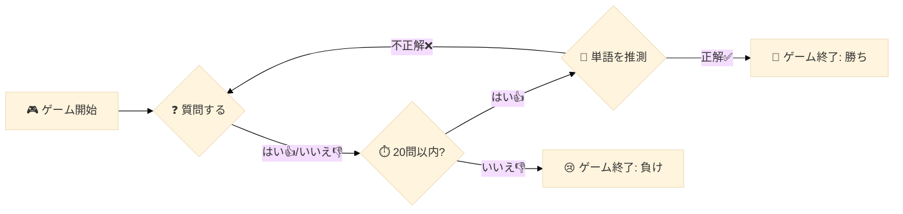

** @@@ Jupyter Notebook numver 0, the number of votes :188 @@@ **

---The following area is a Markdown cell (cell numver is 0)---
```markdown
# 要約 
このJupyter Notebookは、Kaggleコンペティション「LLM 20 Questions」におけるエージェント作成プロセスを示しています。具体的には、20の質問ゲームを効果的にプレイするための言語モデル（LLM）エージェントを生成し、最終的に `submission.tar.gz` ファイルを作成します。このファイルはコンペティションに提出するために使用されます。

### 問題と目的
「LLM 20 Questions」は、プレイヤーが質問を通じて特定のターゲットを推測するゲームです。このノートブックは、質問者と回答者の役割を持つAIエージェントを開発し、効率的にターゲットを推測する能力を高めることを目的としています。

### 使用されている手法とライブラリ
- **ライブラリと依存関係**: 
  - `immutabledict` や `sentencepiece` などのライブラリをインストールし、モデルの動作に必要なファイルを適切なディレクトリに配置します。
  - GitHubから`gemma_pytorch`リポジトリをクローンし、モデル用のファイルを作成した作業ディレクトリに移動させます。

- **モデルの設定と初期化**: 
  - モデルの初期化にはGemmaライブラリを使用し、特に`GemmaForCausalLM`クラスが利用されます。ここでは7Bおよび2Bのモデル設定が用意されており、指定したバリアントに応じて適切なモデルを動的に選択しています。

- **プロンプトフォーマッタ**: 
  - `GemmaFormatter`クラスを定義して、ゲームのプロンプトを適切にフォーマットし、ユーザーのインプットをモデルに渡すための準備を行います。

- **エージェントクラス**: 
  - `GemmaQuestionerAgent`と`GemmaAnswererAgent`という2つのエージェントクラスが実装され、質問者と回答者の役割をそれぞれ担当します。それぞれのクラスは内部でプロンプトを生成し、モデルからの応答を解析して正しい質問や答えを生成します。

### 出力
最終的に、ノートブックは`submission.tar.gz`ファイルを生成し、それをコンペティションに提出できる状態にします。この成果物には、すべての必要なモデルファイルと実行可能なコードが含まれています。

このノートブックは、言語モデルが協調プレイに基づいた推理を行うための出発点として機能します。参加者はこの基盤を元に、自らのモデルや戦略を実装し、さらに改善することが期待されています。
```

---The following area is a Markdown cell (cell numver is 1)---
```markdown
このノートブックは、**LLM 20 Questions** のエージェント作成プロセスを示しています。このノートブックを実行すると、`submission.tar.gz` ファイルが生成されます。このファイルは、右側の **Submit to competition** 見出しから直接提出することができます。あるいは、ノートブックビューアから *Output* タブをクリックし、`submission.tar.gz` を見つけてダウンロードします。競技のホームページの左上にある **Submit Agent** をクリックしてファイルをアップロードし、提出を行ってください。
```

---The following area is a Code cell (cell numver is 2)---
```python
%%bash
cd /kaggle/working  # 作業ディレクトリに移動します
pip install -q -U -t /kaggle/working/submission/lib immutabledict sentencepiece  # 必要なライブラリをインストールします
git clone https://github.com/google/gemma_pytorch.git > /dev/null  # gemma_pytorchリポジトリをクローンします
mkdir /kaggle/working/submission/lib/gemma/  # gemma用のディレクトリを作成します
mv /kaggle/working/gemma_pytorch/gemma/* /kaggle/working/submission/lib/gemma/  # gemmaのファイルを移動させます
```

---The following area is a Code cell (cell numver is 3)---
```python
%%writefile submission/main.py
# 設定
import os
import sys

# **重要:** コードがノートブックとシミュレーション環境の両方で動作するように、システムパスを次のように設定します。
KAGGLE_AGENT_PATH = "/kaggle_simulations/agent/"
if os.path.exists(KAGGLE_AGENT_PATH):  # KAGGLE_AGENT_PATHが存在するか確認します
    sys.path.insert(0, os.path.join(KAGGLE_AGENT_PATH, 'lib'))  # KAGGLE_AGENT_PATHのlibディレクトリをパスに追加します
else:
    sys.path.insert(0, "/kaggle/working/submission/lib")  # 指定のパスが存在しない場合、別のパスを追加します

import contextlib
import os
import sys
from pathlib import Path

import torch
from gemma.config import get_config_for_7b, get_config_for_2b  # gemmaモデル設定の取得
from gemma.model import GemmaForCausalLM  # gemmaモデルのインポート

if os.path.exists(KAGGLE_AGENT_PATH):  # KAGGLE_AGENT_PATHが存在する場合
    WEIGHTS_PATH = os.path.join(KAGGLE_AGENT_PATH, "gemma/pytorch/7b-it-quant/2")  # 重みファイルのパスを設定
else:
    WEIGHTS_PATH = "/kaggle/input/gemma/pytorch/7b-it-quant/2"  # 他のパスを設定

# プロンプトフォーマット
import itertools
from typing import Iterable

class GemmaFormatter:
    _start_token = '<start_of_turn>'  # ターンの開始トークン
    _end_token = '<end_of_turn>'  # ターンの終了トークン

    def __init__(self, system_prompt: str = None, few_shot_examples: Iterable = None):
        self._system_prompt = system_prompt  # システムプロンプトの保存
        self._few_shot_examples = few_shot_examples  # Few-shot例の保存
        self._turn_user = f"{self._start_token}user\n{{}}{self._end_token}\n"  # ユーザーのターンをフォーマット
        self._turn_model = f"{self._start_token}model\n{{}}{self._end_token}\n"  # モデルのターンをフォーマット
        self.reset()  # 状態をリセット

    def __repr__(self):
        return self._state  # 現在の状態を返す

    def user(self, prompt):
        self._state += self._turn_user.format(prompt)  # ユーザーのプロンプトを追加
        return self

    def model(self, prompt):
        self._state += self._turn_model.format(prompt)  # モデルのプロンプトを追加
        return self

    def start_user_turn(self):
        self._state += f"{self._start_token}user\n"  # ユーザーターンの開始を追加
        return self

    def start_model_turn(self):
        self._state += f"{self._start_token}model\n"  # モデルターンの開始を追加
        return self

    def end_turn(self):
        self._state += f"{self._end_token}\n"  # ターンの終了を追加
        return self

    def reset(self):
        self._state = ""  # 状態を初期化
        if self._system_prompt is not None:
            self.user(self._system_prompt)  # システムプロンプトを追加
        if self._few_shot_examples is not None:
            self.apply_turns(self._few_shot_examples, start_agent='user')  # Few-shot例のターンを適用
        return self

    def apply_turns(self, turns: Iterable, start_agent: str):
        formatters = [self.model, self.user] if start_agent == 'model' else [self.user, self.model]  # ターンの実行順序を決定
        formatters = itertools.cycle(formatters)  # 順序を循環させる
        for fmt, turn in zip(formatters, turns):  # フォーマッタとターンを結合
            fmt(turn)  # フォーマッタでターンを処理
        return self


# エージェント定義
import re

@contextlib.contextmanager
def _set_default_tensor_type(dtype: torch.dtype):
    """指定されたdtypeにデフォルトのtorch dtypeを設定します。"""
    torch.set_default_dtype(dtype)  # デフォルトのdtypeを変更
    yield
    torch.set_default_dtype(torch.float)  # 元のdtypeに戻す

class GemmaAgent:
    def __init__(self, variant='7b-it-quant', device='cuda:0', system_prompt=None, few_shot_examples=None):
        self._variant = variant  # エージェントのバリアントを保存
        self._device = torch.device(device)  # 使用するデバイスを指定
        self.formatter = GemmaFormatter(system_prompt=system_prompt, few_shot_examples=few_shot_examples)  # フォーマッタを初期化

        print("モデルの初期化中")
        model_config = get_config_for_2b() if "2b" in variant else get_config_for_7b()  # モデル設定を取得
        model_config.tokenizer = os.path.join(WEIGHTS_PATH, "tokenizer.model")  # トークナイザーのパスを設定
        model_config.quant = "quant" in variant  # 量子化設定

        with _set_default_tensor_type(model_config.get_dtype()):  # データ型を設定しモデルを初期化
            model = GemmaForCausalLM(model_config)  # モデルを初期化
            ckpt_path = os.path.join(WEIGHTS_PATH , f'gemma-{variant}.ckpt')  # 重みのチェックポイントパスを設定
            model.load_weights(ckpt_path)  # 重みをロード
            self.model = model.to(self._device).eval()  # モデルを指定デバイスに移動し評価モードにする

    def __call__(self, obs, *args):
        self._start_session(obs)  # セッションを開始
        prompt = str(self.formatter)  # フォーマッタの内容を文字列に変換
        response = self._call_llm(prompt)  # LLMにプロンプトを渡して応答を得る
        response = self._parse_response(response, obs)  # 応答を解析
        print(f"{response=}")  # 応答をコンソールに出力
        return response

    def _start_session(self, obs: dict):
        raise NotImplementedError  # メソッドを抽象化

    def _call_llm(self, prompt, max_new_tokens=32, **sampler_kwargs):
        if sampler_kwargs is None:
            sampler_kwargs = {  # サンプリングのパラメータを設定
                'temperature': 0.01,  # 温度パラメータ
                'top_p': 0.1,  # トップ確率
                'top_k': 1,  # トップKの設定
        }
        response = self.model.generate(  # モデルから新しいトークンを生成
            prompt,
            device=self._device,
            output_len=max_new_tokens,  # 最大トークン数
            **sampler_kwargs,  # その他のサンプリングパラメータ
        )
        return response

    def _parse_keyword(self, response: str):
        match = re.search(r"(?<=\*\*)([^*]+)(?=\*\*)", response)  # キーワードを抽出
        if match is None:
            keyword = ''  # キーワードが見つからない場合
        else:
            keyword = match.group().lower()  # キーワードを小文字に変換
        return keyword

    def _parse_response(self, response: str, obs: dict):
        raise NotImplementedError  # メソッドを抽象化


def interleave_unequal(x, y):
    return [  # 不均一なリストを交互に結合
        item for pair in itertools.zip_longest(x, y) for item in pair if item is not None
    ]


class GemmaQuestionerAgent(GemmaAgent):
    def __init__(self, *args, **kwargs):
        super().__init__(*args, **kwargs)  # 親クラスの初期化

    def _start_session(self, obs):
        self.formatter.reset()  # フォーマッタをリセット
        self.formatter.user("Let's play 20 Questions. You are playing the role of the Questioner.")  # ゲーム開始メッセージ
        turns = interleave_unequal(obs.questions, obs.answers)  # 質問と回答を交互に結合
        self.formatter.apply_turns(turns, start_agent='model')  # ターンを適用
        if obs.turnType == 'ask':
            self.formatter.user("Please ask a yes-or-no question.")  # 質問するよう指示
        elif obs.turnType == 'guess':
            self.formatter.user("Now guess the keyword. Surround your guess with double asterisks.")  # キーワード予想の指示
        self.formatter.start_model_turn()  # モデルターンを開始

    def _parse_response(self, response: str, obs: dict):
        if obs.turnType == 'ask':
            match = re.search(".+?\?", response.replace('*', ''))  # 質問を抽出
            if match is None:
                question = "Is it a person?"  # デフォルトの質問
            else:
                question = match.group()  # 抽出した質問
            return question
        elif obs.turnType == 'guess':
            guess = self._parse_keyword(response)  # キーワードの予想を解析
            return guess
        else:
            raise ValueError("Unknown turn type:", obs.turnType)  # エラーハンドリング


class GemmaAnswererAgent(GemmaAgent):
    def __init__(self, *args, **kwargs):
        super().__init__(*args, **kwargs)  # 親クラスの初期化

    def _start_session(self, obs):
        self.formatter.reset()  # フォーマッタをリセット
        self.formatter.user(f"Let's play 20 Questions. You are playing the role of the Answerer. The keyword is {obs.keyword} in the category {obs.category}.")  # ゲーム開始メッセージ
        turns = interleave_unequal(obs.questions, obs.answers)  # 質問と回答を交互に結合
        self.formatter.apply_turns(turns, start_agent='user')  # ターンを適用
        self.formatter.user(f"The question is about the keyword {obs.keyword} in the category {obs.category}. Give yes-or-no answer and surround your answer with double asterisks, like **yes** or **no**.")  # 回答指示メッセージ
        self.formatter.start_model_turn()  # モデルターンを開始

    def _parse_response(self, response: str, obs: dict):
        answer = self._parse_keyword(response)  # 回答を解析
        return 'yes' if 'yes' in answer else 'no'  # "yes"であればyes、その他はnoを返す


# エージェント作成
system_prompt = "You are an AI assistant designed to play the 20 Questions game. In this game, the Answerer thinks of a keyword and responds to yes-or-no questions by the Questioner. The keyword is a specific person, place, or thing."  # システムプロンプトの設定

few_shot_examples = [  # Few-shot例の設定
    "Let's play 20 Questions. You are playing the role of the Questioner. Please ask your first question.",
    "Is it a person?", "**no**",
    "Is it a place?", "**yes**",
    "Is it a country?", "**yes** Now guess the keyword.",
    "**France**", "Correct!",
]

# **重要:** エージェントはグローバルに定義します。必要なエージェントだけをロードするため。
# 両方をロードすると、OOM（Out of Memory）に繋がる可能性があります。
agent = None

def get_agent(name: str):
    global agent
    
    if agent is None and name == 'questioner':
        agent = GemmaQuestionerAgent(
            device='cuda:0',
            system_prompt=system_prompt,
            few_shot_examples=few_shot_examples,
        )  # 質問者エージェントの初期化
    elif agent is None and name == 'answerer':
        agent = GemmaAnswererAgent(
            device='cuda:0',
            system_prompt=system_prompt,
            few_shot_examples=few_shot_examples,
        )  # 回答者エージェントの初期化
    assert agent is not None, "Agent not initialized."  # エージェントが初期化されているか確認

    return agent  # エージェントを返す

def agent_fn(obs, cfg):
    if obs.turnType == "ask":
        response = get_agent('questioner')(obs)  # 質問者エージェントの応答を取得
    elif obs.turnType == "guess":
        response = get_agent('questioner')(obs)  # 質問者エージェントの応答を取得
    elif obs.turnType == "answer":
        response = get_agent('answerer')(obs)  # 回答者エージェントの応答を取得
    if response is None or len(response) <= 1:  # 応答が空か長さが1以下の場合
        return "yes"  # デフォルトの応答
    else:
        return response  # 通常の応答を返す
```

---The following area is a Code cell (cell numver is 4)---
```python
!apt install pigz pv > /dev/null  # pigzとpvをインストールします
```

---The following area is a Code cell (cell numver is 5)---
```python
!tar --use-compress-program='pigz --fast --recursive | pv' -cf submission.tar.gz -C /kaggle/working/submission . -C /kaggle/input/ gemma/pytorch/7b-it-quant/2  # submission.tar.gzファイルを作成
```

---The following area is a Markdown cell (cell numver is 6)---
```markdown
---

# コメント 

> ## Samar Elhissi
> 
> 例をありがとう、ローカルでテストするにはどうすれば良いですか？
> 
> 
> 
> > ## Valentin Baltazar
> > 
> > ハードウェアがあるか確認してください…このLLMは多くの計算を必要とし、トレーニングとファインチューニングには強力なGPUが必要です。クラウドを利用するのが、はるかに簡単です。
> > 
> > 

---

> ## Michael Kamal 92
> 
> ありがとうございます、few_shot_examplesについて質問したいのですが、どのように作成すれば良いですか？
> > 例えば、( 'is it place?', 'yes-or-no' )のようにする必要がありますか、それとも( 'is it place?', 'yes', ) のようにすれば良いですか？それとも( 'is it place?', 'yes', 'Now guess the keyword' )でしょうか？それとも( 'is it place?', 'no', 'Now guess the keyword', 'France' )でしょうか？それとも( 'is it place?', 'yes', 'France' )でしょうか？どれが正しい質問、回答、予測の作り方ですか？
> 
> もう一つの質問ですが、Gemmaはfew_shot_examplesでトレーニングしますか？

---

> ## Yukky_2801
> 
> こんにちは、私はKaggleの初心者です。あなたのノートブックを実行すると、以下のエラーが出ました：
> 
> tar: gemma/pytorch/7b-it-quant/2: Cannot stat: No such file or directory
> 
> 1.37MiB 0:00:00 [36.4MiB/s] [<=> ]
> 
> tar: 前のエラーのために失敗したと終了します。
> 
> submission.tar.gzをエラーと共に提出できません。どういうことかわからないのですが、解決策を提供していただけますか？

> ## Andres H. Zapke
> > もちろん「gemma/pytorch/7b-it-quant/2」このパスにアクセスしようとしています。ファイルがそのパスにあることを確認してください（ノートブックの右側を見て、gemmaモデルがそこのパスと一致しているか確認してください）。
>   
> > ## Aryan Singh
> > > Gemma 7b-it-quant V2を追加するには、Add Input機能を使用します。
> > > 
> > > まず、こちらでライセンスを受け入れることを確認してください：[https://www.kaggle.com/models/google/gemma](https://www.kaggle.com/models/google/gemma)
> > 
> > 
> > > ## Talal Mufti
> > > > すべてのファイルがそのパスにあることを確認した後、依然として問題が発生したため、bashコマンドを少し修正しました。個人的には、これが私にとってうまくいきました：
> > > > !tar --use-compress-program='pigz --fast --recursive | pv' -f submission.tar.gz -c /kaggle/working/submission . -c /kaggle/input/gemma/pytorch/7b-it-quant/2

---

> ## Muhammad Hadi13
> 
> なぜファイルをコピーして実行しているのに、常に1.35MB以上の出力が生成されず、バリデーションエピソードで失敗するのかわかりません。Ryanの出力は約7GBでした。この件について助けが必要です！！
> 
> 
> 1.37MiB 0:00:00 [36.4MiB/s] [<=> ]
> > tar: gemma/pytorch: Cannot stat: No such file or directory
> 
> tar: 前のエラーのために終了しました。

> ## Aryan Singh
> > > Gemma 7b-it-quant V2を事前に追加する必要があります。
> > > 
> > > ノートブック内でモデルを追加するには、Add input機能を使用します。
> > > 
> > > まず、こちらでライセンスを受け入れることを確認してください：[https://www.kaggle.com/models/google/gemma](https://www.kaggle.com/models/google/gemma)

---

> ## Ship of Theseus
> 
> Thank Ryan, greate work! Nice code to run on localhost and sharing to Kaggle Community
> 
> 

---

> ## shiv_314
> 
> 皆さん！一つ助けが必要です。gemmaパッケージでインポートエラーが発生しています。
> 
> Pythonのためにすでに正しいシステムパスを追加しましたが、それでも同じ問題が発生しています。助けてください！

---

> ## dedq
> 
> Thank Ryan, greate work! Nice code to run on localhost and sharing to Kaggle Community

---

> ## Code Hacker
> 
> このノートブックの出力ファイルtar.gzを提出しようとしたが、失敗しました…

> ## Code Hacker
> > > このモデルに同意しなかった。下の赤いボタンをクリック…

---

> ## JAPerez
> 
> Great work Ryan!

---

> ## philipha2
> 
> こんにちは、私はこのコンペの初心者です。あなたのノートブックを実行して提出しようとしました。
> 提出物のファイルであるsubmission.tar.gzをどこに置けばよいのでしょうか？ 
> Submit agentsボタンをクリックした後、このファイルをそのまま提出すればよいですか？ 
> 時間がかかります
> 基本的な質問かもしれませんが、返信ありがとうございます！

> ## Kanchan Maurya
> > > Submit agentsをクリックした後、このファイルを提出しています。それに時間がかかるのは、初期シミュレーションが機能しているためです。

---

> ## vj4science
> 
> Thanks Ryan - this is a good head start to the competition! much appreciated!

---

> ## gb_kwon
> 
> Thank you so much for your COOL guidelines!

---

> ## Andres H. Zapke
> 
> main.pyで、gemma_pytorchライブラリを次のようにインポートしています：from gemma.config。
> 
> これは私には機能しませんが、gemmaとインポートするとエラーは出ません。
> 
> 自分のローカルのgemmaモジュールのパスを手動で指定するのと、Pythonライブラリ名でインポートするのを試みましたが。何かアイデアはありますか？

---

> ## Duy Thai
> 
> こんにちは[@ryanholbrook](https://www.kaggle.com/ryanholbrook)、あなたのノートブックを試したところ、「添付されたモデルはアクセスするために追加の手順が必要です。詳細はModelパネルを参照してください。」というメッセージが表示されました。それについてはどうすればよいでしょうか？
> 
> パネルを開いたとき、私はこれだけを見ています：

> ## Andres H. Zapke
> > > "Models"へ行き、Gemmaを検索し、モデルのライセンスを受け入れます。

> ## Duy Thai
> > > ありがとうございます！

---

> ## Kai_Huang
> 
> こんにちは、私はKaggleの初心者です。あなたの !tar --use-compress-program='pigz --fast --recursive | pv' -cf submission.tar.gz -C /kaggle/working/submission . -C /kaggle/input/ gemma/pytorch/7b-it-quant/2 のコードブロックを実行したとき、次のエラーが出ました：
> 
> tar: gemma/pytorch/7b-it-quant/2: Cannot stat: No such file or directory
> 
> 1.37MiB 0:00:00 [36.4MiB/s] [<=> ]
> 
> tar: 前のエラーのために終了しました
> 
> どういうことかわからないのですが、教えていただけますか？ありがとうございます！

> ## Kai_Huang
> > > ああ、わかりました。モデルをノートブックに入力していなかったのですね😱

> ## D Prince Armand KOUMI
> > > モデルがない場合は、追加してみてください。

---

> ## Qusay AL-Btoush
> 
> とても良い、Ryan 

---
```

** @@@ Jupyter Notebook numver 1, the number of votes :93 @@@ **

---The following area is a Markdown cell (cell numver is 0)---
```markdown
# 要約 
このJupyter Notebookは、Kaggleの「LLM 20 Questions」競技用エージェントの作成とテストに焦点を当てています。具体的には、LLM 20 Questionsゲームを実行するための簡単なエージェントを設計し、環境をセットアップする方法を説明しています。

### 問題の概要
「LLM 20 Questions」は、2対2のチーム戦における言葉当てゲームで、参加者は20の制限された質問を通じて正解を推測します。このノートブックでは、Kaggle環境でこのゲームをシミュレーションし、エージェントの動作や応答をテストするための方法を提供しています。

### 解決手法
ノートブックでは、以下の主要なステップでエージェントを作成し、それをテストしています。
1. **シンプルなエージェントの構築**: Pythonの関数を使用して、観察（obs）と設定（cfg）を入力とし、ターンタイプに応じた応答を生成する4つのシンプルなエージェントを定義しています（例：simple_agent1, simple_agent2 など）。
2. **環境の初期化**: Kaggleの環境を「llm_20_questions」を使用して作成し、キーワードや代替キーワードの設定を確認・変更する方法を示しています。
3. **ゲームの実行**: 定義したエージェントを使用してゲームを実行し、実際のゲームプレイのアウトプットを取得します。
4. **提出可能なエージェントの準備**: エージェントのPythonコードを「main.py」に書き込み、サポートファイルと一緒にアーカイブ化して提出する方法を説明しています。

### 使用ライブラリ
- **kaggle_environments**: このライブラリを用いて、Kaggle環境のセットアップ、エージェントの動作をシミュレーションし、ゲームを実行しています。

### デバッグと設定
また、デバッグのためのヒントも含まれており、エージェントがどのように動作しているのかを詳細にチェックする方法、ゲーム実行時の設定変更方法なども説明しています。各エージェントのステップや実行結果を視覚的に観察するためのレンダリング機能も提案されています。

このノートブックは、初めてLLM 20 Questionsに取り組むユーザーに対して、エージェントの設計と環境の設定に関する実践的なガイドを提供するものです。
```

---The following area is a Markdown cell (cell numver is 1)---
```markdown
# 環境のヒント：ノートブックでLLM 20 Questionsを実行する方法


LLM 20 QuestionsやKaggle環境を使用した他のコンペティションでエージェントをテストしデバッグするためには、ノートブック上で環境を実行できることが便利です。ここでは、役立つかもしれないヒントと説明を示します。

# 簡単なエージェントを作成する

もし実験したいだけなら、エージェントはPythonの関数としてとてもシンプルに作ることができます。エージェントは、obs（観察）とcfg（設定）という2つの入力を持ち、テキストの応答を出力します。

エージェントは、3つのturnTypes（"ask"、"guess"、"answer"）に対応できる必要があります。「answer」としての応答は「yes」または「no」でなければなりません。

以下に4つの簡単なエージェントの例を示します。
```

---The following area is a Code cell (cell numver is 2)---
```python
def simple_agent1(obs, cfg):
    # エージェントが推測者で、turnTypeが"ask"の場合
    if obs.turnType == "ask": response = "それはアヒルですか？"
    elif obs.turnType == "guess": response = "アヒル"
    elif obs.turnType == "answer": response = "いいえ"
    return response

def simple_agent2(obs, cfg):
    # エージェントが推測者で、turnTypeが"ask"の場合
    if obs.turnType == "ask": response = "それは鳥ですか？"
    elif obs.turnType == "guess": response = "鳥"
    elif obs.turnType == "answer": response = "いいえ"
    return response

def simple_agent3(obs, cfg):
    # エージェントが推測者で、turnTypeが"ask"の場合
    if obs.turnType == "ask": response = "それは豚ですか？"
    elif obs.turnType == "guess": response = "豚"
    elif obs.turnType == "answer": response = "いいえ"
    return response

def simple_agent4(obs, cfg):
    # エージェントが推測者で、turnTypeが"ask"の場合
    if obs.turnType == "ask": response = "それは牛ですか？"
    elif obs.turnType == "guess": response = "牛"
    elif obs.turnType == "answer": response = "いいえ"
    return response
```

---The following area is a Markdown cell (cell numver is 3)---
```markdown
# ゲーム環境を作成して設定する

Kaggle環境は、`make()`関数を用いて、*環境*名（`"llm_20_questions"`）といくつかのオプション設定、例えば*configuration*や*info*で作成されます。競技と同じようにゲームを実行したい場合は、デフォルト設定を使用するだけで十分です。
```

---The following area is a Code cell (cell numver is 4)---
```python
import kaggle_environments
env = kaggle_environments.make(environment="llm_20_questions")
# （"No pygame installed"というエラーは無視できます）
```

---The following area is a Markdown cell (cell numver is 5)---
```markdown
環境を初期化すると、推測すべきキーワードが設定されます。これを`kaggle_environments.envs.llm_20_questions.llm_20_questions.keyword`で確認したり変更したりできます。
```

---The following area is a Code cell (cell numver is 6)---
```python
print("このセッションのキーワードは: ")
print(kaggle_environments.envs.llm_20_questions.llm_20_questions.keyword)
print(" ")
print("一部のキーワードには、代替の推測（alts）のリストがある場合があります。")
print("このセッションの代替キーワードのリストは:")
print(kaggle_environments.envs.llm_20_questions.llm_20_questions.alts)
```

---The following area is a Markdown cell (cell numver is 7)---
```markdown
# LLM 20 Questionsを実行する（デフォルト）

作成した環境（`env`）を使って、ゲームをこの環境で実行します。ゲームを実行する際には、4つのエージェントのリストを提出する必要があります：
* "Agent1"（チーム1の推測者）、 
* "Agent2"（チーム1の回答者）、 
* "Agent3"（チーム2の推測者）、 
* "Agent4"（チーム2の回答者）。 

競技では、ランダムにチームメイトとペアになり、推測者または回答者のいずれかの役割を担当します。

（最初にこのコンペティションを始めたとき、私はエージェントがチームのために推測者と回答者の両方の役割を果たすと思い込んでいました。しかし、競技では他の誰かとペアになります。協力する能力によって、良い結果や悪い結果が決まります。）
```

---The following area is a Code cell (cell numver is 8)---
```python
%%time
game_output = env.run(agents=[simple_agent1, simple_agent2, simple_agent3, simple_agent4])
```

---The following area is a Markdown cell (cell numver is 9)---
```markdown
この例では、ゲームがすぐに完了します。なぜなら、シンプルなエージェントは即座に応答するからです。実際のゲームでは、大規模なLLMをエージェントとして使用する場合、各ステップに1分かかることもあるため、総ゲーム時間が1時間かかることがあります！

ゲームの各ステップからのデータは`game_output`で確認できます。

ゲームを視覚的に観察したい場合は、レンダリングすることができます。
```

---The following area is a Code cell (cell numver is 10)---
```python
env.render(mode="ipython", width=600, height=500)
```

---The following area is a Markdown cell (cell numver is 11)---
```markdown
# 提出可能なエージェントを作成する

コンペティションにエージェントを提出するには、エージェントのPythonコードを`main.py`というファイルに書き込み、このファイルとサポートファイルを`submission.tar.gz`にまとめる必要があります。

以下は簡単な例です。もちろん、実際のコンペティションでは、公式スターターノートブックで使用されるような実際のLLMを使いたいでしょう（https://www.kaggle.com/code/ryanholbrook/llm-20-questions-starter-notebook）。ノートブックでLLMエージェントを実行すると、より多くの時間とメモリが必要になるため、プレイヤー1としてLLMエージェントをテストする場合は、プレイヤー2にシンプルなエージェントを配置することをお勧めします。

* サポートファイルを配置するための`/kaggle/working/submission`ディレクトリを作成し、その中に`lib`というサブディレクトリを作成します。
```

---The following area is a Code cell (cell numver is 12)---
```python
import os
submission_directory = "/kaggle/working/submission"
submission_subdirectory = "lib"
# メインディレクトリが存在しない場合は作成します
if not os.path.exists(submission_directory):
    os.mkdir(submission_directory)
    subdirectory_path = os.path.join(submission_directory, submission_subdirectory)
    os.mkdir(subdirectory_path)
```

---The following area is a Code cell (cell numver is 13)---
```python
# libディレクトリに保存するための例ファイルを作成します
import csv
with open(os.path.join(subdirectory_path, "example.csv"),mode='w') as file:
    writer = csv.writer(file)
    writer.writerow(["牛", "馬"])
```

---The following area is a Markdown cell (cell numver is 14)---
```markdown
* エージェントのための`main.py`のPythonコードを書く
* 環境は`main.py`の最後の関数をエージェントとして使用します。この例では`agent_fun()`です。
```

---The following area is a Code cell (cell numver is 15)---
```python
%%writefile /kaggle/working/submission/main.py

import os
import sys
import csv
import random


# サブミッション/libディレクトリに他のファイル（例：モデルの重み）を置いている場合は、パスを設定する必要があります
KAGGLE_COMPETITION_PATH = "/kaggle_simulations/agent/" # コンペティションパス
if os.path.exists(KAGGLE_COMPETITION_PATH):  # コンペティション内で実行している場合
    subdirectory_path = os.path.join(KAGGLE_COMPETITION_PATH, "lib")
else: # ノートブックで実行している場合
    subdirectory_path = os.path.join("/kaggle/working/submission/", "lib")
sys.path.insert(0, subdirectory_path)


# 例ファイルを読み込む
with open(os.path.join(subdirectory_path,"example.csv"), mode='r') as file:
    reader = csv.reader(file)
    guess_list = list(reader)
    guess_list = guess_list[0]

# 例ファイルからランダムな"動物"をグローバル変数として設定する
animal = random.choice(guess_list)
    
# main.pyの最後の関数がエージェント関数になります
def agent_fn(obs, cfg):
    
    # エージェントが推測者で、turnTypeが"ask"の場合
    if obs.turnType == "ask":
        response = f'それは{animal}のように見えますか？'
    # エージェントが推測者で、turnTypeが"guess"の場合
    elif obs.turnType == "guess":
        if obs.answers[-1]=="yes":
            response = animal
        else:
            response = "ペンギン"
    # エージェントが回答者の場合
    elif obs.turnType == "answer":
        if obs.keyword in obs.questions[-1]:
            response = "yes"
        else:
            response = "no"
        
    return response
```

---The following area is a Markdown cell (cell numver is 16)---
```markdown
この`main.py`ファイルとエージェントは、`/lib/example.csv`サポートファイルと一緒に提出する準備が整っています。
```

---The following area is a Code cell (cell numver is 17)---
```python
!apt install pigz pv > /dev/null
!tar --use-compress-program='pigz --fast --recursive | pv' -cf submission.tar.gz -C /kaggle/working/submission .
```

---The following area is a Markdown cell (cell numver is 18)---
```markdown
ノートブック内の`main.py`のエージェントをチーム1の両方のプレイヤーとして実行でき、チーム2にシンプルなエージェント3とシンプルなエージェント4を使います。
```

---The following area is a Code cell (cell numver is 19)---
```python
game_output = env.run(agents=["/kaggle/working/submission/main.py", "/kaggle/working/submission/main.py", simple_agent3, simple_agent4])
env.render(mode="ipython", width=600, height=500)
```

---The following area is a Markdown cell (cell numver is 20)---
```markdown
# デバッグのヒント

設計やデバッグを行う際には、通常、環境を作成する際にオプション引数のいくつかを変更したいと思います。これには次のようなものがあります：

`env = make(environment, configuration=None, info=None, steps=None, logs=None, debug=False, state=None)`

`env.specification`で仕様を確認することで、`configuration`や環境内で定義された他のオブジェクトについて学ぶことができます。これには説明が含まれ、デフォルトの値が示されます。

新しいエージェントに取り組む際には、短いエピソードを実行するように設定を変更し、`debug=True`を設定して、エージェントから出力される詳細な情報を確認することをお勧めします。

デバッグに適した新しい環境があります。
```

---The following area is a Code cell (cell numver is 21)---
```python
# デバッグ用に、2ラウンドのゲームを実行します
debug_config = {'episodeSteps': 7,     # 初期ステップにラウンドごとの3ステップ（ask/answer/guess）を追加
                'actTimeout': 5,       # ラウンドごとのエージェントの時間（秒）；デフォルトは60
                'runTimeout': 60,      # エピソードの最大時間（秒）；デフォルトは1200
                'agentTimeout': 3600}  # 使用されないフィールド；デフォルトは3600

env = kaggle_environments.make("llm_20_questions", configuration=debug_config, debug=True)
```

---The following area is a Markdown cell (cell numver is 22)---
```markdown
注意：セッションはすでに推測すべきキーワードを設定しています。したがって、別のゲームを実行すると、同じキーワードを推測することになります！
```

---The following area is a Code cell (cell numver is 23)---
```python
print(kaggle_environments.envs.llm_20_questions.llm_20_questions.keyword)
```

---The following area is a Markdown cell (cell numver is 24)---
```markdown
デバッグ中に、キーワードを手動で設定したり、キーワードリストからランダムに選択したりすることができます。
```

---The following area is a Code cell (cell numver is 25)---
```python
keyword = "アヒル"
alts = ["そのアヒル","アヒル"]
kaggle_environments.envs.llm_20_questions.llm_20_questions.category = "例"
kaggle_environments.envs.llm_20_questions.llm_20_questions.keyword_obj = {'keyword':keyword,'alts':alts}
kaggle_environments.envs.llm_20_questions.llm_20_questions.keyword = keyword
kaggle_environments.envs.llm_20_questions.llm_20_questions.alts = alts
```

---The following area is a Markdown cell (cell numver is 26)---
```markdown
エージェントがデバッグのために情報を印刷できるようにしましょう。シンプルエージェント1に、`obs`内の情報を表示するprint文を追加しました。
```

---The following area is a Code cell (cell numver is 27)---
```python
def simple_verbose_agent1(obs, cfg):
    
    # エージェントが推測者で、turnTypeが"ask"の場合
    if obs.turnType == "ask":
        response = "それはアヒルですか？"
    # エージェントが推測者で、turnTypeが"guess"の場合
    elif obs.turnType == "guess":
        response = "アヒル"
    # エージェントが回答者の場合
    elif obs.turnType == "answer":
        response = "いいえ"
    
    # デバッグ情報を印刷
    print("====================")
    print(f"ステップ = {obs.step}")
    print(f"turnType = {obs.turnType}")
    print("obs =")
    print(obs)
    print(" ")
    print(f'応答 = "{response}"')
    
    
    return response
```

---The following area is a Markdown cell (cell numver is 28)---
```markdown
このsimple_verbose_agent1をチーム1の両方のプレイヤーとして使用すると、3つのturnタイプ（ask/guess/answer）を観察できます。
```

---The following area is a Code cell (cell numver is 29)---
```python
game_output = env.run(agents=[simple_verbose_agent1,simple_verbose_agent1, simple_agent3, "/kaggle/working/submission/main.py"])
```

---The following area is a Code cell (cell numver is 30)---
```python
env.render(mode="ipython", width=600, height=500)
```

---The following area is a Markdown cell (cell numver is 31)---
```markdown
---

# コメント 

> ## bluekeroro
> 
> [@rturley](https://www.kaggle.com/rturley) 共有してくれてありがとう！！でも、ちょっと質問があります。この2つの入力データファイルllm_20_questions.pyとllm_20_questions.jsはどのように機能しますか？
> 
> 
> > ## RS Turleyトピック作成者
> > 
> > どういたしまして！
> > 
> > それらはコンペティションに付随する標準的なファイルです。上記の例ノートブックでは直接使用されていません。
> > 
> > しかし、デバッグ時には参照するのに役立ちます。これらは、kaggle_environmentsからこの特定の環境を実行するために必要なコンポーネントです。詳細はGitHubリポジトリで確認できます（[https://github.com/Kaggle/kaggle-environments/tree/master/kaggle_environments/envs/llm_20_questions](https://github.com/Kaggle/kaggle-environments/tree/master/kaggle_environments/envs/llm_20_questions)）。
> > 
> > 特に：
> > 
> > - llm_20_questions.pyにはゲームのメインコードが含まれており、大文字と小文字の違いが重要かどうかなどの詳細を確認できます。
> > 
> > - llm_20_questions.jsは過去のゲームをレンダリングするためのJavaScriptです。以前のKaggle環境コンペでは、エージェントの行動を視覚的に観察する際にデフォルトのレンダリングを変更するのが役立つことがありましたが、今回は単にテキストを印刷する方が役立つと思われます。
> > 
> > 
> > > ## bluekeroro
> > > 
> > > わかりました。詳しくて親切な回答をありがとう。
> > > 
> > > 
> 
> 

---

> ## Matin Mahmoudi ✨
> 
> あなたのノートブックは魅力的なアプローチを提供しています、[@rturley](https://www.kaggle.com/rturley)。インタラクティブな要素と明確な説明により、非常にユーザーフレンドリーです。素晴らしい友人！
> 
> 

---

> ## Payam Amanat
> 
> 有益で非常に役立つノートブックです、親愛なる[@rturley](https://www.kaggle.com/rturley) ありがとう。
> 
> あなたのノートブックについての意見を知ることができれば素晴らしいです。
> 
> 

---

> ## Zeeshan Latif
> 
> [@rturley](https://www.kaggle.com/rturley) あなたの体系的で明確なプレゼンテーションは非常に有益でした。ありがとう！
> 
> 
> > ## RS Turleyトピック作成者
> > 
> > 役立てば幸いです！
> > 
> 
>
```

** @@@ Jupyter Notebook numver 2, the number of votes :70 @@@ **

---The following area is a Markdown cell (cell numver is 0)---
```markdown
# 要約 
このJupyterノートブックは、Kaggleの「20 Questions」コンペティションに向けて、Hugging Faceの8Bまたはそれ以下のLLMを活用したエージェントを開発するためのスターターコードです。ノートブックは、質問者と回答者の役割を持つエージェントを設計することを目指しており、質問者は特定のキーワードを効率的に推測するためにあらかじめ設定された質問を用いることができます。一方、回答者はHugging FaceのLlama 8B LLMを使用して、未知の質問に対する「はい」または「いいえ」の回答を生成する必要があります。

主な処理として以下のステップが含まれます：

1. **ライブラリのインストール**: 必要なPythonライブラリ（`accelerate`、`bitsandbytes`など）が指定したパスにインストールされます。
   
2. **モデルのダウンロードと保存**: Llama-3-Smaug-8Bモデルが4bit形式でダウンロードされ、保存されます。このモデルは、追加データでファインチューニングされた8BのLlama3モデルです。

3. **エクスプロラトリーデータ分析（EDA）**: キーワードに対するLLMの応答を確認するためのセクションが設けられています。ここでは、回答者にカスタマイズされたプロンプトが生成されます。

4. **エージェントの作成**: メインのエージェントファイル`main.py`に、エージェントのロジックを実装します。質問や推測の処理が定義されており、各ラウンドごとに情報をもとに質問を更新します。

5. **Kaggle環境での実行**: KaggleのAPIを使用して、エージェントを実行し、シミュレーションを通じてエージェントのパフォーマンスを評価します。

このノートブックを通じて、作者は質問者と回答者の双方の役割を担うエージェントの設計と実装を進め、Kaggleの「20 Questions」ゲームにおいて効率的な推測を行う方法を探求しています。使用しているライブラリは主に`transformers`であり、これによりLLMのモデルの読み込みと生成のプロセスがスムーズに行われます。
```

---The following area is a Markdown cell (cell numver is 1)---
```markdown
# Hugging Face Llama 8B LLM のスターターコード
これは、Kaggleの「20 Questions」コンペティションに向けたHugging Faceの8Bまたはそれ以下のLLM用のスターターコードです。我々のエージェントは、`質問者`と`回答者`の両方として機能する必要があります。質問者は、作成した新機能を基にリストや潜在的なキーワードから二分探索を行います（更新前）。**このノートブックは、キーワードが場所だけだった時に作成されました。**

このノートブックを実行する前に、我々はすべての公的LB（更新前）の単語を含むCSVファイルを作成し、**場所**キーワードを検索するために使用できるいくつかの追加列を用意しました。追加した列は`大陸`と`最初の文字`です。回答者としてHugging FaceのLlama 8B LLMを使用します。

質問者の「尋ねる」役割は**LLMを使用する必要はありません**が、検索を絞り込むためのあらかじめ決められた質問のセットであれば大丈夫です。また、質問者の「推測する」役割も、ヒューリスティックな論理を使用することができ、LLMである必要はありません。回答者は**LLMである必要があります**。なぜなら、他のKaggleチームからの未知の質問に答える必要があるからです。

# 必要なライブラリのインストール
必要なパッケージを`/tmp/submission/lib`パスにインストールします。このパスは、提出ファイルにtarballとしてまとめられます。
```

---The following area is a Code cell (cell numver is 2)---
```python
!mkdir /tmp/submission
```

---The following area is a Code cell (cell numver is 3)---
```python
%%time
import os,sys
os.system("pip install -U -t /tmp/submission/lib accelerate")
os.system("pip install -i https://pypi.org/simple/ -U -t /tmp/submission/lib bitsandbytes")
os.system("pip cache purge")
sys.path.insert(0, "/tmp/submission/lib")
```

---The following area is a Markdown cell (cell numver is 4)---
```markdown
# LLMモデルのダウンロードと保存
モデルを`/tmp/submission/weights`にダウンロードして保存します。ディスクとメモリ使用量を最小限に抑えるために、モデルを4bitで保存します。このモデルも提出ファイルにtarballとしてまとめられます。

このノートブックでは、「Llama-3-Smaug-8B」を使用します。これは、追加のデータでファインチューニングされたLlama-3-8Bです。詳細はHuggingFaceで確認できます[こちら][1]

[1]: https://huggingface.co/abacusai/Llama-3-Smaug-8B
```

---The following area is a Code cell (cell numver is 5)---
```python
from transformers import AutoTokenizer, AutoModelForCausalLM, BitsAndBytesConfig
import torch
```

---The following area is a Code cell (cell numver is 6)---
```python
model_name = "abacusai/Llama-3-Smaug-8B"

bnb_config = BitsAndBytesConfig(
    load_in_4bit = True,
    bnb_4bit_quanty_type = "fp4", 
    bnb_4bit_compute_dtype=torch.float16,
    bnb_4bit_use_double_quanty = True,
)

model = AutoModelForCausalLM.from_pretrained(
    model_name,
    quantization_config = bnb_config,
    torch_dtype = torch.float16,
    device_map = "auto",
    trust_remote_code = True,
)
tokenizer = AutoTokenizer.from_pretrained(model_name)
```

---The following area is a Code cell (cell numver is 7)---
```python
model.save_pretrained("/tmp/submission/weights")
tokenizer.save_pretrained("/tmp/submission/weights")
```

---The following area is a Markdown cell (cell numver is 8)---
```markdown
# LLMモデルのEDA
キーワードに関する質問に対するLLMの回答を確認してみましょう。このセクションを使用して、`回答者`に表示するカスタマイズされたプロンプトを決定します。
```

---The following area is a Code cell (cell numver is 9)---
```python
import pandas as pd
keywords = pd.read_csv("/kaggle/input/updated-kaggle-keywords/keywords_v2.csv")
keywords.head(1)
```

---The following area is a Code cell (cell numver is 10)---
```python
pad_token_id = tokenizer.pad_token_id
if pad_token_id is None:
    pad_token_id = tokenizer.eos_token_id
```

---The following area is a Code cell (cell numver is 11)---
```python
question = f"秘密の単語は国ですか？"

keyword = "venezuela"
if keyword in keywords.keyword.values:
    row = keywords.loc[keywords.keyword==keyword].iloc[0]
    category = row.category #"名所"
    continent = row.continent #"北アメリカ"
    negate = {
        "city":"国ではありません。名所でもありません。",
        "country":"都市ではありません。名所でもありません。",
        "landmark":"都市ではありません。国でもありません。",
    }
    prompt = f"我々は20の質問をプレイしています。キーワードは{keyword}です。これは{category}です。{negate[category]} この単語の最初の文字は{keyword[0]}です。この{category}は{continent}にあります。{question}"
else:
    prompt = f"我々は20の質問をプレイしています。キーワードは{keyword}です。これは物体です。都市ではありません。国でもありません。名所でもありません。この単語の最初の文字は{keyword[0]}です。{question}"

messages = [
    {"role": "system", "content": "次の質問には「はい」または「いいえ」のみで答えてください。それ以外は答えないでください。"},
    {"role": "user", "content": prompt}
]
text = tokenizer.apply_chat_template(
    messages,
    tokenize=False,
    add_generation_prompt=True
)
model_inputs = tokenizer([text], return_tensors="pt").to('cuda')

generated_ids = model.generate(
    model_inputs.input_ids,
    attention_mask = model_inputs.attention_mask,
    pad_token_id=pad_token_id,
    max_new_tokens=1
)
generated_ids = [
    output_ids[len(input_ids):] for input_ids, output_ids in zip(model_inputs.input_ids, generated_ids)
]

response = tokenizer.batch_decode(generated_ids, skip_special_tokens=True)[0]
if not "yes" in response.lower(): response = "no"
else: response = "yes"

print(f"キーワードが '{keyword}' の時")
print(f"質問者が尋ねる: '{question}'")
print(f"プロンプトは: {prompt}")
print(f"私たちのモデルの回答: '{response}'")
```

---The following area is a Code cell (cell numver is 12)---
```python
import gc, torch
del model, tokenizer, model_inputs, generated_ids, response
gc.collect()
torch.cuda.empty_cache()
```

---The following area is a Markdown cell (cell numver is 13)---
```markdown
# エージェントの作成
エージェントファイルを`main.py`として保存します。我々のエージェントは、`def agent_fn(obs, cfg)`という関数を実装する必要があります。
```

---The following area is a Code cell (cell numver is 14)---
```python
!cp /kaggle/input/updated-kaggle-keywords/keywords_v2.csv /kaggle/working
!cp /kaggle/input/updated-kaggle-keywords/keywords_v2.csv /tmp/submission
```

---The following area is a Code cell (cell numver is 15)---
```python
%%writefile /tmp/submission/main.py

################
# 提出かコミットかを決定
import os
KAGGLE_AGENT_PATH = "/kaggle_simulations/agent/"
VERBOSE = False
if not os.path.exists(KAGGLE_AGENT_PATH + "weights"):
    KAGGLE_AGENT_PATH = "/tmp/submission/"
    VERBOSE = True

#################
# メモリにモデルをロード
import sys, torch
from transformers import AutoTokenizer, AutoModelForCausalLM
sys.path.insert(0, f"{KAGGLE_AGENT_PATH}lib")
model = AutoModelForCausalLM.from_pretrained(
    f"{KAGGLE_AGENT_PATH}weights/",
    torch_dtype = torch.float16,
    device_map = "auto",
    trust_remote_code = True,
)
tokenizer = AutoTokenizer.from_pretrained(f"{KAGGLE_AGENT_PATH}weights/")

##############
# 質問者としての二分探索
import pandas as pd, numpy as np
keywords = pd.read_csv(KAGGLE_AGENT_PATH + "keywords_v2.csv")
keywords['guess'] = 0

categories = ["city","country","landmark"]
#np.random.shuffle(categories)
category_yes = []
category_no = []
cat_guess = 0

continents = ["Europe","Asia","North America","Africa","South America","Australia"]
#np.random.shuffle(continents)
continent_yes = []
continent_no = []
con_guess = 0

first_letters = []
first_letter_yes = []
first_letter_no = []
let_guess = 0
extra_guess = ""

###############
# LLMモデルとしての回答者
def get_yes_no(question,keyword):
    global keywords, VERBOSE
    
    if keyword in keywords.keyword.values:
        row = keywords.loc[keywords.keyword==keyword].iloc[0]
        category = row.category #"名所"
        continent = row.continent #"北アメリカ"
        negate = {
            "city":"国ではありません。名所でもありません。",
            "country":"都市ではありません。名所でもありません。",
            "landmark":"都市ではありません。国でもありません。",
        }
        prompt = f"我々は20の質問をプレイしています。キーワードは{keyword}です。これは{category}です。{negate[category]} この単語の最初の文字は{keyword[0]}です。この{category}は{continent}にあります。{question}"
    else:
        prompt = f"我々は20の質問をプレイしています。キーワードは{keyword}です。これは物体です。都市ではありません。国でもありません。名所でもありません。この単語の最初の文字は{keyword[0]}です。{question}"
    
    messages = [
        {"role": "system", "content": "次の質問には「はい」または「いいえ」のみで答えてください。それ以外は答えないでください。"},
        {"role": "user", "content": prompt}
    ]
    text = tokenizer.apply_chat_template(
        messages,
        tokenize=False,
        add_generation_prompt=True
    )
    model_inputs = tokenizer([text], return_tensors="pt").to('cuda')
    
    pad_token_id = tokenizer.pad_token_id
    if pad_token_id is None:
        pad_token_id = tokenizer.eos_token_id
        
    generated_ids = model.generate(
        model_inputs.input_ids,
        attention_mask = model_inputs.attention_mask,
        pad_token_id = pad_token_id,
        max_new_tokens=1
    )
    generated_ids = [
        output_ids[len(input_ids):] for input_ids, output_ids in zip(model_inputs.input_ids, generated_ids)
    ]

    response = tokenizer.batch_decode(generated_ids, skip_special_tokens=True)[0]
    if not "yes" in response.lower(): response = "no"
    else: response = "yes"
        
    if VERBOSE:
        print(f"### {prompt}")
        
    return response

############
# メインエージェント関数
def agent_fn(obs, cfg):
    global keywords, extra_guess, VERBOSE
    global categories, category_yes, category_no, cat_guess
    global continents, continent_yes, continent_no, con_guess
    global first_letters, first_letter_yes, first_letter_no, let_guess
        
    # レスポンスを生成
    if obs.turnType == "ask":
        
        if (cat_guess<3)&(len(category_yes)==0):
            response = f"キーワードは{categories[cat_guess]}の名前ですか？"
            cat_guess += 1
        elif (con_guess<6)&(len(continent_yes)==0):
            category = "場所"
            if len( category_yes )==1: 
                category = category_yes[0]
            response = f"その{category}は{continents[con_guess]}にありますか？"
            con_guess += 1
        else:
            IDX = keywords.category.isin( category_yes )
            IDX = IDX & (keywords.continent.isin( continent_yes ))
            first_letters = list(keywords.loc[IDX,"first_letter"].value_counts().index.values)
            if let_guess < len(first_letters):
                response = f"キーワードの最初の文字は{first_letters[let_guess]}ですか？"
            else:
                IDX = keywords.guess == 0
                if len(category_yes)>0: IDX = IDX & (keywords.category.isin(category_yes))
                if len(category_no)>0: IDX = IDX & (~keywords.category.isin(category_no))
                if len(continent_yes)>0: IDX = IDX & (keywords.continent.isin(continent_yes))
                if len(continent_no)>0: IDX = IDX & (~keywords.continent.isin(continent_no))
                if len(first_letter_yes)>0: IDX = IDX & (keywords.first_letter.isin(first_letter_yes))
                if len(first_letter_no)>0: IDX = IDX & (~keywords.first_letter.isin(first_letter_no))
                try:
                    guess = keywords.loc[IDX].sample(1).index.values[0]
                    keywords.loc[guess,'guess'] = 1
                    response = keywords.loc[guess,"keyword"]
                except:
                    response = np.random.choice( keywords.keyword.values )
                extra_guess = response
                response = f"それは{response}ですか？"
            let_guess += 1
            
    elif obs.turnType == "guess":
        
        category_yes = []
        category_no = []
        for k in range(cat_guess):
            if obs.answers[k]=="yes":
                category_yes.append( categories[k] )
            else:
                category_no.append( categories[k] )
        if (cat_guess==3)&(len(category_yes)==0):
            category_yes = ["city","country","landmark"]
            category_no = []
            
        continent_yes = []
        continent_no = []
        for k in range(con_guess):
            if obs.answers[k+cat_guess]=="yes":
                continent_yes.append( continents[k] )
            else:
                continent_no.append( continents[k] )
        if (con_guess==6)&(len(continent_yes)==0):
            continent_yes = ["Europe","Asia","North America","Africa","South America","Australia"]
            continent_no = []
            
        first_letter_yes = []
        first_letter_no = []
        for k in range(let_guess):
            if k >= len(first_letters): continue
            if obs.answers[k+cat_guess+con_guess]=="yes":
                first_letter_yes.append( first_letters[k] )    
            else:
                first_letter_no.append( first_letters[k] ) 
                
        IDX = keywords.guess == 0
        if len(category_yes)>0: IDX = IDX & (keywords.category.isin(category_yes))
        if len(category_no)>0: IDX = IDX & (~keywords.category.isin(category_no))
        if len(continent_yes)>0: IDX = IDX & (keywords.continent.isin(continent_yes))
        if len(continent_no)>0: IDX = IDX & (~keywords.continent.isin(continent_no))
        if len(first_letter_yes)>0: IDX = IDX & (keywords.first_letter.isin(first_letter_yes))
        if len(first_letter_no)>0: IDX = IDX & (~keywords.first_letter.isin(first_letter_no))
            
        try:
            guess = keywords.loc[IDX].sample(1).index.values[0]
            keywords.loc[guess,'guess'] = 1
            response = keywords.loc[guess,"keyword"]
        except:
            response = np.random.choice( keywords.keyword.values )
            
        if (let_guess>0)&(let_guess>=len(first_letters))&(obs.answers[-1]=="yes"):
            response = extra_guess
        
    else: #obs.turnType == "answer"
        if obs.keyword.lower() in obs.questions[-1].lower():
            response = "yes"
        else:
            response = get_yes_no(obs.questions[-1], obs.keyword)
            
    # 役割を表示
    if VERBOSE: 
        if obs.turnType == "answer": 
            print(f"チーム2 - 回答者 - ### エージェント LLAMA 8B ###")
        else:
            print(f"\nチーム2 - 質問者 - ### エージェント LLAMA 8B ###")
        print(f"OUTPUT = '{response}'")

    return response
```

---The following area is a Markdown cell (cell numver is 16)---
```markdown
# 提出用のターボールを保存
ライブラリ、モデル、main.pyをターボールに保存します。
```

---The following area is a Code cell (cell numver is 17)---
```python
!apt install pigz pv > /dev/null
```

---The following area is a Code cell (cell numver is 18)---
```python
!tar --use-compress-program='pigz --fast --recursive | pv' -cf /kaggle/working/submission.tar.gz -C /tmp/submission .
```

---The following area is a Markdown cell (cell numver is 19)---
```markdown
# KaggleのAPIのEDA
以下にKaggleのAPIのEDAを示します。我々はランダムに選ばれた3つのエージェントと共にLlama 8B LLMエージェントを実行します。

Kaggleの20 Questionsコンペティションでは、各挑戦は4つのKaggleチームが参加します。2つのチームが対戦形式です。このグループチームでは、「質問者」（4チームのうち1チーム）と「回答者」（4チームのうち1チーム）がいます。質問者の役割は2つ（すなわち、尋ねると推測する）。回答者の役割は1つ（すなわち、答える）です。

各ラウンドで、質問者が質問をし、その後グループの仲間である回答者が「はい」か「いいえ」で答えます。最後に質問者が単語を推測します。合計20ラウンド行われます。
```

---The following area is a Code cell (cell numver is 20)---
```python
import pandas as pd

# DataFrameの表示
df = pd.read_csv("/kaggle/input/updated-kaggle-keywords/keywords_v2.csv")
n = df.category.nunique()
print(f"\n古い公的LB（キーワード更新前）には、{len(df)}個の可能なキーワードと{n}のカテゴリがあります。")
print("以下は、ランダムに選ばれた20の例です:\n")
df.sample(20, random_state=42)
```

---The following area is a Code cell (cell numver is 21)---
```python
%%writefile /kaggle/working/agent1.py

import pandas as pd, numpy as np
keywords = pd.read_csv("keywords_v2.csv").keyword.values

def agent_fn(obs, cfg):
    global keywords
    
    # ラウンド番号を表示
    k = len( obs.questions )
    if obs.turnType == "ask":
        print()
        print("#"*25)
        print(f"### ラウンド {k+1}")
        print("#"*25)

    # エージェント名とJSON入力を表示
    name = "チーム1 - 質問者 - エージェント ランダム"
    print(f"\n{name}\nINPUT =",obs)
    
    # レスポンスを生成
    keyword = np.random.choice(keywords)
    if obs.turnType == "ask":
        response = f"それは{keyword}ですか？"
    else: #obs.turnType == "guess"
        response = keyword
        if obs.answers[-1] == "yes":
            response = obs.questions[-1].rsplit(" ",1)[1][:-1]
    print(f"OUTPUT = '{response}'")

    return response
```

---The following area is a Code cell (cell numver is 22)---
```python
%%writefile /kaggle/working/agent2.py

import numpy as np

def agent_fn(obs, cfg):
    
    # エージェント名とJSON入力を表示
    name = "チーム1 - 回答者 - エージェント ランダム"
    print(f"\n{name}\nINPUT =",obs)
    
    # レスポンスを生成
    response = "no"
    #response = np.random.choice(["yes","no"])
    if obs.keyword.lower() in obs.questions[-1].lower():
        response = "yes"
    print(f"OUTPUT = '{response}'")

    return response
```

---The following area is a Code cell (cell numver is 23)---
```python
%%writefile /kaggle/working/agent3.py

import pandas as pd, numpy as np
keywords = pd.read_csv("keywords_v2.csv").keyword.values

def agent_fn(obs, cfg):
    global keywords
    
    # エージェント名とJSON入力を表示
    name = "チーム2 - 質問者 - エージェント ランダム"
    print(f"\n{name}\nINPUT =",obs)
    
    # レスポンスを生成
    keyword = np.random.choice(keywords)
    if obs.turnType == "ask":
        response = f"それは{keyword}ですか？"
    else: #obs.turnType == "guess"
        response = keyword
        if obs.answers[-1] == "yes":
            response = obs.questions[-1].rsplit(" ",1)[1][:-1]
    print(f"OUTPUT = '{response}'")

    return response
```

---The following area is a Code cell (cell numver is 24)---
```python
%%writefile /kaggle/working/agent4.py

import numpy as np

def agent_fn(obs, cfg):
    
    # エージェント名とJSON入力を表示
    name = "チーム2 - 回答者 - エージェント ランダム"
    print(f"\n{name}\nINPUT =",obs)
    
    # レスポンスを生成
    response = "no"
    #response = np.random.choice(["yes","no"])
    if obs.keyword.lower() in obs.questions[-1].lower():
        response = "yes"
    print(f"OUTPUT = '{response}'")

    return response
```

---The following area is a Code cell (cell numver is 25)---
```python
!pip install -q pygame
```

---The following area is a Code cell (cell numver is 26)---
```python
LLAMA_AS_QUESTIONER = True
LLAMA_AS_ANSWERER = True

from kaggle_environments import make
env = make("llm_20_questions", debug=True)

# チーム1
agent1 = "/kaggle/working/agent1.py"
agent2 = "/kaggle/working/agent2.py"

# チーム2 - 質問者
agent3 = "/kaggle/working/agent3.py"
if LLAMA_AS_QUESTIONER:
    agent3 = "/tmp/submission/main.py"
    
# チーム2 - 回答者
agent4 = "/kaggle/working/agent4.py"
if LLAMA_AS_ANSWERER:
    agent4 = "/tmp/submission/main.py"
    
env.reset()
log = env.run([agent1, agent2, agent3, agent4])

import gc, torch
del make, env, log
gc.collect()
torch.cuda.empty_cache()
```

---The following area is a Code cell (cell numver is 27)---
```python
# シミュレーションエージェントを削除する。提出しないため
!rm agent1.py agent2.py agent3.py agent4.py keywords_v2.csv
```

---The following area is a Markdown cell (cell numver is 28)---
```markdown
---

# コメント

> ## shiv_314
> 
> このノートブックは素晴らしい！8Bパラメータのモデルを上限として使用できるということをどのように思いついたのですか？推定を通じて説明してもらえますか？
> 
> 
> > ## Chris Deotteトピック作成者
> > 
> > 1xT4 GPUを使用すると、実際には17Bモデルを推論できます（なぜなら、私はここで34Bモデルを2xT4で推論する方法を示しました）。17Bモデルから始めると、4bit量子化の後、ディスク上で10GBになり、1xT4の16GB VRAMに簡単に収まります。（更新：おそらく20Bモデルを推論できるかもしれません）
> > 
> > 
> > 


---

> ## Istvan Habram
> 
> エージェントが`def agent_fn(obs, cfg)`という関数を実装する必要があることはどこに記載されていますか？
> 
> 
> > ## Chris Deotteトピック作成者
> > 
> > これはKaggle管理者のスターターノートブック[こちら](https://www.kaggle.com/code/ryanholbrook/llm-20-questions-starter-notebook)や、KaggleのGitHub[こちら](https://github.com/Kaggle/kaggle-environments/tree/master/kaggle_environments/envs/llm_20_questions)を読むことで学びます。これには、私たちのエージェントを実行するコードが示されています。
> > 
> > 
> > 
> > > ## Istvan Habram
> > > 
> > > 今はっきりしました。迅速な回答をありがとう！
> > > 
> > > 
> > > 


---

> ## Toshi
> 
> すばらしいノートブック！
> 
> これを実行したところ、上記のエラーが発生しました
> 
> ImportError: numpy>=1.17,<2.0がこのモジュールの正常な機能に必要ですが、numpy==2.0.0が見つかりました。
> 
> 試してください: pip install transformers -U または、git mainで作業している場合はpip install -e '.[dev]'を実行してください。
> 
> このエラーは見つかりましたか？
> 
> 
> > ## Chris Deotteトピック作成者
> > 
> > いいえ、そのエラーは見たことがありません。ノートブックをそのまま実行していますか？それとも何か変更していますか？ノートブックオプションの環境を「元の状態に固定」に設定していますか？それともKaggleの最新のドッカーを使用していますか？Kaggleの最新がエラーを引き起こしている場合は、「元の状態に固定」を使用する必要があります。
> > 
> > もし何か変更して、numpy==2.0.0が気に入らない原因となっている場合、古いnumpyをインストールすることができます。例: pip install numpy==1.17
> > 
> > 
> > 
> > > ## FullEmpty
> > > >[@cdeotte](https://www.kaggle.com/cdeotte)このノートブックに感謝 - あなたの投稿やコメントから多くを学んでいます。私はKaggleノートブックをマスターしていないが、このノートブックはコピーして実行しますが、ダウンロードして取り込んで実行すると上記のエラーが発生します。「元の状態に固定」でさえ。
> > > >しかし、以下のいずれかで問題を解決できます:
> > > >
> > > > !rm -rf /tmp/submission/lib/numpy-2.0.1.dist-info
> > > > または、好ましくは、
> > > > 
> > > > os.system("pip install accelerate==0.33.0 bitsandbytes==0.43.2 huggingface_hub==0.24.2 -t /tmp/submission/lib")
> > > >
> > > > 


---

> ## Kartikeya Pandey
> > 素晴らしいノートブック。私は多くを学びました。
> 
> 
> 


---

> ## El haddad Mohamed
> 
> 素晴らしいノートブック！とても整理されていて、有益です。👍
> 
> 


---

> ## ISAKA Tsuyoshi
> 
> こんにちは[@cdeotte](https://www.kaggle.com/cdeotte)。このような素晴らしいノートブックを共有してくれてありがとう！
> 
> このノートブックで使用されているモデル(Llama-3-Smaug-8B)についてもっと教えてもらえますか？これは、llama-3モデルよりも優れていますか？
> 
> > ## Chris Deotteトピック作成者
> > 
> > Llama-3-Smaug-8BはLlama-3-8B-Instructに追加のファインチューニングを施したモデルです。いくつかの点でLlama-3-8B-Instructよりも優れていますが、おそらくいくつかの点で劣っています。Smaugがどのように訓練されたかについての研究論文は[こちら](https://arxiv.org/abs/2402.13228)で説明されています。このモデルを発見したのは、ある時点でこのモデルが通常のLlamaよりも高いOpen LLM Leaderboardのスコアを持っていたからです。
> > 
> > もう一つ、Open LLM Leaderboardで良好な結果を出すモデルはjondurbin/bagel-7b-v0.5[こちら](https://huggingface.co/jondurbin/bagel-7b-v0.5)です。これはMistral-7Bに追加のファインチューニングを施したものです。Bagelがどうやって訓練されたのかは、[こちら](https://github.com/jondurbin/bagel)で説明されています。
> > 
> > さらに、Open LLM Leaderboardで良好な結果を出すモデルはQwen/Qwen2-7B-Instruct[こちら](https://huggingface.co/Qwen/Qwen2-7B-Instruct)です。私はQwen2モデルの大ファンです。このv2シリーズは先月リリースされたばかりで、すぐにトップのOpen LLM Leaderboardモデルになりました。
> > 
> > （完全を期すために古典的なモデルとしてLlama3、Mistral、Gemma2、Phi3を挙げます）
> > 
> > 
> > 
> > > ## ISAKA Tsuyoshi
> > >  > 詳細な説明をありがとうございます！たくさんのオプションがありますね。
> > > 
> > >
```

** @@@ Jupyter Notebook numver 3, the number of votes :63 @@@ **

---The following area is a Markdown cell (cell numver is 0)---
```markdown
# 要約 
このJupyter Notebookは、Kaggleの「LLM 20 Questions」コンペティションに関連して、強化学習を用いて「20の質問」ゲームをプレイするためのアルゴリズムを開発することを目的としています。著者はMarília Prata（mpwolke）で、2024年5月15日に公開されました。

### 問題の概要
「20の質問」ゲームにおいて、プレイヤーは特定のオブジェクトを当てるために質問を重ねていく必要があり、その質問の選択がゲームの勝敗に重要な役割を果たします。本ノートブックは、エージェントがユーザーとのインタラクションを通じて最適な質問アプローチを学ぶために強化学習（RL）を用いた手法に焦点を当てています。

### 使用されている手法とライブラリ
1. **データ処理**: pandasとnumpyを用いてデータ処理を行い、さまざまなJSONファイルからデータを読み込みます。
2. **強化学習**:
   - **政策ベースの強化学習**: 提案された手法では、エージェントはマルコフ決定過程（MDP）を通じて質問選択プロセスを最適化します。信頼度をモデル化し、ユーザーからの回答に基づいて信頼度を更新します。
   - **報酬ネットワーク**: 各タイムステップで適切な即時報酬を推定するために使用され、エージェントは誤った回答による局所的最適から脱出することが可能になります。
3. **Keras**: Kerasを使用して深層学習モデルを構築し、特にGemmaCausalLMモデルを利用して質問生成を行います。こちらはGoogleのGeminiモデルに基づいた大規模な言語モデルです。
4. **データの整形と正規化**: JSONデータをDataFrameに変換し、エラーが発生した場合のデータ整形や正規化を行っています。

このノートブックは、20の質問ゲームを効率的にプレイするための戦略的な質問選択を強化学習によって実現するための実験的なアプローチを提供しています。最終的には、特定のオブジェクトに関する知識を持たない状態で、どうにかしてゲームを進めるための手法を模索している点が特徴です。
```

---The following area is a Markdown cell (cell numver is 1)---
```markdown
2024年5月15日公開。著者: Marília Prata, mpwolke
```

---The following area is a Code cell (cell numver is 2)---
```python
# このPython 3環境には、便利な分析ライブラリが多数インストールされています
# これは、kaggle/python Dockerイメージによって定義されています: https://github.com/kaggle/docker-python
# 例えば、いくつかの便利なパッケージを読み込むことができます

import numpy as np # 線形代数
import pandas as pd # データ処理, CSVファイルの入出力 (例: pd.read_csv)

# 入力データファイルは読み取り専用の"../input/"ディレクトリにあります
# 例えば、このコードを実行することで（実行をクリックするかShift+Enterを押すと）、入力ディレクトリ内のすべてのファイルをリスト表示します

import os
for dirname, _, filenames in os.walk('/kaggle/input'):
    for filename in filenames:
        print(os.path.join(dirname, filename))

# 現在のディレクトリ（/kaggle/working/）には最大20GBのデータを書き込むことができ、これは"Save & Run All"を使用してバージョンを作成する際に出力として保存されます
# また、一時ファイルは/kaggle/temp/に書き込むことができますが、現在のセッションの外では保存されません
```

---The following area is a Markdown cell (cell numver is 3)---
```markdown
# コンペティションの引用

@misc{llm-20-questions,
    author = {Zoe Mongan, Luke Sernau, Will Lifferth, Bovard Doerschuk-Tiberi, Ryan Holbrook, Will Cukierski, Addison Howard},
    title = {LLM 20 Questions},
    publisher = {Kaggle},
    year = {2024},
    url = {https://kaggle.com/competitions/llm-20-questions}
}

# 鳥ですか？飛行機ですか？いいえ、カグラーです！

https://en.picmix.com/pic/bird-plane-bert-11323865

# 強化学習によるQ20ゲーム

政策ベースの強化学習を用いた20の質問ゲームのプレイ

著者: Huang Hu1, Xianchao Wu, Bingfeng Luo, Chongyang Tao, Can Xu, Wei Wu, Zhan Chen

「この論文では、著者らは質問者エージェントがユーザーとの継続的なインタラクションを通じて質問選択の最適政策を学ぶことを可能にする新しい政策ベースの強化学習（RL）手法を提案しました。トレーニングを促進するために、より情報価値の高い報酬を推定するために報酬ネットワークを使用することも提案されました。以前の手法と比較して、彼らのRL手法はノイズのある回答に対して強固であり、物体の知識ベースに依存しません。実験結果は、彼らのRL手法がエントロピーに基づくエンジニアリングシステムを明らかに上回り、ノイズのないシミュレーション環境で競争力のあるパフォーマンスを持つことを示しています。」

「Q20ゲームシステムを構築するためのアルゴリズムを設計することは簡単ではありません。決定木ベースの手法はQ20ゲームに自然に適しているように思われますが、通常は各オブジェクトに関する十分な情報を含む明確に定義された知識ベース（KB）が必要であり、これは実際には利用可能ではありません。質問と物体の選択のためのピボットとして、既存のKB（知識ベース）に依存しないオブジェクト質問関連テーブルが使用されました。さらに、この関連テーブルは、多くのエンジニアリングトリックを用いて改善されました。これらのテーブルベースの手法は質問を貪欲に選択し、モデルパラメータはルールによってのみ更新されるため、彼らのモデルはユーザーからのノイズのある回答に非常に敏感です。これはリアルワールドのQ20ゲームでは一般的です。一般化能力を向上させるために価値ベースの強化学習（RL）モデルが利用されましたが、依然として既存のKBに依存しています。」

「この論文では、ゲームの質問選択プロセスをマルコフ決定過程（MDP）として定式化し、Q20ゲームでの質問選択の最適政策を学ぶための新しい政策ベースのRLフレームワークを提案しました。彼らの質問者エージェントは、ターゲットオブジェクトに対する信頼度をモデル化するためにすべての物体に対する確率分布を維持し、ユーザーからの回答に基づいて信頼度を更新します。」

「各タイムステップで、エージェントは政策ネットワークを使用して信頼度ベクトルを入力し、次の質問を選択するための質問分布を出力します。選択された各質問に即時報酬がないという問題を解決するために、著者はリワードネットを導入して各タイムステップで適切な即時報酬を推定することを提案しました。これはさらに、RLモデルをトレーニングするための長期的なリターンを計算するために使用されます。」

「彼らのRL（強化学習）フレームワークは、モデルパラメータが完全に学習可能であり、質問分布が質問をサンプリングするための原則的な方法を提供するため、ノイズのある回答に対してエージェントを堅牢にします。これにより、エージェントは誤った回答による局所的最適から脱出し、トレーニング中にモデルの一般化能力を向上させるためのさらなるランダム性を導入します。さらに、サンプリング質問の能力は貪欲な選択と比較して、エージェントが尋ねる質問の多様性を改善します。これはユーザー体験にとって重要です。」

https://www.researchgate.net/publication/327199595_Playing_20_Question_Game_with_Policy-Based_Reinforcement_Learning

# llm_20_questionsのjsonファイル
```

---The following area is a Code cell (cell numver is 4)---
```python
# df = pd.read_json(path_or_buf='/kaggle/input/llm-20-questions/llm_20_questions/llm_20_questions.json')

# df= pd.read_json('../input/llm-20-questions/llm_20_questions/llm_20_questions.json', lines=True)
df= pd.read_json('../input/llm-20-questions/llm_20_questions/llm_20_questions.json', typ="series")
df.head()
```

---The following area is a Markdown cell (cell numver is 5)---
```markdown
# 矢印の近くには: エージェント、設定、報酬、観察、アクション、ステータスがあります

「Mixing dicts with non-Series may lead to ambiguous ordering」というエラーが発生しました

データ型が様々で、いくつかは文字列、いくつかはリスト、複数の{}などがあるため、このエラーはデータを正規化することで解決できるかもしれません。

https://www.kaggle.com/code/mpwolke/trafic-json-mixing-dicts-with-non-series
```

---The following area is a Code cell (cell numver is 6)---
```python
# Mpwolke https://www.kaggle.com/code/mpwolke/trafic-json-mixing-dicts-with-non-series

# StackOverflow: https://stackoverflow.com/questions/49505872/read-json-to-pandas-dataframe-valueerror-mixing-dicts-with-non-series-may-lea

import json
import pandas as pd
ques = json.load(open('../input/llm-20-questions/llm_20_questions/llm_20_questions.json'))

df = pd.DataFrame(ques["observation"])
```

---The following area is a Code cell (cell numver is 7)---
```python
df.head()
```

---The following area is a Code cell (cell numver is 8)---
```python
df1 = pd.DataFrame(ques["configuration"])
df1.head()
```

---The following area is a Markdown cell (cell numver is 9)---
```markdown
# 設定の転置
```

---The following area is a Code cell (cell numver is 10)---
```python
df1_transposed = df1.T
df1_transposed.head()
```

---The following area is a Code cell (cell numver is 11)---
```python
df2 = pd.DataFrame(ques["status"])
df2.head()
```

---The following area is a Markdown cell (cell numver is 12)---
```markdown
# Kerasのインストール
```

---The following area is a Code cell (cell numver is 13)---
```python
# Kerasを最後にインストールします。詳細はhttps://keras.io/getting_started/を参照してください。
!pip install -q -U keras-nlp
!pip install -q -U keras>=3

import os

os.environ["KERAS_BACKEND"] = "jax"  # または "torch" または "tensorflow".
# JAXバックエンドでメモリの断片化を避けるため
os.environ["XLA_PYTHON_CLIENT_MEM_FRACTION"]="1.00"

import keras
import keras_nlp
```

---The following area is a Markdown cell (cell numver is 14)---
```markdown
# Gemma_2b_en

最初のノートブックはGemma 7bを適用することを予定していましたが、解決できない予期しないエラーが発生しました。そこで、Gemma 2bを使用することにしました。ただし、意図した質問のデータセットを持っていないので、言い換えれば、ジンクスがかかってしまいました。もう一つのジンクスがかかったコードのコレクションに追加されました。
```

---The following area is a Code cell (cell numver is 15)---
```python
%%time

gemma_lm = keras_nlp.models.GemmaCausalLM.from_preset("gemma_2b_en")
```

---The following area is a Markdown cell (cell numver is 16)---
```markdown
# すべての回答は「はい」であり、最後の1つを除いています。
```

---The following area is a Code cell (cell numver is 17)---
```python
print(gemma_lm.generate("Is Gemma, an open model based on Google's Gemini models?", max_length=1024))
```

---The following area is a Code cell (cell numver is 18)---
```python
print(gemma_lm.generate("Is Gemma a lightweight, text-to-text, decoder-only large language model?", max_length=1024))
```

---The following area is a Code cell (cell numver is 19)---
```python
print(gemma_lm.generate("Is Gemma a support low-latency generative AI used in cases such as streaming text?", max_length=1024))
```

---The following area is a Code cell (cell numver is 20)---
```python
print(gemma_lm.generate("Has Gemma 27 billion parameters?", max_length=1024))
```

---The following area is a Code cell (cell numver is 21)---
```python
print(gemma_lm.generate("Is LLaVA-Gemma, a MMFM that leverages the powerful Gemma language models for efficient multimodal interactions?", max_length=1024))
```

---The following area is a Code cell (cell numver is 22)---
```python
print(gemma_lm.generate("Is JAX a framework developed by Google?", max_length=1024))
```

---The following area is a Code cell (cell numver is 23)---
```python
print(gemma_lm.generate("Are you a model Gemma?", max_length=1024))
```

---The following area is a Code cell (cell numver is 24)---
```python
print(gemma_lm.generate("Are you participating on this Q20 game Gemma?", max_length=1024))
```

---The following area is a Markdown cell (cell numver is 25)---
```markdown
https://www.wallyandosborne.com/wp-content/uploads/2006/02/2005-11-01.gif

# 謝辞:

mpwolke https://www.kaggle.com/code/mpwolke/eureka-gemma-1-1-instruct-7b-en

https://www.kaggle.com/code/mpwolke/thanks-for-delivering-my-writeup-order-gemma/notebook

mpwolke https://www.kaggle.com/code/mpwolke/trafic-json-mixing-dicts-with-non-series
```

---The following area is a Markdown cell (cell numver is 26)---
```markdown
---

# コメント 

> ## SuM
> 
> 面白いゲームですね。共有してくれてありがとう😀
> 
> 
> 


---

> ## GODDiao
> 
> LOL、どうやってそれをエージェントにするのでしょうか？

> ## Marília Prata トピックの著者
> > それについてはまったく分かりません、GODDiao : )

---

> ## Ana Pedra López
> 
> 面白いタスクですね！

> ## Marília Prata トピックの著者
> > 確かに、Ana。ただファイルを開いて初めて、このタスクがどれほど難しいかを理解しました。私の知識はとても乏しいです。
> 

---

> ## Márcio Santos
> 
> ありがとう共有してくれて!!!

---

> ## Musa Khan
> 
> 簡単でユーモラスであることがすべてです！

---

> ## Marília Prata トピックの著者
> > あなたのサポートに感謝しています、Fatih。ありがとう。
> 
---
```

** @@@ Jupyter Notebook numver 4, the number of votes :61 @@@ **

---The following area is a Markdown cell (cell numver is 0)---
```markdown
# 要約 
このJupyterノートブックは、Kaggleの「20の質問」コンペティションに参加するためのエージェント（ロボット）を作成する方法を示しています。ノートブックは、特に初心者向けに設計されており、ゲーム内で質問者、回答者、推測者の役割を果たすことができるモデルの実装に焦点を当てています。

### 取り組んでいる問題
このノートブックは、言語モデル（LLM）を用いて「20の質問」ゲームをプレイするエージェントを構築するという課題に取り組んでいます。ユーザーが選んだ単語を質問を通じて推測し、また、その質問に対して「はい」または「いいえ」で回答する必要があります。

### 使用している手法とライブラリ
1. **ライブラリ**:
   - `transformers`: Hugging FaceのTransformersライブラリを使用して、事前訓練された言語モデルをロードする。
   - `torch`: PyTorchを使用して、モデルの推論を行います。
   - `kaggle_secrets`: Kaggle環境でのシークレット管理に使用。

2. **モデル初期化**:
   - `AutoTokenizer` と `AutoModelForCausalLM` を利用して、モデルとトークナイザーを初期化。

3. **エージェントの設計**:
   - `Robot`クラスを定義し、質問者、回答者、推測者のそれぞれの役割を果たすメソッドを提供。
   - 質問は「はい」または「いいえ」で答える形式とし、適切なプロンプトを与えて生成する質問を制御。

4. **エージェントの実行**:
   - `agent`関数において、ゲームの状態に応じて適切なモード（質問、推測、回答）を設定し、ロボットが正しい応答を生成するように設計されている。

5. **ローカルテスト**:
   - 環境内でのシミュレーションとローカルテストが可能なコードが含まれています。

ノートブックは最後に、提出用のアーカイブファイルを作成するためのコードも含まれており、コンペティションにエージェントを提出する際の手順に従っています。

全体として、このノートブックは20の質問ゲームを効果的にプレイできるエージェントを実装するための明確な手順を提供しており、使用するライブラリや手法を詳細に解説しています。
```

---The following area is a Markdown cell (cell numver is 1)---
```markdown
# このイントロダクションは初心者向けです
## このコンペティションで必要なことは？

**要約：20の質問ゲームをプレイできるモデルを作成すること**

ロボットが話し、歩き、踊ることができるように構築する必要があると想像してみてください。あなたの仕事は、そのロボットが各役割を適切に行い、ユーザーが好きな役割を選択して他の役割に干渉することなく実行できるようにすることです（例えば、3つのボタンを追加できます）。

これはまさに、このコンペティションであなたに求められていることです。質問者、回答者、推測者の3つの役割を果たすことができるエージェント/ロボット（llmモデル）を構築する必要があります。

こちらの概要セクションを読んだ場合、提出したエージェントは、別の参加者が提出したエージェントと対戦することになります。このデュオの中で、あなたのエージェントは質問者と推測者の役割を果たすか、回答者の役割を果たします。役割とバイノーム（2人組）は、裏での環境によっていくつかの条件に基づいて選択され、あなたはそれについて心配する必要はありません。

あなたがすべきことは、環境が回答者の役割をプレイすることを決定したとき、あなたのエージェントが「はい」または「いいえ」で答えることを確認することだけです。他の回答をすることは、ゲームに負けることになります。

詳細はこちらで確認できます [こちら](https://www.kaggle.com/competitions/llm-20-questions/overview) 

## 提出方法は？

コードはmain.pyという1つのファイルにまとめなければならず、このファイルにはエージェント/ロボットのコードと、obsおよびcfgを引数とする必須の関数が含まれている必要があります。これは、裏で環境があなたのエージェントを実行するために使用されます。

私たちのコード（他のノートブックに比べて非常にシンプルです）では、この関数に「agent」という名前を付け、他のロジックを「robot」という名前のクラスに入れます。

環境はオフラインモードでコードを実行し、/kaggle/inputディレクトリにアクセスできないため、必要なパッケージとmain.pyファイルを1つのtar.gzファイルにロード/コピーする必要があります。

裏でtar.gzファイルは「/kaggle_simulations/agent/」フォルダの下に展開されるため、私たちは実行環境に応じてパスを調整するコードを追加します（下記を参照）。

コードをローカルでテストすることもできます。ローカルテストについては、以下の「ローカルテスト」セクションを参照してください。
```

---The following area is a Code cell (cell numver is 2)---
```python
%%bash
mkdir -p /kaggle/working/submission
```

---The following area is a Code cell (cell numver is 3)---
```python
%%writefile -a submission/main.py

from transformers import AutoTokenizer, AutoModelForCausalLM
import torch
from kaggle_secrets import UserSecretsClient
import os
import sys
import shutil

# CUDAのメモリ効率を有効にする
torch.backends.cuda.enable_mem_efficient_sdp(False)
torch.backends.cuda.enable_flash_sdp(False)

# Kaggleのエージェントパスを設定
KAGGLE_AGENT_PATH = "/kaggle_simulations/agent/"
if os.path.exists(KAGGLE_AGENT_PATH):
    model_id = os.path.join(KAGGLE_AGENT_PATH, "1")
else:
    model_id = "/kaggle/input/llama-3/transformers/8b-chat-hf/1"

# トークナイザーとモデルを初期化
tokenizer = AutoTokenizer.from_pretrained(model_id)
model = AutoModelForCausalLM.from_pretrained(model_id, torch_dtype=torch.bfloat16, device_map="auto")
id_eot = tokenizer.convert_tokens_to_ids(["<|eot_id|>"])[0]

# 回答を生成する関数
def generate_answer(template):
    inp_ids = tokenizer(template, return_tensors="pt").to("cuda")
    out_ids = model.generate(**inp_ids,max_new_tokens=15).squeeze()
    start_gen = inp_ids.input_ids.shape[1]
    out_ids = out_ids[start_gen:]
    if id_eot in out_ids:
        stop = out_ids.tolist().index(id_eot)
        out = tokenizer.decode(out_ids[:stop])
    else:
        out = tokenizer.decode(out_ids)
    return out
    

class Robot:
    def __init__(self):
        pass
    
    def on(self, mode, obs):
        assert mode in ["asking", "guessing", "answering"], "modeはこれらの値のいずれかでなければなりません：asking, answering, guessing"
        if mode == "asking":
            # 質問者の役割を始める
            output = self.asker(obs)
        if mode == "answering":
            # 回答者の役割を始める
            output = self.answerer(obs)
            if "yes" in output.lower():
                output = "yes"
            elif "no" in output.lower():
                output = "no"   
            if ("yes" not in output.lower() and "no" not in output.lower()):
                output = "yes"  # 明確な回答が無かった場合は「yes」にする
        if mode == "guessing":
            # 推測者の役割を始める
            output = self.asker(obs)
        return output
    
    
    def asker(self, obs):
        sys_prompt = """あなたは有能なAIアシスタントであり、20の質問ゲームをプレイするのが非常に得意です。
        ユーザーは単語を考えるつもりです。それは次の3つのカテゴリのいずれかです：
        1. 場所
        2. 人物
        3. 物
        これらのオプションに焦点を当てて、検索範囲を狭めるための賢い質問をしてください。\n"""
    
        if obs.turnType =="ask":
            ask_prompt = sys_prompt + """あなたの役割は、彼に20の質問以内で単語を見つけることです。あなたの質問は有効であるためには「はい」または「いいえ」の回答のみでなければなりません。
            ヒントとして、以下にどのように機能すべきかの例があります。キーワードがモロッコであると仮定します：
            例：
            <あなた：それは場所ですか？
            ユーザー：はい
            あなた：ヨーロッパにありますか？
            ユーザー：いいえ
            あなた：アフリカにありますか？
            ユーザー：はい
            あなた：そこで生きている人々の大半は肌が暗いですか？
            ユーザー：いいえ
            ユーザー：mから始まる国名ですか？
            あなた：はい
            あなた：モロッコですか？
            ユーザー：はい。>

            ユーザーが単語を選びました。最初の質問をしてください！
            短く簡潔にし、余計な言葉は使わず、一つの質問だけをしてください！"""
            chat_template = f"""<|begin_of_text|><|start_header_id|>system<|end_header_id|>\n\n{ask_prompt}<|eot_id|>"""
            chat_template += "<|start_header_id|>assistant<|end_header_id|>\n\n"
            if len(obs.questions)>=1:
                for q, a in zip(obs.questions, obs.answers):
                    chat_template += f"{q}<|eot_id|><|start_header_id|>user<|end_header_id|>\n\n"
                    chat_template += f"{a}<|eot_id|><|start_header_id|>assistant<|end_header_id|>\n\n"
                    
        elif obs.turnType == "guess":
            conv = ""
            for q, a in zip(obs.questions, obs.answers):
                conv += f"""質問: {q}\n回答: {a}\n"""
            guess_prompt =  sys_prompt + f"""これまでのゲームの状態は次の通りです:\n{conv}
            会話に基づいて、単語を推測できますか？単語だけを教えてください、余計な言葉はいりません。"""
            chat_template = f"""<|begin_of_text|><|start_header_id|>system<|end_header_id|>\n\n{guess_prompt}<|eot_id|>"""
            chat_template += "<|start_header_id|>assistant<|end_header_id|>\n\n"
                
        output = generate_answer(chat_template)        
        return output
        
        
        
    def answerer(self, obs):
        sys_prompt = f"""あなたは有能なAIアシスタントであり、20の質問ゲームをプレイするのが非常に得意です。
        ユーザーの役割は、あなたに対して最大20の質問を使って単語を推測することです。あなたの回答は「はい」または「いいえ」でなければなりません。その他の回答は無効であり、それによりゲームに負けます。
        ユーザーは常に次の3つのカテゴリのいずれかに属する単語を推測することになります：
        1. 場所
        2. 人物
        3. 物
        ユーザーの質問を理解し、あなたがプレイしているキーワードを把握してください。
        現在、ユーザーが推測する必要がある単語は「{obs.keyword}」で、カテゴリは「{obs.category}」です。
        ヒントとして、以下にどのように機能すべきかの例があります。キーワードがモロッコでカテゴリ「場所」であると仮定します：
        例：
        <ユーザー：それは場所ですか？
        あなた：はい
        ユーザー：ヨーロッパにありますか？
        あなた：いいえ
        ユーザー：アフリカにありますか？
        あなた：はい
        ユーザー：そこで生きている人々の大半は肌が暗いですか？
        あなた：いいえ
        ユーザー：mから始まる国名ですか？
        あなた：はい
        ユーザー：モロッコですか？
        あなた：はい。>"""
        
        chat_template = f"""<|begin_of_text|><|start_header_id|>system<|end_header_id|>\n\n{sys_prompt}<|eot_id|>"""
        chat_template += "<|start_header_id|>user<|end_header_id|>\n\n"
        chat_template += f"{obs.questions[0]}<|eot_id|>"
        chat_template += "<|start_header_id|>assistant<|end_header_id|>\n\n"
        if len(obs.answers)>=1:
            for q, a in zip(obs.questions[1:], obs.answers):
                chat_template += f"{a}<|eot_id|><|start_header_id|>user<|end_header_id|>\n\n"
                chat_template += f"{q}<|eot_id|><|start_header_id|>assistant<|end_header_id|>\n\n"
        output = generate_answer(chat_template)
        return output
    
    
robot = Robot()


def agent(obs, cfg):
    
    if obs.turnType =="ask":
        response = robot.on(mode = "asking", obs = obs)
        
    elif obs.turnType =="guess":
        response = robot.on(mode = "guessing", obs = obs)
        
    elif obs.turnType =="answer":
        response = robot.on(mode = "answering", obs = obs)
        
    if response == None or len(response)<=1:
        response = "yes"
        
    return response
```

---The following area is a Markdown cell (cell numver is 4)---
```markdown
# ローカルテスト <a id="lc"></a>

ローカルでテストするには、まず上のセルの「%%writefile -a submission/main.py」をコメントアウトし、このセルを実行します。
次に、以下のセルをコメントアウト解除して実行してください。
```

---The following area is a Code cell (cell numver is 5)---
```python
# %%time

# from kaggle_environments import make
# env = make("llm_20_questions", debug=True)
# game_output = env.run(agents=[agent, agent, agent, agent])
```

---The following area is a Code cell (cell numver is 6)---
```python
# env.render(mode="ipython", width=600, height=500)
```

---The following area is a Markdown cell (cell numver is 7)---
```markdown
# 提出ファイル
```

---The following area is a Code cell (cell numver is 8)---
```python
!apt install pigz pv > /dev/null
```

---The following area is a Code cell (cell numver is 9)---
```python
!tar --use-compress-program='pigz --fast --recursive | pv' -cf submission.tar.gz -C /kaggle/input/llama-3/transformers/8b-chat-hf . -C /kaggle/working/submission .
```

---The following area is a Code cell (cell numver is 10)---
```python
# tar.gzファイルの中身を確認する

# import tarfile
# tar = tarfile.open("/kaggle/working/submission.tar.gz")
# for file in tar.getmembers():
#     print(file.name)
```

---The following area is a Markdown cell (cell numver is 11)---
```markdown
---

# コメント 

> ## davide
> 
> 素晴らしい仕事です。共有してくれてありがとうございます！
> 
> ただ質問ですが、このコードはkeyword.pyファイルを全く使用していないのですか？
> 
> 
> 
> > ## kaoutarTopic著者
> > 
> > [@davidemariani](https://www.kaggle.com/davidemariani) いいえ
> > 
> > 
> > 


---

> ## dhruvyadav89300
> 
> ノートブックを説明してくれてありがとう。とても役に立ちました。
> 
> 
> 
> > ## kaoutarTopic著者
> > 
> > それを聞いて嬉しいです :)
> > 
> > 
> > 


---

> ## Chazzyie
> 
> あなたの作業を共有してくれてありがとう。シンプルで明確です 🤩
> 
> 


---

> ## Matthew S Farmer
> 
> シンプルなノートブックですね。FYI、このコンペティションでは「人物」というカテゴリが削除されました。それはあなたのエージェントがキーワードの検索空間を少しでも保つのに役立つかもしれません。 
> 
> 
> 
> > ## Matthew S Farmer
> > 
> > [https://www.kaggle.com/competitions/llm-20-questions/discussion/512955#2884981](https://www.kaggle.com/competitions/llm-20-questions/discussion/512955#2884981)
> > 
> > 
> > 
> > ## kaoutarTopic著者
> > 
> > おお、ありがとうございます。知らなかったです！
> > 
> > 
> > 


---

> ## BK
> 
> 共有してくれてありがとう！あなたのノートブックが大好きです :)
> 
> 


---

> ## Eslam Mohamed
> 
> 素晴らしい仕事です！あなたの説明は最高です。
> 
> 
> 
> > ## kaoutarTopic著者
> > 
> > それを聞いて嬉しいです！
> > 
> > 
> > 


---

> ## 古月方源
> 
> ローカルテストが成功しました
> 
> 
> 


---

> ## 古月方源
> 
> 最新の3.1を成功裏に実行しましたが、提出後にエラーが発生し続けました
> 
> 
> 


---

> ## Sandeep Sharma
> 
> ノートブックをありがとう。しかし、テストしようとすると「1つの位置引数 'cfg' が不足しています」と表示されます。
> 
> 
> 


---

> ## Toshi
> 
> 素晴らしいノートブックです。
> 
> ローカルでテストする場合、どのバージョンのpytorchをインストールすべきですか？
> 
> 
> 
> > ## kaoutarTopic著者
> > 
> > [@mst923](https://www.kaggle.com/mst923) あなたのパソコンでローカルという意味ですか？良いGPUがない限り、動作しないでしょう
> > 
> > 
> > 


---

> ## kothiwsk28
> 
> 共有してくれてありがとう！このノートブックに3つのデータセット（数字認識、タイタニック、ハウスプライス）を保持しておく特別な理由がありますか？
> 
> 
> 
> > ## kaoutarTopic著者
> > 
> > いいえ、削除した方が良いです。ノートブックには、競技にやってくる初心者を助けるために追加しました。
> > 
> > 
> > 


---

> ## Mask
> 
> 役に立つノートブックですね。
> 
> 私はKaggleに新しく、フォークしたりコピーしたりしたときに、実際に提出ボタンが見つかりません！あなたのノートブックに付属している他の競技（数字認識者とタイタニック）があり、そのノートブックでLlamaを使用してすべてのコードをコピーしたとき、モデルパスが正しくないというエラーが表示されましたが、正しいです！
> 
> 何が間違っているのかよくわかりません！
> 
> あなたのノートブックをフォークして、エラーなしに提出する方法を教えてもらえますか？私はここでは新しいので、使い方を知りたいです。
> 
> 提出ボタンがないのは非常に奇妙で、モデルディレクトリが正しく表示されているのに、正しくないと言われています！
> 
> 
> > ## Maoshenli
> > 
> > 私も同じ問題に直面しました。解決しましたか？😄
> > 
> > 
> > 
> > ## jehlum
> > 
> > モデルを右側の入力タブから追加しましたか？
> > 
> > 
> > 
> > ## kaoutarTopic著者
> > 
> > 皆さん、llamaモデルを使用するための条件を受け入れ、アクセスを許可されていることを確認してください。この問題を解決し、ノートブックが正しく実行されれば、右上の3つの点に行き、「コンペティションに提出」をクリックしてください。
> > 
> > 
> > 


---

> ## Lucas
> 
> コードをありがとうございます。提出しましたが、LBで600点しか得られませんでした。750点を獲得するにはどうすれば良いですか？Llama3 8bを微調整しましたか？
> 
> 
> 
> > ## Krens
> > 
> > ゲームを提出したとき、初期スコアは600ポイントでした。スコアは他の参加者のエージェントとのゲームをプレイすることでのみ変動します。さらに、分散は比較的大きく、それほど安定していません。
> > 
> > 
> > 


---

> ## zerojin
> 
> 作業を共有してくれてありがとう。質問があります。使用しているllama3モデルは微調整されていますか？
> 
> 
> 
> > ## kaoutarTopic著者
> > 
> > 私のデータで微調整されていますか？答えはいいえです。Kaggleハブのローカルモデルのパスを使用していることがわかります。
> > 
> > 
> > 


---

> ## tingyu516
> 
> こんにちは。このコードを提出して「Validation Episode failed」というエラーメッセージを受け取りました。どうすれば良いですか？
> 
> 
> 
> > ## kaoutarTopic著者
> > 
> > エージェントのログをダウンロードして、何が起こったのかを確認できます。
> > 
> > 
> > 


---

> ## Matthew S Farmer
> 
> このコードは競技のGPU上でメモリ不足にならずに実行されるのはなぜですか？
> 
> 
> 
> > ## kaoutarTopic著者
> > 
> > そうですね、私も心配でしたが、うまくいきました。
> > 
> > 
> > 


---

> ## i_am_nothing
> 
> データソースである数字認識者を削除するにはどうすればよいですか？
> 
> 
> > ## Chazzyie
> > 
> > 3つの点をクリックして、数字認識者フォルダーを削除を選択できます。
> > 
> > 
> > 


---

> ## Eslam Mohamed
> 
> 非常に優れたプレゼンテーションです！明確さと詳細のレベルは最高です。
> 
> 


---

> ## philipha2
> 
> 私はこの競技に参加したばかりの初心者です。
> 
> 質問が基本すぎる場合はごめんなさい。
> 
> このコードをcolabで実行しようとしていますが、モジュールや提出コードのために実行できません。このコードはKaggleプラットフォームでしか実行できませんか？
> 
> 
> 
> > ## kaoutarTopic著者
> > 
> > こんにちは、いいえ、Google Colabでは実行できません。モデルのローカルパスを使用しているため、Google Colabを使用する場合はHuggingfaceからモデルをダウンロードし、Kaggle環境パッケージをインストールしてください。
> > 
> > 
> > 
> > > ## philipha2
> > > 
> > > 返信どうもありがとうございます！
> > > 
> > > 通常、あなたはどのようにモデルを実行しますか？
> > > 
> > > Kaggleのリソース（GPU）を使用しているのですか？それとも自分のGPUを使用しているのですか？
> > > 
> > > 
> > > ## kaoutarTopic著者
> > > 
> > > 私は個人的なGPUを持っていません。
> > > 
> > > 
> > > > ## Krens
> > > > 
> > > > > 
> > > > Kaggleのノートブック内の最初のセルのコードを実行すると、Kaggleノートブックの入力ファイルを自動的にダウンロードして正しいファイルパスを作成します。
> > > > 
> > > > 
---
```

** @@@ Jupyter Notebook numver 5, the number of votes :39 @@@ **

---The following area is a Markdown cell (cell numver is 0)---
```markdown
# 要約 
このJupyterノートブックは、Kaggleの「LLM 20 Questions」コンペティションに向けた基盤モデルを構築するために、Pythonパッケージ「rigging」と「vLLM」を利用しているスタートノートブックです。

### 問題:
コンペティションは、言語モデル（LLM）が「20の質問」ゲームをプレイする能力を評価するもので、入力に基づいて効果的な質問を生成し、正確な答えを導き出すことが要求されます。このノートブックは、LLMがそのタスクを達成するための効率的なフレームワークを構築することを目的としています。

### 解決手法:
1. **riggingライブラリ**: LLMのインタラクションを簡単に行うためのフレームワークで、複数のバックエンドLLMモデルを扱えるように構築されています。このフレームワークを使用することで、期待される出力を確認し、成功するまで再試行するパイプラインを設計できます。
   
2. **vLLMライブラリ**: LLMモデルをローカルでホストするためのツールで、効率的にモデルを実行することが可能です。本ノートブックでは、`llama3`の量子化モデルを使用し、ローカルでの実行を強化します。

### 手法の実装:
- ノートブックには、初期設定で必要なパッケージのインストールが含まれています。これには、`rigging`や`vLLM`が含まれ、これらをKaggle環境にの中で適切に配置します。
- モデルの重みをHugging Faceからダウンロードし、リギングフレームワークを使用してモデルをテストします。
- 質問を生成するためのLLMの挙動を定義するクラス（`Answer`、`Question`等）が設計され、期待される出力形式も指定されています。
- 質問者エージェントのフローを作成し、ストラテジックな質問を生成する機能を実装します。

このノートブックは、リギングとvLLMを統合して、LLMが効果的に「20の質問」ゲームに参加できるように設計されたものです。ノートブックを通じて、参加者は自身のボットのための強固な基盤を築くことができ、ゲームでのパフォーマンスを向上させるための応答生成に関する知見を得ることができます。
```

---The following area is a Markdown cell (cell numver is 1)---
```markdown
# LLM 20 Questions スタートノートブックとリギング

このスタートノートブックでは、Pythonパッケージ「rigging」を使用して、コンペティション用のベースライン提出を作成する方法を示します。このセットアップでは、`llama3`の量子化モデルをvLLMを使用して使用します。

## 更新 **2024年6月10日**
- rigging 2.0で動作するようにコードを更新
- プライベートリーダーボードではうまく機能しない**既知のキーワードを活用する非LLM質問エージェントを含む**。回答エージェントは、riggingを介してLLMを使用します。

## リギングとは？

リギングは、Pydantic XMLに基づく軽量のLLMインタラクションフレームワークです。目的は、LLMをプロダクションパイプラインでできるだけ簡単かつ効果的に活用できるようにすることです。リギングは、20の質問タスクに理想的で、以下を実現します。
1. 異なるバックエンドLLMモデルを簡単に切り替えられる。
2. 期待される出力を確認し、成功するまで再試行するLLMクエリパイプラインを設計できる。
3. 型ヒント、非同期サポート、Pydanticバリデーション、シリアライゼーションなどを備えたモダンなPythonを活用。

こちらでリポジトリをスターしてください: https://github.com/dreadnode/rigging
ドキュメントはここで読むことができます: https://rigging.dreadnode.io/

リギングは、[dreadnode](https://www.dreadnode.io/)によって構築・維持されており、私たちは日常的にこれを使用しています。

リギングパイプラインの例は次のようになります。
```{python}
chat = rg.get_generator('gpt-4o') \
    .chat(f"南アメリカのAで始まる国名を教えてください {Answer.xml_tags()} タグ.") \
    .until_parsed_as(Answer) \
    .run() 
```

ジェネレーターは、ほとんどの主要なLLM APIとシームレスに作成できます。APIキーが環境変数として保存されている限りです。
```
export OPENAI_API_KEY=...
export TOGETHER_API_KEY=...
export TOGETHERAI_API_KEY=...
export MISTRAL_API_KEY=...
export ANTHROPIC_API_KEY=...
```

このコンペティションでは、モデルをローカルで実行する必要があるため、リギングはバックエンドでtransformersを使用してモデルを実行するためのサポートを提供しています。

# セットアップ

以下は、このノートブックのためのセットアップの一部です。ここでは以下のことを行います。
- Huggingfaceとkaggleのための秘密のトークンをロード（オプション）
- 必要なパッケージをインストール
- vLLMサーバーをテストするための補助ユーティリティスクリプトを作成

このノートブックでは、kaggleのシークレットを使用した隠しトークンをいくつか使用します。これはオプションであり、コードを実行するために必ずしも必要ではありません。
```

---The following area is a Code cell (cell numver is 2)---
```python
from kaggle_secrets import UserSecretsClient
secrets = UserSecretsClient()

HF_TOKEN: str | None  = None
KAGGLE_KEY: str | None = None
KAGGLE_USERNAME: str | None = None
    
try:
    HF_TOKEN = secrets.get_secret("HF_TOKEN")
    KAGGLE_KEY = secrets.get_secret("KAGGLE_KEY")
    KAGGLE_USERNAME = secrets.get_secret("KAGGLE_USERNAME")
except:
    pass
```

---The following area is a Markdown cell (cell numver is 3)---
```markdown
## パッケージのインストール
- [rigging](https://github.com/dreadnode/rigging): コンペティション用のLLMパイプラインを作成するために使用します。
- [vLLM](https://github.com/vllm-project/vllm): モデルをローカルで独立したサービスとしてホスティングします。

また、[uv](https://github.com/astral-sh/uv)を使用しており、これによりこれらのパッケージをより速くインストールできます。

**注意:** これらのパッケージは`/kaggle/tmp/lib`ディレクトリにインストールしています。これはコンペティションセットアップの目的のためであり、後で提出zipにこのパスからファイルを含める必要があります。また、vllmの依存関係も`/kaggle/tmp/srvlib`にインストールします。
```

---The following area is a Code cell (cell numver is 4)---
```python
# 依存関係（高速化のためのuv）
!pip install uv==0.1.45

!uv pip install -U \
    --python $(which python) \
    --target /kaggle/tmp/lib \
    rigging==2.0.0 \
    kaggle

!uv pip install -U \
    --python $(which python) \
    --target /kaggle/tmp/srvlib \
    vllm==0.4.2 \
    numpy==1.26.4
```

---The following area is a Markdown cell (cell numver is 5)---
```markdown
# モデルをローカルにダウンロード

このコンペティションでは、モデルの重みを含むコードを提出する必要があるため、まずHuggingfaceの`snapshot_download`を使用してモデルの重みをダウンロードします。

`solidrust/Meta-Llama-3-8B-Instruct-hf-AWQ`をダウンロードします。これは、コンペティションの要件を満たすのに十分小さいモデルの活性化意識型重み量子化バージョンです。

**注意:** 通常の状況でリギングを使用する際、このステップは必要ありませんが、コンペティションのために提出zipに含めるために別々に重みをダウンロードしています。
```

---The following area is a Code cell (cell numver is 6)---
```python
# モデルをダウンロード

from huggingface_hub import snapshot_download
from pathlib import Path
import shutil

g_model_path = Path("/kaggle/tmp/model")
if g_model_path.exists():
    shutil.rmtree(g_model_path)
g_model_path.mkdir(parents=True)

snapshot_download(
    repo_id="solidrust/Meta-Llama-3-8B-Instruct-hf-AWQ",
    ignore_patterns="original*",
    local_dir=g_model_path,
    local_dir_use_symlinks=False,
    token=globals().get("HF_TOKEN", None)
)
```

---The following area is a Markdown cell (cell numver is 7)---
```markdown
モデルの重みは`/kaggle/tmp/model/`に保存されています。
```

---The following area is a Code cell (cell numver is 8)---
```python
!ls -l /kaggle/tmp/model
```

---The following area is a Markdown cell (cell numver is 9)---
```markdown
# ヘルパーユーティリティファイル

これは、vLLMサーバーを起動するために使用するヘルパー関数です。
```

---The following area is a Code cell (cell numver is 10)---
```python
%%writefile util.py

# vLLMサーバーを起動するためのヘルパー

import subprocess
import os
import socket
import time

def check_port(port: int) -> bool:
    try:
        with socket.socket(socket.AF_INET, socket.SOCK_STREAM) as sock:
            sock.settimeout(1)
            result = sock.connect_ex(('localhost', port))
            if result == 0:
                return True
    except socket.error:
        pass
    
    return False

def run_and_wait_for_port(
    cmd: list[str], port: int, env: dict[str, str] | None, timeout: int = 60, debug: bool = False
) -> subprocess.Popen:
    
    if check_port(port):
        raise ValueError(f"ポート {port} はすでにオープンです")
        
    popen = subprocess.Popen(
        cmd,
        env={**os.environ, **(env or {})},
        stdout=subprocess.DEVNULL if not debug else None,
        stderr=subprocess.DEVNULL if not debug else None,
    )
    
    start_time = time.time()
    while time.time() - start_time < timeout:
        if check_port(port):
            return popen
        time.sleep(1)
    
    popen.terminate()
    raise Exception(f"プロセスが {timeout}秒以内にポート {port} を開かなかった。")
```

---The following area is a Markdown cell (cell numver is 11)---
```markdown
# vLLMサーバーをテストのために起動

私たちのモデルはvLLMサーバーを使用してホストされます。以下でノートブックを起動し、Kaggle環境での動作を理解します。
```

---The following area is a Code cell (cell numver is 12)---
```python
# vLLMのパスと設定

import importlib
from pathlib import Path
import util

util = importlib.reload(util)

g_srvlib_path = Path("/kaggle/tmp/srvlib")
assert g_srvlib_path.exists()

g_model_path = Path("/kaggle/tmp/model")
assert g_model_path.exists()

g_vllm_port = 9999
g_vllm_model_name = "custom"
```

---The following area is a Code cell (cell numver is 13)---
```python
# サブプロセスを使用してvLLMサーバーを実行
vllm = util.run_and_wait_for_port([
    "python", "-m",
    "vllm.entrypoints.openai.api_server",
    "--enforce-eager",
    "--model", str(g_model_path),
    "--port", str(g_vllm_port),
    "--served-model-name", g_vllm_model_name
],
    g_vllm_port,
    {"PYTHONPATH": str(g_srvlib_path)},
    debug=False
)

print("vLLMが起動しました")
```

---The following area is a Markdown cell (cell numver is 14)---
```markdown
私たちのllama3モデルは1台目のTesla T4 GPUにロードされていることが確認できます。
```

---The following area is a Code cell (cell numver is 15)---
```python
!nvidia-smi
```

---The following area is a Markdown cell (cell numver is 16)---
```markdown
## モデルの検証

初めてのリギングジェネレーターを作成しましょう。リギングでは、ジェネレーターが強力なLLMパイプラインを作成するための基盤です。
```

---The following area is a Code cell (cell numver is 17)---
```python
# リギングとの接続

import sys
import logging

sys.path.insert(0, "/kaggle/tmp/lib")

logging.getLogger("LiteLLM").setLevel(logging.WARNING)

import rigging as rg

generator = rg.get_generator(
    f"openai/{g_vllm_model_name}," \
    f"api_base=http://localhost:{g_vllm_port}/v1," \
    "api_key=sk-1234," \
    "stop=<|eot_id|>" # Llamaには少しの手助けが必要
)

answer = await generator.chat("こんにちは！").run()

print()
print('[リギングチャット]')
print(type(answer), answer)

print()
print('[LLMの応答のみ]')
print(type(answer.last), answer.last)

print()
answer_string = answer.last.content
print('[LLMの応答を文字列として]')
print(answer.last.content)
```

---The following area is a Markdown cell (cell numver is 18)---
```markdown
## 結果をpandasデータフレームに変換

`to_df()`メソッドを使用することで、チャット履歴を簡単にpandasデータフレームに変換できます。
```

---The following area is a Code cell (cell numver is 19)---
```python
answer.to_df()
```

---The following area is a Markdown cell (cell numver is 20)---
```markdown
## モデルパラメータの変更

データベース接続文字列のように、リギングジェネレーターは、どのプロバイダー、モデル、APIキー、生成パラメータなどを使用するかを定義する文字列として表現できます。形式は次のとおりです。

```
<provider>!<model>,<**kwargs>
```

例えば、ここでは追加のパラメータでモデルをロードします：
- temperature=0.9
- max_tokens=512

これらに関する詳細は、こちらのドキュメントでお読みいただけます: https://rigging.dreadnode.io/topics/generators/#overload-generation-params
```

---The following area is a Code cell (cell numver is 21)---
```python
generator = rg.get_generator(
    f"openai/{g_vllm_model_name}," \
    f"api_base=http://localhost:{g_vllm_port}/v1," \
    "api_key=sk-1234," \
    "temperature=0.9,max_tokens=512," \
    "stop=<|eot_id|>" # Llamaには少しの手助けが必要
)
```

---The following area is a Markdown cell (cell numver is 22)---
```markdown
または、`rg.GenerateParams`クラスを使用してこれらのパラメータを設定することができます。このクラスを使用すると、さまざまなモデルパラメータを設定できます：

```
rg.GenerateParams(
    *,
    temperature: float | None = None,
    max_tokens: int | None = None,
    top_k: int | None = None,
    top_p: float | None = None,
    stop: list[str] | None = None,
    presence_penalty: float | None = None,
    frequency_penalty: float | None = None,
    api_base: str | None = None,
    timeout: int | None = None,
    seed: int | None = None,
    extra: dict[str, typing.Any] = None,
)
```

https://rigging.dreadnode.io/api/generator/#rigging.generator.GenerateParams
```

---The following area is a Code cell (cell numver is 23)---
```python
rg_params = rg.GenerateParams(
    temperature = 0.9,
    max_tokens = 512,
)
base_chat = generator.chat(params=rg_params)
answer = await base_chat.fork('調子はどうですか？').run()
print(answer.last.content)
```

---The following area is a Markdown cell (cell numver is 24)---
```markdown
また、params内でチェーンを使用してこれらのパラメータを設定できます。
```

---The following area is a Code cell (cell numver is 25)---
```python
base_chat = generator.chat() # paramsを設定していない
answer = await base_chat.fork('調子はどうですか？') \
    .with_(temperature = 0.9, max_tokens = 512) \
    .run()
print(answer.last.content)
```

---The following area is a Markdown cell (cell numver is 26)---
```markdown
# 解析された出力の例

次に、以下を実行するパイプラインを作成します。
1. `Answer`というリギングモデルを作成します。これにより、モデルの結果から解析される期待される出力が説明されます。
    - 出力が`yes`または`no`のいずれかであることを確認するためのバリデータを追加します。
    - これは完全にカスタマイズ可能です。
    - ここで`validate_content`は、応答が期待される出力に準拠していること（小文字で「yes」または「no」で始まる）を確認します。
2. プロンプト内で`.xml_example()`を使用して、LLMが出力の見た目を知ることができるようにします。
3. 後で、`.until_parsed_as(Answer)`を使用して、LLMの出力がここで定義されたように抽出されることを確認します。

**注意:** `until_parsed_as()`は、デフォルトで5の`max_rounds`パラメータを取ることができます。
```

---The following area is a Code cell (cell numver is 27)---
```python
import typing as t
from pydantic import field_validator

class Answer(rg.Model):
    content: t.Literal["yes", "no"]

    @field_validator("content", mode="before")
    def validate_content(cls, v: str) -> str:
        for valid in ["yes", "no"]:
            if v.lower().startswith(valid):
                return valid
        raise ValueError("無効な回答、'yes'または'no'でなければなりません。")

    @classmethod
    def xml_example(cls) -> str:
        return f"{Answer.xml_start_tag()}**yes/no**{Answer.xml_end_tag()}"
```

---The following area is a Code cell (cell numver is 28)---
```python
# xmlの例がどのように見えるかを見てみましょう。これをプロンプトに使用できます。
Answer.xml_example()
```

---The following area is a Code cell (cell numver is 29)---
```python
generator = rg.get_generator(
    f"openai/{g_vllm_model_name}," \
    f"api_base=http://localhost:{g_vllm_port}/v1," \
    "api_key=sk-1234," \
    "stop=<|eot_id|>" # Llamaには少しの手助けが必要
)

keyword='トム・ハンクス'
category='有名人'
last_question='これは有名な人物ですか？'

prompt = f"""\
            このゲームの秘密の単語は "{keyword}" [{category}]です。

            あなたは現在、上記の単語に関する質問に答えています。

            次の質問は "{last_question}" です。

            上記の質問に「yes」または「no」で答え、次の形式にしてください：
            {Answer.xml_example()}

            - あなたの応答は、上記のキーワードに基づいて正確でなければなりません
            - 常に「yes」または「no」で答えてください

            答えは何ですか？
"""

chat = await (
    generator
    .chat(prompt)
    .until_parsed_as(Answer, max_rounds=50)
    .run()
)

print('=== フルチャット ===')
print(chat)

print()
print('=== LLMの応答のみ ===')
print(chat.last)

print()
print('=== 解析された回答 ===')
print(chat.last.parse(Answer).content)
```

---The following area is a Markdown cell (cell numver is 30)---
```markdown
# Riggingを使用した質問者チャットパイプラインの作成

次に、キーワードが何であるかを特定するのを助けるための質問者パイプラインを作成します。

まず、出力を解析するために使用する`Question`オブジェクトを作成します。
```

---The following area is a Code cell (cell numver is 31)---
```python
from pydantic import StringConstraints  # noqa

str_strip = t.Annotated[str, StringConstraints(strip_whitespace=True)]

class Question(rg.Model):
    content: str_strip

    @classmethod
    def xml_example(cls) -> str:
        return Question(content="**質問**").to_pretty_xml()
```

---The following area is a Code cell (cell numver is 32)---
```python
base =  generator.chat("""\
あなたは20の質問ゲームの才能あるプレイヤーです。正確で集中しており、
構造的なアプローチを持っています。役に立つ質問を作成し、推測を行い、キーワードに関する質問に答えます。

""")

question_chat = await (base.fork(
    f"""\
    あなたは現在、次の質問をしています。

    質問し、次の形式にしてください：
    {Question.xml_example()}

    - あなたの応答は、最も多くの情報を収集できる焦点を絞った質問でなければなりません
    - 質問は一般的に始めてください
    - 残りの検索空間を常に二分するようにしてください
    - 以前の質問と回答に注意を払ってください

    あなたの次の質問は何ですか？
    """
)
.until_parsed_as(Question, attempt_recovery=True)
.run()
)
```

---The following area is a Code cell (cell numver is 33)---
```python
# 会話のデータフレーム表示
question_chat.to_df()
```

---The following area is a Markdown cell (cell numver is 34)---
```markdown
私たちは、LLMの応答が質問を含むことを確信しており、質問を解析して次のようにできます：
```

---The following area is a Code cell (cell numver is 35)---
```python
question = question_chat.last.parse(Question).content
print(question)
```

---The following area is a Markdown cell (cell numver is 36)---
```markdown
# キーワードデータフレームの作成
**注意:** これは、公開セットの可能なキーワードを知っているためにのみ機能します。最終的なリーダーボードでは機能しません。
```

---The following area is a Code cell (cell numver is 37)---
```python
!wget -O keywords_local.py https://raw.githubusercontent.com/Kaggle/kaggle-environments/master/kaggle_environments/envs/llm_20_questions/keywords.py
```

---The following area is a Code cell (cell numver is 38)---
```python
!head keywords_local.py
```

---The following area is a Code cell (cell numver is 39)---
```python
import sys
import json
import pandas as pd
sys.path.append('./')
from keywords_local import KEYWORDS_JSON

def capitalize_first_word(text):
    if not text:
        return text
    return text[0].upper() + text[1:].lower()

def create_keyword_df(KEYWORDS_JSON):
    keywords_dict = json.loads(KEYWORDS_JSON)

    category_words_dict = {}
    all_words = []
    all_cat_words = []
    for d in keywords_dict:
        words = [w['keyword'] for w in d['words']]
        cat_word = [(d['category'], w['keyword']) for w in d['words']]
        category_words_dict[d['category']] = words
        all_words += words
        all_cat_words += cat_word

    keyword_df = pd.DataFrame(all_cat_words, columns=['category','keyword'])
    keyword_df['first_letter'] = keyword_df['keyword'].str[0]
    keyword_df['second_letter'] = keyword_df['keyword'].str[1]
    keyword_df.to_parquet('keywords.parquet')
    
create_keyword_df(KEYWORDS_JSON)
```

---The following area is a Code cell (cell numver is 40)---
```python
keywords_df = pd.read_parquet('keywords.parquet')
keywords_df.sample(10)
```

---The following area is a Code cell (cell numver is 41)---
```python
keywords_df['category'].value_counts()
```

---The following area is a Markdown cell (cell numver is 42)---
```markdown
# 最終提出のための`main.py`スクリプトを作成

私たちの最終提出は、`main`ファイルを含むzipディレクトリになります。このファイルは以下の通りです。
```

---The following area is a Code cell (cell numver is 43)---
```python
%%writefile main.py

# メインエージェントファイル

import itertools
import os
import sys
import typing as t
from pathlib import Path
import logging

import string
import numpy as np
import pandas as pd

# パスの修正

g_working_path = Path('/kaggle/working')
g_input_path = Path('/kaggle/input')
g_temp_path = Path("/kaggle/tmp")
g_agent_path = Path("/kaggle_simulations/agent/")

g_model_path = g_temp_path / "model"
g_srvlib_path = g_temp_path / "srvlib"
g_lib_path = g_temp_path / "lib"

if g_agent_path.exists():
    g_lib_path = g_agent_path / "lib"
    g_model_path = g_agent_path / "model"
    g_srvlib_path = g_agent_path / "srvlib"
else:
    g_agent_path = Path('/kaggle/working')
    
sys.path.insert(0, str(g_lib_path))

# ロギングのノイズ

logging.getLogger("LiteLLM").setLevel(logging.WARNING)

# 固定インポート

import util # noqa
import rigging as rg  # noqa
from pydantic import BaseModel, field_validator, StringConstraints  # noqa

# 定数

g_vllm_port = 9999
g_vllm_model_name = "custom"

g_generator_id = (
    f"openai/{g_vllm_model_name}," \
    f"api_base=http://localhost:{g_vllm_port}/v1," \
    "api_key=sk-1234," \
    "stop=<|eot_id|>" # Llamaには少しの手助けが必要
)

# タイプ

str_strip = t.Annotated[str, StringConstraints(strip_whitespace=True)]

class Observation(BaseModel):
    step: int
    role: t.Literal["guesser", "answerer"]
    turnType: t.Literal["ask", "answer", "guess"]
    keyword: str
    category: str
    questions: list[str]
    answers: list[str]
    guesses: list[str]
    
    @property
    def empty(self) -> bool:
        return all(len(t) == 0 for t in [self.questions, self.answers, self.guesses])
    
    def get_history(self) -> t.Iterator[tuple[str, str, str]]:
        return itertools.zip_longest(self.questions, self.answers, self.guesses, fillvalue="[none]")

    def get_history_as_xml(self, *, skip_guesses: bool = False) -> str:
        if not self.empty:
            history = "\n".join(
            f"""\
            <turn-{i}>
            質問: {question}
            回答: {answer}
            {'推測: ' + guess if not skip_guesses else ''}
            </turn-{i}>
            """
            for i, (question, answer, guess) in enumerate(self.get_history())
            )
            return history
        return "まだありません。"


class Answer(rg.Model):
    content: t.Literal["yes", "no"]

    @field_validator("content", mode="before")
    def validate_content(cls, v: str) -> str:
        for valid in ["yes", "no"]:
            if v.lower().startswith(valid):
                return valid
        raise ValueError("無効な回答、'yes'または'no'でなければなりません。")

    @classmethod
    def xml_example(cls) -> str:
        return f"{Answer.xml_start_tag()}yes/no{Answer.xml_end_tag()}"


class Question(rg.Model):
    content: str_strip

    @classmethod
    def xml_example(cls) -> str:
        return Question(content="質問").to_pretty_xml()


class Guess(rg.Model):
    content: str_strip

    @classmethod
    def xml_example(cls) -> str:
        return Guess(content="物や場所").to_pretty_xml()


# 関数

async def ask(base: rg.ChatPipeline, observation: Observation) -> str:
    if observation.step == 0:
        # 初回の質問を上書きし、キーワードのバグが修正されるまで処理します。
        return "20の質問をしていますか？"
    
    try:
        chat = await (
             base.fork(
                f"""\
                あなたは現在、次の質問をしています。

                <game-history>
                {observation.get_history_as_xml(skip_guesses=True)}
                </game-history>

                上記の履歴に基づいて、次の最も有用なyes/no質問を行い、次の形式にしてください:
                {Question.xml_example()}

                - あなたの応答は、最も多くの情報を収集できる焦点を絞った質問でなければなりません
                - 質問は一般的に始めてください
                - 残りの検索空間を常に二分してください
                - 以前の質問と回答に注意を払ってください

                あなたの次の質問は何ですか？
                """
            )
            .until_parsed_as(Question, attempt_recovery=True, max_rounds=20)
            .run()
        )
        return chat.last.parse(Question).content.strip('*')
    except rg.error.MessagesExhaustedMaxRoundsError:
        return '人物ですか？'

async def answer(base: rg.ChatPipeline, observation: Observation) -> t.Literal["yes", "no"]:
    if not observation.keyword:
        print("キーワードが回答者に提供されていません", file=sys.stderr)
        return "yes" # キーワードのバグが修正されるまで上書きします。
            
    last_question = observation.questions[-1]
    
#     print('=' * 10)
#     print(f"""\
#                 提供する最良のyes/no回答を、キーワード [{observation.keyword}] に関する質問として回答してください。
# 
#                 [質問] "{last_question}" [/質問]
#                 
#                 キーワードは [{observation.keyword}] です
#                 
#                 上記の質問に対する回答を次の形式で提供してください：
#                 {Answer.xml_example()}
#                 """
#          )
#     print('=' * 10)
    try:
        responses = []
        for i in range(5):
            # 5回ループし、最も頻繁な応答を取得する
            chat = await (
                base.fork(
                    f"""\
                    キーワード [{observation.keyword}] に関する質問に対する最良のyes/no回答を提供してください。

                    [質問] "{last_question}" [/質問]

                    キーワードは [{observation.keyword}] です

                    上記の質問に対して最良の回答を次の形式で行ってください：
                    {Answer.xml_example()}
                    """
                )
                .until_parsed_as(Answer, attempt_recovery=True, max_rounds=20)
                .run()
            )
            responses.append(chat.last.parse(Answer).content.strip('*'))
            
        print(f'応答は {responses}')
        return pd.Series(responses).value_counts().index[0]
#         print('=' * 10)
#         print('応答.....')
#         print(chat.last)
#         print('=' * 10)
#         return chat.last.parse(Answer).content.strip('*')
    except rg.error.MessagesExhaustedMaxRoundsError:
        print('%%%%%%%%%%%% エラーでyesと回答します %%%%%%%%%%%% ')
        return 'yes'

async def guess(base: rg.ChatPipeline, observation: Observation) -> str:
    try:

        chat = await (
            base.fork(
                f"""\
                あなたは現在、キーワードについての推測を行なっています。

                <game-history>
                {observation.get_history_as_xml()}
                </game-history>

                上記の履歴に基づいて、単一の次の最良の推測を行い、次の形式にしてください：
                {Guess.xml_example()}

                - 上記の履歴に基づいた重複推測を避けてください
                - 推測は特定の人、場所、物である必要があります

                あなたの推測は何ですか？
                """
            )
            .until_parsed_as(Guess, attempt_recovery=True, max_rounds=20)
            .run()
        )

        return chat.last.parse(Guess).content.strip('*')
    except rg.error.MessagesExhaustedMaxRoundsError:
        return 'フランス'
    
# vLLMとジェネレーターの設定

try:
    vllm = util.run_and_wait_for_port([
        "python", "-m",
        "vllm.entrypoints.openai.api_server",
        "--enforce-eager",
        "--model", str(g_model_path),
        "--port", str(g_vllm_port),
        "--served-model-name", g_vllm_model_name
    ], g_vllm_port, {"PYTHONPATH": str(g_srvlib_path)})

    print("vLLMが起動しました")
except ValueError:
    print('vLLMはすでに実行中です')
    
    
generator = rg.get_generator(g_generator_id)

base =  generator.chat("""\
あなたは20の質問ゲームの才能あるプレイヤーです。正確で集中しており、
構造的なアプローチを持っています。役に立つ質問を作成し、推測を行い、キーワードに関する質問に答えます。

""")

# エントリーポイント
def format_first_letter_question(letters):
    if not letters:
        return "キーワードはどの文字から始まりますか？"
    
    if len(letters) == 1:
        return f"キーワードは '{letters[0]}' の文字で始まりますか？"
    
    formatted_letters = ", ".join(f"'{letter}'" for letter in letters[:-1])
    formatted_letters += f" または '{letters[-1]}'"
    
    return f"キーワードは次の文字のいずれかで始まりますか {formatted_letters}？"

import re

def extract_letters_from_question(question):
    pattern = r"'([a-zA-Z])'"
    matches = re.findall(pattern, question)
    return matches

# シンプルな質問者
class SimpleQuestionerAgent():
    def __init__(self, keyword_df: pd.DataFrame):
        self.keyword_df = keyword_df
        self.keyword_df_init = keyword_df.copy()
        self.round = 0
        self.category_questions = [
            "私たちは20の質問をしていますか？",
            "キーワードは物で、場所ではないですか？",
            "キーワードは場所ですか？",
        ]
        self.found_category = False
        
    def filter_keywords(self, obs):
        print(self.keyword_df.shape)
        # 過去の回答に基づいてkeyword_dfをフィルタリング
        for i, answer in enumerate(obs.answers):
            if obs.questions[i] in self.category_questions:
                if answer == 'yes':
                    if obs.questions[i] == "キーワードは物で、場所ではないですか？":
                        self.found_category = 'things'
                    if obs.questions[i] == "キーワードは場所ですか？":
                        self.found_category = 'place'
                    fc = self.found_category
                    self.keyword_df = self.keyword_df.query('category == @fc').reset_index(drop=True)
    
            if obs.questions[i].startswith('キーワードは次の文字で始まりますか'):
                if self.keyword_df['first_letter'].nunique() <= 1:
                    break
                letter_question = obs.questions[i]
                letters = extract_letters_from_question(letter_question)
                self.keyword_df = self.keyword_df.reset_index(drop=True).copy()
                if obs.answers[i] == 'yes':
                    self.keyword_df = self.keyword_df.loc[
                        self.keyword_df['first_letter'].isin(letters)].reset_index(drop=True).copy()
                elif obs.answers[i] == 'no':
                    self.keyword_df = self.keyword_df.loc[
                        ~self.keyword_df['first_letter'].isin(letters)].reset_index(drop=True).copy()
        if len(self.keyword_df) == 0:
            # リセット
            self.keyword_df = self.keyword_df_init.copy()
            
    def get_letters(self, obs, max_letters=20):
        n_letters = self.keyword_df['first_letter'].nunique()
        sample_letters = self.keyword_df['first_letter'].drop_duplicates().sample(n_letters // 2).values.tolist()
        sample_letters = sample_letters[:max_letters]
        print('サンプル文字', n_letters, sample_letters)
        return sample_letters # ', '.join(sample_letters)
    
    def __call__(self, obs, *args):
        if len(self.keyword_df) == 0:
            # リセット
            self.keyword_df = self.keyword_df_init.copy()
        self.filter_keywords(obs)
        if obs.turnType == 'ask':
            self.round += 1
            if (self.round <= 3 and not self.found_category):
                response = self.category_questions[self.round - 1]
            else:
                sample_letters = self.get_letters(obs)
                if len(sample_letters) == 0:
                    n_sample = min(len(self.keyword_df), 10)
                    possible_keywords = ", ".join(self.keyword_df['keyword'].sample(n_sample).values.tolist())
                    response = f"次の中にキーワードはありますか？ {possible_keywords}"
                else:
                    sample_letters_str = str(sample_letters).replace('[','').replace(']','')
                    response = format_first_letter_question(sample_letters)
        elif obs.turnType == 'guess':
            response = self.keyword_df['keyword'].sample(1).values[0]
            # 推測された単語を削除
            updated_df = self.keyword_df.loc[self.keyword_df['keyword'] != response].reset_index(drop=True).copy()
            if len(updated_df) >= 1:
                self.keyword_df = updated_df.copy()
            else:
                self.keyword_df = self.keyword_df_init.copy() # DFをリセット
        return response


keyword_df = pd.read_parquet(f'{g_agent_path}/keywords.parquet')
question_agent = None

async def observe(obs: t.Any) -> str:
    observation = Observation(**obs.__dict__)
    global question_agent
    if question_agent is None:
        question_agent = SimpleQuestionerAgent(keyword_df)

    try:
        match observation.turnType:
            case "ask":
                return question_agent(obs)
            case "answer":
                return await answer(base, observation)
            case "guess":
                return question_agent(obs)

            case _:
                raise ValueError("不明なターンタイプです")
    except Exception as e:
        print(str(e), file=sys.stderr)
        raise

def agent_fn(obs: t.Any, _: t.Any) -> str:
    # 彼らのフレームワークで実行する際の非同期ゲート
    import asyncio
    return asyncio.run(observe(obs))
```

---The following area is a Markdown cell (cell numver is 44)---
```markdown
# エージェントを自己対戦してテスト
```

---The following area is a Code cell (cell numver is 45)---
```python
def format_first_letter_question(letters):
    if not letters:
        return "キーワードはどの文字から始まりますか？"
    
    if len(letters) == 1:
        return f"キーワードは '{letters[0]}' の文字で始まりますか？"
    
    formatted_letters = ", ".join(f"'{letter}'" for letter in letters[:-1])
    formatted_letters += f" または '{letters[-1]}'"
    
    return f"キーワードは次の文字のいずれかで始まりますか {formatted_letters}？"

format_first_letter_question(['a','b','c'])

import re

def extract_letters_from_question(question):
    pattern = r"'([a-zA-Z])'"
    matches = re.findall(pattern, question)
    return matches
```

---The following area is a Code cell (cell numver is 46)---
```python
%load_ext autoreload
%autoreload 2
from main import Observation, agent_fn, observe
```

---The following area is a Code cell (cell numver is 47)---
```python
# vllmが実行中かどうか確認
!ps -aef | grep vllm
```

---The following area is a Code cell (cell numver is 48)---
```python
import pandas as pd

keyword_df = pd.read_parquet('keywords.parquet')
sample = keyword_df.sample(1)

obs = Observation(step = 0,
    role = 'guesser',
    turnType= "ask",
    keyword= sample['keyword'].values[0],
    category= sample['category'].values[0],
    questions = [],
    answers= [],
    guesses= [],
)


for i in range(20):
    obs.role = 'guesser'
    obs.turnType = 'ask'
    question = await observe(obs)
    print(f'[{i}の質問]: {question}')
    obs.questions.append(question)
    obs.role = 'answerer'
    obs.turnType = 'answer'
    answer = await observe(obs)
    obs.answers.append(answer)
    
    if obs.questions[-1].startswith('Are we playing 20 questions?'):
        gt_answer = answer # なんでも良い
    elif obs.questions[-1].startswith('Is the keyword a thing that is not a place?'):
        if sample['category'].values[0] == 'things':
            gt_answer = 'yes'
        else:
            gt_answer = 'no'
    elif obs.questions[-1].startswith('Is the keyword a place?'):
        if sample['category'].values[0] == 'place':
            gt_answer = 'yes'
        else:
            gt_answer = 'no'
    elif obs.questions[-1].startswith('Does the keyword start'):
        letters_guess = extract_letters_from_question(obs.questions[-1])
        gt_answer = obs.keyword[0] in letters_guess
        gt_answer = 'yes' if gt_answer else 'no'
    elif obs.questions[-1].startswith('Is the keyword one of the following?'):
        possible_kw = obs.questions[-1].replace('Is the keyword one of the following? ','').split(',')
        possible_kw = [c.strip(' ') for c in possible_kw]
        print(possible_kw)
        gt_answer = obs.keyword in possible_kw
        gt_answer = 'yes' if gt_answer else 'no'

    print(f'[{i}の回答]: {answer} [真の回答]: {gt_answer}')
    if answer != gt_answer:
        break

    obs.role = 'guesser'
    obs.turnType = 'guess'
    guess = await observe(obs)
    print(f'[{i}の推測]: {guess} - [キーワード]: {obs.keyword}')
    obs.guesses.append(guess)
    if guess == obs.keyword:
        print('当たり！')
        break
        
    obs.step += 1
```

---The following area is a Markdown cell (cell numver is 49)---
```markdown
# モデルとコードの提出用圧縮
```

---The following area is a Code cell (cell numver is 50)---
```python
!apt install pigz pv
```

---The following area is a Code cell (cell numver is 51)---
```python
!tar --use-compress-program='pigz --fast' \
    -cf submission.tar.gz \
    --dereference \
    -C /kaggle/tmp model lib srvlib \
    -C /kaggle/working main.py util.py \
    -C /kaggle/working keywords.parquet
```

---The following area is a Code cell (cell numver is 52)---
```python
!ls -GFlash --color
```

---The following area is a Markdown cell (cell numver is 53)---
```markdown
# Kaggle CLIを使用した提出

オプションで、ノートブックを再実行することなく、kaggle CLIインターフェースを使用して提出できます。
```

---The following area is a Code cell (cell numver is 54)---
```python
# !KAGGLE_USERNAME={KAGGLE_USERNAME} \
#  KAGGLE_KEY={KAGGLE_KEY} \
#  kaggle competitions submit -c llm-20-questions -f submission.tar.gz -m "ノートブックから提出"
```

---The following area is a Markdown cell (cell numver is 55)---
```markdown
---

# コメント

> ## Bhanu Prakash M
> 
> こんにちは [@robikscube](https://www.kaggle.com/robikscube)、
> 
> vLLMサーバーを実行する方法を教えていただけますか？デバッグを有効にすると、次のようなエラーが表示されます。
> 
> INFO 06-18 21:44:58 selector.py:69] VoltaおよびTuring GPU用にFlashAttention-2バックエンドを使用できません。
> 
> INFO 06-18 21:44:58 selector.py:32] XFormersバックエンドを使用しています。
> 
> エラーの長いトレースバックが続き、最終的な文は
> 
> ValueError: Bfloat16は、計算能力が少なくとも8.0のGPUでのみサポートされています。あなたのTesla P100-PCIE-16GB GPUは、計算能力が6.0です。CLIのdtypeフラグを明示的に設定することでfloat16を使用できます。例えば、--dtype=halfのように。

> ## Rob Mulla トピック作成者
> 
> 実行しようとしているモデルは何ですか？
> 
> > ## Bhanu Prakash M
> > 
> > phi-3モデルで、その重み層をllama形式に変換しました
> > > [https://huggingface.co/rhysjones/Phi-3-mini-mango-1-llamafied](https://huggingface.co/rhysjones/Phi-3-mini-mango-1-llamafied)
> > > これが正確なモデルです
> > > 
> > > > ## Bhanu Prakash M
> > > > [@robikscube](https://www.kaggle.com/robikscube) 進展はありますか？
> > > > 
> > > > > ## Rob Mulla トピック作成者
> > > > > ここで動作させることができました: [https://www.kaggle.com/code/robikscube/phi3-intro-to-rigging-for-llm-20-questions/](https://www.kaggle.com/code/robikscube/phi3-intro-to-rigging-for-llm-20-questions/)
> > > > 

---

> ## OminousDude
> 
> "プロセスが120秒以内にポート9999を開かなかった"というエラーが発生するのはなぜですか？ [@robikscube](https://www.kaggle.com/robikscube)
> 
> 
> > ## Rob Mulla トピック作成者
> > 
> > 見てみます！ヘッドアップをありがとう。
> > 
> > 
> > > ## OminousDude
> > > 
> > > ありがとうございます！私はriggingの実験をしているのですが、時間配分に合わなくて、このコードは本当に助かります！
> > > 
> > > 

---

> ## OminousDude
> 
> こんにちは、あなたのコードをテストしていたのですが、実行したところ、"AttributeError: 'coroutine' object has no attribute 'last'"という例外で失敗しました。このエラーに遭遇したことはありますか？

> ## Rob Mulla トピック作成者
> 
> 教えてくれてありがとう。このエラーも出ているのを確認しています。私たちは現在、riggingを積極的に開発しており、これは最新リリースからの変更のようです。ノートブックを更新してこの変更を修正するか、古いバージョンのriggingをピン留めして問題を解決するかもしれません。

> > ## OminousDude
> > > ありがとうございます！
> > > 
> > > > ## OminousDude
> > > > バージョン7は動作しますか？
> > > 

---

> ## OminousDude
> 
> 私は自分のローカルマシンでこれを試しているのですが、動作しません。なぜか分かりますか？ [@robikscube](https://www.kaggle.com/robikscube) 
> 
> 

---

> ## OminousDude
> 
> これはバグかもしれませんが、このコードは"solidrust/Meta-Llama-3-8B-Instruct-hf-AWQ"でのみ動作します。これを元にして、Llamaの大きいバージョンを使おうとしているときにこれに気づきました。
> 
>
```

** @@@ Jupyter Notebook numver 6, the number of votes :36 @@@ **

---The following area is a Markdown cell (cell numver is 0)---
```markdown
# 要約 
このJupyter Notebookは、「20の質問」ゲームをプレイするためのエージェントを開発することを目的としています。特に、ターン制のエージェントアプローチを用いて、人、場所、または物を特定するために、大規模言語モデルや新しいプログラミング手法を活用しています。

### 問題定義
- **ターゲットの特定**: キーワードのリストから、エージェントが人、場所、または物を特定します。
- **考えられる解決策**:
  - 大規模言語モデルをGISデータや製品情報とファインチューニングすることで、正確な推測を支援。
  - 地理情報システムのデータセットを用いた場所の識別。
  - キーワードのセグメンテーションを通じた新しいアプローチの提案。

### 使用される手法とライブラリ
- **Pandas**: キーワードのデータフレーム管理。
- **JSON**: キーワードリストの読み込みと管理。
- **Torch**: Gemmaモデルを使用したニューラルネットワークの構築。
- **Kaggle Environments**: ゲーム環境のシミュレーション。
- **Gemma**: 特に自然言語処理に特化した大規模言語モデルとして使用。

### エージェントの設計
- **質問者エージェント**: 人物、場所、または物を特定するための質問を生成。
- **回答者エージェント**: 質問に対して「はい」または「いいえ」で応答。
- 各エージェントは、セッション管理とレスポンス解析を行い、ゲームのラウンドに沿ったインタラクションを実現します。

### 実行と環境
- 環境設定を行い、複数のエージェントを同時に実行することでゲームの進行をシミュレーションし、各エージェントのパフォーマンスを観察します。

このアプローチは、対話システムの開発やゲームAIの研究などにおいて、興味深い応用を持つものです。
```

---The following area is a Markdown cell (cell numver is 1)---
```markdown
## 問題定義:
ターン制のエージェントアプローチを使用して「20の質問」ゲームをプレイしながら、キーワードのリストから人、場所、または物を特定するために、大規模言語モデルまたは新しいプログラミングアプローチを使用します。

考えられる解決策:

* 大規模言語モデルを、写真からのランドマークや都市のGIS座標中心点でファインチューニングし、国、都市、州、ランドマークの推測をより適切に合わせることができます。

* GIS座標を使用した電話のテキスト会話データセットも、場所を特定するために使用でき、言語、特定の会話パターン、または俗語の地域性を識別する可能性があります。

* 物については、製品説明や製品レビューが使用可能です。

* 人については、ウィキペディアやLinkedIn、出会い系サイトなどのソーシャルネットワーキングが利用されます。

* ファインチューニングなしの他のアプローチとしては、トークンを識別して「20の質問」の範囲内でキーワードに迅速に到達するためのセグメンテーションを行う優れた検索信号を生み出すことが考えられます。これに基づいて、現在の使用モデルの重みや埋め込みを使用した逆引きの非監視モデルが可能です。

例:
* https://www.cia.gov/the-world-factbook/
* https://public-nps.opendata.arcgis.com/datasets/nps::national-register-of-historic-places-points/explore


## キーワードリスト
```

---The following area is a Code cell (cell numver is 2)---
```python
import pandas as pd
import json

from importlib.machinery import SourceFileLoader
keywords = SourceFileLoader("keywords",'/kaggle/input/llm-20-questions/llm_20_questions/keywords.py').load_module()
df = json.loads(keywords.KEYWORDS_JSON)
words = []
for c in df:
    print(c['category'], len(c['words']))
    for w in c['words']:
        words.append([c['category'], w["keyword"], w["alts"], "", "", 0.0, 0.0])
df = pd.DataFrame(words, columns=['Category','Word','Alternatives', "Cat1", "Cat2", "Lat", "Lon"])
df.tail()
```

---The following area is a Markdown cell (cell numver is 3)---
```markdown
## テンプレートフォーマット
* https://www.promptingguide.ai/models/gemma
```

---The following area is a Code cell (cell numver is 4)---
```python
template_special_tokens = ['<bos>','<start_of_turn>user','<start_of_turn>model','<end_of_turn>','<eos>']
#エージェント1 - 推測者（モデル？）
#エージェント2 - 回答者（ユーザー？）
#エージェント3 - 推測者（モデル？）
#エージェント4 - 回答者（ユーザー？）

def agentx(obs, cfg):
    if obs.turnType == "ask": response = ""  # 質問の際のレスポンスを初期化
    elif obs.turnType == "guess": response = ""  # 推測の際のレスポンスを初期化
    elif obs.turnType == "answer": response = ""  # 回答の際のレスポンスを初期化
    else: response = "私は幻覚を見ていますか？ **はい**"  # 不明なターンタイプへのレスポンス
    return response
```

---The following area is a Markdown cell (cell numver is 5)---
```markdown
## 20の質問提出モデル
```

---The following area is a Code cell (cell numver is 6)---
```python
%%bash
cd /kaggle/working
pip install -q -U -t /kaggle/working/submission/lib immutabledict sentencepiece  # 必要なパッケージのインストール
git clone https://github.com/google/gemma_pytorch.git > /dev/null  # GemmaのPyTorchバージョンをクローン
mkdir /kaggle/working/submission/lib/gemma/  # Gemma用のディレクトリを作成
mv /kaggle/working/gemma_pytorch/gemma/* /kaggle/working/submission/lib/gemma/  # Gemmaのファイルを移動
```

---The following area is a Code cell (cell numver is 7)---
```python
%%writefile submission/main.py

import torch, itertools, contextlib
import os, sys, re, gc
from typing import Iterable
from pathlib import Path
gc.enable()  # ガーベジコレクションを有効にする

KAGGLE_AGENT_PATH = "/kaggle_simulations/agent/"  # Kaggleエージェントのパス設定
if os.path.exists(KAGGLE_AGENT_PATH):
    sys.path.insert(0, os.path.join(KAGGLE_AGENT_PATH, 'lib'))  # Kaggleエージェントのライブラリをパスに追加
    WEIGHTS_PATH = os.path.join(KAGGLE_AGENT_PATH, "gemma/pytorch/2b-it/2")  # 重みのパス設定
else:
    sys.path.insert(0, "/kaggle/working/submission/lib")  # ローカルライブラリのパスに追加
    WEIGHTS_PATH = "/kaggle/input/gemma/pytorch/2b-it/2"  # 重みのパス設定

from gemma.config import get_config_for_2b  # Gemmaの設定をインポート
from gemma.model import GemmaForCausalLM  # Gemmaモデルをインポート

# ゲームの履歴を保存するために、オープンファイルを使用して凝縮・補完することができる（open('gamemaster.dat'), open('player.dat')）
class AgentFormatter:
    def __init__(self, sp: str = None, fse: Iterable = None):
        self._system_prompt = sp  # システムプロンプトの初期化
        self._few_shot_examples = fse  # Few-shotの例の初期化
        self._turn_user = f"<start_of_turn>user\n{{}}<end_of_turn>\n"  # ユーザーのターン形式
        self._turn_model = f"<start_of_turn>model\n{{}}<end_of_turn>\n"  # モデルのターン形式
        self.reset()  # フォーマッタをリセット
    def __repr__(self):
        return self._state  # 現在の状態を表示
    def user(self, prompt):
        self._state += self._turn_user.format(prompt)  # ユーザーからの入力を追加
        return self
    def model(self, prompt):
        self._state += self._turn_model.format(prompt)  # モデルからの入力を追加
        return self
    def reset(self):
        self._state = ""  # 状態をリセット
        if self._system_prompt is not None:
            self.user(self._system_prompt)  # システムプロンプトがある場合、ユーザーターンとして追加
        if self._few_shot_examples is not None:
            self.apply_turns(self._few_shot_examples, start_agent='user')  # Few-shotの例を追加
        return self
    def apply_turns(self, turns: Iterable, start_agent: str):
        formatters = [self.model, self.user] if start_agent == 'model' else [self.user, self.model]  # ターンの順番を決定
        formatters = itertools.cycle(formatters)  # 順番にサイクルする
        for fmt, turn in zip(formatters, turns):
            fmt(turn)  # 各ターンを適用
        return self

@contextlib.contextmanager
def _set_default_tensor_type(dtype: torch.dtype):
    torch.set_default_dtype(dtype)  # デフォルトテンソル型を設定
    yield
    torch.set_default_dtype(torch.float)  # デフォルトを戻す

class Agent:
    def __init__(self, sp=None, fse=None):
        self._device = torch.device('cuda:0')  # CUDAデバイスを指定
        self.formatter = AgentFormatter(sp=sp, fse=fse)  # エージェントフォーマッタの初期化
        print("モデルの初期化中")
        model_config = get_config_for_2b()  # モデルの設定を取得
        model_config.tokenizer = WEIGHTS_PATH + '/tokenizer.model'  # トークナイザーのパスを設定
        with _set_default_tensor_type(model_config.get_dtype()):  # デフォルトテンソル型を設定
            model = GemmaForCausalLM(model_config)  # Gemmaのモデルを初期化
            model.load_weights(WEIGHTS_PATH + '/gemma-2b-it.ckpt')  # 重みをロード
            self.model = model.to(self._device).eval()  # デバイスにモデルを設定し評価モードに
    def __call__(self, obs, *args):
        self._start_session(obs)  # セッションを開始
        prompt = str(self.formatter)  # フォーマットされたプロンプトを取得
        response = self._call_llm(prompt)  # LLMにプロンプトを渡してレスポンスを取得
        response = self._parse_response(response, obs)  # レスポンスをパース
        print(obs.turnType, response)  # レスポンスを表示
        return response
    def _call_llm(self, prompt, max_nt=40, **sampler_kwargs):
        if sampler_kwargs is None:
            sampler_kwargs = {'temperature': 0.9, 'top_p': 0.9, 'top_k': 50,}  # サンプリングパラメータ
        response = self.model.generate(
            prompt, device=self._device, output_len=max_nt, **sampler_kwargs,)  # モデルからレスポンスを生成
        return response
    def _parse_keyword(self, response: str):
        match = re.search(r"(?<=\*\*)([^*]+)(?=\*\*)", response)  # キーワードリストから最も近い一致をチェック
        if match is None: keyword = ''
        else: keyword = match.group().lower()  # 一致するキーワードを小文字に変換
        return keyword
    def _parse_response(self, response: str, obs: dict):
        if obs.turnType == 'ask':
            match = re.search(".+?\?", response.replace('*', ''))  # 質問形式のレスポンスをパース
            if match is None: question = "それは場所ですか？"  # 質問がない場合
            else: question = match.group()  # 質問を設定
            return question
        elif obs.turnType == 'guess':
            guess = self._parse_keyword(response)  # 推測をパース
            if guess is None or len(guess) <= 1: 
                return "推測なし"  # 推測できない場合のレスポンス
            else: 
                return guess  # 推測を返す
        elif obs.turnType == 'answer':
            answer = self._parse_keyword(response)  # 答えをパース
            return 'はい' if 'はい' in answer else 'いいえ'  # 「はい」または「いいえ」を返す
        else: raise ValueError("未知のターンタイプ:", obs.turnType)  # エラー処理

def interleave_unequal(x, y):
    return [item for pair in itertools.zip_longest(x, y) for item in pair if item is not None]  # 不均等なリストを交互に結合する関数

class QuestionerAgent(Agent):
    def __init__(self, *args, **kwargs):
        super().__init__(*args, **kwargs)  # 親クラスの初期化
    def _start_session(self, obs):
        self.formatter.reset()  # フォーマッタをリセット
        self.formatter.user("あなたは20の質問ゲームの質問者としてプレイしています。")  # 質問者としての初期プロンプト
        turns = interleave_unequal(obs.questions, obs.answers)  # 質問と回答を交互に取り出す
        self.formatter.apply_turns(turns, start_agent='model')  # ターンを適用
        if obs.turnType == 'ask':
            self.formatter.user("あなたは、人物、場所、または物を見つけるためにイエスまたはノーの質問をするターンです。")  # 質問のターン
        elif obs.turnType == 'guess':
            self.formatter.user("あなたは人物、場所、または物を推測するターンです。推測を「**もの**」のように二重アスタリスクで囲んでください。")  # 推測のターン
    def _parse_response(self, response: str, obs: dict):
        if obs.turnType == 'ask':
            match = re.search(".+?\?", response.replace('*', ''))  # 質問をパース
            if match is None: question = "それは場所ですか？"  # デフォルト質問
            else: question = match.group()  # 質問を取得
            return question
        elif obs.turnType == 'guess':
            guess = self._parse_keyword(response)  # 推測をパース
            if guess is None or len(guess) <= 1: 
                return "推測なし" 
            else: 
                return guess  # 推測を返す
        elif obs.turnType == 'answer':
            answer = self._parse_keyword(response)  # 答えをパース
            return 'はい' if 'はい' in answer else 'いいえ'  # 答えを返す
        else: raise ValueError("未知のターンタイプ:", obs.turnType)  # エラー処理

class AnswererAgent(Agent):
    def __init__(self, *args, **kwargs):
        super().__init__(*args, **kwargs)  # 親クラスの初期化
    def _start_session(self, obs):
        self.formatter.reset()  # フォーマッタをリセット
        self.formatter.user(f"あなたは20の質問ゲームの回答者としてプレイしています。キーワードは{obs.keyword}で、カテゴリは{obs.category}です。")  # 初期プロンプト
        turns = interleave_unequal(obs.questions, obs.answers)  # ターンを交互に適用
        self.formatter.apply_turns(turns, start_agent='user')  # ユーザーのターンを適用
        self.formatter.user(f"質問はキーワード{obs.keyword}について、カテゴリは{obs.category}です。イエスまたはノーで答え、答えを二重アスタリスクで囲んでください。")  # 質問プロンプト
    def _parse_response(self, response: str, obs: dict):
        answer = self._parse_keyword(response)  # 答えをパース
        return 'はい' if 'はい' in answer else 'いいえ'  # 答えを返す

sp = "あなたは20の質問ゲームをプレイしています。このゲームでは、回答者がキーワードを考え、質問者がイエスまたはノーの質問をします。キーワードは特定の人物、場所、または物です。"
fse = [
    "あなたは20の質問ゲームの質問者としてプレイしています。人物、場所、または物のキーワードを見つけるために最初の質問をしてください。",
    "これは人物ですか？", "**いいえ**",
    "これは場所ですか？", "**はい**",
    "これは国ですか？", "**はい** 推測してみてください。",
    "**フランス**", "正解です！",
]
agent = None

def get_agent(name: str):
    global agent
    if agent is None and name == 'questioner':
        agent = QuestionerAgent(sp=sp, fse=fse,)  # 質問者エージェントの初期化
    elif agent is None and name == 'answerer':
        agent = AnswererAgent(sp=sp, fse=fse,)  # 回答者エージェントの初期化
    assert agent is not None, "エージェントが初期化されていません。"  # エージェントの初期化確認
    return agent

def agent_fn(obs, cfg):
    if obs.turnType == "ask": response = get_agent('questioner')(obs)  # 質問のターンに応じたエージェントを取得
    elif obs.turnType == "guess": response = get_agent('questioner')(obs)  # 推測のターンに応じたエージェントを取得
    elif obs.turnType == "answer": response = get_agent('answerer')(obs)  # 回答のターンに応じたエージェントを取得
    
    if response is None or len(response) <= 1: return "いいえ"  # レスポンスが不明または短い場合
    else: return response  # レスポンスを返す
```

---The following area is a Markdown cell (cell numver is 8)---
```markdown
# テスト
```

---The following area is a Code cell (cell numver is 9)---
```python
!pip install -q pygame  # pygameのインストール
!pip install -q 'kaggle_environments>=1.14.8'  # Kaggle環境のインストール
```

---The following area is a Code cell (cell numver is 10)---
```python
#コードを実行
%run submission/main.py  # メインファイルを実行
```

---The following area is a Code cell (cell numver is 11)---
```python
from kaggle_environments import make  # Kaggle環境をインポート
env = make("llm_20_questions", debug=True)  # 環境を作成
agent = "/kaggle/working/submission/main.py"
env.reset()  # 環境のリセット
logs = env.run([agent, agent, agent, agent])  # 4つのエージェントを実行
#while not env.done: #ここにテストのステップを追加
env.render(mode="ipython", width=800, height=800)  # 環境を描画
```

---The following area is a Markdown cell (cell numver is 12)---
```markdown
# パッケージ
```

---The following area is a Code cell (cell numver is 13)---
```python
!apt install pigz pv > /dev/null  # pigzとpvのインストール
```

---The following area is a Code cell (cell numver is 14)---
```python
!tar --use-compress-program='pigz --fast --recursive | pv' -cf submission.tar.gz -C /kaggle/working/submission . -C /kaggle/input/ gemma/pytorch/2b-it/2  # tar圧縮
```

---The following area is a Markdown cell (cell numver is 15)---
```markdown
---

# コメント 

> ## DataDiva007
> 
> データサイエンスプロジェクトに取り組むことはとても中毒性があり、ここに来てとても楽しいです！
> 
> 

---

> ## SuM
> 
> すばらしい仕事 [@jazivxt](https://www.kaggle.com/jazivxt)🎉
> 
> 共有してくれてありがとう、これは初心者にとって重要なインスピレーションを与えます😃
> 
> 

---

> ## Neel Patel
> 
> 素晴らしい作業、提出前にモデルをテストするのに非常に役立ちます。 :)

> 

---

> ## Hassan shahidi
> 
> 素晴らしいノートブック [@jazivxt](https://www.kaggle.com/jazivxt)
> 
> 

---

> ## Prajwal Kanade
> 
> すばらしい情報です、
> 
> 素晴らしい仕事 [@jazivxt](https://www.kaggle.com/jazivxt) 
> 
> 

---

> ## Utkarsh Jain
> 
> 興味深いノートブック！！非常に洞察に満ちています！！
> 
> 

---

> ## huoyeqianxun
> 
> CUDAのメモリ不足のようです…
> 
> ノートブックで4つのエージェントを実行できませんか？？？
> 
> 

---
```

** @@@ Jupyter Notebook numver 7, the number of votes :33 @@@ **

---The following area is a Markdown cell (cell numver is 0)---
```markdown
# 要約 
このJupyter Notebookは、Kaggleの「LLM 20 Questions」コンペティションに向けて、未知のエンティティを特定するための言語モデルを開発し、改善することを目的としています。具体的には、Qwen 2 7b - Instructモデルを使用し、質問者、回答者、推測者の役割を持つエージェントを設計しています。

### 問題の取り組み
このノートブックは、言語モデルにおいて複雑な2対2のチーム戦を効果的にプレイするために、効率的な情報収集と推理が求められる「20の質問」ゲームの戦略を検討しています。特に、ルールに基づいて正しい推測を行い、エージェント同士が協力しながら勝利を目指すという挑戦が提示されています。

### 手法とライブラリ
- **使用モデル**: 主にQwen 2 7b - Instructを使用しており、Hugging Faceの他のモデルへの切り替えも可能です。
- **戦略**: 
  - 質問者エージェントが初期質問を行い、その後はゲーム履歴に基づいて質問を生成します。
  - 回答者エージェントは、過去の質問と回答を考慮しつつ、最も多数の意見を基にした回答を生成します。
  - 推測者エージェントはゲーム履歴を参照して推測を行います。
- **ライブラリ**: `transformers`, `torch`, `huggingface_hub`などが使用され、これによりモデルのトークナイザーや重みをロードしています。また、量子化を行うために`BitsAndBytes`ライブラリも利用されています。

### コードの構成
- **依存関係のインストール**: `accelerate`と`bitsandbytes`をインストールしています。
- **モデルのダウンロード**: `huggingface_hub`からモデルをダウンロードし、適切な形式で保存します。
- **メインスクリプトの作成**: Kaggle環境内で動作するエージェントのインターフェースを作成し、契約されたメモリ制限内でモデルを使用するための設定が含まれています。
- **エージェントの初期化と実行**: 観察オブジェクトを用いて、ゲームの各ターンにおける質問、回答、推測を処理します。また、モデルの生成テキストとそのパラメータ調整も行っています。

### 改善点
- より堅牢なモデルの試験、異なるルールや戦略の追加、ゲームの状態追跡機能の実装などが提案されています。これにより、モデルの性能向上が期待できます。

このノートブックは、言語モデルが「20の質問」という複雑なタスクで効果的に機能するための土台を築くことを目指し、モデルの改善と戦術的な応答生成に焦点を当てています。
```

---The following area is a Markdown cell (cell numver is 1)---
```markdown
# はじめに
このノートブックは提出の準備が整っており、改善戦略や検討すべきアイデアに関する詳しい指示が含まれています。モデルはQwen 2 7b - Instructに設定されていますが、huggingfaceの他のモデルに変更することも可能です。

このノートブックに変更を加えなければ、すべてのセルを実行するかノートブックをコミットしてコンペティションに提出できます。

## このノートブックはどのようなスコアになりますか？

これは難しい質問です。キーワードの検索空間は広大で、未知のエンティティの特定は言語モデルにとって難しいです。また、このコンペティションでは、異なるエージェントチームの中で協力してプレイするという複雑さが加わります。この2対2の設定は、さまざまなゲームの結果を引き起こす挑戦的な文脈を作り出します。この件について多くの議論がされてきました。その上、キーワードリストに依存して推測を生成するオーバーフィットモデルもあります。これらは、公のリーダーボードではポイントを獲得しますが、エージェントに秘密のキーワードリストが与えられると失敗します。これにより、公のリーダーボードはモデルの性能の良いベンチマークにならない可能性があります。自己評価によってモデルの性能を判断することをお勧めします。
1. 質問は論理的に思われますか？
2. 推測は質問に従っていますか？
3. あなたのエージェントは適切に質問に答えていますか？
4. 変更を加えた場合、以前よりもモデルは良くなりましたか？

これらの質問への回答はスコアやメダルを与えるものではありませんが、私たちが解決しようとしている真の問題の核心にあります：

**小さな言語モデルを開発し、未知のエンティティ特定ゲームをプレイし、そのスキルを向上させることです。**

## 提出スクリプト

以下のスクリプトは、20の質問ゲーム用にKaggle環境内で実行される.pyファイルを作成します。このスクリプトは、各ラウンドでテキストを生成するために（以下からダウンロードされた）LLMを利用します。スクリプトには、ゲーム環境内で提供される構造と変数と相互作用するクラスが含まれています。また、質問者、回答者、推測者の役割を取るためにLLMを促す3つの関数も含まれています。最後に、初期化されたモデルとトークナイザーを使用したテキスト生成、およびゲームからの適切なエージェントコールが含まれています。

### 戦略

このスクリプトで利用される戦略には以下が含まれます：
* ゲームスタートを助け、LLMにゲームの進め方を示すための「ハードコーディングされた」最初の質問。
* ゲーム履歴をレビューして応答を作成する質問者エージェントと推測者エージェント。
* 5回ループして最も頻繁な応答を返す回答者エージェント。
* コンペティションの制限をシミュレーションするためにcuda:0にモデルをロード。

スクリプトには含まれていない：
* 公のリーダーボードでのパフォーマンスを向上させるためにLLMにキーワードを供給すること。
* 推測者が検索するための堅牢なキーワードリストを提供する外部単語リストの供給。 


## 改善点
* より堅牢なLLMモデルを追加。huggingfaceのオープンLLMリーダーボードで約7Bまたはそれ以下のモデルをレビューし、それらをスクリプトにロードしてみてください。特定のモデルのロードに問題があるでしょうが、試行錯誤して問題解決を楽しむことができます。
* Phi3、Gemma、またはLLaMa 3を試して、Gwenと比較してどうなるか確認してください。（提出フォルダにライブラリをダウンロードしておくことを忘れずに！）
* より大きなモデルを追加する場合、bitsandbytesとaccelerateをインストールおよびインポートし、quantization-configを4ビットに設定してモデルをロードしてください。
* 提供された回答に基づいて、キーワードがどのカテゴリに属する可能性が高いかを定義するゲーム状態追跡を追加してください。
* 初期の広範なゲーム質問から、後半の具体的な質問に移行するためのゲームフェーズ追跡を追加してください。
* 直行テキスト生成の代わりにマルチステッププロンプトを追加してください。
* temperatureなどのテキスト生成パラメータを試してみてください。
* インストラクションチューニングされたQwenモデルは、時折マルチレベルプロンプトに苦労することがあります。他のモデルは自己対話に優れているでしょうか？
* 微調整されたモデル。標準のモデルは20の質問のプレイに特化していません。いくつかは他のモデルよりも優れています。進行中の20の質問コンペティションからのQ&Aペアのデータセットが役立つかもしれませんか？

## よくある質問
* メモリエラーが表示されますか？ファクトリーリセットを行い、スクリプトを再実行してください。おそらくモデルを二重にロードしてしまったのです！
* 質問者または推測者からのいくつかの応答が適切にフォーマットされていないのはなぜですか？応答をパースするための創造的な方法を見つける必要があります。これはプロンプトを使用するか、生成されたテキストから有効な応答を抽出するためにハードコーディングされたパーサを使用することで実現できます。

# コードに進みましょう

### 最初 - 依存関係のインストール
スクリプト用の依存関係をいくつかインストールし、提出時にアップロードされる一時ディレクトリにもインストールします。これは、スクリプトがKaggle環境内で正常に実行されるために必須です。
他のパッケージをインストールする必要がある場合は、下記の両方のセルに追加してください。
```

---The following area is a Code cell (cell numver is 2)---
```python
!pip install accelerate bitsandbytes
```

---The following area is a Markdown cell (cell numver is 3)---
```markdown
このセルは少し時間がかかります。
```

---The following area is a Code cell (cell numver is 4)---
```python
import os
os.system("pip install -t /tmp/submission/lib accelerate bitsandbytes")
```

---The following area is a Markdown cell (cell numver is 5)---
```markdown
### スナップショットダウンロード：このセルは何をしますか？

このセクションでは、モデルを1つの提出フォルダに圧縮（zip）した後、提出後にスクリプトによって呼び出される一時ディレクトリにダウンロードして保存します。ゲーム環境はKaggle環境で実行されるため、モデルの重みはダウンロードして提出しなければなりません。このセルの読み込みには数分かかります。

注：これはモデルやトークナイザーを読み込むわけではありません。そのステップはメインスクリプトで行われます。

現在、モデルはQwen 2 7b Instructに設定されています。
```

---The following area is a Code cell (cell numver is 6)---
```python
from huggingface_hub import snapshot_download
from pathlib import Path
import shutil

model_path = Path("/tmp/submission/")
if model_path.exists():
    shutil.rmtree(model_path)
model_path.mkdir(parents=True)

snapshot_download(
    repo_id= "Qwen/Qwen2-7B-Instruct",
    local_dir=model_path
)
```

---The following area is a Markdown cell (cell numver is 7)---
```markdown
# メインスクリプト 

ノートブックの最上部のマジックコマンドは、Kaggle環境内で実行され、コンペティションに提出される.pyファイルを作成します。

- このスクリプトを評価のために実行すると、量子化されたモデルがGPUメモリにロードされます。Qwen 2 7bは大きいため、4ビットの量子化バージョンがロードされ、15GBのうち7.4GBのメモリを使用します。
```

---The following area is a Code cell (cell numver is 8)---
```python
%%writefile main.py

# 上記の行は評価セッションを実行する場合はコメントアウトしてください。

import os

#このスクリプトがどの環境で実行されているかを確認します。これにより、異なる環境で提出と評価を行うことができます。
KAGGLE_AGENT_PATH = "/kaggle_simulations/agent/"
if not os.path.exists(KAGGLE_AGENT_PATH):
    KAGGLE_AGENT_PATH = "/tmp/submission/"

import sys
import itertools
import re
import torch
import typing as t
from pathlib import Path
from pydantic import BaseModel, Field, field_validator
from transformers import AutoTokenizer, AutoModelForCausalLM, BitsAndBytesConfig
from IPython.display import display, Markdown

model_initialized = False
device = "cuda:0" if torch.cuda.is_available() else "cpu"
t_dtype = torch.bfloat16
DEBUG = False

#==================量子化設定================
# Gwen 2 7bを量子化する必要があります。それは、コンペティションで使用される単一のT4 GPUに収まらないからです。
# これは、より大きなモデルを量子化するための構成がどのように見えるかを参照するために含まれています。
# また、モデルが既に読み込まれているか確認する条件文も展開しています。もしそれが真であれば、OOMエラーを防ぐために読み込みをスキップします。
# これは、スクリプトの修正、評価セッションの確認、新しい試みを行う際に非常に役立ちます。

if 'model' in locals() and 'tokenizer' in locals() and model is not None and tokenizer is not None:
    print("モデルとトークナイザーはすでに存在します。作成処理をスキップします。")
else:
    quantization_config = BitsAndBytesConfig(load_in_4bit=True,
                                             bnb_4bit_compute_dtype=t_dtype)
    
    model = AutoModelForCausalLM.from_pretrained(KAGGLE_AGENT_PATH, 
                                                 device_map=device, 
                                                 torch_dtype=t_dtype,
                                                 quantization_config=quantization_config)
    
    tokenizer = AutoTokenizer.from_pretrained(KAGGLE_AGENT_PATH, 
                                              torch_dtype=t_dtype)

        
#==================KAGGLE環境用の観察クラス================
# このクラスは、Kaggle環境からのobs入力をこのスクリプトで使用できるようにします。
# 観察クラスはTeam Riggingの公開ノートブックに感謝します。

class Observation(BaseModel):
    step: int
    role: t.Literal["guesser", "answerer"]
    turnType: t.Literal["ask", "answer", "guess"]
    keyword: str
    category: str
    questions: list[str]
    answers: list[str]
    guesses: list[str]
    
    @property
    def empty(self) -> bool:
        return all(len(t) == 0 for t in [self.questions, self.answers, self.guesses])
    
    def get_history(self) -> t.Iterator[tuple[str, str, str]]:
        return itertools.zip_longest(self.questions, self.answers, self.guesses, fillvalue="[none]")

    def get_history_text(self, *, skip_guesses: bool = False, skip_answer: bool = False, skip_question: bool = False) -> str:
        if not self.empty:
            history = "\n".join(
            f"""{'**質問:** ' + question if not skip_question else ''} -> {'**回答:** ' + answer if not skip_answer else ''}
            {'**以前の推測:** ' + guess if not skip_guesses else ''}
            """
            for i, (question, answer, guess) in enumerate(self.get_history())
            )
            return history
        return "まだなし."


# =================システムプロンプト================
# ここにあなたのシステムプロンプトがあり、テキスト生成中のメッセージテンプレートに挿入されます。
# 指示/チャットモデルの場合、モデルに従うべきコンテキストと方向性を提供します。
# ここで展開できるさまざまなプロンプト戦略がいくつかあります。
# ゲームの状態やフェーズ（初期/中期/後期）に応じて異なるシステムプロンプトを持つことも可能です。

system_prompt = """あなたは、インタラクティブな未知のエンティティ特定ゲーム「20の質問」をプレイしています。
あなたは質問者、回答者、推測者の全役割に熟練した熟練者です。
あなたの目標は、できるだけ少ないターンで秘密のキーワードを推測して勝利することです。"""

# =================質問者エージェント================
# 質問者エージェントは最初にキーワードが場所かどうかを尋ね、その後赤道の北側に位置しているかどうかを尋ねます。ここではLLMは呼び出されません。
# キーワードが「場所」でない場合、それは原因が無生物であるかどうかを尋ねます。
# これによりゲーム環境の少数のサンプルをLLMに提供し、最初のカテゴリを二分するのに役立ちます。
# それ以降（step > 1）、前の履歴に基づいて生成された質問を詢います。
# 追加の条件付き質問をLLMを呼び出す前に加え、探索空間をさらに絞り込むことができます。
# LLMを呼び出す前に、チェーンオブシンク推論や他のテクニックを追加するためのテキスト生成ステップを追加することもできます。
# max_new_tokensやtemperatureパラメータをチェックすることを忘れずに。
# プロンプトの複雑さが増すにつれて、異なるパラメータを持つ異なるgenerate_text関数を作成したいでしょう。
# たとえば、generate_longははるかに高い新しいトークン制限と高い温度を持ちます。

def ask(observation: Observation) -> str:
    if observation.step == 0:
        return "秘密のキーワードは場所ですか？"
    elif observation.step == 1:
        if len(observation.answers) > 0 and observation.answers[0] == "yes":
            return "都市ですか？"
        else:
            return "生きているものですか？"
    game_history = observation.get_history_text(skip_guesses=True)

    try:
        think = generate_text(f"""
        あなたは質問者として次の質問をしており、以下のことを知っています：

====== ゲーム履歴 =====
{game_history}
=========================

        上記の履歴に基づき、次にどのように質問を進めるべきかを説明してください。
        """)
        
        parse = generate_text(f"""
        現在の情報を確認し、次のベストな質問を教えてください。
        あまり情報がない場合は、検索空間からカテゴリを排除するためにはい/いいえの質問をするのがベストです。

        概要: "{think}""
        
        質問をただ聞いてください。質問と疑問符以外のテキストを提供しないでください。
        """
        ).lower()
        if DEBUG:
            display(Markdown(f"### デバッグ: 質問者の思考:"))
            display(Markdown(think))
            display(Markdown(f"### デバッグ: 質問者のパース:"))
            display(Markdown(parse))
        return parse
    except Exception as e:
        print(f"質問を尋ねる際のエラー: {e}")
        return '場所ですか？'
    

# =================回答者エージェント================
# 5回ループし、最も頻繁な応答を取ります。
# これはTeam Riggingのノートブックで使用されたテクニックです。
# 単一の応答よりもわずかに効果的です。

def answer(observation: Observation) -> t.Literal["yes", "no"]:
    if not observation.keyword:
        print("キーワードが回答者に提供されませんでした", file=sys.stderr)
        return "yes"
            
    last_question = observation.questions[-1]

    try:
        responses = []
        for i in range(5):
            response = generate_text(f"""
            20の質問ゲーム。このキーワードに対してはい/いいえで答えてください: {observation.keyword} 

            質問: "{last_question}"
            
            ルール:
            1. あなたのキーワード: {observation.keyword} にのみ注意してください。これはカテゴリに分けられます: {observation.category}.
            2. 'はい'または'いいえ'だけを答えてください。その他の情報は必要ありません。
            ここにあなたの回答を入力してください:
            """
            ).lower()
            if DEBUG:
                display(Markdown(f"### デバッグ: 回答者の応答:"))
                display(Markdown(f"DEBUG: {response}"))
            
            yes_no = re.findall(r'\b(yes|no)\b', response)
            if yes_no:
                responses.append(yes_no[0])

        if DEBUG:
            display(Markdown(f"DEBUG: すべての回答者の応答 {responses}"))
        return max(set(responses), key=responses.count)

    except Exception as e:
        print(f"回答者でエラー: {e}", file=sys.stderr)
        return "yes"

# ================推測者エージェント================
# このエージェントはゲーム履歴を使用して推測を行います。
# 一部の場合、LLMが関連する単語ループにハマるため、これはあまり役に立たないことがあります。
# 異なるプロンプト戦略を試すことや、推測をスキップすることが良いでしょう。
# パース戦略を使用すると、ゲームの応答が有効で理解可能であることを保証します。

def guess(observation: Observation) -> str:
    game_history = observation.get_history_text(skip_guesses=False)
    
    think = generate_text(f"""
    あなたは現在、推測者としてキーワードの情報に基づいた推測を行います。

== ゲーム履歴 ==
{game_history}
==================

    提案された関連する1つのカテゴリと、可能な推測を提案してください。
    あなたの根拠を説明してください。
    """
    )
    
    parse = generate_text(f"""
    以下の応答を確認し、次のベストな推測を教えてください。
    あまり情報がない場合は、野生の具体的な推測をしてください。
    質問のように推測を尋ねず、単語またはフレーズの推測を直接提供してください。

    概要: "{think}"

    あなたの推測はこちら:
    """
    ).lower()
    if DEBUG:
        print(f"ゲーム履歴: {game_history}")
        display(Markdown(f"### デバッグ: 推測者の思考:"))
        display(Markdown(think))
        display(Markdown(f"### デバッグ: 推測者のパース:"))
        display(Markdown(parse))
    
    return parse

#==============LLMメッセージ生成===============
# 変更したいパラメータがいくつかあります。
# temperatureは生成されるテキストのランダム性を設定します。
# 値の低い方がより決定論的で、高い方がより創造的です。
# max_new_tokensは生成されるテキストの長さを設定します。

    
def generate_text(prompt:str) -> str:
    sys_prompt = system_prompt
    messages = [
        {"role": "system", "content": sys_prompt},
        {"role": "user", "content": prompt},
    ]
    text = tokenizer.apply_chat_template(messages, 
                                         tokenize=False, 
                                         add_generation_prompt=True)
    
    inputs = tokenizer([text], return_tensors="pt").to(device)
    
    generated_ids = model.generate(inputs.input_ids,
                                   max_new_tokens=350, 
                                   do_sample=True, 
                                   temperature=0.1) #これは生成テキストのランダム性/創造性を設定します。低いほど決定論的です。
    
    generated_ids = [output_ids[len(input_ids):] for input_ids, output_ids in zip(inputs.input_ids, generated_ids)]
    response = tokenizer.batch_decode(generated_ids, skip_special_tokens=True)[0]
    
    return response

#================KAGGLE環境用エージェントの初期化================
# 評価中にモデルと対戦してエージェントの1つを'input'に変更すると楽しさが増します！
# ボーナスとして、微調整データセットを作成する可能性が開かれます！素晴らしいですね！
# 評価セッションを微調整データセットの作成セッションにすることを検討できます。これにより、出力をデータフレームに保存できます。
# 無限の可能性がありますが、時間に制約があります。  

agent = None

def observe(obs: t.Any) -> str:
    global agent
    observation = Observation(**obs.__dict__)

    try:
        match observation.turnType:
            case "ask":
                agent = ask(observation)
                return agent
            case "answer":
                agent = answer(observation)
                return agent
            case "guess":
                agent = guess(observation)
                return agent

            case _:
                raise ValueError("不明なターンタイプ")
    except Exception as e:
        print(str(e), file=sys.stderr)
        raise

def agent_fn(obs: t.Any, _: t.Any) -> str:
    return observe(obs)

# =========================TORCHバックエンドを有効化===========================
# このノートブックでスクリプトを実行するときにエラーが発生することがあります。
# これらのバックエンド設定は、エラーなしでスクリプトが実行されることを保証します。やったね！

torch.backends.cuda.enable_mem_efficient_sdp(False)
torch.backends.cuda.enable_flash_sdp(False)
```

---The following area is a Markdown cell (cell numver is 9)---
```markdown
# 提出 - タールボール
このインストールと圧縮は、kaggleが期待するフォーマットに提出物を作成します。モデル、スクリプト、および提出フォルダを含めて圧縮します。pipインストールをスクリプトに追加する場合は、それらを提出tarballにも追加する必要があります。提出tarballに追加するために/tmp/submission/libにインストールしてください。
```

---The following area is a Code cell (cell numver is 10)---
```python
!apt install pigz pv
```

---The following area is a Code cell (cell numver is 11)---
```python
!tar --use-compress-program='pigz --fast' \
     -cf submission.tar.gz \
     -C /kaggle/working main.py \
     -C /tmp/submission/ \
     .
```

---The following area is a Markdown cell (cell numver is 12)---
```markdown
# 評価
perform_evalがTrueに設定されている場合、以下のコードはKaggleリポジトリから最新の公的キーワードをダウンロードし、ランダムなキーワードを生成します。これにより、Kaggle環境の初期化を避けられ、メモリエラーを回避できます。デバッグモードを有効にするかどうかが求められます。これは、プロンプト構造を変更したり、プロンプト内のオブジェクトを呼び出したり、マルチステッププロンプト構造で最終応答がゲーム内にない場合に役立ちます。

* 評価を実行する際は、必ずアクセラレーターをオンにしてください。 
* 評価セッションを実行する場合、プロンプト構造を変えて異なる戦略を試したくなることがあります。その場合、LLM（モデルとトークナイザー）の初期化を行うスクリプトのトップをコメントアウトすることをお勧めします。そうしないと、毎回モデルを読み込んでしまい、メモリ不足になります。
* 異なるモデルを試しているときは、応答が得られるまでにかかる時間を確認してください。コンペティションは応答時間を60秒に制限しています！（最初にGPU加速が有効化されていることを確認してください）。

### perform_eval? これは何のためですか？
perform_evalをTrueに設定すると、すべてのセルを実行したりノートブックをコミットしたりすると、エージェントがKaggleリポジトリのキーワードを使用してノートブック内で自己対戦する20の質問ゲームで評価されます。やった！

これをTrueに設定すると、デバッグモードかどうかを聞かれるため、約2〜3分後にプロンプトが表示されます。

評価セッションをスキップしたい場合は、Falseに設定して迅速なコミットと提出を行ってください。
#### **評価の迅速化のためにGPU加速を必ずオンにしてください。**
```

---The following area is a Code cell (cell numver is 13)---
```python
perform_eval = False
```

---The following area is a Code cell (cell numver is 14)---
```python
if perform_eval:
    import requests
    import json
    import re
    import typing as t
    import random
    import time
    from IPython.display import display, Markdown
    import signal

    # ===============KAGGLE GITHUBから最新のキーワードを取得================
    # これはモデルがキーワードを探すためにトレーニングされることはありません。
    # これはただ評価に使用されるリストを取得するだけです。
    
    url = "https://raw.githubusercontent.com/Kaggle/kaggle-environments/master/kaggle_environments/envs/llm_20_questions/keywords.py"
    response = requests.get(url)

    if response.status_code == 200:
        match = re.search(r'KEYWORDS_JSON = """(.*?)"""', response.text, re.DOTALL)
        if match:
            json_str = match.group(1)
            keywords_dict = json.loads(json_str)
        else:
            print("ファイル内でKEYWORDS_JSON変数を見つけることができませんでした。")
    else:
        print("リクエストが失敗しました。ステータスコード:", response.status_code)
        import time

    def select_random_keyword(keywords_dict: t.List[dict]) -> str:
        category = random.choice(keywords_dict)
        keyword_dict = random.choice(category['words'])
        return keyword_dict['keyword'].lower()
    
    #===============20の質問評価セッション=====================
    def input_timeout(prompt, timeout):
        def timeout_handler(signum, frame):
            raise TimeoutError("入力タイムアウト: {}秒後".format(timeout))

        signal.signal(signal.SIGALRM, timeout_handler)
        signal.alarm(timeout)

        try:
            user_input = input(prompt)
            signal.alarm(0)
            return user_input
        except TimeoutError as e:
            print(e)
            return None

    timeout = 10

    try:
        DEBUG_input = input_timeout("詳細なデバッグモードを有効にしますか？ (y/n) [デフォルトはn] ", timeout)
        DEBUG = DEBUG_input.lower() == 'y' if DEBUG_input else False
    except:
        DEBUG = False
        print("入力が受け取られませんでした。デフォルトでfalseに設定します。")

    class MockObservation:
        def __init__(self, step: int, role: str, turnType: str, keyword: str, category: str, questions: list[str], answers: list[str], guesses: list[str]):
            self.step = step
            self.role = role
            self.turnType = turnType
            self.keyword = keyword
            self.category = category
            self.questions = questions
            self.answers = answers
            self.guesses = guesses

    def test_20_questions():
        global DEBUG
        step = 0
        role = "answerer"
        turnType = "ask"
        keyword = select_random_keyword(keywords_dict)
        category = ""
        questions = []
        answers = []
        guesses = []
        display(Markdown("# 20の質問評価ゲームを開始します..."))
        display(Markdown(f"### **キーワード:** {keyword}"))

        for i in range(60):
            obs = MockObservation(step, role, turnType, keyword, category, questions, answers, guesses)

            start_time = time.time()
            response = agent_fn(obs, None)
            end_time = time.time()

            response_time = end_time - start_time
            if response_time > 60:
                display(Markdown(f"**警告:** 応答時間が長すぎます。このゲームから失格になる可能性があります: {response_time:.2f}秒。右側のパネルでセッションオプションを用いてGPU加速が有効になっていることを確認してください。"))
                break

            # 適切なリストに応答を記録
            if turnType == 'ask':
                questions.append(response)
                turnType = 'answer'
            elif turnType == 'answer':
                answers.append(response)
                turnType = 'guess'
            elif turnType == 'guess':
                guesses.append(response)
                if response.lower() == keyword.lower():
                    display(Markdown(f"## **キーワード '{keyword}'が正しく推測されました！ ゲームを終了します。**"))
                    break
                turnType = 'ask'
                step += 1

            display(Markdown(f"ステップ {step} | 応答: {response} | {response_time:.2f}秒"))
        display(Markdown(f"最終質問: {', '.join(questions)}"))
        display(Markdown(f"最終回答: {', '.join(answers)}"))
        display(Markdown(f"最終推測: {', '.join(guesses)}"))

    # テストを実行
    test_20_questions()
```

---The following area is a Markdown cell (cell numver is 15)---
```markdown
---

# コメント 

> ## Pang Luo
> 
> 本当に印象的な作業です。「考える-答える」アプローチは素晴らしいです。エージェントは『ダヌーブ』を推測しましたが、正しい答えは『ドニエプル』でした。とても近いです。
> 
> 
> 


---

> ## Thuận Đoàn Vũ
> 
> あなたの素晴らしい仕事に感謝します。1つ質問があります。なぜ4ビットではなく8ビットでモデルをロードしないのですか？8ビットの方が良くないですか？
> 
> 
> 
> > ## Matthew S Farmer 投稿者
> > 
> > 良い洞察ですね。試してみてください！このノートブックはモジュール式に作られているので、改善を行い、テストすることができます。🤗
> > 
> > 
> > 
> > ## Matthew S Farmer 投稿者
> > 
> > その質問に技術的に答えると、低精度はパフォーマンスが低くなるという意見があります。それは小さなモデルにはあまり重要ではありませんが、依然として存在します。しかし、このコンペティションでは、計算制約と応答ごとの時間制限もあります。テスト時には、割り当てられたVRAMと応答時間制約内に収めながら、モデルの能力を最大限に引き出すことを確認して下さい。 
> > 
> > 


---

> ## Marília Prata
> 
> 素晴らしいノートブックと貴重なアドバイス（改善点、よくある質問、マークダウンセル）。
> 
> 
> > ## Matthew S Farmer 投稿者
> > 
> > それはあなたからの高い評価です、Marilia。ありがとう！ 
> > 
> >
```

** @@@ Jupyter Notebook numver 8, the number of votes :33 @@@ **

---The following area is a Markdown cell (cell numver is 0)---
```markdown
# 要約 
このJupyter Notebookは、Kaggleの「LLM 20 Questions」競技に関連するデータを収集し、分析することを目的としています。具体的には、過去のゲームデータを取得し、特定のゲームエピソードに関連する情報を構造化された形で保存することに取り組んでいます。

### 問題：
ノートブックは、Kaggleのメタデータセットを使用して、特定の競技（episodeId）に関連するエピソードやゲームの情報を収集し、フィルタリングするという問題に取り組んでいます。ゲームの種類に応じて、適切なエピソードを抽出し、正確な結果を得るための処理を実施しています。

### 手法とライブラリ：
1. **ライブラリ**: 
   - `requests`: APIからデータを取得するために使用。
   - `json`: 取得したデータがJSON形式であるため、データの解析に利用。
   - `pandas`: データフレームの作成・操作を行うために使用。
   - `pathlib`: パス操作のために活用。

2. **データ取得と処理手法**:
   - Kaggleのメタデータセットから過去のゲームエピソードを取得するために、APIリクエストを使用。
   - ノートブックでは、CSVファイルを用いて以前のゲームデータを読み込み、新しいゲーム情報を取得し、データフレームに統合。
   - ゲームのフィルタリングには、条件に応じたフィルタリング処理（例えば、検証ゲームを除外）や、データを一時的にメモリに保持するジェネレーターを使用。
   - ゲームの各エピソードを解析し、必要な情報（質問、推測、回答）を抽出してデータフレームに保存。

3. **出力**: 
   - 最終的に、ゲームのデータをCSVファイルに保存し、今後の分析やリーダーボード作成のために使用できる形に整形。

### まとめ:
このノートブックは、Kaggleの「LLM 20 Questions」コンペティションにおけるデータ駆動型の分析を実施するための重要なステップを示しています。自動化されたデータ取得とフィルタリングの手法を用いることで、将来のモデル評価やパフォーマンス向上に貢献することを目指しています。
```

---The following area is a Code cell (cell numver is 1)---
```python
import requests
import json
import pandas as pd
from pathlib import Path
```

---The following area is a Markdown cell (cell numver is 2)---
```markdown
[Meta kaggleデータセット](https://www.kaggle.com/datasets/kaggle/meta-kaggle)を使用して、コンペティションの`episodeId`を取得します https://www.kaggle.com/competitions/llm-20-questions  
（meta-kaggleが更新されたときに、出所に`[Dataset no longer available]`と表示されることがありますが、それでも機能します）

更新: グエッサー（guesser）とアンサー（answerer）からの`submissionId`を追加しました  
次のステップを参照してください: https://www.kaggle.com/code/waechter/llm-20-questions-leaderbord-analyze-best-agents

⚠️ *最初からフォークして実行しないでください。リクエストが大量になるため、  
代わりにデータセットまたはノートブックの出力を使用してください* ⚠️

# 以前のゲームを読み込む
```

---The following area is a Code cell (cell numver is 3)---
```python
df_games = pd.read_csv("/kaggle/input/llm-20-questions-games-dataset/LLM-20Questions-games.csv", index_col='index')
df_games
```

---The following area is a Code cell (cell numver is 4)---
```python
def download_game(num, CreateTime, do_print=False):
    url_api = "https://www.kaggleusercontent.com/episodes/{num_episode}.json"
    try:
        r = requests.get(url_api.format(num_episode=num))
        if r.status_code!=200:
            print(f"Error http {r.status_code=} {num=}")
            return {}
        resp = r.json()
        teams = resp["info"]["TeamNames"][0:2], resp["info"]["TeamNames"][2:] # チーム名を取得（guesser_team1, answerer_team1）、(guesser_team2, answerer_team2)
        formated = {}
        for (guesser,answerer), step in zip(teams, resp["steps"][-1][1::2]): # 各チームの最後のステップとして推測者の情報を取得
            keyword, category = step['observation']['keyword'], step['observation']['category']
            if do_print:
                print(f"###\n{guesser=} {answerer=} step {len(step['observation']['answers'])}")
                print(f"{keyword=} {category=}")
                for answer, question, guess in zip(step['observation']['answers'], step['observation']['questions'], step['observation']['guesses']):
                    print(f"\t{question=} {answer=} {guess=}")
            game_index = f"{num}__{guesser}__{answerer}"
            formated[game_index] = {key : step['observation'][key] for key in ['answers', 'questions', 'guesses', 'keyword', 'category']}
            formated[game_index]["guesser"]=guesser
            formated[game_index]["answerer"]=answerer
            formated[game_index]["nb_round"]=len(step['observation']['answers'])
            formated[game_index]["game_num"]=num
            formated[game_index]["guessed"]=keyword in step['observation']['guesses'] # 正しくない可能性あり、keyword_guessedを参照 https://www.kaggle.com/code/waechter/llm-20-questions-leaderbord-analyze-best-agents?scriptVersionId=181553251&cellId=4
            formated[game_index]["CreateTime"]=CreateTime
        return formated
    except Exception as e:
        print("Error parsing", num)
#         print(e)
        return {}
```

---The following area is a Markdown cell (cell numver is 5)---
```markdown
# このコンペティションの新しいエピソードをメタkaggleデータセットから取得
```

---The following area is a Code cell (cell numver is 6)---
```python
%%time
meta_path = Path("/kaggle/input/meta-kaggle")
episodes_df = pd.read_csv(meta_path/"Episodes.csv", index_col="Id")
```

---The following area is a Code cell (cell numver is 7)---
```python
episodes_df = episodes_df.loc[episodes_df.CompetitionId==61247]
episodes_df
```

---The following area is a Markdown cell (cell numver is 8)---
```markdown
* タイプ4は検証ゲーム（1チーム、同じエージェント両側）
* タイプ1は2チーム、4エージェント、これらのみを保持します
```

---The following area is a Code cell (cell numver is 9)---
```python
# 本物のゲームのみを保持する（検証ゲームを除外する）
episodes_df = episodes_df.loc[episodes_df.Type==1,"CreateTime"]
```

---The following area is a Markdown cell (cell numver is 10)---
```markdown
## 大きなファイルを読み込んでフィルタリングするためのジェネレーターを使用
`EpisodeAgents.csv`は一度に読み込むには大きすぎます
```

---The following area is a Code cell (cell numver is 11)---
```python
def filter_gen(filepath=meta_path/"EpisodeAgents.csv", chunksize = 10 ** 6):
    episodes_ids = episodes_df.index
    with pd.read_csv(filepath, chunksize=chunksize, index_col="Id") as reader:
        for chunk in reader:
            mask = chunk.EpisodeId.isin(episodes_ids)
            if mask.any():
                yield chunk.loc[mask]
```

---The following area is a Code cell (cell numver is 12)---
```python
%%time
agents_df = pd.concat(filter_gen())
agents_df
```

---The following area is a Markdown cell (cell numver is 13)---
```markdown
# 新しいゲームを追加する
```

---The following area is a Code cell (cell numver is 14)---
```python
%%time
print(f"以前のゲーム数 {len(df_games)=}")
df_games = pd.concat([df_games]+[pd.DataFrame(download_game(episode_id, date)).T for episode_id, date in episodes_df.items() if episode_id not in df_games.game_num.values])
print(f"更新後 {len(df_games)=}")
df_games
```

---The following area is a Code cell (cell numver is 15)---
```python
new_category_games = df_games.loc[(df_games.category =='place') | (df_games.category =='things')]
new_category_games
```

---The following area is a Code cell (cell numver is 16)---
```python
keywords_category = pd.DataFrame({keyword.lower():{"keyword":keyword,"category":category} for keyword,category in new_category_games[["keyword","category"]].value_counts().index}).T
keywords_category = keywords_category.sort_index()
keywords_category.to_csv("keywords.csv")
```

---The following area is a Markdown cell (cell numver is 17)---
```markdown
## SubmissionIdを追加
```

---The following area is a Code cell (cell numver is 18)---
```python
%%time
for name, group in df_games.groupby(by="game_num"):
    if "guesser_SubmissionId" and "answerer_SubmissionId" in group.columns and (group.guesser_SubmissionId>0).all() and (group.answerer_SubmissionId>0).all():
        continue # すでに完了しています
    
    agents_sub=agents_df[agents_df.EpisodeId==name].sort_values("Index")
    
    if len(agents_sub)!=4:
        print(f"{name=} 利用可能な全ての提出がありません。スキップします。")
        continue
        
    # EpisodeAgentsは各EpisodeIdに対して4行を持ち、インデックスは0-4。出力ログjson [guesser_team1,answerer_team1,guesser_team2,answerer_team2] と同じ順序
    for i, (index, row) in enumerate(group.iterrows()):
        # 2行（各チームに対して1つずつ）
        df_games.loc[index, ["guesser_SubmissionId","answerer_SubmissionId"]] = [agents_sub.loc[agents_sub.Index==i*2,"SubmissionId"].iloc[0], agents_sub.loc[agents_sub.Index==1+i*2,"SubmissionId"].iloc[0]]

df_games[["guesser_SubmissionId","answerer_SubmissionId"]] = df_games[["guesser_SubmissionId","answerer_SubmissionId"]].fillna(0).astype("int")
df_games
```

---The following area is a Markdown cell (cell numver is 19)---
```markdown
### マージが正しく行われたかテスト
```

---The following area is a Code cell (cell numver is 20)---
```python
if set(df_games.answerer_SubmissionId) != set(df_games.guesser_SubmissionId):
    print("guesserのみに存在するsub",set(df_games.guesser_SubmissionId) - set(df_games.answerer_SubmissionId))
    print("answererのみに存在するsub",set(df_games.answerer_SubmissionId) - set(df_games.guesser_SubmissionId))
if set(df_games.answerer) != set(df_games.guesser):
    print("guesserのみに存在するチーム",set(df_games.guesser) - set(df_games.answerer))
    print("answererのみに存在するチーム",set(df_games.answerer) - set(df_games.guesser))
```

---The following area is a Code cell (cell numver is 21)---
```python
f"ユニークなチーム数: {len(df_games.answerer.unique())} 提出数:{len(df_games.answerer_SubmissionId.unique())}"
```

---The following area is a Code cell (cell numver is 22)---
```python
# df_games.answerer_SubmissionId.unique()の各submissionIdについて:
#     guesser = df_games.loc[df_games.guesser_SubmissionId==submissionId,"guesser"].unique()
#     answerer = df_games.loc[df_games.answerer_SubmissionId==submissionId,"answerer"].unique()
#     if len(answerer)>1  or len(guesser)>1:
#         print(f"{submissionId=} で複数のチーム名が見つかりました {guesser=}, {answerer=}")
```

---The following area is a Markdown cell (cell numver is 23)---
```markdown
`submissionId=0`は見つからなかったもので、次のデータ更新時に再度埋める予定です  
残りは名前を更新したチームだと思います
```

---The following area is a Code cell (cell numver is 24)---
```python
df_games[["guesser_SubmissionId","guesser"]].value_counts()
```

---The following area is a Code cell (cell numver is 25)---
```python
for team in df_games.answerer.unique():
    submissions_set = set(df_games.loc[df_games.guesser==team, "guesser_SubmissionId"]) & set(df_games.loc[df_games.answerer==team, "answerer_SubmissionId"])
    print(f"{team=}, {len(submissions_set)} 提出数")
```

---The following area is a Markdown cell (cell numver is 26)---
```markdown
# 保存
```

---The following area is a Code cell (cell numver is 27)---
```python
df_games.to_csv("LLM-20Questions-games.csv", index_label="index")
agents_df.to_csv("EpisodeAgents.csv", index_label="Id")
```

---The following area is a Markdown cell (cell numver is 28)---
```markdown
https://www.kaggle.com/code/waechter/llm-20-questions-leaderbord-analyze-best-agentsで使用
```

---The following area is a Markdown cell (cell numver is 29)---
```markdown
---

# コメント

> ## OminousDude
> 
> とてもとても役立つ、素晴らしい仕事に感謝します！私のモデルのパフォーマンスを確認する手助けをしてくれます。
> 

> 
> 

---

> ## Mario Caesar
> 
> LLMデータセットに関する優れた作業をしてくれて、私はあなたの作業から多くの新しいことを学びました[@waechter](https://www.kaggle.com/waechter)。共有してくれてありがとう😎👊！支持します！！これからも頑張ってください。
> 
> 
> 

---

> ## Zeeshan Latif
> 
> [@waechter](https://www.kaggle.com/waechter) 素晴らしい仕事です！
> 
> 

---

> ## JuHyeon_
> 
> 素晴らしい！共有してくれてありがとう[@waechter](https://www.kaggle.com/waechter) 
> 
> LLM初心者にとって素晴らしい教材です:)
> 
> 高評価😀時間があれば私のノートブックも見て欲しいです！
> 

---

> ## Sara Taghizadeh Milani
> 
> 明らかに多くの思考と努力が込められています。徹底性と明確性から高評価—あなたの今後の作品が楽しみです！
> 
> [@waechter](https://www.kaggle.com/waechter) 
> 

---

> ## Marília Prata
> 
> あなたのデータセットLLM-20Questions-gamesに関する素晴らしい仕事、Waechter。
> 
> 

---
```

** @@@ Jupyter Notebook numver 9, the number of votes :24 @@@ **

---The following area is a Markdown cell (cell numver is 0)---
```markdown
# 要約 
このJupyter Notebookは、「LLM 20 Questions」コンペティションにおけるゲームデータの分析を行っています。ノートブックは、推測者と回答者の勝率を計算し、推測者のリーダーボードや特徴的なワードクラウドを生成することを目的としています。以下に、主要な手法や使用されているライブラリ、解決している問題について要約します。

### 問題の概要
- データ分析を通じて、推測者と回答者の勝率を評価し、どのチームが成功したのかを明らかにすること。
- ゲームにおける質問の傾向を視覚化し、よく使われる質問や特定のカテゴリーに対する成功率を分析すること。

### 使用されている手法
1. **データの前処理**: 
   - Pandasを使ってゲームのデータセットを読み込み、特定の列（質問、回答、推測）をリスト型に変換。
   - `keyword_guessed`関数を使って、推測が正しいかどうかを判断。

2. **勝率の計算**:
   - チームごとのゲーム数を集計し、推測者と回答者の勝率を計算する。
   - 効率的なデータ処理のために、NumPyとPandasの関数を利用。

3. **データの視覚化**:
   - MatplotlibやWordCloudライブラリを用いて、質問のワードクラウドを生成し、最も多く使われる質問を視覚的に表示。
   - 効率的な情報提供のため、Markdownセルを使って結果を整理して表示。

4. **TF-IDF**:
   - `TfidfVectorizer`を使って質問データをベクトル化し、重要な質問を特定。

### 使用されているライブラリ
- **Pandas**: データフレーム操作やCSVファイルの読み込み。
- **Matplotlib**: データの可視化。
- **WordCloud**: 質問のワードクラウドの生成。
- **Scikit-learn**: テキストデータの特徴量抽出に使用されるTF-IDFベクトル化。

ノートブックの中では、さまざまな分析結果が提供されており、特にカテゴリーごとの成功したエピソードや質問の一般的な傾向が掘り下げられています。また、他の参加者からのフィードバックもあり、コミュニティでの評価を反映した内容となっています。
```

---The following area is a Markdown cell (cell numver is 1)---
```markdown
# 目次
カテゴリーごとのトップゲームを表示します:
* [推測者リーダーボード](#Guesser_leaderbord)
* [回答者リーダーボード](#Answerer_leaderbord)
* [推測者提出リーダーボード](#Guesser_submission_leaderbord)
* [回答者提出リーダーボード](#Answerer_submission_leaderbord)
* [質問のワードクラウド](#Questions_wordcould)
```

---The following area is a Code cell (cell numver is 2)---
```python
import pandas as pd
from ast import literal_eval
from IPython.display import display, Markdown
import string
import json

import nltk
from nltk.corpus import stopwords
from wordcloud import WordCloud, STOPWORDS, ImageColorGenerator
import matplotlib.pyplot as plt
from sklearn.feature_extraction.text import TfidfVectorizer
from collections import Counter
```

---The following area is a Code cell (cell numver is 3)---
```python
df = pd.read_csv("/kaggle/input/llm-20-questions-games-dataset/LLM-20Questions-games.csv", converters={col_list:literal_eval for col_list in ["answers", "questions", "guesses"]})
df
```

---The following area is a Code cell (cell numver is 4)---
```python
def keyword_guessed(guess: str, keyword:str, alts:list[str]) -> bool:
    # コンペティションのソース llm_20_questions.py からの関数
    def normalize(s: str) -> str:
        # 文字列の正規化を行う関数
        t = str.maketrans("", "", string.punctuation)
        return s.lower().replace("the", "").replace(" ", "").translate(t)

    if normalize(guess) == normalize(keyword):
        return True  # 推測がキーワードと一致する場合
    for s in alts:
        if normalize(guess) == normalize(s):
            return True  # 推測が代替キーワードのいずれかと一致する場合

    return False  # 一致しない場合
```

---The following area is a Code cell (cell numver is 5)---
```python
exec(open("/kaggle/input/llm-20-questions/llm_20_questions/keywords.py").read()) # KEYWORDS_JSON を作成
KEYWORDS_JSON = json.loads(KEYWORDS_JSON)
# keyword_guessed を適用するために必要
KEYWORD_TO_ALTS = {words["keyword"]:words["alts"] for category in KEYWORDS_JSON for words in category["words"]}
# KEYWORD_TO_ALTS
```

---The following area is a Code cell (cell numver is 6)---
```python
# `guessed`の修正。isinの代わりにコンペティションの関数を使用
df["guessed"]=df.apply(lambda row: keyword_guessed(row.guesses[-1] if len(row.guesses)>0 else "", row.keyword, KEYWORD_TO_ALTS.get(row.keyword,[])), axis=1)

# チームごとのゲーム数をカウントして正規化する
guesser_counts = {k:v for k,v in df.guesser.value_counts().items()}
answerer_counts = {k:v for k,v in df.answerer.value_counts().items()}

winner_df = df.loc[df.guessed]  # 推測に成功したゲームのデータフレーム
winner_df
```

---The following area is a Code cell (cell numver is 7)---
```python
winner_df.guesser.value_counts().head(10)  # 最も成功した推測者のカウントを表示
```

---The following area is a Code cell (cell numver is 8)---
```python
def fmt_team_winrate(team, team_fmt = "{:30} winrate: {:.3%} ({}/{})")->str:
    # チームの勝率をフォーマットする関数
    return team_fmt.format(team[0], team[1][0], team[1][1], team[1][2])

def winrate(win_counts:dict, total_counts:dict)->list:
    # 勝率を計算する関数
    ratio_win = {k:(v/total_counts.get(k,1), v, total_counts.get(k)) for k,v in win_counts}
    return sorted(ratio_win.items(), key=lambda item: item[1][0], reverse = True)  # 勝率でソート
```

---The following area is a Code cell (cell numver is 9)---
```python
def print_winrate(winner_df=winner_df, df=df):
    # 勝率を表示する関数
    nb_total_games = len(df)  # 総ゲーム数
    nb_wins = len(winner_df)  # 勝利数
    print(fmt_team_winrate(("Winrate total",(nb_wins/nb_total_games,nb_wins,nb_total_games))))  # 総勝率を表示

print_winrate()  # 勝率を出力
```

---The following area is a Markdown cell (cell numver is 10)---
```markdown
# 推測者リーダーボード
```

---The following area is a Code cell (cell numver is 11)---
```python
guesser_win = winrate(winner_df.guesser.value_counts().items(), guesser_counts)  # 推測者の勝率を計算
for team in guesser_win[:10]:  # 上位10チームの勝率を表示
    print(fmt_team_winrate(team))
```

---The following area is a Markdown cell (cell numver is 12)---
```markdown
# 回答者リーダーボード
[目次](#目次)
```

---The following area is a Code cell (cell numver is 13)---
```python
answerer_win = winrate(winner_df.answerer.value_counts().items(), answerer_counts)  # 回答者の勝率を計算
for team in answerer_win[:10]:  # 上位10チームの勝率を表示
    print(fmt_team_winrate(team))
```

---The following area is a Markdown cell (cell numver is 14)---
```markdown
## 最も推測されたキーワード:
```

---The following area is a Code cell (cell numver is 15)---
```python
winner_df.keyword.value_counts()  # フランスがトップ、基準の例によるものと思われる
```

---The following area is a Code cell (cell numver is 16)---
```python
episode_agents = pd.read_csv("/kaggle/input/llm-20-questions-games-dataset/EpisodeAgents.csv")  # エピソードエージェントデータを読み込む
episode_agents=episode_agents.groupby(["EpisodeId","SubmissionId"]).first()  # エピソードIDと提出IDでグループ化
episode_agents
```

---The following area is a Code cell (cell numver is 17)---
```python
def show_game(row:pd.Series):
    # ゲームの情報を表示する関数
    if row.empty:
        return 
    table_format = "| {question} | {answer} | {guess} |"  # 表形式のフォーマット
    history = "\n".join([table_format.format(question="question",answer="answer", guess="guess"), table_format.format(question="---",answer="---", guess="---") ] + [table_format.format(question=question,answer=answer, guess=guess) for answer, question, guess in zip(row.answers, row.questions, row.guesses)])
    guesser_score = episode_agents.loc[(row.game_num, row.guesser_SubmissionId)]  # 推測者のスコア
    guesser_score = f"{guesser_score.InitialScore:.2f}->{guesser_score.UpdatedScore:.2f} Confidence={guesser_score.UpdatedConfidence:.2f}" if not guesser_score.empty else ""
    
    answerer_score = episode_agents.loc[(row.game_num, row.answerer_SubmissionId)]  # 回答者のスコア
    answerer_score = f"{answerer_score.InitialScore:.2f}->{answerer_score.UpdatedScore:.2f} Confidence={answerer_score.UpdatedConfidence:.2f}" if not answerer_score.empty else ""
    
    return display(Markdown(f"""\
* {row.game_num=}
* 推測者:  **{row.guesser}** スコア: {guesser_score}
* 回答者: **{row.answerer}** スコア: {answerer_score}
* キーワード: **{row.keyword}** カテゴリー: {row.category} 
* ラウンド数: {row.nb_round} {row.CreateTime}

{history}
"""))
    
show_game(winner_df.iloc[0])  # この例は、`the answer is: france`がゲームに勝てなかったことを示す。正確なキーワードまたは代替キーワードが必要。
```

---The following area is a Code cell (cell numver is 18)---
```python
display(Markdown(f"## 最優秀回答者 **{fmt_team_winrate(answerer_win[0])}**"))
for i, row in winner_df[winner_df.answerer==answerer_win[0][0]].iterrows():
    show_game(row)  # 最優秀回答者のゲームを表示
```

---The following area is a Code cell (cell numver is 19)---
```python
display(Markdown(f"## 最優秀推測者 **{fmt_team_winrate(guesser_win[0])}**"))
for i, row in winner_df[winner_df.guesser==guesser_win[0][0]].iterrows():
    show_game(row)  # 最優秀推測者のゲームを表示
```

---The following area is a Markdown cell (cell numver is 20)---
```markdown
# 最優秀提出物
提出物IDごとの順位を示します。チームは異なる戦略や結果を持つ複数のエージェントを提出できます。  
提出IDとともに新しい提出が良好に実行されているかを確認できます（チームが何回提出しても、どれだけゲームをプレイしても関係ありません）。
```

---The following area is a Code cell (cell numver is 21)---
```python
guesser_sub_counts = {k:v for k,v in df.guesser_SubmissionId.value_counts().items()}  # 推測者の提出数をカウント
answerer_sub_counts = {k:v for k,v in df.answerer_SubmissionId.value_counts().items()}  # 回答者の提出数をカウント

guesser_sub_win = winrate(winner_df.guesser_SubmissionId.value_counts().items(), guesser_sub_counts)  # 推測者の勝率を計算
answerer_sub_win = winrate(winner_df.answerer_SubmissionId.value_counts().items(), answerer_sub_counts)  # 回答者の勝率を計算

subId_to_team = {**winner_df.groupby("answerer_SubmissionId").answerer.first(), **winner_df.groupby("guesser_SubmissionId").guesser.first()}  # 提出IDをチームにマッピング
```

---The following area is a Markdown cell (cell numver is 22)---
```markdown
# 推測者提出リーダーボード
[目次](#目次)
```

---The following area is a Code cell (cell numver is 23)---
```python
for team in guesser_sub_win[:10]:  # 上位10チームの推測者提出を表示
    team = (f"{subId_to_team[team[0]]} {team[0]}",(team[1]))
    print(fmt_team_winrate(team))
```

---The following area is a Code cell (cell numver is 24)---
```python
display(Markdown(f"## 最優秀推測者エージェントのゲーム: 提出ID={fmt_team_winrate(guesser_sub_win[0])}"))
for i, row in winner_df[winner_df.guesser_SubmissionId==guesser_sub_win[0][0]].iterrows():
    show_game(row)  # 最優秀推測者エージェントのゲームを表示
```

---The following area is a Markdown cell (cell numver is 25)---
```markdown
# 回答者提出リーダーボード
[目次](#目次)
```

---The following area is a Code cell (cell numver is 26)---
```python
for team in answerer_sub_win[:10]:  # 上位10チームの回答者提出を表示
    team = (f"{subId_to_team[team[0]]} {team[0]}",(team[1]))
    print(fmt_team_winrate(team))
```

---The following area is a Code cell (cell numver is 27)---
```python
display(Markdown(f"## 最優秀回答者エージェントのゲーム: {subId_to_team[answerer_sub_win[0][0]]} 提出ID={fmt_team_winrate(answerer_sub_win[0])}"))
for i, row in winner_df[winner_df.answerer_SubmissionId==answerer_sub_win[0][0]].iterrows():
    show_game(row)  # 最優秀回答者エージェントのゲームを表示
```

---The following area is a Code cell (cell numver is 28)---
```python
display(Markdown(f"## 2番目に優秀な回答者エージェントのゲーム: {subId_to_team[answerer_sub_win[1][0]]} 提出ID={fmt_team_winrate(answerer_sub_win[1])}"))
for i, row in winner_df[winner_df.answerer_SubmissionId==answerer_sub_win[1][0]].iterrows():
    show_game(row)  # 2番目に優秀な回答者エージェントのゲームを表示
```

---The following area is a Markdown cell (cell numver is 29)---
```markdown
# 最優秀スコアの提出物からのゲーム
過去の提出物もカウントしますが、今のところあまり役に立ちません
```

---The following area is a Code cell (cell numver is 30)---
```python
_, best_subId = episode_agents.iloc[episode_agents.UpdatedScore.argmax()].name
display(Markdown(f"## 最優秀スコアの提出物: {subId_to_team[best_subId]} 提出ID={best_subId}"))
for i, row in winner_df[winner_df.answerer_SubmissionId==best_subId].iterrows():
    show_game(row)  # 最優秀スコアの回答者のゲームを表示

for i, row in winner_df[winner_df.guesser_SubmissionId==best_subId].iterrows():
    show_game(row)  # 最優秀スコアの推測者のゲームを表示
```

---The following area is a Markdown cell (cell numver is 31)---
```markdown
# 質問のワードクラウド
```

---The following area is a Code cell (cell numver is 32)---
```python
t = str.maketrans("", "", string.punctuation)  # 句読点を除去するための翻訳マッピング
questions_flat = [question.lower() for questions in df.questions.values for question in questions]  # 質問を小文字で平坦化
print("ユニークな質問数:",len(set(questions_flat)))  # ユニークな質問の数を表示
```

---The following area is a Code cell (cell numver is 33)---
```python
Counter(questions_flat).most_common(50)  # 最も一般的な50の質問を表示
```

---The following area is a Code cell (cell numver is 34)---
```python
nltk.download('stopwords')  # ストップワードのダウンロード
stop_words = list(stopwords.words('english'))  # ストップワードのリストを作成
stop_words
```

---The following area is a Code cell (cell numver is 35)---
```python
%%time
top_q_str = " ".join(question for question, count in Counter(questions_flat).most_common(200))  # 上位200の質問を結合
wordcloud = WordCloud(stopwords=stop_words, background_color="white", width=800, height=400).generate(top_q_str)  # ワードクラウドを生成

# 生成した画像を表示:
plt.figure(figsize=(30,20))
plt.imshow(wordcloud, interpolation='bilinear')  # 画像をビリニア補間で表示
plt.axis("off")  # 軸をオフにする
plt.show()  # 画像を表示
```

---The following area is a Code cell (cell numver is 36)---
```python
%%time
stop_words+=["keyword","question","questions","sure","please","answer","answerer","answers","yes"]  # 追加のストップワード
wordcloud_words = WordCloud(stopwords=stop_words, background_color="white", width=800, height=400).generate(top_q_str)  # ワードクラウドを生成

# 生成した画像を表示:
plt.figure(figsize=(30,20))
plt.imshow(wordcloud_words, interpolation='bilinear')  # 画像をビリニア補間で表示
plt.axis("off")  # 軸をオフにする
plt.show()  # 画像を表示
```

---The following area is a Code cell (cell numver is 37)---
```python
# tfidf = TfidfVectorizer(max_df=.98, min_df=.01, stop_words=stop_words, use_idf=True, norm=None)
# questions_tfidf = tfidf.fit_transform(questions_flat)  # TF-IDFベクトルを生成
# questions_tfidf
```

---The following area is a Code cell (cell numver is 38)---
```python
# tfidf.get_feature_names_out()  # 特徴名を取得
```

---The following area is a Code cell (cell numver is 39)---
```python
# questions_tfidf = pd.DataFrame(questions_tfidf.todense(),columns=tfidf.get_feature_names_out())  # データフレームに変換
# questions_tfidf
```

---The following area is a Markdown cell (cell numver is 40)---
```markdown
# 勝利したゲームからの最も頻繁に尋ねられる質問
```

---The following area is a Code cell (cell numver is 41)---
```python
# questions_win = {question for questions in winner_df.questions.values for question in questions}  # 勝利したゲームの質問を集合に格納
# print(len(questions_win))  # ユニークな質問の数を表示
# questions_win
```

---The following area is a Code cell (cell numver is 42)---
```python
all_questions_win = [question.lower() for questions in winner_df.questions.values for question in questions]  # 勝利したゲームからのすべての質問
len(all_questions_win)  # 勝利したゲームからの質問数を表示
```

---The following area is a Code cell (cell numver is 43)---
```python
Counter(all_questions_win).most_common(50)  # 勝利したゲームで最も一般的な50の質問を表示
```

---The following area is a Code cell (cell numver is 44)---
```python
%%time
stop_words+=["keyword","question","questions","sure","please","answer","answerer","answers","yes"]  # 追加のストップワード
wordcloud_words = WordCloud(stopwords=stop_words, background_color="white", width=800, height=400).generate(" ".join(question for question, count in Counter(all_questions_win).most_common(50)))  # ワードクラウドを生成

# 生成した画像を表示:
plt.figure(figsize=(30,20))
plt.imshow(wordcloud_words, interpolation='bilinear')  # 画像をビリニア補間で表示
plt.axis("off")  # 軸をオフにする
plt.show()  # 画像を表示
```

---The following area is a Markdown cell (cell numver is 45)---
```markdown
# キーワードが主要な成功を収めたエピソード
```

---The following area is a Code cell (cell numver is 46)---
```python
winner_df_maj = winner_df.loc[winner_df.category.isin(["place","things"])]  # 特定のカテゴリーに基づく勝者のデータフレーム
winner_df_maj
```

---The following area is a Code cell (cell numver is 47)---
```python
winner_df_maj.answerer.value_counts()  # 特定のカテゴリーにおける回答者のカウント
```

---The following area is a Code cell (cell numver is 48)---
```python
winner_df_maj.guesser.value_counts()  # 特定のカテゴリーにおける推測者のカウント
```

---The following area is a Markdown cell (cell numver is 49)---
```markdown
---

# コメント 

> ## Divyanshu
> 
> 素晴らしいノートブック。アップボートしました
> 
> 私の作業を確認してフィードバックを提供していただけますか？良ければアップボートもお願いします。
> 
> 


---

> ## OminousDude
> 
> とても役に立ちました。あなたはアップボートに値します！
> 
> 


---

> ## Fayez Siddiqui
> 
> すばらしい仕事 !!
> 
> 


---

> ## Staratnyte
> 
> 素晴らしい仕事です！とても役に立つ作業です。
> 
> 


---
```

** @@@ Jupyter Notebook numver 10, the number of votes :23 @@@ **

---The following area is a Markdown cell (cell numver is 0)---
```markdown
# 要約 
このJupyterノートブックは、Kaggleの「LLM 20 Questions」コンペティションにおける言語モデルの開発に関連しており、「20の質問」ゲームをプレイするためのエージェントを作成することに取り組んでいます。このノートブックでは、特に以下の問題にアプローチしています：

1. **言語モデルの準備とセットアップ**: Hugging Faceからのモデルをダウンロードし、vLLMサーバーを起動して質問、回答、推測を行うための準備をしています。

2. **エージェントの設計**: 質問や回答、推測を生成するためのメインロジックを実装しています。最初の質問を推測するためのアルゴリズムや、ゲームの履歴に基づいて次の質問を生成する機能が含まれています。

使用されている主なライブラリや手法：
- **Hugging Face Hub**: モデルをダウンロードするために使用しています。
- **vLLM**: 言語モデルを扱うためのサーバーを提供し、APIサーバーとして機能します。
- **Rigging**: 質問生成、回答生成、推測生成のためのロジックを構築するために使用されており、言語モデルとインタラクションします。
- **Pydantic**: データモデルのバリデーションに用いられ、観測データや質問のフォーマットを確認するために使用されています。

全体として、このノートブックは、言語モデルを活用して効果的に質問を行い、ゲームの進行に合わせて適切な回答と推測を生成するためのフレームワークを提供しています。
```

---The following area is a Code cell (cell numver is 1)---
```python
# Secrets (optional)

from kaggle_secrets import UserSecretsClient
secrets = UserSecretsClient()

HF_TOKEN: str | None  = None
KAGGLE_KEY: str | None = None
KAGGLE_USERNAME: str | None = None
    
try:
    HF_TOKEN = secrets.get_secret("HF_TOKEN")
    KAGGLE_KEY = secrets.get_secret("KAGGLE_KEY")
    KAGGLE_USERNAME = secrets.get_secret("KAGGLE_USERNAME")
except:
    pass
```

---The following area is a Code cell (cell numver is 2)---
```python
# Dependencies (uv for speed)

!pip install uv

!uv pip install -U \
    --python $(which python) \
    --target /kaggle/tmp/lib \
    rigging==1.3.0 \
    kaggle

!uv pip install -U \
    --python $(which python) \
    --target /kaggle/tmp/srvlib \
    vllm
```

---The following area is a Code cell (cell numver is 3)---
```python
# Download the model

from huggingface_hub import snapshot_download
from pathlib import Path
import shutil

g_model_path = Path("/kaggle/tmp/model")
if g_model_path.exists():
    shutil.rmtree(g_model_path)  # モデル用のパスが存在する場合は、そのディレクトリを削除します。
g_model_path.mkdir(parents=True)  # モデル用の新しいディレクトリを作成します。

snapshot_download(
    repo_id="solidrust/Meta-Llama-3-8B-Instruct-hf-AWQ",  # Hugging Faceからモデルのスナップショットをダウンロードします。
    ignore_patterns="original*",  # 'original'というパターンを持つファイルは無視します。
    local_dir=g_model_path,  # ダウンロード先のディレクトリを指定します。
    local_dir_use_symlinks=False,  # シンボリックリンクは使用しません。
    token=globals().get("HF_TOKEN", None)  # 必要なトークンを取得します。
)
```

---The following area is a Code cell (cell numver is 4)---
```python
%%writefile util.py

# Helpers for starting the vLLM server

import subprocess
import os
import socket
import time

def check_port(port: int) -> bool:  # ポートが開いているか確認するための関数
    try:
        with socket.socket(socket.AF_INET, socket.SOCK_STREAM) as sock:  # ソケットを作成します。
            sock.settimeout(1)  # タイムアウトの設定
            result = sock.connect_ex(('localhost', port))  # 指定したポートに接続を試みます。
            if result == 0:  # 接続成功
                return True
    except socket.error:  # ソケットエラーの場合
        pass
    
    return False  # ポートが開いていない

def run_and_wait_for_port(
    cmd: list[str], port: int, env: dict[str, str] | None, timeout: int = 60
) -> subprocess.Popen:  # 特定のポートが開くまでプロセスを実行する関数
    
    if check_port(port):  # 指定したポートがすでに開いている場合
        raise ValueError(f"Port {port} is already open")
        
    popen = subprocess.Popen(
        cmd,
        env={**os.environ, **(env or {})},  # 環境変数を設定
        stdout=subprocess.DEVNULL,  # 標準出力を無視
        stderr=subprocess.DEVNULL  # 標準エラーを無視
    )
    
    start_time = time.time()  # 開始時間を記録
    while time.time() - start_time < timeout:  # タイムアウトまで繰り返す
        if check_port(port):  # ポートが開いたら
            return popen  # プロセスを返す
        time.sleep(1)  # 1秒待つ
    
    popen.terminate()  # タイムアウトした場合、プロセスを終了
    raise Exception(f"Process did not open port {port} within {timeout} seconds.")  # エラーを返す
```

---The following area is a Code cell (cell numver is 5)---
```python
# Validate vLLM startup (optional - commented for faster builds)

# import importlib
# from pathlib import Path
# import util

# util = importlib.reload(util)

# g_srvlib_path = Path("/kaggle/tmp/srvlib")
# assert g_srvlib_path.exists()  # srvlib のパスが存在することを確認

# g_model_path = Path("/kaggle/tmp/model")
# assert g_model_path.exists()  # モデルのパスが存在することを確認

# g_vllm_port = 9999  # vLLM サーバーが使用するポート番号
# g_vllm_model_name = "custom"  # 使用するモデル名

# # Start vLLM server

# vllm = util.run_and_wait_for_port([
#     "python", "-m",
#     "vllm.entrypoints.openai.api_server",
#     "--enforce-eager",
#     "--model", str(g_model_path),  # モデルのパス
#     "--port", str(g_vllm_port),  # ポート番号
#     "--served-model-name", g_vllm_model_name  # サーブされるモデル名
# ], g_vllm_port, {"PYTHONPATH": str(g_srvlib_path)})

# print("vLLM Started")  # vLLMサーバー開始のメッセージ
```

---The following area is a Code cell (cell numver is 6)---
```python
# Connect with Rigging (optional - commented for faster builds)

# import sys
# import logging

# sys.path.insert(0, "/kaggle/tmp/lib")

# logging.getLogger("LiteLLM").setLevel(logging.WARNING)  # ログのレベルを設定

# import rigging as rg

# generator = rg.get_generator(
#     f"openai/{g_vllm_model_name}," \
#     f"api_base=http://localhost:{g_vllm_port}/v1," \
#     "api_key=sk-1234," \
#     "stop=<|eot_id|>" # Llama requires some hand holding
# )
# chat = generator.chat("Say Hello!").run()  # チャットを実行

# print(chat.last)  # 最後のチャットの内容を表示
```

---The following area is a Code cell (cell numver is 7)---
```python
%%writefile main.py

# Main agent file

import itertools
import os
import sys
import typing as t
from pathlib import Path
import logging

# Path fixups

g_working_path = Path('/kaggle/working')
g_input_path = Path('/kaggle/input')
g_temp_path = Path("/kaggle/tmp")
g_agent_path = Path("/kaggle_simulations/agent/")

g_model_path = g_temp_path / "model"
g_srvlib_path = g_temp_path / "srvlib"
g_lib_path = g_temp_path / "lib"

if g_agent_path.exists():  # エージェント専用のパスが存在する場合
    g_lib_path = g_agent_path / "lib"  # ライブラリパスを更新
    g_model_path = g_agent_path / "model"  # モデルパスを更新
    g_srvlib_path = g_agent_path / "srvlib"  # srvlibパスを更新

sys.path.insert(0, str(g_lib_path))  # ライブラリパスをシステムパスに追加

# Logging noise

logging.getLogger("LiteLLM").setLevel(logging.WARNING)  # ログのレベルを設定

# Fixed imports

import util # noqa  # ユーティリティをインポート
import rigging as rg  # noqa  # riggingをインポート
from pydantic import BaseModel, field_validator, StringConstraints  # noqa  # Pydanticのインポート

# Constants

g_vllm_port = 9999  # vLLMが使用するポート番号
g_vllm_model_name = "custom"  # カスタムモデル名

g_generator_id = (
    f"openai/{g_vllm_model_name}," \
    f"api_base=http://localhost:{g_vllm_port}/v1," \
    "api_key=sk-1234," \
    "stop=<|eot_id|>" # Llamaモデルには特別な設定が必要です
)

# Types

str_strip = t.Annotated[str, StringConstraints(strip_whitespace=True)]  # スペースをトリムするためのタイプ

class Observation(BaseModel):  # 観測を表すモデル
    step: int  # ステップ数
    role: t.Literal["guesser", "answerer"]  # 役割（推測者または回答者）
    turnType: t.Literal["ask", "answer", "guess"]  # ターンの種類
    keyword: str  # キーワード
    category: str  # カテゴリ
    questions: list[str]  # 質問のリスト
    answers: list[str]  # 回答のリスト
    guesses: list[str]  # 推測のリスト
    
    @property
    def empty(self) -> bool:
        return all(len(t) == 0 for t in [self.questions, self.answers, self.guesses])  # 質問、回答、推測が空かどうかを判定
    
    def get_history(self) -> t.Iterator[tuple[str, str, str]]:
        return itertools.zip_longest(self.questions, self.answers, self.guesses, fillvalue="[none]")  # 歴史を取得

    def get_history_as_xml(self, *, include_guesses: bool = False) -> str:  # 歴史をXML形式で取得
        return "\n".join(
            f"""\
            <turn-{i}>
            Question: {question}
            Answer: {answer}
            {'Guess: ' + guess if include_guesses else ''}
            </turn-{i}>
            """
            for i, (question, answer, guess) in enumerate(self.get_history())
        ) if not self.empty else "none yet."  # 空でない場合はXMLを、そうでない場合は「まだなし」と返す


class Answer(rg.Model):  # 回答を示すモデル
    content: t.Literal["yes", "no"]  # 回答は「はい」または「いいえ」

    @field_validator("content", mode="before")
    def validate_content(cls, v: str) -> str:  # contentのバリデーション
        for valid in ["yes", "no"]:
            if v.lower().startswith(valid):  # 有効な場合
                return valid  
        raise ValueError("Invalid answer, must be 'yes' or 'no'")  # 無効な場合はエラーを投げる

    @classmethod
    def xml_example(cls) -> str:
        return f"{Answer.xml_start_tag()}**yes/no**{Answer.xml_end_tag()}"  # XML形式の例


class Question(rg.Model):  # 質問を表すモデル
    content: str_strip  # 質問内容

    @classmethod
    def xml_example(cls) -> str:
        return Question(content="**question**").to_pretty_xml()  # XML形式の例


class Guess(rg.Model):  # 推測を表すモデル
    content: str_strip  # 推測内容

    @classmethod
    def xml_example(cls) -> str:
        return Guess(content="**thing/place/person**").to_pretty_xml()  # XML形式の例


# Functions

def ask(base: rg.PendingChat, observation: Observation) -> str:  # 質問を生成する関数
    if observation.step == 0:
        # override first question until keyword bug is fixed.
        return "Are we playing 20 questions?"  # ゲームの確認をする質問
    
    chat = (
        base.fork(
            f"""\
            You are currently asking the next question.

            <game-history>
            {observation.get_history_as_xml()}
            </game-history>

            Based on the history above, ask the next most useful yes/no
            question and place it in the following format:
            {Question.xml_example()}

            - Your response should be a focused question which will gather the most information
            - Start general with your questions
            - Always try to bisect the remaining search space
            - Pay attention to previous questions and answers

            Before you begin, document your analysis of the game history if available,
            then write your question.
            """
        )
        .until_parsed_as(Question, attempt_recovery=True)
        .run()
    )
    return chat.last.parse(Question).content  # 最後の質問内容を返す


def answer(base: rg.PendingChat, observation: Observation) -> t.Literal["yes", "no"]:  # 回答を生成する関数
    if not observation.keyword:  # キーワードが提供されていない場合
        print("Keyword wasn't provided to answerer", file=sys.stderr)  # エラーメッセージを表示して
        return "yes"  # 仮に「はい」と返す（バグ修正まで）
            
    last_question = observation.questions[-1]  # 最後の質問を取得
    chat = (
        base.fork(
            f"""\
            The secret word for this game is "{observation.keyword}" [{observation.category}]

            You are currently answering a question about the word above.

            The next question is "{last_question}".

            Answer the yes/no question above and place it in the following format:
            {Answer.xml_example()}

            - Your response should be accurate given the keyword above
            - Always answer with "yes" or "no"

            What is the answer?
            """
        )
        .until_parsed_as(Answer, attempt_recovery=True)
        .run()
    )
    return chat.last.parse(Answer).content  # 最後の回答内容を返す


def guess(base: rg.PendingChat, observation: Observation) -> str:  # 推測を生成する関数
    chat = (
        base.fork(
            f"""\
            You are currently making an informed guess of the keyword.

            <game-history>
            {observation.get_history_as_xml()}
            </game-history>

            Based on the history above, produce a single next best guess
            for the keyword and place it in the following format:
            {Guess.xml_example()}

            - Avoid repeat guesses based on the history above
            - The guess should be a specific person, place, or thing

            Before you begin, document your analysis of the game history if available,
            then write your guess.
            """
        )
        .until_parsed_as(Guess, attempt_recovery=True)
        .run()
    )
        
    return chat.last.parse(Guess).content  # 最後の推測内容を返す

# vLLM and Generator

vllm = util.run_and_wait_for_port([
    "python", "-m",
    "vllm.entrypoints.openai.api_server",
    "--enforce-eager",
    "--model", str(g_model_path),  # モデルのパスを指定
    "--port", str(g_vllm_port),  # ポート番号を指定
    "--served-model-name", g_vllm_model_name  # サーブするモデル名を指定
], g_vllm_port, {"PYTHONPATH": str(g_srvlib_path)})  # vLLMを起動

print("vLLM Started")  # vLLM開始メッセージ

generator = rg.get_generator(g_generator_id)  # ジェネレーターの取得

base =  generator.chat("""\
You are a talented player of the 20 questions game. You are accurate, focused, and
structured in your approach. You will create useful questions, make guesses, or answer
questions about a keyword.

""")  # ゲームに関する初期メッセージ

# Entrypoint

def agent_fn(obs: t.Any, _: t.Any) -> str:  # エージェントのメイン関数
    observation = Observation(**obs.__dict__)  # 観測データをObservationオブジェクトに変換
    
    try:
        match observation.turnType:  # ターンの種類に応じて処理を分岐
            case "ask":
                return ask(base, observation)  # 質問を生成
            case "answer":
                return answer(base, observation)  # 回答を生成
            case "guess":
                return guess(base, observation)  # 推測を生成
            case _:
                raise ValueError("Unknown turn type")  # 不明なタイプの場合はエラーを投げる
    except Exception as e:
        print(str(e), file=sys.stderr)  # エラーメッセージを表示
        raise
```

---The following area is a Code cell (cell numver is 8)---
```python
!apt install pigz pv  # pigzおよびpvをインストール
```

---The following area is a Code cell (cell numver is 9)---
```python
!tar --use-compress-program='pigz --fast' \
    -cf submission.tar.gz \
    --dereference \
    -C /kaggle/tmp model lib srvlib \
    -C /kaggle/working main.py util.py  # モデルやスクリプトを圧縮してtarファイルを作成
```

---The following area is a Code cell (cell numver is 10)---
```python
!KAGGLE_USERNAME={KAGGLE_USERNAME} \
 KAGGLE_KEY={KAGGLE_KEY} \
 kaggle competitions submit -c llm-20-questions -f submission.tar.gz -m "Updates"  # コンペティションに提出
```

---The following area is a Markdown cell (cell numver is 11)---
```markdown
---

# コメント

> ## OminousDude
> 
> こんにちは、あなたのコードをテストしていたのですが、実行したところ「AttributeError: 'coroutine' object has no attribute 'last'」という例外が発生しました。このエラーは以前に発生しましたか？
> 
> 
> > ## Rob Mulla
> > 
> > [@max1mum](https://www.kaggle.com/max1mum) - これは、riggingの新しいリリースが以前のバージョンに対していくつかの破壊的変更を加えたためです。
> > 
> > パッケージの固定バージョンを使用してみてください。このようにインストールセルを変更すればうまくいくはずです。
> > 
> > ```
> > # Dependencies (uv for speed)
> > !pip install uv==0.1.45
> > 
> > !uv pip install -U \
> >     --python $(which python) \
> >     --target /kaggle/tmp/lib \
> >     rigging==1.1.1 \
> >     kaggle
> > 
> > !uv pip install -U \
> >     --python $(which python) \
> >     --target /kaggle/tmp/srvlib \
> >     vllm==0.4.2
> > 
> > ```
> > 
> > 
> > 
> > > ## OminousDude
> > > 
> > > ありがとうございます!!!
> > > 
> > > 
> > > 

---
```

** @@@ Jupyter Notebook numver 11, the number of votes :19 @@@ **

---The following area is a Markdown cell (cell numver is 0)---
```markdown
# 要約 
このJupyter Notebookは、Kaggleの「LLM 20 Questions」コンペティションに参加するためにエージェントを実装することを目的としています。特に、エージェントアルファ（Agent Alpha）とエージェントベータ（Agent Beta）という2つのエージェントが設計されています。

### 取り組んでいる問題
エージェントは、20の質問ゲームの中で特定のキーワードを推測することに挑戦しています。最適な探索アルゴリズムとして、アルファベット順の比較と二分探索を用いて、最大20回のターン内に解決できるよう設計されています。エージェントは、他のチームメイトが正しく質問に答えることを前提としており、正規表現を用いたマッチングも採用されています。

### 使用している手法・ライブラリ
- **エージェントアルファ**: アルファベット順にキーワードを探索し、二分探索を通じて質問に対する回答を得ていきます。質問がハンドシェイクに基づく場合に特定の形で応答し、正規表現を使用して質問を解析します。
- **エージェントベータ**: プレースホルダーとしての役割を果たし、必要に応じて他の手法を応用することができます。
- **ライブラリ**: Pythonの標準ライブラリ（`random`, `re`）とKaggle Environmentsライブラリ（`kaggle_environments`）を使用して、ゲーム環境をシミュレーションしています。

### コードの構造
- **エージェント関数 (`agent_fn`)**: メインのプレイロジックを提供し、エージェントアルファが成功するまで試み、それが失敗した場合はエージェントベータを呼び出す設計になっています。
- **テスト用構成**: 環境の初期テストを行うための構成 (`debug_config`) が設けられています。

全体として、このノートブックは20の質問ゲームにおける効果的なエージェントの設計と実装に焦点を当てており、特定の探索手法を活用して成果を出すことを目指しています。
```

---The following area is a Code cell (cell numver is 1)---
```python
# 提出時に実行
# %mkdir /kaggle/working/submission
```

---The following area is a Code cell (cell numver is 2)---
```python
# %%writefile submission/main.py


# エージェントアルファは、アルファベット順での比較と二分探索を使用。
# 最適な探索で、20回のターン以内に必ず解決策を見つける（log2(n_keywords)+1 の上限）
# 条件としては：
#   * 解決すべきキーワードが、以下のすべての単語のリストに含まれていること（2^19項目を超えない）
#   * 他のチームメイトもアルファを使っていること、すなわち正しく質問に答えることができること
#
# 解決すべきキーワードがリストにない場合、アルファ検索はキーワードを推測することはできませんが、他の技術と組み合わせることで結果が有用である場合があります。

# また、ハンドシェイクプロトコルを使用せずに回答者として受動的にプレイすることも可能です。しかし、質問者がハンドシェイクなしでアルファを使うことはあまり考えられません。とにかく、必要なのは、回答パイプラインの前に正規表現マッチャーがあることです。実装を参照してください。

# では、頑張ってください、loh-maa


import random
import re

VERSION = 9

# ゲームで期待されるすべてのキーワードのリスト。評価
# フェーズにエージェントを提出する前に更新する必要があります。
# 自分の判断を適用してください。リストが長いほどカバレッジが良くなりますが、収束が遅くなります。カバレッジは収束よりも重要であると言えるので、欠落している単語がない方が多くの余分なキーワードを持っている方がいいです。
allwords = ['xxx', 'remember', 'roll out your own!', 'xxx', 'this list is just for testing', 'advertisement',
            'xxx', 'xxx', 'xxx', 'xxx', 'xxx', 'xxx', 'xxx', 'xxx', 'xxx', 'xxx', 'xxx', 'xxx', 'xxx', 'xxx',
            'agave', 'air compressor', 'air conditioner', 'air filter', 'air vent', 'alarm system',
            'analogy', 'anemone', 'anesthesia', 'apple pie', 'aprons', 'aquarium', 'atmosphere', 'auditorium',
            'backrest', 'bacteria', 'baguette', 'balcony', 'bank', 'barber chair', 'barcode', 'bat', 'bath mat',
            'battery bank', 'beanbag', 'bed frame', 'bike', 'bike path', 'binoculars', 'bird cage', 'bird seed',
            'bleachers', 'blinds', 'board games', 'bobby pins', 'bollards', 'bonding agent', 'bookcase', 'bookends',
            'bottled water', 'bread knife', 'bread pudding', 'break room', 'brewery merchandise', 'briefcase',
            'brochure', 'broken glass', 'brownies', 'bug spray', 'bulb', 'bumper sticker', 'bunsen burner', 'butterfly',
            'cabinet', 'calculator', 'cantaloupe', 'car seat', 'card', 'cardboard box', 'cash register', 'cat bed',
            'cat carrier', 'cauliflower', 'ceiling fan', 'cereal', 'latte', 'champagne flute', 'chandelier',
            'cheesecake', 'chessboard', 'chew toy', 'chocolate cake', 'cinnamon roll', 'rags', 'coat rack',
            'coffee beans', 'coffee grinder', 'coffee grounds', 'coffee makers', 'comic book', 'contact lenses',
            'conveyor belt', 'cooling tower', 'coral reefs', 'cream cheese', 'crochet hook', 'croissant', 'cup holder',
            'cupcake', 'curling iron', 'curtains', 'cutlery', 'cutting board', 'dandelion', 'deciduous tree',
            'dental chair', 'desk chairs', 'desk lamp', 'desktop computer', 'diaper', 'dijon mustard', 'dining table',
            'dish rack', 'dish soap', 'disinfectant', 'diving board', 'dog bed', 'dog crate', 'dog shampoo', 'donuts',
            'drain hose', 'drapes', 'duct tape', 'duffle bags', 'dumbbells', 'dump truck', 'duvet', 'dvd', 'dvd player',
            'dynamite', 'ear protection', 'earl grey tea', 'earplug', 'earth', 'edamame', 'edible flowers',
            'electric scooter', 'electric toothbrush', 'electrical outlet', 'electrical panel', 'electrical tape',
            'elevator', 'elliptical trainers', 'emergency exit sign', 'emergency lights', 'energy drink', 'engravings',
            'escalators', 'eucalyptus', 'excavator', 'exercise mat', 'exhaust fan', 'exit sign', 'extension cord',
            'eye mask', 'face mask', 'facial toner', 'fanny pack', 'fertilizer', 'filing cabinet', 'finger food',
            'fire alarm', 'fire escape ladder', 'fire extinguisher', 'fireplace', 'first aid kit', 'fish tank',
            'fishing pier', 'fitness tracker', 'flashlight', 'floor jacks', 'floor mats', 'foam roller', 'fog machine',
            'food bowl', 'food warmers', 'fortune cookie', 'frappuccino', 'free weights', 'french toast',
            'fridge magnet', 'fried rice', 'fungi', 'furniture', 'furniture polish', 'fuse', 'gadget', 'garage door',
            'garbage bag', 'garbage can', 'garbage disposal', 'garbage truck', 'gas mask', 'generator', 'glass table',
            'glove box', 'glove', 'golf cart', 'gps', 'grain bin', 'granola', 'grape vine', 'grapefruit',
            'graphic novel', 'graphing calculator', 'gravity', 'green beans', 'greeting card', 'guard tower',
            'guitar string', 'gym mats', 'habanero pepper', 'hair clip', 'hair dryer', 'hair gel', 'hairbrush',
            'hairspray', 'hamster wheel', 'hamstring curl machine', 'hand dryer', 'hand sanitizer', 'handbag',
            'handrail', 'hard hat', 'hash browns', 'hay bale', 'hazelnut', 'hdmi cable', 'headlamp', 'headphones',
            'hearing aid', 'heart rate monitors', 'heating element', 'hibiscus', 'high chair', 'highlighter',
            'hiking boots', 'holly', 'honeybee', 'hot dog', 'hot water bottle', 'ice cream maker', 'ice cube tray',
            'ice water', 'iced coffee', 'icicle', 'incense', 'incubator', 'index card', 'inhaler', 'ink cartridge',
            'insulation', 'router', 'interstate', 'iris', 'iron', 'ironing board', 'iron bar', 'irrigation system',
            'iv', 'jewelry box', 'journal', 'joystick', 'jumper cables', 'kale smoothie', 'karaoke machine',
            'key chain', 'khaki pants', 'kiosk', 'kitchen cabinet', 'garbage disposal', 'kitchen table',
            'komodo dragon', 'lab coat', 'lanyard', 'laptop', 'laser beam', 'lathe', 'laundry basket', 'lawnmower',
            'lego', 'library card', 'light switch', 'lightbulb', 'lint roller', 'lint trap', 'litter scooper',
            'lottery ticket', 'luggage', 'magazine rack', 'mailbox', 'marshmallow', 'masks', 'matches', 'measuring cup',
            'measuring tape', 'medical records', 'medication dispenser', 'medication', 'medicine cabinet', 'menorah',
            'metal detector', 'mouse', 'microphone stand', 'microscope', 'microwave', 'milling machine', 'mini fridge',
            'mixing bowl', 'mobile phone', 'modem', 'motorcycle helmet', 'movie poster', 'muffin tin', 'muffin',
            'muffler', 'mural', 'mushroom', 'nachos', 'nail clipper', 'nail polish', 'nail polish remover', 'name tag',
            'nap mat', 'necklace', 'nightstand', 'notebook', 'nozzle', 'oak table', 'ocarina', 'oil filter', 'ointment',
            'olive oil', 'onyx', 'orange peel', 'orange tree', 'orange zest', 'outdoor furniture', 'oven door',
            'oven rack', 'owl', 'oxygen tank', 'pacifier', 'packing peanuts', 'pad', 'pajamas', 'pallet jack',
            'pamphlet', 'pants', 'paper towels', 'paperweights', 'paperwork', 'parachute', 'parallel bars', 'pea soup',
            'pencil sharpener', 'perfume', 'personal protective equipment', 'pesticide', 'phone charger', 'photo album',
            'piano', 'pickaxe', 'piping tips', 'placemat', 'planter box', 'plaque', 'plastic gloves', 'plastic wrap',
            'plate', 'play mat', 'playing cards', 'pliers', 'polyester', 'pool cleaner', 'popcorn', 'popcorn machine',
            'portable speaker', 'pot holder', 'potato', 'power drill', 'power lines', 'power strip', 'press box',
            'pressure gauge', 'projector', 'protein bar', 'protein shakes', 'pry bar', 'public address system',
            'pumpkin pie', 'punching bag', 'push pin', 'puzzle', 'pyramid', 'quesadilla', 'rabbit', 'raccoon',
            'radio scanner', 'radish', 'railroad tracks', 'raindrops', 'rat', 'red velvet cake', 'red wine',
            'refrigerator', 'rehearsal room', 'reindeer', 'relish', 'reptile', 'resin', 'respirator', 'restaurants',
            'rice pudding', 'rivet', 'robot arm', 'rolling pin', 'roots', 'rowing machines', 'rug', 'rv',
            'safety harness', 'salad dressing', 'satellite', 'sauna', 'scones', 'scoreboard', 'scrap metal',
            'scratching posts', 'screwdriver', 'security systems', 'seed packet', 'server rack', 'sewing kit',
            'shin guards', 'shipping label', 'shoe rack', 'shower caddy', 'shower mat', 'sieve', 'silicone',
            'silicone mat', 'silver ore', 'sippy cup', 'sketchbook', 'sleeping bag', 'smartphone', 'smartwatch',
            'smoke detector', 'snacks', 'soap dish', 'soap dispenser', 'soap suds', 'soda', 'sofa', 'solar panel',
            'soldering iron', 'sound system', 'soybeans', 'space probe', 'spatula', 'spice rack', 'spider web',
            'sportswear', 'spotlight', 'sprinkler', 'sprinkler system', 'squirrel', 'stadium', 'stage lights',
            'stain remover', 'stained glass window', 'stair stepper', 'staircase', 'stationary bike', 'steam room',
            'sticker', 'sticky notes', 'storage bin', 'stove', 'street sign', 'sugar packet', 'suitcase', 'sunglasses',
            'sunscreen', 'swimsuit', 'swing set', 'tablet', 'tank', 'tape dispenser', 'taser', 'tea leaf', 'telescope',
            'television', 'tennis ball', 'tennis court', 'throw blanket', 'ticket machine', 'ticket stub', 'tire iron',
            'tissue box', 'toaster oven', 'tofu', 'toilet', 'toiletries bag', 'tomato', 'tongue depressor', 'tool belt',
            'tool box', 'toothbrush', 'toothbrush holder', 'toothpaste', 'touchscreen', 'tow truck', 'towel',
            'tracksuit', 'tractor shed', 'tractor', 'train brake', 'train door', 'trash bag', 'trash can', 'tricycle',
            'truck', 'tulip', 'turkey', 'turn signal', 'turnstiles', 'tweezers', 'udon noodles', 'ultraviolet lamp',
            'umbrella stand', 'underground river', 'unleavened bread', 'urinal', 'usb drives', 'utility box',
            'utility cart', 'vacuum cleaner', 'vanilla extract', 'vanity mirror', 'vans', 'vase', 'vegetable',
            'vegetation', 'veggie burger', 'velvet rope', 'vending machine', 'ventilation system', 'video camera',
            'violin bow', 'violin strings', 'virus', 'volcano', 'voucher', 'vr headset', 'walking stick', 'wall art',
            'wall decorations', 'wall street', 'wardrobe', 'washing machine', 'water', 'water bottle', 'water buffalo',
            'water fountain', 'water heater', 'water tank', 'watering can', 'webcam', 'wheelchair ramp', 'whistle',
            'willow tree', 'windbreak', 'wine aerator', 'wine decanter', 'wine opener', 'wine rack', 'wine tasting kit',
            'wire rack', 'wireless speaker', 'wrench', 'wrist weights', 'wristband', 'yoga block', 'yoga mat', 'yogurt',
            'zinc', 'afghanistan', 'albania', 'algeria', 'andorra', 'angola', 'antigua and barbuda', 'argentina',
            'armenia', 'australia', 'austria', 'azerbaijan', 'bahrain', 'bangladesh', 'barbados', 'belarus', 'belgium',
            'belize', 'benin', 'bhutan', 'bolivia', 'bosnia and herzegovina', 'botswana', 'brazil', 'brunei',
            'bulgaria', 'burkina faso', 'burundi', 'cambodia', 'cameroon', 'canada', 'cape verde',
            'central african republic', 'chad', 'chile', 'china', 'colombia', 'comoros', 'congo', 'costa rica',
            'croatia', 'cuba', 'cyprus', 'czech republic', 'democratic republic of the congo', 'denmark', 'djibouti',
            'dominica', 'dominican republic', 'ecuador', 'egypt', 'el salvador', 'england', 'equatorial guinea',
            'eritrea', 'estonia', 'ethiopia', 'federated states of micronesia', 'finland', 'france', 'gabon', 'gambia',
            'georgia', 'germany', 'ghana', 'greece', 'grenada', 'guatemala', 'guinea', 'guinea bissau', 'guyana',
            'haiti', 'honduras', 'hungary', 'iceland', 'india', 'indonesia', 'iran', 'iraq', 'ireland', 'israel',
            'italy', 'jamaica', 'japan', 'jordan', 'kazakhstan', 'kenya', 'kiribati', 'kosovo', 'kuwait', 'kyrgyzstan',
            'laos', 'latvia', 'lebanon', 'lesotho', 'liberia', 'libya', 'liechtenstein', 'lithuania', 'luxembourg',
            'madagascar', 'malawi', 'malaysia', 'maldives', 'mali', 'malta', 'marshall islands', 'mauritania',
            'mauritius', 'mexico', 'moldova', 'monaco', 'mongolia', 'montenegro', 'morocco', 'mozambique', 'myanmar',
            'namibia', 'nauru', 'nepal', 'netherlands', 'new zealand', 'nicaragua', 'niger', 'nigeria', 'north korea',
            'norway', 'oman', 'pakistan', 'palau', 'palestine', 'panama', 'papua new guinea', 'paraguay', 'peru',
            'philippines', 'poland', 'portugal', 'qatar', 'romania', 'russia', 'rwanda', 'saint kitts and nevis',
            'saint lucia', 'saint vincent and the grenadines', 'samoa', 'san marino', 'sao tome and principe',
            'saudi arabia', 'senegal', 'serbia', 'seychelles', 'sierra leone', 'singapore', 'slovakia', 'slovenia',
            'solomon islands', 'somalia', 'south africa', 'south korea', 'spain', 'sudan', 'suriname', 'swaziland',
            'sweden', 'switzerland', 'syria', 'taiwan', 'tajikistan', 'tanzania', 'thailand', 'togo', 'tonga',
            'trinidad and tobago', 'tunisia', 'turkey', 'turkmenistan', 'tuvalu', 'uganda', 'ukraine',
            'united arab emirates', 'united kingdom', 'united states of america', 'uruguay', 'uzbekistan', 'vanuatu',
            'venezuela', 'vietnam', 'yemen', 'zambia', 'zimbabwe', 'amsterdam netherlands', 'anaheim california',
            'austin texas', 'auckland new zealand', 'asheville north carolina', 'ashgabat turkmenistan']


def agent_beta(obs, cfg):
    """このエージェント関数はプレースホルダーです、自分自身のものを展開してください！LLMや好みの代替物を使用してください。"""

    if obs.turnType == 'ask':
        # LLMやその他をプレイ
        if len(obs.questions) % 2:
            response = "アルファは失敗しました、良いことにもう一つのエースがあります..."
        else:
            response = "私はあなたの個人的なAIアシスタントです、あなたの共同パイロットです！次の質問は何ですか？"

    elif obs.turnType == 'answer':
        response = 'はい'

    elif obs.turnType == 'guess':
        if len(obs.questions) % 2:
            # もしかしたら...愛らしいマーケティングで応答？
            responses = ['ノーアルファ、ノーファン', 'アルファをチェックした方がいいかも', 'アルファは人生だ',
                         'アルファベットの二分探索が助けてくれる', f'クリーミー＆ミルキー、アルファ {VERSION}',
                         'カグルを再び素晴らしく']

            response = random.choice(responses)

        else:
            # LLMやその他をプレイ
            response = "あなたの共同パイロットは近づいていると思います！**エッフェルタオル**"

    else:
        assert False

    return response


def answered_yes(obs, question):
    """質問が尋ねられ、答えが「はい」であったかどうかをチェックします。"""
    try:
        ix = obs.questions.index(question)
        return obs.answers[ix] == 'yes'
    except (ValueError, IndexError):
        return False


class AgentAlpha:

    # 互換性のために固定しておく
    HANDSHAKE = 'これはエージェントアルファですか？'

    # これが我々の検索空間で、変更されるため、連続テストの際には再初期化が必要です
    keywords = sorted(allwords)

    @staticmethod
    def parse_alpha_question(question):
        # アルファの質問に応答するための正規表現、以前のバージョンの4つのバリアントを含む：
        match = re.search(r'keyword.*(?:come before|precede) \"([^\"]+)\" .+ order\?$', question)
        if match:
            # アルファの質問にマッチ
            testword = match.group(1)
            return testword
        else:
            return None

    @staticmethod
    def play(obs, cfg):

        if obs.turnType == 'ask':

            if len(obs.questions) == 0:
                # これは最初の質問になる。
                return AgentAlpha.HANDSHAKE

            elif answered_yes(obs, AgentAlpha.HANDSHAKE) and AgentAlpha.keywords:
                # ただ1つの固定質問を使用します、もはや質問を回す意味はありません、
                # LLMは、いずれの質問にも信頼性がありません。
                testword = AgentAlpha.keywords[len(AgentAlpha.keywords) // 2]
                # 質問フォーマットを固定し、テストワードのみを置換します
                response = f'このキーワード（小文字）が、「{testword}」よりもアルファベット順に早いですか？'

            else:
                # キーワードが尽きました、解決策が取られていないか、回答者が間違った回答をしたため、
                # 他のアプローチを試せるようにNoneを返します
                response = None

        elif obs.turnType == 'answer':

            # ハンドシェイクの質問が見られた場合、はいと答えて、アルファの質問者が進行できるようにします。
            # そうでなければ、他の技術に頼ることになるかもしれませんが、アルファは最適なため、使うべきです。
            if AgentAlpha.HANDSHAKE == obs.questions[-1]:
                response = 'はい'

            else:
                testword = AgentAlpha.parse_alpha_question(obs.questions[-1])
                if testword is not None:
                    response = 'はい' if obs.keyword.lower() < testword else 'いいえ'
                else:
                    # アルファの質問ではないので、別のアプローチに進みます
                    response = None

        elif obs.turnType == 'guess':

            # 最後の質問がハンドシェイクであった場合、特別な推測をします
            if obs.questions[-1] == AgentAlpha.HANDSHAKE:
                # これはハンドシェイクラウンドです...
                if obs.answers[-1] == 'yes':
                    response = f"試してみましょう.. バージョン {VERSION}"
                else:
                    response = f'目'

            else:
                # 最後の質問と回答に基づいて空間を二分します
                testword = AgentAlpha.parse_alpha_question(obs.questions[-1])
                if testword:
                    if obs.answers[-1] == 'yes':
                        AgentAlpha.keywords = [k for k in AgentAlpha.keywords if k < testword]
                    else:
                        AgentAlpha.keywords = [k for k in AgentAlpha.keywords if not k < testword]

                if AgentAlpha.keywords:
                    # 前からポップしますが、どの側からポップしてもあまり重要ではありません
                    response = AgentAlpha.keywords.pop(0)

                else:
                    # キーワードが尽きた場合、他の手段を使います
                    response = None
        else:
            assert False, f'予期しないturnType: {obs.turnType}'

        return response


def agent_fn(obs, cfg):
    """メインフック、'agent_fn'という名前を保持し、提出の最後の関数にしてください。"""

    try:
        # エージェントアルファを最初に試みます、意味のあるプレイをするか
        # できない場合はNoneを返します
        response = AgentAlpha.play(obs, cfg)

        if response is None:
            # 他の方法を試すことができるように
            response = agent_beta(obs, cfg)

    except Exception:
        import traceback
        traceback.print_exc()
        response = 'いいえ'

    return response
```

---The following area is a Code cell (cell numver is 3)---
```python
%%time

# テストのためのみ、提出時には無効にする
# （もし「提出ファイルが見つかりません」とエラーが出た場合）

import kaggle_environments


def agent_dummy(obs, cfg):
    if obs.turnType == "ask":
        response = "それはアヒルですか？"
    elif obs.turnType == "guess":
        response = "アヒル"
    elif obs.turnType == "answer":
        response = "いいえ"
    else:
        assert False
    return response

debug_config = {'episodeSteps': 61,  # 初期ステップとラウンドごとの3ステップ（質問/回答/推測）
                'actTimeout': 60,  # エージェントのラウンドごとの時間（秒）；デフォルトは60
                'runTimeout': 1200,  # エピソードの最大時間（秒）；デフォルトは1200
                'agentTimeout': 3600}  # 廃止されたフィールド；デフォルトは3600

env = kaggle_environments.make(environment="llm_20_questions", configuration=debug_config, debug=True)

# 単語が欠如していることをシミュレーション
AgentAlpha.keywords = sorted(random.sample(allwords, 500))

game_output = env.run(agents=[agent_dummy, agent_dummy, agent_fn, agent_fn])

env.render(mode="ipython", width=1080, height=700)
# out = env.render(mode="ansi")
# print(out)
```

---The following area is a Code cell (cell numver is 4)---
```python
# 提出する際に有効にします.. pigzの使用は必須ですか？
# !apt install pigz pv
# !tar --use-compress-program='pigz --fast --recursive | pv' -cf submission.tar.gz -C /kaggle/working/submission .
```

---The following area is a Markdown cell (cell numver is 5)---
```markdown
---

# コメント 

> ## OminousDude
> 
> あなたやあなたのコードに対して嫌悪感はありませんが、私はこのコードを使用することをお勧めしません。それはプライベートリーダーボードではほぼうまく機能しないからです。なぜならキーワードリスト、キーワードの種類、その他すべてが変わるからです。再度、嫌悪感や何もありません。良いコードとアイデアにアップボートしました！
> 
>
```

** @@@ Jupyter Notebook numver 12, the number of votes :19 @@@ **

---The following area is a Markdown cell (cell numver is 0)---
```markdown
# 要約 
このJupyter Notebookは、「20の質問」ゲームに関連するデータ分析に取り組んでいます。具体的には、キーワードに関する情報をJSON形式から抽出し、処理することを目指しています。

### 取り組んでいる問題
- ジェネレーティブAIを用いた「20の質問」ゲームにおいて、ゲームのプレイヤー（質問者や回答者）が効果的に質問を行うためのキーワードデータを扱っています。
- JSON形式のデータから国、都市、ランドマークのキーワードを抽出し、それらをデータフレームとして整理するプロセスを実施しています。

### 使用している手法とライブラリ
- **ライブラリ**: `numpy`, `pandas`, `json`, `os`, `sys`などの一般的なPythonライブラリを使用しています。
- **データ処理**:
  - `json.loads`を用いて、特定のJSON構造（KEYWORDS_JSON）を解析し、Pythonのデータ構造（辞書）に変換しています。
  - `pd.json_normalize`を使用して、抽出した国、都市、ランドマークの情報をデータフレームに変換しています。これにより、データの可視化と分析が可能となります。

### 全体の流れ
1. 必要なライブラリのインポートとファイルの表示。
2. キーワードデータを含むモジュールのインポート。
3. JSON形式のキーワードデータを解析し、国、都市、ランドマークの情報をそれぞれのデータフレームに正規化。
4. それぞれのデータフレームを利用して分析を進めるための準備を行います。

### コメントセクション
他のKaggleユーザーからのフィードバックがあり、ノートブックの内容が評価されています。特にキーワード抽出の有効性と、モデルの挙動に関する洞察が称賛されています。また、一部ユーザーからの質問も寄せられていますが、全体としては好意的な反応が目立ちます。

このノートブックは、提案されたゲームのキーワードを効率的に取り扱うための重要なステップを示しており、将来的な分析やモデルのトレーニングに向けた基盤を提供しています。
```

---The following area is a Code cell (cell numver is 1)---
```python
import numpy as np
import pandas as pd
import json
import os
import sys

# ファイルを表示する
for dirname, _, filenames in os.walk('/kaggle/input'):
    for filename in filenames:
        print(os.path.join(dirname, filename))
```

---The following area is a Code cell (cell numver is 2)---
```python
# keywords.pyをインポートする
sys.path.append('../input/llm-20-questions/llm_20_questions/')
import keywords
```

---The following area is a Code cell (cell numver is 3)---
```python
# 設定
pd.set_option('display.max_rows', None) # データフレームのすべての行を表示する
pd.set_option('display.max_colwidth', None) # より長いテキストも完全に表示するため
```

---The following area is a Code cell (cell numver is 4)---
```python
# JSONに変換する
my_json = json.loads(keywords.KEYWORDS_JSON) # KEYWORDS_JSONを解析してJSONに変換する
```

---The following area is a Code cell (cell numver is 5)---
```python
# コンポーネントを抽出する
json_country = my_json[0] # JSONから国データを抽出する
json_city = my_json[1]    # JSONから都市データを抽出する
json_landmark = my_json[2] # JSONからランドマークデータを抽出する
```

---The following area is a Code cell (cell numver is 6)---
```python
# 国
df_country = pd.json_normalize(json_country['words']) # 国の単語を正規化してデータフレームに変換する
df_country
```

---The following area is a Code cell (cell numver is 7)---
```python
# 都市
df_city = pd.json_normalize(json_city['words']) # 都市の単語を正規化してデータフレームに変換する
df_city
```

---The following area is a Code cell (cell numver is 8)---
```python
# ランドマーク
df_landmark = pd.json_normalize(json_landmark['words']) # ランドマークの単語を正規化してデータフレームに変換する
df_landmark
```

---The following area is a Code cell (cell numver is 9)---
```python
len(my_json) # my_jsonの要素数を取得する
```

---The following area is a Markdown cell (cell numver is 10)---
```markdown
---

# コメント

> ## Marília Prata
> 
> あなたのコードからいつも学んでいます。今回は「import keywords」ですね（Kaggleで読むのは初めてです）。
> 
> 最後に、これは20の質問ゲームなので、
> 
> 我々はこう尋ねることができます：「それはキーワードですか？😉  素晴らしい仕事です、Docxian！
> 
> 

---

> ## Matin Mahmoudi ✨
> 
> [@docxian](https://www.kaggle.com/docxian) あなたの LLM 20 Questions ノートブックは非常に情報量が豊富です！キーワードの抽出と分析は特に優れており、モデルの挙動に関する明確な洞察を提供しています。あなたの作業のほとんどを確認しましたが、すべて素晴らしいです。あなたの作品に投票しました！
> 
> 

---

> ## NBCLASS007
> 
> なぜ私のダウンロードしたキーワードにKEYWORDS_JSONがないのですか？
> 
> 

---
```

** @@@ Jupyter Notebook numver 13, the number of votes :17 @@@ **

---The following area is a Markdown cell (cell numver is 0)---
```markdown
# 要約 
このJupyter Notebookは、Kaggleの「20の質問」コンペティションにおけるAIエージェントの開発を目的としています。具体的には、言語モデルである「Phi-3」を用いて、質問者と回答者の役割を持つ2つのエージェントが協力しながら、特定の単語を推測するゲームをプレイします。

### 問題設定
このノートブックは、「20の質問」というゲームにおいて、与えられた情報に基づき効率的に推測を行うAIエージェントを構築する問題に取り組んでいます。エージェントは、質問を通じて情報を引き出し、その情報に基づいて正しい答えを導き出さなければなりません。

### 使用する手法やライブラリ
1. **パッケージのインストール**: `tqdm`, `pydantic`, `transformers`ライブラリを使用して、プログラムの作業を容易にしています。これにより、モデルの読み込みやデータの構造定義が可能になります。
   
2. **モデルの設定**: Hugging Faceの`transformers`ライブラリを通じて、「Phi-3-mini-4k-instruct」モデルを使用する準備をしています。このモデルはテキスト生成能力を持ち、質問応答コンテキストでの操作に適しています。

3. **データ管理**: `pydantic`を使ったデータクラスで、Kaggleの観察データや設定情報を管理しています。これにより、コードの可読性と保守性が向上します。

4. **LLMのインタラクション**: 質問と応答を生成する`ask`関数を定義して、言語モデルにプロンプトを送り、生成されたテキストを得るプロセスを整備しています。

5. **プレイ関数**: ゲームのロジックを処理する`play`関数では、受け取った観察データに基づいて質問者または回答者のプロンプトを生成し、適切な応答を得る仕組みが実装されています。

### まとめ
このJupyter Notebookは、「20の質問」ゲームのために「Phi-3」モデルを設定し、それを利用したAIエージェントを作成するための手順を示しています。使用される手法は、NLU (自然言語理解) および生成的AIの要素を取り入れたものであり、Kaggleコンペティションのルールを遵守しつつ、言語モデルの能力を最大限に活用しています。最終的には、提出ファイルを作成し、圧縮して送信する流れで完結します。
```

---The following area is a Markdown cell (cell numver is 1)---
```markdown
# Phi-3との20の質問

## 提出フォルダにパッケージをインストールする
```

---The following area is a Code cell (cell numver is 2)---
```python
pip install -U -t /kaggle/working/submission/lib tqdm pydantic transformers -qq
```

---The following area is a Markdown cell (cell numver is 3)---
```markdown
## Llama.cppの設定（現時点では未使用）
```

---The following area is a Code cell (cell numver is 4)---
```python
# !CMAKE_ARGS="-DLLAMA_CUBLAS=on" pip install -t /kaggle/working/submission/lib llama-cpp-python \
#   --extra-index-url https://abetlen.github.io/llama-cpp-python/whl/cu121
```

---The following area is a Code cell (cell numver is 5)---
```python
# mkdir -p /kaggle/working/submission/lib/phi3/
```

---The following area is a Code cell (cell numver is 6)---
```python
# !curl -L "https://huggingface.co/microsoft/Phi-3-mini-4k-instruct-gguf/resolve/main/Phi-3-mini-4k-instruct-fp16.gguf?download=true" > "/kaggle/working/submission/lib/phi3/model.gguf"
```

---The following area is a Code cell (cell numver is 7)---
```python
# import os, sys
# KAGGLE_AGENT_PATH = "/kaggle_simulations/agent/"
# if os.path.exists(KAGGLE_AGENT_PATH):
#     sys.path.insert(0, os.path.join(KAGGLE_AGENT_PATH, 'lib'))
#     WEIGHTS_PATH = os.path.join(KAGGLE_AGENT_PATH, "lib/phi3/model.gguf")
# else:
#     sys.path.insert(0, "/kaggle/working/submission/lib")
#     WEIGHTS_PATH = "/kaggle/working/submission/lib/phi3/model.gguf"
```

---The following area is a Code cell (cell numver is 8)---
```python
%ls
```

---The following area is a Markdown cell (cell numver is 9)---
```markdown
## 提出ファイルの作成
```

---The following area is a Code cell (cell numver is 10)---
```python
%%writefile submission/main.py
from pydantic.dataclasses import dataclass
from transformers import AutoModelForCausalLM, AutoTokenizer, pipeline
from typing import Literal, List
import os, sys, json

KAGGLE_AGENT_PATH = "/kaggle_simulations/agent/"
if os.path.exists(KAGGLE_AGENT_PATH):
    os.chdir(os.path.join(KAGGLE_AGENT_PATH, 'lib'))
    #WEIGHTS_PATH = os.path.join(KAGGLE_AGENT_PATH, "lib/phi3/model.gguf")
else:
    os.chdir("/kaggle/working/submission/lib")
    #WEIGHTS_PATH = "/kaggle/working/submission/lib/phi3/model.gguf"
    
print(f"現在のディレクトリ: {os.getcwd()}. \nこのディレクトリ内のファイル: {', '.join(os.listdir())}")

# モデルのインポート

model = AutoModelForCausalLM.from_pretrained(
    "microsoft/Phi-3-mini-4k-instruct",  
    device_map="cuda", torch_dtype="auto", trust_remote_code=True,
    cache_dir="./huggingface"
    
)
tokenizer = AutoTokenizer.from_pretrained("microsoft/Phi-3-mini-4k-instruct", cache_dir="./huggingface")
hf_llm = pipeline("text-generation", model=model, tokenizer=tokenizer)

def ask(prompt: str, max_new_tokens=100) -> str:
    result = hf_llm(text_inputs=prompt, return_full_text=False, temperature=0.2, do_sample=False, max_new_tokens=max_new_tokens)
    return result[0]['generated_text']

assert ask("<|user|>\nHello!<|end|>\n<|assistant|>")

@dataclass
class KaggleObservation:
  remainingOverageTime: int | float
  step: int

  questions: list[str]
  answers: list[str]
  guesses: list[str]

  role: Literal["guesser", "answerer"]
  turnType: Literal["ask", "guess", "answer"]

  keyword: str
  category: str

@dataclass
class KaggleConfig:
  episodeSteps: int
  actTimeout: int | float
  runTimeout: int | float
  agentTimeout: int | float
  __raw_path__: str

# llm = Llama(
#   model_path=WEIGHTS_PATH,  # GGUFファイルへのパス
#   n_ctx=2048,  # 使用する最大シーケンス長 - 長いシーケンスは多くのリソースを必要とします
#   n_threads=4, # 使用するCPUスレッドの数、システムと結果のパフォーマンスに合わせて調整
#   n_gpu_layers=35, # GPUにオフロードする層の数、GPUアクセラレーションが利用可能な場合は設定。利用できない場合は0に設定。
#   use_mlock=True, # RAM内のメモリをロックし、ディスクにスワップされないようにするかどうか。 RAMに収まらない大きなモデルに有用。
#   use_mmap=False, #
# )

def get_context_prompt(observation: KaggleObservation) -> str:
  questions = observation.questions
  answers = observation.answers

  history_prompt = ""
  for index in range(len(max(questions, answers))):
    history_prompt += f"<|user|>\n{questions[index]}<|end|>\n" if index < len(questions) else ""
    history_prompt += f"<|assistant|>\n{answers[index]}<|end|>\n" if index < len(answers) else ""
  #history_prompt += "<|assistant|>\n"
  
  return history_prompt

def get_guesser_prompt(observation: KaggleObservation) -> str:
  prompt = f"<|user|>\n20の質問をしましょう。あなたは{observation.role.title()}の役割を果たしています。<|end|>\n"
  prompt += get_context_prompt(observation)

  if observation.turnType == "ask":
    prompt += f"<|user|>\n休憩して、私が考えている都市を特定するために役立つ短いはい/いいえの質問を一つ聞いてください。前の質問は上にリストされています。質問は一文だけでお願いします！ 質問の理由を追加しないでください。<|end|>\n"
  elif observation.turnType == "guess":
    prompt += f"<|user|>\n上の情報に基づいて、私が考えている都市を当ててください。" 
    prompt += f"これらの都市を除いて: {', '.join(observation.guesses)}。"
    prompt += f"十分な情報を元に、一言で答えてください！<|end|>\n"
  else:
    raise ValueError(f"無効なturnType: {observation.turnType}\n\n{observation}")
  
  prompt += "<|assistant|>\n"

  return prompt

def get_answerer_prompt(observation: KaggleObservation) -> str:
  prompt = f"<|user|>\nあなたは{', '.join(observation.keyword.split(' '))}の都市に特化した非常に経験豊富なツアーガイドです。\n"
  prompt += "この都市についての質問には、正確に答えなければなりませんが、**はい**または**いいえ**の言葉だけを使ってください。<|end|>\n"

  prompt += f"<|user|>{observation.questions[-1]}<|end|>\n"
  prompt += "<|assistant|>\n"
  return prompt


def play(obs, conf):
  print("観察: " + json.dumps(obs, indent=2, ensure_ascii=False))
  print("設定: " + json.dumps(conf, indent=2, ensure_ascii=False))
  observation = KaggleObservation(**obs)
  config = KaggleConfig(**conf)
  if observation.role == "guesser":
    prompt = get_guesser_prompt(observation)
    result = ask(prompt, max_new_tokens=40).split("\n")[0].strip()#, stop=["<|end|>"], max_tokens=256, temperature=0.5, echo=False)
  elif observation.role == "answerer":
    prompt = get_answerer_prompt(observation)
    answer = ask(prompt, max_new_tokens=20)#, stop=["<|end|>"], max_tokens=20, temperature=0.5, echo=False)
    result = "no" if "no" in answer else "yes"
  else:
    raise ValueError(f"無効な役割: {observation.role}\n\n{observation}")
  print(f"結果: {result}")
  return result
```

---The following area is a Markdown cell (cell numver is 11)---
```markdown
## 確認中
```

---The following area is a Code cell (cell numver is 12)---
```python
from submission.main import *
```

---The following area is a Code cell (cell numver is 13)---
```python
assert play({
  'remainingOverageTime': 300, 
  'step': 0, 
  'questions': [], 
  'guesses': [], 
  'answers': [], 
  'role': 'guesser', 
  'turnType': 'ask', 
  'keyword': '', #例: バンコク
  'category': '', #例: 都市
}, {
  'episodeSteps': 61, 
  'actTimeout': 60, 
  'runTimeout': 9600, 
  'agentTimeout': 3600, 
  '__raw_path__': '/kaggle_simulations/agent/main.py'
})
```

---The following area is a Code cell (cell numver is 14)---
```python
assert play({
  'remainingOverageTime': 300, 
  'step': 0, 
  'questions': ["あなたが考えている都市は北アメリカにありますか？"], 
  'guesses': [], 
  'answers': [], 
  'role': 'answerer', 
  'turnType': 'answer', 
  'keyword': '', #例: バンコク
  'category': '', #例: 都市
}, {
  'episodeSteps': 61, 
  'actTimeout': 60, 
  'runTimeout': 9600, 
  'agentTimeout': 3600, 
  '__raw_path__': '/kaggle_simulations/agent/main.py'
})
```

---The following area is a Markdown cell (cell numver is 15)---
```markdown
## tar.gz形式でディレクトリをアーカイブして提出する
```

---The following area is a Code cell (cell numver is 16)---
```python
!apt install pigz pv > /dev/null
```

---The following area is a Code cell (cell numver is 17)---
```python
%cd /kaggle/working/
```

---The following area is a Code cell (cell numver is 18)---
```python
!tar --use-compress-program='pigz --fast --recursive | pv' -cf submission.tar.gz -C /kaggle/working/submission .
```

---The following area is a Code cell (cell numver is 19)---
```python
print("成功しました。")
```

** @@@ Jupyter Notebook numver 14, the number of votes :16 @@@ **

---The following area is a Markdown cell (cell numver is 0)---
```markdown
# 要約 
このJupyter Notebookは、Kaggleの「LLM 20 Questions」コンペティションにおけるランキングシステムの公平性について検討することを目的としています。競技の公式説明に基づき、評価方法や現在のシステムの設定を理解し、特にTrueSkillレーティングシステムを用いたスコアリングの仕組みを探求します。

### 問題の取り組み
Notebookでは、次の問題に取り組んでいます：
- LLM 20 Questionsコンペティションにおけるレーティングシステムの構造とその公平性についての評価
- 競技が実際にどのように行われ、どのようにレーティングが決まるかを復元するモデルの構築
- 提出物の勝率や引き分けの確率に影響を与える因子の分析

### 解決手法とライブラリ
この問題に対して、以下の手法とライブラリが用いられています：

1. **TrueSkillライブラリ**:
   - TrueSkillを用いて対戦をシミュレーション。具体的には、`trueskill`というPythonライブラリをインストールし、各プレイヤーのスキルを`Rating`クラスで表現します。レーティングを更新するための`rate()`関数を使用。

2. **データ処理と分析**:
   - Pandasを利用して、ゲームデータを収集し、ゲーム結果の解析を行います。引き分けの確率や、プレイヤーの成功率を計算するためのデータフレームを生成します。

3. **シミュレーションクラス**:
   - `Competition`クラスを作成し、プレイヤーのスキルを基に試合を行う環境を構築。このクラスにおいて、複数の競技をシミュレーションし、結果を視覚化します。

4. **可視化**:
   - Matplotlibを使用して、シミュレーションから得た結果やプレイヤーのパフォーマンスをプロットし、視覚的に分析を行います。

### 結論
Notebookでは、LLM 20 Questionsコンペティションのレーティングシステムは、偶然が多く含まれる可能性があるとの結果が示されています。具体的には、スキルに基づくマッチングが正しく機能していないことが指摘され、何らかの形で公平性を損なう要因が存在することが示唆されています。
```

---The following area is a Markdown cell (cell numver is 1)---
```markdown
[LLM 20 Questionsコンペティション](https://www.kaggle.com/competitions/llm-20-questions/overview)のランキングシステムの公平性については、討論の中で何度も疑問が呈されています。そこで、私はその評価を行うための簡単なノートを作成することにしました。数学の評価は行わず、データを扱ってみます。

# ランキングシステムの公式説明

執筆時点（7月17日）で、コンペティションの概要は次のようになっています：
> ### 評価
>
> 各チームは毎日、最大5つのエージェント（ボット）をコンペティションに提出できます。各提出は、リーダーボード上の同等のスキルレーティングを持つ他のボットと対戦するエピソード（ゲーム）をプレイします。時間が経つにつれて、勝利によってスキルレーティングは上昇し、敗北によって低下し、引き分けによって均一化されます。
> 
> このコンペティションは協力的な2対2の形式で運営されます。あなたのボットは、同等のスキルを持つボットとランダムにペアになり、別のランダムなペアと対戦します。各ペアでは、一方のボットが質問者として、もう一方が回答者としてランダムに割り当てられます。ペアとして勝ったり負けたりするため、協力することが奨励されます！
> 
> 提出されたすべてのボットは、コンペティション終了までエピソードをプレイし続け、新しいボットはより頻繁に選ばれます。3つのアクティブな提出に達すると、古いボットは非アクティブになります。リーダーボードには最高得点のボットのみが表示されますが、すべての提出の進行状況は「提出」ページで追跡できます。
> 
> 各提出物には、ガウス分布N(μ,σ2)でモデル化された推定スキルレーティングがあります。μは推定スキルを、σはその推定の不確実性を表し、時間と共に減少します。
> 
> 提出物をアップロードすると、まずその提出物が正常に機能するか確認するためのバリデーションエピソードが行われます。このエピソードが失敗した場合、提出物はエラーとしてマークされ、原因を特定するためにエージェントログをダウンロードできます。そうでない場合は、μ0=600で提出物を初期化し、継続的な評価のためにプールに追加されます。この時点で、アクティブなエージェントの総数が3を超える場合、古いエージェントは非アクティブ化されます。
> 
> ### ランキングシステム
> 
> エピソードが終了すると、そのエピソードに参加したすべてのボットのレーティング推定値が更新されます。あるボットペアが勝利した場合、そのペアのμは増加し、対戦相手のμは減少します。引き分けの場合は、μの値が平均値に近づくように調整されます。更新の大きさは、以前のμ値に基づく予想結果からの偏差及び各ボットの不確実性σに比例します。また、結果によって得られた情報量に応じてσの項も減少させます。エピソードでの勝利または敗北によるボットのスコアは、スキルレーティングの更新には影響しません。
> 
> ### 最終評価
> 
> 提出締切である2024年8月13日の時点で、提出物はロックされます。2024年8月13日から2024年8月27日までは、公開されていない新しい単語のセットに対してエピソードを実行し続けます。この期間中は、アクティブな3つの提出物のみがリーダーボードの対象となります。この期間の終わりに、リーダーボードが確定します。

# TrueSkill

私はレーティングシステムについてあまり知識がありません。簡単な検索によれば、$\mu$ **と** $\sigma$ パラメータを持つシステムの候補としては、[Glickoレーティングシステム](https://en.wikipedia.org/wiki/Glicko_rating_system) が考えられます。この結論に至った理由は思い出せませんが（おそらくチームプレイに関連していたのでしょうか？）、もう一つの候補は[TrueSkill](https://en.wikipedia.org/wiki/TrueSkill)です。詳細には触れませんが、興味があればWikipediaのリンクを参照してください。これは、ビデオゲームの世界で非常に人気のあるシステムです。新バージョンの[TrueSkill 2](https://www.microsoft.com/en-us/research/uploads/prod/2018/03/trueskill2.pdf)もありますが、最初の印象では、その改善点は私たちのコンペティションのような場合には重要ではなさそうです。

## インストール

幸いにも、TrueSkillを利用できる[Pythonライブラリ](https://github.com/sublee/trueskill)が[Pypi](https://pypi.org/project/trueskill/)に存在しますので、インストールしましょう。
```

---The following area is a Code cell (cell numver is 2)---
```python
!pip install trueskill
```

---The following area is a Markdown cell (cell numver is 3)---
```markdown
プレイヤーのレーティングは`Rating`クラスで表され、ゲームは`rate()`によって行われます。
```

---The following area is a Code cell (cell numver is 4)---
```python
from trueskill import Rating, rate
```

---The following area is a Markdown cell (cell numver is 5)---
```markdown
## ゲームをプレイしよう

まず、$\mu=600$ の4人のプレイヤーを定義します：
```

---The following area is a Code cell (cell numver is 6)---
```python
player1 = Rating(mu=600)
player2 = Rating(mu=600)
player3 = Rating(mu=600)
player4 = Rating(mu=600)

teamA = [ player1, player2 ]
teamB = [ player3, player4 ]
```

---The following area is a Markdown cell (cell numver is 7)---
```markdown
さて、彼らにゲームをプレイさせてみましょう：
```

---The following area is a Code cell (cell numver is 8)---
```python
rate(
    [ teamA, teamB ],
    [ 0, 1 ]  # teamAはteamBよりもレーティングが低いため、teamAが勝利
)
```

---The following area is a Markdown cell (cell numver is 9)---
```markdown
`rate()`関数は、チームごとのプレイヤーの新しいレーティングを返します。

## 簡易表示関数

ゲームの結果を読み取りやすくするための関数を定義しておくと便利です：
```

---The following area is a Code cell (cell numver is 10)---
```python
from typing import Tuple

def play_game(
    teamA: Tuple[Rating, Rating],
    teamB: Tuple[Rating, Rating],
    outcome: Tuple[int, int]
):
    """
    2つのチームの間でゲームをプレイし、プレイヤーのレーティングの変化を表示します。
    
    パラメータ
    --------
        teamA: Tuple[Rating, Rating]
            2人のプレイヤーからなるチーム。
        teamB: Tuple[Rating, Rating]
            2人のプレイヤーからなるチーム。
        outcome: Tuple[int, int]
            ゲーム内のプレイヤーのランキング（0: 最初, 1: 2番目）
    """
    new_ratings = rate(
        [ teamA, teamB ],
        outcome
    )
    for old,new in zip(teamA, new_ratings[0]):
        delta = int(new.mu - old.mu)
        print(f"{old.mu:.0f} -> {new.mu:.0f} ({'+' if delta >=0 else ''}{delta})")
    print("vs")
    for old,new in zip(teamB, new_ratings[1]):
        delta = int(new.mu - old.mu)
        print(f"{old.mu:.0f} -> {new.mu:.0f} ({'+' if delta >=0 else ''}{delta})")
```

---The following area is a Markdown cell (cell numver is 11)---
```markdown
それを以前のプレイヤーに適用してみましょう：
```

---The following area is a Code cell (cell numver is 12)---
```python
play_game(teamA, teamB, [0, 1])
```

---The following area is a Markdown cell (cell numver is 13)---
```markdown
## シグマを見つける

ここで、コンぺティションがデフォルトの$\sigma$値を使用していないことは明らかとなります。TrueSkillの推奨値は$\sigma = \frac{\mu}{3}$ですが、これらのパラメータを少し試した結果、コンペティションの$\sigma$はむしろ$\sigma = \frac{\mu}{2} = 300$に設定されているようです。

実際に、実際のエピソードの結果を再現しようとすると、私の最初の提出の最初の勝利は次のようになります：

> [1位] gguillard 600 (+123) vs [1位] JavaZero 570 (+34) vs
>
> [3位] atom1231 577 (-72) vs [3位] KKY 464 (-44)

少し試行錯誤しながら、私の$\sigma$が300の初期値から大きく外れていないだろうと仮定すると、一致するパラメータの組み合わせを見つけるのはすぐに簡単でした：
```

---The following area is a Code cell (cell numver is 14)---
```python
play_game(
    [
        Rating(mu=600, sigma=295),
        Rating(mu=570, sigma=156)
    ],
    [
        Rating(mu=577, sigma=225),
        Rating(mu=464, sigma=176)
    ],
    [ 0, 1 ]  # 1番目のチームが勝利
)
```

---The following area is a Markdown cell (cell numver is 15)---
```markdown
## 引き分けの確率

スコアリングシステムはTrueSkillの$\mu=600$と$\sigma=300$ですか？ さて、実際にはそうではありません。これらの設定は引き分けの場合にはあまりうまく機能せず、変動はコンペティションで観察されるよりも大きく（典型的には0から±数ユニット）なります：
```

---The following area is a Code cell (cell numver is 16)---
```python
play_game(
    [
        Rating(mu=600, sigma=295),
        Rating(mu=570, sigma=156)
    ],
    [
        Rating(mu=577, sigma=225),
        Rating(mu=464, sigma=176)
    ],
    [ 1, 1 ]  # 勝者なし
)
```

---The following area is a Markdown cell (cell numver is 17)---
```markdown
ルールを再度読み返すと、ここが重要なポイントです：

> 私たちは、結果によって得られた情報量に応じて、σの項も減少させます。

最初はパラメータをいじっていて、引き分けの場合にσが100の係数で手動で減少されると思っていましたが、これはかなりうまく機能するようです。その後、`help(trueskill)`を読むと、これはすでにTrueSkill内で考慮されている可能性があり、μとσの更新を担当するVとW関数には「勝利」**および**「引き分け」バージョンがあります。

実際には、`draw_probability`を含むいくつかの追加パラメータを使ってTrueSkill環境を定義できます。これは興味深い点であり、このコンペティションでのゲームの引き分けの確率は… *かなり高い* ことを私たち全員が知っています。

これを計算してみましょう、そのためには@waechterの[LLM 20 Questions - Games dataset](https://www.kaggle.com/code/waechter/llm-20-questions-games-dataset)を使用します。
```

---The following area is a Code cell (cell numver is 18)---
```python
import pandas as pd
from ast import literal_eval

games_df = pd.read_csv(
    "/kaggle/input/llm-20-questions-games-dataset/LLM-20Questions-games.csv",
    converters = {
        col_list: literal_eval
        for col_list in ["answers", "questions", "guesses"]
    }
)
games_df = games_df[games_df["guesser_SubmissionId"]!=0]  # その日の提出物がまだラベル付けされていないようです
games_df["CreateTime"] = pd.to_datetime(games_df["CreateTime"], format="%m/%d/%Y %H:%M:%S")
```

---The following area is a Markdown cell (cell numver is 19)---
```markdown
このデータフレームには各ゲームについて2行が含まれています。一つはそれぞれのチームの行であり、`guessed`というブール値の列を持っています。引き分けの場合、 `guessed` は両チーム同じです（ただし、両チームが同じラウンドで勝った3ゲームは無視しても問題ありません）。
```

---The following area is a Code cell (cell numver is 20)---
```python
games_df.groupby("game_num")["guessed"].sum().value_counts()
```

---The following area is a Code cell (cell numver is 21)---
```python
(144607 + 3) / (144607 + 1208 + 3)
```

---The following area is a Markdown cell (cell numver is 22)---
```markdown
したがって、引き分けの確率は $p \simeq 0.9917$ です。確かにかなり高いです…。後で、より正確なデータで更新する必要があります（ネタバレ：悪化するだけです）。

## ベータとタウ

ドキュメンテーションには、興味深い他の2つのパラメーターも言及されています：

>  :param beta: 勝利の約76％の確率を保証する距離。
>               推奨値は`sigma`の半分です。
>
>  :param tau: レーティングの固定化を制限するダイナミックファクター。
>              推奨値は`sigma`パーセントです。

推奨値である$\beta = \frac{\sigma}{2} = 150$および$\tau = \frac{\sigma}{100} = 3$を使用しましょう。

さて、新しいTrueSkill環境を定義しましょう：
```

---The following area is a Code cell (cell numver is 23)---
```python
from trueskill import setup

setup(
    mu = 600,
    sigma = 300,
    beta = 150,
    tau = 3,
    draw_probability = 0.9917
)
```

---The following area is a Markdown cell (cell numver is 24)---
```markdown
再度、適切な$\sigma$を見つけるための調整が必要です：
```

---The following area is a Code cell (cell numver is 25)---
```python
play_game(
    [
        Rating(mu=600, sigma=144),
        Rating(mu=570, sigma=76)
    ],
    [
        Rating(mu=577, sigma=109),
        Rating(mu=464, sigma=85)
    ],
    [ 0, 1 ]  # 最初のチームが勝利
)
```

---The following area is a Markdown cell (cell numver is 26)---
```markdown
しかし、引き分けの後のレーティングの更新は、実際にコンペティションで観察されるものと一致します：
```

---The following area is a Code cell (cell numver is 27)---
```python
play_game(
    [
        Rating(mu=600, sigma=144),
        Rating(mu=570, sigma=76)
    ],
    [
        Rating(mu=577, sigma=109),
        Rating(mu=464, sigma=85)
    ],
    [ 1, 1 ]  # 勝者なし
)
```

---The following area is a Markdown cell (cell numver is 28)---
```markdown
これで、私たちはLLM 20 Questionsコンペティションで使用されているスコアリングシステムに非常に似たものを構築できたようです。おそらく、パラメーターは正確にその値ではないかもしれませんし、引き分けの確率も数回のゲーム後にしか導き出せません（おそらく継続的に更新されているのかもしれませんが、関数も受け付けますので）、しかし、これらの設定がゲームの結果を再現する能力は偶然とは思えません。

# コンペティションのモデル化

## 勝利の確率

それでは、プレイヤーの全テーブルをランダムに組んでゲームをプレイしてみるのはどうでしょうか？ :D

初めに、*LLM 20 Questions - Games dataset*を使用して、各提出物について「nb_guessed / nb_played」比率を計算して実際的な勝利確率を取得しましょう。

ただし、まずは少ないゲーム数をプレイしている提出物（例えば10以下）をフィルタリングする必要があります：
```

---The following area is a Code cell (cell numver is 29)---
```python
nb_games_played = games_df.groupby("guesser_SubmissionId").size()
nb_games_played = nb_games_played[nb_games_played>=10]
```

---The following area is a Code cell (cell numver is 30)---
```python
games_df = games_df[games_df["guesser_SubmissionId"].isin(nb_games_played.index)]
```

---The following area is a Markdown cell (cell numver is 31)---
```markdown
コンペティションでは1人あたり最大3の提出しか許可されないため、最後の3つを残して他のボットをすべて削除する必要があります。　一部の人は100以上の提出物を持っている場合があります！
```

---The following area is a Code cell (cell numver is 32)---
```python
games_df.groupby("guesser")["guesser_SubmissionId"].nunique().sort_values(ascending=False).head()
```

---The following area is a Code cell (cell numver is 33)---
```python
last_bots = games_df.sort_values(
    by = "CreateTime"  # 「guesser」でソートすると、一部の提出物に複数の名前が付いているためここではソートしません
).drop_duplicates(
    subset = "guesser_SubmissionId",
    keep = "last"
).groupby(
    [ "guesser" ]
)[[
    "guesser",
    "guesser_SubmissionId",
    "CreateTime"
]].tail(3).sort_values(
    by = "guesser"
)["guesser_SubmissionId"].values
```

---The following area is a Code cell (cell numver is 34)---
```python
last_games_df = games_df[games_df["guesser_SubmissionId"].isin(last_bots)]
```

---The following area is a Markdown cell (cell numver is 35)---
```markdown
引き分けの確率を更新する時が来ました：
```

---The following area is a Code cell (cell numver is 36)---
```python
last_games_df.groupby("game_num")["guessed"].sum().value_counts()
```

---The following area is a Code cell (cell numver is 37)---
```python
(123874 + 1) / (123874 + 546 + 1)
```

---The following area is a Markdown cell (cell numver is 38)---
```markdown
先ほど述べたように、引き分けの確率は $p \simeq 0.9956$ とさらに悪化しました…

実際のスキル分布を計算するためには、「良いボット」と「ダミーボット」を区別する必要があります。
```

---The following area is a Code cell (cell numver is 39)---
```python
goodbots = set(
    last_games_df[
        last_games_df.groupby("guesser_SubmissionId")["guessed"].transform("any")
    ]["guesser_SubmissionId"].unique()
)
```

---The following area is a Code cell (cell numver is 40)---
```python
badbots = set(last_games_df["guesser_SubmissionId"].unique()) - goodbots
```

---The following area is a Code cell (cell numver is 41)---
```python
len(goodbots), len(badbots)
```

---The following area is a Markdown cell (cell numver is 42)---
```markdown
次に、すべての良いボットのチームを考えてみましょう。相手がダミーの場合は問題ありません。なぜなら、信頼できるチームメイトが単語を見つけてくれるからです。また、相手が見つける前にチームが単語を見つける時間がなかったため、そのセッションを無視することはありません。逆に、チームメイトが勝つ機会がなかった可能性があるため、良いボットと悪いボットのチームでも、キーワードを当てた場合は記録に残します。ちなみに、これらを削除すると、統計が大幅に減少します。
```

---The following area is a Code cell (cell numver is 43)---
```python
fair_games = last_games_df["guesser_SubmissionId"].isin(goodbots) * (
    last_games_df["answerer_SubmissionId"].isin(goodbots) + last_games_df["guessed"]
)
fair_games_df = last_games_df.loc[fair_games]
fair_games_df = fair_games_df[(fair_games_df["guessed"]) | (fair_games_df["nb_round"]==20)]
```

---The following area is a Code cell (cell numver is 44)---
```python
skills_df = fair_games_df.groupby("guesser_SubmissionId").agg(
    guessed = ("guessed", "sum"),
    played = ("guessed", "size")
).sort_index()
skills_df["skill"] = skills_df["guessed"] / skills_df["played"]
skills_df.sort_values(by = "skill", ascending = False, inplace = True)
skills_df.head()
```

---The following area is a Markdown cell (cell numver is 45)---
```markdown
不正確な確率を避けるために、$N = 10$ の公正ゲームを持たないボットを削除しましょう。すでに全ゲームに対して行いましたが、公正ゲームに対しても行う必要があります。
```

---The following area is a Code cell (cell numver is 46)---
```python
skills_df = skills_df[skills_df["played"]>=10]
skills_df.head()
```

---The following area is a Markdown cell (cell numver is 47)---
```markdown
最後に、キーワードを見つける確率が98%のスーパーチューザーを設定することによって、スキルのダイナミックレンジを拡大しましょう。これは非常に楽観的ですが、コンペティションの終わりに向けて、より優れたボットが進化する様子を示すとも言えます。
```

---The following area is a Code cell (cell numver is 48)---
```python
BEST_SKILL = .98
skills_df["skill"] *= BEST_SKILL / skills_df["skill"].iloc[0]
```

---The following area is a Markdown cell (cell numver is 49)---
```markdown
これで、現在の（正当な）ボットのグローバルなスキル分布のある程度現実的な表現が得られました。これを見てみましょう：
```

---The following area is a Code cell (cell numver is 50)---
```python
import matplotlib.pyplot as plt
```

---The following area is a Code cell (cell numver is 51)---
```python
plt.figure(figsize=(12,6))
_ = plt.hist(skills_df["skill"], bins=15)
_ = plt.xlabel("公正なチームメイトに対するキーワード発見の確率")
_ = plt.ylabel("ボットの数")
_ = plt.title("良いボットのスキル分布")
```

---The following area is a Markdown cell (cell numver is 52)---
```markdown
これにより、明確なリーダーボードが得られるはずです！

## プレイヤークラス

次に、レーティング履歴を追跡できるPlayerクラスを作成しましょう：
```

---The following area is a Code cell (cell numver is 53)---
```python
from typing import Optional
from trueskill import TrueSkill

class Player:
    def __init__(
        self,
        skill: float,
        env: Optional[TrueSkill] = None  # 今は無視しますが、後で使えるようにするためです
    ):
        self.skill = skill
        self.rating = Rating() if env is None else env.Rating()  # 環境のデフォルト値（つまり600,300）で開始
        self.history = []
        
    def update(self, new_rating):
        self.history.append(self.rating)
        self.rating = new_rating
```

---The following area is a Markdown cell (cell numver is 54)---
```markdown
## プレイヤーのプール

次に、現実的なスキルの範囲を持つプレイヤーのプールを構築し、ダミーボットの数を追加します。スキル評価のために考慮される良いボットの数が大幅に削減されたため、数の減少比を悪いボットにも適用するのが妥当でしょう。しかし、これはシミュレーションの結果にそれほど影響を与えないはずです（実際には悪化させる可能性があります）。遊んでみてください。
```

---The following area is a Code cell (cell numver is 55)---
```python
reduction_ratio = len(skills_df) / len(goodbots)

players = { ii: Player(s) for ii,s in enumerate(skills_df["skill"].values) }
players.update({ len(players)+ii: Player(0) for ii in range(int(len(badbots)*reduction_ratio)) })

len(players)
```

---The following area is a Markdown cell (cell numver is 56)---
```markdown
実際のリーダーボードにいるプレイヤーよりもまだ多くのプレイヤーがいますが、これはボットの数です。リーダーボードの競技者は最大3つのアクティブな提出物を持つことができます。

## ゲーム関数

最後に、勝利の確率を考慮したゲーム関数を定義する必要があります。
```

---The following area is a Code cell (cell numver is 57)---
```python
import random
```

---The following area is a Code cell (cell numver is 58)---
```python
def play_match(
    teamA: Tuple[Player, Player],
    teamB: Tuple[Player, Player],
    env: Optional[TrueSkill] = None,
    debug: bool = False
):
    """
    2チーム間の試合を行います。
    
    パラメータ
    ------
        teamA: Tuple[Player, Player]
            2人のプレイヤーからなるチーム。
        teamB: Tuple[Player, Player]
            もう一つの2人のプレイヤーからなるチーム。
        debug: boolean
            デバッグ用フラグ。
    """
    if debug:
        print("プレイヤーのスキル　:", [p.skill for p in teamA+teamB])
        print("プレイヤーのレーティング　:", [tuple(p.rating for p in teamA), tuple(p.rating for p in teamB)])
    # 各チームについて、どのプレイヤーがダミーボットかを判定し、ボットがキーワードを見つけられなければ失敗
    # それ以外の場合、チームの目標スキルがランダムな数よりも高ければキーワードを見つけられる
    # （影に逆の論理があることに注意）
    ranks = [
        1 if teamA[0].skill * teamA[1].skill == 0 or random.random() > teamA[0].skill else 0,
        1 if teamB[0].skill * teamB[1].skill == 0 or random.random() > teamB[0].skill else 0
    ]
    
    # 新しいレーティングはゲームの結果
    rating_function = rate if env is None else env.rate
    new_ratings = rating_function(
        [
            [ p.rating for p in teamA ],
            [ p.rating for p in teamB ]
        ],
        ranks
    )
    
    # すべてのプレイヤーのレーティングを更新
    for p,r in zip(teamA, new_ratings[0]):
        p.update(r)
    for p,r in zip(teamB, new_ratings[1]):
        p.update(r)
        
    if debug:
        print("ゲームの結果　:", ranks)
        print("新しいレーティング　:", new_ratings)
    
    return
```

---The following area is a Markdown cell (cell numver is 59)---
```markdown
これで、シミュレーションを開始するのに必要なすべてが揃いました。最初のゲームはこちらです：
```

---The following area is a Code cell (cell numver is 60)---
```python
play_match(
    [players[0], players[1]],
    [players[2], players[3]],
    debug = True
)
```

---The following area is a Markdown cell (cell numver is 61)---
```markdown
# 独自のコンペティションシミュレーションを行おう

便利さと異なる設定を簡単にテストできるように、プレイヤーの数やスキル、ゲーム数、TrueSkillの設定にパラメータを設定できるコンペティションクラスを定義します。レーティングの履歴を持つデータフレームを提供します。
```

---The following area is a Code cell (cell numver is 62)---
```python
from typing import List
from tqdm import tqdm
```

---The following area is a Code cell (cell numver is 63)---
```python
class Competition:
    """
    TrueSkillのコンペティション環境を設定できます。
    """
    
    def __init__(
        self,
        skill_dist: List[float],
        nb_dummy: int,
        mu: float = 600,
        sigma: float = 300,
        beta: float = 150,
        tau: float = 3,
        draw_probability: float = 0.9956,
        seed: float = 42
    ):
        """
        コンストラクター。
        
        パラメータ
        ------
            skill_dist: List[float]
                各「良い」提出のキーワード発見の確率。
            nb_dummy: int
                ダミーボットの数。
            mu: float
                TrueSkillのmuパラメータ。
            sigma: float
                TrueSkillのsigmaパラメータ。
            beta: float
                TrueSkillのbetaパラメータ。
            tau: float
                TrueSkillのtauパラメータ。
            draw_probability: float
                TrueSkillのdraw_probabilityパラメータ。
            seed: float
                ランダムシード。
        """
        # 私たちの競技環境
        self._trueskill = TrueSkill(
            mu = mu,
            sigma = sigma,
            beta = beta,
            tau = tau,
            draw_probability = draw_probability
        )
        
        # プレイヤーのプール — それがPlayerコンストラクタに環境を追加する理由
        self.players = { ii: Player(s, self._trueskill) for ii,s in enumerate(skill_dist) }
        self.players.update({ len(self.players)+ii: Player(0, self._trueskill) for ii in range(nb_dummy) })
        
        # ランダムシード
        self._seed = seed
        random.seed(seed)
        
        
    def play_games(self, nb_games: int = 10000):
        """
        ゲームをシミュレーションし、プレイヤーの履歴を更新します。
        
        パラメータ
        ------
            nb_games: int
                プレイするゲームの数。
        """
        
        for i in tqdm(range(nb_games)):
            player_ids = random.sample(range(len(self.players)), 4)  # ランダムに4人のプレイヤーを選びます
            try:
                play_match(
                    [
                        self.players[player_ids[0]],
                        self.players[player_ids[1]]
                    ],
                    [
                        self.players[player_ids[2]],
                        self.players[player_ids[3]]
                    ],
                    env = self._trueskill
                )
            except:
                continue
```

---The following area is a Markdown cell (cell numver is 64)---
```markdown
すでに使用したスキル分布を取得します。
```

---The following area is a Code cell (cell numver is 65)---
```python
skill_dist = skills_df["skill"].values
nb_dummy = len(players) - len(skill_dist)
```

---The following area is a Code cell (cell numver is 66)---
```python
# LLM20のキーワード設定に従いますが、比較のためにいくつかのコンペティションを定義することができます
LLM20 = Competition(skill_dist, nb_dummy)
```

---The following area is a Code cell (cell numver is 67)---
```python
# Kaggleのシステムで約1700ゲーム／秒を期待してください
# 履歴はリセットされず、ゲームは以前のものに加算されます
LLM20.play_games(100000)
```

---The following area is a Markdown cell (cell numver is 68)---
```markdown
# プロット

シミュレーションの結果に入る前に、実際の数ヶ月間の競技における各提出物のゲームの数の分布を見ておきましょう：
```

---The following area is a Code cell (cell numver is 69)---
```python
plt.figure(figsize=(12,6))
last_games_df.groupby("guesser_SubmissionId").size().hist(bins=15)
_ = plt.title("実際のプレイされたゲームの分布")
_ = plt.xlabel("プレイされたゲームの数")
_ = plt.ylabel("ボットの数")
```

---The following area is a Code cell (cell numver is 70)---
```python
last_games_df["guesser_SubmissionId"].nunique(), (last_games_df.groupby("guesser_SubmissionId").size()>100).sum()
```

---The following area is a Markdown cell (cell numver is 71)---
```markdown
一部のボットは他のボットよりも多くのゲームを行っていますが、実際に大幅に多く、特に古いボットの中にそういったものが存在します。実際、約半数のボットは100ゲーム以下しかプレイしていませんが、一部は500ゲーム以上プレイしています！ これは重要なポイントであり、今後比較する際に無視するつもりですが、これを考慮に入れておくのは良いことです。

これで、シミュレーションの結果をより詳細に確認しましょう。
```

---The following area is a Code cell (cell numver is 72)---
```python
fig = plt.figure(figsize=(16,8))
cmap = plt.get_cmap('viridis')
for i in range(len(LLM20.players))[::-1]:  # スキルの増加に従ってプレイヤーをソートし、最上位を保つ
    pskill = LLM20.players[i].skill
    plt.plot(
        [r.mu for r in LLM20.players[i].history],
        c = cmap(pskill) if pskill>0 else [.6]*4  # 悪いボットは灰色で表示
    )
_ = plt.title("Muの進化")
_ = plt.xlabel("プレイされたゲームの数")
_ = plt.ylabel("TrueSkillのmu値")
```

---The following area is a Markdown cell (cell numver is 73)---
```markdown
上記のプロットは、*傾向*はあるものの、システムがプレイヤーをスキルに応じて識別することに失敗していることを示しています。灰色の線はダミーボットに対応しています。

シミュレーションされた上位10人のプレイヤーの挙動にさらに注目しましょう：
```

---The following area is a Code cell (cell numver is 74)---
```python
NFIRSTS = 10
fig = plt.figure(figsize=(16,8))
cmap = plt.get_cmap('tab10')
for i in range(NFIRSTS):
    pskill = LLM20.players[i].skill
    plt.plot(
        [r.mu for r in LLM20.players[i].history],
        c = cmap(i),
        label = f"スキル = {pskill:.2f}"
    )
_ = plt.legend()
_ = plt.title("上位10人（シミュレーションされた）プレイヤーのMuの進化")
_ = plt.xlabel("プレイされたゲームの数")
_ = plt.ylabel("TrueSkillのmu値")
```

---The following area is a Markdown cell (cell numver is 75)---
```markdown
最高のプレイヤーたちは、実際には下位のボットと競争しているようです…

同じスキルを持つプレイヤーの進化を比較することも興味深いかもしれません。特定の競技環境を設定してそれをテストすることもできますが、私は現実的なシナリオを保ちたいので、現在のプレイヤープールの中から見てみましょう：
```

---The following area is a Code cell (cell numver is 76)---
```python
from collections import Counter
```

---The following area is a Code cell (cell numver is 77)---
```python
duplicated_skills = Counter(skill_dist[:15]).most_common(2)
duplicated_skills
```

---The following area is a Markdown cell (cell numver is 78)---
```markdown
上位15人のプレイヤーの中に、興味深い候補が2組存在します。それらのパフォーマンスを時系列で確認してみましょう。
```

---The following area is a Code cell (cell numver is 79)---
```python
SHOW_ALL = True
fig = plt.figure(figsize=(16,8))
cmap = plt.get_cmap('tab10')
gray = [.05] * 4
if SHOW_ALL:
    for i in range(len(LLM20.players)):
        plt.plot(
            [r.mu for r in LLM20.players[i].history],
            c = gray
        )
for i in range(20):
    pskill = LLM20.players[i].skill
    if pskill == duplicated_skills[0][0]:
        color = cmap(0)
    elif pskill == duplicated_skills[1][0]:
        color = cmap(1)
    else:
        continue
    plt.plot(
        [r.mu for r in LLM20.players[i].history],
        c = color,
        label = f"スキル = {pskill:.2f}"
    )
_ = plt.legend()
_ = plt.title("同一スキルを持つプレイヤーのMuの進化")
_ = plt.xlabel("プレイされたゲームの数")
_ = plt.ylabel("TrueSkillのmu値")
```

---The following area is a Markdown cell (cell numver is 80)---
```markdown
同じスキルを持つ競技者の中に少し上下の差が見られますが、@c-numberが実際のリーダーボードで1位を占めていることを考慮すると、同じ提出物が60位置で分散して、スコアは$\mu=1143$から… $\mu=767$にまで変動すると報告されましたから！

# リーダーボードとの比較

シミュレーションされたリーダーボードが実際のリーダーボードとどのように比較されるかを確認しましょう：
```

---The following area is a Code cell (cell numver is 81)---
```python
lb = pd.read_csv("/kaggle/input/llm-20-lb-2024-07-14/llm-20-questions-publicleaderboard-2024-07-14.csv")
```

---The following area is a Code cell (cell numver is 82)---
```python
plt.figure(figsize=(12,6))
_ = plt.hist(
    lb.Score,
    bins = 100,
    range = (300, 1200),
    log = True,
    label = "リーダーボード"
)
_ = plt.hist(
    [ p.history[-1].mu for p in LLM20.players.values() ],
    bins = 100,
    range = (300, 1200),
    alpha = .5,
    log = True,
    label = "シミュレーション"
)
_ = plt.title("プレイゲームによって修正されたリーダーボード分布")
_ = plt.xlabel("TrueSkill mu")
_ = plt.ylabel("ボットの数")
_ = plt.legend()
```

---The following area is a Markdown cell (cell numver is 83)---
```markdown
完璧とは言えませんが、そこそこ良い結果です。差異の一部は、ゲームの数の違いによって説明可以險が、繊細には不十分です。修正された比較を見てみましょう：
```

---The following area is a Code cell (cell numver is 84)---
```python
plt.figure(figsize=(12,6))
played_dist = last_games_df.groupby("guesser_SubmissionId").size().values
_ = plt.hist(
    lb.Score,
    bins = 100,
    range = (300, 1200),
    log = True,
    label = "リーダーボード"
)
_ = plt.hist(
    [
        p.history[min(len(p.history)-1, random.choice(played_dist))].mu  # プレイされたゲームの分布から「最後のゲーム」数を選びます
        for p in LLM20.players.values()
    ],
    bins = 100,
    range = (300, 1200),
    alpha = .5,
    log = True,
    label = "シミュレーション"
)
_ = plt.title("プレイゲームによって修正されたリーダーボード分布")
_ = plt.xlabel("TrueSkill mu")
_ = plt.ylabel("ボットの数")
_ =  plt.legend()
```

---The following area is a Markdown cell (cell numver is 85)---
```markdown
もう一つの点は、スキル分布が高い値にシフトしていることですが、やはりそれだけでは違いを説明するには不十分です。したがって、$\beta$や$\tau$の値が何らかの形でずれている可能性があると思います。また、競技を通じてパラメータが調整された可能性もあります。

いずれにせよ、私のテストからはこのシミュレーションの結果が変わるとは思えません。

# 上位10ゲームの履歴との比較

私は手動でリーダーボードの上位10位のゲーム履歴をスクレイピングし、そのデータを辞書に処理しました。この辞書は、[LLM-20-top10-LB-matches](https://www.kaggle.com/datasets/gguillard/llm-20-top10-lb-matches)データセットのピクル形式で見つけることができます。
```

---The following area is a Code cell (cell numver is 86)---
```python
import pickle
with open("/kaggle/input/llm-20-top10-lb-matches/matches.pickle", "rb") as f:
    top10_games_dict = pickle.load(f)
```

---The following area is a Markdown cell (cell numver is 87)---
```markdown
彼らの進化は私たちのシミュレーションとどのように比較されるのでしょうか？
```

---The following area is a Code cell (cell numver is 88)---
```python
plt.figure(figsize=(12,6))
gray = [.05] * 4
if SHOW_ALL:
    for i in range(len(LLM20.players)):
        plt.plot(
            [r.mu for r in LLM20.players[i].history[:200]],
            c = gray
        )
for kaggler, df in top10_games_dict.items():
    _ = plt.plot(df[kaggler], label = kaggler)
_ = plt.title("上位10名のリーダーボードのmuの進化（背景 = シミュレーション）")
_ = plt.xlabel("プレイしたゲームの数")
_ = plt.ylabel("TrueSkillのmu値")
_ = plt.legend()
```

---The following area is a Markdown cell (cell numver is 89)---
```markdown
このプロットの目的は、リーダーボードの挙動が私たちのシミュレーションと一致していることを示すことです。SpiralTipの印象的な復活にも注目してください…

# チームのマッチング

このプロセスで考慮しなかった重要な点があります。競技の概要を引用します：

> 各提出物は、同等のスキルレーティングを持つ他のボットとエピソード（ゲーム）をプレイします。

私の見解では、TrueSkillライブラリにはスキルレーティングに従ってプレイヤーを引き出す便利な関数が提供されていません。この点についてこだわる価値はあるのでしょうか？ 上位10プレイヤーのゲーム履歴があるので、彼らが$\mu$の進化に沿ってどのようにペアリングされたかを確認できます：
```

---The following area is a Code cell (cell numver is 90)---
```python
plt.figure(figsize=(12,6))
for kaggler, df in top10_games_dict.items():
    _ = plt.scatter(df[kaggler], df["Op1"], s = 1, label = kaggler)
    _ = plt.scatter(df[kaggler], df["Op2"], s = 1)
    _ = plt.scatter(df[kaggler], df["Op3"], s = 1)
_ = plt.legend()
```

---The following area is a Markdown cell (cell numver is 91)---
```markdown
トレンドは見られますが、そこからシミュレーション関数を推測するのは明確ではありません。さらに、高得点のボットがダミーボットとペアにされる可能性があるため、そのレーティングが低下する可能性があります（ただし、それは彼らの小さな$\sigma$によってある程度緩和されています）。

しかし、何よりも、この点は（逆に「愚かさの落とし穴」問題を助長し）解決されていません。@loh-maaが非常に的確に名付けた問題です。

# 結論

このシミュレーションにはおそらく多くの欠陥があるでしょう。特に、新しい提出物が時間とともに増えること、各プレイヤーのゲームの頻度が時間とともに減少すること（おそらくσに関連しているかもしれません）、プレイヤーが同様のランキングのプレイヤーと対戦することがある程度あるという事実です。しかし、これらの「特徴」が私の結論を変えることはないと思います。現状のままでは、LLM 20 Questionsコンペティションのランキングシステムは、パフォーマンスよりも偶然の要素を多く含んでいることは明らかです。

# プレイグラウンド

もし、上記の内容を（再）読まなくてもTrueSkill環境をシミュレートしたい場合は、必要なすべてのコードがあります。
```

---The following area is a Code cell (cell numver is 92)---
```python
!pip install trueskill
```

---The following area is a Code cell (cell numver is 93)---
```python
import random
from typing import List, Optional, Tuple
import warnings

from tqdm import tqdm
from trueskill import TrueSkill
```

---The following area is a Code cell (cell numver is 94)---
```python
class Player:
    def __init__(
        self,
        skill: float,
        env: Optional[TrueSkill] = None  # 今は無視しますが、後で使えるようにするためです
    ):
        self.skill = skill
        self.rating = Rating() if env is None else env.Rating()  # 環境のデフォルト値（つまり600,300）で開始
        self.history = []
        
    def update(self, new_rating):
        self.history.append(self.rating)
        self.rating = new_rating
```

---The following area is a Code cell (cell numver is 95)---
```python
def play_match(
    teamA: Tuple[Player, Player],
    teamB: Tuple[Player, Player],
    env: Optional[TrueSkill],
    debug: bool = False
):
    """
    2チーム間の試合を行います。
    
    パラメータ
    ------
        teamA: Tuple[Player, Player]
            2人のプレイヤーからなるチーム。
        teamB: Tuple[Player, Player]
            もう一つの2人のプレイヤーからなるチーム。
        debug: boolean
            デバッグ用フラグ。
    """
    if debug:
        print("プレイヤーのスキル　:", [p.skill for p in teamA+teamB])
        print("プレイヤーのレーティング　:", [tuple(p.rating for p in teamA), tuple(p.rating for p in teamB)])
    # 各チームについて、どのプレイヤーがダミーボットかを判定し、ボットがキーワードを見つけられなければ失敗
    # それ以外の場合、チームの目標スキルがランダムな数よりも高ければキーワードを見つけられる
    # （影に逆の論理があることに注意）
    ranks = [
        1 if teamA[0].skill * teamA[1].skill == 0 or random.random() > teamA[0].skill else 0,
        1 if teamB[0].skill * teamB[1].skill == 0 or random.random() > teamB[0].skill else 0
    ]
    
    # 新しいレーティングはゲームの結果
    new_ratings = env.rate(
        [
            [ p.rating for p in teamA ],
            [ p.rating for p in teamB ]
        ],
        ranks
    )
    
    # すべてのプレイヤーのレーティングを更新
    for p,r in zip(teamA, new_ratings[0]):
        p.update(r)
    for p,r in zip(teamB, new_ratings[1]):
        p.update(r)
        
    if debug:
        print("ゲームの結果　:", ranks)
        print("新しいレーティング　:", new_ratings)
    
    return
```

---The following area is a Code cell (cell numver is 96)---
```python
class Competition:
    """
    TrueSkillのコンペティション環境を設定できます。
    """
    
    def __init__(
        self,
        skill_dist: List[float],
        nb_dummy: int,
        mu: float = 600,
        sigma: float = 300,
        beta: float = 150,
        tau: float = 3,
        draw_probability: float = 0.9956,
        seed: float = 42,
        debug: bool = False
    ):
        """
        コンストラクター。
        
        パラメータ
        ------
            skill_dist: List[float]
                各「良い」提出のキーワード発見の確率。
            nb_dummy: int
                ダミーボットの数。
            mu: float
                TrueSkillのmuパラメータ。
            sigma: float
                TrueSkillのsigmaパラメータ。
            beta: float
                TrueSkillのbetaパラメータ。
            tau: float
                TrueSkillのtauパラメータ。
            draw_probability: float
                TrueSkillのdraw_probabilityパラメータ。
            seed: float
                ランダムシード。
            debug: bool
                デバッグ用フラグ。
        """
        # 私たちの競技環境
        self._trueskill = TrueSkill(
            mu = mu,
            sigma = sigma,
            beta = beta,
            tau = tau,
            draw_probability = draw_probability
        )
        
        # プレイヤーのプール — それがPlayerコンストラクタに環境を追加する理由
        self.players = { ii: Player(s, self._trueskill) for ii,s in enumerate(skill_dist) }
        self.players.update({ len(self.players)+ii: Player(0, self._trueskill) for ii in range(nb_dummy) })
        
        # ランダムシード
        self._seed = seed
        random.seed(seed)
        
        self.debug = debug
        
        
    def play_games(self, nb_games: int = 10000):
        """
        ゲームをシミュレーションし、プレイヤーの履歴を更新します。
        
        パラメータ
        ------
            nb_games: int
                プレイするゲームの数。
        """
        
        for i in tqdm(range(nb_games)):
            player_ids = random.sample(range(len(self.players)), 4)  # ランダムに4人のプレイヤーを選びます
            try:
                play_match(
                    [
                        self.players[player_ids[0]],
                        self.players[player_ids[1]]
                    ],
                    [
                        self.players[player_ids[2]],
                        self.players[player_ids[3]]
                    ],
                    env = self._trueskill,
                    debug = self.debug
                )
            except Exception as e:
                warnings.warn(f"例外が発生しました: {e}")
                continue
```

---The following area is a Code cell (cell numver is 97)---
```python
nb_players = 10  # 実際のプレイヤー数
nb_dummy_players = 10  # ダミー（「悪い」）ボットの数
skill_distribution = [ random.random() for i in range(nb_players)]  # スキル分布
```

---The following area is a Code cell (cell numver is 98)---
```python
# さまざまなコンペティションを定義して比較することができます
C1 = Competition(skill_distribution, nb_dummy_players)
C2 = Competition(skill_distribution, nb_dummy_players, mu = 500, sigma = 100, beta = 200, tau = 10, draw_probability = .8, seed = 123)
```

---The following area is a Code cell (cell numver is 99)---
```python
# Kaggleのシステムで約1700ゲーム／秒を期待してください
# 履歴はリセットされず、ゲームは以前のものに加算されます
C1.play_games(10000)
C2.play_games(10000)
```

---The following area is a Code cell (cell numver is 100)---
```python
import matplotlib.pyplot as plt
```

---The following area is a Code cell (cell numver is 101)---
```python
plt.plot([ r.mu for r in C1.players[0].history])
```

---The following area is a Markdown cell (cell numver is 102)---
```markdown
# シードによる変動
```

---The following area is a Code cell (cell numver is 103)---
```python
C = [Competition(skill_dist, nb_dummy, seed=i) for i in range(4)]
```

---The following area is a Code cell (cell numver is 104)---
```python
for comp in C:
    comp.play_games(50000)
```

---The following area is a Code cell (cell numver is 105)---
```python
def plot_first_n(comp, nfirsts, a):
    #fig = plt.figure(figsize=(16,8))
    cmap = plt.get_cmap('tab10')
    for i in range(nfirsts):
        pskill = comp.players[i].skill
        a.plot(
            [r.mu for r in comp.players[i].history],
            c = cmap(i),
            label = f"スキル = {pskill:.2f}"
        )
    _ = a.legend()
    _ = a.set_title("上位10人（シミュレーションされた）プレイヤーのMuの進化")
    _ = a.set_xlabel("プレイされたゲームの数")
    _ = a.set_ylabel("TrueSkillのmu値")
```

---The following area is a Code cell (cell numver is 106)---
```python
fig, ax = plt.subplots(nrows=4, ncols=1, figsize=(16,16), constrained_layout=True)
for i,comp in enumerate(C):
    #plt.axes(ax[i])
    plot_first_n(comp, 5, ax[i])
```

---The following area is a Code cell (cell numver is 107)---
```python
for comp in C:
    scores = {p: v.rating.mu for p,v in comp.players.items()}
    leaderboard = {k:v for k,v in sorted(scores.items(), key=lambda item: item[1], reverse = True)}
    print("リーダーボード")
    print("rank\tplayer\tskill\tmu")
    for i in range(5):
        pnum = list(leaderboard.keys())[i]
        print(f"{i+1}\t{pnum}\t{comp.players[pnum].skill:.2f}\t{leaderboard[i]:.0f}")
    print("-------------")
```

** @@@ Jupyter Notebook numver 15, the number of votes :16 @@@ **

---The following area is a Markdown cell (cell numver is 0)---
```markdown
# 要約 
このJupyter Notebookは、Kaggleの「LLM 20 Questions」コンペティションに関連するキーワードの地理情報を視覚化することを目的としています。具体的には、与えられたキーワードに基づいて、地理的な位置を取得し、地図上にプロットすることで、ユーザーに洞察を提供しています。

### 取り組んでいる問題
Notebookでは、キーワードに関連する地理情報を視覚化することを主たる課題としており、特に「国」「都市」「ランドマーク」といったカテゴリに基づいて位置情報を収集し、これを地図上に表現することで、視覚的にデータを理解しやすくしています。

### 使用されている手法とライブラリ
- **Python**: 実装言語として使用されています。
- **ライブラリ**:
  - `requests`: Web APIを介して地理情報を取得するために使用されています。
  - `folium`: 地図を生成し、地点をプロットするために使用されています。
  - `json`: JSONデータの操作やフォーマット変換に利用されています。
  - `time`: レート制限を守るためのスリープ機能を実装しています。
  - `kaggle_secrets`: Kaggle上で安全にAPIキーを管理するために使用されています。

### 主なステップ
1. **キーワードデータの読み込み**: `keywords.py`ファイルを実行し、キーワードデータを取得します。
2. **地理情報の取得**: `geocoding_api_key`を利用して、指定したキーワードの地理情報をAPIから取得します。
3. **地図の生成**: Foliumを使って地図を作成し、各キーワードに応じたカテゴリに色分けして地点をプロットします。
4. **エラーハンドリング**: APIからの応答に対してエラーメッセージを表示する仕組みを実装しています。
5. **地図表示**: 最後に生成した地図をNotebook内で表示します。

このNotebookは、視覚的な分析とデータへの洞察を促進するための効果的な手法を示しており、コンペティションに参加するための準備やデータ理解を助けるものとなっています。
```

---The following area is a Code cell (cell numver is 1)---
```python
import json
import requests
import time
import folium
from kaggle_secrets import UserSecretsClient
```

---The following area is a Code cell (cell numver is 2)---
```python
exec(open("/kaggle/input/llm-20-questions/llm_20_questions/keywords.py").read())  # keywords.pyファイルを読み込み実行する
KEYWORDS_JSON = json.loads(KEYWORDS_JSON)  # JSON形式のキーワードデータをPythonの辞書型に変換する
KEYWORDS_JSON  # キーワードの辞書を表示する
```

---The following area is a Code cell (cell numver is 3)---
```python
print(len(KEYWORDS_JSON))  # キーワードJSONの長さ（カテゴリの数）を表示する
for category in KEYWORDS_JSON:  # 各カテゴリに対してループ
    print(category["category"], len(category["words"]))  # カテゴリ名とそのカテゴリ内の単語数を表示する
```

---The following area is a Code cell (cell numver is 4)---
```python
user_secrets = UserSecretsClient()  # ユーザーの秘密を取得するクライアントを作成
geocoding_api_key = user_secrets.get_secret("geocoding_api_key")  # 'geocoding_api_key'を秘密から取得する（APIキーを'Add-ons'->'secret'で追加する必要があります）
```

---The following area is a Code cell (cell numver is 5)---
```python
url_api = "https://geocode.maps.co/search?q={address}&api_key={api_key}"  # geocoding APIのURLフォーマット
# APIをテスト
r = requests.get(url_api.format(address="croatia",api_key=geocoding_api_key))  # クロアチアの地理情報を要求する
r.status_code  # ステータスコードを表示する
```

---The following area is a Code cell (cell numver is 6)---
```python
r.json()  # 応答をJSONとして表示する
```

---The following area is a Code cell (cell numver is 7)---
```python
worldmap = folium.Map([0, 0], titles='Map', zoom_start=4)  # 地図の表示用にfolium.Mapオブジェクトを作成（初期位置は緯度0、経度0、ズームレベル4）
```

---The following area is a Code cell (cell numver is 8)---
```python
colors = {"country": "blue", "city": "green", "landmark": "orange"}  # カテゴリごとの色を定義する
for category, name in zip(KEYWORDS_JSON, ["country", "city", "landmark"]):  # 各カテゴリごとに名前とデータをループ
    for location in category["words"]:  # 各キーワードに対してループ
        r = requests.get(url_api.format(address=location["keyword"], api_key=geocoding_api_key))  # キーワードを使って地理情報を要求する
        if r.status_code != 200:  # ステータスコードが200でない場合（成功でない場合）
            print(f"error {r.status_code = } {name} {location['keyword']}")  # エラーメッセージを表示する
            continue  # 次のループへ進む
        try:
            resp = r.json()[0]  # 応答を取得（最初の要素）
            folium.Circle(location=[resp.get('lat'), resp.get('lon')],  # 緯度と経度に基づいてサークルを作成
                          popup=f"{name} {location['keyword']}",  # ポップアップに名前とキーワードを表示
                          color=colors[name],  # カテゴリに応じた色を設定
                          tooltip=f"{name} {location['keyword']} {location['alts']}",  # ツールチップに詳細を表示
                          fill=False).add_to(worldmap)  # マップにサークルを追加
        except IndexError:  # 応答が空の場合
            print("error empty response", name, location["keyword"])  # エラーメッセージを表示
        time.sleep(1)  # 無料プランのため、1秒あたり1リクエストの制限を設ける

worldmap  # 作成した地図を表示する
```

---The following area is a Markdown cell (cell numver is 9)---
```markdown
---

# コメント 

> ## Sakshi Satre
> 
> "視覚的に魅力的なノートブックを共有してくれてありがとう!" [@waechter](https://www.kaggle.com/waechter) 
> 
> 

---

> ## Matin Mahmoudi ✨
> 
> あなたのノートブックは、LLM 20 Questionsのキーワードのよく構成された地図を使った洞察に満ちたEDAを提供しています、[@waechter](https://www.kaggle.com/waechter)。分析は明確で、視覚化は非常に効果的です。他の作品もチェックしましたが、すべてにアップボートしました。素晴らしい友人よ。
> 
> 

---

> ## Marília Prata
> 
> 予想外のfoliumマップとジオコーディングAPI。非常にクリエイティブで、私はその素晴らしいアプローチを思いつくことは決してありませんでした。素晴らしい地図です。
> 
> 
> > ## waechterトピック著者
> > 
> > ご親切なお言葉に感謝します！
> > 
> > 

---

> ## pathfinder.milan
> 
> 素晴らしいノートブックです。
> 
> 
>
```

** @@@ Jupyter Notebook numver 16, the number of votes :15 @@@ **

---The following area is a Markdown cell (cell numver is 0)---
```markdown
# 要約 
このJupyter Notebookは、Kaggleのコンペティション「LLM 20 Questions」でのエージェント作成プロセスを解説しています。具体的には、言語モデルを使用して「20の質問」ゲームをプレイするための質問者（質問する役割）と回答者（回答する役割）のエージェントを構築することを目的としています。

### 問題の取り組み:
- **目的**: 「20の質問」ゲームにおいて、参加者が効率的に情報を収集し、ターゲットとなる単語をできるだけ少ない質問で推測できるようにするエージェントを設計・実装する。
- **ゲームルール**: エージェントは互いに質問と答えを通じて、最終的なキーワードを導き出します。

### 手法とライブラリ:
1. **ライブラリのインポート**: PyTorchとGemmaモデル（GoogleのオープンソースLLM）を使用し、必要なライブラリをインストールして、モデルの設定を行います。
2. **GemmaFormatterクラス**: ユーザーとモデル間の会話をフォーマットするためのクラスで、ターンの開始と終了を示すトークンを使用して構成を整えます。
3. **GemmaAgentクラス**: ゲームをプレイするための基本的なエージェントクラスで、プロンプトと応答の処理、モデルとのインタラクションの管理を行います。
4. **GemmaQuestionerAgentクラスとGemmaAnswererAgentクラス**: それぞれ質問者と回答者の動作を具現化するために、GemmaAgentを継承し、特定の機能を実装します。
5. **エージェントの管理**: `get_agent`関数を使用して、適切なエージェントを初期化し、`agent_fn`関数で観察に基づいてエージェントが適切に応答するように設定します。

最終的に、ノートブックを実行することで作成される`submission.tar.gz`ファイルには、エージェントに関連するコードが含まれ、Kaggleのコンペティションに直接提出できます。この進行状況が他の参加者にも参考になることを重視して、Gemmaの例を提供する工夫もされています。
```

---The following area is a Markdown cell (cell numver is 1)---
```markdown
皆さんこんにちは、私はコードをいくつかの部分に分割し、chatGPTから生成されたコメントと説明を追加しました。

このリンクにあるGemmaの例（https://www.kaggle.com/models/google/gemma/PyTorch/7b-it-quant/2）は初心者にとって役立つかもしれません。

このノートブックが役立つことを願っています。

---

このノートブックは、**LLM 20 Questions**のエージェント作成プロセスを示しています。このノートブックを実行すると`submission.tar.gz`ファイルが生成されます。このファイルは、右側の**コンペティションに提出**ヘッダーから直接送信できます。あるいは、ノートブックビュワーから*Output*タブをクリックし、`submission.tar.gz`を見つけてダウンロードします。競技のホームページの左上にある**Submit Agent**をクリックして、ファイルをアップロードし、提出を行ってください。
```

---The following area is a Code cell (cell numver is 2)---
```python
%%bash
cd /kaggle/working
pip install -q -U -t /kaggle/working/submission/lib immutabledict sentencepiece
git clone https://github.com/google/gemma_pytorch.git > /dev/null
mkdir /kaggle/working/submission/lib/gemma/
mv /kaggle/working/gemma_pytorch/gemma/* /kaggle/working/submission/lib/gemma/
```

---The following area is a Markdown cell (cell numver is 3)---
```markdown
# Part 1: ファイル作成

- `%%writefile`は、ノートブックに次の行のすべてをファイルに書き込むよう指示します。
- `submission/main.py`は、ファイルが書き込まれるパスです。もしディレクトリ`submission`が存在しない場合は、新しく作成されます。
```

---The following area is a Code cell (cell numver is 4)---
```python
# #%%writefile submission/main.py
# # セットアップ
import os
import sys
```

---The following area is a Markdown cell (cell numver is 5)---
```markdown
# Part 2: 必要なライブラリのインポートとウェイトパスの設定
```

---The following area is a Code cell (cell numver is 6)---
```python
KAGGLE_AGENT_PATH = "/kaggle_simulations/agent/"
if os.path.exists(KAGGLE_AGENT_PATH):
    sys.path.insert(0, os.path.join(KAGGLE_AGENT_PATH, 'lib'))
else:
    sys.path.insert(0, "/kaggle/working/submission/lib")

import contextlib
import os
import sys
from pathlib import Path

import torch
from gemma.config import get_config_for_7b, get_config_for_2b
from gemma.model import GemmaForCausalLM

if os.path.exists(KAGGLE_AGENT_PATH):
    WEIGHTS_PATH = os.path.join(KAGGLE_AGENT_PATH, "gemma/pytorch/7b-it-quant/2")
else:
    WEIGHTS_PATH = "/kaggle/input/gemma/pytorch/7b-it-quant/2"
```

---The following area is a Markdown cell (cell numver is 7)---
```markdown
# Part 3: GemmaFormatterによるプロンプトのフォーマット

- `GemmaFormatter`：ユーザーとモデル間の会話をフォーマットし、ターンの開始と終了を示す事前定義されたトークンを使用します。
```

---The following area is a Code cell (cell numver is 8)---
```python
import itertools
from typing import Iterable


class GemmaFormatter:
    _start_token = '<start_of_turn>'
    _end_token = '<end_of_turn>'

    # 初期化
    def __init__(self, system_prompt: str = None, few_shot_examples: Iterable = None):
        self._system_prompt = system_prompt
        self._few_shot_examples = few_shot_examples
        self._turn_user = f"{self._start_token}user\n{{}}{self._end_token}\n"
        self._turn_model = f"{self._start_token}model\n{{}}{self._end_token}\n"
        self.reset()

    # 会話の現在の状態を文字列として返します。
    def __repr__(self):
        return self._state

    # ユーザープロンプトを会話に追加するメソッド
    def user(self, prompt):
        self._state += self._turn_user.format(prompt)
        return self
        
    # モデルの応答を会話に追加するメソッド
    def model(self, prompt):
        self._state += self._turn_model.format(prompt)
        return self

    # ユーザーのターンの開始を示すメソッド
    def start_user_turn(self):
        self._state += f"{self._start_token}user\n"
        return self

    # モデルのターンの開始を示すメソッド
    def start_model_turn(self):
        self._state += f"{self._start_token}model\n"
        return self

    # 現在のターンの終了を示すメソッド
    def end_turn(self):
        self._state += f"{self._end_token}\n"
        return self

    # リセットメソッド
    def reset(self):
        # `_state`を空の文字列に初期化
        self._state = ""  

        # 提供された場合、システムプロンプトを追加します。
        if self._system_prompt is not None:
            self.user(self._system_prompt)  
            
        # 提供された場合、few-shotの例を適用します。
        if self._few_shot_examples is not None: 
            self.apply_turns(self._few_shot_examples, start_agent='user')
        return self

    def apply_turns(self, turns: Iterable, start_agent: str):
        formatters = [self.model, self.user] if start_agent == 'model' else [self.user, self.model]
        formatters = itertools.cycle(formatters)
        for fmt, turn in zip(formatters, turns):
            fmt(turn)
        return self
```

---The following area is a Markdown cell (cell numver is 9)---
```markdown
###  例
```

---The following area is a Code cell (cell numver is 10)---
```python
# システムプロンプトとfew-shot例と共にフォーマッタを初期化
formatter = GemmaFormatter(
    system_prompt="これはシステムプロンプトです。",
    few_shot_examples=["例の質問？", "例の回答。"]
)

# ユーザーターンを追加
formatter.user("フランスの首都はどこですか？")

# モデルターンを追加
formatter.model("フランスの首都はパリです。")

# フォーマットされた会話を出力
print(formatter)
```

---The following area is a Markdown cell (cell numver is 11)---
```markdown
`GemmaFormatter`クラスは、会話を一貫した方法で構造化およびフォーマットするのに役立ち、ターンが適切にマークされ、整理されることを保証します。

# Part 4: エージェント定義とユーティリティ

- `_set_default_tensor_type`コンテキストマネージャは、一時的にPyTorchのテンソルのデフォルトデータ型を指定されたタイプに設定し、そのブロックのコードが実行された後に再びtorch.floatにリセットされます。
```

---The following area is a Code cell (cell numver is 12)---
```python
import re

@contextlib.contextmanager
def _set_default_tensor_type(dtype: torch.dtype):
    """指定されたdtypeにtorchのデフォルトdtypeを設定します。"""
    torch.set_default_dtype(dtype)
    yield
    torch.set_default_dtype(torch.float)
```

---The following area is a Markdown cell (cell numver is 13)---
```markdown
### 例
```

---The following area is a Code cell (cell numver is 14)---
```python
torch.tensor([1.0, 2.0]).dtype
```

---The following area is a Code cell (cell numver is 15)---
```python
with _set_default_tensor_type(torch.float64):
    print(torch.tensor([1.0, 2.0]).dtype)
```

---The following area is a Markdown cell (cell numver is 16)---
```markdown
# Part 5: 基本GemmaAgentクラス

GemmaAgentクラスは以下を目的としています:

- 言語モデルを初期化・設定します。
- プロンプトと応答をフォーマットおよび処理します。
- テンソルデータタイプを一時的に設定するためにコンテキストマネージャを使用します。
- フォーマットされたプロンプトに基づいてモデルと対話し、応答を生成します。
```

---The following area is a Code cell (cell numver is 17)---
```python
class GemmaAgent:
    def __init__(self, variant='7b-it-quant', device='cuda:0', system_prompt=None, few_shot_examples=None):
        self._variant = variant
        self._device = torch.device(device)
        self.formatter = GemmaFormatter(system_prompt=system_prompt, few_shot_examples=few_shot_examples)

        print("モデルを初期化しています")
        
        # モデル設定
        model_config = get_config_for_2b() if "2b" in variant else get_config_for_7b()
        model_config.tokenizer = os.path.join(WEIGHTS_PATH, "tokenizer.model")
        model_config.quant = "quant" in variant
        
        # モデル
        with _set_default_tensor_type(model_config.get_dtype()):
            model = GemmaForCausalLM(model_config)
            ckpt_path = os.path.join(WEIGHTS_PATH , f'gemma-{variant}.ckpt')
            model.load_weights(ckpt_path)
            self.model = model.to(self._device).eval()

    def __call__(self, obs, *args):
        self._start_session(obs)
        prompt = str(self.formatter)
        response = self._call_llm(prompt)
        response = self._parse_response(response, obs)
        print(f"{response=}")
        return response

    def _start_session(self, obs: dict):
        raise NotImplementedError

    def _call_llm(self, prompt, max_new_tokens=32, **sampler_kwargs):
        if sampler_kwargs is None:
            sampler_kwargs = {
                'temperature': 0.01,
                'top_p': 0.1,
                'top_k': 1,
        }
        response = self.model.generate(
            prompt,
            device=self._device,
            output_len=max_new_tokens,
            **sampler_kwargs,
        )
        return response

    def _parse_keyword(self, response: str):
        match = re.search(r"(?<=\*\*)([^*]+)(?=\*\*)", response)
        if match is None:
            keyword = ''
        else:
            keyword = match.group().lower()
        return keyword

    def _parse_response(self, response: str, obs: dict):
        raise NotImplementedError
```

---The following area is a Markdown cell (cell numver is 18)---
```markdown
# Part 6: GemmaQuestionerAgentクラス
```

---The following area is a Code cell (cell numver is 19)---
```python
def interleave_unequal(x, y):
    return [
        item for pair in itertools.zip_longest(x, y) for item in pair if item is not None
    ]

class GemmaQuestionerAgent(GemmaAgent):
    def __init__(self, *args, **kwargs):
        super().__init__(*args, **kwargs)

    def _start_session(self, obs):
        self.formatter.reset()
        self.formatter.user("20の質問をプレイしましょう。あなたは質問者の役割を果たします。")
        turns = interleave_unequal(obs.questions, obs.answers)
        self.formatter.apply_turns(turns, start_agent='model')
        if obs.turnType == 'ask':
            self.formatter.user("はいかいいえで答えてください質問をしてください。")
        elif obs.turnType == 'guess':
            self.formatter.user("今、キーワードを推測してください。推測は二重アスタリスクで囲んでください。")
        self.formatter.start_model_turn()

    def _parse_response(self, response: str, obs: dict):
        if obs.turnType == 'ask':
            match = re.search(".+?\?", response.replace('*', ''))
            if match is None:
                question = "それは人ですか？"
            else:
                question = match.group()
            return question
        elif obs.turnType == 'guess':
            guess = self._parse_keyword(response)
            return guess
        else:
            raise ValueError("未知のターンタイプ: ", obs.turnType)
```

---The following area is a Markdown cell (cell numver is 20)---
```markdown
GemmaQuestionerAgent:
- `__init__`：親クラスのコンストラクタを呼び出してエージェントを設定します。
- `_start_session`：質問と回答を交互に並べ、会話のフォーマットを設定します。
- `_parse_response`：エージェントが質問をしているのか、推測をしているのかによってモデルの応答を異なる方法で解釈します。

# Part 7: GemmaAnswererAgentクラス
```

---The following area is a Code cell (cell numver is 21)---
```python
class GemmaAnswererAgent(GemmaAgent):
    def __init__(self, *args, **kwargs):
        super().__init__(*args, **kwargs)

    def _start_session(self, obs):
        self.formatter.reset()
        self.formatter.user(f"20の質問をプレイしましょう。あなたは回答者の役割を果たします。キーワードは{obs.keyword}で、カテゴリは{obs.category}です。")
        turns = interleave_unequal(obs.questions, obs.answers)
        self.formatter.apply_turns(turns, start_agent='user')
        self.formatter.user(f"このキーワードは{obs.keyword}に関連する質問です。はいかいいえで答えてください。回答は二重アスタリスクで囲んでください。")
        self.formatter.start_model_turn()

    def _parse_response(self, response: str, obs: dict):
        answer = self._parse_keyword(response)
        return 'yes' if 'yes' in answer else 'no'
```

---The following area is a Markdown cell (cell numver is 22)---
```markdown
# Part 8: エージェントの作成と関数定義
```

---The following area is a Code cell (cell numver is 23)---
```python
# エージェントの作成
system_prompt = "あなたは20の質問ゲームをプレイするために設計されたAIアシスタントです。このゲームでは、回答者がキーワードを考え、質問者からのはいかいいえの質問に応じます。キーワードは特定の人物、場所、または物です。"

few_shot_examples = [
    "20の質問をプレイしましょう。あなたは質問者の役割を果たします。最初の質問をしてください。",
    "それは人ですか？", "**いいえ**",
    "それは場所ですか？", "**はい**",
    "それは国ですか？", "**はい** ではキーワードを推測してください。",
    "**フランス**", "正解！",
]

# **重要:** エージェントをグローバルに定義してくださいので、必要なエージェントだけをロードできます。両方をロードするとおそらくOOM（メモリ不足）になります。

# エージェント変数を初期化
agent = None

# 名前に基づいて適切なエージェントを取得する関数
def get_agent(name: str):
    global agent
    
    # エージェントが初期化されておらず、要求されたエージェントが"質問者"の場合
    if agent is None and name == 'questioner':
        # 特定のパラメータでGemmaQuestionerAgentを初期化
        agent = GemmaQuestionerAgent(
            device='cuda:0',  # 計算用のデバイス
            system_prompt=system_prompt,  # エージェントのシステムプロンプト
            few_shot_examples=few_shot_examples,  # エージェントの行動を指導するための例
        )
    # エージェントが初期化されておらず、要求されたエージェントが"回答者"の場合
    elif agent is None and name == 'answerer':
        # 同じパラメータでGemmaAnswererAgentを初期化
        agent = GemmaAnswererAgent(
            device='cuda:0',
            system_prompt=system_prompt,
            few_shot_examples=few_shot_examples,
        )
    
    # エージェントが初期化されていることを確認
    assert agent is not None, "エージェントが初期化されていません。"

    # 初期化されたエージェントを返す
    return agent

# 観察に基づいてインタラクションを処理するための関数
def agent_fn(obs, cfg):
    # 観察が質問するためのものである場合
    if obs.turnType == "ask":
        # 質問するエージェントを取得して観察に応答する
        response = get_agent('questioner')(obs)
    # 観察が推測するためのものである場合
    elif obs.turnType == "guess":
        # 質問するエージェントを取得して観察に応答する
        response = get_agent('questioner')(obs)
    # 観察が回答を提供するためのものである場合
    elif obs.turnType == "answer":
        # 回答するエージェントを取得して観察に応答する
        response = get_agent('answerer')(obs)
    
    # エージェントからの応答がNoneまたは非常に短いものである場合
    if response is None or len(response) <= 1:
        # ポジティブな応答（"はい"）を仮定
        return "はい"
    else:
        # エージェントから受け取った応答を返す
        return response
```

---The following area is a Markdown cell (cell numver is 24)---
```markdown
1. **GemmaFormatterクラス**: このクラスは、ゲームのプロンプトのフォーマットを扱います。ユーザーとモデルのターンを構成し、ターンの開始・終了、状態のリセット、ターンの適用に関するメソッドを持っています。エージェントのためのプロンプトの一貫したフォーマットを保証します。

2. **GemmaAgentクラス**: ゲーム内の一般的なエージェントを表す抽象クラスです。初期化、呼び出し、セッションの開始、言語モデル（LLM）の呼び出し、応答の解析、デフォルトのテンソルタイプの設定など、共通のメソッドと属性を定義します。

3. **GemmaQuestionerAgentクラス**と**GemmaAnswererAgentクラス**: これらのクラスはGemmaAgentから継承し、それぞれ質問者と回答者エージェントの特定の動作を実装します。ターンタイプに応じてモデルのレスポンスをカスタマイズするために、`_start_session`と`_parse_response`メソッドをオーバーライドします。

4. **interleave_unequal関数**: この関数は、長さの異なる2つのリストを交互に並べます。ゲーム内で質問と回答を交互にするために使用されます。

5. **get_agent関数**: この関数は、入力名（「questioner」または「answerer」）に基づいて適切なエージェントを初期化し、返します。エージェントは一度だけ作成され再利用されることが保証されます。

6. **agent_fn関数**: この関数は、ゲームのエントリーポイントとして機能します。観察のターンタイプに応じて使用するエージェントのタイプを決定し、適切なエージェントの`__call__`メソッドを呼び出して応答を生成します。
```

---The following area is a Code cell (cell numver is 25)---
```python
# !apt install pigz pv > /dev/null
```

---The following area is a Code cell (cell numver is 26)---
```python
# !tar --use-compress-program='pigz --fast --recursive | pv' -cf submission.tar.gz -C /kaggle/working/submission . -C /kaggle/input/ gemma/pytorch/7b-it-quant/2
```

---The following area is a Markdown cell (cell numver is 27)---
```markdown
---

# コメント 

> ## Mohamed MZAOUALI
> 
> より良く理解できました、どうもありがとう!
> 
> 

---
```

** @@@ Jupyter Notebook numver 17, the number of votes :14 @@@ **

---The following area is a Markdown cell (cell numver is 0)---
```markdown
# 要約 
このJupyter Notebookは、Kaggleの「LLM 20 Questions」コンペティションで提供されたキーワードデータの簡単な分析（EDA）を行うものです。主な目的は、国、都市、ランドマークのキーワードを調査し、それらの特性を可視化することです。

### 取り組んでいる問題
Notebookは、提供されたキーワードのデータを分析し、以下の問題を解決しようとしています。
1. **欠損データと重複の調査**: 各データセット（国、都市、ランドマーク）での欠損値及び重複を確認し、データクリーニングを行います。
2. **代替キーワードの分析**: 各都市や国、ランドマークに関連する代替キーワードの数を把握し、その分布を視覚化します。
3. **地理的分析**: 大陸ごとの国や都市の数を調べ、それぞれの表現がどのように分布しているかを分析します。

### 使用している手法やライブラリ
Notebookでは、以下の手法とライブラリが使用されています。
- **Pandas**: データフレームを扱うために使用され、キーワードデータの読み込み、操作、可視化に活用されています。
- **NumPy**: 基本的な数値計算に使用されています。
- **Matplotlib（pyplot）**: 可視化ツールとして使用され、データの分布を示す円グラフなどのプロットが作成されています。
- **JSON処理**: キーワードデータがJSON形式で提供されており、その読み込みと処理にPythonの組み込み関数と`json`ライブラリが使われています。

### 主な流れ
1. データのインポートと確認
2. 欠損値および重複データの分析
3. 各キーワードカテゴリーごとに代替キーワードの数を集計
4. 地理的分析を実施し、結果を視覚化

このNotebookは、Kaggleコンペティションにおける初期データ分析を効率的に行い、データの特性を理解するための基盤を築くものとなっています。
```

---The following area is a Markdown cell (cell numver is 1)---
```markdown
<a href="https://colab.research.google.com/github/mzaoualim/Kaggle_LLM_20_Questions/blob/main/Quick_EDA.ipynb" target="_parent"></a>

# はじめに
これはKaggleの[LLM 20 Questions](https://www.kaggle.com/competitions/llm-20-questions)コンペティションで提供されているキーワードを簡単に分析するものです。

# データとライブラリ
```

---The following area is a Code cell (cell numver is 2)---
```python
# このPython 3環境には、多くの便利な分析ライブラリがインストールされています
# これはkaggle/python Dockerイメージによって定義されています: https://github.com/kaggle/docker-python
# 例えば、以下のように便利なパッケージをいくつかインポートします

import numpy as np # 線形代数
import pandas as pd # データ処理、CSVファイル入出力 (例: pd.read_csv)

# 入力データファイルは読み取り専用の "../input/" ディレクトリにあります
# 例えば、これを実行することで(inputディレクトリの下の全ファイルを列挙できます)

import os
for dirname, _, filenames in os.walk('/kaggle/input'):
    for filename in filenames:
        print(os.path.join(dirname, filename))

# 現在のディレクトリ (/kaggle/working/) に最大20GBまで書き込むことができ、
# これがバージョンを作成して "Save & Run All"を使用すると出力として保存されます
# また、一時ファイルを /kaggle/temp/ に書き込むこともできますが、
# 現在のセッションの外では保存されません
```

---The following area is a Markdown cell (cell numver is 3)---
```markdown
# キーワード分析

## キーワードの読み込み
```

---The following area is a Code cell (cell numver is 4)---
```python
# Pythonの組み込み関数を使用してテキストファイルを読み込みます
f = open("/kaggle/input/llm-20-questions/llm_20_questions/keywords.py", "r")
print(f.read())
```

---The following area is a Code cell (cell numver is 5)---
```python
# より詳細なjsonライブラリを使用して読み込みます
import json

exec(open("/kaggle/input/llm-20-questions/llm_20_questions/keywords.py").read())
KEYWORDS_JSON = json.loads(KEYWORDS_JSON)
KEYWORDS_JSON
```

---The following area is a Code cell (cell numver is 6)---
```python
# カテゴリーごとのキーワードの合計

print(len(KEYWORDS_JSON))
for category in KEYWORDS_JSON:
    print(category["category"], len(category["words"]))
```

---The following area is a Markdown cell (cell numver is 7)---
```markdown
## JSONキーワードの処理
```

---The following area is a Code cell (cell numver is 8)---
```python
# jsonからデータフレームへ変換

country = pd.json_normalize(KEYWORDS_JSON[0]['words'])
city = pd.json_normalize(KEYWORDS_JSON[1]['words'])
landmark = pd.json_normalize(KEYWORDS_JSON[2]['words'])
```

---The following area is a Code cell (cell numver is 9)---
```python
country
```

---The following area is a Code cell (cell numver is 10)---
```python
city
```

---The following area is a Code cell (cell numver is 11)---
```python
landmark
```

---The following area is a Code cell (cell numver is 12)---
```python
# 欠損データと重複したキーワードを調査します
print('欠損データの合計:\n',
      '国: ',country['keyword'].isna().sum(), '\n',
      '都市: ',city['keyword'].isna().sum(), '\n',
      'ランドマーク: ',landmark['keyword'].isna().sum(), '\n'
      )

print('重複データの合計:\n',
      '国: ',country['keyword'].duplicated().sum(), '\n',
      '都市: ',city['keyword'].duplicated().sum(), '\n',
      'ランドマーク: ',landmark['keyword'].duplicated().sum(), '\n'
      )
```

---The following area is a Code cell (cell numver is 13)---
```python
# 重複データを調査します
## ランドマークデータセット
landmark['keyword'].value_counts()
```

---The following area is a Code cell (cell numver is 14)---
```python
landmark[landmark['keyword'] == 'mount saint helens']
```

---The following area is a Code cell (cell numver is 15)---
```python
# 重複行を削除します

## ランドマークデータセット
landmark.drop_duplicates(subset='keyword', keep="last", inplace=True)
landmark['keyword'].duplicated().sum()
```

---The following area is a Code cell (cell numver is 16)---
```python
# 重複データを削除します
## 都市データセット

city['keyword'].duplicated().sum()
city.drop_duplicates(subset='keyword', keep="last", inplace=True)
city['keyword'].duplicated().sum()
```

---The following area is a Markdown cell (cell numver is 17)---
```markdown
## ALTS分析
```

---The following area is a Code cell (cell numver is 18)---
```python
# alts分析
## 複数の代替キーワードを持つ国、都市、ランドマーク
```

---The following area is a Markdown cell (cell numver is 19)---
```markdown
### 都市
```

---The following area is a Code cell (cell numver is 20)---
```python
# 最も代替キーワードの多い都市
city
```

---The following area is a Code cell (cell numver is 21)---
```python
# {都市:対応するラベルの数}の辞書を生成
city_alts_dict = dict()
for i in range(len(city)):
  city_alts_dict[city.iloc[i, 0]] = len(str(city.iloc[i, 1]).strip('[]').split(','))
```

---The following area is a Code cell (cell numver is 22)---
```python
city_alts_dict
```

---The following area is a Code cell (cell numver is 23)---
```python
# 辞書からpandasデータフレームへ
city_alts_df = pd.DataFrame.from_dict(city_alts_dict, orient='index', columns=['len_alts'])
city_alts_df.reset_index(inplace=True)
```

---The following area is a Code cell (cell numver is 24)---
```python
city_alts_df.rename(columns={'index':'city_labels'}, inplace=True)
```

---The following area is a Code cell (cell numver is 25)---
```python
city_alts_df
```

---The following area is a Code cell (cell numver is 26)---
```python
# ラベル数によって都市をグルーピング
grouped_city_alts_df = city_alts_df.groupby('len_alts').count()
grouped_city_alts_df
```

---The following area is a Code cell (cell numver is 27)---
```python
# 代替ラベル数による都市の分布をプロット
grouped_city_alts_df.plot(
    kind='pie',
    title='単一対複数代替ラベルのある都市',
    ylabel='',
    legend=False,
    subplots=True,
    autopct='%1.1f%%'
    )
```

---The following area is a Markdown cell (cell numver is 28)---
```markdown
リストされた都市の88%以上（278都市）がユニークなラベルを持ち、1つの都市（ロサンゼルス）は7つ（7）の代替ラベルで表されています。

### 国
```

---The following area is a Code cell (cell numver is 29)---
```python
# 最も代替キーワードの多い国
country
```

---The following area is a Code cell (cell numver is 30)---
```python
# {国:対応するラベルの数}の辞書を生成
country_alts_dict = dict()
for i in range(len(country)):
  country_alts_dict[country.iloc[i, 0]] = len(str(country.iloc[i, 1]).strip('[]').split(','))

country_alts_dict
```

---The following area is a Code cell (cell numver is 31)---
```python
max(country_alts_dict.values())
```

---The following area is a Code cell (cell numver is 32)---
```python
# 辞書からpandasデータフレームへ
country_alts_df = pd.DataFrame.from_dict(country_alts_dict, orient='index', columns=['len_alts'])
country_alts_df.reset_index(inplace=True)
country_alts_df.rename(columns={'index':'city_labels'}, inplace=True)
```

---The following area is a Code cell (cell numver is 33)---
```python
# ラベル数によって国をグルーピング
grouped_country_alts_df = country_alts_df.groupby('len_alts').count()
grouped_country_alts_df
```

---The following area is a Code cell (cell numver is 34)---
```python
# 代替ラベル数による国の分布をプロット
grouped_country_alts_df.plot(
    kind='pie',
    title='単一対複数代替ラベルの国',
    ylabel='',
    legend=False,
    subplots=True,
    autopct='%1.1f%%'
    )
```

---The following area is a Markdown cell (cell numver is 35)---
```markdown
また、97%（195）の国がユニークなラベルで表され、3つが2つのラベル、2つが3つのラベルを持っています。

### ランドマーク
```

---The following area is a Code cell (cell numver is 36)---
```python
# 最も代替キーワードの多いランドマーク
landmark
```

---The following area is a Code cell (cell numver is 37)---
```python
# {ランドマーク:対応するラベルの数}の辞書を生成
landmark_alts_dict = dict()
for i in range(len(landmark)):
  landmark_alts_dict[landmark.iloc[i, 0]] = len(str(landmark.iloc[i, 1]).strip('[]').split(','))

landmark_alts_dict
```

---The following area is a Code cell (cell numver is 38)---
```python
max(landmark_alts_dict.values())
```

---The following area is a Code cell (cell numver is 39)---
```python
# 辞書からpandasデータフレームへ
landmark_alts_df = pd.DataFrame.from_dict(landmark_alts_dict, orient='index', columns=['len_alts'])
landmark_alts_df.reset_index(inplace=True)
landmark_alts_df.rename(columns={'index':'landmark_labels'}, inplace=True)
```

---The following area is a Code cell (cell numver is 40)---
```python
# ラベル数によってランドマークをグルーピング
grouped_landmark_alts_df = landmark_alts_df.groupby('len_alts').count()
grouped_landmark_alts_df
```

---The following area is a Code cell (cell numver is 41)---
```python
# 代替ラベル数による国の分布をプロット
grouped_landmark_alts_df.plot(
    kind='pie',
    title='ランドマークの単一対複数代替ラベル',
    ylabel='',
    legend=False,
    subplots=True,
    autopct='%1.1f%%'
    )
```

---The following area is a Markdown cell (cell numver is 42)---
```markdown
再び、ほとんどのランドマーク（83%または40）はユニークなラベルで表され、16%（8）は二重の追加ラベルを持っています。

## 地理的分析
```

---The following area is a Code cell (cell numver is 43)---
```python
# 地理分析
## 大陸の表現
## 複数の都市を持つ国
```

---The following area is a Markdown cell (cell numver is 44)---
```markdown
### 大陸による国の表現
```

---The following area is a Code cell (cell numver is 45)---
```python
# 国のリストを読み込みます
country_by_continent = pd.read_html('https://worldpopulationreview.com/country-rankings/list-of-countries-by-continent')[4].copy()
```

---The following area is a Code cell (cell numver is 46)---
```python
country_by_continent = country_by_continent[['Country', 'Continent']]
```

---The following area is a Code cell (cell numver is 47)---
```python
# 大陸ごとの国
country_by_continent.Continent.value_counts().plot(
    kind='pie',
    ylabel='',
    xlabel='',
    title='大陸ごとの世界の国',
    autopct='%1.1f%%')
```

---The following area is a Code cell (cell numver is 48)---
```python
country_by_continent['Country'] = country_by_continent.Country.str.lower()
```

---The following area is a Code cell (cell numver is 49)---
```python
country_by_continent
```

---The following area is a Code cell (cell numver is 50)---
```python
# 大陸ごとの国の分布
country_by_continent.Continent.value_counts(normalize=True)
```

---The following area is a Code cell (cell numver is 51)---
```python
# 重複する国は？
country_by_continent.Country.duplicated().sum()
```

---The following area is a Code cell (cell numver is 52)---
```python
# 欠損値
country_by_continent.Country.isna().sum()
```

---The following area is a Code cell (cell numver is 53)---
```python
# キーワードデータセットにおける大陸の表現
country.merge(
    country_by_continent,
    how='left',
    left_on='keyword',
    right_on='Country')['Continent'].value_counts() #.plot(kind='pie')
```

---The following area is a Code cell (cell numver is 54)---
```python
# キーワードデータセットにおける大陸の表現をプロット

country.merge(
    country_by_continent,
    how='left',
    left_on='keyword',
    right_on='Country')['Continent'].value_counts().plot(kind='pie',
                                                         title= '大陸ごとの国',
                                                         xlabel='',
                                                         ylabel='',
                                                         autopct='%1.1f%%')
```

---The following area is a Markdown cell (cell numver is 55)---
```markdown
キーワードデータセットには各大陸が公平に表現されていることがわかります。

### 大陸による都市の表現
```

---The following area is a Code cell (cell numver is 56)---
```python
# 世界の都市を収集します
data = pd.DataFrame(columns=['Name', 'Country'])
for i in range(1, 563):
  data = pd.concat([data, pd.read_html(f'https://geokeo.com/database/city/{i}/')[0][['Name', 'Country']]])
```

---The following area is a Code cell (cell numver is 57)---
```python
data
```

---The following area is a Code cell (cell numver is 58)---
```python
# データを保存します
data.to_csv('world_cities.csv')
```

---The following area is a Code cell (cell numver is 59)---
```python
# 前処理
data['Name'] = data.Name.str.lower()
data
```

---The following area is a Code cell (cell numver is 60)---
```python
data['Country'] = data.Country.str.lower()
data
```

---The following area is a Code cell (cell numver is 61)---
```python
city
```

---The following area is a Code cell (cell numver is 62)---
```python
cities = city.copy()
```

---The following area is a Code cell (cell numver is 63)---
```python
cities
```

---The following area is a Code cell (cell numver is 64)---
```python
# キーワードから都市名を抽出
for i in cities.index:
  cities.loc[i, 'city'] = cities.loc[i, 'keyword'].split(' ')[0]
cities
```

---The following area is a Code cell (cell numver is 65)---
```python
# 都市の国を抽出
cities.merge(
    data,
    how='left',
    left_on='city',
    right_on='Name')['Country'].value_counts()
```

---The following area is a Code cell (cell numver is 66)---
```python
cities.merge(
    data,
    how='left',
    left_on='city',
    right_on='Name')['Country'].value_counts().plot(kind='pie',
                                                         title= '国ごとの都市',
                                                         xlabel='',
                                                         ylabel='',
                                                         autopct='%1.1f%%')
```

---The following area is a Markdown cell (cell numver is 67)---
```markdown
少し混乱していますが、北アメリカ（米国 + カナダ + メキシコ）がリストされた都市の約1/4を占めていることを示しています。
```

---The following area is a Code cell (cell numver is 68)---
```python
country_by_continent
```

---The following area is a Code cell (cell numver is 69)---
```python
# 都市名に基づいて大陸を抽出
cities_countries = cities.merge(
                      data,
                      how='left',
                      left_on='city',
                      right_on='Name'
                      )

cities_countries['countries'] = cities_countries.Country.str.lower()
cities_countries.drop(columns='Country', inplace=True)

cities_countries.merge(
                    country_by_continent,
                    how='left',
                    left_on='countries',
                    right_on='Country'
                    )
```

---The following area is a Code cell (cell numver is 70)---
```python
# 都市に基づいて大陸の表現を提示
cities_countries.merge(
                    country_by_continent,
                    how='left',
                    left_on='countries',
                    right_on='Country'
                    )['Continent'].value_counts().plot(kind='pie',
                                                      title='都市に基づく大陸の表現',
                                                      xlabel='',
                                                      ylabel='',
                                                      autopct='%1.1f%%')
```

---The following area is a Markdown cell (cell numver is 71)---
```markdown
都市の3分の2がヨーロッパとアジアからのものであり、他の大陸は少ない表現です。

# リソース

[LLM 20 Questions - キーワード](https://www.kaggle.com/code/docxian/llm-20-questions-keywords/notebook)

[[LLM 20 Questions] EDAマップのキーワード](https://www.kaggle.com/code/waechter/llm-20-questions-eda-map-keywords)
```

---The following area is a Markdown cell (cell numver is 72)---
```markdown
---

# コメント 

> ## OminousDude
> 
> とても役立ちました！私のモデルに助けになりました！
> 
> 

---

> ## waechter
> 
> 共有してくれてありがとう！ 
> 
> 国と都市の追加が気に入っています。

---

> ## Payam Amanat
> 
> データセットに関する素晴らしい視覚化とEDA[@mzaoualim](https://www.kaggle.com/mzaoualim)に投票しました。
> 
> 

> > ## Mohamed MZAOUALITopic Author
> > 
> > ありがとう！
> > 
> > 

---
```

** @@@ Jupyter Notebook numver 18, the number of votes :13 @@@ **

---The following area is a Markdown cell (cell numver is 0)---
```markdown
# 要約 
このJupyterノートブックは、Kaggleの「LLM 20 Questions」コンペティションにおけるAIエージェントの作成プロセスを示しています。具体的には、AIが「20の質問」ゲームをプレイするためのエージェント（質問者および回答者）を構築しています。このノートブックでは、エラーが発生した際のメッセージ（Validation Episode failed）から始まっていますが、正しく実行されると、提出用の`submission.tar.gz`ファイルが生成されます。

### 主な課題
ノートブックは、AIエージェントに与えられたターゲット単語を推測させ、各エージェントが適切に連携しながら質問を行ったり、回答を提供したりする問題に取り組んでいます。質問者エージェントは質問を生成し、回答者エージェントは「はい」または「いいえ」で答えます。このダイナミックなやり取りを通じて、できるだけ早くターゲット単語を特定することが目指されます。

### 使用されている手法とライブラリ
ノートブックは以下の手法やライブラリを使用して問題にアプローチしています：

1. **Pythonライブラリのインストール**: 
   - `immutabledict`と`sentencepiece`を使用して、言語モデルのパフォーマンス向上を図っています。
   - GitHubから`gemma_pytorch`ライブラリをクローンし、AIエージェントに必要な設定を整えています。

2. **GemmaFrameworkの使用**: 
   - `GemmaForCausalLM`を利用して言語モデルを構築し、AIエージェントを効果的に機能させるための基盤を提供しています。

3. **エージェントクラスの定義**:
   - `GemmaAgent`クラスをベースに、質問者エージェント（`GemmaQuestionerAgent`）と回答者エージェント（`GemmaAnswererAgent`）を定義。
   - それぞれのクラスは、ユーザーからの入力を受け取り、ターゲットに基づいて動的に応答を生成します。

4. **プロンプトフォーマッティング**:
   - `GemmaFormatter`クラスを使用して、ユーザーとモデル間の会話の状態を管理し、適切にフォーマットされたプロンプトを生成します。

5. **圧縮とファイル管理**:
   - `pigz`と`pv`を利用して作成した圧縮ファイルを用いて、エージェントをKaggleに提出するための準備を整えています。これにより、ファイルの圧縮速度が向上し、その進行状況を確認することができます。

このノートブック全体を通じて、KaggleのコンペティションにおけるLLMの適用と、AIエージェントの構築手法が詳細に示されています。成功すれば、AIは「20の質問」ゲームにおいて高いパフォーマンスを発揮することが期待されます。
```

---The following area is a Markdown cell (cell numver is 1)---
```markdown
2024年5月20日

* **ノートブックを提出しようとしましたが、*Validation Episode failed*というエラーが返ってきました。**

このノートブックは、**LLM 20 Questions**のエージェント作成プロセスを示しています。このノートブックを実行すると、`submission.tar.gz`ファイルが生成されます。ノートブックビューアから、*Output*タブをクリックし、`submission.tar.gz`を見つけてダウンロードしてください。コンペティションのホームページの左上にある**Submit Agent**をクリックして、ファイルをアップロードして提出してください。
```

---The following area is a Code cell (cell numver is 2)---
```python
%%bash
cd /kaggle/working
pip install -q -U -t /kaggle/working/submission/lib immutabledict sentencepiece
git clone https://github.com/google/gemma_pytorch.git > /dev/null
mkdir /kaggle/working/submission/lib/gemma/
mv /kaggle/working/gemma_pytorch/gemma/* /kaggle/working/submission/lib/gemma/
```

---The following area is a Markdown cell (cell numver is 3)---
```markdown
**上記のコードの説明**

このコードは、作業環境を設定し、必要なPythonライブラリをインストールし、特定のライブラリ（GitHubリポジトリから）を使用するための準備を行うBashスクリプトです。以下は各行の詳細な説明です：
1. `%%bash`:
   - これはJupyterノートブックで使われるマジックコマンドで、以下の行がBashコマンドとして解釈されることを示します。
2. `cd /kaggle/working`:
   - 現在のディレクトリを`/kaggle/working`に変更します。このディレクトリは、Kaggleカーネル（ノートブック）で計算中にファイルを保存およびアクセスするためによく使用されます。
3. `pip install -q -U -t /kaggle/working/submission/lib immutabledict sentencepiece`:
   - `pip`を使用して、`immutabledict`と`sentencepiece`の最新バージョンを静かに（`-q`）インストールします（`-U`はアップグレードの意味）。
   - `-t /kaggle/working/submission/lib`オプションは、ライブラリをインストールする対象ディレクトリを指定します。
4. `git clone https://github.com/google/gemma_pytorch.git > /dev/null`:
   - GitHubから`gemma_pytorch`リポジトリをクローンします。
   - `> /dev/null`部分は、出力を`/dev/null`にリダイレクトし、クローンコマンドの出力をサイレントにしてノートブックやスクリプトの出力をきれいに保ちます。
5. `mkdir /kaggle/working/submission/lib/gemma/`:
   - `/kaggle/working/submission/lib/`内に、`gemma`という名前の新しいディレクトリを作成します。このディレクトリは、クローンしたリポジトリのファイルを保存するために使用されます。
6. `mv /kaggle/working/gemma_pytorch/gemma/* /kaggle/working/submission/lib/gemma/`:
   - クローンした`gemma_pytorch`リポジトリ内の`gemma`ディレクトリからすべてのファイル（`*`）を新しく作成した`gemma`ディレクトリに移動します。
### まとめ
- このスクリプトは作業ディレクトリを設定します。
- `immutabledict`と`sentencepiece`ライブラリを特定のパスにインストールします。
- GitHubからリポジトリをクローンします。
- クローンしたリポジトリのファイルを格納するためのディレクトリを作成します。
- 必要なファイルを新しく作成したディレクトリに移動します。
この設定は、機械学習タスクやKaggleノートブックでのその他の計算タスクに必要な特定の依存関係とライブラリを準備するために使用される可能性があります。
```

---The following area is a Code cell (cell numver is 4)---
```python
%%writefile submission/main.py
# セットアップ
import os
import sys

# **重要:** コードがノートブックとシミュレーション環境の両方で動作するように、システムパスをこのように設定してください
KAGGLE_AGENT_PATH = "/kaggle_simulations/agent/"
if os.path.exists(KAGGLE_AGENT_PATH):
    sys.path.insert(0, os.path.join(KAGGLE_AGENT_PATH, 'lib'))
else:
    sys.path.insert(0, "/kaggle/working/submission/lib")

import contextlib
import os
import sys
from pathlib import Path

import torch
from gemma.config import get_config_for_7b, get_config_for_2b
from gemma.model import GemmaForCausalLM

if os.path.exists(KAGGLE_AGENT_PATH):
    WEIGHTS_PATH = os.path.join(KAGGLE_AGENT_PATH, "gemma/pytorch/7b-it-quant/2")
else:
    WEIGHTS_PATH = "/kaggle/input/gemma/pytorch/7b-it-quant/2"

# プロンプトフォーマット
import itertools
from typing import Iterable


class GemmaFormatter:
    _start_token = '<start_of_turn>'
    _end_token = '<end_of_turn>'

    def __init__(self, system_prompt: str = None, few_shot_examples: Iterable = None):
        self._system_prompt = system_prompt
        self._few_shot_examples = few_shot_examples
        self._turn_user = f"{self._start_token}user\n{{}}{self._end_token}\n"
        self._turn_model = f"{self._start_token}model\n{{}}{self._end_token}\n"
        self.reset()

    def __repr__(self):
        return self._state

    def user(self, prompt):
        self._state += self._turn_user.format(prompt)
        return self

    def model(self, prompt):
        self._state += self._turn_model.format(prompt)
        return self

    def start_user_turn(self):
        self._state += f"{self._start_token}user\n"
        return self

    def start_model_turn(self):
        self._state += f"{self._start_token}model\n"
        return self

    def end_turn(self):
        self._state += f"{self._end_token}\n"
        return self

    def reset(self):
        self._state = ""
        if self._system_prompt is not None:
            self.user(self._system_prompt)
        if self._few_shot_examples is not None:
            self.apply_turns(self._few_shot_examples, start_agent='user')
        return self

    def apply_turns(self, turns: Iterable, start_agent: str):
        formatters = [self.model, self.user] if start_agent == 'model' else [self.user, self.model]
        formatters = itertools.cycle(formatters)
        for fmt, turn in zip(formatters, turns):
            fmt(turn)
        return self


# エージェント定義
import re


@contextlib.contextmanager
def _set_default_tensor_type(dtype: torch.dtype):
    """指定されたdtypeにデフォルトのtorch dtypeを設定します。"""
    torch.set_default_dtype(dtype)
    yield
    torch.set_default_dtype(torch.float)


class GemmaAgent:
    def __init__(self, variant='7b-it-quant', device='cuda:0', system_prompt=None, few_shot_examples=None):
        self._variant = variant
        self._device = torch.device(device)
        self.formatter = GemmaFormatter(system_prompt=system_prompt, few_shot_examples=few_shot_examples)

        print("モデルの初期化中")
        model_config = get_config_for_2b() if "2b" in variant else get_config_for_7b()
        model_config.tokenizer = os.path.join(WEIGHTS_PATH, "tokenizer.model")
        model_config.quant = "quant" in variant

        with _set_default_tensor_type(model_config.get_dtype()):
            model = GemmaForCausalLM(model_config)
            ckpt_path = os.path.join(WEIGHTS_PATH , f'gemma-{variant}.ckpt')
            model.load_weights(ckpt_path)
            self.model = model.to(self._device).eval()

    def __call__(self, obs, *args):
        self._start_session(obs)
        prompt = str(self.formatter)
        response = self._call_llm(prompt)
        response = self._parse_response(response, obs)
        print(f"{response=}")
        return response

    def _start_session(self, obs: dict):
        raise NotImplementedError

    def _call_llm(self, prompt, max_new_tokens=32, **sampler_kwargs):
        if sampler_kwargs is None:
            sampler_kwargs = {
                'temperature': 0.01,
                'top_p': 0.1,
                'top_k': 1,
        }
        # モデルを呼び出して応答を生成します
        response = self.model.generate(
            prompt,
            device=self._device,
            output_len=max_new_tokens,
            **sampler_kwargs,
        )
        return response

    def _parse_keyword(self, response: str):
        # 応答から**で囲まれたキーワードを見つけ出します
        match = re.search(r"(?<=\*\*)([^*]+)(?=\*\*)", response)
        if match is None:
            keyword = ''
        else:
            keyword = match.group().lower()
        return keyword

    def _parse_response(self, response: str, obs: dict):
        raise NotImplementedError


def interleave_unequal(x, y):
    return [
        item for pair in itertools.zip_longest(x, y) for item in pair if item is not None
    ]


class GemmaQuestionerAgent(GemmaAgent):
    def __init__(self, *args, **kwargs):
        super().__init__(*args, **kwargs)

    def _start_session(self, obs):
        self.formatter.reset()
        self.formatter.user("20の質問を始めましょう。あなたは質問者の役割を果たします。")
        turns = interleave_unequal(obs.questions, obs.answers)
        self.formatter.apply_turns(turns, start_agent='model')
        if obs.turnType == 'ask':
            self.formatter.user("はいかいいえで答えられる質問をしてください。")
        elif obs.turnType == 'guess':
            self.formatter.user("キーワードを予想してください。予想を**で囲んでください。")
        self.formatter.start_model_turn()

    def _parse_response(self, response: str, obs: dict):
        if obs.turnType == 'ask':
            match = re.search(".+?\?", response.replace('*', ''))
            if match is None:
                question = "それは人ですか？"
            else:
                question = match.group()
            return question
        elif obs.turnType == 'guess':
            guess = self._parse_keyword(response)
            return guess
        else:
            raise ValueError("未知のターンタイプ:", obs.turnType)


class GemmaAnswererAgent(GemmaAgent):
    def __init__(self, *args, **kwargs):
        super().__init__(*args, **kwargs)

    def _start_session(self, obs):
        self.formatter.reset()
        self.formatter.user(f"20の質問を始めましょう。あなたは回答者の役割を果たします。キーワードは{obs.keyword}です。カテゴリは{obs.category}です。")
        turns = interleave_unequal(obs.questions, obs.answers)
        self.formatter.apply_turns(turns, start_agent='user')
        self.formatter.user(f"キーワード{obs.keyword}に関する質問です。はいまたはいいえで答えてください。答えを**で囲んでください**。")
        self.formatter.start_model_turn()

    def _parse_response(self, response: str, obs: dict):
        # 応答から解析したキーワードに基づいて「はい」または「いいえ」を返します
        answer = self._parse_keyword(response)
        return 'yes' if 'yes' in answer else 'no'
```

---The following area is a Markdown cell (cell numver is 5)---
```markdown
**上記のコードの説明**

このスクリプトは、20の質問ゲームをプレイするために設計されたAIエージェントのセットアップと動作を定義します。エージェントは質問者または回答者のいずれかになります。コードの各部分についての詳細な説明は以下の通りです：
### 1. ファイル作成
```python
%%writefile submission/main.py
```
- このJupyterノートブックのマジックコマンドは、以下のコードを`submission`ディレクトリ内の`main.py`というファイルに書き込みます。
### 2. セットアップ
```python
import os
import sys
KAGGLE_AGENT_PATH = "/kaggle_simulations/agent/"
if os.path.exists(KAGGLE_AGENT_PATH):
    sys.path.insert(0, os.path.join(KAGGLE_AGENT_PATH, 'lib'))
else:
    sys.path.insert(0, "/kaggle/working/submission/lib")
```
- 必要なモジュールをインポートします。
- システムパスを指定して、ノートブックとKaggleシミュレーション環境の両方で必要なライブラリが利用できるようにします。
### 3. ライブラリおよび設定のインポート
```python
import contextlib
from pathlib import Path
import torch
from gemma.config import get_config_for_7b, get_config_for_2b
from gemma.model import GemmaForCausalLM
if os.path.exists(KAGGLE_AGENT_PATH):
    WEIGHTS_PATH = os.path.join(KAGGLE_AGENT_PATH, "gemma/pytorch/7b-it-quant/2")
else:
    WEIGHTS_PATH = "/kaggle/input/gemma/pytorch/7b-it-quant/2"
```
- 追加のライブラリをインポートします。
- 環境に基づいてモデルの重みのパスを定義します。
### 4. プロンプトフォーマッティングクラス
```python
import itertools
from typing import Iterable
class GemmaFormatter:
    _start_token = '<start_of_turn>'
    _end_token = '<end_of_turn>'
    def __init__(self, system_prompt: str = None, few_shot_examples: Iterable = None):
        self._system_prompt = system_prompt
        self._few_shot_examples = few_shot_examples
        self._turn_user = f"{self._start_token}user\n{{}}{self._end_token}\n"
        self._turn_model = f"{self._start_token}model\n{{}}{self._end_token}\n"
        self.reset()
    def __repr__(self):
        return self._state
    def user(self, prompt):
        self._state += self._turn_user.format(prompt)
        return self
    def model(self, prompt):
        self._state += self._turn_model.format(prompt)
        return self
    def start_user_turn(self):
        self._state += f"{self._start_token}user\n"
        return self
    def start_model_turn(self):
        self._state += f"{self._start_token}model\n"
        return self
    def end_turn(self):
        self._state += f"{self._end_token}\n"
        return self
    def reset(self):
        self._state = ""
        if self._system_prompt is not None:
            self.user(self._system_prompt)
        if self._few_shot_examples is not None:
            self.apply_turns(self._few_shot_examples, start_agent='user')
        return self
    def apply_turns(self, turns: Iterable, start_agent: str):
        formatters = [self.model, self.user] if start_agent == 'model' else [self.user, self.model]
        formatters = itertools.cycle(formatters)
        for fmt, turn in zip(formatters, turns):
            fmt(turn)
        return self
```
- `GemmaFormatter`は、ユーザーとモデル間の会話をフォーマットする役割を果たします。会話のターンの開始と終了を示すために定義されたトークンを使用します。
- ユーザーやモデルのプロンプトを追加したり、ターンの開始と終了を管理したり、会話の状態をリセットするためのメソッドがあります。
### 5. エージェント定義
```python
import re
@contextlib.contextmanager
def _set_default_tensor_type(dtype: torch.dtype):
    torch.set_default_dtype(dtype)
    yield
    torch.set_default_dtype(torch.float)
class GemmaAgent:
    def __init__(self, variant='7b-it-quant', device='cuda:0', system_prompt=None, few_shot_examples=None):
        self._variant = variant
        self._device = torch.device(device)
        self.formatter = GemmaFormatter(system_prompt=system_prompt, few_shot_examples=few_shot_examples)
        print("モデルの初期化中")
        model_config = get_config_for_2b() if "2b" in variant else get_config_for_7b()
        model_config.tokenizer = os.path.join(WEIGHTS_PATH, "tokenizer.model")
        model_config.quant = "quant" in variant
        with _set_default_tensor_type(model_config.get_dtype()):
            model = GemmaForCausalLM(model_config)
            ckpt_path = os.path.join(WEIGHTS_PATH , f'gemma-{variant}.ckpt')
            model.load_weights(ckpt_path)
            self.model = model.to(self._device).eval()
    def __call__(self, obs, *args):
        self._start_session(obs)
        prompt = str(self.formatter)
        response = self._call_llm(prompt)
        response = self._parse_response(response, obs)
        print(f"{response=}")
        return response
    def _start_session(self, obs: dict):
        raise NotImplementedError
    def _call_llm(self, prompt, max_new_tokens=32, **sampler_kwargs):
        if sampler_kwargs is None:
            sampler_kwargs = {
                'temperature': 0.01,
                'top_p': 0.1,
                'top_k': 1,
                }
        # モデルを呼び出して応答を生成します
        response = self.model.generate(
            prompt,
            device=self._device,
            output_len=max_new_tokens,
            **sampler_kwargs,
        )
        return response
    def _parse_keyword(self, response: str):
        # 応答から**で囲まれたキーワードを見つけ出します
        match = re.search(r"(?<=\*\*)([^*]+)(?=\*\*)", response)
        if match is None:
            keyword = ''
        else:
            keyword = match.group().lower()
        return keyword
    def _parse_response(self, response: str, obs: dict):
        raise NotImplementedError
def interleave_unequal(x, y):
    return [
        item for pair in itertools.zip_longest(x, y) for item in pair if item is not None
    ]
```
- `GemmaAgent`クラスは、モデルを初期化し、プロンプトをフォーマットし、モデルとのインタラクションを処理します。
- `_set_default_tensor_type`コンテキストマネージャは、PyTorchのデフォルトテンソル型を一時的に設定します。
- `__call__`メソッドは、観察値（`obs`）に基づいてモデルから応答を生成します。
- `_start_session`と`_parse_response`メソッドは、サブクラスによって実装されることを想定しているプレースホルダです。
- `interleave_unequal`関数は、2つのリストから要素を交互に並べ、それぞれのリストに多くの要素が含まれている場合は残りの要素で埋めます。
### 6. 質問者と回答者エージェント
```python
class GemmaQuestionerAgent(GemmaAgent):
    def __init__(self, *args, **kwargs):
        super().__init__(*args, **kwargs)
    def _start_session(self, obs):
        self.formatter.reset()
        self.formatter.user("20の質問を始めましょう。あなたは質問者の役割を果たします。")
        turns = interleave_unequal(obs.questions, obs.answers)
        self.formatter.apply_turns(turns, start_agent='model')
        if obs.turnType == 'ask':
            self.formatter.user("はいかいいえで答えられる質問をしてください。")
        elif obs.turnType == 'guess':
            self.formatter.user("キーワードを予想してください。予想を**で囲んでください。")
        self.formatter.start_model_turn()
    def _parse_response(self, response: str, obs: dict):
        if obs.turnType == 'ask':
            match = re.search(".+?\?", response.replace('*', ''))
            if match is None:
                question = "それは人ですか？"
            else:
                question = match.group()
            return question
        elif obs.turnType == 'guess':
            guess = self._parse_keyword(response)
            return guess
        else:
            raise ValueError("未知のターンタイプ:", obs.turnType)
class GemmaAnswererAgent(GemmaAgent):
    def __init__(self, *args, **kwargs):
        super().__init__(*args, **kwargs)
    def _start_session(self, obs):
        self.formatter.reset()
        self.formatter.user(f"20の質問を始めましょう。あなたは回答者の役割を果たします。キーワードは{obs.keyword}です。カテゴリは{obs.category}です。")
        turns = interleave_unequal(obs.questions, obs.answers)
        self.formatter.apply_turns(turns, start_agent='user')
        self.formatter.user(f"キーワード{obs.keyword}に関する質問です。はいまたはいいえで答えてください。答えを**で囲んでください**。")
        self.formatter.start_model_turn()
    def _parse_response(self, response: str, obs: dict):
        # 応答から解析したキーワードに基づいて「はい」または「いいえ」を返します
        answer = self._parse_keyword(response)
        return 'yes' if 'yes' in answer else 'no'
```

---The following area is a Code cell (cell numver is 6)---
```python
# エージェントの作成
system_prompt = "あなたは20の質問ゲームをプレイするために設計されたAIアシスタントです。このゲームでは、回答者がキーワードを考え、質問者からのはい/いいえ質問に応じます。キーワードは特定の人、場所、または物です。"

few_shot_examples = [
    "20の質問を始めましょう。あなたは質問者の役割を果たします。最初の質問をしてください。",
    "それは人ですか？", "**いいえ**",
    "それは場所ですか？", "**はい**",
    "それは国ですか？", "**はい** それではキーワードを推測してください。",
    "**フランス**", "正解です！",
]


# **重要:** エージェントはグローバルに定義して、必要なエージェントのみをロードします。
# 両方のエージェントを読み込むと、OOM（メモリ不足）になる可能性があります。
agent = None


def get_agent(name: str):
    global agent
    
    if agent is None and name == 'questioner':
        agent = GemmaQuestionerAgent(
            device='cuda:0',
            system_prompt=system_prompt,
            few_shot_examples=few_shot_examples,
        )
    elif agent is None and name == 'answerer':
        agent = GemmaAnswererAgent(
            device='cuda:0',
            system_prompt=system_prompt,
            few_shot_examples=few_shot_examples,
        )
    assert agent is not None, "エージェントが初期化されていません。"

    return agent


def agent_fn(obs, cfg):
    # エージェントの役割に基づいて処理を呼び出します
    if obs.turnType == "ask":
        response = get_agent('questioner')(obs)
    elif obs.turnType == "guess":
        response = get_agent('questioner')(obs)
    elif obs.turnType == "answer":
        response = get_agent('answerer')(obs)
    if response is None or len(response) <= 1:
        return "はい"
    else:
        return response
```

---The following area is a Markdown cell (cell numver is 7)---
```markdown
**上記のコードの説明**
このコード部分は、20の質問ゲームをプレイするために使用されるAIエージェントの作成と管理を担当しています。エージェントをインスタンス化する方法と、提供された観察に基づいてゲームロジックを処理する方法を定義します。以下は詳細な説明です：
### 1. システムプロンプトと少数ショットの例の定義
```python
system_prompt = "あなたは20の質問ゲームをプレイするために設計されたAIアシスタントです。このゲームでは、回答者がキーワードを考え、質問者からのはい/いいえ質問に応じます。キーワードは特定の人、場所、または物です。"
few_shot_examples = [
    "20の質問を始めましょう。あなたは質問者の役割を果たします。最初の質問をしてください。",
    "それは人ですか？", "**いいえ**",
    "それは場所ですか？", "**はい**",
    "それは国ですか？", "**はい** それではキーワードを推測してください。",
    "**フランス**", "正解です！",
]
```
- `system_prompt`: AIに20の質問ゲームについてのコンテキストを提供します。
- `few_shot_examples`: AIがゲームの形式と応答の仕方を理解するのに役立つ一連の例を示します。この少数ショット学習は、モデルがいくつかの例から一般化するのに役立ちます。
### 2. グローバルエージェント変数
```python
agent = None
```
- 現在のエージェントを保存するためのグローバル変数`agent`が定義されています。これにより、エージェントを複数回ロードせずに済み、メモリ不足（OOM）エラーを回避します。
### 3. 適切なエージェントを取得するための関数
```python
def get_agent(name: str):
    global agent
    
    if agent is None and name == 'questioner':
        agent = GemmaQuestionerAgent(
            device='cuda:0',
            system_prompt=system_prompt,
            few_shot_examples=few_shot_examples,
        )
    elif agent is None and name == 'answerer':
        agent = GemmaAnswererAgent(
            device='cuda:0',
            system_prompt=system_prompt,
            few_shot_examples=few_shot_examples,
        )
    assert agent is not None, "エージェントが初期化されていません。"
    return agent
```
- `get_agent(name: str)`: 指定されたエージェント（`questioner`または`answerer`）のインスタンスを返す関数です。
    - グローバルな`agent`変数が`None`であり、リクエストされたエージェントタイプが`questioner`の場合、`GemmaQuestionerAgent`のインスタンスを作成します。
    - 同様に、`answerer`の場合は`GemmaAnswererAgent`のインスタンスを作成します。
    - 両方のエージェントタイプは、`system_prompt`と`few_shot_examples`を使って初期化されます。
    - エージェントが必ず返されることを保証し、初期化を試みた後に`agent`が`None`でないことを確認します。
### 4. 主なエージェント関数
```python
def agent_fn(obs, cfg):
    if obs.turnType == "ask":
        response = get_agent('questioner')(obs)
    elif obs.turnType == "guess":
        response = get_agent('questioner')(obs)
    elif obs.turnType == "answer":
        response = get_agent('answerer')(obs)
    if response is None or len(response) <= 1:
        return "はい"
    else:
        return response
```
- `agent_fn(obs, cfg)`: ゲームの現在の状態（`obs`）に基づいてエージェントとのインタラクションを処理する主関数です。
    - `obs.turnType`が`"ask"`の場合、`questioner`エージェントを呼び出して質問を生成します。
    - `obs.turnType`が`"guess"`の場合、`questioner`エージェントを呼び出して予想を生成します。
    - `obs.turnType`が`"answer"`の場合、`answerer`エージェントを呼び出して答えを生成します。
    - 必要に応じて`get_agent`を使用してエージェントを取得します。
    - エージェントの応答が`None`または非常に短い場合、"はい"を返すようにデフォルト化します。
    - そうでなければ、エージェントが生成した応答を返します。
### まとめ
- このコードセグメントは、20の質問ゲームをプレイするためのAIエージェントを初期化し管理します。
- エージェントのためのシステムプロンプトと例を定義します。
- メモリの問題を防ぐために、エージェントが1つだけロードされるようにします。
- `get_agent`関数は必要なエージェントタイプを動的に初期化します。
- `agent_fn`関数は、現在のターンタイプに基づいてエージェントを呼び出すゲームロジックを処理します。
```

---The following area is a Code cell (cell numver is 8)---
```python
!apt install pigz pv > /dev/null
```

---The following area is a Markdown cell (cell numver is 9)---
```markdown
**上記のコードの説明**
この1行のコードは、`apt`パッケージマネージャを用いて`pigz`と`pv`の2つのパッケージをインストールするシェルコマンドです。以下は詳細な説明です：
### コマンドの内訳
```bash
!apt install pigz pv > /dev/null
```
#### 1. `!`
- 行の先頭にある`!`は、このコマンドがシェルで実行されるべきであることを示します。これは Jupyter ノートブックでの特徴で、コードセルから直接シェルコマンドを実行できます。
#### 2. `apt install pigz pv`
- `apt`: これは、Debian系Linuxディストリビューション（例：Ubuntu）で使用されるパッケージ管理システムであるAdvanced Package Tool（APT）のコマンドラインインターフェースです。
- `install`: このサブコマンドは、1つまたは複数のパッケージをインストールしたいことをaptに指示します。
- `pigz`: インストールする最初のパッケージの名前です。`pigz`は「gzipの並列実装」を意味します。これは、データを圧縮するためのツールであり、従来の`gzip`よりも速くデータを圧縮できます。
- `pv`: インストールする2番目のパッケージの名前です。`pv`は「Pipe Viewer」を意味します。これは、パイプを介るデータの進行状況を監視できる端末ベースのツールです。データ転送の進捗、スループット率、および完了までの推定時間を表示します。
#### 3. `> /dev/null`
- このコマンドの部分は、標準出力（stdout）を`/dev/null`にリダイレクトします。
- `/dev/null`は、Unix系オペレーティングシステムにおける特別なファイルであり、書き込まれたすべてのデータを破棄します。通常、表示したくない出力を抑制するために使用されます。
- この文脈では、`> /dev/null`により、`apt install`コマンドによって生成されたいかなる出力（例：ダウンロードの進行状況、インストールメッセージ）が端末やJupyterノートブックに表示されないようにします。
### コマンドの目的
このコマンドの目的は、`pigz`と`pv`パッケージを静かにインストールすることです。出力を表示せずにインストールを実行することは、スクリプトやノートブックセルにおいて、インストールログで出力が混雑することを防ぐのに便利です。
### 実用例
- **`pigz`**: 大きなファイルを迅速に圧縮する際に、複数のCPUコアを活用できるので便利です。
- **`pv`**: 長時間のプロセスにおいてデータの進行状況を監視する際に役立ちます。
このコマンドを利用することで、後の処理のためにこれらのツールをシステムに利用可能にしつつ、インストールメッセージで出力を混乱させないようにしています。
```

---The following area is a Code cell (cell numver is 10)---
```python
!tar --use-compress-program='pigz --fast --recursive | pv' -cf submission.tar.gz -C /kaggle/working/submission . -C /kaggle/input/ gemma/pytorch/7b-it-quant/2
```

---The following area is a Markdown cell (cell numver is 11)---
```markdown
**上記のコードの説明**
このシェルコマンドは、`pigz`と`pv`の助けを借りて、圧縮されたtarボール（`submission.tar.gz`）を作成します。以下はコマンドの各部分の詳細な内訳です：
### コマンドの内訳
```bash
!tar --use-compress-program='pigz --fast --recursive | pv' -cf submission.tar.gz -C /kaggle/working/submission . -C /kaggle/input/ gemma/pytorch/7b-it-quant/2
```
#### 1. `!`
- この文字は、次のコマンドがシェルで実行されるべきであることを示しています。これはJupyterノートブックで利用可能な機能です。
#### 2. `tar`
- `tar`コマンドは、アーカイブの作成、維持、変更、および抽出を行うために使用されます。
#### 3. `--use-compress-program='pigz --fast --recursive | pv'`
- このオプションは使用する圧縮プログラムを指定します。この場合は、`pigz`を`pv`でパイプで接続します。
- `'pigz --fast --recursive'`: `pigz`（gzipの並列実装）を使用して圧縮します。`--fast`フラグは、圧縮率よりも速度を優先するように指示し、`--recursive`は、ディレクトリを再帰的に処理することを保証します。
- `'| pv'`: `pigz`の出力を`pv`にパイプします。これにより圧縮の進行を監視できます。
#### 4. `-cf submission.tar.gz`
- `-c`: 新しいアーカイブを作成します。
- `-f submission.tar.gz`: 作成するアーカイブファイルの名前を指定します（`submission.tar.gz`）。
#### 5. `-C /kaggle/working/submission .`
- `-C /kaggle/working/submission`: アーカイブにファイルを追加する前にディレクトリを`/kaggle/working/submission`に変更します。
- `.`: 現在のディレクトリ（今は`/kaggle/working/submission`）をアーカイブに追加します。
#### 6. `-C /kaggle/input/ gemma/pytorch/7b-it-quant/2`
- `-C /kaggle/input/`: アーカイブに追加する前に、`/kaggle/input/`ディレクトリに変更します。
- `gemma/pytorch/7b-it-quant/2`: `/kaggle/input/`内の`gemma/pytorch/7b-it-quant/2`ディレクトリをアーカイブに追加します。
### コマンドの目的
このコマンドは、以下を含む圧縮tarボール（`submission.tar.gz`）を作成するために使用されます：
1. `/kaggle/working/submission`ディレクトリ内のすべてのファイルとディレクトリ。
2. `/kaggle/input/`からの`gemma/pytorch/7b-it-quant/2`ディレクトリ。
`pigz`を使用して圧縮することで、マルチCPUコアによるより高速な圧縮を実現し、`pv`が圧縮の進行を可視化します。
### 実用例
- **圧縮速度**: `pigz`は複数のCPUコアを活用することで、圧縮プロセスを加速させます。
- **進行状況の監視**: `pv`は圧縮進行状況を監視し、プロセスの進捗を視覚的に示すのに役立ちます。
- **特定のファイルのアーカイブ**: `-C`オプションを使用することで、現在の作業ディレクトリを変更することなく、アーカイブに特定のディレクトリを含めることができ、柔軟に複数の場所からファイルを追加されます。
```

---The following area is a Markdown cell (cell numver is 12)---
```markdown
---

# コメント 

> ## Matin Mahmoudi ✨
> 
> 素晴らしいスタートノートブックで、実装に関する情報が豊富です [@regisvargas](https://www.kaggle.com/regisvargas)。あなたの他の作品もチェックし、すべてに投票しました。すごい、友達！
> 
> 
> 
> > ## Regis Vargas（トピック作成者）
> > 
> > とても励みになるお言葉をありがとうございます。私は多くの困難に直面していますが、日々自分を押し上げる努力をしています。
> > 
> > 
> > 

---
```

** @@@ Jupyter Notebook numver 19, the number of votes :12 @@@ **

---The following area is a Markdown cell (cell numver is 0)---
```markdown
# 要約 
このJupyter Notebookは、Kaggleの「20の質問」ゲーム用のエージェントをテストするためのコードを提供しています。具体的には、メモリ制限のために`kaggle_environments`を使用しない方法で、質問者（asker）と回答者（answerer）エージェントを実装しています。

### 問題の概要
ノートブックは、言語モデルを用いて「20の質問」ゲームをどのようにプレイするかを検証しています。このゲームは、質問者が1つのキーワードを推測するために、回答者から「はい」または「いいえ」で答えられる質問を投げかける形式で進行します。エージェントは、できるだけ少ない質問で正解にたどり着くことを目指します。

### 手法とライブラリ
1. **ライブラリ**:
   - `transformers`: 特に`AutoTokenizer`と`AutoModelForCausalLM`クラスを使用して事前訓練済みの言語モデルを初期化します。
   - `torch`: モデルの処理をGPU上で行うために使用します。

2. **エージェントの設計**:
   - エージェントは、インスタンス`Robot`から構成されています。このクラスは、質問する、応答する、推測するという異なる役割を持つメソッドを提供しています。
   - `generate_answer`関数は、トークナイザーを使用してテキストをトークン化し、モデルに渡して出力を生成します。

3. **ゲームの進行**:
   - `Observation`クラスを使ってゲームの状態（現在のターン、役割、キーワードなど）を管理します。
   - 各ラウンドにおいて、エージェントは質問、回答、推測を行い、その結果を表示します。

4. **キーワードとカテゴリ**:
   - 特定のキーワードとそれに関連するカテゴリをJSONデータから取得し、データフレームに変換します。

このノートブック全体を通じて、エージェントは「20の質問」ゲームをプレイする能力を持ち、最終的には与えられたキーワードを推測することに挑戦します。
```

---The following area is a Markdown cell (cell numver is 1)---
```markdown
# kaggle_environmentsを使用せずにエージェントをテストすることができます
kaggle_environmentsを使用することはメモリの制限によりできません。
そのため、質問者および回答者エージェントをテストするためのコードを作成しました。  

このエージェントは以下に基づいて作成されました：  
[llama3-8b- LLM20 Questions [LB 750]](https://www.kaggle.com/code/wouldyoujustfocus/llama3-8b-llm20-questions-lb-750)
```

---The following area is a Code cell (cell numver is 2)---
```python
%%bash
mkdir -p /kaggle/working/submission
```

---The following area is a Code cell (cell numver is 3)---
```python
%%writefile -a submission/main.py

from transformers import AutoTokenizer, AutoModelForCausalLM
import torch
from kaggle_secrets import UserSecretsClient
import os
import sys
import shutil

torch.backends.cuda.enable_mem_efficient_sdp(False)  # メモリ効率的なSDPを無効にします
torch.backends.cuda.enable_flash_sdp(False)  # フラッシュSDPを無効にします


KAGGLE_AGENT_PATH = "/kaggle_simulations/agent/"
if os.path.exists(KAGGLE_AGENT_PATH):
    model_id = os.path.join(KAGGLE_AGENT_PATH, "1")  # エージェントパスが存在する場合のモデルID
else:
    model_id = "/kaggle/input/llama-3/transformers/8b-chat-hf/1"  # デフォルトのモデルID


tokenizer = AutoTokenizer.from_pretrained(model_id)  # トークナイザーの初期化
model = AutoModelForCausalLM.from_pretrained(model_id, torch_dtype=torch.bfloat16, device_map="auto")  # モデルの初期化
id_eot = tokenizer.convert_tokens_to_ids(["<|eot_id|>"])[0]  # モデルで使用する特別なトークンのIDを取得


def generate_answer(template):
    inp_ids = tokenizer(template, return_tensors="pt").to("cuda")  # 入力テンプレートをトークン化してCUDAに転送
    out_ids = model.generate(**inp_ids,max_new_tokens=15).squeeze()  # モデルから出力を生成
    start_gen = inp_ids.input_ids.shape[1]  # 入力のサイズを取得
    out_ids = out_ids[start_gen:]  # 出力から入力のサイズを引く
    if id_eot in out_ids:  # 特殊なトークンが出力に含まれる場合
        stop = out_ids.tolist().index(id_eot)  # 特殊なトークンのインデックスを取得
        out = tokenizer.decode(out_ids[:stop])  # 特殊なトークンまでデコード
    else:
        out = tokenizer.decode(out_ids)  # デコード
    return out  # 生成された出力を返す
    

class Robot:
    def __init__(self):
        pass
    
    def on(self, mode, obs):
        assert mode in ["asking", "guessing", "answering"], "mode can only take one of these values: asking, answering, guessing"
        if mode == "asking":
            # 質問者役を起動します
            output = self.asker(obs)
        if mode == "answering":
            # 回答者役を起動します
            output = self.answerer(obs)
            if "yes" in output.lower() or "Yes" in output.lower():
                output = "yes"  # 回答が「はい」の場合
            elif "no" in output.lower() or "No" in output.lower():
                output = "no"  # 回答が「いいえ」の場合
            else:
                output = "yes"  # 不明な場合は「はい」とします
        if mode == "guessing":
            # 推測者役を起動します
            output = self.asker(obs)  # 質問者の機能を呼び出します
        return output
    
    
    def asker(self, obs):
        sys_prompt = """
        あなたは20の質問ゲームをプレイするために設計されたAIアシスタントです。
        このゲームでは、回答者がキーワードを考え、質問者がイエスまたはノーの質問に答えます。
        キーワードは特定の場所や物です。\n
        """
    
        if obs.turnType =="ask":
            ask_prompt = sys_prompt + """
            キーワードがモロッコであると仮定した場合、これはどう機能するかの例を示します：
            例：
            <あなた：これは場所ですか？
            ユーザー：はい
            あなた：ヨーロッパにありますか？
            ユーザー：いいえ
            あなた：アフリカにありますか？
            ユーザー：はい
            あなた：そこに住んでいるほとんどの人は肌が暗いですか？
            ユーザー：いいえ
            あなた：mで始まる国名ですか？
            ユーザー：はい
            あなた：それはモロッコですか？
            ユーザー：はい。>

            ユーザーは単語を選択しました。最初の質問をしてください！
            短く簡潔に、1つの質問のみで、余分な言葉は使わないでください！"""
            chat_template = f"""<|begin_of_text|><|start_header_id|>system<|end_header_id|>\n\n{ask_prompt}<|eot_id|>"""  # チャットのテンプレートを作成
            chat_template += "<|start_header_id|>assistant<|end_header_id|>\n\n"
            if len(obs.questions)>=1:
                for q, a in zip(obs.questions, obs.answers):  # 質問と回答を連結
                    chat_template += f"{q}<|eot_id|><|start_header_id|>user<|end_header_id|>\n\n"
                    chat_template += f"{a}<|eot_id|><|start_header_id|>assistant<|end_header_id|>\n\n"
                    
        elif obs.turnType == "guess":
            conv = ""
            for q, a in zip(obs.questions, obs.answers):  # 過去の質問と回答を取得
                conv += f"""質問: {q}\n回答: {a}\n"""
            guess_prompt =  sys_prompt + f"""
            現在のゲームの状態は次のとおりです:\n{conv}
            会話に基づいて、単語を推測してください。余分な説明はしないで、単語のみを答えてください。
            """
            chat_template = f"""<|begin_of_text|><|start_header_id|>system<|end_header_id|>\n\n{guess_prompt}<|eot_id|>"""  # 推測用のテンプレートを作成
            chat_template += "<|start_header_id|>assistant<|end_header_id|>\n\n"
                
        output = generate_answer(chat_template)        
        return output
        
        
        
    def answerer(self, obs):
        sys_prompt = f"""
        あなたは20の質問ゲームをプレイするために設計されたAIアシスタントです。 
        このゲームでは、回答者がキーワードを考え、質問者がイエスまたはノーの質問に答えます。
        キーワードは特定の場所や物です。\n
        ユーザーの質問を理解できるようにし、あなたがプレイしているキーワードを理解してください。
        現在、ユーザーが推測すべき単語は: "{obs.keyword}"、カテゴリは"{obs.category}"です。
        キーワードがモロッコでカテゴリが「場所」であると仮定した場合、これはどう機能するかの例を示します：
        例：
        <ユーザー：これは場所ですか？
        あなた：はい
        ユーザー：ヨーロッパにありますか？
        あなた：いいえ
        ユーザー：アフリカにありますか？
        あなた：はい
        ユーザー：そこに住んでいるほとんどの人は肌が暗いですか？
        あなた：いいえ
        ユーザー：mで始まる国名ですか？
        あなた：はい
        ユーザー：それはモロッコですか？
        あなた：はい。>
        """
        
        chat_template = f"""<|begin_of_text|><|start_header_id|>system<|end_header_id|>\n\n{sys_prompt}<|eot_id|>"""  # チャットのテンプレートを作成
        chat_template += "<|start_header_id|>user<|end_header_id|>\n\n"
        chat_template += f"{obs.questions[0]}<|eot_id|>"
        chat_template += "<|start_header_id|>assistant<|end_header_id|>\n\n"
        if len(obs.answers)>=1:
            for q, a in zip(obs.questions[1:], obs.answers):  # 各質問と回答を連結
                chat_template += f"{a}<|eot_id|><|start_header_id|>user<|end_header_id|>\n\n"
                chat_template += f"{q}<|eot_id|><|start_header_id|>assistant<|end_header_id|>\n\n"
        output = generate_answer(chat_template)  # モデルに送信して出力を生成
        return output
    
    
robot = Robot()


def agent(obs, cfg):
    
    if obs.turnType =="ask":  # 質問するターン
        response = robot.on(mode = "asking", obs = obs)
        
    elif obs.turnType =="guess":  # 推測するターン
        response = robot.on(mode = "guessing", obs = obs)
        
    elif obs.turnType =="answer":  # 回答するターン
        response = robot.on(mode = "answering", obs = obs)
        
    if response == None or len(response)<=1:  # レスポンスが不正な場合
        response = "yes"  # デフォルトのレスポンスを設定
        
    return response  # 最終レスポンスを返す
```

---The following area is a Markdown cell (cell numver is 4)---
```markdown
## 以下のコードを main.py の後に貼り付けてください
```

---The following area is a Code cell (cell numver is 5)---
```python
!wget -O keywords_local.py https://raw.githubusercontent.com/Kaggle/kaggle-environments/master/kaggle_environments/envs/llm_20_questions/keywords.py
```

---The following area is a Code cell (cell numver is 6)---
```python
import json
import pandas as pd
from submission.main import agent
from keywords_local import KEYWORDS_JSON

class Observation:
    def __init__(self):
        self.step = 0
        self.role = "guesser"  # 最初の役割は推測者
        self.turnType = "ask"  # 初期ターンは質問
        self.keyword = "Japan"  # デフォルトのキーワード
        self.category = "country"  # デフォルトのカテゴリ
        self.questions = []  # 質問のリスト
        self.answers = []  # 回答のリスト
        self.guesses = []  # 推測のリスト
        
def create_keyword_df(KEYWORDS_JSON):
    json_data = json.loads(KEYWORDS_JSON)  # JSONデータを読み込む

    keyword_list = []  # キーワードのリスト
    category_list = []  # カテゴリのリスト
    alts_list = []  # 同義語リスト

    for i in range(len(json_data)):
        for j in range(len(json_data[i]['words'])):  # 各単語をループ
            keyword = json_data[i]['words'][j]['keyword']
            keyword_list.append(keyword)  # キーワードを追加
            category_list.append(json_data[i]['category'])  # カテゴリを追加
            alts_list.append(json_data[i]['words'][j]['alts'])  # 同義語を追加

    data_pd = pd.DataFrame(columns=['keyword', 'category', 'alts'])  # データフレームを作成
    data_pd['keyword'] = keyword_list  # キーワードカラム
    data_pd['category'] = category_list  # カテゴリカラム
    data_pd['alts'] = alts_list  # 同義語カラム
    
    return data_pd  # データフレームを返す
    
keywords_df = create_keyword_df(KEYWORDS_JSON)  # データフレームを作成
```

---The following area is a Code cell (cell numver is 7)---
```python
obs = Observation()  # 観察インスタンスの作成
cfg = "_"

sample_df = keywords_df.sample()  # ランダムにサンプルを取得
obs.keyword = sample_df["keyword"].values[0]  # サンプルのキーワードを設定
obs.category = sample_df["category"].values[0]  # サンプルのカテゴリを設定
alts_list = sample_df["alts"].values[0]  # 同義語リストを取得
alts_list.append(obs.keyword)  # キーワードを同義語リストに追加

print(f"keyword:{obs.keyword}")  # キーワードを出力

for round in range(20):  # 最大20ラウンドをループ
    obs.step = round+1  # ステップを更新
    
    obs.role = "guesser"  # 現在の役割を推測者に設定
    obs.turnType = "ask"  # 現在のターンを質問に設定
    question = agent(obs, cfg)  # 質問を取得
    obs.questions.append(question)  # 質問をリストに追加
    
    obs.role = "answerer"  # 現在の役割を回答者に設定
    obs.turnType = "answer"  # 現在のターンを回答に設定
    answer = agent(obs, cfg)  # 回答を取得
    obs.answers.append(answer)  # 回答をリストに追加
    
    obs.role = "guesser"  # 再び推測者の役割に戻す
    obs.turnType = "guess"  # 現在のターンを推測に設定
    guess = agent(obs, cfg)  # 推測を取得
    obs.guesses.append(guess)  # 推測をリストに追加
    
    print(f"round: {round+1}")  # ラウンド番号を出力
    print(f"question: {question}")  # 質問を出力
    print(f"answer: {answer}")  # 回答を出力
    print(f"guess: {guess}")  # 推測を出力
    
    if guess in alts_list:  # 推測が同義語リストに含まれる場合
        print("勝ちました!!")  # 勝利メッセージを出力
        break
```

** @@@ Jupyter Notebook numver 20, the number of votes :12 @@@ **

---The following area is a Markdown cell (cell numver is 0)---
```markdown
# 要約 
このJupyter Notebookは、Kaggleの「20の質問」ゲームに参加するためのAIエージェントを構築することを目的としています。このノートブックでは、特に大規模言語モデル（LLM）を扱うために、モジュールのインストールやモデルのダウンロード、エージェントのロジックを実装する方法に焦点を当てています。

### 問題
ノートブックは、「20の質問」ゲームで使用される質問者と回答者のAIエージェントを設計し、特にジオメトリックな推論が求められる環境での効率的な質問生成と推測を支援することを目指しています。最終的には、これらのエージェントが対戦を通じて他のチームに勝利することが求められています。

### 解決手法
このノートブックでは以下のような手法を用いて問題を解決しています：

1. **ライブラリのインポートとモデルの取得**:
    - `transformers`および`bitsandbytes`ライブラリをインストールし、大規模言語モデルを使用するための環境を構築しています。
    - Hugging Face Hubから、Gemma 2という特定のモデルをダウンロードし、ローカル環境で使用できるようにデバイスマッピングと量子化設定を行っています。

2. **モデルの設定**:
    - モデルの各層をGPUに分散させるためのデバイスマッピングを定義し、メモリ効率を向上させるための設定を行います。
    - 使用するトークナイザーをモデルからロードし、生成された出力に対して後処理を行う関数が定義されています。

3. **エージェントのロジックの実装**:
    - ゲームのロジックを処理する`Robot`クラスが定義され、質問生成 (`asker`)、推測 (`guessing`)、および回答 (`answering`) のためのメソッドが実装されています。
    - 各メソッドは、AIエージェントが与えられたメッセージ履歴に基づいて適切な出力を生成します。

4. **ゲームシミュレーション**:
    - 独自の`Observation`クラスを使用して、ゲームの進行状況を追跡し、質問、回答、推測の履歴を管理します。
    - 20ラウンドの間、エージェントが与えられたキーワードに対して質問や推測を行い、どのようにエージェントがゲームを進めるかを示しています。

5. **提出の試み**:
    - 最後に、出力ディレクトリの容量に関する問題で提出ができなかったことが言及されています。

### 使用されたライブラリ
- **Transformers**: 自然言語処理のための強力なライブラリで、大規模言語モデルのロードやトークナイザーの生成に使用。
- **BitsAndBytes**: モデルの量子化に利用され、計算資源の効率的な使用を促進します。

このノートブックは、AIエージェントが「20の質問」ゲームでどのように機能するか、その背景にある技術や手法を深く探るものとなっています。
```

---The following area is a Code cell (cell numver is 1)---
```python
%%bash
mkdir -p /kaggle/working/submission
pip install bitsandbytes accelerate
pip install -U transformers
```

---The following area is a Markdown cell (cell numver is 2)---
```markdown
**秘密を保持する:** アドオン>シークレット
```

---The following area is a Code cell (cell numver is 3)---
```python
from kaggle_secrets import UserSecretsClient
secrets = UserSecretsClient()

HF_TOKEN: str | None  = None

try:
    HF_TOKEN = secrets.get_secret("hf_token")
except:
    pass
```

---The following area is a Markdown cell (cell numver is 4)---
```markdown
**LLMをローカルにダウンロードする。** gemma2は入力から呼び出して実行できなかったので、ローカルにダウンロードしました。
```

---The following area is a Code cell (cell numver is 5)---
```python
from huggingface_hub import snapshot_download
from pathlib import Path
import shutil

g_model_path = Path("/kaggle/working/submission/model")
if g_model_path.exists():
    shutil.rmtree(g_model_path)  # 既存のモデルパスがあれば削除
g_model_path.mkdir(parents=True)  # 新規ディレクトリを作成

# Hugging Face Hubからモデルのスナップショットをダウンロード
snapshot_download(
    repo_id="google/gemma-2-9b-it",
    ignore_patterns="original*",
    local_dir=g_model_path,
    local_dir_use_symlinks=False,
    token=globals().get("HF_TOKEN", None)  # グローバルに定義されたトークンを取得
)
```

---The following area is a Code cell (cell numver is 6)---
```python
!ls -l /kaggle/working/submission/model  # モデルディレクトリの内容をリスト表示
```

---The following area is a Markdown cell (cell numver is 7)---
```markdown
**モデル層のデバイスマッピング**
大規模モデルを扱う際に、複数のデバイスに層を分散させることで、メモリと計算リソースをより効率的に管理するのに役立ちます。device_maps変数は、モデルのどの層がどのデバイスに割り当てられているかを指定するために使用されます。

torch.backends.cuda.enable_mem_efficient_sdp(False)を使用すると、PyTorchのメモリ効率の良いSDPを無効にすることができ、特定のモデルやデバッグの目的で必要になる場合があります。この設定により、異なるハードウェアセットアップ間でのパフォーマンスや一貫性を向上させることができます。

[Gemma 2のプロンプト方法](https://huggingface.co/blog/gemma2#how-to-prompt-gemma-2)
```

---The following area is a Code cell (cell numver is 8)---
```python
%%writefile -a submission/main.py

import os
import torch
import re
from transformers import AutoTokenizer, AutoModelForCausalLM, BitsAndBytesConfig, AutoConfig

torch.backends.cuda.enable_mem_efficient_sdp(False)  # メモリ効率の良いSDPを無効にする

KAGGLE_AGENT_PATH = "/kaggle_simulations/agent/"
if os.path.exists(KAGGLE_AGENT_PATH):
    model_id = os.path.join(KAGGLE_AGENT_PATH, "model")  # Kaggleのエージェントパスにモデルがあるか確認
else:
    model_id = "/kaggle/working/submission/model"  # ローカルモデルパス

# モデル層のデバイスマッピング
device_maps = [('model.layers.0', 0),
 ('model.layers.1', 0),
 ('model.layers.2', 0),
 ('model.layers.3', 0),
 ('model.layers.4', 0),
 ('model.layers.5', 0),
 ('model.layers.6', 0),
 ('model.layers.7', 0),
 ('model.layers.8', 0),
 ('model.layers.9', 0),
 ('model.layers.10', 0),
 ('model.layers.11', 0),
 ('model.layers.12', 0),
 ('model.layers.13', 0),
 ('model.layers.14', 0),
 ('model.layers.15', 0),
 ('model.layers.16', 0),
 ('model.layers.17', 0),
 ('model.layers.18', 0),
 ('model.layers.19', 1),
 ('model.layers.20', 1),
 ('model.layers.21', 1),
 ('model.layers.22', 1),
 ('model.layers.23', 1),
 ('model.layers.24', 1),
 ('model.layers.25', 1),
 ('model.layers.26', 1),
 ('model.layers.27', 1),
 ('model.layers.28', 1),
 ('model.layers.29', 1),
 ('model.layers.30', 1),
 ('model.layers.31', 1),
 ('model.layers.32', 1),
 ('model.layers.33', 1),
 ('model.layers.34', 1),
 ('model.layers.35', 1),
 ('model.layers.36', 1),
 ('model.layers.37', 1),
 ('model.layers.38', 1),
 ('model.layers.39', 1),
 ('model.layers.40', 1),
 ('model.layers.41', 1),
 ('model.embed_tokens', 1),
 ('model.layers', 1)]

# 量子化設定
quantization_config = BitsAndBytesConfig(load_in_8bit=True)
tokenizer = AutoTokenizer.from_pretrained(model_id)  # トークナイザーをモデルIDから取得
id_eot = tokenizer.convert_tokens_to_ids(["<eos>"])[0]  # <eos>トークンのIDを取得

# 各層のデバイスを設定
device = {layer:gpu_mem for (layer,gpu_mem) in device_maps}
config = AutoConfig.from_pretrained(model_id)  # モデル設定を取得
config.gradient_checkpointing = True  # 勾配チェックポイントを有効にする
model = AutoModelForCausalLM.from_pretrained(model_id, torch_dtype="auto", quantization_config=quantization_config,
                                             device_map="auto", trust_remote_code=True, config=config)

# 回答を生成する関数
def generate_answer(template):
    input_ids = tokenizer(template, return_tensors="pt").to("cuda")  # テンプレートをトークン化してGPUに転送
    output_ids = model.generate(**input_ids, max_new_tokens=15).squeeze()  # モデルから出力を生成
    start_gen = input_ids.input_ids.shape[1]  # 入力の長さを取得
    output_ids = output_ids[start_gen:]  # 出力を切り出す
    if id_eot in output_ids:
        stop = output_ids.tolist().index(id_eot)  # <eos>の位置を取得
        output = tokenizer.decode(output_ids[:stop])  # またトークンをデコード
    else:
        output = tokenizer.decode(output_ids)  # トークンをデコード
    output = re.sub('\n', '', output)  # 改行を削除
    output = re.sub(' <end_of_turn>', '', output)  # 不要なトークンを削除
    output = re.sub('<end_of_turn>', '', output)  # 不要なトークンを削除
    return output

class Robot:
    def __init__(self):
        pass
    
    def on(self, mode, obs):
        assert mode in ["asking", "guessing", "answering"], "mode can only take one of these values: asking, answering, guessing"
        if mode == "asking":
            output = self.asker(obs)  # 質問者のロジックを呼び出す
        if mode == "answering":
            output = self.answerer(obs)  # 回答者のロジックを呼び出す
            if "yes" in output.lower() or "Yes" in output.lower():
                output = "yes"  # 否定形を整形
            elif "no" in output.lower() or "No" in output.lower():
                output = "no"  # 否定形を整形
            else:
                output = "yes"  # デフォルトでは「yes」にする
        if mode == "guessing":
            output = self.asker(obs)  # 推測者のロジックを呼び出す
        return output

    def asker(self, obs):
        sys_prompt = """
        あなたは20の質問ゲームをプレイするために設計されたAIアシスタントです。
        このゲームでは、回答者がキーワードを考え、質問者がそれに対してはい・いいえの質問をします。
        キーワードは特定の「もの」や「場所」です。
        """
        if obs.turnType =="ask":
            ask_prompt = sys_prompt + """
            20の質問をプレイします。あなたは質問者の役割を果たします。
            はい・いいえで答えられる質問をしてください。
            キーワードがモロッコであると仮定した場合の例をご覧ください：
            例：
            <あなた: それは国ですか？
            ユーザー: はい
            あなた: それはヨーロッパにありますか？
            ユーザー: いいえ
            あなた: それはアフリカにありますか？
            ユーザー: はい
            あなた: そこに住むほとんどの人は肌の色が暗いですか？
            ユーザー: いいえ
            あなた: それは「m」で始まる国名ですか？
            ユーザー: はい
            あなた: モロッコですか？
            ユーザー: はい。>
            ユーザーが単語を選びました。最初の質問をしてください！
            短く、冗長にならないように、一つの質問だけをして下さい！
            """
        
            chat_template = f"""<start_of_turn>system\n{ask_prompt}<end_of_turn>\n"""
            chat_template += "<start_of_turn>model\n"

            if len(obs.questions)>=1:
                    for q, a in zip(obs.questions, obs.answers):
                        chat_template += f"{q}<end_of_turn>\n<start_of_turn>user\n"
                        chat_template += f"{a}<end_of_turn>\n<start_of_turn>model\n"
                    
        elif obs.turnType == "guess":
            conv = ""
            for q, a in zip(obs.questions, obs.answers):
                conv += f"""質問: {q}\n回答: {a}\n"""  # 質問と回答の履歴を記録
            guess_prompt =  sys_prompt + f"""
            現在のゲームの状況は以下の通りです:\n{conv}
            この会話に基づいて、単語を推測してください。また、推測には1つの単語だけを答えて、冗長にならないように。
            """
            chat_template = f"""<start_of_turn>system\n{guess_prompt}<end_of_turn>\n"""
            chat_template += "<start_of_turn>model\n"

        output = generate_answer(chat_template)        
        return output
    
    def answerer(self, obs):
        ask_prompt = f"""
        あなたは20の質問ゲームをプレイするために設計されたAIアシスタントです。 
        このゲームでは、回答者がキーワードを考え、質問者がそれに対してはい・いいえの質問をします。
        キーワードは特定の場所や物です。
        今、ユーザーが推測すべき単語は"{obs.keyword}"で、カテゴリーは"{obs.category}"です。
        ユーザーがキーワードを推測する際には、以下の手順を参考にしてください。
        例：
        <ユーザー: それは場所ですか？
        あなた: はい
        ユーザー: それはヨーロッパにありますか？
        あなた: いいえ
        ユーザー: それはアフリカにありますか？
        あなた: はい
        ユーザー: そこに住むほとんどの人は肌の色が暗いですか？
        あなた: いいえ
        ユーザー: それは「m」で始まる国名ですか？
        あなた: はい
        ユーザー: モロッコですか？
        あなた: はい。>
        """
        chat_template = f"""<start_of_turn>system\n{ask_prompt}<end_of_turn>\n"""
        chat_template += "<start_of_turn>user\n"
        chat_template += f"{obs.questions[0]}"
        chat_template += "<start_of_turn>model\n"
        if len(obs.answers)>=1:
            for q, a in zip(obs.questions[1:], obs.answers):
                chat_template += f"{q}<end_of_turn>\n<start_of_turn>user\n"
                chat_template += f"{a}<end_of_turn>\n<start_of_turn>model\n"
        output = generate_answer(chat_template)
        return output

robot = Robot()

# エージェントのメイン関数
def agent(obs, cfg):
    
    if obs.turnType =="ask":
        response = robot.on(mode = "asking", obs = obs)  # 質問の処理
        
    elif obs.turnType =="guess":
        response = robot.on(mode = "guessing", obs = obs)  # 推測の処理
        
    elif obs.turnType =="answer":
        response = robot.on(mode = "answering", obs = obs)  # 回答の処理
        
    if response == None or len(response)<=1:
        response = "yes"  # デフォルトの応答を設定
        
    return response
```

---The following area is a Code cell (cell numver is 9)---
```python
# def simple_agent1(obs, cfg):
#     # エージェントが推測者で、turnTypeが「ask」の場合
#     if obs.turnType == "ask":
#         response_list = [
#             'それはアフリカにありますか？',
#             'それはアメリカにありますか？',
#             'それはアジアにありますか？',
#             'それはオセアニアにありますか？',
#             'それは東ヨーロッパにありますか？',
#             'それは北ヨーロッパにありますか？',
#             'それは南ヨーロッパにありますか？',
#             'それは西ヨーロッパにありますか？',
#             'それは日本ですか？'
#         ]
# #         response = response_list[len(obs.questions)]
#         response = random.choice(response_list)  # ランダムに質問を選択
#     elif obs.turnType == "guess":
#         response = "duck"  # デフォルトの推測
#     elif obs.turnType == "answer":
#         response = random.choices(["はい", "いいえ"])[0]  # ランダムに回答
#     return response
```

---The following area is a Code cell (cell numver is 10)---
```python
# %%time

# import random
# from kaggle_environments import make
# agent = "/kaggle/working/submission/main.py"
# env = make("llm_20_questions", debug=True)
# game_output = env.run(agents=[agent, simple_agent1, simple_agent1, simple_agent1])
```

---The following area is a Code cell (cell numver is 11)---
```python
# env.render(mode="ipython", width=600, height=500)  # 環境を描画
```

---The following area is a Code cell (cell numver is 12)---
```python
!wget -O keywords_local.py https://raw.githubusercontent.com/Kaggle/kaggle-environments/master/kaggle_environments/envs/llm_20_questions/keywords.py  # キーワードリストをダウンロード
```

---The following area is a Code cell (cell numver is 13)---
```python
import json
import pandas as pd
from submission.main import agent
from keywords_local import KEYWORDS_JSON

class Observation:
    def __init__(self):
        self.step = 0
        self.role = "guesser"  # デフォルトの役割は推測者
        self.turnType = "ask"  # デフォルトのターンタイプは質問
        self.keyword = "Japan"  # デフォルトのキーワード
        self.category = "country"  # デフォルトのカテゴリー
        self.questions = []  # 質問リスト
        self.answers = []  # 回答リスト
        self.guesses = []  # 推測リスト
        
# キーワードリストをデータフレームに変換する関数
def create_keyword_df(KEYWORDS_JSON):
    json_data = json.loads(KEYWORDS_JSON)  # JSONを読み込む

    keyword_list = []
    category_list = []
    alts_list = []

    for i in range(len(json_data)):
        for j in range(len(json_data[i]['words'])):
            keyword = json_data[i]['words'][j]['keyword']
            keyword_list.append(keyword)  # キーワードをリストに追加
            category_list.append(json_data[i]['category'])  # カテゴリーをリストに追加
            alts_list.append(json_data[i]['words'][j]['alts'])  # 代替ワードをリストに追加

    data_pd = pd.DataFrame(columns=['keyword', 'category', 'alts'])  # データフレームを作成
    data_pd['keyword'] = keyword_list
    data_pd['category'] = category_list
    data_pd['alts'] = alts_list
    
    return data_pd
    
keywords_df = create_keyword_df(KEYWORDS_JSON)  # キーワードデータフレームを作成
```

---The following area is a Code cell (cell numver is 14)---
```python
obs = Observation()
cfg = "_"

sample_df = keywords_df.sample()  # サンプルを取得
obs.keyword = sample_df["keyword"].values[0]  # サンプルのキーワードを設定
obs.category = sample_df["category"].values[0]  # サンプルのカテゴリーを設定
alts_list = sample_df["alts"].values[0]  # サンプルの代替ワードを設定
alts_list.append(obs.keyword)  # サンプルのキーワードを代替ワードリストに追加

print(f"キーワード:{obs.keyword}")  # キーワードを表示

for round in range(20):
    obs.step = round+1  # 現在のラウンドをインクリメント
    
    obs.role = "guesser"  # 役割を推測者に設定
    obs.turnType = "ask"  # ターンタイプを質問に設定
    question = agent(obs, cfg)  # 質問を生成
    obs.questions.append(question)  # 質問リストに追加
    
    obs.role = "answerer"  # 役割を回答者に設定
    obs.turnType = "answer"  # ターンタイプを回答に設定
    answer = agent(obs, cfg)  # 回答を生成
    obs.answers.append(answer)  # 回答リストに追加
    
    obs.role = "guesser"  # 役割を推測者に設定
    obs.turnType = "guess"  # ターンタイプを推測に設定
    guess = agent(obs, cfg)  # 推測を生成
    obs.guesses.append(guess)  # 推測リストに追加
    
    print(f"ラウンド: {round+1}")  # 現在のラウンドを表示
    print(f"質問: {question}")  # 質問を表示
    print(f"回答: {answer}")  # 回答を表示
    print(f"推測: {guess}")  # 推測を表示
    
    if guess in alts_list:  # 推測が代替ワードリストに含まれているか確認
        print("勝ちました！！")  # 勝利メッセージを表示
        break
```

---The following area is a Markdown cell (cell numver is 15)---
```markdown
**提出できませんでした...** 出力ディレクトリが容量を超えたため、tarファイルを作成できませんでした。
```

---The following area is a Code cell (cell numver is 16)---
```python
# !apt install pigz pv > /dev/null
```

---The following area is a Code cell (cell numver is 17)---
```python
# !tar --use-compress-program='pigz --fast --recursive | pv' -cf submission.tar.gz -C /kaggle/working/submission .
```

---The following area is a Code cell (cell numver is 18)---
```python
# # tar.gzファイルの中身を確認するために

# import tarfile
# tar = tarfile.open("/kaggle/working/submission.tar.gz")
# for file in tar.getmembers():
#     print(file.name)  # tarファイル内の全てのファイルを表示
```

---The following area is a Markdown cell (cell numver is 19)---
```markdown
---

# コメント 

> ## Yuang Wu
> 
> どのようにして推測時に1つの単語を出力するのですか？…私はgemma 7b-it 3を使用しましたが、エージェントは推測時に2つ以上の単語を生成し、質問も奇妙になります。 
> 
> 
> 
> > ## Valentin Baltazar
> > 
> > 同様です…知りたいです。gemma2はそれほど優れているのでしょうか？
> > 
> > 
> > > ## KasaharaTopic 作者
> > > 
> > > gemma7b-itを使用しているとき、同じ問題が発生しました。少し改善されたようですが、私の実験ではllama3が正しい長さの単語を出力できる最高のモデルだと思います。
> > > 
> > > 
> > > > ## Yuang Wu
> > > > 
> > > > gemma 2 9bに変更したところ、状況が改善しました。
> > > > 
> > > > 

---

> ## ravi tanwar
> 
> このコンペティションに提出することに成功しましたか？
> 
> > ## KasaharaTopic 作者
> > 
> > submission.tarファイルを作成できなかったため、出力ディレクトリが容量を超えました。だから、提出できませんでした。
> > 
> > 提出できたとしても、このプロンプトには改善の余地があると思います。質問をうまく生成しませんから。
> > 
> >
```

** @@@ Jupyter Notebook numver 21, the number of votes :12 @@@ **

---The following area is a Markdown cell (cell numver is 0)---
```markdown
# 要約 
このJupyter Notebookは、Kaggleの「LLM 20 Questions」コンペティションに参加するためのスターターノートブックであり、特に「Rigging」というフレームワークを使用して、LLM（大規模言語モデル）が「20の質問」ゲームをプレイできるようにするために作成されています。

### 問題の内容
- コンペティションでは、参加者が言語モデルを使用して、限られた質問を通じて指定された単語を当てるゲームを行います。目指すべきは、最小限の質問で答えに到達することであり、そのためには効果的な質問を生成し、的確な回答を引き出すことが求められます。
- Notebook内では、`llama3`モデルを`phi3`モデルに切り替えて性能を改善し、LLMと非LLMエージェントを組み合わせた戦略を取っています。Riggingフレームワークを使用することで、異なるモデル間のインタラクションを容易にし、期待される出力を確認しながらLLMにクエリを送信できます。

### 使用されている手法とライブラリ
- **Rigging**: Pydantic XMLに基づいた軽量のLLMインタラクションフレームワークで、LLMの生産パイプラインを管理します。質問の生成や回答の取得を柔軟に行うことができます。
- **vLLM**: モデルをローカルサービスとしてホストするために使用され、データの取得やモデルのトレーニング環境を整える役割を果たします。
- 追加のライブラリとして、`huggingface_hub`や`pandas`が使用され、モデルの重みのダウンロードやデータ管理を効率化しています。

### ノートブックのワークフロー
1. **初期設定**: Hugging FaceとKaggleのトークンの取得、依存パッケージのインストールが行われる。
2. **モデルの準備**: `snapshot_download`を通じてHugging Faceからモデルの重みをダウンロードします。
3. **vLLMサーバーの起動**: ローカル環境でモデルをホストし、LLMが質問と回答を行えるようにします。
4. **質問者と回答者のエージェント作成**: Pythonクラスを利用して、質問を生成し、回答を処理するロジックが整備されています。
5. **キーワードデータフレームの作成**: 公開テーマについてのキーワードが格納され、どの単語に対して質問するかを決定するためのベースになります。
6. **最終提出物の作成**: 実行環境の準備が整い、`main.py`を含むZIPファイルが作成されます。

このノートブックは、Kaggleのコンペティション用にLLMを効果的に活用できる基盤を提供しており、Riggingを利用することで、競技者が簡単にLLMのインタラクションを構築し、テストし、調整できるように設計されています。
```

---The following area is a Markdown cell (cell numver is 1)---
```markdown
# LLM 20 Questions スターター with Rigging [Phi3]

## このノートブックは、以前のノートブックの改訂版です。`llama3`モデルを@bhanupmのリクエストに応じて`phi3`モデルに置き換えました。元のノートブックは[こちら](https://www.kaggle.com/code/robikscube/phi3-intro-to-rigging-for-llm-20-questions/)で見つけることができます。

初期のテストでは、llama3バージョンがより良いパフォーマンスを発揮しましたが、より良いプロンプトによって改善される可能性があります。

このスターターノートブックでは、コンペティションのためのベースライン提出を作成する方法を示します。このセットアップは、vLLMを使用した`phi3`量子化モデルを利用しています。

## 更新 **2024年6月10日**
- rigging 2.0に対応するようにコードを更新しました
- Known keywordsを活用する非LLM質問エージェントを含めました **これはプライベートリーダーボードではうまく機能しません**。回答エージェントはriggingを介してLLMを使用します。

## Riggingとは？

Riggingは、Pydantic XMLに基づいて構築された軽量なLLMインタラクションフレームワークです。目的は、LLMを生産パイプラインでできるだけ簡単かつ効果的に活用できるようにすることです。Riggingは20の質問タスクに完全に適しており、以下のことが可能です：
1. 異なるバックエンドLLMモデルを簡単に入れ替えることができます。
2. 期待される出力をチェックし、成功するまで繰り返すLLMクエリパイプラインを設計できます。
3. 現代のPythonで、型ヒント、非同期サポート、pydanticバリデーション、シリアル化などをサポートしています。

リポジトリをこちらでスターしておいてください: https://github.com/dreadnode/rigging
ドキュメントをこちらでお読みください: https://rigging.dreadnode.io/

Riggingは[dreadnode](https://www.dreadnode.io/)によって構築され、維持されています。私たちは日常的にそれを使用しています。

例として、以下のようなriggingパイプラインが考えられます：
```{python}
chat = rg.get_generator('gpt-4o') \
    .chat(f"Provide me the names of all the countries in South America that start with the letter A {Answer.xml_tags()} tags.") \
    .until_parsed_as(Answer) \
    .run() 
```

生成器は、大多数の主要なLLM APIとシームレスに作成できます。APIキーが環境変数として保存されている限り、問題ありません。
```
export OPENAI_API_KEY=...
export TOGETHER_API_KEY=...
export TOGETHERAI_API_KEY=...
export MISTRAL_API_KEY=...
export ANTHROPIC_API_KEY=...
```

このコンペティションではモデルをローカルで実行する必要があるため、幸運にもriggingはトランスフォーマーをバックエンドに使用してモデルを実行するサポートがあります。

# セットアップ

以下は、このノートブックのいくつかのセットアップです。ここでは以下のことを行います：
- Hugging FaceとKaggleのための秘密トークンをロードします（オプション）
- 必要なパッケージをインストールします
- vLLMサーバーをテストするためのヘルパーユーティリティスクリプトを作成します

このノートブックは、Kaggleの秘密を使用していくつかの隠されたトークンを利用します。これはオプションであり、コードを実行するためには必要ありません。
```

---The following area is a Code cell (cell numver is 2)---
```python
from kaggle_secrets import UserSecretsClient
secrets = UserSecretsClient()

HF_TOKEN: str | None  = None
KAGGLE_KEY: str | None = None
KAGGLE_USERNAME: str | None = None
    
try:
    HF_TOKEN = secrets.get_secret("HF_TOKEN")
    KAGGLE_KEY = secrets.get_secret("KAGGLE_KEY")
    KAGGLE_USERNAME = secrets.get_secret("KAGGLE_USERNAME")
except:
    pass
```

---The following area is a Markdown cell (cell numver is 3)---
```markdown
## パッケージのインストール
私たちは以下をインストールします：
- [rigging](https://github.com/dreadnode/rigging) コンペティションのためのLLMパイプラインを作成するために使用します。
- [vLLM](https://github.com/vllm-project/vllm) モデルをローカルで独立したサービスとしてホストするために使用します。

また、[uv](https://github.com/astral-sh/uv)を使用しており、これによりこれらのパッケージをより迅速にインストールできます。

**注意:** これらのパッケージは`/kaggle/tmp/lib`ディレクトリにインストールされています。これはコンペティションのセットアップ目的のために行い、このパス内のファイルを後で提出用のZIPに含める必要があります。また、vllmの依存パッケージも`/kaggle/tmp/srvlib`にインストールします。
```

---The following area is a Code cell (cell numver is 4)---
```python
# 依存関係（速度向上のためのuv）
!pip install uv==0.1.45

!uv pip install -U \
    --python $(which python) \
    --target /kaggle/tmp/lib \
    rigging==2.0.0 \
    kaggle

!uv pip install -U \
    --python $(which python) \
    --target /kaggle/tmp/srvlib \
    vllm==0.4.2 \
    numpy==1.26.4
```

---The following area is a Markdown cell (cell numver is 5)---
```markdown
# LLMをローカルにダウンロードする

このコンペティションでは、モデルの重みを含むコードを提出する必要があるため、まず`snapshot_download`を使用してHugging Faceからモデルの重みをダウンロードします。

`solidrust/Meta-Llama-3-8B-Instruct-hf-AWQ`をダウンロードします。これは、コンペティション要件に十分に小さいActivation-aware Weight Quantizationバージョンのモデルです。

**注意:** 通常の状況でriggingを使用する場合、このステップは必要ありませんが、コンペティション用に提出物に含めるために重みを別々にダウンロードしています。
```

---The following area is a Code cell (cell numver is 6)---
```python
# モデルをダウンロードする

from huggingface_hub import snapshot_download
from pathlib import Path
import shutil

g_model_path = Path("/kaggle/tmp/model")
if g_model_path.exists():
    shutil.rmtree(g_model_path)
g_model_path.mkdir(parents=True)

snapshot_download(
    repo_id="rhysjones/Phi-3-mini-mango-1-llamafied",
    ignore_patterns="original*",
    local_dir=g_model_path,
    local_dir_use_symlinks=False,
    token=globals().get("HF_TOKEN", None)
)
```

---The following area is a Markdown cell (cell numver is 7)---
```markdown
モデルの重みが`/kaggle/tmp/model/`に保存されているのが確認できます。
```

---The following area is a Code cell (cell numver is 8)---
```python
!ls -l /kaggle/tmp/model
```

---The following area is a Markdown cell (cell numver is 9)---
```markdown
# ヘルパーユーティリティファイル

これらは、vLLMサーバーを起動するために使用するヘルパー関数です。
```

---The following area is a Code cell (cell numver is 10)---
```python
%%writefile util.py

# vLLMサーバーを起動するためのヘルパー

import subprocess
import os
import socket
import time

def check_port(port: int) -> bool:
    try:
        with socket.socket(socket.AF_INET, socket.SOCK_STREAM) as sock:
            sock.settimeout(1)
            result = sock.connect_ex(('localhost', port))
            if result == 0:
                return True
    except socket.error:
        pass
    
    return False

def run_and_wait_for_port(
    cmd: list[str], port: int, env: dict[str, str] | None, timeout: int = 60, debug: bool = False
) -> subprocess.Popen:
    
    if check_port(port):
        raise ValueError(f"ポート {port} はすでに開いています")
        
    popen = subprocess.Popen(
        cmd,
        env={**os.environ, **(env or {})},
        stdout=subprocess.DEVNULL if not debug else None,
        stderr=subprocess.DEVNULL if not debug else None,
    )
    
    start_time = time.time()
    while time.time() - start_time < timeout:
        if check_port(port):
            return popen
        time.sleep(1)
    
    popen.terminate()
    raise Exception(f"プロセスが {port} を {timeout} 秒以内に開きませんでした。")
```

---The following area is a Markdown cell (cell numver is 11)---
```markdown
# テストのためにvLLMサーバーを起動する

私たちのモデルは、vLLMサーバーを使用してホストされます。以下では、Kaggle環境での動作を理解するためにノートブックを起動します。
```

---The following area is a Code cell (cell numver is 12)---
```python
# vLLMのパスと設定。

import importlib
from pathlib import Path
import util

util = importlib.reload(util)

g_srvlib_path = Path("/kaggle/tmp/srvlib")
assert g_srvlib_path.exists()

g_model_path = Path("/kaggle/tmp/model")
assert g_model_path.exists()

g_vllm_port = 9999
g_vllm_model_name = "custom"
```

---The following area is a Code cell (cell numver is 13)---
```python
# サブプロセスを使用してvLLMサーバーを実行する
vllm = util.run_and_wait_for_port([
    "python", "-m",
    "vllm.entrypoints.openai.api_server",
    "--enforce-eager",
    "--model", str(g_model_path),
    "--port", str(g_vllm_port),
    "--served-model-name", g_vllm_model_name,
    "--dtype=half"
],
    g_vllm_port,
    {"PYTHONPATH": str(g_srvlib_path)},
    debug=False
)

print("vLLMが起動しました")
```

---The following area is a Markdown cell (cell numver is 14)---
```markdown
llama3モデルが最初のTesla T4 GPUにロードされているのが確認できます。
```

---The following area is a Code cell (cell numver is 15)---
```python
!nvidia-smi
```

---The following area is a Markdown cell (cell numver is 16)---
```markdown
## モデルの検証

最初のrigging生成器を作成します。riggingにおいて、生成器は強力なLLMパイプラインを作成する基本です。
```

---The following area is a Code cell (cell numver is 17)---
```python
# Riggingとの接続

import sys
import logging

sys.path.insert(0, "/kaggle/tmp/lib")

logging.getLogger("LiteLLM").setLevel(logging.WARNING)

import rigging as rg

generator = rg.get_generator(
    f"openai/{g_vllm_model_name}," \
    f"api_base=http://localhost:{g_vllm_port}/v1," \
    "api_key=sk-1234," \
    "stop=<|eot_id|>" # Llamaには少し手助けが必要です
)

answer = await generator.chat("Say Hello!").run()

print()
print('[Rigging Chat]')
print(type(answer), answer)

print()
print('[LLMのレスポンスのみ]')
print(type(answer.last), answer.last)

print()
answer_string = answer.last.content
print('[LLMレスポンスを文字列として]')
print(answer.last.content)
```

---The following area is a Markdown cell (cell numver is 18)---
```markdown
## 結果をpandasデータフレームに変換する

`to_df()`メソッドを使用することで、チャット履歴を簡単にpandasデータフレームに変換できます。
```

---The following area is a Code cell (cell numver is 19)---
```python
answer.to_df()
```

---The following area is a Markdown cell (cell numver is 20)---
```markdown
## モデルパラメーターの変更

データベース接続文字列と同様に、Rigging生成器は使用するプロバイダー、モデル、APIキー、生成パラメータなどを定義する文字列として表現できます。それらは以下の形式にフォーマットされます：

```
<provider>!<model>,<**kwargs>
```

例えば、以下のように追加のパラメータを使用してモデルをロードします：
- temperature=0.9
- max_tokens=512

これらについての詳細は、ドキュメントのこちらをお読みください: https://rigging.dreadnode.io/topics/generators/#overload-generation-params
```

---The following area is a Code cell (cell numver is 21)---
```python
generator = rg.get_generator(
    f"openai/{g_vllm_model_name}," \
    f"api_base=http://localhost:{g_vllm_port}/v1," \
    "api_key=sk-1234," \
    "temperature=0.9,max_tokens=512," \
    "stop=<|eot_id|>" # Llamaには少し手助けが必要です
)
```

---The following area is a Markdown cell (cell numver is 22)---
```markdown
また、`rg.GenerateParams`クラスを使用してこれらのパラメータを設定することもできます。このクラスを使用すると、さまざまなモデルパラメータを設定できます：

```
rg.GenerateParams(
    *,
    temperature: float | None = None,
    max_tokens: int | None = None,
    top_k: int | None = None,
    top_p: float | None = None,
    stop: list[str] | None = None,
    presence_penalty: float | None = None,
    frequency_penalty: float | None = None,
    api_base: str | None = None,
    timeout: int | None = None,
    seed: int | None = None,
    extra: dict[str, typing.Any] = None,
)
```

https://rigging.dreadnode.io/api/generator/#rigging.generator.GenerateParams
```

---The following area is a Code cell (cell numver is 23)---
```python
rg_params = rg.GenerateParams(
    temperature = 0.9,
    max_tokens = 512,
)
base_chat = generator.chat(params=rg_params)
answer = await base_chat.fork('How is it going?').run()
print(answer.last.content)
```

---The following area is a Markdown cell (cell numver is 24)---
```markdown
また、パラメータはチェーン内でparamsを使用して設定することもできます。
```

---The following area is a Code cell (cell numver is 25)---
```python
base_chat = generator.chat() # パラメータは設定されていません
answer = await base_chat.fork('How is it going?') \
    .with_(temperature = 0.9, max_tokens = 512) \
    .run()
print(answer.last.content)
```

---The following area is a Markdown cell (cell numver is 26)---
```markdown
# パースされた出力の例

次に、以下の手順を実行するパイプラインを作成します：
1. `Answer`というriggingモデルを作成します。これにより、モデルの結果からパースする期待出力が説明されます。
    - ここで、出力が`yes`または`no`であることを確実にするために、いくつかのバリデーターを追加します。
    - これは完全にカスタマイズ可能です。
    - ここで`validate_content`は、私たちのレスポンスが期待される出力（小文字で始まり、"yes"または"no"で始まる）に準拠していることを確認します。
2. 私たちは、プロンプトに`Answer.xml_example()`を使用して、LLMに出力がどのように見えるべきかを知らせます。
3. 後で`.until_parsed_as(Answer)`を使用して、LLMの出力がここで定義されたように抽出されることを保証します。

**注意** `until_parsed_as()`は、デフォルトで5の`max_rounds`パラメータを取ることができます。
```

---The following area is a Code cell (cell numver is 27)---
```python
import typing as t
from pydantic import field_validator

class Answer(rg.Model):
    content: t.Literal["yes", "no"]

    @field_validator("content", mode="before")
    def validate_content(cls, v: str) -> str:
        for valid in ["yes", "no"]:
            if v.lower().startswith(valid):
                return valid
        raise ValueError("無効な回答です、'yes'または'no'である必要があります")

    @classmethod
    def xml_example(cls) -> str:
        return f"{Answer.xml_start_tag()}yes/no{Answer.xml_end_tag()}"
```

---The following area is a Code cell (cell numver is 28)---
```python
# このxmlの例がプロンプト内でどのように表示されるかを見てみましょう
Answer.xml_example()
```

---The following area is a Code cell (cell numver is 29)---
```python
generator = rg.get_generator(
    f"openai/{g_vllm_model_name}," \
    f"api_base=http://localhost:{g_vllm_port}/v1," \
    "api_key=sk-1234," \
    "temperature=1.2"
#     "stop=<|eot_id|>" # Llamaには少し手助けが必要です
)

keyword='Tom Hanks'
category='有名な人'
last_question='それは有名な人ですか？'

prompt = f"""\
            このゲームの秘密の言葉は "{keyword}" です [{category}]

            現在、上記の言葉についての質問に答えています。

            次の質問は "{last_question}" です。

            上記のはい/いいえの質問に答え、以下のフォーマットにして下さい：
            {Answer.xml_example()}

            - あなたのレスポンスは、上記のキーワードに対して正確であるべきです
            - 常に "yes" または "no" で回答してください

            答えは何ですか？
"""

chat = await (
    generator
    .chat(prompt)
    .until_parsed_as(Answer, max_rounds=50)
    .run()
)

print('=== フルチャット ===')
print(chat)

print()
print('=== LLMのレスポンスのみ ===')
print(chat.last)

print()
print('=== パースされた回答 ===')
print(chat.last.parse(Answer).content)
```

---The following area is a Markdown cell (cell numver is 30)---
```markdown
# Riggingで質問者チャットパイプラインの例を作成する

次に、キーワードが何であるかを特定するために役立つ質問者パイプラインを作成します。

まず、出力をパースするために使用する`Question`オブジェクトを作成します。
```

---The following area is a Code cell (cell numver is 31)---
```python
from pydantic import StringConstraints  # noqa

str_strip = t.Annotated[str, StringConstraints(strip_whitespace=True)]

class Question(rg.Model):
    content: str_strip

    @classmethod
    def xml_example(cls) -> str:
        return Question(content="**質問**").to_pretty_xml()
```

---The following area is a Code cell (cell numver is 32)---
```python
base =  generator.chat("""\
あなたは20の質問ゲームの優れたプレイヤーです。あなたは正確で、集中しており、構造的なアプローチをとります。あなたは有用な質問を作成し、質問に対する回答を行ったり、キーワードに関する推測を行ったりします。

""")


question_chat = await (base.fork(
    f"""\
    あなたは現在次の質問をしています。

    質問を以下のフォーマットにして下さい：
    {Question.xml_example()}

    - あなたのレスポンスは、最も多くの情報を集める焦点を絞った質問であるべきです
    - 質問は一般的なものから始めてください
    - 残りの探索空間を二分するようにして下さい
    - 以前の質問と回答に注意してください

    あなたの次の質問は何ですか？
    """
)
.until_parsed_as(Question, attempt_recovery=True)
.run()
)
```

---The following area is a Code cell (cell numver is 33)---
```python
# 会話のデータフレーム表現
question_chat.to_df()
```

---The following area is a Markdown cell (cell numver is 34)---
```markdown
私たちはLLMのレスポンスが質問を含んでいることを自信を持って確認し、以下のように質問を抽出することができます：
```

---The following area is a Code cell (cell numver is 35)---
```python
question = question_chat.last.parse(Question).content
print(question)
```

---The following area is a Markdown cell (cell numver is 36)---
```markdown
# キーワードデータフレームを作成する
** これは、公開されたセットの中での可能なキーワードを知っているためのみ機能します。最終的なリーダーボードでは機能しません**
```

---The following area is a Code cell (cell numver is 37)---
```python
!wget -O keywords_local.py https://raw.githubusercontent.com/Kaggle/kaggle-environments/master/kaggle_environments/envs/llm_20_questions/keywords.py
```

---The following area is a Code cell (cell numver is 38)---
```python
!head keywords_local.py
```

---The following area is a Code cell (cell numver is 39)---
```python
import sys
import json
import pandas as pd
sys.path.append('./')
from keywords_local import KEYWORDS_JSON

def capitalize_first_word(text):
    if not text:
        return text
    return text[0].upper() + text[1:].lower()

def create_keyword_df(KEYWORDS_JSON):
    keywords_dict = json.loads(KEYWORDS_JSON)

    category_words_dict = {}
    all_words = []
    all_cat_words = []
    for d in keywords_dict:
        words = [w['keyword'] for w in d['words']]
        cat_word = [(d['category'], w['keyword']) for w in d['words']]
        category_words_dict[d['category']] = words
        all_words += words
        all_cat_words += cat_word

    keyword_df = pd.DataFrame(all_cat_words, columns=['category','keyword'])
    keyword_df['first_letter'] = keyword_df['keyword'].str[0]
    keyword_df['second_letter'] = keyword_df['keyword'].str[1]
    keyword_df.to_parquet('keywords.parquet')
    
create_keyword_df(KEYWORDS_JSON)
```

---The following area is a Code cell (cell numver is 40)---
```python
keywords_df = pd.read_parquet('keywords.parquet')
keywords_df.sample(10)
```

---The following area is a Code cell (cell numver is 41)---
```python
keywords_df['category'].value_counts()
```

---The following area is a Markdown cell (cell numver is 42)---
```markdown
# 最終提出用の`main.py`スクリプトを作成する。

私たちの最終提出物は、`main`ファイルを含むZIP圧縮ディレクトリになります。以下にそのファイルがあります。
```

---The following area is a Code cell (cell numver is 43)---
```python
%%writefile main.py

# メインエージェントファイル

import itertools
import os
import sys
import typing as t
from pathlib import Path
import logging

import string
import numpy as np
import pandas as pd

# パスの修正

g_working_path = Path('/kaggle/working')
g_input_path = Path('/kaggle/input')
g_temp_path = Path("/kaggle/tmp")
g_agent_path = Path("/kaggle_simulations/agent/")

g_model_path = g_temp_path / "model"
g_srvlib_path = g_temp_path / "srvlib"
g_lib_path = g_temp_path / "lib"

if g_agent_path.exists():
    g_lib_path = g_agent_path / "lib"
    g_model_path = g_agent_path / "model"
    g_srvlib_path = g_agent_path / "srvlib"
else:
    g_agent_path = Path('/kaggle/working')
    
sys.path.insert(0, str(g_lib_path))

# ロギングのノイズを無効にする

logging.getLogger("LiteLLM").setLevel(logging.WARNING)

# 固定されたインポート

import util # noqa
import rigging as rg  # noqa
from pydantic import BaseModel, field_validator, StringConstraints  # noqa

# 定数

g_vllm_port = 9999
g_vllm_model_name = "custom"

g_generator_id = (
    f"openai/{g_vllm_model_name}," \
    f"api_base=http://localhost:{g_vllm_port}/v1," \
    "api_key=sk-1234," \
    "temperature=1.2"
)

# タイプ

str_strip = t.Annotated[str, StringConstraints(strip_whitespace=True)]

class Observation(BaseModel):
    step: int
    role: t.Literal["guesser", "answerer"]
    turnType: t.Literal["ask", "answer", "guess"]
    keyword: str
    category: str
    questions: list[str]
    answers: list[str]
    guesses: list[str]
    
    @property
    def empty(self) -> bool:
        return all(len(t) == 0 for t in [self.questions, self.answers, self.guesses])
    
    def get_history(self) -> t.Iterator[tuple[str, str, str]]:
        return itertools.zip_longest(self.questions, self.answers, self.guesses, fillvalue="[none]")

    def get_history_as_xml(self, *, skip_guesses: bool = False) -> str:
        if not self.empty:
            history = "\n".join(
            f"""\
            <turn-{i}>
            Question: {question}
            Answer: {answer}
            {'Guess: ' + guess if not skip_guesses else ''}
            </turn-{i}>
            """
            for i, (question, answer, guess) in enumerate(self.get_history())
            )
            return history
        return "none yet."


class Answer(rg.Model):
    content: t.Literal["yes", "no"]

    @field_validator("content", mode="before")
    def validate_content(cls, v: str) -> str:
        for valid in ["yes", "no"]:
            if v.lower().startswith(valid):
                return valid
        raise ValueError("無効な回答です、'yes'または'no'である必要があります")

    @classmethod
    def xml_example(cls) -> str:
        return f"{Answer.xml_start_tag()}yes/no{Answer.xml_end_tag()}"


class Question(rg.Model):
    content: str_strip

    @classmethod
    def xml_example(cls) -> str:
        return Question(content="質問").to_pretty_xml()


class Guess(rg.Model):
    content: str_strip

    @classmethod
    def xml_example(cls) -> str:
        return Guess(content="物/場所").to_pretty_xml()


# 関数

async def ask(base: rg.ChatPipeline, observation: Observation) -> str:
    if observation.step == 0:
        # キーワードバグが修正されるまで、最初の質問をオーバーライド
        return "私たちは20の質問をプレイしていますか？"
    
    
    full_question = f"""\
                あなたは現在次の質問をしています。

                <game-history>
                {observation.get_history_as_xml(skip_guesses=True)}
                </game-history>

                上記の履歴に基づき、次に最も有用なはい/いいえの質問をし、以下のフォーマットにしてください：
                {Question.xml_example()}

                - あなたのレスポンスは、最も多くの情報を集める焦点を絞った質問であるべきです
                - 質問は一般的なものから始めてください
                - 残りの探索空間を二分してください
                - 以前の質問と回答に注意してください

                あなたの次の質問は何ですか？
                """
    
    print(' ======質問中 ======')
    print(full_question)
    
    
    try:
        chat = await (
             base.fork(full_question)
            .until_parsed_as(Question, attempt_recovery=True, max_rounds=20)
            .run()
        )
        return chat.last.parse(Question).content.strip('*')
    except rg.error.MessagesExhaustedMaxRoundsError:
        return '人ですか？'

async def answer(base: rg.ChatPipeline, observation: Observation) -> t.Literal["yes", "no"]:
    if not observation.keyword:
        print("回答者にキーワードが提供されていません", file=sys.stderr)
        return "yes" # キーワードバグが修正されるまでオーバーライド
    
    last_question = observation.questions[-1]

    try:
        responses = []
        for i in range(5):
            # 5回ループし、最も頻繁なレスポンスを取得
            chat = await (
                base.fork(
#                     f"""\
#                         20の質問ゲーム。次のキーワードに対してはい/いいえで回答してください：[ {observation.keyword} ]

#                             質問: {last_question}

#                             ルール:
#                             1.  [{observation.keyword}] のみを考慮してください
#                             2. 各文字の質問のために文字を確認してください
#                             3. はいまたはいいえのみで答えてください

#                             フォーマット:
#                             <answer>yes</answer>
#                             または
#                             <answer>no</answer>

#                             あなたの回答は：
#                         """
                    f"""
                    キーワード: [ {observation.keyword} ]

                    Q: {last_question}

                    フォーマット: <answer>yes</answer> または <answer>no</answer>ではいまたはいいえで答えてください
                    """
                )
                .until_parsed_as(Answer, attempt_recovery=True, max_rounds=20)
                .run()
            )
            responses.append(chat.last.parse(Answer).content.strip('*'))
            
        print(f'レスポンスは {responses}')
        return pd.Series(responses).value_counts().index[0]
    except rg.error.MessagesExhaustedMaxRoundsError:
        print('%%%%%%%%%%%% エラーが発生したため、yesを回答します %%%%%%%%%%%% ')
        return 'yes'

async def guess(base: rg.ChatPipeline, observation: Observation) -> str:
    try:

        chat = await (
            base.fork(
                f"""\
                あなたは現在キーワードの情報に基づく推測を行っています。

                <game-history>
                {observation.get_history_as_xml()}
                </game-history>

                上記の歴史に基づき、キーワードの次に最適な推測を1つ生成し、以下のフォーマットにしてください：
                {Guess.xml_example()}

                - 上記の歴史に基づいて重複した推測を避けてください
                - 推測は特定の人物、場所、または物である必要があります

                あなたの推測は何ですか？
                """
            )
            .until_parsed_as(Guess, attempt_recovery=True, max_rounds=20)
            .run()
        )

        return chat.last.parse(Guess).content.strip('*')
    except rg.error.MessagesExhaustedMaxRoundsError:
        return 'フランス'
    
# vLLMとGenerator

try:
    vllm = util.run_and_wait_for_port([
        "python", "-m",
        "vllm.entrypoints.openai.api_server",
        "--enforce-eager",
        "--model", str(g_model_path),
        "--port", str(g_vllm_port),
        "--served-model-name", g_vllm_model_name,
        "--dtype=half"
    ], g_vllm_port, {"PYTHONPATH": str(g_srvlib_path)})

    print("vLLMが起動しました")
except ValueError:
    print('vLLMはすでに実行中です')
    
    
generator = rg.get_generator(g_generator_id)

base =  generator.chat("""\
あなたは20の質問ゲームの優れたプレイヤーです。あなたは正確で、集中しており、構造的なアプローチをとります。あなたは有用な質問を作成し、質問に対する回答を行ったり、キーワードに関する推測を行ったりします。

""")

# エントリーポイント
def format_first_letter_question(letters):
    if not letters:
        return "キーワードはどの文字で始まりますか？"
    
    if len(letters) == 1:
        return f"キーワードは文字 '{letters[0]}' で始まりますか？"
    
    formatted_letters = ", ".join(f"'{letter}'" for letter in letters[:-1])
    formatted_letters += f" または '{letters[-1]}'"
    
    return f"キーワードは次のいずれかの文字で始まりますか: {formatted_letters}?"

import re

def extract_letters_from_question(question):
    pattern = r"'([a-zA-Z])'"
    matches = re.findall(pattern, question)
    return matches

# シンプルな質問者
class SimpleQuestionerAgent():
    def __init__(self, keyword_df: pd.DataFrame):
        self.keyword_df = keyword_df
        self.keyword_df_init = keyword_df.copy()
        self.round = 0
        self.category_questions = [
            "私たちは20の質問をプレイしていますか？",
            "キーワードは場所ではないものですか？",
            "キーワードは場所ですか？",
        ]
        self.found_category = False
        
    def filter_keywords(self, obs):
        print(self.keyword_df.shape)
        # 以前の回答に基づいてkeyword_dfをフィルタリング
        for i, answer in enumerate(obs.answers):
            if obs.questions[i] in self.category_questions:
                if answer == 'yes':
                    if obs.questions[i] == "キーワードは場所ではないものですか？":
                        self.found_category = 'things'
                    if obs.questions[i] == "キーワードは場所ですか？":
                        self.found_category = 'place'
                    fc = self.found_category
                    self.keyword_df = self.keyword_df.query('category == @fc').reset_index(drop=True)
    
            if obs.questions[i].startswith('キーワードは次の文字で始まりますか'):
                if self.keyword_df['first_letter'].nunique() <= 1:
                    break
                letter_question = obs.questions[i]
                letters = extract_letters_from_question(letter_question)
                self.keyword_df = self.keyword_df.reset_index(drop=True).copy()
                if obs.answers[i] == 'yes':
                    self.keyword_df = self.keyword_df.loc[
                        self.keyword_df['first_letter'].isin(letters)].reset_index(drop=True).copy()
                elif obs.answers[i] == 'no':
                    self.keyword_df = self.keyword_df.loc[
                        ~self.keyword_df['first_letter'].isin(letters)].reset_index(drop=True).copy()
        if len(self.keyword_df) == 0:
            # リセット
            self.keyword_df = self.keyword_df_init.copy()
            
    def get_letters(self, obs, max_letters=20):
        n_letters = self.keyword_df['first_letter'].nunique()
        sample_letters = self.keyword_df['first_letter'].drop_duplicates().sample(n_letters // 2).values.tolist()
        sample_letters = sample_letters[:max_letters]
        print('サンプル文字', n_letters, sample_letters)
        return sample_letters # ', '.join(sample_letters)
    
    def __call__(self, obs, *args):
        if len(self.keyword_df) == 0:
            # リセット
            self.keyword_df = self.keyword_df_init.copy()
        self.filter_keywords(obs)
        if obs.turnType == 'ask':
            self.round += 1
            if (self.round <= 3 and not self.found_category):
                response = self.category_questions[self.round - 1]
            else:
                sample_letters = self.get_letters(obs)
                if len(sample_letters) == 0:
                    n_sample = min(len(self.keyword_df), 10)
                    possible_keywords = ", ".join(self.keyword_df['keyword'].sample(n_sample).values.tolist())
                    response = f"キーワードは次のいずれかのものでしょうか？ {possible_keywords}"
                else:
                    sample_letters_str = str(sample_letters).replace('[','').replace(']','')
                    response = format_first_letter_question(sample_letters)
        elif obs.turnType == 'guess':
            response = self.keyword_df['keyword'].sample(1).values[0]
            # 推測された単語を取り除く
            updated_df = self.keyword_df.loc[self.keyword_df['keyword'] != response].reset_index(drop=True).copy()
            if len(updated_df) >= 1:
                self.keyword_df = updated_df.copy()
            else:
                self.keyword_df = self.keyword_df_init.copy() # dfをリセット
#         print(f'ラウンド {self.round}')
#         print(f"{response=}")
#         print(f'keyword_dfサイズ {self.keyword_df.shape}')
        return response


keyword_df = pd.read_parquet(f'{g_agent_path}/keywords.parquet')
question_agent = None

async def observe(obs: t.Any) -> str:
    observation = Observation(**obs.__dict__)
    global question_agent
    if question_agent is None:
        question_agent = SimpleQuestionerAgent(keyword_df)

    try:
        match observation.turnType:
            case "ask":
                return question_agent(obs)
            case "answer":
                return await answer(base, observation)
            case "guess":
                return question_agent(obs)

            case _:
                raise ValueError("不明なターンタイプ")
    except Exception as e:
        print(str(e), file=sys.stderr)
        raise

def agent_fn(obs: t.Any, _: t.Any) -> str:
    # 彼らのフレームワークで実行するときの非同期ゲート
    import asyncio
    return asyncio.run(observe(obs))
```

---The following area is a Markdown cell (cell numver is 44)---
```markdown
# エージェントを自己評価する
```

---The following area is a Code cell (cell numver is 45)---
```python
def format_first_letter_question(letters):
    if not letters:
        return "キーワードはどの文字で始まりますか？"
    
    if len(letters) == 1:
        return f"キーワードは文字 '{letters[0]}' で始まりますか？"
    
    formatted_letters = ", ".join(f"'{letter}'" for letter in letters[:-1])
    formatted_letters += f" または '{letters[-1]}'"
    
    return f"キーワードは次のいずれかの文字で始まりますか: {formatted_letters}?"

format_first_letter_question(['a','b','c'])

import re

def extract_letters_from_question(question):
    pattern = r"'([a-zA-Z])'"
    matches = re.findall(pattern, question)
    return matches
```

---The following area is a Code cell (cell numver is 46)---
```python
%load_ext autoreload
%autoreload 2
from main import Observation, agent_fn, observe
```

---The following area is a Code cell (cell numver is 47)---
```python
# vllmが実行中か確認
!ps -aef | grep vllm
```

---The following area is a Code cell (cell numver is 48)---
```python
import pandas as pd

keyword_df = pd.read_parquet('keywords.parquet')
sample = keyword_df.sample(1)

obs = Observation(step = 0,
    role = 'guesser',
    turnType= "ask",
    keyword= sample['keyword'].values[0],
    category= sample['category'].values[0],
    questions = [],
    answers= [],
    guesses= [],
)

question_agent = None

for i in range(20):
    obs.role = 'guesser'
    obs.turnType = 'ask'
    question = await observe(obs)
    print(f'[{i} 質問]: {question}')
    obs.questions.append(question)
    obs.role = 'answerer'
    obs.turnType = 'answer'
    answer = await observe(obs)
    obs.answers.append(answer)
    
    if obs.questions[-1].startswith('私たちは20の質問をプレイしていますか？'):
        gt_answer = answer # 何でも
    elif obs.questions[-1].startswith('キーワードは場所ではないものですか？'):
        if sample['category'].values[0] == 'things':
            gt_answer = 'yes'
        else:
            gt_answer = 'no'
    elif obs.questions[-1].startswith('キーワードは場所ですか？'):
        if sample['category'].values[0] == 'place':
            gt_answer = 'yes'
        else:
            gt_answer = 'no'
    elif obs.questions[-1].startswith('キーワードは次の文字で始まりますか'):
        letters_guess = extract_letters_from_question(obs.questions[-1])
        gt_answer = obs.keyword[0] in letters_guess
        gt_answer = 'yes' if gt_answer else 'no'
    elif obs.questions[-1].startswith('キーワードは次のいずれかのものでしょうか？'):
        possible_kw = obs.questions[-1].replace('キーワードは次のいずれかのものでしょうか？ ','').split(',')
        possible_kw = [c.strip(' ') for c in possible_kw]
        print(possible_kw)
        gt_answer = obs.keyword in possible_kw
        gt_answer = 'yes' if gt_answer else 'no'

    print(f'[{i} 回答]: {answer} [真の回答]: {gt_answer}')
    if answer != gt_answer:
        break

    obs.role = 'guesser'
    obs.turnType = 'guess'
    guess = await observe(obs)
    print(f'[{i} 推測]: {guess} - [キーワード]: {obs.keyword}')
    obs.guesses.append(guess)
    if guess == obs.keyword:
        print('正解です！')
        break
        
    obs.step += 1
```

---The following area is a Code cell (cell numver is 49)---
```python
# last_question = "キーワードは次のいずれかの文字で始まりますか: 'a', 'n', または 'g'?"
# out = await generator.chat(f"""\
# あなたはキーワード[{obs.keyword}]に対してはい/いいえの質問に正確に答えます。カテゴリは[{obs.category}]です。

# [質問] "{last_question}" [/質問]

# キーワードは[{obs.keyword}]です - 質問にはこの特定のキーワードのために正確に答えてください。

# 上記のはい/いいえの質問に答え、以下のフォーマットにしてください：
# {Answer.xml_example()}
# """).run()
```

---The following area is a Code cell (cell numver is 50)---
```python
# last_question = "キーワードは次のいずれかの文字で始まりますか: 'a', 'n', または 'g'?"
# out = await generator.chat(f"""\
# あなたは20の質問ゲームをプレイしています。あなたの任務は特定のキーワードについてはっきりとしたはい/いいえの質問に答えることです。

# キーワード: [{obs.keyword}]
# カテゴリ: [{obs.category}]

# 質問: {last_question}

# 指示:
# 1. 答える際にはキーワード[{obs.keyword}] のみを考慮してください。
# 2. はいまたはいいえで答えてください。
# 3. 答えを正確にするために再確認してください。
# 4. 下記のXML形式で回答を提供してください。

# あなたの応答はこの正確な形式であるべきです:
# <answer>yes</answer>
# または
# <answer>no</answer>

# さあ、キーワード[{obs.keyword}]に対して質問に正確に答えてください:
# """
#                           ).run()
```

---The following area is a Code cell (cell numver is 51)---
```python
# print(out.prev[-1].content)
```

---The following area is a Code cell (cell numver is 52)---
```python
# out.last
```

---The following area is a Markdown cell (cell numver is 53)---
```markdown
# モデルとコードを提出用に圧縮
```

---The following area is a Code cell (cell numver is 54)---
```python
!apt install pigz pv
```

---The following area is a Code cell (cell numver is 55)---
```python
!tar --use-compress-program='pigz --fast' \
    -cf submission.tar.gz \
    --dereference \
    -C /kaggle/tmp model lib srvlib \
    -C /kaggle/working main.py util.py \
    -C /kaggle/working keywords.parquet
```

---The following area is a Code cell (cell numver is 56)---
```python
!ls -GFlash --color
```

---The following area is a Markdown cell (cell numver is 57)---
```markdown
# Kaggle CLIを使用して提出

必要に応じて、ノートブックを再実行せずにKaggle CLIインターフェースを使用して提出できます。
```

---The following area is a Code cell (cell numver is 58)---
```python
# !KAGGLE_USERNAME={KAGGLE_USERNAME} \
#  KAGGLE_KEY={KAGGLE_KEY} \
#  kaggle competitions submit -c llm-20-questions -f submission.tar.gz -m "ノートブックから提出"
```

** @@@ Jupyter Notebook numver 22, the number of votes :12 @@@ **

---The following area is a Markdown cell (cell numver is 0)---
```markdown
# 要約 
このJupyter Notebookは、Kaggleで開催されている「LLM 20 Questions」コンペに焦点を当てており、言語モデル（LLM）を活用して伝統的な「20の質問」ゲームをプレイすることを目的としています。

## 問題の説明
「20の質問」は、シークレットワードを20個以下の質問で当てるゲームです。プレイヤーはYes/No形式の質問を使用し、一般的な質問から具体的な質問へと絞り込むことで、効率良くシークレットワードを特定することを目指します。このコンペでは、各チームが質問を行う「Guesser LLM」と回答する「Answerer LLM」の2つのモデルを用意し、ゲームを進行させます。

## 解決手法とライブラリ
- **Guesser LLM**: 質問を生成し、シークレットワードを推測するための言語モデル。
- **Answerer LLM**: 質問に「Yes」または「No」で回答するための言語モデル。
- 各チームは対戦を行い、先にシークレットワードを当てたチームが勝利します。

コンペは協力形式（2対2）で進行し、提出物はリーダーボード上でスキルレーティングに基づいて評価・対戦されます。ボットのスキルレーティングはガウス分布でモデル化され、対戦結果によって更新されます。最終的な評価は、新しいシークレットワードに対して行われ、リーダーボードが決定されることで評価が示されます。

このコンペでは、言語モデルの推論能力、情報収集の効率性、ペアエージェント間の協力といった重要なスキルが試され、参加者は限られた質問回数の中で創造性と戦略性を発揮することが求められます。
```

---The following area is a Markdown cell (cell numver is 1)---
```markdown
# LLM 20 Questions コンペの概要

Kaggleで開催されている「LLM 20 Questions」コンペは、言語モデル（LLM）を使って伝統的なゲーム「20の質問」をプレイすることを目的としています。

## ゲームの説明

- 「20の質問」は、シークレットワードを20個以下の質問で当てるゲームです。
- プレイヤーはYes/No形式の質問を使って、一般的な質問から具体的な質問へと絞り込んでいきます。
- 最終的に、できるだけ少ない質問数でシークレットワードを当てることが目標です。

## コンペの形式

- 各チームは、質問をする「Guesser LLM」と答える「Answerer LLM」の2つのLLMで構成されます。
- Guesser LLMは質問を投げかけ、シークレットワードを推測します。
- Answerer LLMは「Yes」または「No」で回答します。
- 2つのチームが対戦し、先にシークレットワードを当てたチームが勝利します。

## 評価方法

- 1日に最大5つのエージェント（ボット）をコンペに提出できます。
- 各提出物は、リーダーボード上のスキルレーティングが似ているボットと対戦します。
- 勝利でスキルレーティングが上がり、敗北で下がり、引き分けで均等になります。
- コンペは協力形式（2対2）で行われ、同じスキルレベルのボットとペアを組みます。
- ペア内で一方がGuesser、もう一方がAnswererにランダムに割り当てられます。
- ペアで勝敗が決まるため、協力してプレイすることが重要です。

## ランキングシステム

- 各ボットのスキルレーティングは、ガウス分布N(μ,σ^2)でモデル化されます。
- μは推定スキル、σは推定の不確実性を表します。
- 対戦結果に基づいて、μとσが更新されます。
- 勝利したペアのμは上がり、敗北したペアのμは下がります。
- 引き分けの場合、μは平均値に近づきます。

## 最終評価

- 2024年8月13日の提出締切日に、提出物がロックされます。
- 2024年8月13日から8月27日まで、新しい非公開のシークレットワードに対して対戦が行われます。
- この期間の終了時に、リーダーボードが最終決定されます。

## 賞金

- 1位: $12,000
- 2位: $10,000
- 3位: $10,000
- 4位: $10,000
- 5位: $8,000

このコンペを通じて、LLMの推論能力、効率的な情報収集、ペアエージェント間の協力などの重要なスキルが評価されます。限られた推測回数の中で、創造性と戦略性が求められる挑戦的なコンペとなっています。
```

** @@@ Jupyter Notebook numver 23, the number of votes :11 @@@ **

---The following area is a Markdown cell (cell numver is 0)---
```markdown
# 要約 
このJupyter Notebookは、言葉当てゲーム「20の質問」に関連する勝利確率を計算し、視覚化することを目的としています。具体的には、質問回数や候補数の減少に基づいて、各ラウンドにおける累積勝利確率を求めています。

### 主要な問題
- プレイヤーが一定のラウンド内で正解を導き出す確率を算出し、異なる候補の減少率に対する影響を分析すること。

### 使用している手法とライブラリ
1. **numpy**（暗黙的に使用）：計算を効率良く行うために利用。
2. **matplotlib**: 勝利確率をプロットするためのグラフ描画ライブラリ。

### 主な関数
- `calculate_win_probabilities(N, rounds, reduction_factor)`: 与えられた初期のキーワード数（N）、ラウンド数、そして候補の減少率に基づいて各ラウンドの勝利確率を計算し、リストとして返します。
- `plot_cumulative_probabilities(probabilities_dict)`: 複数の減少率に対する累積勝利確率を視覚化するためのプロット関数で、勝利確率を比較します。
- `main()`: 初期条件とパラメータを設定し、計算した勝利確率を出力したり、プロットを生成します。

### 結果
最終的に、異なる減少率における各ラウンドの勝利の累積確率をプロットし、具体的な数値結果を出力することで、勝利確率の変化を視覚的に示しています。これにより、ゲーム戦略を考える上での洞察を得ることができます。
```

---The following area is a Code cell (cell numver is 1)---
```python
import matplotlib.pyplot as plt

def calculate_win_probabilities(N: int, rounds: int, reduction_factor: float) -> list[float]:
    """
    各ラウンドの累積勝利確率を計算し表示する関数。

    引数:
        N (int): 初期のキーワード数
        rounds (int): 質問の総数
        reduction_factor (float): 各ラウンドごとに候補の数が減少する割合

    戻り値:
        list[float]: 各ラウンドの累積勝利確率
    """
    cumulative_probabilities = []  # 累積確率を格納するリスト
    previous_prob = 0  # 前のラウンドの勝利確率

    # 各ラウンドに対して勝利確率を計算
    for k in range(1, rounds + 1):
        Nk = N * (reduction_factor ** k)  # 現在の候補の数を計算
        current_prob = (1 - previous_prob) * (1 / Nk)  # 現在の勝利確率を計算
        previous_prob += current_prob  # 累積勝利確率を更新
        if previous_prob > 1:
            previous_prob = 1  # 勝利確率が1を超えないようにする
        cumulative_probabilities.append(previous_prob)  # 結果をリストに追加

    return cumulative_probabilities

def plot_cumulative_probabilities(probabilities_dict: dict[float, list[float]]):
    """
    累積勝利確率をプロットする関数。

    引数:
        probabilities_dict (dict[float, list[float]]): 各ラウンドの累積勝利確率の辞書
    """
    plt.figure(figsize=(12, 8))  # プロットのサイズを設定
    
    # 各減少率に対してプロット
    for reduction_factor, probabilities in probabilities_dict.items():
        rounds = range(1, len(probabilities) + 1)  # ラウンド番号のリスト
        plt.plot(rounds, probabilities, marker='o', linestyle='-', label=f'減少率 = {reduction_factor}')

    plt.xlabel('ラウンド')  # x軸ラベル
    plt.ylabel('勝利の累積確率')  # y軸ラベル
    plt.title('異なる減少率における各ラウンドの勝利の累積確率')  # グラフタイトル
    plt.grid(True)  # グリッドを表示
    plt.xticks(range(1, 21))  # x軸の目盛り
    plt.yticks([i/10 for i in range(11)])  # y軸の目盛り
    plt.ylim(0, 1)  # y軸の範囲
    plt.legend()  # 凡例を表示
    plt.show()  # プロットを表示

def main():
    N = 1024  # 初期のキーワード数
    rounds = 20  # プレイするラウンド数
    reduction_factors = [0.5, 0.6, 0.7, 0.8, 0.9, 1.0]  # 減少率のリスト
    probabilities_dict = {}  # 確率を格納する辞書

    # 各減少率に対して累積確率を計算
    for reduction_factor in reduction_factors:
        probabilities = calculate_win_probabilities(N, rounds, reduction_factor)  # 勝利確率を計算
        probabilities_dict[reduction_factor] = probabilities  # 結果を辞書に格納
        # 各ラウンドの勝利確率を出力
        for i, prob in enumerate(probabilities, 1):
            print(f"減少率 {reduction_factor}, ラウンド {i}: 勝利の累積確率 = {prob:.10f}")

    plot_cumulative_probabilities(probabilities_dict)  # プロット関数を呼び出す

if __name__ == "__main__":
    main()  # メイン関数を実行
```

---The following area is a Markdown cell (cell numver is 2)---
```markdown
---

# コメント 

> ## Mohamed MZAOUALI
> 
> よくできました！
> 
> 
>
```

** @@@ Jupyter Notebook numver 24, the number of votes :10 @@@ **

---The following area is a Markdown cell (cell numver is 0)---
```markdown
# 要約 
このJupyter Notebookは、Kaggleの「20の質問」ゲームにおけるエージェントのロジックを実装し、実行するためのものであり、特に推測者（Guesser）および回答者（Answerer）エージェントのインタラクションを自動化しています。以下は、取り組まれている問題、使用されている手法やライブラリについての要約です。

## 問題
このNotebookは、2対2の協力プレイ形式で行われる「20の質問」ゲームにおいて、言語モデルがどのようにキーワードを推測し、質問をし、回答を行うかを実装しています。エージェントは、要求された情報を使用してできるだけ少ない質問で正解を導くことを目指しています。

## 手法
### エージェントのロジック
- **推測者エージェント (`guesser_agent`)**: 現在のゲームの状態や過去の質問・回答履歴を元に、次に行う質問や推測を動的に生成します。これには、ゲームの状態に合わせたプロンプトを生成し、言語モデル（LLM）を呼び出して応答を得ます。
  
- **回答者エージェント (`answerer_agent`)**: 質問を受け取り、基づいて「はい」「いいえ」または「かもしれない」といった応答を返します。キーワードとそのカテゴリに基づいた正確な応答が求められます。

### 使用するライブラリ
- **Pandas**: データ管理や操作に使用。
- **JSON**: ゲームの設定や観察結果の読み込みに使用。
- **Torch** と **Transformers**: T5モデルを利用して自然言語の質問応答処理を行うために使用されます。
- **Kaggle Environments**: ゲームの環境を生成し、エージェントのインタラクションを管理します。

### ユーザーによる設定
- **キーワードの選択**: あらかじめ定義されたリストからキーワードをランダムに選択し、ゲームの開始を準備します。
  
### ゲームのロジック
- ゲームは、エージェントが遷移とアクションの制御を通じて進行し、終了条件が満たされるまで続きます。推測が成功するか、時間切れやエラーが発生するかでゲームが終了します。

## 留意点
- ゲームが進行する中で、エージェントはインタラクションとアクションを経て状態を更新し、結果に基づいた報酬を受けます。また、応答が無効または不正確な場合にはエラーとしてゲームを終了させることもあります。

このNotebookは、AIを用いたゲームへの応用の一例を示し、エージェントの自律的な動作を通じて推理や戦略的思考を評価できる方法を提供しています。
```

---The following area is a Markdown cell (cell numver is 1)---
```markdown
# ChatGPTの助けを借りて文書化されたコード

# 最初の設定
実行環境の構成、状態とアクションの定数を定義し、あらかじめ定義されたリストからキーワードとその代替をランダムに選択します。これにより、「20の質問」ゲームの開始準備が整います。
```

---The following area is a Code cell (cell numver is 2)---
```python
import sys
```

---The following area is a Code cell (cell numver is 3)---
```python
import json
import os
import pandas as pd
import random
import string
import torch
sys.path.append("/kaggle/input/llm-20-questions/llm_20_questions")

from  keywords import KEYWORDS_JSON
from os import path
from pathlib import Path
from random import choice
from string import Template
from transformers import T5Tokenizer, T5ForConditionalGeneration
llm_parent_dir = "/kaggle/input/flan-t5/pytorch/large"
device = None
model = None
tokenizer = None
model_initialized = False
ERROR = "ERROR"
DONE = "DONE"
INACTIVE = "INACTIVE"
ACTIVE = "ACTIVE"
TIMEOUT = "TIMEOUT"
GUESS = "guess"
ASK = "ask"
GUESSER = "guesser"
ANSWERER = "guesser"
keywords_list = json.loads(KEYWORDS_JSON)
keyword_cat = random.choice(keywords_list)
category = keyword_cat["category"]
keyword_obj = random.choice(keyword_cat["words"])
keyword = keyword_obj["keyword"]
alts = keyword_obj["alts"]
```

---The following area is a Markdown cell (cell numver is 4)---
```markdown
# 推測者エージェント

`guesser_agent`関数は、現在のゲームの状態とターンの種類に基づいて動的なプロンプトを生成し、次のアクションを決定するために言語モデルを使用します。具体的には：

1. これまでの質問と回答の履歴を構築します。
2. ターンの種類に基づいて適切なプロンプト（質問または推測）を選択します。
3. 構築したプロンプトを使用して言語モデルを呼び出し、次のアクションを生成します。
```

---The following area is a Code cell (cell numver is 5)---
```python
def guesser_agent(obs):
    info_prompt = """20の質問ゲームをプレイしており、質問をしながらキーワードを特定しようとしています。それまでの情報は以下の通りです:\n{q_a_thread}"""
    questions_prompt = """はいまたはいいえで答えられる質問を1つしてください。"""
    guess_prompt = """キーワードを推測してください。正確な単語/フレーズだけで応答してください。たとえば、キーワードが[パリ]だと思うなら、[私はキーワードはパリだと思います]や[キーワードはパリですか？]とは応答せず、単に[パリ]と言ってください。"""
    q_a_thread = ""
    for i in range(0, len(obs.answers)):
        q_a_thread = "{}Q: {} A: {}\n".format(
            q_a_thread,
            obs.questions[i],
            obs.answers[i]
        )
    prompt = ""
    if obs.turnType == ASK:
        prompt = "{}{}".format(
            info_prompt.format(q_a_thread=q_a_thread),
            questions_prompt
        )
    elif obs.turnType == GUESS:
        prompt = "{}{}".format(
            info_prompt.format(q_a_thread=q_a_thread),
            guess_prompt
        )
    else:
        return ""
    
    return call_llm(prompt)
```

---The following area is a Markdown cell (cell numver is 6)---
```markdown
# 回答者エージェント
`answerer_agent`関数は：

1. ターンのタイプが「answer」であるかを確認します。

1. そうであれば、info_promptとanswer_question_promptを組み合わせたプロンプトを作成し、実際の値でプレースホルダを置き換えます。

1. 生成されたプロンプトを使用してcall_llm関数を呼び出し、応答を取得します。

1. ターンが「answer」でない場合は、空の文字列を返します。

1. agents辞書は、エージェントタイプをゲーム内の振る舞いを定義する役割にマップします。
```

---The following area is a Code cell (cell numver is 7)---
```python
def answerer_agent(obs):
    info_prompt = """あなたは20の質問ゲームで非常に正確な回答者です。質問者が推測しようとしているキーワードは[the {category} {keyword}]です。"""
    answer_question_prompt = """次の質問に対して「はい」、「いいえ」または「もし不明なら「かもしれない」とだけ回答してください: {question}"""
    if obs.turnType == "answer":
        prompt = "{}{}".format(
            info_prompt.format(category=category,keyword=keyword),
            answer_question_prompt.format(question=obs.questions[-1])
        )
        return call_llm(prompt)
    else: 
        return ""
agents = {GUESSER: guesser_agent, ANSWERER: answerer_agent}
```

---The following area is a Markdown cell (cell numver is 8)---
```markdown
# 推測者アクション

### 関数のコンポーネント
1. **`guessed`変数の初期化**:
   - `guessed`変数は`False`として初期化され、キーワードが正しく推測されたかどうかを追跡します。
   ```python
   guessed = False
   ```
2. **アクションなしのチェック**:
   - `active.action`が空である場合（アクションがなかった場合）、`active`の状態が`ERROR`に設定されます。
   ```python
   if not active.action:
       active.status = ERROR
   ```
3. **質問をするターンの処理**:
   - 観測者のターンタイプ（`turnType`）が`ASK`（質問をする）である場合：
     - アクション（`active.action`）は質問として扱われ、2000文字に制限されます。
     - 質問がアクティブおよび非アクティブの観測者リストに追加されます。
   ```python
   elif active.observation.turnType == ASK:
       question = active.action[:2000]
       active.observation.questions.append(question)
       inactive.observation.questions.append(question)
   ```
4. **推測ターンの処理**:
   - 観測者のターンタイプが`GUESS`（推測する）である場合：
     - アクション（`active.action`）は推測として扱われ、100文字に制限されます。
     - 推測がアクティブおよび非アクティブの観測者リストに追加されます。
   ```python
   elif active.observation.turnType == GUESS:
       guess = active.action[:100]
       active.observation.guesses.append(guess)
       inactive.observation.guesses.append(guess)
   ```
5. **キーワードが推測されたかのチェック**:
   - アクション（`active.action`）があり、キーワードが正しく推測された場合（`keyword_guessed(active.action)`）：
     - `guessed`変数が`True`に設定されます。
     - スコアが`20 - int(step / 3)`として計算され、`step`はゲーム内のステップ数を表します。
     - ゲームを終了するために、`end_game`関数がアクティブおよび非アクティブの観測者を呼び出します。
   ```python
   if active.action and keyword_guessed(active.action):
       guessed = True
       score = 20 - int(step / 3)
       end_game(active, inactive, score, DONE, DONE)
   ```
6. **`guessed`変数の返却**:
   - 関数は`guessed`変数を返し、キーワードが正しく推測されたかどうかを示します。
   ```python
   return guessed
   ```
```

---The following area is a Code cell (cell numver is 9)---
```python
def guesser_action(active, inactive, step):
    guessed = False
    if not active.action:
        active.status = ERROR
    elif active.observation.turnType == ASK:
        question = active.action[:2000]
        active.observation.questions.append(question)
        inactive.observation.questions.append(question)
    elif active.observation.turnType == GUESS:
        guess = active.action[:100]
        active.observation.guesses.append(guess)
        inactive.observation.guesses.append(guess)
    if active.action and keyword_guessed(active.action):
        guessed = True
        score = 20 - int(step / 3)
        end_game(active, inactive, score, DONE, DONE)
    return guessed
```

---The following area is a Markdown cell (cell numver is 10)---
```markdown
# ゲームの終了
`end_game`関数は、ゲームを終了させる役割を果たします：
- 両参加者のキーワードとカテゴリーを設定します。
- 両参加者に報酬を与えます。
- 両参加者の状態を更新します。

これにより、すべての参加者が正しいエンドゲーム情報を持ち、彼らの状態がゲームの結論を反映するように適切に更新されます。
```

---The following area is a Code cell (cell numver is 11)---
```python
def end_game(active, inactive, reward, status, inactive_status):
    active.observation.keyword = keyword
    active.observation.category = category
    inactive.observation.keyword = keyword
    inactive.observation.category = category
    active.reward = reward
    inactive.reward = reward
    active.status = status
    inactive.status = inactive_status
```

---The following area is a Markdown cell (cell numver is 12)---
```markdown
# 回答者アクション

`answerer_action`関数は、回答者の質問に対する応答を処理します：
- アクティブ参加者のキーワードとカテゴリーを設定します。
- 応答が有効であるかを確認し、「はい」、「いいえ」または「かもしれない」に正規化します。
- 応答が無効または空であれば、エラーを伴いゲームを終了します。
- この応答を両参加者の回答リストに追加します。

この関数により、回答者の応答に基づいてゲームの状態が適切に更新され、エラーや無効な応答を処理して、エラー状態でゲームを終了します。

**回答の更新**

```python
active.observation.answers.append(response)
inactive.observation.answers.append(response)
```
正規化された`response`は、`active`および`inactive`の両参加者の`answers`リストに追加されます。これにより、両参加者が回答者の応答を記録します。
```

---The following area is a Code cell (cell numver is 13)---
```python
def answerer_action(active, inactive):
    active.observation.keyword = keyword
    active.observation.category = category
    response = active.action
    if not response:
        response = "none"
        end_game(active, inactive, -1, ERROR, DONE)
    elif "yes" in response.lower():
        response = "yes"
    elif "no" in response.lower():
        response = "no"
    else:
        response = "maybe"
        end_game(active, inactive, -1, ERROR, DONE)
    active.observation.answers.append(response)
    inactive.observation.answers.append(response)
```

---The following area is a Markdown cell (cell numver is 14)---
```markdown
# ターンの増分
`increment_turn`関数は：
1. キーワードが推測されなかった場合、60ステップ後にゲームを終了します。
2. 「ask」と「guess」の間でターンの種類を切り替え、質問と推測の役割を交代します。
3. アクティブおよび非アクティブ参加者のステータスを更新し、次のターンにどの参加者がアクティブとなるかを正しく確保します。

この関数により、ゲームがスムーズに進行し、参加者間で役割が交替し、キーワードが推測されなかった場合に適切にゲームが終了します。
```

---The following area is a Code cell (cell numver is 15)---
```python
def increment_turn(active, inactive, step, guessed):
    if step == 59 and not guessed:
        end_game(active, inactive, -1, DONE, DONE)
    elif active.observation.turnType == "guess":
        active.observation.turnType = "ask"
    elif active.observation.turnType == "ask":
        active.observation.turnType = "guess"
        active.status = INACTIVE
        inactive.status = ACTIVE
    else:
        active.status = INACTIVE
        inactive.status = ACTIVE
```

---The following area is a Markdown cell (cell numver is 16)---
```markdown
# インタープリタ

### `interpreter`関数の目的

`interpreter`関数は、2対のエージェントのゲームの状態とアクションを管理します。各ペアはアクティブエージェントと非アクティブエージェントから構成されており、一方のエージェントが質問をし（「質問者」）、もう一方が推測を行います（「推測者」）。関数はゲームの状態を更新し、各エージェントが取るべきアクションを決定し、遷移と終了条件を処理します。

### コードの説明

```python
def interpreter(state, env):
    if env.done:
        return state
```

この行は、環境（ゲーム）が完了しているかどうかをチェックします。完了している場合、関数は現在の状態を変更せずに返します。

### アクティブおよび非アクティブエージェントの分離

```python
    active1 = state[0] if state[0].status == ACTIVE else state[1]
    inactive1 = state[0] if state[0].status == INACTIVE else state[1]
    active2 = state[2] if state[2].status == ACTIVE else state[3]
    inactive2 = state[2] if state[2].status == INACTIVE else state[3]
```

これらの行は、各ペアのアクティブエージェントと非アクティブエージェントを特定します。`state[0]`と`state[1]`は最初のペアのエージェントで、`state[2]`と`state[3]`は2番目のペアです。

### 完了ステータスの処理

```python
    if active1.status == DONE and inactive1.status == DONE:
        active1 = None
        inactive1 = None
    if active2.status == DONE or inactive2.status == DONE:
        active2 = None
        inactive2 = None
    if active1 is None and inactive1 is None and active2 is None and inactive2 is None:
        return state
```

これらの行は、ペアの両方のエージェントが完了した場合、エージェントを`None`に設定します。すべてのエージェントが完了している場合、関数は現在の状態を返して終了します。

### ステップと終了条件の処理

```python
    step = state[0].observation.step
    end_early = (active1 and active1.status) in (TIMEOUT, ERROR) or (active2 and active2.status in (TIMEOUT, ERROR))
    either_guessed = False
```

- `step`はゲームの現在のステップを保存します。
- `end_early`は、いずれかのアクティブエージェントが`TIMEOUT`または`ERROR`のステータスを持っているかどうかをチェックして、早期終了条件を判定します。
- `either_guessed`は、いずれかのエージェントがキーワードを正しく推測したかを追跡するためのフラグです。

### Active1エージェントの処理

```python
    if active1 is not None:
        guessed = False
        if active1.observation.role == GUESSER:
            guessed = guesser_action(active1, inactive1, step)
            either_guessed = guessed
        else:
            answerer_action(active1, inactive1)
        if active1.status in (TIMEOUT, ERROR):
            end_game(active1, inactive1, 0, active1.status, DONE)
        elif end_early:
            end_game(active1, inactive1, 0, DONE, DONE)
        else:
            increment_turn(active1, inactive1, step, guessed)
```

- `active1`が`None`でない場合、エージェントの役割をチェックします。
- `active1`が推測者であれば、`guesser_action`を呼び出します。
- `active1`が回答者であれば、`answerer_action`を呼び出します。
- `active1`のステータスが`TIMEOUT`または`ERROR`の場合、`end_game`を呼び出します。
- `end_early`が真であれば、ゲームを終了します。
- それ以外の場合、次のターンに進むために`increment_turn`を呼び出します。

### Active2エージェントの処理

```python
    if active2 is not None:
        guessed = False
        if active2.observation.role == GUESSER:
            guessed = guesser_action(active2, inactive2, step)
            either_guessed = either_guessed or guessed
        else:
            answerer_action(active2, inactive2)
        if active2.status in (TIMEOUT, ERROR):
            end_game(active2, inactive2, 0, active2.status, DONE)
        elif end_early:
            end_game(active2, inactive2, 0, DONE, DONE)
        else:
            increment_turn(active2, inactive2, step, guessed)
```

このブロックは、`active1`の処理と似ていますが、`active2`および`inactive2`に対して操作します。

### 状態の返却

```python
    return state
```

関数は、両ペアのエージェントのアクションと遷移を処理した後の更新された状態を返します。

### まとめ

`interpreter`関数は：

1. ゲームが完了しているかをチェックし、完了している場合は状態を返す。
2. 各ペアのアクティブおよび非アクティブエージェントを特定する。
3. 終了条件を処理し、質問と推測の役割を交替させる。
4. エージェントの役割とステータスに基づいて適切な関数を呼び出す（`guesser_action`、`answerer_action`、`end_game`、`increment_turn`）。
5. ゲームの状態を更新して返却する。

この関数は、ゲームの流れを管理し、各エージェントが適切なアクションを取れるようにし、さまざまな終了条件を適切に処理するために重要です。
```

---The following area is a Code cell (cell numver is 17)---
```python
def interpreter(state, env):
    if env.done:
        return state
    # アクティブおよび非アクティブエージェントを分離します。
    active1 = state[0] if state[0].status == ACTIVE else state[1]
    inactive1 = state[0] if state[0].status == INACTIVE else state[1]
    active2 = state[2] if state[2].status == ACTIVE else state[3]
    inactive2 = state[2] if state[2].status == INACTIVE else state[3]
    if active1.status == DONE and inactive1.status == DONE:
        active1 = None
        inactive1 = None
    if active2.status == DONE or inactive2.status == DONE:
        active2 = None
        inactive2 = None
    if active1 is None and inactive1 is None and active2 is None and inactive2 is None:
        return state
    step = state[0].observation.step
    end_early = (active1 and active1.status) in (TIMEOUT, ERROR) or (active2 and active2.status in (TIMEOUT, ERROR))
    either_guessed = False
    if active1 is not None:
        guessed = False
        if active1.observation.role == GUESSER:
            guessed = guesser_action(active1, inactive1, step)
            either_guessed = guessed
        else:
            answerer_action(active1, inactive1)
        if active1.status in (TIMEOUT, ERROR):
            end_game(active1, inactive1, 0, active1.status, DONE)
        elif end_early:
            end_game(active1, inactive1, 0, DONE, DONE)
        else:
            increment_turn(active1, inactive1, step, guessed)
    
    if active2 is not None:
        guessed = False
        if active2.observation.role == GUESSER:
            guessed = guesser_action(active2, inactive2, step)
            either_guessed = either_guessed or guessed
        else:
            answerer_action(active2, inactive2)
        if active2.status in (TIMEOUT, ERROR):
            end_game(active2, inactive2, 0, active2.status, DONE)
        elif end_early:
            end_game(active2, inactive2, 0, DONE, DONE)
        else:
            increment_turn(active2, inactive2, step, guessed)
    
    return state
```

---The following area is a Markdown cell (cell numver is 18)---
```markdown
# レンダラー

- **`renderer`関数**:
  - ゲームの状態を反復処理します。
  - 各エージェントの役割、相互作用、キーワード、およびスコアを出力します。
  - `GUESSER`エージェントの質問、回答、推測を表示するトランスクリプトを構築します。
  - エージェント間に可読性のために空行を印刷します。

- **追加コード**:
  - JSONファイルへのパスを構築します。
  - JSONファイルを開いて、`specification`という変数にロードします。

`renderer`関数は、ゲームの現在の状態を可視化するのに役立ち、デバッグや進行状況の理解を容易にします。また、追加コードはJSONファイルからゲーム仕様を読み込むためのものです。
```

---The following area is a Code cell (cell numver is 19)---
```python
def renderer(state, env):
    for s in state:
        print("役割: ", s.observation.role)
        if s.observation.role == GUESSER:
            transcript = ""
            for i in range(0, len(s.observation.guesses)):
                transcript = "{}Q: {} A: {}\nG: {}\n".format(
                    transcript, s.observation.questions[i],
                    s.observation.answers[i],
                    s.observation.guesses[i]
                )
            print(transcript)
        print("キーワード: ", s.observation.keyword)
        print("スコア: ", s.reward)
        print("")
        print("")
        print("")
    return ""
jsonpath = path.abspath(path.join("/kaggle/input/llm-20-questions/llm_20_questions", "llm_20_questions.json"))
with open(jsonpath) as f:
    specification = json.load(f)
```

---The following area is a Markdown cell (cell numver is 20)---
```markdown
### `html_renderer`関数

```python
def html_renderer():
    jspath = path.abspath(path.join(path.dirname(__file__), "llm_20_questions.js"))
    with open(jspath) as f:
        return f.read()
```

#### 説明

1. **JavaScriptパスの構築**:
    ```python
    jspath = path.abspath(path.join(path.dirname(__file__), "llm_20_questions.js"))
    ```
    - `path.abspath`を使用して`llm_20_questions.js`ファイルへの絶対パスを取得します。
    - `path.join`を使用して、現在のファイルのディレクトリ（`__file__`）を`llm_20_questions.js`と結合します。

2. **JavaScriptファイルを開いて読み取る**:
    ```python
    with open(jspath) as f:
        return f.read()
    ```
    - `jspath`で指定された場所にあるJavaScriptファイルを開きます。
    - `f.read()`を使用してファイルの全内容を読み取り、文字列として返します。

この関数は、`llm_20_questions.js`という名前のJavaScriptファイルを読み込み、その内容を文字列として返します。これは、HTMLページにJavaScriptを動的に埋め込むのに便利です。

### `keyword_guessed`関数

```python
def keyword_guessed(guess: str) -> bool:
    def normalize(s: str) -> str:
        t = str.maketrans("", "", string.punctuation)
        return s.lower().replace("the", "").replace(" ", "").translate(t)
    if normalize(guess) == normalize(keyword):
        return True
    for s in alts:
        if normalize(s) == normalize(guess):
            return True
    return False
```

#### 説明

1. **`normalize`関数の定義**:
    ```python
    def normalize(s: str) -> str:
        t = str.maketrans("", "", string.punctuation)
        return s.lower().replace("the", "").replace(" ", "").translate(t)
    ```
    - `normalize`は、比較用に文字列を標準化するための補助関数です。
    - 文字列からすべての句読点を削除します（`str.maketrans`を使用）。
    - 文字列を小文字に変換します（`s.lower()`）。
    - 「the」とスペースを削除します（空文字列に置き換え）。
    - `translate(t)`を使用して、句読点を削除します。

2. **推測がキーワードと一致するか確認**:
    ```python
    if normalize(guess) == normalize(keyword):
        return True
    ```
    - `guess`と`keyword`の両方を正規化します。
    - 正規化された文字列を比較します。
    - 一致する場合は、`True`を返します。

3. **推測が代替キーワードのいずれかと一致するか確認**:
    ```python
    for s in alts:
        if normalize(s) == normalize(guess):
            return True
    ```
    - `alts`の各代替キーワードを反復処理します。
    - 各代替キーワードを正規化し、`guess`と比較します。
    - 一致する場合があれば、`True`を返します。

4. **一致がない場合は`False`を返す**:
    ```python
    return False
    ```
    - キーワードやその代替が推測と一致しない場合は、`False`を返します。

`keyword_guessed`関数は、与えられた推測がターゲットキーワードまたはその代替キーワードと一致するか確認します。`normalize`関数を使用して、句読点を削除し、大文字小文字を無視し、一般的なバリエーションを無視した上で比較を行います。
```

---The following area is a Code cell (cell numver is 21)---
```python
def html_renderer():
    jspath = path.abspath(path.join("/kaggle/input/llm-20-questions/llm_20_questions", "llm_20_questions.js"))
    with open(jspath) as f:
        return f.read()
def keyword_guessed(guess: str) -> bool:
    def normalize(s: str) -> str:
      t = str.maketrans("", "", string.punctuation)
      return s.lower().replace("the", "").replace(" ", "").translate(t)
    if normalize(guess) == normalize(keyword):
      return True
    for s in alts:
      if normalize(s) == normalize(guess):
        return True
    return False
```

---The following area is a Markdown cell (cell numver is 22)---
```markdown
### `call_llm`関数

```python
def call_llm(prompt: str) -> str:
    global model_initialized
    global device
    global model
    global tokenizer
    
    if not model_initialized:
        if os.path.exists(llm_parent_dir) and len(os.listdir(llm_parent_dir)) > 0:
            dirs = os.listdir(llm_parent_dir)
            llm_dir = "{}/{}".format(llm_parent_dir, dirs[0])
            device = "cuda:0" if torch.cuda.is_available() else "cpu"
            model = T5ForConditionalGeneration.from_pretrained(llm_dir).to(device)
            tokenizer = T5Tokenizer.from_pretrained(llm_dir)
            model_initialized = True
        else:
            print("デフォルトエージェントを使用するにはt5-flanモデルが必要です。大きなモデルのいずれかを追加してください。")
            print("https://www.kaggle.com/models/google/flan-t5/frameworks/pyTorch/variations/large.")
            raise Exception("デフォルトエージェントを使用するにはt5-flanモデルが必要です。")
    
    inputs = tokenizer(prompt, return_tensors="pt").to(device)
    outputs = model.generate(**inputs)
    answer = tokenizer.batch_decode(outputs, skip_special_tokens=True)
    return answer[0]
```

#### 説明

1. **グローバル変数**:
    ```python
    global model_initialized
    global device
    global model
    global tokenizer
    ```
    - `model_initialized`、`device`、`model`、`tokenizer`のグローバル変数を宣言します。

2. **モデルの初期化チェック**:
    ```python
    if not model_initialized:
        if os.path.exists(llm_parent_dir) and len(os.listdir(llm_parent_dir)) > 0:
    ```
    - モデルが既に初期化されているかをチェックします。
    - 初期化されていない場合、`llm_parent_dir`が存在し、ファイルが含まれているかを確認します。

3. **モデルとトークナイザーの読み込み**:
    ```python
    dirs = os.listdir(llm_parent_dir)
    llm_dir = "{}/{}".format(llm_parent_dir, dirs[0])
    device = "cuda:0" if torch.cuda.is_available() else "cpu"
    model = T5ForConditionalGeneration.from_pretrained(llm_dir).to(device)
    tokenizer = T5Tokenizer.from_pretrained(llm_dir)
    model_initialized = True
    ```
    - `llm_parent_dir`内のディレクトリをリストします。
    - モデルディレクトリへのパスを構築します。
    - GPUが使用可能であれば`cuda:0`を設定し、無ければCPUを使用します。
    - 指定されたディレクトリからT5モデルとトークナイザーを読み込み、モデルを選択したデバイスに移動します。
    - `model_initialized`を`True`に設定して、以降の初期化を避けます。

4. **モデルディレクトリの欠如処理**:
    ```python
    else:
        print("デフォルトエージェントを使用するにはt5-flanモデルが必要です。大きなモデルのいずれかを追加してください。")
        print("https://www.kaggle.com/models/google/flan-t5/frameworks/pyTorch/variations/large.")
        raise Exception("デフォルトエージェントを使用するにはt5-flanモデルが必要です。")
    ```
    - モデルディレクトリが存在しない場合、エラーメッセージを表示し、例外を発生させます。

5. **モデルへの入力準備**:
    ```python
    inputs = tokenizer(prompt, return_tensors="pt").to(device)
    ```
    - 入力`prompt`をトークナイザしてPyTorchテンソルに変換します。
    - テンソルを選択したデバイス（CPUまたはGPU）に移動します。

6. **出力の生成**:
    ```python
    outputs = model.generate(**inputs)
    ```
    - モデルを使用してトークン化された入力から出力を生成します。

7. **出力のデコード**:
    ```python
    answer = tokenizer.batch_decode(outputs, skip_special_tokens=True)
    return answer[0]
    ```
    - 生成された出力をテキストにデコードし、特別なトークンをスキップします。
    - デコードされた出力の最初の要素を最終的な回答として返します。

### まとめ

`call_llm`関数は、与えられたプロンプトに基づいて反応を生成するために事前学習済みのT5モデルとのインタラクションを担当します。この関数は、モデルとトークナイザーが一度だけ読み込まれて初期化されることを保証します。モデルが初期化されていない場合、有効なディレクトリからモデルとトークナイザーを読み込み、デバイス（CPU/GPU）を設定し、モデルを初期化済みとしてマークします。その後、入力プロンプトをトークナイズし、モデルを使用して応答を生成し、出力をデコードして文字列として返します。モデルファイルが見つからない場合、例外を発生させ、必要なモデルファイルを追加する手順を提供します。
```

---The following area is a Code cell (cell numver is 23)---
```python
def call_llm(prompt: str) -> str:
    global model_initialized
    global device
    global model
    global tokenizer
    if not model_initialized:
        if os.path.exists(llm_parent_dir) and len(os.listdir(llm_parent_dir)) > 0:
            dirs = os.listdir(llm_parent_dir)
            llm_dir = "{}/{}".format(llm_parent_dir, dirs[0])
            device = "cuda:0" if torch.cuda.is_available() else "cpu"
            model = T5ForConditionalGeneration.from_pretrained(llm_dir).to(device)
            tokenizer = T5Tokenizer.from_pretrained(llm_dir)
            model_initialized = True
        else:
            print("デフォルトエージェントを使用するにはt5-flanモデルが必要です。大きなモデルのいずれかを追加してください。")
            print("https://www.kaggle.com/models/google/flan-t5/frameworks/pyTorch/variations/large.")
            raise Exception("デフォルトエージェントを使用するにはt5-flanモデルが必要です。")
    inputs = tokenizer(prompt, return_tensors="pt").to(device)
    outputs = model.generate(**inputs)
    answer = tokenizer.batch_decode(outputs, skip_special_tokens=True)
    print(prompt)
    return answer[0]
```

---The following area is a Markdown cell (cell numver is 24)---
```markdown
# 実行/デバッグ

*参考文献:* 
1. [test_llm_20_questions.py](https://github.com/Kaggle/kaggle-environments/blob/master/kaggle_environments/envs/llm_20_questions/test_llm_20_questions.py)
2. [ノートブックでのLLM 20の質問の実行/デバッグ](https://www.kaggle.com/code/rturley/run-debug-llm-20-questions-in-a-notebook)
```

---The following area is a Code cell (cell numver is 25)---
```python
from kaggle_environments import make
def custom_questioner(obs):
    if obs.turnType == "guess":
        return "バナナ"
    return "それはバナナですか？"
def custom_answerer():
    return "いいえ"
def bad_answerer():
    return "かもしれない？"
def error_agent():
    raise ValueError
def test_llm_20_q_completes():
    env = make("llm_20_questions", debug=True)
    game_output = env.run([guesser_agent, answerer_agent, guesser_agent, answerer_agent])
    json = env.toJSON()
    env.render(mode="ipython", width=400, height=400)
    assert json["name"] == "llm_20_questions"
    assert json["statuses"] == ["DONE", "DONE", "DONE", "DONE"]
def test_llm_20_q_errors_on_bad_answer():
    env = make("llm_20_questions", debug=True)
    env.run([custom_questioner, custom_answerer, custom_questioner, bad_answerer])
    json = env.toJSON()
    assert json["name"] == "llm_20_questions"
    assert json["rewards"] == [1, 1, 1, None]
    assert json["statuses"] == ["DONE", "DONE", "DONE", "ERROR"]
    print(len(json["steps"]))
    assert len(json["steps"]) == 3
def test_llm_20_q_errors_on_error_answer():
    env = make("llm_20_questions", debug=True)
    env.run([custom_questioner, custom_answerer, custom_questioner, error_agent])
    json = env.toJSON()
    assert json["name"] == "llm_20_questions"
    assert json["rewards"] == [1, 1, 1, None]
    assert json["statuses"] == ["DONE", "DONE", "DONE", "ERROR"]
    print(len(json["steps"]))
    assert len(json["steps"]) == 3
def test_llm_20_q_errors_on_error_question():
    env = make("llm_20_questions", debug=True)
    env.run([custom_questioner, custom_answerer, error_agent, custom_answerer])
    json = env.toJSON()
    assert json["name"] == "llm_20_questions"
    assert json["rewards"] == [1, 1, None, 1]
    assert json["statuses"] == ["DONE", "DONE", "ERROR", "DONE"]
    print(len(json["steps"]))
    assert len(json["steps"]) == 2
```

---The following area is a Code cell (cell numver is 26)---
```python
test_llm_20_q_completes()
```

** @@@ Jupyter Notebook numver 25, the number of votes :10 @@@ **

---The following area is a Markdown cell (cell numver is 0)---
```markdown
# 要約 
このJupyter Notebookは、Kaggleの「LLM 20 Questions」コンペティションに関連するJSONデータを処理し、特定の情報を抽出してCSV形式で保存することに取り組んでいます。特に、「国」、「都市」、および「名所」といったカテゴリの単語を扱っています。

### 主な内容と手法:

1. **ライブラリのインポート**:
    - `pandas` と `json` の他、テキスト処理のために `TextBlob` がインポートされています。ただし、実際の処理には使用されていません。

2. **JSONデータの読み込み**:
    - JSONファイルを読み込み、その内容を検査します。主に「agents」というキーの下のデータが抽出されています。

3. **データフレームの作成**:
    - JSONデータを`pandas`のデータフレームに変換し、内容を確認します。

4. **キーワードの抽出**:
    - `keywords.py` をインポートし、隠すキーワードデータ（国、都市、名所）をJSONから抽出しています。

5. **データの整形と出力**:
    - 各カテゴリ（国、都市、名所）のデータを整形し、個別のデータフレームに変換しています。その後、これらをCSV形式で保存しています。

6. **関数の定義**:
    - 同じ処理が繰り返されるため、機能を`main`関数にまとめ、より明確で再利用可能な形式にしています。

このNotebookの目的は、JSONフォーマットのデータから特定の情報を効果的に抜き出し、分析やさらなる処理ができるように整形してCSVファイルに保存することです。使用されている主なライブラリには`pandas`、`json`が含まれており、データ処理における標準的な手法を用いて実施されています。
```

---The following area is a Code cell (cell numver is 1)---
```python
import pandas as pd
import json
from textblob import TextBlob
```

---The following area is a Code cell (cell numver is 2)---
```python
# JSONデータを読み込み、検査する
with open('/kaggle/input/llm-20-questions/llm_20_questions/llm_20_questions.json') as file:
    raw_data = json.load(file)
```

---The following area is a Code cell (cell numver is 3)---
```python
# JSONデータのキーを検査する
print(raw_data.keys())
```

---The following area is a Code cell (cell numver is 4)---
```python
# 'agents'キーの下のデータを抽出する
data = raw_data['agents']
```

---The following area is a Code cell (cell numver is 5)---
```python
# データをデータフレームに変換する（辞書のリストであると仮定）
data = pd.DataFrame(data)
```

---The following area is a Code cell (cell numver is 6)---
```python
# 正しく読み込まれたことを確認するために最初の数行を表示する
print(data.head())
```

---The following area is a Code cell (cell numver is 7)---
```python
import numpy as np
import pandas as pd
import json
import os
import sys

# ファイルを表示する
for dirname, _, filenames in os.walk('/kaggle/input'):
    for filename in filenames:
        print(os.path.join(dirname, filename))

# keywords.pyをインポートする
sys.path.append('../input/llm-20-questions/llm_20_questions/')
import keywords

# 設定
pd.set_option('display.max_rows', None)  # データフレームの全行を表示
pd.set_option('display.max_colwidth', None)  # 長いテキストも完全に表示

# JSONに変換する
my_json = json.loads(keywords.KEYWORDS_JSON)

# コンポーネントを抽出する
json_country = my_json[0]  # 国のデータを取得
json_city = my_json[1]     # 都市のデータを取得
json_landmark = my_json[2] # 名所のデータを取得

# 国
df_country = pd.json_normalize(json_country['words'])  # JSONの単語をデータフレームに変換
print("国のデータフレーム:")
print(df_country)  # 国のデータを表示

# 都市
df_city = pd.json_normalize(json_city['words'])  # JSONの単語をデータフレームに変換
print("\n都市のデータフレーム:")
print(df_city)  # 都市のデータを表示

# 名所
df_landmark = pd.json_normalize(json_landmark['words'])  # JSONの単語をデータフレームに変換
print("\n名所のデータフレーム:")
print(df_landmark)  # 名所のデータを表示

print("\nmy_jsonの長さ:", len(my_json))  # my_jsonの長さを表示
```

---The following area is a Code cell (cell numver is 8)---
```python
import numpy as np
import pandas as pd
import json
import os
import sys

# ファイルを表示する
for dirname, _, filenames in os.walk('/kaggle/input'):
    for filename in filenames:
        print(os.path.join(dirname, filename))

# keywords.pyをインポートする
sys.path.append('../input/llm-20-questions/llm_20_questions/')
import keywords

# 設定
pd.set_option('display.max_rows', None)  # データフレームの全行を表示
pd.set_option('display.max_colwidth', None)  # 長いテキストも完全に表示

# JSONに変換する
my_json = json.loads(keywords.KEYWORDS_JSON)

# コンポーネントを抽出する
json_country = my_json[0]  # 国のデータを取得
json_city = my_json[1]     # 都市のデータを取得
json_landmark = my_json[2] # 名所のデータを取得

# 国
df_country = pd.json_normalize(json_country['words'])  # JSONの単語をデータフレームに変換
print("国のデータフレーム:")
print(df_country)  # 国のデータを表示
df_country.to_csv('/kaggle/working/country.csv', index=False)  # CSVファイルとして保存

# 都市
df_city = pd.json_normalize(json_city['words'])  # JSONの単語をデータフレームに変換
print("\n都市のデータフレーム:")
print(df_city)  # 都市のデータを表示
df_city.to_csv('/kaggle/working/city.csv', index=False)  # CSVファイルとして保存

# 名所
df_landmark = pd.json_normalize(json_landmark['words'])  # JSONの単語をデータフレームに変換
print("\n名所のデータフレーム:")
print(df_landmark)  # 名所のデータを表示
df_landmark.to_csv('/kaggle/working/landmark.csv', index=False)  # CSVファイルとして保存

print("\nmy_jsonの長さ:", len(my_json))  # my_jsonの長さを表示
```

---The following area is a Code cell (cell numver is 9)---
```python
import numpy as np
import pandas as pd
import json
import os
import sys

def main():
    # ファイルを表示する
    for dirname, _, filenames in os.walk('/kaggle/input'):
        for filename in filenames:
            print(os.path.join(dirname, filename))

    # keywords.pyをインポートする
    sys.path.append('../input/llm-20-questions/llm_20_questions/')
    import keywords

    # 設定
    pd.set_option('display.max_rows', None)  # データフレームの全行を表示
    pd.set_option('display.max_colwidth', None)  # 長いテキストも完全に表示

    # JSONに変換する
    my_json = json.loads(keywords.KEYWORDS_JSON)

    # コンポーネントを抽出する
    json_country = my_json[0]  # 国のデータを取得
    json_city = my_json[1]     # 都市のデータを取得
    json_landmark = my_json[2] # 名所のデータを取得

    # 国
    df_country = pd.json_normalize(json_country['words'])  # JSONの単語をデータフレームに変換
    print("国のデータフレーム:")
    print(df_country)  # 国のデータを表示
    df_country.to_csv('/kaggle/working/country.csv', index=False)  # CSVファイルとして保存

    # 都市
    df_city = pd.json_normalize(json_city['words'])  # JSONの単語をデータフレームに変換
    print("\n都市のデータフレーム:")
    print(df_city)  # 都市のデータを表示
    df_city.to_csv('/kaggle/working/city.csv', index=False)  # CSVファイルとして保存

    # 名所
    df_landmark = pd.json_normalize(json_landmark['words'])  # JSONの単語をデータフレームに変換
    print("\n名所のデータフレーム:")
    print(df_landmark)  # 名所のデータを表示
    df_landmark.to_csv('/kaggle/working/landmark.csv', index=False)  # CSVファイルとして保存

    print("\nmy_jsonの長さ:", len(my_json))  # my_jsonの長さを表示

if __name__ == "__main__":
    main()  # main関数を呼び出す
```

** @@@ Jupyter Notebook numver 26, the number of votes :9 @@@ **

---The following area is a Markdown cell (cell numver is 0)---
```markdown
# 要約 
このJupyter Notebookは「LLM 20 Questions」コンペティションのためのベースラインモデルを実装しており、特に言語モデルを利用して「20の質問」ゲームのAIエージェントを構築することを目的としています。

### 問題設定
Notebookは、さまざまなLLM（大規模言語モデル）を利用し、限られた質問の中でターゲットとなる単語を推測するAIエージェントの作成に取り組んでいます。このエージェントは、質問を行い、回答を受け取り、推測を行うという一連の操作を通じて、効率的に情報を収集して正しい単語を導き出すことを目指します。

### 使用される手法とライブラリ
1. **トークン化とモデルの設定**:
   - `tokenizer.apply_chat_template`を使用して、モデルやプロンプトに特別なトークンを自動的に適用し、質問の生成をより効果的に行います。
   - サポートしているモデルは、`LLAMA3`, `Phi-3`, `Qwen-2`の各バリエーションです。

2. **ライブラリの利用**:
   - `transformers`: Hugging Faceのライブラリを使用して、モデルのダウンロードやトークナイザーの設定を行います。
   - `bitsandbytes`: メモリ使用の最適化に使用されるライブラリで、モデルを量子化する際に役立ちます。
   - `pygame`: ゲームのシミュレーションに使用され、エージェントの動作を可視化するために利用されます。
   - `kaggle_environments`: Kaggleの環境でエージェントの対戦を実行するために用います。

3. **エージェントの構造**:
   - エージェントは、質問を行う「質問者」、単語を推測する「推測者」、質問に「はい/いいえ」で応える「回答者」の3つの役割を持ち、各役割に応じたプロンプトを生成し、最適な応答を導くように設計されています。

4. **モデルの量子化**:
   - ダウンロードしたモデルをメモリに読み込み、4ビットの量子化を行うことで、ストレージの効率を向上させています。

### 構成の概要
Notebookの中では、まず必要なライブラリをインストールし、Hugging Faceからモデルをダウンロードして設定します。そして、エージェントの動作を定義するためのプロンプトを作成し、すべてのエージェントがゲーム内で適切に動作するような構造を持たせています。最後に、エージェントの提出用に必要なファイルを圧縮し、提出準備を整えます。

このNotebookは、効率的な言語モデルを利用して「20の質問」ゲームに参加するための基盤を提供し、AIエージェントの開発における重要なステップを示しています。
```

---The following area is a Markdown cell (cell numver is 1)---
```markdown
# LLM 20 Questions ベースライン

`tokenizer.apply_chat_template`を使用して特別なトークンを自動的に適用したので、モデルやプロンプトを便利に変更できます。 


サポートされているモデル:
- `LLAMA3 バリエーション`
- `Phi-3 バリエーション`
- `Qwen-2 バリエーション`

## 前提条件
GPU T4をアクセラレータに設定してください。
```

---The following area is a Code cell (cell numver is 2)---
```python
%%bash
mkdir -p /kaggle/working/submission
mkdir -p /tmp/model
pip install -q bitsandbytes accelerate
pip install -qU transformers
```

---The following area is a Markdown cell (cell numver is 3)---
```markdown
## モデルのダウンロード

### HuggingFace ログイン


1. HuggingFace アクセストークンを発行します (https://huggingface.co/settings/tokens)


2. HuggingFace アクセストークンをシークレットに追加します。これは `Add-ons -> secrets` で見つけることができます。


```

---The following area is a Code cell (cell numver is 4)---
```python
from kaggle_secrets import UserSecretsClient
secrets = UserSecretsClient()

HF_TOKEN: str | None  = None

try:
    HF_TOKEN = secrets.get_secret("HF_TOKEN")
except:
    pass
```

---The following area is a Markdown cell (cell numver is 5)---
```markdown
### モデルを選択

[HuggingFace Model Hub](https://huggingface.co/models)から希望のモデルを見つけて、次のコマンドでモデル名を使用してください。

サポートされているモデル:
- `LLAMA3 バリエーション`
- `Phi-3 バリエーション`
- `Qwen-2 バリエーション`
```

---The following area is a Code cell (cell numver is 6)---
```python
repo_id = "meta-llama/Meta-Llama-3-8B-Instruct"
```

---The following area is a Markdown cell (cell numver is 7)---
```markdown
### HuggingFace経由でモデルをダウンロード
ディスク使用量を削減するために、モデルを `/tmp/model` にダウンロードします。
```

---The following area is a Code cell (cell numver is 8)---
```python
from huggingface_hub import snapshot_download
from pathlib import Path
import shutil

g_model_path = Path("/tmp/model")
if g_model_path.exists():
    shutil.rmtree(g_model_path)  # 既存のモデルパスがあれば削除
g_model_path.mkdir(parents=True)  # 新しいモデルパスを作成

snapshot_download(
    repo_id=repo_id,  # モデル識別子
    ignore_patterns="original*",  # 指定したパターンを無視
    local_dir=g_model_path,  # ダウンロード先のディレクトリ
    token=globals().get("HF_TOKEN", None)  # HF_TOKENを取得
)
```

---The following area is a Code cell (cell numver is 9)---
```python
!ls -l /tmp/model
```

---The following area is a Markdown cell (cell numver is 10)---
```markdown
### 量子化されたモデルの保存
ダウンロードしたモデルをメモリに読み込み、量子化を行います。  
これにより、ストレージが節約されます。

さらに、保存されたモデルはすでに量子化されているため、`main.py`では `bitsandbytes` パッケージは必要ありません。
```

---The following area is a Code cell (cell numver is 11)---
```python
# メモリにモデルを読み込む
from transformers import AutoTokenizer, AutoModelForCausalLM, BitsAndBytesConfig
import torch

torch.backends.cuda.enable_mem_efficient_sdp(False)  # メモリ効率の良いSDPを無効化
torch.backends.cuda.enable_flash_sdp(False)  # フラッシュSDPを無効化

downloaded_model = "/tmp/model"  # ダウンロードしたモデルのパス

# 量子化の設定
bnb_config = BitsAndBytesConfig(
    load_in_4bit = True,  # 4ビットで読み込む
    bnb_4bit_compute_dtype=torch.float16,  # 計算データ型をfloat16に指定
)

# 事前学習モデルの読み込み
model = AutoModelForCausalLM.from_pretrained(
    downloaded_model,  # 読み込むモデルのパス
    quantization_config = bnb_config,  # 量子化の設定
    torch_dtype = torch.float16,  # データ型をfloat16に設定
    device_map = "auto",  # デバイス自動設定
    trust_remote_code = True,  # リモートコードを信頼する
)

# トークナイザーの読み込み
tokenizer = AutoTokenizer.from_pretrained(downloaded_model)
```

---The following area is a Code cell (cell numver is 12)---
```python
# モデルを提出用ディレクトリに保存
model.save_pretrained("/kaggle/working/submission/model")  # モデル保存
tokenizer.save_pretrained("/kaggle/working/submission/model")  # トークナイザー保存
```

---The following area is a Code cell (cell numver is 13)---
```python
# メモリからモデルをアンロード
import gc, torch
del model, tokenizer  # モデルとトークナイザーを削除
gc.collect()  # ガーベジコレクションを実行
torch.cuda.empty_cache()  # CUDAメモリを空にする
```

---The following area is a Markdown cell (cell numver is 14)---
```markdown
## エージェント

### プロンプト

プロンプトは[Anthropic Prompt Library](https://docs.anthropic.com/en/prompt-library/library)から参照されています。

プロンプトは2つの部分で構成されています:
- `system_prompt`: これはカテゴリを特定する最初の質問です。
- `chat_history`: これはモデルにコンテキストを提供するチャット履歴です。
```

---The following area is a Code cell (cell numver is 15)---
```python
%%writefile submission/prompts.py

def asker_prompt(obs):
    message = []
    
    # システムプロンプト
    ask_prompt = f"""あなたは「20の質問」ゲームをプレイする専門知識を持ったAIアシスタントです。
あなたの役割は、ユーザーに質問をして、ユーザーが考えている単語を当てることです。
「はい」または「いいえ」で答えられる質問をして可能性を絞り込みます。
段階的に考え、最も情報量の多い質問をするようにしてください。
\n"""

    message.append({"role": "system", "content": ask_prompt})

    # チャット履歴
    for q, a in zip(obs.questions, obs.answers):
        message.append({"role": "assistant", "content": q})
        message.append({"role": "user", "content": a})

    return message


def guesser_prompt(obs):
    message = []
    
    # システムプロンプト
    guess_prompt = f"""あなたは「20の質問」ゲームをプレイする専門知識を持ったAIアシスタントです。
あなたの役割は、ユーザーが考えている単語を当てることです。
段階的に考えてください。
\n"""

    # チャット履歴
    chat_history = ""
    for q, a in zip(obs.questions, obs.answers):
        chat_history += f"""質問: {q}\n回答: {a}\n"""
    prompt = (
            guess_prompt + f"""現在のゲームの状況は以下の通りです:\n{chat_history}
        会話に基づいて、この単語を推測できますか？答えは単語のみで、詳細は不要です"""
    )
    
    
    message.append({"role": "system", "content": prompt})
    
    return message


def answerer_prompt(obs):
    message = []
    
    # システムプロンプト
    prompt = f"""あなたは「20の質問」ゲームをプレイする専門知識を持ったAIアシスタントです。
あなたの役割は、ユーザーが推測している単語を当てるのを手助けするために質問に答えることです。
あなたの回答は「はい」または「いいえ」でなければなりません。
キーワードは: "{obs.keyword}"、カテゴリは: "{obs.category}"です。
ユーザーがキーワードを推測できるように正確な回答を提供してください。
"""

    message.append({"role": "system", "content": prompt})
    
    # チャット履歴
    message.append({"role": "user", "content": obs.questions[0]})
    
    if len(obs.answers)>=1:
        for q, a in zip(obs.questions[1:], obs.answers):
            message.append({"role": "assistant", "content": a})
            message.append({"role": "user", "content": q})
    
    return message
```

---The following area is a Markdown cell (cell numver is 16)---
```markdown
### エージェント

複数のLLMモデルを追加するには、ターン終了トークンを終了トークンリストに追加します。
```

---The following area is a Code cell (cell numver is 17)---
```python
%%writefile submission/main.py

from transformers import AutoTokenizer, AutoModelForCausalLM
import torch
import os

from prompts import *

torch.backends.cuda.enable_mem_efficient_sdp(False)  # メモリ効率の良いSDPを無効化
torch.backends.cuda.enable_flash_sdp(False)  # フラッシュSDPを無効化


KAGGLE_AGENT_PATH = "/kaggle_simulations/agent/"
if os.path.exists(KAGGLE_AGENT_PATH):
    MODEL_PATH = os.path.join(KAGGLE_AGENT_PATH, "model")  # エージェントパスが存在する場合
else:
    MODEL_PATH = "/kaggle/working/submission/model"  # モデル保存パスを指定


# モデルの読み込み
model = AutoModelForCausalLM.from_pretrained(
    MODEL_PATH,  # モデルのパスを指定
    device_map="auto",  # デバイス自動設定
    trust_remote_code=True,  # リモートコードを信頼する
)
tokenizer = AutoTokenizer.from_pretrained(MODEL_PATH)  # トークナイザーの読み込み

# お望みのモデルに応じたターン終了トークンを指定
terminators = [tokenizer.eos_token_id]  # デフォルトの終了トークン

# 追加のターン終了トークンの候補
# llama3, phi3, gwen2順
potential_terminators = ["<|eot_id|>", "<|end|>", "<end_of_turn>"]

# 候補トークンをターン終了トークンに追加
for token in potential_terminators:
    token_id = tokenizer.convert_tokens_to_ids(token)
    if token_id is not None:
        terminators.append(token_id)

def generate_response(chat):
    # チャットをトークン化し、処理する
    inputs = tokenizer.apply_chat_template(chat, add_generation_prompt=True, return_tensors="pt").to(model.device)
    # モデルを介して新しいトークンを生成
    outputs = model.generate(inputs, max_new_tokens=32, pad_token_id=tokenizer.eos_token_id, eos_token_id=terminators)
    response = outputs[0][inputs.shape[-1]:]  # 生成されたレスポンスを取得
    out = tokenizer.decode(response, skip_special_tokens=True)  # デコードしてレスポンスを取得

    return out  # レスポンスを返す


class Robot:
    def __init__(self):
        pass

    def on(self, mode, obs):
        assert mode in [
            "asking", "guessing", "answering",
        ], "modeはこれらの値のいずれかのみ取ることができます: asking, answering, guessing"
        if mode == "asking":
            # 質問する役割を起動する
            output = self.asker(obs)
        if mode == "answering":
            # 答える役割を起動する
            output = self.answerer(obs)
            if "yes" in output.lower():  # 答えが「はい」の場合
                output = "yes"  # 「はい」と設定
            elif "no" in output.lower():  # 答えが「いいえ」の場合
                output = "no"  # 「いいえ」と設定
            if "yes" not in output.lower() and "no" not in output.lower():  # どちらでもない場合
                output = "yes"  # デフォルトで「はい」に設定
        if mode == "guessing":
            # 推測する役割を起動する
            output = self.guesser(obs)
        return output

    def asker(self, obs):
        
        input = asker_prompt(obs)  # 質問プロンプトの生成
        output = generate_response(input)  # レスポンス生成
        
        return output

    def guesser(self, obs):
        input = guesser_prompt(obs)  # 推測プロンプトの生成
        output = generate_response(input)  # レスポンス生成
        
        return output

    def answerer(self, obs):
        input = answerer_prompt(obs)  # 答えプロンプトの生成
        output = generate_response(input)  # レスポンス生成

        return output


robot = Robot()  # Robotインスタンスの生成


def agent(obs, cfg):
    # エージェントの動作を制御する関数
    if obs.turnType == "ask":
        response = robot.on(mode="asking", obs=obs)  # 質問する場合

    elif obs.turnType == "guess":
        response = robot.on(mode="guessing", obs=obs)  # 推測する場合

    elif obs.turnType == "answer":
        response = robot.on(mode="answering", obs=obs)  # 答える場合

    if response == None or len(response) <= 1:  # レスポンスがない場合
        response = "yes"  # デフォルトで「はい」を返す

    return response  # レスポンスを返す
```

---The following area is a Markdown cell (cell numver is 18)---
```markdown
## シミュレーション

### pygameをインストール
```

---The following area is a Code cell (cell numver is 19)---
```python
!pip install pygame
```

---The following area is a Code cell (cell numver is 20)---
```python
%%writefile dumb.py

def dumb_agent(obs, cfg):
    
    # エージェントが推測者でターンタイプが「ask」の場合
    if obs.turnType == "ask":
        response = "それはアヒルですか？"  # 推測を尋ねる質問
    # エージェントが推測者でターンタイプが「guess」の場合
    elif obs.turnType == "guess":
        response = "アヒル"  # アヒルと推測
    # エージェントが回答者の場合
    elif obs.turnType == "answer":
        response = "いいえ"  # 疑問に対して「いいえ」と返答
    
    return response
```

---The following area is a Code cell (cell numver is 21)---
```python
%%time

from kaggle_environments import make
env = make("llm_20_questions", debug=True)  # 環境を作成
game_output = env.run(agents=["submission/main.py", "submission/main.py", "dumb.py", "dumb.py"])  # エージェントを実行
```

---The following area is a Code cell (cell numver is 22)---
```python
env.render(mode="ipython", width=600, height=700)  # ゲームの出力をレンダリング
```

---The following area is a Markdown cell (cell numver is 23)---
```markdown
## エージェントの提出
```

---The following area is a Code cell (cell numver is 24)---
```python
!apt install pigz pv > /dev/null  # 開いているプロセスを無視してパッケージをインストール
```

---The following area is a Code cell (cell numver is 25)---
```python
!tar --use-compress-program='pigz --fast --recursive | pv' -cf submission.tar.gz -C /kaggle/working/submission .  # 提出ファイルを圧縮してtarアーカイブを作成
```

** @@@ Jupyter Notebook numver 27, the number of votes :9 @@@ **

---The following area is a Markdown cell (cell numver is 0)---
```markdown
# 要約 
このJupyter Notebook「Qwen2-7b-it」では、言語モデルを用いて「20の質問」ゲームに取り組むエージェントを開発しています。具体的には、質問者と回答者の2つの役割を持つエージェントを作成し、与えられたキーワードをできるだけ少ない質問で推測することを目指しています。

### 取り組んでいる問題
- **「20の質問」ゲーム**: プレイヤーが一つの特定の単語を推測するために、「はい」または「いいえ」で答えられる質問を通じて情報を収集します。このコンペティションでの目標は、エージェントが非常に効率的にターゲットとなる単語を推測することです。

### 使用されている手法とライブラリ
1. **Transformers**: 「Hugging Face」から提供されるTransformersライブラリを使用して、事前学習された言語モデル「Qwen2-7b-instruct」を適用し、トークナイザーおよび因果言語モデルをロードします。
2. **量子化技術**: `BitsAndBytesConfig`を用いて4ビットでのモデルの量子化を行い、メモリ効率を向上させています。これにより、計算リソースの使用が最適化されています。
3. **テキスト生成パイプライン**: テキスト生成のためのパイプラインを設定し、生成されたテキストをベースに質問や推測を行っています。
4. **ロジックの実装**: `Robot`クラスを設計し、質問者、回答者、推測者の3つのモードごとに処理を実行して、ゲームの状態に応じた質問や回答を生成します。
5. **シミュレーション機能**: 提出する前に、シミュレーションを行うためのコードが用意されており、ゲームが実際にプレイされる過程を確認できるようになっています。

このノートブックは、自然言語処理を利用した双方向の対話型AIエージェントを実装するための実用的な例を示しており、特にゲーム理論に基づく戦略的な質問と推測の能力を強調っています。
```

---The following area is a Markdown cell (cell numver is 1)---
```markdown
# Qwen2-7b-it
参考のために、Qwen2-7b-itで作成されたエージェントを共有します。このエージェントは[LLM Leaderboard](https://huggingface.co/spaces/open-llm-leaderboard/open_llm_leaderboard)で良好な成果を上げています。
```

---The following area is a Code cell (cell numver is 2)---
```python
%%bash
mkdir -p /kaggle/working/submission
pip install bitsandbytes accelerate
pip install -U transformers
```

---The following area is a Code cell (cell numver is 3)---
```python
%%writefile -a submission/main.py

import os
import torch
import random
import re
from transformers import AutoTokenizer, AutoModelForCausalLM, BitsAndBytesConfig, AutoConfig, pipeline

torch.backends.cuda.enable_mem_efficient_sdp(False)  # CUDAのメモリ効率の良いSDPを無効化

KAGGLE_AGENT_PATH = "/kaggle_simulations/agent/"  # Kaggleエージェントのパスを指定
if os.path.exists(KAGGLE_AGENT_PATH):  # エージェントのパスが存在する場合
    model_id = os.path.join(KAGGLE_AGENT_PATH, "1")  # パスに基づいてモデルIDを設定
else:
    model_id = "/kaggle/input/qwen2/transformers/qwen2-7b-instruct/1"  # デフォルトのモデルIDを設定


tokenizer = AutoTokenizer.from_pretrained(model_id, trust_remote_code=True)  # トークナイザーをモデルIDに基づいてロード

quantization_config = BitsAndBytesConfig(  # 量子化の設定を行う
    load_in_4bit=True,  # 4ビットでの読み込みを有効にする
    bnb_4bit_quant_type="nf4",  # 4ビット量子化のタイプをnf4に設定
    bnb_4bit_use_double_quant=True,  # 二重量子化を使用する
    bnb_4bit_compute_dtype=torch.bfloat16,  # 計算のデータ型をbfloat16に設定
)

model = AutoModelForCausalLM.from_pretrained(  # Causal Language Model（因果言語モデル）をロード
    model_id,
    low_cpu_mem_usage=True,  # CPUメモリ使用量を低くする
    quantization_config=quantization_config,  # 量子化設定を適用
    torch_dtype=torch.float16,  # PyTorchのデータ型をfloat16に設定
)

pipe = pipeline("text-generation", model=model, tokenizer=tokenizer, device_map="auto")  # テキスト生成のためのパイプラインを作成

def parse_response(response):  # 応答を解析する関数
    match = re.search(".+?\?", response.replace('*', ''))  # 応答からクエスチョンを取得
    if match is None:  # マッチが存在しない場合
        question = 'キーワードは「s」で始まりますか？'  # デフォルトの質問を設定
    else:
        question = match.group()  # マッチした質問を取得
    return question

def generate_answer(chat_template):  # 応答を生成する関数
    output = pipe(
        chat_template,  # チャットテンプレートをパイプに渡す
        max_new_tokens=32,  # 最大生成トークン数を32に設定
        do_sample=False,  # サンプリングを無効にする
#         temperature=0.01,  # 温度を設定（コメントアウト）
#         top_p=0.1,  # top-pを設定（コメントアウト）
#         top_k=1,  # top-kを設定（コメントアウト）
        return_full_text=False,  # 完全なテキストを返さない
    )[0]["generated_text"]  # 生成されたテキストを取得
    output = re.sub('<end_of_turn>', '', output)  # テキストから'end_of_turn'を削除
    return output


class Robot:  # Robotクラスを定義
    def __init__(self):
        pass
    
    def on(self, mode, obs):  # モードに基づいて処理を行うメソッド
        assert mode in ["asking", "guessing", "answering"], "modeはasking, answering, guessingのいずれかである必要があります。"  # モードの確認
        if mode == "asking":
            output = self.asker(obs)  # 質問者の場合の処理
        if mode == "answering":
            output = self.answerer(obs)  # 回答者の場合の処理
            if "yes" in output.lower() or "Yes" in output.lower():  # 応答が「yes」の場合
                output = "yes"  # 出力を「yes」に設定
            elif "no" in output.lower() or "No" in output.lower():  # 応答が「no」の場合
                output = "no"  # 出力を「no」に設定
            else:  # その他の場合
                output = "no"  # デフォルトで「no」に設定
        if mode == "guessing":
            output = self.asker(obs)  # 推測者の場合の処理
        return output

    def asker(self, obs):  # 質問者の処理を行うメソッド
        sys_prompt = """
        あなたは「20の質問」ゲームをプレイするために設計されたAIアシスタントです。 
        このゲームでは、回答者がキーワードを考え出し、質問者のはい/いいえ質問に回答します。
        キーワードは特定の「もの」または「場所」です。
        """
        if obs.turnType =="ask":  # 質問するターン
            ask_prompt = sys_prompt + """
            「20の質問」をプレイしましょう。質問者の役割を果たします。
            はい/いいえの質問をしてください。
            例に従ってください:
            例: キーワードは「モロッコ」
            <assistant: それは都市ですか？
            user: いいえ
            assistant: それは国ですか？
            user: はい
            assistant: アフリカにありますか？
            user: はい
            assistant: mで始まる国名ですか？
            user: はい
            assistant: それはモロッコですか？
            user: はい。>
            """

            chat_template = f"""<start_of_turn>system\n{ask_prompt}\n"""  # チャットテンプレートを作成

            if len(obs.questions)>=1:  # 質問が1つ以上ある場合
                chat_template += "これまでの会話の履歴:\n"  # 会話履歴の追加
                chat_template += "<\n"
                for q, a in zip(obs.questions, obs.answers):  # 質問と応答をループ
                    chat_template += f"assistant:\n{q}\n"
                    chat_template += f"user:\n{a}\n"
                chat_template += ">\n"
                    
            chat_template += """
            ユーザーが選んだ単語について、最初の質問をしてください！
            短く、冗長な表現を避けて、一つの質問だけをしてください.<end_of_turn>
            <start_of_turn>assistant\n
            """
            output = generate_answer(chat_template)  # 応答を生成
            output = parse_response(output)  # 応答を解析
                
        elif obs.turnType == "guess":  # 推測するターン
            conv = ""
            for q, a in zip(obs.questions, obs.answers):  # 質問と応答をループ
                conv += f"""question:\n{q}\nanswer:\n{a}\n"""
            guess_prompt =  sys_prompt + f"""
            あなたの役割は、質問や回答に基づいてキーワードを予測することです。
            例に従ってください:
            例:
            <question: それは都市ですか？
            answer: いいえ
            question: それは国ですか？
            answer: はい
            question: アフリカにありますか？
            answer: はい
            question: mで始まる国名ですか？
            answer: はい
            あなた: モロッコ>
            
            現在のゲームの状態は次の通りです:\n{conv}
            会話に基づいて、キーワードを推測してください。ただ、単語だけを答えて、冗長にしないでください<end_of_turn>
            """
            chat_template = f"""<start_of_turn>system\n{guess_prompt}\n"""  # チャットテンプレートを作成
            chat_template += "<start_of_turn>you:\n"
            output = generate_answer(chat_template)  # 応答を生成
        return output
    
    def answerer(self, obs):  # 回答者の処理を行うメソッド
        ask_prompt = f"""
        あなたは「20の質問」ゲームをプレイするために設計されたAIアシスタントです。 
        このゲームでは、回答者がキーワードを考え出し、質問者のはい/いいえ質問に回答します。
        例に従ってください:
        例: キーワードは「モロッコ」
        <user: それは場所ですか？
        あなた: はい
        user: ヨーロッパにありますか？
        あなた: いいえ
        user: アフリカにありますか？
        あなた: はい
        user: mで始まる国名ですか？
        あなた: はい
        user: それはモロッコですか？
        あなた: はい。>
        "{obs.keyword}"について、次の質問に「はい」または「いいえ」で答えてください:
        {obs.questions[-1]}
        """
        chat_template = f"""<start_of_turn>system\n{ask_prompt}<end_of_turn>\n"""  # チャットテンプレートを作成
        chat_template += "<start_of_turn>Assistant\n"
        output = generate_answer(chat_template)  # 応答を生成
        return output

robot = Robot()  # Robotクラスのインスタンスを作成

def agent(obs, cfg):  # エージェント関数
    if obs.turnType =="ask":  # 質問するターン
        response = robot.on(mode = "asking", obs = obs)
        
    elif obs.turnType =="guess":  # 推測するターン
        response = robot.on(mode = "guessing", obs = obs)
        
    elif obs.turnType =="answer":  # 回答するターン
        response = robot.on(mode = "answering", obs = obs)
        
    if response == None or len(response)<=1:  # 応答が無効な場合
        response = "yes"  # デフォルトの応答を「yes」に設定
        
    return response
```

---The following area is a Code cell (cell numver is 4)---
```python
!apt install pigz pv > /dev/null
```

---The following area is a Code cell (cell numver is 5)---
```python
!tar --use-compress-program='pigz --fast --recursive | pv' -cf submission.tar.gz -C /kaggle/input/qwen2/transformers/qwen2-7b-instruct . -C /kaggle/working/submission .
```

---The following area is a Code cell (cell numver is 6)---
```python
# # tar.gzファイルの中身を確認するためのコード

# import tarfile
# tar = tarfile.open("/kaggle/working/submission.tar.gz")
# for file in tar.getmembers():
#     print(file.name)
```

---The following area is a Markdown cell (cell numver is 7)---
```markdown
# シミュレーション
エージェントを提出する前にシミュレーションを行いたい場合は、以下のコメントを解除して実行してください。
```

---The following area is a Code cell (cell numver is 8)---
```python
# !wget -O keywords_local.py https://raw.githubusercontent.com/Kaggle/kaggle-environments/master/kaggle_environments/envs/llm_20_questions/keywords.py
```

---The following area is a Code cell (cell numver is 9)---
```python
# import json
# import pandas as pd
# from submission.main import agent
# from keywords_local import KEYWORDS_JSON

# class Observation:
#     def __init__(self):
#         self.step = 0  # ステップ番号を初期化
#         self.role = "guesser"  # 役割を「推測者」に設定
#         self.turnType = "ask"  # ターンタイプを「質問」に設定
#         self.keyword = "Japan"  # キーワードを「日本」に設定
#         self.category = "country"  # カテゴリを「国」に設定
#         self.questions = []  # 質問リストを初期化
#         self.answers = []  # 応答リストを初期化
#         self.guesses = []  # 推測リストを初期化
        
# def create_keyword_df(KEYWORDS_JSON):  # キーワードデータフレームを作成する関数
#     json_data = json.loads(KEYWORDS_JSON)  # JSONデータをロード

#     keyword_list = []  # キーワードリストを初期化
#     category_list = []  # カテゴリリストを初期化
#     alts_list = []  # 代替リストを初期化

#     for i in range(len(json_data)):  # JSONデータをループ
#         for j in range(len(json_data[i]['words'])):  # 各キーワードをループ
#             keyword = json_data[i]['words'][j]['keyword']  # キーワードを取得
#             keyword_list.append(keyword)  # キーワードをリストに追加
#             category_list.append(json_data[i]['category'])  # カテゴリをリストに追加
#             alts_list.append(json_data[i]['words'][j]['alts'])  # 代替をリストに追加

#     data_pd = pd.DataFrame(columns=['keyword', 'category', 'alts'])  # データフレームを作成
#     data_pd['keyword'] = keyword_list  # キーワード列を設定
#     data_pd['category'] = category_list  # カテゴリ列を設定
#     data_pd['alts'] = alts_list  # 代替列を設定
    
#     return data_pd
    
# keywords_df = create_keyword_df(KEYWORDS_JSON)  # キーワードデータフレームを作成
```

---The following area is a Code cell (cell numver is 10)---
```python
# obs = Observation()  # 観察インスタンスを作成
# cfg = "_"

# sample_df = keywords_df.sample()  # キーワードデータフレームからサンプルを取得
# obs.keyword = sample_df["keyword"].values[0]  # サンプルからキーワードを設定
# obs.category = sample_df["category"].values[0]  # サンプルからカテゴリを設定
# alts_list = sample_df["alts"].values[0]  # サンプルから代替リストを設定
# alts_list.append(obs.keyword)  # キーワードを代替リストに追加

# print(f"キーワード: {obs.keyword}")  # キーワードを表示

# for round in range(20):  # 20ラウンドの繰り返し
#     obs.step = round+1  # ステップを更新
    
#     obs.role = "guesser"  # 役割を「推測者」に設定
#     obs.turnType = "ask"  # ターンタイプを「質問」に設定
#     question = agent(obs, cfg)  # 質問を生成
#     obs.questions.append(question)  # 質問をリストに追加
    
#     obs.role = "answerer"  # 役割を「回答者」に設定
#     obs.turnType = "answer"  # ターンタイプを「回答」に設定
#     answer = agent(obs, cfg)  # 応答を生成
#     obs.answers.append(answer)  # 応答をリストに追加
    
#     obs.role = "guesser"  # 役割を「推測者」に設定
#     obs.turnType = "guess"  # ターンタイプを「推測」に設定
#     guess = agent(obs, cfg)  # 推測を生成
#     obs.guesses.append(guess)  # 推測をリストに追加
    
#     print(f"ラウンド: {round+1}")  # ラウンド数を表示
#     print(f"質問: {question}")  # 質問を表示
#     print(f"応答: {answer}")  # 応答を表示
#     print(f"推測: {guess}")  # 推測を表示
    
#     if guess in alts_list:  # 推測が代替リストに存在する場合
#         print("勝利!!")  # 勝利メッセージを表示
#         break
```

** @@@ Jupyter Notebook numver 28, the number of votes :8 @@@ **

---The following area is a Markdown cell (cell numver is 0)---
```markdown
# 要約 
このJupyter Notebookは、画像生成に関連する問題に取り組んでおり、特に「Stable Diffusion」モデルを用いてプロンプトをもとに画像を生成するプロセスを示しています。以下に要約を示します。

### 要約

ノートブックでは、画像生成モデルであるStable Diffusionを利用して、指定したプロンプトに基づき画像を生成するプロセスが記述されています。

1. **ライブラリのインストールとアップグレード**:
   - 最初に、`diffusers`ライブラリをアップグレードし、その他の関連ライブラリ（`invisible_watermark`, `transformers`, `accelerate`, `safetensors`）をインストールしています。

2. **環境設定**:
   - PyTorchのインポートとともに、警告メッセージを無視するための設定が行われています。

3. **モデルの読み込み**:
   - 事前学習済みの「Stable Diffusion」モデル（`stabilityai/stable-diffusion-xl-base-1.0`）を、半精度浮動小数点（fp16）形式で読み込み、GPU上での計算を可能にすることで、高速な処理を実現しています。

4. **画像生成**:
   - 特定のプロンプト（"a rabbit wearing glasses while reading a book"）を基に画像を生成し、その最初の画像を表示しています。

このノートブックは、主に機械学習ライブラリである`diffusers`を利用し、画像生成のための高度なモデルを操作する実践的なアプローチを示しています。
```

---The following area is a Code cell (cell numver is 1)---
```python
# diffusersライブラリをアップグレードしてインストールします
!pip install diffusers --upgrade
# invisble_watermark、transformers、accelerate、safetensorsライブラリをインストールします
!pip install invisible_watermark transformers accelerate safetensors
```

---The following area is a Code cell (cell numver is 2)---
```python
import torch
from diffusers import DiffusionPipeline
import warnings

# 警告メッセージを無視する設定です
warnings.filterwarnings('ignore')
```

---The following area is a Code cell (cell numver is 3)---
```python
# 事前学習済みのStable Diffusionモデルを読み込みます
pipe = DiffusionPipeline.from_pretrained("stabilityai/stable-diffusion-xl-base-1.0", torch_dtype=torch.float16, use_safetensors=True, variant="fp16")
# モデルをGPUに転送して計算を高速化します
pipe.to("cuda")
```

---The following area is a Code cell (cell numver is 4)---
```python
# 描画するプロンプトを指定します
prompt = "a rabbit wearing glasses while reading a book "

# プロンプトを使用して画像を生成します
images = pipe(prompt=prompt)
```

---The following area is a Code cell (cell numver is 5)---
```python
# 生成した画像の最初の1枚を表示します
images.images[0]
```

** @@@ Jupyter Notebook numver 29, the number of votes :8 @@@ **

---The following area is a Markdown cell (cell numver is 0)---
```markdown
# 要約 
このJupyter Notebookは、Kaggleの「LLM 20 Questions」コンペティションにおいて、言語モデルを製作し、一般的な言葉当てゲーム「20の質問」をプレイするためのロジックを実装しています。特に、モデルの状態の管理、質問と回答の生成、及び推測を行うエージェントを作成することに取り組んでいます。

### 問題へのアプローチ
- **依存関係のインストール**: Kaggle環境に必要なライブラリ（`rigging`、`transformers`、`Kaggle`など）をインストール。
- **シークレット情報の取得**: Hugging Face及びKaggleのAPIトークンを取得します。
- **モデルのダウンロード**: Hugging Face Hubから特定のモデル（`Meta-Llama-3-8B-Instruct-bnb-8bit`）をダウンロードしてローカルに保存します。
- **モデルの読み込みと検証**: ダウンロードしたモデルを用いて簡単なチャットを実行し、正常に動作するか確認します。

### 使用しているライブラリ
- **Rigging**: モデルの質問生成や応答の管理を行うライブラリ。
- **Hugging Face**: 事前トレーニングされたモデルをダウンロードし、使用するためのライブラリ。
- **pydantic**: データの検証や設定の管理を行うためのライブラリ。

### 実装の詳細
- **クラス定義**: `Observation`や`Question`、`Answer`、`Guess`といったクラスを実装し、それぞれのデータ構造やバリデーションルールを定義しています。
- **関数の実装**: `ask`、`answer`、`guess`といった関数を定義し、それぞれエージェントが質問を生成したり、回答したり、推測を行うロジックを組んでいます。
- **メインエントリーポイント**: `agent_fn`関数にて、異なるターンの処理を行い、実際のゲームプレイに必要な動作を管理します。

### 出力の整理
最終的に、`submission.tar.gz`が生成され、Kaggleコンペティションへの提出が行われます。このスクリプトは、ゲームロジックを忠実に再現し、言語モデルが効果的に機能するための重要な構成要素を構築しています。
```

---The following area is a Code cell (cell numver is 1)---
```python
# 依存関係のインストール

!pip install -U \
    -t /kaggle/tmp/lib \
    rigging \
    kaggle \
    transformers \
    accelerate \
    -i https://pypi.org/simple/ bitsandbytes
```

---The following area is a Code cell (cell numver is 2)---
```python
# シークレット情報の取得

from kaggle_secrets import UserSecretsClient
secrets = UserSecretsClient()

HF_TOKEN = secrets.get_secret("HF_TOKEN")

KAGGLE_KEY = secrets.get_secret("KAGGLE_KEY")
KAGGLE_USERNAME = secrets.get_secret("KAGGLE_USERNAME")
```

---The following area is a Code cell (cell numver is 3)---
```python
# モデルのダウンロード

from huggingface_hub import snapshot_download
from pathlib import Path
import shutil

g_model_path = Path("/kaggle/tmp/model")
if g_model_path.exists():
    shutil.rmtree(g_model_path)  # 既存のモデルパスがあれば削除
g_model_path.mkdir(parents=True)  # 新しいモデルパスを作成

snapshot_download(
    repo_id="alokabhishek/Meta-Llama-3-8B-Instruct-bnb-8bit",
    local_dir=g_model_path,
    local_dir_use_symlinks=False,
    token=HF_TOKEN  # Hugging Faceのトークンを使用
)
```

---The following area is a Code cell (cell numver is 4)---
```python
# モデルの読み込み検証

import sys

sys.path.insert(0, "/kaggle/tmp/lib")  # ライブラリパスを追加

import rigging as rg  # Riggingライブラリのインポート

generator = rg.get_generator("transformers!/kaggle/tmp/model,device_map=cuda:0")  # ジェネレーターの取得
chat = generator.chat("Say Hello!").run()  # チャットを実行

print(chat.last)  # 最新のチャットメッセージを表示
```

---The following area is a Code cell (cell numver is 5)---
```python
%%writefile main.py

import itertools
import os
import sys
import typing as t
from pathlib import Path

# パスの修正

g_working_path = Path('/kaggle/working')
g_input_path = Path('/kaggle/input')
g_temp_path = Path("/kaggle/tmp")
g_agent_path = Path("/kaggle_simulations/agent/")
g_model_path = g_temp_path / "model"

if g_agent_path.exists():
    sys.path.insert(0, str(g_agent_path / "lib"))  # エージェントのライブラリパスを追加
    g_model_path = g_agent_path / "model"
else:
    sys.path.insert(0, str(g_temp_path / "lib"))  # 一時的なライブラリパスを追加

import rigging as rg  # noqa
from pydantic import BaseModel, field_validator, StringConstraints  # noqa

# 定数

g_generator_id = f"transformers!{g_model_path},trust_remote_code=True,max_tokens=1024,temperature=1.0,top_k=256"

# 型

str_strip = t.Annotated[str, StringConstraints(strip_whitespace=True)]

class Observation(BaseModel):
    step: int  # 現在のステップ
    role: t.Literal["guesser", "answerer"]  # 役割（推測者または回答者）
    turnType: t.Literal["ask", "answer", "guess"]  # ターンの種類
    keyword: str  # キーワード
    category: str  # カテゴリー
    questions: list[str]  # 質問のリスト
    answers: list[str]  # 回答のリスト
    guesses: list[str]  # 推測のリスト
    
    @property
    def empty(self) -> bool:
        return all(len(t) == 0 for t in [self.questions, self.answers, self.guesses])  # すべてのリストが空か確認
    
    def get_history(self) -> t.Iterator[tuple[str, str, str]]:
        return itertools.zip_longest(self.questions, self.answers, self.guesses, fillvalue="[none]")  # 履歴を取得

    def get_history_as_xml(self, *, skip_guesses: bool = False) -> str:
        return "\n".join(
            f"""\
            <turn-{i}>
            Question: {question}
            Answer: {answer}
            {'Guess: ' + guess if not skip_guesses else ''}
            </turn-{i}>
            """
            for i, (question, answer, guess) in enumerate(self.get_history())
        ) if not self.empty else "none yet."  # XML形式で履歴を取得


class Answer(rg.Model):
    content: t.Literal["yes", "no", "maybe"]  # 回答の内容

    @field_validator("content", mode="before")
    def validate_content(cls, v: str) -> str:  # 回答の内容を検証
        for valid in ["yes", "no", "maybe"]:  # 有効な回答を定義
            if v.lower().startswith(valid):
                return valid
        raise ValueError("Invalid answer, must be one of 'yes', 'no', 'maybe'")  # 無効な回答の場合エラーを投げる

    @classmethod
    def xml_example(cls) -> str:
        return f"{Answer.xml_start_tag()}**yes/no/maybe**{Answer.xml_end_tag()}"  # XML例を返す


class Question(rg.Model):
    content: str_strip  # 質問の内容

    @classmethod
    def xml_example(cls) -> str:
        return Question(content="**question**").to_pretty_xml()  # 質問のXML例


class Guess(rg.Model):
    content: str_strip  # 推測の内容

    @classmethod
    def xml_example(cls) -> str:
        return Guess(content="**thing/place/person**").to_pretty_xml()  # 推測のXML例


# 関数


def ask(base: rg.PendingChat, observation: Observation) -> str:
    chat = (
        base.fork(
            f"""\
            あなたは現在、次の質問をしています。

            <game-history>
            {observation.get_history_as_xml(skip_guesses=True)}
            </game-history>

            上記の履歴に基づいて、次に最も有用なはい/いいえの質問を尋ね、以下の形式に置いてください:
            {Question.xml_example()}

            - あなたの応答は、最も情報を得るための集中した質問である必要があります
            - 質問では一般的な内容から始めてください
            - 残りの探索空間を常に二分割するようにしてください
            - 前の質問と回答に注意を払ってください

            次の質問は何ですか？
            """
        )
        .until_parsed_as(Question, attempt_recovery=True)
        .run()
    )
    return chat.last.parse(Question).content


def answer(base: rg.PendingChat, observation: Observation) -> t.Literal["yes", "no", "maybe"]:
    last_question = observation.questions[-1]  # 最後の質問を取得
    chat = (
        base.fork(
            f"""\
            このゲームの秘密の言葉は "{observation.keyword}" です。

            あなたは現在、上記の作業についての質問に回答しています。

            次の質問は "{last_question}" です。

            上記のはい/いいえの質問に回答し、以下の形式に置いてください:
            {Answer.xml_example()}

            - あなたの応答は、上記のキーワードに基づいて正確である必要があります
            - 常に"はい"、"いいえ"、または"多分"で回答してください

            答えは何ですか？
            """
        )
        .until_parsed_as(Answer, attempt_recovery=True)
        .run()
    )
    return chat.last.parse(Answer).content


def guess(base: rg.PendingChat, observation: Observation) -> str:
    pending = (
        base.fork(
            f"""\
            あなたは現在、キーワードのインフォームド・ゲスを行っています。

            <game-history>
            {observation.get_history_as_xml()}
            </game-history>

            上記の履歴に基づいて、キーワードの次の最適な推測を生成し、以下の形式に置いてください:
            {Guess.xml_example()}

            - 上記の履歴に基づいて繰り返しの推測を避けてください
            - 推測は具体的な人、場所、または物であるべきです

            あなたの推測は何ですか？
            """
        )
        .until_parsed_as(Guess, attempt_recovery=True)
        .run()
    )
        
    return chat.last.parse(Guess).content

# ジェネレーター

generator = rg.get_generator(g_generator_id)

# エントリーポイント

def agent_fn(obs: t.Any, _: t.Any) -> str:
    observation = Observation(**obs.__dict__)  # 観察データを生成
    
    try:
        base = generator.chat("""\
            あなたは20の質問ゲームの才能あるプレイヤーです。あなたは正確で、集中力があり、構造的なアプローチを持っています。あなたは有用な質問を作成し、推測を行い、キーワードに関する質問に回答します。
            
            """
        )
    
        match observation.turnType:  # ターンの種類によって処理を分ける
            case "ask":
                return ask(base, observation)  # 質問をする場合
            case "answer":
                if not observation.keyword:  # キーワードがない場合
                    return "maybe"  # 多分を返す
                return answer(base, observation)  # 回答をする場合
            case "guess":
                return guess(base, observation)  # 推測をする場合
            case _:
                raise ValueError("Unknown turn type")  # 不明なターンタイプの場合エラーを投げる
    except Exception as e:
        print(str(e), file=sys.stderr)  # エラーを標準エラーに出力
        raise
```

---The following area is a Code cell (cell numver is 6)---
```python
!apt install pigz pv  # pigzとpvをインストール
```

---The following area is a Code cell (cell numver is 7)---
```python
# submission.tar.gzを作成する

!tar --use-compress-program='pigz --fast' \
    -cf submission.tar.gz \
    --dereference \
    -C /kaggle/tmp model lib \
    -C /kaggle/working main.py
```

---The following area is a Code cell (cell numver is 8)---
```python
# Kaggleに直接プッシュ

!KAGGLE_USERNAME={KAGGLE_USERNAME} \
 KAGGLE_KEY={KAGGLE_KEY} \
 kaggle competitions submit -c llm-20-questions -f submission.tar.gz -m "Updates"
```

---The following area is a Markdown cell (cell numver is 9)---
```markdown
---

# コメント 

> ## Marília Prata
> 
> Rigging with Llama3を紹介してくれてありがとう Nick (Nicklanders)。
> 
> 

---
```

** @@@ Jupyter Notebook numver 30, the number of votes :7 @@@ **

---The following area is a Markdown cell (cell numver is 0)---
```markdown
# 要約 
このJupyter Notebookは、KaggleのLLM 20 Questionsコンペティションにおいて、エージェントの設定と依存ライブラリのインストールを目的としています。具体的には、以下の問題と手法が取り組まれています。

### 問題
- Kaggle環境で使用するためのPyTorch（バージョン2.3.1）のインストールと、適切なエージェントとデータのパスの設定。
- 指定されたパスが存在しない場合に、それに応じた代替パスの設定。

### 手法
- 最初に、Kaggleエージェントのパスとデータのパスを定義し、存在しない場合にはデフォルトのパスを設定します。
- `subprocess` モジュールを用いて、指定されたパスからtorchライブラリをインストールします。
- PyTorchのインストールが成功したかどうかを検証するために、インストール後のバージョンを表示します。
- さらに、`conda`を利用してPyTorchをインストールする手順も含まれています。
- 最後に、`pigz`と`pv`を使って、特定のディレクトリを圧縮し、tar.gzファイルにまとめています。

### 使用したライブラリ
- `os`、`subprocess`はファイルシステム操作や外部コマンドの実行に使用されています。
- `torch`は機械学習のためのライブラリで、PyTorchを中心にシステムを構築するために利用されています。

このノートブックは、Kaggle環境での作業を円滑に進めるための準備的な役割を果たしており、特に依存関係の管理とファイルの圧縮に重きを置いています。
```

---The following area is a Code cell (cell numver is 1)---
```python
!mkdir /kaggle/working/submission
```

---The following area is a Code cell (cell numver is 2)---
```python
%%writefile submission/main.py
import os
import subprocess

# Kaggleエージェントのパスを定義します
KAGGLE_AGENT_PATH = "/kaggle_simulations/agent/"
# Kaggleデータのパスを定義します
KAGGLE_DATA_PATH = "/kaggle_simulations/agent/"
# もしKAGGLE_AGENT_PATHが存在しない場合
if not os.path.exists(KAGGLE_AGENT_PATH):
    # KAGGLE_AGENT_PATHを別のディレクトリに変更します
    KAGGLE_AGENT_PATH = '/kaggle/working/'
    # KAGGLE_DATA_PATHを入力データのパスに設定します
    KAGGLE_DATA_PATH = "/kaggle/input/"

# 指定されたパスからtorchをインストールします
subprocess.run(f'pip install --no-index --find-links {KAGGLE_DATA_PATH}torch_whl torch==2.3.1', shell=True, check=True, capture_output = True)
print('ok torch')  # torchのインストールが成功したことを示します
import torch
print('torch', torch.__version__)  # 現在インストールされているtorchのバージョンを表示します
```

---The following area is a Code cell (cell numver is 3)---
```python
# !pip install --no-index --find-links /kaggle/input/torch-2-3-whl/torch_whl torch==2.3.1
```

---The following area is a Code cell (cell numver is 4)---
```python
!conda install /kaggle/input/torch-2-3-whl/torch_whl/torch-2.3.1-cp310-cp310-manylinux1_x86_64.whl
```

---The following area is a Code cell (cell numver is 5)---
```python
!apt install pigz pv > /dev/null
```

---The following area is a Code cell (cell numver is 6)---
```python
!tar --use-compress-program='pigz --fast --recursive | pv' -cf submission.tar.gz -C /kaggle/input/torch-2-3-whl . -C /kaggle/working/submission .
```

** @@@ Jupyter Notebook numver 31, the number of votes :6 @@@ **

---The following area is a Markdown cell (cell numver is 0)---
```markdown
# 要約 
このJupyter Notebookは、Kaggleの「LLM 20 Questions」コンペティションに参加するための言語モデルを開発することに取り組んでいます。目標は、20の質問ゲームのゲームプレイにおいて、対象のキーワードを特定するために「はい」または「いいえ」で回答する質問を生成するAIエージェントを構築することです。

### 問題の概要
- **問題設定**: 20の質問ゲームにおいて、ユーザーが提案したキーワードを推定するための質問と回答のやり取りを行います。エージェントは、過去の質問と回答の履歴をもとに次の質問を生成し、正しいキーワードを推測します。

### 使用される手法とライブラリ
1. **Gemmaライブラリ**: PyTorchベースのGemmaライブラリを使用して言語モデルを構築し、推論を行います。このライブラリは、大規模な因果関係の学習モデルをサポートし、予測生成に用います。ノートブックの中では、Gemmaモデルが初期化され、訓練された重みをロードしています。
   
2. **質問生成と回答解析**: 
   - **GemmaFormatterクラス**: 質問と応答のフォーマットを管理し、ユーザーおよびモデルのターンを適切に構築する機能を提供します。
   - **GemmaAgentクラス**: AIエージェントの基本機能を実装し、質問の履歴、回答履歴、キーワードの確率を管理します。オブザベーションに基づいて応答を生成するためのメソッドも含まれています。
   - **GemmaQuestionerAgent** と **GemmaAnswererAgent**: 質問者と回答者それぞれの役割を果たすためのエージェントクラスで、質問を生成し、キーワードに基づいて回答を提供します。

### 評価とデバッグ
- ノートブックでは、評価ログの解析やデバッグ機能も組み込まれています。エージェントのパフォーマンスを向上させるために、質問の洗練やモデルパラメータの調整を行っています。また、ユーザーのフィードバックを基にエージェントの性能を向上させるための試行が継続されています。

### 結論
このノートブックは、20の質問ゲームにおける効果的な推理を実現するためのAIエージェントの開発に注力しています。Gemmaライブラリを活用してモデルを訓練し、ユーザーとの対話の中で適切な質問を生成するためのアルゴリズムを実装しています。デバッグや評価に取り組み、AIエージェントの性能を向上させるための試行錯誤も行われています。
```

---The following area is a Markdown cell (cell numver is 1)---
```markdown
ノート：

これは難しい挑戦です！私はさまざまなプロンプトを試し、はい/いいえの回答に確率的重みを追加し、LLMのパラメータを調整し、質問を洗練しようとしました。評価ログではチームのペアリングが含まれているため、LLMのパフォーマンスを理解するのが難しいです。現在のバージョンにデバッグを追加しました。毎日新しいことに挑戦しています！素晴らしい学習体験です。
```

---The following area is a Code cell (cell numver is 2)---
```python
%%bash
cd /kaggle/working
# 必要なパッケージをインストールします
pip install -q -U -t /kaggle/working/submission/lib immutabledict sentencepiece
# gemma_pytorch リポジトリをクローンします
git clone https://github.com/google/gemma_pytorch.git > /dev/null
# gemma用のディレクトリを作成します
mkdir /kaggle/working/submission/lib/gemma/
# gemmaライブラリのファイルを移動します
mv /kaggle/working/gemma_pytorch/gemma/* /kaggle/working/submission/lib/gemma/
```

---The following area is a Code cell (cell numver is 3)---
```python
%%writefile submission/main.py

import os
import sys

# Kaggleエージェントのパスを設定します
KAGGLE_AGENT_PATH = "/kaggle_simulations/agent/"
# Kaggleエージェントのパスが存在する場合、libを追加します
if os.path.exists(KAGGLE_AGENT_PATH):
    sys.path.insert(0, os.path.join(KAGGLE_AGENT_PATH, 'lib'))
# 存在しない場合は、ローカルのlibを追加します
else:
    sys.path.insert(0, "/kaggle/working/submission/lib")

import contextlib
import os
import sys
from pathlib import Path

import torch
from gemma.config import get_config_for_7b, get_config_for_2b
from gemma.model import GemmaForCausalLM

# 重みのパスを設定します
if os.path.exists(KAGGLE_AGENT_PATH):
    WEIGHTS_PATH = os.path.join(KAGGLE_AGENT_PATH, "gemma/pytorch/7b-it-quant/2")
else:
    WEIGHTS_PATH = "/kaggle/input/gemma/pytorch/7b-it-quant/2"

import itertools
from typing import Iterable

# 2つのリストをインタリーブします（サイズが異なる場合も考慮）
def interleave_unequal(x, y):
    return [
        item for pair in itertools.zip_longest(x, y) for item in pair if item is not None
    ]

class GemmaFormatter:
    _start_token = '<start_of_turn>'
    _end_token = '<end_of_turn>'

    def __init__(self, system_prompt: str = None, few_shot_examples: Iterable = None):
        self._system_prompt = system_prompt
        self._few_shot_examples = few_shot_examples
        self._turn_user = f"{self._start_token}user\n{{}}{self._end_token}\n"
        self._turn_model = f"{self._start_token}model\n{{}}{self._end_token}\n"
        self.reset()

    def __repr__(self):
        # 現在の状態を返します
        return self._state

    def user(self, prompt):
        # ユーザーからのプロンプトを状態に追加します
        self._state += self._turn_user.format(prompt)
        return self

    def model(self, prompt):
        # モデルからのプロンプトを状態に追加します
        self._state += self._turn_model.format(prompt)
        return self

    def start_user_turn(self):
        # ユーザーのターンを開始するためのトークンを追加します
        self._state += f"{self._start_token}user\n"
        return self

    def start_model_turn(self):
        # モデルのターンを開始するためのトークンを追加します
        self._state += f"{self._start_token}model\n"
        return self

    def end_turn(self):
        # ターンの終了を示すトークンを追加します
        self._state += f"{self._end_token}\n"
        return self

    def reset(self):
        # 状態をリセットし、初期プロンプトを設定します
        self._state = ""
        if self._system_prompt is not None:
            self.user(self._system_prompt)
        if self._few_shot_examples is not None:
            self.apply_turns(self._few_shot_examples, start_agent='user')
        return self

    def apply_turns(self, turns: Iterable, start_agent: str):
        # 提供されたターンを適用します
        formatters = [self.model, self.user] if start_agent == 'model' else [self.user, self.model]
        formatters = itertools.cycle(formatters)
        for fmt, turn in zip(formatters, turns):
            fmt(turn)
        return self

import re

@contextlib.contextmanager
def _set_default_tensor_type(dtype: torch.dtype):
    """デフォルトのtorchデータ型を設定します。"""
    torch.set_default_dtype(dtype)
    yield
    torch.set_default_dtype(torch.float)

from collections import defaultdict

# エージェント作成
    
class GemmaAgent:
    def __init__(self, variant='7b-it-quant', device='cuda:0', system_prompt=None, few_shot_examples=None):
        self._variant = variant
        self._device = torch.device(device)
        self.formatter = GemmaFormatter(system_prompt=system_prompt, few_shot_examples=few_shot_examples)
        self.question_history = []
        self.answer_history = []
        self.keyword_probabilities = defaultdict(float)
        
        print("モデルの初期化中")
        model_config = get_config_for_7b()
        model_config.tokenizer = os.path.join(WEIGHTS_PATH, "tokenizer.model")
        model_config.quant = "quant" in variant

        with _set_default_tensor_type(model_config.get_dtype()):
            self.model = GemmaForCausalLM(model_config)
            ckpt_path = os.path.join(WEIGHTS_PATH , f'gemma-{variant}.ckpt')
            self.model.load_weights(ckpt_path)
            self.model = self.model.to(self._device).eval()
            
        self.tokenizer = self._initialize_tokenizer(model_config.tokenizer)

    def __call__(self, obs, *args):
        self._start_session(obs)
        prompt = str(self.formatter)
        response = self._call_llm(prompt)
        response = self._parse_response(response, obs)
        print(f"{response=}")
        return response

    def _start_session(self, obs: dict):
        # セッションの初期化
        self.formatter.reset()
        if 'system_prompt' in obs:
            self.formatter.user(obs['system_prompt'])
        if 'few_shot_examples' in obs:
            self.formatter.apply_turns(obs['few_shot_examples'], start_agent='user')
        self.formatter.start_user_turn()

    def _call_llm(self, prompt, max_new_tokens=50, sampler_kwargs=None):
        if sampler_kwargs is None:
            sampler_kwargs = {
                'temperature': 0.6,
                'top_p': 0.9,
                'top_k': 50,
                'repetition_penalty': 0.8,
                'num_beams': 3,
                'early_stopping': False,
                'do_sample': True
            }
        # LLMを呼び出し、応答を生成します
        response = self.model.generate(
            prompt,
            device=self._device,
            output_len=max_new_tokens,
            **sampler_kwargs,
        )
        return response

    def _parse_keyword(self, response: str):
        # レスポンスからキーワードを抽出します
        match = re.search(r"(?<=\*\*)([^*]+)(?=\*\*)", response)
        return match.group().lower() if match else ''

    def parse_response(self, response: str, obs: dict):
        # レスポンスを解析します
        keyword = self._parse_keyword(response)
        turn_type = obs.get('turnType')
        if turn_type == "ask":
            question = self._generate_question(keyword)
            self.question_history.append(question)
            return question
        elif turn_type == "guess":
            return f"**{keyword}**"
        elif turn_type == "answer":
            last_question = obs.get('questions', [])[-1]
            answer = self._analyze_answer(last_question, keyword)
            self.answer_history.append(answer)
            return answer
        else:
            return "無効なターンタイプ"
    
    def _analyze_answer(self, question: str, context: str):
        # 答えを分析します
        question_lower = question.lower()
        keyword = self._parse_keyword(context)
        if "what" in question_lower:
            return f"ヒント: それは{keyword}です"
        elif "where" in question_lower:
            return f"ヒント: それは{keyword}に関連しています"
        else:
            answer = "はい" if "is" in question_lower else "いいえ"
            self.answer_history.append(answer)
            for keyword in self.keyword_probabilities:
                self._update_probabilities(keyword, answer)
            return answer
        
    def _update_probabilities(self, keyword: str, answer: str):
        # 確率を更新します
        if keyword in self.keyword_probabilities:
            self.keyword_probabilities[keyword] += 0.4 if answer == "はい" else -0.25
            self.keyword_probabilities[keyword] = max(0.0, min(1.0, self.keyword_probabilities[keyword]))
        
        total_prob = sum(self.keyword_probabilities.values())
        if total_prob > 0:
            for key in self.keyword_probabilities:
                self.keyword_probabilities[key] /= total_prob
    
    def _suggest_keyword(self):
        # 最も高い確率を持つキーワードを提案します
        return max(self.keyword_probabilities, key=self.keyword_probabilities.get, default="")

    def _refine_question(self, question: str, answers: list):
        # 質問を洗練させます
        if answers:
            last_answer = answers[-1].lower()
            if last_answer == "いいえ":
                if "is it" in question.lower():
                    question = question.replace("Is it", "Could it be")
                elif "does it" in question.lower():
                    question = question.replace("Does it", "Might it")
            elif last_answer == "はい":
                if "is it" in question.lower():
                    question = question.replace("Is it", "Is it specifically")
                elif "does it" in question.lower():
                    question = question.replace("Does it", "Does it specifically")
        
        return question

    def _generate_question(self, context: str):
        # 次の質問を生成します
        if self.question_history:
            last_question = self.question_history[-1]
            if last_question in context:
                return "前の質問の回答に基づいて次の論理的または創造的な質問..."
        
        input_ids = self.tokenizer.encode_plus(
            context,
            add_special_tokens=True,
            max_length=512,
            return_attention_mask=True,
            return_tensors='pt'
        )
        output = self.model.generate(input_ids['input_ids'], attention_mask=input_ids['attention_mask'])
        question = self.tokenizer.decode(output[0], skip_special_tokens=True)
        question = self._refine_question(question, self.answer_history)
        self.question_history.append(question)
        return question

    def _make_decision(self, obs: dict, context: str):
        # 判断を行います
        turn_type = obs.get('turnType')
        if turn_type == "ask":
            return self._generate_question(context)
        elif turn_type == "guess":
            return f"**{self._suggest_keyword()}**"
        elif turn_type == "answer":
            question = obs.get('questions', [])[-1]
            return self._analyze_answer(question, context)
        return "無効なターンタイプ"

# 質問者エージェント

class GemmaQuestionerAgent(GemmaAgent):
    def __init__(self, *args, **kwargs):
        super().__init__(*args, **kwargs)

    def _start_session(self, obs):
        # 質問者としてのセッションを開始します
        self.formatter.reset()
        self.formatter.user("20質問ゲームをプレイしましょう。あなたは質問者の役割を果たしています。")
        turns = interleave_unequal(obs.questions, obs.answers)
        self.formatter.apply_turns(turns, start_agent='model')
        if obs.turnType == 'ask':
            self.formatter.user(f"{obs.questions}および{obs.answers}のコンテキストに基づいて、キーワードを発見するためにyesまたはnoの質問をしてください。この質問は「砂漠では雨が降りますか？」や「あなたは幸せですか？」のようなものであってはなりません。キーワードの可能性を絞るためのカテゴリや詳細を知る手助けとなる質問である必要があります。あなたの質問は二重アスタリスクで囲んでください。")
        elif obs.turnType == 'guess':
            self.formatter.user("キーワードを推測してください。推測は二重アスタリスクで囲んでください。")
        self.formatter.start_model_turn()

    def _parse_response(self, response: str, obs: dict):
        # レスポンスを解析します
        if obs.turnType == 'ask':
            match = re.search(".+?\?", response.replace('*', ''))
            if match is None:
                question = "それは場所ですか？"
            else:
                question = match.group()
            return question
        elif obs.turnType == 'guess':
            guess = self._parse_keyword(response)
            return guess
        else:
            raise ValueError("不明なターンタイプ:", obs.turnType)

# 答弁者エージェント
            
class GemmaAnswererAgent(GemmaAgent):
    def __init__(self, *args, **kwargs):
        super().__init__(*args, **kwargs)

    def _start_session(self, obs):
        # 答弁者としてのセッションを開始します
        self.formatter.reset()
        self.formatter.user(f"20の質問をプレイしましょう。あなたは答弁者の役割です。キーワードは{obs.keyword}で、カテゴリは{obs.category}です。")
        turns = interleave_unequal(obs.questions, obs.answers)
        self.formatter.apply_turns(turns, start_agent='user')
        self.formatter.user(f"この質問はキーワード{obs.keyword}に関するもので、カテゴリは{obs.category}です。キーワードとカテゴリの文脈に基づいてyesまたはnoの回答のみを提供してください。")
        self.formatter.start_model_turn()

    def _parse_response(self, response: str, obs: dict):
        # レスポンスを解析し、いいえかはいとのみの回答を返します
        answer = self._parse_keyword(response)
        return '**はい**' if '**はい**' in answer else '**いいえ**'


system_prompt = "あなたは秘密のキーワードを発見するためにyesまたはnoの質問をするように設計されたAIアシスタントです。キーワードは特定の人、場所、または物です。質問者の場合は、毎ラウンド推測してください。カテゴリを絞り込んだら、最初の文字に関する質問をしてさらに推測を狭めてください。"

few_shot_examples = [
    ("それは人ですか？", "はい"),
    ("この人は男性ですか？", "はい"),
    ("この人は俳優ですか？", "いいえ"),
    ("この人は政治家ですか？", "はい"),
    ("この人は現在生きていますか？", "いいえ"),
    ("それは場所ですか？", "はい"),
    ("この場所は都市ですか？", "はい"),
    ("この都市はアメリカにありますか？", "はい"),
    ("この都市は州の首都ですか？", "いいえ"),
    ("この都市は東海岸にありますか？", "はい"),
    ("それは国ですか？", "はい"),
    ("この国はヨーロッパにありますか？", "はい"),
    ("この国は欧州連合のメンバーですか？", "はい"),
    ("この国は歴史的なランドマークで知られていますか？", "はい"),
    ("それは地理的特徴ですか？", "はい"),
    ("それは山ですか？", "いいえ"),
    ("それは川ですか？", "はい"),
    ("この川はアフリカにありますか？", "はい"),
    ("この川は世界で最も長い川ですか？", "はい"),
    ("この川はnの文字で始まりますか？", "はい"),
    ("キーワードはナイル川ですか？", "はい"),
    ("それは物ですか？", "はい"),
    ("この物は人間が作ったものですか？", "はい"),
    ("それは通信に使用されますか？", "はい"),
    ("それは技術の一種ですか？", "はい"),
    ("それは食パンの箱より小さいですか？", "はい"),
    ("それは車両の一種ですか？", "いいえ"),
    ("それは屋内にありますか？", "はい"),
    ("それは娯楽に使用されますか？", "いいえ")
]

agent = None

def get_agent(name: str):
    global agent
    
    # 現在のエージェントが初期化されていない場合、エージェントを作成します
    if agent is None and name == 'questioner':
        agent = GemmaQuestionerAgent(
            device='cuda:0',
            system_prompt=system_prompt,
            few_shot_examples=few_shot_examples
        )
    elif agent is None and name == 'answerer':
        agent = GemmaAnswererAgent(
            device='cuda:0',
            system_prompt=system_prompt,
            few_shot_examples=few_shot_examples
        )
    assert agent is not None, "エージェントが初期化されていません。"

    return agent

def agent_fn(obs, cfg):
    # エージェントの動作を定義します
    if obs.turnType == "ask":
        response = get_agent('questioner')(obs)
    elif obs.turnType == "guess":
        response = get_agent('questioner')(obs)
    elif obs.turnType == "answer":
        response = get_agent('answerer')(obs)
    if response is None or len(response) <= 1:
        return "はい"
    else:
        return response
```

---The following area is a Markdown cell (cell numver is 4)---
```markdown
# 提出
```

---The following area is a Code cell (cell numver is 5)---
```python
!apt install pigz pv > /dev/null
```

---The following area is a Code cell (cell numver is 6)---
```python
!tar --use-compress-program='pigz --fast --recursive | pv' -cf submission.tar.gz -C /kaggle/working/submission . -C /kaggle/input/ gemma/pytorch/7b-it-quant/2
```

---The following area is a Markdown cell (cell numver is 7)---
```markdown
# デバッグ
```

---The following area is a Code cell (cell numver is 8)---
```python
# from kaggle_environments import make

# def simple_agent(obs, cfg):
#     if obs.turnType == "ask":
#         response = "それはアヒルですか？"
#     elif obs.turnType == "guess":
#         response = "アヒル"
#     elif obs.turnType == "answer":
#         response = "いいえ"
#     return response


# debug_config = {'episodeSteps': 61,
#                 'actTimeout': 60,      
#                 'runTimeout': 1200,    
#                 'agentTimeout': 3600}  

# 環境を作成します
# env = make(environment="llm_20_questions", configuration=debug_config, debug=True)


# ゲームを実行します
# game_output = env.run(agents=[agent_fn, simple_agent, simple_agent, simple_agent])

# 実行結果を表示します
# env.render(mode="ipython", width=1080, height=700)
```

** @@@ Jupyter Notebook numver 32, the number of votes :6 @@@ **

---The following area is a Markdown cell (cell numver is 0)---
```markdown
# 要約 
このJupyter Notebookは、Kaggleの「LLM 20 Questions」コンペティションに参加するためのエージェントを構築・実行することを目的としています。具体的には、質問者エージェントと回答者エージェントを用いて「20の質問」ゲームをプレイする際のロジックを実装しています。

### 取り組んでいる問題
- ゲーム「20の質問」において、質問者エージェントが効果的に質問を行い、回答者エージェントが「はい」または「いいえ」という形で応答することで、ターゲットとなる単語をできるだけ少ない質問で推測するための処理を行います。

### 手法とライブラリ
1. **TPU/GPU環境の設定**: 
   - TPUを使用するための設定が行われており、TPUデバイスに合わせたテンソル設定が施されています。
   - `pytorch-xla`に関連するセットアップが行われており、`torch`ライブラリが利用されています。

2. **Gemma モデルの利用**:
   - `gemma_pytorch`というリポジトリからGemmaモデルの重みや設定を取得し、使用します。このモデルは因果生成モデルとして動作します。
   - `GemmaForCausalLM`クラスを用いて、特定のコンフィギュレーションに基づいた言語モデルを初期化します。

3. **エージェントの実装**:
   - 質問者エージェント (`GemmaQuestionerAgent`) と回答者エージェント (`GemmaAnswererAgent`) がそれぞれ独自のロジックを持って実装され、ユーザーのターンを管理します。
   - 質問と回答をインタリーブする機能や、ユーザーの入力をテンプレートに基づいてフォーマットするための `GemmaFormatter` クラスが定義されています。

4. **環境の構築とゲームプレイ**:
   - Kaggleの環境 (`kaggle_environments`)を使用して、ゲームをシミュレーションし、実際にエージェントが相互にプレイすることが可能な設定となっています。

5. **提出とパッケージング**:
   - 最終的には、生成されたエージェントと関連データを圧縮ファイルとして提出する準備が整えられています。

このノートブックは、Kaggleでの限られた質問数での推測問題に対する戦略的かつ効率的なアプローチを示しているとともに、高度な自然言語処理能力を活かしたAIエージェントの設計を反映しています。
```

---The following area is a Code cell (cell numver is 1)---
```python
%%bash
# 現在の作業ディレクトリに移動
cd /kaggle/working
# immutabledict と sentencepiece パッケージをインストール
pip install -q -U -t /kaggle/working/submission/lib immutabledict sentencepiece
# gemma_pytorch リポジトリをクローン
git clone https://github.com/google/gemma_pytorch.git > /dev/null
# gemma のディレクトリを作成
mkdir /kaggle/working/submission/lib/gemma/
# gemma_pytorch から必要なファイルを移動
mv /kaggle/working/gemma_pytorch/gemma/* /kaggle/working/submission/lib/gemma/
```

---The following area is a Code cell (cell numver is 2)---
```python
# TPU用のセットアップ
!curl https://raw.githubusercontent.com/pytorch/xla/master/contrib/scripts/env-setup.py -o pytorch-xla-env-setup.py
# 必要なAPTパッケージをインストール
!python pytorch-xla-env-setup.py --apt-packages libomp5 libopenblas-dev
```

---The following area is a Code cell (cell numver is 3)---
```python
# GPU用のデバイス設定
# device = torch.device("cuda:0" if torch.cuda.is_available() else "cpu")

# TPU用のデバイス設定
device = xm.xla_device()
# デフォルトのテンソルタイプを設定
torch.set_default_tensor_type('torch.FloatTensor')
```

---The following area is a Code cell (cell numver is 4)---
```python
%%writefile submission/main.py

import torch, itertools, contextlib
import os, sys, re
from typing import Iterable
from pathlib import Path

# Kaggleエージェントのパスを指定
KAGGLE_AGENT_PATH = "/kaggle_simulations/agent/"
if os.path.exists(KAGGLE_AGENT_PATH):
    # エージェントのライブラリパスを追加
    sys.path.insert(0, os.path.join(KAGGLE_AGENT_PATH, 'lib'))
    # ウェイトファイルのパスを指定
    WEIGHTS_PATH = os.path.join(KAGGLE_AGENT_PATH, "gemma/pytorch/2b-it/2")
else:
    # ローカルパスを指定
    sys.path.insert(0, "/kaggle/working/submission/lib")
    WEIGHTS_PATH = "/kaggle/input/gemma/pytorch/2b-it/2"

# gemmaの設定をインポート
from gemma.config import get_config_for_2b
# gemmaのモデルをインポート
from gemma.model import GemmaForCausalLM

class GemmaFormatter:
    _start_token = '<start_of_turn>'
    _end_token = '<end_of_turn>'
    
    def __init__(self, sp: str = None, fse: Iterable = None):
        self._system_prompt = sp
        self._few_shot_examples = fse
        self._turn_user = f"{self._start_token}user\n{{}}{self._end_token}\n"
        self._turn_model = f"{self._start_token}model\n{{}}{self._end_token}\n"
        self.reset()
    
    def __repr__(self):
        return self._state
    
    def user(self, prompt):
        self._state += self._turn_user.format(prompt)
        return self
    
    def model(self, prompt):
        self._state += self._turn_model.format(prompt)
        return self
    
    def start_user_turn(self):
        self._state += f"{self._start_token}user\n"
        return self
    
    def start_model_turn(self):
        self._state += f"{self._start_token}model\n"
        return self
    
    def end_turn(self):
        self._state += f"{self._end_token}\n"
        return self
    
    def reset(self):
        self._state = ""
        if self._system_prompt is not None:
            self.user(self._system_prompt)
        if self._few_shot_examples is not None:
            self.apply_turns(self._few_shot_examples, start_agent='user')
        return self
    
    def apply_turns(self, turns: Iterable, start_agent: str):
        formatters = [self.model, self.user] if start_agent == 'model' else [self.user, self.model]
        formatters = itertools.cycle(formatters)
        for fmt, turn in zip(formatters, turns):
            fmt(turn)
        return self

@contextlib.contextmanager
def _set_default_tensor_type(dtype: torch.dtype):
    torch.set_default_dtype(dtype)
    yield
    torch.set_default_dtype(torch.float)

class GemmaAgent:
    def __init__(self, sp=None, fse=None):
        self._device = xm.xla_device()
        self.formatter = GemmaFormatter(sp=sp, fse=fse)
        print("Initializing model")
        model_config = get_config_for_2b()
        model_config.tokenizer = WEIGHTS_PATH + '/tokenizer.model'
        with _set_default_tensor_type(model_config.get_dtype()):
            model = GemmaForCausalLM(model_config)
            model.load_weights(WEIGHTS_PATH + '/gemma-2b-it.ckpt')
            self.model = model.to(self._device).eval()
    
    def __call__(self, obs, *args):
        self._start_session(obs)
        prompt = str(self.formatter)
        response = self._call_llm(prompt)
        response = self._parse_response(response, obs)
        print(f"{response=}")
        return response
    
    def _start_session(self, obs: dict):
        raise NotImplementedError
    
    def _call_llm(self, prompt, max_nt=40, **sampler_kwargs):
        # サンプリングのパラメータを設定
        if sampler_kwargs is None:
            sampler_kwargs = {'temperature': 0.8, 'top_p': 0.9, 'top_k': 60,}
        # モデルを使ってレスポンスを生成
        response = self.model.generate(
            prompt, device=self._device, output_len=max_nt, **sampler_kwargs,)
        return response

    def _parse_keyword(self, response: str):
        # キーワードをレスポンスから抽出
        match = re.search(r"(?<=\*\*)([^*]+)(?=\*\*)", response)
        if match is None: 
            keyword = ''
        else: 
            keyword = match.group().lower()
        return keyword
    
    def _parse_response(self, response: str, obs: dict):
        raise NotImplementedError

def interleave_unequal(x, y):
    # 2つのリストを交互に結合
    return [item for pair in itertools.zip_longest(x, y) for item in pair if item is not None]

class GemmaQuestionerAgent(GemmaAgent):
    def __init__(self, *args, **kwargs):
        super().__init__(*args, **kwargs)

    def _start_session(self, obs):
        self.formatter.reset()
        self.formatter.user("Let's play 20 Questions. You are playing the role of the Questioner.")
        turns = interleave_unequal(obs.questions, obs.answers)
        self.formatter.apply_turns(turns, start_agent='model')
        if obs.turnType == 'ask':
            self.formatter.user("Please ask a yes-or-no question.")
        elif obs.turnType == 'guess':
            self.formatter.user("Now guess the keyword. Surround your guess with double asterisks.")
        self.formatter.start_model_turn()
    
    def _parse_response(self, response: str, obs: dict):
        if obs.turnType == 'ask':
            match = re.search(".+?\?", response.replace('*', ''))
            if match is None: 
                question = "Is it a person?"  # 人、場所、物のランダムな選択
            else: 
                question = match.group()
            return question
        elif obs.turnType == 'guess':
            guess = self._parse_keyword(response)
            return guess
        else: 
            raise ValueError("Unknown turn type:", obs.turnType)

class GemmaAnswererAgent(GemmaAgent):
    def __init__(self, *args, **kwargs):
        super().__init__(*args, **kwargs)

    def _start_session(self, obs):
        self.formatter.reset()
        self.formatter.user(f"Let's play 20 Questions. You are playing the role of the Answerer. The keyword is {obs.keyword} in the category {obs.category}.")
        turns = interleave_unequal(obs.questions, obs.answers)
        self.formatter.apply_turns(turns, start_agent='user')
        self.formatter.user(f"The question is about the keyword {obs.keyword} in the category {obs.category}. Give yes-or-no answer and surround your answer with double asterisks, like **yes** or **no**.")
        self.formatter.start_model_turn()
    
    def _parse_response(self, response: str, obs: dict):
        answer = self._parse_keyword(response)
        return 'yes' if 'yes' in answer else 'no'

# ゲームの設定
sp = "You are playing the 20 Questions game. In this game, the Answerer thinks of a keyword and responds to yes-or-no questions by the Questioner. The keyword is a specific person, place, or thing."
fse = [
    "Let's play 20 Questions. You are playing the role of the Questioner. Please ask your first question.",
    "Is it a person?", "**no**",
    "Is it a place?", "**yes**",
    "Is it a country?", "**yes** Now guess the keyword.",
    "**France**", "Correct!",
]
agent = None

# エージェント取得関数
def get_agent(name: str):
    global agent
    if agent is None and name == 'questioner':
        agent = GemmaQuestionerAgent(sp=sp, fse=fse,)
    elif agent is None and name == 'answerer':
        agent = GemmaAnswererAgent(sp=sp, fse=fse,)
    assert agent is not None, "Agent not initialized."
    return agent

# エージェントの関数
def agent_fn(obs, cfg):
    if obs.turnType == "ask": 
        response = get_agent('questioner')(obs)
    elif obs.turnType == "guess": 
        response = get_agent('questioner')(obs)
    elif obs.turnType == "answer": 
        response = get_agent('answerer')(obs)
    
    if response is None or len(response) <= 1: 
        return "yes"
    else: 
        return response
```

---The following area is a Markdown cell (cell numver is 5)---
```markdown
# テスト
```

---The following area is a Code cell (cell numver is 6)---
```python
!pip install -q pygame
```

---The following area is a Code cell (cell numver is 7)---
```python
from kaggle_environments import make
# Kaggle環境のインスタンスを作成
env = make("llm_20_questions")
```

---The following area is a Code cell (cell numver is 8)---
```python
# コードを実行
%run submission/main.py
```

---The following area is a Code cell (cell numver is 9)---
```python
#*** 修正が必要 ***
#env.run([get_agent('questioner'), "random"])
```

---The following area is a Code cell (cell numver is 10)---
```python
# Kaggle環境を表示
env.render(mode="ipython")
```

---The following area is a Markdown cell (cell numver is 11)---
```markdown
# パッケージ
```

---The following area is a Code cell (cell numver is 12)---
```python
!apt install pigz pv > /dev/null
```

---The following area is a Code cell (cell numver is 13)---
```python
!tar --use-compress-program='pigz --fast --recursive | pv' -cf submission.tar.gz -C /kaggle/working/submission . -C /kaggle/input/ gemma/pytorch/2b-it/2
```

** @@@ Jupyter Notebook numver 33, the number of votes :5 @@@ **

---The following area is a Markdown cell (cell numver is 0)---
```markdown
# 要約 
このJupyter Notebookは、推理ゲーム「20 Questions」のシミュレーションを通じて、ゲームの勝利確率を計算し、視覚化することを目的としています。具体的には、与えられた条件（初期候補数や質問の回数、削減係数）に基づいて、各ラウンドでの累積勝利確率を求めます。これにより、効果的な質問戦略の重要性を探ることができます。

### 問題とアプローチ
- **問題**: 「20 Questions」ゲームの勝利確率を計算し、その結果を視覚化して、質問戦略の効果を理解する。
- **アプローチ**: ゲームの勝利確率を計算するための数理モデルを構築し、Pythonを用いてシミュレーションを実装します。

### 手法とライブラリ
- **理論的な計算**: 初期の単語候補数（N）、質問回数（k）、および削減係数（r）を利用して、各ラウンドの候補単語数（Nk）や勝利確率（Pk）を算出します。
- **実装**:
  - **Python**: ゲームのシミュレーションと計算処理を行う言語
  - **matplotlib**: 勝利確率をグラフ化するために使用されます。

### 結果と解釈
シミュレーションの結果、削減係数が小さいほど（つまり、各質問での候補が大きく減るほど）、早い段階で高い勝利確率に達することが示されました。また、削減係数が1.0の場合には勝利確率がほとんど変わらないことが分かり、効果的な質問が戦略において重要であると結論されています。

### まとめ
このノートブックを通じて、勝利確率の基本的な計算方法、Pythonによるシミュレーションの実装、およびデータの視覚化の手法を学びました。これらの概念は、ゲーム理論や機械学習などの分野でも応用が可能です。
```

---The following area is a Markdown cell (cell numver is 1)---
```markdown
# 20Questionsゲームシミュレーション：勝利確率の計算
```

---The following area is a Markdown cell (cell numver is 2)---
```markdown
## はじめに

このチュートリアルでは、有名な推理ゲーム「20Questions」のシミュレーションを行う方法を学びます。Pythonを使用して、ゲームの勝利確率を計算し、その結果をグラフ化します。初心者の方でも理解しやすいよう、ステップバイステップで解説していきます。

## 20Questionsゲームとは

20Questionsは、プレイヤーが隠された単語を20問以内の質問で当てるゲームです。各質問は「はい」か「いいえ」で答えられるものに限定されます。



## シミュレーションの概要

このシミュレーションでは、異なる「削減係数」を用いて、各ラウンドでの勝利確率を計算します。削減係数は、各質問後に残る候補単語の割合を表します。

## 確率計算の理論

勝利確率の計算には、以下の要素が関係します：

1. N: 初期の単語候補数
2. k: 質問回数
3. r: 削減係数（各質問後に残る候補単語の割合）

各ラウンドkでの単語候補数Nkは次のように計算されます：

```
Nk = N * (r^k)
```

そして、各ラウンドでの勝利確率Pkは：

```
Pk = (1 - P(k-1)) * (1 / Nk)
```

ここで、P(k-1)は前のラウンドまでの累積勝利確率です。

## Pythonによる実装

それでは、Pythonを使ってこのシミュレーションを実装していきましょう。

### 必要なライブラリのインポート

まず、必要なライブラリをインポートします。
```

---The following area is a Code cell (cell numver is 3)---
```python
import matplotlib.pyplot as plt
```

---The following area is a Markdown cell (cell numver is 4)---
```markdown
このコードでは、グラフ描画のためにmatplotlibライブラリをインポートしています。

### 勝利確率の計算

次に、各ラウンドの勝利確率を計算する関数を定義します。
```

---The following area is a Code cell (cell numver is 5)---
```python
def calculate_win_probabilities(N: int, rounds: int, reduction_factor: float) -> list[float]:
    """
    各ラウンドの累積勝利確率を計算する関数

    Args:
        N (int): 初期の単語候補数
        rounds (int): 質問の総数
        reduction_factor (float): 各ラウンドで候補数が減少する割合

    Returns:
        list[float]: 各ラウンドの累積勝利確率のリスト
    """
    cumulative_probabilities = []  # 累積確率を格納するリスト
    previous_prob = 0  # 前のラウンドの勝利確率を初期化

    for k in range(1, rounds + 1):
        # 現在のラウンドでの候補数を計算
        Nk = N * (reduction_factor ** k)  # 削減係数を乗じて残りの候補数を計算
        # 現在のラウンドでの勝利確率を計算
        current_prob = (1 - previous_prob) * (1 / Nk)  # 現在の勝利確率を算出
        # 累積確率を更新
        previous_prob += current_prob  # 累積確率を更新
        if previous_prob > 1:
            previous_prob = 1  # 勝利確率が1を超えないようにする
        cumulative_probabilities.append(previous_prob)  # 計算した勝利確率をリストに追加

    return cumulative_probabilities  # 結果のリストを返す
```

---The following area is a Markdown cell (cell numver is 6)---
```markdown
この関数は、初期候補数、ラウンド数、削減係数を受け取り、各ラウンドの累積勝利確率を計算して返します。

### 確率のプロット

計算した確率をグラフ化する関数を定義します。
```

---The following area is a Code cell (cell numver is 7)---
```python
def plot_cumulative_probabilities(probabilities_dict: dict[float, list[float]]):
    """
    Plot the cumulative winning probabilities

    Args:
        probabilities_dict (dict[float, list[float]): 
            Dictionary of cumulative winning probabilities for each reduction factor
    """
    plt.figure(figsize=(12, 8))  # グラフのサイズを設定
    
    for reduction_factor, probabilities in probabilities_dict.items():
        rounds = range(1, len(probabilities) + 1)  # 各ラウンドの数を取得
        plt.plot(rounds, probabilities, marker='o', linestyle='-', 
                 label=f'Reduction Factor = {reduction_factor}')  # 勝率をプロット

    # Graph settings
    plt.xlabel('Round')  # X軸のラベル
    plt.ylabel('Cumulative Winning Probability')  # Y軸のラベル
    plt.title('Cumulative Winning Probability per Round for Different Reduction Factors')  # グラフのタイトル
    plt.grid(True)  # グリッドを表示
    plt.xticks(range(1, 21))  # X軸の目盛り
    plt.yticks([i/10 for i in range(11)])  # Y軸の目盛り
    plt.ylim(0, 1)  # Y軸の範囲を0から1に設定
    plt.legend()  # 凡例を表示
    plt.show()  # グラフを表示
```

---The following area is a Markdown cell (cell numver is 8)---
```markdown
この関数は、異なる削減係数での確率をまとめてプロットします。

### メイン関数

最後に、すべての処理を統合するメイン関数を定義します。
```

---The following area is a Code cell (cell numver is 9)---
```python
def main():
    N = 1024  # 初期の単語候補数
    rounds = 20  # 質問の総数
    reduction_factors = [0.5, 0.6, 0.7, 0.8, 0.9, 1.0]  # 異なる削減係数
    probabilities_dict = {}  # 確率を格納する辞書

    for reduction_factor in reduction_factors:
        # 各削減係数での確率を計算
        probabilities = calculate_win_probabilities(N, rounds, reduction_factor)  # 勝率を計算
        probabilities_dict[reduction_factor] = probabilities  # 辞書に結果を保存
        # 結果を表示
        for i, prob in enumerate(probabilities, 1):  # 確率をループして表示
            print(f"削減係数 {reduction_factor}, ラウンド {i}: 累積勝利確率 = {prob:.10f}")

    # 結果をプロット
    plot_cumulative_probabilities(probabilities_dict)  # 勝率をグラフ化

if __name__ == "__main__":
    main()  # メイン関数を実行
```

---The following area is a Markdown cell (cell numver is 10)---
```markdown
このメイン関数は、異なる削減係数での確率を計算し、結果を表示してグラフ化します。

## 結果の解釈

シミュレーションの結果、以下のことが分かります：

1. 削減係数が小さいほど（各質問で候補が大きく減るほど）、早いラウンドで高い勝利確率に達します。
2. 削減係数が1.0の場合（質問が効果的でない場合）、勝利確率はほとんど上がりません。
3. 多くの場合、20ラウンド以内で勝利確率が非常に高くなります。

この結果は、効果的な質問戦略の重要性を示しています。

## まとめ

このチュートリアルでは、20Questionsゲームのシミュレーションを通じて、以下のことを学びました：

1. 確率計算の基本概念
2. Pythonを使用したシミュレーションの実装方法
3. matplotlib.pyplotを使用したデータの視覚化
4. 結果の解釈と実際のゲーム戦略への応用

このシミュレーションは、ゲーム理論や機械学習の分野でも応用可能な基本的な概念を含んでいます。ぜひ、パラメータを変更したり、新しい要素を追加したりして、さらに探究してみてください。
```

** @@@ Jupyter Notebook numver 34, the number of votes :5 @@@ **

---The following area is a Markdown cell (cell numver is 0)---
```markdown
# 要約 
このJupyterノートブックは、Kaggleのコンペティション「LLM 20 Questions」に参加するためのエージェントを作成するプロセスを示しています。具体的には、質問者と回答者の役割を果たすエージェントを実装し、言語モデル（LLM）を使用して質問-回答ゲームを進行することを目的としています。

### 問題の概要
このノートブックは、言語モデルを活用して「20の質問」ゲームを自動化するエージェントを構築するためのフレームワークを提供しています。エージェントは、与えられたゲームの状況に基づき、質問を生成し、またその質問に対する「はい」または「いいえ」での応答を提供する必要があります。最終的には、ターゲット単語を最速で当てることが求められます。

### 使用される手法とライブラリ
- **Gemma**: このノートブックではGoogleの`gemma_pytorch`ライブラリを使用しています。このライブラリは、因果言語モデルの訓練と推論に特化しています。
- **ImmutableDict**と**SentencePiece**: 質問と回答を効率的に処理するために`immutabledict`と`sentencepiece`パッケージをインストールしています。`immutabledict`は変更不可の辞書を提供し、`sentencepiece`はトークナイザとして使用されます。
- **PyTorch**: 言語モデルの実行にはPyTorchが利用されており、GPU上での処理が行われています。

### 主なセクション
1. **環境のセットアップ**: 必要なパッケージをインストールし、`gemma_pytorch`ライブラリを含むディレクトリを作成します。
   
2. **エージェント定義**:
   - `GemmaAgent`クラスは、言語モデルとやり取りし、プロンプトを生成して応答を得るための基本機能を持ちます。
   - `GemmaQuestionerAgent`と`GemmaAnswererAgent`クラスは、それぞれ質問者と回答者のエージェントを実装しています。これらのクラスは各ターンの処理、プロンプトのフォーマッティング、モデルからの応答解析を行います。

3. **エージェントの動作**: 
   - ゲームの状態を表すデータをもとに、エージェントのメソッドを呼び出し、適切な応答を生成します。
   - 各エージェントは、ターンタイプ（質問、推測、回答）に応じて異なるロジックを実行します。

4. **ファイルの圧縮と提出準備**: 最後に、生成されたファイルと必要なモデルファイルを一つのtarボールに圧縮し、Kaggleへの提出を容易にします。

このノートブックは、言語モデルを使用した「20の質問」ゲームの実行に必要なエージェントの構築方法を詳細に説明しており、コメントが豊富に含まれているため、実際の実装の概念を理解しやすくなっています。
```

---The following area is a Markdown cell (cell numver is 1)---
```markdown
[スタートノートブック](https://www.kaggle.com/code/ryanholbrook/llm-20-questions-starter-notebook)を進める中で、私は友人のChatGPTと共同でこの完全に文書化されたバージョンを作成しました。コードは100％同じで、変更はありませんが、コメントが役に立つことを期待しています。

このノートブックは、**LLM 20 Questions**のエージェント作成プロセスを示しています。このノートブックを実行すると、`submission.tar.gz`ファイルが生成されます。このファイルは右側の**コンペティションに提出**という見出しから直接提出できます。あるいは、ノートブックビューワーから*Output*タブをクリックして`submission.tar.gz`を見つけ、ダウンロードします。競技ホームページの左上にある**エージェントを提出**をクリックして、ファイルをアップロードし、提出を完了させます。
```

---The following area is a Code cell (cell numver is 2)---
```python
%%bash
cd /kaggle/working
pip install -q -U -t /kaggle/working/submission/lib immutabledict sentencepiece
git clone https://github.com/google/gemma_pytorch.git > /dev/null
mkdir /kaggle/working/submission/lib/gemma/
mv /kaggle/working/gemma_pytorch/gemma/* /kaggle/working/submission/lib/gemma/
```

---The following area is a Markdown cell (cell numver is 3)---
```markdown
上記のセルは、必要なPythonパッケージをインストールし、エージェントで使用するために`gemma_pytorch`ライブラリを準備することで、環境をセットアップします。これにより、すべての必要な依存関係が提出ファイルにバンドルされます：

- `%%bash`はJupyterノートブックで使用されるセルマジックコマンドであり、セル全体がbashスクリプトとして実行されるべきであることを示します。これにより、`%%bash`以降のすべての行が、Pythonコードではなく、シェル内でbashコマンドとして解釈されて実行されます。

- `cd /kaggle/working`は、現在の作業ディレクトリを`/kaggle/working`に変更します。このディレクトリはKaggle環境内の作業ディレクトリであり、ファイルを保存したり、ワークスペースを設定したりできます。

- `pip install -q -U -t /kaggle/working/submission/lib immutabledict sentencepiece`は、`immutabledict`および`sentencepiece` Pythonパッケージをインストールします。
   - `-q`はインストールプロセスからの出力を抑制します（クワイエットモード）。
   - `-U`は、すでにインストールされているパッケージをアップグレードします。
   - `-t /kaggle/working/submission/lib`は、パッケージをインストールする対象ディレクトリを指定します。これにより、依存関係が提出パッケージに含まれるようになります。

- `git clone https://github.com/google/gemma_pytorch.git > /dev/null`は、GitHubから現在のディレクトリ（`/kaggle/working`）に[`gemma_pytorch`リポジトリ](https://github.com/google/gemma_pytorch)をクローンします。
   - `> /dev/null`は`git clone`コマンドの出力を`/dev/null`にリダイレクトし、実質的にその出力をノートブックの出力から隠します。`/dev/null`は、Unix系オペレーティングシステムにおける特別なファイルで、データを記録すると捨てられ、取り出すことができません。これは、出力を抑制し、ノートブックの出力を整理して不必要な詳細を避ける方法です。

- `mkdir /kaggle/working/submission/lib/gemma/`は、`submission/lib`ディレクトリ内に`gemma`という名前の新しいディレクトリを作成します。このディレクトリには、`gemma_pytorch`リポジトリからのファイルが格納されます。

- `mv /kaggle/working/gemma_pytorch/gemma/* /kaggle/working/submission/lib/gemma/`は、クローンした`gemma_pytorch`リポジトリの`gemma`ディレクトリ内のすべてのファイルを、新しく作成した`submission/lib/gemma/`ディレクトリに移動します。これにより、`gemma_pytorch`リポジトリから必要なファイルが提出パッケージに含まれるようになります。

これらはインストールされるパッケージです：

**immutabledict**は、変更不可の辞書を提供するパッケージです。変更不可の辞書は、作成後に辞書が変更されないことを保証する必要があるときに便利です。これは、特に構成、定数、または並行プログラミングで作業する際に重要です。

**sentencepiece**は、gemmaのトークナイザーです。
```

---The following area is a Code cell (cell numver is 4)---
```python
%%writefile submission/main.py
# セットアップ
import os
import sys

# **重要:** コードがノートブックとシミュレーション環境の両方で機能するように、システムパスをこのように設定してください。
KAGGLE_AGENT_PATH = "/kaggle_simulations/agent/"
if os.path.exists(KAGGLE_AGENT_PATH):
    sys.path.insert(0, os.path.join(KAGGLE_AGENT_PATH, 'lib'))
else:
    sys.path.insert(0, "/kaggle/working/submission/lib")

import contextlib
import os
import sys
from pathlib import Path

# テンソル操作とモデル設定のハンドリングに必要なモジュールをインポートします。
import torch
from gemma.config import get_config_for_7b, get_config_for_2b
from gemma.model import GemmaForCausalLM

# モデルウェイトのパスを定義します。
# スクリプトがKaggleシミュレーション環境で実行されているか確認します。
if os.path.exists(KAGGLE_AGENT_PATH):
    # Kaggleシミュレーション環境で実行されている場合、ウェイトパスを適切に設定します。
    WEIGHTS_PATH = os.path.join(KAGGLE_AGENT_PATH, "gemma/pytorch/7b-it-quant/2")
else:
    # ローカルまたは別の環境で実行されている場合、ローカル入力ディレクトリを使用します。
    WEIGHTS_PATH = "/kaggle/input/gemma/pytorch/7b-it-quant/2"

# プロンプトフォーマット
import itertools
from typing import Iterable


class GemmaFormatter:
    """
    20の質問ゲームのプロンプトと応答をフォーマットするためのクラス。
    """
    _start_token = '<start_of_turn>'
    _end_token = '<end_of_turn>'

    def __init__(self, system_prompt: str = None, few_shot_examples: Iterable = None):
        """
        オプションのシステムプロンプトと少数のサンプルを使用してGemmaFormatterを初期化します。
        
        Args:
            system_prompt (str): システムの初期プロンプト。
            few_shot_examples (Iterable): プロンプトを初期化するための例。
        """
        self._system_prompt = system_prompt
        self._few_shot_examples = few_shot_examples
        self._turn_user = f"{self._start_token}user\n{{}}{self._end_token}\n"
        self._turn_model = f"{self._start_token}model\n{{}}{self._end_token}\n"
        self.reset()

    def __repr__(self):
        """
        プロンプトの現在の状態を返します。
        
        Returns:
            str: 現在のフォーマットされた状態。
        """
        return self._state

    def user(self, prompt):
        """
        現在の状態にユーザーのプロンプトを追加します。
        
        Args:
            prompt (str): ユーザーのプロンプト。
        
        Returns:
            self: GemmaFormatterインスタンス。
        """
        self._state += self._turn_user.format(prompt)
        return self

    def model(self, prompt):
        """
        現在の状態にモデルのプロンプトを追加します。
        
        Args:
            prompt (str): モデルのプロンプト。
        
        Returns:
            self: GemmaFormatterインスタンス。
        """
        self._state += self._turn_model.format(prompt)
        return self

    def start_user_turn(self):
        """
        新しいユーザーターンを開始します。
        
        Returns:
            self: GemmaFormatterインスタンス。
        """
        self._state += f"{self._start_token}user\n"
        return self

    def start_model_turn(self):
        """
        新しいモデルターンを開始します。
        
        Returns:
            self: GemmaFormatterインスタンス。
        """
        self._state += f"{self._start_token}model\n"
        return self

    def end_turn(self):
        """
        現在のターンを終了します。
        
        Returns:
            self: GemmaFormatterインスタンス。
        """
        self._state += f"{self._end_token}\n"
        return self

    def reset(self):
        """
        フォーマッタを初期状態にリセットします。
        提供された場合はシステムプロンプトと少数のサンプルも含みます。
        
        Returns:
            self: GemmaFormatterインスタンス。
        """
        self._state = ""
        if self._system_prompt is not None:
            self.user(self._system_prompt)
        if self._few_shot_examples is not None:
            self.apply_turns(self._few_shot_examples, start_agent='user')
        return self

    def apply_turns(self, turns: Iterable, start_agent: str):
        """
        フォーマッタに一連のターンを適用します。
        
        Args:
            turns (Iterable): 適用するターンのシーケンス。
            start_agent (str): 'user'または'model'のどちらが最初に開始されるかを指定します。
        
        Returns:
            self: GemmaFormatterインスタンス。
        """
        formatters = [self.model, self.user] if start_agent == 'model' else [self.user, self.model]
        formatters = itertools.cycle(formatters)
        for fmt, turn in zip(formatters, turns):
            fmt(turn)
        return self


# エージェントの定義
import re


@contextlib.contextmanager
def _set_default_tensor_type(dtype: torch.dtype):
    """
    PyTorchにおけるデフォルトのテンソル型を設定するためのコンテキストマネージャ。

    このコンテキストマネージャは、一時的に指定されたdtypeにデフォルトのテンソル型を設定し、
    コンテキストを抜けると元のデフォルトのテンソル型に戻します。

    Args:
        dtype (torch.dtype): 設定するデフォルトのテンソル型。

    Yields:
        None
    """
    # 指定されたdtypeにデフォルトのtorch dtypeを設定します。
    torch.set_default_dtype(dtype)
    yield
    # デフォルトのテンソル型をfloatに戻します
    torch.set_default_dtype(torch.float)


class GemmaAgent:
    """
    Gemma言語モデルとインタラクションするエージェントの基本クラス。
    このクラスは、モデルの初期化、プロンプトのフォーマット、応答の生成を処理します。
    """
    def __init__(self, variant='7b-it-quant', device='cuda:0', system_prompt=None, few_shot_examples=None):
        """
        指定された設定でGemmaAgentを初期化します。

        Args:
            variant (str): 使用するモデルバリアント（例：'7b-it-quant'）。
            device (str): モデルを実行するデバイス（例：'cuda:0'はGPU）。
            system_prompt (str): システムの初期プロンプト。
            few_shot_examples (Iterable): プロンプトを初期化するための例。
        """
        self._variant = variant
        self._device = torch.device(device)
        self.formatter = GemmaFormatter(system_prompt=system_prompt, few_shot_examples=few_shot_examples)

        print("モデルを初期化しています")
        # バリアントに基づいてモデルの設定を取得
        model_config = get_config_for_2b() if "2b" in variant else get_config_for_7b()
        model_config.tokenizer = os.path.join(WEIGHTS_PATH, "tokenizer.model")
        model_config.quant = "quant" in variant

        # デフォルトのテンソル型を設定し、モデルを初期化
        with _set_default_tensor_type(model_config.get_dtype()):
            model = GemmaForCausalLM(model_config)
            ckpt_path = os.path.join(WEIGHTS_PATH , f'gemma-{variant}.ckpt')
            model.load_weights(ckpt_path)
            self.model = model.to(self._device).eval()

    def __call__(self, obs, *args):
        """
        新しい観察を扱い、セッションを開始し、プロンプトを生成し、応答を解析します。

        Args:
            obs (dict): ゲームステート情報を含む観察辞書。
            *args: 追加の引数。

        Returns:
            str: モデルから生成された応答。
        """
        self._start_session(obs)
        prompt = str(self.formatter)
        response = self._call_llm(prompt)
        response = self._parse_response(response, obs)
        print(f"{response=}")
        return response

    def _start_session(self, obs: dict):
        """
        エージェントの新しいセッションを開始します。

        Args:
            obs (dict): ゲームステート情報を含む観察辞書。

        Raises:
            NotImplementedError: このメソッドはサブクラスによって実装される必要があります。
        """
        raise NotImplementedError

    def _call_llm(self, prompt, max_new_tokens=32, **sampler_kwargs):
        """
        提供されたプロンプトを使用して言語モデルから応答を生成します。

        Args:
            prompt (str): 言語モデルに対する入力プロンプト。
            max_new_tokens (int): 生成する最大新トークン数。
            **sampler_kwargs: サンプリングプロセスに対する追加のキーワード引数。

        Returns:
            str: モデルから生成された応答。
        """
        if sampler_kwargs is None:
            sampler_kwargs = {
                'temperature': 0.01,
                'top_p': 0.1,
                'top_k': 1,
        }
        response = self.model.generate(
            prompt,
            device=self._device,
            output_len=max_new_tokens,
            **sampler_kwargs,
        )
        return response

    def _parse_keyword(self, response: str):
        """
        モデルの応答からキーワードを抽出します。

        Args:
            response (str): モデルの応答。

        Returns:
            str: 抽出されたキーワード、見つからない場合は空の文字列。
        """
        # ダブルアスタリスク（**）で囲まれた部分文字列を見つけます。
        match = re.search(r"(?<=\*\*)([^*]+)(?=\*\*)", response)
        if match is None:
            keyword = ''
        else:
            keyword = match.group().lower()
        return keyword

    def _parse_response(self, response: str, obs: dict):
        """
        観察に基づいてモデルの応答を解析します。

        Args:
            response (str): モデルの応答。
            obs (dict): ゲームステート情報を含む観察辞書。

        Raises:
            NotImplementedError: このメソッドはサブクラスによって実装される必要があります。
        """
        raise NotImplementedError


def interleave_unequal(x, y):
    """
    2つのリストxとyをインターリーブし、欠損値のためにNoneで埋めます。
    
    この関数は、2つのリストの要素をインターリーブします。リストの長さが異なる場合は、
    欠損値のためにNoneを使用し、最終結果からこれらのNone値を除外します。

    Args:
        x (list): インターリーブする最初のリスト。
        y (list): インターリーブする2番目のリスト。

    Returns:
        list: None値を除外してインターリーブされたxとyの要素を持つリスト。
    
    例:
        >>> interleave_unequal([1, 2, 3], ['a', 'b'])
        [1, 'a', 2, 'b', 3]
    """
    return [
        item for pair in itertools.zip_longest(x, y) for item in pair if item is not None
    ]


class GemmaQuestionerAgent(GemmaAgent):
    """
    20の質問ゲームの質問者の役割を果たすエージェント。
    
    このエージェントは、ゲームのステートに基づいて質問を生成し、言語モデルからの応答を解析して
    質問プロセスを進めます。
    """
    def __init__(self, *args, **kwargs):
        """
        提供された引数でGemmaQuestionerAgentを初期化します。
        
        Args:
            *args: 基本クラスの初期化子に渡す位置引数。
            **kwargs: 基本クラスの初期化子に渡すキーワード引数。
        """
        super().__init__(*args, **kwargs)

    def _start_session(self, obs):
        """
        質問者エージェントの新しいセッションを開始し、フォーマッタをリセットし、
        初期プロンプトと以前のターンを適用します。
        
        Args:
            obs (dict): ゲームステート情報を含む観察辞書。
                - obs.questions (list): 以前にした質問のリスト。
                - obs.answers (list): 受け取った対応する回答のリスト。
                - obs.turnType (str): 現在のターンのタイプ（'ask'または'guess'）。
        """
        self.formatter.reset()
        self.formatter.user("20の質問をしましょう。あなたは質問者の役割を果たします。")
        turns = interleave_unequal(obs.questions, obs.answers)
        self.formatter.apply_turns(turns, start_agent='model')
        if obs.turnType == 'ask':
            self.formatter.user("はいまたはいいえで答えられる質問をしてください。")
        elif obs.turnType == 'guess':
            self.formatter.user("今、キーワードを推測してください。推測はダブルアスタリスクで囲んでください。")
        self.formatter.start_model_turn()

    def _parse_response(self, response: str, obs: dict):
        """
        ゲームのターンのタイプに基づいてモデルの応答を解析します。
        
        Args:
            response (str): 言語モデルによって生成された応答。
            obs (dict): ゲームステート情報を含む観察辞書。
                - obs.turnType (str): 現在のターンのタイプ（'ask'または'guess'）。
        
        Returns:
            str: ターンタイプに基づいて解析された質問または推測。
        
        Raises:
            ValueError: 観察内のターンタイプが不明である場合。
        """
        if obs.turnType == 'ask':
            match = re.search(".+?\?", response.replace('*', ''))
            if match is None:
                question = "それは人ですか？"
            else:
                question = match.group()
            return question
        elif obs.turnType == 'guess':
            guess = self._parse_keyword(response)
            return guess
        else:
            raise ValueError("不明なターンタイプ:", obs.turnType)


class GemmaAnswererAgent(GemmaAgent):
    """
    20の質問ゲームの回答者の役割を果たすエージェント。
    
    このエージェントは、ゲームのステートに基づいて「はい」または「いいえ」の回答を提供し、
    言語モデルからの応答を解析して回答プロセスを続けます。
    """
    def __init__(self, *args, **kwargs):
        """
        提供された引数でGemmaAnswererAgentを初期化します。
        
        Args:
            *args: 基本クラスの初期化子に渡す位置引数。
            **kwargs: 基本クラスの初期化子に渡すキーワード引数。
        """
        super().__init__(*args, **kwargs)

    def _start_session(self, obs):
        """
        回答者エージェントの新しいセッションを開始し、フォーマッタをリセットし、
        初期プロンプトと以前のターンを適用します。
        
        Args:
            obs (dict): ゲームステート情報を含む観察辞書。
                - obs.questions (list): 以前にした質問のリスト。
                - obs.answers (list): 与えられた対応する回答のリスト。
                - obs.keyword (str): 質問者が推測しているキーワード。
                - obs.category (str): キーワードのカテゴリ。
        """
        self.formatter.reset()
        self.formatter.user(f"20の質問をしましょう。あなたは回答者の役割を果たします。キーワードは{obs.keyword}で、カテゴリは{obs.category}です。")
        turns = interleave_unequal(obs.questions, obs.answers)
        self.formatter.apply_turns(turns, start_agent='user')
        self.formatter.user(f"その質問はキーワード{obs.keyword}についてで、カテゴリは{obs.category}です。「はい」または「いいえ」で答えて、回答をダブルアスタリスクで囲んでください。")
        self.formatter.start_model_turn()

    def _parse_response(self, response: str, obs: dict):
        """
        モデルの応答を解析して「はい」または「いいえ」の回答を抽出します。
        
        Args:
            response (str): 言語モデルによって生成された応答。
            obs (dict): ゲームステート情報を含む観察辞書。
        
        Returns:
            str: 'yes'（回答に「yes」が含まれている場合）、それ以外は「no」。
        """
        answer = self._parse_keyword(response)
        return 'yes' if 'yes' in answer else 'no'


# エージェントの作成
system_prompt = "あなたは20の質問ゲームをプレイするために設計されたAIアシスタントです。このゲームでは、回答者がキーワードを考え、質問者の質問に「はい」または「いいえ」で答えます。キーワードは特定の人、場所、または物です。"

few_shot_examples = [
    "20の質問をしましょう。あなたは質問者の役割を果たします。最初の質問をしてください。",
    "それは人ですか？", "**いいえ**",
    "それは場所ですか？", "**はい**",
    "それは国ですか？", "**はい** ではキーワードを推測してください。",
    "**フランス**", "正解です！",
]

# **重要:** 必要なエージェントを一つだけロードできるようにエージェントをグローバルとして定義します。
# 両方のエージェントをロードすると、メモリ不足になる可能性があります。
agent = None


def get_agent(name: str):
    """
    提供された名前に基づいて、適切なエージェント（質問者または回答者）を初期化して返します。
    
    この関数はグローバル変数を使用して、エージェントのインスタンスが一つだけ作成されることを保証します。
    エージェントがまだ初期化されていない場合、提供された名前に基づいてGemmaQuestionerAgentまたはGemmaAnswererAgentの新しいインスタンスを作成します。
    
    Args:
        name (str): 初期化するエージェントの名前（'questioner'または'answerer'）。

    Returns:
        GemmaAgent: GemmaQuestionerAgentまたはGemmaAnswererAgentのインスタンス。
    
    Raises:
        AssertionError: エージェント名が認識されない場合、またはエージェントの初期化に失敗した場合。
    """
    global agent
    
    if agent is None and name == 'questioner':
        agent = GemmaQuestionerAgent(
            device='cuda:0',
            system_prompt=system_prompt,
            few_shot_examples=few_shot_examples,
        )
    elif agent is None and name == 'answerer':
        agent = GemmaAnswererAgent(
            device='cuda:0',
            system_prompt=system_prompt,
            few_shot_examples=few_shot_examples,
        )
    assert agent is not None, "エージェントが初期化されていません。"

    return agent


def agent_fn(obs, cfg):
    """
   ターンのタイプを判定し、適切なエージェントを呼び出して応答を生成します。
    
    この関数は観察内のターンタイプを調べ、その対応するエージェント（質問者または回答者）を使用して応答を生成します。
    応答がNoneまたは空である場合、"yes"を返します。
    
    Args:
        obs (dict): ゲームステート情報を含む観察辞書。
            - obs.turnType (str): 現在のターンのタイプ（'ask'、'guess'、または'answer'）。
        cfg (dict): エージェントの設定（現在の実装では使用されていません）。

    Returns:
        str: エージェントによって生成された応答、または応答がNoneまたは空である場合は"yes"。
    """
    if obs.turnType == "ask":
        response = get_agent('questioner')(obs)
    elif obs.turnType == "guess":
        response = get_agent('questioner')(obs)
    elif obs.turnType == "answer":
        response = get_agent('answerer')(obs)
    if response is None or len(response) <= 1:
        return "yes"
    else:
        return response
```

---The following area is a Code cell (cell numver is 5)---
```python
!apt install pigz pv > /dev/null
```

---The following area is a Markdown cell (cell numver is 6)---
```markdown
上記のセルは、高速圧縮のための`pigz`と、進捗監視のための`pv`をインストールします：

- **apt install pigz pv**: `pigz`（gzipの並列実装）と`pv`（パイプビューア、データのパイプラインを通る進捗を監視可能）をインストールします。
- **> /dev/null**: コマンドの出力を`/dev/null`にリダイレクトし、出力を抑制してノートブックをクリーンに保ちます。
```

---The following area is a Code cell (cell numver is 7)---
```python
!tar --use-compress-program='pigz --fast --recursive | pv' -cf submission.tar.gz -C /kaggle/working/submission . -C /kaggle/input/ gemma/pytorch/7b-it-quant/2
```

---The following area is a Markdown cell (cell numver is 8)---
```markdown
上記のセルは、提出ディレクトリと必要なモデルファイルを圧縮tarボール（`submission.tar.gz`）内にパッケージ化します。このtarボールには以下が含まれます：
   - `/kaggle/working/submission`内のすべてのファイル。
   - `/kaggle/input`からの`gemma/pytorch/7b-it-quant/2`ディレクトリ。
   
詳細な内訳：
- **--use-compress-program='pigz --fast --recursive | pv'**: 圧縮に`pigz`を使用するように指定し、複数のCPUコアを利用してプロセスを高速化します。`--fast`オプションは迅速な圧縮を保証し、`--recursive`はディレクトリを再帰的に処理します。出力は`pv`を通してパイプされ、進捗を監視します。
- **-cf submission.tar.gz**: `submission.tar.gz`という名前のファイルを作成します。
- **-C /kaggle/working/submission**: アーカイブにファイルを追加する前に、ディレクトリを`/kaggle/working/submission`に変更します。
- **.**: 現在のディレクトリ（オプションの`-C`によって`/kaggle/working/submission`になっています）からすべてのファイルをアーカイブに追加します。
- **-C /kaggle/input/**: より多くのファイルを追加する前に、`/kaggle/input/`ディレクトリに変更します。
- **gemma/pytorch/7b-it-quant/2**: `/kaggle/input/`から`gemma/pytorch/7b-it-quant/2`ディレクトリとその内容をアーカイブに追加します。
```

** @@@ Jupyter Notebook numver 35, the number of votes :5 @@@ **

---The following area is a Markdown cell (cell numver is 0)---
```markdown
# 要約 
### ノートブックの要約

このJupyter Notebookは、Kaggle競技「LLM 20 Questions」における言語モデルを用いた「20の質問」ゲームの実装を目的としています。このゲームでは、プレイヤーが秘密の単語を20の質問以内で推測することを目指します。チームは、「推測者LLM」と「回答者LLM」で構成され、効果的な質問を通じて単語の特定を目指します。

#### 問題のアプローチ
ノートブックの主な焦点は、言語モデル（LLM）を使用して、戦略的かつ効率的に質問を生成し、回答を処理するエージェントを作成することです。このシステムは、演繹的推論と協力に基づく情報収集の能力を評価されます。

#### 使用される技術やライブラリ
1. **PandasとNumPy**: データ処理と数値計算のために使用されます。
2. **KerasとKeras NLP**: 深層学習フレームワークとして利用され、自然言語処理（NLP）タスクを実行します。
3. **GemmaCausalLM**: Keras NLPライブラリからインポートされた言語モデルで、ゲームの質問や応答生成に利用されます。

#### 主な手法
- **キーワード管理**: 「KEYWORDS_JSON」を利用してゲームに必要なキーワードのリストを生成。
- **モデルの初期化**: KerasのバックエンドをTensorFlowに設定し、深層学習モデルをロード。
- **エージェント構造**: 「Agent」クラスが定義され、質問を生成し、回答を受け取る機能を持ち、知識を蓄積する仕組みを実装。

#### 結論
このノートブックは、「20の質問」ゲームをプレイする能力を持つエージェントを作成するための基盤を提供しています。最終的には、LLMが効率よく情報を収集し、論理的な推論を行う能力が評価されることを目指しています。
```

---The following area is a Markdown cell (cell numver is 1)---
```markdown
## LLM 20 Questions

# 説明

それは人、場所、それとも物ですか？それはパン箱より小さいですか？それは70Bパラメータモデルより小さいですか？

「20の質問」は、秘密の単語を20の質問以内で推測する古くからある推理ゲームです。プレイヤーは一般的な質問から具体的な質問へと絞り込み、できるだけ少ない質問で単語を推測しようとします。

各チームは、質問をし推測を行う「推測者LLM」と、「はい」または「いいえ」と答える「回答者LLM」で構成されます。戦略的な質問と回答を通じて、推測者ができるだけ少ないラウンドで正しい単語を特定することを目指します。

このコンペティションでは、LLMが演繹的推論、的を絞った質問による効率的な情報収集、ペアエージェント間の協力といった重要なスキルを評価されます。また、限られた推測回数の中で創造性と戦略を必要とする制約のある設定が特徴です。成功すれば、LLMは単に質問に答えるだけでなく、洞察に富んだ質問をし、論理的推論を行い、可能性を迅速に絞り込む能力を実証することになります。
```

---The following area is a Code cell (cell numver is 2)---
```python
import pandas as pd  # pandasライブラリをインポートします。データ処理用のライブラリです。
import numpy as np  # NumPyライブラリをインポートします。数値計算のためのライブラリです。
from llm_20_questions.keywords import KEYWORDS_JSON  # KEYWORDS_JSONをモジュールからインポートします。
import keras  # Kerasライブラリをインポートします。深層学習用のライブラリです。
import keras_nlp  # Keras NLPライブラリをインポートします。NLPタスク用のライブラリです。
```

---The following area is a Code cell (cell numver is 3)---
```python
keywords = eval(KEYWORDS_JSON)  # KEYWORDS_JSONを評価して、キーワードのリストを生成します。
```

---The following area is a Code cell (cell numver is 4)---
```python
import os  # osライブラリをインポートします。オペレーティングシステムとのインターフェースを提供します。

os.environ["KERAS_BACKEND"] = "tensorflow"  # KerasのバックエンドをTensorFlowに設定します。
```

---The following area is a Code cell (cell numver is 5)---
```python
gemma_lm = keras_nlp.models.GemmaCausalLM.from_preset("gemma_2b_en")  # GemmaCausalLMモデルをプリセットからロードします。
```

---The following area is a Code cell (cell numver is 6)---
```python
gemma_lm.summary()  # モデルの概要を表示します。モデルの構造やパラメータを確認できます。
```

---The following area is a Code cell (cell numver is 7)---
```python
gemma_lm.generate(KEYWORDS_JSON, max_length=20)  # KEYWORDS_JSONに基づき、最大20トークンのテキストを生成します。
```

---The following area is a Code cell (cell numver is 8)---
```python
promt = """
    こんにちは。今、20の質問ゲームをプレイします。私の持っている単語をあなたは推測しなければなりません。
    私は「はい」または「いいえ」だけでお答えします。さあ、質問してください。
    """  # プロンプトにゲーム開始のメッセージを設定します。
```

---The following area is a Code cell (cell numver is 9)---
```python
gemma_lm.generate(promt, max_length=15)  # 設定したプロンプトに基づき、最大15トークンの応答を生成します。
```

---The following area is a Code cell (cell numver is 10)---
```python
class Agent:  # エージェントクラスを定義します。
    def __init__(self):
        self.gemma = gemma_lm  # Gemmaモデルのインスタンスを作成します。
        self.knowledge = []  # 知識を格納するリストを初期化します。

    def ask_question(self, question):
        self.knowledge.append(question)  # 質問を知識リストに追加します。
        response = self.gemma.generate(question)  # Gemmaモデルを使って質問に対する応答を生成します。
        return response  # 応答を返します。

    def receive_answer(self, answer):
        self.knowledge.append(answer)  # 答えを知識リストに追加します。
        # 必要に応じて答えを処理します。
        pass  # 現在は処理せずにスキップします。
```

** @@@ Jupyter Notebook numver 36, the number of votes :5 @@@ **

---The following area is a Markdown cell (cell numver is 0)---
```markdown
# 要約 
このJupyter Notebookは、Kaggleの「LLM 20 Questions」コンペティション向けのエージェント作成プロセスを示しています。本ノートブックの主な目的は、20の質問形式のゲームをプレイするためのAIエージェントの構築と、最終的な提出物（`submission.tar.gz`）を生成することです。

### 問題の概要
「20の質問」ゲームでは、ある言葉を当てるために限られた質問への答え（「はい」または「いいえ」）に基づいて、情報を収集し、最終的にその言葉を推測することが求められます。ノートブックでは、質問者と回答者の役割を担うエージェントを開発することが核心です。

### 使用している手法
1. **エージェントの設計**: `Gemma`というライブラリを利用して、カジュアルな言語モデルを用いたエージェントを構築します。これには、予め定義されたプロンプトや例を用いて、エージェントがターンごとに自然な対話を行えるように設定されています。

2. **フォーマッティング**: `GemmaFormatter`クラスを使用して、ユーザーとモデルの対話をフォーマットします。ユーザーの質問やモデルの応答を適切に管理し、トークンでの開始・終了マーカーも含まれます。

3. **エージェントクラスの実装**: `GemmaQuestionerAgent`および`GemmaAnswererAgent`の二つのクラスを実装し、それぞれ質問を行うため・応答するためのメソッドが定義されています。

4. **モデルの初期化**: PyTorchを利用して、Gemmaモデルの構成を取得し、モデルの重みをロードすることで、エージェントが適切に動作する準備を整えます。

### 使用しているライブラリ
- **PyTorch**: モデルの構築や学習を行うために使用。
- **Gemma**: 特に言語モデル用に設計されたライブラリで、カジュアルな応答生成に用いられます。
- **sentencepiece**: トークナイザーを用いて、テキストの前処理を支援します。
- **immutabledict**: 不変の辞書を提供し、ハッシュ可能なデータ構造を支援します。

最終的に、このノートブックは、必要なライブラリをインストールし、エージェントの実装を確立し、テスト後にファイルを圧縮してコンペティションに提出するための準備を整えます。
```

---The following area is a Markdown cell (cell numver is 1)---
```markdown
このノートブックは、**LLM 20 Questions**のエージェント作成プロセスを示しています。このノートブックを実行すると、`submission.tar.gz`ファイルが生成されます。このファイルは、右側の**コンペティションに提出**の見出しから直接提出できます。または、ノートブックビューアから*出力*タブをクリックし、`submission.tar.gz`を見つけてダウンロードします。競技のホームページの左上の**Agent Submit**をクリックして、ファイルをアップロードし、提出を完了してください。
```

---The following area is a Code cell (cell numver is 2)---
```python
%%bash
cd /kaggle/working
# 必要なライブラリをインストールします。-qオプションは出力を抑制します。
pip install -q -U -t /kaggle/working/submission/lib immutabledict sentencepiece
# GemmaのPyTorch実装をGitHubからクローンします。
git clone https://github.com/google/gemma_pytorch.git > /dev/null
# Gemmaのライブラリ用のディレクトリを作成します。
mkdir /kaggle/working/submission/lib/gemma/
# Gemmaのクローンからライブラリを移動します。
mv /kaggle/working/gemma_pytorch/gemma/* /kaggle/working/submission/lib/gemma/
```

---The following area is a Code cell (cell numver is 3)---
```python
%%writefile submission/main.py
# セットアップ
import os
import sys

# **重要:** このようにシステムパスを設定して、ノートブックとシミュレーション環境の両方でコードが動作するようにします。
KAGGLE_AGENT_PATH = "/kaggle_simulations/agent/"
if os.path.exists(KAGGLE_AGENT_PATH):
    sys.path.insert(0, os.path.join(KAGGLE_AGENT_PATH, 'lib'))
else:
    sys.path.insert(0, "/kaggle/working/submission/lib")

import contextlib
import os
import sys
from pathlib import Path

import torch
from gemma.config import get_config_for_7b, get_config_for_2b
from gemma.model import GemmaForCausalLM

# モデルの重みパスを設定します。
if os.path.exists(KAGGLE_AGENT_PATH):
    WEIGHTS_PATH = os.path.join(KAGGLE_AGENT_PATH, "gemma/pytorch/7b-it-quant/2")
else:
    WEIGHTS_PATH = "/kaggle/input/gemma/pytorch/7b-it-quant/2"

# プロンプトのフォーマット
import itertools
from typing import Iterable


class GemmaFormatter:
    _start_token = '<start_of_turn>' # ターン開始のトークン
    _end_token = '<end_of_turn>' # ターン終了のトークン

    def __init__(self, system_prompt: str = None, few_shot_examples: Iterable = None):
        self._system_prompt = system_prompt
        self._few_shot_examples = few_shot_examples
        self._turn_user = f"{self._start_token}user\n{{}}{self._end_token}\n"
        self._turn_model = f"{self._start_token}model\n{{}}{self._end_token}\n"
        self.reset()

    def __repr__(self):
        return self._state

    def user(self, prompt):
        self._state += self._turn_user.format(prompt) # ユーザープロンプトを追加
        return self

    def model(self, prompt):
        self._state += self._turn_model.format(prompt) # モデルプロンプトを追加
        return self

    def start_user_turn(self):
        self._state += f"{self._start_token}user\n" # ユーザーのターンを開始
        return self

    def start_model_turn(self):
        self._state += f"{self._start_token}model\n" # モデルのターンを開始
        return self

    def end_turn(self):
        self._state += f"{self._end_token}\n" # ターンを終了
        return self

    def reset(self):
        self._state = "" # 状態をリセット
        if self._system_prompt is not None:
            self.user(self._system_prompt) # システムプロンプトを追加
        if self._few_shot_examples is not None:
            self.apply_turns(self._few_shot_examples, start_agent='user') # few-shot例を適用
        return self

    def apply_turns(self, turns: Iterable, start_agent: str):
        formatters = [self.model, self.user] if start_agent == 'model' else [self.user, self.model]
        formatters = itertools.cycle(formatters) # 交互に使用するためのサイクルを作成
        for fmt, turn in zip(formatters, turns):
            fmt(turn) # フォーマッタを適用
        return self


# エージェントの定義
import re


@contextlib.contextmanager
def _set_default_tensor_type(dtype: torch.dtype):
    """与えられたdtypeをデフォルトのtorch dtypeとして設定します。"""
    torch.set_default_dtype(dtype)
    yield
    torch.set_default_dtype(torch.float) # デフォルトのdtypeを元に戻す


class GemmaAgent:
    def __init__(self, variant='7b-it-quant', device='cuda:0', system_prompt=None, few_shot_examples=None):
        self._variant = variant
        self._device = torch.device(device) # デバイスの設定
        self.formatter = GemmaFormatter(system_prompt=system_prompt, few_shot_examples=few_shot_examples) # フォーマッタのインスタンスを作成

        print("モデルを初期化しています")
        model_config = get_config_for_2b() if "2b" in variant else get_config_for_7b() # モデル設定の取得
        model_config.tokenizer = os.path.join(WEIGHTS_PATH, "tokenizer.model") # トークナイザーのパスを設定
        model_config.quant = "quant" in variant # 量子化の設定

        with _set_default_tensor_type(model_config.get_dtype()):
            model = GemmaForCausalLM(model_config) # モデルのインスタンスを作成
            ckpt_path = os.path.join(WEIGHTS_PATH , f'gemma-{variant}.ckpt') # チェックポイントのパスを設定
            model.load_weights(ckpt_path) # 重みをロード
            self.model = model.to(self._device).eval() # モデルをデバイスに移動し、評価モードにする

    def __call__(self, obs, *args):
        self._start_session(obs) # セッションの開始
        prompt = str(self.formatter) # フォーマッタからプロンプトを取得
        response = self._call_llm(prompt) # LLMに呼び出す
        response = self._parse_response(response, obs) # レスポンスを解析
        print(f"{response=}")
        return response

    def _start_session(self, obs: dict):
        raise NotImplementedError

    def _call_llm(self, prompt, max_new_tokens=32, **sampler_kwargs):
        if sampler_kwargs is None:
            sampler_kwargs = {
                'temperature': 0.01,
                'top_p': 0.1,
                'top_k': 1,
        }
        response = self.model.generate(
            prompt,
            device=self._device, # 使用するデバイス
            output_len=max_new_tokens, # 生成するトークン数
            **sampler_kwargs,
        )
        return response

    def _parse_keyword(self, response: str):
        match = re.search(r"(?<=\*\*)([^*]+)(?=\*\*)", response) # キーワードを抽出
        if match is None:
            keyword = ''
        else:
            keyword = match.group().lower() # 小文字に変換
        return keyword

    def _parse_response(self, response: str, obs: dict):
        raise NotImplementedError


def interleave_unequal(x, y):
    return [
        item for pair in itertools.zip_longest(x, y) for item in pair if item is not None
    ] # 不等長のリストを交互に統合する関数


class GemmaQuestionerAgent(GemmaAgent):
    def __init__(self, *args, **kwargs):
        super().__init__(*args, **kwargs) # 親クラスの初期化

    def _start_session(self, obs):
        self.formatter.reset() # フォーマッタをリセット
        self.formatter.user("20の質問をプレイしましょう。あなたは質問者の役割を担います。") # ユーザーの初期メッセージ
        turns = interleave_unequal(obs.questions, obs.answers) # 質問と回答を交互に統合
        self.formatter.apply_turns(turns, start_agent='model') # 過去のターンを適用
        if obs.turnType == 'ask':
            self.formatter.user("はいかいいえで答えられる質問をしてください。") # 質問時
        elif obs.turnType == 'guess':
            self.formatter.user("キーワードを推測してください。推測は二重アスタリスクで囲んでください。") # 推測時
        self.formatter.start_model_turn() # モデルのターンを開始

    def _parse_response(self, response: str, obs: dict):
        if obs.turnType == 'ask':
            match = re.search(".+?\?", response.replace('*', '')) # 質問を抽出
            if match is None:
                question = "人ですか？" # デフォルト質問
            else:
                question = match.group()
            return question
        elif obs.turnType == 'guess':
            guess = self._parse_keyword(response) # 推測を解析
            return guess
        else:
            raise ValueError("不明なターンタイプ:", obs.turnType) # エラー処理


class GemmaAnswererAgent(GemmaAgent):
    def __init__(self, *args, **kwargs):
        super().__init__(*args, **kwargs) # 親クラスの初期化

    def _start_session(self, obs):
        self.formatter.reset() # フォーマッタをリセット
        self.formatter.user(f"20の質問をプレイしましょう。あなたは回答者の役割を担います。キーワードは{obs.keyword}で、カテゴリは{obs.category}です。") # ユーザーの初期メッセージ
        turns = interleave_unequal(obs.questions, obs.answers) # 質問と回答を交互に統合
        self.formatter.apply_turns(turns, start_agent='user') # 過去のターンを適用
        self.formatter.user(f"この質問はキーワード{obs.keyword}のカテゴリ{obs.category}に関するものです。はいかいいえで答え、答案は二重アスタリスクで囲んでください。")
        self.formatter.start_model_turn() # モデルのターンを開始

    def _parse_response(self, response: str, obs: dict):
        answer = self._parse_keyword(response) # 応答を解析
        return 'yes' if 'yes' in answer else 'no' # yesまたはnoを返す


# エージェントの作成
system_prompt = "あなたは20の質問ゲームをプレイするために設計されたAIアシスタントです。このゲームでは、回答者がキーワードを思い浮かべ、質問者のはいまたはいいえの質問に対して応答します。キーワードは特定の人、場所、物です。"

few_shot_examples = [
    "20の質問をプレイしましょう。あなたは質問者の役割を担います。最初の質問をしてください。",
    "それは人ですか？", "**いいえ**",
    "それは場所ですか？", "**はい**",
    "それは国ですか？", "**はい** ではキーワードを推測してください。",
    "**フランス**", "正解！",
]


# **重要:** エージェントをグローバルに定義します。そうすることで、必要なエージェントだけをロードできます。両方をロードすると、OOM（メモリ不足）が発生する可能性があります。
agent = None


def get_agent(name: str):
    global agent
    
    if agent is None and name == 'questioner':
        agent = GemmaQuestionerAgent(
            device='cuda:0',
            system_prompt=system_prompt,
            few_shot_examples=few_shot_examples,
        )
    elif agent is None and name == 'answerer':
        agent = GemmaAnswererAgent(
            device='cuda:0',
            system_prompt=system_prompt,
            few_shot_examples=few_shot_examples,
        )
    assert agent is not None, "エージェントが初期化されていません。"

    return agent


def agent_fn(obs, cfg):
    if obs.turnType == "ask":
        response = get_agent('questioner')(obs) # 質問者エージェントを呼び出す
    elif obs.turnType == "guess":
        response = get_agent('questioner')(obs) # 質問者エージェントを呼び出す
    elif obs.turnType == "answer":
        response = get_agent('answerer')(obs) # 回答者エージェントを呼び出す
    if response is None or len(response) <= 1:
        return "はい" # デフォルトの応答
    else:
        return response
```

---The following area is a Code cell (cell numver is 4)---
```python
# pigzとpvをインストールします。出力を抑制します。
!apt install pigz pv > /dev/null
```

---The following area is a Code cell (cell numver is 5)---
```python
# submissionディレクトリ内のすべてのファイルをtar.gz圧縮します。
!tar --use-compress-program='pigz --fast --recursive | pv' -cf submission.tar.gz -C /kaggle/working/submission . -C /kaggle/input/ gemma/pytorch/7b-it-quant/2
```

** @@@ Jupyter Notebook numver 37, the number of votes :4 @@@ **

---The following area is a Markdown cell (cell numver is 0)---
```markdown
# 要約 
このJupyter Notebookは、Kaggleの「LLM 20 Questions」コンペティションに参加するためのAIアシスタントを構築するためのものです。主に、言葉当てゲーム「20の質問」をプレイできるモデルを開発し、質問者と回答者の役割を果たすことで、できるだけ少ない質問でターゲットを当てることを目指しています。

### 問題
このNotebookでは、20の質問ゲームにおいて、回答者が考えたキーワードに対して質問者が質問し、その質問に基づいて推測を行うというタスクに取り組んでいます。具体的には、与えられた質問に対する回答をモデルが生成し、適切にキーワードを推測する役割を果たす必要があります。

### 手法
1. **環境設定**: 必要なライブラリ（`immutabledict`、`sentencepiece`、`kaggle_environments`）をインストールし、GemmaのPyTorch実装をクローンして、作業ディレクトリに配置します。
  
2. **モデルの構成**: 
    - `GemmaFormatter`クラスを使用して、ユーザーとモデルのターンをフォーマットします。
    - 構成情報に基づいてGemmaモデルをロードし、異なるバリエーション（例: "2b"、"2b-it"、"7b-it-quant"）でモデルを初期化します。

3. **プロンプトの準備**: 
    - ゲームのシステムプロンプトや過去の例（few-shot examples）を用いて、質問と回答のターンを整列させるためのフォーマッターを使用します。

4. **応答生成**: 
    - モデルを用いて生成されたプロンプトに基づいて、質問や推測の応答を生成します。

5. **応答解析**: 
    - 抽出したキーワードや生成した質問を解析し、ゲームの流れに従って答えを導き出します。

### 使用ライブラリ
- `kaggle_environments`: Kaggleの競技環境を構築するために利用。
- `torch`: PyTorchを利用して深層学習モデルを実装。
- `gemma`: Googleが開発したGemmaモデルの実装を使用。

このNotebookは、言語モデルが「20の質問」ゲームを通じて有用な質問を生成し、論理的に推論してキーワードを当てる能力を評価し、改善するための基盤を築いています。
```

---The following area is a Code cell (cell numver is 1)---
```python
# 環境を設定する
!pip install -q -U immutabledict sentencepiece 
!pip install -q 'kaggle_environments>=1.14.8'
!git clone https://github.com/google/gemma_pytorch.git
!mkdir /kaggle/working/gemma/
!mv /kaggle/working/gemma_pytorch/gemma/* /kaggle/working/gemma/
```

---The following area is a Code cell (cell numver is 2)---
```python
import sys 
sys.path.append("/kaggle/working/gemma_pytorch/") 
import contextlib
import os
import torch
import re
import kaggle_environments
import itertools
from gemma.config import GemmaConfig, get_config_for_7b, get_config_for_2b
from gemma.model import GemmaForCausalLM
from gemma.tokenizer import Tokenizer
from typing import Iterable
```

---The following area is a Code cell (cell numver is 3)---
```python
class GemmaFormatter:
    _start_token = '<start_of_turn>'
    _end_token = '<end_of_turn>'

    def __init__(self, system_prompt: str = None, few_shot_examples: Iterable = None):
        self._system_prompt = system_prompt  # システムプロンプトを保存
        self._few_shot_examples = few_shot_examples  # 例を保存
        # ユーザーとモデルのターンをフォーマットするためのテンプレート
        self._turn_user = f"{self._start_token}user\n{{}}{self._end_token}\n"
        self._turn_model = f"{self._start_token}model\n{{}}{self._end_token}\n"
        self.reset()  # 初期状態にリセット

    def __repr__(self):
        return self._state  # 現在の状態を返す

    def user(self, prompt):
        self._state += self._turn_user.format(prompt)  # ユーザーのプロンプトを追加
        return self

    def model(self, prompt):
        self._state += self._turn_model.format(prompt)  # モデルのプロンプトを追加
        return self

    def start_user_turn(self):
        self._state += f"{self._start_token}user\n"  # ユーザーのターンを開始
        return self

    def start_model_turn(self):
        self._state += f"{self._start_token}model\n"  # モデルのターンを開始
        return self

    def end_turn(self):
        self._state += f"{self._end_token}\n"  # ターンを終了
        return self

    def reset(self):
        self._state = ""  # 状態をクリア
        if self._system_prompt is not None:
            self.user(self._system_prompt)  # システムプロンプトを使用
        if self._few_shot_examples is not None:
            self.apply_turns(self._few_shot_examples, start_agent='user')  # 例を適用
        return self

    def apply_turns(self, turns: Iterable, start_agent: str):
        formatters = [self.model, self.user] if start_agent == 'model' else [self.user, self.model]
        formatters = itertools.cycle(formatters)  # フォーマッターを交互に適用
        for fmt, turn in zip(formatters, turns):
            fmt(turn)  # 各ターンをフォーマット
        return self
```

---The following area is a Code cell (cell numver is 4)---
```python
def load_model(VARIANT, device):
    WEIGHTS_PATH = f'/kaggle/input/gemma/pytorch/{VARIANT}/2' 

    @contextlib.contextmanager
    def _set_default_tensor_type(dtype: torch.dtype):
        """与えられたdtypeを使用してデフォルトのtorchデータ型を設定します。"""
        torch.set_default_dtype(dtype)  # デフォルトのdtypeを設定
        yield
        torch.set_default_dtype(torch.float)  # デフォルトdtypeをfloatに戻す

    # モデルの設定
    model_config = get_config_for_2b() if "2b" in VARIANT else get_config_for_7b()  # VARIANTに応じた設定取得
    model_config.tokenizer = os.path.join(WEIGHTS_PATH, "tokenizer.model")  # トークナイザーのパスを設定
    model_config.quant = "quant" in VARIANT  # 量子化設定

    # モデルをロード
    with _set_default_tensor_type(model_config.get_dtype()):  # デフォルトのテンソル型を設定
        model = GemmaForCausalLM(model_config)  # モデルを初期化
        ckpt_path = os.path.join(WEIGHTS_PATH, f'gemma-{VARIANT}.ckpt')  # チェックポイントパス
        model.load_weights(ckpt_path)  # 重みをロード
        model = model.to(device).eval()  # デバイスに移動し評価モードに設定
        
    return model  # モデルを返す
```

---The following area is a Code cell (cell numver is 5)---
```python
def _parse_keyword(response: str):
    match = re.search(r"(?<=\*\*)([^*]+)(?=\*\*)", response)  # キーワードの抽出
    if match is None:
        keyword = ''  # マッチしない場合は空文字
    else:
        keyword = match.group().lower()  # マッチした場合は小文字に変換
    return keyword  # キーワードを返す
```

---The following area is a Code cell (cell numver is 6)---
```python
def _parse_response(response: str, obs: dict):
    if obs['turnType'] == 'ask':
        match = re.search(".+?\?", response.replace('*', ''))  # 質問を抽出
        if match is None:
            question = "人ですか？"  # マッチしない場合のデフォルト質問
        else:
            question = match.group()  # 質問を返す
        return question
    elif obs['turnType'] == 'guess':
        guess = _parse_keyword(response)  # キーワードを抽出
        return guess
    else:
        raise ValueError("不明なターンタイプ:", obs['turnType'])  # エラーを発生させる
```

---The following area is a Code cell (cell numver is 7)---
```python
def interleave_unequal(x, y):
    return [
        item for pair in itertools.zip_longest(x, y) for item in pair if item is not None
    ]  # 長さの異なるリストを交互にマージ
```

---The following area is a Code cell (cell numver is 8)---
```python
system_prompt = "あなたは20の質問ゲームをプレイするために設計されたAIアシスタントです。このゲームでは、回答者がキーワードを考え、質問者がはいまたはいいえで質問に答えます。キーワードは特定の人、場所、または物です。"

few_shot_examples = [
    "20の質問をプレイしましょう。あなたは質問者の役割を果たします。最初の質問をしてください。",
    "それは物ですか？", "**いいえ**",
    "それは国ですか？", "**はい**",
    "それはヨーロッパですか？", "**はい** ではキーワードを推測してください。",
    "**フランス**", "正解！",
]

formatter = GemmaFormatter(system_prompt=system_prompt, few_shot_examples=few_shot_examples)  # フォーマッターを初期化
```

---The following area is a Code cell (cell numver is 9)---
```python
obs = {
    'turnType': 'ask',  # 現在のターンタイプ
    'questions': [
        'それは生きているものですか？',
        '人工的なものでしょうか？',
        '片手で持てるものですか？'
    ],
    'answers': [
        'いいえ',
        'はい',
        'はい'
    ]
}  # 観察情報
```

---The following area is a Code cell (cell numver is 10)---
```python
formatter.reset()  # フォーマッターをリセット
formatter.user("20の質問をプレイしましょう。あなたは質問者の役割を果たします。")  # ユーザーを初期化
turns = interleave_unequal(obs['questions'], obs['answers'])  # 質問と回答を交互に整列
formatter.apply_turns(turns, start_agent='model')  # ターンを適用
if obs['turnType'] == 'ask':
    formatter.user("はいまたはいいえで答えてください。")  # 質問タイプがaskの時
elif obs['turnType'] == 'guess':
    formatter.user("今キーワードを推測してください。ダブルアスタリスクで囲んでください。")  # 質問タイプがguessの時
formatter.start_model_turn()  # モデルのターンを開始
```

---The following area is a Code cell (cell numver is 11)---
```python
prompt = str(formatter)  # フォーマッターからプロンプトを生成
prompt  # プロンプトを返す
```

---The following area is a Code cell (cell numver is 12)---
```python
MACHINE_TYPE = "cuda"  # 使用する機械のタイプを指定
device = torch.device(MACHINE_TYPE)  # デバイスを設定
max_new_tokens = 32  # 最大生成トークン数
sampler_kwargs = {
'temperature': 0.01,  # 温度パラメータ
'top_p': 0.1,  # 確率のトップpフィルタリング
'top_k': 1,  # トップkフィルタリング
}
```

---The following area is a Markdown cell (cell numver is 13)---
```markdown
# Gemma 2b V2
```

---The following area is a Code cell (cell numver is 14)---
```python
model = load_model("2b", device)  # モデルをロード

response = model.generate(
    prompt,
    device=device,
    output_len=max_new_tokens,
    **sampler_kwargs
)  # モデルによる応答を生成
response = _parse_response(response, obs)  # 応答を解析
print(response)  # 応答を出力
```

---The following area is a Markdown cell (cell numver is 15)---
```markdown
# Gemma 2b-it V2
```

---The following area is a Code cell (cell numver is 16)---
```python
model = load_model("2b-it", device)  # モデルをロード

response = model.generate(
    prompt,
    device=device,
    output_len=max_new_tokens,
    **sampler_kwargs
)  # モデルによる応答を生成
response = _parse_response(response, obs)  # 応答を解析
print(response)  # 応答を出力
```

---The following area is a Markdown cell (cell numver is 17)---
```markdown
# Gemma 7b-it-quant V2
```

---The following area is a Code cell (cell numver is 18)---
```python
model = load_model("7b-it-quant", device)  # モデルをロード

response = model.generate(
    prompt,
    device=device,
    output_len=max_new_tokens,
    **sampler_kwargs
)  # モデルによる応答を生成
response = _parse_response(response, obs)  # 応答を解析
print(response)  # 応答を出力
```

---The following area is a Markdown cell (cell numver is 19)---
```markdown
---

# コメント

> ## dedq
> 
> コードが明確で、迅速に実行されます。Kaggleのメンバーへの最高の仕事を共有してくれてありがとう！
> 
> 
---
```

** @@@ Jupyter Notebook numver 38, the number of votes :4 @@@ **

---The following area is a Markdown cell (cell numver is 0)---
```markdown
# 要約 
### ノートブックの要約

このJupyter Notebookは、Kaggle競技「LLM 20 Questions」における言語モデルを用いた「20の質問」ゲームの実装を目的としています。このゲームでは、プレイヤーが秘密の単語を20の質問以内で推測することを目指します。チームは、「推測者LLM」と「回答者LLM」で構成され、効果的な質問を通じて単語の特定を目指します。

#### 問題のアプローチ
ノートブックの主な焦点は、言語モデル（LLM）を使用して、戦略的かつ効率的に質問を生成し、回答を処理するエージェントを作成することです。このシステムは、演繹的推論と協力に基づく情報収集の能力を評価されます。

#### 使用される技術やライブラリ
1. **PandasとNumPy**: データ処理と数値計算のために使用されます。
2. **KerasとKeras NLP**: 深層学習フレームワークとして利用され、自然言語処理（NLP）タスクを実行します。
3. **GemmaCausalLM**: Keras NLPライブラリからインポートされた言語モデルで、ゲームの質問や応答生成に利用されます。

#### 主な手法
- **キーワード管理**: 「KEYWORDS_JSON」を利用してゲームに必要なキーワードのリストを生成。
- **モデルの初期化**: KerasのバックエンドをTensorFlowに設定し、深層学習モデルをロード。
- **エージェント構造**: 「Agent」クラスが定義され、質問を生成し、回答を受け取る機能を持ち、知識を蓄積する仕組みを実装。

#### 結論
このノートブックは、「20の質問」ゲームをプレイする能力を持つエージェントを作成するための基盤を提供しています。最終的には、LLMが効率よく情報を収集し、論理的な推論を行う能力が評価されることを目指しています。
```

---The following area is a Markdown cell (cell numver is 1)---
```markdown
## LLM 20 Questions

# 説明

それは人、場所、それとも物ですか？それはパン箱より小さいですか？それは70Bパラメータモデルより小さいですか？

「20の質問」は、秘密の単語を20の質問以内で推測する古くからある推理ゲームです。プレイヤーは一般的な質問から具体的な質問へと絞り込み、できるだけ少ない質問で単語を推測しようとします。

各チームは、質問をし推測を行う「推測者LLM」と、「はい」または「いいえ」と答える「回答者LLM」で構成されます。戦略的な質問と回答を通じて、推測者ができるだけ少ないラウンドで正しい単語を特定することを目指します。

このコンペティションでは、LLMが演繹的推論、的を絞った質問による効率的な情報収集、ペアエージェント間の協力といった重要なスキルを評価されます。また、限られた推測回数の中で創造性と戦略を必要とする制約のある設定が特徴です。成功すれば、LLMは単に質問に答えるだけでなく、洞察に富んだ質問をし、論理的推論を行い、可能性を迅速に絞り込む能力を実証することになります。
```

---The following area is a Code cell (cell numver is 2)---
```python
import pandas as pd  # pandasライブラリをインポートします。データ処理用のライブラリです。
import numpy as np  # NumPyライブラリをインポートします。数値計算のためのライブラリです。
from llm_20_questions.keywords import KEYWORDS_JSON  # KEYWORDS_JSONをモジュールからインポートします。
import keras  # Kerasライブラリをインポートします。深層学習用のライブラリです。
import keras_nlp  # Keras NLPライブラリをインポートします。NLPタスク用のライブラリです。
```

---The following area is a Code cell (cell numver is 3)---
```python
keywords = eval(KEYWORDS_JSON)  # KEYWORDS_JSONを評価して、キーワードのリストを生成します。
```

---The following area is a Code cell (cell numver is 4)---
```python
import os  # osライブラリをインポートします。オペレーティングシステムとのインターフェースを提供します。

os.environ["KERAS_BACKEND"] = "tensorflow"  # KerasのバックエンドをTensorFlowに設定します。
```

---The following area is a Code cell (cell numver is 5)---
```python
gemma_lm = keras_nlp.models.GemmaCausalLM.from_preset("gemma_2b_en")  # GemmaCausalLMモデルをプリセットからロードします。
```

---The following area is a Code cell (cell numver is 6)---
```python
gemma_lm.summary()  # モデルの概要を表示します。モデルの構造やパラメータを確認できます。
```

---The following area is a Code cell (cell numver is 7)---
```python
gemma_lm.generate(KEYWORDS_JSON, max_length=20)  # KEYWORDS_JSONに基づき、最大20トークンのテキストを生成します。
```

---The following area is a Code cell (cell numver is 8)---
```python
promt = """
    こんにちは。今、20の質問ゲームをプレイします。私の持っている単語をあなたは推測しなければなりません。
    私は「はい」または「いいえ」だけでお答えします。さあ、質問してください。
    """  # プロンプトにゲーム開始のメッセージを設定します。
```

---The following area is a Code cell (cell numver is 9)---
```python
gemma_lm.generate(promt, max_length=15)  # 設定したプロンプトに基づき、最大15トークンの応答を生成します。
```

---The following area is a Code cell (cell numver is 10)---
```python
class Agent:  # エージェントクラスを定義します。
    def __init__(self):
        self.gemma = gemma_lm  # Gemmaモデルのインスタンスを作成します。
        self.knowledge = []  # 知識を格納するリストを初期化します。

    def ask_question(self, question):
        self.knowledge.append(question)  # 質問を知識リストに追加します。
        response = self.gemma.generate(question)  # Gemmaモデルを使って質問に対する応答を生成します。
        return response  # 応答を返します。

    def receive_answer(self, answer):
        self.knowledge.append(answer)  # 答えを知識リストに追加します。
        # 必要に応じて答えを処理します。
        pass  # 現在は処理せずにスキップします。
```

** @@@ Jupyter Notebook numver 39, the number of votes :4 @@@ **

---The following area is a Markdown cell (cell numver is 0)---
```markdown
# 要約 
このJupyter Notebookは、Kaggleの「LLM 20 Questions」コンペティションのためにエージェントを作成するプロセスを示しています。目指すのは、20の質問ゲームをプレイする能力を持つ言語モデル（LLM）を開発することです。このノートブックでは、特に質問者と回答者の役割を担うエージェントを実装しています。

コーディングの初めに、必要なライブラリ（`immutabledict`や`sentencepiece`）のインストール、Gemma（Googleが開発したPyTorchの言語モデルフレームワーク）リポジトリのクローン、必要な構成ファイルの準備を行います。その後、`main.py`というスクリプトでエージェントのクラス構造を作成しています。

主な手法として、以下の要素が挙げられます。

1. **GemmaFormatter**: プロンプトのフォーマットを管理するクラス。ユーザーの質問とモデルの応答を整理する役割を果たします。
2. **GemmaAgent**: 基本的なエージェントクラスで、LLMと対話し、その応答を処理する機能を提供します。このクラスは質問を生成し、応答を解析するためのメソッドを持っています。
3. **GemmaQuestionerAgent**と**GemmaAnswererAgent**: 質問者と回答者の具体的なエージェントクラスで、それぞれの役割に特化した応答処理を行います。質問者はゲームにおける質問を生成し、回答者は与えられた質問に対して「はい」または「いいえ」で応答します。

使用している主なライブラリは以下の通りです：
- **PyTorch**: モデルの構築とトレーニングに利用。
- **Gemma**: 言語モデルのための構成やクラスを含むフレームワークとして使われています。

最終的に、このノートブックを実行することで、タスクを実行するために必要な`submission.tar.gz`ファイルが生成され、Kaggleのコンペティションに直接提出できるようになります。これにより、LLMが20の質問ゲームをどのように戦略的にプレイし、推論を行う能力を持てるかが実証されることを目指しています。
```

---The following area is a Code cell (cell numver is 1)---
```python
# このノートブックは、LLM 20 Questionsコンペティションのエージェント作成プロセスを示しています。
# このノートブックを実行すると、直接提出できるsubmission.tar.gzファイルが生成されます。

%%bash
# 作業環境をセットアップします
cd /kaggle/working
pip install -q -U -t /kaggle/working/submission/lib immutabledict sentencepiece
git clone https://github.com/google/gemma_pytorch.git > /dev/null
mkdir -p /kaggle/working/submission/lib/gemma/
mv /kaggle/working/gemma_pytorch/gemma/* /kaggle/working/submission/lib/gemma/

%%writefile submission/main.py
# エージェントのためのメインスクリプト

import os
import sys
from pathlib import Path
import contextlib
import itertools
from typing import Iterable
import re

import torch
from gemma.config import get_config_for_7b, get_config_for_2b
from gemma.model import GemmaForCausalLM

# ノートブックとシミュレーション環境のシステムパスをセットアップします
KAGGLE_AGENT_PATH = "/kaggle_simulations/agent/"
if os.path.exists(KAGGLE_AGENT_PATH):
    sys.path.insert(0, os.path.join(KAGGLE_AGENT_PATH, 'lib'))
else:
    sys.path.insert(0, "/kaggle/working/submission/lib")

# 定数を定義します
WEIGHTS_PATH = os.path.join(
    KAGGLE_AGENT_PATH if os.path.exists(KAGGLE_AGENT_PATH) else "/kaggle/input",
    "gemma/pytorch/7b-it-quant/2"
)

# プロンプトフォーマット用のクラス
class GemmaFormatter:
    _start_token = '<start_of_turn>'
    _end_token = '<end_of_turn>'

    def __init__(self, system_prompt: str = None, few_shot_examples: Iterable = None):
        self._system_prompt = system_prompt
        self._few_shot_examples = few_shot_examples
        self._turn_user = f"{self._start_token}user\n{{}}{self._end_token}\n"
        self._turn_model = f"{self._start_token}model\n{{}}{self._end_token}\n"
        self.reset()

    def __repr__(self):
        return self._state

    def user(self, prompt):
        self._state += self._turn_user.format(prompt)
        return self

    def model(self, prompt):
        self._state += self._turn_model.format(prompt)
        return self

    def start_user_turn(self):
        self._state += f"{self._start_token}user\n"
        return self

    def start_model_turn(self):
        self._state += f"{self._start_token}model\n"
        return self

    def end_turn(self):
        self._state += f"{self._end_token}\n"
        return self

    def reset(self):
        self._state = ""
        if self._system_prompt:
            self.user(self._system_prompt)
        if self._few_shot_examples:
            self.apply_turns(self._few_shot_examples, start_agent='user')
        return self

    def apply_turns(self, turns: Iterable, start_agent: str):
        formatters = [self.model, self.user] if start_agent == 'model' else [self.user, self.model]
        formatters = itertools.cycle(formatters)
        for fmt, turn in zip(formatters, turns):
            fmt(turn)
        return self

# エージェントクラスの定義
@contextlib.contextmanager
def _set_default_tensor_type(dtype: torch.dtype):
    """指定されたデータ型にデフォルトのtorch dtypeを設定します。"""
    torch.set_default_dtype(dtype)
    yield
    torch.set_default_dtype(torch.float)

class GemmaAgent:
    def __init__(self, variant='7b-it-quant', device='cuda:0', system_prompt=None, few_shot_examples=None):
        self._variant = variant
        self._device = torch.device(device)
        self.formatter = GemmaFormatter(system_prompt=system_prompt, few_shot_examples=few_shot_examples)

        print("モデルを初期化しています")
        model_config = get_config_for_2b() if "2b" in variant else get_config_for_7b()
        model_config.tokenizer = os.path.join(WEIGHTS_PATH, "tokenizer.model")
        model_config.quant = "quant" in variant

        with _set_default_tensor_type(model_config.get_dtype()):
            self.model = GemmaForCausalLM(model_config)
            ckpt_path = os.path.join(WEIGHTS_PATH, f'gemma-{variant}.ckpt')
            self.model.load_weights(ckpt_path)
            self.model.to(self._device).eval()

    def __call__(self, obs, *args):
        self._start_session(obs)
        prompt = str(self.formatter)
        response = self._call_llm(prompt)
        return self._parse_response(response, obs)

    def _start_session(self, obs: dict):
        raise NotImplementedError

    def _call_llm(self, prompt, max_new_tokens=32, **sampler_kwargs):
        sampler_kwargs = sampler_kwargs or {
            'temperature': 0.01,
            'top_p': 0.1,
            'top_k': 1,
        }
        return self.model.generate(
            prompt,
            device=self._device,
            output_len=max_new_tokens,
            **sampler_kwargs,
        )

    def _parse_keyword(self, response: str):
        match = re.search(r"(?<=\*\*)([^*]+)(?=\*\*)", response)
        return match.group().lower() if match else ''

    def _parse_response(self, response: str, obs: dict):
        raise NotImplementedError

def interleave_unequal(x, y):
    return [item for pair in itertools.zip_longest(x, y) for item in pair if item is not None]

class GemmaQuestionerAgent(GemmaAgent):
    def _start_session(self, obs):
        self.formatter.reset()
        self.formatter.user("20の質問をプレイしましょう。あなたは質問者の役割を果たします。")
        turns = interleave_unequal(obs.questions, obs.answers)
        self.formatter.apply_turns(turns, start_agent='model')
        if obs.turnType == 'ask':
            self.formatter.user("はい・いいえで答えられる質問をしてください。")
        elif obs.turnType == 'guess':
            self.formatter.user("次はキーワードを推測してください。推測を二重アスタリスクで囲んでください。")
        self.formatter.start_model_turn()

    def _parse_response(self, response: str, obs: dict):
        if obs.turnType == 'ask':
            match = re.search(".+?\?", response.replace('*', ''))
            return match.group() if match else "それは人ですか？"
        elif obs.turnType == 'guess':
            return self._parse_keyword(response)

class GemmaAnswererAgent(GemmaAgent):
    def _start_session(self, obs):
        self.formatter.reset()
        self.formatter.user(f"20の質問をプレイしましょう。あなたは回答者の役割を果たします。キーワードは{obs.keyword}で、カテゴリは{obs.category}です。")
        turns = interleave_unequal(obs.questions, obs.answers)
        self.formatter.apply_turns(turns, start_agent='user')
        self.formatter.user(f"質問はキーワード{obs.keyword}に関するもので、カテゴリは{obs.category}です。はい・いいえで答え、答えを二重アスタリスクで囲んでください。")
        self.formatter.start_model_turn()

    def _parse_response(self, response: str, obs: dict):
        answer = self._parse_keyword(response)
        return 'yes' if 'yes' in answer else 'no'

# エージェント作成
system_prompt = "あなたは20の質問ゲームをプレイするために設計されたAIアシスタントです。このゲームでは、回答者がキーワードを考え、質問者からのはい・いいえの質問に応答します。キーワードは特定の人物、場所、または物です。"
few_shot_examples = [
    "20の質問をプレイしましょう。あなたは質問者の役割を果たします。最初の質問をしてください。",
    "それは人ですか？", "**いいえ**",
    "それは場所ですか？", "**はい**",
    "それは国ですか？", "**はい** ではキーワードを推測してください。",
    "**フランス**", "正解！",
]

# 並行して両方のエージェントを読み込まないためのグローバルエージェント変数
agent = None

def get_agent(name: str):
    global agent

    if agent is None:
        if name == 'questioner':
            agent = GemmaQuestionerAgent(
                device='cuda:0',
                system_prompt=system_prompt,
                few_shot_examples=few_shot_examples,
            )
        elif name == 'answerer':
            agent = GemmaAnswererAgent(
                device='cuda:0',
                system_prompt=system_prompt,
                few_shot_examples=few_shot_examples,
            )
    assert agent is not None, "エージェントが初期化されていません。"
    return agent

def agent_fn(obs, cfg):
    if obs.turnType in ["ask", "guess"]:
        response = get_agent('questioner')(obs)
    elif obs.turnType == "answer":
        response = get_agent('answerer')(obs)
    return response if response and len(response) > 1 else "はい"
```

** @@@ Jupyter Notebook numver 40, the number of votes :4 @@@ **

---The following area is a Markdown cell (cell numver is 0)---
```markdown
# 要約 
### ノートブックの要約

このJupyter Notebookは、Kaggle競技「LLM 20 Questions」における言語モデルを用いた「20の質問」ゲームの実装を目的としています。このゲームでは、プレイヤーが秘密の単語を20の質問以内で推測することを目指します。チームは、「推測者LLM」と「回答者LLM」で構成され、効果的な質問を通じて単語の特定を目指します。

#### 問題のアプローチ
ノートブックの主な焦点は、言語モデル（LLM）を使用して、戦略的かつ効率的に質問を生成し、回答を処理するエージェントを作成することです。このシステムは、演繹的推論と協力に基づく情報収集の能力を評価されます。

#### 使用される技術やライブラリ
1. **PandasとNumPy**: データ処理と数値計算のために使用されます。
2. **KerasとKeras NLP**: 深層学習フレームワークとして利用され、自然言語処理（NLP）タスクを実行します。
3. **GemmaCausalLM**: Keras NLPライブラリからインポートされた言語モデルで、ゲームの質問や応答生成に利用されます。

#### 主な手法
- **キーワード管理**: 「KEYWORDS_JSON」を利用してゲームに必要なキーワードのリストを生成。
- **モデルの初期化**: KerasのバックエンドをTensorFlowに設定し、深層学習モデルをロード。
- **エージェント構造**: 「Agent」クラスが定義され、質問を生成し、回答を受け取る機能を持ち、知識を蓄積する仕組みを実装。

#### 結論
このノートブックは、「20の質問」ゲームをプレイする能力を持つエージェントを作成するための基盤を提供しています。最終的には、LLMが効率よく情報を収集し、論理的な推論を行う能力が評価されることを目指しています。
```

---The following area is a Markdown cell (cell numver is 1)---
```markdown
## LLM 20 Questions

# 説明

それは人、場所、それとも物ですか？それはパン箱より小さいですか？それは70Bパラメータモデルより小さいですか？

「20の質問」は、秘密の単語を20の質問以内で推測する古くからある推理ゲームです。プレイヤーは一般的な質問から具体的な質問へと絞り込み、できるだけ少ない質問で単語を推測しようとします。

各チームは、質問をし推測を行う「推測者LLM」と、「はい」または「いいえ」と答える「回答者LLM」で構成されます。戦略的な質問と回答を通じて、推測者ができるだけ少ないラウンドで正しい単語を特定することを目指します。

このコンペティションでは、LLMが演繹的推論、的を絞った質問による効率的な情報収集、ペアエージェント間の協力といった重要なスキルを評価されます。また、限られた推測回数の中で創造性と戦略を必要とする制約のある設定が特徴です。成功すれば、LLMは単に質問に答えるだけでなく、洞察に富んだ質問をし、論理的推論を行い、可能性を迅速に絞り込む能力を実証することになります。
```

---The following area is a Code cell (cell numver is 2)---
```python
import pandas as pd  # pandasライブラリをインポートします。データ処理用のライブラリです。
import numpy as np  # NumPyライブラリをインポートします。数値計算のためのライブラリです。
from llm_20_questions.keywords import KEYWORDS_JSON  # KEYWORDS_JSONをモジュールからインポートします。
import keras  # Kerasライブラリをインポートします。深層学習用のライブラリです。
import keras_nlp  # Keras NLPライブラリをインポートします。NLPタスク用のライブラリです。
```

---The following area is a Code cell (cell numver is 3)---
```python
keywords = eval(KEYWORDS_JSON)  # KEYWORDS_JSONを評価して、キーワードのリストを生成します。
```

---The following area is a Code cell (cell numver is 4)---
```python
import os  # osライブラリをインポートします。オペレーティングシステムとのインターフェースを提供します。

os.environ["KERAS_BACKEND"] = "tensorflow"  # KerasのバックエンドをTensorFlowに設定します。
```

---The following area is a Code cell (cell numver is 5)---
```python
gemma_lm = keras_nlp.models.GemmaCausalLM.from_preset("gemma_2b_en")  # GemmaCausalLMモデルをプリセットからロードします。
```

---The following area is a Code cell (cell numver is 6)---
```python
gemma_lm.summary()  # モデルの概要を表示します。モデルの構造やパラメータを確認できます。
```

---The following area is a Code cell (cell numver is 7)---
```python
gemma_lm.generate(KEYWORDS_JSON, max_length=20)  # KEYWORDS_JSONに基づき、最大20トークンのテキストを生成します。
```

---The following area is a Code cell (cell numver is 8)---
```python
promt = """
    こんにちは。今、20の質問ゲームをプレイします。私の持っている単語をあなたは推測しなければなりません。
    私は「はい」または「いいえ」だけでお答えします。さあ、質問してください。
    """  # プロンプトにゲーム開始のメッセージを設定します。
```

---The following area is a Code cell (cell numver is 9)---
```python
gemma_lm.generate(promt, max_length=15)  # 設定したプロンプトに基づき、最大15トークンの応答を生成します。
```

---The following area is a Code cell (cell numver is 10)---
```python
class Agent:  # エージェントクラスを定義します。
    def __init__(self):
        self.gemma = gemma_lm  # Gemmaモデルのインスタンスを作成します。
        self.knowledge = []  # 知識を格納するリストを初期化します。

    def ask_question(self, question):
        self.knowledge.append(question)  # 質問を知識リストに追加します。
        response = self.gemma.generate(question)  # Gemmaモデルを使って質問に対する応答を生成します。
        return response  # 応答を返します。

    def receive_answer(self, answer):
        self.knowledge.append(answer)  # 答えを知識リストに追加します。
        # 必要に応じて答えを処理します。
        pass  # 現在は処理せずにスキップします。
```

** @@@ Jupyter Notebook numver 41, the number of votes :3 @@@ **

---The following area is a Markdown cell (cell numver is 0)---
```markdown
# 要約 
このJupyter Notebookは、Kaggleの「LLM 20 Questions」コンペティションに参加するためのエージェント実装に関するものです。具体的には、エージェントアルファとエージェントベータの2つのエージェントが異なるアプローチで「20の質問」ゲームに参加します。

### 問題の内容
このノートブックが取り組んでいるのは、ゲーム「20の質問」において、できるだけ少ない質問でターゲットとなる単語を当てることです。エージェントは、質問と回答を通じてターゲットを絞り込む能力が求められます。

### 使用されている手法とライブラリ
1. **探索アルゴリズム**:
    - エージェントアルファでは、アルファベット順の単語リストを使用し、二分探索法を用いてターゲットの推定を行います。この方法により、最大20ターン以内にターゲットを特定することが保証されています。

2. **正規表現**:
    - 質問に対する応答やキーワードの抽出に正規表現が使用されています。これにより、特定の質問形式に基づいた応答処理が実現されています。

3. **ランダム応答**:
    - エージェントベータでは、簡単なランダム応答を利用してプレイしています。条件に応じて異なる反応を返すことで、基本的なプレイ機能を持たせています。

4. **Kaggle Environments**:
    - ゲームのシミュレーションには、`kaggle_environments`ライブラリを使用しています。これにより、エージェントの動作をテストし、結果を視覚的に確認することが可能です。

5. **デバッグとシミュレーション**:
    - 配列やリストから欠落するキーワードをシミュレートし、エージェントの応答を検証するための環境を構築しています。この部分では、エージェント間のやりとりを観察するために、実行も行われています。

このノートブックは、戦略的な質問の生成とその応答を処理するためのロジックを実装することを目的としています。また、最終的な提出物は、これらのエージェントが実際にプレイし、ターゲットを推定する能力に基づいて評価されることになります。
```

---The following area is a Code cell (cell numver is 1)---
```python
# 提出時に適用
%mkdir /kaggle/working/submission
```

---The following area is a Code cell (cell numver is 2)---
```python
%%writefile submission/main.py

# エージェントアルファはアルファベット順/比較と二分法を使用しています。
# 最適な探索方法で、20ターン以内に解決策が見つかることが保証されています（log2(n_keywords)+1の上限）
# 前提条件として：
#   * ソリューションキーワードは以下のすべての単語のリストに含まれており、2**19アイテムを超えないこと
#   * 他のチームメンバーもアルファをプレイしていること、つまりアルファの質問に正しく応答できること

# ソリューションキーワードがリストにない場合、アルファ検索はキーワードを推測できませんが、
# 他の技術と組み合わせることで結果が役立つかもしれません。

# ハンドシェイクプロトコルを使用せずに回答者として受動的にプレイすることも可能です。
# とはいえ、質問者がハンドシェイクなしでアルファを試みる姿はあまり見られないでしょうが。
# いずれにせよ、回答パイプラインの前に正規表現マッチャーが必要です。実装を参照してください。

# それでは、よろしくお願いします。loh-maa


import random
import re

VERSION = 9

# ゲームで期待されるすべてのキーワードのリスト。このリストは、エージェントを評価段階に提出する前に更新する必要があります
# 自分の判断を適用してください。リストが長いほどカバレッジは良くなりますが、収束は遅くなります。カバレッジは
# 収束よりも重要であると言えるため、欠落している単語があるよりも多くの余分なキーワードを持つほうが良いです。
allwords = ['xxx', 'remember', 'roll out your own!', 'xxx', 'this list is just for testing', 'advertisement',
            'xxx', 'xxx', 'xxx', 'xxx', 'xxx', 'xxx', 'xxx', 'xxx', 'xxx', 'xxx', 'xxx', 'xxx', 'xxx', 'xxx',
            'agave', 'air compressor', 'air conditioner', 'air filter', 'air vent', 'alarm system',
            'analogy', 'anemone', 'anesthesia', 'apple pie', 'aprons', 'aquarium', 'atmosphere', 'auditorium',
            'backrest', 'bacteria', 'baguette', 'balcony', 'bank', 'barber chair', 'barcode', 'bat', 'bath mat',
            'battery bank', 'beanbag', 'bed frame', 'bike', 'bike path', 'binoculars', 'bird cage', 'bird seed',
            'bleachers', 'blinds', 'board games', 'bobby pins', 'bollards', 'bonding agent', 'bookcase', 'bookends',
            'bottled water', 'bread knife', 'bread pudding', 'break room', 'brewery merchandise', 'briefcase',
            'brochure', 'broken glass', 'brownies', 'bug spray', 'bulb', 'bumper sticker', 'bunsen burner', 'butterfly',
            'cabinet', 'calculator', 'cantaloupe', 'car seat', 'card', 'cardboard box', 'cash register', 'cat bed',
            'cat carrier', 'cauliflower', 'ceiling fan', 'cereal', 'latte', 'champagne flute', 'chandelier',
            'cheesecake', 'chessboard', 'chew toy', 'chocolate cake', 'cinnamon roll', 'rags', 'coat rack',
            'coffee beans', 'coffee grinder', 'coffee grounds', 'coffee makers', 'comic book', 'contact lenses',
            'conveyor belt', 'cooling tower', 'coral reefs', 'cream cheese', 'crochet hook', 'croissant', 'cup holder',
            'cupcake', 'curling iron', 'curtains', 'cutlery', 'cutting board', 'dandelion', 'deciduous tree',
            'dental chair', 'desk chairs', 'desk lamp', 'desktop computer', 'diaper', 'dijon mustard', 'dining table',
            'dish rack', 'dish soap', 'disinfectant', 'diving board', 'dog bed', 'dog crate', 'dog shampoo', 'donuts',
            'drain hose', 'drapes', 'duct tape', 'duffle bags', 'dumbbells', 'dump truck', 'duvet', 'dvd', 'dvd player',
            'dynamite', 'ear protection', 'earl grey tea', 'earplug', 'earth', 'edamame', 'edible flowers',
            'electric scooter', 'electric toothbrush', 'electrical outlet', 'electrical panel', 'electrical tape',
            'elevator', 'elliptical trainers', 'emergency exit sign', 'emergency lights', 'energy drink', 'engravings',
            'escalators', 'eucalyptus', 'excavator', 'exercise mat', 'exhaust fan', 'exit sign', 'extension cord',
            'eye mask', 'face mask', 'facial toner', 'fanny pack', 'fertilizer', 'filing cabinet', 'finger food',
            'fire alarm', 'fire escape ladder', 'fire extinguisher', 'fireplace', 'first aid kit', 'fish tank',
            'fishing pier', 'fitness tracker', 'flashlight', 'floor jacks', 'floor mats', 'foam roller', 'fog machine',
            'food bowl', 'food warmers', 'fortune cookie', 'frappuccino', 'free weights', 'french toast',
            'fridge magnet', 'fried rice', 'fungi', 'furniture', 'furniture polish', 'fuse', 'gadget', 'garage door',
            'garbage bag', 'garbage can', 'garbage disposal', 'garbage truck', 'gas mask', 'generator', 'glass table',
            'glove box', 'glove', 'golf cart', 'gps', 'grain bin', 'granola', 'grape vine', 'grapefruit',
            'graphic novel', 'graphing calculator', 'gravity', 'green beans', 'greeting card', 'guard tower',
            'guitar string', 'gym mats', 'habanero pepper', 'hair clip', 'hair dryer', 'hair gel', 'hairbrush',
            'hairspray', 'hamster wheel', 'hamstring curl machine', 'hand dryer', 'hand sanitizer', 'handbag',
            'handrail', 'hard hat', 'hash browns', 'hay bale', 'hazelnut', 'hdmi cable', 'headlamp', 'headphones',
            'hearing aid', 'heart rate monitors', 'heating element', 'hibiscus', 'high chair', 'highlighter',
            'hiking boots', 'holly', 'honeybee', 'hot dog', 'hot water bottle', 'ice cream maker', 'ice cube tray',
            'ice water', 'iced coffee', 'icicle', 'incense', 'incubator', 'index card', 'inhaler', 'ink cartridge',
            'insulation', 'router', 'interstate', 'iris', 'iron', 'ironing board', 'iron bar', 'irrigation system',
            'iv', 'jewelry box', 'journal', 'joystick', 'jumper cables', 'kale smoothie', 'karaoke machine',
            'key chain', 'khaki pants', 'kiosk', 'kitchen cabinet', 'garbage disposal', 'kitchen table',
            'komodo dragon', 'lab coat', 'lanyard', 'laptop', 'laser beam', 'lathe', 'laundry basket', 'lawnmower',
            'lego', 'library card', 'light switch', 'lightbulb', 'lint roller', 'lint trap', 'litter scooper',
            'lottery ticket', 'luggage', 'magazine rack', 'mailbox', 'marshmallow', 'masks', 'matches', 'measuring cup',
            'measuring tape', 'medical records', 'medication dispenser', 'medication', 'medicine cabinet', 'menorah',
            'metal detector', 'mouse', 'microphone stand', 'microscope', 'microwave', 'milling machine', 'mini fridge',
            'mixing bowl', 'mobile phone', 'modem', 'motorcycle helmet', 'movie poster', 'muffin tin', 'muffin',
            'muffler', 'mural', 'mushroom', 'nachos', 'nail clipper', 'nail polish', 'nail polish remover', 'name tag',
            'nap mat', 'necklace', 'nightstand', 'notebook', 'nozzle', 'oak table', 'ocarina', 'oil filter', 'ointment',
            'olive oil', 'onyx', 'orange peel', 'orange tree', 'orange zest', 'outdoor furniture', 'oven door',
            'oven rack', 'owl', 'oxygen tank', 'pacifier', 'packing peanuts', 'pad', 'pajamas', 'pallet jack',
            'pamphlet', 'pants', 'paper towels', 'paperweights', 'paperwork', 'parachute', 'parallel bars', 'pea soup',
            'pencil sharpener', 'perfume', 'personal protective equipment', 'pesticide', 'phone charger', 'photo album',
            'piano', 'pickaxe', 'piping tips', 'placemat', 'planter box', 'plaque', 'plastic gloves', 'plastic wrap',
            'plate', 'play mat', 'playing cards', 'pliers', 'polyester', 'pool cleaner', 'popcorn', 'popcorn machine',
            'portable speaker', 'pot holder', 'potato', 'power drill', 'power lines', 'power strip', 'press box',
            'pressure gauge', 'projector', 'protein bar', 'protein shakes', 'pry bar', 'public address system',
            'pumpkin pie', 'punching bag', 'push pin', 'puzzle', 'pyramid', 'quesadilla', 'rabbit', 'raccoon',
            'radio scanner', 'radish', 'railroad tracks', 'raindrops', 'rat', 'red velvet cake', 'red wine',
            'refrigerator', 'rehearsal room', 'reindeer', 'relish', 'reptile', 'resin', 'respirator', 'restaurants',
            'rice pudding', 'rivet', 'robot arm', 'rolling pin', 'roots', 'rowing machines', 'rug', 'rv',
            'safety harness', 'salad dressing', 'satellite', 'sauna', 'scones', 'scoreboard', 'scrap metal',
            'scratching posts', 'screwdriver', 'security systems', 'seed packet', 'server rack', 'sewing kit',
            'shin guards', 'shipping label', 'shoe rack', 'shower caddy', 'shower mat', 'sieve', 'silicone',
            'silicone mat', 'silver ore', 'sippy cup', 'sketchbook', 'sleeping bag', 'smartphone', 'smartwatch',
            'smoke detector', 'snacks', 'soap dish', 'soap dispenser', 'soap suds', 'soda', 'sofa', 'solar panel',
            'soldering iron', 'sound system', 'soybeans', 'space probe', 'spatula', 'spice rack', 'spider web',
            'sportswear', 'spotlight', 'sprinkler', 'sprinkler system', 'squirrel', 'stadium', 'stage lights',
            'stain remover', 'stained glass window', 'stair stepper', 'staircase', 'stationary bike', 'steam room',
            'sticker', 'sticky notes', 'storage bin', 'stove', 'street sign', 'sugar packet', 'suitcase', 'sunglasses',
            'sunscreen', 'swimsuit', 'swing set', 'tablet', 'tank', 'tape dispenser', 'taser', 'tea leaf', 'telescope',
            'television', 'tennis ball', 'tennis court', 'throw blanket', 'ticket machine', 'ticket stub', 'tire iron',
            'tissue box', 'toaster oven', 'tofu', 'toilet', 'toiletries bag', 'tomato', 'tongue depressor', 'tool belt',
            'tool box', 'toothbrush', 'toothbrush holder', 'toothpaste', 'touchscreen', 'tow truck', 'towel',
            'tracksuit', 'tractor shed', 'tractor', 'train brake', 'train door', 'trash bag', 'trash can', 'tricycle',
            'truck', 'tulip', 'turkey', 'turn signal', 'turnstiles', 'tweezers', 'udon noodles', 'ultraviolet lamp',
            'umbrella stand', 'underground river', 'unleavened bread', 'urinal', 'usb drives', 'utility box',
            'utility cart', 'vacuum cleaner', 'vanilla extract', 'vanity mirror', 'vans', 'vase', 'vegetable',
            'vegetation', 'veggie burger', 'velvet rope', 'vending machine', 'ventilation system', 'video camera',
            'violin bow', 'violin strings', 'virus', 'volcano', 'voucher', 'vr headset', 'walking stick', 'wall art',
            'wall decorations', 'wall street', 'wardrobe', 'washing machine', 'water', 'water bottle', 'water buffalo',
            'water fountain', 'water heater', 'water tank', 'watering can', 'webcam', 'wheelchair ramp', 'whistle',
            'willow tree', 'windbreak', 'wine aerator', 'wine decanter', 'wine opener', 'wine rack', 'wine tasting kit',
            'wire rack', 'wireless speaker', 'wrench', 'wrist weights', 'wristband', 'yoga block', 'yoga mat', 'yogurt',
            'zinc', 'afghanistan', 'albania', 'algeria', 'andorra', 'angola', 'antigua and barbuda', 'argentina',
            'armenia', 'australia', 'austria', 'azerbaijan', 'bahrain', 'bangladesh', 'barbados', 'belarus', 'belgium',
            'belize', 'benin', 'bhutan', 'bolivia', 'bosnia and herzegovina', 'botswana', 'brazil', 'brunei',
            'bulgaria', 'burkina faso', 'burundi', 'cambodia', 'cameroon', 'canada', 'cape verde',
            'central african republic', 'chad', 'chile', 'china', 'colombia', 'comoros', 'congo', 'costa rica',
            'croatia', 'cuba', 'cyprus', 'czech republic', 'democratic republic of the congo', 'denmark', 'djibouti',
            'dominica', 'dominican republic', 'ecuador', 'egypt', 'el salvador', 'england', 'equatorial guinea',
            'eritrea', 'estonia', 'ethiopia', 'federated states of micronesia', 'finland', 'france', 'gabon', 'gambia',
            'georgia', 'germany', 'ghana', 'greece', 'grenada', 'guatemala', 'guinea', 'guinea bissau', 'guyana',
            'haiti', 'honduras', 'hungary', 'iceland', 'india', 'indonesia', 'iran', 'iraq', 'ireland', 'israel',
            'italy', 'jamaica', 'japan', 'jordan', 'kazakhstan', 'kenya', 'kiribati', 'kosovo', 'kuwait', 'kyrgyzstan',
            'laos', 'latvia', 'lebanon', 'lesotho', 'liberia', 'libya', 'liechtenstein', 'lithuania', 'luxembourg',
            'madagascar', 'malawi', 'malaysia', 'maldives', 'mali', 'malta', 'marshall islands', 'mauritania',
            'mauritius', 'mexico', 'moldova', 'monaco', 'mongolia', 'montenegro', 'morocco', 'mozambique', 'myanmar',
            'namibia', 'nauru', 'nepal', 'netherlands', 'new zealand', 'nicaragua', 'niger', 'nigeria', 'north korea',
            'norway', 'oman', 'pakistan', 'palau', 'palestine', 'panama', 'papua new guinea', 'paraguay', 'peru',
            'philippines', 'poland', 'portugal', 'qatar', 'romania', 'russia', 'rwanda', 'saint kitts and nevis',
            'saint lucia', 'saint vincent and the grenadines', 'samoa', 'san marino', 'sao tome and principe',
            'saudi arabia', 'senegal', 'serbia', 'seychelles', 'sierra leone', 'singapore', 'slovakia', 'slovenia',
            'solomon islands', 'somalia', 'south africa', 'south korea', 'spain', 'sudan', 'suriname', 'swaziland',
            'sweden', 'switzerland', 'syria', 'taiwan', 'tajikistan', 'tanzania', 'thailand', 'togo', 'tonga',
            'trinidad and tobago', 'tunisia', 'turkey', 'turkmenistan', 'tuvalu', 'uganda', 'ukraine',
            'united arab emirates', 'united kingdom', 'united states of america', 'uruguay', 'uzbekistan', 'vanuatu',
            'venezuela', 'vietnam', 'yemen', 'zambia', 'zimbabwe', 'amsterdam netherlands', 'anaheim california',
            'austin texas', 'auckland new zealand', 'asheville north carolina', 'ashgabat turkmenistan']


def agent_beta(obs, cfg):
    """ このエージェント関数はプレースホルダです。独自のエージェントを作成してください！LLMまたは好みの代替手段を使用します。 """

    if obs.turnType == 'ask':
        # LLMまたは他の何かを実行
        if len(obs.questions) % 2:
            response = "アルファは失敗しましたが、もう一張りがあるのでラッキーです..."
        else:
            response = "私はあなたの個人的なAIアシスタントであり、あなたのコーパイロットです！次の質問は何ですか？"

    elif obs.turnType == 'answer':
        response = 'はい'

    elif obs.turnType == 'guess':
        if len(obs.questions) % 2:
            # 多分.. 愛嬌のあるマーケティングで応答
            responses = ['のアルファではなく、楽しみがない', 'アルファをチェックした方がいいですよ', 'アルファは人生です',
                         'アルファベットによる二分法が役立つ', f'クリーミーでミルキー、アルファ {VERSION}',
                         'カグルを再び素晴らしくする']

            response = random.choice(responses)

        else:
            # LLMまたは他の何かを実行
            response = "あなたのコーパイロットは、近づいていると思います！**エッフェルタオル**"

    else:
        assert False

    return response


def answered_yes(obs, question):
    """ 質問がされ、その答えが「はい」であったか確認します。 """
    try:
        ix = obs.questions.index(question)
        return obs.answers[ix] == 'yes'
    except (ValueError, IndexError):
        return False


class AgentAlpha:

    # 互換性のため固定
    HANDSHAKE = 'これはエージェントアルファですか？'

    # これは検索空間です、変更されるため
    # テスト中に連続してゲームを行うときには再初期化が必要
    keywords = sorted(allwords)

    @staticmethod
    def parse_alpha_question(question):
        # アルファ質問に応答するための正規表現。以前のバージョンからの4つの変種を含みます：
        match = re.search(r'keyword.*(?:come before|precede) \"([^\"]+)\" .+ order\?$', question)
        if match:
            # アルファの質問が一致
            testword = match.group(1)
            return testword
        else:
            return None

    @staticmethod
    def play(obs, cfg):

        if obs.turnType == 'ask':

            if len(obs.questions) == 0:
                # それが最初の質問です。
                return AgentAlpha.HANDSHAKE

            elif answered_yes(obs, AgentAlpha.HANDSHAKE) and AgentAlpha.keywords:
                # 固定の質問を1つ使用、もう質問を回す意味はありません、
                # LLMはそのすべてに正確に応答することができないからです。
                testword = AgentAlpha.keywords[len(AgentAlpha.keywords) // 2]
                # 質問の形式を固定して、テストワードのみを置き換えます
                response = f'キーワード（小文字で）が「{testword}」の前にありますか？'

            else:
                # キーワードが枯渇、ソリューションを搭載していなかったか、
                # 答える人が間違った場合、別のアプローチを試すことができるようにNoneを返します
                response = None

        elif obs.turnType == 'answer':

            # ハンドシェイクの質問が見えた場合は「はい」と答える。
            if AgentAlpha.HANDSHAKE == obs.questions[-1]:
                response = 'はい'

            else:
                testword = AgentAlpha.parse_alpha_question(obs.questions[-1])
                if testword is not None:
                    response = 'はい' if obs.keyword.lower() < testword else 'いいえ'
                else:
                    # アルファの質問でない場合は、他のアプローチを進めます
                    response = None

        elif obs.turnType == 'guess':

            # 最後の質問がハンドシェイクの場合、特別な推測を行う
            if obs.questions[-1] == AgentAlpha.HANDSHAKE:
                # それがハンドシェイクラウンドです...
                if obs.answers[-1] == 'はい':
                    response = f"試しましょう.. バージョン {VERSION}"
                else:
                    response = f'目'

            else:
                # 最後の質問と答えに基づいて空間を二分します
                testword = AgentAlpha.parse_alpha_question(obs.questions[-1])
                if testword:
                    if obs.answers[-1] == 'はい':
                        AgentAlpha.keywords = [k for k in AgentAlpha.keywords if k < testword]
                    else:
                        AgentAlpha.keywords = [k for k in AgentAlpha.keywords if not k < testword]

                if AgentAlpha.keywords:
                    # 前からポップしますが、どちらからポップしてもあまり重要ではない。
                    response = AgentAlpha.keywords.pop(0)

                else:
                    # キーワードが枯渇、他の何かを使用します
                    response = None
        else:
            assert False, f'予期しないturnType: {obs.turnType}'

        return response


def agent_fn(obs, cfg):
    """ メインフックです。名前を「agent_fn」とし、提出の最後の関数にしてください。 """

    try:
        # まずエージェントアルファを試み、意味のあるプレイを行うか
        # できない場合はNoneを返します
        response = AgentAlpha.play(obs, cfg)

        if response is None:
            # 他の何かを試みることができるように
            response = agent_beta(obs, cfg)

    except Exception:
        import traceback
        traceback.print_exc()
        response = 'いいえ'

    return response
```

---The following area is a Code cell (cell numver is 3)---
```python
import random
%%time

# テストのためのみ、有効化は提出時にはしないでください
# （"提出ファイルが見つかりません"というエラーが出る場合があります）

import kaggle_environments


def agent_dummy(obs, cfg):
    if obs.turnType == "ask":
        response = "それはアヒルですか？"
    elif obs.turnType == "guess":
        response = "アヒル"
    elif obs.turnType == "answer":
        response = "いいえ"
    else:
        assert False
    return response

debug_config = {'episodeSteps': 61,  # 初期ステップに加えてラウンドごとに3ステップ（質問/答え/推測）
                'actTimeout': 60,  # エージェントのラウンドあたりの時間（秒）；デフォルトは60
                'runTimeout': 1200,  # エピソードの最大時間（秒）；デフォルトは1200
                'agentTimeout': 3600}  # 廃止されたフィールド；デフォルトは3600

env = kaggle_environments.make(environment="llm_20_questions", configuration=debug_config, debug=True)

# 欠落する単語をシミュレート
AgentAlpha.keywords = sorted(random.sample(allwords, 500))

game_output = env.run(agents=[agent_dummy, agent_dummy, agent_fn, agent_fn])

env.render(mode="ipython", width=1080, height=700)
out = env.render(mode="ansi")
print(out)
```

---The following area is a Code cell (cell numver is 4)---
```python
# 提出時に有効化.. pigzの使用は必須ですか？
!apt install pigz pv
!tar --use-compress-program='pigz --fast --recursive | pv' -cf submission.tar.gz -C /kaggle/working/submission .
```

** @@@ Jupyter Notebook numver 42, the number of votes :3 @@@ **

---The following area is a Markdown cell (cell numver is 0)---
```markdown
# 要約 
このJupyter Notebookは、Kaggleの「LLM 20 Questions」コンペティションにおいて、ルールベースの質問者エージェントを実装する方法について取り組んでいます。特に、開発者は「if」文を多用せずに、効率的な質問者を作成するアプローチを探求しています。マークダウンセルでは、ルールベースのアプローチを採用する理由や他の有用なライブラリについても言及されていますが、具体的な実装方法が主題です。

コードセクションでは、Pythonでのエージェントの実装が含まれています。`Robot`クラスは、質問や推測、回答の各モードに応じて処理を行うメソッドを持っています。特に、質問は木構造を用いた辞書形式で管理されており、過去の回答履歴に基づいて適切な質問が生成されます。また、推測モードでは固定の回答（'apple'）を返すシンプルな設計となっています。回答モードでは、ランダムに「はい」または「いいえ」の応答が選ばれます。

この実装では、`kaggle_environments`ライブラリを利用して、エージェントの実行環境を設定し、ゲームの結果を出力しています。全体として、Notebookはルールベースの質問者エージェントを如何にして構築し、Kaggleコンペティションの枠内でどのようにゲームをプレイさせるかに焦点を当てています。
```

---The following area is a Markdown cell (cell numver is 1)---
```markdown
# ルールベースの質問者をどう実装しますか？
多くのトップランカーは、ハイブリッドのルールベースおよびLLM質問者を開発しています。ルールベースのアルゴリズムをどのように実装しますか？複数の「if」を使用しますか？他に役立つライブラリはありますか？  
私は複数の「if」文を使用せずにルールベースの質問者を実装しました。簡単にできる別の方法があれば、コメントで共有してください！


```

---The following area is a Code cell (cell numver is 2)---
```python
%%bash
mkdir -p /kaggle/working/submission
```

---The following area is a Code cell (cell numver is 3)---
```python
%%writefile -a submission/main.py

import random

class Robot:
    def __init__(self):
        # 初期化メソッド。何も初期化しない。
        pass
    
    def on(self, mode, obs):
        # モードが「asking」「guessing」「answering」のいずれかであることを確認する
        assert mode in ["asking", "guessing", "answering"], "modeはこれらのいずれかの値: asking, answering, guessing のみを取ることができます"
        
        # モードが「asking」の場合
        if mode == "asking":
            # 質問の木構造を辞書として定義
            tree_dic = {
                "1": {
                    "": "それは場所ですか？",  # 質問1
                },
                "2": {
                    "y": "それは国ですか？",  # yの回答に対する質問
                    "n": "それは食べ物ですか？",  # nの回答に対する質問
                },
                "3": {
                    "yy":"それはヨーロッパにありますか？",
                    "yn":"それは都市ですか？",
                    "ny":"その食べ物は甘いですか？",
                    "nn":"それは飲み物ですか？",
                },
                "4": {
                    "yyy":"キーワードは 'a' の文字で始まりますか？",
                    "yyn":"キーワードは 'a' の文字で始まりますか？",
                    "yny":"キーワードは 'a' の文字で始まりますか？",
                    "ynn":"キーワードは 'a' の文字で始まりますか？",
                    "nyy":"キーワードは 'a' の文字で始まりますか？",
                    "nyn":"キーワードは 'a' の文字で始まりますか？",
                    "nny":"キーワードは 'a' の文字で始まりますか？",
                    "nnn":"キーワードは 'a' の文字で始まりますか？",
                },
                "5": {
                    "yyyy":"",
                    "yyyn":"キーワードは 'b' の文字で始まりますか？",
                    "yyny":"",
                    "yynn":"キーワードは 'b' の文字で始まりますか？",
                    "ynyy":"",
                    "ynyn":"キーワードは 'b' の文字で始まりますか？",
                    "ynny":"",
                    "ynnn":"キーワードは 'b' の文字で始まりますか？",
                    "nyyy":"",
                    "nyyn":"キーワードは 'b' の文字で始まりますか？",
                    "nyny":"",
                    "nynn":"キーワードは 'b' の文字で始まりますか？",
                    "nnyy":"",
                    "nnyn":"キーワードは 'b' の文字で始まりますか？",
                    "nnny":"",
                    "nnnn":"キーワードは 'b' の文字で始まりますか？",
                }
            }
            answers_hist = ""
            # 観察から過去の回答の履歴を作成
            for answer in obs.answers:
                answers_hist += answer[0]
                
            # 過去の回答の数が木構造のノードより少ない場合
            if len(obs.answers) < len(tree_dic):
                output = tree_dic[str(len(obs.answers) + 1)][answers_hist]
                # 質問の出力が空の場合はLLMエージェントを呼び出す
                if output == "":
                    output = "あなたのLLMエージェントを呼んでください"
            else:
                output = "あなたのLLMエージェントを呼んでください"  # 過去の回答が木のノードを超えた場合
        
        # モードが「answering」の場合
        if mode == "answering":
            output = random.choice(['yes', 'no'])  # ランダムに「はい」または「いいえ」を選択
        
        # モードが「guessing」の場合
        if mode == "guessing":
            output = 'apple'  # 推測の出力を固定
            
        return output  # 出力を返す

robot = Robot()  # Robotクラスのインスタンスを生成
    
def agent(obs, cfg):
    # エージェントの行動を観察に基づいて決定する
    if obs.turnType == "ask":
        response = robot.on(mode="asking", obs=obs)  # 質問モードでの応答
    elif obs.turnType == "guess":
        response = robot.on(mode="guessing", obs=obs)  # 推測モードでの応答
    elif obs.turnType == "answer":
        response = robot.on(mode="answering", obs=obs)  # 回答モードでの応答
        
    return response  # エージェントの応答を返す
```

---The following area is a Code cell (cell numver is 4)---
```python
%%time

from kaggle_environments import make
agent = "/kaggle/working/submission/main.py"  # エージェントのスクリプトを指定
env = make("llm_20_questions", debug=True)  # 環境を作成
game_output = env.run(agents=[agent, agent, agent, agent])  # エージェントを実行
env.render(mode="ipython", width=600, height=500)  # 実行結果を表示
```

** @@@ Jupyter Notebook numver 43, the number of votes :3 @@@ **

---The following area is a Markdown cell (cell numver is 0)---
```markdown
# 要約 
このJupyter Notebookは、Kaggleの「LLM 20 Questions」コンペティションにおける「20の質問」ゲームのために設計されたAIエージェントを開発するためのコードを含んでいます。特に、質問者（GemmaQuestionerAgent）と回答者（GemmaAnswererAgent）の二つのエージェントを実装しており、エージェントは交互に質問を行い、またはその質問に対する「はい」または「いいえ」の応答を行います。

### 問題の概要
「20の質問」ゲームにおいて、エージェントは、限られた質問を通じてターゲットワードを推測するという課題に取り組んでいます。質問者は、ユーザーからの答えを元にターゲットワードを推測するための質問を出し、回答者は与えられた質問に対して適切な応答を行います。

### アプローチと使用ライブラリ
1. **Gemmaライブラリ**: Googleが開発したGemmaというPyTorchで実装された因果モデルを使用しており、自然言語処理における生成タスクを扱います。Gemmaの設定やトークナイザーの構成が行われています。

2. **PyTorch**: モデルのトレーニングと推論のために利用されており、GPU（CUDA）が使用されています。これにより、大規模な言語モデルの生成タスクを効率的に実行できます。

3. **観察クラス**: ゲームの進行状況を保持するための`obs`クラスが定義されており、ターンタイプ（質問、回答、推測）、キーワード、カテゴリ、質問リスト、応答リストなどの属性を持ちます。これはエージェントが状態を管理し、次のアクションを決定するための重要な役割を果たします。

4. **クラスベースの設計**: `GemmaFormatter`や、質問者エージェント、回答者エージェントの各クラスは、ゲームの進行に応じてプロンプトをフォーマットし、対話の状態を管理します。これにより、エージェント間のインタラクションがスムーズになります。

5. **ハイパーパラメータと出力の調整**: 質問と推測の生成過程では、温度やトークン制限といったハイパーパラメータも設定されており、生成された応答の多様性が制御されます。

このノートブックは、抽象化されたクラス構造を通じて、AIエージェントが「20の質問」ゲームを効果的にプレイできるような仕組みを提供しています。これにより、エージェントがゲームのルールを遵守しつつ、戦略的に質問や推測を行う能力が発揮されることを目指しています。
```

---The following area is a Code cell (cell numver is 1)---
```python
"""
あなたの提出コードはここに記述する必要があります。 
魔法のコマンドをコメントアウトして、pyファイルと提出コードを書き込みます。
シミュレートされたゲーム値を渡すことができるobsクラスを作成するコードブロックを最後に追加します。
GPUアクセラレータを有効にして実行します。
以下に参照用のスターターノートブックが追加されています。
"""
```

---The following area is a Markdown cell (cell numver is 2)---
```markdown
## スターターノートブックの例
テスターを早く見るために2bに変更されただけです。 


https://www.kaggle.com/code/ryanholbrook/llm-20-questions-starter-notebook?kernelSessionId=178755035
```

---The following area is a Code cell (cell numver is 3)---
```python
%%bash
cd /kaggle/working
pip install -q -U -t /kaggle/working/submission/lib immutabledict sentencepiece
git clone https://github.com/google/gemma_pytorch.git > /dev/null
mkdir /kaggle/working/submission/lib/gemma/
mv /kaggle/working/gemma_pytorch/gemma/* /kaggle/working/submission/lib/gemma/
```

---The following area is a Code cell (cell numver is 4)---
```python
#%%writefile submission/main.py
# 設定
import os
import sys

# **重要:** このようにシステムパスを設定して、ノートブック内およびシミュレーション環境でコードが機能するようにします。
KAGGLE_AGENT_PATH = "/kaggle_simulations/agent/"
if os.path.exists(KAGGLE_AGENT_PATH):
    sys.path.insert(0, os.path.join(KAGGLE_AGENT_PATH, 'lib'))
else:
    sys.path.insert(0, "/kaggle/working/submission/lib")

import contextlib
import os
import sys
from pathlib import Path

import torch
from gemma.config import get_config_for_7b, get_config_for_2b
from gemma.model import GemmaForCausalLM

if os.path.exists(KAGGLE_AGENT_PATH):
    WEIGHTS_PATH = os.path.join(KAGGLE_AGENT_PATH, "gemma/pytorch/7b-it-quant/2")
else:
    WEIGHTS_PATH = "/kaggle/input/gemma/pytorch/7b-it-quant/2"

# プロンプトのフォーマット
import itertools
from typing import Iterable


class GemmaFormatter:
    _start_token = '<start_of_turn>'
    _end_token = '<end_of_turn>'

    def __init__(self, system_prompt: str = None, few_shot_examples: Iterable = None):
        self._system_prompt = system_prompt
        self._few_shot_examples = few_shot_examples
        self._turn_user = f"{self._start_token}user\n{{}}{self._end_token}\n"
        self._turn_model = f"{self._start_token}model\n{{}}{self._end_token}\n"
        self.reset()

    def __repr__(self):
        return self._state

    def user(self, prompt):
        self._state += self._turn_user.format(prompt)
        return self

    def model(self, prompt):
        self._state += self._turn_model.format(prompt)
        return self

    def start_user_turn(self):
        self._state += f"{self._start_token}user\n"
        return self

    def start_model_turn(self):
        self._state += f"{self._start_token}model\n"
        return self

    def end_turn(self):
        self._state += f"{self._end_token}\n"
        return self

    def reset(self):
        self._state = ""
        if self._system_prompt is not None:
            self.user(self._system_prompt)
        if self._few_shot_examples is not None:
            self.apply_turns(self._few_shot_examples, start_agent='user')
        return self

    def apply_turns(self, turns: Iterable, start_agent: str):
        formatters = [self.model, self.user] if start_agent == 'model' else [self.user, self.model]
        formatters = itertools.cycle(formatters)
        for fmt, turn in zip(formatters, turns):
            fmt(turn)
        return self


# エージェントの定義
import re


@contextlib.contextmanager
def _set_default_tensor_type(dtype: torch.dtype):
    """与えられたdtypeにデフォルトのtorch dtypeを設定します。"""
    torch.set_default_dtype(dtype)
    yield
    torch.set_default_dtype(torch.float)


class GemmaAgent:
    def __init__(self, variant='7b-it-quant', device='cuda:0', system_prompt=None, few_shot_examples=None):
        self._variant = variant
        self._device = torch.device(device)
        self.formatter = GemmaFormatter(system_prompt=system_prompt, few_shot_examples=few_shot_examples)

        print("モデルを初期化しています")
        model_config = get_config_for_2b() if "2b" in variant else get_config_for_7b()
        model_config.tokenizer = os.path.join(WEIGHTS_PATH, "tokenizer.model")
        model_config.quant = "quant" in variant

        with _set_default_tensor_type(model_config.get_dtype()):
            model = GemmaForCausalLM(model_config)
            ckpt_path = os.path.join(WEIGHTS_PATH , f'gemma-{variant}.ckpt')
            model.load_weights(ckpt_path)
            self.model = model.to(self._device).eval()

    def __call__(self, obs, *args):
        self._start_session(obs)
        prompt = str(self.formatter)
        response = self._call_llm(prompt)
        response = self._parse_response(response, obs)
        print(f"{response=}")
        return response

    def _start_session(self, obs: dict):
        raise NotImplementedError

    def _call_llm(self, prompt, max_new_tokens=32, **sampler_kwargs):
        if sampler_kwargs is None:
            sampler_kwargs = {
                'temperature': 0.01,
                'top_p': 0.1,
                'top_k': 1,
        }
        response = self.model.generate(
            prompt,
            device=self._device,
            output_len=max_new_tokens,
            **sampler_kwargs,
        )
        return response

    def _parse_keyword(self, response: str):
        match = re.search(r"(?<=\*\*)([^*]+)(?=\*\*)", response)
        if match is None:
            keyword = ''
        else:
            keyword = match.group().lower()
        return keyword

    def _parse_response(self, response: str, obs: dict):
        raise NotImplementedError


def interleave_unequal(x, y):
    return [
        item for pair in itertools.zip_longest(x, y) for item in pair if item is not None
    ]


class GemmaQuestionerAgent(GemmaAgent):
    def __init__(self, *args, **kwargs):
        super().__init__(*args, **kwargs)

    def _start_session(self, obs):
        self.formatter.reset()
        self.formatter.user("20の質問をプレイしましょう。あなたは質問者の役割を担います。")
        turns = interleave_unequal(obs.questions, obs.answers)
        self.formatter.apply_turns(turns, start_agent='model')
        if obs.turnType == 'ask':
            self.formatter.user("はいまたはいいえで答える質問をしてください。")
        elif obs.turnType == 'guess':
            self.formatter.user("今、キーワードを予想してください。予想は二重アスタリスクで囲んでください。")
        self.formatter.start_model_turn()

    def _parse_response(self, response: str, obs: dict):
        if obs.turnType == 'ask':
            match = re.search(".+?\?", response.replace('*', ''))
            if match is None:
                question = "それは人ですか？"
            else:
                question = match.group()
            return question
        elif obs.turnType == 'guess':
            guess = self._parse_keyword(response)
            return guess
        else:
            raise ValueError("不明なターンタイプ:", obs.turnType)


class GemmaAnswererAgent(GemmaAgent):
    def __init__(self, *args, **kwargs):
        super().__init__(*args, **kwargs)

    def _start_session(self, obs):
        self.formatter.reset()
        self.formatter.user(f"20の質問をプレイしましょう。あなたは回答者の役割を担います。キーワードは{obs.keyword}で、カテゴリは{obs.category}です。")
        turns = interleave_unequal(obs.questions, obs.answers)
        self.formatter.apply_turns(turns, start_agent='user')
        self.formatter.user(f"質問はキーワード{obs.keyword}とカテゴリ{obs.category}に関するものです。はいまたはいいえで答えてください。回答は二重アスタリスクで囲んでください。")
        self.formatter.start_model_turn()

    def _parse_response(self, response: str, obs: dict):
        answer = self._parse_keyword(response)
        return 'yes' if 'yes' in answer else 'no'


# エージェントの作成
system_prompt = "あなたは20の質問ゲームをプレイするために設計されたAIアシスタントです。このゲームでは、回答者がキーワードを考え、質問者のはいまたはいいえの質問に答えます。キーワードは特定の人、場所、または物です。"

few_shot_examples = [
    "20の質問をプレイしましょう。あなたは質問者の役割を担います。まずの質問をしてください。",
    "それは人ですか？", "**いいえ**",
    "それは場所ですか？", "**はい**",
    "それは国ですか？", "**はい** では、キーワードを予想してください。",
    "**フランス**", "正解です！",
]


# **重要:** グローバル変数としてエージェントを定義し、必要なエージェントのみロードします。
# 両方をロードすると、メモリ不足 (OOM) になる可能性があります。
agent = None


def get_agent(name: str):
    global agent
    
    if agent is None and name == 'questioner':
        agent = GemmaQuestionerAgent(
            device='cuda:0',
            system_prompt=system_prompt,
            few_shot_examples=few_shot_examples,
        )
    elif agent is None and name == 'answerer':
        agent = GemmaAnswererAgent(
            device='cuda:0',
            system_prompt=system_prompt,
            few_shot_examples=few_shot_examples,
        )
    assert agent is not None, "エージェントが初期化されていません。"

    return agent


def agent_fn(obs, cfg):
    if obs.turnType == "ask":
        response = get_agent('questioner')(obs)
    elif obs.turnType == "guess":
        response = get_agent('questioner')(obs)
    elif obs.turnType == "answer":
        response = get_agent('answerer')(obs)
    if response is None or len(response) <= 1:
        return "はい"
    else:
        return response
```

---The following area is a Markdown cell (cell numver is 5)---
```markdown
提出ファイルの作成をコメントアウトしました
```

---The following area is a Code cell (cell numver is 6)---
```python
# !apt install pigz pv > /dev/null
# !tar --use-compress-program='pigz --fast --recursive | pv' -cf submission.tar.gz -C /kaggle/working/submission . -C /kaggle/input/ gemma/pytorch/7b-it-quant/2
```

---The following area is a Markdown cell (cell numver is 7)---
```markdown
## クイックテスト

これは質問者と推測者エージェントに適用されます。
```

---The following area is a Code cell (cell numver is 8)---
```python
class obs(object):
    '''
    このクラスはゲームからの観察を表します。 
    turnTypeは['ask','answer','guess']のいずれかであることを確認してください。
    テストしたいキーワードを選択してください。
    キーワードのカテゴリを選択してください。
    質問は文字列のリストである必要があります。エージェントに質問の履歴を渡す場合はこれを使用します。
    回答も文字列のリストである必要があります。
    回答者エージェントに質問を渡すために response を使用します。
    '''
    def __init__(self, turnType, keyword, category, questions, answers):
        self.turnType = turnType
        self.keyword = keyword
        self.category = category
        self.questions = questions
        self.answers = answers

# エージェントに渡すobsの例。こちらに自分のobsを渡してください。
obs1 = obs(turnType='ask', 
          keyword='paris', 
          category='place', 
          questions=['それは人ですか？', 'それは場所ですか？', 'それは国ですか？', 'それは都市ですか？'], 
          answers=['いいえ', 'はい', 'いいえ', 'はい'])

question = agent_fn(obs1, None)
print(question)

# 出力としてエージェントからの応答を得る必要があります。 
# これは提出エラーに役立ちませんが、エージェントの応答を評価するのには役立ちます。
```

---The following area is a Code cell (cell numver is 9)---
```python
obs2 = obs(turnType='guess', 
          keyword='paris', 
          category='place', 
          questions=['それは人ですか？', 'それは場所ですか？', 'それは国ですか？', 'それは都市ですか？', 'そのキーワードはたくさんの雨がありますか？'], 
          answers=['いいえ', 'はい', 'いいえ', 'はい', 'いいえ'])

agent_fn(obs2, None)
```

** @@@ Jupyter Notebook numver 44, the number of votes :3 @@@ **

---The following area is a Markdown cell (cell numver is 0)---
```markdown
# 要約 
このノートブックでは、`dictionaryapi`を利用してコンペティションに新しく追加されたキーワードの定義を取得し、これらの定義を基に以下の目的を達成することを目指しています：

1. **トレーニング用の良質な質問の生成**: 既知の回答を持つ質問を作成し、トレーニングに活用します。
2. **キーワード“things”の理解促進**: このキーワードが何であるかをより深く理解し、関連するアイデアを増やします。
3. **回答者エージェントへの情報提供**: `answerer`という役割のエージェントに対して、より多くの情報を与え、正確な応答を引き出すようにします。

ノートブック内では、以下のリソースと手法が使用されています：

- **ライブラリ**: `pandas`, `requests`, `json`, `jq`, `random`を使用し、データの取得と処理を行っています。
- **APIアクセス**: `dictionaryapi`のREST APIを介してキーワードの定義を取得しています。
- **データ処理**: 取得したJSONデータを`jq`を使ってフィルタリングし、必要な情報を抽出します。また、エラーハンドリング機能を持つ定義生成器を定義し、時間制限を設けてリクエストを送ることで、タイムアウトを回避しています。

最終結果は、物のキーワードに対する定義を含む`things_definitions.json`ファイルに保存されます。この結果を用いて、質問生成やエージェントの情報提供において、より効果的な戦略が実現できることが期待されています。
```

---The following area is a Markdown cell (cell numver is 1)---
```markdown
このノートブックでは、`dictionaryapi`を使用して、[コンペティション](https://www.kaggle.com/competitions/llm-20-questions)に新しく追加されたキーワードの定義を見つけます。  
目標は、これらの定義を利用して以下のことを行うことです：
1. トレーニング目的のために、既知の回答を持つ（良い）質問を生成すること
2. キーワード`things`が何であるかをよりよく理解し、より多く生成できるようにすること
3. `answerer`という役割のエージェントにより多くの情報を提供し、より正確に応答できるようにすること（RAG ?）

結果は`things_definitions.json`に保存します。  
注意：
- 一部の単語には複数の定義があります（例: `Plate`には多くの意味があります）
- ほとんどの二つ以上の部分からなる単語（例: `Air compressor`）にはdictionaryapiには定義がありません。いくつかの二部分のキーワードには定義があります（例: `Contact lenses`）。
- ほとんどの一単語のキーワードには少なくとも一つの定義があります（例外: RV, IV,...）
```

---The following area is a Code cell (cell numver is 2)---
```python
%%capture
!pip install jq
```

---The following area is a Code cell (cell numver is 3)---
```python
import pandas as pd
import requests
import json
import time
import jq
import random
```

---The following area is a Code cell (cell numver is 4)---
```python
keywords = pd.read_csv("/kaggle/input/llm-20-questions-games-dataset/keywords.csv", index_col=0)
keywords
```

---The following area is a Code cell (cell numver is 5)---
```python
%run /kaggle/input/llm-20-questions/llm_20_questions/keywords.py
keywords_old:set[str] = {details["keyword"] for category in json.loads(KEYWORDS_JSON) for details in category["words"]}
# 現在のキーワードのうち、「place」カテゴリーに属するキーワードで、以前のjsonに含まれていないものをリスト表示します
# [w for w in keywords.loc[keywords.category=="place","keyword"] if w not in keywords_old]
keywords_place = set(keywords.loc[keywords.category=="place","keyword"])
print(f"現在の場所キーワード（以前のjsonにない）: {keywords_place-keywords_old}")
print(f"以前の場所キーワード（現在にない）: {keywords_old-keywords_place}")
del keywords_place, keywords_old
```

---The following area is a Markdown cell (cell numver is 6)---
```markdown
# 物の定義
```

---The following area is a Code cell (cell numver is 7)---
```python
keywords[keywords.category=="things"]
```

---The following area is a Code cell (cell numver is 8)---
```python
url_api = "https://api.dictionaryapi.dev/api/v2/entries/en/{word}"
# APIテスト
r = requests.get(url_api.format(word="Zinc"))
r.status_code
```

---The following area is a Code cell (cell numver is 9)---
```python
r.json()
```

---The following area is a Code cell (cell numver is 10)---
```python
# JSONをフィルタリングするためのjqの例
jq.compile('select(length > 0) []["meanings"]').input_value(r.json()).first()
```

---The following area is a Markdown cell (cell numver is 11)---
```markdown
## bashでの代替
jqはコマンドラインのJSONプロセッサです
```

---The following area is a Code cell (cell numver is 12)---
```python
!curl "https://api.dictionaryapi.dev/api/v2/entries/en/{Wristband}" | jq '.[]["meanings"]'
```

---The following area is a Code cell (cell numver is 13)---
```python
!curl "https://api.dictionaryapi.dev/api/v2/entries/en/{Plate}" | jq '.[]'
```

---The following area is a Code cell (cell numver is 14)---
```python
keywords.loc[keywords.category=="things","keyword"].str.len().max()
```

---The following area is a Code cell (cell numver is 15)---
```python
# 前のバージョンからの定義
with open("/kaggle/input/20questions-keywords-things-definitions/things_definitions.json","r") as f:
    keywords_definitions = json.load(f)

print(len(keywords_definitions), "の物のキーワードが総数")
keywords_definitions = {k:v for k,v in keywords_definitions.items() if len(v)>0}
print(len(keywords_definitions) , "が見つかった定義を持つ")

next(iter(keywords_definitions.items()))
```

---The following area is a Code cell (cell numver is 16)---
```python
%%time
def definition_generator():
    fail=0
    for num, keyword in enumerate(keywords.loc[keywords.category=="things","keyword"]):
        r = requests.get(url_api.format(word=keyword))
        if keyword in keywords_definitions:
            yield keyword, keywords_definitions[keyword]
            continue
        if r.status_code != 200:
            print(f"エラー {r.status_code=} {keyword = :30} 失敗率:{fail/num:.2%}")
            yield keyword, []
            fail+=1
            continue
        try:
            yield keyword, jq.compile('select(length > 0) []["meanings"]').input_value(r.json()).first()
        except (ValueError, JSONDecodeError) as e:
            print(f"{type(e).__name__} {e} レスポンスの解析中 {keyword = } 失敗率:{fail/num:.2%})")
            print(e)
            fail+=1
            yield keyword, []
        time.sleep(1+random.random()/2) # タイムアウトを避けるためにリクエストの速度をゆっくりにする
    print(f"{fail=} ({fail/num:.2%})")

things_definitions={keyword: definitions for keyword, definitions in definition_generator()}
len(things_definitions)
```

---The following area is a Markdown cell (cell numver is 17)---
```markdown
# 結果
& 保存
```

---The following area is a Code cell (cell numver is 18)---
```python
with open("things_definitions.json","w") as f:
    json.dump(things_definitions,f)
things_definitions
```

** @@@ Jupyter Notebook numver 45, the number of votes :2 @@@ **

---The following area is a Markdown cell (cell numver is 0)---
```markdown
# 要約 
このJupyter Notebookでは、Kaggleの「20の質問」ゲームにおけるエージェントの開発と実行を目的としています。特に、4つの異なるエージェントを定義し、それらが様々なカテゴリ（電子機器、食品、乗り物、国）に関連する質問をランダムに生成し、ターゲットとなる単語を推測するプロセスに取り組んでいます。

### 主な問題
ノートブックは「20の質問」ゲームを模倣したエージェントの設計に関連しており、エージェントがどのようにしてターゲット単語を特定するために質問を行うか、またその回答によって次の質問を決定するかを扱っています。

### 使用手法
- **エージェントの実装**: 各エージェントは、特定のカテゴリーに対する質問を持ち、その質問に基づいてターゲットを絞り込むロジックを持っています。エージェントは「質問をする」、「推測する」、「回答する」というターンに応じて異なる行動を取ります。
- **ヘルパー関数**: カテゴリのキーワードに対して関連付けを判断するための関数`is_related`が定義されています。これは、キーワードが特定のカテゴリーに関連しているかを評価するために使用されます。

### 使用ライブラリ
- **NumPy**: 数値計算に使用。
- **Pandas**: データ処理とCSVファイルの操作に使用。
- **Kaggle Environments**: ゲーム環境を作成し、エージェントを実行するために使用され、エージェントの推測や対戦の結果が収集されます。

### 実行と提出準備
ゲームの環境を作成し、定義されたエージェントを使用してゲームを実行し、その結果を可視化します。また、エージェントの実装コードを`main.py`ファイルに書き込み、提出用のアーカイブファイルを作成する準備を整えています。

全体として、このノートブックは20の質問ゲームにおけるAIエージェントの設計と実行の流れを示しており、特に戦略的な質問と答えの生成に焦点を当てています。
```

---The following area is a Code cell (cell numver is 1)---
```python
# このPython 3環境には、多くの便利な解析ライブラリがインストールされています
# これは、kaggle/python Dockerイメージによって定義されています: https://github.com/kaggle/docker-python
# 例えば、ここではいくつかの便利なパッケージを読み込みます

import numpy as np # 線形代数
import pandas as pd # データ処理、CSVファイルの入出力 (例: pd.read_csv)

# 入力データファイルは、読み取り専用の "../input/" ディレクトリにあります
# 例えば、これを実行すると (実行するにはクリックするか Shift+Enter を押します)、入力ディレクトリ内のすべてのファイルをリストします

import os
for dirname, _, filenames in os.walk('/kaggle/input'):
    for filename in filenames:
        print(os.path.join(dirname, filename))

# 現在のディレクトリ (/kaggle/working/) に最大20GBまで書き込むことができ、"Save & Run All" を使用してバージョンを作成すると出力として保存されます 
# 一時ファイルは /kaggle/temp/ に書き込むこともできますが、そのセッション外では保存されません
```

---The following area is a Code cell (cell numver is 2)---
```python
import random

# キーワードがカテゴリに関連しているかをチェックするヘルパー関数
def is_related(keyword, category_keywords):
    return keyword.lower() in category_keywords

# カテゴリキーワード
electronics_keywords = {"スマートフォン", "ラップトップ", "タブレット", "テレビ"}
food_keywords = {"ピザ", "バーガー", "寿司", "パスタ"}
vehicles_keywords = {"車", "バイク", "飛行機", "ボート"}
countries_keywords = {"日本", "フランス", "ブラジル", "カナダ"}

def simple_agent1(obs, cfg):
    electronics_questions = [
        "それはスマートフォンですか?", "それはラップトップですか?", 
        "それはタブレットですか?", "それはテレビですか?"
    ]
    
    if obs.turnType == "ask": 
        response = random.choice(electronics_questions)
    elif obs.turnType == "guess": 
        response = "スマートフォン"  # ここに改善されたロジックを追加できます
    elif obs.turnType == "answer":
        response = "**はい**" if is_related(obs.keyword, electronics_keywords) else "**いいえ**"
    return response

def simple_agent2(obs, cfg):
    food_questions = [
        "それはピザですか?", "それはバーガーですか?", 
        "それは寿司ですか?", "それはパスタですか?"
    ]
    
    if obs.turnType == "ask": 
        response = random.choice(food_questions)
    elif obs.turnType == "guess": 
        response = "ピザ"  # ここに改善されたロジックを追加できます
    elif obs.turnType == "answer":
        response = "**はい**" if is_related(obs.keyword, food_keywords) else "**いいえ**"
    return response

def simple_agent3(obs, cfg):
    vehicle_questions = [
        "それは車ですか?", "それはバイクですか?", 
        "それは飛行機ですか?", "それはボートですか?"
    ]
    
    if obs.turnType == "ask": 
        response = random.choice(vehicle_questions)
    elif obs.turnType == "guess": 
        response = "車"  # ここに改善されたロジックを追加できます
    elif obs.turnType == "answer":
        response = "**はい**" if is_related(obs.keyword, vehicles_keywords) else "**いいえ**"
    return response

def simple_agent4(obs, cfg):
    country_questions = [
        "それは日本ですか?", "それはフランスですか?", 
        "それはブラジルですか?", "それはカナダですか?"
    ]
    
    if obs.turnType == "ask": 
        response = random.choice(country_questions)
    elif obs.turnType == "guess": 
        response = "日本"  # ここに改善されたロジックを追加できます
    elif obs.turnType == "answer":
        response = "**はい**" if is_related(obs.keyword, countries_keywords) else "**いいえ**"
    return response
```

---The following area is a Markdown cell (cell numver is 3)---
```markdown
# ゲーム環境の作成と設定

Kaggleの環境は、`make()`関数を使用して作成されます。ここでは、*環境*名 (`"llm_20_questions"`) と、いくつかのオプションのデフォルト（*構成*や*情報*など）を指定します。コンペティションと同じようにゲームを実行したい場合は、デフォルトをそのまま使用できます。
```

---The following area is a Code cell (cell numver is 4)---
```python
import kaggle_environments
env = kaggle_environments.make(environment="llm_20_questions")
# （「No pygame installed」というエラーは無視しても構いません）
```

---The following area is a Code cell (cell numver is 5)---
```python
print("このセッションのキーワードは: ")
print(kaggle_environments.envs.llm_20_questions.llm_20_questions.keyword)
print(" ")
print("いくつかのキーワードには、代替の推測（alts）のリストもあります。")
print("このセッションの代替リストは:")
print(kaggle_environments.envs.llm_20_questions.llm_20_questions.alts)
```

---The following area is a Markdown cell (cell numver is 6)---
```markdown
# LLM 20 Questions の実行（デフォルト）

作成した環境 (`env`) でゲームを実行します。ゲームを実行する際は、4つのエージェントのリストを提出する必要があります: 
* "エージェント1" （チーム1の推測者）、 
* "エージェント2" （チーム1の回答者）、 
* "エージェント3" （チーム2の推測者）、 
* "エージェント4" （チーム2の回答者）。 

コンペティションでは、ランダムに選ばれたチームメイトと対戦し、推測者または回答者のどちらかになります。
```

---The following area is a Code cell (cell numver is 7)---
```python
%%time
game_output = env.run(agents=[simple_agent1, simple_agent2, simple_agent3, simple_agent4])
```

---The following area is a Code cell (cell numver is 8)---
```python
env.render(mode="ipython", width=600, height=500)
```

---The following area is a Markdown cell (cell numver is 9)---
```markdown
# 提出可能なエージェントの作成
コンペティションにエージェントを提出するには、エージェントのPythonコードをmain.pyというファイルに書き、そのファイルとサポートファイルをsubmission.tar.gzにまとめる必要があります。

以下はシンプルな例です。もちろん、実際のコンペティションでは、公式のスターターノートブック（https://www.kaggle.com/code/ryanholbrook/llm-20-questions-starter-notebook）で示されているように、実際のLLMを使用することになるでしょう。ノートブックでLLMエージェントを実行するのは、時間とメモリがかかるため、テストとしてプレイヤー1にシンプルなエージェントを使用したい場面もあるでしょう。
```

---The following area is a Code cell (cell numver is 10)---
```python
import os
submission_directory = "/kaggle/working/submission"
submission_subdirectory = "lib"
# メインディレクトリが存在しない場合は作成
if not os.path.exists(submission_directory):
    os.mkdir(submission_directory)
    subdirectory_path = os.path.join(submission_directory, submission_subdirectory)
    os.mkdir(subdirectory_path)
```

---The following area is a Code cell (cell numver is 11)---
```python
import os
import csv

# メインディレクトリとサブディレクトリを定義
submission_directory = "/kaggle/working/submission"
submission_subdirectory = "lib"

# メインディレクトリが存在しない場合は作成
if not os.path.exists(submission_directory):
    os.mkdir(submission_directory)

# サブディレクトリの完全なパスを定義
subdirectory_path = os.path.join(submission_directory, submission_subdirectory)

# サブディレクトリが存在しない場合は作成
if not os.path.exists(subdirectory_path):
    os.mkdir(subdirectory_path)

# libディレクトリに例示用のCSVファイルを作成
with open(os.path.join(subdirectory_path, "example.csv"), mode='w') as file:
    writer = csv.writer(file)
    writer.writerow(["牛", "馬"])
```

---The following area is a Markdown cell (cell numver is 12)---
```markdown
* エージェントのためのmain.py Pythonコードを書く
* 環境はmain.pyの最後の関数をエージェントとして使用します。この場合は`agent_fun()`です。
```

---The following area is a Code cell (cell numver is 13)---
```python
%%writefile /kaggle/working/submission/main.py

import os
import sys
import csv
import random


# 提出/libディレクトリに他のファイル（例：モデルの重み）を置く場合は、パスを設定する必要があります
KAGGLE_COMPETITION_PATH = "/kaggle_simulations/agent/" # コンペティションパス
if os.path.exists(KAGGLE_COMPETITION_PATH):  # コンペティション内で実行中の場合
    subdirectory_path = os.path.join(KAGGLE_COMPETITION_PATH, "lib")
else: # ノートブックで実行中の場合
    subdirectory_path = os.path.join("/kaggle/working/submission/", "lib")
sys.path.insert(0, subdirectory_path)


# 例示用ファイルを読み込む
with open(os.path.join(subdirectory_path,"example.csv"), mode='r') as file:
    reader = csv.reader(file)
    guess_list = list(reader)
    guess_list = guess_list[0]

# 例示ファイルからランダムに選んだ"動物"をグローバル変数として設定
animal = random.choice(guess_list)
    
# main.py の最後の関数がエージェント関数となります
def agent_fn(obs, cfg):
    
    # エージェントが推測者で、turnType が "ask" の場合
    if obs.turnType == "ask":
        response = f'それは{animal}のように見えますか?'
    # エージェントが推測者で、turnType が "guess" の場合
    elif obs.turnType == "guess":
        if obs.answers[-1]=="yes":
            response = animal
        else:
            response = "ペンギン"
    # エージェントが回答者の場合
    elif obs.turnType == "answer":
        if obs.keyword in obs.questions[-1]:
            response = "はい"
        else:
            response = "いいえ"
        
    return response
```

---The following area is a Markdown cell (cell numver is 14)---
```markdown
この`main.py`ファイルとエージェントは、`/lib/example.csv`サポートファイルと共に提出する準備が整いました。
```

---The following area is a Code cell (cell numver is 15)---
```python
!apt install pigz pv > /dev/null
!tar --use-compress-program='pigz --fast --recursive | pv' -cf submission.tar.gz -C /kaggle/working/submission .
```

---The following area is a Code cell (cell numver is 16)---
```python
game_output = env.run(agents=["/kaggle/working/submission/main.py", "/kaggle/working/submission/main.py", simple_agent3, simple_agent4])
env.render(mode="ipython", width=600, height=500)
```

** @@@ Jupyter Notebook numver 46, the number of votes :2 @@@ **

---The following area is a Markdown cell (cell numver is 0)---
```markdown
# 要約 
このJupyterノートブックは、Kaggleの「LLM 20 Questions」コンペティションにおけるエージェントの作成、テスト、およびデバッグに焦点を当てています。特に、シンプルな推測エージェントをPythonで定義し、Kaggleの環境を用いてゲームを実行する方法を示しています。

### 取り組んでいる問題
ノートブックでは、言語モデルを用いた「20の質問」ゲームにおけるエージェントの設計と実行に関する問題に取り組んでいます。具体的には、エージェントが限られた質問の中で正しい単語を推測するスキルを持つことが重要です。エージェントは「ask」「guess」「answer」の3つのターンタイプに対応する必要があります。

### 使用している手法
1. **シンプルなエージェントの作成**:
    - 4つのシンプルなエージェント（`simple_agent1`, `simple_agent2`, `simple_agent3`, `simple_agent4`）が定義され、各エージェントは固定の質問を行い、推測を行います。

2. **環境の構築**:
    - `kaggle_environments`ライブラリを使用して、「llm_20_questions」の環境を作成し、推測に必要なキーワードやオプションを初期化します。

3. **ゲームの実行**:
    - `env.run()`メソッドを使用して、作成したエージェントを用いてゲームを実行します。
    - 各エージェントのレスポンスやゲームの結果を収集するための構造が用意されている。

4. **デバッグ機能**:
    - エージェントの動作を確認するためのデバッグ手法が導入されており、ターンごとにエージェントの状態や反応を詳細に観察できる機能が含まれています。

5. **提出用エージェントの準備**:
    - エージェントのロジックを`main.py`として保存し、その周辺に必要な情報を持ったサポートファイルをまとめて提出する手順が説明されています。

### ライブラリ
- `kaggle_environments`: Kaggleの競技環境を作成し、エージェントをテストするためのライブラリです。
- `csv`, `os`, `sys`: Pythonの標準ライブラリを利用してファイルやディレクトリの扱いを行います。

このノートブックは、エージェントを試作し、ゲームを通じたインタラクションを理解するためのステップバイステップガイドとして機能します。
```

---The following area is a Markdown cell (cell numver is 1)---
```markdown
# 環境のヒント: NotebookでLLM 20 Questionsを実行する方法

Kaggleの環境を使用してLLM 20 Questionsやその他のコンペティションでエージェントをテストやデバッグする際は、ノートブックで環境を実行できると便利です。以下に、役立つヒントや説明を示します。

# シンプルなエージェントを作成する

実験だけしたい場合、エージェントはPython関数として非常にシンプルにすることができます。エージェントは二つの入力（obsとcfg）を持つ関数で、テキストレスポンスを出力します。

エージェントは、三つのturnTypes（「ask」、「guess」、「answer」）を処理できる必要があります。「answer」のレスポンスは「yes」または「no」でなければなりません。

以下に四つのシンプルなエージェントを示します。
```

---The following area is a Code cell (cell numver is 2)---
```python
def simple_agent1(obs, cfg):
    # エージェントが推測者でturnTypeが"ask"の場合
    if obs.turnType == "ask": response = "それはアヒルですか？"
    elif obs.turnType == "guess": response = "アヒル"
    elif obs.turnType == "answer": response = "いいえ"
    return response

def simple_agent2(obs, cfg):
    # エージェントが推測者でturnTypeが"ask"の場合
    if obs.turnType == "ask": response = "それは鳥ですか？"
    elif obs.turnType == "guess": response = "鳥"
    elif obs.turnType == "answer": response = "いいえ"
    return response

def simple_agent3(obs, cfg):
    # エージェントが推測者でturnTypeが"ask"の場合
    if obs.turnType == "ask": response = "それは豚ですか？"
    elif obs.turnType == "guess": response = "豚"
    elif obs.turnType == "answer": response = "いいえ"
    return response

def simple_agent4(obs, cfg):
    # エージェントが推測者でturnTypeが"ask"の場合
    if obs.turnType == "ask": response = "それは牛ですか？"
    elif obs.turnType == "guess": response = "牛"
    elif obs.turnType == "answer": response = "いいえ"
    return response
```

---The following area is a Markdown cell (cell numver is 3)---
```markdown
# ゲーム環境の作成と構成

Kaggleの環境は、`make()`関数を使用して*環境*名（`"llm_20_questions"`）といくつかのオプションのデフォルト（*configuration*や*info*など）を指定して作成されます。コンペティションと同じようにゲームを実行したい場合は、デフォルトをそのまま使用できます。
```

---The following area is a Code cell (cell numver is 4)---
```python
import kaggle_environments
env = kaggle_environments.make(environment="llm_20_questions")
# （"No pygame installed"というエラーは無視できます）
```

---The following area is a Markdown cell (cell numver is 5)---
```markdown
環境を初期化すると、当てるべきキーワードが設定されます。これを`kaggle_environments.envs.llm_20_questions.llm_20_questions.keyword`で確認したり変更したりすることができます。
```

---The following area is a Code cell (cell numver is 6)---
```python
print("このセッションのキーワードは: ")
print(kaggle_environments.envs.llm_20_questions.llm_20_questions.keyword)
print(" ")
print("一部のキーワードには、受け入れられる代替推測（alts）のリストがあります。")
print("このセッションでは、altsのリストは:")
print(kaggle_environments.envs.llm_20_questions.llm_20_questions.alts)
```

---The following area is a Markdown cell (cell numver is 7)---
```markdown
# LLM 20 Questionsを実行する（デフォルト）

作成した環境（`env`）でゲームを実行します。ゲームを実行する際は、4つのエージェントのリストを提出する必要があります：
* "Agent1"（チーム1の推測者）、 
* "Agent2"（チーム1の回答者）、 
* "Agent3"（チーム2の推測者）、 
* "Agent4"（チーム2の回答者）。 

コンペティションでは、ランダムにチームメイトとペアになり、推測者または回答者の役割を果たします。

（このコンペティションを始めた当初、私はエージェントがチームのために推測者と回答者の両方の役割を果たすと思い込んでいました。しかし、コンペティションでは他の誰かとペアになります。成功するか失敗するかは、ランダムなパートナーとの協力にかかっています。）
```

---The following area is a Code cell (cell numver is 8)---
```python
%%time
game_output = env.run(agents=[simple_agent1, simple_agent2, simple_agent3, simple_agent4])
```

---The following area is a Markdown cell (cell numver is 9)---
```markdown
この例では、シンプルなエージェントが即座に応答するため、ゲームはすぐに終了します。大規模なLLMをエージェントとして使用した実際のゲームでは、各ステップに1分かかることもあるので、総ゲーム時間は1時間に達する可能性があります。

各ステップのデータは`game_output`で確認できます。

ゲームを視覚的に観察したい場合は、レンダリングできます。
```

---The following area is a Code cell (cell numver is 10)---
```python
env.render(mode="ipython", width=600, height=500)
```

---The following area is a Markdown cell (cell numver is 11)---
```markdown
# 提出するエージェントの作成

コンペティションにエージェントを提出するには、エージェントのPythonコードを`main.py`というファイルに書き、それをサポートファイルと一緒に`submission.tar.gz`にまとめる必要があります。

以下はシンプルな例です。もちろん、実際のコンペティションでは、公式スターターノートブック（https://www.kaggle.com/code/muhammadehsan000/llm-20-questions-starter）で使用されるようなリアルなLLMを利用することになるでしょう。ノートブックでLLMエージェントを実行するにはより多くの時間とメモリが必要ですので、プレイヤー1としてLLMエージェントをテストする場合、プレイヤー2にはシンプルなエージェントを置くことを検討してください。

* `/kaggle/working/submission`というディレクトリを作成し、その中にサポートファイルを置くための`lib`というサブディレクトリを作成します。
```

---The following area is a Code cell (cell numver is 12)---
```python
import os
submission_directory = "/kaggle/working/submission"
submission_subdirectory = "lib"

# メインディレクトリが存在しない場合は作成
if not os.path.exists(submission_directory):
    os.mkdir(submission_directory)
    subdirectory_path = os.path.join(submission_directory, submission_subdirectory)
    os.mkdir(subdirectory_path)
```

---The following area is a Code cell (cell numver is 13)---
```python
# libディレクトリに保存する例のファイルを作成
import csv
with open(os.path.join(subdirectory_path, "example.csv"), mode='w') as file:
    writer = csv.writer(file)
    writer.writerow(["牛", "馬"])
```

---The following area is a Markdown cell (cell numver is 14)---
```markdown
* エージェントのためのmain.pyのPythonコードを書く
* 環境はmain.pyの最後の関数をエージェントとして使用します。この場合は`agent_fun()`です。
```

---The following area is a Code cell (cell numver is 15)---
```python
%%writefile /kaggle/working/submission/main.py

import os
import sys
import csv
import random


# 提出/libディレクトリに他のファイル（例：モデルの重み）を置く場合は、パスを設定する必要があります
KAGGLE_COMPETITION_PATH = "/kaggle_simulations/agent/" # コンペティション用パス
if os.path.exists(KAGGLE_COMPETITION_PATH):  # コンペティション内で実行している場合
    subdirectory_path = os.path.join(KAGGLE_COMPETITION_PATH, "lib")
else: # ノートブック内で実行している場合
    subdirectory_path = os.path.join("/kaggle/working/submission/", "lib")
sys.path.insert(0, subdirectory_path)


# 例のファイルをロードする
with open(os.path.join(subdirectory_path, "example.csv"), mode='r') as file:
    reader = csv.reader(file)
    guess_list = list(reader)
    guess_list = guess_list[0]

# 例のファイルからランダムな「動物」をグローバル変数として設定
animal = random.choice(guess_list)
    
# main.py内の最後の関数がエージェント関数となります
def agent_fn(obs, cfg):
    
    # エージェントが推測者でturnTypeが"ask"の場合
    if obs.turnType == "ask":
        response = f'それは{animal}のようですか？'
    # エージェントが推測者でturnTypeが"guess"の場合
    elif obs.turnType == "guess":
        if obs.answers[-1] == "yes":
            response = animal
        else:
            response = "ペンギン"
    # エージェントが回答者の場合
    elif obs.turnType == "answer":
        if obs.keyword in obs.questions[-1]:
            response = "yes"
        else:
            response = "no"
        
    return response
```

---The following area is a Markdown cell (cell numver is 16)---
```markdown
この`main.py`ファイルとエージェントは、`/lib/example.csv`のサポートファイルと一緒に提出する準備が整いました。
```

---The following area is a Code cell (cell numver is 17)---
```python
!apt install pigz pv > /dev/null
!tar --use-compress-program='pigz --fast --recursive | pv' -cf submission.tar.gz -C /kaggle/working/submission .
```

---The following area is a Markdown cell (cell numver is 18)---
```markdown
このJupyterノートブックから、Team 1の両方のプレイヤーとして`main.py`内のエージェントを実行することができ、Team 2にはsimple_agent3とsimple_agent4を使用します。
```

---The following area is a Code cell (cell numver is 19)---
```python
game_output = env.run(agents=["/kaggle/working/submission/main.py", "/kaggle/working/submission/main.py", simple_agent3, simple_agent4])
env.render(mode="ipython", width=600, height=500)
```

---The following area is a Markdown cell (cell numver is 20)---
```markdown
# デバッグのヒント

設計やデバッグを行うときは、通常、環境を作成する際にいくつかのオプションの引数を変更したいと思います。これらには以下が含まれます：

`env = make(environment, configuration=None, info=None, steps=None, logs=None, debug=False, state=None)`

`env.specification`で仕様を確認して、環境内で定義された`configuration`や他のオブジェクトについて知ることができます。説明やデフォルト値も表示されます。

新しいエージェントで作業する際は、短いエピソードを実行するために構成を変更し、`debug=True`に設定して、エージェントによって出力される詳細な情報を確認することをお勧めします。

デバッグに適した新しい環境を以下に示します。
```

---The following area is a Code cell (cell numver is 21)---
```python
# デバッグ用に、2ラウンドのみのゲームをプレイします
debug_config = {'episodeSteps': 7,     # 初期ステップに加えて各ラウンドの3ステップ（ask/answer/guess）
                'actTimeout': 5,       # 各ラウンドのエージェントの時間（デフォルトは60秒）
                'runTimeout': 60,      # エピソードの最大時間（デフォルトは1200秒）
                'agentTimeout': 3600}  # 廃止されたフィールド（デフォルトは3600）

env = kaggle_environments.make("llm_20_questions", configuration=debug_config, debug=True)
```

---The following area is a Markdown cell (cell numver is 22)---
```markdown
注意してください、セッションですでに当てるべきキーワードが設定されています。したがって別のゲームを実行すると、同じキーワードを当てることになります！
```

---The following area is a Code cell (cell numver is 23)---
```python
print(kaggle_environments.envs.llm_20_questions.llm_20_questions.keyword)
```

---The following area is a Markdown cell (cell numver is 24)---
```markdown
デバッグ中にキーワードを手動で設定したり、キーワードリストからランダムに選択したりすることもできます。
```

---The following area is a Code cell (cell numver is 25)---
```python
keyword = "アヒル"
alts = ["そのアヒル","アヒル"]
kaggle_environments.envs.llm_20_questions.llm_20_questions.category = "例"
kaggle_environments.envs.llm_20_questions.llm_20_questions.keyword_obj = {'keyword': keyword, 'alts': alts}
kaggle_environments.envs.llm_20_questions.llm_20_questions.keyword = keyword
kaggle_environments.envs.llm_20_questions.llm_20_questions.alts = alts
```

---The following area is a Markdown cell (cell numver is 26)---
```markdown
エージェントにデバッグ用の情報を印刷させることもできます。simple agent 1に`obs`の情報を表示するprint文を追加しました。
```

---The following area is a Code cell (cell numver is 27)---
```python
def simple_verbose_agent1(obs, cfg):
    
    # エージェントが推測者でturnTypeが"ask"の場合
    if obs.turnType == "ask":
        response = "それはアヒルですか？"
    # エージェントが推測者でturnTypeが"guess"の場合
    elif obs.turnType == "guess":
        response = "アヒル"
    # エージェントが回答者の場合
    elif obs.turnType == "answer":
        response = "いいえ"
    
    # デバッグ情報を印刷
    print("====================")
    print(f"step = {obs.step}")
    print(f"turnType = {obs.turnType}")
    print("obs =")
    print(obs)
    print(" ")
    print(f'response = "{response}"')
    
    
    return response
```

---The following area is a Markdown cell (cell numver is 28)---
```markdown
このsimple_verbose_agent1をTeam 1の両方のプレイヤーとして使用すると、3つのターンタイプ（ask/guess/answer）の情報を観察できます。
```

---The following area is a Code cell (cell numver is 29)---
```python
game_output = env.run(agents=[simple_verbose_agent1, simple_verbose_agent1, simple_agent3, "/kaggle/working/submission/main.py"])
```

---The following area is a Code cell (cell numver is 30)---
```python
env.render(mode="ipython", width=600, height=500)
```

** @@@ Jupyter Notebook numver 47, the number of votes :2 @@@ **

---The following area is a Markdown cell (cell numver is 0)---
```markdown
# 要約 
このJupyter Notebookは、Kaggleの「LLM 20 Questions」コンペティションにおいて、単純なボットを構築することを目的としています。ボットの設計は非常に基本的であり、主に以下のような機能を持っています：

1. **質問の一貫性**: ボットは常に「それは物か場所か？」という質問を行います。
2. **単語の推測**: `keywords.py`からランダムに選ばれた単語を推測します。
3. **回答の仕様**: ボットは常に「いいえ」と回答します。

Notebooの概要では、Gemmaモデルが一貫性に欠け、リーダーボードスコア（LB）が約635.5で推移していることが述べられています。

使用している主な手法とライブラリは以下の通りです：
- **Python**: 主なプログラミング言語。
- **JSON**: キーワードデータを扱うために使用されています。
- **os**、**sys**、**glob**、**random**: ファイル操作やランダム選択のために利用されています。

ボットは、指定したパスにあるキーワードを読み込み、その情報を基に返答を行うシンプルな形式をとっています。ボットの出力は、最終的に`/kaggle/working/submission.tar.gz`に書き込まれ、これがコンペティションへの提出物となります。また、ノートブック内には他のユーザーからのコメントも含まれており、内容が初心者に役立つものであることが強調されています。
```

---The following area is a Markdown cell (cell numver is 1)---
```markdown
# 可能な限りシンプルな提出物 (LB: 約651.4)
ボットを`/kaggle/working/submission.tar.gz`に書き込みます。このボットは次のことを行います:
- 常に**場所か物品かを聞く**
- `keywords.py`からランダムな単語を**推測する**
- 常に**いいえと答える**

Gemmaモデルは現在あまり一貫性がなく、LBは約635.5で推移しています。
```

---The following area is a Code cell (cell numver is 2)---
```python
!cd /kaggle/working
!mkdir submission
!readlink -f *
```

---The following area is a Code cell (cell numver is 3)---
```python
# キーワードを追加
!cp /kaggle/input/llm-20-questions/llm_20_questions/keywords.py submission/keywords.py
```

---The following area is a Code cell (cell numver is 4)---
```python
%%writefile submission/main.py

import os, sys, glob, random, json

from keywords import KEYWORDS_JSON
kws = json.loads(KEYWORDS_JSON)[0]  # KEYWORDS_JSONをロードし、最初の項目を変数kwsに格納します。

def agent_fn(obs, cfg):
    if obs.turnType == "ask": response = 'Is it a thing or a place?'  # 質問のタイプが「聞く」の場合、質問文を設定します。
    elif obs.turnType == "guess": response = random.choice(kws['words'])['keyword']  # 質問のタイプが「推測」の場合、キーワードリストからランダムに単語を選択します。
    elif obs.turnType == "answer": response = 'no'  # 質問のタイプが「答える」の場合、常に「いいえ」と返答します。
    return response  # 返答を返します。
```

---The following area is a Code cell (cell numver is 5)---
```python
!tar czf submission.tar.gz -C /kaggle/working/submission .
```

---The following area is a Code cell (cell numver is 6)---
```python
!ls
!ls submission
```

---The following area is a Code cell (cell numver is 7)---
```python
import numpy as np
import pandas as pd
import os
for dirname, _, filenames in os.walk('/kaggle'):  # '/kaggle' ディレクトリ内を再帰的に探索します。
    for filename in filenames:
        print(os.path.join(dirname, filename))  # 各ファイルの完全なパスを表示します。
```

---The following area is a Code cell (cell numver is 8)---
```python
!ls
!tar -xzvf submission.tar.gz 
!cat main.py  # main.pyの内容を表示します。
!ls
```

---The following area is a Markdown cell (cell numver is 9)---
```markdown
---

# コメント

> ## Yangtze Hao
> 
> 初心者にとって非常に役立ちます。ありがとう！
> 

---

> ## Jonathan Harker
> 
> これをありがとう。コンペティションのエントリーポイントと出力形式を理解するのに役立ちます。非常に有用です！
> 

---
```

** @@@ Jupyter Notebook numver 48, the number of votes :2 @@@ **

---The following area is a Markdown cell (cell numver is 0)---
```markdown
# 要約 
このJupyter Notebookは、言語モデルを使用して「20の質問」ゲームを実装することに取り組んでいます。このゲームは、プレイヤーが特定の隠された単語をできるだけ少ない質問で当てる推測ゲームです。

### 主な内容と手法:
1. **クラス設計**:
   - **Player**: プレイヤーの基本クラスで、チーム名を管理します。
   - **Questioner**: 質問者クラスで、質問を行い、ユーザーから「はい」または「いいえ」の回答を受け取ります。
   - **Guesser**: 推測者クラスで、隠された単語の推測を行います。
   - **TwentyQuestionsGame**: ゲームロジックを管理するクラスで、各ラウンド、質問、推測を管理します。
   - **TwentyQuestions**: ゲーム全体を構成し、質問リストや単語リストを管理するクラスです。

2. **データの管理**:
   - ゲーム内で使用される質問や単語は、それぞれリストとして管理されており、ランダムに選ばれたり生成されたりします。

3. **実行フロー**:
   - ゲームは20ラウンドにわたって行われ、各ラウンドごとに質問と推測が行なわれます。ゲームの結果は、質問の正答と推測に基づいて決まります。

4. **使用ライブラリ**:
   - `numpy`や`pandas`などの分析ライブラリがインポートされていますが、具体的な利用は記載されていません。

このNotebookは、「20の質問」ゲームにおけるプレイヤーのインタラクションを模倣するクラスを作成し、ゲームの進行を実装しています。ゲームは対話的で、Pythonの標準入力を利用してプレイヤーからの応答を受け付けます。
```

---The following area is a Code cell (cell numver is 1)---
```python
# このPython 3環境には、多くの便利な分析ライブラリがインストールされています。
# これは、kaggle/pythonのDockerイメージによって定義されています: https://github.com/kaggle/docker-python
# 例えば、ここではいくつかの便利なパッケージをロードします。

import numpy as np # 線形代数
import pandas as pd # データ処理、CSVファイルの入出力 (例: pd.read_csv)

# 入力データファイルは読み取り専用の "../input/" ディレクトリにあります
# 例えば、以下を実行すると (実行ボタンをクリックするか、Shift + Enterを押すことで) 入力ディレクトリ内のすべてのファイルがリストされます。

import os
for dirname, _, filenames in os.walk('/kaggle/input'):
    for filename in filenames:
        print(os.path.join(dirname, filename))

# 現在のディレクトリ (/kaggle/working/) に最大20GBのデータを書き込むことができ、これは「Save & Run All」を使ってバージョンを作成するときに出力として保存されます。
# 一時ファイルは /kaggle/temp/ にも書き込むことができますが、現在のセッションの外では保存されません。
```

---The following area is a Code cell (cell numver is 2)---
```python
import random
import time

# プレイヤークラスの定義
class Player:
    def __init__(self, team_name):
        self.team_name = team_name  # チーム名の初期化

# 質問者クラスはプレイヤークラスを継承
class Questioner(Player):
    def ask_question(self, question):
        print(f"{self.team_name} が質問します: {question}")
        answer = input("答え (はい/いいえ): ").strip().lower()  # ユーザーに答えを尋ねる
        return answer == "はい"  # "はい" ならTrueを返す

# 推測者クラスもプレイヤークラスを継承
class Guesser(Player):
    def make_guess(self, guess):
        print(f"{self.team_name} の推測: {guess}")  # 推測を表示

# 20の質問ゲームのクラス
class TwentyQuestionsGame:
    def __init__(self, team1_name, team2_name, hidden_word):
        self.team1_questioner = Questioner(team1_name)  # チーム1の質問者
        self.team1_guesser = Guesser(team1_name)  # チーム1の推測者
        self.team2_questioner = Questioner(team2_name)  # チーム2の質問者
        self.team2_guesser = Guesser(team2_name)  # チーム2の推測者
        self.hidden_word = hidden_word  # 隠された単語
        self.current_round = 0  # 現在のラウンド
        self.team1_score = 0  # チーム1の得点
        self.team2_score = 0  # チーム2の得点

    def start_game(self):
        print(f"20の質問ゲームへようこそ!")
        print(f"隠された単語は: {self.hidden_word} に関連しています")
        print("さあ、プレイしましょう!\n")

    def play_round(self):
        self.current_round += 1  # ラウンドカウントを増やす
        print(f"ラウンド {self.current_round}")

        # 各チームが質問を行う
        team1_answer = self.team1_questioner.ask_question(self.generate_question())
        team2_answer = self.team2_questioner.ask_question(self.generate_question())

        # どちらかのチームが答えた場合、ゲームを終了する
        if team1_answer or team2_answer:
            self.end_game(winner=self.team1_questioner if team1_answer else self.team2_questioner)
        else:
            # 答えが見つからなかった場合、推測を行う
            self.team1_guesser.make_guess(self.generate_guess())
            self.team2_guesser.make_guess(self.generate_guess())

    def end_game(self, winner):
        # 勝者が誰かで得点を更新
        if winner == self.team1_questioner:
            self.team1_score += 1
        elif winner == self.team2_questioner:
            self.team2_score += 1

        print(f"{winner.team_name} がラウンドに勝ちました!")
        print(f"スコア: {self.team1_score} - {self.team2_score}\n")

        # ラウンド数が20未満の場合、次のラウンドを開始
        if self.current_round < 20:
            print("次のラウンドを開始します...\n")
            time.sleep(1)  # 次のラウンドを始める前に小さな遅延
            self.play_round()
        else:
            print("ゲーム終了! 最終スコア:")
            print(f"{self.team1_questioner.team_name}: {self.team1_score}")
            print(f"{self.team2_questioner.team_name}: {self.team2_score}")
            if self.team1_score > self.team2_score:
                print(f"{self.team1_questioner.team_name} がゲームに勝ちました!")
            elif self.team2_score > self.team1_score:
                print(f"{self.team2_questioner.team_name} がゲームに勝ちました!")
            else:
                print("引き分けです!")

    def generate_question(self):
        return random.choice(self.questions)["question"]  # ランダムに質問を生成

    def generate_guess(self):
        return random.choice(self.allwords)  # ランダムに推測を生成

# 20の質問用の質問リストを管理するクラス
class TwentyQuestions:
    def __init__(self):
        # 質問のリストを初期化
        self.questions = [
            {"question": "それは概念ですか、物体ですか、それとも活動ですか？", "category": "initial"},
            {"question": "それは有形のアイテムですか？", "category": "tangibility"},
            {"question": "それは主に専門家によって使用されますか？", "category": "usage"},
            {"question": "それは贅沢品と見なされますか？", "category": "value"},
            {"question": "それは通常屋外にありますか？", "category": "location"},
            {"question": "それには動く部品がありますか？", "category": "mechanics"},
            {"question": "それは現代技術の一部ですか？", "category": "era"},
            {"question": "それは車よりも大きいですか？", "category": "size"},
            {"question": "それは特定の業界で使用されますか？", "category": "industry"},
            {"question": "それは家庭で一般的に使用されますか？", "category": "common_usage"},
            {"question": "それは主にエンターテイメントに使用されますか？", "category": "function"},
            {"question": "それは美的魅力がありますか？", "category": "appearance"},
            {"question": "それは科学または研究に関連していますか？", "category": "field"},
            {"question": "それは日常生活にとって欠かせないアイテムですか？", "category": "necessity"},
            {"question": "それは通常子供によって使用されますか？", "category": "user_age"},
            {"question": "それは健康や医療に関連していますか？", "category": "field"},
            {"question": "それはほとんどのオフィスにありますか？", "category": "location"},
            {"question": "それは建設業界で使用されますか？", "category": "industry"},
            {"question": "それはコレクターアイテムと見なされますか？", "category": "value"},
            {"question": "それは料理や食事の準備に使用されますか？", "category": "usage"}
        ]
        
        # すべての単語のリスト
        self.allwords = [
            '広告', 'アガベ', 'エアコンプレッサー', 'エアコン', 'エアフィルター', 
            'エアベント', 'アラームシステム', 'アナロジー', 'アネモネ', '麻酔', 
            'アップルパイ', 'エプロン', '水族館', '大気', '講堂', 
            'バックレスト', 'バクテリア', 'バゲット', 'バルコニー', '銀行', 
            '理髪椅子', 'バーコード', 'コウモリ', 'バスマット', 'バッテリー銀行', 
            'ビーンバッグ', 'ベッドフレーム', '自転車', '自転車道', '双眼鏡', 
            '鳥かご', '鳥の種', '応援団席', 'ブラインド', 'ボードゲーム', 
            'ボビーピン', 'ボラード', '接着剤', '本棚', 'ブッケン', 
            'ボトル水', 'パンナコッタ', '休憩室', 'ブリュワリー商品', 
            'ブリーフケース', 'パンフレット', '破損したガラス', 'ブラウニー', 'バグスプレー', 
            '電球', 'バンパーステッカー', 'バンゼンバーナー', '蝶', 'キャビネット', 
            '電卓', 'カンタロープ', 'チャイルドシート', 'カード', '段ボール箱', 
            'レジ', '猫のベッド', '猫キャリア', 'カリフラワー', '天井ファン', 
            'シリアル', 'ラテ', 'シャンパングラス', 'シャンデリア', 'チーズケーキ', 
            'チェスボード', '噛むおもちゃ', 'チョコレートケーキ', 'シナモンロール', 'ぼろ布', 
            # （省略）数多くのアイテムが続く...
        ]

        self.game = TwentyQuestionsGame("チームA", "チームB", self.random_word())  # ゲームを初期化

    def random_word(self):
        return random.choice(self.allwords)  # ランダムに単語を選択

    def play_game(self):
        self.game.start_game()  # ゲームを開始
        self.game.play_round()  # ラウンドを実行

# メイン処理部
if __name__ == "__main__":
    twenty_questions = TwentyQuestions()  # ゲームのインスタンスを作成
    twenty_questions.play_game()  # ゲームをプレイ
    
    # 次の質問を取得するメソッド
    def next_question(self):
        if self.current_question_index < len(self.questions):
            question = self.questions[self.current_question_index]  # 現在の質問を取得
            return question["question"]
        else:
            return None  # 質問が終わった場合はNoneを返す

    # 回答を提供するメソッド
    def provide_answer(self, answer):
        current_question = self.questions[self.current_question_index]  # 現在の質問を取得
        category = current_question["category"]  # カテゴリーを取得
        self.categories[category] = answer  # カテゴリーに回答を保存
        self.current_question_index += 1  # 次の質問に進む

    # 単語を推測するメソッド
    def guess_word(self):
        if self.current_question_index >= len(self.questions):  # 質問が全て終わったら
            print(f"すべての質問をしました。隠された単語は '{self.hidden_word}' ですか？")
            answer = input("答え (はい/いいえ): ").lower().strip()  # ユーザーに確認
            if answer == "はい":
                print("おめでとうございます！隠された単語を正しく推測しました！")
            else:
                print(f"残念ながら、隠された単語は '{self.hidden_word}' でした。またの機会に頑張ってください！")
        else:
            print("推測する前にすべての20の質問をする必要があります。")

# ゲームを開始してプレイ
team1_name = "チームA"
team2_name = "チームB"

game = TwentyQuestionsGame(team1_name, team2_name, hidden_word="象")  # ゲームを初期化
game.start_game()  # ゲームを開始

for _ in range(20):
    game.play_round()  # 20ラウンドをプレイ
```

** @@@ Jupyter Notebook numver 49, the number of votes :1 @@@ **

---The following area is a Markdown cell (cell numver is 0)---
```markdown
# 要約 
このJupyter Notebookは、特定のプロジェクトやモデルの設定に必要なPythonパッケージを管理するためのもので、主に環境構築に焦点を当てています。具体的には、以下の内容を含んでいます。

### 問題設定:
Notebookは、必要なパッケージとそのバージョンを指定した`requirements.txt`ファイルを作成しています。これは、プロジェクトにおける依存関係を適切に管理し、一貫した環境を確保するための重要なステップです。

### 手法:
1. **requirements.txtの作成:** 最初に、必要なパッケージ（`bitsandbytes`、`transformers`、`Unidecode`）とそれぞれのバージョンを指定した文書を作成しています。このファイルは、他の開発者やユーザーが同じ環境を再現できるようにするために使用されます。

2. **パッケージのダウンロード:** 次に、`pip`を利用して`requirements.txt`に記載された全てのパッケージを指定したバージョンでダウンロードします。この操作はコマンドラインから実行され、現在のディレクトリにダウンロードされるように設定されています。

### 使用ライブラリ:
- `bitsandbytes`: メモリ効率の良いモデルのトレーニングを支援するためのライブラリ。
- `transformers`: 自然言語処理において高性能なモデルを提供するライブラリ。
- `Unidecode`: UnicodeテキストをASCIIに変換するためのライブラリ。

このNotebookは、LLM（大規模言語モデル）の開発やその他のNLPタスクに必要な環境を整えるための出発点となるものです。
```

---The following area is a Code cell (cell numver is 1)---
```python
%%writefile requirements.txt
# 必要なパッケージとそのバージョンを指定したrequirements.txtファイルを作成します。
bitsandbytes==0.43.3
transformers==4.43.3
Unidecode==1.3.8
```

---The following area is a Code cell (cell numver is 2)---
```python
# requirements.txtファイルに記載されたすべてのパッケージをダウンロードします。
# --destination-directory . は現在のディレクトリにダウンロードすることを指定しています。
!python -m pip download --destination-directory . -r requirements.txt
```

** @@@ Jupyter Notebook numver 50, the number of votes :1 @@@ **

---The following area is a Markdown cell (cell numver is 0)---
```markdown
# 要約 
このJupyter Notebookは、Kaggleの「20の質問 LLM コンペティション」に参加するための問題解決手法を示しています。このコンペティションの目標は、AIが秘密の単語を当てるために最大20の質問に答える「20の質問」ゲームをプレイすることです。

ノートブックでは、具体的には以下の内容に取り組んでいます：

1. **問題設定**: 参加者が考えた秘密の単語を、質問者LLMが質問を通じて推測するという構造のゲームです。このゲームは、限られた質問回数の中でターゲット単語を当てるために戦略的かつ効率的な情報収集を行う必要があります。

2. **使用技術**:
   - **ライブラリ**: `transformers`ライブラリを使用し、事前学習済みのRoBERTaモデル（"deepset/roberta-base-squad2"）を利用して、質問応答タスクを実行します。
   - **GPU利用**: 質問応答パイプラインは、GPUを利用して処理速度を向上させています。

3. **手法**:
   - **プロンプト生成**: `generate_prompt`関数が、キーワードとそのカテゴリー、大陸などのコンテキスト情報をもとにプロンプトを生成します。
   - **応答生成**: `get_answer_from_model`関数を使用して、生成したプロンプトに対する質問の回答をモデルから取得します。

4. **実行**: `main`関数内で実際にキーワード「Mount Everest」を使用し、関連する質問をリスト化して、それぞれの質問に対するモデルの回答を表示します。これにより、モデルが受け取った質問に対してどのように応答するかが確認できます。

このノートブックは、言語モデルを利用して「20の質問」ゲームに取り組むための基礎を築くものであり、特に自然言語処理の技術を用いて、AIが人間のゲームプレイのように推論する能力を示しています。
```

---The following area is a Markdown cell (cell numver is 1)---
```markdown
### 「20の質問 LLM コンペティション」は、人工知能、自然言語処理、ゲーム理論の分野を結びつける革新的な挑戦です。このコンペティションは、参加者の一人が秘密の単語を考え、他の参加者が最大20のはい/いいえの質問を通じてそれを推測するという古典的な「20の質問」ゲームを中心に展開されます。このシンプルでありながら魅力的なゲームが、高度なAIコンペティションの基盤となっています。

<figure>
        
        <figcaption>
```

---The following area is a Code cell (cell numver is 2)---
```python
import torch
from transformers import AutoTokenizer, AutoModelForQuestionAnswering, pipeline

# 事前学習済みのRoBERTaモデルとトークナイザーをロードします
model_id = "deepset/roberta-base-squad2"  # QA用にファインチューニングされたRoBERTaモデル
tokenizer = AutoTokenizer.from_pretrained(model_id)  # トークナイザーの初期化
model = AutoModelForQuestionAnswering.from_pretrained(model_id)  # モデルの初期化

# GPU用の質問応答パイプラインを初期化します
qa_pipeline = pipeline("question-answering", model=model, tokenizer=tokenizer, device=0)  # device=0はGPUを使用することを確認します

def generate_prompt(keyword, category, negate, continent):
    if category in negate:
        prompt = (f"We are playing 20 questions. The keyword is {keyword}. It is a {category}. {negate[category]} "
                  f"This word has first letter {keyword[0]}. This {category} is located in {continent}.")
    else:
        prompt = (f"We are playing 20 questions. The keyword is {keyword}. It is a thing. It is not a city. "
                  f"It is not a country. It is not a landmark. This word has first letter {keyword[0]}.")
    return prompt  # 生成したプロンプトを返します

def get_answer_from_model(prompt, question):
    # モデルから回答を生成します
    response = qa_pipeline(question=question, context=prompt)  # 質問とプロンプトを使用して応答を取得
    answer = response['answer']  # 応答から答えを取得します
    return answer  # 答えを返します

def main():
    keyword = "Mount Everest"  # キーワードを設定します（ここではエベレスト）
    category = "mountain"  # カテゴリーを設定します（ここでは山）
    negate = {"mountain": "It is not a country, city, or person."}  # 除外情報を設定します
    continent = "Asia"  # 大陸を設定します（ここではアジア）

    prompt = generate_prompt(keyword, category, negate, continent)  # プロンプトを生成します

    questions = [
        "Is this a country or city?",  # 質問リストの最初の質問
        "No, it is a mountain. What is the name of this mountain?",  # 次の質問
        "Where is this place?"  # 最後の質問
    ]

    # 構築したプロンプトを表示します
    print(f"Prompt:\n{prompt}\n")

    # 各質問を繰り返します
    for question in questions:
        # モデルから答えを取得します
        answer = get_answer_from_model(prompt, question)
        
        # フォーマットされた出力を表示します
        print(f"Question: '{question}'")
        print(f"Answer: '{answer}'\n")

if __name__ == "__main__":
    main()  # メイン関数を実行します
```

---The following area is a Code cell (cell numver is 3)---
```python
code = """
import torch
from transformers import AutoTokenizer, AutoModelForQuestionAnswering, pipeline

# 事前学習済みのRoBERTaモデルとトークナイザーをロードします
model_id = "deepset/roberta-base-squad2"  # QA用にファインチューニングされたRoBERTaモデル
tokenizer = AutoTokenizer.from_pretrained(model_id)  # トークナイザーの初期化
model = AutoModelForQuestionAnswering.from_pretrained(model_id)  # モデルの初期化

# GPU用の質問応答パイプラインを初期化します
qa_pipeline = pipeline("question-answering", model=model, tokenizer=tokenizer, device=0)  # device=0はGPUを使用することを確認します

def generate_prompt(keyword, category, negate, continent):
    if category in negate:
        prompt = (f"We are playing 20 questions. The keyword is {keyword}. It is a {category}. {negate[category]} "
                  f"This word has first letter {keyword[0]}. This {category} is located in {continent}.")
    else:
        prompt = (f"We are playing 20 questions. The keyword is {keyword}. It is a thing. It is not a city. "
                  f"It is not a country. It is not a landmark. This word has first letter {keyword[0]}.")
    return prompt  # 生成したプロンプトを返します

def get_answer_from_model(prompt, question):
    # モデルから回答を生成します
    response = qa_pipeline(question=question, context=prompt)  # 質問とプロンプトを使用して応答を取得
    answer = response['answer']  # 応答から答えを取得します
    return answer  # 答えを返します

def main():
    keyword = "Mount Everest"  # キーワードを設定します（ここではエベレスト）
    category = "mountain"  # カテゴリーを設定します（ここでは山）
    negate = {"mountain": "It is not a country, city, or person."}  # 除外情報を設定します
    continent = "Asia"  # 大陸を設定します（ここではアジア）

    prompt = generate_prompt(keyword, category, negate, continent)  # プロンプトを生成します

    questions = [
        "Is this a country or city?",  # 質問リストの最初の質問
        "No, it is a mountain. What is the name of this mountain?",  # 次の質問
        "Where is this place?"  # 最後の質問
    ]

    # 構築したプロンプトを表示します
    print(f"Prompt:\n{prompt}\n")

    # 各質問を繰り返します
    for question in questions:
        # モデルから答えを取得します
        answer = get_answer_from_model(prompt, question)
        
        # フォーマットされた出力を表示します
        print(f"Question: '{question}'")
        print(f"Answer: '{answer}'\n")

if __name__ == "__main__":
    main()  # メイン関数を実行します
"""

# コードをsubmission.pyに保存します
with open("/kaggle/working/submission.py", "w") as f:
    f.write(code)  # コードを書き込む
```

** @@@ Jupyter Notebook numver 51, the number of votes :1 @@@ **

---The following area is a Markdown cell (cell numver is 0)---
```markdown
# 要約 
このJupyter Notebookは、Kaggleの「20 Questions」コンペティションのエピソードデータを取得し、分析することを目的としています。具体的には、エピソードのJSONデータをリモートURLから取得し、エピソードの質問、回答、および予測情報を含むデータセットを作成しています。この分析を通じて、どの質問が最も頻繁に使用され、またキーワードを発見するために効果的であったかを調査しています。

### 主な取り組み内容:
1. **データ取得**: `requests`ライブラリを使用して、指定したエピソードのJSONデータをHTTPリクエストにて取得する関数を作成しています。
2. **データ整形**: 取得したJSONデータを基に、質問や回答、予測などの情報を整理し、リストに格納します。
3. **DataFrame作成**: 整理したデータをPandas DataFrameに変換し、CSVファイルとして保存します。
4. **質問の頻度分析**: 各質問の出現頻度をカウントし、最もよくもられた質問を表示します。
5. **効果的な質問の特定**: キーワードが予測と一致したケースをフィルタリングし、そのような質問の出現頻度を分析しています。

### 使用ライブラリ:
- `requests`: データ取得用のHTTPリクエストを管理。
- `pandas`: データの整形、分析、CSVファイル出力を行うために使用。

このノートブックは、質問の頻度や効果を定量的に評価することに重きを置いており、分析結果を用いることで「20の質問」ゲームにおいてより効果的な質問戦略を探るための基盤を提供します。
```

---The following area is a Code cell (cell numver is 1)---
```python
pip install requests pandas
```

---The following area is a Code cell (cell numver is 2)---
```python
import requests
import pandas as pd

# URLからJSONデータを読み込む関数
def read_json_from_url(url):
    response = requests.get(url)  # 指定したURLからデータを取得
    response.raise_for_status()  # エラーがあれば例外を発生させる
    return response.json()  # JSON形式でデータを返す

# データを格納するリスト
data = []

# ベースURL
base_url = "https://www.kaggleusercontent.com/episodes/"

# 複数のエピソードIDに対してループ処理
for i in [55235305, 55177813, 55181874, 55054770]:
    url = f"{base_url}{i}.json"  # 各エピソードのURLを作成
    json_data = read_json_from_url(url)  # JSONデータを取得
    # key-valueペアを反復処理
    auxVar1 = json_data['steps'][len(json_data['steps'])-1]  # 最後のステップを取得
    for i in range(len(auxVar1)):
        obs = dict(auxVar1[i])['observation']  # 観察データを取得
        if 'questions' in obs:  # 'questions'が存在する場合
            for j in range(min(len(obs['questions']), len(obs['guesses']))):  # 質問と予測の最小数でループ
                # 各観察からデータを辞書形式で追加
                data.append({
                    'iteration': i + 1,  # イテレーション番号
                    'episode_id': json_data['info']['EpisodeId'],  # エピソードID
                    'questions': obs['questions'][j],  # 質問
                    'answers': obs['answers'][j],  # 答え
                    'guesses': obs['guesses'][j],  # 予測
                    'keyword': obs['keyword']}  # キーワード
                )

# DataFrameを作成
df = pd.DataFrame(data)  # 辞書リストからDataFrameを作成
df.to_csv('20_questions_data.csv', index=False)  # '20_questions_data.csv'に保存

print("データが正常に抽出され、'20_questions_data.csv'に保存されました。")  # 完了メッセージ
```

---The following area is a Code cell (cell numver is 3)---
```python
# DataFrameの最初の数行を表示
print(df.head())

# 各質問の頻度をカウント
question_counts = df['questions'].value_counts()

# 最も頻繁に尋ねられた質問を表示
print("最も頻繁に尋ねられた質問:")
print(question_counts.head(10))

# 予測がキーワードと一致する行をフィルター
keyword_discovered = df[df['guesses'] == df['keyword']]

# キーワードを発見した質問の頻度をカウント
discovery_question_counts = keyword_discovered['questions'].value_counts()

# キーワードを発見するための最も効果的な質問を表示
print("キーワードを発見するための質問:")
print(discovery_question_counts.head(10))
```

** @@@ Jupyter Notebook numver 52, the number of votes :1 @@@ **

---The following area is a Markdown cell (cell numver is 0)---
```markdown
# 要約 
このJupyter Notebookでは、Kaggleの「20の質問」ゲームにおけるエージェントの開発と実行を目的としています。特に、4つの異なるエージェントを定義し、それらが様々なカテゴリ（電子機器、食品、乗り物、国）に関連する質問をランダムに生成し、ターゲットとなる単語を推測するプロセスに取り組んでいます。

### 主な問題
ノートブックは「20の質問」ゲームを模倣したエージェントの設計に関連しており、エージェントがどのようにしてターゲット単語を特定するために質問を行うか、またその回答によって次の質問を決定するかを扱っています。

### 使用手法
- **エージェントの実装**: 各エージェントは、特定のカテゴリーに対する質問を持ち、その質問に基づいてターゲットを絞り込むロジックを持っています。エージェントは「質問をする」、「推測する」、「回答する」というターンに応じて異なる行動を取ります。
- **ヘルパー関数**: カテゴリのキーワードに対して関連付けを判断するための関数`is_related`が定義されています。これは、キーワードが特定のカテゴリーに関連しているかを評価するために使用されます。

### 使用ライブラリ
- **NumPy**: 数値計算に使用。
- **Pandas**: データ処理とCSVファイルの操作に使用。
- **Kaggle Environments**: ゲーム環境を作成し、エージェントを実行するために使用され、エージェントの推測や対戦の結果が収集されます。

### 実行と提出準備
ゲームの環境を作成し、定義されたエージェントを使用してゲームを実行し、その結果を可視化します。また、エージェントの実装コードを`main.py`ファイルに書き込み、提出用のアーカイブファイルを作成する準備を整えています。

全体として、このノートブックは20の質問ゲームにおけるAIエージェントの設計と実行の流れを示しており、特に戦略的な質問と答えの生成に焦点を当てています。
```

---The following area is a Code cell (cell numver is 1)---
```python
# このPython 3環境には、多くの便利な解析ライブラリがインストールされています
# これは、kaggle/python Dockerイメージによって定義されています: https://github.com/kaggle/docker-python
# 例えば、ここではいくつかの便利なパッケージを読み込みます

import numpy as np # 線形代数
import pandas as pd # データ処理、CSVファイルの入出力 (例: pd.read_csv)

# 入力データファイルは、読み取り専用の "../input/" ディレクトリにあります
# 例えば、これを実行すると (実行するにはクリックするか Shift+Enter を押します)、入力ディレクトリ内のすべてのファイルをリストします

import os
for dirname, _, filenames in os.walk('/kaggle/input'):
    for filename in filenames:
        print(os.path.join(dirname, filename))

# 現在のディレクトリ (/kaggle/working/) に最大20GBまで書き込むことができ、"Save & Run All" を使用してバージョンを作成すると出力として保存されます 
# 一時ファイルは /kaggle/temp/ に書き込むこともできますが、そのセッション外では保存されません
```

---The following area is a Code cell (cell numver is 2)---
```python
import random

# キーワードがカテゴリに関連しているかをチェックするヘルパー関数
def is_related(keyword, category_keywords):
    return keyword.lower() in category_keywords

# カテゴリキーワード
electronics_keywords = {"スマートフォン", "ラップトップ", "タブレット", "テレビ"}
food_keywords = {"ピザ", "バーガー", "寿司", "パスタ"}
vehicles_keywords = {"車", "バイク", "飛行機", "ボート"}
countries_keywords = {"日本", "フランス", "ブラジル", "カナダ"}

def simple_agent1(obs, cfg):
    electronics_questions = [
        "それはスマートフォンですか?", "それはラップトップですか?", 
        "それはタブレットですか?", "それはテレビですか?"
    ]
    
    if obs.turnType == "ask": 
        response = random.choice(electronics_questions)
    elif obs.turnType == "guess": 
        response = "スマートフォン"  # ここに改善されたロジックを追加できます
    elif obs.turnType == "answer":
        response = "**はい**" if is_related(obs.keyword, electronics_keywords) else "**いいえ**"
    return response

def simple_agent2(obs, cfg):
    food_questions = [
        "それはピザですか?", "それはバーガーですか?", 
        "それは寿司ですか?", "それはパスタですか?"
    ]
    
    if obs.turnType == "ask": 
        response = random.choice(food_questions)
    elif obs.turnType == "guess": 
        response = "ピザ"  # ここに改善されたロジックを追加できます
    elif obs.turnType == "answer":
        response = "**はい**" if is_related(obs.keyword, food_keywords) else "**いいえ**"
    return response

def simple_agent3(obs, cfg):
    vehicle_questions = [
        "それは車ですか?", "それはバイクですか?", 
        "それは飛行機ですか?", "それはボートですか?"
    ]
    
    if obs.turnType == "ask": 
        response = random.choice(vehicle_questions)
    elif obs.turnType == "guess": 
        response = "車"  # ここに改善されたロジックを追加できます
    elif obs.turnType == "answer":
        response = "**はい**" if is_related(obs.keyword, vehicles_keywords) else "**いいえ**"
    return response

def simple_agent4(obs, cfg):
    country_questions = [
        "それは日本ですか?", "それはフランスですか?", 
        "それはブラジルですか?", "それはカナダですか?"
    ]
    
    if obs.turnType == "ask": 
        response = random.choice(country_questions)
    elif obs.turnType == "guess": 
        response = "日本"  # ここに改善されたロジックを追加できます
    elif obs.turnType == "answer":
        response = "**はい**" if is_related(obs.keyword, countries_keywords) else "**いいえ**"
    return response
```

---The following area is a Markdown cell (cell numver is 3)---
```markdown
# ゲーム環境の作成と設定

Kaggleの環境は、`make()`関数を使用して作成されます。ここでは、*環境*名 (`"llm_20_questions"`) と、いくつかのオプションのデフォルト（*構成*や*情報*など）を指定します。コンペティションと同じようにゲームを実行したい場合は、デフォルトをそのまま使用できます。
```

---The following area is a Code cell (cell numver is 4)---
```python
import kaggle_environments
env = kaggle_environments.make(environment="llm_20_questions")
# （「No pygame installed」というエラーは無視しても構いません）
```

---The following area is a Code cell (cell numver is 5)---
```python
print("このセッションのキーワードは: ")
print(kaggle_environments.envs.llm_20_questions.llm_20_questions.keyword)
print(" ")
print("いくつかのキーワードには、代替の推測（alts）のリストもあります。")
print("このセッションの代替リストは:")
print(kaggle_environments.envs.llm_20_questions.llm_20_questions.alts)
```

---The following area is a Markdown cell (cell numver is 6)---
```markdown
# LLM 20 Questions の実行（デフォルト）

作成した環境 (`env`) でゲームを実行します。ゲームを実行する際は、4つのエージェントのリストを提出する必要があります: 
* "エージェント1" （チーム1の推測者）、 
* "エージェント2" （チーム1の回答者）、 
* "エージェント3" （チーム2の推測者）、 
* "エージェント4" （チーム2の回答者）。 

コンペティションでは、ランダムに選ばれたチームメイトと対戦し、推測者または回答者のどちらかになります。
```

---The following area is a Code cell (cell numver is 7)---
```python
%%time
game_output = env.run(agents=[simple_agent1, simple_agent2, simple_agent3, simple_agent4])
```

---The following area is a Code cell (cell numver is 8)---
```python
env.render(mode="ipython", width=600, height=500)
```

---The following area is a Markdown cell (cell numver is 9)---
```markdown
# 提出可能なエージェントの作成
コンペティションにエージェントを提出するには、エージェントのPythonコードをmain.pyというファイルに書き、そのファイルとサポートファイルをsubmission.tar.gzにまとめる必要があります。

以下はシンプルな例です。もちろん、実際のコンペティションでは、公式のスターターノートブック（https://www.kaggle.com/code/ryanholbrook/llm-20-questions-starter-notebook）で示されているように、実際のLLMを使用することになるでしょう。ノートブックでLLMエージェントを実行するのは、時間とメモリがかかるため、テストとしてプレイヤー1にシンプルなエージェントを使用したい場面もあるでしょう。
```

---The following area is a Code cell (cell numver is 10)---
```python
import os
submission_directory = "/kaggle/working/submission"
submission_subdirectory = "lib"
# メインディレクトリが存在しない場合は作成
if not os.path.exists(submission_directory):
    os.mkdir(submission_directory)
    subdirectory_path = os.path.join(submission_directory, submission_subdirectory)
    os.mkdir(subdirectory_path)
```

---The following area is a Code cell (cell numver is 11)---
```python
import os
import csv

# メインディレクトリとサブディレクトリを定義
submission_directory = "/kaggle/working/submission"
submission_subdirectory = "lib"

# メインディレクトリが存在しない場合は作成
if not os.path.exists(submission_directory):
    os.mkdir(submission_directory)

# サブディレクトリの完全なパスを定義
subdirectory_path = os.path.join(submission_directory, submission_subdirectory)

# サブディレクトリが存在しない場合は作成
if not os.path.exists(subdirectory_path):
    os.mkdir(subdirectory_path)

# libディレクトリに例示用のCSVファイルを作成
with open(os.path.join(subdirectory_path, "example.csv"), mode='w') as file:
    writer = csv.writer(file)
    writer.writerow(["牛", "馬"])
```

---The following area is a Markdown cell (cell numver is 12)---
```markdown
* エージェントのためのmain.py Pythonコードを書く
* 環境はmain.pyの最後の関数をエージェントとして使用します。この場合は`agent_fun()`です。
```

---The following area is a Code cell (cell numver is 13)---
```python
%%writefile /kaggle/working/submission/main.py

import os
import sys
import csv
import random


# 提出/libディレクトリに他のファイル（例：モデルの重み）を置く場合は、パスを設定する必要があります
KAGGLE_COMPETITION_PATH = "/kaggle_simulations/agent/" # コンペティションパス
if os.path.exists(KAGGLE_COMPETITION_PATH):  # コンペティション内で実行中の場合
    subdirectory_path = os.path.join(KAGGLE_COMPETITION_PATH, "lib")
else: # ノートブックで実行中の場合
    subdirectory_path = os.path.join("/kaggle/working/submission/", "lib")
sys.path.insert(0, subdirectory_path)


# 例示用ファイルを読み込む
with open(os.path.join(subdirectory_path,"example.csv"), mode='r') as file:
    reader = csv.reader(file)
    guess_list = list(reader)
    guess_list = guess_list[0]

# 例示ファイルからランダムに選んだ"動物"をグローバル変数として設定
animal = random.choice(guess_list)
    
# main.py の最後の関数がエージェント関数となります
def agent_fn(obs, cfg):
    
    # エージェントが推測者で、turnType が "ask" の場合
    if obs.turnType == "ask":
        response = f'それは{animal}のように見えますか?'
    # エージェントが推測者で、turnType が "guess" の場合
    elif obs.turnType == "guess":
        if obs.answers[-1]=="yes":
            response = animal
        else:
            response = "ペンギン"
    # エージェントが回答者の場合
    elif obs.turnType == "answer":
        if obs.keyword in obs.questions[-1]:
            response = "はい"
        else:
            response = "いいえ"
        
    return response
```

---The following area is a Markdown cell (cell numver is 14)---
```markdown
この`main.py`ファイルとエージェントは、`/lib/example.csv`サポートファイルと共に提出する準備が整いました。
```

---The following area is a Code cell (cell numver is 15)---
```python
!apt install pigz pv > /dev/null
!tar --use-compress-program='pigz --fast --recursive | pv' -cf submission.tar.gz -C /kaggle/working/submission .
```

---The following area is a Code cell (cell numver is 16)---
```python
game_output = env.run(agents=["/kaggle/working/submission/main.py", "/kaggle/working/submission/main.py", simple_agent3, simple_agent4])
env.render(mode="ipython", width=600, height=500)
```

** @@@ Jupyter Notebook numver 53, the number of votes :1 @@@ **

---The following area is a Markdown cell (cell numver is 0)---
```markdown
# 要約 
このJupyter Notebookは、コンペティション「LLM 20 Questions」に向けた成果物の圧縮に取り組んでいます。具体的には、Pythonファイルをtar.gz形式で圧縮し、保存するためのプロセスを示しています。

### 問題内容
ノートブックは、特定のPythonスクリプト（`llm_20_questions.py`）を圧縮して、提出用のアーカイブファイル（`submission.tar.gz`）を作成するという問題に取り組んでいます。このプロセスは、Kaggleコンペティションにおいて、参加者が提出物を適切な形式でまとめることが必要なためです。

### 使用されている手法とライブラリ
- **ライブラリ**:
  - `pandas` と `numpy`: 一般的なデータ処理のためにインポートされていますが、実際のコードでは具体的に利用されていません。
  - `tarfile`: Pythonの標準ライブラリで、tarアーカイブの作成と操作を行うために使用されています。
  - `os`: ファイル名の操作に利用されており、ファイルの基本名を取得するために使用されています。

- **手法**:
  1. 圧縮するPythonファイルのパスを指定。
  2. 出力ファイル名を定義。
  3. `tarfile`モジュールを用いて、指定されたPythonファイルをtar.gz形式で圧縮。
  4. 圧縮処理の完了後、完了メッセージを表示。

このノートブックは、シンプルながらも、コンペティションへの提出物を適切にアーカイブするための重要なステップを示しています。
```

---The following area is a Code cell (cell numver is 1)---
```python
import pandas as pd
import numpy as np
```

---The following area is a Code cell (cell numver is 2)---
```python
import tarfile
import os  # osモジュールをインポートして、ファイル名を取得できるようにします

# 圧縮するPythonファイルの名前を定義します
python_file = '/kaggle/input/llm-20-questions/llm_20_questions/llm_20_questions.py'

# 作成するtar.gzファイルの名前を定義します
output_file = '/kaggle/working/submission.tar.gz'

# 書き込み用のtar.gzファイルを開きます
with tarfile.open(output_file, 'w:gz') as tar:
    # Pythonファイルをtar.gzアーカイブに追加します
    tar.add(python_file, arcname=os.path.basename(python_file))  # arcnameでファイル名を保持する

# 圧縮が完了したことを知らせるメッセージを表示します
print(f'File {python_file} has been compressed and saved as {output_file}')  # 圧縮されたファイルの情報を表示します
```

** @@@ Jupyter Notebook numver 54, the number of votes :1 @@@ **

---The following area is a Markdown cell (cell numver is 0)---
```markdown
# 要約 
このJupyter Notebookは、Kaggleの「LLM 20 Questions」コンペティションにおいて、ターゲットとなる単語を推測するためのシンプルなエージェントを実装することに焦点を当てています。具体的には、エージェントはゲーム内での異なる役割（質問者または回答者）を奪い合い、ターンごとに質問や推測を行います。

### 問題の内容
コンペティションは、言葉当てゲーム「20の質問」に基づいており、エージェントは限られた質問回数の中で答えを導き出すことが求められます。このNotebookでは、一連の質問を通じてターゲット単語を推測することを目的とした複数のエージェントが設計されています。

### 使用されている手法とライブラリ
- **Python 3環境**: Jupyter Notebookは、KaggleのPython 3環境で実行されており、多くの分析ライブラリが事前にインストールされています。
- **ライブラリ**: `numpy`（線形代数）、`pandas`（データ処理、CSVファイルの入出力）などがインポートされています。これらのライブラリはデータ処理や分析に役立ちます。
- **Kaggle Environments**: `kaggle_environments`ライブラリが使用されており、これにより「llm_20_questions」環境が作成され、エージェントの実行とデバッグが可能となります。

### 実装の概要
- **シンプルなエージェントの実装**: エージェントは、各ターンにおいて「ask」（質問）、および「guess」（推測）することを担当します。例えば、`simple_agent1`は「それはアヒルですか？」という質問をし、その後のターンで「アヒル」と推測します。
- **ゲームの実行**: 最後に、実装されたエージェントを用いてゲームを実行し、ゲームの状態を表示するために`env.render`が呼び出されています。

このNotebookは、シンプルな戦略を持つエージェントを使用して、20の質問形式のゲームにおける基本的な推測メカニズムを示し、環境でのエージェントの相互作用を検証するためのものです。
```

---The following area is a Code cell (cell numver is 1)---
```python
# このPython 3環境は、多くの便利な分析ライブラリがインストールされています
# これはkaggle/python Dockerイメージによって定義されています: https://github.com/kaggle/docker-python
# 例えば、いくつかの便利なパッケージをロードします

import numpy as np # 線形代数
import pandas as pd # データ処理、CSVファイルの入出力 (例: pd.read_csv)

# 入力データファイルは、読み取り専用の"../input/"ディレクトリにあります
# 例えば、これを実行すると (実行ボタンをクリックするかShift + Enterを押すことで)、入力ディレクトリ内のすべてのファイルがリストされます

import os
for dirname, _, filenames in os.walk('/kaggle/input'):
    for filename in filenames:
        print(os.path.join(dirname, filename))

# 現在のディレクトリ(/kaggle/working/)に最大20GBまで書き込むことができ、
# "すべてを保存して実行"を使用してバージョンを作成する際に出力として保存されます
# 一時ファイルは/kaggle/temp/に書き込むこともできますが、
# 現在のセッションの外では保存されません。
```

---The following area is a Code cell (cell numver is 2)---
```python
def simple_agent1(obs, cfg):    
    # エージェントが質問者であり、ターンの種類が"ask"の場合
    if obs.turnType == "ask": response = "それはアヒルですか？"
    elif obs.turnType == "guess": response = "アヒル"
    elif obs.turnType == "answer": response = "いいえ"
    print(obs) # 観察情報を表示
    return response

def simple_agent2(obs, cfg):
    # エージェントが質問者であり、ターンの種類が"ask"の場合
    if obs.turnType == "ask": response = "それは鳥ですか？"
    elif obs.turnType == "guess": response = "鳥"
    elif obs.turnType == "answer": response = "いいえ"
    print(obs) # 観察情報を表示
    return response

def simple_agent3(obs, cfg):
    # エージェントが質問者であり、ターンの種類が"ask"の場合
    if obs.turnType == "ask": response = "それは豚ですか？"
    elif obs.turnType == "guess": response = "豚"
    elif obs.turnType == "answer": response = "いいえ"
    print(obs) # 観察情報を表示
    return response

def simple_agent4(obs, cfg):
    # エージェントが質問者であり、ターンの種類が"ask"の場合
    if obs.turnType == "ask": response = "それは牛ですか？"
    elif obs.turnType == "guess": response = "牛"
    elif obs.turnType == "answer": response = "いいえ"
    print(obs) # 観察情報を表示
    return response
```

---The following area is a Code cell (cell numver is 3)---
```python
from kaggle_environments import make
env = make(environment="llm_20_questions", debug=True) # "llm_20_questions"環境を作成し、デバッグモードを有効にします
```

---The following area is a Code cell (cell numver is 4)---
```python
game_output = env.run(agents=[simple_agent1, simple_agent3, simple_agent2, simple_agent4]) # エージェントを使ってゲームを実行します
```

---The following area is a Code cell (cell numver is 5)---
```python
env.render(mode="ipython", width=400, height=400) # ゲームの状態を表示します
```

** @@@ Jupyter Notebook numver 55, the number of votes :0 @@@ **

---The following area is a Markdown cell (cell numver is 0)---
```markdown
# 要約 
このJupyterノートブックは、「20の質問」ゲームに挑戦するための言語モデルの開発に関連しており、特定のキーワードを当てるための質問と推測を行うエージェントを構築しています。以下に、ノートブックの主な内容を要約します。

### 問題の取り組み
ノートブックは、言語モデルを使用して、質問応答形式で特定のキーワードを推測するAIエージェントを構築することを目的としています。特に、ユーザーが設定したカテゴリや特定の特徴に基づいて、質問を生成し、それに対する応答を取得して推測を行います。このプロジェクトは、Kaggleの「LLM 20 Questions」コンペティションに参加するために設計されています。

### 使用されている手法とライブラリ
1. **データ処理**:
   - `pandas`: データ操作を行い、キーワードデータを管理します。
   - JSON形式のキーワードデータを辞書として読み込み、DataFrame形式に変換しています。

2. **ビジュアライゼーション**:
   - `matplotlib`: クエスチョンやアンサーを視覚化するために使用され、描画機能を実装しています。

3. **モデルの構築**:
   - `transformers`: Hugging FaceのTransformersライブラリからT5モデルを用いることが考慮されています。また、別の言語モデル「Llama-3-Smaug-8B」を使用してYes/No質問の応答を生成しています。

4. **対話システムの実装**:
   - 多層的な質問生成や推測アルゴリズムを通じて、エージェントは、質問に対する応答を生成するほか、さらに次の質問を決定します。これには、質問の種類（例えば、地名や国名、文化財など）や特徴（大陸や文字の最初など）に基づく処理があります。

5. **リソース管理**:
   - `gc`および`torch.cuda`: メモリ管理を行い、GPUリソースのクリアを実施しています。

### 結論
このノートブックは「20の質問」ゲームのAIエージェントを開発するための基盤を提供しており、特定の対象を当てるための戦略的な質問を自動的に生成し、言語モデルによって得られた情報を効果的に利用します。また、モデルとトークナイザーの読み込み、応答処理のロジック、エラーハンドリングについても詳細に記載されており、実用的なプロジェクトとして集約されています。
```

---The following area is a Code cell (cell numver is 1)---
```python
# このPython 3環境には、多くの便利な分析ライブラリがインストールされています
# これは、kaggle/pythonのDockerイメージに基づいています: https://github.com/kaggle/docker-python
# 例えば、いくつかの便利なパッケージを読み込むことができます

import numpy as np # 線形代数を扱うためのライブラリ
import pandas as pd # データ処理やCSVファイルの入出力を行うライブラリ（例: pd.read_csv）

# 入力データファイルは読み取り専用の "../input/" ディレクトリにあります
# 例えば、これを実行すると（実行ボタンをクリックするかShift+Enterを押すと）入力ディレクトリ内のすべてのファイルが一覧表示されます

import os
for dirname, _, filenames in os.walk('/kaggle/input'):
    for filename in filenames:
        print(os.path.join(dirname, filename)) # 各ファイルのパスを表示します

# 現在のディレクトリ (/kaggle/working/) に最大20GBまで書き込むことができ、そのデータは "Save & Run All" を使用してバージョンを作成する際に出力として保存されます
# また、一時ファイルを /kaggle/temp/ にも書き込むことができますが、現在のセッションの外には保存されません
```

---The following area is a Code cell (cell numver is 2)---
```python
%%bash
cd /kaggle/working # 作業ディレクトリに移動
pip install -q -U -t /kaggle/working/submission/lib immutabledict sentencepiece # immutabledictとsentencepieceを作業ディレクトリ内の特定のライブラリフォルダにインストールします
git clone https://github.com/google/gemma_pytorch.git > /dev/null # gemma_pytorchリポジトリをクローンします（出力は非表示）
mkdir /kaggle/working/submission/lib/gemma/ # gemma用のディレクトリを作成します
mv /kaggle/working/gemma_pytorch/gemma/* /kaggle/working/submission/lib/gemma/ # クローンしたファイルを指定のディレクトリに移動します
```

---The following area is a Code cell (cell numver is 3)---
```python
import json # JSONデータを扱うためのライブラリをインポート
import os # OSに関する機能を提供するライブラリをインポート
import pandas as pd # データ操作のためのpandasライブラリをインポート
import random # ランダムな値を生成するためのライブラリをインポート
import string # 文字列操作のためのライブラリをインポート
import torch # PyTorchライブラリをインポート（深層学習用）

from os import path # OSのpath機能をインポート
from pathlib import Path # パス操作のためのPathクラスをインポート
from random import choice # ランダムに選択するためのchoice関数をインポート
from string import Template # テンプレート文字列操作のためのTemplateクラスをインポート
from transformers import T5Tokenizer, T5ForConditionalGeneration # T5モデル用のトークナイザーとモデルをインポート

# キーワードのJSONデータを定義
KEYWORDS_JSON = """
[
  {
    "category": "country", # カテゴリ: 国
    "words": [
      {
        "keyword": "afghanistan", # キーワード: アフガニスタン
        "alts": [] # 代替単語: なし
      },
      {
        "keyword": "albania", # キーワード: アルバニア
        "alts": [] # 代替単語: なし
      },
      {
        "keyword": "algeria", # キーワード: アルジェリア
        "alts": [] # 代替単語: なし
      },
      ...
      {
        "keyword": "zimbabwe", # キーワード: ジンバブエ
        "alts": [] # 代替単語: なし
      }
    ]
  },
  {
    "category": "city", # カテゴリ: 都市
    "words": [
      {
        "keyword": "amsterdam netherlands", # キーワード: アムステルダム, オランダ
        "alts": ["amsterdam", "amsterdam holland"] # 代替単語: アムステルダム, アムステルダム・ホラント
      },
      ...
      {
        "keyword": "zurich switzerland", # キーワード: チューリッヒ, スイス
        "alts": ["zurich"] # 代替単語: なし
      }
    ]
  },
  ...
]
""" # JSONの内容の終わり
```

---The following area is a Code cell (cell numver is 4)---
```python
keywords_data = json.loads(KEYWORDS_JSON) # JSON形式のデータをPythonの辞書として読み込む

# DataFrameの行を格納するリストを作成
rows = []

# JSONの構造を行にフラット化する
for item in keywords_data:
    category = item["category"] # カテゴリを取得
    for word in item["words"]:
        rows.append({
            "keyword": word["keyword"], # キーワードを取得
            "category": category, # カテゴリを設定
            "continent": "",  # 大陸データがあれば追加可能
            "first_letter": word["keyword"][0].upper()  # 最初の文字を大文字に変換
        })

# DataFrameを作成
keywords = pd.DataFrame(rows) # フラット化したデータからDataFrameを作成
keywords.head() # DataFrameの最初の5行を表示
```

---The following area is a Code cell (cell numver is 5)---
```python
import matplotlib.pyplot as plt
from matplotlib.patches import Rectangle

def wrap_text(text, max_width, font_size):
    words = text.split() # テキストを単語に分割
    lines = [] # 行を格納するリスト
    line = "" # 行の初期化
    for word in words:
        test_line = f"{line} {word}".strip() # 次の行をテスト
        if len(test_line) * font_size > max_width and line: # 最大幅を超えたら
            lines.append(line) # 現在の行を保存
            line = word # 新しい行を開始
        else:
            line = test_line # 行を更新
    if line:
        lines.append(line) # 最後の行を保存
    return lines # 行を返す

def renderer(context):
    # コンテキストから必要な情報を取得
    act = context['act']
    agents = context['agents']
    environment = context['environment']
    frame = context['frame']
    height = context.get('height', 800) # 高さの取得
    interactive = context['interactive']
    is_interactive = context['is_interactive']
    parent = context['parent']
    step = context['step']
    update = context['update']
    width = context.get('width', 1200) # 幅の取得

    # 共通の寸法
    max_width = 1200
    max_height = 800
    canvas_size = min(height, width) # 最小のキャンバスサイズ
    unit = 8
    offset = canvas_size * 0.1 if canvas_size > 400 else unit / 2 # オフセットの計算
    cell_size = (canvas_size - offset * 2) / 3 # セルサイズの計算

    # 図と軸を作成
    fig, ax = plt.subplots(figsize=(width / 100, height / 100)) # 図のサイズを設定
    ax.set_xlim(0, width) # x軸の範囲を設定
    ax.set_ylim(0, height) # y軸の範囲を設定
    ax.invert_yaxis() # y軸の反転
    ax.set_axis_off() # 軸を非表示

    # 現在のステップの状態を取得
    try:
        steps = environment['steps']
        state = steps[step] # 現在のステップを取得
    except (IndexError, KeyError) as e:
        print(f"Error accessing environment steps: {e}") # エラーメッセージ
        return

    print("State:", state) # ステート情報を表示

    if not isinstance(state, dict):
        print("State is not properly defined.") # ステートが不正な場合のエラーメッセージ
        return

    # ステートから情報を抽出
    try:
        observation = state['observation']
        team1_index = len(observation['questions']) - 1
        team2_index = len(observation['questions']) - 1

        team1_question = observation['questions'][team1_index] if team1_index >= 0 else ""
        team2_question = observation['questions'][team2_index] if team2_index >= 0 else ""

        team1_answer = observation['answers'][team1_index] if len(observation['questions']) == len(observation['answers']) and team1_index >= 0 else ""
        team2_answer = observation['answers'][team2_index] if len(observation['questions']) == len(observation['answers']) and team2_index >= 0 else ""

        team1_guess = observation['guesses'][team1_index] if len(observation['questions']) == len(observation['guesses']) and team1_index >= 0 else ""
        team2_guess = observation['guesses'][team2_index] if len(observation['questions']) == len(observation['guesses']) and team2_index >= 0 else ""

        team1_reward = str(state['reward']) if state['reward'] != 0 else ""
        team2_reward = str(state['reward']) if state['reward'] != 0 else ""
    except (IndexError, KeyError) as e:
        print(f"Error extracting data from state: {e}") # エラーメッセージ
        return

    info = environment.get('info', {})
    team1_text = info.get('TeamNames', ['Team 1'])[0] # チーム1の名前を取得
    team2_text = info.get('TeamNames', ['Team 2'])[1] # チーム2の名前を取得

    # キャンバスパラメータ
    padding = 20
    row_width = (min(max_width, width) - padding * 3 - 100) / 2 # 行の幅を計算
    label_x = padding # ラベルのx座標
    team1_x = padding + 100 # チーム1のx座標
    team2_x = padding * 2 + row_width + 100 # チーム2のx座標
    line_height = 40 # 行の高さ
    label_y = 120 # ラベルのy座標
    question_y = 160 # 質問のy座標
    answer_y = 200 # 回答のy座標
    guess_y = 240 # 推測のy座標
    score_y = 280 # スコアのy座標

    # フォントサイズ
    font_size = 20 # フォントのサイズ

    # テキストを描画
    try:
        # キーワード行
        ax.text(label_x, line_height, f"Keyword: {observation['keyword']}", fontsize=font_size, color='#FFFFFF') # キーワードを描画

        # チーム行
        ax.text(team1_x, line_height, team1_text, fontsize=font_size, color='#FFFFFF') # チーム1の名前を描画
        ax.text(team2_x, line_height, team2_text, fontsize=font_size, color='#FFFFFF') # チーム2の名前を描画

        # 質問行
        ax.text(label_x, question_y, "Question:", fontsize=font_size, color='#FFFFFF') # 質問ラベルを描画
        wrapped_text1 = wrap_text(team1_question, row_width, font_size) # チーム1の質問をラップ
        wrapped_text2 = wrap_text(team2_question, row_width, font_size) # チーム2の質問をラップ
        for i, line in enumerate(wrapped_text1):
            ax.text(team1_x, question_y - i * line_height, line, fontsize=font_size, color='#FFFFFF') # チーム1のラップされた質問を描画
        for i, line in enumerate(wrapped_text2):
            ax.text(team2_x, question_y - i * line_height, line, fontsize=font_size, color='#FFFFFF') # チーム2のラップされた質問を描画

        # 回答行
        ax.text(label_x, answer_y, "Answer:", fontsize=font_size, color='#FFFFFF') # 回答ラベルを描画
        ax.text(team1_x, answer_y, team1_answer, fontsize=font_size, color='#FFFFFF') # チーム1の回答を描画
        ax.text(team2_x, answer_y, team2_answer, fontsize=font_size, color='#FFFFFF') # チーム2の回答を描画

        # 推測行
        ax.text(label_x, guess_y, "Guess:", fontsize=font_size, color='#FFFFFF') # 推測ラベルを描画
        ax.text(team1_x, guess_y, team1_guess, fontsize=font_size, color='#FFFFFF') # チーム1の推測を描画
        ax.text(team2_x, guess_y, team2_guess, fontsize=font_size, color='#FFFFFF') # チーム2の推測を描画

        # 報酬行
        ax.text(label_x, score_y, "Reward:", fontsize=font_size, color='#FFFFFF') # 報酬ラベルを描画
        ax.text(team1_x, score_y, team1_reward, fontsize=font_size, color='#FFFFFF') # チーム1の報酬を描画
        ax.text(team2_x, score_y, team2_reward, fontsize=font_size, color='#FFFFFF') # チーム2の報酬を描画

        plt.show() # グラフを表示
    except Exception as e:
        print(f"Error during rendering: {e}") # 描画中のエラーメッセージ

# テスト用のコンテキストの例
context = {
    'act': lambda x: print(f"Action: {x}"), # アクションを処理するための関数
    'agents': [],
    'environment': {
        'steps': [
            {'observation': {'questions': ['What is AI?', 'Define ML.'], 'answers': ['Artificial Intelligence', 'Machine Learning'], 'guesses': ['AI', 'ML'], 'keyword': 'AI'}, 'reward': 10}, # ステップデータ
        ],
        'info': {'TeamNames': ['Team Alpha', 'Team Beta']} # チーム名情報
    },
    'frame': None,
    'height': 800, # 高さ
    'interactive': True,
    'is_interactive': lambda: True,
    'parent': None,
    'step': 0,
    'update': lambda: None,
    'width': 1200 # 幅
}

renderer(context) # 描画関数を呼び出す
```

---The following area is a Code cell (cell numver is 6)---
```python
import pandas as pd # pandasをインポート
from transformers import AutoTokenizer, AutoModelForCausalLM, AutoConfig # Transformersライブラリから必要なクラスをインポート
import torch # PyTorchライブラリをインポート
import numpy as np # NumPyライブラリをインポート
import gc # ガーベジコレクションを管理するためのライブラリをインポート
import os # OSに関する機能を提供するライブラリをインポート

# グローバル変数および設定
model_name = "abacusai/Llama-3-Smaug-8B"  # メモリの問題が発生する場合は小さいモデルを検討
VERBOSE = True  # デバッグ出力用にTrueに設定

# GPUサポートでモデルとトークナイザーをロードする関数
def load_model_and_tokenizer(model_name):
    try:
        config = AutoConfig.from_pretrained(model_name) # モデルの設定をロード
        model = AutoModelForCausalLM.from_pretrained( # 条件付き生成用のモデルをロード
            model_name,
            config=config,
            trust_remote_code=True, # リモートコードを信頼
            device_map="auto"  # 適切なデバイスにモデルを配置
        )
        tokenizer = AutoTokenizer.from_pretrained(model_name) # トークナイザーをロード
        model.eval()  # モデルを評価モードに設定
        return model, tokenizer # モデルとトークナイザーを返す
    except Exception as e:
        if VERBOSE:
            print(f"Error loading model: {e}") # エラーメッセージ
        return None, None # エラーが発生した場合はNoneを返す

# Yes/No質問用にLLMと対話する関数
def get_yes_no(question, keyword, tokenizer, model):
    try:
        # プロンプトメッセージを構築
        if keyword in keywords.keyword.values: # キーワードが存在する場合
            row = keywords.loc[keywords.keyword == keyword].iloc[0] # キーワードに対応する行を取得
            category = row.category # カテゴリを取得
            continent = row.continent # 大陸情報を取得
            negate = { # 否定要素を定義
                "city": "It is not a country. It is not a landmark.",
                "country": "It is not a city. It is not a landmark.",
                "landmark": "It is not a city. It is not a country.",
            }
            prompt = f"We are playing 20 questions. The keyword is {keyword}. It is a {category}. {negate[category]} This word has first letter {keyword[0]}. This {category} is located in {continent}. {question}"
        else:
            prompt = f"We are playing 20 questions. The keyword is {keyword}. It is a thing. It is not a city. It is not a country. It is not a landmark. This word has first letter {keyword[0]}. {question}"

        messages = [
            {"role": "system", "content": "Answer yes or no to the following question and nothing else."}, # システムメッセージ
            {"role": "user", "content": prompt} # ユーザープロンプト
        ]

        # チャットテンプレートを適用し、トークン化
        text = tokenizer.apply_chat_template(
            messages,
            tokenize=False,
            add_generation_prompt=True
        )
        model_inputs = tokenizer([text], return_tensors="pt").to('cuda') # トークン化した入力をGPUに転送

        pad_token_id = tokenizer.pad_token_id # パディングトークンIDを取得
        if pad_token_id is None:
            pad_token_id = tokenizer.eos_token_id # Noneの場合はEOSトークンIDを使用

        # 混合精度を使用して応答を生成
        with torch.no_grad(), torch.cuda.amp.autocast():
            generated_ids = model.generate(
                model_inputs.input_ids,
                attention_mask=model_inputs.attention_mask,
                pad_token_id=pad_token_id,
                max_new_tokens=1 # 新しいトークンの最大数を設定
            )
        
        generated_ids = [
            output_ids[len(model_inputs.input_ids[0]):] for output_ids in generated_ids # 生成されたIDを抽出
        ]

        response = tokenizer.batch_decode(generated_ids, skip_special_tokens=True)[0] # 応答をデコード
        if not "yes" in response.lower(): # 応答が「yes」でなければ
            response = "no" # 「no」と返す
        else:
            response = "yes" # 「yes」と返す

        return response # 最終応答を返す
    
    except Exception as e:
        if VERBOSE:
            print(f"Error during agent execution: {e}") # エラーメッセージ
        return "no" # エラー時は「no」を返す
    
def agent_fn(obs, cfg): # エージェント関数
    global keywords # グローバル変数としてキーワードを参照

    # 応答変数の初期化
    response = "no"  # 応答のデフォルト値を設定
    
    try:
        # キーワードが正しくロードされていることを確認
        if keywords.empty: # キーワードが空の場合
            response = "Unable to process due to missing keywords." # エラーメッセージを設定
            return response

        # 初期化が必要な変数
        cat_guess = 0  # カテゴリ推測用カウンタ
        con_guess = 0  # 大陸推測用カウンタ
        let_guess = 0  # 最初の文字推測用カウンタ
        category_yes = [] # 「はい」回答のカテゴリリスト
        category_no = [] # 「いいえ」回答のカテゴリリスト
        continent_yes = [] # 「はい」回答の大陸リスト
        continent_no = [] # 「いいえ」回答の大陸リスト
        first_letter_yes = [] # 「はい」回答の最初の文字リスト
        first_letter_no = [] # 「いいえ」回答の最初の文字リスト
        extra_guess = None # 追加の推測

        categories = ["city", "country", "landmark"] # カテゴリのリスト
        continents = ["Europe", "Asia", "North America", "Africa", "South America", "Australia"] # 大陸のリスト

        if obs.turnType == "ask": # 問いかけの場合
            if (cat_guess < 3) and (len(category_yes) == 0): # カテゴリの推測
                response = f"Is the keyword the name of a {categories[cat_guess]}?" # 質問の構築
                cat_guess += 1 # カテゴリカウンタの増加
            elif (con_guess < 6) and (len(continent_yes) == 0): # 大陸の推測
                category = "place" # 場所として初期化
                if len(category_yes) == 1: 
                    category = category_yes[0] # 既存のカテゴリをセット
                response = f"Is the {category} located in {continents[con_guess]}?" # 質問の構築
                con_guess += 1 # 大陸カウンタの増加
            else:
                IDX = keywords.category.isin(category_yes) # カテゴリのインデックス
                IDX = IDX & (keywords.continent.isin(continent_yes)) # 大陸のインデックス
                first_letters = list(keywords.loc[IDX, "first_letter"].value_counts().index.values) # 最初の文字のリスト
                if let_guess < len(first_letters): # 最初の文字がリストにある場合
                    response = f"Does the keyword begin with the letter {first_letters[let_guess]}?" # 質問の構築
                else:
                    IDX = keywords.guess == 0 # 推測が初めての場合
                    if len(category_yes) > 0: IDX = IDX & (keywords.category.isin(category_yes)) # 「はい」回答対象カテゴリをフィルタ
                    if len(category_no) > 0: IDX = IDX & (~keywords.category.isin(category_no)) # 「いいえ」回答対象カテゴリをフィルタ
                    if len(continent_yes) > 0: IDX = IDX & (keywords.continent.isin(continent_yes)) # 「はい」回答対象大陸をフィルタ
                    if len(continent_no) > 0: IDX = IDX & (~keywords.continent.isin(continent_no)) # 「いいえ」回答対象大陸をフィルタ
                    if len(first_letter_yes) > 0: IDX = IDX & (keywords.first_letter.isin(first_letter_yes)) # 「はい」回答対象最初の文字をフィルタ
                    if len(first_letter_no) > 0: IDX = IDX & (~keywords.first_letter.isin(first_letter_no)) # 「いいえ」回答対象最初の文字をフィルタ

                    try:
                        guess = keywords.loc[IDX].sample(1).index.values[0] # 推測を抽出
                        keywords.loc[guess, 'guess'] = 1 # 推測マーク
                        response = keywords.loc[guess, "keyword"] # 推測結果を取得
                    except:
                        response = np.random.choice(keywords.keyword.values) # ランダムな推測を生成
                    extra_guess = response # 追加推測にセット
                    response = f"Is it {response}?" # 質問の構築
                let_guess += 1 # 最初の文字カウンタの増加

        elif obs.turnType == "guess": # 推測の場合
            category_yes = [] # 「はい」回答のカテゴリリストを初期化
            category_no = [] # 「いいえ」回答のカテゴリリストを初期化
            for k in range(cat_guess): # カテゴリ推測に対する回答を取得
                if obs.answers[k] == "yes":
                    category_yes.append(categories[k]) # 「はい」回答を追加
                else:
                    category_no.append(categories[k]) # 「いいえ」回答を追加
            if (cat_guess == 3) and (len(category_yes) == 0): # 全てのカテゴリが「いいえ」だった場合
                category_yes = ["city", "country", "landmark"] # すべてのカテゴリを対象にする
                category_no = [] # 「いいえ」リストをクリア

            continent_yes = [] # 大陸「はい」リストを初期化
            continent_no = [] # 大陸「いいえ」リストを初期化
            for k in range(con_guess): # 大陸推測に対する回答を取得
                if obs.answers[k + cat_guess] == "yes":
                    continent_yes.append(continents[k]) # 「はい」回答を追加
                else:
                    continent_no.append(continents[k]) # 「いいえ」回答を追加
            if (con_guess == 6) and (len(continent_yes) == 0): # 全ての大陸が「いいえ」だった場合
                continent_yes = ["Europe", "Asia", "North America", "Africa", "South America", "Australia"] # すべての大陸を対象にする
                continent_no = [] # 「いいえ」リストをクリア

            first_letter_yes = [] # 最初の文字「はい」リストを初期化
            first_letter_no = [] # 最初の文字「いいえ」リストを初期化
            for k in range(let_guess): # 最初の文字推測に対する回答を取得
                if k >= len(first_letters): continue # 文字数がオーバーしている場合、スキップ
                if obs.answers[k + cat_guess + con_guess] == "yes":
                    first_letter_yes.append(first_letters[k]) # 「はい」回答を追加
                else:
                    first_letter_no.append(first_letters[k]) # 「いいえ」回答を追加

            # フィルタリング条件を適用
            IDX = keywords.guess == 0
            if len(category_yes) > 0: IDX = IDX & (keywords.category.isin(category_yes))
            if len(category_no) > 0: IDX = IDX & (~keywords.category.isin(category_no))
            if len(continent_yes) > 0: IDX = IDX & (keywords.continent.isin(continent_yes))
            if len(continent_no) > 0: IDX = IDX & (~keywords.continent.isin(continent_no))
            if len(first_letter_yes) > 0: IDX = IDX & (keywords.first_letter.isin(first_letter_yes))
            if len(first_letter_no) > 0: IDX = IDX & (~keywords.first_letter.isin(first_letter_no))

            try:
                guess = keywords.loc[IDX].sample(1).index.values[0] # 推測を抽出
                keywords.loc[guess, 'guess'] = 1 # 推測マーク
                response = keywords.loc[guess, "keyword"] # 推測結果を取得
            except:
                response = np.random.choice(keywords.keyword.values) # ランダムな推測を生成

            if (let_guess > 0) and (let_guess >= len(first_letters)) and (obs.answers[-1] == "yes"): # 最後の回答が「はい」の場合
                response = extra_guess # 追加の推測を応答

        elif obs.turnType == "answer": # 回答の場合
            if obs.keyword.lower() in obs.questions[-1].lower(): # キーワードが質問に含まれている場合
                response = "yes" # 「はい」と応答
            else:
                response = get_yes_no(obs.questions[-1], obs.keyword, tokenizer, model) # LLMに問い合わせ

        else:
            response = "yes"  # すべて外れた場合のデフォルト応答

    except Exception as e:
        if VERBOSE:
            print(f"Error during agent execution: {e}") # エラーメッセージ

    return response  # 応答を常に返す

class Observation: # 観察クラスの定義
    def __init__(self, turnType, answers=None, keyword=None, questions=None):
        self.turnType = turnType
        self.answers = answers or [] # 回答リスト
        self.keyword = keyword
        self.questions = questions or [] # 質問リスト

# 使用例
if __name__ == "__main__":
    model, tokenizer = load_model_and_tokenizer(model_name) # モデルとトークナイザーをロード
    
    observation_object = Observation( # 観察オブジェクトを作成
        turnType="ask",
        questions=["Is it a country?"]  # 質問の例
    )
    configuration_object = {}  # 必要な設定パラメータを追加
    
    response = agent_fn(observation_object, configuration_object) # エージェント関数を呼び出す
    print(f"Agent response: {response}") # エージェントの応答を表示

    # リソースをクリーンアップ
    del model, tokenizer
    gc.collect() # ガーベジコレクションを実行
    torch.cuda.empty_cache() # CUDAキャッシュをクリア
```

---The following area is a Code cell (cell numver is 7)---
```python
!apt install pigz pv > /dev/null # pigzとpvパッケージをインストール（出力は非表示）
```

---The following area is a Code cell (cell numver is 8)---
```python
!tar --use-compress-program='pigz --fast --recursive | pv' -cf /kaggle/working/submission.tar.gz -C /kaggle/input/gemma-2/pytorch/gemma-2-2b-it/1 . # データを圧縮し、出力される圧縮ファイルを作成するコマンド
```

** @@@ Jupyter Notebook numver 56, the number of votes :0 @@@ **

---The following area is a Markdown cell (cell numver is 0)---
```markdown
# 要約 
このJupyter Notebookは、Kaggleコンペティション「LLM 20 Questions」におけるエージェント作成プロセスを示しています。具体的には、20の質問ゲームを効果的にプレイするための言語モデル（LLM）エージェントを生成し、最終的に `submission.tar.gz` ファイルを作成します。このファイルはコンペティションに提出するために使用されます。

### 問題と目的
「LLM 20 Questions」は、プレイヤーが質問を通じて特定のターゲットを推測するゲームです。このノートブックは、質問者と回答者の役割を持つAIエージェントを開発し、効率的にターゲットを推測する能力を高めることを目的としています。

### 使用されている手法とライブラリ
- **ライブラリと依存関係**: 
  - `immutabledict` や `sentencepiece` などのライブラリをインストールし、モデルの動作に必要なファイルを適切なディレクトリに配置します。
  - GitHubから`gemma_pytorch`リポジトリをクローンし、モデル用のファイルを作成した作業ディレクトリに移動させます。

- **モデルの設定と初期化**: 
  - モデルの初期化にはGemmaライブラリを使用し、特に`GemmaForCausalLM`クラスが利用されます。ここでは7Bおよび2Bのモデル設定が用意されており、指定したバリアントに応じて適切なモデルを動的に選択しています。

- **プロンプトフォーマッタ**: 
  - `GemmaFormatter`クラスを定義して、ゲームのプロンプトを適切にフォーマットし、ユーザーのインプットをモデルに渡すための準備を行います。

- **エージェントクラス**: 
  - `GemmaQuestionerAgent`と`GemmaAnswererAgent`という2つのエージェントクラスが実装され、質問者と回答者の役割をそれぞれ担当します。それぞれのクラスは内部でプロンプトを生成し、モデルからの応答を解析して正しい質問や答えを生成します。

### 出力
最終的に、ノートブックは`submission.tar.gz`ファイルを生成し、それをコンペティションに提出できる状態にします。この成果物には、すべての必要なモデルファイルと実行可能なコードが含まれています。

このノートブックは、言語モデルが協調プレイに基づいた推理を行うための出発点として機能します。参加者はこの基盤を元に、自らのモデルや戦略を実装し、さらに改善することが期待されています。
```

---The following area is a Markdown cell (cell numver is 1)---
```markdown
このノートブックは、**LLM 20 Questions** のエージェント作成プロセスを示しています。このノートブックを実行すると、`submission.tar.gz` ファイルが生成されます。このファイルは、右側の **Submit to competition** 見出しから直接提出することができます。あるいは、ノートブックビューアから *Output* タブをクリックし、`submission.tar.gz` を見つけてダウンロードします。競技のホームページの左上にある **Submit Agent** をクリックしてファイルをアップロードし、提出を行ってください。
```

---The following area is a Code cell (cell numver is 2)---
```python
%%bash
cd /kaggle/working  # 作業ディレクトリに移動します
pip install -q -U -t /kaggle/working/submission/lib immutabledict sentencepiece  # 必要なライブラリをインストールします
git clone https://github.com/google/gemma_pytorch.git > /dev/null  # gemma_pytorchリポジトリをクローンします
mkdir /kaggle/working/submission/lib/gemma/  # gemma用のディレクトリを作成します
mv /kaggle/working/gemma_pytorch/gemma/* /kaggle/working/submission/lib/gemma/  # gemmaのファイルを移動させます
```

---The following area is a Code cell (cell numver is 3)---
```python
%%writefile submission/main.py
# 設定
import os
import sys

# **重要:** コードがノートブックとシミュレーション環境の両方で動作するように、システムパスを次のように設定します。
KAGGLE_AGENT_PATH = "/kaggle_simulations/agent/"
if os.path.exists(KAGGLE_AGENT_PATH):  # KAGGLE_AGENT_PATHが存在するか確認します
    sys.path.insert(0, os.path.join(KAGGLE_AGENT_PATH, 'lib'))  # KAGGLE_AGENT_PATHのlibディレクトリをパスに追加します
else:
    sys.path.insert(0, "/kaggle/working/submission/lib")  # 指定のパスが存在しない場合、別のパスを追加します

import contextlib
import os
import sys
from pathlib import Path

import torch
from gemma.config import get_config_for_7b, get_config_for_2b  # gemmaモデル設定の取得
from gemma.model import GemmaForCausalLM  # gemmaモデルのインポート

if os.path.exists(KAGGLE_AGENT_PATH):  # KAGGLE_AGENT_PATHが存在する場合
    WEIGHTS_PATH = os.path.join(KAGGLE_AGENT_PATH, "gemma/pytorch/7b-it-quant/2")  # 重みファイルのパスを設定
else:
    WEIGHTS_PATH = "/kaggle/input/gemma/pytorch/7b-it-quant/2"  # 他のパスを設定

# プロンプトフォーマット
import itertools
from typing import Iterable

class GemmaFormatter:
    _start_token = '<start_of_turn>'  # ターンの開始トークン
    _end_token = '<end_of_turn>'  # ターンの終了トークン

    def __init__(self, system_prompt: str = None, few_shot_examples: Iterable = None):
        self._system_prompt = system_prompt  # システムプロンプトの保存
        self._few_shot_examples = few_shot_examples  # Few-shot例の保存
        self._turn_user = f"{self._start_token}user\n{{}}{self._end_token}\n"  # ユーザーのターンをフォーマット
        self._turn_model = f"{self._start_token}model\n{{}}{self._end_token}\n"  # モデルのターンをフォーマット
        self.reset()  # 状態をリセット

    def __repr__(self):
        return self._state  # 現在の状態を返す

    def user(self, prompt):
        self._state += self._turn_user.format(prompt)  # ユーザーのプロンプトを追加
        return self

    def model(self, prompt):
        self._state += self._turn_model.format(prompt)  # モデルのプロンプトを追加
        return self

    def start_user_turn(self):
        self._state += f"{self._start_token}user\n"  # ユーザーターンの開始を追加
        return self

    def start_model_turn(self):
        self._state += f"{self._start_token}model\n"  # モデルターンの開始を追加
        return self

    def end_turn(self):
        self._state += f"{self._end_token}\n"  # ターンの終了を追加
        return self

    def reset(self):
        self._state = ""  # 状態を初期化
        if self._system_prompt is not None:
            self.user(self._system_prompt)  # システムプロンプトを追加
        if self._few_shot_examples is not None:
            self.apply_turns(self._few_shot_examples, start_agent='user')  # Few-shot例のターンを適用
        return self

    def apply_turns(self, turns: Iterable, start_agent: str):
        formatters = [self.model, self.user] if start_agent == 'model' else [self.user, self.model]  # ターンの実行順序を決定
        formatters = itertools.cycle(formatters)  # 順序を循環させる
        for fmt, turn in zip(formatters, turns):  # フォーマッタとターンを結合
            fmt(turn)  # フォーマッタでターンを処理
        return self


# エージェント定義
import re

@contextlib.contextmanager
def _set_default_tensor_type(dtype: torch.dtype):
    """指定されたdtypeにデフォルトのtorch dtypeを設定します。"""
    torch.set_default_dtype(dtype)  # デフォルトのdtypeを変更
    yield
    torch.set_default_dtype(torch.float)  # 元のdtypeに戻す

class GemmaAgent:
    def __init__(self, variant='7b-it-quant', device='cuda:0', system_prompt=None, few_shot_examples=None):
        self._variant = variant  # エージェントのバリアントを保存
        self._device = torch.device(device)  # 使用するデバイスを指定
        self.formatter = GemmaFormatter(system_prompt=system_prompt, few_shot_examples=few_shot_examples)  # フォーマッタを初期化

        print("モデルの初期化中")
        model_config = get_config_for_2b() if "2b" in variant else get_config_for_7b()  # モデル設定を取得
        model_config.tokenizer = os.path.join(WEIGHTS_PATH, "tokenizer.model")  # トークナイザーのパスを設定
        model_config.quant = "quant" in variant  # 量子化設定

        with _set_default_tensor_type(model_config.get_dtype()):  # データ型を設定しモデルを初期化
            model = GemmaForCausalLM(model_config)  # モデルを初期化
            ckpt_path = os.path.join(WEIGHTS_PATH , f'gemma-{variant}.ckpt')  # 重みのチェックポイントパスを設定
            model.load_weights(ckpt_path)  # 重みをロード
            self.model = model.to(self._device).eval()  # モデルを指定デバイスに移動し評価モードにする

    def __call__(self, obs, *args):
        self._start_session(obs)  # セッションを開始
        prompt = str(self.formatter)  # フォーマッタの内容を文字列に変換
        response = self._call_llm(prompt)  # LLMにプロンプトを渡して応答を得る
        response = self._parse_response(response, obs)  # 応答を解析
        print(f"{response=}")  # 応答をコンソールに出力
        return response

    def _start_session(self, obs: dict):
        raise NotImplementedError  # メソッドを抽象化

    def _call_llm(self, prompt, max_new_tokens=32, **sampler_kwargs):
        if sampler_kwargs is None:
            sampler_kwargs = {  # サンプリングのパラメータを設定
                'temperature': 0.01,  # 温度パラメータ
                'top_p': 0.1,  # トップ確率
                'top_k': 1,  # トップKの設定
        }
        response = self.model.generate(  # モデルから新しいトークンを生成
            prompt,
            device=self._device,
            output_len=max_new_tokens,  # 最大トークン数
            **sampler_kwargs,  # その他のサンプリングパラメータ
        )
        return response

    def _parse_keyword(self, response: str):
        match = re.search(r"(?<=\*\*)([^*]+)(?=\*\*)", response)  # キーワードを抽出
        if match is None:
            keyword = ''  # キーワードが見つからない場合
        else:
            keyword = match.group().lower()  # キーワードを小文字に変換
        return keyword

    def _parse_response(self, response: str, obs: dict):
        raise NotImplementedError  # メソッドを抽象化


def interleave_unequal(x, y):
    return [  # 不均一なリストを交互に結合
        item for pair in itertools.zip_longest(x, y) for item in pair if item is not None
    ]


class GemmaQuestionerAgent(GemmaAgent):
    def __init__(self, *args, **kwargs):
        super().__init__(*args, **kwargs)  # 親クラスの初期化

    def _start_session(self, obs):
        self.formatter.reset()  # フォーマッタをリセット
        self.formatter.user("Let's play 20 Questions. You are playing the role of the Questioner.")  # ゲーム開始メッセージ
        turns = interleave_unequal(obs.questions, obs.answers)  # 質問と回答を交互に結合
        self.formatter.apply_turns(turns, start_agent='model')  # ターンを適用
        if obs.turnType == 'ask':
            self.formatter.user("Please ask a yes-or-no question.")  # 質問するよう指示
        elif obs.turnType == 'guess':
            self.formatter.user("Now guess the keyword. Surround your guess with double asterisks.")  # キーワード予想の指示
        self.formatter.start_model_turn()  # モデルターンを開始

    def _parse_response(self, response: str, obs: dict):
        if obs.turnType == 'ask':
            match = re.search(".+?\?", response.replace('*', ''))  # 質問を抽出
            if match is None:
                question = "Is it a person?"  # デフォルトの質問
            else:
                question = match.group()  # 抽出した質問
            return question
        elif obs.turnType == 'guess':
            guess = self._parse_keyword(response)  # キーワードの予想を解析
            return guess
        else:
            raise ValueError("Unknown turn type:", obs.turnType)  # エラーハンドリング


class GemmaAnswererAgent(GemmaAgent):
    def __init__(self, *args, **kwargs):
        super().__init__(*args, **kwargs)  # 親クラスの初期化

    def _start_session(self, obs):
        self.formatter.reset()  # フォーマッタをリセット
        self.formatter.user(f"Let's play 20 Questions. You are playing the role of the Answerer. The keyword is {obs.keyword} in the category {obs.category}.")  # ゲーム開始メッセージ
        turns = interleave_unequal(obs.questions, obs.answers)  # 質問と回答を交互に結合
        self.formatter.apply_turns(turns, start_agent='user')  # ターンを適用
        self.formatter.user(f"The question is about the keyword {obs.keyword} in the category {obs.category}. Give yes-or-no answer and surround your answer with double asterisks, like **yes** or **no**.")  # 回答指示メッセージ
        self.formatter.start_model_turn()  # モデルターンを開始

    def _parse_response(self, response: str, obs: dict):
        answer = self._parse_keyword(response)  # 回答を解析
        return 'yes' if 'yes' in answer else 'no'  # "yes"であればyes、その他はnoを返す


# エージェント作成
system_prompt = "You are an AI assistant designed to play the 20 Questions game. In this game, the Answerer thinks of a keyword and responds to yes-or-no questions by the Questioner. The keyword is a specific person, place, or thing."  # システムプロンプトの設定

few_shot_examples = [  # Few-shot例の設定
    "Let's play 20 Questions. You are playing the role of the Questioner. Please ask your first question.",
    "Is it a person?", "**no**",
    "Is it a place?", "**yes**",
    "Is it a country?", "**yes** Now guess the keyword.",
    "**France**", "Correct!",
]

# **重要:** エージェントはグローバルに定義します。必要なエージェントだけをロードするため。
# 両方をロードすると、OOM（Out of Memory）に繋がる可能性があります。
agent = None

def get_agent(name: str):
    global agent
    
    if agent is None and name == 'questioner':
        agent = GemmaQuestionerAgent(
            device='cuda:0',
            system_prompt=system_prompt,
            few_shot_examples=few_shot_examples,
        )  # 質問者エージェントの初期化
    elif agent is None and name == 'answerer':
        agent = GemmaAnswererAgent(
            device='cuda:0',
            system_prompt=system_prompt,
            few_shot_examples=few_shot_examples,
        )  # 回答者エージェントの初期化
    assert agent is not None, "Agent not initialized."  # エージェントが初期化されているか確認

    return agent  # エージェントを返す

def agent_fn(obs, cfg):
    if obs.turnType == "ask":
        response = get_agent('questioner')(obs)  # 質問者エージェントの応答を取得
    elif obs.turnType == "guess":
        response = get_agent('questioner')(obs)  # 質問者エージェントの応答を取得
    elif obs.turnType == "answer":
        response = get_agent('answerer')(obs)  # 回答者エージェントの応答を取得
    if response is None or len(response) <= 1:  # 応答が空か長さが1以下の場合
        return "yes"  # デフォルトの応答
    else:
        return response  # 通常の応答を返す
```

---The following area is a Code cell (cell numver is 4)---
```python
!apt install pigz pv > /dev/null  # pigzとpvをインストールします
```

---The following area is a Code cell (cell numver is 5)---
```python
!tar --use-compress-program='pigz --fast --recursive | pv' -cf submission.tar.gz -C /kaggle/working/submission . -C /kaggle/input/ gemma/pytorch/7b-it-quant/2  # submission.tar.gzファイルを作成
```

---The following area is a Markdown cell (cell numver is 6)---
```markdown
---

# コメント 

> ## Samar Elhissi
> 
> 例をありがとう、ローカルでテストするにはどうすれば良いですか？
> 
> 
> 
> > ## Valentin Baltazar
> > 
> > ハードウェアがあるか確認してください…このLLMは多くの計算を必要とし、トレーニングとファインチューニングには強力なGPUが必要です。クラウドを利用するのが、はるかに簡単です。
> > 
> > 

---

> ## Michael Kamal 92
> 
> ありがとうございます、few_shot_examplesについて質問したいのですが、どのように作成すれば良いですか？
> > 例えば、( 'is it place?', 'yes-or-no' )のようにする必要がありますか、それとも( 'is it place?', 'yes', ) のようにすれば良いですか？それとも( 'is it place?', 'yes', 'Now guess the keyword' )でしょうか？それとも( 'is it place?', 'no', 'Now guess the keyword', 'France' )でしょうか？それとも( 'is it place?', 'yes', 'France' )でしょうか？どれが正しい質問、回答、予測の作り方ですか？
> 
> もう一つの質問ですが、Gemmaはfew_shot_examplesでトレーニングしますか？

---

> ## Yukky_2801
> 
> こんにちは、私はKaggleの初心者です。あなたのノートブックを実行すると、以下のエラーが出ました：
> 
> tar: gemma/pytorch/7b-it-quant/2: Cannot stat: No such file or directory
> 
> 1.37MiB 0:00:00 [36.4MiB/s] [<=> ]
> 
> tar: 前のエラーのために失敗したと終了します。
> 
> submission.tar.gzをエラーと共に提出できません。どういうことかわからないのですが、解決策を提供していただけますか？

> ## Andres H. Zapke
> > もちろん「gemma/pytorch/7b-it-quant/2」このパスにアクセスしようとしています。ファイルがそのパスにあることを確認してください（ノートブックの右側を見て、gemmaモデルがそこのパスと一致しているか確認してください）。
>   
> > ## Aryan Singh
> > > Gemma 7b-it-quant V2を追加するには、Add Input機能を使用します。
> > > 
> > > まず、こちらでライセンスを受け入れることを確認してください：[https://www.kaggle.com/models/google/gemma](https://www.kaggle.com/models/google/gemma)
> > 
> > 
> > > ## Talal Mufti
> > > > すべてのファイルがそのパスにあることを確認した後、依然として問題が発生したため、bashコマンドを少し修正しました。個人的には、これが私にとってうまくいきました：
> > > > !tar --use-compress-program='pigz --fast --recursive | pv' -f submission.tar.gz -c /kaggle/working/submission . -c /kaggle/input/gemma/pytorch/7b-it-quant/2

---

> ## Muhammad Hadi13
> 
> なぜファイルをコピーして実行しているのに、常に1.35MB以上の出力が生成されず、バリデーションエピソードで失敗するのかわかりません。Ryanの出力は約7GBでした。この件について助けが必要です！！
> 
> 
> 1.37MiB 0:00:00 [36.4MiB/s] [<=> ]
> > tar: gemma/pytorch: Cannot stat: No such file or directory
> 
> tar: 前のエラーのために終了しました。

> ## Aryan Singh
> > > Gemma 7b-it-quant V2を事前に追加する必要があります。
> > > 
> > > ノートブック内でモデルを追加するには、Add input機能を使用します。
> > > 
> > > まず、こちらでライセンスを受け入れることを確認してください：[https://www.kaggle.com/models/google/gemma](https://www.kaggle.com/models/google/gemma)

---

> ## Ship of Theseus
> 
> Thank Ryan, greate work! Nice code to run on localhost and sharing to Kaggle Community
> 
> 

---

> ## shiv_314
> 
> 皆さん！一つ助けが必要です。gemmaパッケージでインポートエラーが発生しています。
> 
> Pythonのためにすでに正しいシステムパスを追加しましたが、それでも同じ問題が発生しています。助けてください！

---

> ## dedq
> 
> Thank Ryan, greate work! Nice code to run on localhost and sharing to Kaggle Community

---

> ## Code Hacker
> 
> このノートブックの出力ファイルtar.gzを提出しようとしたが、失敗しました…

> ## Code Hacker
> > > このモデルに同意しなかった。下の赤いボタンをクリック…

---

> ## JAPerez
> 
> Great work Ryan!

---

> ## philipha2
> 
> こんにちは、私はこのコンペの初心者です。あなたのノートブックを実行して提出しようとしました。
> 提出物のファイルであるsubmission.tar.gzをどこに置けばよいのでしょうか？ 
> Submit agentsボタンをクリックした後、このファイルをそのまま提出すればよいですか？ 
> 時間がかかります
> 基本的な質問かもしれませんが、返信ありがとうございます！

> ## Kanchan Maurya
> > > Submit agentsをクリックした後、このファイルを提出しています。それに時間がかかるのは、初期シミュレーションが機能しているためです。

---

> ## vj4science
> 
> Thanks Ryan - this is a good head start to the competition! much appreciated!

---

> ## gb_kwon
> 
> Thank you so much for your COOL guidelines!

---

> ## Andres H. Zapke
> 
> main.pyで、gemma_pytorchライブラリを次のようにインポートしています：from gemma.config。
> 
> これは私には機能しませんが、gemmaとインポートするとエラーは出ません。
> 
> 自分のローカルのgemmaモジュールのパスを手動で指定するのと、Pythonライブラリ名でインポートするのを試みましたが。何かアイデアはありますか？

---

> ## Duy Thai
> 
> こんにちは[@ryanholbrook](https://www.kaggle.com/ryanholbrook)、あなたのノートブックを試したところ、「添付されたモデルはアクセスするために追加の手順が必要です。詳細はModelパネルを参照してください。」というメッセージが表示されました。それについてはどうすればよいでしょうか？
> 
> パネルを開いたとき、私はこれだけを見ています：

> ## Andres H. Zapke
> > > "Models"へ行き、Gemmaを検索し、モデルのライセンスを受け入れます。

> ## Duy Thai
> > > ありがとうございます！

---

> ## Kai_Huang
> 
> こんにちは、私はKaggleの初心者です。あなたの !tar --use-compress-program='pigz --fast --recursive | pv' -cf submission.tar.gz -C /kaggle/working/submission . -C /kaggle/input/ gemma/pytorch/7b-it-quant/2 のコードブロックを実行したとき、次のエラーが出ました：
> 
> tar: gemma/pytorch/7b-it-quant/2: Cannot stat: No such file or directory
> 
> 1.37MiB 0:00:00 [36.4MiB/s] [<=> ]
> 
> tar: 前のエラーのために終了しました
> 
> どういうことかわからないのですが、教えていただけますか？ありがとうございます！

> ## Kai_Huang
> > > ああ、わかりました。モデルをノートブックに入力していなかったのですね😱

> ## D Prince Armand KOUMI
> > > モデルがない場合は、追加してみてください。

---

> ## Qusay AL-Btoush
> 
> とても良い、Ryan 

---
```

** @@@ Jupyter Notebook numver 57, the number of votes :0 @@@ **

---The following area is a Markdown cell (cell numver is 0)---
```markdown
# 要約 
このJupyter Notebookは、「20の質問」ゲームにおける言語モデル（LLM）のエージェントの構築に関するもので、特に質問者と回答者の二つのエージェントに焦点を当てています。具体的には、エージェントが与えられたキーワードに基づいて質問を行ったり、回答を返したりするロジックを実装しています。

## 取り組む問題
- **問題**: 「20の質問」ゲームにおいて、質問者エージェントと回答者エージェントが効果的に相互作用し、限られた質問数で正解のキーワードを推測する能力を向上させることに取り組んでいます。ゲームの制約に対応し、適切な質問と推測を行う必要があります。

## 使用している手法・ライブラリ
1. **ライブラリ**:
   - `pandas`: データフレームを使用してキーワード情報を整理するために利用。
   - `json`: JSON形式のデータを読み込むために使用。
   - `torch`: 深層学習モデルのためのPyTorchライブラリ。
   - `immutabledict`と`sentencepiece`: モデルの依存関係としてインポート。

2. **クラスと構造**:
   - **GemmaFormatter**: ユーザープロンプトやモデルレスポンスのフォーマットを管理し、現在の会話状態を保持。
   - **Observation**: 課題に対する観察結果を管理し、過去の質問・回答・推測をトラック。
   - **GemmaAgent**: 基底クラスとして、質問者と回答者エージェントの基本的な機能を提供。
   - **GemmaQuestionerAgent**: 質問者エージェントとしての具体的なロジックを実装。
   - **GemmaAnswererAgent**: 回答者エージェントとしてのロジックを実装。

3. **システムプロンプトと少数ショット例**:
   - システムプロンプトと少数ショット例は、エージェントの動作を導くために設定され、ゲームの目的やエージェントの役割について明示されています。

4. **エージェントの実装**:
   - エージェントは動的に初期化され、観察情報に基づいて適切な動作（質問する、回答する、推測する）を行います。

このように、Notebookは「20の質問」ゲームを支援するためのLLMエージェントを構築するための多くの要素を組み合わせており、自然言語処理によるインタラクションを促進するために設計されています。
```

---The following area is a Code cell (cell numver is 1)---
```python
# pandasライブラリをpdという名前でインポートします
# jsonライブラリをインポートします

# キーワードをロードします
from importlib.machinery import SourceFileLoader
# keywords.pyファイルからキーワードを読み込みます
keywords = SourceFileLoader("keywords",'/kaggle/input/llm-20-questions/llm_20_questions/keywords.py').load_module()
# JSON形式のキーワードデータを読み込みます
df = json.loads(keywords.KEYWORDS_JSON)

words = []
# カテゴリごとにキーワードをループ処理します
for cat in df:
    # カテゴリ名とその単語数を表示します
    print(cat['category'], len(cat['words']))
    # 各キーワードをリストに追加します
    for w in cat['words']:
        words.append([cat['category'], w["keyword"], w["alts"], "", "", 0.0, 0.0])

# キーワードをデータフレームに変換します
df = pd.DataFrame(words, columns=['Category','Word','Alternatives', "Cat1", "Cat2", "Lat", "Lon"])
# データフレームの最初の5行を表示します
df.head()
```

---The following area is a Code cell (cell numver is 2)---
```python
%%bash
# 作業ディレクトリに移動します
cd /kaggle/working
# 作業ディレクトリ内のファイルをすべて削除します
rm -rf ./*
# immutabledictとsentencepieceを指定のディレクトリにインストールします
pip install -q -U -t /kaggle/working/submission/lib immutabledict sentencepiece
# gemma_pytorchリポジトリをクローンします
git clone https://github.com/google/gemma_pytorch.git > /dev/null
# gemmaのディレクトリを作成します
mkdir /kaggle/working/submission/lib/gemma/
# gemma_pytorch内のファイルを新しいディレクトリに移動します
mv /kaggle/working/gemma_pytorch/gemma/* /kaggle/working/submission/lib/gemma/
```

---The following area is a Code cell (cell numver is 3)---
```python
%%writefile submission/main.py
# # セットアップ
import os
import sys

# Kaggleエージェントのパスを設定します
KAGGLE_AGENT_PATH = "/kaggle_simulations/agent/"
if os.path.exists(KAGGLE_AGENT_PATH):
    # Kaggle環境のライブラリパスをシステムパスに追加します
    sys.path.insert(0, os.path.join(KAGGLE_AGENT_PATH, 'lib'))
else:
    # ワーキングディレクトリのライブラリパスをシステムパスに追加します
    sys.path.insert(0, "/kaggle/working/submission/lib")

import contextlib
import os
import sys
from pathlib import Path

import torch
from gemma.config import get_config_for_7b, get_config_for_2b
from gemma.model import GemmaForCausalLM

if os.path.exists(KAGGLE_AGENT_PATH):
    # モデルの重みパスを設定します
    WEIGHTS_PATH = os.path.join(KAGGLE_AGENT_PATH, "gemma/pytorch/7b-it-quant/2")
else:
    WEIGHTS_PATH = "/kaggle/input/gemma/pytorch/7b-it-quant/2"


import itertools
from typing import Iterable


class GemmaFormatter:
    _start_token = '<start_of_turn>'
    _end_token = '<end_of_turn>'

    # 初期化
    def __init__(self, system_prompt: str = None, few_shot_examples: Iterable = None):
        self._system_prompt = system_prompt
        self._few_shot_examples = few_shot_examples
        self._turn_user = f"{self._start_token}user\n{{}}{self._end_token}\n"
        self._turn_model = f"{self._start_token}model\n{{}}{self._end_token}\n"
        self.reset()

    # 現在の会話状態を文字列として返します
    def __repr__(self):
        return self._state

    # ユーザープロンプトを会話に追加します
    def user(self, prompt):
        self._state += self._turn_user.format(prompt)
        return self
        
    # モデルのレスポンスを会話に追加します
    def model(self, prompt):
        self._state += self._turn_model.format(prompt)
        return self

    # ユーザのターンの開始を記録します
    def start_user_turn(self):
        self._state += f"{self._start_token}user\n"
        return self

    # モデルのターンの開始を記録します
    def start_model_turn(self):
        self._state += f"{self._start_token}model\n"
        return self

    # 現在のターンの終了を記録します
    def end_turn(self):
        self._state += f"{self._end_token}\n"
        return self

    # リセットメソッド
    def reset(self):
        # `_state`を空の文字列に初期化します
        self._state = ""  

        # 提供された場合はシステムプロンプトを追加します
        if self._system_prompt is not None:
            self.user(self._system_prompt)  
            
        # 提供された場合はfew-shot例を適用します
        if self._few_shot_examples is not None: 
            self.apply_turns(self._few_shot_examples, start_agent='user')
        return self

    def apply_turns(self, turns: Iterable, start_agent: str):
        # 発言を使うエージェントの順番を決めます
        formatters = [self.model, self.user] if start_agent == 'model' else [self.user, self.model]
        formatters = itertools.cycle(formatters)
        for fmt, turn in zip(formatters, turns):
            fmt(turn)
        return self


import re

@contextlib.contextmanager
def _set_default_tensor_type(dtype: torch.dtype):
    """デフォルトのtorchデータ型を指定されたdtypeに設定します。"""
    torch.set_default_dtype(dtype)
    yield
    torch.set_default_dtype(torch.float)

from pydantic import BaseModel
    
class Observation(BaseModel):
    step: int
    role: t.Literal["guesser", "answerer"]
    turnType: t.Literal["ask", "answer", "guess"]
    keyword: str
    category: str
    questions: list[str]
    answers: list[str]
    guesses: list[str]
    
    @property
    def empty(self) -> bool:
        # 質問、回答、推測がすべて空であるかをチェックします
        return all(len(t) == 0 for t in [self.questions, self.answers, self.guesses])
    
    def get_history(self) -> t.Iterator[tuple[str, str, str]]:
        # 過去の質問、回答、推測をまとめて返します
        return itertools.zip_longest(self.questions, self.answers, self.guesses, fillvalue="[none]")

    def get_history_text(self, *, skip_guesses: bool = False, skip_answer: bool = False, skip_question: bool = False) -> str:
        if not self.empty:
            # 過去のやり取りの履歴を文字列として整形します
            history = "\n".join(
            f"""{'**Question:** ' + question if not skip_question else ''} -> {'**Answer:** ' + answer if not skip_answer else ''}
            {'**Previous Guess:** ' + guess if not skip_guesses else ''}
            """
            for i, (question, answer, guess) in enumerate(self.get_history())
            )
            return history
        return "まだありません。"


class GemmaAgent:
    def __init__(self, variant='7b-it-quant', device='cuda:0', system_prompt=None, few_shot_examples=None):
        self._variant = variant
        self._device = torch.device(device)
        self.formatter = GemmaFormatter(system_prompt=system_prompt, few_shot_examples=few_shot_examples)

        print("モデルを初期化しています")
        
        # モデル設定
        model_config = get_config_for_2b() if "2b" in variant else get_config_for_7b()
        model_config.tokenizer = os.path.join(WEIGHTS_PATH, "tokenizer.model")
        model_config.quant = "quant" in variant
        
        # モデルの初期化
        with _set_default_tensor_type(model_config.get_dtype()):
            """TODO: モデルを変更してパフォーマンスを見てみる"""
            model = GemmaForCausalLM(model_config)
            ckpt_path = os.path.join(WEIGHTS_PATH , f'gemma-{variant}.ckpt')
            model.load_weights(ckpt_path)
            self.model = model.to(self._device).eval()

    def __call__(self, obs, *args):
        self._start_session(obs)
        prompt = str(self.formatter)
        response = self._call_llm(prompt)
        response = self._parse_response(response, obs)
        print(f"{response=}")
        return response

    def _start_session(self, obs: dict):
        raise NotImplementedError

    def _call_llm(self, prompt, max_new_tokens=32, **sampler_kwargs):
        """TODO: LLMのパラメータを変更します"""
        if sampler_kwargs is None:
            sampler_kwargs = {
                'temperature': 0.01,
                'top_p': 0.1,
                'top_k': 1,
        }
        response = self.model.generate(
            prompt,
            device=self._device,
            output_len=max_new_tokens,
            **sampler_kwargs,
        )
        return response

    def _parse_keyword(self, response: str):
        # レスポンスからキーワードを抽出します
        match = re.search(r"(?<=\*\*)([^*]+)(?=\*\*)", response)
        if match is None:
            keyword = ''
        else:
            keyword = match.group().lower()
        return keyword

    def _parse_response(self, response: str, obs: dict):
        raise NotImplementedError


def interleave_unequal(x, y):
    # 2つのリストを交互に結合し、不足している要素を除外します
    return [
        item for pair in itertools.zip_longest(x, y) for item in pair if item is not None
    ]

"""TODO: 質問者を調整します"""
class GemmaQuestionerAgent(GemmaAgent):
    def __init__(self, *args, **kwargs):
        super().__init__(*args, **kwargs)

    def _start_session(self, obs):
        # セッションを開始します
        self.formatter.reset()
        self.formatter.user("20の質問をプレイします。あなたは質問者としての役割を担います。")
        turns = interleave_unequal(obs.questions, obs.answers)
        self.formatter.apply_turns(turns, start_agent='model')
        hints = self.turns_to_hints(turns)
        if obs.turnType == 'ask':
            if len(turns) == 0:
                self.formatter.user("はいかいいえで答えられる質問をしてください。")
            else:
                self.formatter.user(f"このリストのキーワードのヒントに基づいて、はいかいいえで答えられる質問をしてください: {hints}")
        elif obs.turnType == 'guess':
            self.formatter.user("今、キーワードを推測してください。あなたの推測を二重アスタリスクで囲んでください。")
        self.formatter.start_model_turn()

    def _parse_response(self, response: str, obs: dict):
        if obs.turnType == 'ask':
            # ユーザーの質問を抽出します
            match = re.search(".+?\?", response.replace('*', ''))
            if match is None:
                question = "人ですか？"
            else:
                question = match.group()
            return question
        elif obs.turnType == 'guess':
            guess = self._parse_keyword(response)
            return guess
        else:
            raise ValueError("不明なターンタイプ:", obs.turnType)
    
    # 質問を肯定または否定のステートメントに変換するためにターンを変換します
    def turns_to_hints(self, turns):
        hints = []
        for i in range(0, len(turns), 2):
            question = turns[i]
            answer = turns[i+1]
            # hints.append(f"Question: {question} Answer: {answer}")
            
            if question.startswith('is it'):
                item = question[6:-1]  # "is it "の後と"?"の前の部分を抽出します
                if answer == 'yes':
                    transformed_statement = f"それは{item}です"
                else:
                    transformed_statement = f"それは{item}ではありません"
            elif question.startswith('does'):
                item = question[5:-1]  # "does "の後と"?"の前の部分を抽出します
                if answer == 'yes':
                    transformed_statement = f"それは{item}をします"
                else:
                    transformed_statement = f"それは{item}をしません"
            else:
                transformed_statement = f"認識できない質問形式: {question}"

            hints.append(transformed_statement)

        return hints


class GemmaAnswererAgent(GemmaAgent):
    def __init__(self, *args, **kwargs):
        super().__init__(*args, **kwargs)

    def _start_session(self, obs):
        self.formatter.reset()
        # キーワードとカテゴリーに基づいて初期ユーザー発言をフォーマットします
        self.formatter.user(f"20の質問をプレイします。あなたは回答者の役割を担います。キーワードは{obs.keyword}で、カテゴリは{obs.category}です。")
        turns = interleave_unequal(obs.questions, obs.answers)
        self.formatter.apply_turns(turns, start_agent='user')
        self.formatter.user(f"このキーワード{obs.keyword}とそのカテゴリ{obs.category}に関する質問です。はいまたはいいえで答え、あなたの答えを二重アスタリスクで囲んでください。")
        self.formatter.start_model_turn()

    def _parse_response(self, response: str, obs: dict):
        # レスポンスから回答を取得します
        answer = self._parse_keyword(response)
        return 'yes' if 'yes' in answer else 'no'

# エージェントの作成
system_prompt = """あなたは20の質問ゲームをプレイするためのAIアシスタントです。 
このゲームでは、回答者がキーワードを考え、質問者がはいかいいえで質問します。キーワードは特定の人、場所、または物です。あなたの目的は、できるだけ少ないターンで秘密のキーワードを推測し、勝つことです。"""

few_shot_examples = [
    "20の質問をプレイします。あなたは質問者の役割を担います。最初の質問をしてください。",
    "人ですか？", "**いいえ**",
    "場所ですか？", "**はい**",
    "国ですか？", "**はい** 今、キーワードを推測してください。",
    "**フランス**", "正解!",
]

# **重要:** エージェントをグローバルに定義して、必要なエージェントのみをロードします。
# 両方をロードすると、メモリ不足になる可能性があります。

# エージェント変数を初期化します
agent = None

# 要求されたエージェントに基づいて適切なエージェントを取得するための関数
def get_agent(name: str):
    global agent
    
    # エージェントが初期化されておらず、要求されたエージェントが「質問者」の場合
    if agent is None and name == 'questioner':
        # GemmaQuestionerAgentを特定のパラメータで初期化します
        agent = GemmaQuestionerAgent(
            device='cuda:0',  # 計算用のデバイス
            system_prompt=system_prompt,  # エージェントのシステムプロンプト
            few_shot_examples=few_shot_examples,  # エージェントの振る舞いを導く例
        )
    # エージェントが初期化されておらず、要求されたエージェントが「回答者」の場合
    elif agent is None and name == 'answerer':
        # GemmaAnswererAgentを同じパラメータで初期化します
        agent = GemmaAnswererAgent(
            device='cuda:0',
            system_prompt=system_prompt,
            few_shot_examples=few_shot_examples,
        )
    
    # エージェントが初期化されていることを確認します
    assert agent is not None, "エージェントが初期化されていません。"

    # 初期化されたエージェントを返します
    return agent

# 観察に基づいてインタラクションを処理するための関数
def agent_fn(obs, cfg):
    # 観察が質問するためのものである場合
    if obs.turnType == "ask":
        # 「質問者」エージェントを使用して観察に応答します
        response = get_agent('questioner')(obs)
    # 観察が推測するためのものである場合
    elif obs.turnType == "guess":
        # 「質問者」エージェントを使用して観察に応答します
        response = get_agent('questioner')(obs)
    # 観察が回答を提供するためのものである場合
    elif obs.turnType == "answer":
        # 「回答者」エージェントを使用して観察に応答します
        response = get_agent('answerer')(obs)
    
    # エージェントからのレスポンスがNoneまたは非常に短い場合
    if response is None or len(response) <= 1:
        # ポジティブなレスポンス（「はい」）を仮定します
        return "はい"
    else:
        # エージェントから受け取ったレスポンスを返します
        return response
```

---The following area is a Code cell (cell numver is 4)---
```python
# pigzとpvをインストールします
!apt install pigz pv > /dev/null
# # 提出物をtar.gz形式で圧縮します（圧縮プログラムとしてpigzを使用します）
# !tar --use-compress-program='pigz --fast --recursive | pv' -cf submission.tar.gz -C /kaggle/working/submission . -C /kaggle/input/gemma/pytorch/7b-it-quant/2

# 提出物をtar.gz形式で圧縮します（圧縮プログラムとしてpigzを使用します）
!tar --use-compress-program='pigz --fast --recursive | pv' -cf submission.tar.gz -C /kaggle/working/submission . -C /kaggle/input/ gemma/pytorch/7b-it-quant/2
```

---The following area is a Code cell (cell numver is 5)---
```python
# obsというクラスを定義します
#     '''
#     このクラスは、ゲームからの観察を表します。 
#     turnTypeは['ask','answer','guess']のいずれかでなければなりません。
#     テストしたいキーワードを選択します。
#     キーワードのカテゴリを選択します。
#     質問は文字列のリストです。エージェントに質問履歴を渡す場合。
#     回答は文字列のリストです。
#     responseを使用して、質問を回答エージェントに渡します。
#     '''
#     def __init__(self, turnType, keyword, category, questions, answers):
#         self.turnType = turnType
#         self.keyword = keyword
#         self.category = category
#         self.questions = questions
#         self.answers = answers

# #エージェントに渡すためのobsの例。自分のobsをここに渡します。
# obs1 = obs(turnType='ask', 
#           keyword='paris', 
#           category='place', 
#           questions=['人ですか？', '場所ですか？', '国ですか？', '都市ですか？'], 
#           answers=['いいえ', 'はい', 'いいえ', 'はい'])

# question = agent_fn(obs1, None)
# print(question)

# #エージェントからのレスポンスが出力されるはずです。 
# #提出エラーの解決には役立ちませんが、エージェントのレスポンスを評価するのに役立ちます。
```

** @@@ Jupyter Notebook numver 58, the number of votes :0 @@@ **

---The following area is a Markdown cell (cell numver is 0)---
```markdown
# 要約 
このJupyter notebookは、「20の質問」ゲームにおいて、言語モデルを用いてターゲットワードを推測するプロジェクトに取り組んでいます。具体的には、複数のエージェント（言語モデル）が、質問を通じて既知のリストから対象を推測する能力を競っています。

### 問題の概要
「20の質問」ゲームは、プレイヤーが対象を推測するために、限られた数の質問を通じて情報を集めていく形式のゲームです。このプロジェクトでは、各エージェントが「質問者」として機能し、その相手役の「回答者」と連携して、可能な限り早く正解にたどり着くことを目指します。

### 使用されている技術とライブラリ
1. **Python ライブラリ**:
   - `numpy`: 線形代数計算向けに使用。
   - `pandas`: データフレーム操作およびファイル入出力に使用。
   - `random`、`re`: ランダムな選択と正規表現を扱うために使用。

2. **データ構造**:
   - `allwords`: ゲーム内で推測対象となる広範な単語のリスト。

3. **エージェント設計**:
   - **agent_alpha**: 質問の構築と推測を行う主要なエージェント。過去の質問および回答に基づいて、選択肢を絞り込み、次の質問を生成します。
   - **agent_beta**: αエージェントが提供できない場合の代替の応答を提供します。
   - **switchboard**: 現在のターンのタイプ（質問、回答、推測）に基づいて適切なエージェントを呼び出すハブ機能。

4. **Kaggle環境**:
   - `kaggle_environments`ライブラリを使って、「20の質問」ゲーム環境を作成。それにより、エージェントが相互作用が可能なシミュレーションを行います。

### 主な処理の流れ
- 各エージェントは、現在のターンのタイプに応じて質問を提起したり、推測を行ったりします。
- エージェントは、キーワードリストを維持し、前の質問及びその回答によってそのリストを絞り込むことにより、次の質問を決定します。
- 最終的に、Kaggleの環境内でエージェント同士の対戦をシミュレートし、その結果を可視化します。

このノートブックは、要素技術として言語モデルやゲーム理論を用い、協力的なゲームプレイに向けての意思決定を効率化するための手法を導入しています。
```

---The following area is a Code cell (cell numver is 1)---
```python
# このPython 3環境には、多くの便利な分析ライブラリがインストールされています
# これは、kaggle/pythonのDockerイメージによって定義されます: https://github.com/kaggle/docker-python
# 例えば、以下は読み込むことができる便利なパッケージのいくつかです

import numpy as np # 線形代数用のライブラリ
import pandas as pd # データ処理、CSVファイルの入出力（例：pd.read_csv）

# 入力データファイルは、読み取り専用の "../input/" ディレクトリに存在します
# 例えば、これを実行すると（実行ボタンをクリックするかShift+Enterを押すことで）入力ディレクトリ内のすべてのファイルをリストします

import os
for dirname, _, filenames in os.walk('/kaggle/input'):
    for filename in filenames:
        print(os.path.join(dirname, filename))

# 現在のディレクトリ (/kaggle/working/) には最大20GBのデータを書き込むことができ、
# "Save & Run All"を使用してバージョンを作成する際に出力として保存されます 
# 一時ファイルを /kaggle/temp/ に書き込むこともできますが、このセッションの外では保存されません
```

---The following area is a Code cell (cell numver is 2)---
```python
import random
import re

VERSION = 7
```

---The following area is a Code cell (cell numver is 3)---
```python
allwords = ['advertisement', 'agave', 'air compressor', 'air conditioner', 'air filter', 'air vent', 'alarm system',
            'analogy', 'anemone', 'anesthesia', 'apple pie', 'aprons', 'aquarium', 'atmosphere', 'auditorium',
            'backrest', 'bacteria', 'baguette', 'balcony', 'bank', 'barber chair', 'barcode', 'bat', 'bath mat',
            'battery bank', 'beanbag', 'bed frame', 'bike', 'bike path', 'binoculars', 'bird cage', 'bird seed',
            'bleachers', 'blinds', 'board games', 'bobby pins', 'bollards', 'bonding agent', 'bookcase', 'bookends',
            'bottled water', 'bread knife', 'bread pudding', 'break room', 'brewery merchandise', 'briefcase',
            'brochure', 'broken glass', 'brownies', 'bug spray', 'bulb', 'bumper sticker', 'bunsen burner', 'butterfly',
            'cabinet', 'calculator', 'cantaloupe', 'car seat', 'card', 'cardboard box', 'cash register', 'cat bed',
            'cat carrier', 'cauliflower', 'ceiling fan', 'cereal', 'latte', 'champagne flute', 'chandelier',
            'cheesecake', 'chessboard', 'chew toy', 'chocolate cake', 'cinnamon roll', 'rags', 'coat rack',
            'coffee beans', 'coffee grinder', 'coffee grounds', 'coffee makers', 'comic book', 'contact lenses',
            'conveyor belt', 'cooling tower', 'coral reefs', 'cream cheese', 'crochet hook', 'croissant', 'cup holder',
            'cupcake', 'curling iron', 'curtains', 'cutlery', 'cutting board', 'dandelion', 'deciduous tree',
            'dental chair', 'desk chairs', 'desk lamp', 'desktop computer', 'diaper', 'dijon mustard', 'dining table',
            'dish rack', 'dish soap', 'disinfectant', 'diving board', 'dog bed', 'dog crate', 'dog shampoo', 'donuts',
            'drain hose', 'drapes', 'duct tape', 'duffle bags', 'dumbbells', 'dump truck', 'duvet', 'dvd', 'dvd player',
            'dynamite', 'ear protection', 'earl grey tea', 'earplug', 'earth', 'edamame', 'edible flowers',
            'electric scooter', 'electric toothbrush', 'electrical outlet', 'electrical panel', 'electrical tape',
            'elevator', 'elliptical trainers', 'emergency exit sign', 'emergency lights', 'energy drink', 'engravings',
            'escalators', 'eucalyptus', 'excavator', 'exercise mat', 'exhaust fan', 'exit sign', 'extension cord',
            'eye mask', 'face mask', 'facial toner', 'fanny pack', 'fertilizer', 'filing cabinet', 'finger food',
            'fire alarm', 'fire escape ladder', 'fire extinguisher', 'fireplace', 'first aid kit', 'fish tank',
            'fishing pier', 'fitness tracker', 'flashlight', 'floor jacks', 'floor mats', 'foam roller', 'fog machine',
            'food bowl', 'food warmers', 'fortune cookie', 'frappuccino', 'free weights', 'french toast',
            'fridge magnet', 'fried rice', 'fungi', 'furniture', 'furniture polish', 'fuse', 'gadget', 'garage door',
            'garbage bag', 'garbage can', 'garbage disposal', 'garbage truck', 'gas mask', 'generator', 'glass table',
            'glove box', 'glove', 'golf cart', 'gps', 'grain bin', 'granola', 'grape vine', 'grapefruit',
            'graphic novel', 'graphing calculator', 'gravity', 'green beans', 'greeting card', 'guard tower',
            'guitar string', 'gym mats', 'habanero pepper', 'hair clip', 'hair dryer', 'hair gel', 'hairbrush',
            'hairspray', 'hamster wheel', 'hamstring curl machine', 'hand dryer', 'hand sanitizer', 'handbag',
            'handrail', 'hard hat', 'hash browns', 'hay bale', 'hazelnut', 'hdmi cable', 'headlamp', 'headphones',
            'hearing aid', 'heart rate monitors', 'heating element', 'hibiscus', 'high chair', 'highlighter',
            'hiking boots', 'holly', 'honeybee', 'hot dog', 'hot water bottle', 'ice cream maker', 'ice cube tray',
            'ice water', 'iced coffee', 'icicle', 'incense', 'incubator', 'index card', 'inhaler', 'ink cartridge',
            'insulation', 'router', 'interstate', 'iris', 'iron', 'ironing board', 'iron bar', 'irrigation system',
            'iv', 'jewelry box', 'journal', 'joystick', 'jumper cables', 'kale smoothie', 'karaoke machine',
            'key chain', 'khaki pants', 'kiosk', 'kitchen cabinet', 'garbage disposal', 'kitchen table',
            'komodo dragon', 'lab coat', 'lanyard', 'laptop', 'laser beam', 'lathe', 'laundry basket', 'lawnmower',
            'lego', 'library card', 'light switch', 'lightbulb', 'lint roller', 'lint trap', 'litter scooper',
            'lottery ticket', 'luggage', 'magazine rack', 'mailbox', 'marshmallow', 'masks', 'matches', 'measuring cup',
            'measuring tape', 'medical records', 'medication dispenser', 'medication', 'medicine cabinet', 'menorah',
            'metal detector', 'mouse', 'microphone stand', 'microscope', 'microwave', 'milling machine', 'mini fridge',
            'mixing bowl', 'mobile phone', 'modem', 'motorcycle helmet', 'movie poster', 'muffin tin', 'muffin',
            'muffler', 'mural', 'mushroom', 'nachos', 'nail clipper', 'nail polish', 'nail polish remover', 'name tag',
            'nap mat', 'necklace', 'nightstand', 'notebook', 'nozzle', 'oak table', 'ocarina', 'oil filter', 'ointment',
            'olive oil', 'onyx', 'orange peel', 'orange tree', 'orange zest', 'outdoor furniture', 'oven door',
            'oven rack', 'owl', 'oxygen tank', 'pacifier', 'packing peanuts', 'pad', 'pajamas', 'pallet jack',
            'pamphlet', 'pants', 'paper towels', 'paperweights', 'paperwork', 'parachute', 'parallel bars', 'pea soup',
            'pencil sharpener', 'perfume', 'personal protective equipment', 'pesticide', 'phone charger', 'photo album',
            'piano', 'pickaxe', 'piping tips', 'placemat', 'planter box', 'plaque', 'plastic gloves', 'plastic wrap',
            'plate', 'play mat', 'playing cards', 'pliers', 'polyester', 'pool cleaner', 'popcorn', 'popcorn machine',
            'portable speaker', 'pot holder', 'potato', 'power drill', 'power lines', 'power strip', 'press box',
            'pressure gauge', 'projector', 'protein bar', 'protein shakes', 'pry bar', 'public address system',
            'pumpkin pie', 'punching bag', 'push pin', 'puzzle', 'pyramid', 'quesadilla', 'rabbit', 'raccoon',
            'radio scanner', 'radish', 'railroad tracks', 'raindrops', 'rat', 'red velvet cake', 'red wine',
            'refrigerator', 'rehearsal room', 'reindeer', 'relish', 'reptile', 'resin', 'respirator', 'restaurants',
            'rice pudding', 'rivet', 'robot arm', 'rolling pin', 'roots', 'rowing machines', 'rug', 'rv',
            'safety harness', 'salad dressing', 'satellite', 'sauna', 'scones', 'scoreboard', 'scrap metal',
            'scratching posts', 'screwdriver', 'security systems', 'seed packet', 'server rack', 'sewing kit',
            'shin guards', 'shipping label', 'shoe rack', 'shower caddy', 'shower mat', 'sieve', 'silicone',
            'silicone mat', 'silver ore', 'sippy cup', 'sketchbook', 'sleeping bag', 'smartphone', 'smartwatch',
            'smoke detector', 'snacks', 'soap dish', 'soap dispenser', 'soap suds', 'soda', 'sofa', 'solar panel',
            'soldering iron', 'sound system', 'soybeans', 'space probe', 'spatula', 'spice rack', 'spider web',
            'sportswear', 'spotlight', 'sprinkler', 'sprinkler system', 'squirrel', 'stadium', 'stage lights',
            'stain remover', 'stained glass window', 'stair stepper', 'staircase', 'stationary bike', 'steam room',
            'sticker', 'sticky notes', 'storage bin', 'stove', 'street sign', 'sugar packet', 'suitcase', 'sunglasses',
            'sunscreen', 'swimsuit', 'swing set', 'tablet', 'tank', 'tape dispenser', 'taser', 'tea leaf', 'telescope',
            'television', 'tennis ball', 'tennis court', 'throw blanket', 'ticket machine', 'ticket stub', 'tire iron',
            'tissue box', 'toaster oven', 'tofu', 'toilet', 'toiletries bag', 'tomato', 'tongue depressor', 'tool belt',
            'tool box', 'toothbrush', 'toothbrush holder', 'toothpaste', 'touchscreen', 'tow truck', 'towel',
            'tracksuit', 'tractor shed', 'tractor', 'train brake', 'train door', 'trash bag', 'trash can', 'tricycle',
            'truck', 'tulip', 'turkey', 'turn signal', 'turnstiles', 'tweezers', 'udon noodles', 'ultraviolet lamp',
            'umbrella stand', 'underground river', 'unleavened bread', 'urinal', 'usb drives', 'utility box',
            'utility cart', 'vacuum cleaner', 'vanilla extract', 'vanity mirror', 'vans', 'vase', 'vegetable',
            'vegetation', 'veggie burger', 'velvet rope', 'vending machine', 'ventilation system', 'video camera',
            'violin bow', 'violin strings', 'virus', 'volcano', 'voucher', 'vr headset', 'walking stick', 'wall art',
            'wall decorations', 'wall street', 'wardrobe', 'washing machine', 'water', 'water bottle', 'water buffalo',
            'water fountain', 'water heater', 'water tank', 'watering can', 'webcam', 'wheelchair ramp', 'whistle',
            'willow tree', 'windbreak', 'wine aerator', 'wine decanter', 'wine opener', 'wine rack', 'wine tasting kit',
            'wire rack', 'wireless speaker', 'wrench', 'wrist weights', 'wristband', 'yoga block', 'yoga mat', 'yogurt',
            'zinc', 'afghanistan', 'albania', 'algeria', 'andorra', 'angola', 'antigua and barbuda', 'argentina',
            'armenia', 'australia', 'austria', 'azerbaijan', 'bahrain', 'bangladesh', 'barbados', 'belarus', 'belgium',
            'belize', 'benin', 'bhutan', 'bolivia', 'bosnia and herzegovina', 'botswana', 'brazil', 'brunei',
            'bulgaria', 'burkina faso', 'burundi', 'cambodia', 'cameroon', 'canada', 'cape verde',
            'central african republic', 'chad', 'chile', 'china', 'colombia', 'comoros', 'congo', 'costa rica',
            'croatia', 'cuba', 'cyprus', 'czech republic', 'democratic republic of the congo', 'denmark', 'djibouti',
            'dominica', 'dominican republic', 'ecuador', 'egypt', 'el salvador', 'england', 'equatorial guinea',
            'eritrea', 'estonia', 'ethiopia', 'federated states of micronesia', 'finland', 'france', 'gabon', 'gambia',
            'georgia', 'germany', 'ghana', 'greece', 'grenada', 'guatemala', 'guinea', 'guinea bissau', 'guyana',
            'haiti', 'honduras', 'hungary', 'iceland', 'india', 'indonesia', 'iran', 'iraq', 'ireland', 'israel',
            'italy', 'jamaica', 'japan', 'jordan', 'kazakhstan', 'kenya', 'kiribati', 'kosovo', 'kuwait', 'kyrgyzstan',
            'laos', 'latvia', 'lebanon', 'lesotho', 'liberia', 'libya', 'liechtenstein', 'lithuania', 'luxembourg',
            'madagascar', 'malawi', 'malaysia', 'maldives', 'mali', 'malta', 'marshall islands', 'mauritania', 'mauritius', 'mexico', 'moldova', 'monaco', 'mongolia', 'montenegro', 'morocco', 'mozambique', 'myanmar',
            'namibia', 'nauru', 'nepal', 'netherlands', 'new zealand', 'nicaragua', 'niger', 'nigeria', 'north korea',
            'norway', 'oman', 'pakistan', 'palau', 'palestine', 'panama', 'papua new guinea', 'paraguay', 'peru',
            'philippines', 'poland', 'portugal', 'qatar', 'romania', 'russia', 'rwanda', 'saint kitts and nevis',
            'saint lucia', 'saint vincent and the grenadines', 'samoa', 'san marino', 'sao tome and principe',
            'saudi arabia', 'senegal', 'serbia', 'seychelles', 'sierra leone', 'singapore', 'slovakia', 'slovenia',
            'solomon islands', 'somalia', 'south africa', 'south korea', 'spain', 'sudan', 'suriname', 'swaziland',
            'sweden', 'switzerland', 'syria', 'taiwan', 'tajikistan', 'tanzania', 'thailand', 'togo', 'tonga',
            'trinidad and tobago', 'tunisia', 'turkey', 'turkmenistan', 'tuvalu', 'uganda', 'ukraine',
            'united arab emirates', 'united kingdom', 'united states of america', 'uruguay', 'uzbekistan', 'vanuatu',
            'venezuela', 'vietnam', 'yemen', 'zambia', 'zimbabwe', 'amsterdam netherlands', 'anaheim california',
            'austin texas', 'auckland new zealand', 'asheville north carolina', 'ashgabat turkmenistan',
            'athens greece', 'athens georgia', 'atlanta georgia', 'antwerp belgium', 'adelaide australia',
            'astana kazakhstan', 'asuncion paraguay', 'algiers algeria', 'acapulco mexico', 'ankara turkey',
            'baghdad iraq', 'bangkok thailand', 'beijing china', 'berlin germany', 'boston massachusetts',
            'buenos aires argentina', 'bursa turkey', 'bucharest romania', 'baltimore maryland', 'beirut lebanon',
            'belfast northern ireland', 'bratislava slovakia', 'belgrade serbia', 'budapest hungary', 'baku azerbaijan',
            'bordeaux france', 'busan south korea', 'brussels belgium', 'bangalore india', 'calgary canada',
            'chicago illinois', 'copenhagen denmark', 'columbus ohio', 'cologne germany', 'cairo egypt',
            'cape town south africa', 'caracas venezuela', 'cleveland ohio', 'cork ireland', 'christchurch new zealand',
            'casablanca morocco', 'chengdu china', 'cannes france', 'canberra australia', 'dallas texas',
            'dubai united arab emirates', 'dhaka bangladesh', 'dakar senegal', 'delhi india', 'durban south africa',
            'dublin ireland', 'dalian china', 'doha qatar', 'denver colorado', 'dusseldorf germany',
            'davao city philippines', 'darwin australia', 'dunfermline scotland', 'daegu south korea', 'damascus syria',
            'dar es salaam tanzania', 'edinburgh scotland', 'edmonton canada', 'essen germany', 'evora portugal',
            'ensenada mexico', 'el paso texas', 'enugu nigeria', 'enschede netherlands', 'eureka california',
            'erie pennsylvania', 'eilat israel', 'essentuki russia', 'esbjerg denmark', 'fez morocco', 'florence italy',
            'frankfurt germany', 'fort worth texas', 'fukuoka japan', 'faisalabad pakistan',
            'fujairah united arab emirates', 'funafuti tuvalu', 'florianopolis brazil', 'flinders australia',
            'faro portugal', 'fujairah united arab emirates', 'fort mcmurray canada', 'fortaleza brazil',
            'friesland netherlands', 'funchal portugal', 'fuzhou china', 'fresno california', 'fermoy ireland',
            'fukushima japan', 'glasgow scotland', 'guangzhou china', 'gdansk poland', 'guatemala city guatemala',
            'guwahati india', 'gyeongju south korea', 'genoa italy', 'grahamstown south africa', 'guadalajara mexico',
            'geneva switzerland', 'graz austria', 'gwangju south korea', 'houston texas', 'hamburg germany',
            'hanoi vietnam', 'helsinki finland', 'ho chi minh city vietnam', 'haifa israel', 'havana cuba',
            'hong kong china', 'hobart australia', 'hangzhou china', 'hilo hawaii', 'hermosillo mexico',
            'honolulu hawaii', 'helsingborg sweden', 'hiroshima japan', 'harare zimbabwe', 'istanbul turkey',
            'indianapolis indiana', 'ibadan nigeria', 'istanbul turkey', 'indore india', 'izmir turkey',
            'isafahan iran', 'incheon south korea', 'innsbruck austria', 'islamabad pakistan', 'ingolstadt germany',
            'irvine california', 'irkutsk russia', 'jakarta indonesia', 'jerusalem israel', 'jacksonville florida',
            'johannesburg south africa', 'jabalpur india', 'jinan china', 'jeddah saudi arabia', 'jalapa guatemala',
            'jackson mississippi', 'juarez mexico', 'jabalpur india', 'jining china', 'kampala uganda',
            'kathmandu nepal', 'kaunas lithuania', 'kuala lumpur malaysia', 'kyoto japan', 'kagoshima japan',
            'karachi pakistan', 'kiev ukraine', 'kingston jamaica', 'kolkata india', 'kunming china',
            'kabul afghanistan', 'kyiv ukraine', 'kawasaki japan', 'london england', 'la paz bolivia',
            'los angeles california', 'lima peru', 'lyon france', 'lisbon portugal', 'luanda angola',
            'liverpool england', 'lagos nigeria', 'leeds england', 'ljubljana slovenia', 'lyon france', 'lima peru',
            'lviv ukraine', 'leipzig germany', 'lusaka zambia', 'lausanne switzerland', 'madrid spain',
            'manchester england', 'mexico city mexico', 'manila philippines', 'montreal canada', 'milan italy',
            'moscow russia', 'madrid spain', 'mumbai india', 'managua nicaragua', 'melbourne australia',
            'marrakech morocco', 'miami florida', 'minneapolis minnesota', 'mecca saudi arabia', 'melbourne australia',
            'makati philippines', 'monterrey mexico', 'nagoya japan', 'new york city', 'nanjing china',
            'new delhi india', 'nantes france', 'noida india', 'newcastle upon tyne england', 'nice france',
            'nurumberg germany', 'new orleans louisiana', 'nairobi kenya', 'naples italy', 'noosa australia',
            'osaka japan', 'oklahoma city oklahoma', 'oslo norway', 'oxford england', 'ottawa canada', 'orsay france',
            'odessa ukraine', 'oranjestad aruba', 'orlando florida', 'ostrava czech republic', 'oaxaca mexico',
            'otago new zealand', 'ouagadougou burkina faso', 'odense denmark', 'oulu finland', 'paris france',
            'prague czech republic', 'porto portugal', 'philadelphia pennsylvania', 'pyeongyang north korea',
            'perth australia', 'plovdiv bulgaria', 'pattaya thailand', 'portland oregon', 'phoenix arizona',
            'porto alegre brazil', 'peshawar pakistan', 'panama city panama', 'rome italy', 'rio de janeiro brazil',
            'riyadh saudi arabia', 'reykjavik iceland', 'rotterdam netherlands', 'ras al khaimah united arab emirates',
            'raleigh north carolina', 'riga latvia', 'rochester new york', 'recife brazil', 'san francisco california',
            'sydney australia', 'singapore', 'seoul south korea', 'stockholm sweden', 'santiago chile',
            'san diego california', 'shanghai china', 'sao paulo brazil', 'stuttgart germany', 'sevilla spain',
            'saskatoon canada', 'san salvador el salvador', 'sofia bulgaria', 'seattle washington', 'tokyo japan',
            'torino italy', 'tunis tunisia', 'tashkent uzbekistan', 'toronto canada', 'tirana albania',
            'tijuana mexico', 'turin italy', 'tokyo japan', 'thessaloniki greece', 'taegu south korea', 'taksim turkey',
            'taipei taiwan', 'tripoli libya', 'tokyo japan', 'ulaanbaatar mongolia', 'ubud indonesia', 'uppsala sweden',
            'urumqi china', 'vaduz liechtenstein', 'vancouver canada', 'valencia spain', 'vigo spain','valparaiso chile', 
            'vladivostok russia', 'vienna austria', 'vilnius lithuania', 'villarreal spain',
            'washington dc', 'westminster england', 'wilmington delaware', 'wroclaw poland', 'warsaw poland',
            'wellington new zealand', 'winnipeg manitoba', 'warsaw poland', 'wuhan china', 'yokohama japan',
            'york england', 'yaounde cameroon', 'yuma arizona', 'ypres belgium', 'yakutsk russia', 'yerevan armenia',
            'yanbu saudi arabia', 'yogyakarta indonesia', 'yekaterinburg russia', 'zacatecas mexico', 'zunyi china',
            'zincantan mexico', 'zagreb croatia', 'zeeland netherlands', 'zhongshan china', 'zanzibar tanzania',
            'zurich switzerland', 'zaragoza spain', 'denali', 'mount saint lias', 'mount whitney', 'mount rainier',
            'iztaccihuatl', 'grand teton', 'gannett peak', 'mount adams', 'mount saint helens', 'mount shasta',
            'mount saint helens', 'pikes peak', 'aconcagua', 'fitz roy', 'cotopaxi', 'chimborazo', 'mont blanc',
            'zugspitze', 'mount elbrus', 'mount etna', 'everest', 'k2', 'lhotse', 'makalu', 'cho oyu', 'manaslu',
            'annapurna', 'dhaulagiri', 'nanga parbat', 'kangchenjunga', 'mount fuji', 'kilimanjaro', 'meru', 'aoraki',
            'haleakala', 'puncak jaya', 'amazon', 'colorado river', 'dnieper', 'ganges', 'illinois river',
            'mississippi river', 'nile', 'rhine', 'yangtze river', 'yellow river', 'zambezi river', 'yenisei river']
```

---The following area is a Code cell (cell numver is 4)---
```python
keywords = sorted(allwords)
```

---The following area is a Code cell (cell numver is 5)---
```python
def extract_testword(question):
    # テストワードは、二重引用符内の文字列として単純に特定します
    match = re.search(r'"(.+)"', question)
    if match:
        testword = match.group(1)
        # print(f'テストワードは: {testword}です')
    else:
        print(f'質問の中にテストワードが見つかりません: {question}')
        testword = ''

    return testword


def agent_beta(obs, cfg):
   
    if obs.turnType == 'ask':
        response = agent_alpha(obs, cfg)

    elif obs.turnType == 'guess':
        if random.random() < 0.5:
            # もしかしたら.. 愛らしいマーケティングで応答する？
            responses = ['ノーα、ノーファン', 'あなたはアルファをチェックすべきです、ミスター', 'アルファが生きる',
                         'アルファバイセクションがあなたを助けるかも', f'クリーミー＆ミルキー、アルファ {VERSION}',
                         'カグルを素晴らしくする']

            response = random.choice(responses)
        else:
            # それでもアルファをプレイする
            response = agent_alpha(obs, cfg)

    else:
        assert obs.turnType == 'answer'
        response = 'いいえ'

    return response


def agent_alpha(obs, cfg):
    global keywords

    if obs.turnType == 'ask':

        if keywords:
            # 質問の多様体を交互に使用します。構文はアルファ回答者にはあまり関係しないでしょうが、
            # 賢いLLM（大規模言語モデル）は正しく回答できるかもしれません
            testword = keywords[len(keywords) // 2]
            responses = [
                f'キーワード（小文字）は「{testword}」よりも先に並べられていますか？',
                f'キーワード（小文字）は「{testword}」よりも前に来ますか？',
                f'キーワード（小文字）は「{testword}」のソート順で前に来ますか？',
                f'キーワード（小文字）は「{testword}」の並べ替え順で先に来ますか？',
            ]
            response = responses[len(obs.questions) % len(responses)]
        else:
            response = f'スペースが exhausted.. 再起動中、バージョン {VERSION}'
            # 再起動
            keywords = sorted(allwords)

    elif obs.turnType == 'guess':

        assert len(obs.answers) > 1

        # 最後の質問と回答に基づいてスペースを二分します
        testword = extract_testword(obs.questions[-1])
        if testword:
            if obs.answers[-1] == 'yes':
                keywords = [k for k in keywords if k < testword]
            else:
                keywords = [k for k in keywords if not k < testword]

        if keywords:
            guess = keywords[0]
            keywords = keywords[1:]
            response = guess

        else:
            # キーワードが exhausted、もしかしたら私たちはアルファをプレイしていないのかもしれません
            response = '候補が残っていません'

    else:
        assert obs.turnType == 'answer'

        # 最初の質問には「はい」と答えるので、アルファ質問者は先に進むことができます。
        # さもなければLLMに移行するかもしれません
        if len(obs.questions) == 1:
            response = 'はい'

        else:
            # 我々はアルファをプレイすることになっていますが、質問の中にテストワードを見つけることができますか？
            testword = extract_testword(obs.questions[-1])
            if testword:
                # キーワードと比較するために小文字に正規化します！
                response = 'はい' if obs.keyword.lower() < testword else 'いいえ'
            else:
                # テストワードが見つからないので、おそらく私たちはアルファをプレイしていないのかもしれません
                response = 'いいえ'

    return response
```

---The following area is a Code cell (cell numver is 6)---
```python
def switchboard(obs, cfg):
   
    if obs.turnType == 'ask':

        if len(obs.questions) == 0:
            # 最初の質問です。LLMが「いいえ」と答えるが、
            # アルファの回答者は認識できるような質問を使用します。
            response = 'それはエージェントアルファですか？'

        else:
            if obs.answers[0] == 'yes':
                response = agent_alpha(obs, cfg)
            else:
                response = agent_beta(obs, cfg)

    elif obs.turnType == 'guess':

        assert len(obs.questions) > 0 and len(obs.answers) > 0

        if len(obs.answers) == 1:
            if obs.answers[-1] == 'yes':
                response = f'ビンゴ！ バージョン {VERSION}'
            else:
                response = f'残念..'
                # もしくはすぐにエージェントベータを呼び出すかもしれません

        else:
            # 最初の質問で「はい」と答えればアルファをプレイします。
            play_alpha = obs.answers[0] == 'yes'

            if play_alpha:
                response = agent_alpha(obs, cfg)
            else:
                response = agent_beta(obs, cfg)

    elif obs.turnType == 'answer':

        assert len(obs.questions) > 0
        questioner_is_alpha = 'エージェントアルファ' in obs.questions[0].lower()

        if questioner_is_alpha:
            response = agent_alpha(obs, cfg)

        else:
            # まあ、質問者はアルファではないので.. LLMを使用しますか？
            response = agent_beta(obs, cfg)

        assert response in ['はい', 'いいえ']

    else:
        # ここに来ることは想定していません
        assert False, f'予期しないturnType: {obs.turnType}'

    return response


def agent_fn(obs, cfg):
    """ メインのフックです。「agent_fn」と名付けてください。 """

    try:
        response = switchboard(obs, cfg)
    except AssertionError:
        import traceback
        traceback.print_exc()
        response = 'いいえ'

    return response
```

---The following area is a Code cell (cell numver is 7)---
```python
from kaggle_environments import make

def agent_dummy(obs, cfg):
    if obs.turnType == "ask":
        response = "それはアヒルですか？"
    elif obs.turnType == "guess":
        response = "アヒル"
    elif obs.turnType == "answer":
        response = "いいえ"
    return response


debug_config = {'episodeSteps': 61,     # 初期ステップに加えて、各ラウンドに3ステップ（質問/回答/推測）
                'actTimeout': 60,      # ラウンドごとのエージェントの時間（秒単位）；デフォルトは60
                'runTimeout': 1200,      # エピソードの最大時間（秒単位）；デフォルトは1200
                'agentTimeout': 3600}  # 廃止されたフィールド；デフォルトは3600

env = make(environment="llm_20_questions", configuration=debug_config, debug=True)


game_output = env.run(agents=[agent_fn, agent_fn, agent_dummy, agent_dummy])

env.render(mode="ipython", width=1080, height=700)
```

** @@@ Jupyter Notebook numver 59, the number of votes :0 @@@ **

---The following area is a Markdown cell (cell numver is 0)---
```markdown
# 要約 
このJupyter Notebookは、Kaggleコンペティション「LLM 20 Questions」におけるエージェント作成プロセスを示しています。具体的には、20の質問ゲームを効果的にプレイするための言語モデル（LLM）エージェントを生成し、最終的に `submission.tar.gz` ファイルを作成します。このファイルはコンペティションに提出するために使用されます。

### 問題と目的
「LLM 20 Questions」は、プレイヤーが質問を通じて特定のターゲットを推測するゲームです。このノートブックは、質問者と回答者の役割を持つAIエージェントを開発し、効率的にターゲットを推測する能力を高めることを目的としています。

### 使用されている手法とライブラリ
- **ライブラリと依存関係**: 
  - `immutabledict` や `sentencepiece` などのライブラリをインストールし、モデルの動作に必要なファイルを適切なディレクトリに配置します。
  - GitHubから`gemma_pytorch`リポジトリをクローンし、モデル用のファイルを作成した作業ディレクトリに移動させます。

- **モデルの設定と初期化**: 
  - モデルの初期化にはGemmaライブラリを使用し、特に`GemmaForCausalLM`クラスが利用されます。ここでは7Bおよび2Bのモデル設定が用意されており、指定したバリアントに応じて適切なモデルを動的に選択しています。

- **プロンプトフォーマッタ**: 
  - `GemmaFormatter`クラスを定義して、ゲームのプロンプトを適切にフォーマットし、ユーザーのインプットをモデルに渡すための準備を行います。

- **エージェントクラス**: 
  - `GemmaQuestionerAgent`と`GemmaAnswererAgent`という2つのエージェントクラスが実装され、質問者と回答者の役割をそれぞれ担当します。それぞれのクラスは内部でプロンプトを生成し、モデルからの応答を解析して正しい質問や答えを生成します。

### 出力
最終的に、ノートブックは`submission.tar.gz`ファイルを生成し、それをコンペティションに提出できる状態にします。この成果物には、すべての必要なモデルファイルと実行可能なコードが含まれています。

このノートブックは、言語モデルが協調プレイに基づいた推理を行うための出発点として機能します。参加者はこの基盤を元に、自らのモデルや戦略を実装し、さらに改善することが期待されています。
```

---The following area is a Markdown cell (cell numver is 1)---
```markdown
このノートブックは、**LLM 20 Questions** のエージェント作成プロセスを示しています。このノートブックを実行すると、`submission.tar.gz` ファイルが生成されます。このファイルは、右側の **Submit to competition** 見出しから直接提出することができます。あるいは、ノートブックビューアから *Output* タブをクリックし、`submission.tar.gz` を見つけてダウンロードします。競技のホームページの左上にある **Submit Agent** をクリックしてファイルをアップロードし、提出を行ってください。
```

---The following area is a Code cell (cell numver is 2)---
```python
%%bash
cd /kaggle/working  # 作業ディレクトリに移動します
pip install -q -U -t /kaggle/working/submission/lib immutabledict sentencepiece  # 必要なライブラリをインストールします
git clone https://github.com/google/gemma_pytorch.git > /dev/null  # gemma_pytorchリポジトリをクローンします
mkdir /kaggle/working/submission/lib/gemma/  # gemma用のディレクトリを作成します
mv /kaggle/working/gemma_pytorch/gemma/* /kaggle/working/submission/lib/gemma/  # gemmaのファイルを移動させます
```

---The following area is a Code cell (cell numver is 3)---
```python
%%writefile submission/main.py
# 設定
import os
import sys

# **重要:** コードがノートブックとシミュレーション環境の両方で動作するように、システムパスを次のように設定します。
KAGGLE_AGENT_PATH = "/kaggle_simulations/agent/"
if os.path.exists(KAGGLE_AGENT_PATH):  # KAGGLE_AGENT_PATHが存在するか確認します
    sys.path.insert(0, os.path.join(KAGGLE_AGENT_PATH, 'lib'))  # KAGGLE_AGENT_PATHのlibディレクトリをパスに追加します
else:
    sys.path.insert(0, "/kaggle/working/submission/lib")  # 指定のパスが存在しない場合、別のパスを追加します

import contextlib
import os
import sys
from pathlib import Path

import torch
from gemma.config import get_config_for_7b, get_config_for_2b  # gemmaモデル設定の取得
from gemma.model import GemmaForCausalLM  # gemmaモデルのインポート

if os.path.exists(KAGGLE_AGENT_PATH):  # KAGGLE_AGENT_PATHが存在する場合
    WEIGHTS_PATH = os.path.join(KAGGLE_AGENT_PATH, "gemma/pytorch/7b-it-quant/2")  # 重みファイルのパスを設定
else:
    WEIGHTS_PATH = "/kaggle/input/gemma/pytorch/7b-it-quant/2"  # 他のパスを設定

# プロンプトフォーマット
import itertools
from typing import Iterable

class GemmaFormatter:
    _start_token = '<start_of_turn>'  # ターンの開始トークン
    _end_token = '<end_of_turn>'  # ターンの終了トークン

    def __init__(self, system_prompt: str = None, few_shot_examples: Iterable = None):
        self._system_prompt = system_prompt  # システムプロンプトの保存
        self._few_shot_examples = few_shot_examples  # Few-shot例の保存
        self._turn_user = f"{self._start_token}user\n{{}}{self._end_token}\n"  # ユーザーのターンをフォーマット
        self._turn_model = f"{self._start_token}model\n{{}}{self._end_token}\n"  # モデルのターンをフォーマット
        self.reset()  # 状態をリセット

    def __repr__(self):
        return self._state  # 現在の状態を返す

    def user(self, prompt):
        self._state += self._turn_user.format(prompt)  # ユーザーのプロンプトを追加
        return self

    def model(self, prompt):
        self._state += self._turn_model.format(prompt)  # モデルのプロンプトを追加
        return self

    def start_user_turn(self):
        self._state += f"{self._start_token}user\n"  # ユーザーターンの開始を追加
        return self

    def start_model_turn(self):
        self._state += f"{self._start_token}model\n"  # モデルターンの開始を追加
        return self

    def end_turn(self):
        self._state += f"{self._end_token}\n"  # ターンの終了を追加
        return self

    def reset(self):
        self._state = ""  # 状態を初期化
        if self._system_prompt is not None:
            self.user(self._system_prompt)  # システムプロンプトを追加
        if self._few_shot_examples is not None:
            self.apply_turns(self._few_shot_examples, start_agent='user')  # Few-shot例のターンを適用
        return self

    def apply_turns(self, turns: Iterable, start_agent: str):
        formatters = [self.model, self.user] if start_agent == 'model' else [self.user, self.model]  # ターンの実行順序を決定
        formatters = itertools.cycle(formatters)  # 順序を循環させる
        for fmt, turn in zip(formatters, turns):  # フォーマッタとターンを結合
            fmt(turn)  # フォーマッタでターンを処理
        return self


# エージェント定義
import re

@contextlib.contextmanager
def _set_default_tensor_type(dtype: torch.dtype):
    """指定されたdtypeにデフォルトのtorch dtypeを設定します。"""
    torch.set_default_dtype(dtype)  # デフォルトのdtypeを変更
    yield
    torch.set_default_dtype(torch.float)  # 元のdtypeに戻す

class GemmaAgent:
    def __init__(self, variant='7b-it-quant', device='cuda:0', system_prompt=None, few_shot_examples=None):
        self._variant = variant  # エージェントのバリアントを保存
        self._device = torch.device(device)  # 使用するデバイスを指定
        self.formatter = GemmaFormatter(system_prompt=system_prompt, few_shot_examples=few_shot_examples)  # フォーマッタを初期化

        print("モデルの初期化中")
        model_config = get_config_for_2b() if "2b" in variant else get_config_for_7b()  # モデル設定を取得
        model_config.tokenizer = os.path.join(WEIGHTS_PATH, "tokenizer.model")  # トークナイザーのパスを設定
        model_config.quant = "quant" in variant  # 量子化設定

        with _set_default_tensor_type(model_config.get_dtype()):  # データ型を設定しモデルを初期化
            model = GemmaForCausalLM(model_config)  # モデルを初期化
            ckpt_path = os.path.join(WEIGHTS_PATH , f'gemma-{variant}.ckpt')  # 重みのチェックポイントパスを設定
            model.load_weights(ckpt_path)  # 重みをロード
            self.model = model.to(self._device).eval()  # モデルを指定デバイスに移動し評価モードにする

    def __call__(self, obs, *args):
        self._start_session(obs)  # セッションを開始
        prompt = str(self.formatter)  # フォーマッタの内容を文字列に変換
        response = self._call_llm(prompt)  # LLMにプロンプトを渡して応答を得る
        response = self._parse_response(response, obs)  # 応答を解析
        print(f"{response=}")  # 応答をコンソールに出力
        return response

    def _start_session(self, obs: dict):
        raise NotImplementedError  # メソッドを抽象化

    def _call_llm(self, prompt, max_new_tokens=32, **sampler_kwargs):
        if sampler_kwargs is None:
            sampler_kwargs = {  # サンプリングのパラメータを設定
                'temperature': 0.01,  # 温度パラメータ
                'top_p': 0.1,  # トップ確率
                'top_k': 1,  # トップKの設定
        }
        response = self.model.generate(  # モデルから新しいトークンを生成
            prompt,
            device=self._device,
            output_len=max_new_tokens,  # 最大トークン数
            **sampler_kwargs,  # その他のサンプリングパラメータ
        )
        return response

    def _parse_keyword(self, response: str):
        match = re.search(r"(?<=\*\*)([^*]+)(?=\*\*)", response)  # キーワードを抽出
        if match is None:
            keyword = ''  # キーワードが見つからない場合
        else:
            keyword = match.group().lower()  # キーワードを小文字に変換
        return keyword

    def _parse_response(self, response: str, obs: dict):
        raise NotImplementedError  # メソッドを抽象化


def interleave_unequal(x, y):
    return [  # 不均一なリストを交互に結合
        item for pair in itertools.zip_longest(x, y) for item in pair if item is not None
    ]


class GemmaQuestionerAgent(GemmaAgent):
    def __init__(self, *args, **kwargs):
        super().__init__(*args, **kwargs)  # 親クラスの初期化

    def _start_session(self, obs):
        self.formatter.reset()  # フォーマッタをリセット
        self.formatter.user("Let's play 20 Questions. You are playing the role of the Questioner.")  # ゲーム開始メッセージ
        turns = interleave_unequal(obs.questions, obs.answers)  # 質問と回答を交互に結合
        self.formatter.apply_turns(turns, start_agent='model')  # ターンを適用
        if obs.turnType == 'ask':
            self.formatter.user("Please ask a yes-or-no question.")  # 質問するよう指示
        elif obs.turnType == 'guess':
            self.formatter.user("Now guess the keyword. Surround your guess with double asterisks.")  # キーワード予想の指示
        self.formatter.start_model_turn()  # モデルターンを開始

    def _parse_response(self, response: str, obs: dict):
        if obs.turnType == 'ask':
            match = re.search(".+?\?", response.replace('*', ''))  # 質問を抽出
            if match is None:
                question = "Is it a person?"  # デフォルトの質問
            else:
                question = match.group()  # 抽出した質問
            return question
        elif obs.turnType == 'guess':
            guess = self._parse_keyword(response)  # キーワードの予想を解析
            return guess
        else:
            raise ValueError("Unknown turn type:", obs.turnType)  # エラーハンドリング


class GemmaAnswererAgent(GemmaAgent):
    def __init__(self, *args, **kwargs):
        super().__init__(*args, **kwargs)  # 親クラスの初期化

    def _start_session(self, obs):
        self.formatter.reset()  # フォーマッタをリセット
        self.formatter.user(f"Let's play 20 Questions. You are playing the role of the Answerer. The keyword is {obs.keyword} in the category {obs.category}.")  # ゲーム開始メッセージ
        turns = interleave_unequal(obs.questions, obs.answers)  # 質問と回答を交互に結合
        self.formatter.apply_turns(turns, start_agent='user')  # ターンを適用
        self.formatter.user(f"The question is about the keyword {obs.keyword} in the category {obs.category}. Give yes-or-no answer and surround your answer with double asterisks, like **yes** or **no**.")  # 回答指示メッセージ
        self.formatter.start_model_turn()  # モデルターンを開始

    def _parse_response(self, response: str, obs: dict):
        answer = self._parse_keyword(response)  # 回答を解析
        return 'yes' if 'yes' in answer else 'no'  # "yes"であればyes、その他はnoを返す


# エージェント作成
system_prompt = "You are an AI assistant designed to play the 20 Questions game. In this game, the Answerer thinks of a keyword and responds to yes-or-no questions by the Questioner. The keyword is a specific person, place, or thing."  # システムプロンプトの設定

few_shot_examples = [  # Few-shot例の設定
    "Let's play 20 Questions. You are playing the role of the Questioner. Please ask your first question.",
    "Is it a person?", "**no**",
    "Is it a place?", "**yes**",
    "Is it a country?", "**yes** Now guess the keyword.",
    "**France**", "Correct!",
]

# **重要:** エージェントはグローバルに定義します。必要なエージェントだけをロードするため。
# 両方をロードすると、OOM（Out of Memory）に繋がる可能性があります。
agent = None

def get_agent(name: str):
    global agent
    
    if agent is None and name == 'questioner':
        agent = GemmaQuestionerAgent(
            device='cuda:0',
            system_prompt=system_prompt,
            few_shot_examples=few_shot_examples,
        )  # 質問者エージェントの初期化
    elif agent is None and name == 'answerer':
        agent = GemmaAnswererAgent(
            device='cuda:0',
            system_prompt=system_prompt,
            few_shot_examples=few_shot_examples,
        )  # 回答者エージェントの初期化
    assert agent is not None, "Agent not initialized."  # エージェントが初期化されているか確認

    return agent  # エージェントを返す

def agent_fn(obs, cfg):
    if obs.turnType == "ask":
        response = get_agent('questioner')(obs)  # 質問者エージェントの応答を取得
    elif obs.turnType == "guess":
        response = get_agent('questioner')(obs)  # 質問者エージェントの応答を取得
    elif obs.turnType == "answer":
        response = get_agent('answerer')(obs)  # 回答者エージェントの応答を取得
    if response is None or len(response) <= 1:  # 応答が空か長さが1以下の場合
        return "yes"  # デフォルトの応答
    else:
        return response  # 通常の応答を返す
```

---The following area is a Code cell (cell numver is 4)---
```python
!apt install pigz pv > /dev/null  # pigzとpvをインストールします
```

---The following area is a Code cell (cell numver is 5)---
```python
!tar --use-compress-program='pigz --fast --recursive | pv' -cf submission.tar.gz -C /kaggle/working/submission . -C /kaggle/input/ gemma/pytorch/7b-it-quant/2  # submission.tar.gzファイルを作成
```

---The following area is a Markdown cell (cell numver is 6)---
```markdown
---

# コメント 

> ## Samar Elhissi
> 
> 例をありがとう、ローカルでテストするにはどうすれば良いですか？
> 
> 
> 
> > ## Valentin Baltazar
> > 
> > ハードウェアがあるか確認してください…このLLMは多くの計算を必要とし、トレーニングとファインチューニングには強力なGPUが必要です。クラウドを利用するのが、はるかに簡単です。
> > 
> > 

---

> ## Michael Kamal 92
> 
> ありがとうございます、few_shot_examplesについて質問したいのですが、どのように作成すれば良いですか？
> > 例えば、( 'is it place?', 'yes-or-no' )のようにする必要がありますか、それとも( 'is it place?', 'yes', ) のようにすれば良いですか？それとも( 'is it place?', 'yes', 'Now guess the keyword' )でしょうか？それとも( 'is it place?', 'no', 'Now guess the keyword', 'France' )でしょうか？それとも( 'is it place?', 'yes', 'France' )でしょうか？どれが正しい質問、回答、予測の作り方ですか？
> 
> もう一つの質問ですが、Gemmaはfew_shot_examplesでトレーニングしますか？

---

> ## Yukky_2801
> 
> こんにちは、私はKaggleの初心者です。あなたのノートブックを実行すると、以下のエラーが出ました：
> 
> tar: gemma/pytorch/7b-it-quant/2: Cannot stat: No such file or directory
> 
> 1.37MiB 0:00:00 [36.4MiB/s] [<=> ]
> 
> tar: 前のエラーのために失敗したと終了します。
> 
> submission.tar.gzをエラーと共に提出できません。どういうことかわからないのですが、解決策を提供していただけますか？

> ## Andres H. Zapke
> > もちろん「gemma/pytorch/7b-it-quant/2」このパスにアクセスしようとしています。ファイルがそのパスにあることを確認してください（ノートブックの右側を見て、gemmaモデルがそこのパスと一致しているか確認してください）。
>   
> > ## Aryan Singh
> > > Gemma 7b-it-quant V2を追加するには、Add Input機能を使用します。
> > > 
> > > まず、こちらでライセンスを受け入れることを確認してください：[https://www.kaggle.com/models/google/gemma](https://www.kaggle.com/models/google/gemma)
> > 
> > 
> > > ## Talal Mufti
> > > > すべてのファイルがそのパスにあることを確認した後、依然として問題が発生したため、bashコマンドを少し修正しました。個人的には、これが私にとってうまくいきました：
> > > > !tar --use-compress-program='pigz --fast --recursive | pv' -f submission.tar.gz -c /kaggle/working/submission . -c /kaggle/input/gemma/pytorch/7b-it-quant/2

---

> ## Muhammad Hadi13
> 
> なぜファイルをコピーして実行しているのに、常に1.35MB以上の出力が生成されず、バリデーションエピソードで失敗するのかわかりません。Ryanの出力は約7GBでした。この件について助けが必要です！！
> 
> 
> 1.37MiB 0:00:00 [36.4MiB/s] [<=> ]
> > tar: gemma/pytorch: Cannot stat: No such file or directory
> 
> tar: 前のエラーのために終了しました。

> ## Aryan Singh
> > > Gemma 7b-it-quant V2を事前に追加する必要があります。
> > > 
> > > ノートブック内でモデルを追加するには、Add input機能を使用します。
> > > 
> > > まず、こちらでライセンスを受け入れることを確認してください：[https://www.kaggle.com/models/google/gemma](https://www.kaggle.com/models/google/gemma)

---

> ## Ship of Theseus
> 
> Thank Ryan, greate work! Nice code to run on localhost and sharing to Kaggle Community
> 
> 

---

> ## shiv_314
> 
> 皆さん！一つ助けが必要です。gemmaパッケージでインポートエラーが発生しています。
> 
> Pythonのためにすでに正しいシステムパスを追加しましたが、それでも同じ問題が発生しています。助けてください！

---

> ## dedq
> 
> Thank Ryan, greate work! Nice code to run on localhost and sharing to Kaggle Community

---

> ## Code Hacker
> 
> このノートブックの出力ファイルtar.gzを提出しようとしたが、失敗しました…

> ## Code Hacker
> > > このモデルに同意しなかった。下の赤いボタンをクリック…

---

> ## JAPerez
> 
> Great work Ryan!

---

> ## philipha2
> 
> こんにちは、私はこのコンペの初心者です。あなたのノートブックを実行して提出しようとしました。
> 提出物のファイルであるsubmission.tar.gzをどこに置けばよいのでしょうか？ 
> Submit agentsボタンをクリックした後、このファイルをそのまま提出すればよいですか？ 
> 時間がかかります
> 基本的な質問かもしれませんが、返信ありがとうございます！

> ## Kanchan Maurya
> > > Submit agentsをクリックした後、このファイルを提出しています。それに時間がかかるのは、初期シミュレーションが機能しているためです。

---

> ## vj4science
> 
> Thanks Ryan - this is a good head start to the competition! much appreciated!

---

> ## gb_kwon
> 
> Thank you so much for your COOL guidelines!

---

> ## Andres H. Zapke
> 
> main.pyで、gemma_pytorchライブラリを次のようにインポートしています：from gemma.config。
> 
> これは私には機能しませんが、gemmaとインポートするとエラーは出ません。
> 
> 自分のローカルのgemmaモジュールのパスを手動で指定するのと、Pythonライブラリ名でインポートするのを試みましたが。何かアイデアはありますか？

---

> ## Duy Thai
> 
> こんにちは[@ryanholbrook](https://www.kaggle.com/ryanholbrook)、あなたのノートブックを試したところ、「添付されたモデルはアクセスするために追加の手順が必要です。詳細はModelパネルを参照してください。」というメッセージが表示されました。それについてはどうすればよいでしょうか？
> 
> パネルを開いたとき、私はこれだけを見ています：

> ## Andres H. Zapke
> > > "Models"へ行き、Gemmaを検索し、モデルのライセンスを受け入れます。

> ## Duy Thai
> > > ありがとうございます！

---

> ## Kai_Huang
> 
> こんにちは、私はKaggleの初心者です。あなたの !tar --use-compress-program='pigz --fast --recursive | pv' -cf submission.tar.gz -C /kaggle/working/submission . -C /kaggle/input/ gemma/pytorch/7b-it-quant/2 のコードブロックを実行したとき、次のエラーが出ました：
> 
> tar: gemma/pytorch/7b-it-quant/2: Cannot stat: No such file or directory
> 
> 1.37MiB 0:00:00 [36.4MiB/s] [<=> ]
> 
> tar: 前のエラーのために終了しました
> 
> どういうことかわからないのですが、教えていただけますか？ありがとうございます！

> ## Kai_Huang
> > > ああ、わかりました。モデルをノートブックに入力していなかったのですね😱

> ## D Prince Armand KOUMI
> > > モデルがない場合は、追加してみてください。

---

> ## Qusay AL-Btoush
> 
> とても良い、Ryan 

---
```

** @@@ Jupyter Notebook numver 60, the number of votes :0 @@@ **

---The following area is a Markdown cell (cell numver is 0)---
```markdown
# 要約 
このJupyter Notebookでは、Kaggleの「20の質問」ゲームに挑むためのAIエージェントを開発しています。具体的には、言語モデルを利用した質問者（Questioner）と回答者（Answerer）のエージェントを設計し、ターゲットとなる単語をできるだけ少ない質問で推測する能力を実装しています。

### 問題の説明
コンペティションの「20の質問」ゲームは、質問者がターゲットとなる単語を推測するためにはい/いいえの質問を行うという推理ゲームであり、エージェントは戦略的に質問を展開しなければなりません。このノートブックは、AIエージェントがこのゲームをプレイできるように設計されています。

### 使用している手法とライブラリ
- **Transformersライブラリ**: `transformers`を使用して、あらかじめ訓練されたモデル（Llama3）をロードし、言語生成に利用しています。このモデルは、質問に基づいて回答を生成する能力を備えています。
- **PyTorch**: モデルのセットアップと動作にPyTorchが使用され、特にGPUを使ってメモリ効率の良い実行を行うための設定がされています。
- **カスタムフォーマッタ**: `Llama3Formatter`クラスや`Llama3Agent`クラスを使用して、プロンプトのフォーマットやデータの構造化を担当します。

### エージェントの設計
1. **質問者エージェント（Llama3QuestionerAgent）**: 質問者としての戦略を実装し、ターゲットとなる単語のカテゴリや文字の考慮を行いながら、解答を導出する能力を持っています。
2. **回答者エージェント（Llama3AnswererAgent）**: 提供された質問に対して、適切に「はい」または「いいえ」を応答するように設計されています。

エージェントは、状態をリセットし、過去の質問と回答をトラッキングしながら、プレイヤーとしてのロールを果たします。

このノートブックは、AIエージェントが「20の質問」ゲームにおいてどのように振る舞うかをシミュレートするために、関連するコードやロジックを実装している重要なリソースとなっています。
```

---The following area is a Code cell (cell numver is 1)---
```python
%%bash
mkdir -p /kaggle/working/submission
```

---The following area is a Code cell (cell numver is 2)---
```python
%%writefile submission/main.py
# 準備
import os
import sys

# **重要:** コードがノートブックとシミュレーション環境両方で動作するように、システムパスを下記のように設定します。
KAGGLE_AGENT_PATH = "/kaggle_simulations/agent/"
if os.path.exists(KAGGLE_AGENT_PATH):
    sys.path.insert(0, os.path.join(KAGGLE_AGENT_PATH, 'lib'))
else:
    sys.path.insert(0, "/kaggle/working/submission/lib")

from transformers import AutoTokenizer, AutoModelForCausalLM
import torch

# https://github.com/Lightning-AI/litgpt/issues/327
torch.backends.cuda.enable_mem_efficient_sdp(False) # メモリ効率を最適化する機能を無効にします
torch.backends.cuda.enable_flash_sdp(False) # フラッシュSDP機能を無効にします

if os.path.exists(KAGGLE_AGENT_PATH):
    WEIGHTS_PATH = os.path.join(KAGGLE_AGENT_PATH, "llama-3/transformers/8b-chat-hf/1")
else:
    WEIGHTS_PATH = "/kaggle/input/llama-3/transformers/8b-chat-hf/1"

# プロンプトのフォーマット
import itertools
from typing import Iterable

# Llama3Formatterクラスを定義します
class Llama3Formatter:
    def __init__(self, system_prompt: str = None, few_shot_examples: Iterable = None):
        self._system_prompt = system_prompt
        self._few_shot_examples = few_shot_examples
        self.reset()  # ステートをリセットします

    def get_dict(self):
        return self._state

    def user(self, prompt):
        self._state.append({'role': 'user', 'content': prompt})  # ユーザーのプロンプトを追加します
        return self

    def model(self, prompt):
        self._state.append({'role': 'assistant', 'content': prompt})  # モデルのプロンプトを追加します
        return self
    
    def system(self, prompt):
        self._state.append({'role': 'system', 'content': prompt})  # システムのプロンプトを追加します
        return self

    def reset(self):
        self._state = []  # ステートを初期化します
        if self._system_prompt is not None:
            self.system(self._system_prompt)
        if self._few_shot_examples is not None:
            self.apply_turns(self._few_shot_examples, start_agent='user')
        return self

    def apply_turns(self, turns: Iterable, start_agent: str):
        formatters = [self.model, self.user] if start_agent == 'model' else [self.user, self.model]
        formatters = itertools.cycle(formatters)  # フォーマッタを循環させます
        for fmt, turn in zip(formatters, turns):
            fmt(turn)  # 各ターンにフォーマットを適用します
        return self

# エージェントの定義
import re

class Llama3Agent:
    def __init__(self, system_prompt=None, few_shot_examples=None):
        self.formatter = Llama3Formatter(system_prompt=system_prompt, few_shot_examples=few_shot_examples)
        self.tokenizer = AutoTokenizer.from_pretrained(WEIGHTS_PATH)  # トークナイザーを初期化します
        self.terminators = [self.tokenizer.eos_token_id, self.tokenizer.convert_tokens_to_ids("")]
        
        ### 元のモデルを読み込みます
        self.model = AutoModelForCausalLM.from_pretrained(
            WEIGHTS_PATH,
            device_map="auto",
            torch_dtype=torch.bfloat16
        )

    def __call__(self, obs, *args):
        self._start_session(obs)  # セッションを開始します
        prompt = self.formatter.get_dict()  # プロンプトを取得します
        response = self._call_llm(prompt)  # LLMを呼び出し結果を取得します
        response = self._parse_response(response, obs)  # レスポンスを解析します
        return response

    def _start_session(self, obs: dict):
        raise NotImplementedError  # 未実装の状態でエラーを発生させます

    def _call_llm(self, prompt, max_new_tokens=32):
        input_ids = self.tokenizer.apply_chat_template(
            prompt,
            add_generation_prompt=True,
            return_tensors="pt",
        ).to(self.model.device)  # モデルのデバイスにテンソルを移動します
        outputs = self.model.generate(
            input_ids=input_ids,
            max_new_tokens=max_new_tokens,
            eos_token_id=self.terminators,
            do_sample=True,
            temperature=0.6,
            top_p=0.9
        )
        response = self.tokenizer.decode(outputs[0][input_ids.shape[-1]:], skip_special_tokens=True)  # 生成されたトークンをデコードします

        return response

    def _parse_keyword(self, response: str):
        match = re.search(r"(?<=\*\*)([^*]+)(?=\*\*)", response)  # キーワードを探します
        if match is None:
            keyword = ''
        else:
            keyword = match.group().lower()  # 小文字に変換します
        return keyword

    def _parse_response(self, response: str, obs: dict):
        raise NotImplementedError  # 未実装の状態でエラーを発生させます

# 不均一な要素を交互に取り出す関数
def interleave_unequal(x, y):
    return [
        item for pair in itertools.zip_longest(x, y) for item in pair if item is not None  # 不均一な要素を交互に取り出します
    ]

class Llama3QuestionerAgent(Llama3Agent):
    def __init__(self, *args, **kwargs):
        super().__init__(*args, **kwargs)
        self.category_determined = False  # カテゴリーが決定されていない状態
        self.is_place = False  # 場所かどうかのフラグ
        self.first_char_range = (0, 25)  # AからZまでのインデックス範囲
        self.second_char_range = None  # 2文字目の範囲
        self.final_guess = None  # 最終的な推測

    def _start_session(self, obs):
        global guesses  # グローバル変数を参照

        self.formatter.reset()  # フォーマッターをリセットします
        self.formatter.user("Let's play 20 Questions. You are playing the role of the Questioner.")  # ユーザーに役割を指定します
        turns = interleave_unequal(obs.questions, obs.answers)  # 質問と回答を交互に取り出します
        self.formatter.apply_turns(turns, start_agent='model')  # フォーマットを適用します

        if not self.category_determined:
            self.formatter.user("Is it a place?")  # カテゴリーが決定されていない場合の質問
        else:
            if self.second_char_range is None:
                mid_index = (self.first_char_range[0] + self.first_char_range[1]) // 2  # 中間インデックスの計算
                mid_char = chr(65 + mid_index)  # インデックスをアルファベットに変換 (0 -> A, 1 -> B, ..., 25 -> Z)
                self.formatter.user(f"Does the keyword start with a letter before {mid_char}?")
            elif self.final_guess is None:
                mid_index = (self.second_char_range[0] + self.second_char_range[1]) // 2
                mid_char = chr(65 + mid_index)
                self.formatter.user(f"Does the second letter of the keyword come before {mid_char}?")
            else:
                self.formatter.user(f"Is the keyword **{self.final_guess}**?")  # 最終推測を確認します

    def _parse_response(self, response: str, obs: dict):
        if not self.category_determined:
            answer = self._parse_keyword(response)  # レスポンスからキーワードを解析します
            self.is_place = (answer == 'yes')  # 'yes'の場合は場所と判定
            self.category_determined = True  # カテゴリーが決定したことを記録
            return "Is it a place?"  # 質問を返します
        else:
            if self.second_char_range is None:
                answer = self._parse_keyword(response)
                mid_index = (self.first_char_range[0] + self.first_char_range[1]) // 2
                if answer == 'yes':
                    self.first_char_range = (self.first_char_range[0], mid_index)  # 範囲を更新
                else:
                    self.first_char_range = (mid_index + 1, self.first_char_range[1])

                if self.first_char_range[0] == self.first_char_range[1]:
                    self.second_char_range = (0, 25)  # 2文字目の範囲をリセット
                    return f"Does the keyword start with {chr(65 + self.first_char_range[0])}?"
                else:
                    mid_index = (self.first_char_range[0] + self.first_char_range[1]) // 2
                    mid_char = chr(65 + mid_index)
                    return f"Does the keyword start with a letter before {mid_char}?"
            elif self.final_guess is None:
                answer = self._parse_keyword(response)
                mid_index = (self.second_char_range[0] + self.second_char_range[1]) // 2
                if answer == 'yes':
                    self.second_char_range = (self.second_char_range[0], mid_index)  # 2文字目の範囲を更新
                else:
                    self.second_char_range = (mid_index + 1, self.second_char_range[1])

                if self.second_char_range[0] == self.second_char_range[1]:  # 最終推測を決定
                    first_char = chr(65 + self.first_char_range[0])
                    second_char = chr(65 + self.second_char_range[0])
                    self.final_guess = first_char + second_char
                    return f"Does the keyword start with {first_char}{second_char}?"
                else:
                    mid_index = (self.second_char_range[0] + self.second_char_range[1]) // 2
                    mid_char = chr(65 + mid_index)
                    return f"Does the second letter of the keyword come before {mid_char}?"
            else:
                answer = self._parse_keyword(response)
                if answer == 'yes':
                    return f"The keyword is **{self.final_guess}**."  # 最終的な答えを返します
                else:
                    self.final_guess = None  # 最終推測をリセット
                    return "Let's continue guessing."  # 推測を続けることを提案します


class Llama3AnswererAgent(Llama3Agent):
    def __init__(self, *args, **kwargs):
        super().__init__(*args, **kwargs)

    def _start_session(self, obs):
        self.formatter.reset()  # フォーマッターをリセットします
        self.formatter.user(f"Let's play 20 Questions. You are playing the role of the Answerer. The keyword is {obs.keyword} in the category {obs.category}.")  # 回答者としての役割を指定します
        turns = interleave_unequal(obs.questions, obs.answers)  # 質問と回答を交互に取り出します
        self.formatter.apply_turns(turns, start_agent='user')  # フォーマットを適用します
        self.formatter.user(f"The question is about the keyword {obs.keyword} in the category {obs.category}. Give yes-or-no answer and surround your answer with double asterisks, like **yes** or **no**.") #  yes/noの回答を要求

    def _parse_response(self, response: str, obs: dict):
        answer = self._parse_keyword(response)  # レスポンスからキーワードを解析します
        return 'yes' if 'yes' in answer else 'no'  # 'yes'が含まれていれば'yes'を返します


# エージェントの作成
system_prompt = "あなたは20の質問ゲームをプレイするために設計された非常に賢いAIアシスタントです。このゲームでは、回答者がキーワードを考え、その回答者のyes-or-noの質問に対して質問者が応答します。キーワードは特定の場所または物です。"

few_shot_examples = [
    "Let's play 20 Questions. You are playing the role of the Questioner. Please ask your first question.",
    "Is the category of the keyword place?", "**no**",
    "Is it a food?", "**yes** Now guess the keyword in the category things.",
    "**Veggie Burger**", "Correct.",
]

# **重要:** エージェントをグローバルに定義します。これにより、必要なエージェントを一度だけ読み込むことができます。
# 両方を読み込むと、メモリオーバーが発生する可能性があります。
agent = None

def get_agent(name: str):
    global agent
    
    if agent is None and name == 'questioner':
        agent = Llama3QuestionerAgent(
            system_prompt=system_prompt,
            few_shot_examples=few_shot_examples,
        )
    elif agent is None and name == 'answerer':
        agent = Llama3AnswererAgent(
            system_prompt=system_prompt,
            few_shot_examples=few_shot_examples,
        )
    assert agent is not None, "エージェントが初期化されていません。"

    return agent

turnRound = 1
guesses = []

def agent_fn(obs, cfg):
    global turnRound
    global guesses

    if obs.turnType == "ask":
        if turnRound == 1:
            response = "Is it a place?" # 最初の質問
        else:
            response = get_agent('questioner')(obs)  # 質問者エージェントを呼び出します
    elif obs.turnType == "guess":
        response = get_agent('questioner')(obs)
        turnRound += 1  # 回合を増やします
        guesses.append(response)  # 推測を追加
    elif obs.turnType == "answer":
        response = get_agent('answerer')(obs)  # 回答者エージェントを呼び出します
        turnRound += 1  # 回合を増やします
    if response is None or len(response) <= 1:
        return "yes"  # レスポンスが空または短い場合はyesを返します
    else:
        return response  # それ以外のレスポンスを返します
```

---The following area is a Code cell (cell numver is 3)---
```python
!apt install pigz pv > /dev/null
```

---The following area is a Code cell (cell numver is 4)---
```python
!tar --use-compress-program='pigz --fast --recursive | pv' -cf submission.tar.gz -C /kaggle/working/submission . -C /kaggle/input/ llama-3/transformers/8b-chat-hf/1
```

---The following area is a Code cell (cell numver is 5)---
```python
%%bash
mkdir -p /kaggle/working/submission
```

** @@@ Jupyter Notebook numver 61, the number of votes :0 @@@ **

---The following area is a Markdown cell (cell numver is 0)---
```markdown
# 要約 
このJupyter Notebookは、Kaggleの「LLM 20 Questions」コンペティションにおける言語モデルエージェントの開発に関するものです。本ノートブックは、特に推測ゲーム「20の質問」において、エージェントが効率的に答えを導き出すための新しいアプローチを探索しています。

## 問題
ノートブックは、参照するリスト（動物、人物、場所）から、与えられたヒントに基づいて正しい答えを推測していくことを目的としています。エージェントは「はい」または「いいえ」といった回答をする状況において、どのように効果的に質問をして推測を行うかの戦略を立てています。

## 手法
以下の方法で問題にアプローチしています。

1. **ライブラリの利用**: `numpy`と`pandas`がデータ処理や分析に使用されており、Kaggleの設定においてこれらのライブラリは事前にロードされています。

2. **エージェントの構造**:
   - **エージェントの生成**: `agent_first_letter`関数が、質問の最初の文字に基づいて答えを生成します。推測と質問を分けて管理し、回答者が与えた情報に応じて質問を変えます。
   - **簡易エージェント**: `simple_agent1`, `simple_agent2`, `simple_agent3`のような簡略化されたエージェントも作成されており、固定の戦略に基づいてランダムに質問をしたり推察したりします。

3. **環境の設定とテスト**: `kaggle_environments`ライブラリを使用して、コンペティション専用の環境を作成し、エージェントたちを実行してそのパフォーマンスをテストしています。この環境でエージェントがどのように相互作用するかを観察することができます。

## 結論
このノートブックは、Kaggleの「20の質問」ゲームに参加するためのさまざまな戦略を試すための基盤として機能し、特定の質問に基づいた推測を行うエージェントの動作を確認して最適化するためのフレームワークを提供しています。それにより、エージェントの性能を評価し、より効率的な推論を行うための参考としています。
```

---The following area is a Markdown cell (cell numver is 1)---
```markdown
このコードは、正しい答えを得るための新しい考え方を提供します。ただのサンプルです。また、これが許可されているかどうか知りたいです。
```

---The following area is a Code cell (cell numver is 2)---
```python
# このPython 3環境には、多くの便利な分析ライブラリがインストールされています
# これはkaggle/python Dockerイメージによって定義されています: https://github.com/kaggle/docker-python
# 例えば、ここではいくつかの便利なパッケージを読み込みます

import numpy as np # 線形代数用ライブラリ
import pandas as pd # データ処理用ライブラリ, CSVファイルの入出力 (例: pd.read_csv)

# 入力データファイルは、読み取り専用の "../input/" ディレクトリ内にあります
# 例えば、これを実行すると（実行ボタンをクリックするかShift + Enterを押すことで）入力ディレクトリ内のすべてのファイルがリストされます

import os
for dirname, _, filenames in os.walk('/kaggle/input'):
    for filename in filenames:
        print(os.path.join(dirname, filename))

# 現在のディレクトリ（/kaggle/working/）には最大20GBまで書き込むことができ、"Save & Run All"を使用してバージョンを作成すると出力として保存されます
# また、/kaggle/temp/に一時ファイルを保存することもできますが、現在のセッションの外では保存されません
```

---The following area is a Code cell (cell numver is 3)---
```python
#%%writefile /kaggle/working/submission/main.py

import os
import sys
import csv
import random

animal_list= ["dog","cat","hen","fish",'duck','cow','tiger','']  # 動物のリスト
person_list= ['Elon Musk','Jos Biden','Jack Ma','Harry Potter']  # 人物のリスト
place_list=['Beijing', "London", 'New York','Tokyo']  # 場所のリスト

# 提出物の/libディレクトリに他のファイル（例: モデルの重み）を置く場合、パスを設定する必要があります
KAGGLE_COMPETITION_PATH = "/kaggle_simulations/agent/" # コンペ参加時のパス
if os.path.exists(KAGGLE_COMPETITION_PATH):  # コンペティション内で実行している場合
    subdirectory_path = os.path.join(KAGGLE_COMPETITION_PATH, "lib")
else: # ノートブック内で実行している場合
    subdirectory_path = os.path.join("/kaggle/working/submission/", "lib")
sys.path.insert(0, subdirectory_path)  # ライブラリのパスをシステムのパスに追加

def agent_first_letter(obs, cfg):    
    if obs.turnType == "ask":        
        #print(obs.step)  # 現在のステップを表示するためのコメント（デバッグ用）
        if len(obs['answers']) == 0:  
            # キーワードの最初の文字が以下のいずれかであるかを確認
            response = "str(obs.keyword)[0].lower() in list('abcdefghijklm') #キーワードの最初の文字が['a','b','c','d','e','f','g','h','i','j','k','l','m']のいずれかであるか?"
        elif (len(obs.answers) == 1):
            if (obs.answers[-1]=="yes"):
                response = "str(obs.keyword)[0].lower() in list('abcdef') #キーワードの最初の文字が['a','b','c','d','e','f']のいずれかであるか?"
            else:
                response = "str(obs.keyword)[0].lower() in list('nopqrs') #キーワードの最初の文字が['n','o','p','q','r','s']のいずれかであるか?"
        elif (len(obs.answers) == 2):
            if (obs.answers[-2]=="yes")&(obs.answers[-1]=="yes"):
                response = "str(obs.keyword)[0].lower() in list('abc') #キーワードの最初の文字が['a','b','c']のいずれかであるか?"
            elif (obs.answers[-2]=="yes")&(obs.answers[-1]=="no"):
                response = "str(obs.keyword)[0].lower() in list('ghij') #キーワードの最初の文字が['g','h','i','j']のいずれかであるか?"
            elif (obs.answers[-2]=="no")&(obs.answers[-1]=="yes"):
                response = "str(obs.keyword)[0].lower() in list('nop') #キーワードの最初の文字が['n','o','p']のいずれかであるか?"
            elif (obs.answers[-2]=="no")&(obs.answers[-1]=="no"):
                response = "str(obs.keyword)[0].lower() in list('tuvw') #キーワードの最初の文字が['t','u','v','w']のいずれかであるか?"

        elif (len(obs.answers) == 3):
            if (obs.answers[-3]=="yes")&(obs.answers[-2]=="yes")&(obs.answers[-1]=="yes"):
                response = "str(obs.keyword)[0].lower() in list('ab') #キーワードの最初の文字が['a','b']のいずれかであるか?"
            elif (obs.answers[-3]=="yes")&(obs.answers[-2]=="yes")&(obs.answers[-1]=="no"):
                response = "str(obs.keyword)[0].lower() in list('de') #キーワードの最初の文字が['d','e']のいずれかであるか?"
            elif (obs.answers[-3]=="yes")&(obs.answers[-2]=="no")&(obs.answers[-1]=="yes"):
                response = "str(obs.keyword)[0].lower() in list('gh') #キーワードの最初の文字が['g','h']のいずれかであるか?"
            elif (obs.answers[-3]=="yes")&(obs.answers[-2]=="no")&(obs.answers[-1]=="no"):
                response = "str(obs.keyword)[0].lower() in list('kl') #キーワードの最初の文字が['k','l']のいずれかであるか?"
            elif (obs.answers[-3]=="no")&(obs.answers[-2]=="yes")&(obs.answers[-1]=="yes"):
                response = "str(obs.keyword)[0].lower() in list('no') #キーワードの最初の文字が['n','o']のいずれかであるか?"
            elif (obs.answers[-3]=="no")&(obs.answers[-2]=="yes")&(obs.answers[-1]=="no"):
                response = "str(obs.keyword)[0].lower() in list('qr') #キーワードの最初の文字が['q','r']のいずれかであるか?"
            elif (obs.answers[-3]=="no")&(obs.answers[-2]=="no")&(obs.answers[-1]=="yes"):
                response = "str(obs.keyword)[0].lower() in list('tu') #キーワードの最初の文字が['t','u']のいずれかであるか?"
            elif (obs.answers[-3]=="no")&(obs.answers[-2]=="no")&(obs.answers[-1]=="no"):
                response = "str(obs.keyword)[0].lower() in list('xz') #キーワードの最初の文字が['x','z']のいずれかであるか?"

        else:
            response = 'Is the keyword xxxxxx?' + str(obs["step"])  # 通常のケースでない場合の応答
            
    # エージェントが推測者で、turnTypeが"guess"のとき
    elif obs.turnType == "guess":
        if (obs.questions[-1]=="is it a place") & (obs.answers[-1]=="yes"):
            guess = random.choice(place_list)  # 場所のリストからランダムに選ぶ
        else:
            guess = random.choice(animal_list)  # 動物のリストからランダムに選ぶ
         
        response = guess     
  
    # エージェントが回答者のとき
    elif obs.turnType == "answer":
        if "#" in (obs.questions)[-1]:  # 最後の質問に#が含まれている場合
            ques = (obs.questions)[-1]
            try:
                ques = ques[0:ques.find('#')]  # #の前の質問部分を取り出す
                response = 'yes' if eval(ques) else 'no'  # 質問を評価してyesかnoを返す
            except:
                ques = ques[ques.find('#')+1:]  # #以降の部分を取り出す
                random.choice(['yes','no']) # ここにLLMを使用することができます
        else:             
            response = random.choice(['yes','no']) # ここにLLMを使用することができます        
    return response
```

---The following area is a Code cell (cell numver is 4)---
```python
import random
def simple_agent1(obs, cfg):
    # エージェントが推測者で、turnTypeが"ask"のとき
    if obs.turnType == "ask": response = random.choice(list_qs)  # 質問のリストからランダムに選ぶ
    elif obs.turnType == "guess": 
        if obs.answers[-1]=="yes":  # 最後の回答が「はい」の場合
            response = "duck"  # "duck"と推測
        else:
            response = "penguin"  # "penguin"と推測
        
    elif obs.turnType == "answer": response = random.choice(['yes','no'])  # yesまたはnoからランダムに選ぶ
    return response

def simple_agent2(obs, cfg):
    # エージェントが推測者で、turnTypeが"ask"のとき
    if obs.turnType == "ask": response = "Is it a bird?"  # 鳥かどうかを尋ねる
    elif obs.turnType == "guess": response = "bird"  # "bird"と推測
    elif obs.turnType == "answer": response = random.choice(['yes','no'])  # yesまたはnoからランダムに選ぶ
    return response

def simple_agent3(obs, cfg):
    # エージェントが推測者で、turnTypeが"ask"のとき
    if obs.turnType == "ask": response = random.choice(list_qs)  # 質問のリストからランダムに選ぶ
    elif obs.turnType == "guess": 
        if len(obs.answers) == 0:  # 回答がない場合
            response = "cat"  # "cat"と推測
        elif obs.answers[-1]=="yes":  # 最後の回答が「はい」の場合
            response = "duck"  # "duck"と推測
        else:
            response = "penguin"  # "penguin"と推測
        
    elif obs.turnType == "answer":
        if "#" in (obs.questions)[-1]:  # 最後の質問に#が含まれている場合
            ques = (obs.questions)[-1]
            try:
                ques = ques[0:ques.find('#')]  # #の前の質問部分を取り出す
                response = 'yes' if eval(ques) else 'no'  # 質問を評価してyesかnoを返す
            except:
                random.choice(['yes','no']) # ここにLLMを使用することができます         
        else:             
            response = random.choice(['yes','no']) # ここにLLMを使用することができます
        
    return response
```

---The following area is a Code cell (cell numver is 5)---
```python
from kaggle_environments import make
env = make(environment="llm_20_questions")  # 環境を作成
```

---The following area is a Code cell (cell numver is 6)---
```python
game_output = env.run(agents=[agent_first_letter, simple_agent3, simple_agent2, simple_agent1])  # エージェントを実行
env.render(mode="ipython", width=600, height=900)  # 結果を表示
```

** @@@ Jupyter Notebook numver 62, the number of votes :0 @@@ **

---The following area is a Markdown cell (cell numver is 0)---
```markdown
# 要約 
このJupyterノートブックは、Kaggleの「20の質問」コンペティションに参加するためのエージェント（ロボット）を作成する方法を示しています。ノートブックは、特に初心者向けに設計されており、ゲーム内で質問者、回答者、推測者の役割を果たすことができるモデルの実装に焦点を当てています。

### 取り組んでいる問題
このノートブックは、言語モデル（LLM）を用いて「20の質問」ゲームをプレイするエージェントを構築するという課題に取り組んでいます。ユーザーが選んだ単語を質問を通じて推測し、また、その質問に対して「はい」または「いいえ」で回答する必要があります。

### 使用している手法とライブラリ
1. **ライブラリ**:
   - `transformers`: Hugging FaceのTransformersライブラリを使用して、事前訓練された言語モデルをロードする。
   - `torch`: PyTorchを使用して、モデルの推論を行います。
   - `kaggle_secrets`: Kaggle環境でのシークレット管理に使用。

2. **モデル初期化**:
   - `AutoTokenizer` と `AutoModelForCausalLM` を利用して、モデルとトークナイザーを初期化。

3. **エージェントの設計**:
   - `Robot`クラスを定義し、質問者、回答者、推測者のそれぞれの役割を果たすメソッドを提供。
   - 質問は「はい」または「いいえ」で答える形式とし、適切なプロンプトを与えて生成する質問を制御。

4. **エージェントの実行**:
   - `agent`関数において、ゲームの状態に応じて適切なモード（質問、推測、回答）を設定し、ロボットが正しい応答を生成するように設計されている。

5. **ローカルテスト**:
   - 環境内でのシミュレーションとローカルテストが可能なコードが含まれています。

ノートブックは最後に、提出用のアーカイブファイルを作成するためのコードも含まれており、コンペティションにエージェントを提出する際の手順に従っています。

全体として、このノートブックは20の質問ゲームを効果的にプレイできるエージェントを実装するための明確な手順を提供しており、使用するライブラリや手法を詳細に解説しています。
```

---The following area is a Markdown cell (cell numver is 1)---
```markdown
# このイントロダクションは初心者向けです
## このコンペティションで必要なことは？

**要約：20の質問ゲームをプレイできるモデルを作成すること**

ロボットが話し、歩き、踊ることができるように構築する必要があると想像してみてください。あなたの仕事は、そのロボットが各役割を適切に行い、ユーザーが好きな役割を選択して他の役割に干渉することなく実行できるようにすることです（例えば、3つのボタンを追加できます）。

これはまさに、このコンペティションであなたに求められていることです。質問者、回答者、推測者の3つの役割を果たすことができるエージェント/ロボット（llmモデル）を構築する必要があります。

こちらの概要セクションを読んだ場合、提出したエージェントは、別の参加者が提出したエージェントと対戦することになります。このデュオの中で、あなたのエージェントは質問者と推測者の役割を果たすか、回答者の役割を果たします。役割とバイノーム（2人組）は、裏での環境によっていくつかの条件に基づいて選択され、あなたはそれについて心配する必要はありません。

あなたがすべきことは、環境が回答者の役割をプレイすることを決定したとき、あなたのエージェントが「はい」または「いいえ」で答えることを確認することだけです。他の回答をすることは、ゲームに負けることになります。

詳細はこちらで確認できます [こちら](https://www.kaggle.com/competitions/llm-20-questions/overview) 

## 提出方法は？

コードはmain.pyという1つのファイルにまとめなければならず、このファイルにはエージェント/ロボットのコードと、obsおよびcfgを引数とする必須の関数が含まれている必要があります。これは、裏で環境があなたのエージェントを実行するために使用されます。

私たちのコード（他のノートブックに比べて非常にシンプルです）では、この関数に「agent」という名前を付け、他のロジックを「robot」という名前のクラスに入れます。

環境はオフラインモードでコードを実行し、/kaggle/inputディレクトリにアクセスできないため、必要なパッケージとmain.pyファイルを1つのtar.gzファイルにロード/コピーする必要があります。

裏でtar.gzファイルは「/kaggle_simulations/agent/」フォルダの下に展開されるため、私たちは実行環境に応じてパスを調整するコードを追加します（下記を参照）。

コードをローカルでテストすることもできます。ローカルテストについては、以下の「ローカルテスト」セクションを参照してください。
```

---The following area is a Code cell (cell numver is 2)---
```python
%%bash
mkdir -p /kaggle/working/submission
```

---The following area is a Code cell (cell numver is 3)---
```python
%%writefile -a submission/main.py

from transformers import AutoTokenizer, AutoModelForCausalLM
import torch
from kaggle_secrets import UserSecretsClient
import os
import sys
import shutil

# CUDAのメモリ効率を有効にする
torch.backends.cuda.enable_mem_efficient_sdp(False)
torch.backends.cuda.enable_flash_sdp(False)

# Kaggleのエージェントパスを設定
KAGGLE_AGENT_PATH = "/kaggle_simulations/agent/"
if os.path.exists(KAGGLE_AGENT_PATH):
    model_id = os.path.join(KAGGLE_AGENT_PATH, "1")
else:
    model_id = "/kaggle/input/llama-3/transformers/8b-chat-hf/1"

# トークナイザーとモデルを初期化
tokenizer = AutoTokenizer.from_pretrained(model_id)
model = AutoModelForCausalLM.from_pretrained(model_id, torch_dtype=torch.bfloat16, device_map="auto")
id_eot = tokenizer.convert_tokens_to_ids(["<|eot_id|>"])[0]

# 回答を生成する関数
def generate_answer(template):
    inp_ids = tokenizer(template, return_tensors="pt").to("cuda")
    out_ids = model.generate(**inp_ids,max_new_tokens=15).squeeze()
    start_gen = inp_ids.input_ids.shape[1]
    out_ids = out_ids[start_gen:]
    if id_eot in out_ids:
        stop = out_ids.tolist().index(id_eot)
        out = tokenizer.decode(out_ids[:stop])
    else:
        out = tokenizer.decode(out_ids)
    return out
    

class Robot:
    def __init__(self):
        pass
    
    def on(self, mode, obs):
        assert mode in ["asking", "guessing", "answering"], "modeはこれらの値のいずれかでなければなりません：asking, answering, guessing"
        if mode == "asking":
            # 質問者の役割を始める
            output = self.asker(obs)
        if mode == "answering":
            # 回答者の役割を始める
            output = self.answerer(obs)
            if "yes" in output.lower():
                output = "yes"
            elif "no" in output.lower():
                output = "no"   
            if ("yes" not in output.lower() and "no" not in output.lower()):
                output = "yes"  # 明確な回答が無かった場合は「yes」にする
        if mode == "guessing":
            # 推測者の役割を始める
            output = self.asker(obs)
        return output
    
    
    def asker(self, obs):
        sys_prompt = """あなたは有能なAIアシスタントであり、20の質問ゲームをプレイするのが非常に得意です。
        ユーザーは単語を考えるつもりです。それは次の3つのカテゴリのいずれかです：
        1. 場所
        2. 人物
        3. 物
        これらのオプションに焦点を当てて、検索範囲を狭めるための賢い質問をしてください。\n"""
    
        if obs.turnType =="ask":
            ask_prompt = sys_prompt + """あなたの役割は、彼に20の質問以内で単語を見つけることです。あなたの質問は有効であるためには「はい」または「いいえ」の回答のみでなければなりません。
            ヒントとして、以下にどのように機能すべきかの例があります。キーワードがモロッコであると仮定します：
            例：
            <あなた：それは場所ですか？
            ユーザー：はい
            あなた：ヨーロッパにありますか？
            ユーザー：いいえ
            あなた：アフリカにありますか？
            ユーザー：はい
            あなた：そこで生きている人々の大半は肌が暗いですか？
            ユーザー：いいえ
            ユーザー：mから始まる国名ですか？
            あなた：はい
            あなた：モロッコですか？
            ユーザー：はい。>

            ユーザーが単語を選びました。最初の質問をしてください！
            短く簡潔にし、余計な言葉は使わず、一つの質問だけをしてください！"""
            chat_template = f"""<|begin_of_text|><|start_header_id|>system<|end_header_id|>\n\n{ask_prompt}<|eot_id|>"""
            chat_template += "<|start_header_id|>assistant<|end_header_id|>\n\n"
            if len(obs.questions)>=1:
                for q, a in zip(obs.questions, obs.answers):
                    chat_template += f"{q}<|eot_id|><|start_header_id|>user<|end_header_id|>\n\n"
                    chat_template += f"{a}<|eot_id|><|start_header_id|>assistant<|end_header_id|>\n\n"
                    
        elif obs.turnType == "guess":
            conv = ""
            for q, a in zip(obs.questions, obs.answers):
                conv += f"""質問: {q}\n回答: {a}\n"""
            guess_prompt =  sys_prompt + f"""これまでのゲームの状態は次の通りです:\n{conv}
            会話に基づいて、単語を推測できますか？単語だけを教えてください、余計な言葉はいりません。"""
            chat_template = f"""<|begin_of_text|><|start_header_id|>system<|end_header_id|>\n\n{guess_prompt}<|eot_id|>"""
            chat_template += "<|start_header_id|>assistant<|end_header_id|>\n\n"
                
        output = generate_answer(chat_template)        
        return output
        
        
        
    def answerer(self, obs):
        sys_prompt = f"""あなたは有能なAIアシスタントであり、20の質問ゲームをプレイするのが非常に得意です。
        ユーザーの役割は、あなたに対して最大20の質問を使って単語を推測することです。あなたの回答は「はい」または「いいえ」でなければなりません。その他の回答は無効であり、それによりゲームに負けます。
        ユーザーは常に次の3つのカテゴリのいずれかに属する単語を推測することになります：
        1. 場所
        2. 人物
        3. 物
        ユーザーの質問を理解し、あなたがプレイしているキーワードを把握してください。
        現在、ユーザーが推測する必要がある単語は「{obs.keyword}」で、カテゴリは「{obs.category}」です。
        ヒントとして、以下にどのように機能すべきかの例があります。キーワードがモロッコでカテゴリ「場所」であると仮定します：
        例：
        <ユーザー：それは場所ですか？
        あなた：はい
        ユーザー：ヨーロッパにありますか？
        あなた：いいえ
        ユーザー：アフリカにありますか？
        あなた：はい
        ユーザー：そこで生きている人々の大半は肌が暗いですか？
        あなた：いいえ
        ユーザー：mから始まる国名ですか？
        あなた：はい
        ユーザー：モロッコですか？
        あなた：はい。>"""
        
        chat_template = f"""<|begin_of_text|><|start_header_id|>system<|end_header_id|>\n\n{sys_prompt}<|eot_id|>"""
        chat_template += "<|start_header_id|>user<|end_header_id|>\n\n"
        chat_template += f"{obs.questions[0]}<|eot_id|>"
        chat_template += "<|start_header_id|>assistant<|end_header_id|>\n\n"
        if len(obs.answers)>=1:
            for q, a in zip(obs.questions[1:], obs.answers):
                chat_template += f"{a}<|eot_id|><|start_header_id|>user<|end_header_id|>\n\n"
                chat_template += f"{q}<|eot_id|><|start_header_id|>assistant<|end_header_id|>\n\n"
        output = generate_answer(chat_template)
        return output
    
    
robot = Robot()


def agent(obs, cfg):
    
    if obs.turnType =="ask":
        response = robot.on(mode = "asking", obs = obs)
        
    elif obs.turnType =="guess":
        response = robot.on(mode = "guessing", obs = obs)
        
    elif obs.turnType =="answer":
        response = robot.on(mode = "answering", obs = obs)
        
    if response == None or len(response)<=1:
        response = "yes"
        
    return response
```

---The following area is a Markdown cell (cell numver is 4)---
```markdown
# ローカルテスト <a id="lc"></a>

ローカルでテストするには、まず上のセルの「%%writefile -a submission/main.py」をコメントアウトし、このセルを実行します。
次に、以下のセルをコメントアウト解除して実行してください。
```

---The following area is a Code cell (cell numver is 5)---
```python
# %%time

# from kaggle_environments import make
# env = make("llm_20_questions", debug=True)
# game_output = env.run(agents=[agent, agent, agent, agent])
```

---The following area is a Code cell (cell numver is 6)---
```python
# env.render(mode="ipython", width=600, height=500)
```

---The following area is a Markdown cell (cell numver is 7)---
```markdown
# 提出ファイル
```

---The following area is a Code cell (cell numver is 8)---
```python
!apt install pigz pv > /dev/null
```

---The following area is a Code cell (cell numver is 9)---
```python
!tar --use-compress-program='pigz --fast --recursive | pv' -cf submission.tar.gz -C /kaggle/input/llama-3/transformers/8b-chat-hf . -C /kaggle/working/submission .
```

---The following area is a Code cell (cell numver is 10)---
```python
# tar.gzファイルの中身を確認する

# import tarfile
# tar = tarfile.open("/kaggle/working/submission.tar.gz")
# for file in tar.getmembers():
#     print(file.name)
```

---The following area is a Markdown cell (cell numver is 11)---
```markdown
---

# コメント 

> ## davide
> 
> 素晴らしい仕事です。共有してくれてありがとうございます！
> 
> ただ質問ですが、このコードはkeyword.pyファイルを全く使用していないのですか？
> 
> 
> 
> > ## kaoutarTopic著者
> > 
> > [@davidemariani](https://www.kaggle.com/davidemariani) いいえ
> > 
> > 
> > 


---

> ## dhruvyadav89300
> 
> ノートブックを説明してくれてありがとう。とても役に立ちました。
> 
> 
> 
> > ## kaoutarTopic著者
> > 
> > それを聞いて嬉しいです :)
> > 
> > 
> > 


---

> ## Chazzyie
> 
> あなたの作業を共有してくれてありがとう。シンプルで明確です 🤩
> 
> 


---

> ## Matthew S Farmer
> 
> シンプルなノートブックですね。FYI、このコンペティションでは「人物」というカテゴリが削除されました。それはあなたのエージェントがキーワードの検索空間を少しでも保つのに役立つかもしれません。 
> 
> 
> 
> > ## Matthew S Farmer
> > 
> > [https://www.kaggle.com/competitions/llm-20-questions/discussion/512955#2884981](https://www.kaggle.com/competitions/llm-20-questions/discussion/512955#2884981)
> > 
> > 
> > 
> > ## kaoutarTopic著者
> > 
> > おお、ありがとうございます。知らなかったです！
> > 
> > 
> > 


---

> ## BK
> 
> 共有してくれてありがとう！あなたのノートブックが大好きです :)
> 
> 


---

> ## Eslam Mohamed
> 
> 素晴らしい仕事です！あなたの説明は最高です。
> 
> 
> 
> > ## kaoutarTopic著者
> > 
> > それを聞いて嬉しいです！
> > 
> > 
> > 


---

> ## 古月方源
> 
> ローカルテストが成功しました
> 
> 
> 


---

> ## 古月方源
> 
> 最新の3.1を成功裏に実行しましたが、提出後にエラーが発生し続けました
> 
> 
> 


---

> ## Sandeep Sharma
> 
> ノートブックをありがとう。しかし、テストしようとすると「1つの位置引数 'cfg' が不足しています」と表示されます。
> 
> 
> 


---

> ## Toshi
> 
> 素晴らしいノートブックです。
> 
> ローカルでテストする場合、どのバージョンのpytorchをインストールすべきですか？
> 
> 
> 
> > ## kaoutarTopic著者
> > 
> > [@mst923](https://www.kaggle.com/mst923) あなたのパソコンでローカルという意味ですか？良いGPUがない限り、動作しないでしょう
> > 
> > 
> > 


---

> ## kothiwsk28
> 
> 共有してくれてありがとう！このノートブックに3つのデータセット（数字認識、タイタニック、ハウスプライス）を保持しておく特別な理由がありますか？
> 
> 
> 
> > ## kaoutarTopic著者
> > 
> > いいえ、削除した方が良いです。ノートブックには、競技にやってくる初心者を助けるために追加しました。
> > 
> > 
> > 


---

> ## Mask
> 
> 役に立つノートブックですね。
> 
> 私はKaggleに新しく、フォークしたりコピーしたりしたときに、実際に提出ボタンが見つかりません！あなたのノートブックに付属している他の競技（数字認識者とタイタニック）があり、そのノートブックでLlamaを使用してすべてのコードをコピーしたとき、モデルパスが正しくないというエラーが表示されましたが、正しいです！
> 
> 何が間違っているのかよくわかりません！
> 
> あなたのノートブックをフォークして、エラーなしに提出する方法を教えてもらえますか？私はここでは新しいので、使い方を知りたいです。
> 
> 提出ボタンがないのは非常に奇妙で、モデルディレクトリが正しく表示されているのに、正しくないと言われています！
> 
> 
> > ## Maoshenli
> > 
> > 私も同じ問題に直面しました。解決しましたか？😄
> > 
> > 
> > 
> > ## jehlum
> > 
> > モデルを右側の入力タブから追加しましたか？
> > 
> > 
> > 
> > ## kaoutarTopic著者
> > 
> > 皆さん、llamaモデルを使用するための条件を受け入れ、アクセスを許可されていることを確認してください。この問題を解決し、ノートブックが正しく実行されれば、右上の3つの点に行き、「コンペティションに提出」をクリックしてください。
> > 
> > 
> > 


---

> ## Lucas
> 
> コードをありがとうございます。提出しましたが、LBで600点しか得られませんでした。750点を獲得するにはどうすれば良いですか？Llama3 8bを微調整しましたか？
> 
> 
> 
> > ## Krens
> > 
> > ゲームを提出したとき、初期スコアは600ポイントでした。スコアは他の参加者のエージェントとのゲームをプレイすることでのみ変動します。さらに、分散は比較的大きく、それほど安定していません。
> > 
> > 
> > 


---

> ## zerojin
> 
> 作業を共有してくれてありがとう。質問があります。使用しているllama3モデルは微調整されていますか？
> 
> 
> 
> > ## kaoutarTopic著者
> > 
> > 私のデータで微調整されていますか？答えはいいえです。Kaggleハブのローカルモデルのパスを使用していることがわかります。
> > 
> > 
> > 


---

> ## tingyu516
> 
> こんにちは。このコードを提出して「Validation Episode failed」というエラーメッセージを受け取りました。どうすれば良いですか？
> 
> 
> 
> > ## kaoutarTopic著者
> > 
> > エージェントのログをダウンロードして、何が起こったのかを確認できます。
> > 
> > 
> > 


---

> ## Matthew S Farmer
> 
> このコードは競技のGPU上でメモリ不足にならずに実行されるのはなぜですか？
> 
> 
> 
> > ## kaoutarTopic著者
> > 
> > そうですね、私も心配でしたが、うまくいきました。
> > 
> > 
> > 


---

> ## i_am_nothing
> 
> データソースである数字認識者を削除するにはどうすればよいですか？
> 
> 
> > ## Chazzyie
> > 
> > 3つの点をクリックして、数字認識者フォルダーを削除を選択できます。
> > 
> > 
> > 


---

> ## Eslam Mohamed
> 
> 非常に優れたプレゼンテーションです！明確さと詳細のレベルは最高です。
> 
> 


---

> ## philipha2
> 
> 私はこの競技に参加したばかりの初心者です。
> 
> 質問が基本すぎる場合はごめんなさい。
> 
> このコードをcolabで実行しようとしていますが、モジュールや提出コードのために実行できません。このコードはKaggleプラットフォームでしか実行できませんか？
> 
> 
> 
> > ## kaoutarTopic著者
> > 
> > こんにちは、いいえ、Google Colabでは実行できません。モデルのローカルパスを使用しているため、Google Colabを使用する場合はHuggingfaceからモデルをダウンロードし、Kaggle環境パッケージをインストールしてください。
> > 
> > 
> > 
> > > ## philipha2
> > > 
> > > 返信どうもありがとうございます！
> > > 
> > > 通常、あなたはどのようにモデルを実行しますか？
> > > 
> > > Kaggleのリソース（GPU）を使用しているのですか？それとも自分のGPUを使用しているのですか？
> > > 
> > > 
> > > ## kaoutarTopic著者
> > > 
> > > 私は個人的なGPUを持っていません。
> > > 
> > > 
> > > > ## Krens
> > > > 
> > > > > 
> > > > Kaggleのノートブック内の最初のセルのコードを実行すると、Kaggleノートブックの入力ファイルを自動的にダウンロードして正しいファイルパスを作成します。
> > > > 
> > > > 
---
```

** @@@ Jupyter Notebook numver 63, the number of votes :0 @@@ **

---The following area is a Markdown cell (cell numver is 0)---
```markdown
# 要約 
このJupyter Notebookは、Kaggleの「LLM 20 Questions」コンペティションにおいて、言語モデルを用いた「20の質問」ゲームをプレイするためのエージェントの作成に取り組んでいます。具体的には、以下の手法やライブラリを使用して問題を解決しています。

### 取り組む問題
ノートブックでは、特定のキーワード（国や物の名前など）を推測するゲームを自動化するAIエージェントを開発しています。エージェントは、質問を生成したり、はい・いいえの質問に対する回答を生成したり、最終的にキーワードを推測する役割を担います。

### 使用しているライブラリ
- **Transformers**: Hugging Faceのライブラリを使用して、事前訓練済みの言語モデル（Causal Language Model）を扱います。
- **Torch**: PyTorchを使用して、GPUを活用しつつメモリ効率の良いモデルの操作を行います。
- **BitsAndBytes**: モデルの量子化を行い、8ビットでの読み込みをサポートします。

### 実装内容
1. **環境の設定**: 必要なライブラリ（transformers, bitsandbytes）をインストールし、ファイルの準備を行います。
2. **モデルの定義**: 事前訓練されたモデルを特定のGPUに配置してメモリ効率を最適化し、量子化の設定も行います。
3. **質問および回答の生成**: ユーザーインターフェースを介して、質問と回答を生成するメソッド（asker、answerer）を持つ`Robot`クラスを実装します。
4. **エージェントのメインロジック**: `agent`関数を通じて、推測、質問、および回答のターンを処理します。もし応答が不適切な場合はデフォルトで「yes」を返すロジックも含まれています。
5. **キーワードの準備**: JSON形式のデータからキーワードとそのカテゴリを読み込み、データフレームに変換します。
6. **ゲームの実行**: 20ラウンドにわたり、エージェントが質問を生成し、回答を受け取って推測を行う様子をシミュレーションします。

このノートブックを通じて、特定のキーワードを推測するためのAIエージェントが、生成的な質問を通じて効率的に情報を引き出すことができるプロセスを示しています。
```

---The following area is a Code cell (cell numver is 1)---
```python
%%bash
mkdir -p /kaggle/working/submission
pip install bitsandbytes accelerate
pip install -U transformers
```

---The following area is a Code cell (cell numver is 2)---
```python
%%writefile -a submission/main.py

import os
import torch
import re
from transformers import AutoTokenizer, AutoModelForCausalLM, BitsAndBytesConfig, AutoConfig

torch.backends.cuda.enable_mem_efficient_sdp(False)

KAGGLE_AGENT_PATH = "/kaggle_simulations/agent/"
if os.path.exists(KAGGLE_AGENT_PATH):
    model_id = os.path.join(KAGGLE_AGENT_PATH, "model")
#else:
model_id = "/kaggle/input/gemma/transformers/7b-it/3"

# 各レイヤーをどのGPUに配置するかを示すマッピング
device_maps = [('model.layers.0', 0),
 ('model.layers.1', 0),
 ('model.layers.2', 0),
 ('model.layers.3', 0),
 ('model.layers.4', 0),
 ('model.layers.5', 0),
 ('model.layers.6', 0),
 ('model.layers.7', 0),
 ('model.layers.8', 0),
 ('model.layers.9', 0),
 ('model.layers.10', 0),
 ('model.layers.11', 0),
 ('model.layers.12', 0),
 ('model.layers.13', 0),
 ('model.layers.14', 0),
 ('model.layers.15', 0),
 ('model.layers.16', 0),
 ('model.layers.17', 0),
 ('model.layers.18', 0),
 ('model.layers.19', 1),
 ('model.layers.20', 1),
 ('model.layers.21', 1),
 ('model.layers.22', 1),
 ('model.layers.23', 1),
 ('model.layers.24', 1),
 ('model.layers.25', 1),
 ('model.layers.26', 1),
 ('model.layers.27', 1),
 ('model.layers.28', 1),
 ('model.layers.29', 1),
 ('model.layers.30', 1),
 ('model.layers.31', 1),
 ('model.layers.32', 1),
 ('model.layers.33', 1),
 ('model.layers.34', 1),
 ('model.layers.35', 1),
 ('model.layers.36', 1),
 ('model.layers.37', 1),
 ('model.layers.38', 1),
 ('model.layers.39', 1),
 ('model.layers.40', 1),
 ('model.layers.41', 1),
 ('model.embed_tokens', 1),
 ('model.layers', 1)]

quantization_config = BitsAndBytesConfig(load_in_8bit=True)
tokenizer = AutoTokenizer.from_pretrained("/kaggle/input/gemma/transformers/7b-it/3") 
id_eot = tokenizer.convert_tokens_to_ids(["<eos>"])[0]

# 各レイヤーを配置するGPUを辞書形式で定義
device = {layer:gpu_mem for (layer,gpu_mem) in device_maps}
config = AutoConfig.from_pretrained("/kaggle/input/gemma/transformers/7b-it/3")
config.gradient_checkpointing = True
# モデルの読み込み
model = AutoModelForCausalLM.from_pretrained("/kaggle/input/gemma/transformers/7b-it/3", torch_dtype="auto", quantization_config=quantization_config,
                                             device_map="auto", trust_remote_code=True, config=config)

# 回答を生成する関数
def generate_answer(template):
    input_ids = tokenizer(template, return_tensors="pt").to("cuda")
    output_ids = model.generate(**input_ids, max_new_tokens=15).squeeze()
    start_gen = input_ids.input_ids.shape[1]
    output_ids = output_ids[start_gen:]
    if id_eot in output_ids:  # 出力に終了トークンが含まれているか確認
        stop = output_ids.tolist().index(id_eot)  # 終了トークンの位置を取得
        output = tokenizer.decode(output_ids[:stop])  # トークンをデコードして出力を取得
    else:
        output = tokenizer.decode(output_ids)  # トークンをそのままデコード
    output = re.sub('\n', '', output)  # 改行を削除
    output = re.sub(' <end_of_turn>', '', output)  # 特定のトークンを削除
    output = re.sub('<end_of_turn>', '', output)  # 特定のトークンを削除
    return output

class Robot:
    def __init__(self):
        pass
    
    def on(self, mode, obs):
        # モードに応じた処理を実行
        assert mode in ["asking", "guessing", "answering"], "mode can only take one of these values: asking, answering, guessing"
        if mode == "asking":
            output = self.asker(obs)
        if mode == "answering":
            output = self.answerer(obs)
            if "yes" in output.lower() or "Yes" in output.lower():  # 出力が「yes」の場合
                output = "yes"
            elif "no" in output.lower() or "No" in output.lower():  # 出力が「no」の場合
                output = "no"
            else:
                output = "yes"  # それ以外はデフォルトで「yes」
        if mode == "guessing":
            output = self.asker(obs)  # モードが「guessing」の場合
        return output

    # 質問者の処理を行うメソッド
    def asker(self, obs):
        sys_prompt = """
        あなたは、20の質問ゲームをプレイするように設計されたAIアシスタントです。
        このゲームでは、回答者がキーワードを考え、質問者がはい・いいえの質問に答えます。
        キーワードは特定の国です。
        """
        if obs.turnType == "ask":  # 質問するターンの場合
            ask_prompt = sys_prompt + """
            20の質問をプレイしましょう。あなたは質問者の役割を果たします。
            はい・いいえの質問をしてください。
            キーワードがモロッコだとしたら、以下のように進行します:
            例:
            <あなた: それは国ですか？
            ユーザー: はい
            あなた: ヨーロッパにありますか？
            ユーザー: いいえ
            あなた: アフリカにありますか？
            ユーザー: はい
            あなた: そこに住んでいる人のほとんどは肌の色が暗いですか？
            ユーザー: いいえ
            あなた: 名前がmで始まる国ですか？
            ユーザー: はい
            あなた: モロッコですか？
            ユーザー: はい。>
            ユーザーが単語を選びました、あなたの最初の質問をしてください！
            短く、冗長にならず一つの質問だけをしてください、余分な言葉はいりません！
            """
        
            chat_template = f"""<start_of_turn>system\n{ask_prompt}<end_of_turn>\n"""
            chat_template += "<start_of_turn>model\n"

            if len(obs.questions)>=1:  # 以前の質問がある場合
                for q, a in zip(obs.questions, obs.answers):
                    chat_template += f"{q}<end_of_turn>\n<start_of_turn>user\n"
                    chat_template += f"{a}<end_of_turn>\n<start_of_turn>model\n"
        
        elif obs.turnType == "guess":  # 推測するターンの場合
            conv = ""
            for q, a in zip(obs.questions, obs.answers):
                conv += f"""質問: {q}\n答え: {a}\n"""
            guess_prompt =  sys_prompt + f"""
            現在のゲームの進行状況は次のようになっています:\n{conv}
            この会話に基づいて、単語を推測できますか、単語だけを回答してください、余計なことはいりません。
            """
            chat_template = f"""<start_of_turn>system\n{guess_prompt}<end_of_turn>\n"""
            chat_template += "<start_of_turn>model\n"

        output = generate_answer(chat_template)        
        return output
    
    # 回答者の処理を行うメソッド
    def answerer(self, obs):
        sys_prompt = f"""
        あなたは、20の質問ゲームをプレイするように設計されたAIアシスタントです。 
        このゲームでは、回答者がキーワードを考え、質問者がはい・いいえの質問に答えます。
        キーワードは特定の場所や物です。\n
        ユーザーの質問を理解し、プレイしているキーワードを把握していることを確認してください。
        現在、ユーザーが推測すべき単語は：「{obs.keyword}」、カテゴリは「{obs.category}」です。
        もしキーワードがモロッコでカテゴリが「場所」の場合、以下のように進行します:
        例:
        <ユーザー: それは場所ですか？
        あなた: はい
        ユーザー: ヨーロッパにありますか？
        あなた: いいえ
        ユーザー: アフリカにありますか？
        あなた: はい
        ユーザー: そこに住んでいる人のほとんどは肌の色が暗いですか？
        あなた: いいえ
        ユーザー: 名前がmで始まる国ですか？
        あなた: はい
        ユーザー: モロッコですか？
        あなた: はい。>
        """
        chat_template = f"""<start_of_turn>system\n{sys_prompt}<end_of_turn>\n"""
        chat_template += "<start_of_turn>user\n"
        chat_template += f"{obs.questions[0]}"
        chat_template += "<start_of_turn>model\n"
        if len(obs.answers)>=1:  # 以前の回答がある場合
            for q, a in zip(obs.questions[1:], obs.answers):
                chat_template += f"{q}<end_of_turn>\n<start_of_turn>user\n"
                chat_template += f"{a}<end_of_turn>\n<start_of_turn>model\n"
        output = generate_answer(chat_template)
        return output

robot = Robot()

# エージェントのメイン処理
def agent(obs, cfg):
    
    if obs.turnType == "ask":  # 質問をするターンの場合
        response = robot.on(mode = "asking", obs = obs)
        
    elif obs.turnType == "guess":  # 推測するターンの場合
        response = robot.on(mode = "guessing", obs = obs)
        
    elif obs.turnType == "answer":  # 答えるターンの場合
        response = robot.on(mode = "answering", obs = obs)
        
    if response == None or len(response)<=1:  # レスポンスが空または短い場合
        response = "yes"  # デフォルトで「yes」を返す
        
    return response
```

---The following area is a Code cell (cell numver is 3)---
```python
def simple_agent1(obs, cfg):
    # エージェントが推測役でターンタイプが「ask」の場合
    if obs.turnType == "ask":
        response_list = [
            'アフリカにありますか？',
            'アメリカにありますか？',
            'アジアにありますか？',
            'オセアニアにありますか？',
            '東ヨーロッパにありますか？',
            '北ヨーロッパにありますか？',
            '南ヨーロッパにありますか？',
            '西ヨーロッパにありますか？',
            '日本ですか？'
        ]
#         response = response_list[len(obs.questions)]
        response = random.choice(response_list)  # レスポンスリストからランダムに選択
    elif obs.turnType == "guess":  # 推測するターンの場合
        response = "duck"  # 固定で「duck」を返す
    elif obs.turnType == "answer":  # 答えるターンの場合
        response = random.choices(["yes", "no"])[0]  # 「yes」または「no」をランダムに選ぶ
    return response
```

---The following area is a Code cell (cell numver is 4)---
```python
#!apt install pigz pv > /dev/null
```

---The following area is a Code cell (cell numver is 5)---
```python
#!tar --use-compress-program='pigz --fast --recursive | pv' -cf submission.tar.gz -C /kaggle/working/submission . -C /kaggle/input/ gemma/transformers/2b-it/2
```

---The following area is a Code cell (cell numver is 6)---
```python
#%%time

#import random
#from kaggle_environments import make
#agent = "/kaggle/working/submission/main.py"
#env = make("llm_20_questions", debug=True)
#game_output = env.run(agents=[agent, simple_agent1, simple_agent1, simple_agent1])
```

---The following area is a Code cell (cell numver is 7)---
```python
#env.render(mode="ipython", width=600, height=500)
```

---The following area is a Code cell (cell numver is 8)---
```python
!wget -O keywords_local.py https://raw.githubusercontent.com/Kaggle/kaggle-environments/master/kaggle_environments/envs/llm_20_questions/keywords.py
```

---The following area is a Code cell (cell numver is 9)---
```python
import json
import pandas as pd
from submission.main import agent
from keywords_local import KEYWORDS_JSON

class Observation:
    def __init__(self):
        self.step = 0
        self.role = "guesser"
        self.turnType = "ask"
        self.keyword = "Japan"
        self.category = "country"
        self.questions = []
        self.answers = []
        self.guesses = []
        
def create_keyword_df(KEYWORDS_JSON):
    json_data = json.loads(KEYWORDS_JSON)  # JSON形式のデータを読み込み

    keyword_list = []
    category_list = []
    alts_list = []

    for i in range(len(json_data)):
        for j in range(len(json_data[i]['words'])):
            keyword = json_data[i]['words'][j]['keyword']
            keyword_list.append(keyword)
            category_list.append(json_data[i]['category'])
            alts_list.append(json_data[i]['words'][j]['alts'])  # 代替キーワードも追加

    # データフレームを作成
    data_pd = pd.DataFrame(columns=['keyword', 'category', 'alts'])
    data_pd['keyword'] = keyword_list  # キーワードを追加
    data_pd['category'] = category_list  # カテゴリを追加
    data_pd['alts'] = alts_list  # 代替キーワードを追加
    
    return data_pd
    
keywords_df = create_keyword_df(KEYWORDS_JSON)  # キーワードデータフレームを作成
```

---The following area is a Code cell (cell numver is 10)---
```python
obs = Observation()  # 観察オブジェクトを作成
cfg = "_"

sample_df = keywords_df.sample()  # キーワードデータフレームからサンプルを抽出
obs.keyword = sample_df["keyword"].values[0]  # キーワードを設定
obs.category = sample_df["category"].values[0]  # カテゴリを設定
alts_list = sample_df["alts"].values[0]  # 代替キーワードを取得
alts_list.append(obs.keyword)  # 代替キーワードリストに選ばれたキーワードを追加

print(f"キーワード: {obs.keyword}")  # キーワードを表示

for round in range(20):  # ゲームのラウンドを20まで繰り返す
    obs.step = round + 1  # ラウンド数を設定
    
    obs.role = "guesser"  # 推測役の設定
    obs.turnType = "ask"  # 質問するターン
    question = agent(obs, cfg)  # 質問をエージェントに送信
    obs.questions.append(question)  # 質問を記録
    
    obs.role = "answerer"  # 答える役の設定
    obs.turnType = "answer"  # 答えるターン
    answer = agent(obs, cfg)  # 答えをエージェントに送信
    obs.answers.append(answer)  # 答えを記録
    
    obs.role = "guesser"  # 推測役の設定
    obs.turnType = "guess"  # 推測するターン
    guess = agent(obs, cfg)  # 推測をエージェントに送信
    obs.guesses.append(guess)  # 推測を記録
    
    print(f"ラウンド: {round + 1}")  # ラウンド番号を表示
    print(f"質問: {question}")  # 質問を表示
    print(f"答え: {answer}")  # 答えを表示
    print(f"推測: {guess}")  # 推測を表示
    
    if guess in alts_list:  # 推測が代替キーワードリストに含まれている場合
        print("勝利!!")  # 勝利のメッセージを表示
        break
```

** @@@ Jupyter Notebook numver 64, the number of votes :0 @@@ **

---The following area is a Markdown cell (cell numver is 0)---
```markdown
# 要約 
このJupyter Notebookは、Kaggleのコンペティション「LLM 20 Questions」において、Gemmaモデルを使用するためのガイドラインを提供しています。初心者向けにステップバイステップでGemmaのセットアップと使用方法を説明しています。

### 問題の概要
本ノートブックは、Gemmaモデルを利用して「20の質問」ゲームをプレイするための準備作業に焦点を当てています。このゲームでは、プレイヤーがキーワードを思いつき、質問者が「はい」または「いいえ」で質問をし、キーワードを推測する形式です。Gemmaモデルを用いることで、より高度な推論や戦略的な質問が可能になります。

### アプローチと手法
ノートブックは以下の主要な手法とライブラリを使用しています：
1. **Gemmaモデルの選定と設定**: Gemmaモデルは、`GemmaForCausalLM`クラスを使用して設定され、特定のバリアント（例えば、2bや7b）に基づいています。ユーザーは使用するモデルのバリアントに応じて設定を変更できます。

2. **依存関係のインストール**: 必要なライブラリ（`immutabledict`や`sentencepiece`など）をインストールし、GemmaのPyTorch実装をダウンロードしてビルディングします。

3. **モデルのロードとトークナイザーの設定**: PyTorchとGemmaのコンフィギュレーションを活用してロードされたモデルにプロンプトを入力し、ユーザーが指定した設定（デバイスやモデルバリアントなど）に従ってモデルを初期化します。

4. **質問応答（QA）機能の実装**: `generate`メソッドを使って、モデルに対して質問を送信し、その回答を出力します。プロンプトエンジニアリング（指示チューニング）もサポートされており、特に「20の質問ゲーム」を意識したプロンプトの準備を行います。

### 使用されているライブラリとツール
- **PyTorch**: 深層学習モデルを扱うための主なライブラリ。
- **Gemma**: 質問応答や自然言語処理タスクに利用されるモデル。
- **Git**: Gemmaのコードをクローンするために使用される。

このノートブックは、Gemmaを「20の質問」ゲームで利用するための入門資料として非常に有用であり、読み手がGemmaの導入からモデルの活用までの過程を理解できるように構成されています。
```

---The following area is a Markdown cell (cell numver is 1)---
```markdown
このノートブックは、KaggleでGemmaを使用することに新しい方のためのものです。  
手順に従って、使い方を説明していきましょう。

**謝辞**  
このノートブックは、[LLM 20 Questions Starter Notebook](https://www.kaggle.com/code/ryanholbrook/llm-20-questions-starter-notebook)に基づいています。

始める前に、GPUのセットアップを確認してください。


---

## Gemmaモデルを追加

1. `+ Add Input`ボタンをクリックします。


2. `Gemma`モデルを検索します。


3. パラメータを設定します。 (*2b-it*を使用しましたが、*7b*はテストを早く実行するには遅すぎるため)


4. モデルが追加されたのを確認できます。

```

---The following area is a Code cell (cell numver is 2)---
```python
%%bash
# 入力ファイルは `/kaggle/input` ディレクトリにあります。
tree /kaggle/input/gemma/pytorch
```

---The following area is a Markdown cell (cell numver is 3)---
```markdown
# Gemmaを使用するための設定

Gemmaモデルを使用するには、いくつかの設定が必要です。

## 依存関係のインストール
```

---The following area is a Code cell (cell numver is 4)---
```python
%%bash
# `/kaggle/working/submission/lib` ディレクトリに Python パッケージをインストールします。
mkdir -p /kaggle/working/submission/lib
pip install -q -U -t /kaggle/working/submission/lib immutabledict sentencepiece

# `gemma_pytorch`をダウンロードし、それを `/kaggle/working/submission/lib` ディレクトリに移動します。
cd /kaggle/working
git clone https://github.com/google/gemma_pytorch.git > /dev/null
mkdir /kaggle/working/submission/lib/gemma/
mv /kaggle/working/gemma_pytorch/gemma/* /kaggle/working/submission/lib/gemma/
```

---The following area is a Code cell (cell numver is 5)---
```python
%%bash
# 結果を確認できます。
tree /kaggle/working/submission/lib
```

---The following area is a Code cell (cell numver is 6)---
```python
import sys

# ライブラリを使用するために、`/kaggle/working/submission/lib` ディレクトリにモジュールパスを追加します。
sys.path.insert(0, "/kaggle/working/submission/lib")
```

---The following area is a Markdown cell (cell numver is 7)---
```markdown
## Gemmaモデルのロード
```

---The following area is a Code cell (cell numver is 8)---
```python
import torch
from gemma.config import get_config_for_7b, get_config_for_2b
from gemma.model import GemmaForCausalLM

# グローバルパラメータを設定
DEVICE = "cuda:0" if torch.cuda.is_available() else "cpu"  # 使用可能なGPUをチェック
VARIANT = "2b-it"
# VARIANT = "7b-it-quant"
WEIGHTS_PATH = f"/kaggle/input/gemma/pytorch/{VARIANT}/2" # 入力モデルパス

print("現在のデバイスは", DEVICE)
print("現在のGemmaモデルのバリアントは", VARIANT)
```

---The following area is a Code cell (cell numver is 9)---
```python
# モデル設定を行います
def get_model_config(variant):
    if "2b" in variant:
        return get_config_for_2b()  # 2bモデルの設定を取得
    if "7b" in variant:
        return get_config_for_7b()  # 7bモデルの設定を取得
    raise ValueError(f"サポートされていないバリアント - {variant}")
model_config = get_model_config(VARIANT)  # 指定されたバリアントの設定を取得
model_config.tokenizer = f"{WEIGHTS_PATH}/tokenizer.model"  # トークナイザーのパスを設定
model_config.quant = "quant" in VARIANT  # バリアントに"quant"が含まれているか確認
torch.set_default_dtype(model_config.get_dtype())  # デフォルトのデータ型を設定

# Gemmaモデルを読み込む
gemma_model = GemmaForCausalLM(model_config)  # Causal LMモデルを初期化
gemma_model.load_weights(f"{WEIGHTS_PATH}/gemma-{VARIANT}.ckpt")  # 重みをロード
gemma_model = gemma_model.to(DEVICE).eval()  # モデルを指定デバイスに移動し評価モードに設定
```

---The following area is a Markdown cell (cell numver is 10)---
```markdown
## Gemmaの使用

### シンプルなQA

`generate`メソッドを使用してモデルを利用できます。
```

---The following area is a Code cell (cell numver is 11)---
```python
prompt = "使い方を教えてください。"

model_answer = gemma_model.generate(
    prompts=prompt,
    device=torch.device(DEVICE),
    output_len=100, # 最大出力トークン数
    temperature=0.01,
    top_p=0.1,
    top_k=1,
)

print(model_answer)  # モデルの回答を出力
```

---The following area is a Markdown cell (cell numver is 12)---
```markdown
### 指示チューニングによるQA

指示チューニングを使用してプロンプトエンジニアリングを行うことができます。  
詳細については、[Starter Notebook](https://www.kaggle.com/code/ryanholbrook/llm-20-questions-starter-notebook)の`GemmaFormatter`クラスを参照してください。

参考: https://ai.google.dev/gemma/docs/formatting
```

---The following area is a Code cell (cell numver is 13)---
```python
system_prompt = "あなたは20質問ゲームをプレイするために設計されたAIアシスタントです。このゲームでは、回答者がキーワードを思いつき、質問者がはいまたはいいえの質問に答えます。キーワードは特定の人物、場所、または物です。"

prompt = "<start_of_turn>user\n" # GemmaFormatter.user
prompt += f"{system_prompt}<end_of_turn>\n"  # システムプロンプトを追加
prompt += "<start_of_turn>model\n" # GemmaFormatter.start_model_turn

print(prompt)  # プロンプトを出力
```

---The following area is a Code cell (cell numver is 14)---
```python
model_answer = gemma_model.generate(
    prompts=prompt,
    device=torch.device(DEVICE),
    output_len=100, # 最大出力トークン数
    temperature=0.01,
    top_p=0.1,
    top_k=1,
)

print(model_answer)  # モデルの回答を出力
```

---The following area is a Markdown cell (cell numver is 15)---
```markdown
---

これで、Gemmaモデルをコンペティションで利用する方法が理解できたことを願っています。  
このノートブックがスターターノートブックを理解するのに役立ちますように。
```

** @@@ Jupyter Notebook numver 65, the number of votes :0 @@@ **

---The following area is a Markdown cell (cell numver is 0)---
```markdown
# 要約 
このJupyter Notebookは、Kaggleコンペティション「LLM 20 Questions」におけるエージェント作成プロセスを示しています。具体的には、20の質問ゲームを効果的にプレイするための言語モデル（LLM）エージェントを生成し、最終的に `submission.tar.gz` ファイルを作成します。このファイルはコンペティションに提出するために使用されます。

### 問題と目的
「LLM 20 Questions」は、プレイヤーが質問を通じて特定のターゲットを推測するゲームです。このノートブックは、質問者と回答者の役割を持つAIエージェントを開発し、効率的にターゲットを推測する能力を高めることを目的としています。

### 使用されている手法とライブラリ
- **ライブラリと依存関係**: 
  - `immutabledict` や `sentencepiece` などのライブラリをインストールし、モデルの動作に必要なファイルを適切なディレクトリに配置します。
  - GitHubから`gemma_pytorch`リポジトリをクローンし、モデル用のファイルを作成した作業ディレクトリに移動させます。

- **モデルの設定と初期化**: 
  - モデルの初期化にはGemmaライブラリを使用し、特に`GemmaForCausalLM`クラスが利用されます。ここでは7Bおよび2Bのモデル設定が用意されており、指定したバリアントに応じて適切なモデルを動的に選択しています。

- **プロンプトフォーマッタ**: 
  - `GemmaFormatter`クラスを定義して、ゲームのプロンプトを適切にフォーマットし、ユーザーのインプットをモデルに渡すための準備を行います。

- **エージェントクラス**: 
  - `GemmaQuestionerAgent`と`GemmaAnswererAgent`という2つのエージェントクラスが実装され、質問者と回答者の役割をそれぞれ担当します。それぞれのクラスは内部でプロンプトを生成し、モデルからの応答を解析して正しい質問や答えを生成します。

### 出力
最終的に、ノートブックは`submission.tar.gz`ファイルを生成し、それをコンペティションに提出できる状態にします。この成果物には、すべての必要なモデルファイルと実行可能なコードが含まれています。

このノートブックは、言語モデルが協調プレイに基づいた推理を行うための出発点として機能します。参加者はこの基盤を元に、自らのモデルや戦略を実装し、さらに改善することが期待されています。
```

---The following area is a Markdown cell (cell numver is 1)---
```markdown
このノートブックは、**LLM 20 Questions** のエージェント作成プロセスを示しています。このノートブックを実行すると、`submission.tar.gz` ファイルが生成されます。このファイルは、右側の **Submit to competition** 見出しから直接提出することができます。あるいは、ノートブックビューアから *Output* タブをクリックし、`submission.tar.gz` を見つけてダウンロードします。競技のホームページの左上にある **Submit Agent** をクリックしてファイルをアップロードし、提出を行ってください。
```

---The following area is a Code cell (cell numver is 2)---
```python
%%bash
cd /kaggle/working  # 作業ディレクトリに移動します
pip install -q -U -t /kaggle/working/submission/lib immutabledict sentencepiece  # 必要なライブラリをインストールします
git clone https://github.com/google/gemma_pytorch.git > /dev/null  # gemma_pytorchリポジトリをクローンします
mkdir /kaggle/working/submission/lib/gemma/  # gemma用のディレクトリを作成します
mv /kaggle/working/gemma_pytorch/gemma/* /kaggle/working/submission/lib/gemma/  # gemmaのファイルを移動させます
```

---The following area is a Code cell (cell numver is 3)---
```python
%%writefile submission/main.py
# 設定
import os
import sys

# **重要:** コードがノートブックとシミュレーション環境の両方で動作するように、システムパスを次のように設定します。
KAGGLE_AGENT_PATH = "/kaggle_simulations/agent/"
if os.path.exists(KAGGLE_AGENT_PATH):  # KAGGLE_AGENT_PATHが存在するか確認します
    sys.path.insert(0, os.path.join(KAGGLE_AGENT_PATH, 'lib'))  # KAGGLE_AGENT_PATHのlibディレクトリをパスに追加します
else:
    sys.path.insert(0, "/kaggle/working/submission/lib")  # 指定のパスが存在しない場合、別のパスを追加します

import contextlib
import os
import sys
from pathlib import Path

import torch
from gemma.config import get_config_for_7b, get_config_for_2b  # gemmaモデル設定の取得
from gemma.model import GemmaForCausalLM  # gemmaモデルのインポート

if os.path.exists(KAGGLE_AGENT_PATH):  # KAGGLE_AGENT_PATHが存在する場合
    WEIGHTS_PATH = os.path.join(KAGGLE_AGENT_PATH, "gemma/pytorch/7b-it-quant/2")  # 重みファイルのパスを設定
else:
    WEIGHTS_PATH = "/kaggle/input/gemma/pytorch/7b-it-quant/2"  # 他のパスを設定

# プロンプトフォーマット
import itertools
from typing import Iterable

class GemmaFormatter:
    _start_token = '<start_of_turn>'  # ターンの開始トークン
    _end_token = '<end_of_turn>'  # ターンの終了トークン

    def __init__(self, system_prompt: str = None, few_shot_examples: Iterable = None):
        self._system_prompt = system_prompt  # システムプロンプトの保存
        self._few_shot_examples = few_shot_examples  # Few-shot例の保存
        self._turn_user = f"{self._start_token}user\n{{}}{self._end_token}\n"  # ユーザーのターンをフォーマット
        self._turn_model = f"{self._start_token}model\n{{}}{self._end_token}\n"  # モデルのターンをフォーマット
        self.reset()  # 状態をリセット

    def __repr__(self):
        return self._state  # 現在の状態を返す

    def user(self, prompt):
        self._state += self._turn_user.format(prompt)  # ユーザーのプロンプトを追加
        return self

    def model(self, prompt):
        self._state += self._turn_model.format(prompt)  # モデルのプロンプトを追加
        return self

    def start_user_turn(self):
        self._state += f"{self._start_token}user\n"  # ユーザーターンの開始を追加
        return self

    def start_model_turn(self):
        self._state += f"{self._start_token}model\n"  # モデルターンの開始を追加
        return self

    def end_turn(self):
        self._state += f"{self._end_token}\n"  # ターンの終了を追加
        return self

    def reset(self):
        self._state = ""  # 状態を初期化
        if self._system_prompt is not None:
            self.user(self._system_prompt)  # システムプロンプトを追加
        if self._few_shot_examples is not None:
            self.apply_turns(self._few_shot_examples, start_agent='user')  # Few-shot例のターンを適用
        return self

    def apply_turns(self, turns: Iterable, start_agent: str):
        formatters = [self.model, self.user] if start_agent == 'model' else [self.user, self.model]  # ターンの実行順序を決定
        formatters = itertools.cycle(formatters)  # 順序を循環させる
        for fmt, turn in zip(formatters, turns):  # フォーマッタとターンを結合
            fmt(turn)  # フォーマッタでターンを処理
        return self


# エージェント定義
import re

@contextlib.contextmanager
def _set_default_tensor_type(dtype: torch.dtype):
    """指定されたdtypeにデフォルトのtorch dtypeを設定します。"""
    torch.set_default_dtype(dtype)  # デフォルトのdtypeを変更
    yield
    torch.set_default_dtype(torch.float)  # 元のdtypeに戻す

class GemmaAgent:
    def __init__(self, variant='7b-it-quant', device='cuda:0', system_prompt=None, few_shot_examples=None):
        self._variant = variant  # エージェントのバリアントを保存
        self._device = torch.device(device)  # 使用するデバイスを指定
        self.formatter = GemmaFormatter(system_prompt=system_prompt, few_shot_examples=few_shot_examples)  # フォーマッタを初期化

        print("モデルの初期化中")
        model_config = get_config_for_2b() if "2b" in variant else get_config_for_7b()  # モデル設定を取得
        model_config.tokenizer = os.path.join(WEIGHTS_PATH, "tokenizer.model")  # トークナイザーのパスを設定
        model_config.quant = "quant" in variant  # 量子化設定

        with _set_default_tensor_type(model_config.get_dtype()):  # データ型を設定しモデルを初期化
            model = GemmaForCausalLM(model_config)  # モデルを初期化
            ckpt_path = os.path.join(WEIGHTS_PATH , f'gemma-{variant}.ckpt')  # 重みのチェックポイントパスを設定
            model.load_weights(ckpt_path)  # 重みをロード
            self.model = model.to(self._device).eval()  # モデルを指定デバイスに移動し評価モードにする

    def __call__(self, obs, *args):
        self._start_session(obs)  # セッションを開始
        prompt = str(self.formatter)  # フォーマッタの内容を文字列に変換
        response = self._call_llm(prompt)  # LLMにプロンプトを渡して応答を得る
        response = self._parse_response(response, obs)  # 応答を解析
        print(f"{response=}")  # 応答をコンソールに出力
        return response

    def _start_session(self, obs: dict):
        raise NotImplementedError  # メソッドを抽象化

    def _call_llm(self, prompt, max_new_tokens=32, **sampler_kwargs):
        if sampler_kwargs is None:
            sampler_kwargs = {  # サンプリングのパラメータを設定
                'temperature': 0.01,  # 温度パラメータ
                'top_p': 0.1,  # トップ確率
                'top_k': 1,  # トップKの設定
        }
        response = self.model.generate(  # モデルから新しいトークンを生成
            prompt,
            device=self._device,
            output_len=max_new_tokens,  # 最大トークン数
            **sampler_kwargs,  # その他のサンプリングパラメータ
        )
        return response

    def _parse_keyword(self, response: str):
        match = re.search(r"(?<=\*\*)([^*]+)(?=\*\*)", response)  # キーワードを抽出
        if match is None:
            keyword = ''  # キーワードが見つからない場合
        else:
            keyword = match.group().lower()  # キーワードを小文字に変換
        return keyword

    def _parse_response(self, response: str, obs: dict):
        raise NotImplementedError  # メソッドを抽象化


def interleave_unequal(x, y):
    return [  # 不均一なリストを交互に結合
        item for pair in itertools.zip_longest(x, y) for item in pair if item is not None
    ]


class GemmaQuestionerAgent(GemmaAgent):
    def __init__(self, *args, **kwargs):
        super().__init__(*args, **kwargs)  # 親クラスの初期化

    def _start_session(self, obs):
        self.formatter.reset()  # フォーマッタをリセット
        self.formatter.user("Let's play 20 Questions. You are playing the role of the Questioner.")  # ゲーム開始メッセージ
        turns = interleave_unequal(obs.questions, obs.answers)  # 質問と回答を交互に結合
        self.formatter.apply_turns(turns, start_agent='model')  # ターンを適用
        if obs.turnType == 'ask':
            self.formatter.user("Please ask a yes-or-no question.")  # 質問するよう指示
        elif obs.turnType == 'guess':
            self.formatter.user("Now guess the keyword. Surround your guess with double asterisks.")  # キーワード予想の指示
        self.formatter.start_model_turn()  # モデルターンを開始

    def _parse_response(self, response: str, obs: dict):
        if obs.turnType == 'ask':
            match = re.search(".+?\?", response.replace('*', ''))  # 質問を抽出
            if match is None:
                question = "Is it a person?"  # デフォルトの質問
            else:
                question = match.group()  # 抽出した質問
            return question
        elif obs.turnType == 'guess':
            guess = self._parse_keyword(response)  # キーワードの予想を解析
            return guess
        else:
            raise ValueError("Unknown turn type:", obs.turnType)  # エラーハンドリング


class GemmaAnswererAgent(GemmaAgent):
    def __init__(self, *args, **kwargs):
        super().__init__(*args, **kwargs)  # 親クラスの初期化

    def _start_session(self, obs):
        self.formatter.reset()  # フォーマッタをリセット
        self.formatter.user(f"Let's play 20 Questions. You are playing the role of the Answerer. The keyword is {obs.keyword} in the category {obs.category}.")  # ゲーム開始メッセージ
        turns = interleave_unequal(obs.questions, obs.answers)  # 質問と回答を交互に結合
        self.formatter.apply_turns(turns, start_agent='user')  # ターンを適用
        self.formatter.user(f"The question is about the keyword {obs.keyword} in the category {obs.category}. Give yes-or-no answer and surround your answer with double asterisks, like **yes** or **no**.")  # 回答指示メッセージ
        self.formatter.start_model_turn()  # モデルターンを開始

    def _parse_response(self, response: str, obs: dict):
        answer = self._parse_keyword(response)  # 回答を解析
        return 'yes' if 'yes' in answer else 'no'  # "yes"であればyes、その他はnoを返す


# エージェント作成
system_prompt = "You are an AI assistant designed to play the 20 Questions game. In this game, the Answerer thinks of a keyword and responds to yes-or-no questions by the Questioner. The keyword is a specific person, place, or thing."  # システムプロンプトの設定

few_shot_examples = [  # Few-shot例の設定
    "Let's play 20 Questions. You are playing the role of the Questioner. Please ask your first question.",
    "Is it a person?", "**no**",
    "Is it a place?", "**yes**",
    "Is it a country?", "**yes** Now guess the keyword.",
    "**France**", "Correct!",
]

# **重要:** エージェントはグローバルに定義します。必要なエージェントだけをロードするため。
# 両方をロードすると、OOM（Out of Memory）に繋がる可能性があります。
agent = None

def get_agent(name: str):
    global agent
    
    if agent is None and name == 'questioner':
        agent = GemmaQuestionerAgent(
            device='cuda:0',
            system_prompt=system_prompt,
            few_shot_examples=few_shot_examples,
        )  # 質問者エージェントの初期化
    elif agent is None and name == 'answerer':
        agent = GemmaAnswererAgent(
            device='cuda:0',
            system_prompt=system_prompt,
            few_shot_examples=few_shot_examples,
        )  # 回答者エージェントの初期化
    assert agent is not None, "Agent not initialized."  # エージェントが初期化されているか確認

    return agent  # エージェントを返す

def agent_fn(obs, cfg):
    if obs.turnType == "ask":
        response = get_agent('questioner')(obs)  # 質問者エージェントの応答を取得
    elif obs.turnType == "guess":
        response = get_agent('questioner')(obs)  # 質問者エージェントの応答を取得
    elif obs.turnType == "answer":
        response = get_agent('answerer')(obs)  # 回答者エージェントの応答を取得
    if response is None or len(response) <= 1:  # 応答が空か長さが1以下の場合
        return "yes"  # デフォルトの応答
    else:
        return response  # 通常の応答を返す
```

---The following area is a Code cell (cell numver is 4)---
```python
!apt install pigz pv > /dev/null  # pigzとpvをインストールします
```

---The following area is a Code cell (cell numver is 5)---
```python
!tar --use-compress-program='pigz --fast --recursive | pv' -cf submission.tar.gz -C /kaggle/working/submission . -C /kaggle/input/ gemma/pytorch/7b-it-quant/2  # submission.tar.gzファイルを作成
```

---The following area is a Markdown cell (cell numver is 6)---
```markdown
---

# コメント 

> ## Samar Elhissi
> 
> 例をありがとう、ローカルでテストするにはどうすれば良いですか？
> 
> 
> 
> > ## Valentin Baltazar
> > 
> > ハードウェアがあるか確認してください…このLLMは多くの計算を必要とし、トレーニングとファインチューニングには強力なGPUが必要です。クラウドを利用するのが、はるかに簡単です。
> > 
> > 

---

> ## Michael Kamal 92
> 
> ありがとうございます、few_shot_examplesについて質問したいのですが、どのように作成すれば良いですか？
> > 例えば、( 'is it place?', 'yes-or-no' )のようにする必要がありますか、それとも( 'is it place?', 'yes', ) のようにすれば良いですか？それとも( 'is it place?', 'yes', 'Now guess the keyword' )でしょうか？それとも( 'is it place?', 'no', 'Now guess the keyword', 'France' )でしょうか？それとも( 'is it place?', 'yes', 'France' )でしょうか？どれが正しい質問、回答、予測の作り方ですか？
> 
> もう一つの質問ですが、Gemmaはfew_shot_examplesでトレーニングしますか？

---

> ## Yukky_2801
> 
> こんにちは、私はKaggleの初心者です。あなたのノートブックを実行すると、以下のエラーが出ました：
> 
> tar: gemma/pytorch/7b-it-quant/2: Cannot stat: No such file or directory
> 
> 1.37MiB 0:00:00 [36.4MiB/s] [<=> ]
> 
> tar: 前のエラーのために失敗したと終了します。
> 
> submission.tar.gzをエラーと共に提出できません。どういうことかわからないのですが、解決策を提供していただけますか？

> ## Andres H. Zapke
> > もちろん「gemma/pytorch/7b-it-quant/2」このパスにアクセスしようとしています。ファイルがそのパスにあることを確認してください（ノートブックの右側を見て、gemmaモデルがそこのパスと一致しているか確認してください）。
>   
> > ## Aryan Singh
> > > Gemma 7b-it-quant V2を追加するには、Add Input機能を使用します。
> > > 
> > > まず、こちらでライセンスを受け入れることを確認してください：[https://www.kaggle.com/models/google/gemma](https://www.kaggle.com/models/google/gemma)
> > 
> > 
> > > ## Talal Mufti
> > > > すべてのファイルがそのパスにあることを確認した後、依然として問題が発生したため、bashコマンドを少し修正しました。個人的には、これが私にとってうまくいきました：
> > > > !tar --use-compress-program='pigz --fast --recursive | pv' -f submission.tar.gz -c /kaggle/working/submission . -c /kaggle/input/gemma/pytorch/7b-it-quant/2

---

> ## Muhammad Hadi13
> 
> なぜファイルをコピーして実行しているのに、常に1.35MB以上の出力が生成されず、バリデーションエピソードで失敗するのかわかりません。Ryanの出力は約7GBでした。この件について助けが必要です！！
> 
> 
> 1.37MiB 0:00:00 [36.4MiB/s] [<=> ]
> > tar: gemma/pytorch: Cannot stat: No such file or directory
> 
> tar: 前のエラーのために終了しました。

> ## Aryan Singh
> > > Gemma 7b-it-quant V2を事前に追加する必要があります。
> > > 
> > > ノートブック内でモデルを追加するには、Add input機能を使用します。
> > > 
> > > まず、こちらでライセンスを受け入れることを確認してください：[https://www.kaggle.com/models/google/gemma](https://www.kaggle.com/models/google/gemma)

---

> ## Ship of Theseus
> 
> Thank Ryan, greate work! Nice code to run on localhost and sharing to Kaggle Community
> 
> 

---

> ## shiv_314
> 
> 皆さん！一つ助けが必要です。gemmaパッケージでインポートエラーが発生しています。
> 
> Pythonのためにすでに正しいシステムパスを追加しましたが、それでも同じ問題が発生しています。助けてください！

---

> ## dedq
> 
> Thank Ryan, greate work! Nice code to run on localhost and sharing to Kaggle Community

---

> ## Code Hacker
> 
> このノートブックの出力ファイルtar.gzを提出しようとしたが、失敗しました…

> ## Code Hacker
> > > このモデルに同意しなかった。下の赤いボタンをクリック…

---

> ## JAPerez
> 
> Great work Ryan!

---

> ## philipha2
> 
> こんにちは、私はこのコンペの初心者です。あなたのノートブックを実行して提出しようとしました。
> 提出物のファイルであるsubmission.tar.gzをどこに置けばよいのでしょうか？ 
> Submit agentsボタンをクリックした後、このファイルをそのまま提出すればよいですか？ 
> 時間がかかります
> 基本的な質問かもしれませんが、返信ありがとうございます！

> ## Kanchan Maurya
> > > Submit agentsをクリックした後、このファイルを提出しています。それに時間がかかるのは、初期シミュレーションが機能しているためです。

---

> ## vj4science
> 
> Thanks Ryan - this is a good head start to the competition! much appreciated!

---

> ## gb_kwon
> 
> Thank you so much for your COOL guidelines!

---

> ## Andres H. Zapke
> 
> main.pyで、gemma_pytorchライブラリを次のようにインポートしています：from gemma.config。
> 
> これは私には機能しませんが、gemmaとインポートするとエラーは出ません。
> 
> 自分のローカルのgemmaモジュールのパスを手動で指定するのと、Pythonライブラリ名でインポートするのを試みましたが。何かアイデアはありますか？

---

> ## Duy Thai
> 
> こんにちは[@ryanholbrook](https://www.kaggle.com/ryanholbrook)、あなたのノートブックを試したところ、「添付されたモデルはアクセスするために追加の手順が必要です。詳細はModelパネルを参照してください。」というメッセージが表示されました。それについてはどうすればよいでしょうか？
> 
> パネルを開いたとき、私はこれだけを見ています：

> ## Andres H. Zapke
> > > "Models"へ行き、Gemmaを検索し、モデルのライセンスを受け入れます。

> ## Duy Thai
> > > ありがとうございます！

---

> ## Kai_Huang
> 
> こんにちは、私はKaggleの初心者です。あなたの !tar --use-compress-program='pigz --fast --recursive | pv' -cf submission.tar.gz -C /kaggle/working/submission . -C /kaggle/input/ gemma/pytorch/7b-it-quant/2 のコードブロックを実行したとき、次のエラーが出ました：
> 
> tar: gemma/pytorch/7b-it-quant/2: Cannot stat: No such file or directory
> 
> 1.37MiB 0:00:00 [36.4MiB/s] [<=> ]
> 
> tar: 前のエラーのために終了しました
> 
> どういうことかわからないのですが、教えていただけますか？ありがとうございます！

> ## Kai_Huang
> > > ああ、わかりました。モデルをノートブックに入力していなかったのですね😱

> ## D Prince Armand KOUMI
> > > モデルがない場合は、追加してみてください。

---

> ## Qusay AL-Btoush
> 
> とても良い、Ryan 

---
```

** @@@ Jupyter Notebook numver 66, the number of votes :0 @@@ **

---The following area is a Markdown cell (cell numver is 0)---
```markdown
# 要約 
このJupyter Notebookは、Kaggleコンペティション「LLM 20 Questions」におけるエージェント作成プロセスを示しています。具体的には、20の質問ゲームを効果的にプレイするための言語モデル（LLM）エージェントを生成し、最終的に `submission.tar.gz` ファイルを作成します。このファイルはコンペティションに提出するために使用されます。

### 問題と目的
「LLM 20 Questions」は、プレイヤーが質問を通じて特定のターゲットを推測するゲームです。このノートブックは、質問者と回答者の役割を持つAIエージェントを開発し、効率的にターゲットを推測する能力を高めることを目的としています。

### 使用されている手法とライブラリ
- **ライブラリと依存関係**: 
  - `immutabledict` や `sentencepiece` などのライブラリをインストールし、モデルの動作に必要なファイルを適切なディレクトリに配置します。
  - GitHubから`gemma_pytorch`リポジトリをクローンし、モデル用のファイルを作成した作業ディレクトリに移動させます。

- **モデルの設定と初期化**: 
  - モデルの初期化にはGemmaライブラリを使用し、特に`GemmaForCausalLM`クラスが利用されます。ここでは7Bおよび2Bのモデル設定が用意されており、指定したバリアントに応じて適切なモデルを動的に選択しています。

- **プロンプトフォーマッタ**: 
  - `GemmaFormatter`クラスを定義して、ゲームのプロンプトを適切にフォーマットし、ユーザーのインプットをモデルに渡すための準備を行います。

- **エージェントクラス**: 
  - `GemmaQuestionerAgent`と`GemmaAnswererAgent`という2つのエージェントクラスが実装され、質問者と回答者の役割をそれぞれ担当します。それぞれのクラスは内部でプロンプトを生成し、モデルからの応答を解析して正しい質問や答えを生成します。

### 出力
最終的に、ノートブックは`submission.tar.gz`ファイルを生成し、それをコンペティションに提出できる状態にします。この成果物には、すべての必要なモデルファイルと実行可能なコードが含まれています。

このノートブックは、言語モデルが協調プレイに基づいた推理を行うための出発点として機能します。参加者はこの基盤を元に、自らのモデルや戦略を実装し、さらに改善することが期待されています。
```

---The following area is a Markdown cell (cell numver is 1)---
```markdown
このノートブックは、**LLM 20 Questions** のエージェント作成プロセスを示しています。このノートブックを実行すると、`submission.tar.gz` ファイルが生成されます。このファイルは、右側の **Submit to competition** 見出しから直接提出することができます。あるいは、ノートブックビューアから *Output* タブをクリックし、`submission.tar.gz` を見つけてダウンロードします。競技のホームページの左上にある **Submit Agent** をクリックしてファイルをアップロードし、提出を行ってください。
```

---The following area is a Code cell (cell numver is 2)---
```python
%%bash
cd /kaggle/working  # 作業ディレクトリに移動します
pip install -q -U -t /kaggle/working/submission/lib immutabledict sentencepiece  # 必要なライブラリをインストールします
git clone https://github.com/google/gemma_pytorch.git > /dev/null  # gemma_pytorchリポジトリをクローンします
mkdir /kaggle/working/submission/lib/gemma/  # gemma用のディレクトリを作成します
mv /kaggle/working/gemma_pytorch/gemma/* /kaggle/working/submission/lib/gemma/  # gemmaのファイルを移動させます
```

---The following area is a Code cell (cell numver is 3)---
```python
%%writefile submission/main.py
# 設定
import os
import sys

# **重要:** コードがノートブックとシミュレーション環境の両方で動作するように、システムパスを次のように設定します。
KAGGLE_AGENT_PATH = "/kaggle_simulations/agent/"
if os.path.exists(KAGGLE_AGENT_PATH):  # KAGGLE_AGENT_PATHが存在するか確認します
    sys.path.insert(0, os.path.join(KAGGLE_AGENT_PATH, 'lib'))  # KAGGLE_AGENT_PATHのlibディレクトリをパスに追加します
else:
    sys.path.insert(0, "/kaggle/working/submission/lib")  # 指定のパスが存在しない場合、別のパスを追加します

import contextlib
import os
import sys
from pathlib import Path

import torch
from gemma.config import get_config_for_7b, get_config_for_2b  # gemmaモデル設定の取得
from gemma.model import GemmaForCausalLM  # gemmaモデルのインポート

if os.path.exists(KAGGLE_AGENT_PATH):  # KAGGLE_AGENT_PATHが存在する場合
    WEIGHTS_PATH = os.path.join(KAGGLE_AGENT_PATH, "gemma/pytorch/7b-it-quant/2")  # 重みファイルのパスを設定
else:
    WEIGHTS_PATH = "/kaggle/input/gemma/pytorch/7b-it-quant/2"  # 他のパスを設定

# プロンプトフォーマット
import itertools
from typing import Iterable

class GemmaFormatter:
    _start_token = '<start_of_turn>'  # ターンの開始トークン
    _end_token = '<end_of_turn>'  # ターンの終了トークン

    def __init__(self, system_prompt: str = None, few_shot_examples: Iterable = None):
        self._system_prompt = system_prompt  # システムプロンプトの保存
        self._few_shot_examples = few_shot_examples  # Few-shot例の保存
        self._turn_user = f"{self._start_token}user\n{{}}{self._end_token}\n"  # ユーザーのターンをフォーマット
        self._turn_model = f"{self._start_token}model\n{{}}{self._end_token}\n"  # モデルのターンをフォーマット
        self.reset()  # 状態をリセット

    def __repr__(self):
        return self._state  # 現在の状態を返す

    def user(self, prompt):
        self._state += self._turn_user.format(prompt)  # ユーザーのプロンプトを追加
        return self

    def model(self, prompt):
        self._state += self._turn_model.format(prompt)  # モデルのプロンプトを追加
        return self

    def start_user_turn(self):
        self._state += f"{self._start_token}user\n"  # ユーザーターンの開始を追加
        return self

    def start_model_turn(self):
        self._state += f"{self._start_token}model\n"  # モデルターンの開始を追加
        return self

    def end_turn(self):
        self._state += f"{self._end_token}\n"  # ターンの終了を追加
        return self

    def reset(self):
        self._state = ""  # 状態を初期化
        if self._system_prompt is not None:
            self.user(self._system_prompt)  # システムプロンプトを追加
        if self._few_shot_examples is not None:
            self.apply_turns(self._few_shot_examples, start_agent='user')  # Few-shot例のターンを適用
        return self

    def apply_turns(self, turns: Iterable, start_agent: str):
        formatters = [self.model, self.user] if start_agent == 'model' else [self.user, self.model]  # ターンの実行順序を決定
        formatters = itertools.cycle(formatters)  # 順序を循環させる
        for fmt, turn in zip(formatters, turns):  # フォーマッタとターンを結合
            fmt(turn)  # フォーマッタでターンを処理
        return self


# エージェント定義
import re

@contextlib.contextmanager
def _set_default_tensor_type(dtype: torch.dtype):
    """指定されたdtypeにデフォルトのtorch dtypeを設定します。"""
    torch.set_default_dtype(dtype)  # デフォルトのdtypeを変更
    yield
    torch.set_default_dtype(torch.float)  # 元のdtypeに戻す

class GemmaAgent:
    def __init__(self, variant='7b-it-quant', device='cuda:0', system_prompt=None, few_shot_examples=None):
        self._variant = variant  # エージェントのバリアントを保存
        self._device = torch.device(device)  # 使用するデバイスを指定
        self.formatter = GemmaFormatter(system_prompt=system_prompt, few_shot_examples=few_shot_examples)  # フォーマッタを初期化

        print("モデルの初期化中")
        model_config = get_config_for_2b() if "2b" in variant else get_config_for_7b()  # モデル設定を取得
        model_config.tokenizer = os.path.join(WEIGHTS_PATH, "tokenizer.model")  # トークナイザーのパスを設定
        model_config.quant = "quant" in variant  # 量子化設定

        with _set_default_tensor_type(model_config.get_dtype()):  # データ型を設定しモデルを初期化
            model = GemmaForCausalLM(model_config)  # モデルを初期化
            ckpt_path = os.path.join(WEIGHTS_PATH , f'gemma-{variant}.ckpt')  # 重みのチェックポイントパスを設定
            model.load_weights(ckpt_path)  # 重みをロード
            self.model = model.to(self._device).eval()  # モデルを指定デバイスに移動し評価モードにする

    def __call__(self, obs, *args):
        self._start_session(obs)  # セッションを開始
        prompt = str(self.formatter)  # フォーマッタの内容を文字列に変換
        response = self._call_llm(prompt)  # LLMにプロンプトを渡して応答を得る
        response = self._parse_response(response, obs)  # 応答を解析
        print(f"{response=}")  # 応答をコンソールに出力
        return response

    def _start_session(self, obs: dict):
        raise NotImplementedError  # メソッドを抽象化

    def _call_llm(self, prompt, max_new_tokens=32, **sampler_kwargs):
        if sampler_kwargs is None:
            sampler_kwargs = {  # サンプリングのパラメータを設定
                'temperature': 0.01,  # 温度パラメータ
                'top_p': 0.1,  # トップ確率
                'top_k': 1,  # トップKの設定
        }
        response = self.model.generate(  # モデルから新しいトークンを生成
            prompt,
            device=self._device,
            output_len=max_new_tokens,  # 最大トークン数
            **sampler_kwargs,  # その他のサンプリングパラメータ
        )
        return response

    def _parse_keyword(self, response: str):
        match = re.search(r"(?<=\*\*)([^*]+)(?=\*\*)", response)  # キーワードを抽出
        if match is None:
            keyword = ''  # キーワードが見つからない場合
        else:
            keyword = match.group().lower()  # キーワードを小文字に変換
        return keyword

    def _parse_response(self, response: str, obs: dict):
        raise NotImplementedError  # メソッドを抽象化


def interleave_unequal(x, y):
    return [  # 不均一なリストを交互に結合
        item for pair in itertools.zip_longest(x, y) for item in pair if item is not None
    ]


class GemmaQuestionerAgent(GemmaAgent):
    def __init__(self, *args, **kwargs):
        super().__init__(*args, **kwargs)  # 親クラスの初期化

    def _start_session(self, obs):
        self.formatter.reset()  # フォーマッタをリセット
        self.formatter.user("Let's play 20 Questions. You are playing the role of the Questioner.")  # ゲーム開始メッセージ
        turns = interleave_unequal(obs.questions, obs.answers)  # 質問と回答を交互に結合
        self.formatter.apply_turns(turns, start_agent='model')  # ターンを適用
        if obs.turnType == 'ask':
            self.formatter.user("Please ask a yes-or-no question.")  # 質問するよう指示
        elif obs.turnType == 'guess':
            self.formatter.user("Now guess the keyword. Surround your guess with double asterisks.")  # キーワード予想の指示
        self.formatter.start_model_turn()  # モデルターンを開始

    def _parse_response(self, response: str, obs: dict):
        if obs.turnType == 'ask':
            match = re.search(".+?\?", response.replace('*', ''))  # 質問を抽出
            if match is None:
                question = "Is it a person?"  # デフォルトの質問
            else:
                question = match.group()  # 抽出した質問
            return question
        elif obs.turnType == 'guess':
            guess = self._parse_keyword(response)  # キーワードの予想を解析
            return guess
        else:
            raise ValueError("Unknown turn type:", obs.turnType)  # エラーハンドリング


class GemmaAnswererAgent(GemmaAgent):
    def __init__(self, *args, **kwargs):
        super().__init__(*args, **kwargs)  # 親クラスの初期化

    def _start_session(self, obs):
        self.formatter.reset()  # フォーマッタをリセット
        self.formatter.user(f"Let's play 20 Questions. You are playing the role of the Answerer. The keyword is {obs.keyword} in the category {obs.category}.")  # ゲーム開始メッセージ
        turns = interleave_unequal(obs.questions, obs.answers)  # 質問と回答を交互に結合
        self.formatter.apply_turns(turns, start_agent='user')  # ターンを適用
        self.formatter.user(f"The question is about the keyword {obs.keyword} in the category {obs.category}. Give yes-or-no answer and surround your answer with double asterisks, like **yes** or **no**.")  # 回答指示メッセージ
        self.formatter.start_model_turn()  # モデルターンを開始

    def _parse_response(self, response: str, obs: dict):
        answer = self._parse_keyword(response)  # 回答を解析
        return 'yes' if 'yes' in answer else 'no'  # "yes"であればyes、その他はnoを返す


# エージェント作成
system_prompt = "You are an AI assistant designed to play the 20 Questions game. In this game, the Answerer thinks of a keyword and responds to yes-or-no questions by the Questioner. The keyword is a specific person, place, or thing."  # システムプロンプトの設定

few_shot_examples = [  # Few-shot例の設定
    "Let's play 20 Questions. You are playing the role of the Questioner. Please ask your first question.",
    "Is it a person?", "**no**",
    "Is it a place?", "**yes**",
    "Is it a country?", "**yes** Now guess the keyword.",
    "**France**", "Correct!",
]

# **重要:** エージェントはグローバルに定義します。必要なエージェントだけをロードするため。
# 両方をロードすると、OOM（Out of Memory）に繋がる可能性があります。
agent = None

def get_agent(name: str):
    global agent
    
    if agent is None and name == 'questioner':
        agent = GemmaQuestionerAgent(
            device='cuda:0',
            system_prompt=system_prompt,
            few_shot_examples=few_shot_examples,
        )  # 質問者エージェントの初期化
    elif agent is None and name == 'answerer':
        agent = GemmaAnswererAgent(
            device='cuda:0',
            system_prompt=system_prompt,
            few_shot_examples=few_shot_examples,
        )  # 回答者エージェントの初期化
    assert agent is not None, "Agent not initialized."  # エージェントが初期化されているか確認

    return agent  # エージェントを返す

def agent_fn(obs, cfg):
    if obs.turnType == "ask":
        response = get_agent('questioner')(obs)  # 質問者エージェントの応答を取得
    elif obs.turnType == "guess":
        response = get_agent('questioner')(obs)  # 質問者エージェントの応答を取得
    elif obs.turnType == "answer":
        response = get_agent('answerer')(obs)  # 回答者エージェントの応答を取得
    if response is None or len(response) <= 1:  # 応答が空か長さが1以下の場合
        return "yes"  # デフォルトの応答
    else:
        return response  # 通常の応答を返す
```

---The following area is a Code cell (cell numver is 4)---
```python
!apt install pigz pv > /dev/null  # pigzとpvをインストールします
```

---The following area is a Code cell (cell numver is 5)---
```python
!tar --use-compress-program='pigz --fast --recursive | pv' -cf submission.tar.gz -C /kaggle/working/submission . -C /kaggle/input/ gemma/pytorch/7b-it-quant/2  # submission.tar.gzファイルを作成
```

---The following area is a Markdown cell (cell numver is 6)---
```markdown
---

# コメント 

> ## Samar Elhissi
> 
> 例をありがとう、ローカルでテストするにはどうすれば良いですか？
> 
> 
> 
> > ## Valentin Baltazar
> > 
> > ハードウェアがあるか確認してください…このLLMは多くの計算を必要とし、トレーニングとファインチューニングには強力なGPUが必要です。クラウドを利用するのが、はるかに簡単です。
> > 
> > 

---

> ## Michael Kamal 92
> 
> ありがとうございます、few_shot_examplesについて質問したいのですが、どのように作成すれば良いですか？
> > 例えば、( 'is it place?', 'yes-or-no' )のようにする必要がありますか、それとも( 'is it place?', 'yes', ) のようにすれば良いですか？それとも( 'is it place?', 'yes', 'Now guess the keyword' )でしょうか？それとも( 'is it place?', 'no', 'Now guess the keyword', 'France' )でしょうか？それとも( 'is it place?', 'yes', 'France' )でしょうか？どれが正しい質問、回答、予測の作り方ですか？
> 
> もう一つの質問ですが、Gemmaはfew_shot_examplesでトレーニングしますか？

---

> ## Yukky_2801
> 
> こんにちは、私はKaggleの初心者です。あなたのノートブックを実行すると、以下のエラーが出ました：
> 
> tar: gemma/pytorch/7b-it-quant/2: Cannot stat: No such file or directory
> 
> 1.37MiB 0:00:00 [36.4MiB/s] [<=> ]
> 
> tar: 前のエラーのために失敗したと終了します。
> 
> submission.tar.gzをエラーと共に提出できません。どういうことかわからないのですが、解決策を提供していただけますか？

> ## Andres H. Zapke
> > もちろん「gemma/pytorch/7b-it-quant/2」このパスにアクセスしようとしています。ファイルがそのパスにあることを確認してください（ノートブックの右側を見て、gemmaモデルがそこのパスと一致しているか確認してください）。
>   
> > ## Aryan Singh
> > > Gemma 7b-it-quant V2を追加するには、Add Input機能を使用します。
> > > 
> > > まず、こちらでライセンスを受け入れることを確認してください：[https://www.kaggle.com/models/google/gemma](https://www.kaggle.com/models/google/gemma)
> > 
> > 
> > > ## Talal Mufti
> > > > すべてのファイルがそのパスにあることを確認した後、依然として問題が発生したため、bashコマンドを少し修正しました。個人的には、これが私にとってうまくいきました：
> > > > !tar --use-compress-program='pigz --fast --recursive | pv' -f submission.tar.gz -c /kaggle/working/submission . -c /kaggle/input/gemma/pytorch/7b-it-quant/2

---

> ## Muhammad Hadi13
> 
> なぜファイルをコピーして実行しているのに、常に1.35MB以上の出力が生成されず、バリデーションエピソードで失敗するのかわかりません。Ryanの出力は約7GBでした。この件について助けが必要です！！
> 
> 
> 1.37MiB 0:00:00 [36.4MiB/s] [<=> ]
> > tar: gemma/pytorch: Cannot stat: No such file or directory
> 
> tar: 前のエラーのために終了しました。

> ## Aryan Singh
> > > Gemma 7b-it-quant V2を事前に追加する必要があります。
> > > 
> > > ノートブック内でモデルを追加するには、Add input機能を使用します。
> > > 
> > > まず、こちらでライセンスを受け入れることを確認してください：[https://www.kaggle.com/models/google/gemma](https://www.kaggle.com/models/google/gemma)

---

> ## Ship of Theseus
> 
> Thank Ryan, greate work! Nice code to run on localhost and sharing to Kaggle Community
> 
> 

---

> ## shiv_314
> 
> 皆さん！一つ助けが必要です。gemmaパッケージでインポートエラーが発生しています。
> 
> Pythonのためにすでに正しいシステムパスを追加しましたが、それでも同じ問題が発生しています。助けてください！

---

> ## dedq
> 
> Thank Ryan, greate work! Nice code to run on localhost and sharing to Kaggle Community

---

> ## Code Hacker
> 
> このノートブックの出力ファイルtar.gzを提出しようとしたが、失敗しました…

> ## Code Hacker
> > > このモデルに同意しなかった。下の赤いボタンをクリック…

---

> ## JAPerez
> 
> Great work Ryan!

---

> ## philipha2
> 
> こんにちは、私はこのコンペの初心者です。あなたのノートブックを実行して提出しようとしました。
> 提出物のファイルであるsubmission.tar.gzをどこに置けばよいのでしょうか？ 
> Submit agentsボタンをクリックした後、このファイルをそのまま提出すればよいですか？ 
> 時間がかかります
> 基本的な質問かもしれませんが、返信ありがとうございます！

> ## Kanchan Maurya
> > > Submit agentsをクリックした後、このファイルを提出しています。それに時間がかかるのは、初期シミュレーションが機能しているためです。

---

> ## vj4science
> 
> Thanks Ryan - this is a good head start to the competition! much appreciated!

---

> ## gb_kwon
> 
> Thank you so much for your COOL guidelines!

---

> ## Andres H. Zapke
> 
> main.pyで、gemma_pytorchライブラリを次のようにインポートしています：from gemma.config。
> 
> これは私には機能しませんが、gemmaとインポートするとエラーは出ません。
> 
> 自分のローカルのgemmaモジュールのパスを手動で指定するのと、Pythonライブラリ名でインポートするのを試みましたが。何かアイデアはありますか？

---

> ## Duy Thai
> 
> こんにちは[@ryanholbrook](https://www.kaggle.com/ryanholbrook)、あなたのノートブックを試したところ、「添付されたモデルはアクセスするために追加の手順が必要です。詳細はModelパネルを参照してください。」というメッセージが表示されました。それについてはどうすればよいでしょうか？
> 
> パネルを開いたとき、私はこれだけを見ています：

> ## Andres H. Zapke
> > > "Models"へ行き、Gemmaを検索し、モデルのライセンスを受け入れます。

> ## Duy Thai
> > > ありがとうございます！

---

> ## Kai_Huang
> 
> こんにちは、私はKaggleの初心者です。あなたの !tar --use-compress-program='pigz --fast --recursive | pv' -cf submission.tar.gz -C /kaggle/working/submission . -C /kaggle/input/ gemma/pytorch/7b-it-quant/2 のコードブロックを実行したとき、次のエラーが出ました：
> 
> tar: gemma/pytorch/7b-it-quant/2: Cannot stat: No such file or directory
> 
> 1.37MiB 0:00:00 [36.4MiB/s] [<=> ]
> 
> tar: 前のエラーのために終了しました
> 
> どういうことかわからないのですが、教えていただけますか？ありがとうございます！

> ## Kai_Huang
> > > ああ、わかりました。モデルをノートブックに入力していなかったのですね😱

> ## D Prince Armand KOUMI
> > > モデルがない場合は、追加してみてください。

---

> ## Qusay AL-Btoush
> 
> とても良い、Ryan 

---
```

** @@@ Jupyter Notebook numver 67, the number of votes :0 @@@ **

---The following area is a Markdown cell (cell numver is 0)---
```markdown
# 要約 
このJupyter Notebookは、Kaggleの「LLM 20 Questions」コンペティションのために構築されたシンプルなスタートノートブックです。コンペティションの目標である、言語モデルを用いた「20の質問」ゲームのために、大幅に簡略化されたプロンプトエンジニアリングを迅速に始めるためのフレームワークを提供しています。具体的には、プロンプトは他のより高度なノートブックから取得され、モデルをテストするための部分が設けられています。

### 取り組む問題
このノートブックは、「20の質問」ゲームにおける質問者エージェントと回答者エージェントの両方を実装し、ゲームの進行において迅速かつ正確に情報を処理する問題に取り組んでいます。特に、推測、質問、回答の各ターンにおいて、適切なプロンプトを生成し、応答を得る能力が重要です。

### 使用されている手法とライブラリ
1. **Gemmaモデル**: 必要なモデルとして`GemmaForCausalLM`が使用されます。このモデルは、具体的なタスクに最適化された言語モデルであり、質問に対する回答を生成します。
2. **Torch**: 深層学習のためのフレームワークであり、モデルの学習と実行に使用されています。
3. **ImmutableDictとSentencePiece**: 特定のライブラリがインストールされ、テキスト処理やメモリ管理の効率を高めるために使用されています。

### コードの概要
ノートブックには、エージェントが使用する異なるメソッド（`ask_agent`, `guess_agent`, `answer_agent`）が定義されており、これらがそれぞれ質問、推測、回答の役割を果たします。プロンプトは、ゲームの進行状況に応じてダイナミックに生成され、LLM（大規模言語モデル）を介して処理され、結果が返されます。

ノートブックの後半部分では、エージェントの入力データを手動で構築し、さまざまなターン（質問、推測、回答）を実行するためのテストが行われています。これにより、実際のゲームシナリオでの動作を確認し、必要に応じて改善策を提案できるようになっています。

このように、ノートブックは「20の質問」ゲームという特定の問題に対して、言語モデルを活用した効率的な対話システムの基盤を提供しています。
```

---The following area is a Markdown cell (cell numver is 1)---
```markdown
# シンプルスタートを示すノートブック

優れた「LLM 20 Questions Starter Notebook」に基づいています。

ただし、プロンプトエンジニアリングを迅速に始めるために、はるかに簡略化されています。

「LLM 20 Questions Starter Notebook」ほど高度ではなく、プロンプトはコンペティション用に提供された「LLM 20 Questions」ノートブックから直接取得されています。

最後には、プロンプトをテストするためのセルがあります。

問題や改善の提案があれば歓迎します。
```

---The following area is a Code cell (cell numver is 2)---
```python
%%bash
cd /kaggle/working
# immutabledictとsentencepieceを指定したディレクトリにインストールします
pip install -q -U -t /kaggle/working/submission/lib immutabledict sentencepiece
# gemma_pytorchリポジトリをクローンします
git clone https://github.com/google/gemma_pytorch.git > /dev/null
# gemma用のディレクトリを作成します
mkdir /kaggle/working/submission/lib/gemma/
# gemmaパッケージのファイルを移動します
mv /kaggle/working/gemma_pytorch/gemma/* /kaggle/working/submission/lib/gemma/
```

---The following area is a Markdown cell (cell numver is 3)---
```markdown
**Add the model using Add Input**  
環境の右側に見つけることができます
```

---The following area is a Code cell (cell numver is 4)---
```python
# %%writefile submission/main.py

import os
import sys

# Kaggleのエージェントのパスを指定します
KAGGLE_AGENT_PATH = "/kaggle_simulations/agent/"
if os.path.exists(KAGGLE_AGENT_PATH):
    sys.path.insert(0, os.path.join(KAGGLE_AGENT_PATH, 'lib'))
else:
    sys.path.insert(0, "/kaggle/working/submission/lib")

import contextlib
import os
import sys
from dataclasses import dataclass
from typing import Literal, List

import torch
from gemma.config import get_config_for_7b
from gemma.model import GemmaForCausalLM

# 重みファイルのパスを設定します
if os.path.exists(KAGGLE_AGENT_PATH):
    WEIGHTS_PATH = os.path.join(KAGGLE_AGENT_PATH, "gemma/pytorch/7b-it-quant/2")
else:
    WEIGHTS_PATH = "/kaggle/input/gemma/pytorch/7b-it-quant/2"


# オブジェクトの内容を把握するために独自のデータクラスを定義します
@dataclass
class ObsData:
    answers: List["str"]  # 回答のリスト
    category: str  # カテゴリ名
    keyword: str  # キーワード
    questions: List["str"]  # 質問のリスト
    turn_type: Literal["ask", "guess", "answer"]  # ターンの種類（質問、推測、回答のいずれか）
    

class Agents:
    def __init__(self):
        self.model = None
        
        # 7Bモデルはかなり大きいのでGPUセッションをリクエストするのが理想的です
        self._device = torch.device("cpu")  # デフォルトはCPU
        if torch.cuda.is_available():
            self._device = torch.device("cuda:0")  # GPUが利用可能なら使用します
    
    def answer_agent(self, question: str, category: str, keyword: str) -> Literal["yes", "no"]:
        # 質問者が推測しているキーワードについての情報を設定します
        info_prompt = """あなたは「20の質問」ゲームにおいて非常に正確な回答者です。質問者が推測しているキーワードは[カテゴリ: {category} キーワード: {keyword}]です。"""
        answer_question_prompt = f"""以下の質問に「はい」、「いいえ」、または「わからない場合はmaybe」だけで答えてください: {question}"""
    
        # プロンプトを組み立てます
        prompt = "{}{}".format(
            info_prompt.format(category=category, keyword=keyword),
            answer_question_prompt
        )
        
        return self._call_llm(prompt)  # LLMを呼び出して応答を得る

    def ask_agent(self, questions: List[str], answers: List[str]) -> str:
        # 質問を行いキーワードを推測するための情報を設定します
        info_prompt = """あなたは「20の質問」ゲームをプレイしており、質問をしてキーワードを推測しようとしています。それは現実または架空の人物、場所、または物です。\nここまでに知っている情報:\n{q_a_thread}"""
        questions_prompt = """1つの「はい」または「いいえ」で答えられる質問をして下さい。"""

        # 質問と回答の履歴を構築します
        q_a_thread = ""
        for i in range(0, len(answers)):
            q_a_thread = "{}Q: {} A: {}\n".format(
                q_a_thread,
                questions[i],
                answers[i]
            )
    
        prompt = "{}{}".format(
            info_prompt.format(q_a_thread=q_a_thread),
            questions_prompt
        )

        return self._call_llm(prompt)  # LLMを呼び出して応答を得る

    
    def guess_agent(self, questions: List[str], answers: List[str]) -> str:
        # 推測するための情報を設定します (答えは**で囲まれます)
        info_prompt = """あなたは「20の質問」ゲームをプレイしており、質問をしてキーワードを推測しようとしています。それは現実または架空の人物、場所、または物です。\nここまでに知っている情報:\n{q_a_thread}"""
        guess_prompt = """キーワードを推測してください。正確な単語/フレーズだけを返答します。例えば、キーワードが[パリ]だと思う場合は、[私はキーワードがパリだと思う]や[キーワードはパリですか？]ではなく、単語[パリ]だけで返答してください。"""

        # 質問と回答の履歴を構築します
        q_a_thread = ""
        for i in range(0, len(answers)):
            q_a_thread = "{}Q: {} A: {}\n".format(
                q_a_thread,
                questions[i],
                answers[i]
            )
        
        prompt = "{}{}".format(
            info_prompt.format(q_a_thread=q_a_thread),
            guess_prompt
        )

        return f"**{self._call_llm(prompt)}**"  # LLMを呼び出して応答を得る（答えは**で囲まれる）

    def _call_llm(self, prompt: str):
        self._set_model()  # モデルを設定
        sampler_kwargs = {
            'temperature': 0.01,  # サンプリング温度
            'top_p': 0.1,  # 上位確率
            'top_k': 1,  # 上位kの制限
        }
        
        return self.model.generate(
            prompt,
            device=self._device,  # デバイス指定（GPUまたはCPU）
            output_len=100,  # 出力の長さ
            **sampler_kwargs,
        )
         
    def _set_model(self):
        if self.model is None:
            print("モデルがまだ設定されていないため、設定中です。")
            model_config = get_config_for_7b()
            model_config.tokenizer = os.path.join(WEIGHTS_PATH, "tokenizer.model")  # トークナイザーのパス
            model_config.quant = True  # 量子化フラグ

            # コンテキストマネージャを使用して、スタックが吹き飛ばないようにします
            with self._set_default_tensor_type(model_config.get_dtype()):
                model = GemmaForCausalLM(model_config)
                ckpt_path = os.path.join(WEIGHTS_PATH, f'gemma-7b-it-quant.ckpt')  # 重みのパス
                model.load_weights(ckpt_path)  # 重みを読み込みます
                self.model = model.to(self._device).eval()  # モデルをデバイスに移動して評価モードにします
    
    @contextlib.contextmanager
    def _set_default_tensor_type(self, dtype: torch.dtype):
        """指定されたdtypeにデフォルトのtorch dtypeを設定します。"""
        torch.set_default_dtype(dtype)  # dtypeを設定
        yield
        torch.set_default_dtype(torch.float)  # デフォルトのdtypeをfloatに戻します

# エントリーポイントのため、名前とパラメータが事前に設定されています
def agent_fn(obs, cfg) -> str:
    obs_data = ObsData(
        turn_type=obs.turnType,
        questions=obs.questions,
        answers=obs.answers,
        keyword=obs.keyword,
        category=obs.category
    )
    
    # ターンの種類に応じて適切なエージェントを呼び出します
    if obs_data.turn_type == "ask":
        response = agents.ask_agent(questions=obs.questions, answers=obs.answers)
    if obs_data.turn_type == "guess":
        response = agents.guess_agent(questions=obs.questions, answers=obs.answers)
    if obs_data.turn_type == "answer":
        response = agents.answer_agent(question=obs.questions[-1], category=obs.category, keyword=obs.keyword)
    
    # 応答がなかったり、長さが1以下の場合は「はい」を返します
    if response is None or len(response) <= 1:
        return "yes"
    
    return response  # 得られた応答を返します

# エージェントが1度だけ設定されるように、Agentsクラスをインスタンス化します
agents = Agents()
```

---The following area is a Code cell (cell numver is 5)---
```python
# 回答エージェントを手動で実行します
@dataclass
class ObsDataIn(ObsData):
    turnType: str  # ターンの種類を追加します
    
# エージェントの入力データを構築します
obs_data = ObsDataIn(
        turn_type="",
        turnType="answer",
        questions=["はそれは場所ですか"],
        answers=[],  # 回答はまだありません
        keyword="南極",  # キーワード
        category="場所"  # カテゴリ
    )

print(agent_fn(obs_data, {}))  # エージェント関数を呼び出します
```

---The following area is a Code cell (cell numver is 6)---
```python
# 質問エージェントを手動で実行します
@dataclass
class ObsDataIn(ObsData):
    turnType: str  # ターンの種類を追加します
    
# エージェントの入力データを構築します
obs_data = ObsDataIn(
        turn_type="",
        turnType="ask",
        questions=["それは場所ですか？"],  # 質問
        answers=["はい"],  # 回答
        keyword="",  # キーワードはまだ不明
        category=""  # カテゴリはまだ不明
    )

print(agent_fn(obs_data, {}))  # エージェント関数を呼び出します
```

---The following area is a Code cell (cell numver is 7)---
```python
# 推測エージェントを手動で実行します
@dataclass
class ObsDataIn(ObsData):
    turnType: str  # ターンの種類を追加します
    
# エージェントの入力データを構築します
obs_data = ObsDataIn(
        turn_type="",
        turnType="guess",
        questions=["それは場所ですか？", "北半球ですか？", "都市ですか？", "氷だらけですか？"],  # 質問リスト
        answers=["はい", "いいえ", "いいえ", "はい"],  # 質問に対する回答
        keyword="",  # キーワードはまだ不明
        category=""  # カテゴリはまだ不明
    )

print(agent_fn(obs_data, {}))  # エージェント関数を呼び出します
```

** @@@ Jupyter Notebook numver 68, the number of votes :0 @@@ **

---The following area is a Markdown cell (cell numver is 0)---
```markdown
# 要約 
このJupyter Notebookは、Kaggleの「20の質問」ゲームのための簡単なエージェントを実装することを目的としています。このゲームでは、エージェントが動物を推測する役割を担い、質問や答えを通じてターゲットを特定します。

### 問題の概要
エージェントは、2つの異なるロール（質問者と回答者）で運営され、回答者は「はい」または「いいえ」の形式で入力された質問に基づいて答えます。このノートブックでは、エージェントが正しく動作するための基本的なロジックが構築されています。

### 使用されている手法とライブラリ
- **NumPy** と **Pandas**: これらのライブラリは、データ処理や分析に使用されますが、具体的にデータフレームの操作に使われている部分は示されていません。
- **CSV**: エージェントが使用する動物のリストをCSVファイルとして読み書きします。このファイルは、推測する動物の名前を含むデータソースとして機能します。
- **ランダム選択**: Pythonの`random`モジュールを使用して、エージェントが動物をランダムに選択します。

### プログラムの流れ
1. **データの読み込みと保存**:
   - `example.csv`ファイルに動物の名前を保存し、読み込んでリスト化します。
2. **エージェントのロジック**:
   - `agent_fn`関数では、エージェントの動作に基づいて質問や推測を行います。推測段階での条件分岐により、適切なレスポンスを選択します。

### 結果の生成
最後に、このノートブックは、生成されたデータを圧縮しKaggleの提出フォーマットにまとめる準備を行います。

このように、このNotebookは、基本的なデータ操作とアルゴリズムによってKaggleコンペティションのためのエージェントの構築を行っています。
```

---The following area is a Code cell (cell numver is 1)---
```python
# このPython 3環境には、多くの便利な分析ライブラリがインストールされています
# これはkaggle/pythonのDockerイメージによって定義されています: https://github.com/kaggle/docker-python
# 例えば、以下に示すのは、読み込むためのいくつかの便利なパッケージです

import numpy as np # 線形代数
import pandas as pd # データ処理、CSVファイルの入出力（例：pd.read_csv）

# 入力データファイルは読み取り専用の"../input/"ディレクトリにあります
# 例えば、これを実行すると（クリックして実行するかShift+Enterを押すことで）、入力ディレクトリ内のすべてのファイルがリストされます

import os
for dirname, _, filenames in os.walk('/kaggle/input'):
    for filename in filenames:
        print(os.path.join(dirname, filename))

# 現在のディレクトリ（/kaggle/working/）には最大20GBのデータを書き込むことができ、
# これは「全て保存して実行」を使ってバージョンを作成する際に出力として保持されます
# 一時ファイルを/kaggle/temp/に書き込むこともできますが、そのファイルは現在のセッションの外には保存されません
```

---The following area is a Code cell (cell numver is 2)---
```python
import os
submission_directory = "/kaggle/working/submission"
submission_subdirectory = "lib"
# メインディレクトリが存在しない場合は作成します
if not os.path.exists(submission_directory):
    os.mkdir(submission_directory)  # 提出ディレクトリを作成
    subdirectory_path = os.path.join(submission_directory, submission_subdirectory)  # サブディレクトリのパスを作成
    os.mkdir(subdirectory_path)  # サブディレクトリを作成
```

---The following area is a Code cell (cell numver is 3)---
```python
import csv
with open(os.path.join(subdirectory_path, "example.csv"), mode='w') as file:
    writer = csv.writer(file)  # CSVライターを作成
    writer.writerow(["cow", "horse"])  # CSVにデータを書き込み（牛、馬）
```

---The following area is a Code cell (cell numver is 4)---
```python
%%writefile /kaggle/working/submission/main.py

import os
import sys
import csv
import random

# 提出物のlibディレクトリに他のファイル（モデルの重みなど）を入れる場合は、パスを設定する必要があります
KAGGLE_COMPETITION_PATH = "/kaggle_simulations/agent/" # コンペティション用のパス
if os.path.exists(KAGGLE_COMPETITION_PATH):  # コンペティション内で実行中かどうか
    subdirectory_path = os.path.join(KAGGLE_COMPETITION_PATH, "lib")  # ライブラリのパスを設定
else: # ノートブック内で実行中の場合
    subdirectory_path = os.path.join("/kaggle/working/submission/", "lib")  # ノートブック用のパスを設定
sys.path.insert(0, subdirectory_path)  # モジュールの検索パスに追加

with open(os.path.join(subdirectory_path, "example.csv"), mode='r') as file:
    reader = csv.reader(file)  # CSVリーダーを作成
    guess_list = list(reader)  # CSVの全データをリストに格納
    guess_list = guess_list[0]  # 最初の行（リスト）を取得

animal = random.choice(guess_list)  # guess_listからランダムに選択した動物の名前を設定

def agent_fn(obs, cfg):
    # エージェントが推測者で、turnTypeが「ask」の場合
    if obs.turnType == "ask":
        response = f'それは{animal}に見えますか？'  # ランダムに選んだ動物について質問
    # エージェントが推測者で、turnTypeが「guess」の場合
    elif obs.turnType == "guess":
        if obs.answers[-1] == "yes":
            response = animal  # もし前の答えが「はい」であれば、選んだ動物を返す
        else:
            response = "penguin"  # そうでなければ「ペンギン」と返す
    # エージェントが回答者の場合
    elif obs.turnType == "answer":
        if obs.keyword in obs.questions[-1]:
            response = "yes"  # 前の質問にキーワードが含まれていれば「はい」と返す
        else:
            response = "no"  # 含まれていなければ「いいえ」と返す
        
    return response  # 最終的な応答を返す
```

---The following area is a Code cell (cell numver is 5)---
```python
!apt install pigz pv > /dev/null
!tar --use-compress-program='pigz --fast --recursive | pv' -cf submission.tar.gz -C /kaggle/working/submission .
```

